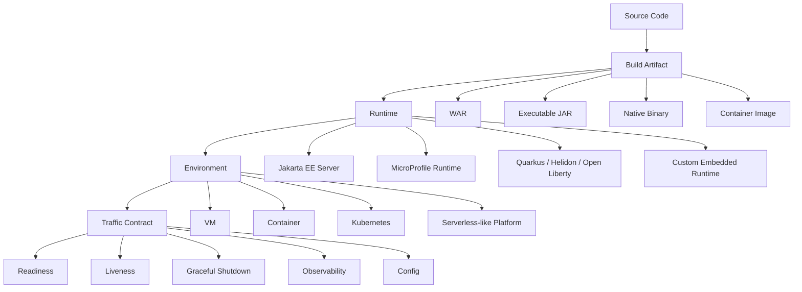
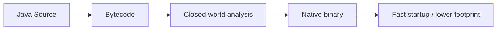
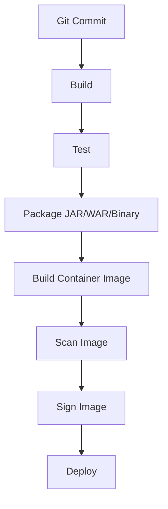
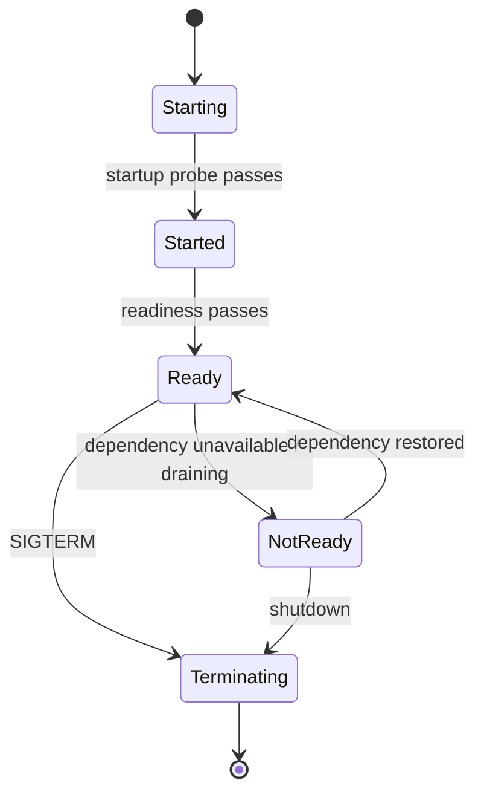
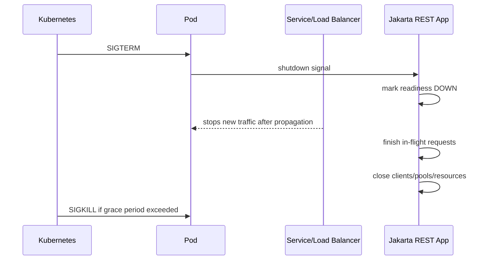
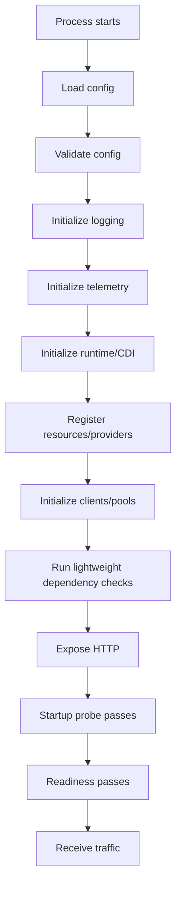
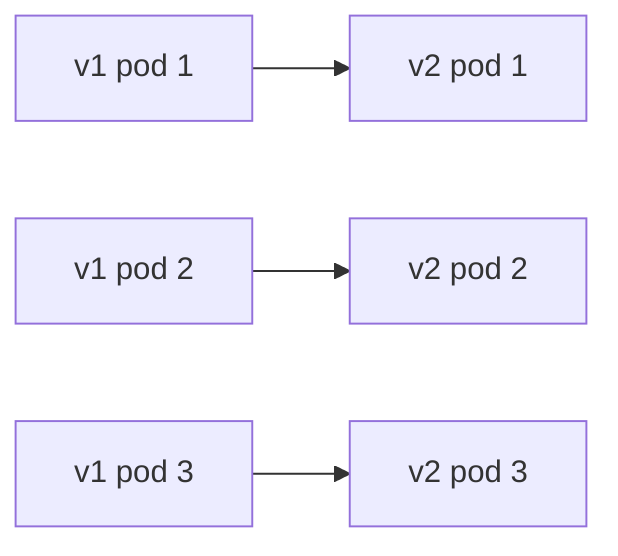
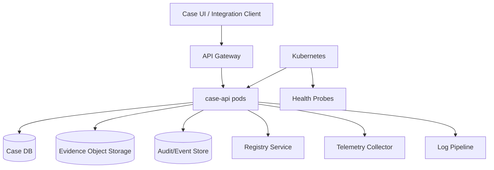

# Part 029 — Packaging, Deployment, and Cloud Runtime

> Target: setelah bagian ini, kita tidak hanya bisa membuat endpoint Jakarta REST, tetapi bisa memutuskan **bagaimana service itu dipaketkan, dijalankan, diamati, dihentikan, di-upgrade, dan dipulihkan** di runtime production.

Bagian sebelumnya membahas landscape implementation dan Quarkus REST. Sekarang kita masuk ke batas yang lebih operasional: **deployment contract**.

Banyak engineer membuat REST API yang secara lokal berjalan, tetapi gagal sebagai sistem production karena tidak jelas:

- siapa yang memiliki lifecycle aplikasi,
- bagaimana dependency disediakan,
- apa arti aplikasi "ready",
- kapan instance boleh menerima traffic,
- bagaimana shutdown dilakukan tanpa memutus request,
- bagaimana config dipisahkan dari artifact,
- bagaimana migration dijalankan,
- bagaimana compatibility dijaga selama rolling deployment.

Untuk engineer senior, packaging bukan detail terakhir. Packaging adalah bagian dari arsitektur.

---

## 1. Mental Model: Artifact, Runtime, Environment, and Contract

Service Jakarta REST production terdiri dari empat lapisan berbeda.



A common mistake is to collapse all of this into one sentence: "deploy the app".

A better model:

| Layer | Question | Example Decision |
|---|---|---|
| Artifact | What do we build? | WAR, bootable JAR, native binary, container image |
| Runtime | Who owns Jakarta REST lifecycle? | Payara, WildFly, Open Liberty, Quarkus, Jersey standalone |
| Environment | Where does it run? | VM, Docker, Kubernetes, managed platform |
| Traffic contract | When may it receive traffic? | readiness probe, startup probe, graceful shutdown |
| Failure contract | How is failure detected and recovered? | liveness, metrics, logs, tracing |
| Change contract | How do new versions roll out? | rolling update, canary, blue/green |

Dalam sistem kecil, ini tampak seperti overhead. Dalam sistem regulated, case-management, atau multi-service, ini menentukan apakah release bisa dipertanggungjawabkan.

---

## 2. Why Packaging Is an Architectural Decision

Packaging mempengaruhi:

1. **Startup time** — penting untuk scaling, rolling deployment, dan recovery.
2. **Memory footprint** — penting untuk density container.
3. **Patch responsibility** — siapa patch server/runtime?
4. **Portability** — apakah service bisa pindah runtime?
5. **Operational model** — apakah ops deploy server + app, atau app sebagai immutable image?
6. **Debuggability** — apakah stack trace, logs, metrics, dan dump mudah diambil?
7. **Security surface** — semakin banyak runtime bundled, semakin banyak dependency yang harus dipatch.
8. **Compliance** — artifact harus traceable dari commit, build, dependency, sampai deployed version.

Prinsipnya:

> A REST service is not production-ready when it has endpoints. It is production-ready when its runtime behavior is explicit under start, stop, load, failure, and change.

---

## 3. Packaging Options

### 3.1 WAR on Jakarta EE Application Server

Classic Jakarta EE deployment memakai `.war` yang dideploy ke application server.

Contoh struktur:

```txt
case-api.war
├── WEB-INF/
│   ├── classes/
│   │   └── com/example/caseapi/...
│   └── lib/
│       └── application-dependencies.jar
└── index.html
```

Resource Jakarta REST ditemukan oleh runtime melalui `Application`, `@ApplicationPath`, dan provider discovery.

```java
package com.example.caseapi.boundary;

import jakarta.ws.rs.ApplicationPath;
import jakarta.ws.rs.core.Application;

@ApplicationPath("/api")
public class CaseApiApplication extends Application {
}
```

Deployment URL biasanya:

```txt
https://example.gov/case-api/api/cases
```

Tergantung server dan context root, path final bisa tersusun dari:

```txt
scheme://host/{context-root}/{application-path}/{resource-path}
```

### When WAR makes sense

WAR cocok saat:

- organisasi sudah punya Jakarta EE server standard,
- ops team mengelola server lifecycle secara terpusat,
- beberapa aplikasi dideploy dalam satu server,
- integrasi dengan server-managed resource penting,
- portabilitas antar Jakarta EE-compatible runtimes lebih penting daripada startup ultra cepat.

### Strengths

- Jakarta EE programming model lengkap.
- Server menyediakan banyak concern: security, connection pool, transaction integration, naming, monitoring.
- Mature untuk enterprise deployment.
- Runtime patch bisa dilakukan di server layer.

### Weaknesses

- Deployment coupling ke server version.
- Multi-tenant server bisa membuat blast radius besar.
- Classloading issue lebih rumit.
- Context root dan server config sering menjadi sumber drift.
- Immutable deployment lebih sulit jika server dipakai bersama.

### Senior checklist for WAR

- Apakah context root eksplisit?
- Apakah dependency scope benar: `provided` vs bundled?
- Apakah server version kompatibel dengan namespace `jakarta.*`?
- Apakah runtime menyediakan Jakarta REST 4.0 atau versi lain?
- Apakah deployment descriptor masih diperlukan?
- Apakah logging tidak konflik dengan server logging?
- Apakah app bisa direstart tanpa restart seluruh server?
- Apakah health endpoint tersedia sebelum load balancer mengirim traffic?

---

## 4. Executable JAR / Bootable Runtime

Modern deployment sering memakai executable JAR atau runtime-bundled artifact.

Contoh model:

```txt
case-api-runner.jar
├── application classes
├── runtime bootstrap
├── Jakarta REST implementation
├── config loader
└── embedded HTTP server
```

Atau dengan layout framework-specific:

- Quarkus fast-jar,
- WildFly Bootable JAR,
- Open Liberty runnable JAR/container image,
- Payara Micro JAR,
- Helidon MP application JAR.

### When executable JAR makes sense

Executable JAR cocok saat:

- service dijalankan sebagai single deployable unit,
- container image dibuat per service,
- runtime version ingin dipin per aplikasi,
- deployment model cloud-native,
- startup dan memory lebih penting daripada shared server model.

### Strengths

- Artifact self-contained.
- Lebih mudah dibuat immutable image.
- Runtime version per service eksplisit.
- Cocok untuk Kubernetes.
- Lebih mudah direproduksi di CI/CD.

### Weaknesses

- Patch runtime berarti rebuild setiap service.
- Artifact lebih besar.
- Variasi runtime antar service bisa meningkat.
- Operational conventions harus dibuat sendiri atau via platform.

### Senior checklist

- Apakah dependency runtime dipin dan bisa diaudit?
- Apakah artifact reproducible?
- Apakah startup command jelas?
- Apakah signal handling benar?
- Apakah shutdown hook cukup untuk drain request?
- Apakah JVM options dikelola lewat environment?
- Apakah config externalized?
- Apakah image berisi tool/debug yang tidak perlu?

---

## 5. Native Image

Native image mengompilasi aplikasi menjadi binary native, biasanya dengan GraalVM Native Image atau build pipeline framework.

Conceptual model:



### Benefits

- Startup sangat cepat.
- Memory footprint bisa lebih rendah.
- Cocok untuk scale-to-zero, short-lived workload, dan dense deployment.

### Costs

- Build lebih lambat.
- Reflection/proxy/resource loading perlu metadata.
- Debuggability berbeda.
- Dynamic behavior Java harus dipahami.
- Beberapa provider atau library mungkin butuh configuration.
- Runtime behavior bisa berbeda dari JVM mode.

### Jakarta REST-specific concerns

Jakarta REST sangat bergantung pada:

- annotation scanning,
- reflection,
- provider discovery,
- resource method metadata,
- JSON binding/serialization,
- CDI integration,
- proxy/interceptor behavior.

Framework seperti Quarkus mengurangi cost ini dengan build-time indexing dan metadata generation. Tetapi rule pentingnya:

> Native image is not just a packaging switch. It is a runtime behavior change that must be tested like a separate target.

### Native image checklist

- Jalankan integration test dalam native mode.
- Test JSON serialization untuk semua DTO penting.
- Test exception mapper.
- Test filters/interceptors.
- Test multipart/file upload.
- Test SSE/streaming jika dipakai.
- Test TLS/outbound client.
- Test metrics/tracing export.
- Test startup, shutdown, memory, dan CPU.

---

## 6. Container Image as Deployment Artifact

Di platform modern, artifact production sering bukan WAR/JAR, melainkan **container image**.



Image sebaiknya immutable, versioned, traceable, dan minimal.

### Minimal Dockerfile example for JVM application

```dockerfile
FROM eclipse-temurin:21-jre

WORKDIR /app
COPY target/case-api-runner.jar /app/app.jar

USER 10001
EXPOSE 8080

ENTRYPOINT ["java", "-jar", "/app/app.jar"]
```

Untuk production, ini belum cukup. Kita perlu:

- JVM memory settings,
- timezone/locale policy,
- CA certificates,
- non-root user,
- read-only filesystem jika memungkinkan,
- logging to stdout/stderr,
- health endpoints,
- SBOM/scanning,
- image signing,
- reproducible tags.

### Container image rules

| Rule | Reason |
|---|---|
| Jangan pakai `latest` untuk production | Tidak traceable |
| Jalankan sebagai non-root | Kurangi impact exploit |
| Jangan simpan secret di image | Secret harus runtime-bound |
| Jangan tulis log ke file lokal | Container log collector membaca stdout/stderr |
| Jangan embed environment config | Image harus reusable antar environment |
| Pin base image | Patch/security audit jelas |
| Scan dependencies dan OS packages | Supply chain risk |
| Expose health endpoints | Orchestrator perlu lifecycle signal |

---

## 7. Runtime Configuration

Konfigurasi service harus dipisahkan dari artifact.

Contoh config categories:

| Category | Example | Change Frequency | Secret? |
|---|---|---:|---:|
| Port | `HTTP_PORT=8080` | Rare | No |
| Database URL | `DB_URL=...` | Environment-specific | Often sensitive |
| External API URL | `CASE_REGISTRY_URL=...` | Environment-specific | No |
| Credentials | `DB_PASSWORD=...` | Rotated | Yes |
| Feature flag | `ENABLE_ASYNC_REVIEW=true` | Frequent | No |
| Timeout | `REGISTRY_TIMEOUT_MS=700` | Tuned | No |
| Sampling | `TRACE_SAMPLE_RATE=0.05` | Tuned | No |

### MicroProfile Config model

Dalam ekosistem Jakarta/MicroProfile, MicroProfile Config sering menjadi model standar untuk externalized configuration.

```java
package com.example.caseapi.config;

import org.eclipse.microprofile.config.inject.ConfigProperty;

import jakarta.enterprise.context.ApplicationScoped;
import java.time.Duration;

@ApplicationScoped
public class RegistryClientConfig {

    @ConfigProperty(name = "registry.base-url")
    String baseUrl;

    @ConfigProperty(name = "registry.timeout-ms", defaultValue = "700")
    long timeoutMs;

    public String baseUrl() {
        return baseUrl;
    }

    public Duration timeout() {
        return Duration.ofMillis(timeoutMs);
    }
}
```

### Config anti-patterns

- Hardcoding base URL in resource class.
- Reading environment variables directly in every service class.
- Mixing config resolution with domain logic.
- Using default values for critical secrets.
- Having different config names per service for same concern.
- Changing artifact for each environment.
- Not recording effective config at startup.

### Startup config report

At startup, log non-sensitive effective configuration:

```txt
service=case-api version=1.8.2 commit=6f8a9c1
http.port=8080
registry.base-url=https://registry.internal
registry.timeout-ms=700
database.pool.max-size=20
tracing.enabled=true
```

Never log:

- password,
- token,
- private key,
- full connection string with credentials,
- customer/person data,
- secret headers.

---

## 8. Environment Contract

A REST service must declare what it needs from the environment.

Example contract:

```yaml
runtime:
  java: "21"
  jakartaRest: "4.0"
  memory: "512Mi"
  cpu: "500m"
network:
  inboundPort: 8080
  outbound:
    - name: case-registry
      urlConfig: registry.base-url
    - name: evidence-store
      urlConfig: evidence.base-url
secrets:
  - db.password
  - registry.client-secret
storage:
  ephemeralTemp: true
health:
  readinessPath: /q/health/ready
  livenessPath: /q/health/live
observability:
  logs: stdout
  metrics: prometheus
  tracing: opentelemetry
```

Ini bukan sekadar dokumentasi. Ini membantu:

- platform team menyediakan runtime,
- security team review outbound dependency,
- SRE membuat SLO,
- compliance team trace dependency,
- on-call memahami blast radius.

---

## 9. Health Endpoints: Liveness, Readiness, Startup

Health endpoint bukan dekorasi. Health endpoint adalah **contract dengan orchestrator**.



### Liveness

Liveness menjawab:

> Is this process so broken that it should be restarted?

Liveness sebaiknya **tidak** bergantung pada downstream dependency seperti database atau external API.

Bad liveness:

```txt
liveness fails if database is down
```

Kenapa buruk?

- Jika database down, semua pod restart.
- Restart tidak memperbaiki database.
- Terjadi cascading failure.
- Service churn meningkat.

Better liveness:

- process alive,
- event loop/worker not deadlocked,
- basic runtime alive,
- critical internal fatal state absent.

### Readiness

Readiness menjawab:

> May this instance receive traffic now?

Readiness boleh mempertimbangkan:

- database reachable,
- migration completed,
- required config valid,
- connection pool initialized,
- cache warmed if required,
- service not draining,
- dependency critical available.

### Startup

Startup probe menjawab:

> Is the application still starting, so liveness should not kill it yet?

Ini penting untuk aplikasi dengan startup lama:

- heavy CDI initialization,
- schema validation,
- cache warmup,
- native image vs JVM difference,
- large provider scanning.

Kubernetes membedakan liveness, readiness, dan startup probes; probe dilakukan periodik oleh kubelet, dan hasilnya dapat membuat Kubernetes restart container yang unhealthy atau berhenti mengirim traffic ke container yang belum ready.

---

## 10. MicroProfile Health Example

Jika runtime mendukung MicroProfile Health, kita bisa memisahkan liveness dan readiness.

```java
package com.example.caseapi.health;

import org.eclipse.microprofile.health.HealthCheck;
import org.eclipse.microprofile.health.HealthCheckResponse;
import org.eclipse.microprofile.health.Liveness;

import jakarta.enterprise.context.ApplicationScoped;

@Liveness
@ApplicationScoped
public class ProcessLivenessCheck implements HealthCheck {

    @Override
    public HealthCheckResponse call() {
        return HealthCheckResponse.up("process");
    }
}
```

Readiness check:

```java
package com.example.caseapi.health;

import org.eclipse.microprofile.health.HealthCheck;
import org.eclipse.microprofile.health.HealthCheckResponse;
import org.eclipse.microprofile.health.Readiness;

import jakarta.enterprise.context.ApplicationScoped;
import javax.sql.DataSource;
import java.sql.Connection;

@Readiness
@ApplicationScoped
public class DatabaseReadinessCheck implements HealthCheck {

    private final DataSource dataSource;

    public DatabaseReadinessCheck(DataSource dataSource) {
        this.dataSource = dataSource;
    }

    @Override
    public HealthCheckResponse call() {
        try (Connection ignored = dataSource.getConnection()) {
            return HealthCheckResponse.up("database");
        } catch (Exception ex) {
            return HealthCheckResponse.down("database");
        }
    }
}
```

But be careful: readiness checks must be cheap and bounded.

A readiness check that blocks for 10 seconds is itself a production bug.

---

## 11. Kubernetes Probe Example

```yaml
apiVersion: apps/v1
kind: Deployment
metadata:
  name: case-api
spec:
  replicas: 3
  selector:
    matchLabels:
      app: case-api
  template:
    metadata:
      labels:
        app: case-api
    spec:
      terminationGracePeriodSeconds: 45
      containers:
        - name: case-api
          image: registry.example.com/case-api:1.8.2
          ports:
            - containerPort: 8080
          startupProbe:
            httpGet:
              path: /q/health/started
              port: 8080
            failureThreshold: 30
            periodSeconds: 2
          livenessProbe:
            httpGet:
              path: /q/health/live
              port: 8080
            periodSeconds: 10
            timeoutSeconds: 2
          readinessProbe:
            httpGet:
              path: /q/health/ready
              port: 8080
            periodSeconds: 5
            timeoutSeconds: 2
          lifecycle:
            preStop:
              exec:
                command: ["/bin/sh", "-c", "sleep 10"]
```

Important nuance:

- `startupProbe` protects slow startup from premature liveness restarts.
- `readinessProbe` controls traffic routing.
- `livenessProbe` controls restart.
- `terminationGracePeriodSeconds` gives app time to drain.
- `preStop` can help load balancer propagation but is not a substitute for graceful shutdown.

---

## 12. Graceful Shutdown

A production REST service must handle termination.

Typical Kubernetes shutdown flow:



### What graceful shutdown should do

- Stop accepting new work.
- Mark readiness down.
- Let in-flight request finish within budget.
- Stop async jobs or hand them off.
- Flush logs/metrics/traces.
- Close outbound clients.
- Close database pool.
- Release temporary files.
- Emit shutdown event.

### What it should not do

- Start long-running reconciliation.
- Run schema migration.
- Wait forever for stuck request.
- Ignore SIGTERM.
- Return ready while draining.

### Resource design implication

If an endpoint starts a long operation synchronously, graceful shutdown becomes difficult.

Better design:

```txt
POST /cases/{caseId}/reviews
202 Accepted
Location: /cases/{caseId}/reviews/{reviewId}
```

Instead of:

```txt
POST /cases/{caseId}/reviews/perform-all-now
200 OK after 4 minutes
```

Deployment design feeds back into API design.

---

## 13. Startup Sequence for Jakarta REST Service

A robust startup sequence:



Common failure:

```txt
Expose HTTP first, discover broken config after receiving traffic.
```

Better:

- validate critical config before readiness,
- fail fast on invalid required config,
- do not fail startup for optional downstream unless explicitly required,
- keep readiness separate from liveness.

---

## 14. Deployment Compatibility and Rolling Updates

REST APIs often run with mixed versions during rolling deployment.

For a period, production may have:

```txt
case-api v1.8.1 and v1.8.2 both serving traffic
```

Therefore, every release must tolerate:

- old client → new server,
- new client → old server,
- old server and new server sharing database,
- old server and new server emitting events,
- retries landing on different instance,
- asynchronous job created by old version and completed by new version.

### Compatibility matrix

| Compatibility Surface | Risk During Rolling Deploy | Mitigation |
|---|---|---|
| Request DTO | New field required too early | Add optional first, enforce later |
| Response DTO | Removed/renamed field | Additive change only |
| Database schema | New code expects missing column | Expand/contract migration |
| Event schema | Consumer cannot parse event | Schema versioning |
| Idempotency key store | Different algorithm | Shared stable key model |
| Error response | Client parser breaks | Stable problem contract |
| Cache/ETag | Stale object versions | Versioned validators |

### Expand/contract rule

For DB-backed APIs:

1. Expand schema in backward-compatible way.
2. Deploy code that can read/write both old and new forms if needed.
3. Backfill data.
4. Switch reads.
5. Stop writing old form.
6. Contract schema later.

Do not deploy code that requires a schema change before the schema is available in every environment.

---

## 15. Deployment Strategies

### 15.1 Rolling Deployment

Most common strategy.



Strengths:

- Simple.
- Resource-efficient.
- Standard Kubernetes behavior.

Weaknesses:

- Mixed version period.
- Harder rollback if DB migration is incompatible.
- Requires strict backward compatibility.

### 15.2 Blue/Green

Two environments:

```txt
blue = current production
green = new version
```

Traffic switches after validation.

Strengths:

- Fast rollback if no irreversible migration.
- Cleaner validation before cutover.

Weaknesses:

- More infrastructure.
- State/data compatibility still hard.
- Long-running sessions/streams require care.

### 15.3 Canary

Gradually route small percentage to new version.

```txt
1% -> 5% -> 25% -> 50% -> 100%
```

Strengths:

- Limits blast radius.
- Observability-driven rollout.
- Useful for risky performance/provider/runtime changes.

Weaknesses:

- Requires strong metrics.
- Debugging mixed behavior can be harder.
- Requires request routing capability.

### 15.4 Shadow Traffic

Copy production traffic to new service without affecting users.

Good for:

- serialization performance test,
- new provider pipeline,
- new runtime migration,
- contract comparison,
- response diffing.

Danger:

- Must not mutate state.
- Must not call external side-effecting dependencies.
- Must handle sensitive data correctly.

---

## 16. Cloud Runtime Contract for Jakarta REST

A cloud runtime expects services to follow predictable rules.

### Inbound rules

- Listen on configured port.
- Return health quickly.
- Handle SIGTERM.
- Log to stdout/stderr.
- Expose metrics/traces if configured.
- Do not rely on local persistent disk.
- Do not assume single instance.
- Do not assume stable local IP.

### Outbound rules

- Use configured base URLs.
- Set timeouts.
- Propagate correlation IDs.
- Respect retry budgets.
- Use TLS properly.
- Fail closed for security-sensitive calls.
- Classify downstream failures.

### State rules

- Store durable state in external durable systems.
- Treat local filesystem as ephemeral.
- Treat memory cache as disposable.
- Avoid in-memory singleton state for correctness.
- Make scheduled jobs cluster-safe.

### Jakarta REST-specific rules

- Resource classes must not hold mutable request state.
- Singleton providers must be thread-safe.
- Filters must not block indefinitely.
- Exception mappers must be deterministic.
- Message body providers must avoid unbounded buffering.
- Streaming responses must handle client disconnect.
- SSE broadcaster must handle slow clients.

---

## 17. Environment Variables and Runtime Flags

JVM service in container needs runtime tuning.

Example:

```yaml
env:
  - name: JAVA_TOOL_OPTIONS
    value: >-
      -XX:MaxRAMPercentage=75
      -XX:+ExitOnOutOfMemoryError
      -Dfile.encoding=UTF-8
      -Duser.timezone=UTC
  - name: QUARKUS_HTTP_PORT
    value: "8080"
  - name: REGISTRY_BASE_URL
    valueFrom:
      configMapKeyRef:
        name: case-api-config
        key: registry-base-url
  - name: DB_PASSWORD
    valueFrom:
      secretKeyRef:
        name: case-api-secrets
        key: db-password
```

### JVM memory in containers

Key concern:

- heap is not total memory,
- metaspace, thread stacks, direct buffers, native memory also matter,
- JSON serialization and multipart buffers can spike memory,
- file upload must avoid reading whole body into heap.

Rough budget:

```txt
container memory = heap + metaspace + thread stacks + direct buffers + code cache + native libs + margin
```

Do not set `-Xmx` equal to container limit unless you want OOMKilled risk.

---

## 18. Connection Pools in Cloud Runtime

REST API often has outbound pools:

- database pool,
- HTTP client connection pool,
- message broker pool,
- object storage client pool.

Cloud scaling changes pool math.

If one instance has DB pool max 30 and replicas become 20:

```txt
total possible DB connections = 30 * 20 = 600
```

If database max connection is 300, autoscaling can take the database down.

### Pool sizing checklist

- What is max replica count?
- What is DB max connection?
- What is per-instance pool max?
- What is expected concurrency?
- What is timeout waiting for connection?
- What happens when pool is exhausted?
- Is pool readiness check causing connection storm?

### Better readiness check

Bad:

```java
// Every readiness probe opens full DB transaction with expensive query.
```

Better:

```java
// Lightweight bounded check, maybe cached for a few seconds.
```

Health checks should not become DDoS against your own dependencies.

---

## 19. Migrations and Startup

Schema migration strategy matters.

### Option A — App runs migration at startup

Pros:

- Simple for small systems.
- Migration tied to deployment.

Cons:

- Multiple replicas can race.
- Startup time increases.
- Failed migration breaks rollout.
- Requires high DB privilege in app runtime.
- Bad fit for strict change control.

### Option B — Separate migration job

Pros:

- Clear operational boundary.
- Better auditability.
- Can be approved separately.
- App runtime can have lower DB privileges.

Cons:

- More pipeline complexity.
- Requires compatibility discipline.

For regulated systems, prefer migration as an explicit deployment step with audit trail.

### Migration invariant

> Application deployment must not require every instance to switch version at exactly the same time.

This implies expand/contract and backward-compatible migration.

---

## 20. Static Assets and OpenAPI

REST service may expose:

- OpenAPI document,
- Swagger UI-like docs,
- health endpoints,
- metrics endpoints,
- admin endpoints.

Keep boundaries clear:

```txt
/api/*          public/application API
/q/health/*     platform health
/q/metrics      platform metrics
/openapi        contract document
/admin/*        restricted admin API
```

Do not mix admin and public resources without explicit security boundary.

### OpenAPI deployment concerns

- Does OpenAPI reflect deployed version?
- Is internal field accidentally documented?
- Are security requirements documented?
- Are error response schemas included?
- Are deprecated fields marked?
- Is the spec generated at build time or runtime?
- Is contract diff checked in CI?

---

## 21. Secrets

Secrets must not be:

- committed,
- baked into image,
- logged,
- exposed through `/config`,
- included in exception messages,
- placed in query parameters,
- propagated to clients.

For Jakarta REST:

- do not log `Authorization`, `Cookie`, `Set-Cookie`, API keys,
- do not echo credential fields in validation errors,
- scrub multipart metadata if user-controlled,
- treat `X-Forwarded-*` headers as untrusted unless set by trusted proxy,
- prefer short-lived tokens and rotation.

### Secret rotation

Can service reload secret without restart?

Possible models:

- restart on secret change,
- config reload polling,
- sidecar/volume update,
- dynamic credential provider.

For database credentials, runtime behavior must be tested:

- existing pool connections,
- new connections,
- failed auth burst,
- readiness during rotation,
- rollback.

---

## 22. Logging Contract in Containers

In containerized runtime:

- log to stdout/stderr,
- use structured logs,
- include correlation ID,
- include service/version/environment,
- do not include request body by default,
- do not include secrets,
- preserve error type and status.

Example JSON log:

```json
{
  "timestamp": "2026-06-27T10:12:00Z",
  "level": "INFO",
  "service": "case-api",
  "version": "1.8.2",
  "correlationId": "b47d3c6e4f",
  "method": "POST",
  "path": "/api/cases/C-2026-001/escalations",
  "status": 202,
  "durationMs": 38
}
```

Logging is covered deeper in Part 030, but deployment must ensure logs are collectable.

---

## 23. Time, Locale, and Encoding

Production Java REST services must standardize:

- timezone,
- locale,
- character encoding,
- clock source.

Recommended defaults:

```txt
-Duser.timezone=UTC
-Dfile.encoding=UTF-8
```

API contract should expose timestamps as:

```txt
2026-06-27T10:12:00Z
```

Avoid server-local timezone in API responses.

For regulated workflows, record:

- event time,
- ingestion time,
- decision time,
- actor time zone if legally relevant,
- clock source if required.

---

## 24. File System Contract

Containers usually have ephemeral filesystem.

For Jakarta REST upload/download:

- temp upload files may disappear on restart,
- local disk may be read-only,
- multiple replicas do not share local files,
- large temp files can fill container disk,
- cleanup must be explicit.

If upload must survive restart:

- stream to object storage,
- use durable metadata table,
- use resumable upload session,
- avoid keeping only local temp path.

Bad:

```java
Path file = Path.of("/tmp/evidence-" + id);
// assume available tomorrow
```

Better:

```txt
POST /cases/{caseId}/evidence-uploads
PUT /cases/{caseId}/evidence-uploads/{uploadId}/content
POST /cases/{caseId}/evidence-uploads/{uploadId}/complete
```

---

## 25. Horizontal Scaling and Stateful Assumptions

REST service should be horizontally scalable by default.

Bad assumptions:

- in-memory map stores idempotency keys,
- local scheduler runs once globally,
- SSE subscriptions require sticky sessions without design,
- local cache is source of truth,
- local temp file stores workflow state,
- singleton resource stores request context.

Better:

| Concern | Production Store |
|---|---|
| Idempotency key | Database/Redis with TTL |
| Job state | Durable job table/queue |
| Evidence file | Object storage |
| Session | External identity/token service |
| Audit | Append-only audit/event store |
| SSE fanout | Broker/pub-sub, or sticky routing with explicit limits |

---

## 26. Runtime Profiles

You may need distinct runtime profiles:

| Profile | Purpose | Notes |
|---|---|---|
| local | Developer feedback | Fake/minimal dependencies |
| test | Automated tests | Deterministic config |
| staging | Production-like | Full observability/security |
| production | Live traffic | Strict controls |
| migration | DB/schema jobs | Different permissions |
| smoke | Post-deploy validation | Synthetic user journeys |

Do not let local profile semantics leak into production.

Example danger:

```txt
local profile disables auth
production accidentally starts with local profile
```

Add startup guardrails:

```java
if (environment.isProduction() && security.isDisabled()) {
    throw new IllegalStateException("Refusing to start production with security disabled");
}
```

---

## 27. CI/CD Pipeline for Jakarta REST Service

A solid pipeline:


REST-specific gates:

- OpenAPI diff check,
- status code regression test,
- error schema regression test,
- content negotiation tests,
- provider registration tests,
- security headers tests,
- authz policy tests,
- serialization compatibility tests,
- native image tests if applicable.

---

## 28. Smoke Tests After Deployment

Post-deploy smoke tests should prove the service is usable from the outside.

Example smoke scenarios:

1. `GET /health/ready` returns ready.
2. `GET /api/version` returns expected version/commit.
3. `GET /api/cases/{knownSyntheticCase}` returns expected schema.
4. `POST /api/cases/{caseId}/validation-runs` works on synthetic case.
5. Auth failure returns 401 with safe error.
6. Forbidden access returns 403.
7. Invalid request returns problem response.
8. Outbound dependency call emits trace.

Avoid destructive smoke tests against real regulated data.

Use synthetic tenant/case.

---

## 29. Deployment Failure Modes

### Failure: Pod starts but never ready

Possible causes:

- DB unavailable,
- migration missing,
- invalid config,
- readiness check too strict,
- dependency DNS failure,
- TLS truststore missing,
- secret not mounted,
- startup too slow.

### Failure: Pod ready but requests fail

Possible causes:

- readiness too shallow,
- provider not registered,
- auth config wrong,
- base path mismatch,
- network policy blocks outbound,
- classpath version conflict,
- CORS misconfigured.

### Failure: Rolling deploy causes intermittent errors

Possible causes:

- mixed version incompatibility,
- DB migration not backward-compatible,
- old and new DTO mismatch,
- load balancer sends traffic before readiness,
- graceful shutdown broken,
- client retry lands on instance with different behavior.

### Failure: Restart storm

Possible causes:

- liveness depends on DB,
- memory limit too low,
- startup probe missing,
- health endpoint slow,
- deadlock in provider/filter,
- `ExitOnOutOfMemoryError` with memory leak.

---

## 30. Production Deployment Checklist

### Artifact

- [ ] Build reproducible.
- [ ] Version and commit embedded.
- [ ] Dependency versions pinned.
- [ ] SBOM generated.
- [ ] Vulnerability scan passed or exceptions approved.
- [ ] Image signed if required.

### Runtime

- [ ] Java version explicit.
- [ ] Jakarta REST/runtime version explicit.
- [ ] JVM flags reviewed.
- [ ] Memory budget tested.
- [ ] Startup time measured.
- [ ] Native image tested separately if used.

### Config

- [ ] Required config validated at startup.
- [ ] Secrets externalized.
- [ ] Non-sensitive effective config logged.
- [ ] Production guardrails active.
- [ ] Timezone/encoding standardized.

### Health

- [ ] Liveness does not depend on downstream dependencies.
- [ ] Readiness reflects ability to accept traffic.
- [ ] Startup probe configured if startup may be slow.
- [ ] Health checks bounded and cheap.
- [ ] Readiness goes down during drain.

### Network

- [ ] Inbound port documented.
- [ ] Outbound dependencies documented.
- [ ] Timeouts configured.
- [ ] TLS trust configured.
- [ ] Proxy headers trusted only from trusted infrastructure.

### Shutdown

- [ ] SIGTERM handled.
- [ ] In-flight request drain tested.
- [ ] Async jobs handled.
- [ ] Connection pools closed.
- [ ] Logs/traces flushed.

### Compatibility

- [ ] Rolling deploy compatibility reviewed.
- [ ] DB migration expand/contract safe.
- [ ] API contract diff approved.
- [ ] Error response compatibility preserved.
- [ ] Event/schema compatibility preserved.

### Observability

- [ ] Structured logs emitted.
- [ ] Metrics scraped.
- [ ] Tracing propagated.
- [ ] Correlation ID present.
- [ ] Deployment/version labels present.

---

## 31. Case Management Deployment Example

Imagine a regulatory case API:

```txt
POST /api/cases/{caseId}/escalations
GET  /api/cases/{caseId}/timeline
POST /api/cases/{caseId}/evidence
GET  /api/cases/{caseId}/decisions/{decisionId}
```

Deployment-sensitive requirements:

- escalation command must be idempotent,
- evidence upload must survive pod restart,
- decision record must not disappear during rolling deploy,
- audit logs must include deployed version,
- old and new versions must agree on state transition rules during rollout,
- error shape must be stable for downstream case UI,
- shutdown must not lose in-flight audit events.

Production architecture:



Key invariant:

> A deployment may change implementation, but must not weaken evidentiary traceability.

That means every mutation should record:

- request correlation ID,
- authenticated actor,
- endpoint/action,
- state before/after or transition reference,
- deployed service version,
- timestamp,
- outcome,
- failure reason if rejected.

---

## 32. What Top Engineers Look For

A senior engineer reviewing deployment does not ask only:

> Does the endpoint work?

They ask:

- Can we roll this back?
- Can v1 and v2 run together?
- What happens if the pod dies mid-request?
- What happens if the database is down?
- Will liveness restart all pods during downstream outage?
- Are secrets externalized and rotated?
- Can we trace a user complaint to a deployed version?
- Can the service drain safely?
- Can health checks cause cascading failure?
- Does startup fail fast on invalid config?
- Does native image behave the same as JVM mode?
- Is this runtime-specific dependency intentional?

That is the difference between application coding and production engineering.

---

## 33. Exercises

### Exercise 1 — Packaging ADR

Write an ADR deciding between:

- WAR on Jakarta EE server,
- executable JAR,
- Quarkus container image,
- native image.

Include:

- startup requirement,
- memory requirement,
- patch model,
- portability requirement,
- operational ownership,
- testing strategy.

### Exercise 2 — Probe Design

For an API with DB + external registry dependency, define:

- liveness check,
- readiness check,
- startup check,
- timeout for each,
- failure consequence.

Explain why DB should or should not affect each probe.

### Exercise 3 — Rolling Deployment Compatibility

Given a new response field `decisionRationaleCode`, design a safe rollout:

1. schema migration,
2. server write behavior,
3. server read behavior,
4. client behavior,
5. deprecation of old field if any.

### Exercise 4 — Graceful Shutdown Test

Design a test that sends long-running requests, then sends SIGTERM, and verifies:

- readiness becomes false,
- new request is rejected or not routed,
- in-flight request completes or times out cleanly,
- audit event is not lost.

---

## 34. Summary

Packaging and deployment are not afterthoughts. They are part of the service contract.

A production Jakarta REST service needs:

- explicit artifact strategy,
- explicit runtime ownership,
- externalized config,
- health probes with correct semantics,
- graceful shutdown,
- rolling deployment compatibility,
- safe migration strategy,
- secure secret handling,
- container-friendly logging,
- horizontal-scaling-safe state model,
- traceable deployment metadata.

The strongest mental model:

> Jakarta REST defines how HTTP resources are implemented in Java. Production deployment defines when, where, and under what operational guarantees those resources are safe to receive traffic.

---

## References

- Jakarta RESTful Web Services 4.0 Specification: https://jakarta.ee/specifications/restful-ws/4.0/
- Jakarta EE Core Profile 11: https://jakarta.ee/specifications/coreprofile/11/
- Kubernetes Liveness, Readiness, and Startup Probes: https://kubernetes.io/docs/concepts/workloads/pods/probes/
- Kubernetes Configure Probes: https://kubernetes.io/docs/tasks/configure-pod-container/configure-liveness-readiness-startup-probes/
- MicroProfile Health Specification: https://microprofile.io/specifications/microprofile-health/
