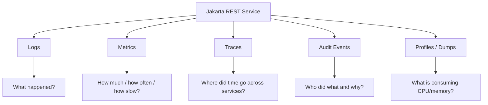
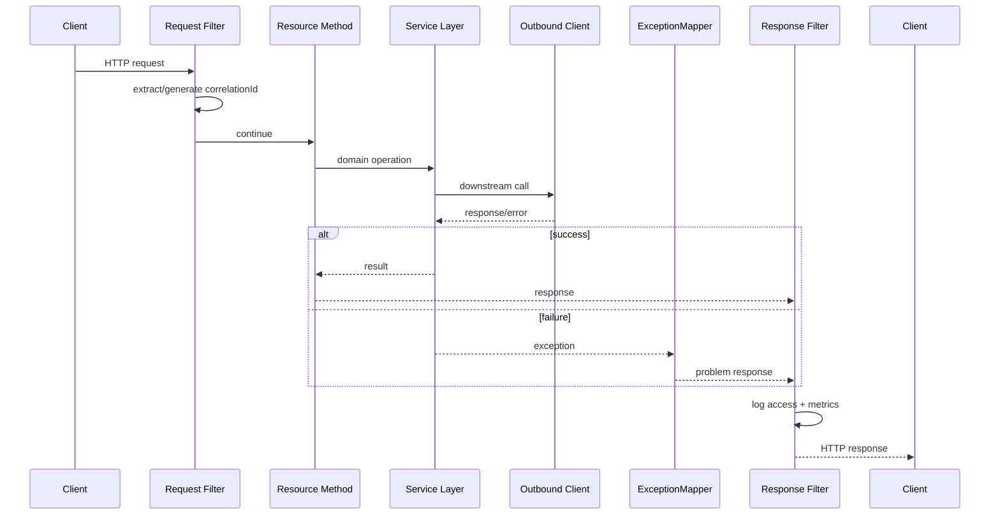
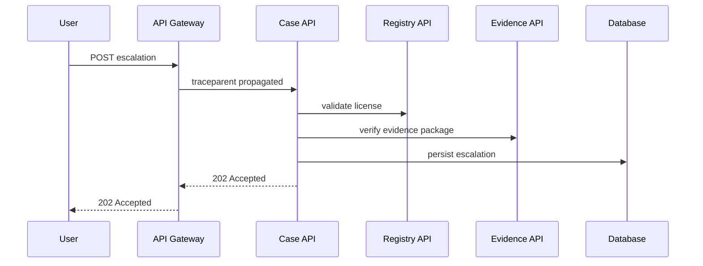
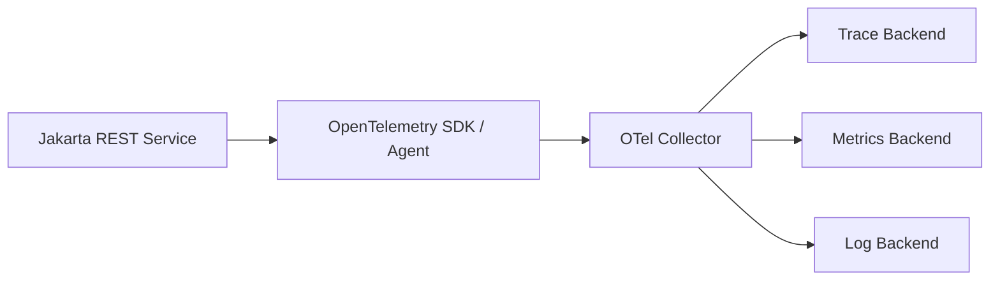
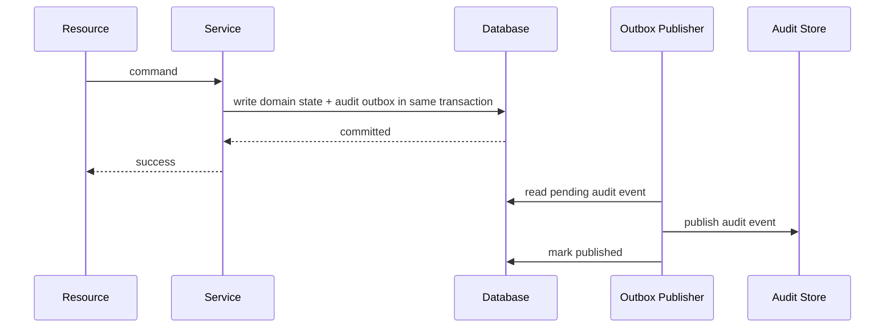

# Part 030 — Observability

> Target: setelah bagian ini, kita bisa merancang REST service yang tidak hanya berjalan, tetapi **dapat dipahami saat gagal, lambat, overload, diserang, atau menghasilkan keputusan bisnis yang dipertanyakan**.

Observability bukan sekadar memasang log. Observability adalah kemampuan sistem untuk menjawab pertanyaan operasional dari data yang dihasilkan runtime.

Untuk Jakarta REST service, observability harus menjawab:

- request mana yang gagal?
- kenapa gagal?
- siapa actor-nya?
- dependency mana yang lambat?
- apakah error berasal dari client, server, atau downstream?
- apakah deployment baru menaikkan latency?
- endpoint mana yang paling mahal?
- apakah retry memperburuk overload?
- apakah audit event tercatat?
- apakah response error aman untuk user tetapi cukup informatif untuk operator?

---

## 1. Observability Mental Model

Observability terdiri dari beberapa signal.



Each signal has different purpose.

| Signal | Best For | Bad For |
|---|---|---|
| Logs | discrete facts, errors, decisions | high-cardinality time series |
| Metrics | trends, alerts, SLOs | reconstructing individual request |
| Traces | cross-service latency and causality | complete audit/legal record |
| Audit events | business/legal accountability | low-level debugging noise |
| Profiles | CPU/memory bottleneck | user-facing request history |

Strong observability combines them using shared identifiers:

- `traceId`,
- `spanId`,
- `correlationId`,
- `requestId`,
- `actorId`,
- `caseId`,
- `serviceVersion`.

---

## 2. Observability Is a Contract, Not a Library

Installing OpenTelemetry or adding JSON logs is not enough.

A production observability contract defines:

1. what is logged,
2. what is never logged,
3. what metrics exist,
4. what labels are allowed,
5. how correlation is propagated,
6. how errors are classified,
7. how audit differs from debug log,
8. how dashboards and alerts map to SLOs,
9. how deployment/version is visible,
10. how sensitive data is protected.

Without a contract, observability becomes accidental.

Symptoms:

- each endpoint logs differently,
- log search cannot connect inbound and outbound calls,
- metrics cardinality explodes,
- dashboards look good while users fail,
- audit data is mixed with debug logs,
- errors expose internal exception names to clients,
- trace data exists but misses important attributes.

---

## 3. Request Lifecycle Observability

A Jakarta REST request passes through many points.



Observable request path should capture:

- method,
- route template,
- status,
- duration,
- response size if available,
- actor/security principal,
- tenant/org if applicable,
- correlation ID,
- trace ID,
- error category,
- deployment version,
- important domain reference such as case ID.

Do not use raw URI path as primary metric label if it contains IDs.

Bad metric label:

```txt
path=/api/cases/C-2026-000001/evidence/E-8899
```

Good metric label:

```txt
route=/api/cases/{caseId}/evidence/{evidenceId}
```

---

## 4. Correlation ID, Request ID, Trace ID

These terms are related but not identical.

| ID | Scope | Purpose |
|---|---|---|
| Request ID | one inbound HTTP request | local request identification |
| Correlation ID | business/user journey | connect multiple operations |
| Trace ID | distributed trace | connect spans across services |
| Span ID | one operation in trace | parent-child timing |
| Audit ID | durable business event | legal/business accountability |

A simple rule:

- Use trace ID for distributed tracing.
- Use correlation ID for user/business flow.
- Use audit ID for durable decision/action record.

They may be equal in simple systems, but do not assume they always are.

### Correlation filter example

```java
package com.example.caseapi.observability;

import jakarta.annotation.Priority;
import jakarta.ws.rs.Priorities;
import jakarta.ws.rs.container.ContainerRequestContext;
import jakarta.ws.rs.container.ContainerRequestFilter;
import jakarta.ws.rs.container.ContainerResponseContext;
import jakarta.ws.rs.container.ContainerResponseFilter;
import jakarta.ws.rs.ext.Provider;

import java.io.IOException;
import java.util.Optional;
import java.util.UUID;

@Provider
@Priority(Priorities.AUTHENTICATION - 100)
public class CorrelationIdFilter implements ContainerRequestFilter, ContainerResponseFilter {

    public static final String HEADER = "X-Correlation-ID";
    public static final String PROPERTY = "correlationId";

    @Override
    public void filter(ContainerRequestContext requestContext) throws IOException {
        String correlationId = Optional.ofNullable(requestContext.getHeaderString(HEADER))
                .filter(this::isAcceptableCorrelationId)
                .orElseGet(() -> UUID.randomUUID().toString());

        requestContext.setProperty(PROPERTY, correlationId);
    }

    @Override
    public void filter(ContainerRequestContext requestContext,
                       ContainerResponseContext responseContext) throws IOException {
        Object correlationId = requestContext.getProperty(PROPERTY);
        if (correlationId != null) {
            responseContext.getHeaders().putSingle(HEADER, correlationId.toString());
        }
    }

    private boolean isAcceptableCorrelationId(String value) {
        return value.length() <= 128 && value.matches("[A-Za-z0-9._:-]+{}");
    }
}
```

Note: the regex above is intentionally restrictive. Do not blindly accept arbitrary header values into logs.

If your logging framework supports MDC, set correlation ID in MDC and clear it at request end. Be careful with async resource methods because thread switches may lose MDC unless context propagation is configured.

---

## 5. Structured Logging

Unstructured logs are readable by humans but weak for operations.

Bad:

```txt
Finished request successfully
```

Better:

```json
{
  "timestamp": "2026-06-27T10:12:00Z",
  "level": "INFO",
  "event": "http.request.completed",
  "service": "case-api",
  "version": "1.8.2",
  "method": "POST",
  "route": "/api/cases/{caseId}/escalations",
  "status": 202,
  "durationMs": 42,
  "correlationId": "c-7dcb17",
  "traceId": "4bf92f3577b34da6a3ce929d0e0e4736",
  "actorId": "user-491",
  "caseId": "C-2026-001"
}
```

### Log event taxonomy

Use stable event names:

| Event | Meaning |
|---|---|
| `http.request.started` | request accepted by REST layer |
| `http.request.completed` | response produced |
| `http.request.failed` | unexpected server failure |
| `auth.failed` | authentication rejected |
| `authz.denied` | authorization denied |
| `domain.command.accepted` | command accepted for processing |
| `domain.command.rejected` | domain rule rejected command |
| `dependency.call.failed` | outbound dependency failed |
| `audit.event.recorded` | audit event persisted |
| `deployment.started` | service startup completed |
| `deployment.draining` | service shutdown/drain started |

Stable names make queries, dashboards, and alerts survive refactors.

---

## 6. Access Logs vs Application Logs

Access log captures HTTP envelope.

Application log captures business/system events.

### Access log fields

- timestamp,
- method,
- route template,
- status,
- duration,
- bytes in/out,
- user agent,
- remote address or trusted proxy client IP,
- correlation ID,
- trace ID.

### Application log fields

- domain command,
- case ID,
- actor ID,
- decision ID,
- validation outcome,
- dependency failure,
- state transition,
- retry attempt,
- error category.

Do not force application logs to duplicate every access log field, but shared IDs must connect them.

---

## 7. Sensitive Data and Log Safety

Observability must not create data leaks.

Never log:

- `Authorization`,
- `Cookie`,
- session IDs,
- API keys,
- passwords,
- private keys,
- full access tokens,
- raw evidence document content,
- personal data unless explicitly approved,
- full request body by default,
- full response body by default.

### High-risk fields in Jakarta REST

| Source | Risk |
|---|---|
| `@HeaderParam("Authorization")` | token leak |
| `@CookieParam` | session leak |
| `@QueryParam` | PII or token in URL |
| multipart filename | path traversal/log injection |
| validation error | echoing sensitive field value |
| exception message | SQL/internal data leak |

### Safe validation error

Bad:

```json
{
  "field": "nationalId",
  "message": "nationalId 1234567890123456 is invalid"
}
```

Better:

```json
{
  "field": "nationalId",
  "code": "INVALID_FORMAT",
  "message": "nationalId format is invalid"
}
```

---

## 8. Metrics: RED and USE

For REST services, start with RED metrics:

- **Rate** — requests per second.
- **Errors** — failed requests by class/status.
- **Duration** — latency distribution.

For resources, use USE metrics:

- **Utilization** — CPU, memory, pool usage.
- **Saturation** — queue length, pool wait, thread exhaustion.
- **Errors** — rejected work, timeouts, OOM, failed connection.

### Core HTTP metrics

```txt
http.server.requests.count
http.server.requests.duration
http.server.requests.active
http.server.requests.errors
```

Recommended labels:

- `service`,
- `version`,
- `method`,
- `route`,
- `status_class`,
- `status`,
- `exception_category` if bounded,
- `environment`.

Avoid high-cardinality labels:

- raw URL,
- case ID,
- user ID,
- token,
- error message,
- SQL string,
- arbitrary query parameter.

### Why cardinality matters

Metric cardinality is number of unique time series.

If you label by `caseId`:

```txt
http.server.requests{caseId="C-1"}
http.server.requests{caseId="C-2"}
http.server.requests{caseId="C-3"}
...
```

You can produce millions of series, making metrics storage expensive or unstable.

Use logs/traces for individual IDs. Use metrics for aggregate behavior.

---

## 9. Latency Histograms and Percentiles

Average latency hides user pain.

Bad dashboard:

```txt
average latency = 120ms
```

Possible reality:

```txt
p50 = 40ms
p95 = 800ms
p99 = 4s
```

For REST APIs, track:

- p50,
- p90,
- p95,
- p99,
- max if useful,
- timeout count,
- pool wait duration.

### Endpoint-level latency

```txt
route=/api/cases/{caseId}/timeline
p95=220ms

route=/api/cases/{caseId}/evidence
p95=1800ms
```

Different endpoints have different budgets.

Do not set one universal latency SLO for every operation unless the product really requires it.

---

## 10. Error Classification

HTTP status alone is not enough.

A `500` could mean:

- bug,
- DB down,
- timeout,
- serialization failure,
- mapper failure,
- OOM pressure,
- rejected by pool.

Define bounded error categories.

```java
public enum ErrorCategory {
    CLIENT_INPUT,
    AUTHENTICATION,
    AUTHORIZATION,
    DOMAIN_RULE,
    CONFLICT,
    NOT_FOUND,
    DEPENDENCY_TIMEOUT,
    DEPENDENCY_UNAVAILABLE,
    SERIALIZATION,
    VALIDATION,
    RATE_LIMITED,
    INTERNAL_BUG
}
```

Expose safe category in problem response if appropriate:

```json
{
  "type": "https://api.example.com/problems/dependency-timeout",
  "title": "Dependency timeout",
  "status": 503,
  "code": "DEPENDENCY_TIMEOUT",
  "correlationId": "c-7dcb17"
}
```

Record richer internal details in logs/traces, not in client response.

---

## 11. Metrics from ExceptionMapper

Exception mappers are excellent points to classify failure.

```java
package com.example.caseapi.error;

import jakarta.ws.rs.core.Response;
import jakarta.ws.rs.ext.ExceptionMapper;
import jakarta.ws.rs.ext.Provider;

@Provider
public class DependencyTimeoutMapper implements ExceptionMapper<RegistryTimeoutException> {

    private final ErrorMetrics metrics;

    public DependencyTimeoutMapper(ErrorMetrics metrics) {
        this.metrics = metrics;
    }

    @Override
    public Response toResponse(RegistryTimeoutException exception) {
        metrics.increment(ErrorCategory.DEPENDENCY_TIMEOUT, "case-registry");

        ProblemResponse problem = ProblemResponse.of(
                "DEPENDENCY_TIMEOUT",
                "Dependency timeout",
                503
        );

        return Response.status(Response.Status.SERVICE_UNAVAILABLE)
                .entity(problem)
                .type("application/problem+json")
                .build();
    }
}
```

Keep labels bounded. Do not label metric with exception message.

---

## 12. Distributed Tracing

Tracing shows request flow across services.



Trace spans:

```txt
trace: escalation-request
  span: gateway inbound
  span: case-api POST /cases/{caseId}/escalations
    span: registry-api GET /subjects/{id}
    span: evidence-api GET /packages/{id}
    span: db insert escalation
```

Trace answers:

- where did latency occur?
- which downstream failed?
- did retries happen?
- did request cross service boundary?
- was correlation propagated?

---

## 13. OpenTelemetry and MicroProfile Telemetry

OpenTelemetry provides APIs, SDKs, tooling, and integrations for telemetry data such as traces, metrics, and logs. MicroProfile Telemetry adopts OpenTelemetry so MicroProfile/Jakarta applications can participate in distributed tracing environments.

In a Jakarta REST service, telemetry may be provided by:

- runtime automatic instrumentation,
- MicroProfile Telemetry,
- OpenTelemetry Java agent,
- manual spans for domain-specific operations,
- exporter to an OpenTelemetry Collector.

Conceptual pipeline:



### What to instrument manually

Automatic instrumentation captures generic HTTP and client spans.

Manual spans should capture domain-significant operations:

- `case.validate_transition`,
- `evidence.verify_package`,
- `decision.record`,
- `audit.persist`,
- `registry.lookup_subject`.

Do not create spans for every tiny method. Trace should explain behavior, not mirror stack frames.

---

## 14. Trace Context Propagation

Distributed tracing relies on propagation headers such as W3C `traceparent` and `tracestate`.

For Jakarta REST server:

- inbound filter/runtime extracts trace context,
- resource method runs under active span,
- outbound client injects context,
- downstream continues trace.

If using custom client filters, do not accidentally strip propagation headers.

### Outbound client observability

For each dependency call, capture:

- dependency name,
- method,
- route or endpoint class,
- status,
- duration,
- timeout,
- retry attempt,
- circuit breaker state,
- error category.

Avoid raw URL with identifiers as metric label.

---

## 15. Audit Events Are Not Logs

This is critical for regulatory systems.

A log is operational. An audit event is a business/legal record.

| Dimension | Log | Audit Event |
|---|---|---|
| Purpose | debugging/operations | accountability/traceability |
| Retention | operational policy | legal/business policy |
| Mutability | often mutable/indexed | should be append-only/tamper-evident if required |
| Content | technical detail | actor/action/object/outcome/reason |
| Audience | engineers/SRE | compliance/auditor/domain owner |
| Failure handling | may drop under pressure depending policy | must be reliable for critical action |

### Audit event example

```json
{
  "eventId": "AUD-2026-000019",
  "eventType": "CASE_ESCALATION_ACCEPTED",
  "occurredAt": "2026-06-27T10:12:00Z",
  "actorId": "user-491",
  "actorType": "OFFICER",
  "caseId": "C-2026-001",
  "correlationId": "c-7dcb17",
  "requestId": "r-91d2",
  "service": "case-api",
  "serviceVersion": "1.8.2",
  "fromState": "UNDER_REVIEW",
  "toState": "ESCALATED",
  "reasonCode": "PUBLIC_INTEREST_RISK",
  "outcome": "ACCEPTED"
}
```

Audit event should be emitted transactionally or with a reliable outbox pattern when it describes critical mutation.

Do not rely on access logs as audit trail for regulated decisions.

---

## 16. Observability in Filters

Request/response filters are natural instrumentation points.

### Access logging filter skeleton

```java
package com.example.caseapi.observability;

import jakarta.annotation.Priority;
import jakarta.ws.rs.Priorities;
import jakarta.ws.rs.container.ContainerRequestContext;
import jakarta.ws.rs.container.ContainerRequestFilter;
import jakarta.ws.rs.container.ContainerResponseContext;
import jakarta.ws.rs.container.ContainerResponseFilter;
import jakarta.ws.rs.container.ResourceInfo;
import jakarta.ws.rs.core.Context;
import jakarta.ws.rs.ext.Provider;

import java.io.IOException;
import java.lang.reflect.Method;
import java.time.Duration;
import java.time.Instant;

@Provider
@Priority(Priorities.USER)
public class AccessLogFilter implements ContainerRequestFilter, ContainerResponseFilter {

    private static final String START = "requestStart";

    @Context
    ResourceInfo resourceInfo;

    @Override
    public void filter(ContainerRequestContext requestContext) throws IOException {
        requestContext.setProperty(START, Instant.now());
    }

    @Override
    public void filter(ContainerRequestContext requestContext,
                       ContainerResponseContext responseContext) throws IOException {
        Instant start = (Instant) requestContext.getProperty(START);
        long durationMs = Duration.between(start, Instant.now()).toMillis();

        String route = resolveRouteTemplate();

        StructuredAccessLog log = new StructuredAccessLog(
                requestContext.getMethod(),
                route,
                responseContext.getStatus(),
                durationMs
        );

        log.write();
    }

    private String resolveRouteTemplate() {
        Method method = resourceInfo.getResourceMethod();
        Class<?> resourceClass = resourceInfo.getResourceClass();
        // Production implementation should combine class/method @Path safely.
        return resourceClass.getSimpleName() + "." + method.getName();
    }
}
```

In Jakarta REST 4.0, `UriInfo#getMatchedResourceTemplate()` can help with matched template introspection where supported by the API.

### Filter pitfalls

- reading request body in a filter and breaking entity provider,
- logging huge response body,
- blocking on slow log sink,
- creating high-cardinality metrics,
- throwing unhandled exception from response filter,
- forgetting async context propagation,
- logging before security principal is available,
- trusting spoofed correlation headers.

---

## 17. Observability in ExceptionMapper

Exception mappers should:

- classify error,
- attach correlation ID,
- produce safe client response,
- log internal detail once,
- increment metrics,
- preserve cause for trace/span error.

Bad mapper:

```java
@Provider
public class GenericMapper implements ExceptionMapper<Throwable> {
    public Response toResponse(Throwable t) {
        return Response.serverError().entity(t.getMessage()).build();
    }
}
```

Problems:

- leaks internal message,
- no stable error code,
- no correlation ID,
- no metrics,
- no structured log,
- may swallow important exception type.

Better model:

```java
@Provider
public class FallbackExceptionMapper implements ExceptionMapper<Throwable> {

    private final ErrorLogger logger;
    private final ErrorMetrics metrics;
    private final RequestContext requestContext;

    public FallbackExceptionMapper(ErrorLogger logger,
                                   ErrorMetrics metrics,
                                   RequestContext requestContext) {
        this.logger = logger;
        this.metrics = metrics;
        this.requestContext = requestContext;
    }

    @Override
    public Response toResponse(Throwable exception) {
        String correlationId = requestContext.correlationId();

        logger.error("http.request.failed", exception, fields -> fields
                .put("correlationId", correlationId)
                .put("errorCategory", "INTERNAL_BUG"));

        metrics.increment(ErrorCategory.INTERNAL_BUG);

        ProblemResponse problem = new ProblemResponse(
                "https://api.example.com/problems/internal-error",
                "Internal server error",
                500,
                "INTERNAL_ERROR",
                correlationId
        );

        return Response.serverError()
                .type("application/problem+json")
                .entity(problem)
                .build();
    }
}
```

---

## 18. Domain Observability

REST-level metrics are not enough for business workflows.

For case-management API, track:

- case created count,
- escalation accepted/rejected count,
- transition attempted count,
- transition rejected by rule,
- decision recorded count,
- evidence upload completed count,
- audit persist failure count,
- queue delay for async review,
- SLA breach count.

Example domain metrics:

```txt
case_transition_attempts_total{from="UNDER_REVIEW",to="ESCALATED",outcome="accepted"}
case_transition_attempts_total{from="UNDER_REVIEW",to="CLOSED",outcome="rejected",reason="MISSING_DECISION"}
evidence_upload_completed_total{contentType="application/pdf"}
audit_persist_failures_total{severity="critical"}
```

Be careful with labels:

- `from`, `to`, `outcome`, `reasonCode` are bounded.
- `caseId`, `actorId`, `documentId` are unbounded and should not be metric labels.

---

## 19. SLOs and SLIs

Metrics become useful when tied to service objectives.

### Example SLIs

| SLI | Definition |
|---|---|
| Availability | proportion of valid requests not returning 5xx |
| Latency | proportion of successful requests below threshold |
| Correctness | proportion of accepted commands with audit event persisted |
| Freshness | time until state visible after mutation |
| Dependency success | proportion of registry calls successful within timeout |

### Example SLOs

```txt
99.9% of valid GET /cases/{caseId} requests complete under 300ms over 30 days.
99.5% of POST /cases/{caseId}/escalations accepted/rejected under 700ms over 30 days.
100% of accepted escalation commands produce durable audit event.
```

Notice the last one may be a hard invariant, not a statistical objective.

For regulated systems, some reliability requirements are not negotiable percentages.

---

## 20. Alert Design

Bad alerts:

- CPU > 80% once,
- any single 500,
- log contains ERROR,
- one dependency timeout,
- p99 latency high for 30 seconds at tiny traffic.

Better alerts:

- burn-rate alerts against error budget,
- sustained 5xx above threshold,
- p95/p99 latency breach with sufficient traffic,
- readiness failures reducing capacity,
- audit event persistence failure,
- dependency timeout spike,
- queue age above SLA,
- memory saturation near OOM.

### Alert hierarchy

| Severity | Example | Action |
|---|---|---|
| Page | accepted mutations losing audit event | immediate human response |
| Page | high 5xx burn rate | immediate human response |
| Ticket | slow p95 but no SLO breach | investigate during workday |
| Info | deployment completed | record event |

An alert should be actionable. If no one knows what to do, improve the alert or the runbook.

---

## 21. Dashboards

A production REST dashboard should show:

### Golden signals

- request rate by endpoint,
- error rate by endpoint/status,
- duration percentiles,
- saturation indicators.

### Runtime

- CPU,
- memory,
- GC,
- thread count,
- virtual thread/pinned thread metrics if available,
- connection pool usage,
- HTTP client pool usage.

### Deployment

- service version,
- replica count,
- readiness status,
- restart count,
- rollout status.

### Dependency

- outbound latency,
- outbound error rate,
- timeout count,
- retry count,
- circuit breaker state.

### Domain

- command accepted/rejected,
- state transition counts,
- audit persist success/failure,
- queue age,
- SLA breach count.

---

## 22. Debugging Playbook: 500 Spike

When `500` spikes:

1. Check deployment version: did it start after rollout?
2. Check endpoint: one route or all routes?
3. Check exception category: internal bug, dependency, serialization?
4. Check traces: where does span fail?
5. Check logs by correlation ID.
6. Check dependency health.
7. Check DB pool saturation.
8. Check memory/GC.
9. Check recent config changes.
10. Rollback if error budget burn is severe and rollback is safe.

For Jakarta REST-specific issues:

- provider not registered,
- wrong media type mapping,
- exception mapper conflict,
- JSON serialization failure,
- request body already consumed by filter,
- CDI injection failure,
- classpath mismatch between `javax.*` and `jakarta.*`.

---

## 23. Debugging Playbook: Latency Spike

When latency spikes:

1. Compare p50 vs p95/p99.
2. Identify affected route.
3. Check dependency spans.
4. Check DB query time and pool wait.
5. Check HTTP client pool wait.
6. Check serialization size.
7. Check GC pause.
8. Check retry amplification.
9. Check logging sink latency if synchronous.
10. Check large upload/download traffic.

Latency categories:

| Symptom | Likely Cause |
|---|---|
| all routes slow | CPU/GC/network/shared dependency |
| one route slow | query/provider/domain logic |
| p50 normal, p99 high | saturation/lock/pool/tail dependency |
| only POST slow | validation/mutation/audit/DB |
| only JSON response slow | serialization/object graph |
| only upload slow | buffering/temp storage/object storage |

---

## 24. Debugging Playbook: Readiness Flapping

Readiness flapping means instance alternates ready/not-ready.

Possible causes:

- readiness dependency unstable,
- check timeout too low,
- check too expensive,
- DB pool exhaustion,
- DNS intermittent failure,
- startup warmup not completed,
- GC pause causing probe timeout,
- downstream rate limiting health checks.

Fix strategy:

- make readiness bounded,
- cache check result briefly,
- separate critical vs optional dependencies,
- ensure liveness is not tied to same unstable dependency,
- instrument health check duration,
- log readiness transition, not every probe.

---

## 25. Observability for Streaming and SSE

SSE and streaming endpoints need special observability.

Track:

- active streams,
- stream duration,
- events sent,
- send failures,
- slow consumers,
- broadcaster queue size,
- disconnect reason,
- heartbeat failure,
- reconnect rate.

Do not measure streaming endpoint latency like normal request latency. A 30-minute request can be healthy.

Use separate route class:

```txt
http.server.active_streams{route="/api/cases/{caseId}/events"}
sse.events.sent.total{eventType="CASE_UPDATED"}
sse.clients.disconnected.total{reason="write_failed"}
```

---

## 26. Observability for Multipart Upload

For upload endpoints, track:

- upload size distribution,
- rejected size count,
- unsupported media type count,
- malware scan latency,
- object storage write latency,
- temp file usage,
- upload failure reason,
- completed vs abandoned upload sessions.

Log only metadata, not content.

Example safe log:

```json
{
  "event": "evidence.upload.completed",
  "caseId": "C-2026-001",
  "contentType": "application/pdf",
  "sizeBytes": 481209,
  "sha256": "...",
  "correlationId": "c-7dcb17"
}
```

Even file names can contain sensitive or malicious content. Treat filename as untrusted.

---

## 27. Observability for Security

Security observability must be high-signal and safe.

Track:

- authentication failures,
- authorization denials,
- token validation failures,
- suspicious rate limit violations,
- IDOR-like access attempts,
- CORS rejections,
- invalid signature/webhook failures,
- privilege escalation attempts,
- admin endpoint access.

Do not log full token.

Possible safe token fields:

- issuer,
- audience,
- subject hash,
- key ID,
- token expiry,
- validation failure category.

Security event example:

```json
{
  "event": "authz.denied",
  "actorId": "user-491",
  "action": "CASE_ESCALATE",
  "caseId": "C-2026-001",
  "reason": "MISSING_ROLE",
  "correlationId": "c-7dcb17"
}
```

---

## 28. Observability for Retries

Retries can hide failure until they overload the system.

Track:

- retry attempts,
- retry success after N attempts,
- retry exhausted,
- retry delay,
- downstream target,
- idempotency key usage,
- duplicate command detected.

Bad metric:

```txt
registry_call_success_total
```

Better:

```txt
registry_call_attempts_total{outcome="success",attempt="1"}
registry_call_attempts_total{outcome="success",attempt="2"}
registry_call_attempts_total{outcome="timeout",attempt="3"}
registry_call_retries_exhausted_total
```

For mutation operations, record whether idempotency key was present.

---

## 29. Observability for Virtual Threads

If using virtual threads for REST workloads, observe:

- request duration,
- platform thread usage,
- pinned thread events if available,
- blocking dependency latency,
- DB/HTTP pool saturation,
- memory/stack behavior,
- queue length before executor.

Virtual threads can increase concurrency, but they do not make downstream pools infinite.

A common failure:

```txt
virtual threads allow 10,000 concurrent requests
DB pool has 30 connections
9,970 requests wait or time out
```

Metrics must show pool wait and saturation, not only request count.

---

## 30. OpenAPI and Observability

OpenAPI contract can improve observability if route templates are consistent.

Use operation IDs as stable observability names:

```yaml
operationId: escalateCase
```

Then metrics/logs/traces can use:

```txt
operation=escalateCase
route=/api/cases/{caseId}/escalations
```

Benefits:

- route rename can be detected,
- dashboard remains understandable,
- client/server contract maps to telemetry,
- API review includes observability review.

---

## 31. Implementation Patterns

### Pattern: Observability Context

Create a request-scoped context object.

```java
public interface RequestObservationContext {
    String correlationId();
    String traceId();
    String actorIdOrAnonymous();
    String routeTemplate();
    String serviceVersion();
}
```

Use it in:

- filters,
- exception mappers,
- audit service,
- outbound client adapter,
- domain command handler.

Do not pass raw `ContainerRequestContext` deep into domain services.

### Pattern: Bounded Labels

Create central metric label policy.

```java
public final class MetricLabels {
    public static String statusClass(int status) {
        return (status / 100) + "xx";
    }

    public static String route(String template) {
        return template == null ? "unknown" : template;
    }
}
```

### Pattern: One Error Log per Failure

Avoid logging same exception at every layer.

Bad:

```txt
DAO logs exception
Service logs exception
Resource logs exception
ExceptionMapper logs exception
```

Better:

- lower layers add context or wrap exception,
- boundary mapper logs once with full context.

### Pattern: Audit Outbox

For critical mutations:



This avoids losing audit events when process dies after domain commit.

---

## 32. Anti-Patterns

### Anti-pattern: Log Everything

Logging full request/response bodies is dangerous.

Consequences:

- PII leakage,
- secrets leakage,
- high storage cost,
- performance impact,
- compliance breach,
- noisy debugging.

### Anti-pattern: Metrics with IDs

Labels like `caseId`, `userId`, `documentId` explode cardinality.

Use logs/traces for IDs.

### Anti-pattern: Generic 500 with No Correlation

Client receives:

```txt
Internal server error
```

No correlation ID. Operator cannot find the failure.

Always return a safe identifier.

### Anti-pattern: Audit as Log Line

```txt
INFO user escalated case
```

This is not reliable enough for critical audit.

### Anti-pattern: Silent ExceptionMapper

Mapper returns response without logging or metrics.

Result:

- users see errors,
- dashboards remain green,
- on-call has no evidence.

### Anti-pattern: Dashboard Without SLO

Dashboard has many graphs but no decision rule.

Better:

- define SLO,
- define alert,
- define runbook,
- keep dashboard aligned.

---

## 33. Production Observability Checklist

### Request

- [ ] Every request has correlation ID.
- [ ] Correlation ID returned to client.
- [ ] Route template captured, not raw path only.
- [ ] Method/status/duration captured.
- [ ] Actor/tenant captured where safe.
- [ ] Service version captured.

### Logs

- [ ] Structured logs.
- [ ] Stable event names.
- [ ] No secrets.
- [ ] No raw body by default.
- [ ] Error logged once with stack trace internally.
- [ ] Security logs safe and useful.

### Metrics

- [ ] RED metrics exist.
- [ ] Dependency metrics exist.
- [ ] Pool saturation metrics exist.
- [ ] Domain metrics exist for critical workflows.
- [ ] Labels are bounded.
- [ ] Histograms/percentiles configured.

### Tracing

- [ ] Inbound REST spans captured.
- [ ] Outbound client spans captured.
- [ ] Trace context propagated.
- [ ] Important domain spans added manually.
- [ ] Sampling policy documented.

### Errors

- [ ] Error categories bounded.
- [ ] Exception mappers produce safe problem responses.
- [ ] Metrics incremented by category.
- [ ] Correlation ID included in error response.
- [ ] Dependency failures distinguish timeout/unavailable/bad response.

### Audit

- [ ] Audit events separate from logs.
- [ ] Critical mutations have durable audit path.
- [ ] Audit event includes actor/action/object/outcome/time/version.
- [ ] Audit persistence failure has alert.

### Operations

- [ ] Dashboard maps to SLOs.
- [ ] Alerts actionable.
- [ ] Runbooks exist.
- [ ] Deployment annotations visible.
- [ ] Health probe transitions logged.

---

## 34. Case Management Observability Blueprint

For regulated case API, define the following standard fields.

### Common observability fields

```txt
service
serviceVersion
environment
correlationId
traceId
requestId
actorId
actorRole
tenantId
caseId
operation
route
method
status
durationMs
errorCategory
```

### Domain events

```txt
CASE_CREATED
CASE_ASSIGNED
CASE_TRANSITION_REQUESTED
CASE_TRANSITION_ACCEPTED
CASE_TRANSITION_REJECTED
EVIDENCE_UPLOADED
EVIDENCE_VERIFIED
DECISION_RECORDED
ESCALATION_ACCEPTED
ESCALATION_REJECTED
AUDIT_EVENT_PERSISTED
```

### Dashboards

1. API health dashboard.
2. Dependency dashboard.
3. Case workflow dashboard.
4. Audit reliability dashboard.
5. Security access dashboard.
6. Deployment comparison dashboard.

### Must-page alerts

- accepted mutation without audit event,
- sustained 5xx SLO burn,
- DB pool exhaustion,
- evidence upload failure spike,
- authz denial anomaly for admin operation,
- queue age above regulatory SLA,
- all replicas not ready.

---

## 35. Exercises

### Exercise 1 — Design Access Log Schema

Design a JSON schema for `http.request.completed` including:

- method,
- route,
- status,
- duration,
- actor,
- correlation ID,
- trace ID,
- service version.

Mark which fields are required, optional, sensitive, and high-cardinality.

### Exercise 2 — Build Error Taxonomy

For your API, define 12 error categories. Map each to:

- HTTP status,
- problem code,
- log level,
- metric label,
- whether it should alert.

### Exercise 3 — Trace a Case Escalation

Design spans for:

```txt
POST /cases/{caseId}/escalations
```

Include:

- validation span,
- authorization span,
- registry lookup span,
- decision rule span,
- database write span,
- audit outbox span.

### Exercise 4 — Audit vs Log

Take this event:

```txt
Officer escalates a case due to public interest risk.
```

Design:

- access log,
- application log,
- audit event,
- metric,
- trace attributes.

Explain why each exists separately.

### Exercise 5 — Alert Review

Create alerts for:

- 5xx spike,
- latency breach,
- audit persistence failure,
- readiness flapping,
- downstream registry timeout.

For each, define severity and runbook first action.

---

## 36. Summary

Observability for Jakarta REST is a system design problem.

A strong service has:

- structured logs,
- bounded metrics,
- distributed traces,
- reliable audit events,
- correlation propagation,
- safe error mapping,
- route-template-based telemetry,
- dependency visibility,
- domain workflow visibility,
- SLO-aligned dashboards and alerts.

The central rule:

> Logs explain events, metrics explain trends, traces explain causality, and audit explains accountability. Do not confuse them.

For production Jakarta REST services, observability must be designed at the same time as resource contracts, error models, client resilience, deployment, and security.

---

## References

- Jakarta RESTful Web Services 4.0 Specification: https://jakarta.ee/specifications/restful-ws/4.0/
- MicroProfile Telemetry 2.1: https://microprofile.io/specifications/telemetry/2-1/
- MicroProfile Telemetry Specification HTML: https://download.eclipse.org/microprofile/microprofile-telemetry-2.1/microprofile-telemetry-spec-2.1.html
- OpenTelemetry Documentation: https://opentelemetry.io/docs/
- W3C Trace Context: https://www.w3.org/TR/trace-context/
