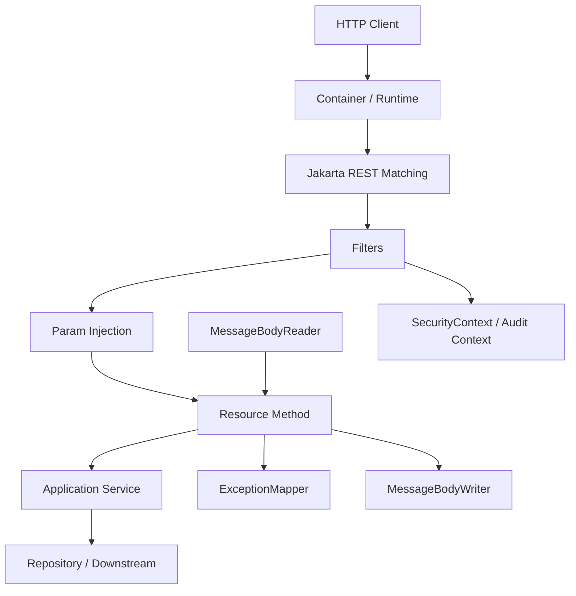
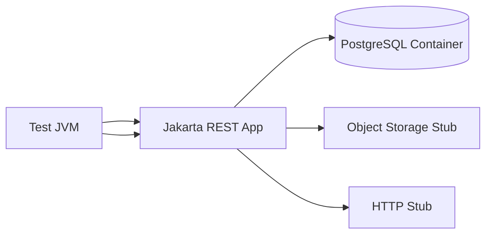
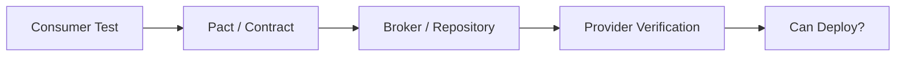
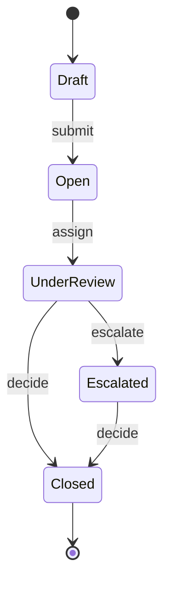
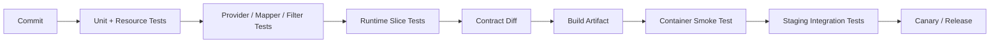

# Part 031 — Testing Strategy

> Target: setelah bagian ini, kita bisa menyusun test strategy untuk Jakarta REST service yang **cepat saat development, akurat terhadap runtime, aman terhadap perubahan contract, dan cukup kuat untuk production release**.

Testing REST API bukan sekadar memanggil endpoint dan mengecek status code `200`.

Untuk Jakarta REST, test yang baik harus menjawab:

- apakah resource method memetakan input HTTP ke application use case dengan benar?
- apakah provider/filter/interceptor berjalan sesuai urutan?
- apakah JSON contract stabil?
- apakah error response konsisten?
- apakah security policy diterapkan di boundary yang benar?
- apakah API tetap kompatibel untuk consumer lama?
- apakah behavior runtime sama dengan container production?
- apakah timeout, retry, dan dependency failure menghasilkan response yang defensible?

Jika test hanya memanggil happy path `GET /items`, kita belum menguji REST system. Kita baru menguji demo.

---

## 1. Mental Model: What Are We Testing?

Jakarta REST service memiliki beberapa layer yang berbeda.



Setiap layer punya risiko berbeda.

| Layer | Risiko Utama | Test yang Cocok |
|---|---|---|
| Resource method | salah mapping HTTP ke use case | resource unit test, HTTP integration test |
| Parameter injection | query/path/header salah parse | resource/runtime test |
| Validation | input invalid lolos atau error shape tidak konsisten | validation test, negative HTTP test |
| Provider | JSON/binary/form salah serialize/deserialize | provider unit + runtime test |
| Filter/interceptor | auth/audit/logging tidak jalan, urutan salah | provider/filter test, in-container test |
| ExceptionMapper | error bocor, status salah | mapper test, HTTP negative test |
| Client adapter | timeout/retry salah | stubbed dependency + resilience test |
| Contract | breaking change tidak terdeteksi | OpenAPI diff, consumer-driven contract |
| Deployment | runtime berbeda dengan dev | smoke test, in-container test, release probe |

Kuncinya: **jangan menggunakan satu jenis test untuk semua risiko**.

---

## 2. Testing Pyramid for Jakarta REST

Untuk REST service, pyramid yang sehat bukan hanya unit/integration/e2e. Lebih tepatnya:

```mermaid
pyramid
  title Jakarta REST Testing Pyramid
  "Small deterministic tests" : 45
  "Provider/filter/resource-slice tests" : 25
  "HTTP runtime integration tests" : 15
  "Contract and compatibility tests" : 10
  "End-to-end production-like tests" : 5
```

Interpretasi praktis:

- Banyak test kecil untuk business rule dan resource adapter.
- Cukup test slice untuk provider, mapper, filter, validation, security.
- Beberapa test HTTP dengan runtime nyata.
- Contract test untuk consumer compatibility.
- Sedikit e2e yang benar-benar melewati service graph.

Anti-pattern paling umum adalah membalik pyramid: terlalu banyak e2e test lambat, flaky, dan sulit didiagnosis.

---

## 3. Test Taxonomy

Dalam seri ini kita gunakan taxonomy berikut.

| Test Type | Scope | Speed | Confidence | Typical Tools |
|---|---|---:|---:|---|
| Pure unit test | service/domain logic | sangat cepat | rendah untuk HTTP | JUnit, AssertJ, Mockito |
| Resource unit test | resource class sebagai adapter | cepat | sedang | JUnit, fakes |
| Provider unit test | mapper/reader/writer/filter isolated | cepat | sedang | JUnit |
| Runtime slice test | Jakarta REST runtime minimal | sedang | tinggi untuk annotations/providers | JerseyTest, RESTEasy embedded, QuarkusTest |
| In-container test | actual Jakarta EE container | lambat-sedang | tinggi untuk CDI/runtime | Arquillian, Testcontainers |
| Black-box HTTP test | deployed app over HTTP | sedang-lambat | tinggi untuk user contract | REST Assured, HTTP client |
| Contract test | consumer/provider expectations | sedang | tinggi untuk compatibility | Pact, OpenAPI diff |
| Fault/resilience test | dependency failure behavior | sedang | tinggi untuk production behavior | WireMock, Toxiproxy, custom stubs |
| Security test | authz/authn/input trust | sedang | tinggi untuk boundary risk | REST Assured, ZAP, custom suites |
| Smoke test | deployment sanity | cepat | medium | curl, REST Assured, CI probes |

A mature team tidak bertanya “pakai tool apa?”. Pertanyaan yang benar: **risk apa yang ingin dibuktikan, di layer mana, dengan feedback time berapa?**

---

## 4. The Golden Rule: Test Contracts, Not Implementation Details

Resource class adalah protocol adapter. Maka test resource harus menguji:

- HTTP method,
- URI mapping,
- parameter mapping,
- media type,
- status code,
- headers,
- response shape,
- error shape,
- security/audit context,
- interaction ke application service.

Test resource **tidak perlu** menguji ulang algoritma domain yang sudah diuji di service/domain layer.

Contoh buruk:

```java
@Test
void shouldCallPrivateMethodX() {
    // fragile: menguji detail implementasi resource
}
```

Contoh lebih baik:

```java
@Test
void createCase_shouldReturn201AndLocation_whenRequestIsValid() {
    // menguji kontrak HTTP yang terlihat oleh consumer
}
```

Testing REST yang kuat adalah testing terhadap observable behavior.

---

## 5. Resource Unit Test Without Runtime

Resource unit test cocok untuk memastikan resource class memanggil application service dengan input yang benar dan mengembalikan `Response` yang benar.

Misal resource:

```java
@Path("/cases")
@Consumes(MediaType.APPLICATION_JSON)
@Produces(MediaType.APPLICATION_JSON)
public class CaseResource {

    private final CaseApplicationService service;

    public CaseResource(CaseApplicationService service) {
        this.service = service;
    }

    @POST
    public Response openCase(OpenCaseRequest request, @Context UriInfo uriInfo) {
        CaseId id = service.openCase(request.toCommand());
        URI location = uriInfo.getAbsolutePathBuilder()
                .path(id.value())
                .build();

        return Response.created(location)
                .entity(new OpenCaseResponse(id.value()))
                .build();
    }
}
```

Unit test-nya bisa fokus ke adapter behavior.

```java
class CaseResourceTest {

    @Test
    void openCaseReturnsCreatedLocation() {
        var service = new FakeCaseApplicationService(new CaseId("CASE-123"));
        var resource = new CaseResource(service);
        var uriInfo = new FakeUriInfo("https://api.example.test/cases");

        Response response = resource.openCase(
                new OpenCaseRequest("fraud", "high"),
                uriInfo
        );

        assertEquals(201, response.getStatus());
        assertEquals("https://api.example.test/cases/CASE-123", response.getLocation().toString());
        assertInstanceOf(OpenCaseResponse.class, response.getEntity());
    }
}
```

Kelebihan:

- cepat,
- deterministik,
- tidak butuh container,
- cocok untuk logic adapter sederhana.

Kelemahan:

- tidak membuktikan annotation mapping,
- tidak membuktikan provider JSON,
- tidak membuktikan filter/interceptor,
- tidak membuktikan CDI/runtime injection.

Jadi unit test resource bukan pengganti HTTP runtime test.

---

## 6. Avoid Mocking the Jakarta REST Runtime Too Deeply

Mocking `UriInfo`, `HttpHeaders`, `SecurityContext`, atau `Request` bisa berguna. Tapi jika test penuh dengan mock runtime, biasanya desain resource terlalu bergantung pada detail Jakarta REST.

Contoh smell:

```java
when(uriInfo.getPathParameters()).thenReturn(...);
when(httpHeaders.getHeaderString("X-Actor-Id")).thenReturn(...);
when(securityContext.getUserPrincipal()).thenReturn(...);
when(request.evaluatePreconditions(any(EntityTag.class))).thenReturn(...);
```

Jika test menjadi seperti ini, pertimbangkan membuat adapter kecil:

```java
public interface RequestIdentity {
    ActorId actorId();
    Set<String> roles();
    String correlationId();
}
```

Lalu filter/context layer mengisi `RequestIdentity`, resource hanya memakai abstraction application-level.

Prinsipnya:

> Mock runtime hanya untuk boundary yang kecil. Jangan menjadikan test sebagai replika palsu dari Jakarta REST runtime.

---

## 7. Runtime Slice Test

Runtime slice test menjalankan resource di runtime Jakarta REST minimal. Tujuannya menguji hal-hal yang tidak bisa dibuktikan dengan unit test:

- `@Path` matching,
- `@GET`/`@POST` method selection,
- `@Consumes`/`@Produces`,
- parameter injection,
- JSON provider,
- `ExceptionMapper`,
- filters,
- interceptors,
- validation integration.

Contoh konseptual dengan test runtime implementation-specific:

```java
class CaseResourceHttpTest extends SomeJakartaRestTestSupport {

    @Test
    void postCasesShouldReturn201() {
        given()
            .contentType("application/json")
            .accept("application/json")
            .body("""
                { "type": "fraud", "priority": "high" }
                """)
        .when()
            .post("/cases")
        .then()
            .statusCode(201)
            .header("Location", matchesPattern(".*/cases/CASE-[0-9]+"))
            .contentType("application/json")
            .body("caseId", startsWith("CASE-"));
    }
}
```

REST Assured cocok untuk black-box HTTP tests karena menyediakan DSL Java untuk testing dan validasi REST service. Namun test tetap harus didesain sebagai contract test, bukan script manual yang dipindah ke code.

---

## 8. In-Container Test

Beberapa behavior hanya valid jika diuji dalam container yang mendekati production:

- CDI injection,
- transaction context,
- security integration,
- Jakarta Validation integration,
- provider discovery,
- `@Priority` ordering,
- container-managed executor,
- deployment descriptor,
- classpath/module behavior,
- implementation-specific integration.

Arquillian populer untuk Jakarta EE karena dapat menjalankan test di dalam atau melawan container nyata. Tetapi jangan menjadikan semua test sebagai Arquillian test. Gunakan untuk risk yang memang container-specific.

Kapan perlu in-container test:

| Situation | Butuh In-Container? | Reason |
|---|---:|---|
| Pure DTO validation | tidak selalu | bisa unit/slice |
| CDI interceptor/security integration | ya | container-managed behavior |
| Provider discovery di WAR | ya | deployment/classpath behavior |
| JPA transaction + REST resource | sering ya | context propagation |
| JSON serialization DTO biasa | tidak selalu | runtime slice cukup |
| Health endpoint smoke | tidak | black-box cukup |

Design rule:

> In-container tests are expensive. Use them to prove integration assumptions, not every branch.

---

## 9. Testcontainers and Production-Like Dependencies

Untuk REST service yang bergantung pada database, object storage, message broker, atau external HTTP dependency, gunakan test environment yang mendekati production tetapi tetap terisolasi.

Pattern:



Kita tidak mengulang detail JDBC/persistence series di sini. Fokusnya adalah boundary REST:

- test harus mengontrol dependency state,
- test harus membersihkan state,
- test harus deterministik,
- test tidak boleh bergantung pada shared dev database,
- test harus bisa dijalankan di CI.

Gunakan real dependency saat behavior dependency penting. Gunakan stub saat yang penting adalah behavior client adapter.

---

## 10. Provider Tests

Provider adalah extension point. Jika provider salah, banyak endpoint ikut salah.

Provider yang perlu diuji khusus:

- `ExceptionMapper`,
- `MessageBodyReader`,
- `MessageBodyWriter`,
- `ParamConverterProvider`,
- `ContextResolver`,
- `ContainerRequestFilter`,
- `ContainerResponseFilter`,
- `ReaderInterceptor`,
- `WriterInterceptor`.

### 10.1 ExceptionMapper Test

```java
class DomainExceptionMapperTest {

    @Test
    void mapsBusinessRuleViolationTo409ProblemJson() {
        var mapper = new DomainExceptionMapper();

        Response response = mapper.toResponse(
                new BusinessRuleViolation("CASE_ALREADY_CLOSED", "Case is already closed")
        );

        assertEquals(409, response.getStatus());
        assertEquals("application/problem+json", response.getMediaType().toString());

        var problem = (Problem) response.getEntity();
        assertEquals("CASE_ALREADY_CLOSED", problem.code());
        assertNull(problem.internalStackTrace());
    }
}
```

Mapper test harus memverifikasi:

- status code,
- media type,
- error code,
- user-safe message,
- correlation/request id jika applicable,
- no internal exception detail,
- observability hook jika ada.

### 10.2 Runtime Test for Mapper Resolution

Unit test mapper tidak membuktikan mapper terdaftar atau terpilih runtime. Tambahkan minimal satu HTTP negative test:

```java
@Test
void closedCaseMutationReturns409ProblemJson() {
    given()
        .contentType("application/json")
        .accept("application/problem+json")
        .body("{ \"decision\": \"approve\" }")
    .when()
        .post("/cases/CASE-CLOSED/decisions")
    .then()
        .statusCode(409)
        .contentType("application/problem+json")
        .body("code", equalTo("CASE_ALREADY_CLOSED"));
}
```

---

## 11. Filter and Interceptor Tests

Filters dan interceptors mempengaruhi request/response cross-cutting. Mereka rentan terhadap regressions karena sering dianggap plumbing.

### 11.1 Request Filter Test

Untuk auth/correlation filter:

```java
@Test
void correlationFilterAddsCorrelationIdWhenMissing() throws IOException {
    var filter = new CorrelationIdRequestFilter();
    var ctx = new FakeContainerRequestContext();

    filter.filter(ctx);

    assertNotNull(ctx.getProperty("correlationId"));
    assertTrue(ctx.getHeaders().containsKey("X-Correlation-Id"));
}
```

### 11.2 Response Filter Test

```java
@Test
void securityHeadersAreAddedToEveryResponse() throws IOException {
    var filter = new SecurityHeadersResponseFilter();
    var request = new FakeContainerRequestContext();
    var response = new FakeContainerResponseContext();

    filter.filter(request, response);

    assertEquals("nosniff", response.getHeaderString("X-Content-Type-Options"));
    assertNotNull(response.getHeaderString("Content-Security-Policy"));
}
```

### 11.3 Runtime Ordering Test

Jika filter order penting, unit test saja tidak cukup. Tambahkan runtime test yang merekam urutan eksekusi.

```java
@Provider
@Priority(Priorities.AUTHENTICATION)
public class AuthenticationFilter implements ContainerRequestFilter { ... }

@Provider
@Priority(Priorities.AUTHORIZATION)
public class AuthorizationFilter implements ContainerRequestFilter { ... }
```

Yang perlu diuji:

- authentication berjalan sebelum authorization,
- audit filter melihat actor yang sudah resolved,
- response filter berjalan bahkan saat resource melempar exception,
- pre-matching filter tidak memakai `ResourceInfo` yang belum tersedia,
- `abortWith` menghasilkan response yang tetap melewati response filter yang diharapkan.

---

## 12. Message Body Tests

Body provider adalah tempat contract sering rusak diam-diam.

Test JSON serialization harus mencakup:

- null vs missing,
- enum value,
- date/time format,
- decimal precision,
- unknown field,
- extra field,
- list/collection,
- nested object,
- validation error,
- backward-compatible additions.

Contoh golden JSON test:

```java
@Test
void caseSummaryJsonShapeIsStable() {
    var dto = new CaseSummaryResponse(
            "CASE-123",
            "OPEN",
            OffsetDateTime.parse("2026-06-27T10:15:30Z")
    );

    String json = json.write(dto);

    assertJsonEquals("""
        {
          "caseId": "CASE-123",
          "status": "OPEN",
          "openedAt": "2026-06-27T10:15:30Z"
        }
        """, json);
}
```

Golden tests berguna untuk DTO yang menjadi public contract. Tapi jangan terlalu banyak golden file untuk object internal karena akan menjadi brittle.

---

## 13. Validation Tests

Validation test harus membuktikan dua hal:

1. invalid input ditolak,
2. error response dapat digunakan consumer.

Contoh:

```java
@Test
void createCaseRejectsMissingType() {
    given()
        .contentType("application/json")
        .accept("application/problem+json")
        .body("""
            { "priority": "high" }
            """)
    .when()
        .post("/cases")
    .then()
        .statusCode(400)
        .contentType("application/problem+json")
        .body("code", equalTo("VALIDATION_FAILED"))
        .body("violations[0].field", equalTo("type"));
}
```

Validation scenarios:

| Scenario | Expected |
|---|---|
| Missing required field | 400 with field violation |
| Invalid enum | 400 with invalid value info, no stack trace |
| Invalid path id format | 400 or 404 by policy, consistent |
| Unknown JSON field | policy-dependent, tested |
| Extra query parameter | ignored or rejected by policy, tested |
| Invalid transition | 409 or 422 by domain policy |
| Unauthorized actor | 403, not validation error |
| Malformed JSON | 400 problem response |
| Unsupported media type | 415 |
| Unacceptable response type | 406 |

Validation is not only annotation coverage. It is a consumer-facing failure contract.

---

## 14. HTTP Semantics Tests

Every public endpoint should have semantic tests for method/status/header behavior.

### 14.1 Creation

```java
@Test
void createReturns201WithLocation() {
    given()
        .contentType("application/json")
        .body(validCreateRequest())
    .when()
        .post("/cases")
    .then()
        .statusCode(201)
        .header("Location", matchesPattern(".*/cases/.+"));
}
```

### 14.2 Update with ETag

```java
@Test
void updateRejectsStaleEtag() {
    given()
        .contentType("application/json")
        .header("If-Match", "\"old-version\"")
        .body(validUpdateRequest())
    .when()
        .put("/cases/CASE-123")
    .then()
        .statusCode(412)
        .body("code", equalTo("PRECONDITION_FAILED"));
}
```

### 14.3 Idempotent Delete

```java
@Test
void deleteIsIdempotent() {
    delete("/cases/CASE-123").then().statusCode(anyOf(equalTo(204), equalTo(202)));
    delete("/cases/CASE-123").then().statusCode(anyOf(equalTo(204), equalTo(404)));
}
```

Catatan: second delete bisa `204` atau `404` tergantung policy. Yang penting policy eksplisit, documented, dan tested.

---

## 15. Content Negotiation Tests

Content negotiation sering tidak diuji, padahal sangat mempengaruhi public API.

Test minimal:

```java
@Test
void unsupportedRequestMediaTypeReturns415() {
    given()
        .contentType("text/plain")
        .body("not-json")
    .when()
        .post("/cases")
    .then()
        .statusCode(415);
}

@Test
void unacceptableResponseMediaTypeReturns406() {
    given()
        .accept("application/xml")
    .when()
        .get("/cases/CASE-123")
    .then()
        .statusCode(406);
}
```

Jika API mendukung `application/problem+json`, test error response tetap memakai media type yang benar.

```java
@Test
void errorResponseUsesProblemJson() {
    given()
        .accept("application/problem+json")
    .when()
        .get("/cases/DOES-NOT-EXIST")
    .then()
        .statusCode(404)
        .contentType("application/problem+json");
}
```

---

## 16. Contract Testing

Contract testing memastikan consumer dan provider punya ekspektasi yang sama.

Ada dua pendekatan besar:

1. **Provider contract**: API mendefinisikan OpenAPI, lalu test memastikan implementation sesuai spec.
2. **Consumer-driven contract**: consumer mendefinisikan interaction yang dipakai, provider memverifikasi bisa memenuhi interaction tersebut.



### 16.1 OpenAPI Contract Tests

OpenAPI useful untuk:

- documentation,
- schema validation,
- compatibility diff,
- generated client,
- API review,
- gateway policy,
- contract-based tests.

Test yang perlu dilakukan:

- semua public endpoints ada di OpenAPI,
- semua documented endpoints bisa dipanggil,
- response body sesuai schema,
- status code documented,
- error shape documented,
- security scheme documented,
- breaking changes terdeteksi via diff.

### 16.2 Consumer-Driven Contract

Consumer-driven contract cocok jika:

- API punya beberapa consumer aktif,
- consumer release cadence berbeda,
- provider tidak tahu semua usage detail,
- breaking change mahal,
- team ingin deployment independent.

Consumer contract harus merekam usage nyata, bukan seluruh kemungkinan API.

Anti-pattern:

- provider menulis pact sendiri untuk pura-pura aman,
- contract terlalu broad dan menyerupai full integration test,
- contract tidak diverifikasi di provider CI,
- contract tidak punya versioning/tag environment.

---

## 17. Compatibility Tests

REST API public harus punya compatibility gate.

Breaking changes yang harus ditangkap:

| Change | Breaking? | Why |
|---|---:|---|
| remove endpoint | yes | consumer call fails |
| remove response field | often yes | parser/UI may depend |
| add response field | usually no | if consumer tolerant |
| rename field | yes | equivalent to remove+add |
| make optional field required | yes | old clients fail |
| change enum values | often yes | parser/business logic fails |
| change status code | often yes | client logic changes |
| change error code | yes | client error handling breaks |
| tighten validation | often yes | previously valid requests fail |
| relax validation | usually no | but may affect invariants |
| change pagination order | often yes | duplicate/missing results |
| change media type | yes | negotiation/client parser fails |

Compatibility tests bisa berbasis:

- OpenAPI diff,
- golden response samples,
- consumer contract,
- real client test suite,
- backward-compatible scenario tests.

Rule praktis:

> Compatibility is not a promise in documentation. Compatibility is a gate in CI/CD.

---

## 18. Security Tests

Security tests untuk Jakarta REST harus fokus pada boundary.

Minimum security scenarios:

- unauthenticated request returns `401`,
- authenticated but unauthorized returns `403`,
- actor cannot access another actor's resource,
- role alone is not enough for object-level access,
- malformed token rejected,
- expired token rejected,
- missing CSRF protection where relevant,
- CORS policy does not allow arbitrary origin,
- sensitive fields never returned,
- error response does not leak stack trace,
- uploaded filename cannot path traverse,
- header spoofing is rejected,
- request body size limit enforced,
- rate limit response includes useful metadata.

Example IDOR test:

```java
@Test
void investigatorCannotReadCaseOutsideAssignment() {
    given()
        .auth().oauth2(tokenFor("investigator-a"))
    .when()
        .get("/cases/CASE-OWNED-BY-B")
    .then()
        .statusCode(403);
}
```

Do not only test role checks.

```java
// Not enough
@RolesAllowed("INVESTIGATOR")
```

Domain authorization must usually check object relation:

```java
authorizationService.assertCanViewCase(actor, caseId);
```

---

## 19. Resilience and Fault Tests

Outbound dependency failure is part of REST service behavior.

Fault scenarios:

| Fault | Expected Behavior |
|---|---|
| downstream timeout | bounded latency, mapped error |
| downstream 500 | classified dependency failure |
| downstream 429 | respect retry budget / Retry-After |
| connection refused | fail fast if no retry possible |
| partial response | no corrupt success response |
| duplicate request after timeout | idempotency prevents duplicate mutation |
| circuit open | fast failure with observable error |
| slow dependency | thread/pool not exhausted |

Example:

```java
@Test
void externalRegistryTimeoutReturnsDependencyProblem() {
    registryStub.stubTimeout("/subjects/123");

    given()
        .contentType("application/json")
        .body(validOpenCaseRequest())
    .when()
        .post("/cases")
    .then()
        .statusCode(503)
        .body("code", equalTo("DEPENDENCY_TIMEOUT"));
}
```

Important: test the **public behavior**, not only that retry method was called three times.

---

## 20. Async and SSE Tests

Async resource and SSE need special tests because completion happens outside normal request call stack.

### 20.1 Async Job Pattern Test

```java
@Test
void longRunningOperationReturns202AndJobLocation() {
    given()
        .contentType("application/json")
        .body(validRequest())
    .when()
        .post("/case-imports")
    .then()
        .statusCode(202)
        .header("Location", matchesPattern(".*/case-imports/jobs/.+"));
}
```

Then poll:

```java
await().atMost(Duration.ofSeconds(10)).untilAsserted(() ->
    given()
    .when()
        .get(jobLocation)
    .then()
        .statusCode(200)
        .body("status", equalTo("COMPLETED"))
);
```

### 20.2 SSE Test

SSE test should verify:

- correct `text/event-stream` response,
- heartbeat if required,
- event id,
- event type,
- reconnect behavior using `Last-Event-ID`,
- authorization,
- connection cleanup.

Avoid making SSE tests depend on real-time sleeps longer than necessary. Use controlled clocks and event injectors where possible.

---

## 21. Performance Tests Are Not Unit Tests

Performance tests answer different questions:

- what is the p95/p99 latency under expected load?
- what endpoint saturates first?
- does upload/download blow heap?
- does JSON serialization allocate too much?
- does retry amplify load?
- does filter body logging destroy throughput?
- does connection pool saturate?

Do not run heavy performance tests on every commit. Use tiers:

| Tier | Cadence | Purpose |
|---|---|---|
| Microbenchmark | when optimizing hot path | isolate serialization/mapper logic |
| PR smoke performance | selected endpoints, small load | catch obvious regressions |
| Nightly load test | realistic scenario | trend latency/throughput |
| Pre-release soak | longer run | catch leaks/saturation |
| Incident reproduction | targeted | verify fix |

Performance tests must produce actionable output:

- endpoint,
- load profile,
- p50/p95/p99,
- error rate,
- saturation signal,
- heap/GC signal,
- dependency latency,
- version/build id.

---

## 22. Test Data Strategy

Bad test data is a source of flaky tests.

Rules:

- Each test owns its data.
- IDs are deterministic or captured from creation response.
- No test depends on execution order.
- No shared mutable fixture unless read-only.
- Time is controlled where possible.
- External stubs are reset per test.
- Audit assertions use stable actor IDs.

Example fixture style:

```java
CaseFixture openCase = cases().open()
        .withType("fraud")
        .withPriority("high")
        .assignedTo("investigator-a")
        .create();
```

Good fixture APIs speak domain language, not SQL implementation.

---

## 23. Determinism and Flakiness Control

Flaky API tests usually come from:

- real clock,
- async race,
- shared environment,
- external network,
- unbounded waits,
- test order dependency,
- parallel tests sharing resources,
- eventual consistency without polling policy,
- generated IDs not captured,
- dirty database state.

Fixes:

- use controlled clock,
- isolate test data,
- use retry only for polling expected eventual consistency, not arbitrary flakiness,
- avoid sleep; use await with condition,
- reset stubs,
- tag slow tests,
- keep e2e count small,
- fail with diagnostic context.

Bad:

```java
Thread.sleep(5000);
```

Better:

```java
await().atMost(Duration.ofSeconds(10)).untilAsserted(() ->
    assertThat(jobStatus(jobId)).isEqualTo("COMPLETED")
);
```

---

## 24. Negative Testing Matrix

Production API quality is visible in negative paths.

| Category | Example | Expected |
|---|---|---|
| Malformed HTTP | bad JSON | 400 problem |
| Wrong media type | `text/plain` to JSON endpoint | 415 |
| Wrong Accept | `application/xml` unsupported | 406 |
| Missing auth | no token | 401 |
| Forbidden | valid token wrong object | 403 |
| Not found | unknown id | 404 |
| Conflict | invalid state transition | 409 |
| Precondition failure | stale ETag | 412 |
| Rate limit | too many requests | 429 |
| Dependency timeout | external service slow | 503/504 by policy |
| Payload too large | oversized upload | 413 |
| Invalid query | unsupported sort field | 400 |
| Invalid pagination | negative limit | 400 |

A top-tier REST test suite has as much discipline for failure as for success.

---

## 25. Mutation and State Transition Tests

For case-management/regulatory APIs, most risk lies in mutation.

Test state transitions as state machine invariants.



Test matrix:

| From | Action | Expected |
|---|---|---|
| Draft | submit | 201/200 + Open |
| Open | assign | 200 + UnderReview |
| Closed | assign | 409 |
| UnderReview | escalate | 202/200 + Escalated |
| Closed | escalate | 409 |
| Any | unauthorized action | 403 |
| Any | duplicate command with same idempotency key | same result/no duplicate |

REST endpoint test:

```java
@Test
void closedCaseCannotBeEscalated() {
    var caseId = fixture.closedCase();

    given()
        .auth().oauth2(supervisorToken())
        .contentType("application/json")
        .body("{ \"reason\": \"late evidence\" }")
    .when()
        .post("/cases/{id}/escalations", caseId)
    .then()
        .statusCode(409)
        .body("code", equalTo("CASE_ALREADY_CLOSED"));
}
```

---

## 26. Audit Test Strategy

For regulated systems, audit is not an afterthought.

Audit tests should verify:

- mutation creates audit event,
- audit event records actor,
- audit event records action,
- audit event records target resource,
- audit event records decision reason when required,
- audit event records correlation id,
- failure cases record attempted action where required,
- sensitive payload is redacted,
- audit timestamp uses trusted time source,
- audit write failure policy is explicit.

Example:

```java
@Test
void escalationCreatesAuditEvent() {
    var caseId = fixture.openCaseAssignedTo("supervisor-a");

    postEscalation(caseId, "evidence mismatch")
        .then()
        .statusCode(201);

    assertThat(auditEvents.forTarget(caseId))
        .anySatisfy(event -> {
            assertThat(event.action()).isEqualTo("CASE_ESCALATED");
            assertThat(event.actorId()).isEqualTo("supervisor-a");
            assertThat(event.reason()).isEqualTo("evidence mismatch");
            assertThat(event.correlationId()).isNotBlank();
        });
}
```

Audit test tidak harus selalu melalui database detail. Yang penting observable audit contract terbukti.

---

## 27. Test Naming Convention

Use names that encode behavior.

Pattern:

```text
method_or_endpoint__condition__expected_result
```

Examples:

```java
createCase__validRequest__returns201WithLocation()
createCase__missingType__returns400ValidationProblem()
assignCase__actorNotAssigned__returns403()
closeCase__staleEtag__returns412()
searchCases__invalidSortField__returns400()
```

Avoid vague names:

```java
testCreate()
testError()
shouldWork()
```

Good test names become living documentation.

---

## 28. CI/CD Test Gates

A practical pipeline:



Suggested gates:

| Gate | Required On PR | Required Before Deploy |
|---|---:|---:|
| Unit tests | yes | yes |
| Resource/provider tests | yes | yes |
| Runtime slice tests | yes | yes |
| Contract diff | yes | yes |
| Security negative tests | selected | full |
| In-container tests | selected | yes |
| E2E tests | minimal | selected |
| Performance smoke | optional | yes for risky changes |
| Soak/load test | no | release/nightly |

Do not block every PR with long unstable environments. But never deploy without contract and smoke confidence.

---

## 29. Coverage: What Number Matters?

Line coverage alone is weak for REST APIs.

Better coverage dimensions:

- endpoint coverage,
- method coverage,
- status code coverage,
- media type coverage,
- error code coverage,
- authz path coverage,
- state transition coverage,
- contract schema coverage,
- consumer interaction coverage,
- provider/filter coverage,
- dependency fault coverage.

Example dashboard:

| Coverage Type | Target |
|---|---:|
| Public endpoints with at least one success test | 100% |
| Public endpoints with negative auth test | 100% |
| Mutation endpoints with idempotency/concurrency test | 100% where applicable |
| Documented error codes tested | 90%+ |
| OpenAPI operations verified | 100% |
| Consumer contracts verified | 100% active consumers |

Do not optimize only for JaCoCo percentage. Optimize for risk coverage.

---

## 30. Example Test Portfolio for `/cases`

For a production `/cases` API:

### `GET /cases/{id}`

- 200 returns case summary JSON.
- 404 for unknown id.
- 400 for invalid id format if policy says invalid format is bad request.
- 401 unauthenticated.
- 403 actor without access.
- `Accept: application/xml` returns 406 if unsupported.
- ETag returned.
- Conditional GET returns 304 when matched.

### `POST /cases`

- 201 with `Location`.
- 400 validation problem.
- 415 unsupported content type.
- 409 duplicate business key.
- idempotency key returns stable result.
- audit event created.
- sensitive fields redacted from logs.

### `PUT /cases/{id}`

- 200/204 update success.
- 412 stale ETag.
- 428 missing `If-Match` if required.
- 403 unauthorized actor.
- 409 invalid state transition.

### `GET /cases?status=OPEN&sort=-createdAt&limit=50`

- pagination metadata correct.
- invalid sort rejected.
- limit max enforced.
- stable order tested.
- actor sees only authorized cases.

This is the level of coverage expected for high-risk APIs.

---

## 31. Common Testing Anti-Patterns

### 31.1 Testing Only Happy Path

A REST API that only works when consumers behave perfectly is not production-ready.

### 31.2 Mocking Everything

If all dependencies and runtime objects are mocked, tests become tautologies.

### 31.3 Full E2E for Every Rule

E2E tests are expensive and flaky. Use them for critical journeys, not every validation branch.

### 31.4 Ignoring Error Shape

Checking only status code misses the consumer contract.

```java
.then().statusCode(400); // insufficient
```

Better:

```java
.then()
  .statusCode(400)
  .contentType("application/problem+json")
  .body("code", equalTo("VALIDATION_FAILED"));
```

### 31.5 No Contract Diff

If OpenAPI changes are not diffed, breaking changes slip into production.

### 31.6 Overusing Snapshot Tests

Snapshot/golden tests are useful, but too many make harmless changes painful.

### 31.7 Not Testing Unauthorized Object Access

Role tests are insufficient. Object-level authorization is where many real API breaches occur.

### 31.8 Treating Flaky Tests as Normal

Flaky tests are reliability debt. Quarantining is temporary; diagnosis is required.

---

## 32. Practical Reference Architecture for Tests

Suggested package layout:

```text
src/test/java
  com.example.caseapi
    resource/
      CaseResourceTest.java
      CaseResourceHttpTest.java
    provider/
      ProblemExceptionMapperTest.java
      JsonbContextResolverTest.java
    filter/
      CorrelationIdFilterTest.java
      SecurityHeadersFilterTest.java
    contract/
      OpenApiCompatibilityTest.java
      PactProviderVerificationTest.java
    security/
      CaseAuthorizationHttpTest.java
    resilience/
      ExternalRegistryFailureTest.java
    support/
      ApiTestClient.java
      Fixtures.java
      TestClock.java
      StubServers.java
```

Shared test support should improve clarity, not hide assertions.

Bad:

```java
api.createCaseAndAssertEverythingWorks();
```

Better:

```java
CaseId caseId = api.createCase(validOpenCaseRequest())
        .expectCreated()
        .extractCaseId();
```

---

## 33. Review Checklist for Test Suite

Before considering an API production-ready, verify:

- [ ] Every public endpoint has at least one success HTTP test.
- [ ] Every public endpoint has authentication/authorization negative tests.
- [ ] Every mutation endpoint has invalid-state tests.
- [ ] Every mutation endpoint has idempotency/concurrency policy tested where applicable.
- [ ] Error response media type and shape are tested.
- [ ] Validation errors include stable machine-readable codes.
- [ ] Content negotiation negative paths are tested.
- [ ] Provider/filter/mapper behavior is tested both isolated and at runtime where necessary.
- [ ] Contract diff is part of CI.
- [ ] Consumer contracts are verified for active consumers.
- [ ] Fault scenarios for outbound dependencies are tested.
- [ ] Security headers/CORS behavior is tested.
- [ ] Audit event behavior is tested for regulated mutations.
- [ ] Smoke tests run against packaged artifact.
- [ ] Flaky tests are tracked and fixed, not normalized.

---

## 34. Kaufman Practice Plan

### First 90 Minutes

- Pick one endpoint.
- Write one happy-path HTTP test.
- Write one validation error test.
- Write one authorization negative test.
- Write one `ExceptionMapper` unit test.

### Next 3 Hours

- Add content negotiation tests.
- Add provider/filter tests.
- Add OpenAPI schema validation.
- Add contract diff to CI.

### Next 6 Hours

- Add dependency fault tests.
- Add idempotency test for mutation.
- Add audit assertion.
- Add smoke test against packaged artifact.

### Next 10 Hours

- Build reusable test fixture DSL.
- Add active consumer contract tests.
- Build release gate dashboard.
- Remove flaky sleeps and shared state.

Skill acquisition target: not “know testing tools”, but **can design confidence model for a REST API release**.

---

## 35. Summary

Testing Jakarta REST service requires layered confidence.

Key ideas:

- Unit tests are necessary but not enough.
- Resource tests should verify protocol adapter behavior.
- Runtime tests prove annotation/provider/filter integration.
- In-container tests prove container assumptions.
- Contract tests protect consumers.
- Negative tests define production quality.
- Security tests must include object-level authorization.
- Fault tests prove resilience behavior.
- Audit tests matter for regulated workflows.
- CI gates should map to release risk.

The final question before deployment is not:

> Do we have enough tests?

The better question is:

> Which production failure would still surprise us, and what test layer should catch it earlier?

---

## References

- Jakarta RESTful Web Services 4.0 Specification: https://jakarta.ee/specifications/restful-ws/4.0/
- Jakarta RESTful Web Services 4.0 Specification Document: https://jakarta.ee/specifications/restful-ws/4.0/jakarta-restful-ws-spec-4.0
- REST Assured Official Site: https://rest-assured.io/
- Arquillian Getting Started Guide: https://arquillian.org/guides/getting_started/
- Pact Documentation: https://docs.pact.io/
- OpenAPI Specification: https://spec.openapis.org/
