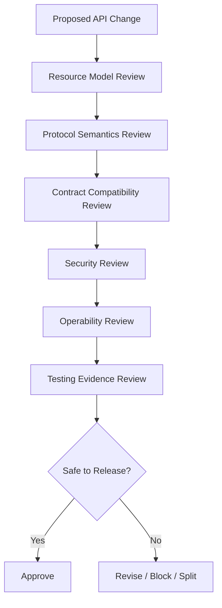
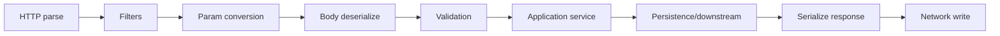
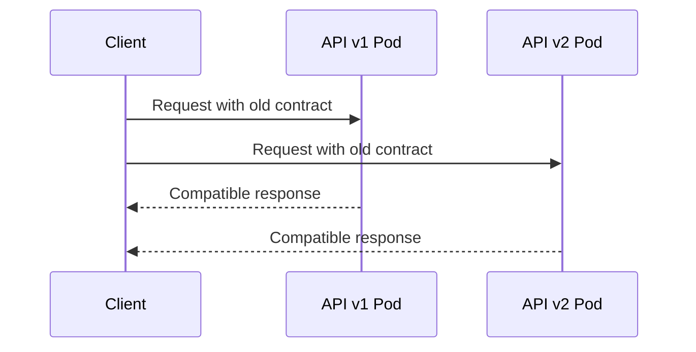

# Part 032 — API Review Checklists

> Target: setelah bagian ini, kita punya review system yang bisa dipakai sebelum API masuk production: jelas, repeatable, defensible, dan cukup tajam untuk menemukan design risk sebelum menjadi incident.

Checklist bukan pengganti thinking. Checklist adalah alat untuk mencegah kesalahan yang sudah diketahui.

Untuk Jakarta REST service, review harus memeriksa:

- apakah resource model benar?
- apakah HTTP semantics benar?
- apakah contract aman untuk consumer?
- apakah error model stabil?
- apakah security boundary kuat?
- apakah observability cukup?
- apakah deployment behavior aman?
- apakah test suite membuktikan risk penting?
- apakah API dapat dipertahankan saat audit, incident, dan migration?

Checklist ini disusun agar bisa digunakan dalam design review, PR review, release review, dan architecture governance.

---

## 1. Review Philosophy

API review yang baik tidak sekadar mencari style issue.

API review harus menjawab:



A top-tier API review focuses on invariants:

- What must never happen?
- What must remain backward-compatible?
- What must be observable?
- What must be auditable?
- What must fail safely?
- What must stay portable across runtime implementations?

---

## 2. Review Outcome Levels

Gunakan level berikut agar feedback tidak ambigu.

| Level | Meaning | Action |
|---|---|---|
| `BLOCKER` | unsafe/breaking/incorrect | must fix before merge/release |
| `MAJOR` | high risk but fixable | fix or document approved exception |
| `MINOR` | quality issue | fix if low-cost or create follow-up |
| `QUESTION` | unclear assumption | answer before approval |
| `NIT` | style/readability | optional |

Contoh:

- `BLOCKER`: mutation endpoint returns `200` but can create duplicate command after retry.
- `MAJOR`: error response has no stable machine-readable code.
- `MINOR`: response DTO field name is slightly unclear.
- `QUESTION`: should unknown JSON fields be rejected?
- `NIT`: reorder methods for readability.

Do not use “LGTM” when review risk has not been evaluated.

---

## 3. Resource Modeling Checklist

Resource modeling adalah fondasi. Jika resource model salah, implementation bagus tetap menghasilkan API buruk.

### 3.1 Resource Identity

- [ ] Resource punya identity yang stabil.
- [ ] URI tidak mengekspos internal database key jika itu risk.
- [ ] Resource ID format terdokumentasi.
- [ ] ID tidak berubah karena state transition.
- [ ] Resource identity tidak bergantung pada display label.
- [ ] Multi-tenant boundary tidak bocor lewat predictable ID.

Bad:

```http
GET /case-table/123
```

Better:

```http
GET /cases/CASE-2026-000123
```

### 3.2 Collection and Item Resources

- [ ] Collection resource merepresentasikan kumpulan resource.
- [ ] Item resource merepresentasikan satu resource.
- [ ] `GET /resources` dan `GET /resources/{id}` punya semantics berbeda jelas.
- [ ] Collection response tidak terlalu besar tanpa pagination.
- [ ] Collection filter/sort grammar terdokumentasi.

### 3.3 Nested Resources

- [ ] Nesting merepresentasikan containment atau strong relationship.
- [ ] Nesting tidak lebih dalam dari yang dibutuhkan.
- [ ] Nested resource tetap punya canonical URI jika dibutuhkan.
- [ ] Authorization dicek terhadap parent dan child.

Bad:

```http
GET /organizations/{orgId}/departments/{deptId}/teams/{teamId}/users/{userId}/cases/{caseId}/evidence/{evidenceId}
```

Better, depending on access model:

```http
GET /cases/{caseId}/evidence/{evidenceId}
```

### 3.4 Command/Action Resource

- [ ] Action endpoint hanya digunakan saat state transition tidak cocok sebagai pure CRUD.
- [ ] Action resource dinamai sebagai noun/event/command, bukan verb acak.
- [ ] Command menghasilkan record/audit/event jika domain membutuhkan.
- [ ] Duplicate command behavior jelas.

Acceptable:

```http
POST /cases/{caseId}/escalations
POST /cases/{caseId}/decisions
POST /cases/{caseId}/assignments
```

Weak:

```http
POST /cases/{caseId}/doEscalate
POST /cases/{caseId}/approveNow
```

---

## 4. HTTP Method Checklist

### 4.1 `GET`

- [ ] Tidak mengubah state business.
- [ ] Aman untuk retry.
- [ ] Tidak memicu side effect signifikan selain logging/metrics/audit-read jika policy mengizinkan.
- [ ] Cache behavior jelas.
- [ ] `404` vs `403` policy jelas untuk unauthorized unknown resources.
- [ ] Conditional GET dipertimbangkan untuk expensive resource.

### 4.2 `POST`

- [ ] Digunakan untuk create subordinate resource atau command/action.
- [ ] Jika create, response `201 Created` dan `Location` dipertimbangkan.
- [ ] Jika async, response `202 Accepted` dan job/status URI dipertimbangkan.
- [ ] Idempotency key dipertimbangkan untuk mutation yang bisa di-retry.
- [ ] Duplicate handling jelas.

### 4.3 `PUT`

- [ ] Semantics replacement/upsert jelas.
- [ ] Idempotency dipertahankan.
- [ ] `If-Match`/ETag dipertimbangkan untuk lost update prevention.
- [ ] Partial update tidak disamarkan sebagai PUT jika sebenarnya PATCH.

### 4.4 `PATCH`

- [ ] Patch document format jelas: JSON Merge Patch, JSON Patch, atau domain-specific patch.
- [ ] Partial validation strategy jelas.
- [ ] Unknown fields policy jelas.
- [ ] Conflict behavior jelas.

### 4.5 `DELETE`

- [ ] Hard delete vs soft delete jelas.
- [ ] Idempotency policy jelas.
- [ ] Legal/audit retention dipertimbangkan.
- [ ] Response status konsisten: `204`, `202`, atau `404` sesuai policy.

---

## 5. Status Code Checklist

| Scenario | Expected Candidates | Review Question |
|---|---|---|
| Resource created | `201` | Is `Location` present? |
| Accepted async work | `202` | Is status resource available? |
| Successful no body | `204` | Is client okay with no body? |
| Validation failure | `400` | Are field violations present? |
| Unauthenticated | `401` | Is `WWW-Authenticate` needed? |
| Authenticated but forbidden | `403` | Is object-level auth checked? |
| Not found | `404` | Is enumeration risk considered? |
| Conflict/state rule | `409` | Is domain conflict code stable? |
| Precondition failed | `412` | Is ETag/precondition used correctly? |
| Unsupported media | `415` | Is `Content-Type` validated? |
| Not acceptable | `406` | Is `Accept` negotiation tested? |
| Rate limited | `429` | Is retry guidance present? |
| Dependency unavailable | `503` | Is error classified? |

Checklist:

- [ ] Status code matches HTTP semantics.
- [ ] Domain error is not collapsed into generic `500`.
- [ ] Client error is not returned as `200` with `success=false`.
- [ ] Async mutation does not pretend to be completed.
- [ ] Error codes are stable and machine-readable.

Bad:

```json
{ "success": false, "error": "Invalid input" }
```

with HTTP `200 OK`.

Better:

```http
HTTP/1.1 400 Bad Request
Content-Type: application/problem+json
```

```json
{
  "type": "https://api.example.com/problems/validation-failed",
  "title": "Validation failed",
  "status": 400,
  "code": "VALIDATION_FAILED",
  "violations": [
    { "field": "type", "message": "must not be blank" }
  ]
}
```

---

## 6. URI and Query Parameter Checklist

### 6.1 URI

- [ ] URI uses nouns/resources, not implementation names.
- [ ] URI does not include action verbs unless modeling command resource is unavoidable.
- [ ] URI avoids leaking table names, workflow engine names, or class names.
- [ ] Path variables have clear format.
- [ ] URI remains stable across internal refactors.

### 6.2 Query Parameters

- [ ] Query params are used for filtering, sorting, pagination, projection, or search modifiers.
- [ ] Required query params are documented.
- [ ] Unknown query params policy is explicit.
- [ ] Multi-value semantics are clear.
- [ ] Date/time timezone policy is clear.
- [ ] Maximum page size is enforced.
- [ ] Sort fields are allowlisted.
- [ ] Filter grammar avoids arbitrary SQL-like injection surface.

Example:

```http
GET /cases?status=OPEN&priority=HIGH&sort=-createdAt&limit=50&cursor=eyJ...
```

Review questions:

- Is ordering stable?
- What happens if new records are inserted during pagination?
- Are filters authorized?
- Can the query create full table scans?

---

## 7. Representation and DTO Checklist

- [ ] Resource does not return persistence entity directly.
- [ ] Request DTO and response DTO are separate when lifecycle differs.
- [ ] DTO field names are consumer-oriented.
- [ ] Internal enum names are not blindly exposed if unstable.
- [ ] Date/time format is ISO-8601 and timezone policy is explicit.
- [ ] Decimal/money fields avoid floating-point ambiguity.
- [ ] Null vs missing semantics are documented.
- [ ] Sensitive fields are excluded by default.
- [ ] Unknown fields policy is explicit.
- [ ] JSON field additions are backward-compatible.

Bad:

```java
@GET
public CaseEntity getCase(@PathParam("id") Long id) {
    return repository.find(id);
}
```

Better:

```java
@GET
public CaseSummaryResponse getCase(@PathParam("id") String id) {
    return service.getCaseSummary(new CaseId(id));
}
```

DTO review should include consumer experience, not only Java convenience.

---

## 8. Media Type and Negotiation Checklist

- [ ] Resource declares `@Consumes` for methods with request body.
- [ ] Resource declares `@Produces` for response media types.
- [ ] Error responses have consistent media type, preferably `application/problem+json` if adopted.
- [ ] Unsupported `Content-Type` returns `415`.
- [ ] Unsupported `Accept` returns `406`.
- [ ] Binary responses set `Content-Type` and `Content-Disposition` deliberately.
- [ ] Vendor media types are justified if used.
- [ ] Versioning via media type is documented if used.
- [ ] `Vary: Accept` considered when responses vary by `Accept`.

Review smell:

```java
@Produces("*/*")
```

This often hides unclear contract.

---

## 9. Validation Checklist

- [ ] Required fields are validated at boundary.
- [ ] Format constraints are explicit.
- [ ] Cross-field constraints are handled.
- [ ] Validation groups are used only when they simplify lifecycle, not as workaround.
- [ ] Partial update validation is explicitly designed.
- [ ] Error response includes machine-readable violation info.
- [ ] Validation does not leak internal object names.
- [ ] Validation is not deferred until persistence exception.
- [ ] Payload size limit exists.
- [ ] Collection size limit exists.

Example violation shape:

```json
{
  "code": "VALIDATION_FAILED",
  "violations": [
    {
      "field": "priority",
      "reason": "unsupported_value",
      "message": "priority must be one of LOW, MEDIUM, HIGH"
    }
  ]
}
```

Avoid messages that expose internals:

```text
could not execute statement; constraint [case_tbl_priority_chk]
```

---

## 10. Error Contract Checklist

- [ ] All expected domain errors map to explicit status codes.
- [ ] All errors include stable code.
- [ ] Error response includes correlation/request id.
- [ ] Error response is safe for external consumers.
- [ ] Internal exception message is not exposed.
- [ ] Stack trace is never returned to client.
- [ ] Validation errors and domain errors are distinguishable.
- [ ] Dependency errors are distinguishable from application errors.
- [ ] Fallback mapper exists for unhandled exceptions.
- [ ] Error format is tested.

Recommended taxonomy:

| Category | Example Code | Status |
|---|---|---:|
| Validation | `VALIDATION_FAILED` | 400 |
| Authentication | `AUTHENTICATION_REQUIRED` | 401 |
| Authorization | `FORBIDDEN` | 403 |
| Not found | `CASE_NOT_FOUND` | 404 |
| Conflict | `CASE_ALREADY_CLOSED` | 409 |
| Precondition | `PRECONDITION_FAILED` | 412 |
| Rate limit | `RATE_LIMITED` | 429 |
| Dependency | `DEPENDENCY_TIMEOUT` | 503/504 |
| Internal | `INTERNAL_ERROR` | 500 |

---

## 11. Security Review Checklist

### 11.1 Authentication

- [ ] Authentication is enforced before resource method.
- [ ] Missing/invalid token returns `401`.
- [ ] Expired token behavior is tested.
- [ ] Header spoofing is prevented.
- [ ] Trust boundary for reverse proxy headers is explicit.

### 11.2 Authorization

- [ ] Object-level authorization is checked.
- [ ] Role checks are not the only control for sensitive resources.
- [ ] Authorization is applied to collection queries and item reads.
- [ ] Search results are filtered by actor permissions.
- [ ] Mutation authorization checks current state.
- [ ] Authorization failure does not reveal sensitive existence if policy requires concealment.

### 11.3 Input and Output Safety

- [ ] All input is treated as untrusted.
- [ ] File upload type is verified beyond client-provided content type.
- [ ] Filename is sanitized.
- [ ] Path traversal is impossible.
- [ ] Sensitive output is redacted.
- [ ] Error response is safe.
- [ ] Logs do not contain secrets, tokens, or sensitive payloads.

### 11.4 Browser-Facing Concerns

- [ ] CORS allowlist is explicit.
- [ ] Credentials are not allowed with wildcard origin.
- [ ] CSRF is considered for cookie-based auth.
- [ ] Security headers are set where relevant.

Security review question:

> What can a valid but malicious authenticated user do?

That question catches more real REST bugs than only checking unauthenticated access.

---

## 12. Provider/Filter/Interceptor Checklist

- [ ] Providers are registered intentionally.
- [ ] Auto-discovery does not accidentally include test/internal provider.
- [ ] `@Priority` ordering is documented where important.
- [ ] Filters are stateless or thread-safe.
- [ ] Request body is not consumed accidentally in filter.
- [ ] Body logging is disabled or redacted for sensitive endpoints.
- [ ] `ExceptionMapper` hierarchy does not shadow specific mappers incorrectly.
- [ ] `ContextResolver` is scoped to correct media type/type.
- [ ] `ParamConverterProvider` behavior is deterministic.
- [ ] Runtime-specific providers are isolated behind configuration/profile.

Common blocker:

```java
@Provider
public class CatchAllMapper implements ExceptionMapper<Throwable> { ... }
```

If this mapper masks security, validation, or web exceptions incorrectly, it becomes a production hazard.

---

## 13. Client Integration Checklist

For APIs that call downstream services using Jakarta REST Client or MicroProfile REST Client:

- [ ] `Client` lifecycle is managed; not created per request.
- [ ] Timeouts are explicit.
- [ ] Retry policy is operation-specific.
- [ ] Idempotency is considered before retrying mutation.
- [ ] Circuit breaker/bulkhead considered for critical downstreams.
- [ ] Error mapping from downstream to public API is deliberate.
- [ ] Correlation/trace headers are propagated.
- [ ] Sensitive auth headers are not forwarded to wrong downstream.
- [ ] Connection pool sizing is reviewed.
- [ ] Stub/fault tests exist.

Review smell:

```java
Client client = ClientBuilder.newClient(); // inside every request method
```

This can create resource waste and connection reuse problems.

---

## 14. Compatibility Review Checklist

- [ ] Change is classified: additive, compatible behavior change, or breaking.
- [ ] OpenAPI diff is reviewed.
- [ ] Existing consumers are identified.
- [ ] Removed/renamed fields are avoided or versioned.
- [ ] New required request field is not added to existing operation without versioning.
- [ ] Enum additions are considered for consumer parser compatibility.
- [ ] Validation tightening is treated as potentially breaking.
- [ ] Status code changes are reviewed as breaking unless proven safe.
- [ ] Error code changes are treated as breaking.
- [ ] Pagination ordering changes are treated as breaking.
- [ ] Deprecation window is defined.
- [ ] Migration guide exists for breaking changes.

Compatibility risk matrix:

| Change | Default Review Level |
|---|---|
| Add optional response field | MINOR |
| Add optional query param | MINOR |
| Add endpoint | MINOR |
| Remove response field | BLOCKER |
| Rename field | BLOCKER |
| Change field type | BLOCKER |
| Add required request field | BLOCKER |
| Change enum string | BLOCKER |
| Tighten validation | MAJOR/BLOCKER |
| Change default sort order | MAJOR |
| Change auth policy | MAJOR/BLOCKER |

---

## 15. OpenAPI Review Checklist

- [ ] Every public operation is documented.
- [ ] Operation IDs are stable and meaningful.
- [ ] Request schema is accurate.
- [ ] Response schema is accurate.
- [ ] Error responses are documented.
- [ ] Security schemes are documented.
- [ ] Headers like `Location`, `ETag`, `Retry-After`, `X-Correlation-Id` are documented where applicable.
- [ ] Pagination model is documented.
- [ ] Deprecated fields/operations are marked.
- [ ] Examples are realistic.
- [ ] Schema does not expose internal DTO/entity names unnecessarily.
- [ ] Generated OpenAPI is reviewed, not blindly trusted.

OpenAPI is a contract artifact. Treat it as source of accountability, not decoration.

As of modern OpenAPI practice, use the newest version supported by your toolchain. If your Jakarta/MicroProfile stack supports only a specific OpenAPI version, prefer toolchain compatibility over aspirational spec version.

---

## 16. Observability Review Checklist

- [ ] Every request has correlation/request ID.
- [ ] Correlation ID is returned to client or documented.
- [ ] Logs are structured.
- [ ] Access logs include method, path template, status, duration, actor/tenant where safe.
- [ ] Logs do not include secrets or sensitive payload.
- [ ] Metrics include request rate, error rate, duration.
- [ ] Metrics use route template, not raw high-cardinality URI.
- [ ] Traces include inbound and outbound calls.
- [ ] ExceptionMapper records error class/category.
- [ ] Dependency failures are observable.
- [ ] Slow endpoint dashboard exists.
- [ ] Alerts map to user impact/SLO.
- [ ] Audit events are separate from debug logs.

Route template matters:

```text
/cases/{caseId}   good metric label
/cases/CASE-123   bad high-cardinality metric label
```

---

## 17. Auditability Checklist for Regulated APIs

- [ ] Mutations create durable audit event.
- [ ] Audit includes actor, action, target, timestamp, correlation id.
- [ ] Decision endpoints capture reason/evidence where required.
- [ ] State transitions are reconstructable.
- [ ] Failed attempts are audited where policy requires.
- [ ] Audit event does not contain forbidden sensitive data.
- [ ] Audit write failure policy is explicit: fail closed or degrade?
- [ ] Admin/system actions are distinguishable from user actions.
- [ ] Impersonation/delegation is represented explicitly.
- [ ] Audit data has retention policy.

For regulatory systems, API review should ask:

> Could we explain this decision path six months later using logs/audit/contracts alone?

If the answer is no, the API is under-designed.

---

## 18. Performance Review Checklist

- [ ] Endpoint has expected traffic profile.
- [ ] Response size is bounded.
- [ ] Collection endpoints are paginated.
- [ ] Query filters are indexed/efficient at persistence boundary.
- [ ] Serialization cost is acceptable.
- [ ] Large payloads are streamed, not fully buffered.
- [ ] File upload size limit exists.
- [ ] Request body logging does not copy large payloads.
- [ ] Downstream timeout is below caller timeout budget.
- [ ] Retry does not amplify overload.
- [ ] Connection pool sizing is reviewed.
- [ ] Thread model is understood for chosen runtime.
- [ ] Virtual threads are used intentionally if used.
- [ ] p95/p99 latency target exists for critical endpoints.

Performance review should consider cost model:



Most latency is usually not in `@GET` annotation. It is in downstream IO, serialization, locking, query plans, or accidental buffering.

---

## 19. Reliability and Failure Mode Checklist

- [ ] Expected failure modes are listed.
- [ ] Dependency timeouts are explicit.
- [ ] Circuit breaker policy exists where needed.
- [ ] Bulkhead policy exists for high-risk dependency.
- [ ] Retry budget is bounded.
- [ ] Idempotency is implemented for retryable mutations.
- [ ] Partial failure does not produce false success.
- [ ] Async job failure is visible to client.
- [ ] SSE connection cleanup is handled.
- [ ] Graceful shutdown stops accepting new work before terminating.
- [ ] Health/readiness endpoint reflects dependency readiness correctly.

Failure-mode review table:

| Failure | API Behavior | Observability | Test Evidence |
|---|---|---|---|
| DB slow | bounded timeout | metric + log | fault test |
| Downstream 503 | mapped dependency error | trace span | stub test |
| Duplicate POST retry | same result or conflict | audit idempotency | idempotency test |
| Stale update | 412 | conflict metric | ETag test |
| Auth provider down | 503/401 by policy | security metric | fault test |

---

## 20. Testing Evidence Checklist

- [ ] Resource behavior tests exist.
- [ ] Provider/filter/mapper tests exist.
- [ ] HTTP black-box tests cover public contract.
- [ ] Negative tests cover validation/auth/security/media type.
- [ ] Contract diff/check exists.
- [ ] Consumer contract verification exists for active consumers.
- [ ] Fault tests exist for critical downstreams.
- [ ] Audit tests exist for regulated mutations.
- [ ] Performance smoke/load test exists for risky endpoints.
- [ ] Packaged artifact smoke test exists.
- [ ] Flaky tests are tracked and fixed.

Reviewers should ask for evidence, not assurance.

Weak:

> This should work.

Strong:

> This is covered by `CreateCaseHttpTest#createCase__duplicateIdempotencyKey__returnsSameCase` and provider contract verification build 8217.

---

## 21. Deployment Review Checklist

- [ ] Packaging model is clear: WAR, bootable JAR, native image, container image.
- [ ] Runtime implementation/version is documented.
- [ ] Jakarta REST/Jakarta EE version is documented.
- [ ] Config is externalized.
- [ ] Secrets are not in image or source.
- [ ] Health/readiness/startup probes are correct.
- [ ] Graceful shutdown behavior is tested.
- [ ] Rolling deployment is compatible with old/new API versions.
- [ ] Database migration order is safe.
- [ ] Feature flags are reviewed if used.
- [ ] Rollback plan exists.
- [ ] Smoke test endpoint is available.

Deployment review must include compatibility across versions:



If v2 cannot serve old clients during rolling deploy, release plan is unsafe unless deployment is coordinated.

---

## 22. Migration Review Checklist: `javax.ws.rs` to `jakarta.ws.rs`

For legacy JAX-RS migration:

- [ ] All imports migrated from `javax.ws.rs.*` to `jakarta.ws.rs.*`.
- [ ] Compatible Jakarta REST implementation selected.
- [ ] Application server/runtime supports target Jakarta EE version.
- [ ] Transitive dependencies do not pull old `javax` APIs.
- [ ] JSON provider compatible with Jakarta namespace.
- [ ] Bean Validation namespace is compatible.
- [ ] CDI/Security/Servlet dependencies align.
- [ ] Tests run in target runtime.
- [ ] Generated OpenAPI still correct.
- [ ] Custom providers compile and are discovered.
- [ ] Deployment artifact does not mix incompatible API jars.

Migration smell:

```text
ClassNotFoundException: javax.ws.rs.core.Application
NoClassDefFoundError: jakarta/ws/rs/core/Application
```

This usually means namespace/runtime mismatch.

---

## 23. Implementation Portability Checklist

- [ ] Code depends on Jakarta REST API where possible, not implementation internals.
- [ ] Jersey/RESTEasy/CXF-specific features are isolated.
- [ ] Provider ordering assumptions are tested.
- [ ] Multipart behavior is tested on target implementation.
- [ ] JSON provider configuration is explicit.
- [ ] Runtime-specific annotations are justified.
- [ ] Native-image/reflection requirements are documented if relevant.
- [ ] Quarkus REST blocking/non-blocking behavior is reviewed if using Quarkus.
- [ ] Test suite can catch runtime behavior differences.

Portability does not mean never using implementation features. It means knowing when you do and containing the blast radius.

---

## 24. Async/SSE Review Checklist

### Async Resource

- [ ] Async is justified by workload, not used for style.
- [ ] Timeout behavior is explicit.
- [ ] Cancellation behavior is handled.
- [ ] Executor/thread ownership is clear.
- [ ] Request context propagation is safe.
- [ ] Transaction boundaries are not accidentally extended.
- [ ] Async failure maps to stable error response or job status.

### SSE

- [ ] SSE is appropriate versus polling/websocket/message broker.
- [ ] `text/event-stream` is produced.
- [ ] Heartbeat strategy exists.
- [ ] Reconnect and `Last-Event-ID` strategy exist if needed.
- [ ] Slow clients are handled.
- [ ] Connection limits are enforced.
- [ ] Horizontal scaling behavior is understood.
- [ ] Authorization is checked for stream subscription and event visibility.

---

## 25. File Upload/Download Review Checklist

### Upload

- [ ] Max upload size enforced.
- [ ] Streaming used for large files.
- [ ] Filename sanitized.
- [ ] Content type not blindly trusted.
- [ ] Virus/malware scanning integration considered.
- [ ] Temporary file cleanup handled.
- [ ] Partial upload failure behavior defined.
- [ ] Audit event created for evidence upload.

### Download

- [ ] Authorization checked before streaming.
- [ ] `Content-Type` explicit.
- [ ] `Content-Disposition` safe.
- [ ] Range support considered if large files.
- [ ] Sensitive files not cached publicly.
- [ ] Download audit event recorded where required.

---

## 26. Pagination, Filtering, Sorting Review Checklist

- [ ] Pagination is mandatory for unbounded collections.
- [ ] Maximum limit enforced.
- [ ] Default limit reasonable.
- [ ] Cursor format opaque if using cursor pagination.
- [ ] Sorting fields allowlisted.
- [ ] Filtering fields allowlisted.
- [ ] Stable ordering exists.
- [ ] Pagination consistency under concurrent writes is considered.
- [ ] Total count cost is understood.
- [ ] Authorization applied before/with filtering.

Example good response:

```json
{
  "items": [
    { "caseId": "CASE-1", "status": "OPEN" }
  ],
  "page": {
    "limit": 50,
    "nextCursor": "eyJjcmVhdGVkQXQiOiIyMDI2..."
  }
}
```

Avoid exposing database offsets as the only option for large, frequently changing datasets if consistency matters.

---

## 27. PR Review Template

Use this for each API-changing pull request.

```md
## API Change Summary

- Endpoints changed:
- New request fields:
- New response fields:
- Removed/changed fields:
- Status code changes:
- Error code changes:
- Security policy changes:

## Compatibility

- [ ] Additive only
- [ ] Potentially breaking
- [ ] Breaking with migration plan

## Contract Evidence

- OpenAPI diff:
- Consumer contract result:
- HTTP tests:
- Negative tests:

## Operational Impact

- New metrics/logs/traces:
- New dashboard/alert:
- Expected traffic/cost:
- Rollback plan:

## Security/Audit

- Authn/authz impact:
- Sensitive data impact:
- Audit impact:
```

This template prevents “small” API changes from bypassing review.

---

## 28. ADR Template for API Design

For significant API decisions:

```md
# ADR: <API Decision>

## Status
Proposed / Accepted / Superseded

## Context
What problem are we solving? Who are the consumers? What constraints exist?

## Decision
What API design are we choosing?

## Alternatives Considered
- Option A
- Option B
- Option C

## Consequences
Positive:
Negative:
Operational:
Security:
Compatibility:

## Contract Examples
Request:
Response:
Errors:

## Rollout / Migration
How will this change be released safely?
```

ADR is especially useful for:

- versioning strategy,
- state transition resource design,
- idempotency policy,
- pagination strategy,
- error model,
- migration from `javax` to `jakarta`,
- choosing implementation-specific feature.

---

## 29. Release Readiness Checklist

Before production:

- [ ] API design reviewed.
- [ ] Security reviewed.
- [ ] OpenAPI published/updated.
- [ ] Compatibility diff accepted.
- [ ] Consumer communication done if needed.
- [ ] Tests passed in CI.
- [ ] Contract verification passed.
- [ ] Smoke test passed against packaged artifact.
- [ ] Observability dashboard ready.
- [ ] Alerts updated.
- [ ] Audit behavior verified.
- [ ] Runbook updated.
- [ ] Rollback plan tested or credible.
- [ ] Feature flag plan exists if risky.
- [ ] On-call impact understood.

Release readiness is not bureaucracy. It is incident prevention.

---

## 30. Red Flags That Should Stop a Release

Stop or escalate if:

- API returns `200` for business failure.
- Breaking change has no migration plan.
- Mutation is retryable but not idempotent.
- Error response leaks stack trace/internal exception.
- Authorization only checks role but not object access.
- Public endpoint returns entity/persistence model directly.
- Collection endpoint has no pagination.
- Upload endpoint has no size limit.
- No contract diff for public API change.
- No smoke test for packaged artifact.
- No observable correlation ID for failures.
- Security headers/CORS changed without review.
- Runtime migration mixes `javax` and `jakarta` dependencies.
- Async operation can be lost without status record.
- Audit-required mutation has no audit event.

These are not style issues. They are production risks.

---

## 31. Example Full Review: Case Escalation Endpoint

Proposed endpoint:

```http
POST /cases/{caseId}/escalations
Content-Type: application/json
Accept: application/json
```

Request:

```json
{
  "reason": "Evidence mismatch",
  "severity": "HIGH"
}
```

Review:

### Resource

- [x] Escalation is modeled as subordinate command/event resource.
- [x] Path uses noun `escalations`.
- [x] Escalation can produce durable record.

### HTTP

- [x] `POST` is appropriate.
- [x] `201 Created` with `Location: /cases/{caseId}/escalations/{escalationId}` preferred if record created.
- [x] `409` for closed case.
- [x] `403` for unauthorized actor.

### Contract

- [x] Request DTO separate from domain entity.
- [x] `reason` required.
- [x] `severity` enum documented.
- [x] Error examples included.

### Security

- [x] Actor must be assigned or supervisor.
- [x] Object-level authorization required.
- [x] Reason text sanitized for display/logging.

### Audit

- [x] Audit event `CASE_ESCALATED` required.
- [x] Include actor, caseId, escalationId, reason, timestamp, correlationId.

### Tests

- [x] success returns `201` and `Location`.
- [x] closed case returns `409`.
- [x] unauthorized actor returns `403`.
- [x] missing reason returns `400`.
- [x] audit event created.
- [x] duplicate idempotency key does not create duplicate escalation.

This is the level of review that separates production APIs from endpoint collections.

---

## 32. Kaufman Practice Plan

### First 60 Minutes

Take one existing endpoint and review it using:

- resource checklist,
- method/status checklist,
- validation checklist,
- error checklist.

Write down three concrete changes.

### Next 2 Hours

Add:

- security review,
- compatibility review,
- observability review,
- testing evidence review.

Turn findings into PR comments.

### Next 4 Hours

Create team-level templates:

- API PR template,
- error taxonomy checklist,
- OpenAPI review checklist,
- release readiness checklist.

### Next 10 Hours

Apply the checklist to three different API types:

1. read-only query endpoint,
2. synchronous mutation endpoint,
3. async/SSE/file endpoint.

The goal is not memorizing the checklist. The goal is developing review instinct.

---

## 33. Summary

API review is a production safety mechanism.

The strongest Jakarta REST engineers do not only know annotations. They can evaluate:

- resource correctness,
- HTTP semantics,
- contract stability,
- security boundary,
- provider pipeline risk,
- runtime portability,
- observability,
- testing evidence,
- deployment safety,
- regulatory defensibility.

A good review asks:

> What can break, who will notice, how will it fail, and can we prove our assumptions before release?

That question is the difference between writing endpoints and engineering APIs.

---

## References

- Jakarta RESTful Web Services 4.0 Specification: https://jakarta.ee/specifications/restful-ws/4.0/
- Jakarta RESTful Web Services 4.0 Specification Document: https://jakarta.ee/specifications/restful-ws/4.0/jakarta-restful-ws-spec-4.0
- OpenAPI Specification: https://spec.openapis.org/
- MicroProfile OpenAPI: https://microprofile.io/specifications/open-api/
- Pact Documentation: https://docs.pact.io/
- RFC 9110 HTTP Semantics: https://www.rfc-editor.org/rfc/rfc9110
