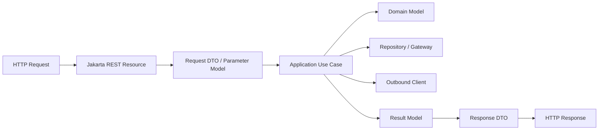
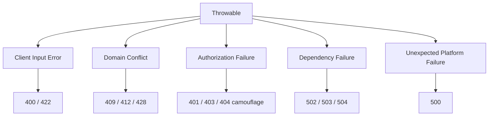
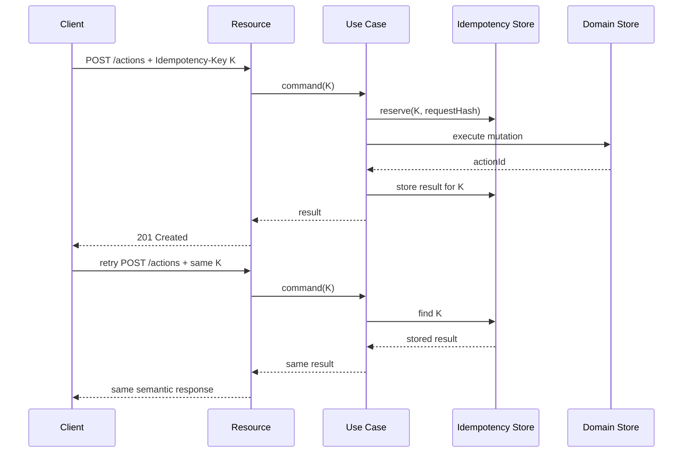
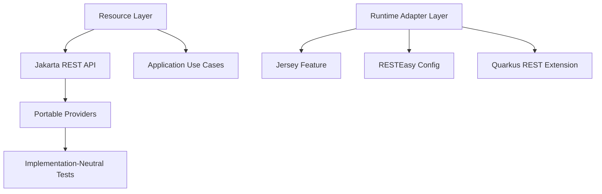
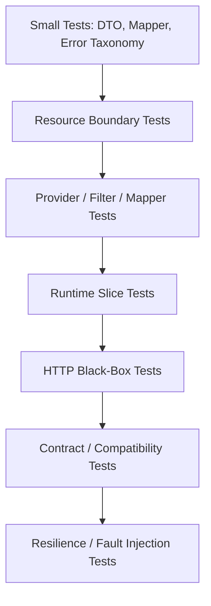
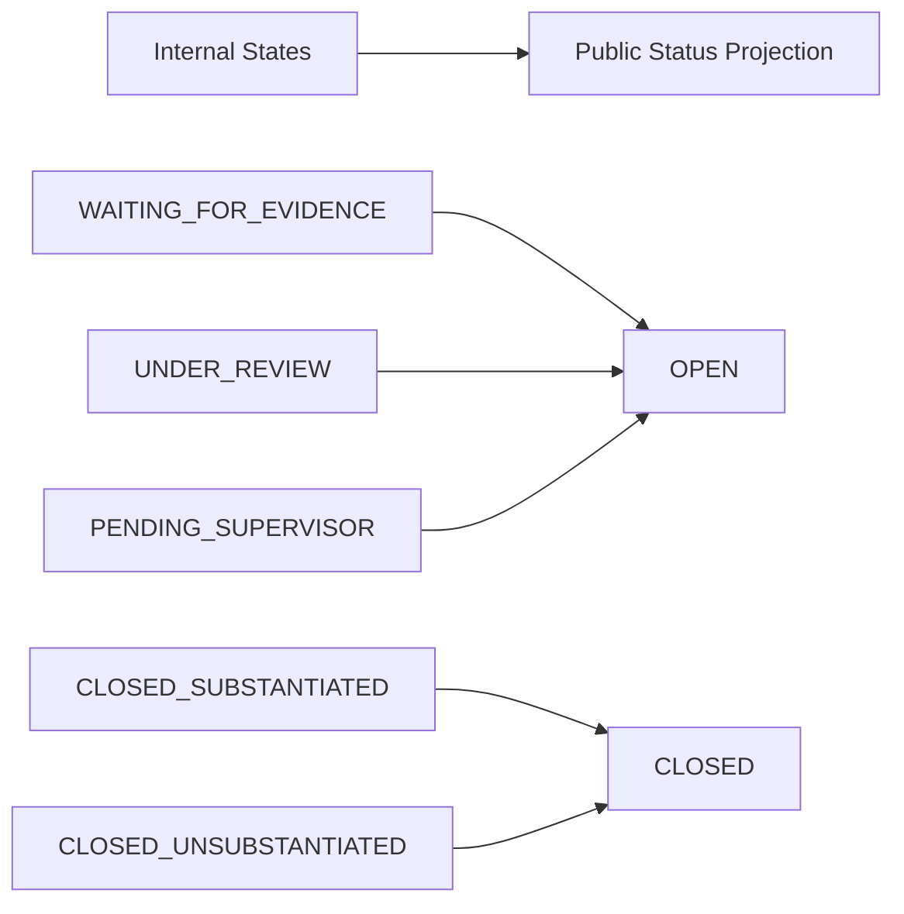

# Part 033 — Production Patterns and Anti-Patterns

> Target: setelah bagian ini, kita bisa melihat Jakarta REST service bukan sebagai kumpulan endpoint, tetapi sebagai **protocol boundary** yang punya invariants, failure model, provider pipeline, compatibility surface, dan operational contract.

Banyak engineer bisa membuat endpoint:

```java
@GET
@Path("/{id}")
public CaseDto get(@PathParam("id") UUID id) { ... }
```

Tapi production-grade Jakarta REST bukan sekadar `@Path`, `@GET`, dan JSON response. Production-grade service harus menjawab pertanyaan yang lebih keras:

- apa boundary antara HTTP dan domain?
- apa yang terjadi ketika request di-retry?
- apa yang terlihat oleh client saat domain invariant gagal?
- provider mana yang mengubah request/response?
- apakah endpoint portable antara Jersey, RESTEasy, Open Liberty, Payara, WildFly, atau Quarkus?
- apakah error, audit, trace, dan metric cukup untuk incident review?
- apakah API contract tetap aman setelah 12 bulan dan puluhan consumer?

Bagian ini merangkum pattern dan anti-pattern yang spesifik ke Jakarta REST. Kita tidak mengulang generic design pattern atau Java core pattern. Fokusnya adalah keputusan yang muncul karena kita membangun API dengan Jakarta REST runtime.

---

## 1. Mental Model: Jakarta REST as a Protocol Adapter

Pattern terpenting: **resource class bukan domain service**.

Resource class adalah adapter dari HTTP ke application use case.



Resource class melakukan translasi:

| From HTTP | To Application |
|---|---|
| Path/query/header/body | Command/query object |
| Media type | Representation model |
| Security context | Actor/subject context |
| Precondition header | concurrency guard |
| Idempotency header | mutation deduplication key |
| Domain result | status code + response DTO |
| Domain exception | problem details / error contract |

Resource class tidak boleh menjadi tempat business logic utama, transaction orchestration besar, data access langsung, atau workflow engine mini.

### Good resource shape

```java
@Path("/cases")
@Consumes(MediaType.APPLICATION_JSON)
@Produces(MediaType.APPLICATION_JSON)
public class CaseResource {

    private final CreateCaseUseCase createCase;
    private final GetCaseUseCase getCase;
    private final CaseRepresentationMapper mapper;

    public CaseResource(
            CreateCaseUseCase createCase,
            GetCaseUseCase getCase,
            CaseRepresentationMapper mapper) {
        this.createCase = createCase;
        this.getCase = getCase;
        this.mapper = mapper;
    }

    @POST
    public Response create(
            @Valid CreateCaseRequest request,
            @Context UriInfo uriInfo,
            @Context SecurityContext securityContext,
            @HeaderParam("Idempotency-Key") String idempotencyKey) {

        Actor actor = Actor.from(securityContext);
        CreateCaseCommand command = mapper.toCommand(request, actor, idempotencyKey);

        CreatedCase created = createCase.handle(command);

        URI location = uriInfo.getAbsolutePathBuilder()
                .path(created.caseId().toString())
                .build();

        return Response.created(location)
                .entity(mapper.toResponse(created))
                .tag(created.etag())
                .build();
    }

    @GET
    @Path("/{caseId}")
    public CaseResponse get(@PathParam("caseId") UUID caseId) {
        return mapper.toResponse(getCase.handle(caseId));
    }
}
```

Perhatikan batasnya:

- HTTP-specific objects hanya muncul di resource layer.
- Application layer menerima command/query object, bukan `UriInfo`, `SecurityContext`, atau `HttpHeaders`.
- Response status/header ditentukan dekat HTTP boundary.
- Mapper menjaga DTO contract tidak bocor ke domain.

---

## 2. Pattern: Thin Resource, Not Empty Resource

“Thin resource” sering disalahartikan sebagai resource yang hanya pass-through.

Resource terlalu tebal buruk, tapi resource yang terlalu kosong juga buruk karena protocol semantics tercecer di service layer.

### Resource terlalu tebal

```java
@POST
public Response approve(ApproveRequest request) {
    CaseEntity entity = em.find(CaseEntity.class, request.caseId());
    if (!entity.getStatus().equals("PENDING")) {
        return Response.status(409).build();
    }
    entity.setStatus("APPROVED");
    entity.setApprovedBy(currentUser());
    entity.setApprovedAt(Instant.now());
    audit(entity);
    em.persist(entity);
    return Response.ok(entity).build();
}
```

Masalah:

- domain invariant tersembunyi di resource;
- persistence entity keluar sebagai response;
- audit policy tidak jelas;
- transaction boundary bercampur dengan HTTP;
- sulit dites tanpa container dan database;
- error model tidak reusable.

### Resource terlalu kosong

```java
@POST
@Path("/{id}/approve")
public Object approve(ApproveRequest request) {
    return service.approve(request);
}
```

Masalah:

- status code mungkin ditentukan service;
- `Location`, `ETag`, `If-Match`, idempotency, dan header policy hilang;
- application service mulai tahu HTTP;
- boundary tidak eksplisit.

### Resource yang tepat

```java
@POST
@Path("/{caseId}/approval-decisions")
public Response approve(
        @PathParam("caseId") UUID caseId,
        @Valid ApproveCaseRequest request,
        @HeaderParam("Idempotency-Key") String idempotencyKey,
        @HeaderParam("If-Match") EntityTag ifMatch,
        @Context SecurityContext securityContext,
        @Context UriInfo uriInfo) {

    ApproveCaseCommand command = new ApproveCaseCommand(
            caseId,
            request.reasonCode(),
            request.comment(),
            Actor.from(securityContext),
            IdempotencyKey.required(idempotencyKey),
            ETagValue.required(ifMatch)
    );

    ApprovalDecisionResult result = approveCase.handle(command);

    URI location = uriInfo.getAbsolutePathBuilder()
            .path(result.decisionId().toString())
            .build();

    return Response.created(location)
            .entity(ApprovalDecisionResponse.from(result))
            .tag(result.caseEtag())
            .build();
}
```

Resource ini tidak menjalankan domain logic, tetapi tetap bertanggung jawab atas:

- path binding;
- security subject extraction;
- HTTP precondition extraction;
- idempotency key extraction;
- status code;
- response header;
- representation DTO.

---

## 3. Pattern: Resource Is a Boundary, DTO Is a Contract

DTO dalam Jakarta REST bukan sekadar object pengangkut data. DTO adalah bagian dari public contract.

### Bad: returning persistence entity

```java
@GET
@Path("/{id}")
public CaseEntity get(@PathParam("id") UUID id) {
    return repository.get(id);
}
```

Risiko:

- field internal bocor;
- lazy-loading error di serialization;
- circular graph;
- accidental N+1;
- breaking change saat schema berubah;
- annotation persistence bercampur dengan serialization;
- security field filtering sulit.

### Good: explicit representation

```java
public record CaseResponse(
        UUID id,
        String caseNumber,
        String status,
        String riskLevel,
        Instant openedAt,
        Instant updatedAt,
        List<LinkResponse> links
) {}
```

DTO harus didesain dengan pertanyaan:

- field ini dibutuhkan consumer atau hanya convenient?
- apakah field ini stabil secara business meaning?
- apakah field ini boleh terlihat oleh semua role?
- apakah null punya makna?
- apakah perubahan field ini breaking?
- apakah field ini audit-sensitive?
- apakah field ini derived, snapshot, atau source-of-truth?

### Representation contract checklist

| Question | Why it matters |
|---|---|
| Is this field public contract? | Prevent accidental exposure |
| Can this field be removed later? | Compatibility risk |
| Is null different from absent? | PATCH/error semantics |
| Is enum open or closed? | Consumer parsing risk |
| Is timestamp timezone explicit? | Audit/replay risk |
| Is money/measurement exact? | Numeric precision risk |
| Is this derived from current state? | Caching/staleness risk |
| Is it role-sensitive? | Data leakage risk |

---

## 4. Pattern: Explicit Input Models for Every Mutation

Mutation request harus punya request DTO yang spesifik.

Jangan pakai generic map kecuali benar-benar membangun dynamic schema endpoint.

### Bad

```java
@POST
@Path("/{id}/status")
public Response updateStatus(Map<String, Object> request) { ... }
```

Masalah:

- validation tidak eksplisit;
- OpenAPI buruk;
- consumer tidak tahu field yang valid;
- runtime type error muncul terlambat;
- audit diff sulit;
- security mass assignment risk.

### Good

```java
public record TransitionCaseRequest(
        @NotNull CaseTransition transition,
        @NotBlank String reasonCode,
        String comment,
        List<UUID> evidenceIds
) {}
```

Input model harus mencerminkan command intention, bukan shape database.

Untuk regulated system, request DTO mutation idealnya menjawab:

- siapa actor?
- command apa yang diminta?
- alasan bisnisnya apa?
- evidence yang mendukung apa?
- concurrency guard apa?
- idempotency guard apa?
- request ini menghasilkan record apa?

---

## 5. Pattern: Stable Error Contract, Centralized Exception Mapping

Exception mapping adalah salah satu extension point paling penting dalam Jakarta REST.

Error contract tidak boleh accidental.

### Bad

```java
try {
    return Response.ok(service.get(id)).build();
} catch (Exception e) {
    return Response.serverError()
            .entity(e.getMessage())
            .build();
}
```

Masalah:

- error shape tidak konsisten;
- sensitive detail bocor;
- `500` dipakai untuk domain error;
- observability buruk;
- duplicate handling di banyak resource;
- consumer sulit membangun recovery logic.

### Good: domain exception + mapper

```java
public final class CaseTransitionConflictException extends RuntimeException {
    private final UUID caseId;
    private final String currentStatus;
    private final String attemptedTransition;

    // getters omitted
}
```

```java
@Provider
public final class CaseTransitionConflictMapper
        implements ExceptionMapper<CaseTransitionConflictException> {

    @Context
    private HttpHeaders headers;

    @Override
    public Response toResponse(CaseTransitionConflictException ex) {
        ProblemDetails problem = ProblemDetails.conflict(
                "case-transition-conflict",
                "Case transition is not allowed from the current state",
                Map.of(
                        "caseId", ex.caseId().toString(),
                        "currentStatus", ex.currentStatus(),
                        "attemptedTransition", ex.attemptedTransition()
                )
        );

        return Response.status(Response.Status.CONFLICT)
                .type("application/problem+json")
                .entity(problem)
                .build();
    }
}
```

Jakarta REST `ExceptionMapper<T>` adalah tempat natural untuk mengubah exception menjadi HTTP response. RFC 9457 memberi format standar untuk Problem Details agar error machine-readable dan konsisten.

### Error taxonomy pattern



Gunakan taxonomy, bukan random status code.

---

## 6. Pattern: Idempotent Mutation by Design

HTTP method semantics bukan dekorasi. Ia menentukan retry safety.

Untuk mutation yang bisa diulang oleh client/gateway karena timeout, network failure, atau retry policy, desain idempotency secara eksplisit.

### Bad mutation

```java
@POST
@Path("/payments")
public PaymentResponse pay(PaymentRequest request) {
    return paymentService.charge(request);
}
```

Jika response hilang setelah charge berhasil, client retry dapat menghasilkan double charge.

### Good mutation with idempotency key

```java
@POST
@Path("/cases/{caseId}/enforcement-actions")
public Response createAction(
        @PathParam("caseId") UUID caseId,
        @HeaderParam("Idempotency-Key") String idempotencyKey,
        @Valid CreateEnforcementActionRequest request,
        @Context UriInfo uriInfo) {

    CreateActionResult result = createAction.handle(new CreateActionCommand(
            caseId,
            IdempotencyKey.required(idempotencyKey),
            request.actionType(),
            request.reasonCode(),
            request.evidenceIds()
    ));

    URI location = uriInfo.getAbsolutePathBuilder()
            .path(result.actionId().toString())
            .build();

    return Response.created(location)
            .entity(ActionResponse.from(result))
            .build();
}
```

### Idempotency table mental model



Production invariants:

- same key + same request = same result;
- same key + different request = conflict;
- key has retention policy;
- key is scoped by actor/tenant/operation;
- mutation result is persisted before response;
- ambiguous timeout can be resolved by replay.

---

## 7. Pattern: Conditional Update for Lost Update Prevention

For resources with state transitions or editable records, use conditional requests.

### Bad

```java
@PUT
@Path("/{caseId}")
public CaseResponse update(UUID caseId, UpdateCaseRequest request) {
    return service.update(caseId, request);
}
```

Dua users bisa membaca version lama, lalu update saling menimpa.

### Good

```java
@PUT
@Path("/{caseId}")
public Response update(
        @PathParam("caseId") UUID caseId,
        @HeaderParam("If-Match") EntityTag ifMatch,
        @Valid UpdateCaseRequest request) {

    UpdateCaseResult result = updateCase.handle(new UpdateCaseCommand(
            caseId,
            ETagValue.required(ifMatch),
            request.title(),
            request.description()
    ));

    return Response.ok(CaseResponse.from(result))
            .tag(result.newEtag())
            .build();
}
```

Status code discipline:

| Condition | Response |
|---|---|
| Missing precondition for protected resource | `428 Precondition Required` |
| ETag does not match current version | `412 Precondition Failed` |
| State transition violates domain rule | `409 Conflict` |
| Successful replacement | `200 OK` or `204 No Content` |
| New resource created via PUT | `201 Created` |

This pattern is especially important for regulatory workflows where an update can affect evidence, escalation, SLA, or legal defensibility.

---

## 8. Pattern: Provider Hygiene

Provider is power. Provider is also risk.

Jakarta REST providers include message body readers/writers, filters, interceptors, exception mappers, context resolvers, parameter converters, and features.

The pattern: keep providers small, explicit, and governed.

### Provider hygiene rules

| Rule | Reason |
|---|---|
| One provider, one concern | Avoid hidden side effects |
| Explicit priority | Avoid ordering surprises |
| Explicit media type | Avoid accidental provider capture |
| No business logic in provider | Preserve boundary clarity |
| No request-specific mutable field | Provider may be reused/concurrent |
| Test provider independently | Failure is cross-cutting |
| Document registration | Avoid invisible runtime behavior |
| Prefer explicit registration in strict services | Reproducibility |

### Bad provider

```java
@Provider
public class MagicJsonWriter implements MessageBodyWriter<Object> {
    // Writes every Object differently based on global flags,
    // injects audit metadata, hides nulls, maps exceptions, and logs body.
}
```

This is not extension. This is runtime magic.

### Good provider

```java
@Provider
@Produces("application/problem+json")
@Priority(Priorities.ENTITY_CODER)
public final class ProblemDetailsWriter implements MessageBodyWriter<ProblemDetails> {
    // only writes ProblemDetails as application/problem+json
}
```

Provider should be boring.

Boring provider is a feature.

---

## 9. Pattern: Name-Bound Cross-Cutting Behavior

Global filters are tempting. Use them carefully.

For behavior that should apply only to specific endpoints, use name binding.

```java
@NameBinding
@Retention(RetentionPolicy.RUNTIME)
@Target({ElementType.TYPE, ElementType.METHOD})
public @interface AuditedMutation {}
```

```java
@AuditedMutation
@POST
@Path("/{caseId}/assignment-decisions")
public Response assign(...) { ... }
```

```java
@Provider
@AuditedMutation
public class AuditMutationFilter implements ContainerResponseFilter {
    @Override
    public void filter(ContainerRequestContext request, ContainerResponseContext response) {
        // emit audit envelope after mutation response is known
    }
}
```

Use name binding for:

- audit-sensitive mutation;
- special authorization policy;
- body logging in non-sensitive endpoints;
- feature flag enforcement;
- high-risk operation metrics;
- domain-specific rate limiting.

Avoid global behavior unless every endpoint truly needs it.

---

## 10. Pattern: Resource Method as Contract Documentation

A good resource method should reveal the API contract without requiring deep navigation.

Bad:

```java
@POST
@Path("/process")
public Response process(Map<String, Object> payload) { ... }
```

Good:

```java
@POST
@Path("/{caseId}/escalation-decisions")
@Consumes(MediaType.APPLICATION_JSON)
@Produces(MediaType.APPLICATION_JSON)
@AuditedMutation
public Response createEscalationDecision(
        @PathParam("caseId") UUID caseId,
        @HeaderParam("Idempotency-Key") String idempotencyKey,
        @HeaderParam("If-Match") EntityTag caseVersion,
        @Valid CreateEscalationDecisionRequest request,
        @Context SecurityContext securityContext,
        @Context UriInfo uriInfo) {
    ...
}
```

From the method signature, we know:

- resource identity: `caseId`;
- operation shape: create escalation decision record;
- mutation idempotency required;
- optimistic concurrency required;
- input validated;
- actor derived from security context;
- response likely has `Location`.

That is readable design.

---

## 11. Pattern: Explicit Media Type Strategy

Media type is part of the contract.

Do not leave it accidental.

### Bad

```java
@GET
public Object get() { ... }
```

Depending on providers and `Accept`, response can vary unexpectedly.

### Good

```java
@GET
@Produces(MediaType.APPLICATION_JSON)
public CaseResponse get(...) { ... }
```

For mature APIs:

```java
@Produces("application/vnd.acme.case.v1+json")
```

But vendor media type should be adopted only when you have a real versioning/representation need. Otherwise it adds operational friction.

### Media type strategy options

| Strategy | Use when | Trade-off |
|---|---|---|
| `application/json` only | Simple internal API | Easy, but less representation versioning |
| URI version + JSON | Public-ish stable API | Clear, but version in path becomes visible governance |
| Vendor media type | Multiple representations per resource | Powerful, but harder for tooling/proxies |
| Problem media type | Error responses | Recommended for stable machine-readable errors |

---

## 12. Pattern: Portability Boundary

Jakarta REST is a specification. Jersey, RESTEasy, CXF, Open Liberty, Payara, WildFly, and Quarkus provide implementations/platforms.

Production pattern: keep specification code and implementation-specific code separated.



### Portable zone

- `jakarta.ws.rs.*` annotations;
- standard `Response`;
- standard filters/interceptors;
- standard exception mappers;
- standard client API;
- standard `EntityPart` for multipart in Jakarta REST 4.0;
- standard context objects.

### Runtime-specific zone

- Jersey-specific properties;
- RESTEasy-specific multipart legacy providers;
- Quarkus REST reactive annotations/config;
- server-specific scanning behavior;
- container-specific security integration;
- native image reflection config.

Do not pretend runtime-specific code is portable. Isolate it.

---

## 13. Pattern: Test the Boundary, Not the Framework

Do not spend most tests checking whether `@GET` works. The framework already has TCK coverage.

Test your API boundary decisions:

- media type negotiation;
- validation response shape;
- exception mapper behavior;
- ETag/precondition behavior;
- idempotency replay;
- security denial;
- provider/filter side effects;
- OpenAPI/contract compatibility;
- audit event emission;
- retry/failure classification;
- upload size limit;
- SSE disconnect cleanup.

### Testing pyramid for Jakarta REST



Each layer should prove a different risk.

---

## 14. Anti-Pattern: God Resource

A god resource handles many unrelated concepts.

```java
@Path("/cases")
public class CaseResource {
    @GET public List<CaseDto> search(...) { ... }
    @POST public CaseDto create(...) { ... }
    @POST @Path("/{id}/approve") public ...
    @POST @Path("/{id}/reject") public ...
    @POST @Path("/{id}/assign") public ...
    @POST @Path("/{id}/upload") public ...
    @GET @Path("/{id}/audit") public ...
    @GET @Path("/{id}/evidence") public ...
    @POST @Path("/{id}/notifications") public ...
    @POST @Path("/{id}/recalculate-risk") public ...
}
```

Symptoms:

- file grows endlessly;
- injected dependencies explode;
- tests become slow;
- unrelated policies interact;
- endpoint naming becomes inconsistent;
- code review loses focus.

Better split by resource concept:

- `CaseResource`
- `CaseEvidenceResource`
- `CaseAssignmentResource`
- `CaseDecisionResource`
- `CaseAuditResource`
- `CaseRiskResource`
- `CaseEscalationResource`

Splitting does not mean microservice splitting. It means boundary clarity inside the application.

---

## 15. Anti-Pattern: RPC over HTTP by Accident

Bad URIs:

```text
POST /caseService/doCreateCase
POST /caseService/approveCase
POST /caseService/rejectCase
POST /caseService/getCaseHistory
POST /caseService/findCasesByOfficer
```

This is RPC naming with HTTP transport.

Sometimes commands are valid. But they should be modeled intentionally.

Better:

```text
POST /cases
GET  /cases/{caseId}
GET  /cases?assignedOfficerId=...
POST /cases/{caseId}/approval-decisions
POST /cases/{caseId}/rejection-decisions
GET  /cases/{caseId}/audit-events
```

The difference is not cosmetic. It changes:

- status code expectations;
- caching possibilities;
- idempotency strategy;
- audit model;
- discoverability;
- compatibility;
- consumer mental model.

---

## 16. Anti-Pattern: Catch-All `ExceptionMapper<Throwable>` Without Taxonomy

A fallback mapper is useful. But if all errors go through one generic mapper, the API loses failure meaning.

Bad:

```java
@Provider
public class ThrowableMapper implements ExceptionMapper<Throwable> {
    public Response toResponse(Throwable t) {
        return Response.status(500)
                .entity(Map.of("error", t.getMessage()))
                .build();
    }
}
```

Problems:

- sensitive leakage;
- domain conflicts become `500`;
- validation errors become `500`;
- dependency timeouts become `500`;
- client cannot decide recovery;
- metrics cannot classify failures.

Better:

```text
ConstraintViolationException -> 400/422
InvalidRequestException      -> 400
NotFoundException            -> 404
AuthorizationException       -> 403
StateConflictException       -> 409
PreconditionFailedException  -> 412
RateLimitException           -> 429
DependencyTimeoutException   -> 504
DependencyUnavailable        -> 503
Throwable fallback           -> 500
```

Fallback mapper must be last safety net, not main error model.

---

## 17. Anti-Pattern: Header Soup

Headers are powerful, but too many custom headers create hidden contract.

Bad:

```text
X-User-Id
X-User-Role
X-Request-Mode
X-Case-State
X-Skip-Validation
X-Debug
X-Internal-Action
X-Tenant-Id
X-Feature-Version
X-Caller-System
```

Risks:

- spoofing;
- undocumented behavior;
- proxy stripping;
- consumer confusion;
- security bypass;
- hidden coupling.

Good use of headers:

| Header | Use |
|---|---|
| `Authorization` | authentication credential |
| `Accept` | response representation negotiation |
| `Content-Type` | request entity media type |
| `If-Match` | optimistic concurrency |
| `If-None-Match` | cache/conditional create/read |
| `ETag` | representation version |
| `Location` | created resource URI |
| `Idempotency-Key` | safe retry for POST mutation |
| `Retry-After` | retry guidance for rate limit/unavailability |
| `Traceparent` | trace propagation |
| `X-Correlation-ID` or equivalent | correlation, if not using W3C trace context fully |

Custom headers are not forbidden. They must be governed.

---

## 18. Anti-Pattern: Business Logic in Filters

Filters are for cross-cutting request/response processing, not domain use cases.

Bad:

```java
@Provider
public class CaseStatusFilter implements ContainerRequestFilter {
    public void filter(ContainerRequestContext ctx) {
        if (ctx.getUriInfo().getPath().contains("approve")) {
            // load case, check state, mutate audit, maybe reject
        }
    }
}
```

Problems:

- hidden behavior;
- order-dependent;
- hard to test;
- resource method no longer reveals contract;
- transaction boundary unclear;
- domain logic scattered.

Good filter responsibilities:

- authentication parsing;
- correlation ID;
- request logging metadata;
- CORS;
- rate limiting;
- response security headers;
- request size enforcement;
- audit envelope capture, not domain decision.

Domain rule belongs in application/domain layer.

---

## 19. Anti-Pattern: Body Logging by Default

Request/response body logging is dangerous in REST APIs.

Problems:

- PII leakage;
- credential/token leakage;
- evidence leakage;
- regulatory data retention problem;
- large body memory pressure;
- streaming body consumption side effect;
- expensive serialization.

Production pattern:

```text
Default: no body logging
Allowlist: non-sensitive endpoints only
Redaction: mandatory for sensitive fields
Sampling: for high-volume endpoints
Size limit: hard cap
Access control: restrict logs
Retention: aligned with data policy
```

For regulated systems, audit log and debug log are different things.

Audit log records legally relevant business action.

Debug log records technical diagnostic information.

Never mix them casually.

---

## 20. Anti-Pattern: `Response.ok()` Everywhere

Bad API smell:

```java
return Response.ok(result).build();
```

for every operation.

Status code is part of semantics.

| Operation | Better status |
|---|---|
| Synchronous create | `201 Created` + `Location` |
| Accepted async command | `202 Accepted` + operation URI |
| Successful read | `200 OK` |
| Successful replacement with body | `200 OK` |
| Successful mutation without body | `204 No Content` |
| Validation error | `400` or `422`, based on policy |
| Conflict with current state | `409 Conflict` |
| Precondition failed | `412 Precondition Failed` |
| Missing required precondition | `428 Precondition Required` |
| Rate limited | `429 Too Many Requests` |

`200 OK` is not wrong by itself. It is wrong when it hides operational meaning.

---

## 21. Anti-Pattern: Nullable Everything

JSON makes null easy. Contracts make null expensive.

Bad:

```json
{
  "assignedOfficerId": null,
  "closedAt": null,
  "riskScore": null,
  "decision": null
}
```

What does null mean?

- unknown?
- not applicable?
- not yet assigned?
- forbidden to view?
- deleted?
- not computed?
- missing due to old producer?

Pattern:

- use explicit enum state for lifecycle;
- omit fields only when contract says optional;
- document nullable fields;
- avoid null for collection: use empty array;
- avoid null for object when status explains absence;
- never use null to hide authorization unless contract explicitly says so.

Better:

```json
{
  "assignment": {
    "status": "UNASSIGNED"
  },
  "closure": {
    "status": "OPEN"
  },
  "risk": {
    "status": "NOT_CALCULATED"
  }
}
```

---

## 22. Anti-Pattern: Enum Rigidity Without Evolution Plan

Enums are attractive in Java and JSON. They are also compatibility traps.

Bad consumer behavior:

```java
switch (status) {
    case OPEN -> ...;
    case CLOSED -> ...;
}
```

Then API adds `SUSPENDED`, and consumer crashes.

Provider-side pattern:

- document whether enum is open or closed;
- add `UNKNOWN` handling in generated clients;
- avoid exposing internal workflow state if it changes often;
- expose stable public status, keep internal state private;
- use transitions endpoint for detailed workflow when needed.

Public status can be stable while internal state evolves.



---

## 23. Anti-Pattern: Leaking Workflow Engine Shape

If a workflow/BPM engine is behind the API, do not expose engine internals as public contract.

Bad:

```text
POST /process-instances/{processInstanceId}/tasks/{taskId}/complete
GET  /runtime/executions/{executionId}/variables
```

Unless the consumer is truly a workflow administration client, this leaks implementation.

Better domain API:

```text
POST /cases/{caseId}/assignment-decisions
POST /cases/{caseId}/evidence-review-decisions
GET  /cases/{caseId}/available-actions
GET  /cases/{caseId}/timeline
```

The API should represent domain actions and domain state, not engine tables.

This protects you from:

- engine migration;
- process model refactoring;
- task naming changes;
- hidden process variable coupling;
- authorization bugs.

---

## 24. Anti-Pattern: Direct `SecurityContext` Everywhere

`SecurityContext` is useful at REST boundary. It should not become a domain dependency.

Bad:

```java
public class ApproveCaseUseCase {
    public void approve(SecurityContext securityContext, UUID caseId) { ... }
}
```

Now application layer depends on Jakarta REST.

Good:

```java
public record Actor(
        String subjectId,
        Set<String> roles,
        String tenantId,
        String sourceSystem
) {}
```

Resource maps `SecurityContext` and trusted headers/token claims into `Actor`.

Application layer receives `Actor`.

This keeps application layer testable and portable.

---

## 25. Anti-Pattern: Accepting Client-Supplied Audit Fields

Bad request:

```json
{
  "status": "APPROVED",
  "approvedBy": "alice",
  "approvedAt": "2026-06-27T10:15:00Z"
}
```

Client should not supply authoritative audit fields.

Pattern:

- actor comes from authenticated context;
- timestamp comes from server clock;
- source system comes from trusted auth/client registry;
- reason/comment/evidence can come from request;
- audit record generated server-side;
- external reference can be supplied but marked as external.

Good request:

```json
{
  "reasonCode": "EVIDENCE_SUFFICIENT",
  "comment": "Evidence package reviewed and meets threshold.",
  "evidenceIds": ["8f4c5e7a-0b1f-4f0c-9a65-3a85c21a0001"]
}
```

Server derives:

```json
{
  "approvedBy": "subject-from-token",
  "approvedAt": "server-time",
  "sourceSystem": "registered-client"
}
```

---

## 26. Anti-Pattern: Unbounded Collections

Bad:

```java
@GET
@Path("/cases")
public List<CaseResponse> list() {
    return service.findAll();
}
```

Risks:

- memory blowup;
- slow DB query;
- unstable response size;
- timeout;
- gateway/proxy limits;
- client-side failure;
- operational incident.

Pattern:

```java
@GET
public CasePageResponse search(
        @BeanParam CaseSearchParams params) {
    return searchCases.handle(params.toQuery());
}
```

`CaseSearchParams` must enforce:

- maximum page size;
- default page size;
- allowed sort fields;
- allowed filters;
- stable cursor/keyset if needed;
- deterministic ordering;
- tenant/authorization scope;
- time-bound query.

Production invariant:

> No collection endpoint returns unbounded result sets.

---

## 27. Anti-Pattern: Partial Update Without Patch Semantics

Bad:

```java
@PATCH
@Path("/{id}")
public CaseResponse patch(UUID id, Map<String, Object> changes) { ... }
```

Problems:

- field grammar unclear;
- null semantics unclear;
- authorization per field unclear;
- validation unclear;
- audit diff inconsistent;
- client cannot know allowed patch paths.

Patterns:

### Option A — JSON Merge Patch

Use when resource representation is simple and merge semantics are acceptable.

### Option B — JSON Patch

Use when explicit operations are needed.

### Option C — Command-specific partial update

Often best for regulated systems.

```json
{
  "newPriority": "HIGH",
  "reasonCode": "IMMINENT_RISK",
  "comment": "Escalated due to new evidence."
}
```

Endpoint:

```text
POST /cases/{caseId}/priority-change-decisions
```

For stateful workflows, command-specific resource is usually more defensible than generic patch.

---

## 28. Anti-Pattern: Hidden Async Mutation

Bad:

```java
@POST
@Path("/cases/{id}/recalculate-risk")
public Response recalculate(UUID id) {
    queue.send(id);
    return Response.ok().build();
}
```

Client receives `200`, but mutation is queued and may fail later.

Better:

```java
@POST
@Path("/cases/{caseId}/risk-recalculation-jobs")
public Response startRiskRecalculation(...) {
    RiskJob job = useCase.start(...);

    return Response.accepted(JobResponse.from(job))
            .location(jobUri(job.id()))
            .build();
}
```

Then:

```text
GET /risk-recalculation-jobs/{jobId}
```

Async mutation needs operation/job resource.

It should expose:

- accepted time;
- operation id;
- status;
- result link;
- failure reason;
- retry/recovery guidance;
- audit reference.

---

## 29. Anti-Pattern: Treating OpenAPI as the Source of Truth Without Runtime Tests

OpenAPI is important. It is not enough.

Common problem:

- OpenAPI says endpoint returns `409`;
- resource throws unmapped exception;
- runtime returns `500`;
- contract is fiction.

Pattern:

- generate or maintain OpenAPI;
- test that runtime behavior matches OpenAPI examples;
- test error response shape;
- test media types;
- test required headers;
- test compatibility diff in CI;
- publish contract with version/deprecation policy.

Contract artifact must be verified against running service.

---

## 30. Anti-Pattern: Ignoring Request Cancellation

Clients disconnect. Gateways timeout. Browser tabs close. Mobile networks drop.

If your resource starts expensive work and ignores cancellation, you waste capacity.

Affected endpoints:

- streaming downloads;
- SSE;
- async resource;
- long-running search;
- report generation;
- bulk upload;
- outbound dependency aggregation.

Pattern:

- define cancellation behavior;
- make long-running operations explicit job resources;
- cleanup `SseEventSink` on failure;
- set timeouts;
- propagate cancellation where safe;
- avoid starting irreversible domain mutation after client cancellation unless already committed and auditable.

---

## 31. Anti-Pattern: Runtime Magic as Architecture

Examples:

- implicit classpath scanning with unclear provider list;
- global object mapper customization with no ownership;
- framework-specific auto providers;
- reflection-based field exposure;
- convention-only security rules;
- environment-specific behavior not visible in code.

Pattern:

Create an explicit runtime registry document:

```md
# Jakarta REST Runtime Registry

## Application
- class: `RegulatoryApiApplication`
- base path: `/api`

## Resources
- `CaseResource`
- `CaseEvidenceResource`
- `CaseDecisionResource`

## Providers
- `ProblemDetailsMapper`
- `ValidationExceptionMapper`
- `CorrelationIdFilter`
- `SecurityHeadersFilter`
- `JsonbContextResolver`

## Runtime-specific config
- Quarkus REST blocking policy: ...
- JSON-B config: ...
- Multipart max size: ...
```

Production systems need explicitness.

---

## 32. Positive Pattern Catalog

Use this as a practical catalog.

| Pattern | Use it when | Key invariant |
|---|---|---|
| Resource as protocol adapter | All Jakarta REST APIs | HTTP stays at boundary |
| DTO contract | Public/internal API response | Persistence/domain does not leak |
| Command-specific mutation | Workflow/state changes | Business intention is explicit |
| Idempotency key | Retriable POST mutation | Duplicate request does not duplicate effect |
| Conditional update | Concurrent editable state | Lost update prevented |
| Problem details | Machine-readable errors | Error shape stable |
| Centralized exception mapping | Consistent failures | Domain errors map predictably |
| Name-bound filters | Endpoint-specific cross-cutting behavior | No global hidden side effects |
| Provider registry | Multiple providers/features | Runtime behavior auditable |
| Job resource | Long-running async operation | Accepted work is trackable |
| Audit event outbox | Regulated mutation | Business action is durable |
| Contract tests | Multi-consumer API | Runtime matches API contract |
| Runtime adapter layer | Implementation-specific features | Portability boundary preserved |

---

## 33. Anti-Pattern Catalog

| Anti-pattern | Symptom | Consequence | Fix |
|---|---|---|---|
| Entity exposure | Resource returns JPA/entity model | leakage, lazy loading, breaking changes | DTO boundary |
| God resource | One class owns everything | low cohesion, hard tests | split by resource concept |
| RPC path | `/doSomething`, `/process` | unclear semantics | model resources/commands |
| Catch-all mapper | all errors as `500` | poor recovery/metrics | error taxonomy |
| Header soup | many custom headers | hidden coupling/security risk | governed headers |
| Business filter | domain decisions in filter | invisible behavior | use case layer |
| Body logging | full request logs | data leak/memory pressure | redacted allowlist |
| `200` everywhere | no semantic status | poor client behavior | status code discipline |
| Nullable everything | ambiguous JSON | consumer bugs | explicit states |
| Enum rigidity | new enum breaks clients | compatibility incident | open enum policy |
| Workflow leakage | engine IDs in API | implementation lock-in | domain API |
| Unbounded list | `findAll()` endpoint | outage risk | pagination/keyset |
| Hidden async | queue + `200` | invisible failure | job resource + `202` |
| Magic scanning | unclear providers | non-reproducible runtime | explicit registry |

---

## 34. Production Code Review Heuristics

When reviewing a Jakarta REST PR, ask these questions before reading implementation details.

### Resource design

- Is this endpoint a resource, a command resource, or accidental RPC?
- Does URI expose domain concept, not storage/process internals?
- Is nesting bounded and justified?
- Is collection access paginated?

### HTTP semantics

- Is method safe/idempotent where expected?
- Is mutation retry behavior defined?
- Are status codes meaningful?
- Is `Location` present for created resources?
- Are ETags/preconditions needed?

### Contract

- Are request/response DTOs explicit?
- Is null semantics documented?
- Are enums evolvable?
- Are media types explicit?
- Is error shape stable?

### Runtime

- Which providers apply?
- Which filters apply?
- Is ordering deterministic?
- Is any provider global by accident?
- Is any implementation-specific feature isolated?

### Security

- Is actor derived from trusted context?
- Is object-level authorization enforced?
- Are audit fields server-derived?
- Is body logging safe?
- Are file upload/download risks handled?

### Operability

- Are metrics/logs/traces enough to debug incident?
- Does error mapper classify failures?
- Are timeouts and cancellation handled?
- Are async operations trackable?
- Is audit event durable?

---

## 35. Case Study: Refactoring an Accidental RPC API

### Initial API

```text
POST /case/process
POST /case/approve
POST /case/reject
POST /case/uploadDocument
POST /case/getHistory
```

Problems:

- action names inconsistent;
- no clear resource identity;
- all operations use POST;
- history read is POST;
- document upload is not modeled as evidence;
- approval/rejection are not auditable decision records;
- idempotency not visible;
- state transition conflicts likely ad hoc.

### Refactored API

```text
POST /cases
GET  /cases/{caseId}
GET  /cases?status=OPEN&assignedOfficerId=...

POST /cases/{caseId}/evidence-items
GET  /cases/{caseId}/evidence-items
GET  /cases/{caseId}/evidence-items/{evidenceId}

POST /cases/{caseId}/approval-decisions
POST /cases/{caseId}/rejection-decisions
GET  /cases/{caseId}/decisions
GET  /cases/{caseId}/audit-events
```

### Why this is better

- decisions become records;
- evidence becomes resource;
- history becomes audit event collection;
- read uses GET;
- mutation endpoints can require idempotency key;
- state transition conflict maps to `409`;
- concurrency uses `If-Match`;
- response can use `201 Created` + `Location`;
- auditability improves.

---

## 36. Production Invariants

For top-tier Jakarta REST systems, define invariants explicitly.

Suggested invariants:

```text
1. No resource returns persistence entities.
2. No collection endpoint is unbounded.
3. All mutation endpoints have explicit request DTOs.
4. Retriable POST mutations require idempotency keys.
5. Concurrent state updates require preconditions or domain-level version checks.
6. All errors use stable problem details format.
7. All unexpected exceptions are mapped without leaking sensitive details.
8. All regulated mutations emit durable audit events.
9. All outbound client calls have timeout budgets.
10. All providers/filters are registered and documented.
11. Runtime-specific features are isolated behind adapter/config layers.
12. API contract changes require compatibility review.
```

These invariants are more valuable than style rules.

Style improves readability.

Invariants prevent incidents.

---

## 37. Practice Drill

Take one existing REST endpoint and classify it.

### Step 1 — Identify current shape

```text
Endpoint:
Method:
URI:
Request DTO:
Response DTO:
Status codes:
Headers:
Providers:
Filters:
Exception mappers:
Security policy:
Audit behavior:
Retry behavior:
```

### Step 2 — Find anti-patterns

Check:

- entity exposure;
- RPC path;
- missing pagination;
- `200` everywhere;
- catch-all exception;
- body logging;
- missing idempotency;
- missing precondition;
- hidden async;
- leaked workflow engine ID.

### Step 3 — Rewrite contract

Produce:

- resource URI;
- method;
- request DTO;
- response DTO;
- status codes;
- error types;
- idempotency behavior;
- concurrency behavior;
- audit event;
- tests.

### Step 4 — Add tests

At minimum:

- success response;
- validation failure;
- domain conflict;
- duplicate idempotency key;
- missing auth;
- unauthorized object access;
- error response media type;
- audit event emitted.

---

## 38. Summary

Jakarta REST gives us a clean API for mapping Java objects to web resources, but production quality depends on architectural discipline.

The strongest patterns are:

- resource as protocol adapter;
- explicit DTO contracts;
- stable error taxonomy;
- provider hygiene;
- idempotent mutation;
- conditional update;
- name-bound cross-cutting behavior;
- portability boundary;
- runtime contract testing;
- audit-aware mutation design.

The most dangerous anti-patterns are:

- exposing entities;
- RPC over HTTP by accident;
- god resources;
- business logic in filters;
- catch-all error mapping;
- body logging by default;
- unbounded collections;
- hidden async work;
- leaking workflow engine internals;
- treating runtime magic as architecture.

A top-tier engineer does not ask only “does the endpoint work?”

They ask:

> Is this API contract stable, observable, secure, retry-safe, auditable, portable, and correct under failure?

That is the difference between endpoint coding and production API engineering.

---

## References

- Jakarta RESTful Web Services 4.0 Specification: https://jakarta.ee/specifications/restful-ws/4.0/jakarta-restful-ws-spec-4.0
- Jakarta RESTful Web Services 4.0 API: https://jakarta.ee/specifications/restful-ws/4.0/apidocs/
- RFC 9110 — HTTP Semantics: https://www.rfc-editor.org/rfc/rfc9110
- RFC 9457 — Problem Details for HTTP APIs: https://www.rfc-editor.org/rfc/rfc9457
