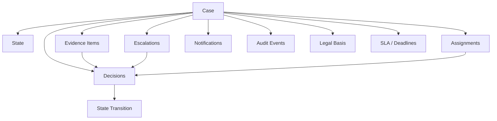
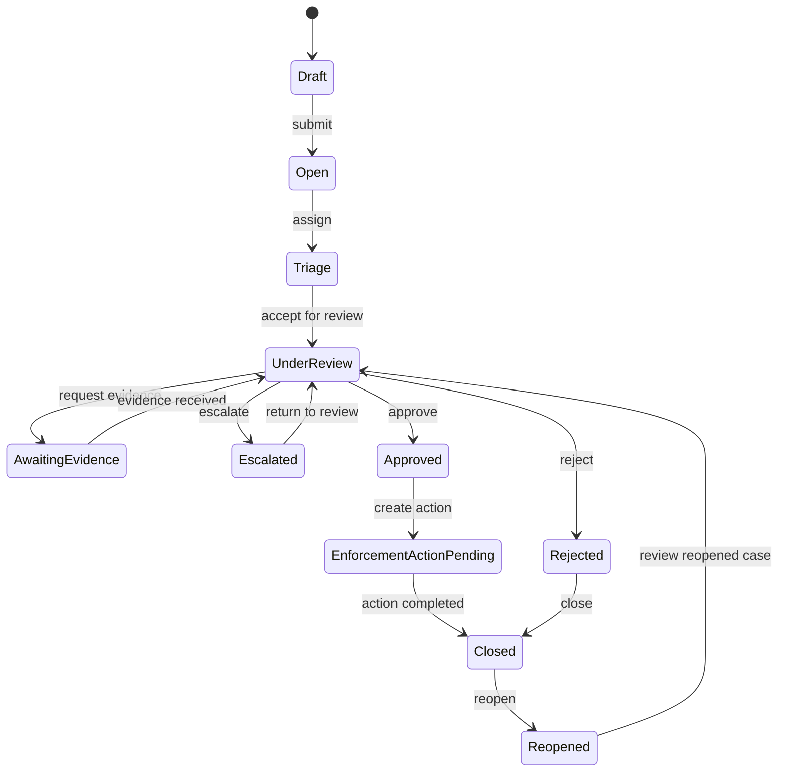
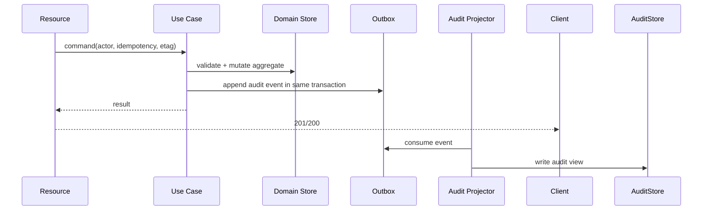
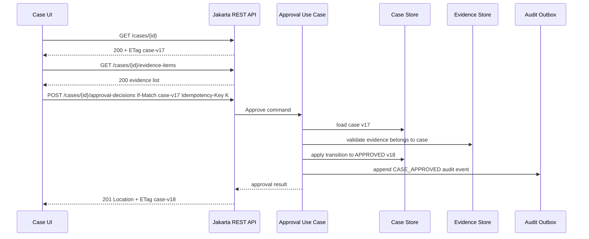
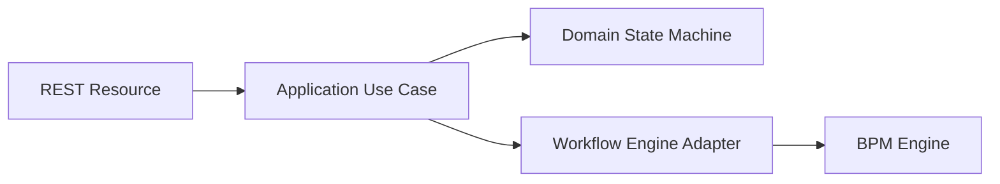
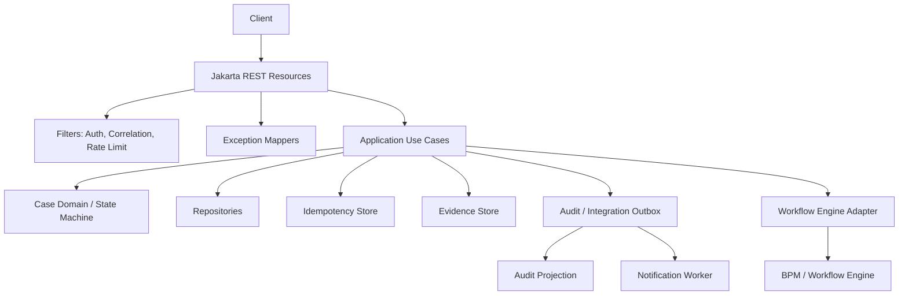

# Part 034 — Regulated Case Management API Design with Jakarta REST

> Target: setelah bagian ini, kita bisa merancang API Jakarta REST untuk sistem case-management/regulatory enforcement yang bukan hanya “berfungsi”, tetapi juga kuat secara audit, state transition, evidence handling, escalation, authorization, idempotency, dan legal defensibility.

Regulated case-management API berbeda dari CRUD API biasa.

Pada CRUD API, pertanyaan utama sering hanya:

- bagaimana create/read/update/delete data?
- field apa yang dikirim?
- siapa boleh akses?

Pada regulated case-management API, pertanyaannya jauh lebih berat:

- siapa melakukan tindakan?
- tindakan itu berdasarkan authority apa?
- evidence apa yang mendukung?
- state transition mana yang terjadi?
- apakah tindakan itu bisa diulang karena retry?
- apakah tindakan bisa dibatalkan?
- apakah keputusan menghasilkan audit record?
- apakah respons API bisa dipertahankan saat dispute, audit, appeal, atau incident?
- apakah API menyembunyikan internal workflow engine tetapi tetap memberi consumer informasi yang cukup?

Jakarta REST cocok sebagai boundary untuk tipe sistem ini karena resource, method, header, provider, filter, exception mapper, dan representation model bisa disusun menjadi contract yang eksplisit.

---

## 1. Core Mental Model

Regulated case-management bukan sekadar `Case` table.

Ia adalah lifecycle yang menghubungkan:

- case;
- party/subject;
- allegation/issue;
- evidence;
- assignment;
- review;
- decision;
- escalation;
- enforcement action;
- notification;
- audit event;
- appeal/reconsideration;
- SLA/deadline;
- authorization boundary;
- legal basis.



The API should expose domain resources and actions, not internal tables or workflow engine artifacts.

---

## 2. Boundary Principles

### Principle 1 — Case state is not just a field

Bad:

```http
PATCH /cases/{caseId}
Content-Type: application/json

{
  "status": "APPROVED"
}
```

This hides:

- who approved;
- why approval happened;
- evidence reviewed;
- precondition/version;
- authorization decision;
- audit record;
- whether approval is allowed from current state.

Better:

```http
POST /cases/{caseId}/approval-decisions
Idempotency-Key: 8c3f7a54-3df3-4d0f-a5a4-5b6934892f04
If-Match: "case-v17"
Content-Type: application/json
Accept: application/json

{
  "reasonCode": "EVIDENCE_THRESHOLD_MET",
  "comment": "Evidence package meets threshold for approval.",
  "evidenceIds": [
    "7f4583e4-ff29-4b34-a53d-50809d1d9b10"
  ]
}
```

State changes should usually be represented as **decision resources**, not direct status edits.

### Principle 2 — Decisions are first-class resources

Approval, rejection, escalation, assignment, closure, and enforcement actions should produce records.

```text
POST /cases/{caseId}/approval-decisions
POST /cases/{caseId}/rejection-decisions
POST /cases/{caseId}/closure-decisions
POST /cases/{caseId}/escalation-decisions
POST /cases/{caseId}/assignment-decisions
```

A decision resource provides:

- immutable record;
- actor;
- timestamp;
- reason;
- evidence references;
- resulting transition;
- audit link;
- appeal/dispute surface;
- traceability.

### Principle 3 — API should expose public state, not workflow internals

Bad:

```text
GET /process-instances/{pid}/tasks/{taskId}/variables
POST /tasks/{taskId}/complete
```

Good:

```text
GET  /cases/{caseId}/available-actions
POST /cases/{caseId}/assignment-decisions
POST /cases/{caseId}/evidence-review-decisions
GET  /cases/{caseId}/timeline
```

Consumer should reason in domain language.

Engine details should stay behind application layer.

---

## 3. Domain Resource Map

A practical case-management API can start with these resources.

```text
/cases
/cases/{caseId}
/cases/{caseId}/evidence-items
/cases/{caseId}/evidence-items/{evidenceId}
/cases/{caseId}/assignments
/cases/{caseId}/assignment-decisions
/cases/{caseId}/decisions
/cases/{caseId}/approval-decisions
/cases/{caseId}/rejection-decisions
/cases/{caseId}/escalation-decisions
/cases/{caseId}/enforcement-actions
/cases/{caseId}/audit-events
/cases/{caseId}/timeline
/cases/{caseId}/available-actions
/cases/{caseId}/deadlines
/cases/{caseId}/notes
/cases/{caseId}/notifications
```

Not every system needs all of them. The key is to model important legal/operational events as resources.

---

## 4. Case Resource

The case resource is the aggregate-facing public entry point.

### Create case

```http
POST /cases
Idempotency-Key: 9422c5f0-b443-4a9b-8f0f-c3cc7ad5e047
Content-Type: application/json
Accept: application/json
```

Request:

```json
{
  "caseType": "MARKET_CONDUCT_REVIEW",
  "subject": {
    "subjectType": "ORGANIZATION",
    "externalReference": "ORG-9981"
  },
  "intakeSource": "COMPLAINT_PORTAL",
  "summary": "Potential misconduct reported by consumer.",
  "initialRiskLevel": "MEDIUM"
}
```

Response:

```http
201 Created
Location: /cases/4f1e8c1d-7b5a-4f1d-ae8e-15a70e7d89dd
ETag: "case-v1"
Content-Type: application/json
```

```json
{
  "id": "4f1e8c1d-7b5a-4f1d-ae8e-15a70e7d89dd",
  "caseNumber": "MC-2026-000481",
  "status": "OPEN",
  "riskLevel": "MEDIUM",
  "openedAt": "2026-06-27T09:15:30Z",
  "links": [
    { "rel": "self", "href": "/cases/4f1e8c1d-7b5a-4f1d-ae8e-15a70e7d89dd" },
    { "rel": "evidence", "href": "/cases/4f1e8c1d-7b5a-4f1d-ae8e-15a70e7d89dd/evidence-items" },
    { "rel": "available-actions", "href": "/cases/4f1e8c1d-7b5a-4f1d-ae8e-15a70e7d89dd/available-actions" }
  ]
}
```

### Jakarta REST sketch

```java
@Path("/cases")
@Consumes(MediaType.APPLICATION_JSON)
@Produces(MediaType.APPLICATION_JSON)
public class CaseResource {

    private final CreateCaseUseCase createCase;
    private final GetCaseUseCase getCase;
    private final SearchCasesUseCase searchCases;
    private final CaseRepresentationMapper mapper;

    @POST
    public Response create(
            @HeaderParam("Idempotency-Key") String idempotencyKey,
            @Valid CreateCaseRequest request,
            @Context SecurityContext securityContext,
            @Context UriInfo uriInfo) {

        CreateCaseCommand command = mapper.toCommand(
                request,
                Actor.from(securityContext),
                IdempotencyKey.required(idempotencyKey)
        );

        CreatedCase result = createCase.handle(command);

        URI location = uriInfo.getAbsolutePathBuilder()
                .path(result.caseId().toString())
                .build();

        return Response.created(location)
                .tag(result.etag())
                .entity(mapper.toResponse(result, uriInfo))
                .build();
    }

    @GET
    @Path("/{caseId}")
    public Response get(
            @PathParam("caseId") UUID caseId,
            @Context Request request) {

        CaseView view = getCase.handle(caseId);
        Response.ResponseBuilder precondition = request.evaluatePreconditions(view.etag());

        if (precondition != null) {
            return precondition.tag(view.etag()).build();
        }

        return Response.ok(mapper.toResponse(view))
                .tag(view.etag())
                .build();
    }

    @GET
    public CasePageResponse search(@BeanParam CaseSearchParams params) {
        return mapper.toPage(searchCases.handle(params.toQuery()));
    }
}
```

### Design notes

- `Idempotency-Key` is required for create if duplicate creation has business risk.
- `ETag` helps consumers cache and perform later conditional mutation.
- Search uses `@BeanParam` to prevent query parameter chaos.
- Resource returns representation, not persistence entity.

---

## 5. Case Search and Pagination

Case search can become one of the most expensive endpoints.

Bad:

```text
GET /cases
```

with no limits.

Better:

```text
GET /cases?status=OPEN&assignedOfficerId=123&riskLevel=HIGH&createdFrom=2026-01-01&limit=50&cursor=...
```

### `@BeanParam` model

```java
public class CaseSearchParams {

    @QueryParam("status")
    private List<CaseStatus> statuses;

    @QueryParam("assignedOfficerId")
    private UUID assignedOfficerId;

    @QueryParam("riskLevel")
    private RiskLevel riskLevel;

    @QueryParam("createdFrom")
    private Instant createdFrom;

    @QueryParam("createdTo")
    private Instant createdTo;

    @QueryParam("limit")
    @DefaultValue("50")
    @Min(1)
    @Max(100)
    private int limit;

    @QueryParam("cursor")
    private String cursor;

    public SearchCasesQuery toQuery() {
        return new SearchCasesQuery(
                statuses,
                assignedOfficerId,
                riskLevel,
                createdFrom,
                createdTo,
                PageRequest.cursor(cursor, limit)
        );
    }
}
```

### Search invariants

- default limit exists;
- maximum limit exists;
- ordering is stable;
- cursor is opaque;
- filters are allowlisted;
- tenant/role filter is applied server-side;
- response does not reveal unauthorized case existence;
- search query is observable but sensitive values are redacted.

---

## 6. Evidence Resource

Evidence is not just uploaded file.

Evidence can include:

- uploaded document;
- structured form;
- external system snapshot;
- generated report;
- interview record;
- screenshot/image;
- transaction list;
- legal notice;
- correspondence;
- derived analytical result.

### Evidence item model

```text
POST /cases/{caseId}/evidence-items
GET  /cases/{caseId}/evidence-items
GET  /cases/{caseId}/evidence-items/{evidenceId}
GET  /cases/{caseId}/evidence-items/{evidenceId}/content
```

### Metadata first

For regulated systems, separate evidence metadata from binary content.

```json
{
  "evidenceType": "DOCUMENT",
  "title": "Complaint attachment",
  "source": "COMPLAINT_PORTAL",
  "receivedAt": "2026-06-27T09:10:00Z",
  "classification": "CONFIDENTIAL",
  "hash": {
    "algorithm": "SHA-256",
    "value": "..."
  }
}
```

### Multipart upload sketch

```java
@Path("/cases/{caseId}/evidence-items")
public class CaseEvidenceResource {

    @POST
    @Consumes(MediaType.MULTIPART_FORM_DATA)
    @Produces(MediaType.APPLICATION_JSON)
    public Response upload(
            @PathParam("caseId") UUID caseId,
            @FormParam("metadata") EntityPart metadataPart,
            @FormParam("file") EntityPart filePart,
            @HeaderParam("Idempotency-Key") String idempotencyKey,
            @Context SecurityContext securityContext,
            @Context UriInfo uriInfo) {

        EvidenceMetadata metadata = readMetadata(metadataPart);

        UploadEvidenceCommand command = new UploadEvidenceCommand(
                caseId,
                metadata,
                filePart.getFileName().orElse("unnamed"),
                filePart.getMediaType().orElse(MediaType.APPLICATION_OCTET_STREAM_TYPE),
                filePart.getContent(),
                Actor.from(securityContext),
                IdempotencyKey.required(idempotencyKey)
        );

        UploadedEvidence result = uploadEvidence.handle(command);

        URI location = uriInfo.getAbsolutePathBuilder()
                .path(result.evidenceId().toString())
                .build();

        return Response.created(location)
                .entity(EvidenceResponse.from(result))
                .build();
    }
}
```

Jakarta REST 4.0 standardizes multipart/form-data support through `EntityPart`, which reduces vendor lock-in compared with older implementation-specific multipart APIs.

### Evidence upload invariants

- never trust client filename;
- never trust client media type;
- compute server-side hash;
- enforce size limit;
- scan file if policy requires;
- store immutable content;
- separate metadata update from content update;
- audit upload actor/time/source;
- link evidence to decisions that use it;
- avoid reading large content into `String` or memory unnecessarily.

---

## 7. Decision Resources

A decision is a business event that may change case state.

Examples:

- assignment decision;
- evidence acceptance decision;
- escalation decision;
- approval decision;
- rejection decision;
- closure decision;
- enforcement action decision.

### Why decision resource instead of status update?

Because status update loses reason and legal trace.

```mermaid
flowchart LR
  A[Request Decision] --> B[Authorize Actor]
  B --> C[Validate Precondition]
  C --> D[Load Case State]
  D --> E[Validate Transition]
  E --> F[Validate Evidence]
  F --> G[Create Decision Record]
  G --> H[Apply State Transition]
  H --> I[Emit Audit Event]
  I --> J[Return 201 + Location]
```



### Approval endpoint

```text
POST /cases/{caseId}/approval-decisions
```

Request:

```json
{
  "reasonCode": "THRESHOLD_MET",
  "comment": "Required evidence reviewed and approved.",
  "evidenceIds": [
    "7f4583e4-ff29-4b34-a53d-50809d1d9b10",
    "7b78574e-0922-47dc-a279-bdb3eb830dd0"
  ]
}
```

Response:

```http
201 Created
Location: /cases/{caseId}/approval-decisions/{decisionId}
ETag: "case-v18"
Content-Type: application/json
```

```json
{
  "id": "18db3c8e-70f4-42b7-b451-c773af969d4a",
  "caseId": "4f1e8c1d-7b5a-4f1d-ae8e-15a70e7d89dd",
  "decisionType": "APPROVAL",
  "reasonCode": "THRESHOLD_MET",
  "statusBefore": "UNDER_REVIEW",
  "statusAfter": "APPROVED",
  "decidedBy": "officer-193",
  "decidedAt": "2026-06-27T10:00:00Z",
  "evidenceIds": [
    "7f4583e4-ff29-4b34-a53d-50809d1d9b10",
    "7b78574e-0922-47dc-a279-bdb3eb830dd0"
  ]
}
```

### Jakarta REST sketch

```java
@POST
@Path("/{caseId}/approval-decisions")
@AuditedMutation
public Response approve(
        @PathParam("caseId") UUID caseId,
        @HeaderParam("Idempotency-Key") String idempotencyKey,
        @HeaderParam("If-Match") EntityTag caseVersion,
        @Valid CreateApprovalDecisionRequest request,
        @Context SecurityContext securityContext,
        @Context UriInfo uriInfo) {

    CreateApprovalDecisionCommand command = new CreateApprovalDecisionCommand(
            caseId,
            IdempotencyKey.required(idempotencyKey),
            ETagValue.required(caseVersion),
            request.reasonCode(),
            request.comment(),
            request.evidenceIds(),
            Actor.from(securityContext)
    );

    ApprovalDecisionResult result = approveCase.handle(command);

    URI location = uriInfo.getAbsolutePathBuilder()
            .path(result.decisionId().toString())
            .build();

    return Response.created(location)
            .tag(result.newCaseEtag())
            .entity(ApprovalDecisionResponse.from(result))
            .build();
}
```

---

## 8. State Transition Design

Regulated cases usually follow a state machine.

Example:



### State transition API styles

#### Style A — Command endpoints

```text
POST /cases/{caseId}/approval-decisions
POST /cases/{caseId}/rejection-decisions
POST /cases/{caseId}/escalation-decisions
```

Best when decisions are domain-significant.

#### Style B — Generic transition endpoint

```text
POST /cases/{caseId}/transitions
```

Request:

```json
{
  "transition": "ESCALATE",
  "reasonCode": "HIGH_RISK",
  "comment": "Senior review required.",
  "evidenceIds": []
}
```

Best when many transitions share one governance model.

#### Style C — Patch status

```text
PATCH /cases/{caseId}
```

Usually weakest for regulated systems unless status is low-risk and non-legal.

### Recommendation

For regulatory/enforcement lifecycle, prefer **decision resources** or **transition resources**, not raw status patch.

---

## 9. Available Actions Resource

A consumer often needs to know what the current actor can do next.

```text
GET /cases/{caseId}/available-actions
```

Response:

```json
{
  "caseId": "4f1e8c1d-7b5a-4f1d-ae8e-15a70e7d89dd",
  "caseVersion": "case-v17",
  "actions": [
    {
      "action": "APPROVE",
      "method": "POST",
      "href": "/cases/4f1e8c1d-7b5a-4f1d-ae8e-15a70e7d89dd/approval-decisions",
      "requires": ["Idempotency-Key", "If-Match", "reasonCode"]
    },
    {
      "action": "REQUEST_EVIDENCE",
      "method": "POST",
      "href": "/cases/4f1e8c1d-7b5a-4f1d-ae8e-15a70e7d89dd/evidence-requests",
      "requires": ["Idempotency-Key", "If-Match", "requestedEvidenceType"]
    }
  ]
}
```

This is not mandatory REST purity. It is practical for workflow-driven clients.

The available actions resource should consider:

- current case state;
- actor role;
- tenant/jurisdiction;
- outstanding evidence;
- SLA/deadline;
- lock/assignment;
- legal hold;
- feature policy;
- conflict/precondition version.

Do not expose actions the actor cannot perform.

---

## 10. Assignment and Ownership

Assignment is often more than setting `assignedTo`.

It may involve:

- workload balancing;
- conflict of interest check;
- jurisdiction;
- role capability;
- supervisor approval;
- SLA recalculation;
- notification;
- audit.

### Resource model

```text
GET  /cases/{caseId}/assignments
POST /cases/{caseId}/assignment-decisions
```

Request:

```json
{
  "assigneeId": "officer-193",
  "assignmentType": "PRIMARY_REVIEWER",
  "reasonCode": "WORKLOAD_REBALANCE",
  "comment": "Assigned due to specialization in market conduct cases."
}
```

Assignment decision creates record, not just updates case row.

### Assignment invariants

- assignee must be eligible;
- actor must be authorized to assign;
- assignment must be auditable;
- previous owner remains in history;
- reassignment requires reason;
- SLA effects are explicit;
- notification is asynchronous but traceable.

---

## 11. Escalation API

Escalation is a state/routing decision with high audit importance.

```text
POST /cases/{caseId}/escalation-decisions
```

Request:

```json
{
  "escalationType": "SUPERVISOR_REVIEW",
  "reasonCode": "HIGH_PUBLIC_IMPACT",
  "comment": "Case involves multiple affected consumers and media exposure risk.",
  "evidenceIds": ["7f4583e4-ff29-4b34-a53d-50809d1d9b10"]
}
```

Response:

```json
{
  "id": "d7ee75e5-9a3e-4e04-a621-7a7e33cdf82d",
  "caseId": "4f1e8c1d-7b5a-4f1d-ae8e-15a70e7d89dd",
  "escalationType": "SUPERVISOR_REVIEW",
  "statusBefore": "UNDER_REVIEW",
  "statusAfter": "ESCALATED",
  "escalatedBy": "officer-193",
  "escalatedAt": "2026-06-27T10:20:00Z"
}
```

### Escalation failure model

| Condition | Status | Error type |
|---|---:|---|
| Case not found or hidden | `404` | `case-not-found` |
| Actor cannot escalate | `403` | `forbidden-action` |
| Case version mismatch | `412` | `precondition-failed` |
| Missing `If-Match` | `428` | `precondition-required` |
| Escalation invalid from state | `409` | `invalid-state-transition` |
| Evidence not linked to case | `422` | `invalid-evidence-reference` |
| Duplicate idempotency replay | original status | same result |
| Same idempotency key with different body | `409` | `idempotency-key-conflict` |

---

## 12. Enforcement Actions

Enforcement action may represent downstream legal/operational effect.

Examples:

- warning letter;
- penalty recommendation;
- license suspension recommendation;
- compliance order;
- referral to another agency;
- monitoring requirement.

### Resource model

```text
POST /cases/{caseId}/enforcement-actions
GET  /cases/{caseId}/enforcement-actions
GET  /cases/{caseId}/enforcement-actions/{actionId}
```

Request:

```json
{
  "actionType": "COMPLIANCE_ORDER",
  "legalBasisCode": "REG-2026-17-A",
  "reasonCode": "NON_COMPLIANCE_CONFIRMED",
  "effectiveDate": "2026-07-01",
  "evidenceIds": [
    "7f4583e4-ff29-4b34-a53d-50809d1d9b10"
  ]
}
```

### Design notes

- legal basis should be explicit;
- evidence references should be immutable;
- enforcement action should have lifecycle of its own;
- external notification may be async;
- generated document should be separate resource;
- action cannot be deleted casually; use withdrawal/reversal record.

---

## 13. Audit Events

Audit event is not the same as application log.

Application log helps engineers debug.

Audit event helps organization prove what happened.

### Audit resource

```text
GET /cases/{caseId}/audit-events
```

Response:

```json
{
  "items": [
    {
      "id": "audit-001",
      "eventType": "CASE_APPROVED",
      "actor": {
        "subjectId": "officer-193",
        "displayName": "A. Reviewer"
      },
      "occurredAt": "2026-06-27T10:00:00Z",
      "caseVersionBefore": "case-v17",
      "caseVersionAfter": "case-v18",
      "decisionId": "18db3c8e-70f4-42b7-b451-c773af969d4a",
      "correlationId": "corr-92f0e4",
      "summary": "Case approved after evidence review."
    }
  ],
  "nextCursor": null
}
```

### Audit invariants

- generated server-side;
- append-only;
- timestamp from trusted server clock;
- actor from trusted authentication context;
- includes correlation/trace id;
- links to decision/resource where possible;
- includes before/after version for state mutation;
- does not store unnecessary sensitive body;
- retained according to policy;
- protected from casual deletion;
- query access is authorized.

### Audit implementation pattern



Outbox prevents a dangerous split-brain condition where mutation succeeds but audit event disappears.

---

## 14. Timeline Resource

A timeline is not necessarily the same as audit log.

Audit log is precise and controlled.

Timeline is a user-facing projection of important events.

```text
GET /cases/{caseId}/timeline
```

Timeline may include:

- case opened;
- evidence uploaded;
- officer assigned;
- decision made;
- escalation requested;
- notification sent;
- enforcement action issued;
- case closed.

Design distinction:

| Aspect | Audit Events | Timeline |
|---|---|---|
| Purpose | proof/accountability | user comprehension |
| Audience | auditors/admin/legal | case workers/clients |
| Mutability | append-only | projection may be rebuilt |
| Detail | precise | curated |
| Sensitive data | controlled | role-filtered |
| Source | domain events/audit outbox | audit + domain projection |

Do not rely on timeline as legal audit if it is curated.

---

## 15. Authorization Model

Regulated systems need object-level authorization, not just role checks.

Bad:

```java
@RolesAllowed("CASE_OFFICER")
@GET
@Path("/{caseId}")
public CaseResponse get(UUID caseId) { ... }
```

This checks role, but not whether the officer can access this specific case.

Better:

```java
CaseView view = getCase.handle(new GetCaseQuery(
        caseId,
        Actor.from(securityContext)
));
```

Use case checks:

- role;
- tenant;
- jurisdiction;
- assignment;
- case classification;
- conflict of interest;
- legal hold;
- field-level visibility;
- action-specific authority.

### 404 vs 403

For sensitive cases, returning `404` for unauthorized resource existence may be appropriate to avoid information leakage.

Policy must be consistent.

| Scenario | Possible response |
|---|---|
| unauthenticated | `401` |
| authenticated but cannot perform action | `403` |
| resource existence must be hidden | `404` |
| field not visible | omit/redact field or return role-specific representation |

Do not decide randomly per endpoint.

---

## 16. Idempotency in Regulated Mutation

Regulated actions often have irreversible effects.

Examples:

- create case;
- approve case;
- issue enforcement action;
- send legal notice;
- upload evidence;
- assign officer;
- escalate case.

All should have retry strategy.

### Idempotency key requirements

- required for high-risk POST;
- scoped by actor/client/tenant/operation;
- stored with request hash;
- returns same semantic response for replay;
- rejects same key with different request;
- retention period defined;
- logged/audited;
- protected from unbounded storage growth.

### Command model

```java
public record CreateEscalationDecisionCommand(
        UUID caseId,
        IdempotencyKey idempotencyKey,
        ETagValue caseVersion,
        EscalationType escalationType,
        ReasonCode reasonCode,
        String comment,
        List<UUID> evidenceIds,
        Actor actor
) {}
```

Idempotency should live in application layer, not just resource layer.

Resource extracts key. Use case enforces it.

---

## 17. Concurrency and Case Versioning

Case-management is collaborative. Multiple actors may update the same case.

Use ETag or explicit version tokens for mutation.

```http
If-Match: "case-v17"
```

On success:

```http
ETag: "case-v18"
```

### Why it matters

Without version check:

- assignment can overwrite escalation;
- evidence review can be based on stale case state;
- SLA recalculation can be wrong;
- approval can happen after case is already closed;
- audit sequence becomes confusing.

### Error mapping

- missing required version: `428 Precondition Required`;
- stale version: `412 Precondition Failed`;
- valid version but invalid transition: `409 Conflict`.

Do not collapse all into `400`.

---

## 18. Error Taxonomy for Regulated APIs

Use stable problem types.

```json
{
  "type": "https://api.example.gov/problems/invalid-state-transition",
  "title": "Invalid state transition",
  "status": 409,
  "detail": "Case cannot be approved from AWAITING_EVIDENCE state.",
  "instance": "/cases/4f1e8c1d-7b5a-4f1d-ae8e-15a70e7d89dd/approval-decisions",
  "code": "CASE_INVALID_STATE_TRANSITION",
  "correlationId": "corr-92f0e4"
}
```

### Suggested problem types

| Problem type | Status | Meaning |
|---|---:|---|
| `invalid-request-body` | `400` | malformed or unreadable JSON |
| `validation-failed` | `400` or `422` | syntactically valid but violates validation |
| `case-not-found` | `404` | not found or hidden by policy |
| `forbidden-action` | `403` | actor cannot perform action |
| `invalid-state-transition` | `409` | transition not allowed from current state |
| `precondition-required` | `428` | missing version/precondition |
| `precondition-failed` | `412` | stale version |
| `idempotency-key-required` | `400` | required key missing |
| `idempotency-key-conflict` | `409` | same key, different payload |
| `evidence-not-found` | `422` | referenced evidence invalid for case |
| `case-locked` | `423` or `409` | case locked/legal hold |
| `rate-limited` | `429` | caller exceeded allowed rate |
| `dependency-unavailable` | `503` | downstream unavailable |
| `dependency-timeout` | `504` | downstream timeout |

Jakarta REST `ExceptionMapper` is the central place to preserve this taxonomy.

---

## 19. API Shape for State + Evidence + Decision

A well-designed approval flow should make dependencies visible.



This flow is defensible because:

- case version is explicit;
- evidence is referenced;
- decision is recorded;
- audit event is produced;
- response points to decision resource;
- duplicate retry can be resolved with idempotency key.

---

## 20. Avoiding Workflow Engine Leakage

Many regulated systems use BPM/workflow engines.

That is fine.

The API should not expose engine concepts unless the API is specifically for engine administration.

### Leakage examples

| Leaked concept | Why risky |
|---|---|
| process instance id | couples API to engine |
| task id | breaks when process model changes |
| execution id | implementation detail |
| variable names | hidden data contract |
| BPMN activity id | model refactor breaks consumers |
| engine incidents | platform leakage |

### Domain API over workflow engine



The resource talks domain.

The adapter talks engine.

If the engine changes, public API remains stable.

---

## 21. Notes and Comments

Case notes can be tricky because they may contain sensitive data.

```text
POST /cases/{caseId}/notes
GET  /cases/{caseId}/notes
```

Design questions:

- are notes immutable?
- can notes be edited?
- are edits audit-tracked?
- can notes be deleted?
- are notes internal-only or visible to subject?
- do notes support classification?
- do notes participate in decisions?

### Safer note model

```json
{
  "noteType": "INTERNAL_REVIEW_NOTE",
  "classification": "CONFIDENTIAL",
  "body": "Reviewer observed inconsistency in submitted transaction data."
}
```

Notes should not be a dumping ground for decision reasoning if decisions already have reason/comment fields.

---

## 22. Deadlines and SLA

Deadlines deserve explicit resource modeling.

```text
GET /cases/{caseId}/deadlines
POST /cases/{caseId}/deadline-extension-decisions
```

Deadline extension is a decision.

Request:

```json
{
  "deadlineType": "EVIDENCE_SUBMISSION",
  "newDueDate": "2026-07-15",
  "reasonCode": "SUBJECT_REQUEST_APPROVED",
  "comment": "Extension granted due to documented access issue."
}
```

SLA-related changes should be auditable because they affect fairness and compliance.

---

## 23. Notifications

Notifications are side effects. Do not hide them.

Potential resource model:

```text
POST /cases/{caseId}/notifications
GET  /cases/{caseId}/notifications
GET  /notifications/{notificationId}
```

For important legal notice:

```text
POST /cases/{caseId}/legal-notices
```

Response:

```http
202 Accepted
Location: /notifications/{notificationId}
```

If delivery is asynchronous, use `202 Accepted`, not `200 OK` pretending delivery is complete.

Notification record should include:

- intended recipient;
- channel;
- template/version;
- delivery status;
- sent timestamp;
- failure reason;
- related decision/action;
- audit link.

---

## 24. Reversal, Correction, and Appeal

Regulated systems need correction without deleting history.

Bad:

```http
DELETE /cases/{caseId}/approval-decisions/{decisionId}
```

Better:

```text
POST /cases/{caseId}/decision-reversal-decisions
POST /cases/{caseId}/correction-decisions
POST /cases/{caseId}/appeals
```

A reversal should create a new record explaining:

- what is reversed;
- why;
- authority;
- actor;
- timestamp;
- effect on case state;
- evidence/legal basis.

Audit history should remain intact.

---

## 25. Field-Level Security and Redaction

Different actors may see different representations.

Example sensitive fields:

- complainant identity;
- whistleblower information;
- confidential evidence;
- legal notes;
- internal risk score;
- enforcement recommendation;
- personally identifiable information.

Strategies:

### Strategy A — Separate endpoints

```text
GET /cases/{caseId}
GET /cases/{caseId}/confidential-summary
```

### Strategy B — Role-filtered DTO mapping

```java
CaseResponse response = mapper.toResponse(caseView, actor.visibilityPolicy());
```

### Strategy C — Explicit redaction marker

```json
{
  "complainant": {
    "visibility": "REDACTED",
    "reason": "INSUFFICIENT_PRIVILEGE"
  }
}
```

Avoid accidental null for redaction. Null is ambiguous.

---

## 26. Consistency Boundaries

Not every operation can be strongly consistent across all projections.

Separate:

- command result;
- current aggregate state;
- search index;
- timeline projection;
- audit projection;
- notification delivery;
- external system sync.

### Response should be honest

If command updates aggregate synchronously but search projection is eventually consistent, do not imply search immediately reflects it.

For async projections, consider response metadata:

```json
{
  "id": "...",
  "status": "APPROVED",
  "version": "case-v18",
  "projectionStatus": {
    "searchIndex": "PENDING",
    "timeline": "PENDING"
  }
}
```

Only expose this if consumers need it. Do not overcomplicate simple APIs.

---

## 27. Legal Defensibility Checklist

For important mutation endpoints, check:

- Is actor derived from authenticated context?
- Is actor authorization recorded or reconstructable?
- Is server timestamp used?
- Is reason code required?
- Is free-text comment bounded and sanitized?
- Are evidence references validated?
- Is case version checked?
- Is idempotency enforced?
- Is decision record immutable?
- Is audit event durable?
- Is response status semantically correct?
- Is error response safe and traceable?
- Is sensitive data excluded from logs?
- Is object-level authorization tested?
- Is retry behavior tested?
- Is reversal/correction modeled?

This checklist is often more important than framework-specific syntax.

---

## 28. Resource Class Layout for a Case API

A maintainable Java package structure:

```text
com.acme.regulatory.api.rest
  CaseResource.java
  CaseEvidenceResource.java
  CaseDecisionResource.java
  CaseAssignmentResource.java
  CaseEscalationResource.java
  CaseAuditResource.java
  CaseTimelineResource.java

com.acme.regulatory.api.rest.dto
  CaseResponse.java
  CreateCaseRequest.java
  EvidenceResponse.java
  CreateApprovalDecisionRequest.java
  ProblemDetails.java

com.acme.regulatory.api.rest.mapper
  CaseRepresentationMapper.java
  EvidenceRepresentationMapper.java
  DecisionRepresentationMapper.java

com.acme.regulatory.api.rest.provider
  ProblemDetailsExceptionMapper.java
  ValidationExceptionMapper.java
  CorrelationIdFilter.java
  AuditMutationFilter.java
  JsonbContextResolver.java

com.acme.regulatory.application
  CreateCaseUseCase.java
  ApproveCaseUseCase.java
  UploadEvidenceUseCase.java

com.acme.regulatory.domain
  Case.java
  CaseStatus.java
  CaseDecision.java
  EvidenceItem.java
  CaseStateMachine.java
```

Rule:

- `api.rest` depends on `application`;
- `application` depends on `domain`;
- `domain` does not depend on Jakarta REST;
- provider code does not perform domain mutation;
- workflow engine adapter sits behind application port.

---

## 29. Full Example: Approval Decision API

### Request DTO

```java
public record CreateApprovalDecisionRequest(
        @NotBlank String reasonCode,
        @Size(max = 4000) String comment,
        @NotEmpty List<UUID> evidenceIds
) {}
```

### Response DTO

```java
public record ApprovalDecisionResponse(
        UUID id,
        UUID caseId,
        String decisionType,
        String reasonCode,
        String statusBefore,
        String statusAfter,
        String decidedBy,
        Instant decidedAt,
        List<UUID> evidenceIds,
        List<LinkResponse> links
) {}
```

### Resource method

```java
@Path("/cases/{caseId}/approval-decisions")
@Consumes(MediaType.APPLICATION_JSON)
@Produces(MediaType.APPLICATION_JSON)
public class CaseApprovalDecisionResource {

    private final ApproveCaseUseCase approveCase;
    private final DecisionRepresentationMapper mapper;

    @POST
    @AuditedMutation
    public Response create(
            @PathParam("caseId") UUID caseId,
            @HeaderParam("Idempotency-Key") String idempotencyKey,
            @HeaderParam("If-Match") EntityTag caseVersion,
            @Valid CreateApprovalDecisionRequest request,
            @Context SecurityContext securityContext,
            @Context UriInfo uriInfo) {

        ApproveCaseCommand command = new ApproveCaseCommand(
                caseId,
                IdempotencyKey.required(idempotencyKey),
                ETagValue.required(caseVersion),
                request.reasonCode(),
                request.comment(),
                request.evidenceIds(),
                Actor.from(securityContext)
        );

        ApprovalDecisionResult result = approveCase.handle(command);

        URI location = uriInfo.getAbsolutePathBuilder()
                .path(result.decisionId().toString())
                .build();

        return Response.created(location)
                .tag(result.caseEtag())
                .entity(mapper.toApprovalDecisionResponse(result, uriInfo))
                .build();
    }
}
```

### Use case responsibilities

The use case should:

- validate idempotency key;
- load case by id with authorization scope;
- verify actor can approve;
- verify case version;
- verify state transition;
- verify evidence belongs to case and is usable;
- create decision record;
- update case state;
- append audit outbox event;
- return result with new case version.

### Resource responsibilities

The resource should:

- bind path/header/body;
- validate request DTO;
- map context to actor;
- build command;
- map result to `201 Created`;
- set `Location`;
- set new `ETag`;
- return response DTO.

---

## 30. Exception Mapper Set

A regulated API should have explicit mappers.

```text
ValidationExceptionMapper
InvalidJsonExceptionMapper
CaseNotFoundExceptionMapper
ForbiddenActionExceptionMapper
InvalidStateTransitionExceptionMapper
PreconditionRequiredExceptionMapper
PreconditionFailedExceptionMapper
IdempotencyKeyRequiredExceptionMapper
IdempotencyKeyConflictExceptionMapper
EvidenceReferenceExceptionMapper
DependencyUnavailableExceptionMapper
UnexpectedExceptionMapper
```

### Example mapper

```java
@Provider
public class InvalidStateTransitionMapper
        implements ExceptionMapper<InvalidStateTransitionException> {

    @Context
    private UriInfo uriInfo;

    @Context
    private HttpHeaders headers;

    @Override
    public Response toResponse(InvalidStateTransitionException ex) {
        ProblemDetails problem = ProblemDetails.builder()
                .type("https://api.example.gov/problems/invalid-state-transition")
                .title("Invalid state transition")
                .status(409)
                .detail("The requested transition is not allowed from the current case state.")
                .instance(uriInfo.getRequestUri().toString())
                .code("CASE_INVALID_STATE_TRANSITION")
                .property("caseId", ex.caseId().toString())
                .property("currentStatus", ex.currentStatus())
                .property("requestedTransition", ex.requestedTransition())
                .build();

        return Response.status(Response.Status.CONFLICT)
                .type("application/problem+json")
                .entity(problem)
                .build();
    }
}
```

Do not include stack traces, SQL messages, token claims, internal IDs, or workflow engine exception details in public problem responses.

---

## 31. Filters for Regulated API

Useful filters:

### Correlation filter

- read or create correlation ID;
- attach to request context;
- add response header;
- integrate with MDC/logging;
- propagate to outbound clients.

### Authentication/security context filter

- parse validated identity from container/security integration;
- build application actor;
- reject malformed credentials if not handled by container;
- avoid trusting spoofable headers from clients.

### Audit mutation filter

- capture resource/method metadata;
- capture response status;
- capture correlation ID;
- should not replace domain audit event;
- should not make legal audit dependent only on response filter.

### Security headers filter

- add response hardening headers where relevant;
- avoid leaking implementation details.

### Rate limit filter

- enforce per actor/client/tenant limits;
- return `429` with `Retry-After` when appropriate;
- log classification.

Filters should support the API boundary. They should not make domain decisions invisible.

---

## 32. Contract Testing for Defensibility

For high-risk endpoints, test not only happy path.

### Approval decision test matrix

| Test | Expected |
|---|---|
| valid approval | `201`, `Location`, new `ETag`, decision body |
| missing idempotency key | `400`, problem `idempotency-key-required` |
| duplicate key same body | same semantic result |
| duplicate key different body | `409`, problem `idempotency-key-conflict` |
| missing `If-Match` | `428`, problem `precondition-required` |
| stale `If-Match` | `412`, problem `precondition-failed` |
| invalid transition | `409`, problem `invalid-state-transition` |
| evidence not linked | `422`, problem `invalid-evidence-reference` |
| actor not assigned | `403`, problem `forbidden-action` |
| unauthorized hidden case | `404`, problem `case-not-found` |
| invalid JSON | `400`, problem `invalid-request-body` |
| validation failure | `400/422`, field errors |
| audit outbox failure | mutation rolls back or failure is explicit |

These tests are governance artifacts. They prove behavior.

---

## 33. Observability for Case APIs

Minimum metrics:

- request count by endpoint/method/status;
- latency histogram by endpoint;
- error count by problem type;
- mutation count by decision type;
- idempotency replay count;
- stale precondition count;
- authorization denial count;
- evidence upload size distribution;
- audit outbox lag;
- async job completion/failure;
- downstream dependency latency/error.

Structured log fields:

```json
{
  "timestamp": "2026-06-27T10:00:00Z",
  "level": "INFO",
  "message": "approval decision created",
  "correlationId": "corr-92f0e4",
  "traceId": "...",
  "actorId": "officer-193",
  "caseId": "4f1e8c1d-7b5a-4f1d-ae8e-15a70e7d89dd",
  "decisionId": "18db3c8e-70f4-42b7-b451-c773af969d4a",
  "caseVersionBefore": "case-v17",
  "caseVersionAfter": "case-v18",
  "result": "SUCCESS"
}
```

Never log full evidence content, tokens, sensitive notes, or raw request bodies by default.

---

## 34. API Governance Model

For regulated systems, API governance should define:

- endpoint naming rules;
- status code policy;
- error problem type registry;
- idempotency requirements;
- ETag/precondition requirements;
- audit event requirements;
- field classification/redaction rules;
- pagination requirements;
- OpenAPI publishing process;
- compatibility review process;
- deprecation policy;
- incident review linkage.

Governance should not be bureaucracy. It should encode hard-won failure prevention.

---

## 35. Common Bad Designs and Better Alternatives

| Bad design | Better design |
|---|---|
| `PATCH /cases/{id}` with `{status}` | `POST /cases/{id}/approval-decisions` |
| expose process/task IDs | expose available actions and decision resources |
| delete decision record | create reversal/correction decision |
| client sends `approvedBy` | derive actor from security context |
| client sends `approvedAt` | use server timestamp |
| upload file as base64 JSON | multipart/streamed upload with metadata |
| list all cases | paginated search with server-side authorization scope |
| generic `500` errors | problem details taxonomy |
| debug body logs | redacted structured logs + audit event |
| async queue + `200` | job resource + `202 Accepted` |
| no version check | `ETag` + `If-Match` |
| no retry model | idempotency key for mutation |

---

## 36. Implementation Blueprint

A high-level blueprint:



Key rule:

> Jakarta REST resources expose the domain contract. Application use cases enforce invariants. Domain model owns state rules. Providers/filters support cross-cutting concerns. Outbox makes audit/integration durable.

---

## 37. Capstone Preparation

The next part will build a capstone production REST service.

Before moving to capstone, you should be able to answer these design questions:

1. What is the public resource model?
2. Which mutations are decision resources?
3. Which mutations require idempotency key?
4. Which mutations require `If-Match`?
5. What are stable problem types?
6. What is the DTO contract?
7. What fields are sensitive?
8. Which endpoints are paginated?
9. Which actions emit audit events?
10. Which workflows are async/job-based?
11. Which provider/filter applies globally?
12. Which provider/filter is name-bound?
13. Which behavior is implementation-specific?
14. Which tests prove legal defensibility?

---

## 38. Summary

A regulated case-management API is not a CRUD wrapper.

It is a defensible interface over state, authority, evidence, decision, escalation, notification, and audit.

Jakarta REST gives the building blocks:

- resource classes;
- path and parameter binding;
- media type negotiation;
- entity providers;
- filters/interceptors;
- exception mappers;
- context injection;
- response/status/header model;
- client API.

But the engineering quality comes from how we use them:

- state changes become decisions;
- evidence is immutable and linked;
- audit is durable;
- identity is trusted;
- authorization is object-level;
- mutation is idempotent;
- concurrency is guarded;
- errors are stable;
- async work is trackable;
- workflow internals stay hidden;
- logs are safe;
- API behavior is tested.

For regulatory systems, this is the core mental shift:

> Do not expose “data operations”. Expose accountable domain actions with protocol semantics, evidence, state invariants, and auditability.

That is how Jakarta REST becomes a foundation for serious enforcement lifecycle systems.

---

## References

- Jakarta RESTful Web Services 4.0 Specification: https://jakarta.ee/specifications/restful-ws/4.0/jakarta-restful-ws-spec-4.0
- Jakarta RESTful Web Services 4.0 API: https://jakarta.ee/specifications/restful-ws/4.0/apidocs/
- EntityPart API: https://jakarta.ee/specifications/restful-ws/4.0/apidocs/jakarta.ws.rs/jakarta/ws/rs/core/entitypart
- RFC 9110 — HTTP Semantics: https://www.rfc-editor.org/rfc/rfc9110
- RFC 9457 — Problem Details for HTTP APIs: https://www.rfc-editor.org/rfc/rfc9457
