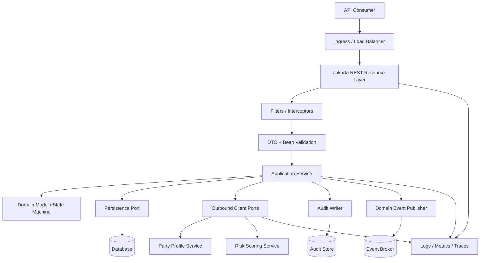
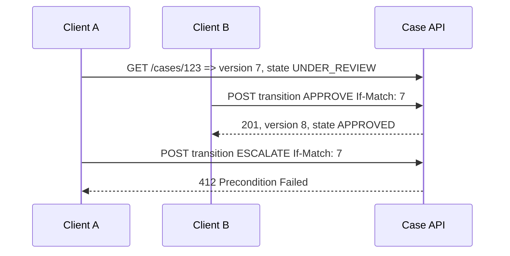
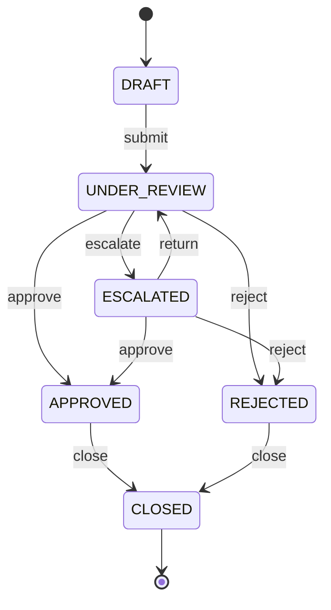
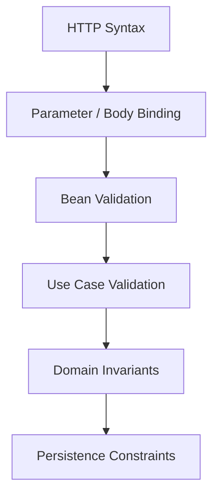
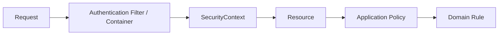
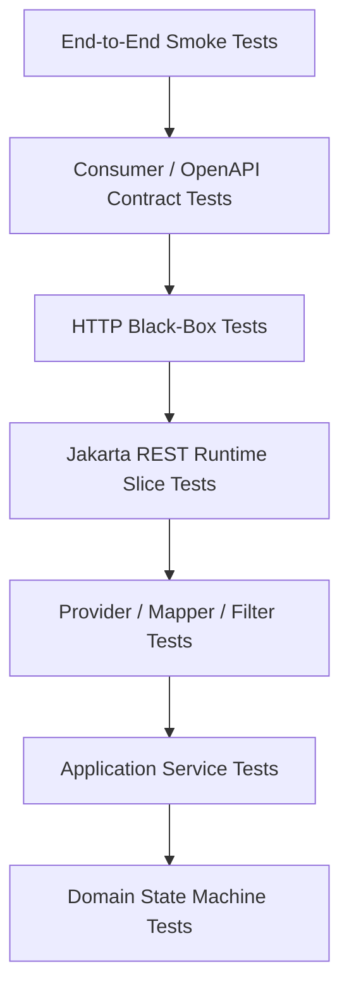
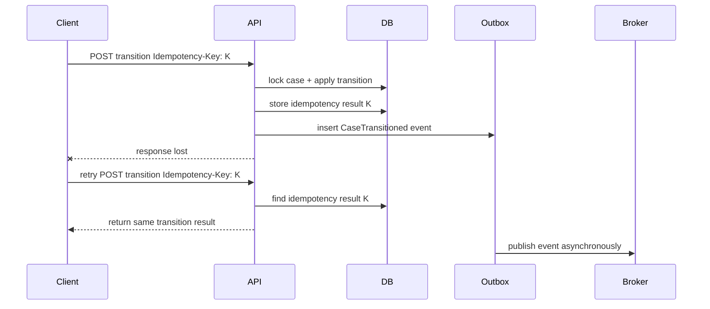

# Part 035 — Capstone: Building a Production-Grade Jakarta REST Service from Contract to Runtime

> Target: setelah bagian ini, kita bisa mengambil sebuah use case nyata, memecahnya menjadi REST contract yang defensible, menerjemahkannya menjadi resource/DTO/provider/filter/mapper/client/test/deployment architecture, lalu melakukan review production-readiness secara sistematis.

Ini adalah bagian terakhir seri.

Di bagian sebelumnya kita sudah membangun semua sub-skill:

- runtime mental model;
- application configuration;
- resource design;
- HTTP method semantics;
- URI modeling;
- parameter injection;
- content negotiation;
- message body providers;
- JSON, multipart, binary;
- response/status/header model;
- exception mapping;
- validation;
- API contract evolution;
- provider/filter/interceptor architecture;
- context injection;
- security;
- client API;
- resilience;
- MicroProfile REST Client;
- async resource;
- SSE;
- performance;
- implementation selection;
- deployment;
- observability;
- testing;
- API review;
- production patterns;
- regulated case-management design.

Sekarang semua itu digabungkan menjadi satu capstone.

Kita tidak akan membuat demo “hello world”. Kita akan mendesain sebuah **case enforcement REST service** yang realistis untuk sistem regulatory lifecycle.

---

## 1. Capstone Scenario

Bayangkan kita membangun service:

```txt
Case Enforcement API
```

Service ini menangani lifecycle sederhana tetapi production-relevant:

1. membuat case;
2. melihat case;
3. menambahkan evidence;
4. mengubah assignment;
5. melakukan state transition;
6. mengambil decision history;
7. mengambil audit timeline;
8. expose event stream untuk perubahan case;
9. memanggil downstream service untuk party profile/risk scoring;
10. menyediakan observability, error contract, validation, test, dan deployment readiness.

Domain ini sengaja dipilih karena lebih sulit dari CRUD biasa.

CRUD biasa cukup bertanya:

```txt
Can I insert/update/delete the row?
```

Regulatory case API harus bertanya:

```txt
Can this action be legally, operationally, and auditably defended later?
```

Itu mengubah desain REST secara fundamental.

---

## 2. Kaufman Framing for the Capstone

Framework Josh Kaufman dalam konteks capstone ini:

| Kaufman Principle | Applied to This Capstone |
|---|---|
| Deconstruct the skill | Pecah production REST menjadi contract, resource, representation, validation, provider, error, security, client, observability, test, deployment. |
| Learn enough to self-correct | Gunakan checklist, tests, logs, traces, and review gates untuk menemukan desain yang salah. |
| Remove practice barriers | Pakai skeleton yang jelas: DTO, resource, service, mapper, provider, test, deployment. |
| Practice deliberately | Bangun endpoint satu per satu, lalu inject failure dan review invariants. |
| Fast feedback | Contract tests, HTTP black-box tests, logs/metrics/traces, review checklist. |

Skill final bukan “hafal annotation”.

Skill final adalah kemampuan melihat request ini:

```http
POST /cases/{caseId}/transitions
```

lalu langsung bertanya:

- apakah operation idempotent?
- apakah butuh `Idempotency-Key`?
- apakah butuh `If-Match`?
- apakah actor authorized untuk transition ini?
- apakah transition legal dari current state?
- apakah evidence requirement terpenuhi?
- apa response code yang benar?
- apa audit record yang ditulis?
- apa error contract jika state stale?
- apa trace/log/metric yang wajib muncul?
- apakah retry akan membuat double transition?
- apakah API consumer bisa recover dari ambiguous failure?

---

## 3. Target Architecture

Kita akan memakai architecture yang sengaja memisahkan boundary.



Jakarta REST berada di boundary HTTP.

Ia tidak boleh menjadi tempat business rule utama.

Resource layer bertugas:

- menerima protocol input;
- melakukan parameter/body binding;
- memanggil validation;
- memetakan actor/context;
- delegasi ke application service;
- mengembalikan protocol response;
- tidak menyimpan state internal request secara unsafe;
- tidak melakukan persistence langsung kecuali untuk kasus trivial yang sudah disepakati.

---

## 4. Package Structure

Struktur package yang sehat:

```txt
com.acme.caseapi
├── CaseApplication.java
├── resource
│   ├── CaseResource.java
│   ├── CaseEvidenceResource.java
│   ├── CaseTransitionResource.java
│   └── CaseEventResource.java
├── dto
│   ├── request
│   │   ├── CreateCaseRequest.java
│   │   ├── AddEvidenceRequest.java
│   │   └── TransitionCaseRequest.java
│   ├── response
│   │   ├── CaseResponse.java
│   │   ├── EvidenceResponse.java
│   │   ├── DecisionResponse.java
│   │   └── ProblemResponse.java
│   └── common
│       ├── PageResponse.java
│       └── LinkResponse.java
├── provider
│   ├── JsonbConfigProvider.java
│   ├── ProblemExceptionMapper.java
│   ├── ValidationExceptionMapper.java
│   ├── EntityTagProvider.java
│   └── CorrelationIdFilter.java
├── client
│   ├── PartyProfileClient.java
│   ├── RiskScoringClient.java
│   └── OutboundClientExceptionMapper.java
├── application
│   ├── CaseCommandService.java
│   ├── CaseQueryService.java
│   └── CaseEventService.java
├── domain
│   ├── Case.java
│   ├── CaseState.java
│   ├── CaseTransition.java
│   ├── Evidence.java
│   └── Decision.java
├── port
│   ├── CaseRepository.java
│   ├── AuditWriter.java
│   ├── EventPublisher.java
│   └── ClockProvider.java
└── config
    └── RuntimeConfig.java
```

Kunci desain:

- `resource` tidak bocor ke `domain` consumer;
- `dto` tidak sama dengan entity persistence;
- `provider` berisi cross-cutting Jakarta REST extension;
- `client` adalah adapter outbound;
- `application` mengorkestrasi use case;
- `domain` memegang invariant;
- `port` memisahkan dependency eksternal.

---

## 5. Application Bootstrap

Contoh minimal:

```java
package com.acme.caseapi;

import jakarta.ws.rs.ApplicationPath;
import jakarta.ws.rs.core.Application;

@ApplicationPath("/api")
public class CaseApplication extends Application {
}
```

Untuk production, kita harus memutuskan:

- apakah memakai auto-discovery;
- apakah explicit registration;
- apakah runtime scanning terlalu luas;
- apakah provider tertentu harus environment-specific;
- apakah ada multi-application deployment.

Untuk service kecil sampai menengah, auto-discovery cukup praktis.

Untuk regulated platform yang perlu deterministic behavior, explicit registration bisa lebih aman.

```java
@ApplicationPath("/api")
public class CaseApplication extends Application {
    @Override
    public Set<Class<?>> getClasses() {
        return Set.of(
            CaseResource.class,
            CaseEvidenceResource.class,
            CaseTransitionResource.class,
            CaseEventResource.class,
            CorrelationIdFilter.class,
            ProblemExceptionMapper.class,
            ValidationExceptionMapper.class,
            JsonbConfigProvider.class
        );
    }
}
```

Trade-off:

| Approach | Strength | Risk |
|---|---|---|
| Auto-discovery | Fast, less boilerplate | Accidental provider/resource exposure |
| Explicit classes | Deterministic, reviewable | More maintenance |
| Explicit singletons | Full instance control | Thread-safety risk |

Rule praktis:

> Jangan pakai singleton resource jika resource menyimpan mutable state request.

---

## 6. API Contract First

Sebelum menulis resource method, tulis contract.

Minimal contract:

```txt
POST   /api/cases
GET    /api/cases/{caseId}
GET    /api/cases?state=&assignedTo=&cursor=&limit=
POST   /api/cases/{caseId}/evidence
GET    /api/cases/{caseId}/evidence
POST   /api/cases/{caseId}/transitions
GET    /api/cases/{caseId}/decisions
GET    /api/cases/{caseId}/timeline
GET    /api/cases/{caseId}/events
```

Resource model:

```mermaid
flowchart LR
  Cases[/cases/] --> Case[/cases/{caseId}/]
  Case --> Evidence[/evidence/]
  Case --> Transitions[/transitions/]
  Case --> Decisions[/decisions/]
  Case --> Timeline[/timeline/]
  Case --> Events[/events/]
```

Notice: `transitions` adalah collection resource.

Kita tidak menulis:

```txt
POST /cases/{caseId}/approve
POST /cases/{caseId}/reject
POST /cases/{caseId}/escalate
```

Itu boleh dalam sistem tertentu, tetapi untuk case-management regulated sering lebih kuat jika transition direpresentasikan sebagai record:

```txt
POST /cases/{caseId}/transitions
```

Body:

```json
{
  "type": "ESCALATE",
  "reasonCode": "HIGH_RISK_PARTY",
  "comment": "Risk score exceeded threshold",
  "evidenceIds": ["evd_123", "evd_456"]
}
```

Kenapa?

Karena transition adalah fakta audit.

Ia punya:

- actor;
- timestamp;
- from state;
- to state;
- reason;
- evidence;
- policy basis;
- correlation id;
- idempotency key;
- resulting decision/audit record.

---

## 7. DTO Contract

Gunakan DTO yang eksplisit.

```java
package com.acme.caseapi.dto.request;

import jakarta.validation.constraints.NotBlank;
import jakarta.validation.constraints.NotNull;
import jakarta.validation.constraints.Size;

public record CreateCaseRequest(
    @NotBlank
    @Size(max = 64)
    String subjectId,

    @NotBlank
    @Size(max = 64)
    String caseType,

    @NotBlank
    @Size(max = 256)
    String summary,

    @NotNull
    SourceChannel sourceChannel
) {}
```

Response DTO:

```java
package com.acme.caseapi.dto.response;

import java.time.OffsetDateTime;
import java.util.List;

public record CaseResponse(
    String caseId,
    String subjectId,
    String caseType,
    String state,
    String summary,
    String assignedTo,
    long version,
    OffsetDateTime createdAt,
    OffsetDateTime updatedAt,
    List<LinkResponse> links
) {}
```

Rule utama:

> Request DTO menjelaskan apa yang consumer boleh minta. Response DTO menjelaskan apa yang service berani janjikan.

Jangan expose entity persistence langsung.

Entity biasanya punya:

- internal id;
- foreign key;
- lazy association;
- technical flags;
- audit implementation detail;
- fields yang belum siap jadi public contract.

---

## 8. Resource Implementation Skeleton

```java
package com.acme.caseapi.resource;

import com.acme.caseapi.application.CaseCommandService;
import com.acme.caseapi.application.CaseQueryService;
import com.acme.caseapi.dto.request.CreateCaseRequest;
import com.acme.caseapi.dto.response.CaseResponse;
import jakarta.validation.Valid;
import jakarta.ws.rs.Consumes;
import jakarta.ws.rs.GET;
import jakarta.ws.rs.POST;
import jakarta.ws.rs.Path;
import jakarta.ws.rs.PathParam;
import jakarta.ws.rs.Produces;
import jakarta.ws.rs.core.Context;
import jakarta.ws.rs.core.MediaType;
import jakarta.ws.rs.core.Response;
import jakarta.ws.rs.core.SecurityContext;
import jakarta.ws.rs.core.UriInfo;

@Path("/cases")
@Consumes(MediaType.APPLICATION_JSON)
@Produces(MediaType.APPLICATION_JSON)
public class CaseResource {

    private final CaseCommandService commandService;
    private final CaseQueryService queryService;

    public CaseResource(CaseCommandService commandService, CaseQueryService queryService) {
        this.commandService = commandService;
        this.queryService = queryService;
    }

    @POST
    public Response createCase(
            @Valid CreateCaseRequest request,
            @Context UriInfo uriInfo,
            @Context SecurityContext securityContext
    ) {
        var actor = ActorContext.from(securityContext);
        var created = commandService.createCase(request, actor);

        var location = uriInfo.getAbsolutePathBuilder()
            .path(created.caseId())
            .build();

        return Response.created(location)
            .entity(created)
            .tag(Long.toString(created.version()))
            .build();
    }

    @GET
    @Path("/{caseId}")
    public Response getCase(@PathParam("caseId") String caseId) {
        CaseResponse response = queryService.getCase(caseId);

        return Response.ok(response)
            .tag(Long.toString(response.version()))
            .build();
    }
}
```

Hal yang sengaja terlihat:

- resource menerima HTTP concerns;
- `@Valid` ada di boundary;
- `UriInfo` hanya dipakai untuk build `Location`;
- `SecurityContext` dikonversi menjadi application-level actor;
- `Response.created(...)` dipakai untuk create;
- ETag/version dikembalikan;
- business logic ada di service.

Hal yang tidak boleh ada:

```java
entityManager.persist(...);       // persistence leaking into resource
Thread.sleep(...);                // blocking hack
catch (Exception e) { ... }       // local catch-all
System.out.println(...);          // unstructured log
return domainEntity;              // entity exposure
```

---

## 9. State Transition Endpoint

Transition endpoint adalah bagian tersulit.

Request DTO:

```java
public record TransitionCaseRequest(
    @NotNull CaseTransitionType type,
    @NotBlank @Size(max = 64) String reasonCode,
    @Size(max = 2000) String comment,
    List<String> evidenceIds
) {}
```

Resource:

```java
@Path("/cases/{caseId}/transitions")
@Consumes(MediaType.APPLICATION_JSON)
@Produces(MediaType.APPLICATION_JSON)
public class CaseTransitionResource {

    private final CaseCommandService commandService;

    public CaseTransitionResource(CaseCommandService commandService) {
        this.commandService = commandService;
    }

    @POST
    public Response transition(
            @PathParam("caseId") String caseId,
            @HeaderParam("Idempotency-Key") String idempotencyKey,
            @HeaderParam("If-Match") String ifMatch,
            @Valid TransitionCaseRequest request,
            @Context SecurityContext securityContext
    ) {
        var actor = ActorContext.from(securityContext);

        var result = commandService.transitionCase(
            caseId,
            request,
            actor,
            IdempotencyKey.required(idempotencyKey),
            EntityVersion.fromIfMatch(ifMatch)
        );

        return Response.status(Response.Status.CREATED)
            .entity(result)
            .tag(Long.toString(result.caseVersion()))
            .build();
    }
}
```

Kenapa `Idempotency-Key`?

Karena transition adalah mutation yang mungkin dikirim ulang oleh client saat network timeout.

Tanpa idempotency key:

```txt
Client sends transition
Server commits transition
Network fails before response reaches client
Client retries
Server applies second transition
```

Dengan idempotency key:

```txt
Client sends transition with key K
Server commits transition and stores outcome for K
Network fails before response reaches client
Client retries with K
Server returns same outcome, not a second transition
```

Kenapa `If-Match`?

Karena transition harus dibuat terhadap state/version yang diketahui client.

Tanpa `If-Match`, client bisa menjalankan transition berdasarkan state lama.



---

## 10. Application Service Invariants

Resource validates protocol input.

Application service validates use-case rules.

```java
public TransitionResult transitionCase(
        String caseId,
        TransitionCaseRequest request,
        ActorContext actor,
        IdempotencyKey idempotencyKey,
        EntityVersion expectedVersion
) {
    return idempotencyStore.executeOnce(idempotencyKey, () -> {
        Case caze = repository.findForUpdate(caseId)
            .orElseThrow(() -> new CaseNotFoundException(caseId));

        caze.requireVersion(expectedVersion);
        policy.requireCanTransition(actor, caze, request.type());
        caze.requireTransitionAllowed(request.type());
        caze.requireEvidenceFor(request.type(), request.evidenceIds());

        Transition transition = caze.transition(
            request.type(),
            request.reasonCode(),
            request.comment(),
            request.evidenceIds(),
            actor,
            clock.now()
        );

        repository.save(caze);
        auditWriter.writeTransition(caze, transition, actor);
        eventPublisher.publish(CaseEvents.transitioned(caze, transition));

        return mapper.toTransitionResult(caze, transition);
    });
}
```

Invariants:

- case must exist;
- actor must be authenticated;
- actor must be authorized;
- expected version must match;
- transition must be allowed from current state;
- required evidence must exist and belong to case;
- transition result must be persisted atomically;
- audit event must be written;
- domain event must be published or reliably queued;
- idempotent retry must return stable result.

Catatan: atomicity antara database, audit store, dan event broker tidak otomatis. Untuk production, gunakan pattern seperti outbox, transactional event table, atau platform-specific transaction strategy. Jangan hanya publish event ke broker setelah commit tanpa failure plan.

---

## 11. State Machine Model

Minimal state machine:



Transition table:

| From | Action | To | Required Evidence | Typical Status |
|---|---|---|---|---|
| `DRAFT` | `SUBMIT` | `UNDER_REVIEW` | optional | `201 Created` transition record |
| `UNDER_REVIEW` | `ESCALATE` | `ESCALATED` | risk/evidence required | `201 Created` |
| `UNDER_REVIEW` | `APPROVE` | `APPROVED` | decision basis required | `201 Created` |
| `UNDER_REVIEW` | `REJECT` | `REJECTED` | reason required | `201 Created` |
| `APPROVED` | `CLOSE` | `CLOSED` | closure basis | `201 Created` |

Failure cases:

| Failure | HTTP Status | Error Type |
|---|---:|---|
| Case not found | `404` | `case-not-found` |
| Missing idempotency key | `400` or `428` | `idempotency-key-required` |
| Stale version | `412` | `stale-case-version` |
| Actor cannot transition | `403` | `transition-forbidden` |
| Illegal state transition | `409` | `invalid-state-transition` |
| Missing evidence | `422` | `required-evidence-missing` |
| Downstream timeout | `503` | `dependency-timeout` |

---

## 12. Error Contract

Use one error shape.

```java
public record ProblemResponse(
    String type,
    String title,
    int status,
    String detail,
    String instance,
    String correlationId,
    Map<String, Object> extensions
) {}
```

Example:

```json
{
  "type": "https://errors.acme.example/case/stale-case-version",
  "title": "Stale case version",
  "status": 412,
  "detail": "The case has changed since it was last read.",
  "instance": "/api/cases/case_123/transitions",
  "correlationId": "01JZ9C8N7BS1DF4X6M6ZQ1K88R",
  "extensions": {
    "expectedVersion": 7,
    "currentVersion": 8
  }
}
```

Mapper:

```java
@Provider
@Produces(MediaType.APPLICATION_JSON)
public class ProblemExceptionMapper implements ExceptionMapper<DomainException> {

    @Context
    UriInfo uriInfo;

    @Override
    public Response toResponse(DomainException exception) {
        var problem = new ProblemResponse(
            exception.typeUri(),
            exception.title(),
            exception.status(),
            exception.safeDetail(),
            uriInfo.getRequestUri().getPath(),
            Correlation.currentId(),
            exception.extensions()
        );

        return Response.status(exception.status())
            .type(MediaType.APPLICATION_JSON_TYPE)
            .entity(problem)
            .build();
    }
}
```

Rules:

- never expose stack trace;
- never expose SQL detail;
- never expose downstream secret;
- always include correlation id;
- distinguish client-correctable error from server/dependency error;
- keep error type stable;
- include machine-readable fields for recovery when safe.

---

## 13. Validation Strategy

Validation layers:



Examples:

| Layer | Example | Status |
|---|---|---:|
| HTTP syntax | malformed JSON | `400` |
| Media type | unsupported `Content-Type` | `415` |
| Bean Validation | blank `summary` | `400` or `422` depending policy |
| Use-case validation | evidence required for escalation | `422` |
| Domain invariant | illegal transition from `CLOSED` | `409` |
| Persistence conflict | unique idempotency key conflict | `409` or replay previous response |

Do not put all validation in DTO annotations.

DTO annotations are good for shape-level constraints:

- not blank;
- max length;
- valid enum;
- valid format;
- required field.

Domain/application validation handles:

- can this actor do this?
- is this state transition allowed?
- does evidence belong to the case?
- is the SLA still active?
- has the case already been closed?

---

## 14. Correlation ID Filter

Every production API needs correlation.

```java
@Provider
@Priority(Priorities.HEADER_DECORATOR)
public class CorrelationIdFilter implements ContainerRequestFilter, ContainerResponseFilter {

    public static final String HEADER = "X-Correlation-Id";

    @Override
    public void filter(ContainerRequestContext requestContext) {
        String incoming = requestContext.getHeaderString(HEADER);
        String correlationId = CorrelationId.sanitizeOrGenerate(incoming);
        requestContext.setProperty(HEADER, correlationId);
        Correlation.set(correlationId);
    }

    @Override
    public void filter(ContainerRequestContext requestContext, ContainerResponseContext responseContext) {
        Object correlationId = requestContext.getProperty(HEADER);
        if (correlationId != null) {
            responseContext.getHeaders().putSingle(HEADER, correlationId.toString());
        }
        Correlation.clear();
    }
}
```

Important caveat:

- ThreadLocal correlation breaks with async unless context propagation is handled.
- Never trust arbitrary-long incoming correlation id.
- Sanitize format and length.
- Always propagate to outbound client calls.

---

## 15. Security Boundary

Security architecture:



Authentication answers:

```txt
Who is calling?
```

Authorization answers:

```txt
Can this actor perform this action on this resource right now?
```

Common mistake:

```java
@RolesAllowed("CASE_OFFICER")
public Response approve(...) { ... }
```

This checks only coarse role.

But regulated authorization usually also needs:

- assigned unit;
- case jurisdiction;
- case sensitivity;
- conflict of interest;
- state;
- delegation;
- emergency authority;
- separation-of-duty;
- maker-checker rule.

So use annotation for coarse gate, but enforce domain policy in application service.

```java
policy.requireCanTransition(actor, caze, request.type());
```

---

## 16. Evidence Upload Endpoint

Resource sketch:

```java
@Path("/cases/{caseId}/evidence")
public class CaseEvidenceResource {

    private final EvidenceService evidenceService;

    @POST
    @Consumes(MediaType.MULTIPART_FORM_DATA)
    @Produces(MediaType.APPLICATION_JSON)
    public Response addEvidence(
            @PathParam("caseId") String caseId,
            @FormParam("file") EntityPart filePart,
            @FormParam("metadata") EntityPart metadataPart,
            @HeaderParam("Idempotency-Key") String idempotencyKey,
            @Context SecurityContext securityContext
    ) {
        var actor = ActorContext.from(securityContext);
        var result = evidenceService.addEvidence(caseId, filePart, metadataPart, actor, idempotencyKey);

        return Response.status(Response.Status.CREATED)
            .entity(result)
            .build();
    }
}
```

Production rules:

- do not trust filename;
- do not trust content type;
- enforce max size;
- stream large files;
- scan for malware where required;
- store immutable evidence hash;
- write chain-of-custody audit event;
- separate evidence metadata from binary blob;
- support idempotency;
- never log binary content;
- include download authorization.

Evidence is not just a file.

It is a legal/operational artifact.

Represent it as:

```json
{
  "evidenceId": "evd_123",
  "caseId": "case_456",
  "filename": "sanitized-name.pdf",
  "mediaType": "application/pdf",
  "sizeBytes": 284812,
  "sha256": "...",
  "classification": "CONFIDENTIAL",
  "uploadedBy": "user_789",
  "uploadedAt": "2026-06-27T10:15:30Z"
}
```

---

## 17. SSE Event Stream

Endpoint:

```java
@GET
@Path("/cases/{caseId}/events")
@Produces(MediaType.SERVER_SENT_EVENTS)
public void streamCaseEvents(
        @PathParam("caseId") String caseId,
        @Context SseEventSink sink,
        @Context Sse sse,
        @Context SecurityContext securityContext
) {
    var actor = ActorContext.from(securityContext);
    eventService.subscribe(caseId, actor, sink, sse);
}
```

SSE event contract:

```txt
event: case-transitioned
id: evt_1001
data: {"caseId":"case_123","from":"UNDER_REVIEW","to":"ESCALATED"}
```

Production constraints:

- long-lived connections consume resources;
- proxies may buffer or timeout;
- slow clients need handling;
- reconnection needs event id strategy;
- authorization must be checked at subscribe time and sometimes rechecked;
- heartbeat prevents idle timeout;
- horizontal scaling needs shared event source or sticky routing;
- event payload must avoid sensitive leakage.

---

## 18. Outbound Client Adapter

Typed MicroProfile-style client:

```java
@RegisterRestClient(configKey = "party-profile")
@Path("/parties")
@Produces(MediaType.APPLICATION_JSON)
@Consumes(MediaType.APPLICATION_JSON)
public interface PartyProfileClient {

    @GET
    @Path("/{partyId}")
    PartyProfileResponse getParty(@PathParam("partyId") String partyId);
}
```

Adapter:

```java
@ApplicationScoped
public class PartyProfileGateway {

    private final PartyProfileClient client;

    public PartyProfileGateway(@RestClient PartyProfileClient client) {
        this.client = client;
    }

    public PartyProfile getRequiredParty(String partyId) {
        try {
            return mapper.toDomain(client.getParty(partyId));
        } catch (NotFoundException e) {
            throw new PartyNotFoundException(partyId);
        } catch (ProcessingException e) {
            throw new DependencyUnavailableException("party-profile", e);
        }
    }
}
```

Rules:

- resource should not directly call remote clients;
- map remote errors to local domain/application errors;
- set timeout budget;
- avoid retry on non-idempotent remote mutation unless explicitly safe;
- propagate correlation id;
- record metrics by dependency and operation;
- isolate downstream DTO from internal domain object.

---

## 19. Timeout Budget

Example end-to-end budget:

| Segment | Budget |
|---|---:|
| Ingress/API overhead | 50 ms |
| Auth/context loading | 40 ms |
| Database read/write | 120 ms |
| Party profile call | 150 ms |
| Risk scoring call | 200 ms |
| Serialization/response | 40 ms |
| Safety margin | 100 ms |
| Total target | 700 ms |

If API SLO is `p95 < 800 ms`, do not configure downstream calls with default infinite timeout.

Bad:

```txt
API p95 target: 800 ms
Party timeout: 10 seconds
Risk timeout: 10 seconds
DB timeout: unknown
```

Good:

```txt
API p95 target: 800 ms
Party timeout: 150 ms
Risk timeout: 200 ms
DB statement timeout: 120 ms
Overall request timeout: 700 ms
```

Timeouts are architecture, not config trivia.

---

## 20. Response and Header Policy

Create case:

```http
POST /api/cases
Content-Type: application/json
```

Response:

```http
201 Created
Location: /api/cases/case_123
ETag: "1"
X-Correlation-Id: 01JZ9C8N7BS1DF4X6M6ZQ1K88R
Content-Type: application/json
```

Get case:

```http
200 OK
ETag: "8"
Cache-Control: private, no-store
Content-Type: application/json
```

Transition:

```http
201 Created
ETag: "9"
Content-Type: application/json
```

No-content mutation alternative:

```http
204 No Content
ETag: "9"
```

Rules:

- `201` for newly created resource/record;
- `202` for accepted async job;
- `204` only if no body is useful;
- `409` for domain conflict;
- `412` for failed precondition;
- `422` for semantically invalid request when syntax is correct;
- `503` for dependency/service unavailable;
- `429` for rate limiting;
- include `Retry-After` when consumer can retry later.

---

## 21. Observability Blueprint

Minimum log event:

```json
{
  "timestamp": "2026-06-27T10:15:30Z",
  "level": "INFO",
  "service": "case-enforcement-api",
  "event": "http_request_completed",
  "method": "POST",
  "pathTemplate": "/cases/{caseId}/transitions",
  "status": 201,
  "durationMs": 184,
  "correlationId": "01JZ9C8N7BS1DF4X6M6ZQ1K88R",
  "actorId": "user_123",
  "caseId": "case_456",
  "transitionType": "ESCALATE"
}
```

Metrics:

```txt
http.server.requests.count{method,status,pathTemplate}
http.server.requests.duration{method,status,pathTemplate}
case.transition.count{type,from,to,result}
case.transition.failure.count{reason}
dependency.requests.count{dependency,operation,status}
dependency.requests.duration{dependency,operation}
idempotency.replay.count{operation}
```

Tracing spans:

```txt
HTTP POST /cases/{caseId}/transitions
  ├── load case
  ├── authorize transition
  ├── call party-profile
  ├── validate evidence
  ├── persist transition
  ├── write audit
  └── publish event
```

Audit event is not the same as log.

Log helps operations.

Audit helps accountability.

Audit event should be immutable and domain-specific:

```json
{
  "auditEventId": "aud_001",
  "caseId": "case_456",
  "actorId": "user_123",
  "action": "CASE_ESCALATED",
  "fromState": "UNDER_REVIEW",
  "toState": "ESCALATED",
  "reasonCode": "HIGH_RISK_PARTY",
  "evidenceIds": ["evd_123"],
  "correlationId": "01JZ9C8N7BS1DF4X6M6ZQ1K88R",
  "occurredAt": "2026-06-27T10:15:30Z"
}
```

---

## 22. Testing Plan

Testing pyramid for this capstone:



### 22.1 Domain State Machine Tests

Test:

- allowed transitions;
- forbidden transitions;
- evidence requirements;
- version mismatch;
- closed case cannot mutate;
- maker-checker rule.

### 22.2 Resource Tests

Test:

- correct status code;
- correct headers;
- correct `Location`;
- correct `ETag`;
- validation failure response;
- content negotiation behavior;
- path/query/header parameter handling.

### 22.3 Exception Mapper Tests

Test:

- domain exception maps to expected problem type;
- validation error maps to stable shape;
- correlation id included;
- stack trace absent;
- media type correct.

### 22.4 Idempotency Tests

Test:

1. first transition succeeds;
2. retry with same key returns same result;
3. retry with same key but different body fails or returns conflict;
4. concurrent same-key requests do not double-apply transition;
5. key expires according to policy.

### 22.5 Contract Tests

Test:

- OpenAPI spec matches runtime behavior;
- generated examples are valid;
- required fields are documented;
- error responses are documented;
- consumer assumptions are captured.

### 22.6 Fault Injection Tests

Test:

- party service timeout;
- risk scoring unavailable;
- DB deadlock/retry;
- audit store unavailable;
- event publish failure;
- slow evidence upload;
- client disconnect during SSE.

---

## 23. Deployment Readiness

Runtime checklist:

- `/health/live` returns process liveness;
- `/health/ready` checks DB, required dependencies, migration state;
- startup probe accounts for warmup;
- graceful shutdown stops accepting new traffic;
- long-running SSE connections are drained;
- request timeout configured;
- DB pool bounded;
- outbound pool bounded;
- max upload size configured;
- JSON body size configured;
- access log structured;
- metrics exported;
- traces exported;
- config externalized;
- secrets not in env dumps/logs;
- dependency versions pinned;
- API contract versioned;
- migration rollback plan exists.

Container memory:

```txt
Container memory limit
  -> JVM max heap
  -> metaspace
  -> direct buffers
  -> thread stacks
  -> native memory
  -> file upload temp buffers
```

Do not set heap equal to container memory.

---

## 24. Production Failure Walkthrough

Scenario:

```txt
Consumer sends transition ESCALATE.
API commits DB transaction.
Audit write succeeds.
Event publish fails.
HTTP response times out before reaching consumer.
Consumer retries.
```

Bad design:

- no idempotency key;
- event publish inline after DB commit;
- no outbox;
- no durable record of response;
- retry creates duplicate transition;
- audit timeline has inconsistent event sequence.

Good design:

- idempotency key required;
- transition and idempotency result stored transactionally;
- event written to outbox table;
- separate publisher sends event;
- retry returns stored result;
- audit event exists once;
- event publish can recover later.

Mermaid:



---

## 25. Performance Review

Do not optimize blindly.

Review cost per endpoint:

| Endpoint | Main Cost | Optimization Lever |
|---|---|---|
| `GET /cases/{id}` | DB read + JSON | projection, ETag, cache policy |
| `GET /cases` | query + pagination | keyset/cursor, index, bounded limit |
| `POST /cases` | validation + insert | id generation, DTO mapping |
| `POST /transitions` | lock + policy + audit | short transaction, outbox, idempotency |
| `POST /evidence` | upload stream + storage | streaming, size limit, async scan |
| `GET /events` | long connection | heartbeat, connection cap, broker fanout |

Performance invariants:

- collection endpoint must be bounded;
- body size must be bounded;
- outbound timeout must be bounded;
- retry must be bounded;
- connection pool must be bounded;
- resource method must not block event-loop threads in reactive runtime;
- logs must not serialize large bodies;
- JSON serialization should not trigger lazy persistence loads.

---

## 26. Compatibility and Evolution

Rules for evolving this API:

Safe changes:

- add optional response field;
- add optional request field with default behavior;
- add new endpoint;
- add new link relation;
- add new enum only if clients are designed to tolerate unknown values;
- add new error type only if generic handling exists.

Dangerous changes:

- remove field;
- rename field;
- change field type;
- change enum semantics;
- change status code semantics;
- change idempotency behavior;
- change pagination order;
- make optional field required;
- change error type URI.

For regulated APIs, compatibility is not only technical.

It affects:

- audit interpretation;
- reports;
- legal evidence;
- downstream workflow;
- operational dashboards;
- training material;
- SLA monitoring.

---

## 27. Implementation Decision Record

Before production, write an ADR.

```md
# ADR: Case Enforcement API Jakarta REST Runtime

## Context
We need a production REST API for regulated case lifecycle operations.

## Decision
Use Jakarta REST 4.0 baseline on Jakarta EE 11-compatible runtime.
Use explicit provider registration for deterministic behavior.
Use DTO boundary, problem response, idempotency key for mutation commands, ETag for concurrency control, and outbox for domain events.

## Consequences
- More upfront design work than CRUD resources.
- Stronger compatibility and audit behavior.
- Runtime portability maintained except documented adapters.
- Testing must include contract, idempotency, and fault injection.
```

ADR forces architecture intent to become explicit.

---

## 28. Mastery Rubric

Use this rubric to evaluate yourself.

### Level 1 — Can Build Endpoints

You can:

- create resource class;
- use `@Path`, `@GET`, `@POST`;
- consume/produce JSON;
- return simple DTO;
- deploy basic app.

This is not enough for top-tier engineering.

### Level 2 — Can Build Correct APIs

You can:

- choose HTTP method/status correctly;
- design URI resources;
- handle validation;
- map exceptions;
- use DTOs;
- test resource behavior.

### Level 3 — Can Build Production APIs

You can:

- design idempotency;
- use ETag/preconditions;
- design error taxonomy;
- configure filters/providers;
- propagate correlation;
- set timeout budget;
- define metrics/traces/logging;
- build contract tests;
- reason about deployment readiness.

### Level 4 — Can Build Defensible Systems

You can:

- model state transitions as audit facts;
- design evidence lifecycle;
- enforce object-level authorization;
- prevent duplicate mutation under retry;
- preserve compatibility;
- explain failure mode and recovery;
- defend API behavior in audit/incident/review;
- separate protocol boundary from domain invariant.

### Level 5 — Can Lead API Architecture

You can:

- choose implementation/runtime based on constraints;
- write API governance checklist;
- identify portability risks;
- design migration path from legacy JAX-RS;
- review other engineers' REST APIs structurally;
- detect anti-patterns early;
- connect API design to organizational operating model.

---

## 29. Final Production Checklist

Before approving a Jakarta REST API for production, verify:

### Contract

- [ ] Resource model is stable and not RPC disguised as REST.
- [ ] HTTP methods match semantics.
- [ ] Status codes are documented.
- [ ] Error response shape is stable.
- [ ] Pagination/filtering/sorting are bounded and documented.
- [ ] Versioning/deprecation policy exists.

### Implementation

- [ ] Resource layer is thin.
- [ ] DTOs are not persistence entities.
- [ ] Validation is layered.
- [ ] Exception mappers are deterministic.
- [ ] Filters/interceptors have clear responsibility.
- [ ] Provider registration is controlled.
- [ ] Runtime-specific behavior is isolated.

### Security

- [ ] Authentication boundary is clear.
- [ ] Object-level authorization is enforced.
- [ ] Sensitive fields are not leaked.
- [ ] Upload/download endpoints validate trust boundary.
- [ ] Error responses are safe.
- [ ] Audit event contains required actor/action/context.

### Reliability

- [ ] Mutations have idempotency strategy.
- [ ] Concurrent updates use version/precondition strategy.
- [ ] Downstream calls have timeout budget.
- [ ] Retry policy is operation-aware.
- [ ] Outbox or equivalent handles event publishing reliability.
- [ ] Graceful shutdown is tested.

### Observability

- [ ] Correlation id exists and propagates.
- [ ] Metrics cover rate/error/duration.
- [ ] Dependency metrics exist.
- [ ] Tracing includes inbound and outbound calls.
- [ ] Audit logs are distinct from operational logs.
- [ ] Dashboards and alerts reflect user-impacting symptoms.

### Testing

- [ ] Domain state machine tests exist.
- [ ] Resource behavior tests exist.
- [ ] Provider/filter/mapper tests exist.
- [ ] Contract tests exist.
- [ ] Fault injection tests exist.
- [ ] Idempotency/concurrency tests exist.
- [ ] Security tests include IDOR/object-level checks.

### Deployment

- [ ] Health/readiness/liveness are meaningful.
- [ ] Config is externalized.
- [ ] Secrets are protected.
- [ ] Memory/thread/pool limits are tuned.
- [ ] Upload/temp storage limits are configured.
- [ ] Rollback plan exists.
- [ ] Smoke tests run after deploy.

---

## 30. Common Final Anti-Patterns

### 30.1 Resource Owns Business Logic

Bad:

```java
@POST
@Path("/{id}/approve")
public Response approve(...) {
    Case c = entityManager.find(Case.class, id);
    c.setStatus("APPROVED");
    entityManager.persist(c);
    return Response.ok(c).build();
}
```

Problems:

- resource owns persistence;
- no state invariant;
- no audit;
- no idempotency;
- no authorization beyond path;
- exposes entity;
- unclear retry behavior.

### 30.2 All Errors Are 500

Bad:

```json
{
  "message": "Something went wrong"
}
```

Problem: consumer cannot recover.

### 30.3 Everything Is POST

Bad:

```txt
POST /getCase
POST /listCases
POST /deleteCase
POST /approveCase
```

Problem: HTTP semantics, caching, observability, and client behavior degrade.

### 30.4 No Boundary Between Audit and Log

Bad:

```txt
INFO user approved case
```

Problem: not enough for defensibility.

### 30.5 Provider Sprawl

Bad:

- many broad filters;
- global body logging;
- overlapping mappers;
- provider order undocumented;
- runtime-specific behavior hidden.

Problem: production behavior becomes non-local and hard to reason about.

---

## 31. What “Top 1%” Looks Like Here

A strong engineer can implement endpoints.

A top-tier engineer can explain the contract, failure modes, and operational consequences.

For Jakarta REST, top-tier skill means:

- you understand the runtime pipeline;
- you know where protocol ends and domain begins;
- you design error contracts intentionally;
- you treat retries as a correctness issue;
- you do not confuse async API with non-blocking architecture;
- you isolate runtime-specific decisions;
- you make observability a first-class design concern;
- you use tests to preserve contract, not only code coverage;
- you model regulated actions as durable facts;
- you can review another API and identify structural risk before production.

---

## 32. Final Exercise

Build the capstone in small slices.

### Slice 1 — Contract

Write OpenAPI or equivalent contract for:

- create case;
- get case;
- transition case;
- add evidence;
- list timeline.

### Slice 2 — Resource Layer

Implement resources with DTOs and validation.

### Slice 3 — Error Model

Implement problem response and mappers.

### Slice 4 — State Machine

Implement transition invariant tests.

### Slice 5 — Idempotency

Make transition retry-safe.

### Slice 6 — Observability

Add correlation, metrics, structured logs, and traces.

### Slice 7 — Fault Injection

Break downstream services and verify response behavior.

### Slice 8 — Deployment

Containerize, add probes, configure timeouts and pools.

### Slice 9 — Review

Run the production checklist.

### Slice 10 — Defend

Write one-page architecture review explaining:

- what the API guarantees;
- what it does not guarantee;
- what happens under retry;
- what happens under concurrency;
- what happens under partial failure;
- what evidence exists for audit.

If you can do that clearly, you are no longer just “using JAX-RS”. You are designing production REST systems.

---

## 33. Series Completion

This is the final part of the series:

```txt
learn-java-jakarta-restful-web-services
```

The complete series contains 35 parts:

1. Kaufman Skill Map
2. JAX-RS to Jakarta REST Evolution
3. REST Runtime Mental Model
4. Application Configuration
5. Resource Class Design
6. HTTP Method Semantics
7. URI Design and Resource Modeling
8. Parameter Injection
9. Content Negotiation
10. MessageBodyReader and MessageBodyWriter
11. JSON Binding and JSON Processing
12. Multipart, Forms, and Binary Payloads
13. Response API, Status, and Headers
14. Exception Mapping
15. Validation Boundary
16. API Contract Design
17. Provider Model
18. Filters and Interceptors
19. Context Injection
20. Security in Jakarta REST
21. Client API Mental Model
22. Client Resilience
23. MicroProfile REST Client
24. Async Resources
25. Server-Sent Events
26. Performance and Resource Efficiency
27. Implementation Landscape
28. Quarkus REST and RESTEasy Classic
29. Packaging, Deployment, and Cloud Runtime
30. Observability
31. Testing Strategy
32. API Review Checklists
33. Production Patterns and Anti-Patterns
34. Regulated Case Management API Design
35. Capstone Production REST Service

Seri selesai di Part 035.

---

## References

- Jakarta RESTful Web Services 4.0 Specification: https://jakarta.ee/specifications/restful-ws/4.0/
- Jakarta RESTful Web Services 4.0 API: https://jakarta.ee/specifications/restful-ws/4.0/apidocs/
- Jakarta EE Platform 11: https://jakarta.ee/specifications/platform/11/
- MicroProfile REST Client: https://microprofile.io/specifications/rest-client/
- MicroProfile OpenAPI: https://microprofile.io/specifications/open-api/
- MicroProfile Telemetry: https://microprofile.io/specifications/telemetry/
- RFC 9110 HTTP Semantics: https://www.rfc-editor.org/rfc/rfc9110
- RFC 9457 Problem Details for HTTP APIs: https://www.rfc-editor.org/rfc/rfc9457
