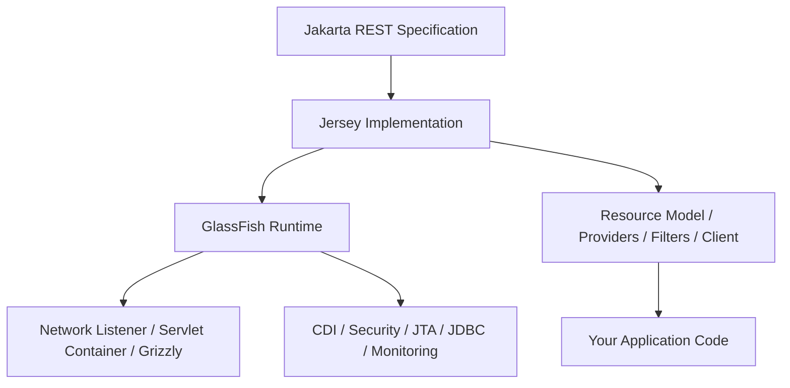
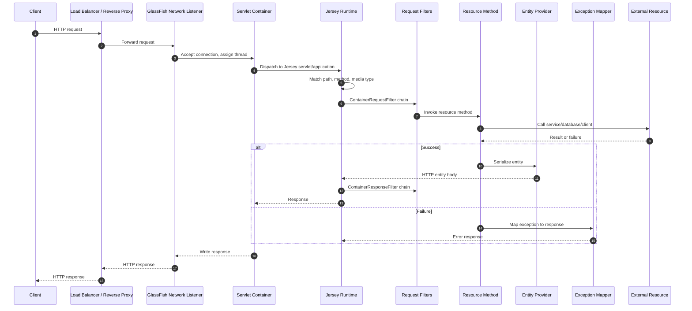
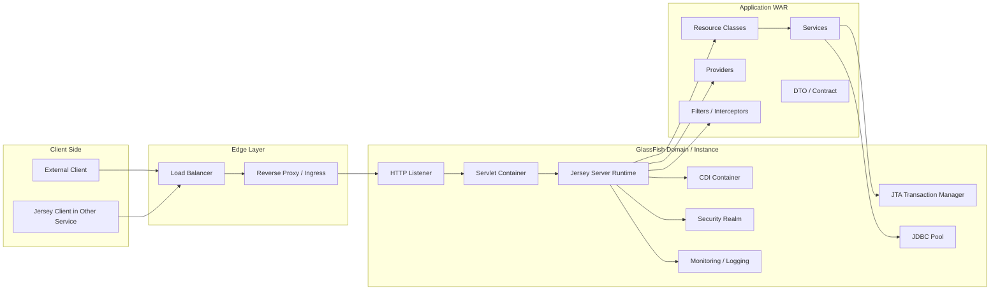

# Part 001 — Kaufman Skill Map: Jersey + GlassFish Runtime Thinking

## Tujuan Part Ini

Part ini adalah peta belajar untuk seri **Eclipse Jersey + GlassFish**. Kita tidak mulai dari `@Path`, `@GET`, atau `Response.ok()` karena itu sudah masuk wilayah basic Jakarta REST/JAX-RS. Fokus part ini adalah membangun **mental model runtime**: bagaimana request benar-benar bergerak dari network listener, masuk ke server runtime, diteruskan ke Servlet/Jersey, diproses oleh resource model, melewati provider/filter/interceptor, lalu keluar lagi sebagai HTTP response yang bisa diobservasi, diamankan, di-scale, dan di-debug.

Setelah part ini, targetnya kamu mampu menjawab pertanyaan seperti:

1. “Di mana sebenarnya Jersey berjalan ketika aplikasi dideploy ke GlassFish?”
2. “Apa beda Jakarta REST specification, Jersey implementation, dan GlassFish application server?”
3. “Kenapa endpoint yang benar secara kode tetap bisa gagal saat deployment?”
4. “Apa saja sub-skill yang harus dikuasai agar tidak hanya bisa membuat REST API, tetapi bisa mengoperasikan REST runtime di production?”
5. “Bagaimana menerapkan framework Josh Kaufman untuk belajar skill ini secara efektif tanpa tenggelam dalam dokumentasi?”

Kita akan memakai prinsip dari *The First 20 Hours* secara praktis:

- **Deconstruct the skill**: pecah skill besar menjadi sub-skill kecil yang bisa dilatih.
- **Learn enough to self-correct**: pelajari cukup teori agar bisa mendeteksi error sendiri.
- **Remove practice barriers**: siapkan lab yang bisa dijalankan berulang.
- **Practice deliberately**: setiap sesi latihan punya target, feedback, dan failure case.

Bukan target part ini: menghafal semua API Jersey. Targetnya adalah memiliki peta mental yang membuat API Jersey dan model GlassFish mudah ditempatkan.

---

## Baseline Modern Seri Ini

Seri ini memakai baseline utama:

- **Java**: JDK 21+ sebagai baseline praktis untuk GlassFish 8.x.
- **Jakarta EE**: Jakarta EE 11.
- **Jakarta REST**: Jakarta RESTful Web Services 4.0.
- **Jersey**: Jersey 4.x sebagai implementasi Jakarta REST 4.0.
- **GlassFish**: GlassFish 8.x sebagai Jakarta EE 11 application server.
- **Namespace**: `jakarta.*`, bukan `javax.*`.

Namun, karena banyak enterprise system masih memakai Java EE/Jakarta EE lama, seri ini tetap akan membahas:

- Jersey 2.x untuk JAX-RS/Jakarta REST 2.1 era `javax.*`.
- Jersey 3.x untuk Jakarta EE 9/10 era `jakarta.*`.
- GlassFish 5/6/7/8 migration path.
- Risiko dependency clash antara API jar, implementation jar, dan server-provided module.

Prinsipnya: **modern baseline, migration-aware explanation**.

---

## Masalah yang Sering Salah Dipahami

Banyak engineer memahami JAX-RS/Jakarta REST seperti ini:

```java
@Path("/cases")
public class CaseResource {
    @GET
    public List<CaseDto> listCases() {
        return service.listCases();
    }
}
```

Itu benar, tetapi tidak cukup.

Dalam production, pertanyaan yang lebih penting biasanya adalah:

- Siapa yang membuat instance `CaseResource`?
- Apakah resource itu singleton, request-scoped, atau dikelola CDI?
- Dari mana `service` di-inject?
- Bagaimana JSON provider dipilih?
- Apa yang terjadi kalau request body besar?
- Apa yang terjadi kalau client disconnect?
- Apakah exception mapper terlalu luas dan menyembunyikan root cause?
- Apakah GlassFish memakai dependency Jersey dari server atau dari WAR?
- Apa yang terjadi ketika WAR membawa `jakarta.ws.rs-api.jar` sendiri?
- Kenapa deployment sukses di local tetapi gagal di environment dengan domain config berbeda?
- Di mana thread request berjalan?
- Bagaimana timeout HTTP listener berinteraksi dengan timeout database dan Jersey client?

Top-tier engineer tidak hanya tahu cara menulis endpoint. Mereka tahu **runtime contract**.

---

## Mental Model Utama: Spec, Implementation, Runtime

Gunakan tiga lapisan ini sebagai fondasi.



### 1. Jakarta REST Specification

Jakarta REST adalah kontrak API dan perilaku standar. Ia mendefinisikan konsep seperti:

- resource class;
- HTTP method annotation;
- request matching;
- entity provider;
- exception mapper;
- filters dan interceptors;
- client API;
- content negotiation;
- integration points dengan container.

Specification tidak otomatis berarti ada runtime. Specification menjelaskan “apa yang harus tersedia dan bagaimana perilakunya”.

### 2. Jersey Implementation

Jersey adalah implementasi dan extension ecosystem. Ia menyediakan:

- runtime yang membaca annotation Jakarta REST;
- resource model builder;
- provider selection;
- injection bridge;
- server runtime;
- client runtime;
- extension API;
- connector integration;
- diagnostics.

Jersey juga punya fitur non-spec yang berguna, tetapi penggunaan fitur non-spec harus sadar risiko portability.

### 3. GlassFish Runtime

GlassFish adalah application server. Ia menyediakan:

- Servlet container;
- HTTP listener dan network stack;
- deployment lifecycle;
- classloader hierarchy;
- CDI runtime;
- JTA transaction manager;
- JDBC resources;
- security realm;
- monitoring;
- admin model;
- clustering/domain model;
- server-provided Jakarta EE APIs dan implementations.

Dalam deployment ke GlassFish, Jersey bukan sekadar library di `pom.xml`. Jersey bisa menjadi bagian dari server runtime dan perlu diselaraskan dengan versi Jakarta EE server.

---

## Request Lifecycle: Dari Socket ke Resource Method

Mental model paling penting adalah request lifecycle.



Ketika kamu debugging issue di production, jangan berpikir “endpoint error”. Pecah menjadi lapisan:

1. Apakah request mencapai GlassFish?
2. Apakah listener/proxy mapping benar?
3. Apakah context root benar?
4. Apakah Jersey application terdaftar?
5. Apakah path matching menemukan resource?
6. Apakah media type matching berhasil?
7. Apakah dependency injection berhasil?
8. Apakah provider bisa membaca/menulis entity?
9. Apakah exception mapper mengubah bentuk error?
10. Apakah response gagal saat ditulis ke client?

Dengan cara ini, 404, 405, 406, 415, 500, startup failure, dan timeout tidak lagi tampak acak.

---

## Skill Decomposition ala Kaufman

Skill “menguasai Jersey + GlassFish” terlalu besar. Pecah menjadi sub-skill berikut.

### Skill 1 — Runtime Topology Literacy

Kamu harus bisa membaca topologi runtime:

- application server;
- domain;
- instance;
- cluster;
- listener;
- context root;
- deployed application;
- classloader;
- server resources.

Output kemampuan:

- bisa menggambar request path;
- bisa menjelaskan di mana aplikasi berjalan;
- bisa membedakan masalah kode, packaging, server config, dan network;
- bisa membaca log deployment tanpa panik.

### Skill 2 — Jersey Application Bootstrap

Kamu harus bisa mengontrol bagaimana Jersey menemukan resource dan provider.

Sub-skill:

- `Application` subclass;
- `ResourceConfig`;
- package scanning;
- explicit registration;
- servlet mapping;
- auto-discovery;
- feature registration;
- deterministic startup.

Output kemampuan:

- bisa membuat aplikasi start tanpa scan magic berlebihan;
- bisa menghindari provider tidak sengaja terdaftar;
- bisa mempercepat startup;
- bisa membuat bootstrap mudah di-test.

### Skill 3 — Resource Model and Matching

Kamu harus mengerti bagaimana Jersey memilih method.

Sub-skill:

- root resource;
- sub-resource;
- path template;
- HTTP method matching;
- content negotiation;
- parameter extraction;
- ambiguous route detection.

Output kemampuan:

- bisa mendiagnosis 404/405/406/415;
- bisa mendesain route yang tidak ambigu;
- bisa memisahkan route design dari business design.

### Skill 4 — Providers and Entity Boundary

Kamu harus mengerti bagaimana body request/response dibaca dan ditulis.

Sub-skill:

- `MessageBodyReader`;
- `MessageBodyWriter`;
- JSON-B/Jackson/MOXy;
- custom media type;
- `ContextResolver`;
- streaming;
- buffering.

Output kemampuan:

- bisa mencegah memory blow-up pada payload besar;
- bisa memilih serialization strategy;
- bisa menjaga compatibility response schema;
- bisa mendiagnosis serialization error.

### Skill 5 — Filters, Interceptors, and Cross-Cutting Runtime Logic

Kamu harus tahu kapan memakai filter dan kapan tidak.

Sub-skill:

- `ContainerRequestFilter`;
- `ContainerResponseFilter`;
- `ReaderInterceptor`;
- `WriterInterceptor`;
- priority ordering;
- auth hook;
- correlation ID;
- audit logging.

Output kemampuan:

- bisa memasang observability tanpa mencemari resource;
- bisa menghindari hidden business logic;
- bisa mengontrol request lifecycle dengan jelas.

### Skill 6 — Injection and Component Lifecycle

Kamu harus tahu siapa yang membuat object dan berapa lama object hidup.

Sub-skill:

- HK2;
- CDI;
- `@Context`;
- `AbstractBinder`;
- request scope;
- singleton;
- proxy;
- lifecycle mismatch.

Output kemampuan:

- bisa menghindari shared mutable state;
- bisa mendiagnosis injection failure;
- bisa menentukan boundary antara Jersey component dan CDI bean.

### Skill 7 — GlassFish Deployment and Classloading

Kamu harus bisa membaca deployment sebagai sistem, bukan hanya upload WAR.

Sub-skill:

- WAR/EAR;
- context root;
- server library;
- application library;
- classloader delegation;
- `provided` scope;
- duplicate API jars;
- deployment descriptor.

Output kemampuan:

- bisa mendiagnosis `ClassNotFoundException`, `NoClassDefFoundError`, `NoSuchMethodError`;
- bisa membuat artifact repeatable;
- bisa menghindari version conflict antara WAR dan server.

### Skill 8 — Operational Control

Kamu harus bisa mengoperasikan aplikasi setelah deploy.

Sub-skill:

- `asadmin`;
- domain config;
- resources;
- JVM options;
- thread pool;
- JDBC pool;
- monitoring;
- logging;
- health checks;
- graceful shutdown.

Output kemampuan:

- bisa membuat deployment scriptable;
- bisa menjalankan environment promotion;
- bisa mengurangi config drift;
- bisa mendiagnosis production degradation.

### Skill 9 — Performance and Failure Engineering

Kamu harus bisa melihat REST API sebagai runtime yang punya resource budget.

Sub-skill:

- request latency decomposition;
- serialization cost;
- connection pool pressure;
- thread starvation;
- timeout budget;
- retry policy;
- streaming;
- slow client;
- backpressure;
- circuit breaker.

Output kemampuan:

- bisa mendesain endpoint yang stabil di beban tinggi;
- bisa menentukan timeout rasional;
- bisa mencegah cascade failure;
- bisa membaca symptom menjadi root cause.

### Skill 10 — Migration and Compatibility

Kamu harus bisa memindahkan sistem tanpa membuat runtime kacau.

Sub-skill:

- `javax.*` ke `jakarta.*`;
- Jersey 2 → 3 → 4;
- GlassFish 5/6/7/8;
- Java 8/11/17/21 constraints;
- Maven dependency alignment;
- TCK/spec compatibility;
- smoke test dan contract test.

Output kemampuan:

- bisa membuat migration plan;
- bisa menghindari mixed namespace;
- bisa menentukan apakah upgrade harus dilakukan in-place atau parallel cutover.

---

## Minimum Viable Knowledge untuk Self-Correction

Kaufman menekankan belajar secukupnya agar bisa mengoreksi diri sendiri. Untuk Jersey + GlassFish, minimum viable knowledge-nya adalah daftar “sinyal diagnostik” berikut.

| Symptom | Kemungkinan Layer | Pertanyaan Diagnostik |
|---|---|---|
| 404 | context root, servlet mapping, resource matching | Apakah request masuk ke aplikasi yang benar? |
| 405 | method matching | Apakah path benar tetapi HTTP method tidak tersedia? |
| 406 | response media negotiation | Apakah `Accept` cocok dengan `@Produces`? |
| 415 | request media negotiation | Apakah `Content-Type` cocok dengan `@Consumes` dan provider? |
| 500 saat startup | deployment, DI, provider registration | Apakah class/resource/provider gagal dibuat? |
| `NoSuchMethodError` | classloader/dependency mismatch | Apakah ada versi jar berbeda antara WAR dan server? |
| timeout | thread, downstream, pool, proxy | Timeout mana yang lebih pendek dan siapa yang menunggu siapa? |
| memory naik saat download | buffering/entity handling | Apakah payload besar dibuffer di memory? |
| CPU tinggi | serialization/filter/logging | Apakah ada expensive provider/interceptor? |
| request stuck | thread starvation/blocked IO | Apakah thread pool habis menunggu dependency? |

Kalau kamu bisa memakai tabel ini untuk mempersempit masalah, kamu sudah melewati level tutorial.

---

## Learning Objective Seri Ini

Seri ini bukan untuk membuat kamu “pernah deploy ke GlassFish”. Targetnya adalah membuat kamu bisa:

1. Mendesain REST runtime yang predictable.
2. Mengemas aplikasi tanpa classpath conflict.
3. Menggunakan Jersey extension points secara aman.
4. Memilih mana logic yang masuk resource, filter, provider, interceptor, service, atau container config.
5. Mengoperasikan GlassFish dengan konfigurasi repeatable.
6. Mendiagnosis failure dari symptom HTTP hingga root cause runtime.
7. Melakukan upgrade/migration tanpa mencampur namespace dan API version.
8. Membangun deployment model yang cocok untuk traditional server, Docker, dan Kubernetes.
9. Menulis runbook operasional untuk aplikasi Jersey/GlassFish.
10. Membuat reference architecture yang bisa dipertanggungjawabkan secara engineering.

---

## Batasan Scope: Apa yang Tidak Kita Ulang

Karena kamu sudah menyelesaikan seri Java/Jakarta REST/Persistence/JDBC/patterns, seri ini tidak akan mengulang:

- basic Java syntax;
- collection/stream/type system;
- generic REST design;
- generic HTTP explanation;
- basic `@GET`, `@POST`, `@Path`;
- DTO mapping dasar;
- JDBC dasar;
- JPA/Hibernate dasar;
- generic design pattern catalogue;
- DSA;
- BPMN/Camunda.

Materi akan menyentuh topik-topik itu hanya jika dibutuhkan untuk menjelaskan runtime coupling.

Contoh:

- JDBC tidak dibahas dari sisi `PreparedStatement`; yang dibahas adalah JDBC resource, pool, JTA boundary, dan dampaknya pada request thread.
- Security tidak dibahas sebagai JWT tutorial; yang dibahas adalah security context, realm/container security, filter placement, dan leakage control.
- Pattern tidak dibahas sebagai GoF; yang dibahas adalah runtime pattern: deterministic bootstrap, bounded provider, explicit dependency, timeout budget, failure envelope.

---

## Runtime Thinking: Cara Berpikir yang Harus Dibangun

### Dari “Kode Endpoint” ke “Runtime Contract”

Kode endpoint hanya satu bagian dari kontrak.

```java
@GET
@Path("/{id}")
@Produces(MediaType.APPLICATION_JSON)
public CaseDto getCase(@PathParam("id") String id) {
    return service.get(id);
}
```

Kontrak runtime-nya mencakup:

- path `/cases/{id}` tersedia di context root apa;
- HTTP method `GET` diterima;
- `Accept` client harus compatible dengan `application/json`;
- `id` harus bisa dikonversi dari path segment;
- `service` harus tersedia dan aman untuk lifecycle resource;
- exception dari `service` harus dipetakan ke error contract;
- response harus bisa diserialisasi oleh provider;
- response size harus tidak merusak memory;
- request harus selesai dalam timeout budget;
- log harus cukup untuk audit/debug;
- deployment harus membawa dependency yang benar;
- server harus punya thread/pool cukup.

Top-tier engineer membaca endpoint sebagai **node dalam sistem runtime**.

---

## Diagram Runtime Ownership



Gunakan diagram ini saat membaca error. Jangan langsung menyalahkan resource method. Pahami siapa owner setiap failure.

| Failure | Owner Awal yang Perlu Dicek |
|---|---|
| Port tidak listen | GlassFish listener/domain config |
| 404 context root | deployment/context root |
| 404 resource | Jersey resource model |
| 415 | Jersey provider/media type |
| Injection gagal | CDI/HK2/bootstrap |
| DB connection exhausted | GlassFish JDBC pool/application transaction |
| `NoSuchMethodError` | classloader/dependency alignment |
| Timeout dari proxy | edge timeout lebih pendek dari app timeout |
| Response error saat serialization | provider/entity model |

---

## Empat Mode Menjalankan Jersey

Jersey bisa hadir dalam beberapa mode. Kamu harus tahu mode mana yang sedang dipakai.

### Mode 1 — Jersey di Full Jakarta EE Server

Contoh: deploy WAR ke GlassFish.

Karakteristik:

- server menyediakan banyak API dan implementation;
- CDI/JTA/Security/JDBC resources tersedia;
- deployment lifecycle dikelola server;
- classloader hierarchy penting;
- packaging harus hati-hati agar tidak membawa server API yang bentrok.

Ini mode utama seri ini.

### Mode 2 — Jersey di Servlet Container

Contoh: Jersey + Servlet container seperti Jetty/Tomcat.

Karakteristik:

- tidak semua Jakarta EE service tersedia;
- dependency lebih banyak dibawa aplikasi;
- kontrol packaging lebih besar;
- integration dengan CDI/JTA perlu setup tambahan.

Seri ini akan menyebut mode ini sebagai pembanding, tetapi tidak menjadi baseline utama.

### Mode 3 — Jersey Embedded

Contoh: test atau lightweight server memakai Grizzly/Jersey embedded.

Karakteristik:

- cocok untuk integration test;
- startup cepat;
- tidak identik dengan GlassFish full server;
- jangan menganggap hasil embedded test selalu sama dengan production GlassFish.

### Mode 4 — Jersey Client Only

Contoh: service memakai Jersey Client untuk memanggil downstream API.

Karakteristik:

- tidak perlu server Jersey;
- lifecycle client harus dikelola;
- connection pool, timeout, retry, TLS, filter client-side penting;
- sering menjadi sumber production incident karena client dibuat per request.

---

## Anti-Mental-Model yang Harus Dihindari

### Anti-Mental-Model 1 — “Jersey hanya annotation processor”

Salah. Jersey adalah runtime lengkap yang membangun resource model, mengatur dispatch, provider, filter, injection bridge, exception mapping, client runtime, dan extension points.

### Anti-Mental-Model 2 — “Kalau compile, deploy pasti benar”

Salah. Compile hanya memastikan source code cocok dengan dependency saat build. Deployment bergantung pada:

- server version;
- classloader;
- server-provided libraries;
- descriptors;
- annotation scanning;
- domain config;
- resource availability;
- security realm;
- runtime module state.

### Anti-Mental-Model 3 — “Semua dependency lebih aman dibundle di WAR”

Salah. Di application server, membundel API/implementation yang seharusnya disediakan server bisa menyebabkan conflict. Untuk Jakarta EE API, biasanya gunakan `provided` scope saat deploy ke full server.

### Anti-Mental-Model 4 — “Filter cocok untuk semua cross-cutting logic”

Salah. Filter bagus untuk concern yang benar-benar HTTP/request lifecycle. Business rule di filter membuat flow tersembunyi, sulit dites, dan sulit diaudit.

### Anti-Mental-Model 5 — “Async selalu lebih cepat”

Salah. Async membantu melepas request thread ketika ada waiting model yang tepat. Async yang tetap blocking di executor tidak menyelesaikan masalah; kadang hanya memindahkan bottleneck ke thread pool lain.

---

## Practice Architecture untuk Seri Ini

Seluruh seri akan menggunakan mental lab bernama `case-platform-api`.

Domain contoh: **regulatory case management API**.

Kenapa domain ini cocok:

- punya entity lifecycle;
- punya authorization dan audit;
- punya search/list/read/update;
- punya validation;
- punya error contract;
- punya downstream call;
- punya transaction boundary;
- punya deployment concern;
- punya observability need.

Struktur awal:

```text
case-platform-api/
  pom.xml
  src/main/java/com/acme/caseplatform/
    api/
      CaseApplication.java
      CaseResource.java
      HealthResource.java
    api/filter/
      CorrelationIdFilter.java
      AuditResponseFilter.java
    api/error/
      ProblemDetails.java
      DomainExceptionMapper.java
      ConstraintViolationMapper.java
    api/provider/
      ObjectMapperProvider.java
    domain/
      CaseId.java
      CaseStatus.java
      CaseService.java
    infrastructure/
      CaseRepository.java
      DownstreamRegistryClient.java
  src/main/webapp/
    WEB-INF/
      web.xml
```

Kita tidak akan menulis semua sekaligus. Struktur ini dipakai untuk menempatkan konsep.

---

## Minimal Bootstrap yang Akan Kita Refine Sepanjang Seri

Contoh bootstrap eksplisit:

```java
package com.acme.caseplatform.api;

import jakarta.ws.rs.ApplicationPath;
import org.glassfish.jersey.server.ResourceConfig;

@ApplicationPath("/api")
public class CaseApplication extends ResourceConfig {

    public CaseApplication() {
        register(CaseResource.class);
        register(HealthResource.class);

        // Cross-cutting runtime components.
        register(com.acme.caseplatform.api.filter.CorrelationIdFilter.class);
        register(com.acme.caseplatform.api.error.DomainExceptionMapper.class);
        register(com.acme.caseplatform.api.error.ConstraintViolationMapper.class);
        register(com.acme.caseplatform.api.provider.ObjectMapperProvider.class);
    }
}
```

Mengapa eksplisit?

- Lebih deterministic daripada blind package scanning.
- Startup failure lebih mudah dilacak.
- Dependency registration terlihat di code review.
- Lebih mudah membuat minimal integration test.
- Mengurangi risiko provider/filter tidak sengaja aktif.

Package scanning tetap berguna, tetapi untuk sistem enterprise, explicit registration sering lebih defensible.

---

## Skill Ladder: Dari Competent ke Top-Tier

### Level 1 — Endpoint Implementer

Ciri:

- bisa membuat resource class;
- bisa memakai `@Path`, `@GET`, `@POST`;
- bisa return DTO;
- bisa deploy sederhana.

Risiko:

- bingung saat error bukan dari code resource;
- tidak paham provider/filter lifecycle;
- tidak paham classloader;
- dependency asal masuk WAR.

### Level 2 — Jersey Runtime User

Ciri:

- paham `ResourceConfig`;
- bisa register provider/filter/mapper;
- bisa mendiagnosis 404/415/500 dasar;
- bisa memakai Jersey client dengan lifecycle yang benar.

Risiko:

- belum kuat di GlassFish deployment/config;
- masih rawan salah scope dependency;
- belum punya operational playbook.

### Level 3 — GlassFish Application Engineer

Ciri:

- paham domain/instance/listener/deployment;
- bisa pakai `asadmin`;
- bisa mengatur JDBC resources dan JVM options;
- bisa membaca server log;
- bisa deploy WAR/EAR dengan classloader discipline.

Risiko:

- bisa mengoperasikan server, tetapi belum tentu mengoptimalkan Jersey runtime;
- sering memisahkan app dan server terlalu jauh.

### Level 4 — Production Runtime Engineer

Ciri:

- bisa menyambungkan Jersey resource lifecycle dengan GlassFish runtime;
- bisa membuat failure-mode matrix;
- punya timeout budget;
- punya observability contract;
- bisa debugging dari HTTP symptom ke root cause;
- bisa membuat config as code;
- bisa merancang migration plan.

Ini target seri.

### Level 5 — Platform/Reference Architecture Owner

Ciri:

- bisa membuat template production-grade untuk banyak tim;
- bisa menetapkan dependency/version policy;
- bisa membuat deployment model repeatable;
- bisa menetapkan security/observability baseline;
- bisa menjelaskan trade-off Jersey/GlassFish vs runtime lain;
- bisa memimpin migration lintas layanan.

Ini target aspiratif “top 1%” dalam konteks runtime engineering.

---

## Deliberate Practice Plan: 20 Jam Pertama Versi Advanced

Seri ini panjang, tetapi latihan 20 jam pertama harus fokus. Jangan membaca semuanya pasif.

### Jam 1–2 — Runtime Map

Latihan:

- gambar request lifecycle;
- tandai owner setiap layer;
- deploy hello endpoint;
- cari context root dan servlet mapping.

Feedback:

- bisa menjelaskan kenapa URL final bukan hanya `@Path`.

### Jam 3–4 — Deterministic Bootstrap

Latihan:

- buat `ResourceConfig` eksplisit;
- register dua resource;
- register satu filter;
- matikan package scanning.

Feedback:

- bisa menjelaskan resource/provider mana yang aktif tanpa menebak.

### Jam 5–6 — Provider and Media Failure

Latihan:

- trigger 415 dengan `Content-Type` salah;
- trigger 406 dengan `Accept` salah;
- tambah custom exception mapper untuk error contract.

Feedback:

- bisa membedakan 406 vs 415 tanpa trial-and-error.

### Jam 7–8 — Dependency and Classloading

Latihan:

- lihat dependency tree;
- ubah scope API jar;
- pahami efek `provided` vs bundled;
- catat error yang muncul.

Feedback:

- bisa menjelaskan kenapa “compile success” tidak cukup.

### Jam 9–10 — GlassFish asadmin

Latihan:

- create domain;
- start/stop domain;
- deploy/undeploy WAR;
- list applications;
- set JVM option sederhana.

Feedback:

- bisa mengulang setup environment dari script.

### Jam 11–12 — JDBC Resource Coupling

Latihan:

- buat JDBC pool/resource;
- inject datasource;
- simulasi pool exhaustion;
- lihat efek ke HTTP response.

Feedback:

- bisa menjelaskan hubungan request thread dan connection pool.

### Jam 13–14 — Jersey Client Discipline

Latihan:

- buat singleton client;
- set timeout;
- pasang correlation header;
- simulasi downstream timeout.

Feedback:

- bisa menjelaskan kenapa client per request adalah anti-pattern.

### Jam 15–16 — Observability Baseline

Latihan:

- correlation ID filter;
- structured access log;
- exception mapper dengan error id;
- log latency.

Feedback:

- satu request bisa dilacak dari masuk sampai keluar.

### Jam 17–18 — Performance Failure

Latihan:

- endpoint payload besar;
- streaming vs buffering;
- thread dump saat request stuck;
- lihat memory behavior.

Feedback:

- bisa membedakan bottleneck CPU, memory, thread, dan IO.

### Jam 19–20 — Runbook Mini

Latihan:

- tulis runbook untuk 404, 415, 500, timeout, pool exhaustion;
- buat decision tree;
- tulis smoke test.

Feedback:

- kamu punya playbook, bukan hanya catatan tutorial.

---

## Decision Heuristics yang Akan Dipakai Sepanjang Seri

### Heuristic 1 — Explicit Over Magical untuk Production

Default production:

- explicit resource registration;
- explicit provider registration;
- explicit dependency scope;
- explicit timeout;
- explicit error contract;
- explicit config script.

Magic/auto-discovery boleh, tetapi harus bisa dijelaskan dan dites.

### Heuristic 2 — Container-Managed Jika Butuh Container Contract

Gunakan GlassFish/container feature ketika kamu butuh:

- JTA;
- managed datasource;
- security realm;
- CDI integration;
- admin-managed resource;
- standardized deployment.

Jangan membawa semua library sendiri lalu melawan server.

### Heuristic 3 — Resource Method Harus Tipis

Resource method idealnya:

- validasi boundary;
- panggil application service;
- ubah hasil ke response;
- tidak menyimpan state mutable;
- tidak melakukan orchestration kompleks tersembunyi.

### Heuristic 4 — Filter Bukan Tempat Business Rule

Filter bagus untuk:

- correlation ID;
- authentication extraction;
- request logging;
- audit envelope;
- CORS;
- security headers;
- metrics.

Filter buruk untuk:

- case lifecycle transition;
- complex authorization yang butuh domain state mendalam;
- business validation;
- retry orchestration;
- persistence transaction management manual.

### Heuristic 5 — Error Contract Bukan Stack Trace

Error response harus:

- stabil untuk client;
- tidak membocorkan internal implementation;
- punya error code;
- punya correlation/error id;
- cukup detail untuk debugging;
- memisahkan user-correctable vs server fault.

### Heuristic 6 — Timeout Harus Budget, Bukan Angka Random

Timeout harus disusun dari luar ke dalam:

```text
client timeout < reverse proxy timeout < server request timeout < downstream timeout envelope
```

Namun dalam praktik, endpoint internal sering perlu budget lebih detail:

```text
total request budget = auth + validation + DB + downstream + serialization + safety margin
```

Tanpa budget, retry dan timeout bisa memperburuk incident.

---

## Invariants untuk Sistem Jersey/GlassFish yang Sehat

Gunakan invariants ini sebagai checklist arsitektur.

### Invariant 1 — One Runtime Truth

Dalam satu deployment, harus jelas siapa penyedia Jakarta EE API dan implementation.

Buruk:

- GlassFish menyediakan Jakarta REST;
- WAR juga membawa versi Jakarta REST API berbeda;
- WAR membawa Jersey implementation yang tidak cocok;
- dependency transitive membawa versi lama.

Baik:

- server baseline jelas;
- dependency `provided` untuk API server;
- application libraries eksplisit;
- dependency tree diverifikasi.

### Invariant 2 — Deterministic Startup

Startup harus bisa dijelaskan.

Buruk:

- “entah kenapa provider ini aktif”;
- package scanning terlalu luas;
- environment berbeda menemukan class berbeda.

Baik:

- resource/provider/filter penting registered eksplisit;
- startup log cukup jelas;
- integration test memverifikasi resource model.

### Invariant 3 — Bounded Request Work

Setiap request harus punya batas:

- timeout;
- body size;
- serialization behavior;
- DB connection acquisition;
- downstream call;
- retry count;
- thread usage.

Tanpa batas, API bisa menjadi amplifier kegagalan.

### Invariant 4 — Observable Failure

Setiap failure production harus punya:

- correlation id;
- status code rasional;
- error code;
- server log event;
- enough context tanpa membocorkan data sensitif;
- mapping ke runbook.

### Invariant 5 — Deployment Is Repeatable

Environment tidak boleh bergantung pada klik manual.

Baik:

- `asadmin` script;
- Dockerfile atau image strategy;
- config injection;
- resource creation script;
- smoke test;
- rollback step.

---

## Practice: Membaca Satu Request Secara Layered

Misal client memanggil:

```http
GET /case-platform/api/cases/C-2026-0001
Accept: application/json
X-Correlation-Id: abc-123
```

Layered reading:

1. `/case-platform` adalah context root deployment di GlassFish.
2. `/api` adalah application path dari Jersey application.
3. `/cases/C-2026-0001` adalah resource path.
4. `GET` harus cocok dengan method annotation.
5. `Accept: application/json` harus cocok dengan `@Produces` dan writer provider.
6. `X-Correlation-Id` diproses request filter.
7. `C-2026-0001` dikonversi menjadi parameter/domain id.
8. Resource memanggil service.
9. Service mungkin memakai JTA/JDBC resource.
10. DTO dikirim ke provider JSON.
11. Response filter menambah header/logging.
12. GlassFish menulis response ke connection.

Jika response 404, kamu cek layer 1–4. Jika 406, cek layer 5. Jika 500 setelah service, cek layer 8–10. Jika client timeout, cek layer 8–12 plus proxy.

---

## Common Failure Drill

### Drill 1 — Endpoint Tidak Ketemu

Symptom:

```text
HTTP 404 Not Found
```

Pertanyaan:

- Apakah WAR deployed?
- Apa context root sebenarnya?
- Apakah `@ApplicationPath` benar?
- Apakah servlet mapping override di `web.xml`?
- Apakah resource class registered?
- Apakah path class + method membentuk URL yang diharapkan?

### Drill 2 — JSON Tidak Bisa Dibaca

Symptom:

```text
HTTP 415 Unsupported Media Type
```

Pertanyaan:

- Client mengirim `Content-Type` apa?
- Resource memakai `@Consumes` apa?
- Apakah JSON provider tersedia?
- Apakah entity class bisa di-deserialize?
- Apakah provider custom override provider default?

### Drill 3 — Deployment Gagal

Symptom:

```text
Exception during lifecycle processing
```

Pertanyaan:

- Apakah dependency Jakarta/Jersey cocok dengan server?
- Apakah ada `javax.*` dan `jakarta.*` tercampur?
- Apakah CDI bean gagal dibuat?
- Apakah provider constructor melempar exception?
- Apakah classpath membawa versi library salah?

### Drill 4 — Production Lambat

Symptom:

```text
p95 latency naik, CPU normal, thread busy tinggi
```

Pertanyaan:

- Apakah request thread blocked menunggu DB/downstream?
- Apakah JDBC pool exhausted?
- Apakah Jersey client timeout terlalu lama?
- Apakah retry memperbanyak beban?
- Apakah reverse proxy timeout menyebabkan client retry?

---

## Rancangan Lab Minimal

Kamu bisa memakai Maven skeleton berikut sebagai basis pembelajaran. Detail dependency akan dibahas di Part 002.

```xml
<project>
    <modelVersion>4.0.0</modelVersion>

    <groupId>com.acme</groupId>
    <artifactId>case-platform-api</artifactId>
    <version>1.0.0-SNAPSHOT</version>
    <packaging>war</packaging>

    <properties>
        <maven.compiler.release>21</maven.compiler.release>
        <project.build.sourceEncoding>UTF-8</project.build.sourceEncoding>
    </properties>
</project>
```

Untuk full Jakarta EE server seperti GlassFish, API Jakarta EE biasanya memakai scope `provided` karena server menyediakan API dan implementation.

```xml
<dependency>
    <groupId>jakarta.platform</groupId>
    <artifactId>jakarta.jakartaee-api</artifactId>
    <version>11.0.0</version>
    <scope>provided</scope>
</dependency>
```

Namun, jangan copy-paste ini tanpa memahami server baseline. Part 002 akan membahas dependency matrix.

---

## Checklist Self-Assessment Part 001

Kamu siap lanjut jika bisa menjawab tanpa melihat catatan:

1. Apa beda Jakarta REST, Jersey, dan GlassFish?
2. Apa beda resource path, application path, dan context root?
3. Kenapa deployment ke full application server berbeda dari menjalankan embedded Jersey?
4. Kenapa membundel semua dependency ke WAR bisa berbahaya?
5. Apa saja layer yang harus dicek ketika muncul 404?
6. Apa beda 406 dan 415?
7. Kenapa `NoSuchMethodError` sering mengarah ke dependency/classloader mismatch?
8. Kenapa filter tidak boleh menjadi tempat business rule tersembunyi?
9. Apa minimum observability yang harus ada pada REST runtime?
10. Apa 10 sub-skill utama seri ini?

---

## Ringkasan

Eclipse Jersey + GlassFish bukan sekadar “cara membuat REST endpoint”. Ini adalah skill runtime engineering yang mencakup specification, implementation, container, deployment, security, observability, performance, failure analysis, dan migration.

Framework Kaufman membantu kita tidak tenggelam dalam luasnya topik. Kita pecah skill menjadi sub-skill, belajar cukup untuk self-correction, menghilangkan hambatan praktik, lalu berlatih dengan failure case nyata.

Mental model terpenting dari part ini:

```text
HTTP request -> GlassFish listener -> Servlet container -> Jersey runtime -> filters/providers/resource -> external resources -> response/error contract -> GlassFish/network
```

Jika mental model ini kuat, seluruh part berikutnya akan terasa sebagai pendalaman layer, bukan kumpulan fitur acak.

---

## Referensi Resmi dan Bacaan Lanjutan

- Jakarta RESTful Web Services 4.0 Specification: https://jakarta.ee/specifications/restful-ws/4.0/
- Jakarta EE 11 Release: https://jakarta.ee/release/11/
- Eclipse Jersey Project: https://projects.eclipse.org/projects/ee4j.jersey
- Eclipse Jersey Website and Documentation: https://jersey.github.io/
- Eclipse GlassFish Website: https://glassfish.org/
- Eclipse GlassFish 8 Release Notes: https://glassfish.org/docs/latest/release-notes.html
- Eclipse GlassFish 8 Downloads: https://glassfish.org/download_gf8.html
