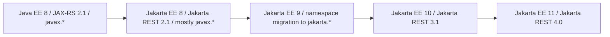
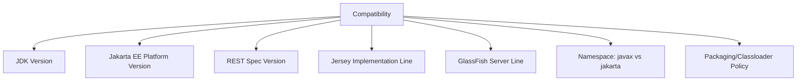
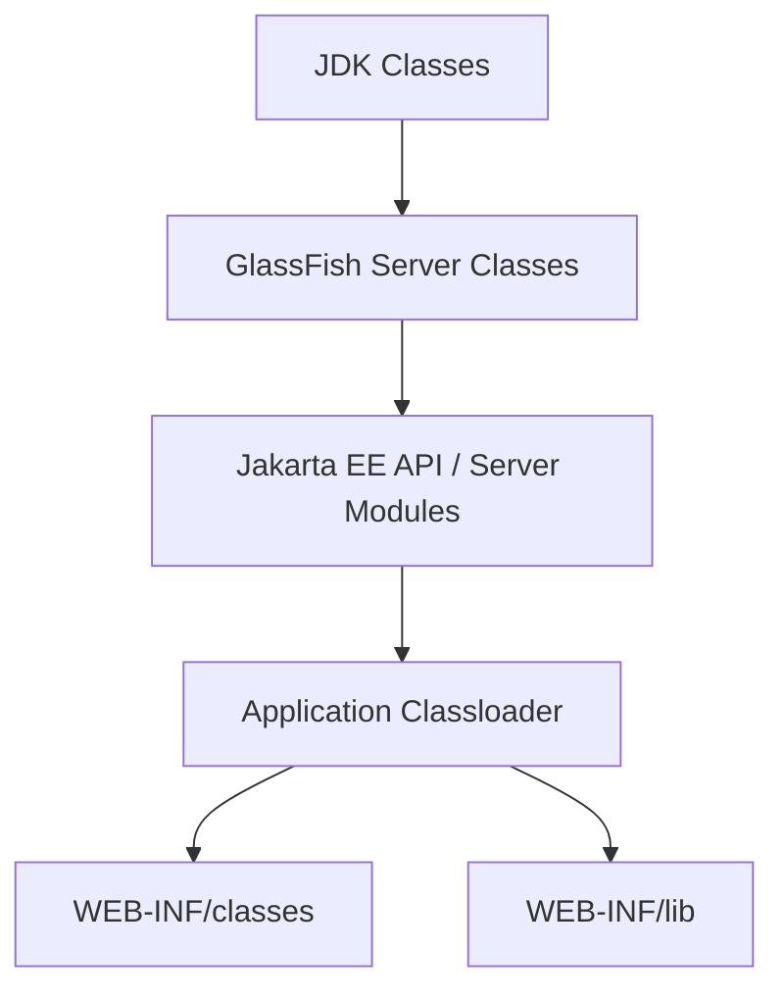
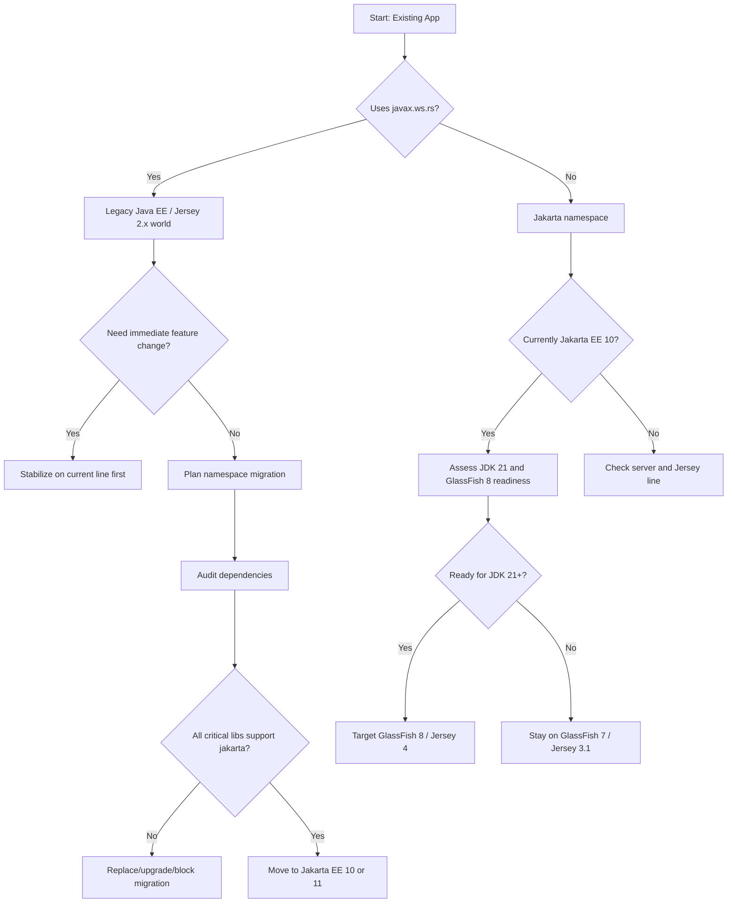

# Part 002 — Version Matrix and Compatibility Model

## Tujuan Part Ini

Part ini membangun model kompatibilitas. Ini penting karena banyak masalah Jersey/GlassFish bukan disebabkan oleh kode resource yang salah, tetapi oleh kombinasi versi yang tidak selaras.

Target setelah part ini:

1. Kamu bisa membedakan Java EE, Jakarta EE, JAX-RS, Jakarta REST, Jersey, dan GlassFish berdasarkan versi.
2. Kamu paham kenapa `javax.*` dan `jakarta.*` tidak boleh dicampur sembarangan.
3. Kamu tahu baseline modern untuk seri ini: JDK 21+, Jakarta EE 11, Jakarta REST 4.0, Jersey 4.x, GlassFish 8.x.
4. Kamu bisa membuat dependency policy untuk WAR yang dideploy ke GlassFish.
5. Kamu bisa membaca error dependency/classloader sebagai symptom compatibility, bukan error acak.
6. Kamu bisa menentukan migration path dari sistem lama menuju baseline modern.

Part ini bukan sekadar tabel versi. Kita akan bahas mental model: **spec family, implementation line, server runtime, namespace boundary, classloader boundary, and packaging discipline**.

---

## Kenapa Version Matrix Penting

Pada aplikasi Spring Boot fat jar, aplikasi biasanya membawa hampir semua dependency runtime sendiri. Pada full Jakarta EE application server seperti GlassFish, modelnya berbeda.

GlassFish menyediakan:

- Jakarta EE API;
- implementation untuk banyak specification;
- Servlet runtime;
- Jakarta REST implementation;
- CDI;
- JTA;
- JSON-B;
- JSON-P;
- Bean Validation;
- security;
- JDBC/JCA/JMS support;
- server-managed resources.

Karena itu, dependency yang kamu masukkan ke WAR bisa berinteraksi dengan module server.

Masalah umum:

- WAR membawa `jakarta.ws.rs-api` versi berbeda dari server.
- WAR membawa Jersey implementation versi berbeda dari server.
- Library transitive membawa `javax.ws.rs-api` ke aplikasi `jakarta.*`.
- Aplikasi compile dengan Jakarta EE 10, deploy ke server Jakarta EE 11, lalu ada behavior mismatch.
- Aplikasi compile dengan API baru tetapi deploy ke server lama.
- Build berhasil, tetapi runtime gagal karena classloader memilih class dari tempat yang tidak kamu duga.

Inilah alasan top-tier engineer selalu membuat compatibility matrix sebelum migration/deployment.

---

## Peta Besar Evolusi Namespace

Perubahan terbesar dalam sejarah Java EE/Jakarta EE adalah perpindahan package namespace dari `javax.*` ke `jakarta.*`.



Inti masalahnya:

```java
// Old world
import javax.ws.rs.GET;
import javax.ws.rs.Path;

// New world
import jakarta.ws.rs.GET;
import jakarta.ws.rs.Path;
```

Keduanya bukan package yang sama. Class yang compile terhadap `javax.ws.rs.Path` tidak otomatis compatible dengan runtime yang mencari `jakarta.ws.rs.Path`.

Migration bukan hanya rename import. Ia memengaruhi:

- source code;
- generated code;
- libraries;
- annotations;
- deployment descriptors;
- reflection;
- bytecode enhancement;
- test dependencies;
- transitive dependencies;
- server runtime.

---

## Baseline Compatibility Table

Tabel berikut adalah peta praktis untuk seri ini.

| Era | Java/JDK Baseline Praktis | Platform | REST Spec | Namespace | Jersey Line | GlassFish Line | Catatan |
|---|---:|---|---|---|---|---|---|
| Legacy Java EE | Java 8 | Java EE 8 | JAX-RS 2.1 | `javax.*` | Jersey 2.x | GlassFish 5.x | Banyak enterprise legacy masih di sini. |
| Jakarta EE 8 bridge | Java 8/11 | Jakarta EE 8 | Jakarta REST 2.1 | mostly `javax.*` | Jersey 2.x | GlassFish 5.1-ish | Nama platform berubah, namespace belum penuh berubah. |
| Namespace migration | Java 8/11 | Jakarta EE 9 | Jakarta REST 3.0 | `jakarta.*` | Jersey 3.0.x | GlassFish 6.x | Fokus utama adalah package rename. |
| Jakarta EE 10 | Java 11/17/21 | Jakarta EE 10 | Jakarta REST 3.1 | `jakarta.*` | Jersey 3.1.x | GlassFish 7.x | Banyak sistem modern stabil ada di sini. |
| Jakarta EE 11 | Java 21+ untuk GlassFish 8 | Jakarta EE 11 | Jakarta REST 4.0 | `jakarta.*` | Jersey 4.x | GlassFish 8.x | Baseline modern seri ini. |
| Jakarta EE 12 future | TBD | Jakarta EE 12 | Jakarta REST 5.0 development | `jakarta.*` | Future Jersey line | GlassFish 9.x milestone | Jangan dijadikan baseline production tanpa validasi. |

Catatan penting:

- Jakarta REST 4.0 adalah bagian dari Jakarta EE 11.
- Jersey 4.x menargetkan Jakarta REST 4.0/Jakarta EE 11.
- GlassFish 8.x menargetkan Jakarta EE 11 dan membutuhkan JDK 21+.
- GlassFish 7.x cocok untuk Jakarta EE 10.
- Jersey 2.x adalah jalur legacy untuk Java EE/Jakarta EE 8 era `javax.*`.

---

## Mental Model: Compatibility adalah 5 Dimensi

Jangan hanya bertanya “versinya berapa?”. Tanyakan 5 hal:



### Dimensi 1 — JDK Version

JDK memengaruhi:

- bytecode target;
- supported runtime server;
- module system behavior;
- TLS/security defaults;
- GC behavior;
- virtual thread support;
- library compatibility.

Untuk seri ini, gunakan JDK 21+ jika memakai GlassFish 8.x.

### Dimensi 2 — Jakarta EE Platform Version

Platform version menentukan kumpulan specification yang tersedia. Jakarta EE 11 bukan hanya REST. Ia memengaruhi CDI, Servlet, JSON-B, Validation, Security, Persistence, dan specification lain yang berinteraksi dengan aplikasi REST.

### Dimensi 3 — REST Spec Version

REST spec menentukan API dan behavior minimal untuk resource, providers, filters, interceptors, client API, dan extension points.

### Dimensi 4 — Jersey Implementation Line

Jersey line menentukan implementation detail, extension behavior, supported modules, dan bugfix line.

### Dimensi 5 — GlassFish Server Line

GlassFish line menentukan:

- server-provided APIs;
- runtime modules;
- admin capabilities;
- supported JDK;
- deployment behavior;
- implementation versions;
- operational features.

### Dimensi 6 — Namespace Boundary

`javax.*` dan `jakarta.*` adalah batas keras. Jangan campur kecuali kamu benar-benar berada di compatibility bridge yang jelas.

### Dimensi 7 — Packaging/Classloader Policy

Ini menentukan apakah dependency diambil dari WAR atau server. Banyak masalah runtime lahir di sini.

---

## Jersey Version Lines

### Jersey 2.x

Karakteristik:

- Cocok untuk Java EE 8/Jakarta EE 8 era JAX-RS/Jakarta REST 2.1.
- Menggunakan namespace `javax.ws.rs.*`.
- Banyak aplikasi legacy production masih memakai ini.
- Tidak cocok dicampur langsung dengan aplikasi `jakarta.ws.rs.*` modern.

Kapan masih relevan:

- Sistem legacy Java EE 8.
- Migration assessment.
- Maintenance aplikasi lama.
- Membaca dependency lama.

Risiko:

- library baru mungkin sudah pindah ke `jakarta.*`;
- security/dependency update perlu diperhatikan;
- migration ke Jersey 3/4 bukan sekadar bump version.

### Jersey 3.0.x

Karakteristik:

- Jalur awal namespace `jakarta.*`.
- Cocok untuk Jakarta EE 9.
- Banyak perubahan bersifat namespace migration.

Kapan relevan:

- Sistem yang melakukan transisi awal dari `javax` ke `jakarta`.
- Compatibility bridge menuju Jakarta EE 10.

Risiko:

- bukan baseline ideal untuk aplikasi baru jika Jakarta EE 10/11 tersedia;
- library ecosystem mungkin lebih matang di 3.1.x atau 4.x.

### Jersey 3.1.x

Karakteristik:

- Cocok untuk Jakarta EE 10/Jakarta REST 3.1.
- Menggunakan `jakarta.*`.
- Banyak organisasi modern berada di sini karena Jakarta EE 10 lebih dulu stabil.

Kapan relevan:

- Jika production server adalah GlassFish 7.x.
- Jika JDK baseline masih 11/17.
- Jika belum siap ke Jakarta EE 11/JDK 21.

Risiko:

- upgrade ke Jersey 4.x tetap perlu validasi, terutama dependency dan behavior detail.

### Jersey 4.x

Karakteristik:

- Cocok untuk Jakarta EE 11/Jakarta REST 4.0.
- Menggunakan `jakarta.*`.
- Baseline utama seri ini.
- Perlu diselaraskan dengan GlassFish 8.x jika deploy ke full server.

Kapan relevan:

- Aplikasi baru dengan baseline Jakarta EE 11.
- Migration target jangka menengah/panjang.
- Platform engineering standard baru.

Risiko:

- tidak semua ecosystem/library internal siap;
- server/runtime harus cocok;
- JDK baseline lebih modern;
- perlu migration test yang disiplin.

---

## GlassFish Version Lines

### GlassFish 5.x

Karakteristik:

- Java EE 8/Jakarta EE 8 era.
- `javax.*` world.
- Cocok untuk legacy workloads.

Risiko:

- bukan target modern;
- migration ke Jakarta EE modern membutuhkan namespace migration.

### GlassFish 6.x

Karakteristik:

- Jakarta EE 9 era.
- Full namespace migration ke `jakarta.*`.
- Sering menjadi stepping stone.

Risiko:

- bukan target akhir ideal untuk aplikasi baru.

### GlassFish 7.x

Karakteristik:

- Jakarta EE 10.
- Cocok dengan Jersey 3.1.x.
- Praktis untuk organisasi yang masih di JDK 11/17/21 mix.

Risiko:

- jika target akhir Jakarta EE 11, tetap perlu upgrade ke GlassFish 8.x.

### GlassFish 8.x

Karakteristik:

- Jakarta EE 11.
- Baseline modern seri ini.
- Membutuhkan JDK 21+ untuk regular usage.
- Cocok dengan Jersey 4.x/Jakarta REST 4.0.

Risiko:

- environment harus siap JDK 21+;
- library internal harus compatible dengan Jakarta EE 11;
- deployment scripts lama perlu dicek.

### GlassFish 9.x Milestone/Future

Karakteristik:

- Mengarah ke Jakarta EE 12.
- Belum menjadi baseline seri.

Prinsip:

- Gunakan untuk eksplorasi, bukan baseline production, kecuali organisasi memang menjalankan program early adoption dengan risk controls.

---

## Dependency Policy untuk WAR di GlassFish

Saat deploy ke full Jakarta EE server, default policy:

1. Jakarta EE API: `provided`.
2. Server implementation: jangan bundle kecuali punya alasan kuat.
3. Third-party library aplikasi: bundle di WAR.
4. Jersey extension khusus: pastikan compatible dengan Jersey line server.
5. Jangan campur `javax.*` dependency dengan aplikasi `jakarta.*`.
6. Verifikasi dependency tree pada CI.

Contoh baseline Maven untuk GlassFish 8/Jakarta EE 11:

```xml
<properties>
    <maven.compiler.release>21</maven.compiler.release>
    <jakartaee.version>11.0.0</jakartaee.version>
</properties>

<dependencies>
    <dependency>
        <groupId>jakarta.platform</groupId>
        <artifactId>jakarta.jakartaee-api</artifactId>
        <version>${jakartaee.version}</version>
        <scope>provided</scope>
    </dependency>
</dependencies>
```

Kenapa `provided`?

Karena GlassFish menyediakan Jakarta EE API dan implementation pada runtime. WAR memakai API untuk compile, tetapi tidak membawa API jar itu ke server.

Jika kamu membundel API jar ke WAR, mungkin tetap tampak jalan dalam kasus sederhana, tetapi kamu meningkatkan risiko:

- class identity mismatch;
- duplicate classes;
- service loader behavior aneh;
- annotation scanning tidak konsisten;
- `NoSuchMethodError` jika API/implementation beda;
- deployment behavior berbeda antar server.

---

## Dependency Tree Discipline

Tambahkan kebiasaan ini ke workflow.

```bash
mvn dependency:tree
```

Untuk mencari dependency lama:

```bash
mvn dependency:tree | grep javax.ws.rs
mvn dependency:tree | grep jakarta.ws.rs
mvn dependency:tree | grep jersey
mvn dependency:tree | grep glassfish
```

Di Windows PowerShell:

```powershell
mvn dependency:tree | Select-String "javax.ws.rs"
mvn dependency:tree | Select-String "jakarta.ws.rs"
mvn dependency:tree | Select-String "jersey"
```

Untuk aplikasi `jakarta.*`, kemunculan `javax.ws.rs` biasanya sinyal bahaya. Tidak selalu fatal jika library lama tidak dipakai di path runtime tertentu, tetapi tetap harus ditelusuri.

---

## Enforcer Rules untuk Mencegah Drift

Untuk proyek enterprise, jangan bergantung pada review manual saja. Gunakan Maven Enforcer.

Contoh awal:

```xml
<build>
    <plugins>
        <plugin>
            <groupId>org.apache.maven.plugins</groupId>
            <artifactId>maven-enforcer-plugin</artifactId>
            <version>3.5.0</version>
            <executions>
                <execution>
                    <id>enforce-dependency-convergence</id>
                    <goals>
                        <goal>enforce</goal>
                    </goals>
                    <configuration>
                        <rules>
                            <dependencyConvergence />
                            <requireJavaVersion>
                                <version>[21,)</version>
                            </requireJavaVersion>
                        </rules>
                    </configuration>
                </execution>
            </executions>
        </plugin>
    </plugins>
</build>
```

Untuk organisasi besar, biasanya perlu rule tambahan:

- ban `javax.ws.rs-api` pada aplikasi Jakarta EE 10/11;
- ban multiple Jersey major lines;
- enforce dependency upper bound;
- require explicit version via BOM;
- fail build jika ada duplicate classes.

Contoh larangan dependency legacy:

```xml
<bannedDependencies>
    <excludes>
        <exclude>javax.ws.rs:javax.ws.rs-api</exclude>
        <exclude>org.glassfish.jersey.core:jersey-server:[2.0,3.0)</exclude>
    </excludes>
</bannedDependencies>
```

Rule persisnya harus disesuaikan dengan baseline organisasi.

---

## BOM dan Version Alignment

Untuk aplikasi yang membawa Jersey sendiri, BOM membantu menjaga versi module Jersey konsisten.

Namun pada GlassFish full server, kamu harus hati-hati: membawa Jersey sendiri bisa berarti kamu override atau bentrok dengan Jersey server.

Ada dua model.

### Model A — Server-Provided Jersey

Ini model yang lebih natural untuk GlassFish.

```text
WAR contains:
- application classes
- app-specific third-party libs
- no Jakarta EE API jars
- no conflicting Jersey implementation jars

GlassFish provides:
- Jakarta EE APIs
- Jersey runtime / Jakarta REST implementation
- Servlet/CDI/JTA/etc.
```

Kelebihan:

- selaras dengan server certification;
- packaging lebih tipis;
- lebih sedikit conflict;
- operasional lebih standar.

Kekurangan:

- kamu terikat versi server;
- upgrade Jersey biasanya berarti upgrade server atau server module;
- fitur Jersey terbaru mungkin belum tersedia.

### Model B — Application-Bundled Jersey

```text
WAR contains:
- application classes
- app-specific third-party libs
- Jersey implementation modules
- selected providers/extensions

Server provides:
- Servlet runtime and other Jakarta EE pieces
```

Kelebihan:

- kontrol versi Jersey lebih besar;
- bisa memakai fitur tertentu yang belum ada di server.

Kekurangan:

- classloading lebih kompleks;
- risiko bentrok dengan server-provided Jakarta REST;
- butuh deployment descriptor/classloader tuning;
- portability menurun.

Untuk seri ini, default yang disarankan adalah **Model A** kecuali ada kebutuhan kuat.

---

## Classloader Mental Model

Classloader adalah salah satu sumber error paling mahal dalam application server.

Sederhananya:



Detail sebenarnya bisa lebih kompleks, tetapi model ini cukup untuk self-correction.

Pertanyaan penting:

- Class ini dimuat dari server atau WAR?
- Ada dua versi class yang sama?
- API annotation berasal dari package yang sama dengan yang dicari runtime?
- Provider ditemukan oleh classloader yang benar?
- ServiceLoader membaca file dari jar mana?

---

## Error Compatibility yang Sering Muncul

### `ClassNotFoundException`

Makna umum:

- class tidak ada di classpath runtime;
- dependency compile tidak ikut packaged;
- server tidak menyediakan module yang diasumsikan ada;
- optional dependency tidak tersedia.

Contoh:

```text
java.lang.ClassNotFoundException: jakarta.ws.rs.core.Application
```

Kemungkinan:

- deploy ke server yang tidak sesuai Jakarta version;
- API tidak tersedia;
- WAR packaging salah;
- classloader isolation salah.

### `NoClassDefFoundError`

Makna umum:

- class ada saat compile atau pernah ditemukan, tetapi gagal tersedia/diinisialisasi saat runtime.

Penyebab:

- missing transitive dependency;
- static initializer gagal;
- dependency hanya ada di test scope;
- server module tidak aktif.

### `NoSuchMethodError`

Makna umum:

- class ditemukan, tetapi method yang dipanggil tidak ada pada versi runtime.

Ini hampir selalu sinyal version mismatch.

Contoh pola:

```text
java.lang.NoSuchMethodError: 'jakarta.ws.rs.core.Response$ResponseBuilder jakarta.ws.rs.core.Response.status(...)'
```

Pertanyaan:

- Compile pakai versi API apa?
- Runtime memuat versi API apa?
- Ada jar duplikat di `WEB-INF/lib`?
- GlassFish line cocok dengan Jakarta EE target?

### `LinkageError`

Makna umum:

- class identity atau binary compatibility rusak.

Penyebab:

- duplicate classes;
- mixed classloader;
- incompatible library;
- shading buruk;
- server/application library conflict.

---

## Matrix Keputusan: Pilih Baseline Mana?

### Aplikasi Baru

Default pilihan:

```text
JDK 21+
Jakarta EE 11
Jakarta REST 4.0
Jersey 4.x
GlassFish 8.x
jakarta.* namespace
```

Alasan:

- baseline modern;
- selaras dengan seri ini;
- future-proof lebih baik;
- menghindari migration cost dari `javax`.

Pengecualian:

- organisasi belum certify JDK 21;
- dependency/vendor belum support Jakarta EE 11;
- platform production masih GlassFish 7.x;
- compliance/environment membatasi upgrade.

### Aplikasi Existing Jakarta EE 10

Pilihan praktis:

```text
JDK 17/21
Jakarta EE 10
Jersey 3.1.x
GlassFish 7.x
jakarta.* namespace
```

Strategi:

- stabilkan dulu dependency;
- pastikan tidak ada `javax.*` residual;
- buat test contract;
- upgrade ke EE 11 saat platform siap.

### Aplikasi Existing Java EE 8 / Jersey 2.x

Pilihan realistis:

```text
Current: Java 8/11, javax.*, Jersey 2.x, GlassFish 5.x
Target: Jakarta EE 10/11, jakarta.*, Jersey 3.1/4.x, GlassFish 7/8
```

Strategi yang aman:

1. Inventory dependency.
2. Identifikasi library yang belum support `jakarta.*`.
3. Tambah test coverage untuk REST contract.
4. Pisahkan migration namespace dari perubahan business logic.
5. Upgrade build/JDK secara terkontrol.
6. Deploy parallel environment.
7. Jalankan smoke/contract/performance test.
8. Cutover bertahap.

Jangan lakukan:

- rename massal tanpa dependency audit;
- upgrade server, Jersey, JDK, DB driver, dan business behavior sekaligus;
- mencampur `javax` resource dengan `jakarta` runtime;
- menganggap compile success berarti runtime success.

---

## Migration Decision Tree



---

## Practical Compatibility Checklist

Sebelum deploy ke GlassFish, jawab ini.

### Platform

- [ ] Server GlassFish line jelas.
- [ ] Jakarta EE platform version jelas.
- [ ] JDK runtime version jelas.
- [ ] Application compile target cocok dengan runtime JDK.
- [ ] Jakarta REST version cocok dengan Jersey line.

### Namespace

- [ ] Source code memakai namespace yang konsisten.
- [ ] Tidak ada import `javax.ws.rs.*` pada aplikasi Jakarta EE 10/11.
- [ ] Generated sources diperiksa.
- [ ] Test fixtures diperiksa.
- [ ] Deployment descriptors diperiksa.

### Dependency

- [ ] `jakarta.jakartaee-api` memakai `provided` untuk full server.
- [ ] Tidak ada duplicate Jakarta API jar di WAR.
- [ ] Jersey implementation tidak dibundle kecuali sengaja.
- [ ] Semua Jersey modules berasal dari major line yang sama.
- [ ] Dependency tree bersih dari library REST lama.

### Deployment

- [ ] Context root diketahui.
- [ ] Application path diketahui.
- [ ] Servlet mapping diketahui.
- [ ] Resource registration deterministic.
- [ ] Server resources tersedia.

### Runtime Test

- [ ] Smoke endpoint bekerja.
- [ ] JSON request/response bekerja.
- [ ] Error mapper bekerja.
- [ ] CDI/injection bekerja.
- [ ] JDBC resource jika ada bekerja.
- [ ] Logs menunjukkan version/runtime yang diharapkan.

---

## Contoh Policy File untuk Tim

Buat dokumen pendek di repository, misalnya `docs/runtime-baseline.md`.

```md
# Runtime Baseline

Application: case-platform-api

## Platform

- JDK: 21
- Jakarta EE: 11
- Jakarta REST: 4.0
- Server: Eclipse GlassFish 8.x
- Jersey: server-provided Jersey 4.x
- Namespace: jakarta.* only

## Packaging Rules

- WAR packaging.
- Jakarta EE API dependency must be scope provided.
- Do not bundle Jersey implementation unless approved by platform owner.
- Do not introduce javax.ws.rs dependencies.
- All runtime config must be reproducible via asadmin scripts.

## Required Checks

- mvn dependency:tree reviewed in CI.
- Enforcer rules enabled.
- Smoke tests must verify context root, application path, JSON provider, exception mapper.
```

Dokumen seperti ini mencegah diskusi versi berulang di setiap PR.

---

## Build Example: Minimal WAR for GlassFish 8

Contoh `pom.xml` ringkas:

```xml
<project xmlns="http://maven.apache.org/POM/4.0.0"
         xmlns:xsi="http://www.w3.org/2001/XMLSchema-instance"
         xsi:schemaLocation="http://maven.apache.org/POM/4.0.0 https://maven.apache.org/xsd/maven-4.0.0.xsd">
    <modelVersion>4.0.0</modelVersion>

    <groupId>com.acme</groupId>
    <artifactId>case-platform-api</artifactId>
    <version>1.0.0-SNAPSHOT</version>
    <packaging>war</packaging>

    <properties>
        <maven.compiler.release>21</maven.compiler.release>
        <project.build.sourceEncoding>UTF-8</project.build.sourceEncoding>
        <jakartaee.version>11.0.0</jakartaee.version>
    </properties>

    <dependencies>
        <dependency>
            <groupId>jakarta.platform</groupId>
            <artifactId>jakarta.jakartaee-api</artifactId>
            <version>${jakartaee.version}</version>
            <scope>provided</scope>
        </dependency>
    </dependencies>

    <build>
        <finalName>case-platform-api</finalName>
        <plugins>
            <plugin>
                <groupId>org.apache.maven.plugins</groupId>
                <artifactId>maven-compiler-plugin</artifactId>
                <version>3.13.0</version>
                <configuration>
                    <release>${maven.compiler.release}</release>
                </configuration>
            </plugin>
            <plugin>
                <groupId>org.apache.maven.plugins</groupId>
                <artifactId>maven-war-plugin</artifactId>
                <version>3.4.0</version>
            </plugin>
        </plugins>
    </build>
</project>
```

Catatan:

- Ini minimal untuk compile terhadap Jakarta EE API.
- Pada part berikutnya, kita akan bahas bootstrap Jersey secara lebih detail.
- Jika butuh provider JSON custom seperti Jackson, dependency-nya harus dipilih sesuai Jersey line dan packaging policy.

---

## Contoh Salah: Membawa API dan Implementation Secara Serampangan

```xml
<dependencies>
    <dependency>
        <groupId>jakarta.ws.rs</groupId>
        <artifactId>jakarta.ws.rs-api</artifactId>
        <version>4.0.0</version>
    </dependency>

    <dependency>
        <groupId>org.glassfish.jersey.core</groupId>
        <artifactId>jersey-server</artifactId>
        <version>3.1.0</version>
    </dependency>

    <dependency>
        <groupId>javax.ws.rs</groupId>
        <artifactId>javax.ws.rs-api</artifactId>
        <version>2.1.1</version>
    </dependency>
</dependencies>
```

Masalah:

- API tidak `provided`;
- Jersey 3.1 dicampur dengan Jakarta REST 4.0 target;
- `javax.ws.rs-api` ikut masuk;
- server GlassFish mungkin menyediakan runtime berbeda;
- classloader conflict sangat mungkin.

Versi salah seperti ini bisa tetap compile dalam kombinasi tertentu, tetapi runtime-nya tidak defensible.

---

## Runtime Compatibility Smoke Test

Buat endpoint kecil yang membantu membuktikan runtime benar.

```java
package com.acme.caseplatform.api;

import jakarta.ws.rs.GET;
import jakarta.ws.rs.Path;
import jakarta.ws.rs.Produces;
import jakarta.ws.rs.core.MediaType;
import jakarta.ws.rs.core.Response;

import java.util.Map;

@Path("/runtime")
public class RuntimeResource {

    @GET
    @Path("/baseline")
    @Produces(MediaType.APPLICATION_JSON)
    public Response baseline() {
        return Response.ok(Map.of(
                "java", System.getProperty("java.version"),
                "vendor", System.getProperty("java.vendor"),
                "namespace", "jakarta",
                "runtime", "glassfish"
        )).build();
    }
}
```

Endpoint ini bukan security-safe untuk semua production environment jika menampilkan detail terlalu banyak. Untuk internal smoke test, ia berguna. Untuk production public endpoint, tampilkan versi seminimal mungkin atau lindungi aksesnya.

---

## Version Logging saat Startup

Tambahkan log startup yang eksplisit.

```java
package com.acme.caseplatform.api;

import jakarta.annotation.PostConstruct;
import jakarta.enterprise.context.ApplicationScoped;
import java.util.logging.Logger;

@ApplicationScoped
public class RuntimeBaselineLogger {

    private static final Logger log = Logger.getLogger(RuntimeBaselineLogger.class.getName());

    @PostConstruct
    void logBaseline() {
        log.info(() -> "Runtime baseline: java=" + System.getProperty("java.version")
                + ", vendor=" + System.getProperty("java.vendor")
                + ", namespace=jakarta"
                + ", expectedPlatform=Jakarta EE 11");
    }
}
```

Jangan log secrets, tokens, connection strings, atau full environment dump. Tujuannya hanya memastikan baseline runtime mudah dilihat.

---

## How to Think About `provided`

`provided` sering disalahpahami.

Makna praktis:

```text
Needed at compile time.
Expected to be provided by runtime environment.
Do not package into artifact.
```

Untuk GlassFish:

- `jakarta.jakartaee-api`: biasanya `provided`.
- Servlet API: `provided`.
- Jakarta REST API: `provided` jika sudah memakai Jakarta EE API aggregate.
- Application-specific libraries: biasanya compile/runtime packaged.
- Database driver: tergantung deployment model; bisa server library atau app library, tetapi harus konsisten.

Rule penting:

> Kalau server mengelola lifecycle/resource/spec implementation, jangan asal membawa implementation sendiri di WAR.

---

## Compatibility Failure Scenario

### Scenario

Aplikasi compile dengan Jakarta EE 11 dan Jersey 4 extension. WAR dideploy ke GlassFish 7.x.

### Apa yang Mungkin Terjadi

- Deployment gagal karena API Jakarta EE 11 tidak tersedia.
- Method baru tidak ada pada runtime API.
- Provider extension tidak compatible.
- Error muncul sebagai `NoSuchMethodError`, `ClassNotFoundException`, atau deployment exception.

### Root Cause

Build target lebih baru daripada runtime server.

### Fix

Pilih salah satu:

1. Turunkan compile/API/dependency target ke Jakarta EE 10/Jersey 3.1 jika tetap di GlassFish 7.
2. Upgrade runtime ke GlassFish 8 jika aplikasi memang target Jakarta EE 11.

Jangan tambal dengan menambahkan semua jar Jakarta EE 11 ke WAR. Itu biasanya membuat classloader lebih buruk.

---

## Compatibility Review Template untuk Pull Request

Gunakan checklist ini saat PR mengubah dependency.

```md
## Runtime Compatibility Review

- [ ] Apakah PR menambah/mengubah Jakarta/Jersey/GlassFish dependency?
- [ ] Apakah dependency baru memakai namespace jakarta.*?
- [ ] Apakah ada javax.* dependency transitive baru?
- [ ] Apakah dependency ini harus provided atau packaged?
- [ ] Apakah dependency line cocok dengan server baseline?
- [ ] Apakah dependency tree sudah diperiksa?
- [ ] Apakah smoke test deployment berjalan?
- [ ] Apakah rollback aman jika deployment gagal?
```

Review dependency harus setara seriusnya dengan review business logic.

---

## Policy: Jangan Upgrade Banyak Dimensi Sekaligus

Upgrade buruk:

```text
Java 8 -> Java 21
Java EE 8 -> Jakarta EE 11
javax -> jakarta
Jersey 2 -> Jersey 4
GlassFish 5 -> GlassFish 8
Hibernate major upgrade
Database driver major upgrade
Business API redesign
```

Semua dilakukan dalam satu release.

Masalah:

- terlalu banyak variabel;
- root cause sulit dilacak;
- rollback sulit;
- test failure tidak informatif;
- production risk tinggi.

Upgrade lebih baik:

```text
Step 1: Stabilize current Java EE 8 build and tests.
Step 2: Inventory dependencies and remove dead libraries.
Step 3: Create contract tests around REST endpoints.
Step 4: Migrate namespace in controlled branch.
Step 5: Move to Jakarta EE 10 or 11 runtime.
Step 6: Validate deployment and classloading.
Step 7: Upgrade optional libraries after platform is stable.
```

Prinsip: **reduce simultaneous uncertainty**.

---

## Matrix untuk Memilih Deployment Target

| Constraint | Recommended Target |
|---|---|
| New app, platform ready for JDK 21 | GlassFish 8 + Jakarta EE 11 + Jersey 4 |
| Existing Jakarta EE 10 app stable | Stay GlassFish 7 + Jersey 3.1, plan future upgrade |
| Existing Java EE 8 app with heavy legacy libs | Stabilize on Jersey 2, audit migration blockers |
| Need `jakarta.*` but not JDK 21 yet | Jakarta EE 10 / GlassFish 7 may be more practical |
| Need latest Jakarta EE 11 APIs | GlassFish 8/JDK 21+ required |
| Many internal libs still `javax.*` | Do not force Jakarta EE 11 yet; migrate dependencies first |
| Strong platform standardization | Use server-provided Jersey and thin WAR |
| Need custom Jersey feature not in server | Consider bundled Jersey only with classloader strategy |

---

## Red Flags di Dependency Tree

Cari red flags ini:

```text
javax.ws.rs:javax.ws.rs-api
javax.annotation:javax.annotation-api
javax.servlet:javax.servlet-api
org.glassfish.jersey.* version 2.x in jakarta app
org.glassfish.jersey.* mixed 3.x and 4.x
jakarta.ws.rs-api packaged in WAR for GlassFish full server
multiple JSON providers without explicit choice
old Jackson/MOXy modules pulled transitively
```

Tidak semua red flag otomatis fatal, tetapi semuanya butuh keputusan eksplisit.

---

## Mental Model untuk API vs Implementation

Pahami perbedaan ini:

```text
API jar: berisi interfaces/classes/annotations untuk compile contract.
Implementation jar: berisi runtime behavior.
Server module: implementation yang dikelola application server.
Application library: dependency yang dibawa aplikasi.
```

Contoh:

- `jakarta.ws.rs-api` adalah API.
- Jersey server modules adalah implementation.
- GlassFish bisa menyediakan Jakarta REST implementation sebagai bagian server.
- WAR bisa membawa application-specific library seperti mapper, client helper, domain library.

Kesalahan umum adalah mengira “butuh API saat compile” berarti “harus dibawa saat deploy”. Di full server, sering kali tidak.

---

## Compatibility Strategy untuk Multi-Service Organization

Jika organisasi punya banyak service, buat standardisasi.

### Platform Baseline

Contoh:

```text
Platform 2026-Q3:
- JDK 21
- GlassFish 8.x
- Jakarta EE 11
- Jersey server-provided 4.x
- Namespace jakarta only
```

### Allowed Exceptions

Contoh:

```text
Exceptions:
- Legacy Java EE 8 services may remain on GlassFish 5.x until migration window.
- New feature development on legacy line requires architecture review.
- No new javax.ws.rs dependency allowed in new services.
```

### Migration Gate

Contoh:

```text
A service may migrate to Platform 2026-Q3 only if:
- dependency tree has no javax.ws.rs artifacts;
- smoke test passes on GlassFish 8;
- REST contract tests pass;
- operational runbook updated;
- rollback artifact available.
```

Ini mencegah migration chaos.

---

## Latihan Part 002

### Latihan 1 — Buat Runtime Baseline Document

Buat file:

```text
docs/runtime-baseline.md
```

Isi minimal:

- JDK target;
- Jakarta EE target;
- Jersey line;
- GlassFish line;
- namespace;
- dependency rules;
- deployment packaging;
- smoke test endpoint.

### Latihan 2 — Audit Dependency Tree

Jalankan:

```bash
mvn dependency:tree > dependency-tree.txt
```

Cari:

```bash
grep -E "javax\.ws\.rs|jakarta\.ws\.rs|jersey|glassfish" dependency-tree.txt
```

Tulis hasilnya:

```text
Dependency audit result:
- REST API artifacts:
- Jersey artifacts:
- Legacy javax artifacts:
- Unexpected transitive dependencies:
- Action required:
```

### Latihan 3 — Simulasi Wrong Scope

Di branch lokal saja:

1. Ubah dependency Jakarta EE API dari `provided` menjadi default compile.
2. Build WAR.
3. Inspect `WEB-INF/lib`.
4. Catat jar apa yang masuk.
5. Kembalikan ke `provided`.

Tujuannya bukan merusak aplikasi, tetapi melihat efek packaging.

### Latihan 4 — Buat PR Checklist

Tambahkan checklist runtime compatibility ke template PR.

---

## Checklist Self-Assessment Part 002

Kamu siap lanjut jika bisa menjawab:

1. Apa beda Jersey 2.x, 3.0.x, 3.1.x, dan 4.x?
2. Kenapa `javax.ws.rs.Path` dan `jakarta.ws.rs.Path` tidak compatible?
3. Kenapa GlassFish 8.x menjadi baseline natural untuk Jakarta EE 11?
4. Kenapa GlassFish 7.x lebih cocok untuk Jakarta EE 10?
5. Apa arti dependency scope `provided`?
6. Kapan boleh membundel Jersey implementation di WAR?
7. Apa symptom umum version mismatch?
8. Kenapa `NoSuchMethodError` biasanya bukan bug business logic?
9. Apa risiko upgrade JDK, Jakarta EE, Jersey, dan GlassFish sekaligus?
10. Bagaimana membuat migration lebih aman?

---

## Ringkasan

Compatibility adalah fondasi seri Jersey + GlassFish. Banyak production incident berasal dari asumsi salah tentang versi, namespace, dependency scope, dan classloader.

Baseline modern seri ini:

```text
JDK 21+
Jakarta EE 11
Jakarta REST 4.0
Jersey 4.x
GlassFish 8.x
jakarta.* namespace
WAR with server-provided Jakarta EE APIs
```

Namun, engineer yang kuat juga harus migration-aware. Kamu perlu bisa membaca sistem lama di Jersey 2.x/`javax.*`, memahami transisi Jersey 3.x/GlassFish 7.x, dan merancang upgrade menuju Jersey 4.x/GlassFish 8.x tanpa mencampur terlalu banyak variabel.

Prinsip utama part ini:

```text
Align platform version, implementation line, namespace, JDK, and packaging policy before debugging application code.
```

Jika alignment salah, debugging resource method hanya membuang waktu.

---

## Referensi Resmi dan Bacaan Lanjutan

- Jakarta RESTful Web Services 4.0 Specification: https://jakarta.ee/specifications/restful-ws/4.0/
- Jakarta RESTful Web Services Specification Index: https://jakarta.ee/specifications/restful-ws/
- Jakarta EE 11 Release: https://jakarta.ee/release/11/
- Eclipse Jersey Website and Documentation: https://jersey.github.io/
- Eclipse Jersey Project Releases: https://projects.eclipse.org/projects/ee4j.jersey
- Eclipse GlassFish 8 Downloads: https://glassfish.org/download_gf8.html
- Eclipse GlassFish 8 Release Notes: https://glassfish.org/docs/latest/release-notes.html
- Eclipse GlassFish 7 Downloads: https://glassfish.org/download_gf7.html
