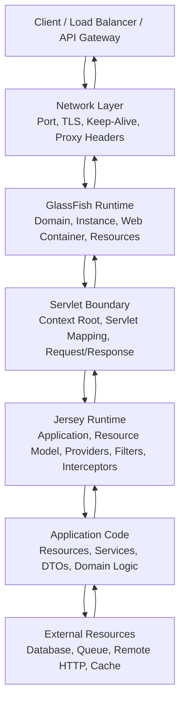
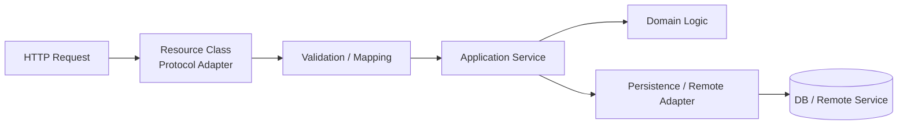
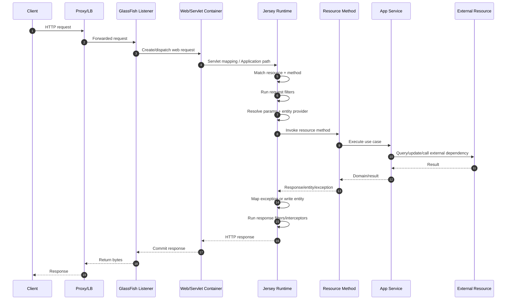
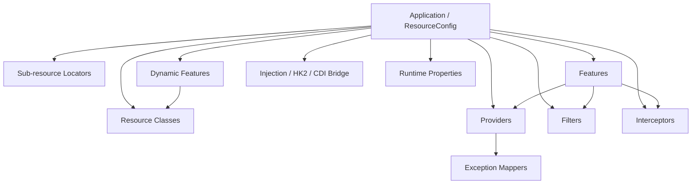
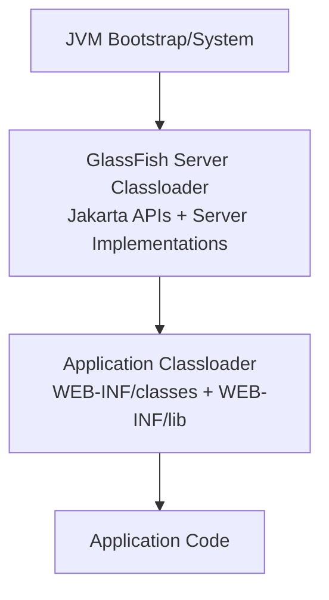
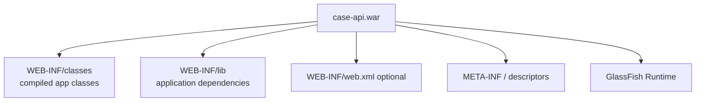
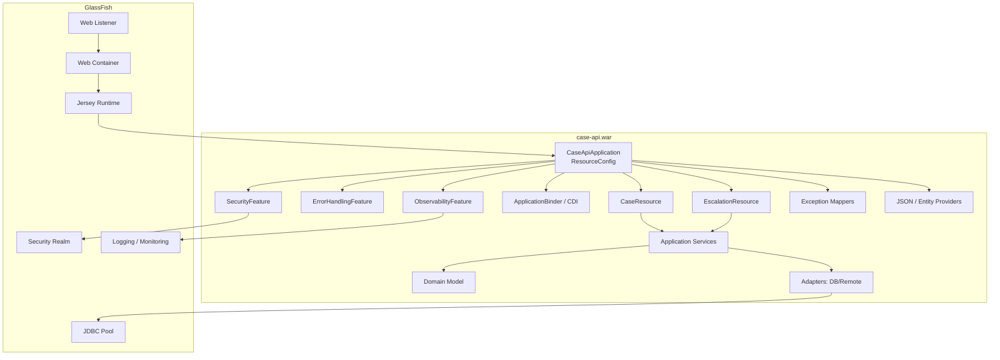

# Part 003 — Architecture Map: Spec, RI, Container, Servlet, Grizzly, HK2

## Tujuan Part Ini

Part ini membangun peta arsitektur yang akan kita pakai sepanjang seri. Kita tidak akan membahas ulang cara membuat endpoint REST sederhana. Yang ingin kita kuasai adalah **di mana setiap komponen hidup**, **siapa bertanggung jawab atas apa**, dan **di boundary mana bug production biasanya muncul**.

Saat engineer hanya memahami `@Path`, `@GET`, dan `Response`, ia biasanya menganggap aplikasi REST adalah sekumpulan method Java yang dipanggil oleh HTTP. Itu cukup untuk membuat demo. Untuk production, model itu terlalu dangkal.

Model yang lebih benar:

> Aplikasi Jersey di GlassFish adalah sebuah deployment artifact yang dipasang ke application server, dimuat oleh classloader tertentu, dipetakan ke Servlet/web container, dijalankan di atas network runtime, mengaktifkan Jakarta REST implementation, membangun resource model, menghubungkan injection/provider/filter/interceptor, lalu memproses request dalam boundary thread, security, transaction, serialization, dan observability yang disediakan oleh container.

Setelah part ini, kamu harus bisa menjelaskan:

1. Bedanya **specification**, **implementation**, dan **runtime/container**.
2. Kenapa Jersey bukan GlassFish, dan GlassFish bukan hanya “server untuk Jersey”.
3. Bagaimana request bergerak dari socket sampai resource method.
4. Di mana Grizzly, Servlet, Jersey, HK2, CDI, dan classloader berperan.
5. Kenapa bug Jersey/GlassFish sering bukan bug REST, tetapi bug boundary: classpath, provider discovery, injection bridge, packaging, atau deployment mapping.

---

## 1. Mental Model Utama: Layered Runtime, Bukan Library Call

Jersey di GlassFish tidak sama seperti memanggil library biasa dari `main()`.

Di aplikasi Java command-line, kamu mengontrol lifecycle:

```java
public static void main(String[] args) {
    var service = new MyService();
    service.run();
}
```

Di GlassFish, lifecycle dibalik:

```text
GlassFish starts
  -> deploys application artifact
  -> creates web application context
  -> initializes Servlet/Jakarta REST runtime
  -> scans/registers resources and providers
  -> receives HTTP request
  -> dispatches into resource method
```

Kamu tidak “menjalankan” resource class. Container yang menjalankannya.

Inilah sumber banyak kesalahan mental model:

| Anggapan Dangkal | Model yang Lebih Akurat |
|---|---|
| Jersey adalah framework REST | Jersey adalah implementation/runtime dari Jakarta REST dengan extension ecosystem sendiri |
| GlassFish hanya tempat deploy WAR | GlassFish adalah Jakarta EE application server dengan web container, resource management, security, transaction, classloading, monitoring, dan admin model |
| Resource method dipanggil langsung oleh HTTP | Request melewati listener, web container, Servlet mapping, Jersey matching, filters, injection, provider, exception mapper, dan response writer |
| Dependency cukup asal compile | Dependency harus kompatibel dengan API/implementation/server-provided library di runtime |
| Error 404 selalu berarti path salah | Bisa path salah, application path salah, servlet mapping salah, deployment context salah, resource tidak teregister, atau deployment gagal sebagian |

Prinsip top-tier engineer:

> Jangan debug dari gejala paling luar saja. Debug dari boundary yang mungkin gagal.

---

## 2. Lima Lapisan Arsitektur

Kita akan memakai lima lapisan agar reasoning tetap rapi.



### Lapisan 1 — Client dan Infrastruktur Depan

Ini meliputi browser, mobile app, service client, API gateway, reverse proxy, load balancer, ingress, atau service mesh.

Hal yang ditentukan di lapisan ini:

- URL publik.
- TLS termination.
- Request size limit.
- Header forwarding.
- Timeout eksternal.
- Retry policy dari client/gateway.
- Load balancing.
- Sticky session atau stateless routing.

Kesalahan umum:

- Endpoint benar di GlassFish, tetapi gateway menghapus path prefix.
- Client timeout lebih pendek daripada server timeout.
- Proxy tidak meneruskan `X-Forwarded-Proto`, sehingga URL generation salah.
- Load balancer retry request non-idempotent.

### Lapisan 2 — GlassFish Network/Web Runtime

GlassFish menerima koneksi HTTP melalui network listener. Di bawahnya GlassFish memakai stack HTTP/network-nya sendiri, termasuk Grizzly sebagai teknologi network server historis/utama di GlassFish.

Di lapisan ini, concern-nya bukan REST annotation, tetapi:

- Port dan listener.
- TLS certificate.
- HTTP protocol behavior.
- Thread pool.
- Request size.
- Keep-alive.
- Access logging.
- Virtual server.
- Context root.
- Deployment status.

Kesalahan umum:

- Aplikasi sudah deploy, tetapi context root berbeda dari asumsi.
- Listener tidak expose port yang benar.
- HTTPS termination double/misconfigured.
- Thread pool exhausted, sehingga request terlihat seperti lambat di Jersey padahal antre di container.

### Lapisan 3 — Servlet Boundary

Jakarta REST biasanya berjalan sebagai aplikasi web. Artinya ada boundary Servlet:

- web application context,
- Servlet mapping,
- request/response object,
- filter chain container,
- lifecycle webapp.

Jersey dapat dipasang melalui auto-discovery, `Application` subclass, `ResourceConfig`, atau descriptor seperti `web.xml`.

Boundary ini penting karena path endpoint akhir adalah gabungan dari beberapa prefix:

```text
public host path
+ reverse proxy rewrite
+ GlassFish context root
+ servlet mapping / application path
+ resource @Path
+ method @Path
```

Contoh:

```text
https://api.example.com/reg/v1/cases/123
        |              |  |  |        |
        |              |  |  |        method/resource path
        |              |  |  application path or servlet mapping
        |              |  context root
        |              gateway prefix
        host
```

Jika salah satu layer mengubah prefix, 404 bisa terjadi walaupun method Java benar.

### Lapisan 4 — Jersey Runtime

Jersey bertanggung jawab membangun dan menjalankan Jakarta REST application model.

Komponen utama:

- `Application` / `ResourceConfig`.
- Resource classes.
- Sub-resource locators.
- Providers.
- Filters.
- Interceptors.
- Features.
- Dynamic features.
- Entity mappers.
- Exception mappers.
- Injection bridge.
- Runtime properties.

Jersey tidak hanya mencari method ber-annotation. Jersey membangun metadata runtime:

```text
Resource class
  -> class-level @Path
  -> method-level HTTP method annotation
  -> method-level @Path
  -> consumes/produces
  -> parameters
  -> injection points
  -> name binding
  -> provider compatibility
```

Resource method yang tampak sederhana sebenarnya adalah hasil matching dari banyak aturan.

### Lapisan 5 — Application Code dan External Resources

Ini wilayah kode bisnis:

- Resource boundary.
- Application service.
- Domain model.
- Repository/client adapter.
- Transaction boundary.
- External call.
- Error mapping.

Part penting: resource class bukan tempat ideal untuk semua logic. Resource harus menjadi **HTTP boundary adapter**, bukan domain service.



Boundary yang sehat:

- Resource memahami HTTP.
- Service memahami use case.
- Domain memahami aturan bisnis.
- Adapter memahami teknologi eksternal.

Jika resource class langsung berisi SQL, HTTP client call, authorization detail, audit, dan business branching, sistem menjadi sulit dites, sulit diobservasi, dan sulit dimigrasikan.

---

## 3. Specification vs Implementation vs Runtime

Ini distinction paling penting.

### Specification

Specification adalah kontrak standar. Untuk topik ini, contohnya:

- Jakarta RESTful Web Services.
- Jakarta Servlet.
- Jakarta CDI.
- Jakarta JSON Binding.
- Jakarta JSON Processing.
- Jakarta Bean Validation.
- Jakarta Security.
- Jakarta Transactions.

Specification menjelaskan API dan perilaku yang harus dipenuhi oleh implementation. Specification biasanya memberi interface/annotation, bukan runtime final yang kamu operasikan.

Contoh dependency API:

```xml
<dependency>
  <groupId>jakarta.ws.rs</groupId>
  <artifactId>jakarta.ws.rs-api</artifactId>
  <version>4.0.0</version>
  <scope>provided</scope>
</dependency>
```

Pada deployment ke full application server, API seperti ini biasanya `provided`, karena server sudah menyediakan API dan implementation yang kompatibel.

### Implementation

Implementation adalah kode konkret yang menjalankan specification.

Untuk Jakarta REST, salah satu implementation adalah **Eclipse Jersey**.

Jersey menyediakan:

- runtime dispatch,
- resource model,
- provider mechanism,
- extension APIs,
- client implementation,
- media modules,
- injection integration,
- test framework,
- container integration.

Implementation punya behavior tambahan yang tidak selalu bagian dari specification. Ini penting karena:

- kode yang hanya memakai API Jakarta REST lebih portable,
- kode yang memakai fitur Jersey spesifik lebih powerful tetapi kurang portable.

Contoh Jersey-specific:

```java
import org.glassfish.jersey.server.ResourceConfig;
import org.glassfish.jersey.server.filter.RolesAllowedDynamicFeature;
```

Ini bukan bagian dari `jakarta.ws.rs.*`. Ini dependency ke Jersey.

### Runtime / Container

Runtime adalah tempat application berjalan.

GlassFish menyediakan:

- deployment model,
- web container,
- classloading,
- resources,
- JDBC pools,
- JTA,
- security realms,
- monitoring,
- admin console,
- `asadmin`,
- network listener,
- integration dengan implementation Jakarta EE.

GlassFish bukan sekadar “Jersey runner”. Ia adalah platform runtime untuk banyak specification Jakarta EE.

### Kenapa Distinction Ini Penting?

Karena pertanyaan engineering yang berbeda punya owner berbeda.

| Pertanyaan | Layer yang Harus Dicek |
|---|---|
| Annotation `@Path` bekerja bagaimana? | Jakarta REST spec + Jersey behavior |
| Resource tidak ditemukan saat deploy | Jersey registration + Servlet mapping + GlassFish deployment |
| `NoSuchMethodError` saat startup | Dependency/classloader/version matrix |
| JSON tidak sesuai format | Provider selection + JSON-B/Jackson/MOXy module |
| Request lambat sebelum masuk resource | GlassFish listener/thread pool/proxy |
| Transaction rollback tidak sesuai harapan | Jakarta Transactions + GlassFish resource + application service boundary |
| Security role tidak terbaca | Container security + Jersey `SecurityContext` + dynamic feature |

Top-tier engineer tidak hanya tahu API. Ia tahu **pertanyaan harus diarahkan ke layer mana**.

---

## 4. Request Lifecycle: Dari Socket ke Resource Method

Mari kita jabarkan lifecycle secara runtime-oriented.



### Step 1 — Request Masuk ke Network Listener

GlassFish menerima request di listener tertentu. Listener menentukan:

- alamat/port,
- HTTP/HTTPS,
- SSL/TLS config,
- thread pool/network config,
- virtual server.

Jika request tidak pernah mencapai listener, Jersey tidak relevan. Debug dimulai dari network/log/port.

### Step 2 — GlassFish Memilih Web Application

GlassFish menentukan aplikasi berdasarkan context root dan virtual server.

Misalnya:

```text
/case-management
```

adalah context root aplikasi.

Jika artifact dideploy dengan context root berbeda, semua path resource akan bergeser.

### Step 3 — Servlet Mapping atau Application Path

Jersey harus dipasang sebagai web component. Ada beberapa model:

1. `@ApplicationPath` pada subclass `Application`.
2. `web.xml` yang mendaftarkan Jersey servlet/container.
3. Framework-specific auto-discovery/integration.
4. Programmatic config via `ResourceConfig`.

Contoh:

```java
@ApplicationPath("/api")
public class CaseApiApplication extends Application {
}
```

Path final:

```text
/context-root/api/resource-path
```

### Step 4 — Jersey Membangun Resource Matching

Jersey mencocokkan:

- HTTP method,
- path template,
- path parameter,
- media type `Content-Type`,
- media type `Accept`,
- sub-resource locator,
- name binding.

Contoh resource:

```java
@Path("/cases")
@Produces(MediaType.APPLICATION_JSON)
public class CaseResource {

    @GET
    @Path("/{caseId}")
    public CaseDto getCase(@PathParam("caseId") String caseId) {
        return null;
    }
}
```

Jika request:

```http
GET /case-management/api/cases/ABC-123
Accept: application/json
```

maka matching harus melewati context root `/case-management`, application path `/api`, resource path `/cases`, method path `/{caseId}`, dan media type response.

### Step 5 — Request Filters

Request filters berjalan sebelum resource method.

Contoh use case valid:

- correlation ID,
- authentication token parsing,
- tenant resolution,
- request logging,
- rate limit marker,
- input envelope metadata.

Contoh use case berbahaya:

- menjalankan business workflow penuh,
- query database besar,
- mutasi state domain,
- menyembunyikan authorization kompleks tanpa audit trail.

Filter adalah control point, bukan tempat business process.

### Step 6 — Entity Read dan Parameter Conversion

Jika request punya body, Jersey memilih `MessageBodyReader` yang sesuai berdasarkan:

- Java target type,
- generic type,
- media type,
- annotation context,
- provider priority.

Contoh:

```java
@POST
@Consumes(MediaType.APPLICATION_JSON)
public Response createCase(CreateCaseRequest request) {
    return Response.accepted().build();
}
```

Jika tidak ada provider JSON yang cocok, atau dependency provider tidak tersedia, request bisa gagal dengan 415/500, bukan karena method salah.

### Step 7 — Resource Invocation

Resource method dipanggil setelah:

- parameter injection,
- request filter,
- entity read,
- validation integration,
- resource instance resolution.

Jangan mengasumsikan resource object selalu singleton atau selalu baru tanpa membaca config/lifecycle. Resource lifecycle memengaruhi thread safety.

### Step 8 — Exception Mapping

Jika resource/service melempar exception, Jersey mencari `ExceptionMapper<T>` paling cocok.

Contoh:

```java
@Provider
public class CaseNotFoundMapper implements ExceptionMapper<CaseNotFoundException> {
    @Override
    public Response toResponse(CaseNotFoundException ex) {
        return Response.status(Response.Status.NOT_FOUND)
            .entity(new ErrorResponse("CASE_NOT_FOUND", ex.getMessage()))
            .build();
    }
}
```

Mapper adalah bagian dari API contract. Mapper yang terlalu generik bisa menyembunyikan bug production.

### Step 9 — Entity Write dan Response Filters

Jersey memilih `MessageBodyWriter` untuk menulis response entity.

Response filters/interceptors bisa menambah:

- security headers,
- correlation ID,
- cache headers,
- audit metadata,
- response timing.

Setelah response committed, beberapa error tidak bisa lagi dipetakan dengan rapi.

---

## 5. Jersey Runtime Components

Berikut komponen-komponen Jersey yang harus kamu pahami sebagai runtime graph.



### `Application`

`jakarta.ws.rs.core.Application` adalah standard Jakarta REST application boundary.

Ia bisa dipakai untuk:

- menentukan root application path melalui `@ApplicationPath`,
- mendaftarkan classes secara eksplisit,
- mendaftarkan singleton objects,
- menjadi entry point deployment.

Contoh minimal:

```java
@ApplicationPath("/api")
public class CaseApiApplication extends Application {
}
```

Kelebihan:

- portable,
- simple,
- cukup untuk banyak kasus.

Kekurangan:

- tidak se-ekspresif `ResourceConfig` untuk Jersey-specific configuration.

### `ResourceConfig`

`org.glassfish.jersey.server.ResourceConfig` adalah Jersey-specific subclass/configuration class.

Contoh:

```java
@ApplicationPath("/api")
public class CaseApiApplication extends ResourceConfig {
    public CaseApiApplication() {
        register(CaseResource.class);
        register(CaseExceptionMapper.class);
        packages("com.example.caseapi.boundary");
    }
}
```

Kelebihan:

- deterministik,
- mudah mengaktifkan fitur Jersey,
- cocok untuk production bootstrap.

Trade-off:

- mengikat aplikasi ke Jersey.

Dalam seri ini, kita akan menerima trade-off itu karena targetnya memang menguasai Jersey + GlassFish, bukan portability absolut antar implementation.

### Resource Classes

Resource class adalah HTTP adapter.

Tanggung jawab sehat:

- menerima HTTP request,
- mengambil path/query/header/form/body parameter,
- memanggil application service,
- mengembalikan response DTO/status,
- tidak menyimpan mutable request state di field shared.

Contoh boundary sehat:

```java
@Path("/cases")
@Produces(MediaType.APPLICATION_JSON)
@Consumes(MediaType.APPLICATION_JSON)
public class CaseResource {
    private final CaseCommandService commandService;

    public CaseResource(CaseCommandService commandService) {
        this.commandService = commandService;
    }

    @POST
    public Response create(CreateCaseRequest request, @Context UriInfo uriInfo) {
        CaseId id = commandService.create(request.toCommand());
        URI location = uriInfo.getAbsolutePathBuilder()
            .path(id.value())
            .build();
        return Response.created(location).build();
    }
}
```

### Providers

Providers mengubah cara Jersey membaca/menulis/memproses data.

Jenis umum:

- `MessageBodyReader<T>`.
- `MessageBodyWriter<T>`.
- `ExceptionMapper<T>`.
- `ContextResolver<T>`.
- JSON provider integration.

Provider adalah extension point yang powerful. Salah prioritas atau terlalu generik bisa memengaruhi seluruh aplikasi.

### Filters

Filters mengontrol request/response pipeline.

Jenis umum:

- `ContainerRequestFilter`.
- `ContainerResponseFilter`.
- `ClientRequestFilter`.
- `ClientResponseFilter`.

Request filter bisa abort request:

```java
@Provider
@Priority(Priorities.AUTHENTICATION)
public class AuthenticationFilter implements ContainerRequestFilter {
    @Override
    public void filter(ContainerRequestContext ctx) {
        String authorization = ctx.getHeaderString(HttpHeaders.AUTHORIZATION);
        if (authorization == null) {
            ctx.abortWith(Response.status(Response.Status.UNAUTHORIZED).build());
        }
    }
}
```

### Interceptors

Interceptors membungkus entity read/write.

Gunakan untuk concern seperti:

- compression,
- envelope transformation,
- payload logging terbatas,
- stream instrumentation.

Jangan gunakan interceptor untuk business branching.

### Features

Feature adalah modul konfigurasi.

Contoh:

```java
public class ObservabilityFeature implements Feature {
    @Override
    public boolean configure(FeatureContext context) {
        context.register(CorrelationIdFilter.class);
        context.register(RequestTimingFilter.class);
        return true;
    }
}
```

Feature membantu membuat bootstrap rapi:

```java
register(new ObservabilityFeature());
register(new ErrorHandlingFeature());
register(new SecurityFeature());
```

### Dynamic Features

Dynamic feature mendaftarkan filter/interceptor berdasarkan resource method/class.

Contoh use case:

- hanya endpoint tertentu perlu audit,
- hanya method tertentu perlu authorization policy,
- hanya resource tertentu perlu rate limiting.

Dynamic feature cocok untuk policy yang terkait annotation.

---

## 6. HK2 dan CDI: Dua Dunia Injection yang Sering Tercampur

Jersey secara historis memakai HK2 untuk service discovery/injection internal. GlassFish sebagai Jakarta EE runtime juga menyediakan CDI.

Ini bisa membuat engineer bingung:

- `@Inject` dari CDI?
- HK2 binder?
- constructor injection resource?
- `@Context` dari Jakarta REST?
- managed bean container siapa?

### Model Sederhana

```mermaid
flowchart LR
    J[Jersey Runtime] --> HK2[HK2 Service Locator]
    GF[GlassFish Jakarta EE Runtime] --> CDI[CDI Container]
    J <--> Bridge[Integration / Bridge]
    Bridge <--> CDI
    J --> CTX[@Context Objects]
```

### `@Context`

`@Context` adalah injection untuk object yang berasal dari Jakarta REST/runtime context.

Contoh:

```java
@GET
public Response current(@Context UriInfo uriInfo,
                        @Context HttpHeaders headers,
                        @Context SecurityContext securityContext) {
    return Response.ok().build();
}
```

Gunakan untuk request-specific context.

### CDI `@Inject`

CDI injection cocok untuk application service, repository, configuration bean, atau collaborator yang dikelola CDI.

Contoh:

```java
@RequestScoped
@Path("/cases")
public class CaseResource {
    @Inject
    CaseQueryService queryService;
}
```

Tetapi ini bergantung pada integrasi runtime. Di GlassFish full Jakarta EE, CDI tersedia, tetapi tetap perlu memahami apakah resource dikelola oleh Jersey, CDI, atau keduanya.

### HK2 Binder

HK2 binder berguna untuk Jersey-specific registration.

Contoh:

```java
public class ApplicationBinder extends AbstractBinder {
    @Override
    protected void configure() {
        bind(DefaultClock.class).to(Clock.class).in(Singleton.class);
    }
}
```

Lalu:

```java
register(new ApplicationBinder());
```

### Aturan Praktis

Gunakan ini sebagai default:

| Kebutuhan | Pilihan Default |
|---|---|
| Request metadata seperti URI/header/security context | `@Context` |
| Business service di Jakarta EE app | CDI `@Inject` |
| Jersey-specific runtime object | HK2 binder |
| Provider/filter yang perlu dependency application | Prefer CDI-managed jika runtime mendukung; jika tidak, register eksplisit |
| Library-agnostic domain logic | Jangan bergantung pada Jersey/HK2/CDI annotation di domain |

Anti-pattern utama:

```java
public class DomainService {
    @Context
    UriInfo uriInfo; // buruk: domain logic bocor ke HTTP runtime
}
```

Domain service tidak boleh tahu URI HTTP.

---

## 7. Grizzly: Network Runtime, Bukan REST Framework

Grizzly berada di bawah web/application server layer. Ia menangani network I/O dan HTTP transport concerns di GlassFish.

Hal yang perlu kamu pahami:

- Grizzly bukan tempat kamu menaruh business logic.
- Jersey bukan pengganti Grizzly.
- Servlet/Jersey berjalan di atas web/network runtime.
- Performance problem bisa terjadi sebelum request mencapai Jersey.

Contoh gejala:

| Gejala | Kemungkinan Layer |
|---|---|
| Semua endpoint lambat walau resource kosong | listener/thread pool/network/proxy |
| Hanya endpoint JSON besar lambat | provider/serialization/entity buffering |
| Hanya endpoint DB lambat | service/repository/connection pool/database |
| Request upload besar gagal | connector/request-size/proxy/entity reader |
| Koneksi sering reset | keep-alive/TLS/proxy/client timeout |

Jangan langsung menyalahkan Jersey untuk setiap latency.

---

## 8. Classloader Boundary

Application server punya classloader model. Ini berbeda dari fat JAR biasa.

Simplified model:



Masalah muncul ketika versi library di application bertabrakan dengan versi yang disediakan server.

Contoh risiko:

- `jakarta.ws.rs-api` ikut terpackage dalam WAR padahal server sudah menyediakan.
- Jersey module versi 3.x ikut masuk ke aplikasi di GlassFish 8 yang memakai Jersey 4.x.
- API `javax.*` dan `jakarta.*` tercampur.
- JSON provider lama membawa transitive dependency yang tidak kompatibel.
- Library di domain/lib server berbeda dari library di WAR.

### Rule of Thumb Packaging

Untuk deploy ke GlassFish full Jakarta EE:

- Jakarta EE API dependency: `provided`.
- Implementation yang sudah disediakan server: jangan dipaketkan kecuali benar-benar sengaja dan tahu classloader impact.
- Application library spesifik bisnis: compile/runtime dalam WAR.
- Versi Jersey tambahan: harus selaras dengan versi Jersey server atau diisolasi dengan sangat hati-hati.

Contoh Maven:

```xml
<dependency>
  <groupId>jakarta.platform</groupId>
  <artifactId>jakarta.jakartaee-api</artifactId>
  <version>11.0.0</version>
  <scope>provided</scope>
</dependency>
```

Dalam seri ini, kita akan berkali-kali kembali ke classloader karena banyak bug production terlihat seperti bug code, padahal bug deployment artifact.

---

## 9. Deployment Artifact Boundary

GlassFish bisa menerima WAR/EAR. Untuk Jersey REST API, WAR adalah bentuk umum.



WAR bukan hanya zip berisi class. WAR adalah kontrak deployment.

Hal yang ditentukan artifact:

- context root default,
- web descriptors,
- libraries,
- resources visible to app,
- annotations visible for scanning,
- CDI bean discovery archive,
- provider/resource classes available.

Production engineer harus bisa membuka WAR dan memeriksa isinya:

```bash
jar tf target/case-api.war | sort
```

Hal yang wajib dicek:

```text
WEB-INF/classes/com/example/CaseApiApplication.class
WEB-INF/classes/com/example/boundary/CaseResource.class
WEB-INF/lib/...
WEB-INF/beans.xml  (jika CDI discovery perlu dikontrol)
WEB-INF/web.xml    (jika pakai descriptor)
```

Jika class tidak masuk WAR, Jersey tidak mungkin mendaftarkannya.

---

## 10. Architecture Decision: Portable Jakarta REST atau Jersey-Specific?

Ada dua gaya aplikasi:

### Gaya A — Portable Jakarta REST

Contoh:

```java
@ApplicationPath("/api")
public class ApiApplication extends Application {
}
```

Resource memakai hanya `jakarta.ws.rs.*`.

Kelebihan:

- lebih portable,
- lebih sedikit vendor lock-in,
- cocok jika ingin pindah implementation.

Kekurangan:

- lebih sedikit kontrol atas Jersey features,
- discovery bisa kurang deterministik,
- extension advanced lebih terbatas.

### Gaya B — Jersey-Optimized

Contoh:

```java
@ApplicationPath("/api")
public class ApiApplication extends ResourceConfig {
    public ApiApplication() {
        register(CaseResource.class);
        register(new ObservabilityFeature());
        register(new ErrorHandlingFeature());
    }
}
```

Kelebihan:

- konfigurasi eksplisit,
- modular,
- mudah di-test sebagai runtime graph,
- powerful untuk filters/providers/features.

Kekurangan:

- bergantung pada Jersey.

Untuk seri ini, default kita adalah:

> Pakai Jakarta REST API untuk resource contract, tetapi gunakan Jersey-specific `ResourceConfig` secara sadar untuk production bootstrap yang deterministic.

Ini trade-off yang realistis untuk engineer yang memang deploy ke Jersey/GlassFish.

---

## 11. Common Failure Map

Gunakan tabel ini untuk mengarahkan debugging.

| Gejala | Layer Kemungkinan | Pertanyaan Diagnostik |
|---|---|---|
| 404 semua endpoint | deployment/context/application path | Apakah WAR deploy sukses? Context root benar? `@ApplicationPath` benar? |
| 404 endpoint tertentu | Jersey resource matching | Resource teregister? Path/method/media cocok? Ada sub-resource locator? |
| 415 Unsupported Media Type | provider/entity reader | `@Consumes` cocok? JSON provider ada? `Content-Type` benar? |
| 406 Not Acceptable | content negotiation | `@Produces` cocok dengan `Accept`? |
| 500 saat startup | deployment/classloading/injection | Ada `NoClassDefFoundError`, dependency conflict, injection unsatisfied? |
| `NoSuchMethodError` | version mismatch | Ada API/implementation versi ganda? |
| Injection null | lifecycle/injection bridge | Object dikelola CDI, HK2, atau manual? |
| Response JSON aneh | provider selection | JSON-B/Jackson/MOXy mana yang aktif? |
| Memory naik saat download | entity buffering | Streaming atau buffer penuh? |
| Latency tinggi semua endpoint | server/network/thread pool | Request sudah masuk resource atau antre di container? |

Rule:

> Jangan debug 500 dengan membaca resource method saja. Baca server log, deployment log, dependency tree, dan artifact content.

---

## 12. Reference Architecture Mini-Map

Untuk seri ini, kita akan memakai model aplikasi seperti ini:



Prinsip desain:

1. `ResourceConfig` adalah bootstrap graph.
2. Resource class tipis sebagai HTTP adapter.
3. Feature memodulkan concern runtime.
4. Provider/mappers menjadi contract boundary.
5. Application service memegang use case.
6. Domain bebas dari Jersey/GlassFish.
7. GlassFish resources dikelola via config, bukan hardcoded.
8. Observability adalah bagian dari architecture, bukan tambahan belakangan.

---

## 13. Anti-Pattern Arsitektur

### Anti-Pattern 1 — “Everything in Resource”

```java
@Path("/cases")
public class CaseResource {
    @POST
    public Response create(CreateCaseRequest request) {
        // validate
        // open JDBC connection manually
        // parse token
        // check role
        // execute SQL
        // send HTTP notification
        // write audit
        // catch every exception
        // return response
    }
}
```

Masalah:

- tidak testable,
- transaction boundary kabur,
- observability buruk,
- error contract tidak konsisten,
- security logic tersebar,
- resource lifecycle risk.

Perbaikan:

```text
Resource -> Application Service -> Domain -> Adapter
Filter/Feature -> cross-cutting runtime concerns
ExceptionMapper -> error contract
Provider -> representation boundary
```

### Anti-Pattern 2 — “Classpath Roulette”

Maven dibuat asal sampai compile:

```xml
<dependency>
  <groupId>jakarta.ws.rs</groupId>
  <artifactId>jakarta.ws.rs-api</artifactId>
  <version>3.1.0</version>
</dependency>

<dependency>
  <groupId>org.glassfish.jersey.core</groupId>
  <artifactId>jersey-server</artifactId>
  <version>3.1.5</version>
</dependency>
```

Lalu dideploy ke GlassFish 8/Jakarta EE 11. Compile bisa sukses, runtime bisa kacau.

Perbaikan:

- tentukan baseline version matrix,
- gunakan `provided` untuk API server-provided,
- hindari memaketkan implementation yang sudah disediakan server,
- cek `mvn dependency:tree`,
- cek isi WAR.

### Anti-Pattern 3 — “Implicit Scanning Everywhere”

Aplikasi bergantung pada package scanning luas tanpa kontrol.

Masalah:

- startup lambat,
- provider tidak sengaja aktif,
- test/prod behavior berbeda,
- classpath berubah membuat resource graph berubah.

Perbaikan:

- explicit registration untuk komponen kritikal,
- scanning terbatas untuk package boundary yang jelas,
- Feature untuk modul runtime,
- startup test yang memverifikasi registered resources/providers.

### Anti-Pattern 4 — “Filter as Workflow Engine”

Filter melakukan proses bisnis karena “semua request melewati filter”.

Masalah:

- flow tidak terlihat di resource/service,
- error contract kabur,
- authorization/audit sulit diverifikasi,
- debugging menjadi sulit.

Perbaikan:

- filter hanya untuk protocol/runtime concern,
- policy kompleks pindah ke service/policy engine,
- gunakan annotation + dynamic feature untuk binding yang eksplisit.

---

## 14. Practice: Architecture Reading Drill

Ambil sebuah endpoint production atau contoh endpoint internal. Gambarkan path request-nya:

```text
Public URL:
Context root:
Application path:
Resource path:
Method path:
Consumes:
Produces:
Request filters:
Entity reader:
Resource class lifecycle:
Injected dependencies:
Application service:
External resources:
Exception mappers:
Entity writer:
Response filters:
```

Tujuan latihan bukan menghasilkan dokumen indah, tetapi menemukan boundary yang selama ini kamu asumsikan.

### Contoh Jawaban Ringkas

```text
Public URL: https://api.example.com/case/v1/cases/123
Context root: /case
Application path: /v1
Resource path: /cases
Method path: /{caseId}
Consumes: none for GET
Produces: application/json
Request filters: CorrelationIdFilter, AuthenticationFilter, TenantFilter
Entity reader: none
Resource lifecycle: request-scoped/CDI-managed
Injected dependencies: CaseQueryService, SecurityContext
Application service: CaseQueryService.getCase
External resources: JDBC pool casePool
Exception mappers: CaseNotFoundMapper, GenericApiExceptionMapper
Entity writer: JSON-B/Jackson provider
Response filters: SecurityHeadersFilter, RequestTimingFilter
```

Jika kamu tidak bisa mengisi salah satu baris, itu bukan kegagalan. Itu backlog belajar.

---

## 15. Checklist Part 003

Kamu siap lanjut jika bisa menjawab:

1. Apa beda Jakarta REST spec, Jersey implementation, dan GlassFish runtime?
2. Di mana Servlet boundary berada dalam request lifecycle?
3. Kenapa context root + application path + resource path harus dipikir sebagai komposisi path?
4. Kapan memakai `Application`, kapan memakai `ResourceConfig`?
5. Apa peran provider, filter, interceptor, feature, dan dynamic feature?
6. Apa beda `@Context`, CDI `@Inject`, dan HK2 binder secara mental model?
7. Kenapa Grizzly bukan tempat debugging JSON provider?
8. Kenapa classloader adalah failure boundary utama di application server?
9. Apa anti-pattern “everything in resource”?
10. Bagaimana memetakan gejala 404/415/406/500 ke layer yang tepat?

---

## Ringkasan

Peta arsitektur Jersey + GlassFish harus dilihat sebagai runtime graph, bukan kumpulan annotation.

Core mental model:

```text
Client / Proxy
  -> GlassFish Network Listener
  -> Web/Servlet Container
  -> Jersey Application Runtime
  -> Resource / Provider / Filter / Interceptor
  -> Application Service / Domain / External Resource
```

Engineering maturity muncul ketika kamu bisa mengaitkan gejala production ke layer yang benar. Banyak bug Jersey/GlassFish bukan bug resource method, tetapi bug versi, classloader, deployment descriptor, context root, provider discovery, injection bridge, atau runtime configuration.

Part berikutnya akan masuk ke **Jersey Application Bootstrapping Deep Dive**: bagaimana `Application`, `ResourceConfig`, scanning, registration, features, properties, dan descriptors membentuk runtime graph secara deterministik.
