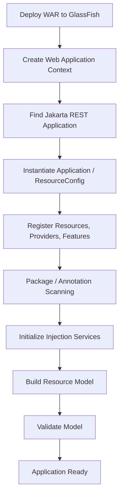
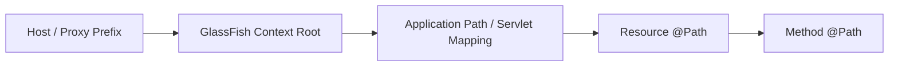

# Part 004 — Jersey Application Bootstrapping Deep Dive

## Tujuan Part Ini

Part ini membahas bagaimana aplikasi Jersey **benar-benar menyala** ketika dideploy ke GlassFish. Fokusnya bukan membuat endpoint pertama, tetapi memahami proses bootstrapping sebagai **construction of runtime graph**.

Bootstrapping menentukan:

- resource mana yang aktif,
- provider mana yang dipakai,
- filter/interceptor mana yang masuk pipeline,
- dependency injection bridge mana yang bekerja,
- package mana yang discan,
- property runtime apa yang aktif,
- path root API apa yang dipakai,
- error startup apa yang muncul sebelum request pertama.

Engineer yang hanya mengandalkan auto-scanning sering kesulitan ketika aplikasi membesar. Production-grade Jersey application sebaiknya punya bootstrap yang **eksplisit, deterministic, testable, dan mudah diaudit**.

Target setelah part ini:

1. Bisa memilih model bootstrap: `Application`, `ResourceConfig`, package scanning, explicit registration, atau `web.xml`.
2. Bisa mendesain `ResourceConfig` production yang modular.
3. Bisa memahami startup failure sebelum endpoint dipanggil.
4. Bisa menghindari classpath scanning dan provider registration yang tidak sengaja.
5. Bisa membuat bootstrap pattern yang cocok untuk sistem enterprise/regulatory case management.

---

## 1. Bootstrapping sebagai Runtime Graph Construction

Saat GlassFish deploy WAR, Jersey tidak langsung “menjalankan endpoint”. Jersey membangun graph.



Bootstrapping failure bisa terjadi di setiap tahap.

| Tahap | Contoh Failure |
|---|---|
| Deploy WAR | artifact corrupt, descriptor invalid, dependency missing |
| Web context | context root conflict, classloader problem |
| Find application | tidak ada `Application`, `@ApplicationPath` salah, descriptor salah |
| Instantiate config | constructor melempar exception, dependency env belum tersedia |
| Register components | class tidak ada, provider duplikat, feature gagal |
| Scanning | package salah, scanning terlalu luas, resource tidak terdeteksi |
| Injection | unsatisfied dependency, HK2/CDI bridge issue |
| Build model | ambiguous resource method, path conflict, invalid annotation |
| Validate model | provider/media mismatch, resource constructor invalid |

Top-tier debugging dimulai dari membaca **server startup/deployment log**, bukan hanya mencoba URL di browser.

---

## 2. Empat Model Bootstrap Utama

Ada beberapa cara mengaktifkan Jersey/Jakarta REST application.

### Model 1 — Minimal `Application` + `@ApplicationPath`

```java
package com.example.caseapi;

import jakarta.ws.rs.ApplicationPath;
import jakarta.ws.rs.core.Application;

@ApplicationPath("/api")
public class CaseApiApplication extends Application {
}
```

Resource:

```java
package com.example.caseapi.boundary;

import jakarta.ws.rs.GET;
import jakarta.ws.rs.Path;
import jakarta.ws.rs.Produces;
import jakarta.ws.rs.core.MediaType;

@Path("/health")
public class HealthResource {
    @GET
    @Produces(MediaType.TEXT_PLAIN)
    public String health() {
        return "OK";
    }
}
```

Final path jika context root `/case-api`:

```text
/case-api/api/health
```

Kelebihan:

- paling sederhana,
- portable,
- cocok untuk aplikasi kecil atau training.

Kekurangan:

- bergantung pada discovery,
- sulit mengaudit resource/provider aktif,
- kurang cocok untuk runtime graph kompleks.

### Model 2 — Override `Application#getClasses()`

```java
@ApplicationPath("/api")
public class CaseApiApplication extends Application {
    @Override
    public Set<Class<?>> getClasses() {
        return Set.of(
            HealthResource.class,
            CaseResource.class,
            CaseNotFoundMapper.class,
            ValidationExceptionMapper.class
        );
    }
}
```

Kelebihan:

- portable,
- lebih deterministic,
- resource/provider terlihat jelas.

Kekurangan:

- konfigurasi menjadi verbose,
- tidak enak untuk module besar,
- tidak memberi semua convenience Jersey-specific.

### Model 3 — Jersey `ResourceConfig`

```java
package com.example.caseapi;

import jakarta.ws.rs.ApplicationPath;
import org.glassfish.jersey.server.ResourceConfig;

@ApplicationPath("/api")
public class CaseApiApplication extends ResourceConfig {
    public CaseApiApplication() {
        register(HealthResource.class);
        register(CaseResource.class);
        register(CaseNotFoundMapper.class);
        register(new ObservabilityFeature());
        register(new ErrorHandlingFeature());
    }
}
```

Kelebihan:

- eksplisit,
- modular,
- Jersey features mudah diaktifkan,
- production-friendly,
- cocok untuk bootstrap pattern yang bisa dites.

Kekurangan:

- Jersey-specific.

Ini adalah default style seri ini.

### Model 4 — `web.xml` Servlet Mapping

Descriptor-based bootstrap masih relevan ketika:

- ingin kontrol penuh servlet mapping,
- perlu integrasi legacy,
- tidak ingin annotation scanning untuk application discovery,
- migration dari Java EE lama.

Contoh konseptual:

```xml
<web-app xmlns="https://jakarta.ee/xml/ns/jakartaee"
         version="6.1">

  <servlet>
    <servlet-name>JerseyApplication</servlet-name>
    <servlet-class>org.glassfish.jersey.servlet.ServletContainer</servlet-class>
    <init-param>
      <param-name>jakarta.ws.rs.Application</param-name>
      <param-value>com.example.caseapi.CaseApiApplication</param-value>
    </init-param>
    <load-on-startup>1</load-on-startup>
  </servlet>

  <servlet-mapping>
    <servlet-name>JerseyApplication</servlet-name>
    <url-pattern>/api/*</url-pattern>
  </servlet-mapping>
</web-app>
```

Catatan: detail descriptor bisa berbeda tergantung versi Servlet/Jakarta EE. Yang penting adalah mental model: descriptor bisa menjadi sumber mapping tambahan atau pengganti annotation path.

---

## 3. Path Composition: Hindari 404 Karena Salah Layer

Path akhir bukan hanya `@Path`.



Contoh:

```java
@ApplicationPath("/api")
public class CaseApiApplication extends ResourceConfig { }
```

```java
@Path("/cases")
public class CaseResource {
    @GET
    @Path("/{id}")
    public CaseDto find(@PathParam("id") String id) { ... }
}
```

Jika context root adalah `/case-service`, endpoint final:

```text
GET /case-service/api/cases/{id}
```

Jika reverse proxy menambahkan `/regulatory`, public URL bisa menjadi:

```text
GET /regulatory/case-service/api/cases/{id}
```

Checklist saat 404:

```text
[ ] WAR deploy sukses?
[ ] Context root sesuai?
[ ] Application path benar?
[ ] Servlet mapping benar?
[ ] Resource class teregister?
[ ] Method path benar?
[ ] HTTP method benar?
[ ] Ada trailing slash sensitivity yang relevan?
[ ] Proxy rewrite benar?
```

---

## 4. Recommended Production Bootstrap Pattern

Untuk aplikasi enterprise, jangan biarkan bootstrap menjadi daftar class acak. Buat struktur modular.

```text
com.example.caseapi
  CaseApiApplication.java

com.example.caseapi.bootstrap
  ObservabilityFeature.java
  ErrorHandlingFeature.java
  SecurityFeature.java
  JsonFeature.java
  ApplicationBinder.java

com.example.caseapi.boundary
  CaseResource.java
  EscalationResource.java
  HealthResource.java

com.example.caseapi.boundary.error
  CaseNotFoundMapper.java
  ValidationExceptionMapper.java
  GenericExceptionMapper.java

com.example.caseapi.application
  CaseCommandService.java
  CaseQueryService.java

com.example.caseapi.domain
  Case.java
  CaseId.java
  CaseStatus.java

com.example.caseapi.adapter
  JdbcCaseRepository.java
  NotificationClient.java
```

### Bootstrap Class

```java
package com.example.caseapi;

import com.example.caseapi.bootstrap.ErrorHandlingFeature;
import com.example.caseapi.bootstrap.JsonFeature;
import com.example.caseapi.bootstrap.ObservabilityFeature;
import com.example.caseapi.bootstrap.SecurityFeature;
import com.example.caseapi.boundary.CaseResource;
import com.example.caseapi.boundary.EscalationResource;
import com.example.caseapi.boundary.HealthResource;
import jakarta.ws.rs.ApplicationPath;
import org.glassfish.jersey.server.ResourceConfig;

@ApplicationPath("/api")
public class CaseApiApplication extends ResourceConfig {
    public CaseApiApplication() {
        registerResources();
        registerRuntimeFeatures();
        configureProperties();
    }

    private void registerResources() {
        register(HealthResource.class);
        register(CaseResource.class);
        register(EscalationResource.class);
    }

    private void registerRuntimeFeatures() {
        register(new ObservabilityFeature());
        register(new ErrorHandlingFeature());
        register(new SecurityFeature());
        register(new JsonFeature());
    }

    private void configureProperties() {
        property("jersey.config.server.wadl.disableWadl", true);
    }
}
```

Catatan:

- Property di atas adalah contoh Jersey-specific yang sering dipakai untuk menonaktifkan WADL bila tidak diperlukan.
- Jangan masukkan business dependency creation berat di constructor application.
- Constructor bootstrap harus cepat, deterministic, dan tidak bergantung pada remote service.

---

## 5. Feature sebagai Modul Runtime

Feature membantu memecah konfigurasi.

### Observability Feature

```java
package com.example.caseapi.bootstrap;

import jakarta.ws.rs.core.Feature;
import jakarta.ws.rs.core.FeatureContext;

public class ObservabilityFeature implements Feature {
    @Override
    public boolean configure(FeatureContext context) {
        context.register(CorrelationIdFilter.class);
        context.register(RequestTimingFilter.class);
        context.register(AccessLogEnrichmentFilter.class);
        return true;
    }
}
```

ResourceConfig:

```java
register(new ObservabilityFeature());
```

Benefit:

- semua observability registration terkumpul,
- mudah dimatikan di test,
- mudah diaudit,
- tidak mencampur filter dengan resource list.

### Error Handling Feature

```java
public class ErrorHandlingFeature implements Feature {
    @Override
    public boolean configure(FeatureContext context) {
        context.register(CaseNotFoundMapper.class);
        context.register(ValidationExceptionMapper.class);
        context.register(ConflictExceptionMapper.class);
        context.register(GenericExceptionMapper.class);
        return true;
    }
}
```

Rule penting:

> Exception mapper adalah bagian dari API contract. Register dengan sengaja, bukan berharap ter-scan.

### Security Feature

```java
public class SecurityFeature implements Feature {
    @Override
    public boolean configure(FeatureContext context) {
        context.register(AuthenticationFilter.class);
        context.register(AuthorizationDynamicFeature.class);
        return true;
    }
}
```

Jangan menaruh semua security logic di satu filter besar. Pisahkan:

- authentication extraction,
- principal construction,
- authorization policy,
- audit decision.

---

## 6. Explicit Registration vs Package Scanning

Ada dua pendekatan ekstrem.

### Explicit Registration

```java
register(CaseResource.class);
register(EscalationResource.class);
register(CaseNotFoundMapper.class);
```

Kelebihan:

- deterministic,
- mudah audit,
- startup graph jelas,
- mencegah provider tidak sengaja aktif.

Kekurangan:

- verbose,
- perlu update saat menambah class.

### Package Scanning

```java
packages("com.example.caseapi.boundary");
```

Kelebihan:

- cepat untuk development,
- sedikit boilerplate.

Kekurangan:

- bisa mendaftarkan class yang tidak diinginkan,
- behavior berubah saat package berubah,
- startup bisa lebih mahal,
- conflict lebih sulit dilacak.

### Recommended Hybrid

Untuk production:

```java
public CaseApiApplication() {
    registerResourcesExplicitly();
    registerCriticalProvidersExplicitly();
    packages("com.example.caseapi.boundary.experimental"); // hanya jika benar-benar perlu
}
```

Aturan:

1. Resource dan provider kontrak publik: explicit.
2. Experimental/internal endpoints: jangan ikut package production.
3. Cross-cutting runtime components: feature modules.
4. Package scanning hanya untuk boundary terbatas.
5. Jangan scan root package `com.example`.

Anti-pattern:

```java
packages("com");
```

Itu membuka peluang registration liar dan startup lambat.

---

## 7. Registration Semantics: Class vs Instance

Jersey bisa mendaftarkan class atau object instance.

### Register Class

```java
register(CaseResource.class);
```

Jersey/container mengelola instantiation sesuai lifecycle/injection.

Ini default yang lebih aman untuk resource/provider.

### Register Instance

```java
register(new MyFilter(config));
```

Instance registration berguna untuk object yang memang ingin dikonstruksi manual.

Risiko:

- instance bisa singleton-like,
- mutable field menjadi thread-safety risk,
- injection container mungkin tidak mengelola object seperti yang kamu kira.

Rule:

> Register class untuk component yang butuh lifecycle/injection container. Register instance hanya untuk component stateless atau konfigurasi eksplisit yang benar-benar kamu kontrol.

Contoh buruk:

```java
public class MutableAuditFilter implements ContainerRequestFilter {
    private String currentUser; // shared mutable state risk
}

register(new MutableAuditFilter());
```

Contoh lebih aman:

```java
public class AuditFilter implements ContainerRequestFilter {
    @Override
    public void filter(ContainerRequestContext ctx) {
        String currentUser = resolveUser(ctx);
        // local variable, request-scoped
    }
}
```

---

## 8. Constructor Bootstrap: Apa yang Boleh dan Tidak Boleh

`ResourceConfig` constructor sering disalahgunakan.

### Boleh

```java
public CaseApiApplication() {
    register(CaseResource.class);
    register(new ObservabilityFeature());
    property("some.runtime.property", "value");
}
```

### Hindari

```java
public CaseApiApplication() {
    var connection = DriverManager.getConnection(...); // buruk
    var config = remoteConfigClient.fetch();           // buruk
    var token = authServer.login();                    // buruk
    runDatabaseMigration();                            // buruk
}
```

Kenapa buruk?

- startup tergantung remote dependency,
- deployment bisa gagal karena dependency transient,
- retry semantics tidak jelas,
- admin tidak bisa membedakan config error vs runtime dependency error,
- membuat autoscaling lambat dan rapuh.

Bootstrap harus membangun graph, bukan menjalankan use case.

---

## 9. CDI Bean Discovery dan Jersey Resource

Di Jakarta EE runtime seperti GlassFish, CDI tersedia. Tetapi kamu tetap harus disiplin.

### Model Resource dengan CDI

```java
@RequestScoped
@Path("/cases")
public class CaseResource {
    private final CaseQueryService queryService;

    @Inject
    public CaseResource(CaseQueryService queryService) {
        this.queryService = queryService;
    }
}
```

Atau field injection:

```java
@Path("/cases")
public class CaseResource {
    @Inject
    CaseQueryService queryService;
}
```

Constructor injection lebih jelas untuk invariant, tetapi perlu dukungan runtime/injection yang benar.

### CDI Discovery Pitfall

Jika bean tidak ditemukan, cek:

```text
[ ] Apakah class ada di WAR?
[ ] Apakah bean punya scope/bean-defining annotation jika discovery mode membutuhkannya?
[ ] Apakah beans.xml ada dan mode-nya sesuai?
[ ] Apakah dependency service ada di package/module yang terlihat?
[ ] Apakah resource dikelola CDI atau hanya Jersey/HK2?
```

### Boundary Rule

- CDI boleh masuk application service.
- Jersey annotation sebaiknya berhenti di boundary/resource/provider/filter.
- Domain model jangan bergantung pada CDI/Jersey.

Buruk:

```java
public class Case {
    @Inject
    AuditService auditService; // domain entity tidak boleh managed seperti ini
}
```

Baik:

```java
@ApplicationScoped
public class CaseCommandService {
    @Inject
    AuditPort auditPort;

    public CaseId create(CreateCaseCommand command) {
        // orchestrate use case
    }
}
```

---

## 10. Provider Registration Strategy

Provider adalah salah satu sumber bug paling mahal.

### Explicit Exception Mappers

```java
public class ErrorHandlingFeature implements Feature {
    @Override
    public boolean configure(FeatureContext context) {
        context.register(CaseNotFoundMapper.class);
        context.register(InvalidCaseTransitionMapper.class);
        context.register(ConstraintViolationMapper.class);
        context.register(UnhandledExceptionMapper.class);
        return true;
    }
}
```

Urutan konseptual:

1. Domain-specific mapper.
2. Validation mapper.
3. Security mapper.
4. Infrastructure mapper.
5. Generic fallback mapper.

Jangan membuat generic mapper yang menelan semuanya tanpa observability.

Buruk:

```java
@Provider
public class EverythingMapper implements ExceptionMapper<Throwable> {
    public Response toResponse(Throwable t) {
        return Response.status(200).entity("failed").build();
    }
}
```

Baik:

```java
@Provider
public class UnhandledExceptionMapper implements ExceptionMapper<Throwable> {
    public Response toResponse(Throwable t) {
        String errorId = ErrorIds.newId();
        log.error("Unhandled errorId={}", errorId, t);
        return Response.serverError()
            .entity(ApiError.internal(errorId))
            .build();
    }
}
```

### JSON Provider Strategy

Jangan biarkan JSON provider menjadi kebetulan transitive dependency.

Tentukan:

- apakah memakai JSON-B default dari Jakarta EE,
- apakah memakai Jackson module Jersey,
- apakah butuh custom date/time format,
- apakah butuh polymorphic serialization,
- apakah DTO contract stabil.

Bootstrap harus membuat keputusan ini eksplisit.

Contoh konsep:

```java
public class JsonFeature implements Feature {
    @Override
    public boolean configure(FeatureContext context) {
        context.register(JsonMappingExceptionMapper.class);
        return true;
    }
}
```

Detail JSON provider akan dibahas di part providers.

---

## 11. Dynamic Feature untuk Policy Binding

Dynamic feature memungkinkan registrasi filter/interceptor berdasarkan metadata resource method.

Contoh annotation:

```java
@Retention(RetentionPolicy.RUNTIME)
@Target({ElementType.TYPE, ElementType.METHOD})
public @interface Audited {
    String action();
}
```

Resource:

```java
@Path("/cases")
public class CaseResource {
    @POST
    @Audited(action = "case.create")
    public Response create(CreateCaseRequest request) {
        return Response.accepted().build();
    }
}
```

Dynamic feature:

```java
public class AuditDynamicFeature implements DynamicFeature {
    @Override
    public void configure(ResourceInfo resourceInfo, FeatureContext context) {
        Audited audited = resourceInfo.getResourceMethod().getAnnotation(Audited.class);
        if (audited != null) {
            context.register(AuditFilter.class);
        }
    }
}
```

Register:

```java
register(AuditDynamicFeature.class);
```

Benefit:

- policy terlihat di endpoint,
- filter tidak berjalan untuk semua request,
- runtime graph lebih intention-revealing.

Pitfall:

- annotation inheritance/class-level behavior harus didefinisikan jelas,
- jangan menyembunyikan policy yang wajib secara compliance,
- audit/security policy harus bisa diuji.

---

## 12. Environment-Specific Configuration

Jangan hardcode environment di `ResourceConfig`.

Buruk:

```java
property("external.case-service.url", "https://dev.example.com");
```

Lebih baik:

- gunakan MicroProfile Config jika tersedia di runtime/profile yang kamu pakai,
- gunakan system properties/environment variables dengan adapter yang jelas,
- gunakan GlassFish resources/JNDI untuk resource container-managed,
- gunakan deployment pipeline untuk inject config.

Contoh wrapper config:

```java
@ApplicationScoped
public class CaseApiConfig {
    public URI notificationBaseUri() {
        return URI.create(System.getProperty("notification.baseUri"));
    }
}
```

Catatan: contoh ini sederhana. Production perlu validation saat startup, secret handling, dan config source ordering yang jelas.

Rule:

> Runtime bootstrap boleh membaca config ringan, tetapi jangan melakukan remote call atau business initialization berat di constructor application.

---

## 13. `web.xml` vs Annotation: Pilih dengan Sadar

### Annotation-Based

```java
@ApplicationPath("/api")
public class CaseApiApplication extends ResourceConfig { }
```

Cocok untuk:

- aplikasi modern,
- config sederhana,
- minim descriptor,
- developer ergonomics.

### Descriptor-Based

```xml
<servlet-mapping>
  <servlet-name>JerseyApplication</servlet-name>
  <url-pattern>/api/*</url-pattern>
</servlet-mapping>
```

Cocok untuk:

- legacy migration,
- compliance/deployment descriptor review,
- ingin mapping dikelola ops/deployment,
- perlu integrasi webapp kompleks.

### Hindari Double Mapping yang Membingungkan

Misalnya ada:

```java
@ApplicationPath("/api")
```

lalu descriptor juga mapping:

```xml
<url-pattern>/rest/*</url-pattern>
```

Jika tidak dipahami, engineer akan bingung endpoint final di `/api` atau `/rest`.

Rule:

> Gunakan satu sumber kebenaran untuk application path/mapping, kecuali migration scenario yang memang mendokumentasikan override-nya.

---

## 14. Startup Validation Pattern

Aplikasi production sebaiknya gagal cepat untuk error konfigurasi fatal, tetapi tidak melakukan dependency call berat.

### Validasi Ringan

```java
@ApplicationScoped
public class StartupConfigValidator {
    @PostConstruct
    void validate() {
        requireProperty("notification.baseUri");
        requireProperty("case.storage.mode");
    }

    private void requireProperty(String name) {
        if (System.getProperty(name) == null || System.getProperty(name).isBlank()) {
            throw new IllegalStateException("Missing required property: " + name);
        }
    }
}
```

Validasi ini boleh karena:

- deterministic,
- local,
- cepat,
- membuat deployment gagal jika config fatal.

### Hindari Validasi Remote Berat

```java
@PostConstruct
void validate() {
    remotePaymentService.ping(); // bisa membuat deploy gagal karena dependency sementara down
}
```

Lebih baik expose health/readiness endpoint:

```java
@Path("/health")
public class HealthResource {
    @GET
    @Path("/live")
    public Response live() {
        return Response.ok().build();
    }

    @GET
    @Path("/ready")
    public Response ready() {
        // check database/pool/critical dependency with timeout budget
        return Response.ok().build();
    }
}
```

Liveness menjawab “process hidup?”. Readiness menjawab “siap menerima traffic?”.

---

## 15. Testability of Bootstrap

Bootstrap harus bisa dites sebagai graph.

Yang ingin diverifikasi:

- resource utama teregister,
- provider critical aktif,
- exception mapper fallback aktif,
- feature security/observability aktif,
- path base tidak berubah tanpa sengaja,
- tidak ada scanning liar.

Contoh pseudo-test:

```java
class CaseApiApplicationTest {
    @Test
    void shouldRegisterCriticalComponents() {
        CaseApiApplication app = new CaseApiApplication();

        assertThat(app.getClasses()).contains(
            CaseResource.class,
            HealthResource.class,
            CaseNotFoundMapper.class
        );
    }
}
```

Pada praktiknya, detail API test bergantung pada versi Jersey dan cara registration. Prinsipnya: **bootstrap adalah contract**, jadi ia layak dites.

### Runtime Smoke Test

Setelah deploy ke GlassFish:

```bash
curl -i http://localhost:8080/case-api/api/health
```

Expected:

```http
HTTP/1.1 200 OK
Content-Type: text/plain

OK
```

Smoke test harus membedakan:

- server hidup,
- app deployed,
- Jersey application path benar,
- resource teregister,
- response provider bekerja.

---

## 16. Failure Playbook Bootstrapping

### Failure 1 — Application Tidak Terdeteksi

Gejala:

```text
404 untuk semua endpoint
Tidak ada log resource registration
```

Cek:

```text
[ ] Ada subclass Application/ResourceConfig?
[ ] Ada @ApplicationPath?
[ ] Class masuk WAR?
[ ] Package class benar?
[ ] web.xml override mapping?
[ ] Deployment sukses tanpa warning?
```

### Failure 2 — Resource Tidak Teregister

Gejala:

```text
/health 200, tetapi /cases 404
```

Cek:

```text
[ ] Resource class diregister eksplisit?
[ ] Jika scanning, package benar?
[ ] Ada @Path di class?
[ ] Method punya HTTP method annotation?
[ ] Method path final benar?
[ ] Class public?
```

### Failure 3 — Provider Tidak Aktif

Gejala:

```text
Exception mapper tidak dipakai
JSON format berubah
415/500 saat baca body
```

Cek:

```text
[ ] Provider punya @Provider atau registered explicit?
[ ] Provider class masuk WAR?
[ ] Ada duplicate provider dengan priority lebih tinggi?
[ ] Media type cocok?
[ ] Generic type cocok?
[ ] JSON module tersedia dan compatible?
```

### Failure 4 — Injection Gagal

Gejala:

```text
Unsatisfied dependency
Null collaborator
MultiException dari HK2
CDI deployment error
```

Cek:

```text
[ ] Resource dikelola CDI atau HK2?
[ ] Dependency punya scope/bean-defining annotation?
[ ] beans.xml diperlukan?
[ ] Constructor injection didukung dalam setup ini?
[ ] Binder teregister?
[ ] Ada duplicate interface implementation tanpa qualifier?
```

### Failure 5 — Classloading Conflict

Gejala:

```text
NoClassDefFoundError
ClassCastException antar class yang sama
NoSuchMethodError
LinkageError
```

Cek:

```text
[ ] Ada Jakarta API jar di WEB-INF/lib yang seharusnya provided?
[ ] Ada Jersey module versi berbeda?
[ ] Ada javax dan jakarta dependency tercampur?
[ ] Ada transitive dependency lama?
[ ] Cek jar tf WAR
[ ] Cek mvn dependency:tree
```

---

## 17. Production Bootstrap Template

Ini template yang akan kita kembangkan di part-part berikutnya.

```java
package com.example.caseapi;

import com.example.caseapi.bootstrap.ErrorHandlingFeature;
import com.example.caseapi.bootstrap.JsonFeature;
import com.example.caseapi.bootstrap.ObservabilityFeature;
import com.example.caseapi.bootstrap.SecurityFeature;
import com.example.caseapi.boundary.CaseResource;
import com.example.caseapi.boundary.EscalationResource;
import com.example.caseapi.boundary.HealthResource;
import jakarta.ws.rs.ApplicationPath;
import org.glassfish.jersey.server.ResourceConfig;

@ApplicationPath("/api")
public class CaseApiApplication extends ResourceConfig {

    public CaseApiApplication() {
        registerPublicResources();
        registerRuntimeFeatures();
        registerProperties();
    }

    private void registerPublicResources() {
        register(HealthResource.class);
        register(CaseResource.class);
        register(EscalationResource.class);
    }

    private void registerRuntimeFeatures() {
        register(new ObservabilityFeature());
        register(new SecurityFeature());
        register(new ErrorHandlingFeature());
        register(new JsonFeature());
    }

    private void registerProperties() {
        property("jersey.config.server.wadl.disableWadl", true);
    }
}
```

### Why This Template Works

- Entry point jelas.
- Path base jelas.
- Resource list bisa direview.
- Cross-cutting concern modular.
- Provider/error strategy eksplisit.
- Runtime properties terkumpul.
- Tidak melakukan remote initialization.
- Siap untuk startup smoke test.

### Yang Sengaja Tidak Ada

- Tidak ada database connection manual.
- Tidak ada HTTP client login saat startup.
- Tidak ada package scanning root.
- Tidak ada business workflow.
- Tidak ada environment hardcoding.
- Tidak ada generic catch-all mapper yang mengubah semua error jadi 200.

---

## 18. Regulatory/Case Management Lens

Untuk sistem enforcement lifecycle atau case management, bootstrap bukan detail teknis minor. Ia menentukan defensibility.

Contoh concern:

| Concern | Bootstrap Implication |
|---|---|
| Auditability | Audit filter/dynamic feature harus registered eksplisit |
| Authorization | Security feature harus aktif sebelum resource invocation |
| Error consistency | Exception mapper harus deterministic |
| Data privacy | Logging filter harus masking field sensitif |
| Evidence chain | Correlation ID harus dibuat/diteruskan sejak request awal |
| Operational incident | Health/readiness endpoint harus stabil dan jelas |
| Change control | Resource/provider graph harus bisa direview di PR |

Jika endpoint enforcement berubah karena classpath scanning tidak sengaja menemukan provider baru, itu bukan hanya bug teknis. Itu bisa menjadi risiko governance.

Maka untuk sistem regulatori:

> Prefer explicit runtime graph over magical discovery.

---

## 19. Practice: Build a Bootstrap Review Checklist

Gunakan checklist ini saat review PR yang menambah endpoint/provider/filter.

```text
Application path:
[ ] Apakah path base terdokumentasi?
[ ] Apakah context root impact dipahami?

Resource registration:
[ ] Resource teregister eksplisit?
[ ] Path tidak konflik dengan resource lain?
[ ] Method HTTP dan media type jelas?

Provider registration:
[ ] Exception mapper domain teregister?
[ ] Validation mapper teregister?
[ ] JSON provider strategy jelas?
[ ] Tidak ada provider generic yang terlalu luas?

Filter/interceptor:
[ ] Urutan priority jelas?
[ ] Filter tidak menjalankan business workflow?
[ ] Security/audit/correlation aktif di endpoint baru?

Injection:
[ ] Dependency dikelola CDI/HK2 dengan jelas?
[ ] Tidak ada mutable shared state?
[ ] Constructor tidak melakukan remote call?

Deployment:
[ ] Dependency scope sesuai GlassFish?
[ ] Tidak ada Jakarta API jar salah scope?
[ ] WAR content sudah dicek jika ada classloading issue?

Operational:
[ ] Health/smoke test mencakup route baru bila perlu?
[ ] Error response contract stabil?
[ ] Logs punya correlation ID?
```

---

## 20. Latihan Deliberate Practice

### Latihan 1 — Minimal to Deterministic

Mulai dari:

```java
@ApplicationPath("/api")
public class ApiApplication extends Application {
}
```

Ubah menjadi:

```java
@ApplicationPath("/api")
public class ApiApplication extends ResourceConfig {
    public ApiApplication() {
        register(HealthResource.class);
        register(CaseResource.class);
        register(new ErrorHandlingFeature());
    }
}
```

Tujuan:

- melihat resource graph secara eksplisit,
- memahami trade-off portability vs determinism.

### Latihan 2 — Simulasi Provider Missing

Hapus registration exception mapper. Jalankan endpoint yang melempar domain exception.

Amati:

- status code,
- response body,
- log,
- apakah error contract berubah.

Tujuan:

- memahami provider sebagai bagian contract.

### Latihan 3 — Simulasi Wrong Path

Ubah `@ApplicationPath("/api")` menjadi `@ApplicationPath("/rest")`.

Cek:

```text
/case-api/api/health  -> expected 404
/case-api/rest/health -> expected 200
```

Tujuan:

- melatih path composition mental model.

### Latihan 4 — Inspect WAR

```bash
jar tf target/case-api.war | sort | grep -E "Application|Resource|Mapper|WEB-INF/lib"
```

Tujuan:

- membiasakan debugging deployment artifact, bukan hanya source code.

---

## 21. Checklist Part 004

Kamu siap lanjut jika bisa menjawab:

1. Apa yang sebenarnya terjadi saat Jersey application bootstrap?
2. Apa beda `Application`, `ResourceConfig`, package scanning, dan `web.xml` mapping?
3. Kenapa explicit registration lebih cocok untuk production-critical API?
4. Kapan package scanning masih masuk akal?
5. Apa risiko register instance dibanding register class?
6. Kenapa constructor `ResourceConfig` tidak boleh melakukan remote call atau database migration?
7. Bagaimana path final dibentuk dari context root, application path, resource path, dan method path?
8. Bagaimana Feature membantu modularisasi runtime concern?
9. Apa failure playbook untuk 404 semua endpoint vs 404 endpoint tertentu?
10. Bagaimana bootstrap memengaruhi auditability dan regulatory defensibility?

---

## Ringkasan

Bootstrapping Jersey adalah proses membangun runtime graph. Ia menentukan resource, provider, filters, interceptors, features, injection, properties, dan path mapping yang aktif di production.

Untuk aplikasi kecil, `Application + @ApplicationPath` cukup. Untuk sistem enterprise yang perlu determinism, auditability, dan debugging kuat, `ResourceConfig` dengan explicit registration dan modular Feature lebih cocok.

Prinsip utama:

```text
Bootstrap should construct the runtime graph.
It should not execute business workflows.
It should not depend on remote systems.
It should be explicit enough to review and test.
```

Part berikutnya akan masuk ke **Resource Model Internals Beyond Basic JAX-RS**: bagaimana Jersey memahami resource class, path matching, method dispatch, sub-resource locator, lifecycle, ambiguity, dan diagnostic strategy.
