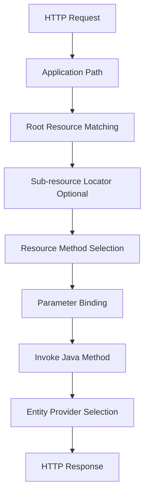
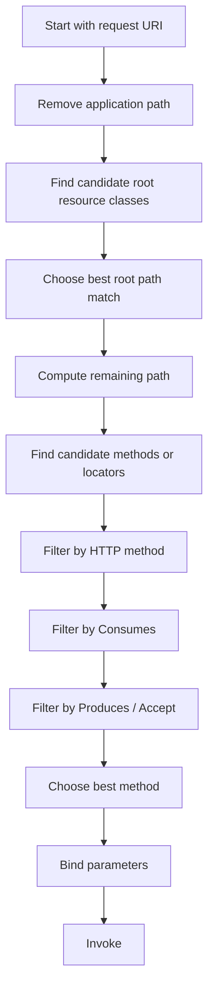

# Part 005 — Resource Model Internals Beyond Basic JAX-RS

## Tujuan Part Ini

Pada seri `learn-java-jakarta-restful-web-services`, kita sudah membahas anotasi REST, resource, HTTP method, status code, dan desain API secara umum. Part ini tidak mengulang itu.

Part ini membahas bagaimana Jersey **membangun dan memakai resource model** saat aplikasi berjalan di GlassFish. Resource model adalah struktur internal yang menjawab pertanyaan:

> Untuk request HTTP tertentu, class apa yang harus dibuat, method mana yang dipanggil, provider mana yang dipakai, parameter mana yang di-bind, dan lifecycle objek mana yang berlaku?

Ini penting karena banyak bug Jersey/GlassFish production tidak terlihat seperti bug resource model. Gejalanya bisa berupa:

- `404 Not Found` padahal endpoint ada,
- `405 Method Not Allowed`,
- `406 Not Acceptable`,
- `415 Unsupported Media Type`,
- endpoint salah yang terpanggil,
- sub-resource tidak pernah dieksekusi,
- resource singleton menyimpan state request,
- path conflict yang baru terlihat setelah deployment,
- behavior berbeda antara local test dan GlassFish.

Target setelah part ini:

1. Bisa membaca resource class sebagai **runtime dispatch graph**, bukan kumpulan anotasi.
2. Bisa membedakan root resource, sub-resource locator, dan resource method.
3. Bisa menjelaskan path matching dan method selection secara operasional.
4. Bisa mendesain endpoint agar tidak ambigu, tidak rapuh, dan mudah di-debug.
5. Bisa membuat checklist review resource model untuk sistem enterprise.

---

## 1. Mental Model: Resource Model adalah Routing Graph + Invocation Plan

Jersey tidak hanya melakukan string matching sederhana seperti router web framework minimalis. Jersey membangun model dari class, method, annotation, provider, injection point, dan metadata lain.



Resource model minimal terdiri dari:

| Elemen | Fungsi |
|---|---|
| Application path | Prefix aplikasi Jakarta REST, misalnya `/api` |
| Root resource class | Class dengan `@Path` di level class |
| Resource method | Method dengan HTTP method annotation seperti `@GET`, `@POST` |
| Sub-resource method | Method yang punya `@Path` + HTTP method di class resource |
| Sub-resource locator | Method yang punya `@Path` tetapi tidak punya HTTP method annotation |
| Parameter model | Source parameter: path, query, header, cookie, matrix, form, context, bean |
| Entity model | Request/response body + media type |
| Provider model | Reader/writer/filter/interceptor/mapper yang relevan |
| Lifecycle model | Kapan instance dibuat, dibuang, dan di-inject |

Cara berpikir yang benar:

> Endpoint bukan hanya URL. Endpoint adalah hasil dari kombinasi path template, HTTP method, media negotiation, injection, lifecycle, dan provider selection.

---

## 2. Root Resource Class

Root resource class adalah class yang dikenali Jersey sebagai entry point routing karena punya `@Path` di level class.

```java
import jakarta.ws.rs.GET;
import jakarta.ws.rs.Path;
import jakarta.ws.rs.Produces;
import jakarta.ws.rs.core.MediaType;

@Path("cases")
public class CaseResource {

    @GET
    @Produces(MediaType.APPLICATION_JSON)
    public List<CaseSummaryResponse> listCases() {
        return List.of();
    }
}
```

Jika `@ApplicationPath("api")` dipakai, path efektifnya menjadi:

```text
/api/cases
```

Root resource class harus diperlakukan sebagai **boundary object**, bukan domain service.

Salah:

```java
@Path("cases")
public class CaseResource {
    private final Map<String, MutableCaseState> cache = new HashMap<>();

    @POST
    public Response create(CreateCaseRequest request) {
        // business transaction, validation, escalation, audit, persistence,
        // integration, and workflow mutation all here
    }
}
```

Benar:

```java
@Path("cases")
public class CaseResource {
    private final CaseApplicationService caseService;

    public CaseResource(CaseApplicationService caseService) {
        this.caseService = caseService;
    }

    @POST
    public Response create(CreateCaseRequest request) {
        CaseId id = caseService.openCase(request.toCommand());
        return Response.created(URI.create("/cases/" + id.value())).build();
    }
}
```

Resource class sebaiknya:

- menerima HTTP input,
- memvalidasi boundary-level concern,
- menerjemahkan DTO ke command/query,
- memanggil application service,
- menerjemahkan hasil ke HTTP response,
- tidak menyimpan state request di field mutable,
- tidak berisi orchestration kompleks yang sulit dites.

---

## 3. Resource Method vs Sub-resource Method vs Sub-resource Locator

Dalam review code, jangan hanya lihat `@Path`. Lihat kombinasi `@Path` dan HTTP method annotation.

### 3.1 Resource Method

Resource method punya HTTP method annotation.

```java
@Path("cases")
public class CaseResource {

    @GET
    public List<CaseSummaryResponse> list() {
        return List.of();
    }
}
```

Path efektif:

```text
GET /cases
```

### 3.2 Sub-resource Method

Sub-resource method punya `@Path` dan HTTP method annotation pada method.

```java
@Path("cases")
public class CaseResource {

    @GET
    @Path("{caseId}")
    public CaseDetailResponse get(@PathParam("caseId") String caseId) {
        return new CaseDetailResponse(caseId);
    }
}
```

Path efektif:

```text
GET /cases/{caseId}
```

### 3.3 Sub-resource Locator

Sub-resource locator punya `@Path`, tetapi **tidak punya** HTTP method annotation. Ia mengembalikan object resource lain.

```java
@Path("cases")
public class CaseResource {

    @Path("{caseId}/documents")
    public CaseDocumentResource documents(@PathParam("caseId") String caseId) {
        return new CaseDocumentResource(caseId);
    }
}

public class CaseDocumentResource {
    private final String caseId;

    public CaseDocumentResource(String caseId) {
        this.caseId = caseId;
    }

    @GET
    public List<DocumentResponse> listDocuments() {
        return List.of();
    }
}
```

Path efektif:

```text
GET /cases/{caseId}/documents
```

Sub-resource locator berguna untuk memodelkan hierarki API kompleks, tetapi juga bisa membuat route graph sulit dibaca. Gunakan hanya jika:

- subtree resource besar,
- ada dependency/authorization context per parent entity,
- ingin memisahkan module resource secara natural,
- path hierarchy punya domain meaning yang kuat.

Jangan gunakan sub-resource locator hanya untuk “merapikan file”. Kalau hasilnya membuat routing tersembunyi, lebih baik explicit sub-resource method atau resource class terpisah.

---

## 4. Dispatch Algorithm dalam Bahasa Engineer

Jakarta REST specification mendefinisikan proses matching secara formal. Untuk operational reasoning, gunakan versi sederhana berikut:



Untuk debugging, pecah pertanyaan menjadi lima lapis:

1. Apakah request masuk ke web app yang benar?
2. Apakah application path benar?
3. Apakah root resource class match?
4. Apakah method/sub-resource locator match?
5. Apakah HTTP method dan media type compatible?

Contoh:

```java
@ApplicationPath("api")
public class ApiApplication extends ResourceConfig {
    public ApiApplication() {
        register(CaseResource.class);
    }
}

@Path("cases")
public class CaseResource {
    @GET
    @Path("{caseId}")
    @Produces("application/json")
    public CaseDetailResponse get(@PathParam("caseId") String caseId) {
        return new CaseDetailResponse(caseId);
    }
}
```

Request valid:

```text
GET /<context-root>/api/cases/C-1001
Accept: application/json
```

Request yang terlihat benar tetapi gagal:

```text
GET /api/cases/C-1001
```

Jika WAR dideploy dengan context root `/case-service`, path sebenarnya:

```text
/case-service/api/cases/C-1001
```

Maka debugging tidak boleh langsung melihat class resource. Pertama pastikan path composition.

---

## 5. Path Composition: Context Root + Application Path + Resource Path

Banyak 404 terjadi karena engineer mencampur tiga path yang berbeda.

```text
<context-root>/<application-path>/<resource-path>
```

Contoh:

| Layer | Value |
|---|---|
| GlassFish context root | `/case-service` |
| `@ApplicationPath` | `/api` |
| Resource `@Path` | `/cases` |
| Method `@Path` | `/{caseId}` |
| Effective URI | `/case-service/api/cases/{caseId}` |

Diagram:

```mermaid
flowchart LR
    CR[GlassFish Context Root<br/>/case-service]
    AP[Jakarta REST Application Path<br/>/api]
    RP[Resource Class Path<br/>/cases]
    MP[Method Path<br/>/{caseId}]
    URI[Effective URI<br/>/case-service/api/cases/{caseId}]

    CR --> AP --> RP --> MP --> URI
```

Rule praktis:

- context root adalah concern deployment,
- application path adalah concern Jakarta REST application,
- resource path adalah concern API module,
- method path adalah concern operation/sub-resource.

Untuk production, dokumentasikan semua layer ini di deployment manifest atau runbook. Jangan biarkan endpoint publik disimpulkan dari anotasi saja.

---

## 6. Path Template Specificity

Path template bukan sekadar string. Template punya variabel, regex, dan specificity.

```java
@Path("cases")
public class CaseResource {

    @GET
    @Path("open")
    public List<CaseSummaryResponse> openCases() {
        return List.of();
    }

    @GET
    @Path("{caseId}")
    public CaseDetailResponse getCase(@PathParam("caseId") String caseId) {
        return new CaseDetailResponse(caseId);
    }
}
```

Request:

```text
GET /cases/open
```

Secara niat, harus masuk ke `openCases()`, bukan `getCase("open")`. Biasanya path literal lebih spesifik dari variable path. Namun desain seperti ini tetap perlu hati-hati karena path namespace bercampur antara command collection dan entity identifier.

Lebih aman:

```text
GET /cases?status=open
GET /cases/{caseId}
```

Atau:

```text
GET /case-search/open
GET /cases/{caseId}
```

Jika identifier bisa berbentuk kata bebas, hindari sibling literal yang bisa bentrok.

---

## 7. Regex Path Constraint

Jakarta REST memungkinkan regex pada path parameter.

```java
@GET
@Path("{caseId: C-[0-9]{4,10}}")
public CaseDetailResponse getCase(@PathParam("caseId") String caseId) {
    return new CaseDetailResponse(caseId);
}
```

Ini membantu membedakan identifier domain dari command path.

```java
@GET
@Path("open")
public List<CaseSummaryResponse> openCases() {
    return List.of();
}

@GET
@Path("{caseId: C-[0-9]+}")
public CaseDetailResponse getCase(@PathParam("caseId") String caseId) {
    return new CaseDetailResponse(caseId);
}
```

Sekarang:

| Request | Match |
|---|---|
| `/cases/open` | `openCases()` |
| `/cases/C-1001` | `getCase()` |
| `/cases/foo` | no matching resource method |

Gunakan regex path saat:

- identifier punya format stabil,
- ada risiko bentrok dengan literal path,
- ingin route failure terjadi sebelum service layer,
- ingin boundary API lebih defensif.

Jangan gunakan regex path untuk validasi bisnis kompleks. Validasi bisnis tetap di validation/application layer.

---

## 8. Ambiguous Resource Model

Ambiguity terjadi ketika dua atau lebih method tampak bisa menangani request yang sama.

Contoh buruk:

```java
@Path("cases")
public class CaseResource {

    @GET
    @Path("{id}")
    public CaseDetailResponse byId(@PathParam("id") String id) {
        return new CaseDetailResponse(id);
    }

    @GET
    @Path("{reference}")
    public CaseDetailResponse byReference(@PathParam("reference") String reference) {
        return new CaseDetailResponse(reference);
    }
}
```

Bagi framework, `{id}` dan `{reference}` adalah shape yang sama. Nama parameter tidak membuat path berbeda.

Perbaikan:

```java
@GET
@Path("id/{id}")
public CaseDetailResponse byId(@PathParam("id") String id) {
    return new CaseDetailResponse(id);
}

@GET
@Path("reference/{reference}")
public CaseDetailResponse byReference(@PathParam("reference") String reference) {
    return new CaseDetailResponse(reference);
}
```

Atau gunakan regex jika domain format berbeda:

```java
@GET
@Path("{id: [0-9]+}")
public CaseDetailResponse byNumericId(@PathParam("id") String id) {
    return new CaseDetailResponse(id);
}

@GET
@Path("{reference: REF-[A-Z0-9]+}")
public CaseDetailResponse byReference(@PathParam("reference") String reference) {
    return new CaseDetailResponse(reference);
}
```

### Review Rule

Jika dua route hanya berbeda pada **nama variable path**, itu bukan desain route yang sehat.

---

## 9. Resource Lifecycle

Jakarta REST resource class umumnya dibuat per request, kecuali ada lifecycle/scope lain yang diterapkan oleh container/DI. Dalam praktik Jersey + GlassFish, lifecycle dapat dipengaruhi oleh:

- resource dikelola langsung oleh Jersey,
- resource dikelola CDI,
- resource diregister sebagai instance,
- singleton binding,
- provider/resource custom scope,
- sub-resource locator yang mengembalikan instance manual.

### 9.1 Per-request Resource: Default yang Aman

```java
@Path("cases")
public class CaseResource {
    private String requestLocalValue;

    @GET
    @Path("{caseId}")
    public CaseDetailResponse get(@PathParam("caseId") String caseId) {
        requestLocalValue = caseId;
        return new CaseDetailResponse(requestLocalValue);
    }
}
```

Walaupun field mutable tetap tidak disarankan, risiko concurrency lebih kecil jika instance per request.

Namun jangan mengandalkan asumsi ini tanpa memahami DI/lifecycle. Field mutable pada resource adalah smell karena:

- behavior berubah saat scope berubah,
- sulit diuji paralel,
- membuat resource terlihat stateful,
- rawan saat resource diregister sebagai singleton/instance.

Lebih baik:

```java
@GET
@Path("{caseId}")
public CaseDetailResponse get(@PathParam("caseId") String caseId) {
    return caseQueryService.get(caseId);
}
```

### 9.2 Singleton Resource: Jarang Cocok untuk HTTP Boundary

```java
public class ApiApplication extends ResourceConfig {
    public ApiApplication() {
        register(new CaseResource());
    }
}
```

Register instance seperti ini dapat membuat resource menjadi singleton-like. Jika `CaseResource` punya mutable field, semua request berbagi state.

Bahaya:

```java
@Path("cases")
public class CaseResource {
    private String currentUser;

    @GET
    public Response list(@HeaderParam("X-User") String user) {
        currentUser = user;
        return Response.ok("User = " + currentUser).build();
    }
}
```

Dalam concurrent request, `currentUser` bisa tertukar.

Rule:

> Resource class harus stateless. Dependency boleh field final. Request data harus local variable, parameter, atau request-scoped dependency.

---

## 10. Sub-resource Locator: Powerful tapi Berisiko

Sub-resource locator memungkinkan routing dinamis.

```java
@Path("cases")
public class CaseResource {

    @Path("{caseId}")
    public Object caseSubtree(@PathParam("caseId") String caseId) {
        CaseType type = caseCatalog.typeOf(caseId);

        if (type == CaseType.ENFORCEMENT) {
            return new EnforcementCaseResource(caseId);
        }

        return new GeneralCaseResource(caseId);
    }
}
```

Ini powerful, tetapi punya biaya:

- route graph tidak statis sepenuhnya,
- debugging lebih sulit,
- dependency injection manual bisa terlewat,
- lifecycle objek hasil locator perlu jelas,
- authorization bisa tersebar,
- startup validation mungkin tidak menangkap semua runtime branch.

Gunakan pattern ini hanya jika polymorphic resource memang domain requirement.

### 10.1 Safer Sub-resource Locator Pattern

Daripada `new` manual dengan dependency tersembunyi, gunakan factory/service.

```java
@Path("cases")
public class CaseResource {
    private final CaseSubResourceFactory factory;

    public CaseResource(CaseSubResourceFactory factory) {
        this.factory = factory;
    }

    @Path("{caseId}")
    public Object caseSubtree(@PathParam("caseId") String caseId) {
        return factory.create(caseId);
    }
}
```

Factory harus punya invariant:

- semua returned resource stateless atau request-scoped,
- semua dependency lengkap,
- authorization context jelas,
- fallback explicit,
- tidak melakukan heavy I/O hanya untuk route selection kecuali benar-benar perlu.

---

## 11. Parameter Binding Model

Parameter binding adalah bagian dari invocation plan.

```java
@GET
@Path("{caseId}/events")
public List<EventResponse> events(
        @PathParam("caseId") String caseId,
        @QueryParam("from") Instant from,
        @QueryParam("limit") @DefaultValue("50") int limit,
        @HeaderParam("X-Correlation-Id") String correlationId) {
    return List.of();
}
```

Jersey harus menjawab:

- dari mana nilai diambil,
- bagaimana string dikonversi ke tipe Java,
- apa default value-nya,
- apa yang terjadi jika conversion gagal,
- apakah parameter optional atau required,
- kapan Bean Validation dijalankan,
- exception apa yang dilempar.

### 11.1 Boundary Parameter Rule

Gunakan parameter binding untuk input yang benar-benar HTTP-level.

Cocok:

```java
@PathParam("caseId") String caseId
@QueryParam("limit") int limit
@HeaderParam("X-Correlation-Id") String correlationId
```

Kurang cocok:

```java
@QueryParam("escalationPolicyExpression") String rawPolicyDsl
@QueryParam("auditMutationMode") String internalMode
```

Jika parameter mulai membawa internal implementation detail, API boundary bocor.

---

## 12. `@BeanParam` untuk Boundary Object

Untuk query/filter kompleks, `@BeanParam` bisa mengurangi noise.

```java
public class CaseSearchParams {
    @QueryParam("status")
    private String status;

    @QueryParam("owner")
    private String owner;

    @QueryParam("limit")
    @DefaultValue("50")
    private int limit;

    public CaseSearchQuery toQuery() {
        return new CaseSearchQuery(status, owner, limit);
    }
}

@Path("cases")
public class CaseResource {

    @GET
    public List<CaseSummaryResponse> search(@BeanParam CaseSearchParams params) {
        return List.of();
    }
}
```

Pattern yang baik:

```text
HTTP params -> BeanParam DTO -> validated query/command -> application service
```

Jangan biarkan `@BeanParam` object menjadi domain object. Ia tetap boundary model.

---

## 13. Method Selection: HTTP Method + Consumes + Produces

Path match saja belum cukup. Jersey juga mempertimbangkan HTTP method dan media type.

```java
@Path("cases")
public class CaseResource {

    @POST
    @Consumes("application/json")
    @Produces("application/json")
    public CaseCreatedResponse createJson(CreateCaseRequest request) {
        return new CaseCreatedResponse("C-1001");
    }

    @POST
    @Consumes("application/xml")
    @Produces("application/xml")
    public CaseCreatedXmlResponse createXml(CreateCaseXmlRequest request) {
        return new CaseCreatedXmlResponse("C-1001");
    }
}
```

Request:

```text
POST /cases
Content-Type: application/json
Accept: application/json
```

akan memilih `createJson`.

Request:

```text
POST /cases
Content-Type: text/plain
Accept: application/json
```

akan gagal di media type request, biasanya `415 Unsupported Media Type`.

Request:

```text
POST /cases
Content-Type: application/json
Accept: application/pdf
```

akan gagal di response negotiation, biasanya `406 Not Acceptable`.

Review checklist:

| Symptom | Area yang Dicek |
|---|---|
| 404 | context root, application path, resource path, locator path |
| 405 | path match ada, HTTP method tidak ada |
| 415 | `Content-Type` tidak compatible dengan `@Consumes` / reader |
| 406 | `Accept` tidak compatible dengan `@Produces` / writer |
| 500 | method/provider/mapper/injection runtime failure |

---

## 14. Resource Model dan Provider Model Saling Mengikat

Resource method return type mempengaruhi provider selection.

```java
@GET
@Produces("application/json")
public CaseDetailResponse get() {
    return new CaseDetailResponse("C-1001");
}
```

Jersey harus menemukan `MessageBodyWriter<CaseDetailResponse>` untuk `application/json`.

Jika tidak ada JSON provider yang sesuai:

```text
500 Internal Server Error
```

atau provider-related failure saat response writing.

Karena itu resource model review harus mencakup:

- request entity type,
- response entity type,
- generic type preservation,
- media type,
- provider availability,
- custom provider priority,
- runtime module dependency.

Contoh raw collection buruk:

```java
@GET
public List list() {
    return List.of(new CaseSummaryResponse("C-1"));
}
```

Lebih baik:

```java
@GET
public List<CaseSummaryResponse> list() {
    return List.of(new CaseSummaryResponse("C-1"));
}
```

Untuk response yang butuh generic type eksplisit:

```java
GenericEntity<List<CaseSummaryResponse>> entity =
        new GenericEntity<>(caseService.list()) {};

return Response.ok(entity).build();
```

---

## 15. Resource Model Startup Validation

Jersey melakukan banyak validasi saat startup, tetapi tidak semua kesalahan akan muncul sebelum request.

Terdeteksi saat startup:

- resource method ambigu,
- annotation invalid tertentu,
- provider registration invalid,
- injection dependency tidak resolvable pada component tertentu,
- model construction failure,
- duplicate incompatible resource methods.

Mungkin baru muncul saat runtime:

- branch sub-resource locator tertentu,
- entity provider untuk tipe tertentu,
- conversion parameter tertentu,
- dependency lazy,
- environment-specific classloading,
- media type negotiation path yang jarang dipakai.

### 15.1 Startup Strictness Pattern

Untuk sistem enterprise, buat smoke test yang memaksa semua endpoint penting tervalidasi.

```java
class ResourceModelSmokeTest {

    @Test
    void applicationShouldStartWithExpectedResources() {
        ResourceConfig config = new ApiApplication();

        assertThat(config.getClasses()).contains(CaseResource.class);
        assertThat(config.getClasses()).contains(CaseEventResource.class);
    }
}
```

Untuk level lebih serius, buat integration test yang menjalankan container test dan memanggil route matrix minimal:

| Route | Expected |
|---|---|
| `GET /cases` | 200 |
| `POST /cases` valid JSON | 201 |
| `POST /cases` invalid media type | 415 |
| `GET /cases/C-1001` | 200/404 domain-safe |
| `GET /cases/open` | deterministic |
| `GET /cases/C-1001/events` | 200 |

---

## 16. Designing Resource Model untuk Domain Kompleks

Untuk regulatory/enforcement lifecycle system, API sering mencakup banyak entity:

- case,
- allegation,
- party,
- document,
- event,
- assignment,
- escalation,
- decision,
- remedy,
- audit,
- notification,
- appeal.

Naive resource model:

```text
/cases/{caseId}/allegations/{allegationId}/documents/{documentId}/reviews/{reviewId}/decisions/{decisionId}
```

Masalah:

- terlalu dalam,
- authorization context kompleks,
- route sulit distabilkan,
- entity lifecycle dicampur,
- API client harus tahu graph internal.

Lebih baik pecah berdasarkan aggregate boundary dan use case.

```text
/cases/{caseId}
/cases/{caseId}/timeline
/cases/{caseId}/documents
/case-documents/{documentId}
/case-decisions/{decisionId}
/case-escalations/{escalationId}
```

Rule:

> Nesting path sebaiknya menunjukkan ownership atau traversal yang stabil, bukan semua relational join.

---

## 17. Resource Granularity

Resource class terlalu besar:

```text
CaseResource
- list cases
- create case
- get case
- update case
- assign case
- close case
- upload document
- list documents
- delete document
- add party
- remove party
- start investigation
- escalate
- appeal
- export report
```

Ini mencampur banyak subdomain.

Resource class terlalu kecil:

```text
GetCaseResource
CreateCaseResource
CloseCaseResource
AssignCaseResource
EscalateCaseResource
```

Ini bisa membuat bootstrapping dan route map berlebihan.

Balanced:

```text
CaseResource
CaseAssignmentResource
CaseDocumentResource
CaseTimelineResource
CaseEscalationResource
CaseDecisionResource
```

Gunakan pembagian berdasarkan:

- authorization policy,
- transaction boundary,
- rate limit group,
- audit category,
- provider/filter binding,
- ownership oleh tim/module,
- operational blast radius.

---

## 18. DynamicFeature dan Resource Model

`DynamicFeature` dapat memasang filter/interceptor berdasarkan resource method metadata.

Contoh:

```java
@NameBinding
@Retention(RetentionPolicy.RUNTIME)
@Target({ElementType.TYPE, ElementType.METHOD})
public @interface Audited {
}

@Provider
public class AuditFeature implements DynamicFeature {
    @Override
    public void configure(ResourceInfo resourceInfo, FeatureContext context) {
        if (resourceInfo.getResourceMethod().isAnnotationPresent(Audited.class)
                || resourceInfo.getResourceClass().isAnnotationPresent(Audited.class)) {
            context.register(AuditFilter.class);
        }
    }
}
```

Resource:

```java
@Path("cases")
public class CaseResource {

    @POST
    @Audited
    public Response create(CreateCaseRequest request) {
        return Response.status(Response.Status.CREATED).build();
    }
}
```

Dynamic binding cocok untuk cross-cutting concern yang bergantung pada resource metadata:

- audit,
- authentication policy,
- authorization policy,
- rate limit class,
- export controls,
- idempotency,
- tenant boundary.

Anti-pattern:

- menyembunyikan business branching di filter,
- memasang filter berdasarkan nama method string,
- membuat rule magic yang tidak terlihat di resource,
- memasang terlalu banyak dynamic filter sampai pipeline sulit dipahami.

---

## 19. Name Binding sebagai Kontrak Resource Method

Name binding membuat resource method menyatakan kebijakan pipeline secara eksplisit.

```java
@NameBinding
@Retention(RetentionPolicy.RUNTIME)
@Target({ElementType.TYPE, ElementType.METHOD})
public @interface RequiresCaseOfficer {
}
```

Filter:

```java
@Provider
@RequiresCaseOfficer
@Priority(Priorities.AUTHORIZATION)
public class CaseOfficerAuthorizationFilter implements ContainerRequestFilter {
    @Override
    public void filter(ContainerRequestContext requestContext) {
        // authorize
    }
}
```

Resource:

```java
@Path("cases")
public class CaseResource {

    @POST
    @RequiresCaseOfficer
    public Response create(CreateCaseRequest request) {
        return Response.status(Response.Status.CREATED).build();
    }
}
```

Ini lebih jelas daripada filter global yang mencoba menebak route dari string path.

Rule:

> Gunakan metadata resource untuk policy. Jangan parse URL manual di filter jika policy dapat dinyatakan sebagai annotation.

---

## 20. Error Model Terkait Resource Matching

Kesalahan route harus dibaca sebagai sinyal dari lapisan tertentu.

### 20.1 404 Not Found

Kemungkinan:

- context root salah,
- application path salah,
- resource tidak terdaftar,
- package scanning tidak menemukan class,
- path template tidak match,
- sub-resource locator tidak match,
- regex path terlalu ketat,
- trailing path mismatch pada proxy/gateway,
- deployment bukan artifact yang dipikirkan.

### 20.2 405 Method Not Allowed

Kemungkinan:

- path match ada,
- HTTP method tidak tersedia,
- lupa `@POST` / `@PUT`,
- method ada tetapi di class lain dengan path berbeda,
- preflight/options behavior tidak sesuai.

### 20.3 406 Not Acceptable

Kemungkinan:

- `Accept` header tidak cocok,
- `@Produces` terlalu sempit,
- writer tidak tersedia,
- custom media type tidak didaftarkan,
- client mengirim default `Accept` aneh.

### 20.4 415 Unsupported Media Type

Kemungkinan:

- `Content-Type` tidak cocok,
- `@Consumes` terlalu sempit,
- reader tidak tersedia,
- JSON provider tidak ada,
- request body kosong tapi method butuh entity,
- charset/media parameter tidak dipahami provider tertentu.

---

## 21. Production Route Registry Pattern

Untuk aplikasi besar, buat route registry yang bisa dibaca manusia.

Contoh dokumentasi internal:

| Module | Method | Path | Resource | Policy | Audit | Owner |
|---|---:|---|---|---|---|---|
| Case | GET | `/cases` | `CaseResource.list` | officer | no | Case Platform |
| Case | POST | `/cases` | `CaseResource.create` | officer | yes | Case Platform |
| Case | GET | `/cases/{caseId}` | `CaseResource.get` | case-view | yes | Case Platform |
| Document | POST | `/cases/{caseId}/documents` | `CaseDocumentResource.upload` | document-write | yes | Evidence |
| Escalation | POST | `/cases/{caseId}/escalations` | `CaseEscalationResource.escalate` | escalation-write | yes | Enforcement |

Idealnya registry ini bisa dihasilkan dari test/reflection untuk mencegah drift.

Pseudocode:

```java
class RouteRegistryTest {
    @Test
    void routesShouldMatchApprovedSnapshot() {
        ApiApplication app = new ApiApplication();
        RouteSnapshot snapshot = JerseyRouteInspector.inspect(app);

        assertThat(snapshot).matchesApprovedSnapshot("routes.approved.json");
    }
}
```

Manfaat:

- mendeteksi accidental route change,
- membantu audit,
- membantu API gateway config,
- membantu security review,
- membantu onboarding engineer baru.

---

## 22. Anti-pattern Catalog

### 22.1 God Resource

Satu resource class menangani semua operasi.

Gejala:

- file ribuan baris,
- terlalu banyak injected service,
- semua endpoint punya policy berbeda,
- testing lambat,
- conflict path sering muncul.

Perbaikan: pecah berdasarkan subdomain/API capability.

### 22.2 Path Variable Ambiguity

```java
@Path("{id}")
@Path("{name}")
```

Nama variable bukan pembeda route.

Perbaikan: literal prefix atau regex.

### 22.3 Business Logic di Sub-resource Locator

Sub-resource locator memutuskan proses bisnis berat.

Perbaikan: locator hanya memilih subtree ringan; business decision di application service.

### 22.4 Stateful Resource Field

Resource menyimpan request data di field.

Perbaikan: gunakan local variable/request-scoped dependency.

### 22.5 Hidden Route via Package Scanning

Endpoint aktif karena package scanning terlalu luas.

Perbaikan: explicit registration untuk production modules.

### 22.6 Media Type Drift

Class-level `@Produces` terlalu luas atau terlalu sempit, method behavior tidak jelas.

Perbaikan: tetapkan media type per resource/module dengan deliberate policy.

### 22.7 URL Parsing Manual di Filter

Filter melakukan:

```java
if (path.contains("/cases/") && path.endsWith("/close")) {
    // authorization
}
```

Perbaikan: name binding atau DynamicFeature berbasis annotation.

---

## 23. Debugging Playbook: Endpoint Tidak Ketemu

Gunakan urutan ini.

### Step 1 — Pastikan Artifact yang Dideploy

```text
asadmin list-applications
asadmin get applications.application.<app-name>.*
```

Cek:

- nama aplikasi,
- context root,
- target server/cluster,
- versi artifact.

### Step 2 — Pastikan Application Path

Cari:

```java
@ApplicationPath("api")
```

atau `web.xml` servlet mapping.

### Step 3 — Pastikan Resource Terdaftar

Jika explicit registration:

```java
register(CaseResource.class);
```

Jika package scanning:

```java
packages("com.acme.caseapi.resources");
```

Cek package class sebenarnya.

### Step 4 — Pastikan Path Efektif

Gabungkan:

```text
context root + application path + resource class path + method path
```

### Step 5 — Pastikan HTTP Method dan Media Type

Cek request:

```text
Method
Content-Type
Accept
```

### Step 6 — Cek Logs Startup Jersey

Startup warning sering memberi clue:

- resource ignored,
- provider ignored,
- injection failure,
- ambiguous method,
- class not found,
- model validation failure.

---

## 24. Testing Resource Model

Testing tidak harus selalu full integration, tetapi route behavior penting perlu ditutup.

### 24.1 Unit Test untuk Path Constants?

Hindari terlalu banyak constant path yang membuat annotation tidak readable.

Boleh:

```java
public final class ApiPaths {
    public static final String CASES = "cases";
    private ApiPaths() {}
}
```

Tapi jangan sampai:

```java
@Path(ApiPaths.CASES_ROOT_SEGMENT_FROM_LEGACY_GATEWAY_V2)
```

Readable annotation lebih penting.

### 24.2 Integration Route Matrix

```java
@ParameterizedTest
@CsvSource({
        "GET,/cases,200",
        "POST,/cases,201",
        "GET,/cases/C-1001,200",
        "GET,/cases/INVALID,404"
})
void routeMatrix(String method, String path, int expectedStatus) {
    // call test container
}
```

### 24.3 Negative Tests

Negative tests penting untuk memastikan route tidak terlalu permisif.

```text
GET /cases/open when open is query-only -> expected 404
POST /cases with text/plain -> expected 415
GET /cases/C-1001 with Accept application/pdf -> expected 406
```

---

## 25. Design Heuristics untuk Top-tier Engineer

### 25.1 Keep Route Shape Stable

Route adalah public contract. Jangan sering mengubah path hanya karena internal model berubah.

### 25.2 Avoid Deep Nesting by Default

Nesting dalam path harus menunjukkan ownership yang kuat, bukan relasi database.

### 25.3 Make Ambiguity Impossible

Gunakan literal prefix atau regex untuk path variable yang bisa bertabrakan.

### 25.4 Resource Classes are Adapters

Resource menerjemahkan HTTP ke use case. Ia bukan domain layer.

### 25.5 Prefer Explicit Registration in Production

Scanning boleh untuk prototyping. Sistem kritikal lebih mudah diaudit jika resource terdaftar eksplisit.

### 25.6 Treat Media Types as Dispatch Inputs

`Accept` dan `Content-Type` ikut menentukan method/provider. Jangan abaikan.

### 25.7 Annotate Policy, Jangan Tebak Path

Authorization/audit/rate limit lebih aman jika terikat metadata method daripada parsing string path.

---

## 26. Resource Model Review Checklist

Gunakan checklist ini saat review PR.

### Path

- Apakah path efektif jelas?
- Apakah context root/application path terdokumentasi?
- Apakah variable path tidak ambigu?
- Apakah regex digunakan jika identifier punya format kuat?
- Apakah nesting tidak berlebihan?

### Method

- Apakah HTTP method benar?
- Apakah `@Consumes` dan `@Produces` deliberate?
- Apakah response status eksplisit untuk command operation?
- Apakah negative media type behavior dites?

### Lifecycle

- Apakah resource stateless?
- Apakah tidak ada mutable request state di field?
- Apakah singleton/resource instance registration dihindari kecuali ada alasan kuat?

### Injection

- Apakah dependency final dan jelas?
- Apakah resource tidak membuat service manual dengan `new`?
- Apakah sub-resource locator tidak mem-bypass DI secara berbahaya?

### Policy

- Apakah auth/audit/rate-limit terlihat dari annotation atau registry?
- Apakah tidak ada URL parsing manual di filter?
- Apakah route sensitive punya audit trail?

### Operability

- Apakah route masuk registry?
- Apakah smoke test mencakup route penting?
- Apakah 404/405/406/415 negatif dites?
- Apakah startup logs bersih dari warning terkait resource model?

---

## 27. Latihan 20 Jam: Resource Model Mastery

### Latihan 1 — Route Decomposition

Ambil satu service internal. Buat tabel:

```text
context-root | application-path | class-path | method-path | method | consumes | produces | policy
```

Target: semua endpoint punya effective URI jelas.

### Latihan 2 — Ambiguity Hunt

Cari semua path variable sibling:

```text
/{x}
/{y}
/{id}
/{type}
```

Tentukan apakah perlu literal prefix atau regex.

### Latihan 3 — Negative Route Test

Tambahkan test untuk:

- wrong HTTP method,
- wrong content type,
- wrong accept type,
- invalid identifier format,
- route yang tidak boleh ada.

### Latihan 4 — Sub-resource Review

Untuk setiap sub-resource locator, jawab:

1. Apakah locator melakukan I/O?
2. Apakah returned object dikelola DI?
3. Apakah lifecycle jelas?
4. Apakah branch runtime dites?
5. Apakah authorization terjadi sebelum data sensitive diambil?

### Latihan 5 — Route Registry Snapshot

Buat snapshot route minimal secara manual dulu. Setelah itu automate.

---

## 28. Ringkasan

Resource model adalah pusat Jersey runtime. Ia menggabungkan path, method, media type, parameter binding, provider selection, lifecycle, dan policy metadata.

Hal yang harus diingat:

1. Effective URI adalah gabungan context root, application path, resource path, dan method path.
2. Nama path variable tidak membedakan route.
3. Sub-resource locator powerful, tetapi meningkatkan kompleksitas runtime graph.
4. Resource class harus stateless dan berperan sebagai HTTP adapter.
5. 404/405/406/415 adalah sinyal dari lapisan matching berbeda.
6. Media type ikut menentukan dispatch, bukan dekorasi dokumentasi.
7. Route registry dan negative route tests adalah alat production-grade.

Pada part berikutnya, kita akan masuk ke **Jersey Injection Model: HK2, CDI, Context, Binder**. Ini penting karena resource model tidak berdiri sendiri; setiap resource dan provider membutuhkan object lifecycle dan dependency graph yang benar.

---

## Referensi Resmi

- Jakarta RESTful Web Services 4.0 Specification: https://jakarta.ee/specifications/restful-ws/4.0/jakarta-restful-ws-spec-4.0
- Jakarta RESTful Web Services 4.0 API: https://jakarta.ee/specifications/restful-ws/4.0/apidocs/
- Eclipse Jersey Documentation: https://eclipse-ee4j.github.io/jersey.github.io/documentation/latest/
- Eclipse Jersey Project: https://projects.eclipse.org/projects/ee4j.jersey
