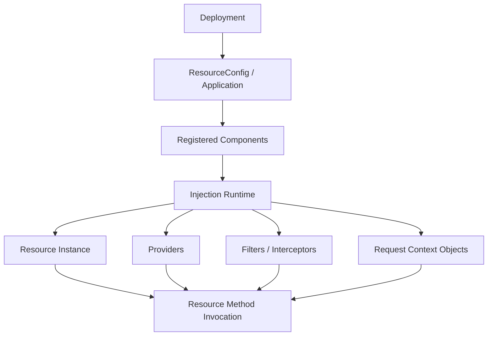
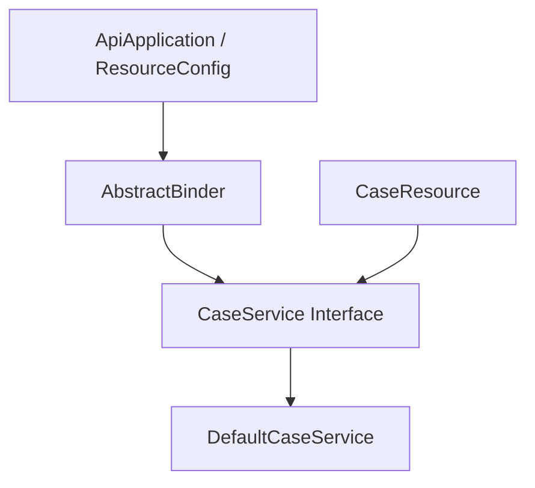
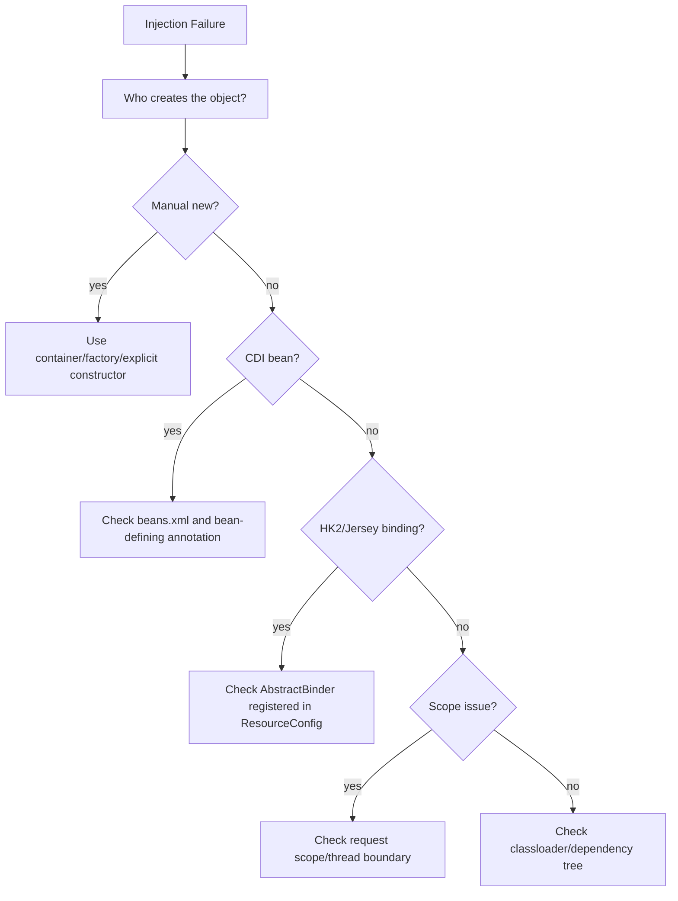
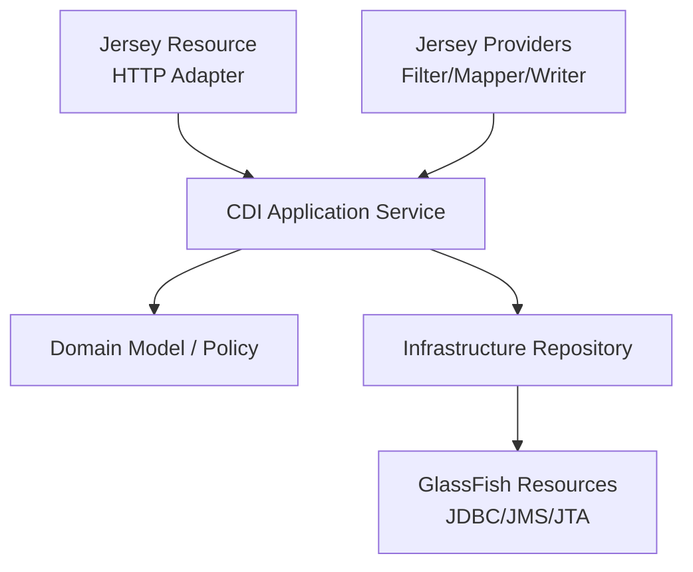

# Part 006 — Jersey Injection Model: HK2, CDI, Context, Binder

## Tujuan Part Ini

Part ini membahas dependency injection dalam Jersey ketika berjalan di GlassFish. Fokusnya bukan “apa itu dependency injection”, tetapi bagaimana injection mempengaruhi resource, provider, filter, interceptor, exception mapper, sub-resource, dan lifecycle aplikasi.

Topik ini penting karena banyak bug production terlihat seperti masalah HTTP, padahal akar masalahnya adalah dependency graph:

- resource gagal dibuat,
- provider tidak mendapat dependency,
- `@Context` bernilai `null`,
- CDI bean tidak terdeteksi,
- HK2 binding tidak terdaftar,
- request-scoped object dipakai di singleton,
- dependency proxy dipakai di thread lain,
- custom binder tidak aktif,
- GlassFish dan Jersey punya container injection boundary yang disalahpahami.

Target setelah part ini:

1. Bisa membedakan injection Jakarta REST, Jersey HK2, dan CDI.
2. Bisa memilih kapan memakai CDI, HK2 binder, `@Context`, atau manual factory.
3. Bisa memahami scope: per-request, singleton, per-lookup, application-scoped.
4. Bisa mendesain injection graph yang deterministic dan mudah diuji.
5. Bisa mendiagnosis startup/runtime failure akibat dependency injection.

---

## 1. Mental Model: Injection adalah Runtime Object Graph

Resource model menjawab “method mana yang dipanggil”. Injection model menjawab “object apa yang harus ada agar method itu bisa dipanggil”.



Jersey injection di GlassFish melibatkan beberapa lapisan:

| Lapisan | Peran |
|---|---|
| Jakarta REST injection | `@Context`, parameter injection, resource lifecycle contract |
| Jersey internal injection | runtime injection untuk Jersey-managed components |
| HK2 | service locator/injection engine yang historically digunakan Jersey/GlassFish |
| CDI | Jakarta EE dependency injection standard untuk application beans |
| GlassFish container | menyediakan CDI, Servlet context, security, resources, lifecycle |

Kesalahan umum adalah menganggap semua injection annotation punya container yang sama. Dalam kenyataan, sebuah class bisa dikelola oleh Jersey, CDI, atau dibuat manual oleh application code. Siapa yang membuat object menentukan injection apa yang bekerja.

---

## 2. Tiga Pertanyaan Sebelum Debug Injection

Saat dependency tidak masuk, jangan mulai dari annotation. Mulai dari tiga pertanyaan ini:

### 2.1 Siapa yang Membuat Object?

```java
new CaseResource()
```

Jika object dibuat manual, container tidak otomatis melakukan injection kecuali ada bridging atau factory khusus.

```java
register(CaseResource.class)
```

Jika class diregister, Jersey punya kesempatan mengelola lifecycle/injection.

```java
@Inject
CaseService service;
```

Ini bergantung apakah class tersebut dikelola CDI/Jersey injection bridge.

### 2.2 Scope Apa yang Berlaku?

- request-scoped,
- per-lookup/per-invocation,
- singleton,
- application-scoped,
- CDI normal scope,
- proxy scope.

Scope menentukan apakah dependency aman untuk menyimpan state.

### 2.3 Container Mana yang Bertanggung Jawab?

- Jersey runtime?
- HK2 service locator?
- CDI container?
- Servlet container?
- manual factory?

Tanpa jawaban ini, debugging injection sering menjadi trial-and-error.

---

## 3. `@Context`: Jakarta REST Context Injection

`@Context` menyediakan object runtime HTTP/Jakarta REST.

Contoh umum:

```java
import jakarta.ws.rs.GET;
import jakarta.ws.rs.Path;
import jakarta.ws.rs.core.Context;
import jakarta.ws.rs.core.HttpHeaders;
import jakarta.ws.rs.core.Request;
import jakarta.ws.rs.core.SecurityContext;
import jakarta.ws.rs.core.UriInfo;

@Path("cases")
public class CaseResource {

    @Context
    UriInfo uriInfo;

    @Context
    HttpHeaders headers;

    @Context
    SecurityContext securityContext;

    @GET
    public Response list() {
        String path = uriInfo.getPath();
        String actor = securityContext.getUserPrincipal().getName();
        return Response.ok(Map.of("path", path, "actor", actor)).build();
    }
}
```

Lebih baik gunakan constructor injection untuk application dependency, dan method/parameter injection untuk HTTP-specific context jika memungkinkan.

```java
@Path("cases")
public class CaseResource {
    private final CaseQueryService caseQueryService;

    public CaseResource(CaseQueryService caseQueryService) {
        this.caseQueryService = caseQueryService;
    }

    @GET
    public List<CaseSummaryResponse> list(@Context SecurityContext securityContext) {
        Actor actor = Actor.from(securityContext);
        return caseQueryService.listVisibleTo(actor);
    }
}
```

### 3.1 `@Context` untuk Apa?

Cocok untuk:

- `UriInfo`,
- `HttpHeaders`,
- `Request`,
- `SecurityContext`,
- `Application`,
- `Configuration`,
- servlet request/response jika integrasi Servlet tersedia,
- resource metadata pada provider tertentu.

Tidak cocok untuk:

- domain service,
- repository,
- application service,
- validator bisnis,
- policy engine,
- object yang seharusnya CDI bean.

Rule:

> `@Context` adalah runtime context injection, bukan general-purpose dependency injection.

---

## 4. Field Injection vs Constructor Injection vs Method Parameter

### 4.1 Field Injection

```java
@Path("cases")
public class CaseResource {
    @Inject
    CaseService caseService;
}
```

Kelemahan:

- dependency tersembunyi,
- object tidak bisa dibuat dengan mudah di unit test,
- field bisa terlihat `null` jika class dibuat manual,
- lifecycle tidak eksplisit.

### 4.2 Constructor Injection

```java
@Path("cases")
public class CaseResource {
    private final CaseService caseService;

    @Inject
    public CaseResource(CaseService caseService) {
        this.caseService = caseService;
    }
}
```

Kelebihan:

- dependency eksplisit,
- field final,
- mudah dites,
- gagal cepat jika dependency tidak tersedia,
- graph lebih mudah dibaca.

### 4.3 Method Parameter Injection untuk Request Data

```java
@GET
@Path("{caseId}")
public CaseDetailResponse get(
        @PathParam("caseId") String caseId,
        @Context SecurityContext securityContext) {
    return service.get(caseId, Actor.from(securityContext));
}
```

Pattern yang sehat:

- constructor injection untuk stable service dependency,
- method parameter untuk request-specific data,
- `@Context` untuk runtime HTTP context,
- no mutable field untuk request data.

---

## 5. HK2 dalam Jersey

HK2 adalah injection/service locator engine yang historically sangat terkait dengan GlassFish dan Jersey. Dalam Jersey, banyak komponen internal dan extension point bekerja lewat service/binder model.

Jersey menyediakan binder API untuk mendaftarkan dependency ke injection runtime.

Contoh sederhana:

```java
import org.glassfish.jersey.internal.inject.AbstractBinder;
import org.glassfish.jersey.server.ResourceConfig;

public class ApiApplication extends ResourceConfig {
    public ApiApplication() {
        register(CaseResource.class);

        register(new AbstractBinder() {
            @Override
            protected void configure() {
                bind(DefaultCaseService.class)
                        .to(CaseService.class);
            }
        });
    }
}
```

Resource:

```java
@Path("cases")
public class CaseResource {
    private final CaseService caseService;

    @Inject
    public CaseResource(CaseService caseService) {
        this.caseService = caseService;
    }
}
```

### 5.1 Binder sebagai Composition Root

Binder adalah bagian dari composition root aplikasi Jersey.



Jangan sebar binding secara acak di banyak tempat tanpa modular boundary. Untuk aplikasi besar, gunakan feature/module.

```java
public class CaseModule implements Feature {
    @Override
    public boolean configure(FeatureContext context) {
        context.register(CaseResource.class);
        context.register(new CaseBinder());
        return true;
    }
}

public class CaseBinder extends AbstractBinder {
    @Override
    protected void configure() {
        bind(DefaultCaseService.class).to(CaseService.class);
        bind(DefaultCasePolicy.class).to(CasePolicy.class);
    }
}
```

Application:

```java
public class ApiApplication extends ResourceConfig {
    public ApiApplication() {
        register(CaseModule.class);
    }
}
```

---

## 6. CDI dalam GlassFish

GlassFish sebagai Jakarta EE runtime menyediakan CDI container. Untuk application service, repository, policy, dan domain orchestration, CDI biasanya lebih natural daripada HK2 binder manual.

```java
import jakarta.enterprise.context.ApplicationScoped;

@ApplicationScoped
public class DefaultCaseService implements CaseService {
    @Override
    public List<CaseSummaryResponse> listVisibleTo(Actor actor) {
        return List.of();
    }
}
```

Resource:

```java
@Path("cases")
public class CaseResource {
    private final CaseService caseService;

    @Inject
    public CaseResource(CaseService caseService) {
        this.caseService = caseService;
    }
}
```

Dalam Jakarta EE runtime, integrasi antara Jakarta REST dan CDI memungkinkan resource/provider memakai CDI bean, tetapi detail packaging dan discovery tetap penting.

### 6.1 CDI Discovery

CDI bean discovery dipengaruhi oleh:

- adanya `beans.xml`,
- bean-defining annotations seperti `@ApplicationScoped`, `@RequestScoped`,
- archive/module tempat class berada,
- WAR/EAR classloader,
- apakah class ada di server lib atau application lib,
- apakah dependency memakai namespace `jakarta.*` yang cocok.

Minimal modern pattern:

```xml
<!-- WEB-INF/beans.xml -->
<beans xmlns="https://jakarta.ee/xml/ns/jakartaee"
       xmlns:xsi="http://www.w3.org/2001/XMLSchema-instance"
       xsi:schemaLocation="https://jakarta.ee/xml/ns/jakartaee
                           https://jakarta.ee/xml/ns/jakartaee/beans_4_0.xsd"
       bean-discovery-mode="annotated">
</beans>
```

Gunakan bean-defining annotation:

```java
@ApplicationScoped
public class DefaultCaseService implements CaseService {
}
```

---

## 7. HK2 vs CDI: Decision Matrix

| Kebutuhan | Lebih Cocok |
|---|---|
| Application service | CDI |
| Domain policy/validator | CDI |
| Repository/JTA resource user | CDI |
| Jersey extension binding | Jersey/HK2 Binder |
| Custom injectable untuk Jersey-managed component | Jersey Binder |
| Provider/filter yang butuh app dependency | CDI atau Jersey bridge, tergantung setup |
| Request HTTP context | `@Context` |
| Cross-cutting runtime provider | Jersey provider + CDI dependency jika container mendukung |
| Standalone Jersey tanpa Jakarta EE | Jersey/HK2 Binder |
| GlassFish full Jakarta EE app | CDI-first, Binder untuk Jersey-specific extension |

Practical rule:

> Di GlassFish, gunakan CDI untuk business/application graph. Gunakan Jersey Binder untuk komponen yang benar-benar Jersey-specific.

---

## 8. Scope dan Lifecycle

Injection bug sering berasal dari scope mismatch.

### 8.1 Application Scope

```java
@ApplicationScoped
public class DefaultCaseService implements CaseService {
}
```

Cocok untuk stateless service.

Jangan simpan request state di sini.

### 8.2 Request Scope

```java
@RequestScoped
public class RequestAuditContext {
    private String correlationId;
}
```

Cocok untuk data per request.

Hati-hati jika dipakai oleh async thread atau background task; request context mungkin tidak aktif.

### 8.3 Singleton

Singleton cocok untuk stateless provider/helper yang immutable.

```java
@Singleton
public class CaseIdParser {
    public CaseId parse(String value) {
        return new CaseId(value);
    }
}
```

Tidak cocok:

```java
@Singleton
public class CurrentUserHolder {
    private String currentUser;
}
```

### 8.4 Per Lookup

Per-lookup berarti instance baru dibuat saat diminta. Ini sering default di binding tertentu.

Cocok untuk object ringan yang tidak perlu reuse.

---

## 9. Proxy dan Request Scope

Request-scoped dependency sering diinjeksi sebagai proxy ke object dengan lifecycle lebih panjang.

Contoh:

```java
@ApplicationScoped
public class CaseService {
    @Inject
    RequestAuditContext auditContext;
}
```

Jika CDI memakai proxy, field `auditContext` bukan object request konkret, melainkan proxy yang resolve ke current request context saat dipakai.

Masalah muncul jika proxy dipakai di luar request:

```java
@ApplicationScoped
public class CaseService {
    @Inject
    RequestAuditContext auditContext;

    public void submitAsync() {
        CompletableFuture.runAsync(() -> {
            auditContext.getCorrelationId(); // request context may not exist
        });
    }
}
```

Perbaikan:

```java
public void submitAsync(RequestAuditSnapshot snapshot) {
    CompletableFuture.runAsync(() -> {
        use(snapshot.correlationId());
    });
}
```

Rule:

> Jangan membawa request-scoped proxy melewati thread boundary. Ambil snapshot value yang diperlukan.

---

## 10. Binding Interface ke Implementation

### 10.1 HK2/Jersey Binder

```java
public class CaseBinder extends AbstractBinder {
    @Override
    protected void configure() {
        bind(DefaultCaseService.class)
                .to(CaseService.class);
    }
}
```

Register:

```java
public class ApiApplication extends ResourceConfig {
    public ApiApplication() {
        register(new CaseBinder());
        register(CaseResource.class);
    }
}
```

### 10.2 CDI Alternative

```java
@ApplicationScoped
public class DefaultCaseService implements CaseService {
}
```

Jika ada banyak implementation:

```java
@Qualifier
@Retention(RetentionPolicy.RUNTIME)
@Target({ElementType.FIELD, ElementType.PARAMETER, ElementType.METHOD, ElementType.TYPE})
public @interface EnforcementCaseService {
}
```

```java
@ApplicationScoped
@EnforcementCaseService
public class EnforcementCaseServiceImpl implements CaseService {
}
```

Injection:

```java
@Inject
public CaseResource(@EnforcementCaseService CaseService caseService) {
    this.caseService = caseService;
}
```

Gunakan qualifier untuk ambiguity. Jangan mengandalkan class name convention.

---

## 11. Provider Injection

Provider seperti filter, interceptor, mapper, reader/writer juga bisa membutuhkan dependency.

```java
@Provider
@Priority(Priorities.AUTHENTICATION)
public class AuthenticationFilter implements ContainerRequestFilter {
    private final TokenVerifier tokenVerifier;

    @Inject
    public AuthenticationFilter(TokenVerifier tokenVerifier) {
        this.tokenVerifier = tokenVerifier;
    }

    @Override
    public void filter(ContainerRequestContext requestContext) {
        String authorization = requestContext.getHeaderString("Authorization");
        tokenVerifier.verify(authorization);
    }
}
```

Hal yang harus dicek:

- Apakah filter diregister oleh Jersey?
- Apakah filter dikelola CDI?
- Apakah `TokenVerifier` CDI bean atau HK2 binding?
- Apakah provider dibuat manual sebagai instance?
- Apakah provider singleton menyimpan request state?

Anti-pattern:

```java
@Provider
public class AuthenticationFilter implements ContainerRequestFilter {
    private String currentUser;

    @Override
    public void filter(ContainerRequestContext requestContext) {
        currentUser = extractUser(requestContext);
    }
}
```

Provider sering singleton-like. Jangan simpan request state di field provider.

Gunakan request context property:

```java
requestContext.setProperty("actor", actor);
```

atau request-scoped bean yang benar.

---

## 12. ExceptionMapper Injection

Exception mapper sering butuh dependency untuk logging, correlation, error catalog, atau localization.

```java
@Provider
public class DomainExceptionMapper implements ExceptionMapper<DomainException> {
    private final ErrorCatalog errorCatalog;

    @Inject
    public DomainExceptionMapper(ErrorCatalog errorCatalog) {
        this.errorCatalog = errorCatalog;
    }

    @Override
    public Response toResponse(DomainException exception) {
        ErrorDescriptor descriptor = errorCatalog.describe(exception.code());
        return Response.status(descriptor.status())
                .entity(new ErrorResponse(descriptor.code(), descriptor.message()))
                .build();
    }
}
```

Jangan membuat mapper tergantung pada service berat yang bisa melempar exception baru.

Buruk:

```java
public Response toResponse(DomainException exception) {
    auditService.writeToDatabase(exception); // may fail and hide original error
    notificationService.notifyOps(exception); // side effect in mapper
    return ...;
}
```

Mapper harus predictable. Side effect sebaiknya minimal dan failure-safe.

---

## 13. Custom Injectable dengan Binder

Kadang kita ingin inject object khusus yang tidak disediakan Jakarta REST/CDI secara langsung, misalnya `Actor` hasil parsing token.

### 13.1 Supplier/Factory Pattern

```java
public class ActorSupplier implements Supplier<Actor> {
    private final SecurityContext securityContext;

    @Inject
    public ActorSupplier(@Context SecurityContext securityContext) {
        this.securityContext = securityContext;
    }

    @Override
    public Actor get() {
        return Actor.from(securityContext);
    }
}
```

Binder:

```java
public class SecurityBinder extends AbstractBinder {
    @Override
    protected void configure() {
        bindFactory(ActorSupplier.class)
                .to(Actor.class)
                .proxy(true)
                .proxyForSameScope(false)
                .in(RequestScoped.class);
    }
}
```

Application:

```java
public class ApiApplication extends ResourceConfig {
    public ApiApplication() {
        register(new SecurityBinder());
    }
}
```

Resource:

```java
@Path("cases")
public class CaseResource {
    @GET
    public List<CaseSummaryResponse> list(@InjectParam Actor actor) {
        return List.of();
    }
}
```

Catatan: API annotation untuk injection parameter dapat berbeda tergantung versi Jersey dan pendekatan. Di GlassFish modern, pertimbangkan CDI producer sebagai alternatif yang lebih idiomatik untuk application-level object.

### 13.2 CDI Producer Alternative

```java
@RequestScoped
public class ActorProducer {
    @Context
    SecurityContext securityContext;

    @Produces
    @RequestScoped
    public Actor actor() {
        return Actor.from(securityContext);
    }
}
```

Resource:

```java
@Path("cases")
public class CaseResource {
    private final Actor actor;

    @Inject
    public CaseResource(Actor actor) {
        this.actor = actor;
    }
}
```

Gunakan pendekatan ini jika `Actor` adalah application concern, bukan Jersey extension concern.

---

## 14. Manual `new` adalah Boundary Berbahaya

Sub-resource locator atau factory sering membuat object manual.

```java
@Path("cases")
public class CaseResource {

    @Path("{caseId}/documents")
    public CaseDocumentResource documents(@PathParam("caseId") String caseId) {
        return new CaseDocumentResource(caseId);
    }
}
```

Jika `CaseDocumentResource` membutuhkan injection:

```java
public class CaseDocumentResource {
    @Inject
    DocumentService documentService; // likely null if manually constructed incorrectly
}
```

Perbaikan:

```java
public class CaseDocumentResource {
    private final String caseId;
    private final DocumentService documentService;

    public CaseDocumentResource(String caseId, DocumentService documentService) {
        this.caseId = caseId;
        this.documentService = documentService;
    }
}
```

Factory:

```java
@ApplicationScoped
public class CaseDocumentResourceFactory {
    private final DocumentService documentService;

    @Inject
    public CaseDocumentResourceFactory(DocumentService documentService) {
        this.documentService = documentService;
    }

    public CaseDocumentResource create(String caseId) {
        return new CaseDocumentResource(caseId, documentService);
    }
}
```

Locator:

```java
@Path("cases")
public class CaseResource {
    private final CaseDocumentResourceFactory factory;

    @Inject
    public CaseResource(CaseDocumentResourceFactory factory) {
        this.factory = factory;
    }

    @Path("{caseId}/documents")
    public CaseDocumentResource documents(@PathParam("caseId") String caseId) {
        return factory.create(caseId);
    }
}
```

Manual construction boleh jika object memang plain object dan semua dependency diberikan eksplisit.

---

## 15. Injection ke Servlet/Jakarta REST Context

Dalam GlassFish, Jersey berjalan di environment web/container. Kadang resource/provider perlu akses Servlet-level object.

```java
@Context
HttpServletRequest servletRequest;

@Context
ServletContext servletContext;
```

Gunakan ini untuk integration concern seperti:

- client certificate dari servlet request,
- remote address dari proxy-aware config,
- servlet context init parameter,
- session legacy integration.

Jangan gunakan Servlet API untuk menggantikan Jakarta REST abstraction jika tidak perlu.

Lebih portable:

```java
@Context HttpHeaders headers;
@Context UriInfo uriInfo;
@Context SecurityContext securityContext;
```

Kurang portable:

```java
@Context HttpServletRequest request;
```

Gunakan Servlet object hanya jika benar-benar butuh container-specific detail.

---

## 16. Circular Dependency

Circular dependency sering muncul saat resource, service, policy, dan mapper saling tergantung.

Buruk:

```text
CaseResource -> CaseService -> ErrorTranslator -> CaseResourceMetadata -> CaseResource
```

Atau:

```text
AuthenticationFilter -> UserService -> AuditService -> RequestActor -> AuthenticationFilter
```

Perbaikan:

- pisahkan model metadata dari resource class,
- jangan inject resource ke service,
- jangan inject filter ke service,
- extract interface yang lebih kecil,
- gunakan domain event/log sink daripada direct dependency,
- pindahkan request context ke simple value object.

Resource dan provider adalah adapter layer. Application service tidak boleh tahu resource/provider.

---

## 17. Qualifier dan Ambiguous Dependency

Jika dua bean mengimplementasikan interface yang sama:

```java
@ApplicationScoped
public class DefaultNotificationService implements NotificationService {}

@ApplicationScoped
public class SilentNotificationService implements NotificationService {}
```

Injection ini ambigu:

```java
@Inject
NotificationService notificationService;
```

Gunakan qualifier:

```java
@Qualifier
@Retention(RetentionPolicy.RUNTIME)
@Target({ElementType.TYPE, ElementType.FIELD, ElementType.PARAMETER, ElementType.METHOD})
public @interface DefaultChannel {
}
```

```java
@ApplicationScoped
@DefaultChannel
public class DefaultNotificationService implements NotificationService {}
```

```java
@Inject
public CaseService(@DefaultChannel NotificationService notificationService) {
    this.notificationService = notificationService;
}
```

Untuk Jersey Binder, pastikan binding tidak mendefinisikan dua implementation untuk contract yang sama tanpa qualifier/name.

---

## 18. Configuration Injection

Jangan membaca environment/config tersebar di resource.

Buruk:

```java
@Path("cases")
public class CaseResource {
    private final boolean auditEnabled = Boolean.getBoolean("audit.enabled");
}
```

Lebih baik:

```java
@ApplicationScoped
public class CaseApiConfig {
    public boolean auditEnabled() {
        return Boolean.parseBoolean(System.getProperty("audit.enabled", "true"));
    }
}
```

Injection:

```java
@ApplicationScoped
public class AuditPolicy {
    private final CaseApiConfig config;

    @Inject
    public AuditPolicy(CaseApiConfig config) {
        this.config = config;
    }
}
```

Untuk production, integrasikan dengan config system yang konsisten. GlassFish juga punya resources/JNDI/env-entry, tetapi aplikasi modern sering menggunakan config abstraction agar bisa dites dan dipromosikan antar environment.

---

## 19. JNDI Resource Injection

Dalam GlassFish, JDBC/JMS/resource container sering tersedia melalui JNDI atau injection Jakarta EE.

Contoh resource container:

```java
@Resource(lookup = "jdbc/CaseDataSource")
DataSource dataSource;
```

Sebaiknya resource container seperti `DataSource` tidak langsung dipakai di Jersey resource. Letakkan di repository/infrastructure bean.

```java
@ApplicationScoped
public class JdbcCaseRepository implements CaseRepository {
    @Resource(lookup = "jdbc/CaseDataSource")
    DataSource dataSource;
}
```

Resource:

```java
@Path("cases")
public class CaseResource {
    private final CaseService caseService;

    @Inject
    public CaseResource(CaseService caseService) {
        this.caseService = caseService;
    }
}
```

Rule:

> HTTP resource tidak perlu tahu detail JNDI, JDBC pool, atau transaction resource. Itu infrastructure boundary.

---

## 20. Failure Model: Injection Error

### 20.1 Unsatisfied Dependency

Gejala:

```text
Unsatisfied dependency for type CaseService
```

Cek:

- apakah implementation ada,
- apakah punya bean-defining annotation,
- apakah `beans.xml` benar,
- apakah package masuk artifact,
- apakah namespace `jakarta.*` cocok,
- apakah class ada di module yang visible.

### 20.2 Ambiguous Dependency

Gejala:

```text
Ambiguous dependencies for type CaseService
```

Cek:

- ada lebih dari satu implementation,
- qualifier hilang,
- alternative/profile tidak dikendalikan,
- test bean masuk artifact production.

### 20.3 Null Dependency

Gejala:

```text
NullPointerException on injected field
```

Cek:

- object dibuat manual dengan `new`,
- class tidak dikelola container,
- field injection tidak berjalan,
- provider registered sebagai instance,
- test membuat object tanpa container.

### 20.4 Scope Not Active

Gejala:

```text
ContextNotActiveException
```

Cek:

- request-scoped bean dipakai di background thread,
- async boundary kehilangan context,
- resource cleanup terjadi setelah response,
- proxy dipakai setelah request selesai.

### 20.5 Classloader Mismatch

Gejala:

```text
ClassCastException: X cannot be cast to X
NoSuchMethodError
Unsatisfied dependency although class exists
```

Cek:

- duplicate Jakarta API jar,
- duplicate CDI/Jersey/HK2 jar,
- server lib vs WAR lib conflict,
- EAR shared lib conflict,
- wrong Jersey major version.

---

## 21. Debugging Flow



Use this sequence before changing annotations randomly.

---

## 22. Testing Injection Graph

### 22.1 Constructor-friendly Unit Test

```java
class CaseResourceTest {
    @Test
    void listShouldDelegateToService() {
        CaseService service = actor -> List.of(new CaseSummaryResponse("C-1"));
        CaseResource resource = new CaseResource(service);

        List<CaseSummaryResponse> result = resource.list(SecurityFixtures.officer());

        assertThat(result).hasSize(1);
    }
}
```

Constructor injection makes this easy.

### 22.2 Container Smoke Test

```java
class ApiApplicationSmokeTest {
    @Test
    void applicationShouldRegisterBinders() {
        ApiApplication app = new ApiApplication();

        assertThat(app.getInstances())
                .anyMatch(CaseBinder.class::isInstance);
    }
}
```

### 22.3 Integration Test for Provider Injection

Test not only resource injection, but provider injection:

```text
GET /cases without token -> 401 from AuthenticationFilter
GET /cases with invalid token -> 401 from TokenVerifier
GET /cases with valid token -> 200
```

If filter dependency is missing, this fails early.

---

## 23. Composition Root Pattern

For large applications, keep object graph assembly explicit.

```java
public class ApiApplication extends ResourceConfig {
    public ApiApplication() {
        register(new PlatformModule());
        register(new SecurityModule());
        register(new CaseModule());
        register(new DocumentModule());
        register(new ObservabilityModule());
    }
}
```

Each module owns its resource/provider/binder.

```java
public class CaseModule implements Feature {
    @Override
    public boolean configure(FeatureContext context) {
        context.register(CaseResource.class);
        context.register(CaseAssignmentResource.class);
        context.register(CaseExceptionMapper.class);
        context.register(new CaseBinder());
        return true;
    }
}
```

This creates a readable boundary:

```text
ApiApplication
  PlatformModule
  SecurityModule
  CaseModule
    CaseResource
    CaseAssignmentResource
    CaseExceptionMapper
    CaseBinder
  DocumentModule
  ObservabilityModule
```

Avoid hidden component registration from wide package scanning in production-critical systems.

---

## 24. CDI-first Architecture for GlassFish

A pragmatic architecture:



Pattern:

- resource is thin,
- application service is CDI bean,
- repository/infrastructure is CDI bean,
- provider may inject CDI services,
- Jersey binder reserved for Jersey-specific extension,
- request context converted to explicit value object early.

Example:

```java
@Path("cases")
public class CaseResource {
    private final OpenCaseUseCase openCase;

    @Inject
    public CaseResource(OpenCaseUseCase openCase) {
        this.openCase = openCase;
    }

    @POST
    public Response open(CreateCaseRequest request, @Context SecurityContext security) {
        OpenCaseCommand command = request.toCommand(Actor.from(security));
        CaseId id = openCase.execute(command);
        return Response.created(URI.create("/cases/" + id.value())).build();
    }
}
```

Application service:

```java
@ApplicationScoped
public class OpenCaseUseCase {
    private final CaseRepository repository;
    private final CasePolicy policy;

    @Inject
    public OpenCaseUseCase(CaseRepository repository, CasePolicy policy) {
        this.repository = repository;
        this.policy = policy;
    }

    public CaseId execute(OpenCaseCommand command) {
        policy.assertCanOpen(command.actor());
        CaseRecord record = CaseRecord.open(command);
        repository.save(record);
        return record.id();
    }
}
```

---

## 25. Anti-pattern Catalog

### 25.1 Treating `@Context` as Service Locator

```java
@Context
ServletContext servletContext;

CaseService service = (CaseService) servletContext.getAttribute("caseService");
```

Perbaikan: inject service lewat CDI/Jersey binding.

### 25.2 Field Injection Everywhere

Gejala:

- class sulit dites,
- dependency tidak terlihat,
- object manual NPE,
- circular dependency tidak jelas.

Perbaikan: constructor injection.

### 25.3 Mixing HK2 and CDI Without Boundary

Gejala:

- sebagian service CDI,
- sebagian HK2,
- binding duplikat,
- class yang sama dikelola dua container,
- lifecycle tidak jelas.

Perbaikan: CDI-first untuk app graph, Binder untuk Jersey extension.

### 25.4 Request State in Singleton Provider

```java
@Provider
public class AuditFilter implements ContainerRequestFilter {
    private String correlationId;
}
```

Perbaikan: local variable, request property, or request-scoped bean.

### 25.5 Manual Construction of Injectable Class

```java
return new CaseDocumentResource();
```

Perbaikan: factory dengan explicit dependency atau container-managed lookup yang deliberate.

### 25.6 Injecting Resource into Service

Application service tidak boleh tergantung HTTP resource.

Perbaikan: service menerima command/query/value object.

### 25.7 Async Context Leakage

Request-scoped bean dipakai setelah request selesai.

Perbaikan: snapshot value before async boundary.

---

## 26. Production Checklist

### Ownership

- Apakah jelas class dikelola CDI, Jersey, atau manual factory?
- Apakah setiap manual `new` disengaja?
- Apakah provider/resource tidak diregister sebagai instance jika butuh injection?

### Scope

- Apakah singleton/application-scoped bean stateless?
- Apakah request-scoped bean tidak dipakai di background thread?
- Apakah resource tidak menyimpan request state di field?

### Binding

- Apakah semua Jersey binder terdaftar eksplisit?
- Apakah CDI bean punya bean-defining annotation?
- Apakah qualifier dipakai untuk multiple implementation?

### Packaging

- Apakah `beans.xml` sesuai discovery mode?
- Apakah tidak ada duplicate Jakarta/CDI/HK2/Jersey jar?
- Apakah dependency scope benar untuk GlassFish?

### Testing

- Apakah resource bisa dites dengan constructor injection?
- Apakah provider injection dites lewat integration test?
- Apakah startup smoke test mendeteksi missing binder/bean?
- Apakah async use case menguji context propagation/snapshot?

---

## 27. Latihan 20 Jam: Injection Mastery

### Latihan 1 — Object Ownership Map

Ambil satu aplikasi Jersey. Buat tabel:

| Class | Dibuat oleh | Scope | Dependency | Risk |
|---|---|---|---|---|
| `CaseResource` | Jersey/CDI | request/per-lookup | `OpenCaseUseCase` | medium |
| `AuthenticationFilter` | Jersey | singleton-like | `TokenVerifier` | high if stateful |
| `OpenCaseUseCase` | CDI | application | repository/policy | low |
| `RequestAuditContext` | CDI | request | headers | high across async |

### Latihan 2 — Remove Field Injection

Pilih 5 resource/provider. Ubah ke constructor injection jika memungkinkan.

### Latihan 3 — Binder Audit

Cari semua `AbstractBinder`. Pastikan:

- binder terdaftar,
- contract jelas,
- tidak duplikat,
- scope explicit untuk object penting,
- tidak ada binding ke implementation test.

### Latihan 4 — CDI Discovery Test

Matikan package scanning yang tidak perlu. Pastikan aplikasi tetap start dengan explicit registration dan CDI bean discovery yang benar.

### Latihan 5 — Async Context Drill

Buat contoh request-scoped `CorrelationContext`. Kirim value ke async worker sebagai snapshot, bukan proxy.

---

## 28. Ringkasan

Injection model adalah dependency graph runtime di balik resource model. Untuk Jersey di GlassFish, ada beberapa lapisan yang harus dibedakan: Jakarta REST `@Context`, Jersey/HK2 binder, CDI, Servlet/GlassFish container, dan manual construction.

Prinsip utama:

1. Selalu tanya: siapa yang membuat object?
2. Gunakan constructor injection untuk dependency stabil.
3. Gunakan `@Context` untuk runtime HTTP context, bukan application service.
4. Di GlassFish, gunakan CDI-first untuk application graph.
5. Gunakan Jersey Binder untuk Jersey-specific extension.
6. Jangan simpan request state di resource/provider field.
7. Jangan membawa request-scoped proxy melewati thread boundary.
8. Buat composition root eksplisit dan bisa diaudit.

Part berikutnya akan membahas **Providers Deep Dive: MessageBodyReader, MessageBodyWriter, ContextResolver**. Itu adalah kelanjutan natural karena setelah resource dan dependency siap, Jersey harus membaca request body dan menulis response body secara benar.

---

## Referensi Resmi

- Jersey Custom Injection and Lifecycle Management: https://eclipse-ee4j.github.io/jersey.github.io/documentation/latest/ioc.html
- Jersey Documentation: https://eclipse-ee4j.github.io/jersey.github.io/documentation/latest/
- Jakarta RESTful Web Services 4.0 Specification: https://jakarta.ee/specifications/restful-ws/4.0/jakarta-restful-ws-spec-4.0
- Jakarta CDI Specification: https://jakarta.ee/specifications/cdi/
- Eclipse GlassFish: https://glassfish.org/
