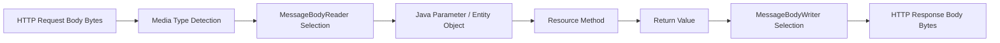
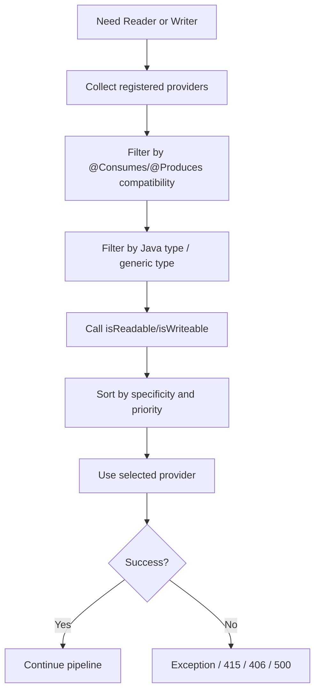
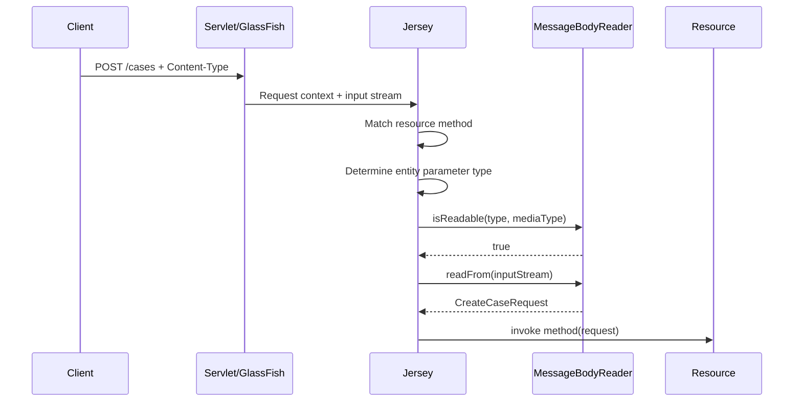
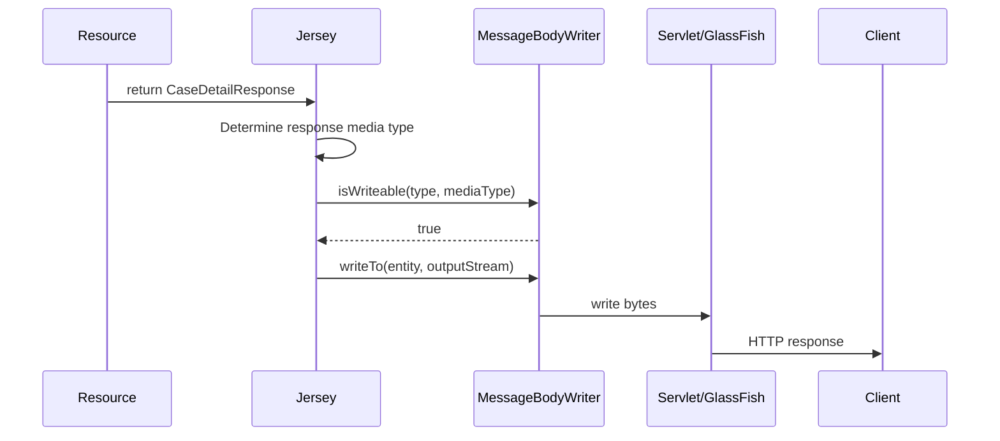
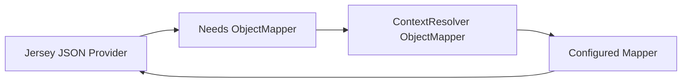
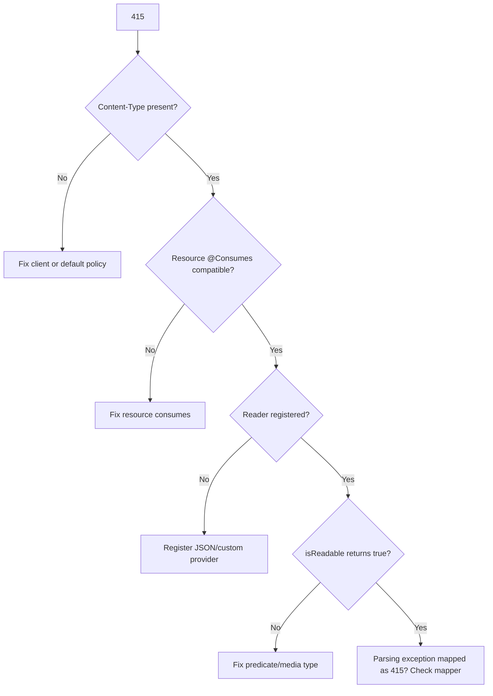
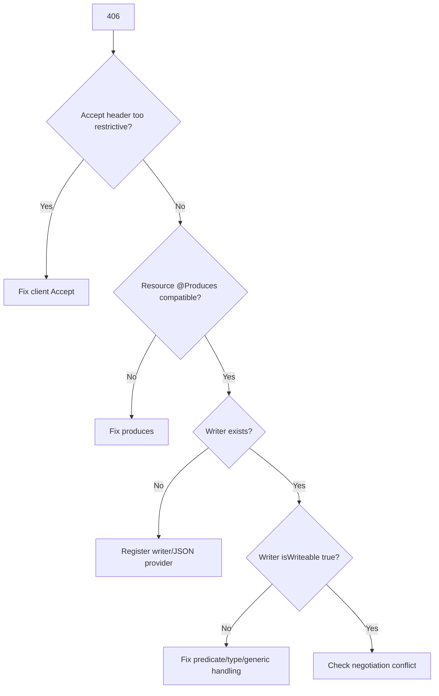

# Part 007 — Providers Deep Dive: `MessageBodyReader`, `MessageBodyWriter`, `ContextResolver`

Di seri sebelumnya kita sudah membahas JAX-RS/Jakarta REST secara umum. Bagian ini tidak mengulang basic `@GET`, `@POST`, `@Produces`, atau `@Consumes`. Fokus kita adalah mekanisme yang menentukan **bagaimana object Java berubah menjadi HTTP entity** dan sebaliknya di dalam Jersey runtime.

Provider adalah salah satu extension point paling kuat di Jersey. Ia juga salah satu sumber bug paling mahal karena sering gagal bukan pada saat compile, tetapi pada saat runtime: `415 Unsupported Media Type`, `406 Not Acceptable`, `500 No message body writer`, response berubah bentuk tanpa disengaja, atau payload besar diam-diam dibuffer ke memory.

## 1. Target Skill Menurut Kaufman

Mengikuti pendekatan Josh Kaufman, kita pecah skill ini menjadi sub-skill kecil yang bisa dilatih secara sengaja.

Setelah menyelesaikan part ini, kamu harus bisa:

1. Menjelaskan request entity pipeline dari HTTP body sampai object resource method.
2. Menjelaskan response entity pipeline dari return value sampai bytes di wire.
3. Membedakan provider bawaan, provider dari library, dan custom provider.
4. Mendesain provider yang deterministik, tidak global berlebihan, dan aman untuk production.
5. Mendiagnosis error provider: `415`, `406`, `500`, `No message body reader`, `No message body writer`.
6. Memilih JSON provider: JSON-B, Jackson, MOXy, atau custom ObjectMapper strategy.
7. Menulis `MessageBodyReader`, `MessageBodyWriter`, dan `ContextResolver` dengan scope dan registration yang benar.
8. Memahami dampak provider terhadap compatibility contract, performance, security, dan evolusi API.

Skill ini bukan tentang hafal interface. Skill utamanya adalah **membaca pipeline representasi**.

## 2. Mental Model: Representation Boundary

REST endpoint tidak langsung “mengirim object”. Endpoint hanya mengembalikan representasi.



Ada dua boundary besar:

| Boundary | Arah | Extension Point Utama |
|---|---:|---|
| Request entity boundary | bytes → Java object | `MessageBodyReader<T>` |
| Response entity boundary | Java object → bytes | `MessageBodyWriter<T>` |

Di sekitar dua boundary ini ada extension point pendukung:

| Extension Point | Fungsi |
|---|---|
| `ContextResolver<T>` | Menyediakan object konfigurasi untuk provider lain, misalnya `ObjectMapper`, JSON-B config, JAXB context. |
| `ParamConverterProvider` | Konversi path/query/header/cookie parameter, bukan body entity. |
| `ReaderInterceptor` | Membungkus proses pembacaan entity stream. |
| `WriterInterceptor` | Membungkus proses penulisan entity stream. |
| `ExceptionMapper` | Mengubah exception menjadi response, sering berinteraksi dengan writer provider. |

Provider adalah **runtime decision system**. Jersey memilih provider berdasarkan tipe Java, generic type, annotation, media type, priority, dan registration state.

## 3. Provider Bukan DTO Mapper

Kesalahan umum: memakai provider untuk business mapping.

Provider seharusnya menangani **representasi teknis**:

- JSON serialization/deserialization.
- XML serialization/deserialization.
- Binary stream.
- CSV atau custom media type.
- Normalisasi format tanggal global.
- Configuration object untuk serialization engine.

Provider tidak seharusnya menangani:

- Business validation.
- Authorization.
- Domain workflow.
- Database lookup.
- Audit decision.
- Cross-service orchestration.

Provider berjalan di boundary HTTP. Jika provider melakukan business logic, kamu membuat logic tersembunyi yang sulit dites, sulit dilacak, dan sulit dievolusi.

## 4. Jakarta REST Provider Interfaces

### 4.1 `MessageBodyReader<T>`

Reader dipakai saat resource method menerima entity body.

```java
@POST
@Consumes("application/vnd.case-create+json")
public Response createCase(CreateCaseRequest request) {
    // request sudah dibaca oleh MessageBodyReader sebelum method dipanggil
    return Response.accepted().build();
}
```

Bentuk provider:

```java
import jakarta.ws.rs.Consumes;
import jakarta.ws.rs.WebApplicationException;
import jakarta.ws.rs.core.MediaType;
import jakarta.ws.rs.core.MultivaluedMap;
import jakarta.ws.rs.ext.MessageBodyReader;
import jakarta.ws.rs.ext.Provider;
import java.io.IOException;
import java.io.InputStream;
import java.lang.annotation.Annotation;
import java.lang.reflect.Type;

@Provider
@Consumes("application/vnd.case-create+json")
public final class CaseCreateReader implements MessageBodyReader<CreateCaseRequest> {

    @Override
    public boolean isReadable(
            Class<?> type,
            Type genericType,
            Annotation[] annotations,
            MediaType mediaType) {
        return CreateCaseRequest.class.isAssignableFrom(type)
                && mediaType.isCompatible(MediaType.valueOf("application/vnd.case-create+json"));
    }

    @Override
    public CreateCaseRequest readFrom(
            Class<CreateCaseRequest> type,
            Type genericType,
            Annotation[] annotations,
            MediaType mediaType,
            MultivaluedMap<String, String> httpHeaders,
            InputStream entityStream)
            throws IOException, WebApplicationException {

        // Parse stream. In real code delegate to a configured JSON parser.
        // Do not read unbounded payloads into memory unless you enforce size limits elsewhere.
        return CaseJson.decodeCreateRequest(entityStream);
    }
}
```

`isReadable()` adalah gate. `readFrom()` adalah execution.

### 4.2 `MessageBodyWriter<T>`

Writer dipakai saat resource method mengembalikan object response.

```java
@GET
@Path("/{caseId}")
@Produces("application/vnd.case-detail+json")
public CaseDetailResponse getCase(@PathParam("caseId") String caseId) {
    return service.getCase(caseId);
}
```

Bentuk provider:

```java
import jakarta.ws.rs.Produces;
import jakarta.ws.rs.WebApplicationException;
import jakarta.ws.rs.core.MediaType;
import jakarta.ws.rs.core.MultivaluedMap;
import jakarta.ws.rs.ext.MessageBodyWriter;
import jakarta.ws.rs.ext.Provider;
import java.io.IOException;
import java.io.OutputStream;
import java.lang.annotation.Annotation;
import java.lang.reflect.Type;

@Provider
@Produces("application/vnd.case-detail+json")
public final class CaseDetailWriter implements MessageBodyWriter<CaseDetailResponse> {

    @Override
    public boolean isWriteable(
            Class<?> type,
            Type genericType,
            Annotation[] annotations,
            MediaType mediaType) {
        return CaseDetailResponse.class.isAssignableFrom(type)
                && mediaType.isCompatible(MediaType.valueOf("application/vnd.case-detail+json"));
    }

    @Override
    public void writeTo(
            CaseDetailResponse entity,
            Class<?> type,
            Type genericType,
            Annotation[] annotations,
            MediaType mediaType,
            MultivaluedMap<String, Object> httpHeaders,
            OutputStream entityStream)
            throws IOException, WebApplicationException {

        CaseJson.encodeCaseDetail(entity, entityStream);
    }
}
```

Writer adalah bagian dari response contract. Jika writer berubah, external API bisa berubah walaupun resource method tidak berubah.

## 5. Provider Selection Model

Jersey tidak memilih provider secara acak. Ia membuat keputusan berdasarkan beberapa dimensi.



Practical rule:

> Semakin global provider kamu, semakin besar peluang ia menangkap tipe yang tidak kamu maksud.

Contoh provider terlalu luas:

```java
@Provider
@Produces(MediaType.APPLICATION_JSON)
public final class DangerousGlobalWriter implements MessageBodyWriter<Object> {
    @Override
    public boolean isWriteable(Class<?> type, Type genericType, Annotation[] annotations, MediaType mediaType) {
        return true;
    }

    // ...
}
```

Provider seperti ini bisa mengalahkan provider JSON standar dan membuat seluruh API berubah perilaku.

Provider yang lebih aman:

```java
@Provider
@Produces("application/vnd.audit-event+json")
public final class AuditEventWriter implements MessageBodyWriter<AuditEventRepresentation> {
    @Override
    public boolean isWriteable(Class<?> type, Type genericType, Annotation[] annotations, MediaType mediaType) {
        return AuditEventRepresentation.class.equals(type)
                && mediaType.isCompatible(MediaType.valueOf("application/vnd.audit-event+json"));
    }

    // ...
}
```

## 6. Media Type Specificity

Provider selection selalu terikat media type.

| Annotation | Meaning |
|---|---|
| `@Consumes("application/json")` | Provider/resource bisa membaca request dengan `Content-Type: application/json`. |
| `@Produces("application/json")` | Provider/resource bisa menulis response untuk `Accept: application/json`. |
| `@Consumes("*/*")` | Sangat luas. Gunakan hanya kalau benar-benar extension infrastructure. |
| `@Produces("*/*")` | Berisiko tinggi untuk writer provider. |

Contoh kasus:

```java
@POST
@Consumes("application/json")
@Produces("application/json")
public Response submit(SubmitRequest request) {
    return Response.ok(new SubmitResponse("accepted")).build();
}
```

Jika request memiliki:

```http
Content-Type: text/plain
Accept: application/json
```

Maka masalahnya ada di **reader side**, bukan writer side. Respons yang tepat biasanya `415 Unsupported Media Type`.

Jika request memiliki:

```http
Content-Type: application/json
Accept: application/xml
```

Maka masalahnya ada di **writer side / negotiation side**. Respons yang tepat biasanya `406 Not Acceptable` jika resource tidak bisa menghasilkan XML.

## 7. Request Entity Pipeline



Critical invariants:

1. Entity stream umumnya hanya bisa dibaca sekali.
2. Reader tidak boleh mengasumsikan body selalu kecil.
3. Reader harus menghormati media type.
4. Reader error harus diterjemahkan menjadi error contract yang aman.
5. Reader tidak boleh membuat side effect bisnis.

## 8. Response Entity Pipeline



Critical invariants:

1. Writer menentukan external representation.
2. Writer harus deterministic untuk object yang sama dan media type yang sama.
3. Writer tidak boleh melakukan lazy DB access.
4. Writer tidak boleh menulis sebagian response lalu gagal tanpa strategi error yang jelas.
5. Writer harus mempertimbangkan buffering vs streaming.

## 9. `ContextResolver<T>`

`ContextResolver` menyediakan object konfigurasi untuk provider lain. Contoh paling umum adalah konfigurasi `ObjectMapper` untuk Jackson.

```java
import com.fasterxml.jackson.databind.ObjectMapper;
import com.fasterxml.jackson.databind.SerializationFeature;
import com.fasterxml.jackson.datatype.jsr310.JavaTimeModule;
import jakarta.ws.rs.Produces;
import jakarta.ws.rs.core.MediaType;
import jakarta.ws.rs.ext.ContextResolver;
import jakarta.ws.rs.ext.Provider;

@Provider
@Produces(MediaType.APPLICATION_JSON)
public final class ObjectMapperResolver implements ContextResolver<ObjectMapper> {

    private final ObjectMapper mapper;

    public ObjectMapperResolver() {
        this.mapper = new ObjectMapper()
                .registerModule(new JavaTimeModule())
                .disable(SerializationFeature.WRITE_DATES_AS_TIMESTAMPS);
    }

    @Override
    public ObjectMapper getContext(Class<?> type) {
        return mapper;
    }
}
```

Mental model:



`ContextResolver` tidak mengubah request/response secara langsung. Ia menyediakan dependency konfigurasi kepada provider yang tahu cara memakainya.

## 10. JSON Provider Decision Model

Dalam aplikasi Jersey/GlassFish, JSON bisa datang dari beberapa jalur:

| Strategy | Kapan Cocok | Risiko |
|---|---|---|
| JSON-B default | Aplikasi Jakarta EE standar, ingin portable. | Konfigurasi dan ecosystem module bisa lebih terbatas dibanding Jackson. |
| Jackson via Jersey module | Butuh fitur Jackson, module Java Time, polymorphism control, mature ecosystem. | Harus disiplin dependency dan ObjectMapper config. |
| MOXy | Legacy Jersey/Jakarta EE stack tertentu. | Bisa mengejutkan jika aktif tanpa disadari. |
| Custom reader/writer | Media type custom, format khusus, streaming, compliance format. | Maintenance tinggi; jangan dipakai untuk JSON biasa tanpa alasan kuat. |

Decision rule:

1. Untuk API internal biasa: gunakan JSON-B atau Jackson, jangan custom provider.
2. Untuk external API dengan strict representation contract: gunakan explicit DTO + configured JSON provider.
3. Untuk regulatory/audit export dengan format wajib: custom writer bisa masuk akal.
4. Untuk payload besar: pertimbangkan streaming writer, bukan object graph besar.

## 11. Registration: Explicit Beats Accidental

Provider bisa ditemukan lewat annotation scanning atau didaftarkan eksplisit.

### 11.1 Annotation scanning

```java
@Provider
@Produces(MediaType.APPLICATION_JSON)
public final class ObjectMapperResolver implements ContextResolver<ObjectMapper> {
    // ...
}
```

Jika package scanning aktif, Jersey dapat menemukan provider.

Kelebihan:

- Mudah.
- Cocok untuk aplikasi kecil.
- Minim konfigurasi.

Kekurangan:

- Startup behavior kurang eksplisit.
- Bisa berbeda antar packaging/classloader.
- Provider tidak sengaja bisa ikut terdaftar.

### 11.2 Explicit registration

```java
import org.glassfish.jersey.server.ResourceConfig;

public final class CaseApiApplication extends ResourceConfig {
    public CaseApiApplication() {
        register(ObjectMapperResolver.class);
        register(CaseCreateReader.class);
        register(CaseDetailWriter.class);
        packages("com.acme.caseapi.resources");
    }
}
```

Kelebihan:

- Deterministik.
- Lebih mudah diaudit.
- Lebih aman untuk aplikasi enterprise.

Kekurangan:

- Lebih verbose.
- Perlu discipline saat menambah module.

Rekomendasi untuk sistem kompleks:

> Register provider penting secara eksplisit. Gunakan scanning hanya untuk resource package yang terkontrol.

## 12. Provider Priority

Jakarta REST mendukung `@Priority` untuk beberapa extension point. Priority membantu mengurutkan provider/filter/interceptor saat beberapa candidate relevan.

```java
import jakarta.annotation.Priority;
import jakarta.ws.rs.Priorities;
import jakarta.ws.rs.ext.Provider;

@Provider
@Priority(Priorities.ENTITY_CODER)
public final class CaseDetailWriter implements MessageBodyWriter<CaseDetailResponse> {
    // ...
}
```

Namun priority bukan pengganti specificity.

Anti-pattern:

```java
@Provider
@Priority(1)
public final class GlobalObjectWriter implements MessageBodyWriter<Object> {
    // terlalu luas, lalu dipaksa menang dengan priority
}
```

Lebih baik:

1. Persempit media type.
2. Persempit Java type.
3. Baru gunakan priority jika memang ada beberapa provider valid.

## 13. Generic Type Handling

Provider menerima `Class<?> type` dan `Type genericType`.

Contoh resource:

```java
@GET
@Produces(MediaType.APPLICATION_JSON)
public List<CaseSummary> listCases() {
    return service.listCases();
}
```

`type` mungkin terlihat sebagai `List.class`, sedangkan generic information ada di `genericType`.

Jika custom writer perlu menangani generic type, jangan hanya membaca `type`.

```java
@Override
public boolean isWriteable(Class<?> type, Type genericType, Annotation[] annotations, MediaType mediaType) {
    if (!List.class.isAssignableFrom(type)) {
        return false;
    }

    return GenericTypes.isListOf(genericType, CaseSummary.class)
            && mediaType.isCompatible(MediaType.APPLICATION_JSON_TYPE);
}
```

Untuk production code, hindari membuat provider generic list kecuali benar-benar perlu. Biasanya lebih aman mengembalikan wrapper DTO:

```java
public record CaseSummaryPage(
        List<CaseSummary> items,
        String nextCursor,
        int limit
) {}
```

Wrapper DTO punya contract yang lebih jelas daripada raw collection response.

## 14. Annotation-Aware Provider

Provider dapat membaca annotation di resource method parameter/return value.

Contoh annotation:

```java
import java.lang.annotation.Retention;
import java.lang.annotation.RetentionPolicy;

@Retention(RetentionPolicy.RUNTIME)
public @interface RedactedView {
}
```

Resource:

```java
@GET
@Produces(MediaType.APPLICATION_JSON)
@RedactedView
public CaseDetailResponse getRedactedCase() {
    return service.getRedactedCase();
}
```

Writer:

```java
private boolean hasRedactedView(Annotation[] annotations) {
    for (Annotation annotation : annotations) {
        if (annotation.annotationType().equals(RedactedView.class)) {
            return true;
        }
    }
    return false;
}
```

Gunakan pattern ini hati-hati. Annotation-aware provider bisa berguna untuk representation policy, tetapi mudah berubah menjadi authorization tersembunyi. Jika redaction adalah bagian dari security decision, lebih baik domain/application service sudah mengembalikan DTO yang benar.

## 15. Binary and Streaming Provider

Tidak semua entity adalah JSON.

Contoh download file:

```java
@GET
@Path("/{id}/document")
@Produces("application/pdf")
public Response downloadDocument(@PathParam("id") String id) {
    DocumentStream stream = documentService.openPdf(id);
    return Response.ok(stream)
            .header("Content-Disposition", "attachment; filename=case-" + id + ".pdf")
            .build();
}
```

Custom writer:

```java
@Provider
@Produces("application/pdf")
public final class DocumentStreamWriter implements MessageBodyWriter<DocumentStream> {

    @Override
    public boolean isWriteable(Class<?> type, Type genericType, Annotation[] annotations, MediaType mediaType) {
        return DocumentStream.class.equals(type);
    }

    @Override
    public void writeTo(
            DocumentStream entity,
            Class<?> type,
            Type genericType,
            Annotation[] annotations,
            MediaType mediaType,
            MultivaluedMap<String, Object> httpHeaders,
            OutputStream entityStream) throws IOException {

        try (InputStream in = entity.open()) {
            in.transferTo(entityStream);
        }
    }
}
```

Performance invariant:

> Untuk file besar, jangan konversi `InputStream` menjadi `byte[]` tanpa batas.

Bad:

```java
byte[] allBytes = inputStream.readAllBytes();
entityStream.write(allBytes);
```

Better:

```java
inputStream.transferTo(entityStream);
```

Namun bahkan `transferTo` harus dikombinasikan dengan:

- size limit,
- timeout,
- authorization sebelum stream dibuka,
- resource cleanup,
- error logging,
- slow-client handling di level container/proxy.

## 16. Error Handling in Readers

Reader error biasanya datang dari:

1. Invalid JSON/XML.
2. Unsupported schema shape.
3. Unsupported charset.
4. Payload too large.
5. Missing required field yang baru terdeteksi saat parsing.
6. Custom format invalid.

Jangan bocorkan parser internals mentah ke client.

Bad response:

```json
{
  "error": "com.fasterxml.jackson.databind.exc.InvalidFormatException: Cannot deserialize value of type..."
}
```

Better response:

```json
{
  "type": "https://errors.acme.local/request-body-invalid",
  "title": "Request body is invalid",
  "status": 400,
  "detail": "The request body could not be parsed as the expected representation.",
  "correlationId": "01HX..."
}
```

Reader bisa melempar `BadRequestException` untuk parsing error yang jelas berasal dari client:

```java
import jakarta.ws.rs.BadRequestException;

throw new BadRequestException("Invalid request body");
```

Tetapi mapping final sebaiknya dilakukan oleh error contract layer (`ExceptionMapper`) agar konsisten.

## 17. Error Handling in Writers

Writer failure lebih sulit daripada reader failure karena response mungkin sudah mulai ditulis.

Risiko:

- Header sudah committed.
- Body sudah sebagian terkirim.
- Client menerima truncated response.
- Error mapper tidak bisa mengganti response dengan bersih.

Prinsip:

1. Validasi representation sebelum mulai menulis jika memungkinkan.
2. Untuk JSON kecil, buffering bisa diterima.
3. Untuk stream besar, terima bahwa mid-stream failure adalah transport failure, bukan clean API error.
4. Log correlation ID dan entity metadata, bukan seluruh sensitive payload.

## 18. Provider and DTO Evolution

Provider mempengaruhi compatibility.

Contoh perubahan berbahaya:

```java
public record CaseDetailResponse(
        String caseId,
        OffsetDateTime createdAt
) {}
```

Jika ObjectMapper config berubah dari ISO-8601 string menjadi epoch timestamp, schema response berubah tanpa perubahan DTO.

Sebelum:

```json
{
  "caseId": "CASE-123",
  "createdAt": "2026-06-27T10:15:30+07:00"
}
```

Sesudah:

```json
{
  "caseId": "CASE-123",
  "createdAt": 1782530130000
}
```

Ini breaking change bagi client.

Karena itu provider config harus dianggap sebagai bagian dari API contract.

Checklist:

- Date/time format locked.
- Unknown fields policy jelas.
- Null handling jelas.
- Enum serialization jelas.
- BigDecimal precision tidak rusak.
- Polymorphic serialization tidak aktif sembarangan.
- Field naming strategy tidak berubah diam-diam.

## 19. Security Implications

Provider dapat menciptakan security issue.

| Area | Risiko | Mitigasi |
|---|---|---|
| Polymorphic JSON deserialization | Gadget/deserialization attack. | Jangan aktifkan default typing sembarangan. Batasi subtype. |
| Error detail | Parser internals bocor. | Map error ke safe problem response. |
| Overposting | Client mengisi field internal. | Gunakan request DTO, bukan entity persistence. |
| Sensitive response | Field rahasia terserialisasi. | Explicit response DTO; jangan mengandalkan ignore annotation saja. |
| Payload besar | Memory exhaustion. | Limit body size di proxy/container/app. |
| Charset ambiguity | Mis-parsing/signature mismatch. | Batasi charset dan canonicalization. |

Anti-pattern besar:

```java
@POST
public Response create(CaseEntity entity) {
    repository.persist(entity);
    return Response.ok(entity).build();
}
```

Masalah:

- Persistence entity menjadi wire contract.
- Lazy relation bisa terserialisasi.
- Internal field bisa diekspos.
- Overposting risk.
- Schema database bocor ke client.

Better:

```java
public record CreateCaseRequest(
        String complainantId,
        String allegationType,
        String narrative
) {}

public record CaseCreatedResponse(
        String caseId,
        String status
) {}
```

Provider bekerja pada DTO, bukan entity persistence.

## 20. Production Provider Design Pattern

### 20.1 Explicit DTO + Standard JSON Provider

Paling cocok untuk mayoritas API.

```java
@Path("/cases")
@Consumes(MediaType.APPLICATION_JSON)
@Produces(MediaType.APPLICATION_JSON)
public final class CaseResource {

    @POST
    public Response create(CreateCaseRequest request) {
        CaseCreated result = service.create(request);
        return Response.status(Response.Status.CREATED)
                .entity(new CaseCreatedResponse(result.caseId(), result.status()))
                .build();
    }
}
```

Provider strategy:

- Register JSON provider eksplisit.
- Register mapper resolver eksplisit.
- Jangan custom reader/writer untuk DTO biasa.

### 20.2 Vendor Media Type + Standard JSON Engine

Cocok untuk strict API versioning.

```java
@POST
@Consumes("application/vnd.acme.case-create.v1+json")
@Produces("application/vnd.acme.case-created.v1+json")
public Response create(CreateCaseRequestV1 request) {
    // ...
}
```

Di sini kamu belum tentu butuh custom provider. Banyak JSON provider tetap bisa menulis JSON selama media type kompatibel dengan `+json`, tergantung provider yang dipakai dan konfigurasinya. Jika tidak, register provider/media mapping secara eksplisit.

### 20.3 Custom Writer for Compliance Export

Cocok untuk format yang harus presisi, misalnya fixed-width, CSV regulator, atau audit format.

```java
@GET
@Path("/exports/regulator")
@Produces("text/csv")
public RegulatoryExport export() {
    return exportService.generate();
}
```

Custom writer menulis CSV dengan escaping dan ordering yang deterministic.

### 20.4 ContextResolver for Shared Mapper Policy

Cocok untuk global JSON policy.

```java
@Provider
@Produces(MediaType.APPLICATION_JSON)
public final class JsonPolicy implements ContextResolver<ObjectMapper> {
    private final ObjectMapper mapper = JsonMapperFactory.productionMapper();

    @Override
    public ObjectMapper getContext(Class<?> type) {
        return mapper;
    }
}
```

Pastikan ObjectMapper immutable setelah startup. Jangan mengubah config mapper saat request berjalan.

## 21. Testing Provider Behavior

Provider harus dites sebagai contract, bukan hanya unit.

### 21.1 Unit test provider predicate

```java
@Test
void writerOnlyHandlesCaseDetailVendorMediaType() {
    CaseDetailWriter writer = new CaseDetailWriter();

    assertTrue(writer.isWriteable(
            CaseDetailResponse.class,
            CaseDetailResponse.class,
            new Annotation[0],
            MediaType.valueOf("application/vnd.case-detail+json")));

    assertFalse(writer.isWriteable(
            Object.class,
            Object.class,
            new Annotation[0],
            MediaType.APPLICATION_JSON_TYPE));
}
```

### 21.2 Integration test media negotiation

Test matrix minimal:

| Scenario | Expected |
|---|---:|
| Valid `Content-Type`, valid `Accept` | 2xx |
| Invalid `Content-Type` | 415 |
| Unsupported `Accept` | 406 |
| Malformed body | 400 |
| Valid body but semantic invalid | 422/400 sesuai contract |
| Response DTO with time field | Format locked |

### 21.3 Golden file test

Untuk strict external API, simpan expected JSON.

```json
{
  "caseId": "CASE-123",
  "status": "OPEN",
  "createdAt": "2026-06-27T10:15:30+07:00"
}
```

Golden file test menangkap perubahan provider config yang tidak disengaja.

## 22. Common Failure Modes

### 22.1 `415 Unsupported Media Type`

Biasanya terjadi karena:

- Request `Content-Type` tidak cocok dengan `@Consumes`.
- Tidak ada `MessageBodyReader` untuk type + media type.
- JSON provider belum terdaftar.
- Vendor media type tidak dikenali provider.
- Client lupa mengirim `Content-Type`.

Debug path:



### 22.2 `406 Not Acceptable`

Biasanya terjadi karena:

- Client `Accept` tidak cocok dengan `@Produces`.
- Tidak ada `MessageBodyWriter` untuk return type + media type.
- Resource menghasilkan `Response` tanpa entity/media yang jelas.
- Vendor media type tidak didukung writer.

Debug path:



### 22.3 `No message body writer has been found`

Penyebab umum:

- Return type tidak punya writer.
- Missing JSON module.
- DTO tidak serializable oleh provider.
- Generic type hilang.
- Provider package tidak discan.
- Dependency conflict antara Jersey module dan Jakarta API.

### 22.4 Unexpected XML instead of JSON

Penyebab umum:

- `Accept` client memilih XML.
- `@Produces` terlalu luas.
- Default provider lain aktif.
- Test client tidak mengirim `Accept`.

Rekomendasi:

```java
@Produces(MediaType.APPLICATION_JSON)
```

Jangan biarkan public API bergantung pada default negotiation yang tidak eksplisit.

## 23. Provider Anti-Patterns

### Anti-pattern 1 — Global `Object` Writer

```java
public final class GlobalWriter implements MessageBodyWriter<Object> { ... }
```

Masalah:

- Menangkap terlalu banyak tipe.
- Sulit diprediksi.
- Bisa merusak error response.
- Bisa konflik dengan provider bawaan.

### Anti-pattern 2 — Business Logic in Reader

```java
public CreateCaseRequest readFrom(...) {
    CreateCaseRequest request = parse(entityStream);
    fraudService.check(request); // hidden business action
    return request;
}
```

Masalah:

- Resource method terlihat harmless padahal logic sudah terjadi.
- Error contract membingungkan.
- Testing sulit.
- Dependency runtime provider makin berat.

### Anti-pattern 3 — Serialization of Persistence Entity

```java
return Response.ok(caseJpaEntity).build();
```

Masalah:

- Lazy loading saat serialization.
- Bidirectional relation recursion.
- Internal field leakage.
- Overcoupling wire contract dengan database model.

### Anti-pattern 4 — Mutable Shared Mapper at Runtime

```java
objectMapper.enable(featureBasedOnRequest); // dangerous shared mutation
```

Masalah:

- Race condition.
- Request satu tenant mempengaruhi tenant lain.
- Output nondeterministic.

### Anti-pattern 5 — Read Whole Stream Without Bound

```java
String body = new String(entityStream.readAllBytes(), UTF_8);
```

Masalah:

- Memory spike.
- DoS vector.
- GC pressure.

## 24. Provider Review Checklist

Gunakan checklist ini sebelum merge provider custom.

### Correctness

- [ ] Provider hanya menangani type yang dimaksud.
- [ ] Media type cukup spesifik.
- [ ] Generic type ditangani jika relevan.
- [ ] Charset behavior jelas.
- [ ] Null behavior jelas.
- [ ] Error behavior jelas.

### Contract

- [ ] Output schema stable.
- [ ] Date/time format stable.
- [ ] Enum format stable.
- [ ] Field ordering deterministic jika dibutuhkan.
- [ ] Backward compatibility dievaluasi.

### Security

- [ ] Tidak deserialize polymorphic input sembarangan.
- [ ] Tidak mengekspos internal exception.
- [ ] Tidak serialisasi persistence entity.
- [ ] Tidak log sensitive payload penuh.
- [ ] Payload size limit dipikirkan.

### Performance

- [ ] Tidak buffer payload besar tanpa batas.
- [ ] Tidak melakukan DB/network call.
- [ ] Mapper/config reusable dan thread-safe.
- [ ] Streaming resource ditutup dengan benar.
- [ ] Slow client behavior dipertimbangkan.

### Operability

- [ ] Provider terdaftar eksplisit atau scanning-nya jelas.
- [ ] Ada integration test untuk 415/406.
- [ ] Ada golden file test untuk strict representation.
- [ ] Ada logging aman untuk parse/write failure.
- [ ] Ada documentation untuk custom media type.

## 25. Deliberate Practice

### Exercise 1 — Diagnose 415

Buat endpoint:

```java
@POST
@Path("/cases")
@Consumes("application/vnd.acme.case-create.v1+json")
@Produces("application/json")
public Response create(CreateCaseRequest request) {
    return Response.accepted().build();
}
```

Kirim request dengan:

```http
Content-Type: application/json
Accept: application/json
```

Tugas:

1. Prediksi status.
2. Jelaskan provider selection path.
3. Fix dengan dua cara berbeda:
   - ubah client media type,
   - ubah server `@Consumes` policy.

### Exercise 2 — Lock Date Format

Buat DTO dengan `OffsetDateTime`. Tulis integration test yang memastikan response selalu ISO-8601, bukan epoch timestamp.

### Exercise 3 — Custom CSV Writer

Buat `MessageBodyWriter<RegulatoryCaseExport>` untuk `text/csv` dengan invariant:

- header selalu sama,
- field order deterministic,
- comma escaping benar,
- tidak ada sensitive field,
- response tidak memuat seluruh dataset di memory.

### Exercise 4 — Golden File Drift

Simpan expected response JSON sebagai file test. Ubah ObjectMapper config. Pastikan test menangkap perubahan contract.

## 26. Summary

Provider adalah representational engine dari Jersey runtime. Resource method menentukan intent, tetapi provider menentukan bagaimana intent itu menjadi bytes yang dikirim ke client.

Mental model yang harus dipegang:

1. Reader: HTTP bytes → Java object.
2. Writer: Java object → HTTP bytes.
3. ContextResolver: konfigurasi untuk provider.
4. Provider selection dipengaruhi type, media type, annotation, priority, dan registration.
5. Provider config adalah bagian dari API contract.
6. Custom provider adalah alat kuat, bukan default pilihan.
7. Jangan taruh business logic di provider.
8. Untuk production, provider harus deterministic, scoped, tested, dan observable.

Part berikutnya membahas filter dan interceptor. Jika provider adalah boundary representasi entity, filter dan interceptor adalah control point di sekitar request/response pipeline.

## References

- Jakarta RESTful Web Services 4.0 Specification: https://jakarta.ee/specifications/restful-ws/4.0/jakarta-restful-ws-spec-4.0
- Jakarta RESTful Web Services 4.0 Release Page: https://jakarta.ee/specifications/restful-ws/4.0/
- Eclipse Jersey Documentation: https://eclipse-ee4j.github.io/jersey.github.io/documentation/latest31x/index.html
- Jersey 4.0.0 Release Information: https://projects.eclipse.org/projects/ee4j.jersey/releases/4.0.0-0
