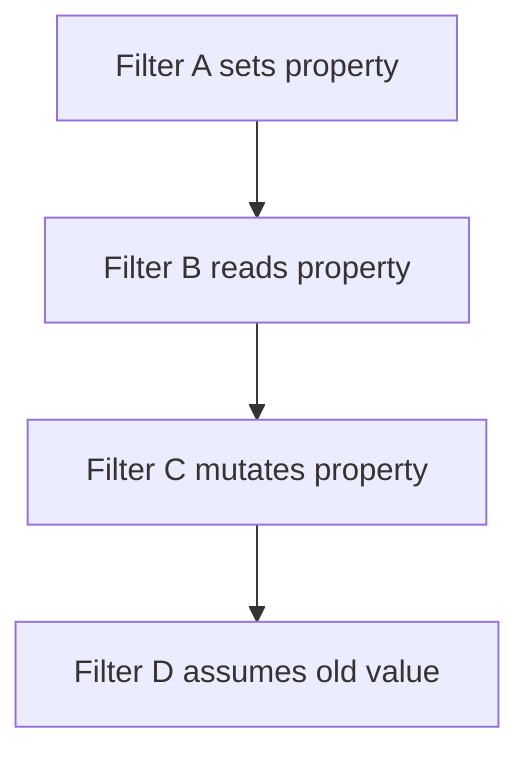
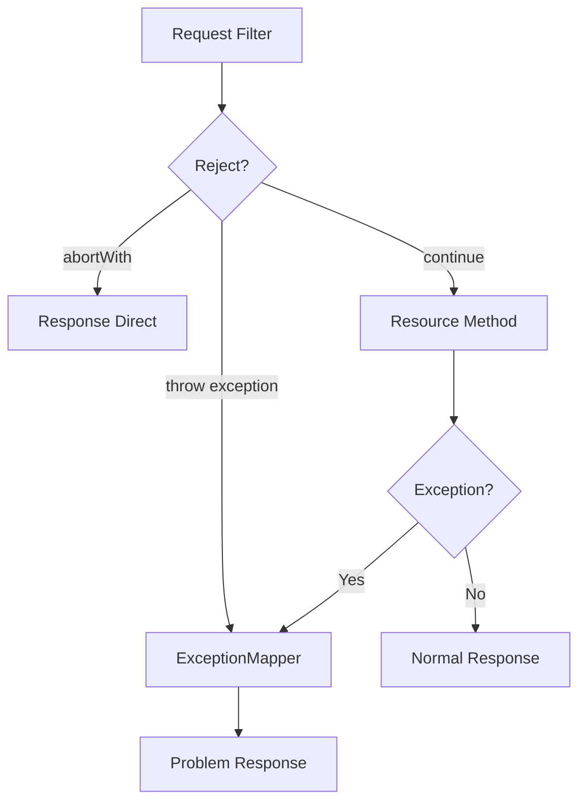
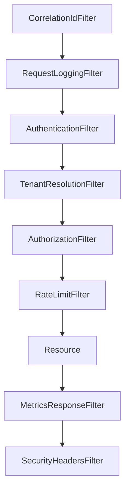

# Part 008 — Filters and Interceptors as Runtime Control Points

Filter dan interceptor adalah extension point yang membuat Jersey sangat fleksibel. Tetapi fleksibilitas ini berbahaya jika tidak diberi batas arsitektur. Banyak sistem enterprise menjadi sulit dipahami karena authentication, authorization, tenant selection, audit, metrics, request mutation, response mutation, dan compatibility workaround tersebar di filter tanpa model yang jelas.

Bagian ini membangun mental model agar kamu bisa menggunakan filter/interceptor sebagai **runtime control point** yang eksplisit, bukan sebagai tempat menyembunyikan business logic.

## 1. Target Skill Menurut Kaufman

Setelah menyelesaikan part ini, kamu harus bisa:

1. Membedakan filter dan interceptor secara konseptual dan teknis.
2. Menjelaskan urutan pipeline request/response di Jersey.
3. Menggunakan `ContainerRequestFilter`, `ContainerResponseFilter`, `ReaderInterceptor`, dan `WriterInterceptor` secara benar.
4. Mendesain correlation ID, authentication, authorization guard, security headers, audit envelope, dan metrics hook.
5. Membedakan pre-matching filter, post-matching filter, dan name-bound filter.
6. Menggunakan `@Priority` tanpa membuat ordering rapuh.
7. Menghindari anti-pattern: hidden business logic, request body double-read, accidental global mutation, filter yang terlalu luas.
8. Membuat failure model untuk filter/interceptor di GlassFish/Jersey production deployment.

## 2. Big Mental Model

Provider menangani entity representation. Filter menangani request/response metadata dan control flow. Interceptor menangani entity stream read/write.

```mermaid
flowchart LR
    A[HTTP Request] --> B[Pre-Matching Request Filters]
    B --> C[Resource Matching]
    C --> D[Post-Matching Request Filters]
    D --> E[Reader Interceptors]
    E --> F[MessageBodyReader]
    F --> G[Resource Method]
    G --> H[Writer Interceptors]
    H --> I[MessageBodyWriter]
    I --> J[Response Filters]
    J --> K[HTTP Response]
```



Simplifikasi:

| Extension Point | Fokus Utama | Entity Body? | Contoh Use Case |
|---|---|---:|---|
| `ContainerRequestFilter` | Request metadata/control | Biasanya tidak | Auth, correlation ID, header validation, abort request. |
| `ContainerResponseFilter` | Response metadata | Biasanya tidak | Security headers, response correlation ID, cache headers. |
| `ReaderInterceptor` | Input entity stream | Ya | Decompression, body hash, decryption, limited body logging. |
| `WriterInterceptor` | Output entity stream | Ya | Compression, body signing, envelope transform. |

Rule:

> Jika kamu perlu mengubah header atau menghentikan request, gunakan filter. Jika kamu perlu membungkus entity stream, gunakan interceptor. Jika kamu perlu parsing/serialization format, gunakan provider.

## 3. Request Filter

`ContainerRequestFilter` berjalan sebelum resource method dipanggil.

```java
import jakarta.annotation.Priority;
import jakarta.ws.rs.Priorities;
import jakarta.ws.rs.container.ContainerRequestContext;
import jakarta.ws.rs.container.ContainerRequestFilter;
import jakarta.ws.rs.ext.Provider;
import java.io.IOException;

@Provider
@Priority(Priorities.AUTHENTICATION)
public final class AuthenticationFilter implements ContainerRequestFilter {

    @Override
    public void filter(ContainerRequestContext requestContext) throws IOException {
        String authorization = requestContext.getHeaderString("Authorization");

        if (authorization == null || authorization.isBlank()) {
            requestContext.abortWith(
                    ErrorResponses.unauthorized("Missing Authorization header")
            );
            return;
        }

        // Validate token, then attach identity to request context or SecurityContext.
    }
}
```

Fungsi utama request filter:

- Reject request lebih awal.
- Menambahkan context teknis.
- Validasi header wajib.
- Membuat correlation ID.
- Menentukan tenant dari header/domain/token.
- Menyiapkan security context.
- Menandai start time untuk metrics.

Request filter bukan tempat untuk:

- menjalankan workflow bisnis,
- query domain kompleks,
- mengubah request body menjadi DTO bisnis,
- menyembunyikan authorization rule granular yang seharusnya jelas di service/application layer.

## 4. Response Filter

`ContainerResponseFilter` berjalan setelah resource method selesai dan response object tersedia.

```java
import jakarta.ws.rs.container.ContainerRequestContext;
import jakarta.ws.rs.container.ContainerResponseContext;
import jakarta.ws.rs.container.ContainerResponseFilter;
import jakarta.ws.rs.ext.Provider;
import java.io.IOException;

@Provider
public final class SecurityHeadersFilter implements ContainerResponseFilter {

    @Override
    public void filter(
            ContainerRequestContext requestContext,
            ContainerResponseContext responseContext) throws IOException {

        responseContext.getHeaders().putSingle("X-Content-Type-Options", "nosniff");
        responseContext.getHeaders().putSingle("X-Frame-Options", "DENY");
        responseContext.getHeaders().putSingle("Referrer-Policy", "no-referrer");
    }
}
```

Fungsi utama response filter:

- Menambahkan security headers.
- Menambahkan correlation ID response header.
- Menentukan cache-control default.
- Menambahkan deprecation/sunset headers.
- Mengumpulkan metrics setelah status code diketahui.
- Normalisasi response metadata.

Response filter sebaiknya tidak:

- mengubah entity object secara bisnis,
- mengganti status code tanpa alasan control-plane yang jelas,
- menyembunyikan error mapping,
- mengubah response hanya untuk endpoint tertentu tanpa name-binding yang eksplisit.

## 5. Reader and Writer Interceptors

Interceptor berada lebih dekat ke entity stream.

### 5.1 `ReaderInterceptor`

```java
import jakarta.ws.rs.WebApplicationException;
import jakarta.ws.rs.ext.Provider;
import jakarta.ws.rs.ext.ReaderInterceptor;
import jakarta.ws.rs.ext.ReaderInterceptorContext;
import java.io.IOException;

@Provider
public final class BodySizeReaderInterceptor implements ReaderInterceptor {

    @Override
    public Object aroundReadFrom(ReaderInterceptorContext context)
            throws IOException, WebApplicationException {

        context.setInputStream(new LimitedInputStream(context.getInputStream(), 1_000_000));
        return context.proceed();
    }
}
```

Reader interceptor cocok untuk:

- limit stream,
- decompress request body,
- decrypt body,
- calculate request body digest,
- controlled body logging dengan redaction.

### 5.2 `WriterInterceptor`

```java
import jakarta.ws.rs.WebApplicationException;
import jakarta.ws.rs.ext.Provider;
import jakarta.ws.rs.ext.WriterInterceptor;
import jakarta.ws.rs.ext.WriterInterceptorContext;
import java.io.IOException;

@Provider
public final class ResponseSigningInterceptor implements WriterInterceptor {

    @Override
    public void aroundWriteTo(WriterInterceptorContext context)
            throws IOException, WebApplicationException {

        // Wrap OutputStream if you need signing/hash/compression behavior.
        context.proceed();
    }
}
```

Writer interceptor cocok untuk:

- compression,
- encryption,
- response signing,
- response body hash,
- controlled response envelope transform.

Interceptor tidak cocok untuk routing, authentication biasa, atau business validation. Itu ranah filter/resource/service.

## 6. Filter vs Interceptor Decision Table

| Kebutuhan | Gunakan |
|---|---|
| Reject request tanpa body parsing | Request filter |
| Check `Authorization` header | Request filter |
| Set `SecurityContext` | Request filter |
| Add `X-Correlation-ID` response header | Response filter |
| Add `Cache-Control` | Response filter |
| Read/decrypt compressed body | Reader interceptor |
| Sign response body | Writer interceptor |
| Serialize DTO ke JSON | MessageBodyWriter/provider |
| Deserialize JSON ke DTO | MessageBodyReader/provider |
| Validate business rule | Service/application layer |
| Validate DTO shape | Bean Validation / resource boundary |

## 7. Pre-Matching Filters

Secara default, request filter berjalan setelah resource matching. Pre-matching filter berjalan sebelum Jersey menentukan resource method.

```java
import jakarta.annotation.Priority;
import jakarta.ws.rs.Priorities;
import jakarta.ws.rs.container.ContainerRequestContext;
import jakarta.ws.rs.container.ContainerRequestFilter;
import jakarta.ws.rs.container.PreMatching;
import jakarta.ws.rs.ext.Provider;
import java.io.IOException;

@Provider
@PreMatching
@Priority(Priorities.HEADER_DECORATOR)
public final class MethodOverrideFilter implements ContainerRequestFilter {

    @Override
    public void filter(ContainerRequestContext requestContext) throws IOException {
        String override = requestContext.getHeaderString("X-HTTP-Method-Override");
        if (override != null && !override.isBlank()) {
            requestContext.setMethod(override.toUpperCase());
        }
    }
}
```

Pre-matching cocok untuk:

- method override,
- URI normalization,
- early correlation ID,
- reverse proxy header normalization,
- rejecting malformed request sebelum matching.

Pre-matching berbahaya untuk:

- authorization berbasis resource method annotation,
- business rule,
- logic yang butuh path param hasil matching.

Jika filter butuh tahu method/resource yang akan dipanggil, jangan pre-matching.

## 8. Name Binding

Name binding membatasi filter/interceptor hanya untuk resource atau method tertentu.

Buat annotation:

```java
import jakarta.ws.rs.NameBinding;
import java.lang.annotation.Retention;
import java.lang.annotation.RetentionPolicy;

@NameBinding
@Retention(RetentionPolicy.RUNTIME)
public @interface AuditedEndpoint {
}
```

Pasang di filter:

```java
@Provider
@AuditedEndpoint
public final class AuditFilter implements ContainerRequestFilter, ContainerResponseFilter {
    @Override
    public void filter(ContainerRequestContext requestContext) {
        requestContext.setProperty("audit.startedAt", System.nanoTime());
    }

    @Override
    public void filter(ContainerRequestContext requestContext, ContainerResponseContext responseContext) {
        // Emit audit event metadata.
    }
}
```

Pasang di resource:

```java
@Path("/cases")
public final class CaseResource {

    @POST
    @AuditedEndpoint
    public Response create(CreateCaseRequest request) {
        return Response.accepted().build();
    }
}
```

Name binding membuat control point eksplisit. Ini jauh lebih baik daripada filter global yang memeriksa path string manual.

Bad:

```java
if (requestContext.getUriInfo().getPath().startsWith("cases")) {
    // special audit behavior
}
```

Better:

```java
@AuditedEndpoint
public Response create(...) { ... }
```

## 9. Priority Model

`@Priority` mengatur urutan execution. Jakarta REST menyediakan kelompok prioritas umum melalui `jakarta.ws.rs.Priorities`.

Contoh urutan konseptual:

```java
@Priority(Priorities.AUTHENTICATION)
public final class AuthenticationFilter implements ContainerRequestFilter { ... }

@Priority(Priorities.AUTHORIZATION)
public final class AuthorizationFilter implements ContainerRequestFilter { ... }

@Priority(Priorities.HEADER_DECORATOR)
public final class CorrelationResponseFilter implements ContainerResponseFilter { ... }
```

Prinsip:

1. Authentication sebelum authorization.
2. Correlation ID sedini mungkin.
3. Metrics outermost agar menangkap semua latency.
4. Body-affecting interceptor harus jelas ordering-nya.
5. Jangan membuat 10 filter saling bergantung secara implisit.

Ordering yang rapuh:



Jika filter saling bergantung, buat dependency itu eksplisit melalui:

- priority yang jelas,
- property name yang documented,
- integration test pipeline,
- atau gabungkan menjadi satu filter jika secara konsep satu responsibility.

## 10. Correlation ID Pattern

Correlation ID harus dibuat atau diteruskan sedini mungkin.

```java
@Provider
@PreMatching
@Priority(Priorities.HEADER_DECORATOR)
public final class CorrelationIdFilter implements ContainerRequestFilter, ContainerResponseFilter {

    public static final String HEADER = "X-Correlation-ID";
    public static final String PROPERTY = "correlationId";

    @Override
    public void filter(ContainerRequestContext requestContext) {
        String incoming = requestContext.getHeaderString(HEADER);
        String correlationId = CorrelationIds.normalizeOrCreate(incoming);
        requestContext.setProperty(PROPERTY, correlationId);
        // Also attach to MDC if logging framework is configured.
    }

    @Override
    public void filter(ContainerRequestContext requestContext, ContainerResponseContext responseContext) {
        Object correlationId = requestContext.getProperty(PROPERTY);
        if (correlationId != null) {
            responseContext.getHeaders().putSingle(HEADER, correlationId.toString());
        }
    }
}
```

Invariants:

- Jangan percaya correlation ID client tanpa validasi format/length.
- Jangan buat correlation ID baru di tengah request jika sudah ada valid one.
- Pastikan response selalu membawa ID yang sama.
- Pastikan exception mapper juga memakai ID yang sama.
- Bersihkan MDC setelah request selesai jika runtime/thread model membutuhkan.

## 11. Authentication Filter Pattern

Authentication menjawab: “siapa caller ini?”

```java
@Provider
@Priority(Priorities.AUTHENTICATION)
public final class BearerAuthenticationFilter implements ContainerRequestFilter {

    private final TokenVerifier tokenVerifier;

    public BearerAuthenticationFilter(TokenVerifier tokenVerifier) {
        this.tokenVerifier = tokenVerifier;
    }

    @Override
    public void filter(ContainerRequestContext requestContext) {
        String header = requestContext.getHeaderString("Authorization");
        BearerToken token = BearerToken.parse(header)
                .orElseThrow(() -> new NotAuthorizedException("Bearer"));

        AuthenticatedPrincipal principal = tokenVerifier.verify(token);

        requestContext.setSecurityContext(new ApiSecurityContext(
                principal,
                requestContext.getSecurityContext().isSecure(),
                "Bearer"
        ));
    }
}
```

Authentication filter boleh:

- parse credential,
- verify token/session/API key,
- create principal,
- set `SecurityContext`,
- abort dengan 401.

Authentication filter jangan:

- mengambil semua permission detail dari banyak service jika mahal,
- menjalankan business-specific rule,
- membuat database write,
- memutuskan semua authorization granular.

## 12. Authorization Filter Pattern

Authorization menjawab: “apakah caller boleh melakukan action ini?”

Authorization bisa dilakukan di filter jika rule cukup teknis dan deklaratif.

Contoh annotation:

```java
import jakarta.ws.rs.NameBinding;
import java.lang.annotation.Retention;
import java.lang.annotation.RetentionPolicy;

@NameBinding
@Retention(RetentionPolicy.RUNTIME)
public @interface RequiresRole {
    String value();
}
```

Namun `@NameBinding` annotation dengan attribute perlu desain hati-hati karena filter binding dan pembacaan annotation method/resource bisa berbeda tergantung implementasi. Pattern yang sering lebih jelas adalah membuat annotation marker per policy:

```java
@NameBinding
@Retention(RetentionPolicy.RUNTIME)
public @interface RequiresCaseOfficer {
}
```

Filter:

```java
@Provider
@RequiresCaseOfficer
@Priority(Priorities.AUTHORIZATION)
public final class CaseOfficerAuthorizationFilter implements ContainerRequestFilter {

    @Override
    public void filter(ContainerRequestContext requestContext) {
        SecurityContext security = requestContext.getSecurityContext();
        if (security == null || !security.isUserInRole("CASE_OFFICER")) {
            requestContext.abortWith(ErrorResponses.forbidden("Insufficient role"));
        }
    }
}
```

Resource:

```java
@POST
@RequiresCaseOfficer
public Response assignCase(AssignCaseRequest request) {
    return Response.accepted().build();
}
```

Untuk authorization berbasis domain object, service layer biasanya lebih tepat:

```java
public void assignCase(String caseId, UserId actor, AssignCaseCommand command) {
    CaseRecord record = repository.get(caseId);
    policy.requireCanAssign(actor, record);
    record.assignTo(command.assignee());
}
```

Rule:

> Filter cocok untuk coarse-grained access control. Domain service cocok untuk object-level authorization.

## 13. Audit Filter Pattern

Audit berbeda dari logging. Logging untuk debugging/operations. Audit untuk bukti kejadian.

Audit filter cocok untuk metadata:

- siapa caller,
- endpoint apa,
- status code,
- waktu,
- correlation ID,
- request method,
- resource classification,
- success/failure.

Audit filter tidak cocok untuk menyimpan full request body mentah sembarangan.

```java
@Provider
@AuditedEndpoint
public final class AuditFilter implements ContainerRequestFilter, ContainerResponseFilter {

    @Override
    public void filter(ContainerRequestContext requestContext) {
        requestContext.setProperty("audit.startNanos", System.nanoTime());
    }

    @Override
    public void filter(ContainerRequestContext requestContext, ContainerResponseContext responseContext) {
        long start = (long) requestContext.getProperty("audit.startNanos");
        long durationMicros = (System.nanoTime() - start) / 1_000;

        AuditEvent event = AuditEvent.builder()
                .method(requestContext.getMethod())
                .path(requestContext.getUriInfo().getPath())
                .status(responseContext.getStatus())
                .durationMicros(durationMicros)
                .correlationId(String.valueOf(requestContext.getProperty("correlationId")))
                .build();

        // Send to audit sink asynchronously and safely.
        AuditSink.emit(event);
    }
}
```

Audit invariants:

- Audit event emission failure tidak boleh menjatuhkan request kecuali policy regulatory mewajibkan fail-closed.
- Sensitive data harus direduksi.
- Audit schema harus stabil.
- Event harus punya correlation ID.
- Jangan hanya mengandalkan access log server.

## 14. Metrics Filter Pattern

Metrics filter mengukur request secara sistematis.

```java
@Provider
@Priority(Priorities.USER)
public final class RequestMetricsFilter implements ContainerRequestFilter, ContainerResponseFilter {

    private static final String START = "metrics.startNanos";

    @Override
    public void filter(ContainerRequestContext requestContext) {
        requestContext.setProperty(START, System.nanoTime());
    }

    @Override
    public void filter(ContainerRequestContext requestContext, ContainerResponseContext responseContext) {
        Long start = (Long) requestContext.getProperty(START);
        if (start == null) {
            return;
        }

        long elapsedNanos = System.nanoTime() - start;
        String route = routeTemplateOrFallback(requestContext);
        int status = responseContext.getStatus();

        Metrics.httpServerRequests(route, requestContext.getMethod(), status, elapsedNanos);
    }
}
```

Jangan label metrics dengan raw path yang punya ID unik:

Bad:

```text
/cases/CASE-123
/cases/CASE-456
/cases/CASE-789
```

Better:

```text
/cases/{caseId}
```

Raw path menyebabkan cardinality explosion di metrics backend.

## 15. Request Body Logging: Dangerous by Default

Banyak engineer ingin log request body dari filter. Ini sering salah.

Masalah:

1. Entity stream hanya bisa dibaca sekali.
2. Body bisa besar.
3. Body bisa mengandung rahasia.
4. Logging bisa menjadi bottleneck.
5. Redaction sulit dilakukan benar.

Bad:

```java
String body = new String(requestContext.getEntityStream().readAllBytes(), UTF_8);
log.info("requestBody={}", body);
```

Jika body harus diinspeksi, gunakan `ReaderInterceptor` dengan limit dan redaction, lalu pasang stream baru.

```java
@Provider
@LoggedBody
public final class SafeBodyLoggingInterceptor implements ReaderInterceptor {

    @Override
    public Object aroundReadFrom(ReaderInterceptorContext context) throws IOException {
        InputStream original = context.getInputStream();
        byte[] preview = BodyPreview.readAtMost(original, 4096);

        log.debug("requestBodyPreview={}", Redactor.redact(preview));

        context.setInputStream(BodyPreview.recombine(preview, original));
        return context.proceed();
    }
}
```

Tetapi bahkan pattern ini harus dipakai sangat selektif.

## 16. Aborting Requests

Request filter dapat menghentikan pipeline dengan `abortWith`.

```java
requestContext.abortWith(
        Response.status(Response.Status.TOO_MANY_REQUESTS)
                .entity(new ProblemResponse(
                        "rate-limit-exceeded",
                        "Rate limit exceeded",
                        429
                ))
                .type(MediaType.APPLICATION_JSON)
                .build()
);
```

Setelah `abortWith`, resource method tidak dipanggil. Response filter masih bisa berjalan tergantung pipeline implementation dan phase.

Gunakan `abortWith` untuk:

- authentication failure,
- authorization failure,
- rate limit,
- maintenance mode,
- invalid required header,
- unsupported client version.

Jangan gunakan `abortWith` untuk business validation yang membutuhkan parsed DTO dan domain semantics. Itu lebih cocok di resource/service + exception mapper.

## 17. Request Context Properties

`ContainerRequestContext` bisa menyimpan property selama request.

```java
requestContext.setProperty("tenantId", tenantId);
TenantId tenantId = (TenantId) requestContext.getProperty("tenantId");
```

Gunakan property untuk metadata teknis:

- correlation ID,
- tenant ID hasil resolusi teknis,
- authenticated principal,
- request start time,
- audit classification.

Jangan gunakan property sebagai global mutable bag untuk business data. Jika terlalu banyak data disimpan di context, request flow menjadi sulit dipahami.

Pattern lebih baik:

```java
public record RequestRuntimeContext(
        String correlationId,
        TenantId tenantId,
        AuthenticatedPrincipal principal
) {}
```

Simpan satu object context yang typed, bukan banyak string property acak.

## 18. Resource Method Annotation Inspection

Kadang filter perlu tahu resource method yang akan dipanggil. Di Jersey, kamu bisa menggunakan injection context tertentu seperti `ResourceInfo`.

```java
import jakarta.ws.rs.container.ContainerRequestContext;
import jakarta.ws.rs.container.ContainerRequestFilter;
import jakarta.ws.rs.container.ResourceInfo;
import jakarta.ws.rs.core.Context;
import jakarta.ws.rs.ext.Provider;
import java.lang.reflect.Method;

@Provider
public final class ResourceMetadataFilter implements ContainerRequestFilter {

    @Context
    private ResourceInfo resourceInfo;

    @Override
    public void filter(ContainerRequestContext requestContext) {
        Method method = resourceInfo.getResourceMethod();
        Class<?> resourceClass = resourceInfo.getResourceClass();

        requestContext.setProperty("resource.method", method.getName());
        requestContext.setProperty("resource.class", resourceClass.getName());
    }
}
```

Important:

- Ini tidak tersedia untuk pre-matching phase dengan cara yang sama karena resource belum dipilih.
- Jangan membuat authorization framework kompleks tanpa test menyeluruh.
- Annotation inheritance, proxy, dan sub-resource locator bisa membuat inspection lebih rumit.

## 19. CORS Filter Warning

CORS sering dibuat sebagai response filter global. Untuk simple case, ini bisa bekerja. Tetapi CORS memiliki detail penting:

- preflight `OPTIONS`,
- allowed origins,
- credentials,
- allowed headers,
- allowed methods,
- max age,
- per-environment policy.

Bad global pattern:

```java
responseContext.getHeaders().putSingle("Access-Control-Allow-Origin", "*");
responseContext.getHeaders().putSingle("Access-Control-Allow-Credentials", "true");
```

Ini bermasalah karena wildcard origin tidak boleh digabung sembarangan dengan credentialed requests.

Better principle:

- whitelist origin,
- handle preflight explicitly,
- do not enable credentials unless required,
- keep CORS config outside business code,
- test browser behavior, not only curl.

## 20. Version and Deprecation Headers

Response filter dapat menambahkan API lifecycle metadata.

```java
@Provider
@DeprecatedApi
public final class DeprecatedApiHeaderFilter implements ContainerResponseFilter {

    @Override
    public void filter(ContainerRequestContext requestContext, ContainerResponseContext responseContext) {
        responseContext.getHeaders().putSingle("Deprecation", "true");
        responseContext.getHeaders().putSingle("Sunset", "Wed, 31 Dec 2026 23:59:59 GMT");
        responseContext.getHeaders().putSingle("Link", "</docs/api-migration>; rel=\"deprecation\"");
    }
}
```

Ini cocok dengan name binding:

```java
@GET
@DeprecatedApi
@Path("/legacy-cases/{id}")
public LegacyCaseResponse getLegacyCase(@PathParam("id") String id) {
    return service.getLegacyCase(id);
}
```

Filter membuat lifecycle signal konsisten tanpa mengotori setiap method.

## 21. Multi-Tenancy Filter

Tenant resolution sering ditempatkan di filter.

```java
@Provider
@Priority(Priorities.AUTHENTICATION + 100)
public final class TenantResolutionFilter implements ContainerRequestFilter {

    @Override
    public void filter(ContainerRequestContext requestContext) {
        String tenantHeader = requestContext.getHeaderString("X-Tenant-ID");
        TenantId tenantId = TenantIds.parseAndValidate(tenantHeader)
                .orElseThrow(() -> new BadRequestException("Invalid tenant"));

        requestContext.setProperty("tenantId", tenantId);
    }
}
```

Tenant filter boleh menyelesaikan tenant context. Tetapi domain service tetap harus memvalidasi object-level access:

```java
caseAccessPolicy.requireCaseBelongsToTenant(caseId, tenantId);
```

Jangan menganggap header tenant cukup untuk semua authorization.

## 22. Filter State and Thread Safety

Provider/filter/interceptor instance dapat dipakai lintas request tergantung lifecycle/runtime. Karena itu jangan simpan request-specific state di field instance.

Bad:

```java
@Provider
public final class UnsafeFilter implements ContainerRequestFilter {
    private String currentCorrelationId;

    @Override
    public void filter(ContainerRequestContext requestContext) {
        currentCorrelationId = requestContext.getHeaderString("X-Correlation-ID");
    }
}
```

Request concurrent bisa saling menimpa.

Better:

```java
requestContext.setProperty("correlationId", correlationId);
```

Atau gunakan request-scoped dependency yang benar jika CDI/HK2 setup mendukung.

## 23. Exception Behavior

Filter/interceptor bisa:

- `abortWith(Response)` untuk response eksplisit,
- throw `WebApplicationException`,
- throw custom runtime exception yang dipetakan `ExceptionMapper`,
- throw unchecked exception yang menjadi 500.

Prinsip:

1. Authentication failure → 401.
2. Authorization failure → 403.
3. Missing/invalid technical header → 400.
4. Rate limit → 429.
5. Unexpected dependency failure saat auth/token verification → 503 atau 500 sesuai contract.
6. Jangan return 200 dengan error body dari filter.

Bad:

```java
requestContext.abortWith(Response.ok(new ErrorResponse("forbidden")).build());
```

Better:

```java
requestContext.abortWith(Response.status(Response.Status.FORBIDDEN)
        .entity(problem)
        .type(MediaType.APPLICATION_JSON)
        .build());
```

## 24. Interaction with ExceptionMapper

Filter dan `ExceptionMapper` harus bekerja sebagai satu error system.



Design choice:

- Gunakan `abortWith` jika response sudah final dan sederhana.
- Gunakan exception jika ingin central error contract via mapper.

Untuk konsistensi, banyak tim memilih filter melempar typed exception:

```java
throw new MissingCredentialException();
```

Lalu mapper menghasilkan response problem yang sama untuk seluruh application.

## 25. GlassFish Runtime Considerations

Pada GlassFish, Jersey berjalan di dalam runtime Jakarta EE. Filter/interceptor behaviour dipengaruhi oleh:

- application classloader,
- provider registration/scanning,
- CDI/HK2 integration,
- servlet container request lifecycle,
- thread pool configuration,
- logging/MDC cleanup,
- reverse proxy headers,
- deployed WAR/EAR boundaries.

Operational concerns:

1. Pastikan filter provider masuk artifact yang benar.
2. Pastikan tidak ada duplicate provider dari shared library dan WAR.
3. Pastikan classloader tidak memuat dua versi annotation/API.
4. Pastikan filter tidak melakukan blocking call mahal di request thread tanpa timeout.
5. Pastikan logs menyertakan correlation ID.
6. Pastikan health endpoint tidak terhalang auth filter jika memang harus public untuk load balancer.

## 26. Health Endpoint Exclusion Pattern

Banyak sistem butuh `/health` tanpa auth. Jangan hardcode path di banyak filter.

Opsi 1: package/resource separation + filter binding.

```java
@Path("/health")
public final class HealthResource {
    @GET
    public Response health() {
        return Response.ok("ok").build();
    }
}
```

Auth filter hanya name-bound pada endpoint protected:

```java
@ProtectedApi
@Path("/cases")
public final class CaseResource { ... }
```

Opsi 2: single explicit allowlist di auth filter.

```java
private static final Set<String> PUBLIC_PATHS = Set.of("health", "ready", "metrics");
```

Jika pakai allowlist path, buat test agar endpoint public tidak melebar tanpa disadari.

## 27. Filter Composition Pattern

Untuk sistem kompleks, susun filter sebagai pipeline yang jelas.



Tetapi jangan terlalu banyak filter. Jika dua filter selalu berubah bersama dan selalu bergantung, mungkin itu satu responsibility.

Contoh grouping:

| Concern | Candidate Filter |
|---|---|
| Request identity | Correlation + MDC setup |
| Security | Authentication + coarse authorization |
| Tenant | Tenant resolution |
| API hygiene | Required headers + version headers |
| Observability | Metrics + request log |
| Response policy | Security headers + cache headers |

## 28. Anti-Patterns

### Anti-pattern 1 — Business Workflow in Filter

```java
public void filter(ContainerRequestContext ctx) {
    if (ctx.getUriInfo().getPath().contains("approve")) {
        approvalService.approve(...); // terrible
    }
}
```

Masalah:

- Resource method tidak lagi merepresentasikan behavior.
- Transaction boundary kabur.
- Error contract kabur.
- Test coverage sulit.

### Anti-pattern 2 — Path String Policy Everywhere

```java
if (path.startsWith("/admin")) { ... }
if (path.contains("/legacy")) { ... }
```

Masalah:

- Rename path memecahkan security/audit.
- Tidak terlihat dari resource declaration.
- Susah direview.

Gunakan name binding atau annotation metadata.

### Anti-pattern 3 — Request Body Double Read

```java
String body = new String(ctx.getEntityStream().readAllBytes(), UTF_8);
// resource later receives empty body
```

Gunakan reader interceptor dengan stream replacement jika benar-benar perlu.

### Anti-pattern 4 — Mutable Singleton State

```java
private User currentUser;
```

Filter/provider sering singleton-like. Jangan simpan state request di field.

### Anti-pattern 5 — Swallow Exception and Continue

```java
try {
    authenticate();
} catch (Exception ignored) {
    // continue anonymous accidentally
}
```

Security failure harus eksplisit: reject atau set anonymous dengan policy jelas.

### Anti-pattern 6 — Metrics Cardinality Explosion

```java
Metrics.count("http.requests", "path", rawPathWithIds);
```

Gunakan route template atau low-cardinality label.

### Anti-pattern 7 — Filter Ordering by Magic Number

```java
@Priority(1234)
```

Gunakan `Priorities` atau constant internal yang documented.

## 29. Testing Filters and Interceptors

### 29.1 Unit test pure decision

Pisahkan parser/decision logic agar bisa dites tanpa Jersey runtime.

```java
@Test
void missingAuthorizationIsRejected() {
    AuthDecision decision = authenticator.authenticate(null);
    assertEquals(AuthDecision.Type.MISSING_CREDENTIAL, decision.type());
}
```

### 29.2 Integration test pipeline

Test minimal:

| Scenario | Expected |
|---|---:|
| No auth header to protected endpoint | 401 |
| Invalid token | 401 |
| Valid token insufficient role | 403 |
| Valid token sufficient role | 2xx |
| Health endpoint without token | 200 |
| Response always has correlation ID | header present |
| Error response has same correlation ID | header/body match |
| Unsupported origin CORS | blocked/no allow header |
| Preflight CORS valid | 204/200 with correct headers |

### 29.3 Ordering test

Jika ordering penting, test effect-nya:

- correlation ID tersedia di error response,
- auth failure tetap menghasilkan metrics,
- response headers tetap ada untuk exception response,
- audit event terkirim untuk rejected request jika policy mengharuskan.

## 30. Failure Diagnosis Playbook

### 30.1 Filter tidak terpanggil

Kemungkinan:

- Tidak diberi `@Provider`.
- Tidak diregister di `ResourceConfig`.
- Package tidak discan.
- Name binding tidak cocok.
- Deployed artifact bukan yang terbaru.
- Classloader memuat versi berbeda.

Checklist:

1. Pastikan class ada di WAR/EAR.
2. Pastikan package masuk scanning atau register eksplisit.
3. Pastikan annotation retention runtime.
4. Pastikan name-binding annotation ada di filter dan resource/method.
5. Tambahkan startup log provider registry jika diperlukan.

### 30.2 Response header tidak muncul pada error

Kemungkinan:

- Exception terjadi sebelum response filter phase tertentu.
- Error di container sebelum masuk Jersey.
- Filter hanya name-bound pada resource yang tidak matched.
- Exception mapper membuat response yang tidak melewati filter yang kamu duga.

Solusi:

- Test error from resource vs error before matching.
- Tambahkan container-level error handling jika perlu.
- Pastikan global response hygiene filter tidak name-bound jika harus berlaku semua.

### 30.3 Auth filter memblokir health check

Kemungkinan:

- Filter global terlalu luas.
- Health endpoint tidak dikecualikan.
- Load balancer memakai path berbeda dari yang dites.

Solusi:

- Name-bound protected endpoints.
- Explicit public endpoint allowlist.
- Deployment smoke test untuk `/health` dan `/ready`.

### 30.4 Body kosong di resource

Kemungkinan:

- Request filter/interceptor membaca stream tanpa mengganti.
- Logging middleware di bawah/atas Jersey membaca body.
- Client tidak mengirim body.

Solusi:

- Jangan baca entity stream di request filter.
- Jika perlu, wrap dan set ulang stream.
- Batasi body logging.

## 31. Production Review Checklist

### Design

- [ ] Filter/interceptor punya single responsibility.
- [ ] Scope global vs name-bound jelas.
- [ ] Ordering documented.
- [ ] Tidak ada business workflow di filter.
- [ ] Tidak ada mutable request state di field.

### Security

- [ ] Auth failure fail-closed.
- [ ] Health/public endpoints explicitly defined.
- [ ] CORS tidak wildcard sembarangan.
- [ ] Security headers konsisten.
- [ ] Sensitive payload tidak dilog.

### Observability

- [ ] Correlation ID dibuat/diteruskan.
- [ ] Error response membawa correlation ID.
- [ ] Metrics label low-cardinality.
- [ ] Audit event tidak bergantung pada raw logs saja.
- [ ] MDC cleanup dipertimbangkan.

### Performance

- [ ] Tidak ada blocking network call tanpa timeout.
- [ ] Tidak baca full body tanpa limit.
- [ ] Token verification/cache strategy jelas.
- [ ] Audit/metrics sink tidak blocking request secara berlebihan.
- [ ] Interceptor stream tidak membuat memory spike.

### Deployment

- [ ] Provider/filter terdaftar deterministik.
- [ ] Tidak ada duplicate class/provider dari shared library.
- [ ] Behavior dites di packaging yang sama dengan production.
- [ ] Reverse proxy headers diuji.
- [ ] GlassFish thread/logging behavior dipahami.

## 32. Deliberate Practice

### Exercise 1 — Correlation ID End-to-End

Implementasikan filter yang:

1. membaca `X-Correlation-ID`,
2. membuat ID baru jika tidak ada,
3. menolak ID lebih dari 128 karakter,
4. menaruh ID di request property,
5. menambahkan ID ke response header,
6. memastikan error response memakai ID yang sama.

### Exercise 2 — Protected vs Public Endpoint

Buat:

- `/health` public,
- `/cases` protected,
- `/admin/reindex` protected + role admin.

Tulis integration test untuk semua kombinasi token.

### Exercise 3 — Name-Bound Audit

Buat `@AuditedEndpoint`. Pasang hanya di endpoint mutasi. Pastikan GET biasa tidak menghasilkan audit event, tetapi POST/PUT/DELETE yang diberi annotation menghasilkan event.

### Exercise 4 — Safe Body Preview

Buat reader interceptor yang hanya membaca preview 4 KB, melakukan redaction, dan memastikan resource masih bisa menerima body lengkap.

### Exercise 5 — Metrics Cardinality

Bandingkan metrics label raw path vs route template. Jelaskan dampak cardinality terhadap dashboard dan storage.

## 33. Summary

Filter dan interceptor adalah control point runtime Jersey.

Mental model yang harus dipegang:

1. Request filter mengontrol metadata/control flow sebelum resource method.
2. Response filter mengontrol metadata setelah resource method.
3. Reader interceptor membungkus input entity stream.
4. Writer interceptor membungkus output entity stream.
5. Name binding membuat cross-cutting concern terlihat di resource declaration.
6. Priority mengatur urutan, tetapi tidak boleh menjadi magic dependency system.
7. Jangan membaca body di filter tanpa memahami stream semantics.
8. Jangan menaruh business workflow di filter.
9. Untuk production, correlation ID, auth, audit, metrics, CORS, dan security headers harus punya failure model dan test matrix.

Part berikutnya akan membahas exception mapping dan error contract engineering. Itu adalah pasangan alami dari filter/provider karena banyak failure di provider/filter harus keluar sebagai error response yang konsisten, aman, dan bisa diobservasi.

## References

- Jakarta RESTful Web Services 4.0 Specification: https://jakarta.ee/specifications/restful-ws/4.0/jakarta-restful-ws-spec-4.0
- Jakarta RESTful Web Services 4.0 Release Page: https://jakarta.ee/specifications/restful-ws/4.0/
- Eclipse Jersey Documentation - Filters and Interceptors: https://eclipse-ee4j.github.io/jersey.github.io/documentation/latest31x/filters-and-interceptors.html
- Jersey 4.0.0 Release Information: https://projects.eclipse.org/projects/ee4j.jersey/releases/4.0.0-0
