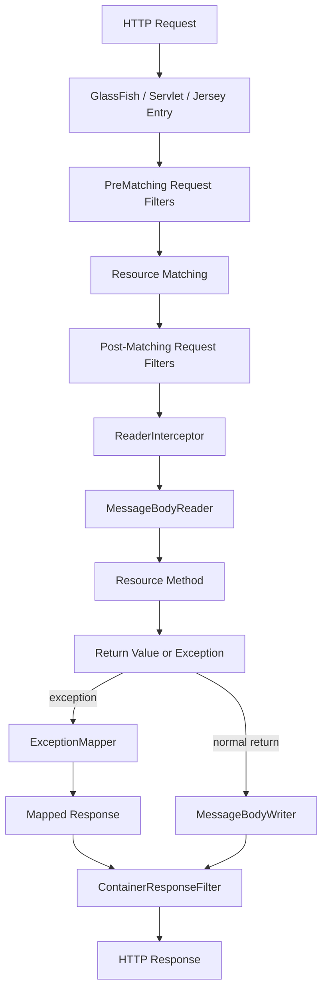
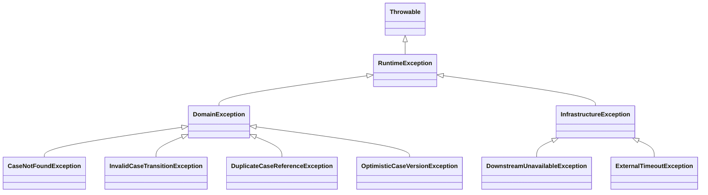
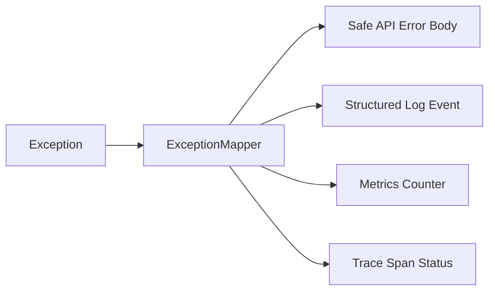
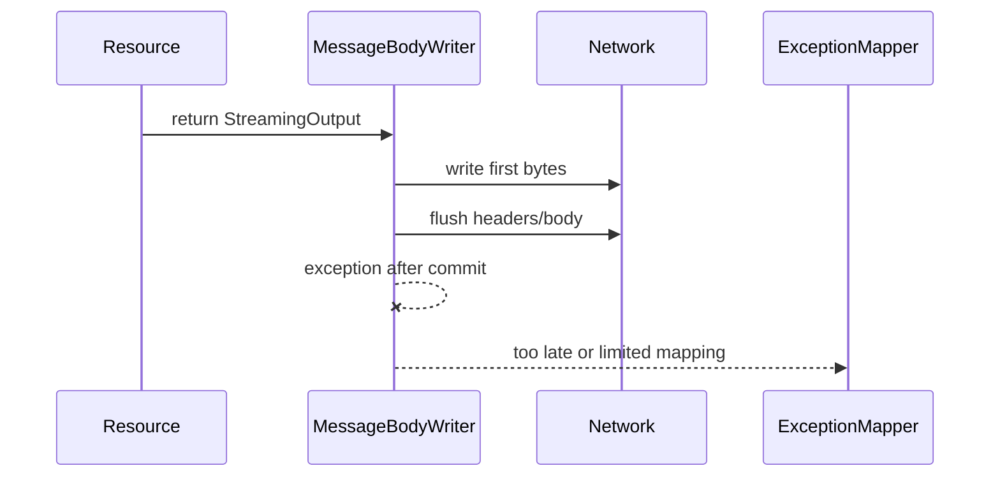

# Part 009 — Exception Mapping and Error Contract Engineering

## 1. Tujuan Part Ini

Part ini membahas bagaimana membangun **error handling layer** pada Jersey/GlassFish yang tidak hanya “menangkap exception”, tetapi menghasilkan **kontrak error HTTP** yang stabil, aman, bisa diuji, bisa diobservasi, dan layak dipakai di sistem enterprise.

Di banyak codebase, error handling REST dibuat seperti ini:

```java
try {
    service.approve(id);
    return Response.ok().build();
} catch (Exception e) {
    return Response.status(500).entity(e.getMessage()).build();
}
```

Kode seperti ini terlihat cepat, tetapi buruk secara production engineering karena:

1. error shape tidak konsisten,
2. stack trace/message internal mudah bocor,
3. HTTP status sering salah,
4. client tidak bisa melakukan handling deterministik,
5. observability tidak punya correlation key,
6. audit trail kehilangan alasan bisnis,
7. exception taxonomy menjadi kacau,
8. resource method penuh plumbing yang seharusnya berada di boundary layer.

Mental model part ini:

> **Exception adalah detail internal Java. Error response adalah kontrak eksternal HTTP. `ExceptionMapper` adalah adapter di antara keduanya.**

Setelah part ini, targetnya kamu mampu:

- mendesain error contract yang konsisten lintas endpoint,
- memetakan domain failure ke HTTP status dengan alasan yang jelas,
- membedakan client error, domain conflict, authorization failure, dan infrastructure failure,
- membuat `ExceptionMapper` yang tidak saling tumpang tindih,
- menghindari error leakage,
- memastikan error response tetap melewati response filter/correlation ID,
- menulis test matrix untuk error handling,
- mendiagnosis 400/404/405/406/415/500 yang berasal dari resource model, provider, filter, dan runtime.

Part ini tidak mengulang basic JAX-RS annotation. Kita fokus pada runtime failure model.

---

## 2. Posisi Exception Mapping di Pipeline Jersey

Secara kasar, pipeline server-side Jersey bisa dipikirkan seperti ini:



Hal penting:

1. exception dapat muncul sebelum resource method dipanggil,
2. exception dapat muncul dari resource method,
3. exception dapat muncul dari provider, filter, interceptor, atau injection,
4. mapped response diperlakukan seperti response biasa,
5. response filter tetap berjalan untuk mapped response,
6. kalau response sudah committed, kemampuan mapping terbatas,
7. exception yang muncul saat menulis error response tidak akan dipetakan ulang terus-menerus.

Ini membuat `ExceptionMapper` bukan sekadar fallback, tetapi bagian resmi dari response pipeline.

---

## 3. Invariant Spesifikasi yang Wajib Dipegang

Jakarta REST mendefinisikan beberapa invariant penting.

### 3.1 ExceptionMapper Mengubah Exception Menjadi Response

`ExceptionMapper<T>` adalah provider yang mengubah checked atau runtime exception menjadi `Response`.

```java
public interface ExceptionMapper<E extends Throwable> {
    Response toResponse(E exception);
}
```

Jangan melihat mapper sebagai `catch` biasa. Mapper adalah **provider runtime**. Ia didaftarkan, dipilih, dipanggil, lalu output-nya diproses lagi oleh pipeline response.

### 3.2 Pemilihan Mapper Berdasarkan Tipe Exception Terdekat

Jika beberapa mapper cocok, runtime memilih mapper dengan generic type yang merupakan superclass terdekat dari exception.

Contoh:

```java
class BusinessException extends RuntimeException {}
class CaseAlreadyClosedException extends BusinessException {}
```

Jika ada:

```java
@Provider
class BusinessExceptionMapper implements ExceptionMapper<BusinessException> { ... }

@Provider
class ThrowableMapper implements ExceptionMapper<Throwable> { ... }
```

Maka `CaseAlreadyClosedException` akan ditangani oleh `BusinessExceptionMapper`, bukan `ThrowableMapper`, karena `BusinessException` lebih dekat daripada `Throwable`.

Jika ada dua mapper yang sama-sama applicable pada level tipe yang sama, prioritas provider menentukan mana yang dipilih.

### 3.3 WebApplicationException Punya Response Semantics

`WebApplicationException` dan subclass-nya, seperti `NotFoundException`, `BadRequestException`, `ForbiddenException`, dapat membawa response/status.

Jika exception sudah punya `Response`, runtime dapat memakai response tersebut. Jika tidak ada response yang eksplisit, runtime mencari mapper yang sesuai.

Praktiknya:

- boleh memakai `NotFoundException` untuk resource yang benar-benar tidak ada,
- boleh memakai `BadRequestException` untuk syntax/request contract violation,
- tetapi jangan sembarang throw `WebApplicationException` di domain service karena itu mencampur domain layer dengan HTTP layer.

### 3.4 Default Throwable Mapper Ada, Tetapi Jangan Diandalkan sebagai Kontrak

Runtime wajib memiliki default mapper untuk `Throwable`, umumnya menghasilkan 500. Ini safety net, bukan public contract.

Dalam production API, kita tetap perlu `ExceptionMapper<Throwable>` milik aplikasi untuk:

- menyembunyikan detail internal,
- menambahkan correlation ID,
- menghasilkan error shape konsisten,
- logging terkontrol,
- memisahkan expected vs unexpected failure.

### 3.5 ExceptionMapper Tidak Didukung di Client API

Exception mapper adalah konsep server runtime. Di client side, response/error diproses dengan model berbeda: `ProcessingException`, `ResponseProcessingException`, status-specific `WebApplicationException`, atau explicit `Response` handling.

Ini penting agar tidak salah menaruh logic retry/error decoding outbound call di server-side `ExceptionMapper`.

---

## 4. Error Contract Bukan Stack Trace

Error response yang baik menjawab pertanyaan client:

1. apa yang gagal,
2. apakah request boleh dicoba ulang,
3. field/input mana yang bermasalah,
4. apakah user bisa memperbaiki,
5. apakah error ini bisa dilaporkan ke support,
6. apakah error code stabil antar versi,
7. apakah detail internal tidak bocor.

Error response yang buruk:

```json
{
  "error": "java.lang.NullPointerException: Cannot invoke getId() because case is null"
}
```

Masalah:

- bocor implementation detail,
- tidak ada stable code,
- tidak ada correlation ID,
- tidak jelas client harus apa,
- raw message bisa berubah setelah refactor,
- raw message bisa mengandung data sensitif.

Error response yang lebih baik:

```json
{
  "type": "https://example.com/problems/case-not-found",
  "title": "Case not found",
  "status": 404,
  "code": "CASE_NOT_FOUND",
  "detail": "The requested case does not exist or is not visible to the current user.",
  "correlationId": "01JZ9ZKFY3QFYZ6A6P1B5S8MX4"
}
```

Untuk validation:

```json
{
  "type": "https://example.com/problems/validation-failed",
  "title": "Validation failed",
  "status": 400,
  "code": "VALIDATION_FAILED",
  "detail": "One or more request fields are invalid.",
  "correlationId": "01JZ9ZKFY3QFYZ6A6P1B5S8MX4",
  "violations": [
    {
      "field": "amount",
      "message": "must be greater than or equal to 0",
      "rejectedValue": "-10"
    }
  ]
}
```

Prinsip:

- `code` stabil untuk programmatic client,
- `title` ringkas untuk manusia,
- `detail` aman untuk ditampilkan,
- `correlationId` untuk support/ops,
- `violations` hanya untuk input-specific error,
- tidak ada stack trace di response publik.

---

## 5. Error Taxonomy untuk Enterprise API

Sebelum menulis mapper, desain taxonomy.

### 5.1 Client Contract Error

Request tidak memenuhi kontrak API.

Contoh:

- JSON invalid,
- missing required field,
- query parameter tidak bisa diparse,
- media type tidak didukung,
- `Accept` tidak cocok,
- path parameter invalid.

HTTP status umum:

| Status | Kapan Dipakai |
|---:|---|
| 400 | request syntactically/semantically invalid |
| 404 | resource tidak ditemukan atau disembunyikan |
| 405 | method tidak didukung untuk resource |
| 406 | server tidak bisa menghasilkan representation sesuai `Accept` |
| 415 | request entity media type tidak didukung |

### 5.2 Domain Rule Error

Request valid secara format, tetapi melanggar aturan domain.

Contoh:

- case sudah closed,
- transition tidak allowed,
- approval melewati limit,
- dokumen wajib belum lengkap,
- duplicate business key.

HTTP status umum:

| Status | Kapan Dipakai |
|---:|---|
| 409 | conflict dengan state resource saat ini |
| 422 | request understandable tetapi domain validation gagal; gunakan hanya jika disepakati dalam API standard tim |
| 412 | precondition gagal, misalnya ETag/version check |

Untuk sistem regulatory/case management, `409 Conflict` sangat sering lebih tepat daripada `400` ketika masalahnya adalah **state transition**.

### 5.3 Authentication dan Authorization Error

Contoh:

- token hilang,
- token expired,
- token valid tetapi role tidak cukup,
- user tidak boleh melihat case tertentu.

HTTP status umum:

| Status | Kapan Dipakai |
|---:|---|
| 401 | belum terautentikasi atau token tidak valid |
| 403 | sudah terautentikasi tetapi tidak berwenang |
| 404 | sengaja menyembunyikan keberadaan resource untuk object-level authorization |

Jangan asal memilih 403 vs 404. Untuk resource sensitif, 404 bisa menjadi security decision agar existence tidak bocor.

### 5.4 Rate, Load, dan Capacity Error

Contoh:

- rate limit,
- quota habis,
- downstream unavailable,
- pool exhausted,
- maintenance mode.

HTTP status umum:

| Status | Kapan Dipakai |
|---:|---|
| 429 | terlalu banyak request |
| 503 | service sementara tidak tersedia |
| 504 | gateway/upstream timeout, biasanya di proxy/gateway |

Tambahkan `Retry-After` hanya jika benar-benar ada retry policy yang bisa dipercaya.

### 5.5 Unexpected Infrastructure Error

Contoh:

- NPE,
- SQL exception yang tidak dipetakan,
- serialization failure,
- thread interruption,
- unknown provider failure.

HTTP status:

| Status | Kapan Dipakai |
|---:|---|
| 500 | unexpected server error |

Kontrak response boleh generik. Detail lengkap ada di log/trace, bukan response.

---

## 6. Domain Exception Model

Jangan mulai dari mapper. Mulai dari exception taxonomy.



Contoh base exception:

```java
package com.example.cases.api.error;

import java.util.Map;

public abstract class DomainException extends RuntimeException {
    private final String code;
    private final Map<String, Object> attributes;

    protected DomainException(String code, String message) {
        this(code, message, Map.of(), null);
    }

    protected DomainException(
            String code,
            String message,
            Map<String, Object> attributes,
            Throwable cause
    ) {
        super(message, cause);
        this.code = code;
        this.attributes = Map.copyOf(attributes);
    }

    public String code() {
        return code;
    }

    public Map<String, Object> attributes() {
        return attributes;
    }
}
```

Specific exception:

```java
public final class InvalidCaseTransitionException extends DomainException {
    public InvalidCaseTransitionException(String caseId, String from, String to) {
        super(
            "INVALID_CASE_TRANSITION",
            "Case cannot transition from " + from + " to " + to,
            Map.of("caseId", caseId, "from", from, "to", to),
            null
        );
    }
}
```

Catatan penting:

- `message` internal boleh lebih detail daripada response `detail`,
- `attributes` jangan otomatis diserialisasi ke response,
- exception code harus stabil,
- domain exception tidak perlu tahu HTTP status,
- mapper yang menerjemahkan domain exception ke HTTP.

---

## 7. Error DTO yang Stabil

Gunakan DTO khusus untuk error response.

```java
package com.example.cases.api.error;

import java.time.OffsetDateTime;
import java.util.List;

public record ApiError(
        String type,
        String title,
        int status,
        String code,
        String detail,
        String correlationId,
        OffsetDateTime timestamp,
        List<ApiViolation> violations
) {
    public static ApiError of(
            String type,
            String title,
            int status,
            String code,
            String detail,
            String correlationId
    ) {
        return new ApiError(
            type,
            title,
            status,
            code,
            detail,
            correlationId,
            OffsetDateTime.now(),
            List.of()
        );
    }
}
```

Violation:

```java
public record ApiViolation(
        String field,
        String message,
        Object rejectedValue
) {}
```

Kenapa memakai record?

- immutable,
- sederhana,
- jelas sebagai boundary DTO,
- mudah dites,
- cocok untuk JSON-B/Jackson.

Hati-hati:

- jangan masukkan `Throwable`,
- jangan masukkan raw request body,
- jangan masukkan SQL/query detail,
- jangan masukkan principal/token,
- jangan masukkan stack trace.

---

## 8. Correlation ID sebagai Bagian dari Error Contract

Error tanpa correlation ID sulit ditindaklanjuti.

Correlation ID bisa berasal dari:

- incoming `X-Correlation-ID`,
- gateway header,
- generated ID di filter,
- distributed trace ID.

Filter sederhana:

```java
@Provider
@Priority(Priorities.AUTHENTICATION)
public class CorrelationIdFilter implements ContainerRequestFilter, ContainerResponseFilter {
    public static final String HEADER = "X-Correlation-ID";
    public static final String PROPERTY = "correlationId";

    @Override
    public void filter(ContainerRequestContext requestContext) {
        String incoming = requestContext.getHeaderString(HEADER);
        String correlationId = isSafe(incoming) ? incoming : newCorrelationId();
        requestContext.setProperty(PROPERTY, correlationId);
    }

    @Override
    public void filter(
            ContainerRequestContext requestContext,
            ContainerResponseContext responseContext
    ) {
        Object value = requestContext.getProperty(PROPERTY);
        if (value != null) {
            responseContext.getHeaders().putSingle(HEADER, value.toString());
        }
    }

    private static boolean isSafe(String value) {
        return value != null && value.length() <= 128 && value.matches("[A-Za-z0-9._:-]+?");
    }

    private static String newCorrelationId() {
        return java.util.UUID.randomUUID().toString();
    }
}
```

Mapper mengambil ID dari context:

```java
@Context
private HttpServletRequest servletRequest;

private String correlationId() {
    Object value = servletRequest.getAttribute(CorrelationIdFilter.PROPERTY);
    return value == null ? "unknown" : value.toString();
}
```

Namun `ContainerRequestContext` property tidak otomatis menjadi `HttpServletRequest` attribute. Pattern yang lebih deterministik adalah membuat request-scoped holder.

```java
@RequestScoped
public class RequestCorrelation {
    private String id;

    public String id() {
        return id == null ? "unknown" : id;
    }

    public void setId(String id) {
        this.id = id;
    }
}
```

Lalu inject holder ke filter dan mapper. Ini lebih bersih di aplikasi Jakarta EE/CDI.

---

## 9. Mapper untuk DomainException

Contoh mapper domain:

```java
@Provider
@Priority(Priorities.USER)
public class DomainExceptionMapper implements ExceptionMapper<DomainException> {
    @Inject
    RequestCorrelation correlation;

    @Override
    public Response toResponse(DomainException exception) {
        ErrorMapping mapping = map(exception);

        ApiError body = ApiError.of(
            mapping.type(),
            mapping.title(),
            mapping.status().getStatusCode(),
            exception.code(),
            mapping.safeDetail(),
            correlation.id()
        );

        return Response.status(mapping.status())
            .type(MediaType.APPLICATION_JSON_TYPE)
            .entity(body)
            .build();
    }

    private ErrorMapping map(DomainException e) {
        if (e instanceof CaseNotFoundException) {
            return new ErrorMapping(
                Response.Status.NOT_FOUND,
                "https://example.com/problems/case-not-found",
                "Case not found",
                "The requested case does not exist or is not visible to the current user."
            );
        }

        if (e instanceof InvalidCaseTransitionException) {
            return new ErrorMapping(
                Response.Status.CONFLICT,
                "https://example.com/problems/invalid-case-transition",
                "Invalid case transition",
                "The requested transition is not allowed for the current case state."
            );
        }

        return new ErrorMapping(
            Response.Status.BAD_REQUEST,
            "https://example.com/problems/domain-rule-violation",
            "Domain rule violation",
            "The request violates a domain rule."
        );
    }
}
```

Mapping record:

```java
record ErrorMapping(
        Response.Status status,
        String type,
        String title,
        String safeDetail
) {}
```

Production note:

- mapping bisa dibuat table-driven,
- jangan pakai `exception.getMessage()` otomatis sebagai `detail`,
- log detail internal secara terpisah,
- gunakan `code` sebagai stable external contract,
- status harus merepresentasikan kategori failure, bukan sekadar selera.

---

## 10. Mapper untuk Validation

Jika Bean Validation aktif, constraint violation dapat terjadi pada:

- request body DTO,
- path parameter,
- query parameter,
- header parameter,
- resource method parameter,
- return value validation.

Contoh mapper:

```java
@Provider
public class ConstraintViolationExceptionMapper
        implements ExceptionMapper<jakarta.validation.ConstraintViolationException> {

    @Inject
    RequestCorrelation correlation;

    @Override
    public Response toResponse(jakarta.validation.ConstraintViolationException exception) {
        List<ApiViolation> violations = exception.getConstraintViolations().stream()
            .map(v -> new ApiViolation(
                pathOf(v),
                v.getMessage(),
                safeRejectedValue(v.getInvalidValue())
            ))
            .toList();

        ApiError error = new ApiError(
            "https://example.com/problems/validation-failed",
            "Validation failed",
            400,
            "VALIDATION_FAILED",
            "One or more request values are invalid.",
            correlation.id(),
            OffsetDateTime.now(),
            violations
        );

        return Response.status(Response.Status.BAD_REQUEST)
            .type(MediaType.APPLICATION_JSON_TYPE)
            .entity(error)
            .build();
    }

    private static String pathOf(jakarta.validation.ConstraintViolation<?> violation) {
        return violation.getPropertyPath() == null
            ? "request"
            : violation.getPropertyPath().toString();
    }

    private static Object safeRejectedValue(Object value) {
        if (value == null) return null;
        if (value instanceof CharSequence s && s.length() > 128) return "<too-long>";
        if (value instanceof byte[]) return "<binary>";
        return value;
    }
}
```

Caution:

- rejected value bisa mengandung PII,
- path validation bisa berbeda antar provider/runtime,
- return value validation failure sering lebih cocok 500 karena server melanggar kontraknya sendiri,
- body parsing error berbeda dari Bean Validation error.

---

## 11. Mapper untuk JSON Parse / Message Body Error

Salah satu error umum: client mengirim JSON invalid.

Penyebab runtime bisa muncul sebagai:

- `BadRequestException`,
- `ProcessingException`,
- provider-specific parse exception,
- JSON-B/Jackson exception yang dibungkus.

Jangan terlalu cepat membuat mapper untuk semua exception library serialization. Lebih aman mapping pada boundary Jakarta REST terlebih dahulu.

```java
@Provider
public class BadRequestExceptionMapper implements ExceptionMapper<BadRequestException> {
    @Inject
    RequestCorrelation correlation;

    @Override
    public Response toResponse(BadRequestException exception) {
        ApiError error = ApiError.of(
            "https://example.com/problems/bad-request",
            "Bad request",
            400,
            "BAD_REQUEST",
            "The request is malformed or cannot be processed.",
            correlation.id()
        );

        return Response.status(Response.Status.BAD_REQUEST)
            .type(MediaType.APPLICATION_JSON_TYPE)
            .entity(error)
            .build();
    }
}
```

Jika perlu membedakan JSON parse error, lakukan setelah observability menunjukkan kebutuhan nyata.

Anti-pattern:

```java
@Provider
public class JsonExceptionMapper implements ExceptionMapper<Exception> {
    // terlalu luas, berpotensi mengambil semua error runtime
}
```

---

## 12. Mapper untuk NotFoundException

`404` bisa berasal dari beberapa tempat:

1. route tidak ada,
2. resource ada tetapi ID tidak ditemukan,
3. resource disembunyikan oleh authorization,
4. sub-resource locator mengembalikan null,
5. path composition salah karena context root/application path.

Mapper umum:

```java
@Provider
public class NotFoundExceptionMapper implements ExceptionMapper<NotFoundException> {
    @Inject
    RequestCorrelation correlation;

    @Override
    public Response toResponse(NotFoundException exception) {
        ApiError error = ApiError.of(
            "https://example.com/problems/not-found",
            "Resource not found",
            404,
            "RESOURCE_NOT_FOUND",
            "The requested resource does not exist or is not visible.",
            correlation.id()
        );

        return Response.status(Response.Status.NOT_FOUND)
            .type(MediaType.APPLICATION_JSON_TYPE)
            .entity(error)
            .build();
    }
}
```

Catatan security:

- jangan sebut “case exists but you lack permission” kecuali policy memang mengizinkan,
- jangan bocorkan tenant/resource existence,
- untuk object-level access, 404 bisa lebih aman daripada 403.

Catatan debugging:

- route missing vs domain not found harus dibedakan di log/metric,
- tetapi external contract boleh sama jika security membutuhkan.

---

## 13. Mapper untuk 405, 406, 415

Status ini sering berasal dari runtime matching/provider selection.

### 13.1 405 Method Not Allowed

Terjadi ketika path cocok, tetapi HTTP method tidak cocok.

External response:

```json
{
  "code": "METHOD_NOT_ALLOWED",
  "status": 405,
  "title": "Method not allowed"
}
```

Signal untuk engineer:

- endpoint path benar,
- method annotation tidak tersedia,
- mungkin client memakai POST padahal API hanya PUT,
- mungkin reverse proxy mengubah method.

### 13.2 406 Not Acceptable

Terjadi ketika `Accept` tidak cocok dengan `@Produces`/provider.

Signal:

- client minta media type yang tidak bisa dihasilkan,
- `@Produces` terlalu sempit,
- provider JSON tidak terdaftar,
- versioned media type belum didukung.

### 13.3 415 Unsupported Media Type

Terjadi ketika `Content-Type` tidak cocok dengan `@Consumes`/reader.

Signal:

- client mengirim `text/plain` padahal endpoint butuh JSON,
- missing `Content-Type`,
- custom media type tidak didukung,
- provider multipart belum terdaftar.

Mapper dapat dibuat untuk masing-masing exception subclass jika ingin body konsisten.

```java
@Provider
public class NotSupportedExceptionMapper implements ExceptionMapper<NotSupportedException> {
    @Inject RequestCorrelation correlation;

    @Override
    public Response toResponse(NotSupportedException exception) {
        return Response.status(Response.Status.UNSUPPORTED_MEDIA_TYPE)
            .type(MediaType.APPLICATION_JSON_TYPE)
            .entity(ApiError.of(
                "https://example.com/problems/unsupported-media-type",
                "Unsupported media type",
                415,
                "UNSUPPORTED_MEDIA_TYPE",
                "The request media type is not supported by this endpoint.",
                correlation.id()
            ))
            .build();
    }
}
```

---

## 14. Catch-All Throwable Mapper

Setiap API production butuh catch-all mapper, tetapi mapper ini harus sangat hati-hati.

```java
@Provider
@Priority(Priorities.USER + 5000)
public class UnhandledExceptionMapper implements ExceptionMapper<Throwable> {
    private static final Logger log = LoggerFactory.getLogger(UnhandledExceptionMapper.class);

    @Inject
    RequestCorrelation correlation;

    @Override
    public Response toResponse(Throwable exception) {
        String correlationId = correlation.id();

        log.error("Unhandled API exception. correlationId={}", correlationId, exception);

        ApiError error = ApiError.of(
            "https://example.com/problems/internal-server-error",
            "Internal server error",
            500,
            "INTERNAL_SERVER_ERROR",
            "An unexpected error occurred. Contact support with the correlation ID.",
            correlationId
        );

        return Response.status(Response.Status.INTERNAL_SERVER_ERROR)
            .type(MediaType.APPLICATION_JSON_TYPE)
            .entity(error)
            .build();
    }
}
```

Rules:

- log stack trace server-side,
- response tetap generik,
- jangan swallow fatal JVM error secara agresif,
- jangan mengubah `InterruptedException` tanpa restore interrupt jika kamu menangkapnya sebelum mapper,
- jangan return 200 dengan error body,
- jangan menjadikan mapper sebagai retry mechanism.

---

## 15. Priority dan Mapper Overlap

`@Priority` bisa mempengaruhi provider ketika ada lebih dari satu mapper applicable pada level yang sama.

Namun desain yang baik tidak bergantung pada priority untuk kasus normal. Lebih baik buat hierarchy yang jelas.

Buruk:

```java
@Provider
@Priority(1)
class RuntimeExceptionMapper implements ExceptionMapper<RuntimeException> { ... }

@Provider
@Priority(2)
class BusinessExceptionMapper implements ExceptionMapper<RuntimeException> { ... }
```

Masalah:

- dua mapper untuk tipe generic yang sama,
- behavior menjadi order-dependent,
- engineer baru sulit menebak mapper mana yang menang.

Lebih baik:

```java
@Provider
class DomainExceptionMapper implements ExceptionMapper<DomainException> { ... }

@Provider
class InfrastructureExceptionMapper implements ExceptionMapper<InfrastructureException> { ... }

@Provider
class ThrowableMapper implements ExceptionMapper<Throwable> { ... }
```

Priority tetap berguna untuk provider chain, tetapi exception mapping harus didesain lewat type system terlebih dahulu.

---

## 16. Jangan Membocorkan Internal State

Error leakage umum:

| Leakage | Contoh | Risiko |
|---|---|---|
| Stack trace | `NullPointerException at CaseService.java:91` | exploit clue |
| SQL detail | `relation cases_v2 not found` | schema exposure |
| Tenant ID | `tenant=bank-alpha denied` | data boundary exposure |
| Token detail | `JWT expired at ... for subject ...` | identity leakage |
| File path | `/opt/glassfish/domains/domain1/...` | infra exposure |
| Provider detail | `No MessageBodyWriter for class X` | implementation exposure |

Safe detail harus ditulis dengan sengaja.

Contoh:

```java
private String safeDetail(DomainException e) {
    return switch (e.code()) {
        case "CASE_NOT_FOUND" -> "The requested case does not exist or is not visible.";
        case "INVALID_CASE_TRANSITION" -> "The requested transition is not allowed.";
        default -> "The request violates a domain rule.";
    };
}
```

---

## 17. Logging Strategy

Error contract untuk client dan log untuk server adalah dua output berbeda.



Log minimal untuk unhandled error:

```text
level=ERROR
message="Unhandled API exception"
correlationId=...
http.method=POST
http.pathTemplate=/cases/{caseId}/approve
http.status=500
error.class=java.lang.NullPointerException
error.code=INTERNAL_SERVER_ERROR
principal.id=<redacted-or-safe>
```

Untuk expected domain error, biasanya `WARN` atau bahkan `INFO` cukup, tergantung volume.

Jangan log semua 4xx sebagai error. Jika validasi buruk dari client normal dicatat ERROR, dashboard akan penuh noise.

Guideline:

| Category | Log Level |
|---|---|
| Validation 400 | INFO/DEBUG aggregated metric |
| Unauthorized 401 | INFO/WARN tergantung security policy |
| Forbidden 403 | WARN jika suspicious |
| Domain conflict 409 | INFO |
| Rate limit 429 | INFO/WARN aggregated |
| Unexpected 500 | ERROR |
| Downstream unavailable 503 | ERROR/WARN tergantung known incident |

---

## 18. Metrics Strategy

Metrics jangan memakai raw exception message sebagai label.

Buruk:

```text
api_error_total{message="Cannot invoke getId because case is null"} 1
```

Baik:

```text
api_error_total{code="CASE_NOT_FOUND",status="404",route="/cases/{id}"} 42
api_error_total{code="INTERNAL_SERVER_ERROR",status="500",route="/cases/{id}/approve"} 3
```

Label aman:

- `code`,
- `status`,
- route template,
- method,
- service,
- exception class untuk internal-only metric.

Label berbahaya:

- raw path dengan ID,
- user ID,
- tenant ID jika high-cardinality,
- raw exception message,
- request body,
- external URL full.

---

## 19. Error Contract dan Regulatory Defensibility

Dalam sistem regulatory/enforcement/case management, error bukan sekadar UX. Error bisa mempengaruhi:

- auditability,
- fairness,
- repeatability,
- dispute handling,
- appeal process,
- evidence chain,
- SLA enforcement.

Contoh: user mencoba approve case yang sudah closed.

Buruk:

```json
{
  "error": "cannot approve"
}
```

Lebih defensible:

```json
{
  "code": "INVALID_CASE_TRANSITION",
  "title": "Invalid case transition",
  "status": 409,
  "detail": "The requested transition is not allowed for the current case state.",
  "correlationId": "..."
}
```

Server log/audit event internal:

```json
{
  "eventType": "CASE_TRANSITION_REJECTED",
  "caseId": "CASE-2026-001",
  "attemptedTransition": "CLOSED -> APPROVED",
  "actor": "user-123",
  "reasonCode": "INVALID_CASE_TRANSITION",
  "correlationId": "..."
}
```

External response tidak perlu membuka semua detail, tetapi internal audit harus cukup untuk menjelaskan keputusan sistem.

---

## 20. Mapper vs Filter vs Provider: Siapa Bertanggung Jawab?

| Concern | Tempat yang Tepat |
|---|---|
| Correlation ID | Request/response filter |
| Error body construction | ExceptionMapper |
| Domain failure classification | Domain exception + mapper |
| JSON serialization | MessageBodyWriter/provider |
| Request body parse failure | Provider throws; mapper formats |
| Auth failure pre-resource | Auth filter abort/throw mapped exception |
| Metrics | Filter + mapper + instrumentation layer |
| Audit event | Domain/application service; filter hanya context |

Jangan membuat `ExceptionMapper` melakukan semua hal. Mapper adalah translator, bukan business workflow engine.

---

## 21. AbortWith vs Throw Exception

Di request filter, ada dua gaya:

```java
requestContext.abortWith(Response.status(401).build());
```

atau:

```java
throw new NotAuthorizedException("Bearer");
```

Trade-off:

| Approach | Kelebihan | Risiko |
|---|---|---|
| `abortWith` | cepat, eksplisit response | bisa melewati standard error builder jika response dibuat manual |
| throw exception | konsisten lewat mapper | perlu mapper yang benar dan tidak ambigu |

Pattern yang disarankan:

- untuk security filter, boleh `abortWith` jika response dibuat melalui shared `ErrorResponseFactory`,
- untuk domain/resource failure, prefer throw domain exception,
- jangan membuat raw response di banyak tempat.

Contoh shared factory:

```java
@ApplicationScoped
public class ErrorResponseFactory {
    @Inject RequestCorrelation correlation;

    public Response unauthorized() {
        return Response.status(Response.Status.UNAUTHORIZED)
            .type(MediaType.APPLICATION_JSON_TYPE)
            .entity(ApiError.of(
                "https://example.com/problems/unauthorized",
                "Unauthorized",
                401,
                "UNAUTHORIZED",
                "Authentication is required.",
                correlation.id()
            ))
            .build();
    }
}
```

---

## 22. Response Already Committed

Tidak semua exception bisa diubah menjadi nice JSON error.

Contoh:

- streaming response sudah mulai dikirim,
- writer sudah flush sebagian body,
- client disconnect,
- output stream error,
- exception di `MessageBodyWriter` setelah headers terkirim.

Dalam kasus ini, server mungkin tidak bisa mengirim error body baru.

Mental model:



Design implication:

- validasi sebelum streaming dimulai,
- jangan lazy-load data kritis di tengah stream tanpa fallback,
- observability harus menangkap stream failure walau client tidak menerima JSON error,
- test large response/slow client behavior.

---

## 23. Error Response Serialization Failure

Mapper menghasilkan `ApiError`, lalu `MessageBodyWriter` harus menulis JSON. Jika JSON provider error, runtime tidak boleh terus menerus mencoba mapper ulang.

Karena itu error DTO harus sederhana.

Jangan:

```java
public record ApiError(Throwable cause, Object arbitraryData) {}
```

Lebih aman:

```java
public record ApiError(
    String type,
    String title,
    int status,
    String code,
    String detail,
    String correlationId
) {}
```

Rule:

- error DTO harus selalu serializable,
- hindari lazy object,
- hindari entity/domain aggregate,
- hindari circular reference,
- hindari provider-specific annotations yang rumit.

---

## 24. Testing Exception Mapping

Minimal test matrix:

| Scenario | Expected |
|---|---|
| Unknown endpoint | 404 JSON error |
| Wrong method | 405 JSON error |
| Unsupported `Content-Type` | 415 JSON error |
| Unsupported `Accept` | 406 JSON error |
| Invalid JSON | 400 JSON error |
| Bean validation failure | 400 with violations |
| Domain not found | 404/403 sesuai policy |
| Invalid transition | 409 |
| Unexpected NPE | 500 generic |
| Error response includes correlation ID | yes |
| Response header includes correlation ID | yes |
| Stack trace not in body | yes |
| Error body content type | `application/json` atau problem media type |

Contoh test dengan JerseyTest-style pattern:

```java
@Test
void invalidTransitionReturnsConflict() {
    Response response = target("cases/CASE-1/approve")
        .request(MediaType.APPLICATION_JSON_TYPE)
        .post(Entity.json(new ApprovalRequest("invalid")));

    assertEquals(409, response.getStatus());

    ApiError error = response.readEntity(ApiError.class);
    assertEquals("INVALID_CASE_TRANSITION", error.code());
    assertNotNull(error.correlationId());
}
```

Test juga harus memverifikasi negative invariant:

```java
assertFalse(body.contains("NullPointerException"));
assertFalse(body.contains("com.example"));
assertFalse(body.contains("SQL"));
```

---

## 25. Deployment Failure vs Runtime Failure

Tidak semua error muncul saat request.

Deployment failure terjadi saat app start:

- mapper tidak bisa di-instantiate,
- dependency injection gagal,
- duplicate provider conflict,
- missing JSON provider,
- classloading error,
- provider constructor melempar exception.

Runtime failure terjadi saat request:

- validation fail,
- domain exception,
- provider read/write error,
- mapper logic error,
- connection pool error,
- downstream timeout.

GlassFish deployment log sangat penting untuk error layer. Jangan hanya test unit mapper; deploy artifact ke runtime target.

---

## 26. Common Anti-Patterns

### 26.1 Catch Exception di Semua Resource Method

Buruk:

```java
@POST
public Response approve(...) {
    try {
        service.approve(...);
        return Response.ok().build();
    } catch (Exception e) {
        return Response.serverError().entity(e.getMessage()).build();
    }
}
```

Dampak:

- mapper tidak berguna,
- logic duplikatif,
- status salah,
- error shape tidak konsisten.

### 26.2 Satu Mapper untuk Semua RuntimeException

```java
@Provider
class RuntimeMapper implements ExceptionMapper<RuntimeException> { ... }
```

Risiko:

- domain error dan bug internal tercampur,
- `NotFoundException`/`BadRequestException` bisa tertangkap tidak sesuai harapan,
- 500 bisa berubah menjadi 400.

### 26.3 Menggunakan Exception Message sebagai API Code

```json
{ "code": "Case cannot transition from CLOSED to APPROVED" }
```

`code` harus stable machine-readable token, bukan kalimat.

### 26.4 Menaruh HTTP Status di Domain Exception

```java
class InvalidTransitionException extends RuntimeException {
    int httpStatus = 409;
}
```

Ini mencampur domain dengan transport. Domain exception boleh punya semantic code, mapper menerjemahkan ke HTTP.

### 26.5 Mengembalikan 200 untuk Error

```json
{
  "success": false,
  "error": "not found"
}
```

Ini merusak cache, gateway, client SDK, monitoring, dan semantics HTTP.

### 26.6 Logging 4xx sebagai ERROR Massal

Validasi buruk dari client bisa terjadi ribuan kali. Jika semua dicatat ERROR, signal 500 tenggelam.

### 26.7 Error Mapper Melakukan Network Call

Mapper harus cepat dan lokal. Jangan memanggil service lain untuk membangun error message.

---

## 27. Pattern: ErrorResponseFactory

Agar mapper/filter tidak menduplikasi response construction:

```java
@ApplicationScoped
public class ErrorResponseFactory {
    @Inject RequestCorrelation correlation;

    public Response response(Response.Status status, String code, String title, String detail) {
        ApiError error = ApiError.of(
            "https://example.com/problems/" + code.toLowerCase().replace('_', '-'),
            title,
            status.getStatusCode(),
            code,
            detail,
            correlation.id()
        );

        return Response.status(status)
            .type(MediaType.APPLICATION_JSON_TYPE)
            .entity(error)
            .build();
    }
}
```

Mapper menjadi tipis:

```java
@Provider
public class CaseNotFoundExceptionMapper implements ExceptionMapper<CaseNotFoundException> {
    @Inject ErrorResponseFactory errors;

    @Override
    public Response toResponse(CaseNotFoundException exception) {
        return errors.response(
            Response.Status.NOT_FOUND,
            "CASE_NOT_FOUND",
            "Case not found",
            "The requested case does not exist or is not visible."
        );
    }
}
```

Trade-off:

- factory meningkatkan konsistensi,
- terlalu banyak factory abstraction bisa menyembunyikan mapping,
- tetap butuh test per exception/status.

---

## 28. Pattern: Error Code Registry

Untuk API besar, buat registry.

```java
public enum ErrorCode {
    VALIDATION_FAILED,
    BAD_REQUEST,
    RESOURCE_NOT_FOUND,
    CASE_NOT_FOUND,
    INVALID_CASE_TRANSITION,
    DUPLICATE_CASE_REFERENCE,
    UNAUTHORIZED,
    FORBIDDEN,
    UNSUPPORTED_MEDIA_TYPE,
    NOT_ACCEPTABLE,
    INTERNAL_SERVER_ERROR,
    DOWNSTREAM_UNAVAILABLE
}
```

Registry membantu:

- dokumentasi API,
- client SDK,
- dashboard,
- support runbook,
- consistency review.

Jangan menghapus code sembarangan setelah API publik. Deprecate dulu jika perlu.

---

## 29. Pattern: Error Contract Documentation

Setiap endpoint critical sebaiknya punya error table.

Contoh untuk `POST /cases/{caseId}/approve`:

| Status | Code | Meaning | Retry |
|---:|---|---|---|
| 400 | VALIDATION_FAILED | request body invalid | no |
| 401 | UNAUTHORIZED | no/invalid auth | after auth refresh |
| 403 | FORBIDDEN | actor lacks permission | no |
| 404 | CASE_NOT_FOUND | case absent/not visible | no |
| 409 | INVALID_CASE_TRANSITION | state conflict | after refetch |
| 412 | CASE_VERSION_MISMATCH | optimistic lock/precondition failed | after refetch |
| 500 | INTERNAL_SERVER_ERROR | unexpected server bug | maybe later |
| 503 | DOWNSTREAM_UNAVAILABLE | dependency unavailable | yes with backoff |

Error contract adalah bagian dari API, bukan side effect.

---

## 30. Debugging Playbook

### Symptom: 500 dengan HTML Error Page

Kemungkinan:

- mapper tidak terdaftar,
- response entity tidak bisa diserialisasi,
- request belum masuk Jersey,
- GlassFish default error page mengambil alih,
- exception muncul saat response committed.

Check:

1. provider registration,
2. content type response,
3. server log,
4. classloading/provider conflict,
5. integration test dengan deployed WAR.

### Symptom: Domain Exception Jadi 500

Kemungkinan:

- exception tidak extend expected base type,
- mapper package tidak discan,
- mapper gagal injection,
- exception dibungkus menjadi `EJBException`/`CompletionException`,
- mapper generic type salah.

Check:

```java
class Mapper implements ExceptionMapper<DomainException> { ... }
```

bukan:

```java
class Mapper implements ExceptionMapper<Throwable> { ... }
```

jika domain exception ternyata dibungkus.

### Symptom: 415 untuk JSON

Kemungkinan:

- client tidak mengirim `Content-Type: application/json`,
- endpoint `@Consumes` tidak cocok,
- JSON provider tidak tersedia,
- DTO tidak bisa dibaca,
- custom media type tidak diregistrasi.

### Symptom: 406 untuk JSON

Kemungkinan:

- client `Accept` terlalu spesifik,
- endpoint `@Produces` tidak mencakup media type,
- writer tidak tersedia,
- versioned media type belum didukung.

### Symptom: Error Body Tidak Punya Correlation ID

Kemungkinan:

- correlation filter tidak berjalan sebelum exception,
- mapper tidak inject holder yang sama,
- exception terjadi sebelum request context siap,
- response dibuat manual via `abortWith` tanpa factory,
- response filter tidak dipasang atau tidak global.

---

## 31. Production Checklist

### Contract

- [ ] Semua error response punya stable `code`.
- [ ] Semua error response punya `status` sesuai HTTP status.
- [ ] Semua error response punya `correlationId`.
- [ ] Validation error punya `violations`.
- [ ] Stack trace tidak pernah keluar ke response.
- [ ] Error code terdokumentasi.
- [ ] Retry semantics terdokumentasi untuk 429/503.

### Mapping

- [ ] Domain exception hierarchy jelas.
- [ ] Mapper tidak overlap tanpa alasan.
- [ ] Catch-all `Throwable` mapper ada.
- [ ] `WebApplicationException` subclasses yang penting diformat konsisten.
- [ ] Provider parse/write failures dipertimbangkan.
- [ ] Mapper tidak melakukan network call.

### Security

- [ ] Authorization error tidak membocorkan resource existence.
- [ ] Rejected value tidak membocorkan PII.
- [ ] Token/credential tidak pernah masuk body/log.
- [ ] Internal package/class/database detail tidak masuk body.

### Observability

- [ ] Error log membawa correlation ID.
- [ ] 500 dicatat dengan stack trace server-side.
- [ ] 4xx tidak semuanya dicatat ERROR.
- [ ] Metrics memakai low-cardinality labels.
- [ ] Route template digunakan, bukan raw path.

### Testing

- [ ] Test 400/401/403/404/405/406/409/415/500.
- [ ] Test invalid JSON.
- [ ] Test validation body.
- [ ] Test unsupported content type.
- [ ] Test stack trace leakage.
- [ ] Test deployed artifact di GlassFish.

---

## 32. Deliberate Practice

### Exercise 1 — Standard Error DTO

Buat `ApiError` dan `ApiViolation`. Pastikan semua mapper memakai DTO yang sama.

Acceptance criteria:

- JSON shape stabil,
- tidak ada field null yang membingungkan,
- timestamp/correlation ID ada,
- validation error punya array violations.

### Exercise 2 — Domain Mapper

Buat exception:

- `CaseNotFoundException`,
- `InvalidCaseTransitionException`,
- `DuplicateCaseReferenceException`,
- `CaseVersionMismatchException`.

Map ke:

- 404,
- 409,
- 409,
- 412.

Tulis integration test untuk masing-masing.

### Exercise 3 — Runtime Error Sanitization

Paksa resource method melempar `NullPointerException`. Pastikan response:

- status 500,
- code `INTERNAL_SERVER_ERROR`,
- punya correlation ID,
- tidak mengandung class name,
- server log tetap punya stack trace.

### Exercise 4 — Media Type Error

Buat endpoint yang hanya `@Consumes(application/json)`. Kirim `text/plain`. Pastikan 415 diformat sebagai JSON error.

### Exercise 5 — Mapper Conflict

Buat dua mapper yang sengaja overlap. Amati mapper mana yang dipilih. Lalu refactor ke hierarchy yang deterministik.

---

## 33. Summary

Exception mapping adalah boundary adapter antara Java runtime failure dan HTTP error contract.

Mental model yang harus dipegang:

1. exception internal bukan kontrak publik,
2. `ExceptionMapper<T>` menerjemahkan exception menjadi `Response`,
3. mapper dipilih berdasarkan tipe exception terdekat,
4. mapped response tetap melewati response filter,
5. client API tidak memakai server-side exception mapper,
6. `WebApplicationException` membawa HTTP semantics tetapi jangan bocorkan ke domain layer,
7. error DTO harus sederhana dan selalu serializable,
8. correlation ID wajib ada untuk production debugging,
9. 4xx, 409, 412, 429, 503 punya arti berbeda,
10. catch-all mapper adalah safety net, bukan tempat business logic,
11. error contract perlu test matrix,
12. untuk sistem regulatory, error reason harus defensible secara audit dan operasional.

Part berikutnya membahas **Jersey Client Deep Dive**: outbound HTTP call sebagai runtime subsystem, termasuk connector, pooling, timeout, retry, response lifecycle, client filters, dan failure containment.

## References

- Jakarta RESTful Web Services 4.0 Specification: https://jakarta.ee/specifications/restful-ws/4.0/jakarta-restful-ws-spec-4.0
- Jakarta RESTful Web Services 4.0 Release Page: https://jakarta.ee/specifications/restful-ws/4.0/
- Eclipse Jersey Documentation: https://eclipse-ee4j.github.io/jersey.github.io/documentation/latest/
- Eclipse Jersey Client Documentation: https://eclipse-ee4j.github.io/jersey.github.io/documentation/latest/client.html
