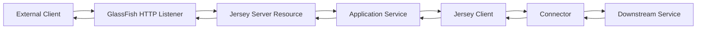
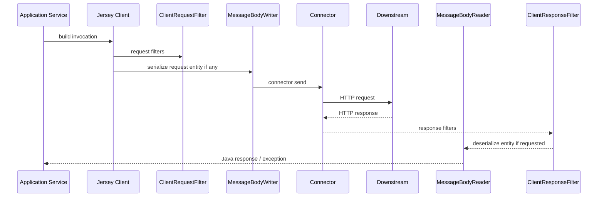
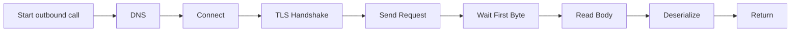
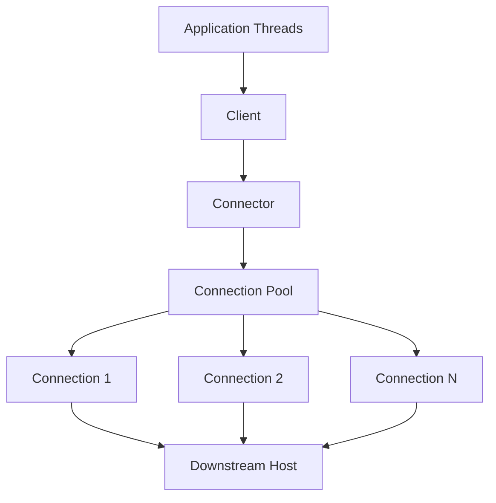
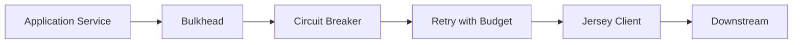
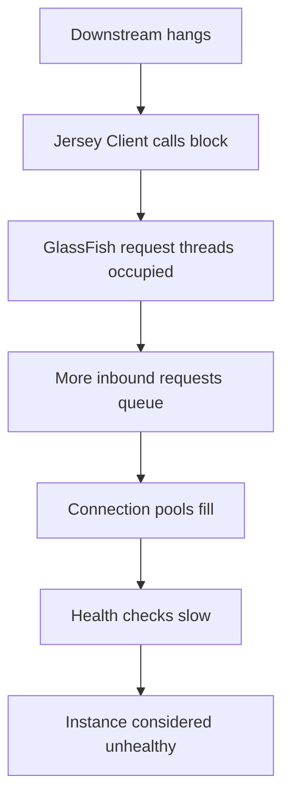

# Part 010 — Jersey Client Deep Dive: Connectors, Pooling, Timeout, Retry

## 1. Tujuan Part Ini

Part ini membahas **Jersey Client** sebagai runtime subsystem untuk outbound HTTP call. Banyak engineer memakai Jersey Client seperti wrapper sederhana:

```java
String body = ClientBuilder.newClient()
    .target("https://example.com/api")
    .request()
    .get(String.class);
```

Kode ini bisa berjalan di development, tetapi berbahaya di production jika tidak memahami:

- lifecycle `Client`,
- connection reuse,
- connector implementation,
- timeout,
- response closing,
- thread/executor behavior,
- retry semantics,
- status/error decoding,
- observability,
- outbound security,
- resource cleanup saat application undeploy.

Mental model part ini:

> **Jersey Client bukan helper method. Ia adalah outbound network runtime yang memegang connection, provider, filter, executor, TLS configuration, dan failure semantics.**

Setelah part ini, targetnya kamu mampu:

- memilih dan mengonfigurasi `Client` secara production-ready,
- membedakan `Client`, `WebTarget`, `Invocation.Builder`, dan `Response`,
- mengatur timeout dengan benar,
- memahami connector dan pooling,
- menutup response/client pada boundary yang benar,
- merancang retry hanya untuk operasi aman,
- membuat outbound error decoder,
- meneruskan correlation ID,
- mencegah thread starvation di GlassFish,
- menulis test failure mode untuk downstream call.

---

## 2. Posisi Jersey Client dalam Aplikasi GlassFish

Jersey server menerima inbound request. Jersey Client sering dipakai untuk outbound call ke service lain.



Outbound call mempengaruhi inbound latency. Jika downstream lambat, GlassFish request thread bisa tertahan. Jika timeout tidak ada, satu dependency bisa menghabiskan thread pool dan connection pool.

Karena itu Jersey Client harus diperlakukan sebagai bagian dari architecture, bukan utility kecil.

---

## 3. Core Object Model

### 3.1 Client

`Client` adalah root object.

Tanggung jawab:

- menyimpan configuration,
- menyimpan registered provider/filter/interceptor,
- mengelola connector,
- mengelola resource seperti connection pool/executor tergantung connector,
- membuat `WebTarget`.

Production rule:

> Buat `Client` sebagai long-lived object per downstream profile, bukan per request.

Buruk:

```java
public CaseDto getCase(String id) {
    Client client = ClientBuilder.newClient();
    return client.target(baseUrl).path("cases/{id}").resolveTemplate("id", id)
        .request(APPLICATION_JSON_TYPE)
        .get(CaseDto.class);
}
```

Masalah:

- membuat runtime/connector berulang,
- pooling tidak efektif,
- resource leak jika tidak close,
- overhead tinggi,
- sulit observability.

Lebih baik:

```java
@ApplicationScoped
public class CaseRegistryClient {
    private Client client;
    private WebTarget root;

    @PostConstruct
    void init() {
        this.client = ClientBuilder.newClient(clientConfig());
        this.root = client.target("https://case-registry.internal/api");
    }

    @PreDestroy
    void close() {
        if (client != null) {
            client.close();
        }
    }

    public CaseDto getCase(String id) {
        return root.path("cases/{id}")
            .resolveTemplate("id", id)
            .request(MediaType.APPLICATION_JSON_TYPE)
            .get(CaseDto.class);
    }
}
```

### 3.2 WebTarget

`WebTarget` merepresentasikan URI target.

Karakter:

- dibuat dari `Client`,
- bisa menambahkan path/query/template,
- bisa membawa configuration turunan,
- aman dipakai sebagai immutable-ish target pattern.

Contoh:

```java
WebTarget cases = root.path("cases");
WebTarget oneCase = cases.path("{id}").resolveTemplate("id", id);
```

Jangan membuat URI dengan string concat manual:

```java
client.target(baseUrl + "/cases/" + id); // raw concat risk
```

Lebih aman pakai template:

```java
root.path("cases/{id}").resolveTemplate("id", id);
```

### 3.3 Invocation.Builder

`Invocation.Builder` merepresentasikan request yang akan dikirim.

Contoh:

```java
Response response = root.path("cases/{id}")
    .resolveTemplate("id", id)
    .request(MediaType.APPLICATION_JSON_TYPE)
    .header("X-Correlation-ID", correlation.id())
    .get();
```

Builder adalah tempat menaruh:

- `Accept`,
- header,
- request property,
- cookie,
- method invocation.

### 3.4 Response

`Response` adalah resource yang harus dibaca atau ditutup.

Jika memanggil:

```java
CaseDto dto = target.request().get(CaseDto.class);
```

runtime membaca entity dan menutup connection sesuai connector behavior.

Jika memanggil:

```java
Response response = target.request().get();
```

kamu bertanggung jawab membaca entity atau menutup response.

Production rule:

```java
try (Response response = target.request().get()) {
    // inspect status
    // read entity
}
```

---

## 4. Request Lifecycle Jersey Client



Failure bisa muncul pada setiap tahap:

| Stage | Failure |
|---|---|
| URI construction | invalid URI/template |
| request filter | auth/correlation bug |
| serialization | no writer, JSON error |
| connector connect | DNS/connect/TLS failure |
| downstream | 4xx/5xx |
| response filter | invalid filter logic |
| deserialization | no reader, JSON mismatch |
| response lifecycle | connection leak |

---

## 5. Connector Architecture

Jersey Client memakai connector untuk transport HTTP.

Jersey menyediakan connector berbeda, misalnya:

- default `HttpUrlConnection`-based connector,
- Apache HTTP Client connector,
- Apache HttpClient 5 connector,
- Jetty connector,
- Jetty HTTP/2 connector,
- Grizzly connector,
- Netty connector,
- JDK connector.

Connector menentukan banyak hal:

- connection pooling,
- TLS behavior,
- HTTP/2 support,
- proxy support,
- timeout semantics,
- authentication feature compatibility,
- streaming behavior,
- event loop/thread behavior.

Jangan memilih connector hanya karena “jalan”. Pilih berdasarkan kebutuhan runtime.

---

## 6. Default Connector: Cocok untuk Sederhana, Terbatas untuk Tuning

Default connector berbasis `HttpURLConnection` cukup untuk use case sederhana.

Kelebihan:

- dependency minimal,
- mudah dipakai,
- cukup untuk low-volume call,
- cocok untuk prototyping.

Keterbatasan:

- tuning pooling lebih terbatas,
- observability/tuning advanced lebih sulit,
- behavior berbeda dengan connector lain,
- tidak selalu ideal untuk high-throughput service-to-service traffic.

Untuk sistem enterprise dengan banyak outbound call, biasanya lebih baik memakai connector yang eksplisit dan bisa dikonfigurasi, misalnya Apache 5 connector atau connector lain sesuai standard platform.

---

## 7. Apache 5 Connector Example

Dependency contoh Maven:

```xml
<dependency>
  <groupId>org.glassfish.jersey.connectors</groupId>
  <artifactId>jersey-apache5-connector</artifactId>
  <version>${jersey.version}</version>
</dependency>
```

Configuration dasar:

```java
import org.glassfish.jersey.apache5.connector.Apache5ConnectorProvider;
import org.glassfish.jersey.client.ClientConfig;
import org.glassfish.jersey.client.ClientProperties;

ClientConfig config = new ClientConfig()
    .connectorProvider(new Apache5ConnectorProvider())
    .property(ClientProperties.CONNECT_TIMEOUT, 1_000)
    .property(ClientProperties.READ_TIMEOUT, 3_000)
    .register(CorrelationClientFilter.class)
    .register(JsonFeature.class);

Client client = ClientBuilder.newClient(config);
```

Catatan:

- property timeout Jersey diteruskan sesuai support connector,
- connector-specific pooling biasanya butuh configurator/supplier connector terkait,
- pastikan versi connector sama dengan versi Jersey core,
- jangan mix Jersey 3.x connector dengan Jersey 4.x core.

---

## 8. Timeout Taxonomy

Timeout bukan satu angka.



Jenis timeout:

| Timeout | Arti |
|---|---|
| connect timeout | batas waktu membangun koneksi TCP/TLS |
| read/socket timeout | batas waktu menunggu data response |
| request timeout | total budget untuk satu request, jika disediakan oleh connector/resilience layer |
| pool acquisition timeout | batas menunggu connection dari pool |
| application deadline | total waktu yang boleh dipakai berdasarkan inbound SLA |

Jersey `ClientProperties.CONNECT_TIMEOUT` dan `ClientProperties.READ_TIMEOUT` adalah baseline minimal.

```java
ClientConfig config = new ClientConfig()
    .property(ClientProperties.CONNECT_TIMEOUT, 1_000)
    .property(ClientProperties.READ_TIMEOUT, 2_000);
```

Rule:

> Setiap outbound HTTP call wajib punya timeout eksplisit.

Tanpa timeout, request thread GlassFish bisa tertahan terlalu lama saat downstream bermasalah.

---

## 9. Timeout Budget dari Inbound SLA

Jangan menentukan timeout outbound secara acak.

Misal endpoint publik punya SLA internal 800 ms p95.

Budget kasar:

| Component | Budget |
|---|---:|
| auth/filter overhead | 30 ms |
| DB read | 120 ms |
| downstream A | 200 ms |
| downstream B | 150 ms |
| serialization | 30 ms |
| safety margin | 270 ms |

Jika downstream A diberi read timeout 10 detik, endpoint tidak akan memenuhi SLA.

Pattern:

```text
inbound deadline > internal processing + outbound timeout + retry budget + safety margin
```

Jika memakai retry, total retry time harus masuk budget.

Buruk:

```text
read timeout = 3s
retry = 3 attempts
inbound SLA = 1s
```

Secara matematis tidak mungkin.

---

## 10. Connection Pooling Mental Model

Connection pooling menghindari pembuatan koneksi baru untuk setiap request.



Pool harus dibatasi.

Jika pool terlalu kecil:

- request menunggu connection,
- latency naik,
- timeout pool acquisition.

Jika pool terlalu besar:

- downstream overload,
- local socket exhaustion,
- memory/thread overhead,
- fairness buruk.

Pool sizing harus mempertimbangkan:

- QPS,
- latency downstream,
- concurrency target,
- timeout,
- retry,
- downstream capacity,
- number of GlassFish instances.

Rumus kasar Little's Law:

```text
concurrency ~= throughput_per_second * latency_seconds
```

Jika service melakukan 200 req/s ke downstream dengan latency 100 ms:

```text
concurrency ~= 200 * 0.1 = 20
```

Pool max 20-40 mungkin cukup, tergantung burst dan retry. Pool 500 mungkin justru menyerang downstream saat incident.

---

## 11. Client per Downstream Profile

Jangan membuat satu global client untuk semua downstream jika kebutuhan berbeda.

Contoh profile:

| Downstream | Timeout | Pool | Auth | Retry |
|---|---:|---:|---|---|
| case-registry | 1s/3s | 50 | mTLS | GET retry |
| document-store | 1s/10s | 20 | bearer | no retry upload |
| notification | 500ms/1s | 10 | API key | retry async |

Pattern:

```java
@ApplicationScoped
public class OutboundClients {
    private Client caseRegistry;
    private Client documentStore;

    @PostConstruct
    void init() {
        caseRegistry = ClientBuilder.newClient(caseRegistryConfig());
        documentStore = ClientBuilder.newClient(documentStoreConfig());
    }

    @PreDestroy
    void close() {
        caseRegistry.close();
        documentStore.close();
    }
}
```

Satu client per downstream profile membuat:

- config eksplisit,
- metric terpisah,
- pool isolasi,
- timeout sesuai kebutuhan,
- failure containment lebih baik.

---

## 12. Response Handling: Read or Close

Jersey documentation menekankan connection akan tertutup setelah entity diproses/dibaca. Jika kamu mengambil `Response` mentah dan tidak membaca entity, tutup response manual.

Buruk:

```java
Response response = target.request().get();
if (response.getStatus() == 404) {
    return Optional.empty();
}
return Optional.of(response.readEntity(CaseDto.class));
```

Pada path 404, response tidak ditutup.

Lebih baik:

```java
try (Response response = target.request().get()) {
    if (response.getStatus() == 404) {
        return Optional.empty();
    }
    if (response.getStatusInfo().getFamily() != Response.Status.Family.SUCCESSFUL) {
        throw decodeError(response);
    }
    return Optional.of(response.readEntity(CaseDto.class));
}
```

Jika membaca stream:

```java
try (Response response = target.request().get()) {
    try (InputStream in = response.readEntity(InputStream.class)) {
        return process(in);
    }
}
```

Jangan membiarkan `InputStream` terbuka melewati boundary tanpa ownership jelas.

---

## 13. Status Handling: Typed Entity vs Raw Response

Shortcut:

```java
CaseDto dto = target.request(APPLICATION_JSON_TYPE).get(CaseDto.class);
```

Cocok jika:

- hanya expected 2xx,
- non-2xx boleh menjadi exception,
- error body tidak perlu dibaca custom.

Raw response:

```java
try (Response response = target.request(APPLICATION_JSON_TYPE).get()) {
    int status = response.getStatus();
    if (status == 404) return Optional.empty();
    if (status >= 400) throw decodeError(response);
    return Optional.of(response.readEntity(CaseDto.class));
}
```

Cocok jika:

- perlu mapping 404 ke Optional,
- perlu baca error contract downstream,
- perlu retry logic berdasar status/header,
- perlu metric detail.

Production service-to-service client biasanya lebih baik memakai raw `Response` di adapter layer, lalu mengembalikan domain-specific result/exception ke application service.

---

## 14. Outbound Error Decoder

Buat decoder khusus per downstream.

```java
public final class DownstreamException extends RuntimeException {
    private final String downstream;
    private final int status;
    private final String code;

    public DownstreamException(String downstream, int status, String code, String message) {
        super(message);
        this.downstream = downstream;
        this.status = status;
        this.code = code;
    }

    public String downstream() { return downstream; }
    public int status() { return status; }
    public String code() { return code; }
}
```

Decoder:

```java
private RuntimeException decodeError(Response response) {
    int status = response.getStatus();

    DownstreamError body = null;
    if (response.hasEntity()) {
        try {
            body = response.readEntity(DownstreamError.class);
        } catch (RuntimeException ignored) {
            // do not let error decoding failure hide original status
        }
    }

    String code = body == null ? "DOWNSTREAM_HTTP_" + status : body.code();

    return new DownstreamException(
        "case-registry",
        status,
        code,
        "Case registry returned HTTP " + status
    );
}
```

Prinsip:

- jangan expose raw downstream error langsung ke public API,
- map ke internal domain/infrastructure exception,
- simpan downstream status/code untuk log/metric,
- jangan parsing error body membuat error baru yang menutupi status asli.

---

## 15. Retry Semantics

Retry adalah amplifier. Ia bisa membantu transient failure, tetapi bisa memperburuk outage.

Retry aman jika:

- operation idempotent,
- failure transient,
- timeout pendek,
- ada backoff/jitter,
- ada total budget,
- ada max attempts kecil,
- ada observability.

Retry berbahaya jika:

- POST menciptakan side effect tanpa idempotency key,
- downstream sudah overload,
- retry terjadi di banyak layer sekaligus,
- timeout terlalu panjang,
- tidak ada circuit breaker/bulkhead,
- semua instance retry bersamaan.

### 15.1 Status yang Biasanya Layak Dipertimbangkan Retry

| Status/Failure | Retry? | Catatan |
|---|---|---|
| DNS failure | maybe | tergantung environment |
| connect timeout | yes with budget | transient network |
| read timeout | maybe | hati-hati side effect |
| 408 | maybe | client/server timeout |
| 429 | yes if `Retry-After`/policy | pakai backoff |
| 500 | maybe | hanya jika known transient |
| 502/503/504 | yes with backoff | dependency/gateway issue |
| 400/401/403/404/409/422 | usually no | request/domain/auth issue |

### 15.2 Idempotency Key untuk Mutasi

Untuk POST yang bisa di-retry, gunakan idempotency key.

```java
Response response = target.path("payments")
    .request(APPLICATION_JSON_TYPE)
    .header("Idempotency-Key", command.idempotencyKey())
    .post(Entity.json(command));
```

Tanpa idempotency key, retry bisa membuat duplicate side effect.

---

## 16. Retry Wrapper Pattern

Jangan menaruh retry acak di setiap call.

```java
public <T> T executeWithRetry(String operation, Supplier<T> call) {
    int maxAttempts = 3;
    RuntimeException last = null;

    for (int attempt = 1; attempt <= maxAttempts; attempt++) {
        try {
            return call.get();
        } catch (DownstreamException e) {
            if (!isRetryable(e) || attempt == maxAttempts) throw e;
            last = e;
            sleep(backoffMillis(attempt));
        } catch (ProcessingException e) {
            if (attempt == maxAttempts) throw e;
            last = e;
            sleep(backoffMillis(attempt));
        }
    }

    throw last;
}
```

Ini contoh konseptual. Dalam production, gunakan scheduler/resilience library/platform standard bila tersedia agar:

- cancellation benar,
- backoff tidak memblokir thread sembarangan,
- metrics konsisten,
- circuit breaker terintegrasi.

Jangan `Thread.sleep` di request thread untuk retry panjang.

---

## 17. Circuit Breaker dan Bulkhead

Jersey Client tidak otomatis memberi circuit breaker. Itu biasanya responsibility layer di atas client.



Bulkhead membatasi concurrency ke dependency.

Circuit breaker menghentikan sementara call saat failure rate tinggi.

Retry mencoba transient failure dengan batas.

Timeout membatasi satu attempt.

Urutan umum:

1. cek circuit breaker,
2. acquire bulkhead permit,
3. execute attempt with timeout,
4. retry jika aman dan budget cukup,
5. release permit,
6. record metrics.

Anti-pattern:

```text
infinite retry + no timeout + no bulkhead + request thread
```

Ini resep cascading failure.

---

## 18. Client Filters untuk Cross-Cutting Concern

Client request filter:

```java
@Provider
public class CorrelationClientFilter implements ClientRequestFilter {
    @Inject RequestCorrelation correlation;

    @Override
    public void filter(ClientRequestContext requestContext) {
        requestContext.getHeaders().putSingle("X-Correlation-ID", correlation.id());
    }
}
```

Client response filter:

```java
@Provider
public class DownstreamTimingFilter implements ClientRequestFilter, ClientResponseFilter {
    private static final String START = "startNanos";

    @Override
    public void filter(ClientRequestContext requestContext) {
        requestContext.setProperty(START, System.nanoTime());
    }

    @Override
    public void filter(ClientRequestContext requestContext, ClientResponseContext responseContext) {
        long start = (long) requestContext.getProperty(START);
        long elapsedMicros = (System.nanoTime() - start) / 1_000;
        // record metric with downstream name, method, route template, status
    }
}
```

Gunakan filter untuk:

- correlation ID,
- auth header,
- metrics,
- safe request metadata,
- client-side audit context.

Jangan gunakan filter untuk:

- business branching,
- retry kompleks,
- parsing semua response body,
- mengubah payload domain tanpa terlihat.

---

## 19. Provider Reuse di Client

Jersey Client memakai provider untuk request/response entity seperti server.

Contoh:

```java
ClientConfig config = new ClientConfig()
    .register(MyJsonFeature.class)
    .register(CorrelationClientFilter.class)
    .register(DownstreamErrorReader.class);
```

Provider issue umum:

- server memakai JSON-B, client memakai Jackson dengan behavior berbeda,
- date/time format tidak sama,
- unknown property handling berbeda,
- enum serialization berbeda,
- error DTO downstream berubah tapi client decoder terlalu ketat.

Production rule:

> Contract test outbound DTO sama pentingnya dengan test inbound resource.

---

## 20. TLS dan Trust Model

Jersey Client dapat dikonfigurasi dengan SSL context/truststore.

```java
SSLContext sslContext = buildSslContext();

Client client = ClientBuilder.newBuilder()
    .sslContext(sslContext)
    .build();
```

Untuk mTLS, kamu perlu:

- truststore untuk mempercayai server/downstream,
- keystore untuk client certificate,
- certificate rotation process,
- hostname verification,
- environment-specific secret management.

Jangan disable hostname verification di production hanya karena certificate error.

Buruk:

```java
.hostnameVerifier((host, session) -> true)
```

Ini menghancurkan keamanan TLS.

Jika local/dev butuh bypass, isolasi dengan profile dev dan guard keras agar tidak masuk production.

---

## 21. Authentication Pattern

Outbound auth bisa berupa:

- bearer token,
- client credentials token,
- API key,
- mTLS,
- basic/digest untuk legacy,
- signed request.

Token filter:

```java
@Provider
public class BearerTokenClientFilter implements ClientRequestFilter {
    @Inject TokenProvider tokenProvider;

    @Override
    public void filter(ClientRequestContext requestContext) {
        requestContext.getHeaders().putSingle(
            HttpHeaders.AUTHORIZATION,
            "Bearer " + tokenProvider.currentToken()
        );
    }
}
```

Rules:

- token provider harus cache token dengan expiry,
- refresh harus thread-safe,
- jangan refresh token untuk setiap request,
- jangan log token,
- 401 retry token refresh harus bounded,
- jangan recursive call memakai client yang filter-nya butuh token yang sedang diambil.

---

## 22. Async Client

JAX-RS Client punya async invocation model.

```java
Future<Response> future = target.request().async().get();
```

Atau callback:

```java
target.request().async().get(new InvocationCallback<CaseDto>() {
    @Override
    public void completed(CaseDto response) {
        // success
    }

    @Override
    public void failed(Throwable throwable) {
        // failure
    }
});
```

Async bukan otomatis lebih cepat. Ia hanya memindahkan waiting dari current thread ke executor/event model.

Pertanyaan sebelum memakai async:

1. siapa executor-nya,
2. bagaimana timeout/cancel,
3. bagaimana context propagation,
4. bagaimana backpressure,
5. bagaimana error dikembalikan ke request lifecycle,
6. apakah GlassFish/Jakarta Concurrency harus digunakan.

Dalam Jakarta EE environment, gunakan managed executor jika perlu agar thread lifecycle sesuai container.

---

## 23. Thread Starvation Failure Model

Tanpa timeout dan bulkhead:



Mitigasi:

- timeout eksplisit,
- pool limit,
- bulkhead per downstream,
- circuit breaker,
- fast failure,
- fallback bila valid,
- queue limit,
- monitoring request thread pool.

Jika satu downstream bisa menghabiskan semua request thread, boundary kamu belum aman.

---

## 24. GlassFish Lifecycle Integration

Di GlassFish/Jakarta EE, long-lived client harus ditutup saat application undeploy/redeploy.

```java
@ApplicationScoped
public class DownstreamClientLifecycle {
    private Client client;

    @PostConstruct
    void start() {
        client = ClientBuilder.newClient(config());
    }

    @PreDestroy
    void stop() {
        if (client != null) {
            client.close();
        }
    }
}
```

Tanpa close:

- connection pool bisa leak,
- executor thread bisa tersisa,
- redeploy bisa menyisakan classloader reference,
- GlassFish memory leak warning bisa muncul,
- file/socket resource tidak dilepas.

Redeploy test penting untuk aplikasi yang sering dipromote/rolling update.

---

## 25. Configuration as Code

Jangan hardcode downstream base URL dan timeout di class.

Buruk:

```java
client.target("http://10.0.12.9:8080/api");
```

Lebih baik:

```java
@ApplicationScoped
public class CaseRegistryConfig {
    public URI baseUri() { ... }
    public int connectTimeoutMillis() { ... }
    public int readTimeoutMillis() { ... }
    public int maxConnections() { ... }
}
```

Sumber config bisa:

- environment variables,
- MicroProfile Config jika tersedia di runtime/platform,
- GlassFish system properties,
- deployment descriptor/resource config,
- config service dengan caching.

Principle:

- config per environment,
- default aman,
- startup validation,
- no secret in logs,
- fail fast jika required config hilang.

---

## 26. Observability untuk Outbound Calls

Minimal telemetry per call:

| Field | Contoh |
|---|---|
| downstream | `case-registry` |
| operation | `getCase` |
| method | `GET` |
| route/template | `/cases/{id}` |
| status | `200`, `404`, `503` |
| duration | ms |
| outcome | success/error/timeout |
| correlationId | request correlation |
| attempt | retry attempt |

Metric:

```text
outbound_http_client_duration_seconds{downstream="case-registry",operation="getCase",status="200"}
outbound_http_client_errors_total{downstream="case-registry",code="TIMEOUT"}
outbound_http_client_inflight{downstream="case-registry"}
```

Hindari label:

- raw URL dengan ID,
- query string penuh,
- token,
- user ID,
- request body,
- exception message.

---

## 27. Safe Logging

Log outbound error dengan konteks, bukan payload sensitif.

```java
log.warn(
    "Downstream call failed. downstream={} operation={} status={} correlationId={}",
    "case-registry",
    "getCase",
    response.getStatus(),
    correlation.id()
);
```

Untuk timeout:

```java
log.warn(
    "Downstream timeout. downstream={} operation={} connectTimeoutMs={} readTimeoutMs={} correlationId={}",
    "case-registry",
    "getCase",
    connectTimeoutMs,
    readTimeoutMs,
    correlation.id(),
    exception
);
```

Jangan log full URI jika mengandung PII/query sensitive. Log route template.

---

## 28. Mapping Downstream Failure ke Public API Error

Outbound failure jangan langsung dibocorkan ke client publik.

Contoh internal:

```java
throw new DownstreamException("case-registry", 503, "REGISTRY_UNAVAILABLE", "...");
```

Public API mapper:

```java
@Provider
public class DownstreamExceptionMapper implements ExceptionMapper<DownstreamException> {
    @Inject ErrorResponseFactory errors;

    @Override
    public Response toResponse(DownstreamException exception) {
        return errors.response(
            Response.Status.SERVICE_UNAVAILABLE,
            "DEPENDENCY_UNAVAILABLE",
            "Dependency unavailable",
            "A required dependency is temporarily unavailable."
        );
    }
}
```

Why:

- public client tidak perlu tahu nama internal service,
- topology internal tidak bocor,
- error code tetap stabil walau dependency berubah,
- support tetap bisa mencari via log correlation ID.

---

## 29. Anti-Patterns

### 29.1 Client per Request

```java
ClientBuilder.newClient().target(...).request().get();
```

Dampak:

- pooling rusak,
- resource leak,
- overhead tinggi,
- lifecycle tidak jelas.

### 29.2 No Timeout

```java
Client client = ClientBuilder.newClient();
```

Jika tidak ada timeout eksplisit, satu downstream hang bisa menahan request thread terlalu lama.

### 29.3 Response Tidak Ditutup

```java
Response r = target.request().get();
if (r.getStatus() == 404) return Optional.empty();
```

Connection bisa tertahan karena entity tidak dibaca/tidak ditutup.

### 29.4 Retry Semua Status

```java
retry(() -> target.request().post(Entity.json(command)));
```

Tanpa idempotency, ini bisa membuat duplicate side effect.

### 29.5 Raw Downstream Error Diteruskan ke Public Client

```java
return Response.status(response.getStatus()).entity(response.readEntity(String.class)).build();
```

Ini membocorkan kontrak internal dan membuat public API tergantung downstream.

### 29.6 Satu Pool untuk Semua Dependency

Dependency lambat bisa menghabiskan semua connection/client resources. Pisahkan profile penting.

### 29.7 Disable TLS Verification

```java
hostnameVerifier((host, session) -> true)
```

Tidak boleh untuk production.

---

## 30. Testing Failure Modes

Test bukan hanya happy path.

| Scenario | Expected |
|---|---|
| Downstream 200 | DTO returned |
| Downstream 404 | Optional empty/domain not found sesuai policy |
| Downstream 400 | decoded as downstream client error |
| Downstream 500 | mapped to dependency failure |
| Downstream 503 | retry if configured, then failure |
| Connect timeout | bounded failure time |
| Read timeout | bounded failure time |
| Invalid JSON response | response closed, decoder error mapped |
| Large response | no memory spike |
| Slow response | read timeout works |
| Client close | no resource leak on undeploy |

Untuk integration test, gunakan stub server/mock HTTP server yang bisa:

- delay response,
- return status tertentu,
- return malformed JSON,
- close connection abruptly,
- return large body.

---

## 31. Example: Production-Style Client Adapter

```java
@ApplicationScoped
public class CaseRegistryGateway {
    private Client client;
    private WebTarget cases;

    @Inject RequestCorrelation correlation;
    @Inject CaseRegistrySettings settings;

    @PostConstruct
    void init() {
        ClientConfig config = new ClientConfig()
            .property(ClientProperties.CONNECT_TIMEOUT, settings.connectTimeoutMillis())
            .property(ClientProperties.READ_TIMEOUT, settings.readTimeoutMillis())
            .register(CorrelationClientFilter.class)
            .register(BearerTokenClientFilter.class);

        this.client = ClientBuilder.newClient(config);
        this.cases = client.target(settings.baseUri()).path("cases");
    }

    @PreDestroy
    void close() {
        if (client != null) {
            client.close();
        }
    }

    public Optional<ExternalCaseDto> findCase(String id) {
        WebTarget target = cases.path("{id}").resolveTemplate("id", id);

        try (Response response = target.request(MediaType.APPLICATION_JSON_TYPE)
            .header("X-Correlation-ID", correlation.id())
            .get()) {

            if (response.getStatus() == 404) {
                return Optional.empty();
            }

            if (response.getStatusInfo().getFamily() != Response.Status.Family.SUCCESSFUL) {
                throw decode(response);
            }

            return Optional.of(response.readEntity(ExternalCaseDto.class));
        } catch (ProcessingException e) {
            throw new DownstreamCommunicationException(
                "case-registry",
                "CASE_REGISTRY_COMMUNICATION_FAILED",
                e
            );
        }
    }

    private RuntimeException decode(Response response) {
        int status = response.getStatus();
        DownstreamError error = tryReadError(response);
        String code = error == null ? "HTTP_" + status : error.code();
        return new DownstreamException("case-registry", status, code, "Case registry failed");
    }

    private DownstreamError tryReadError(Response response) {
        if (!response.hasEntity()) return null;
        try {
            return response.readEntity(DownstreamError.class);
        } catch (RuntimeException ignored) {
            return null;
        }
    }
}
```

Important properties:

- client long-lived,
- response closed via try-with-resources,
- timeout configured,
- raw downstream response decoded inside gateway,
- correlation propagated,
- transport exception mapped,
- public API layer tidak tahu detail Jersey Client.

---

## 32. Decision Matrix: Typed Call vs Gateway Adapter

| Use Case | Recommended |
|---|---|
| internal simple test | direct typed call acceptable |
| production service-to-service | gateway adapter |
| need custom 404 handling | raw `Response` |
| need downstream error body | raw `Response` |
| fire-and-forget async | queue/event preferred over direct HTTP if durable needed |
| large download | stream with explicit close/limit |
| mutation with retry | idempotency key required |

---

## 33. Production Checklist

### Client Lifecycle

- [ ] `Client` dibuat long-lived per downstream profile.
- [ ] `Client` ditutup saat `@PreDestroy`.
- [ ] Tidak ada `ClientBuilder.newClient()` di hot path per request.
- [ ] `WebTarget` root disimpan untuk base URI.

### Timeout and Pool

- [ ] Connect timeout eksplisit.
- [ ] Read timeout eksplisit.
- [ ] Total retry budget sesuai inbound SLA.
- [ ] Pool size dibatasi.
- [ ] Bulkhead/circuit breaker dipertimbangkan untuk dependency critical.

### Response Handling

- [ ] Raw `Response` selalu try-with-resources.
- [ ] Entity dibaca atau response ditutup.
- [ ] InputStream entity punya ownership jelas.
- [ ] Error decoding tidak menutupi status asli.

### Retry

- [ ] Retry hanya untuk failure retryable.
- [ ] Mutasi punya idempotency key jika retry.
- [ ] Backoff/jitter tersedia.
- [ ] Max attempts kecil.
- [ ] Retry metrics tersedia.

### Security

- [ ] TLS verification tidak dimatikan di production.
- [ ] Token tidak dilog.
- [ ] Truststore/keystore dikelola per environment.
- [ ] Auth filter thread-safe.

### Observability

- [ ] Correlation ID diteruskan.
- [ ] Metrics outbound per downstream/operation/status.
- [ ] Raw URL/query tidak menjadi label metric.
- [ ] Timeout dan pool exhaustion terlihat di log/metric.

### Deployment

- [ ] Jersey connector version selaras dengan Jersey core.
- [ ] Tidak ada mix `javax`/`jakarta` dependency.
- [ ] GlassFish redeploy tidak meninggalkan thread/socket leak.
- [ ] Config base URL dan timeout tervalidasi saat startup.

---

## 34. Deliberate Practice

### Exercise 1 — Long-Lived Client

Buat `@ApplicationScoped` gateway dengan:

- `@PostConstruct` create client,
- `@PreDestroy` close client,
- base `WebTarget`,
- connect/read timeout.

Buktikan tidak ada `newClient()` di method request.

### Exercise 2 — Response Leak Test

Buat stub endpoint yang return 404 dengan body besar. Pastikan gateway menutup response pada path 404.

### Exercise 3 — Timeout Test

Buat stub endpoint delay 5 detik. Set read timeout 500 ms. Pastikan call gagal dalam budget yang masuk akal.

### Exercise 4 — Error Decoder

Downstream return:

```json
{
  "code": "CASE_LOCKED",
  "message": "case is locked"
}
```

Gateway harus mengubahnya menjadi `DownstreamException` tanpa membocorkan body mentah ke public API.

### Exercise 5 — Retry Idempotency

Implement retry untuk `GET /cases/{id}`. Lalu jelaskan kenapa retry yang sama tidak boleh langsung diterapkan ke `POST /cases/{id}/approve` tanpa idempotency key.

### Exercise 6 — Correlation Propagation

Pastikan inbound `X-Correlation-ID` muncul di outbound request ke stub server.

---

## 35. Summary

Jersey Client adalah outbound runtime subsystem.

Mental model yang harus dipegang:

1. `Client` adalah long-lived resource, bukan object per call,
2. `WebTarget` merepresentasikan URI target dan bisa dikonfigurasi turunannya,
3. raw `Response` harus dibaca atau ditutup,
4. connector menentukan transport, pooling, TLS, dan tuning behavior,
5. timeout harus eksplisit dan berdasarkan inbound SLA,
6. pooling harus dibatasi dan dipisah per downstream profile,
7. retry hanya aman dengan idempotency, budget, backoff, dan observability,
8. downstream error harus didekode di adapter layer, bukan dibocorkan ke public API,
9. correlation ID harus diteruskan,
10. async call butuh executor, cancellation, dan context propagation yang jelas,
11. GlassFish redeploy membutuhkan client cleanup,
12. service-to-service HTTP bisa menjadi sumber cascading failure jika tidak dibatasi.

Part berikutnya membahas **Streaming, Large Payloads, Chunked Output, dan SSE**: bagaimana Jersey menangani response besar, stream lifecycle, slow client, memory safety, dan timeout di sisi server.

## References

- Jakarta RESTful Web Services 4.0 Specification: https://jakarta.ee/specifications/restful-ws/4.0/jakarta-restful-ws-spec-4.0
- Eclipse Jersey Client Documentation: https://eclipse-ee4j.github.io/jersey.github.io/documentation/latest/client.html
- Eclipse Jersey Documentation: https://eclipse-ee4j.github.io/jersey.github.io/documentation/latest/
- Eclipse Jersey Project: https://projects.eclipse.org/projects/ee4j.jersey
