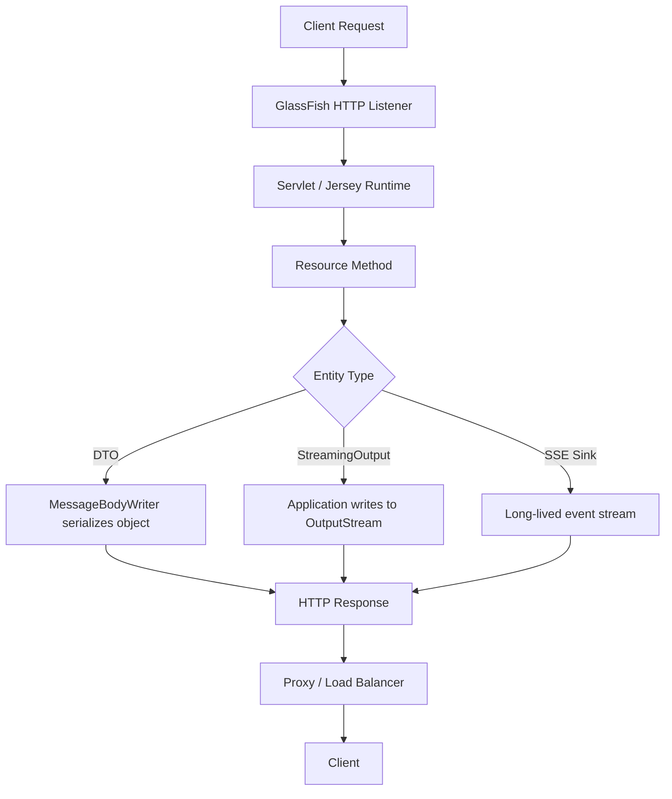
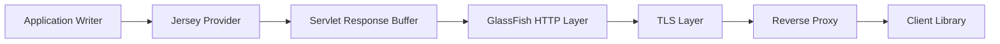
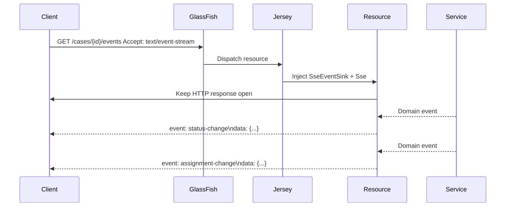
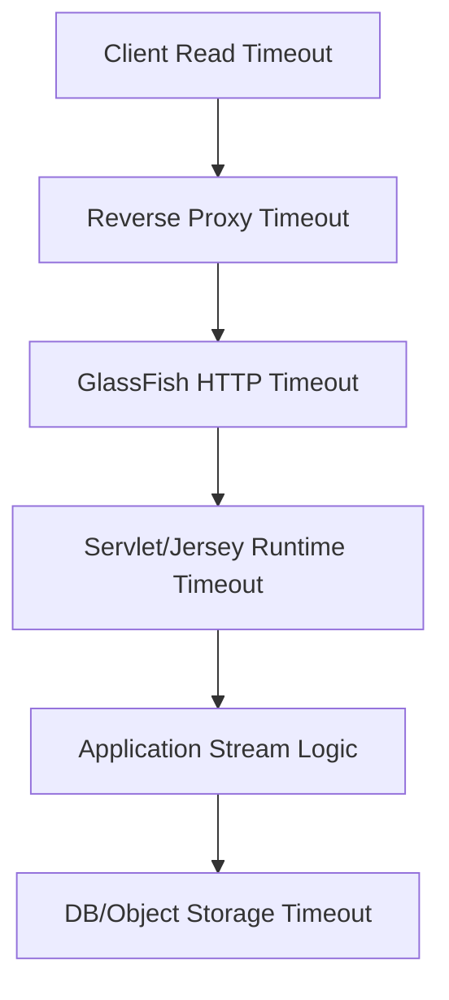

# Part 011 — Streaming, Large Payloads, Chunked Output, SSE

> Goal: memahami bagaimana Jersey menangani response/request besar, streaming, file download, dan Server-Sent Events tanpa merusak memory, thread pool, timeout budget, observability, atau reliability production.

Bagian ini bukan pengulangan dasar `@GET`, `@POST`, `@Produces`, atau `@Consumes`. Kita fokus pada **runtime behavior**: kapan entity di-buffer, kapan data benar-benar mengalir, siapa yang memegang thread, bagaimana connection bertahan hidup, dan failure seperti slow client, proxy timeout, partial write, atau memory blow-up.

Dalam sistem production, endpoint streaming sering terlihat sederhana:

```java
@GET
@Path("/export")
public StreamingOutput export() {
    return out -> service.writeCsv(out);
}
```

Tetapi mental model yang salah dapat membuat endpoint ini menjadi sumber incident:

- heap penuh karena payload di-buffer sebelum dikirim;
- thread request tertahan terlalu lama;
- connection pool database habis karena export lambat;
- load balancer memutus koneksi sebelum response selesai;
- client disconnect tidak terdeteksi dengan benar;
- audit log menulis `200 OK` padahal transfer gagal di tengah;
- SSE connection ribuan jumlahnya tetapi server tetap diperlakukan seperti endpoint request/response biasa.

Kita akan membangun mental model dari bawah ke atas.

---

## 1. Kaufman Deconstruction

Menurut pendekatan Josh Kaufman, skill besar harus dipecah menjadi sub-skill kecil yang bisa dilatih. Untuk streaming Jersey/GlassFish, sub-skill-nya bukan “tahu API”, tetapi bisa menjawab pertanyaan runtime berikut:

| Sub-skill | Pertanyaan yang harus bisa dijawab |
|---|---|
| Entity lifecycle | Kapan entity dihasilkan, di-buffer, ditulis, dan ditutup? |
| Memory boundary | Apakah payload hidup di heap, file, stream, DB cursor, atau socket? |
| Thread boundary | Thread mana yang menulis response? Apakah request thread tertahan? |
| Timeout boundary | Timeout mana yang bisa memutus request: Jersey, Servlet, GlassFish, proxy, client? |
| Backpressure | Apa yang terjadi jika client membaca lebih lambat dari server menulis? |
| Failure semantics | Apa status bisnis ketika transfer sebagian berhasil lalu gagal? |
| Observability | Bagaimana mengukur bytes, durasi, partial write, dan disconnect? |
| Deployment effect | Apa efek reverse proxy, TLS, compression, buffer, dan keep-alive? |

Top-tier engineer tidak hanya menulis endpoint streaming. Ia mendesain **resource ownership model**: siapa membuka resource, siapa menutup resource, apa yang terjadi jika client hilang, dan apakah runtime masih sehat ketika 1.000 client melakukan streaming bersamaan.

---

## 2. Mental Model: Response Biasa vs Streaming

Response biasa biasanya memiliki bentuk:

```java
return Response.ok(dto).build();
```

Modelnya:

1. resource method membuat object;
2. Jersey memilih `MessageBodyWriter`;
3. object diserialisasi ke body;
4. response selesai.

Untuk payload kecil, ini wajar. Untuk payload besar, model ini berbahaya jika DTO atau byte array sudah penuh di memory.

Streaming mengubah model menjadi:

1. resource method mengembalikan **instruksi menulis**;
2. Jersey mulai response;
3. writer menulis data bertahap ke `OutputStream`;
4. socket/proxy/client ikut menentukan kecepatan aliran;
5. failure bisa terjadi setelah status/header dikirim.



Key invariant:

> Setelah header/status dikirim, error handling berubah. Anda tidak lagi bebas mengganti response menjadi JSON error normal.

Karena itu streaming endpoint harus didesain dengan pre-validation kuat sebelum byte pertama ditulis.

---

## 3. Decision Model: Kapan Streaming Dibutuhkan?

Gunakan streaming jika payload:

- besar dan tidak layak disimpan penuh di heap;
- dihasilkan bertahap, misalnya export CSV dari cursor;
- berasal dari file/object storage;
- berupa event jangka panjang seperti SSE;
- mahal dibuat dan lebih aman dikirim incremental;
- membutuhkan latency awal rendah walaupun total response lama.

Jangan gunakan streaming jika:

- payload kecil dan predictable;
- contract membutuhkan atomic success/error body;
- butuh transformasi penuh sebelum response valid;
- client/proxy tidak mendukung long-lived response dengan stabil;
- Anda tidak punya strategi timeout dan cancel;
- endpoint hanya menutupi query database yang buruk.

Rule of thumb:

> Streaming adalah tool untuk mengendalikan memory dan latency awal, bukan solusi otomatis untuk performa buruk.

---

## 4. `StreamingOutput`: Contract Minimal tapi Berbahaya Jika Salah

`StreamingOutput` memberi aplikasi akses ke `OutputStream` response.

```java
import jakarta.ws.rs.GET;
import jakarta.ws.rs.Path;
import jakarta.ws.rs.Produces;
import jakarta.ws.rs.core.MediaType;
import jakarta.ws.rs.core.Response;
import jakarta.ws.rs.core.StreamingOutput;

@Path("/reports")
public class ReportResource {

    private final ReportExportService exportService;

    public ReportResource(ReportExportService exportService) {
        this.exportService = exportService;
    }

    @GET
    @Path("/daily.csv")
    @Produces("text/csv")
    public Response dailyReport() {
        StreamingOutput body = output -> {
            exportService.writeDailyReportCsv(output);
        };

        return Response.ok(body)
                .header("Content-Disposition", "attachment; filename=\"daily-report.csv\"")
                .build();
    }
}
```

Yang terlihat sederhana sebenarnya memiliki beberapa boundary:

| Boundary | Penjelasan |
|---|---|
| Resource method | Hanya membuat response dan `StreamingOutput` |
| Write callback | Dieksekusi saat Jersey menulis entity |
| OutputStream | Dikendalikan runtime HTTP/container |
| Exception | Jika terjadi sebelum header commit, bisa dipetakan; setelah commit, tidak selalu bisa |
| Close | Jangan sembarang menutup stream container; cukup flush sesuai kebutuhan |

Praktik yang baik:

```java
public void writeDailyReportCsv(OutputStream output) throws IOException {
    try (Writer writer = new BufferedWriter(new OutputStreamWriter(output, StandardCharsets.UTF_8))) {
        writer.write("id,status,created_at\n");

        reportRepository.streamRows(row -> {
            try {
                writer.write(csv(row));
                writer.write('\n');
            } catch (IOException e) {
                throw new UncheckedIOException(e);
            }
        });

        writer.flush();
    }
}
```

Tetapi hati-hati: menutup `Writer` akan menutup `OutputStream`. Banyak runtime bisa mentolerir ini, tetapi pola yang lebih eksplisit di shared utility adalah **flush, bukan close**, jika stream dimiliki container.

```java
public void writeCsv(OutputStream output) throws IOException {
    Writer writer = new BufferedWriter(new OutputStreamWriter(output, StandardCharsets.UTF_8));
    writer.write("id,status\n");
    // write rows
    writer.flush();
}
```

Ownership invariant:

> Resource application boleh menulis dan flush; container tetap pemilik lifecycle socket response.

---

## 5. Large Download Pattern

Endpoint download production-grade biasanya butuh:

- authorization sebelum stream dimulai;
- metadata lookup sebelum body ditulis;
- content length jika diketahui;
- stable content type;
- safe filename;
- audit record;
- checksum atau ETag jika relevan;
- handling partial transfer.

Contoh:

```java
@GET
@Path("/files/{id}/content")
public Response download(@PathParam("id") UUID id,
                         @Context SecurityContext securityContext) {
    FileDescriptor file = fileService.authorizeAndDescribe(id, securityContext.getUserPrincipal());

    StreamingOutput stream = output -> {
        fileService.copyContentTo(id, output);
    };

    Response.ResponseBuilder response = Response.ok(stream, file.mediaType());
    response.header("Content-Disposition", contentDispositionAttachment(file.safeFilename()));

    if (file.sizeInBytes() >= 0) {
        response.header("Content-Length", file.sizeInBytes());
    }

    if (file.etag() != null) {
        response.tag(file.etag());
    }

    return response.build();
}
```

Pisahkan dua fase:

| Fase | Isi | Boleh gagal dengan JSON error? |
|---|---|---|
| Pre-stream | auth, metadata, existence, quota, lock | Ya |
| Stream | byte transfer | Tidak selalu |

Anti-pattern:

```java
StreamingOutput stream = output -> {
    FileDescriptor file = fileService.authorizeAndDescribe(id, user);
    fileService.copyContentTo(id, output);
};
```

Mengapa buruk?

- authorization terlambat;
- error bisa muncul setelah response mulai;
- audit dan metrics menjadi ambigu;
- status code bisa sudah committed.

Better invariant:

> Semua keputusan yang memengaruhi status code harus selesai sebelum body streaming dimulai.

---

## 6. Large Upload Pattern

Large upload berbeda dari large download. Download mengendalikan output. Upload mengendalikan input yang dikirim client. Risiko utamanya:

- request body terlalu besar;
- upload lambat menahan connection;
- multipart parser buffering ke memory;
- virus/malware scanning async;
- temporary file leak;
- client disconnect di tengah;
- partial object tersimpan.

Untuk raw stream:

```java
@POST
@Path("/files")
@Consumes(MediaType.APPLICATION_OCTET_STREAM)
@Produces(MediaType.APPLICATION_JSON)
public Response upload(InputStream input,
                       @HeaderParam("Content-Length") long contentLength,
                       @HeaderParam("X-Filename") String rawFilename) {
    UploadCommand command = UploadCommand.fromHeaders(contentLength, rawFilename);
    StoredFile stored = fileService.store(command, input);

    return Response.status(Response.Status.CREATED)
            .entity(new UploadResponse(stored.id(), stored.size()))
            .build();
}
```

Service harus punya hard boundary:

```java
public StoredFile store(UploadCommand command, InputStream input) {
    validateContentLength(command.contentLength());
    validateFilename(command.filename());

    Path temp = tempFileService.createTempFile();
    long copied = 0;

    try (InputStream in = input;
         OutputStream out = Files.newOutputStream(temp)) {
        copied = copyWithLimit(in, out, maxUploadBytes);
        validateActualSize(copied, command.contentLength());
        return finalizeUpload(temp, command, copied);
    } catch (Exception e) {
        tempFileService.deleteQuietly(temp);
        throw mapUploadFailure(e, copied);
    }
}
```

Upload invariant:

> Jangan percaya header `Content-Length` sebagai satu-satunya limit. Tetap hitung byte aktual saat membaca stream.

Untuk multipart upload, jangan menganggap semua library otomatis streaming. Beberapa parser bisa menyimpan part kecil di memory dan part besar ke disk. Konfigurasi threshold, temporary directory, dan max size harus eksplisit.

---

## 7. Buffering: Musuh Tersembunyi Streaming

Streaming bisa gagal menjadi streaming karena buffering di beberapa layer:



Buffering dapat terjadi di:

- JSON serializer;
- `ByteArrayOutputStream` internal;
- Servlet response buffer;
- compression filter;
- TLS record layer;
- reverse proxy;
- browser/client library.

Anti-pattern paling umum:

```java
ByteArrayOutputStream buffer = new ByteArrayOutputStream();
exportService.writeHugeCsv(buffer);
return Response.ok(buffer.toByteArray()).build();
```

Ini bukan streaming. Ini full buffering.

Pattern yang benar:

```java
StreamingOutput stream = output -> exportService.writeHugeCsv(output);
return Response.ok(stream, "text/csv").build();
```

Namun bahkan pattern benar pun bisa terlihat tidak streaming jika proxy melakukan buffering. Karena itu uji dengan environment yang mendekati production, bukan hanya unit test.

---

## 8. Chunked Transfer: Apa yang Bisa dan Tidak Bisa Dijanjikan

Jika `Content-Length` tidak diketahui, server HTTP biasanya dapat menggunakan transfer chunked pada HTTP/1.1. Dari perspektif aplikasi, jangan terlalu mengikat contract bisnis ke detail transfer encoding.

Gunakan `Content-Length` jika:

- file size diketahui;
- response berasal dari object/file storage;
- client butuh progress akurat;
- proxy behavior lebih stabil dengan known length.

Biarkan chunked jika:

- data dihasilkan incremental;
- jumlah row belum diketahui;
- stream bisa panjang;
- latency awal lebih penting daripada total size.

Yang tidak boleh diasumsikan:

- setiap chunk sama dengan setiap `flush()`;
- client menerima data persis sesuai boundary aplikasi;
- chunked selalu lolos proxy tanpa buffering;
- chunked cocok untuk semua enterprise gateway.

Flush juga bukan tombol ajaib.

```java
writer.write(line);
writer.flush();
```

Terlalu sering flush dapat memperburuk throughput. Terlalu jarang flush dapat memperburuk latency awal. Gunakan batching:

```java
int count = 0;
for (CsvRow row : rows) {
    writer.write(render(row));
    writer.write('\n');

    if (++count % 500 == 0) {
        writer.flush();
    }
}
writer.flush();
```

---

## 9. Streaming from Database: Cursor and Transaction Trap

Export besar sering membaca database. Bahaya utamanya bukan hanya memory, tetapi **transaction dan connection lifetime**.

Naive pattern:

```java
@Transactional
public void writeCsv(OutputStream out) {
    repository.findAll().forEach(row -> write(out, row));
}
```

Masalah:

- `findAll()` mungkin load seluruh data ke memory;
- transaction terbuka selama client download;
- database connection tertahan selama client lambat;
- lock/snapshot dapat bertahan lama;
- pool habis jika banyak export paralel.

Better pattern:

- gunakan query pagination/keyset jika konsistensi bisa diterima;
- gunakan cursor/fetch size hanya jika paham behavior driver;
- limit concurrency export;
- buat job async untuk export besar dan download file hasilnya;
- jangan biarkan client speed mengontrol durasi transaction penting.

Decision rule:

| Ukuran export | Pattern yang disarankan |
|---|---|
| Kecil dan cepat | Direct streaming OK |
| Sedang | Streaming dengan limit concurrency dan timeout |
| Besar | Background job → object storage/file → download |
| Sangat besar/regulatory | Snapshot/job/audit manifest/checksum |

Untuk sistem regulatory atau audit-heavy, export besar lebih baik diperlakukan sebagai **artifact generation workflow**, bukan sekadar HTTP response panjang.

---

## 10. SSE: Mental Model

Server-Sent Events adalah stream event satu arah dari server ke client melalui HTTP. Cocok untuk:

- progress update;
- dashboard notification;
- workflow status;
- low-frequency event feed;
- operational monitoring;
- case lifecycle updates.

Tidak cocok untuk:

- bidirectional command channel;
- high-frequency market data tanpa tuning serius;
- guaranteed delivery;
- event sourcing utama;
- pengganti message broker;
- mobile network yang sangat tidak stabil tanpa reconnect strategy.

SSE bukan WebSocket. Modelnya:



SSE connection adalah resource. Setiap connected client menggunakan:

- socket;
- server-side connection state;
- buffers;
- possibly thread/executor work;
- heartbeat/timer;
- metrics cardinality.

Jangan mendesain SSE seperti endpoint stateless biasa.

---

## 11. Basic SSE Resource

Jakarta REST menyediakan API SSE di package `jakarta.ws.rs.sse`.

```java
import jakarta.ws.rs.GET;
import jakarta.ws.rs.Path;
import jakarta.ws.rs.Produces;
import jakarta.ws.rs.core.Context;
import jakarta.ws.rs.core.MediaType;
import jakarta.ws.rs.sse.OutboundSseEvent;
import jakarta.ws.rs.sse.Sse;
import jakarta.ws.rs.sse.SseEventSink;

@Path("/cases/{caseId}/events")
public class CaseEventResource {

    private final CaseEventSubscriptionService subscriptionService;

    public CaseEventResource(CaseEventSubscriptionService subscriptionService) {
        this.subscriptionService = subscriptionService;
    }

    @GET
    @Produces(MediaType.SERVER_SENT_EVENTS)
    public void subscribe(@PathParam("caseId") UUID caseId,
                          @Context SseEventSink sink,
                          @Context Sse sse,
                          @Context SecurityContext securityContext) {
        subscriptionService.authorize(caseId, securityContext.getUserPrincipal());
        subscriptionService.register(caseId, sink, sse);
    }
}
```

Service-side send:

```java
public void sendStatusChanged(SseEventSink sink, Sse sse, CaseStatusChanged event) {
    if (sink.isClosed()) {
        return;
    }

    OutboundSseEvent outbound = sse.newEventBuilder()
            .name("case-status-changed")
            .id(event.eventId().toString())
            .mediaType(MediaType.APPLICATION_JSON_TYPE)
            .data(CaseStatusChangedDto.class, CaseStatusChangedDto.from(event))
            .reconnectDelay(3000)
            .build();

    sink.send(outbound)
            .exceptionally(error -> {
                cleanupSink(sink, error);
                return null;
            });
}
```

Important invariant:

> SSE `send` bersifat asynchronous. Treat result/failure sebagai bagian dari lifecycle connection, bukan fire-and-forget tanpa cleanup.

---

## 12. SSE Registry Pattern

Untuk banyak subscriber, jangan simpan sink sembarangan dalam `List` tanpa lifecycle management.

```java
@ApplicationScoped
public class CaseSseRegistry {

    private final ConcurrentMap<UUID, Set<ClientSubscription>> subscriptions = new ConcurrentHashMap<>();

    public void register(UUID caseId, ClientSubscription subscription) {
        subscriptions.computeIfAbsent(caseId, ignored -> ConcurrentHashMap.newKeySet())
                .add(subscription);
    }

    public void unregister(UUID caseId, ClientSubscription subscription) {
        Set<ClientSubscription> set = subscriptions.get(caseId);
        if (set == null) {
            return;
        }

        set.remove(subscription);
        if (set.isEmpty()) {
            subscriptions.remove(caseId, set);
        }
    }

    public Set<ClientSubscription> snapshot(UUID caseId) {
        Set<ClientSubscription> set = subscriptions.get(caseId);
        return set == null ? Set.of() : Set.copyOf(set);
    }
}
```

Subscription object:

```java
public final class ClientSubscription {
    private final UUID caseId;
    private final UUID userId;
    private final SseEventSink sink;
    private final Instant connectedAt;

    public ClientSubscription(UUID caseId, UUID userId, SseEventSink sink) {
        this.caseId = caseId;
        this.userId = userId;
        this.sink = sink;
        this.connectedAt = Instant.now();
    }

    public boolean isClosed() {
        return sink.isClosed();
    }
}
```

Production registry juga harus punya:

- max subscriber per user;
- max subscriber per case/entity;
- heartbeat;
- idle timeout;
- cleanup on send failure;
- cleanup on application shutdown;
- metrics: active connections, send failures, event lag.

---

## 13. SSE Heartbeat

Banyak proxy menutup idle connection. Heartbeat menjaga connection tetap aktif dan membantu mendeteksi broken sink.

```java
@Singleton
public class SseHeartbeatJob {

    private final CaseSseRegistry registry;
    private final Sse sse;

    @Schedule(hour = "*", minute = "*", second = "*/30", persistent = false)
    public void heartbeat() {
        for (ClientSubscription subscription : registry.all()) {
            if (subscription.isClosed()) {
                registry.unregister(subscription);
                continue;
            }

            OutboundSseEvent event = sse.newEventBuilder()
                    .comment("heartbeat")
                    .build();

            subscription.sink().send(event)
                    .exceptionally(error -> {
                        registry.unregister(subscription);
                        return null;
                    });
        }
    }
}
```

Catatan: contoh di atas menunjukkan konsep. Dalam implementasi nyata, injeksi `Sse` ke singleton/job harus diuji pada runtime yang digunakan. Alternatifnya, simpan event builder factory dari resource atau gunakan service yang menerima `Sse` saat register.

Heartbeat decision:

| Proxy idle timeout | Heartbeat interval |
|---|---|
| 60 detik | 20-30 detik |
| 120 detik | 30-60 detik |
| 300 detik | 60-120 detik |

Jangan set heartbeat terlalu agresif untuk ribuan connection karena akan menjadi traffic dan CPU noise.

---

## 14. SSE and Authorization Drift

SSE connection bisa hidup lama. Authorization saat connect belum tentu tetap valid 30 menit kemudian.

Contoh risiko:

- user dipindahkan dari case;
- role dicabut;
- tenant access berubah;
- case menjadi sealed/confidential;
- session/token expired.

Pattern:

1. authorize saat subscribe;
2. simpan user/tenant/case context immutable di subscription;
3. saat publish event, re-check jika data sensitif;
4. close sink jika authorization sudah tidak valid;
5. jangan broadcast raw domain event sebelum filtering per subscriber.

```java
public void publish(CaseDomainEvent event) {
    for (ClientSubscription subscription : registry.snapshot(event.caseId())) {
        if (!authorizationService.canReceive(subscription.userId(), event)) {
            closeAndUnregister(subscription, "authorization-revoked");
            continue;
        }

        send(subscription, toSseEvent(event));
    }
}
```

Invariant untuk sistem enforcement/regulatory:

> Long-lived connection tidak boleh menjadi bypass terhadap perubahan access control.

---

## 15. Backpressure and Slow Client

Streaming endpoint tidak bisa mengabaikan slow client.

Slow client dapat menyebabkan:

- write blocking;
- buffer growth;
- thread tertahan;
- SSE queue menumpuk;
- latency event meningkat;
- resource leak.

Untuk file/export streaming:

- batasi concurrency;
- gunakan timeout;
- gunakan generated artifact untuk export besar;
- jangan tahan transaction selama client download;
- ukur durasi dan bytes sent.

Untuk SSE:

- jangan queue event tanpa batas;
- gunakan latest-state event untuk domain tertentu;
- drop/coalesce low-priority event;
- disconnect subscriber yang gagal terus;
- buat replay mechanism terpisah jika butuh reliability.

Contoh bounded event queue per subscriber:

```java
public final class SubscriberQueue {
    private final ArrayBlockingQueue<OutboundSseEvent> queue = new ArrayBlockingQueue<>(100);

    public boolean offer(OutboundSseEvent event) {
        return queue.offer(event);
    }
}
```

Jika queue penuh, pilih policy eksplisit:

| Policy | Cocok untuk | Risiko |
|---|---|---|
| Drop newest | Metrics noisy | Client kehilangan event terbaru |
| Drop oldest | Dashboard latest-state | Client kehilangan history |
| Coalesce | Progress/status | Implementasi lebih kompleks |
| Disconnect | Critical stream | Client perlu reconnect |
| Persist elsewhere | Reliable event feed | Butuh storage/broker |

---

## 16. Timeout Stack

Streaming dipengaruhi banyak timeout.



Timeout yang harus diselaraskan:

- client read timeout;
- reverse proxy idle timeout;
- GlassFish HTTP listener timeout;
- application-level export max duration;
- database query timeout;
- object storage timeout;
- SSE heartbeat interval;
- load balancer connection draining timeout.

Anti-pattern:

> Endpoint streaming ditambah `readTimeout = 5 minutes`, tetapi reverse proxy idle timeout 60 detik dan tidak ada heartbeat.

Hasilnya: aplikasi terlihat benar saat test lokal, tetapi gagal di production.

---

## 17. Compression and Streaming

Compression bisa membantu payload text besar seperti CSV/JSONL, tetapi punya trade-off:

- buffering bisa meningkat;
- CPU cost bertambah;
- flush semantics berubah;
- SSE tidak selalu cocok dengan compression agresif;
- troubleshooting lebih sulit;
- proxy bisa melakukan compression sendiri.

Untuk file already-compressed seperti ZIP/PDF/image, compression biasanya tidak berguna.

Rule:

| Payload | Compression |
|---|---|
| CSV besar | Biasanya berguna |
| JSONL besar | Biasanya berguna |
| SSE low-frequency | Hati-hati; pastikan event tidak tertahan buffer |
| PDF/ZIP/image | Biasanya tidak perlu |
| Encrypted/binary random | Tidak perlu |

---

## 18. Observability for Streaming

Log biasa sering menyesatkan. Untuk streaming, ukur:

- request id/correlation id;
- authenticated principal/tenant;
- entity id/export id;
- response status before stream;
- bytes intended;
- bytes written jika bisa diukur;
- duration until first byte;
- duration until last byte;
- client disconnect;
- stream exception class;
- DB/object storage duration;
- active stream count;
- SSE active connection count;
- SSE send failures;
- heartbeat failures.

Pattern wrapper:

```java
public final class CountingOutputStream extends FilterOutputStream {
    private long bytesWritten;

    public CountingOutputStream(OutputStream out) {
        super(out);
    }

    @Override
    public void write(int b) throws IOException {
        out.write(b);
        bytesWritten++;
    }

    @Override
    public void write(byte[] b, int off, int len) throws IOException {
        out.write(b, off, len);
        bytesWritten += len;
    }

    public long bytesWritten() {
        return bytesWritten;
    }
}
```

Usage:

```java
StreamingOutput observed = output -> {
    CountingOutputStream counting = new CountingOutputStream(output);
    Instant start = Instant.now();
    try {
        exportService.writeDailyReportCsv(counting);
        metrics.recordSuccess(counting.bytesWritten(), Duration.between(start, Instant.now()));
    } catch (IOException | RuntimeException e) {
        metrics.recordFailure(counting.bytesWritten(), Duration.between(start, Instant.now()), e);
        throw e;
    }
};
```

Caveat: byte count di application layer belum tentu sama dengan byte yang benar-benar diterima client, terutama jika ada compression/TLS/proxy.

---

## 19. Error Semantics: Partial Success Is Not Success

Untuk normal JSON endpoint, `200` berarti operasi berhasil. Untuk streaming, status HTTP bisa committed sebelum body selesai.

Contoh:

1. server kirim header `200 OK`;
2. server tulis 50 MB dari 100 MB;
3. DB cursor gagal;
4. client menerima connection reset/partial body.

Apa status bisnisnya?

Untuk download artifact, biasanya:

- operation download gagal;
- artifact tetap valid;
- audit harus mencatat partial transfer;
- client boleh retry.

Untuk generated report langsung dari database:

- response tidak valid;
- tidak ada JSON error contract normal;
- retry bisa menghasilkan data berbeda jika tidak ada snapshot.

Production pattern:

- untuk report penting, generate artifact dulu;
- simpan metadata/checksum;
- client download artifact immutable;
- support retry/range jika perlu;
- audit download attempt terpisah dari report generation.

---

## 20. JSON Lines Pattern for Incremental Data

Jika client membutuhkan data incremental tapi tetap machine-readable, pertimbangkan JSON Lines (`application/x-ndjson`) dibanding array JSON besar.

Array JSON besar:

```json
[
  {"id": 1},
  {"id": 2}
]
```

Masalah: array harus valid sampai penutup `]`. Jika transfer gagal, seluruh JSON invalid.

JSON Lines:

```json
{"id":1}
{"id":2}
```

Keuntungan:

- setiap line dapat diproses incremental;
- partial stream masih bisa dianalisis sampai line terakhir valid;
- cocok untuk export/log/event dump;
- tidak perlu menyimpan seluruh array.

Contoh:

```java
@GET
@Path("/events.ndjson")
@Produces("application/x-ndjson")
public StreamingOutput events() {
    return output -> eventExportService.writeJsonLines(output);
}
```

---

## 21. Resource Cleanup

Streaming biasanya melibatkan resource eksternal:

- file handle;
- DB cursor;
- object storage stream;
- temp file;
- lock;
- audit lease;
- subscription registry entry.

Gunakan `try/finally`.

```java
StreamingOutput stream = output -> {
    ExportLease lease = exportLeaseService.acquire(exportId);
    try {
        exportService.write(exportId, output);
        exportLeaseService.markCompleted(lease);
    } catch (Exception e) {
        exportLeaseService.markFailed(lease, e);
        throw e;
    } finally {
        exportLeaseService.release(lease);
    }
};
```

SSE cleanup:

```java
public void closeAndUnregister(ClientSubscription subscription, String reason) {
    try {
        if (!subscription.sink().isClosed()) {
            subscription.sink().close();
        }
    } finally {
        registry.unregister(subscription);
        metrics.sseClosed(reason);
    }
}
```

---

## 22. Security Checklist

Streaming endpoint harus dicek lebih ketat karena data besar sering sensitif.

Checklist:

- authorization sebelum streaming;
- tenant boundary sebelum metadata lookup;
- safe filename pada `Content-Disposition`;
- no path traversal;
- MIME type eksplisit;
- no user-controlled raw header;
- rate limit export/download;
- audit start/end/failure;
- object/file ID tidak enumerable;
- SSE event payload difilter per subscriber;
- SSE reconnect tidak bypass token expiry;
- PII masking jika event/log diekspor.

Safe filename example:

```java
private static String safeFilename(String input) {
    return input.replaceAll("[^a-zA-Z0-9._-]", "_");
}
```

Jangan gunakan filename raw dari user:

```java
// Bad
.header("Content-Disposition", "attachment; filename=\"" + userInput + "\"")
```

---

## 23. Testing Strategy

Unit test tidak cukup. Gunakan beberapa level.

### 23.1 Unit Test Writer

Test service yang menulis stream:

```java
@Test
void writesCsvHeaderAndRows() throws Exception {
    ByteArrayOutputStream out = new ByteArrayOutputStream();

    service.writeDailyReportCsv(out);

    String csv = out.toString(StandardCharsets.UTF_8);
    assertThat(csv).startsWith("id,status,created_at\n");
}
```

### 23.2 Limit Test

```java
@Test
void rejectsUploadAboveLimit() {
    InputStream input = new InfiniteInputStream();

    assertThrows(UploadTooLargeException.class,
            () -> service.store(command, input));
}
```

### 23.3 Integration Test

Test actual HTTP response:

- `Content-Type` benar;
- `Content-Disposition` benar;
- `Content-Length` jika known;
- body bisa dibaca streaming;
- large file tidak membuat heap naik ekstrem;
- disconnect behavior dicatat.

### 23.4 Slow Client Test

Simulasikan client yang membaca lambat. Tujuannya bukan sekadar correctness, tetapi melihat:

- thread count;
- active stream count;
- DB connection usage;
- timeout;
- memory growth;
- log failure.

---

## 24. Failure Mode Catalog

| Symptom | Kemungkinan akar masalah | Diagnosis |
|---|---|---|
| OutOfMemory saat export | Buffering penuh di heap | Heap dump, allocation profile, cari `ByteArrayOutputStream` |
| Download berhenti 60 detik | Proxy idle timeout | Cek proxy/load balancer timeout |
| SSE disconnect periodik | Tidak ada heartbeat atau proxy timeout | Log close/send failure, cek idle timeout |
| DB pool habis saat download | Transaction/cursor terbuka selama stream lambat | Pool metrics, active stream count |
| Client menerima partial file | Exception setelah header committed | Stream failure logs, byte count |
| 200 tercatat tapi client gagal | Logging dilakukan saat response start, bukan selesai | Tambah completion/failure metric |
| SSE memory naik terus | Sink tidak di-unregister | Registry size, closed sink count |
| Latency buruk setelah compression | Compression buffering/CPU | CPU profile, disable compression test |
| Upload disk penuh | Temp file leak | Temp directory monitoring, finally cleanup |
| Event tidak sampai real-time | Proxy buffering/compression | Test direct vs via proxy |

---

## 25. Pattern Catalog

### Pattern: Pre-Validate Then Stream

Semua status-changing validation dilakukan sebelum body ditulis.

### Pattern: Artifact Generation for Heavy Export

Untuk export besar, HTTP request membuat job, bukan langsung streaming DB result.

```mermaid
flowchart TD
    A[POST /exports] --> B[Create Export Job]
    B --> C[Background Worker]
    C --> D[Generate Immutable File]
    D --> E[Store Metadata + Checksum]
    E --> F[GET /exports/{id}/content]
```

### Pattern: Bounded SSE Registry

Setiap user/entity punya batas connection dan cleanup strategy.

### Pattern: Heartbeat Below Idle Timeout

Heartbeat interval harus lebih kecil dari proxy idle timeout.

### Pattern: Count and Audit Partial Transfer

Streaming success/failure dicatat berdasarkan completion, bukan hanya response status.

---

## 26. Anti-Pattern Catalog

### Anti-pattern: ByteArray Streaming

Mengisi `ByteArrayOutputStream` lalu mengirim `byte[]` untuk file besar.

### Anti-pattern: Database Transaction Controlled by Client Speed

Streaming langsung dari transaction panjang ke client lambat.

### Anti-pattern: SSE as Reliable Event Broker

SSE dipakai sebagai satu-satunya mekanisme delivery tanpa replay/storage.

### Anti-pattern: Infinite Queue Per Subscriber

Setiap subscriber punya queue tak terbatas. Slow client berubah menjadi memory leak.

### Anti-pattern: Header/Status Decision Inside Stream Callback

Authorization/existence dicek setelah stream mulai.

### Anti-pattern: No Proxy-Aware Test

Semua test direct ke app server, lalu production memakai reverse proxy dengan timeout/buffering berbeda.

---

## 27. Production Review Checklist

Sebelum streaming endpoint masuk production, jawab ini:

- Apakah status code final bisa ditentukan sebelum body dimulai?
- Apakah payload pernah disimpan penuh di heap?
- Apakah ada max size untuk upload?
- Apakah export besar menahan DB connection selama client download?
- Apakah concurrency export dibatasi?
- Apakah timeout app/proxy/client diselaraskan?
- Apakah partial transfer terukur?
- Apakah audit membedakan started/completed/failed?
- Apakah SSE punya heartbeat?
- Apakah SSE registry melakukan cleanup?
- Apakah authorization long-lived connection direvalidasi?
- Apakah ada test slow client?
- Apakah deployment via proxy sudah diuji?

---

## 28. Deliberate Practice

### Exercise 1 — CSV Streaming Export

Bangun endpoint `GET /cases/export.csv` yang:

- melakukan authorization sebelum stream;
- menulis CSV dengan `StreamingOutput`;
- flush setiap 500 row;
- mencatat bytes dan duration;
- tidak memanggil `findAll()`.

Acceptance criteria:

- memory tidak tumbuh linear terhadap jumlah row;
- logs mencatat success/failure;
- test dapat membaca stream penuh.

### Exercise 2 — Safe File Download

Bangun endpoint `GET /documents/{id}/content` dengan:

- safe filename;
- media type eksplisit;
- content length jika ada;
- audit start/completed/failed;
- error sebelum stream untuk unauthorized/not found.

### Exercise 3 — SSE Case Progress

Bangun endpoint `GET /cases/{id}/events`:

- register sink;
- heartbeat;
- cleanup on failure;
- max subscriber per user;
- event filtering per authorization;
- metrics active connections.

### Exercise 4 — Slow Client Test

Buat client test yang membaca 1 KB per detik dan amati:

- server thread;
- DB pool;
- active streaming count;
- timeout;
- logs.

---

## 29. Key Takeaways

- Streaming adalah boundary management, bukan sekadar API convenience.
- Semua keputusan status code harus terjadi sebelum byte pertama ditulis.
- `StreamingOutput` membantu memory, tetapi bisa tetap menahan thread/resource.
- Export besar dari database sering lebih aman sebagai background artifact generation.
- SSE adalah long-lived connection model, bukan stateless REST biasa.
- Heartbeat, cleanup, bounded queue, dan authorization drift adalah bagian dari desain SSE, bukan tambahan opsional.
- Production readiness ditentukan oleh timeout, backpressure, observability, dan failure semantics.

---

## 30. Next Part

Part berikutnya membahas **Async Jersey: Suspended Responses, Executors, Thread Boundaries**. Streaming mengendalikan body transfer. Async mengendalikan lifecycle request ketika pekerjaan tidak selesai langsung di thread request.
