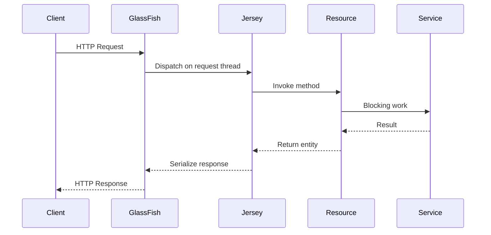
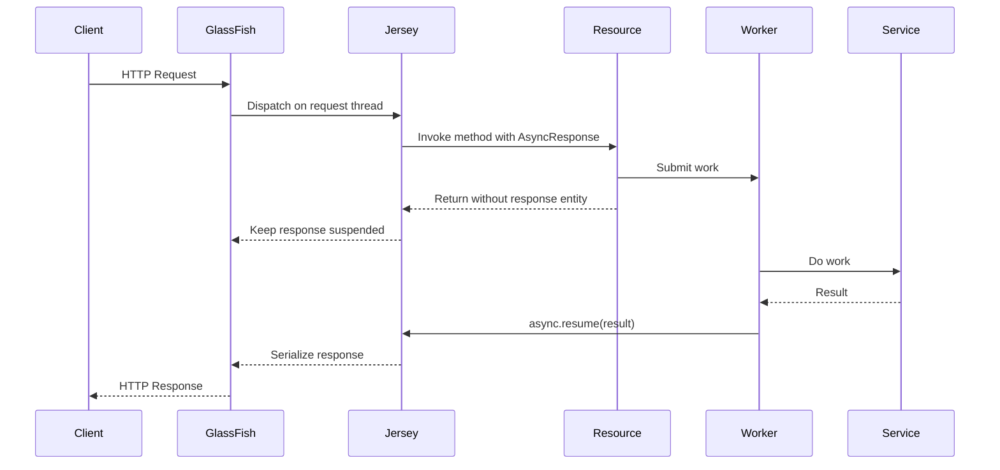
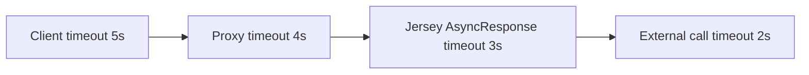
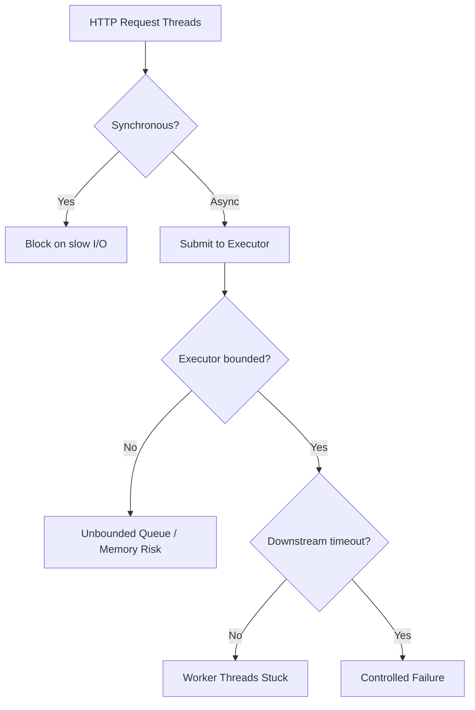

# Part 012 — Async Jersey: Suspended Responses, Executors, Thread Boundaries

> Goal: memahami asynchronous request handling di Jersey/Jakarta REST secara runtime: kapan request disuspend, siapa melanjutkan response, bagaimana executor dipilih, bagaimana timeout/cancel bekerja, dan bagaimana menghindari thread/resource leak.

Async Jersey bukan sekadar mengganti method synchronous menjadi `void` dengan `@Suspended`. Async adalah **kontrak lifecycle response**: resource method mengembalikan kendali ke container lebih awal, lalu response diselesaikan di waktu lain.

Contoh paling sederhana:

```java
@GET
@Path("/{id}")
public void find(@PathParam("id") UUID id,
                 @Suspended AsyncResponse async) {
    executor.submit(() -> {
        CaseDto dto = service.find(id);
        async.resume(dto);
    });
}
```

Kode ini terlihat mudah, tetapi banyak bug production muncul dari detail yang tidak terlihat:

- executor tidak bounded;
- timeout tidak disetel;
- exception di background thread hilang;
- request context dipakai setelah request thread selesai;
- response di-resume dua kali;
- client disconnect tidak membatalkan work;
- transaction dibuka di thread yang salah;
- security principal tidak dipropagasi dengan benar;
- container-managed context dilanggar oleh raw thread.

Kita akan membangun model yang aman.

---

## 1. Kaufman Deconstruction

Untuk menguasai async Jersey, pecah skill menjadi sub-skill berikut:

| Sub-skill | Pertanyaan yang harus bisa dijawab |
|---|---|
| Suspend lifecycle | Apa yang terjadi setelah resource method return? |
| Resume semantics | Apa bedanya `resume(entity)` dan `resume(Throwable)`? |
| Executor ownership | Siapa membuat, membatasi, dan menutup executor? |
| Timeout model | Timeout mana yang menyelesaikan response jika work lambat? |
| Cancellation | Apa yang terjadi ketika client disconnect atau timeout? |
| Context propagation | Context apa yang aman dibawa ke background thread? |
| Thread pool economics | Apakah async benar-benar mengurangi thread pressure? |
| Failure handling | Bagaimana mencegah hung response dan double resume? |
| Observability | Bagaimana mengukur queued, running, timed out, cancelled, resumed? |

Core mental model:

> Async bukan membuat operasi menjadi cepat. Async memisahkan lifetime HTTP response dari lifetime request dispatch thread.

---

## 2. Synchronous vs Asynchronous Request Lifecycle

Synchronous lifecycle:



Async lifecycle:



Perhatikan: HTTP connection tetap terbuka. Async tidak menghapus biaya connection; async hanya membebaskan request dispatch thread lebih awal.

---

## 3. When Async Helps — and When It Does Not

Async membantu jika:

- request menunggu I/O eksternal lama;
- hasil akan tersedia dari callback/event;
- long polling;
- request perlu menunggu workflow state berubah;
- thread request mahal untuk ditahan;
- ada executor/bulkhead terpisah untuk work lambat;
- operasi bisa dibatalkan/timeout dengan jelas.

Async tidak banyak membantu jika:

- pekerjaan CPU-bound dan tetap memakai thread server yang sama;
- semua work langsung blocking di executor lain tanpa batas;
- database call cepat dan sederhana;
- bottleneck adalah database pool, bukan request thread;
- tidak ada timeout;
- jumlah connection client sangat tinggi tanpa kapasitas socket/proxy.

Bad async:

```java
@GET
public void bad(@Suspended AsyncResponse async) {
    new Thread(() -> async.resume(service.blockingCall())).start();
}
```

Masalah:

- raw thread tidak managed;
- tidak ada limit;
- tidak ada shutdown;
- context tidak jelas;
- backpressure nol.

Better async menggunakan managed/bounded executor.

---

## 4. `AsyncResponse` Core Contract

`AsyncResponse` mewakili response yang belum selesai.

Operasi penting:

| API | Tujuan |
|---|---|
| `resume(Object)` | Selesaikan response dengan entity/Response |
| `resume(Throwable)` | Selesaikan response melalui exception mapping |
| `cancel()` | Batalkan response, biasanya service unavailable/retry semantics tergantung runtime |
| `setTimeout(...)` | Set waktu maksimum suspended |
| `setTimeoutHandler(...)` | Response custom saat timeout |
| `isSuspended()` | Cek masih suspended |
| `isDone()` | Cek sudah selesai |
| `isCancelled()` | Cek cancelled |

Pattern dasar:

```java
@GET
@Path("/{id}")
@Produces(MediaType.APPLICATION_JSON)
public void find(@PathParam("id") UUID id,
                 @Suspended AsyncResponse async) {
    async.setTimeout(2, TimeUnit.SECONDS);
    async.setTimeoutHandler(response ->
            response.resume(Response.status(Response.Status.SERVICE_UNAVAILABLE)
                    .entity(ApiError.timeout("CASE_LOOKUP_TIMEOUT"))
                    .build()));

    executor.execute(() -> {
        try {
            CaseDto dto = service.find(id);
            async.resume(dto);
        } catch (Throwable error) {
            async.resume(error);
        }
    });
}
```

Invariant:

> Setiap async path harus berakhir dengan exactly one terminal action: `resume`, `resume(Throwable)`, `cancel`, atau timeout handler.

---

## 5. Double Resume Problem

Race condition umum:

1. timeout terjadi dan handler melakukan `resume(timeoutResponse)`;
2. background worker selesai sedikit terlambat;
3. worker memanggil `resume(result)`;
4. response sudah done.

Gunakan guard.

```java
private boolean safeResume(AsyncResponse async, Object value) {
    if (async.isDone() || async.isCancelled()) {
        return false;
    }
    return async.resume(value);
}
```

Namun check-then-act bisa tetap race. `AsyncResponse.resume` mengembalikan boolean. Treat return value sebagai source of truth.

```java
boolean resumed = async.resume(dto);
if (!resumed) {
    metrics.asyncLateCompletion();
}
```

Untuk timeout + worker, desain service agar timeout juga memberi sinyal cancel ke work jika memungkinkan.

---

## 6. Executor Model in Jakarta EE / GlassFish

Di application server, jangan sembarang membuat thread. Gunakan fasilitas container-managed jika tersedia, misalnya `ManagedExecutorService` dari Jakarta Concurrency.

```java
import jakarta.annotation.Resource;
import jakarta.enterprise.context.ApplicationScoped;
import jakarta.enterprise.concurrent.ManagedExecutorService;

@ApplicationScoped
public class AsyncCaseExecutor {

    @Resource
    private ManagedExecutorService managedExecutor;

    public void submit(Runnable task) {
        managedExecutor.execute(task);
    }
}
```

Mengapa?

- container dapat mengelola lifecycle;
- thread creation lebih terkendali;
- context tertentu dapat dipropagasi sesuai konfigurasi/runtime;
- shutdown lebih aman;
- monitoring lebih mudah.

Untuk workload berbeda, butuh bulkhead berbeda:

| Workload | Executor/bulkhead |
|---|---|
| case lookup cepat | default managed executor atau synchronous |
| external API slow | dedicated bounded executor |
| report generation | job executor / queue |
| CPU-heavy transform | fixed-size CPU executor |
| long polling | async registry + timeout |

Jangan campur semua workload ke satu executor tanpa limit.

---

## 7. Bounded Executor and Backpressure

Jika menggunakan custom executor di luar full Jakarta EE environment, buat bounded.

```java
public final class BoundedExecutorFactory {

    public static ExecutorService newExecutor(String name, int threads, int queueSize) {
        AtomicInteger counter = new AtomicInteger();

        ThreadFactory threadFactory = runnable -> {
            Thread thread = new Thread(runnable);
            thread.setName(name + "-" + counter.incrementAndGet());
            thread.setDaemon(false);
            return thread;
        };

        return new ThreadPoolExecutor(
                threads,
                threads,
                0L,
                TimeUnit.MILLISECONDS,
                new ArrayBlockingQueue<>(queueSize),
                threadFactory,
                new ThreadPoolExecutor.AbortPolicy()
        );
    }
}
```

Resource handling rejection:

```java
try {
    executor.execute(task);
} catch (RejectedExecutionException rejected) {
    async.resume(Response.status(Response.Status.SERVICE_UNAVAILABLE)
            .entity(ApiError.busy("ASYNC_EXECUTOR_SATURATED"))
            .build());
}
```

Backpressure invariant:

> Async tanpa bounded queue hanya memindahkan overload dari request thread ke memory/executor queue.

---

## 8. Timeout Budget

Async endpoint harus punya timeout budget eksplisit.



Budget harus menurun dari luar ke dalam atau minimal konsisten. Jika external call timeout 30 detik tetapi async response timeout 3 detik, worker bisa terus berjalan 27 detik setelah client menerima timeout.

Pattern:

```java
Duration httpBudget = Duration.ofSeconds(3);
Duration downstreamBudget = Duration.ofSeconds(2);

async.setTimeout(httpBudget.toMillis(), TimeUnit.MILLISECONDS);

executor.execute(() -> {
    try {
        CaseDto dto = downstreamClient.fetchCase(id, downstreamBudget);
        async.resume(dto);
    } catch (TimeoutException e) {
        async.resume(new UpstreamTimeoutException("case-service", e));
    } catch (Throwable e) {
        async.resume(e);
    }
});
```

Timeout handler:

```java
async.setTimeoutHandler(ar -> ar.resume(
        Response.status(Response.Status.GATEWAY_TIMEOUT)
                .entity(ApiError.timeout("REQUEST_TIMEOUT"))
                .build()
));
```

Status choice:

| Scenario | Candidate status |
|---|---|
| App queue saturated | 503 |
| Downstream timeout | 504 |
| Client requested impossible wait | 400/422 |
| Long polling no event | 204 or 304-like domain response |
| Server-side business wait expired | 202/204/409 depending contract |

---

## 9. Cancellation and Client Disconnect

Client bisa disconnect sebelum work selesai. Tidak semua background operation otomatis berhenti.

Desain task cancellable:

```java
public final class AsyncOperation {
    private final Future<?> future;

    public AsyncOperation(Future<?> future) {
        this.future = future;
    }

    public void cancel() {
        future.cancel(true);
    }
}
```

Register completion callback jika runtime mendukung callback registration. Jika tidak, minimal timeout handler harus memberi sinyal ke operation registry.

Conceptual pattern:

```java
UUID operationId = UUID.randomUUID();
Future<?> future = executor.submit(() -> runLookup(operationId, async, id));
operationRegistry.register(operationId, future);

async.setTimeoutHandler(ar -> {
    operationRegistry.cancel(operationId);
    ar.resume(timeoutResponse());
});
```

Worker harus menghormati interruption:

```java
private void runLookup(UUID operationId, AsyncResponse async, UUID id) {
    try {
        CaseDto dto = service.findInterruptibly(id);
        if (!Thread.currentThread().isInterrupted()) {
            async.resume(dto);
        }
    } catch (InterruptedException e) {
        Thread.currentThread().interrupt();
        async.cancel();
    } catch (Throwable e) {
        async.resume(e);
    } finally {
        operationRegistry.remove(operationId);
    }
}
```

Caveat: banyak blocking I/O tidak langsung berhenti hanya karena thread interrupt. Pastikan downstream client punya timeout sendiri.

---

## 10. Context Propagation

Jangan membawa object request mutable ke background thread sembarangan.

Berbahaya:

```java
@GET
public void bad(@Context HttpServletRequest request,
                @Suspended AsyncResponse async) {
    executor.execute(() -> {
        String user = request.getUserPrincipal().getName();
        async.resume(service.findForUser(user));
    });
}
```

Masalah:

- request object dimiliki container;
- lifecycle/thread-safety tidak dijamin untuk pemakaian bebas;
- security/context bisa tidak valid;
- behavior berbeda antar runtime.

Better: ekstrak immutable command di request thread.

```java
@GET
public void good(@PathParam("id") UUID id,
                 @Context SecurityContext securityContext,
                 @Context HttpHeaders headers,
                 @Suspended AsyncResponse async) {
    RequestCommand command = RequestCommand.from(
            id,
            securityContext.getUserPrincipal().getName(),
            headers.getHeaderString("X-Correlation-Id")
    );

    executor.execute(() -> run(command, async));
}
```

Command object:

```java
public record RequestCommand(
        UUID caseId,
        String principalName,
        String correlationId
) {
    public static RequestCommand from(UUID caseId, String principalName, String correlationId) {
        return new RequestCommand(caseId, principalName, correlationId);
    }
}
```

Invariant:

> Background task menerima immutable command, bukan container request object.

---

## 11. Security Principal and Authorization

Authorization harus jelas waktunya.

Ada dua pattern:

### Pattern A — Authorize Before Submit

Cocok jika authorization murah dan harus gagal cepat.

```java
authorizationService.requireCanReadCase(user, id);
executor.execute(() -> async.resume(service.find(id)));
```

### Pattern B — Authorize Inside Worker from Immutable Context

Cocok jika authorization bergantung pada data yang diambil worker.

```java
executor.execute(() -> {
    try {
        CaseAggregate aggregate = service.load(id);
        authorizationService.requireCanRead(userContext, aggregate);
        async.resume(CaseDto.from(aggregate));
    } catch (Throwable e) {
        async.resume(e);
    }
});
```

Jangan mengandalkan principal container otomatis tersedia di background thread kecuali runtime/managed executor Anda menjaminnya dan sudah diuji.

---

## 12. Transactions in Async Code

Transaction boundary harus terjadi di thread yang melakukan kerja.

Bad mental model:

```java
@Transactional
@GET
public void bad(@Suspended AsyncResponse async) {
    executor.execute(() -> async.resume(repository.findSomething()));
}
```

Annotation transaction pada resource method tidak otomatis membungkus background thread setelah method return.

Better:

```java
@ApplicationScoped
public class CaseAsyncService {

    @Transactional
    public CaseDto loadCase(UUID id) {
        return CaseDto.from(repository.getById(id));
    }
}
```

Resource:

```java
executor.execute(() -> {
    try {
        async.resume(caseAsyncService.loadCase(id));
    } catch (Throwable e) {
        async.resume(e);
    }
});
```

Invariant:

> Transaction belongs to the execution thread, not to the suspended HTTP response.

---

## 13. Exception Handling in Async Worker

Exception di background thread tidak otomatis masuk ke Jersey jika tidak di-resume.

Bad:

```java
executor.execute(() -> {
    CaseDto dto = service.find(id); // throws
    async.resume(dto);
});
```

Jika `service.find` throw, task mati dan response bisa menggantung sampai timeout.

Good:

```java
executor.execute(() -> {
    try {
        async.resume(service.find(id));
    } catch (Throwable error) {
        async.resume(error);
    }
});
```

`resume(Throwable)` memungkinkan `ExceptionMapper` memproses error seperti request normal, selama response belum selesai.

Pattern helper:

```java
public final class AsyncResponses {

    public static void resume(AsyncResponse async, Supplier<?> supplier) {
        try {
            async.resume(supplier.get());
        } catch (Throwable error) {
            async.resume(error);
        }
    }
}
```

Tetapi hindari menyembunyikan timeout/cancel behavior di helper terlalu generik.

---

## 14. Long Polling Pattern

Long polling cocok ketika client menunggu event tertentu tanpa WebSocket/SSE.

Example: wait until case status changes or timeout.

```java
@GET
@Path("/{id}/status-changes")
public void waitForStatusChange(@PathParam("id") UUID id,
                                @QueryParam("sinceVersion") long sinceVersion,
                                @Suspended AsyncResponse async,
                                @Context SecurityContext securityContext) {
    UserContext user = UserContext.from(securityContext);
    authorizationService.requireCanReadCase(user, id);

    async.setTimeout(30, TimeUnit.SECONDS);
    async.setTimeoutHandler(ar -> ar.resume(Response.noContent().build()));

    Optional<CaseStatusChangeDto> alreadyAvailable = statusService.findAfter(id, sinceVersion);
    if (alreadyAvailable.isPresent()) {
        async.resume(alreadyAvailable.get());
        return;
    }

    waitRegistry.register(id, sinceVersion, user, async);
}
```

When event happens:

```java
public void onStatusChanged(CaseStatusChanged event) {
    for (WaitingRequest waiting : waitRegistry.matching(event.caseId(), event.version())) {
        if (authorizationService.canRead(waiting.user(), event.caseId())) {
            waiting.async().resume(CaseStatusChangeDto.from(event));
        } else {
            waiting.async().resume(Response.status(Response.Status.FORBIDDEN).build());
        }
        waitRegistry.remove(waiting);
    }
}
```

Long polling invariants:

- always set timeout;
- remove waiter on completion/timeout;
- max waiters per user/entity;
- re-check authorization before resume;
- use version/cursor to avoid lost event race.

Race-free pattern:

1. client sends `sinceVersion`;
2. server checks if event already exists after version;
3. if none, registers waiter atomically with version;
4. publisher resumes matching waiters;
5. client repeats with latest version.

---

## 15. Async vs SSE vs Background Job

Jangan semua waiting problem diselesaikan dengan async endpoint.

| Need | Better model |
|---|---|
| Wait max 10-30 seconds for event | Async long polling |
| Continuous low-frequency updates | SSE |
| Bidirectional interactive channel | WebSocket or another protocol |
| Large report generation | Background job + polling/SSE progress |
| Guaranteed event delivery | Message broker/event store + cursor API |
| Slow external API call | Async + bounded executor + timeout |

Decision rule:

> Async request is still an HTTP request. If the business process outlives a reasonable HTTP timeout, make it a job/workflow.

---

## 16. Virtual Threads and Jersey Async

Dengan JDK 21+, virtual threads membuat blocking I/O lebih murah dari sisi thread footprint. Namun di application server seperti GlassFish, adopsi virtual threads harus mengikuti dukungan dan konfigurasi runtime.

Mental model yang benar:

- virtual threads dapat mengurangi biaya thread blocking;
- virtual threads tidak menghapus timeout, cancellation, pool, socket, DB connection, atau proxy limit;
- context propagation tetap perlu diuji;
- JTA/CDI/security context tidak otomatis aman hanya karena thread virtual;
- async masih berguna untuk long polling/callback/event-based completion.

Async vs virtual thread:

| Problem | AsyncResponse | Virtual thread |
|---|---|---|
| Callback/event completion | Sangat cocok | Tidak menyelesaikan sendiri |
| Long polling | Cocok | Bisa, tapi tetap menahan request lifecycle |
| Blocking I/O sederhana | Mungkin overkill | Bisa cocok jika runtime mendukung |
| Need explicit HTTP timeout response | Cocok | Tetap perlu timeout |
| Backpressure | Perlu desain | Tetap perlu desain |

Jangan membuat keputusan arsitektur hanya karena “virtual threads membuat async tidak perlu”. Yang benar: pilih model berdasarkan lifecycle dan failure semantics.

---

## 17. Async Response and Filters

Ketika `async.resume(...)` dipanggil, response tetap melewati serialization dan response filters normal.

Konsekuensi:

- correlation ID response filter masih bisa menambahkan header jika belum committed;
- `ExceptionMapper` masih berlaku untuk `resume(Throwable)`;
- metrics filter harus menghitung durasi sampai response benar-benar selesai, bukan hanya resource method return;
- request-scoped data di filter harus aman untuk async lifecycle.

Potential issue:

```java
long start = System.nanoTime();
requestContext.setProperty("start", start);
```

Response filter:

```java
Long start = (Long) requestContext.getProperty("start");
```

Untuk async, pastikan property tetap tersedia dan filter dipanggil saat resume. Uji di runtime target.

---

## 18. Observability for Async

Metric minimum:

- async requests started;
- suspended active count;
- queue wait time;
- execution time;
- total suspend duration;
- resumed success;
- resumed error;
- timeout count;
- cancellation count;
- late completion count;
- executor rejected count;
- executor queue size;
- executor active thread count;
- per endpoint latency.

Trace attributes:

```text
http.route=/cases/{id}
async.suspended=true
async.timeout.ms=3000
async.executor=case-lookup
async.queue_wait.ms=12
async.execution.ms=180
async.resume=success
```

Structured log example:

```json
{
  "event": "async_request_completed",
  "route": "/cases/{id}",
  "correlationId": "c-123",
  "executor": "case-lookup",
  "suspendedMs": 241,
  "executionMs": 193,
  "outcome": "success"
}
```

Do not log only at resource method return. In async, resource method return means **suspended**, not completed.

---

## 19. Failure Mode Catalog

| Symptom | Likely cause | Diagnosis |
|---|---|---|
| Request hangs until proxy timeout | Worker exception swallowed; no `resume(Throwable)` | Executor logs, async active count |
| Many 503 from async endpoint | Executor saturated | Queue size, rejected count |
| Timeout response returned but CPU still high | Work not cancelled after timeout | Operation registry, downstream timeouts |
| Security context missing | Raw executor without context propagation | Thread/context logs |
| Transaction not active | Transaction annotation applied to request thread, not worker | Transaction boundary review |
| Duplicate logs/metrics | Worker completed after timeout and tried late resume | `resume` return value, late completion metric |
| Memory grows under load | Unbounded executor queue/wait registry | Heap dump, queue size |
| Thread pool exhausted | Blocking work shifted to insufficient executor | Thread dump |
| Client gets 500 instead of mapped error | Throwable not resumed through Jersey or mapper missing | Error path test |
| Long polling loses event | Race between check and register | Version/cursor design |

---

## 20. Production Pattern: Async Boundary Object

Avoid spreading async mechanics across every resource.

```java
public final class AsyncBoundary {

    private final Executor executor;
    private final Metrics metrics;

    public AsyncBoundary(Executor executor, Metrics metrics) {
        this.executor = executor;
        this.metrics = metrics;
    }

    public void run(AsyncResponse async,
                    Duration timeout,
                    String operation,
                    Supplier<?> supplier) {
        async.setTimeout(timeout.toMillis(), TimeUnit.MILLISECONDS);
        async.setTimeoutHandler(ar -> {
            metrics.timeout(operation);
            ar.resume(Response.status(Response.Status.GATEWAY_TIMEOUT)
                    .entity(ApiError.timeout(operation + "_TIMEOUT"))
                    .build());
        });

        try {
            executor.execute(() -> {
                Instant start = Instant.now();
                try {
                    Object result = supplier.get();
                    boolean resumed = async.resume(result);
                    metrics.completed(operation, resumed, Duration.between(start, Instant.now()));
                } catch (Throwable e) {
                    boolean resumed = async.resume(e);
                    metrics.failed(operation, resumed, Duration.between(start, Instant.now()), e);
                }
            });
        } catch (RejectedExecutionException e) {
            metrics.rejected(operation);
            async.resume(Response.status(Response.Status.SERVICE_UNAVAILABLE)
                    .entity(ApiError.busy(operation + "_SATURATED"))
                    .build());
        }
    }
}
```

Gunakan boundary object untuk konsistensi, tetapi jangan sampai ia menyembunyikan perbedaan timeout/business semantics tiap endpoint.

---

## 21. Production Pattern: Request Command + Worker Service

Resource tipis:

```java
@GET
@Path("/{id}")
public void getCase(@PathParam("id") UUID id,
                    @Context SecurityContext security,
                    @Context HttpHeaders headers,
                    @Suspended AsyncResponse async) {
    CaseLookupCommand command = CaseLookupCommand.from(id, security, headers);
    asyncBoundary.run(async, Duration.ofSeconds(3), "CASE_LOOKUP",
            () -> caseWorker.load(command));
}
```

Worker explicit:

```java
@ApplicationScoped
public class CaseWorker {

    @Transactional
    public CaseDto load(CaseLookupCommand command) {
        authorizationService.requireCanReadCase(command.user(), command.caseId());
        CaseAggregate aggregate = repository.get(command.caseId());
        return CaseDto.from(aggregate);
    }
}
```

Keuntungan:

- resource hanya adaptasi HTTP;
- command immutable;
- worker punya transaction boundary jelas;
- test worker mudah;
- async mechanics reusable;
- observability konsisten.

---

## 22. Production Pattern: Async Job Creation

Untuk proses yang lama, jangan hold HTTP connection.

```java
@POST
@Path("/exports")
public Response createExport(ExportRequest request,
                             @Context SecurityContext security) {
    ExportJob job = exportService.createJob(request, security.getUserPrincipal());

    return Response.accepted(new ExportCreatedResponse(job.id()))
            .location(uriInfo.getAbsolutePathBuilder().path(job.id().toString()).build())
            .build();
}
```

Follow-up:

```java
@GET
@Path("/exports/{id}")
public ExportStatusResponse status(@PathParam("id") UUID id) {
    return exportService.status(id);
}
```

AsyncResponse cocok untuk waiting pendek. Job cocok untuk business process panjang.

---

## 23. Thread Starvation Model

Async bisa memperbaiki atau memperburuk starvation tergantung desain.



Async yang benar:

- membebaskan request thread;
- membatasi worker concurrency;
- memberi timeout ke downstream;
- memberi rejection response saat overload;
- mengukur queue dan active work.

Async yang salah:

- request thread bebas, tetapi worker queue tak terbatas;
- memory habis;
- timeout proxy terjadi;
- user retry;
- overload makin parah.

---

## 24. Anti-Pattern Catalog

### Anti-pattern: Raw Thread Per Request

```java
new Thread(() -> async.resume(service.call())).start();
```

Tidak ada lifecycle, limit, observability.

### Anti-pattern: No Timeout

Suspended response tanpa timeout bisa menjadi hung request.

### Anti-pattern: Catch Nothing in Worker

Exception hilang, response tidak pernah resume.

### Anti-pattern: Capture Container Request Object

Membawa `HttpServletRequest`, `ContainerRequestContext`, atau mutable context ke background thread.

### Anti-pattern: Async Everything

Endpoint cepat dibuat async tanpa alasan, menambah complexity dan failure mode.

### Anti-pattern: Transaction on Resource Method

Mengira transaction resource method otomatis berlaku di background worker.

### Anti-pattern: Unbounded Wait Registry

Long polling registry tidak punya max waiter, timeout cleanup, atau per-user limit.

### Anti-pattern: Late Resume Ignored

Worker tetap menulis metrics success walaupun `async.resume` return `false`.

---

## 25. Testing Strategy

### 25.1 Success Path

```java
@Test
void resumesWithCaseDto() {
    // integration-style test preferred; unit test boundary with fake AsyncResponse if needed
}
```

### 25.2 Exception Path

Pastikan exception di worker menjadi mapped response.

### 25.3 Timeout Path

Simulasikan service lambat:

- response timeout sesuai contract;
- worker dibatalkan jika memungkinkan;
- late completion dicatat.

### 25.4 Rejection Path

Saturasi executor:

- request menerima `503`;
- tidak ada hung response;
- metric rejected naik.

### 25.5 Long Poll Race

Test event terjadi:

- sebelum register;
- setelah register;
- bersamaan dengan timeout;
- setelah authorization dicabut.

---

## 26. Production Review Checklist

Sebelum memakai async endpoint:

- Apakah endpoint benar-benar butuh async?
- Apakah ada timeout explicit?
- Apakah timeout downstream lebih kecil dari HTTP budget?
- Apakah executor bounded?
- Apakah rejection menghasilkan response?
- Apakah semua worker exception memanggil `resume(Throwable)`?
- Apakah `resume` return value dicek?
- Apakah work bisa dibatalkan saat timeout/client disconnect?
- Apakah context di-copy menjadi immutable command?
- Apakah transaction berada di worker service?
- Apakah metrics membedakan suspended vs completed?
- Apakah long polling registry bounded dan dibersihkan?
- Apakah authorization dicek pada waktu yang benar?

---

## 27. Deliberate Practice

### Exercise 1 — Async Case Lookup

Buat endpoint `GET /cases/{id}` dengan:

- `AsyncResponse`;
- timeout 3 detik;
- managed/bounded executor;
- rejection response 503;
- `resume(Throwable)` untuk error;
- metric success/error/timeout/rejected.

### Exercise 2 — Long Polling Case Status

Buat endpoint `GET /cases/{id}/status-changes?sinceVersion=n` dengan:

- immediate return jika event sudah ada;
- register waiter jika belum ada;
- timeout 30 detik dengan 204;
- cleanup waiter;
- authorization re-check sebelum resume.

### Exercise 3 — Timeout Cancellation

Buat worker yang memanggil downstream lambat. Pastikan:

- async timeout mengembalikan 504;
- downstream timeout lebih kecil;
- worker tidak terus berjalan lama setelah timeout;
- late completion tercatat.

### Exercise 4 — Saturation Test

Saturasi executor dengan queue kecil. Pastikan:

- tidak ada memory growth tak terbatas;
- request baru menerima 503;
- thread dump mudah dibaca;
- metrics menunjukkan queue/active/rejected.

---

## 28. Key Takeaways

- Async Jersey memisahkan request dispatch thread dari response completion, tetapi HTTP connection tetap terbuka.
- Async tidak otomatis meningkatkan performa; ia harus dikombinasikan dengan timeout, bounded executor, cancellation, dan observability.
- `AsyncResponse` harus selesai tepat satu kali melalui resume/cancel/timeout.
- Jangan membawa mutable container context ke worker thread. Ekstrak immutable command.
- Transaction, security, dan CDI context harus dirancang sesuai thread yang benar-benar menjalankan pekerjaan.
- Long polling membutuhkan race-free version/cursor model.
- Untuk proses panjang, gunakan job/workflow, bukan suspended HTTP request panjang.

---

## 29. Next Part

Part berikutnya membahas **Validation, Param Conversion, and Input Boundary Design**: bagaimana menjadikan boundary HTTP sebagai firewall data, bukan sekadar tempat binding parameter.
