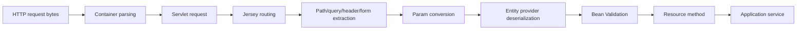
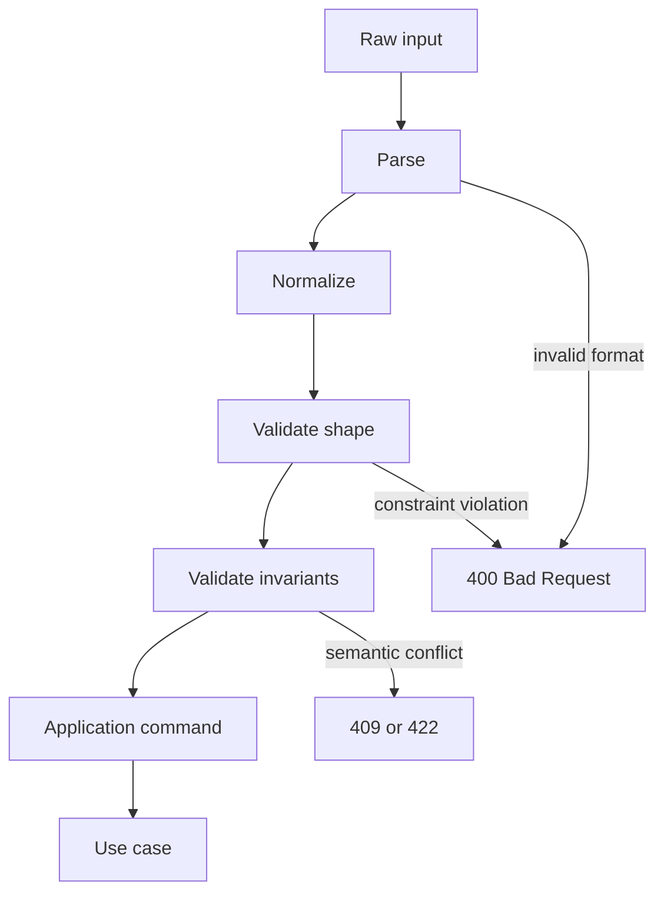
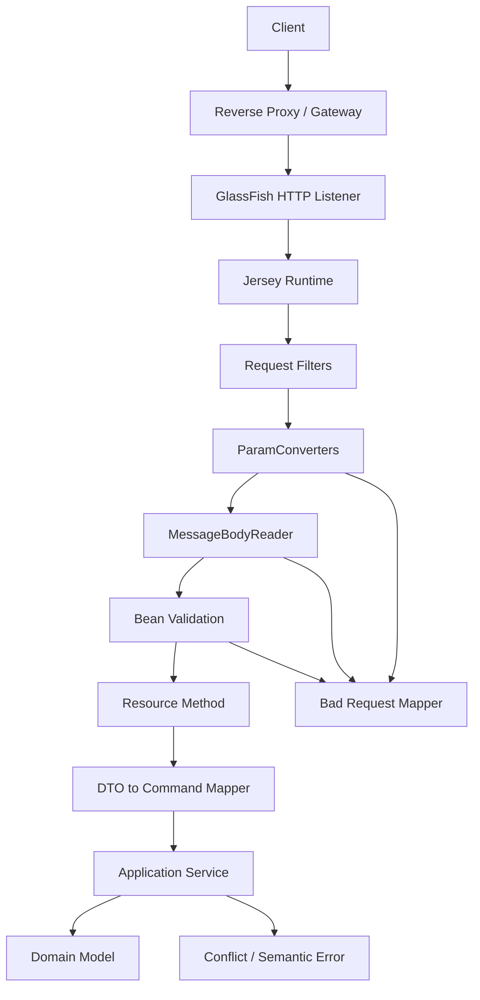

# Part 013 — Validation, Param Conversion, and Input Boundary Design

> Goal: membangun boundary input Jersey yang aman, eksplisit, mudah diuji, dan tahan perubahan: dari HTTP string mentah menjadi command/domain input yang valid, terkanonisasi, dan siap diproses.

Dalam REST application, sebagian besar bug production tidak lahir dari endpoint annotation yang salah. Bug lahir dari **input boundary yang kabur**:

- path parameter dianggap selalu valid;
- query parameter punya default yang ambigu;
- header parsing tersebar di resource method;
- DTO terlalu dekat dengan entity persistence;
- validasi hanya mengecek field, bukan invariant antar-field;
- `String` dipakai untuk semua domain identifier;
- tanggal, timezone, locale, enum, money, sort, pagination, dan filter diparse berbeda-beda di tiap endpoint;
- error validation tidak stabil sehingga client sulit membuat recovery logic;
- normalization dilakukan setelah business logic sehingga audit trail sulit dipercaya.

Jersey menyediakan banyak titik integrasi untuk boundary ini: Bean Validation, parameter conversion, custom providers, filters, exception mapper, CDI/HK2 injection, dan resource model. Tetapi tools ini harus dipakai dengan mental model yang benar.

Core principle:

> Resource method bukan tempat utama untuk membersihkan input. Resource method harus menerima input yang sudah dikonversi, divalidasi, dan cukup dekat dengan bahasa domain.

---

## 1. Kaufman Deconstruction

Agar skill ini bisa dikuasai cepat tetapi mendalam, pecah menjadi sub-skill berikut:

| Sub-skill | Pertanyaan yang harus bisa dijawab |
|---|---|
| Boundary taxonomy | Input mana berasal dari path, query, header, cookie, form, body, dan context? |
| Conversion | Kapan string HTTP berubah menjadi Java type? |
| Validation | Invariant mana dicek oleh annotation, custom validator, service, atau database? |
| Canonicalization | Kapan input dinormalisasi: trim, case-fold, timezone, enum alias, default? |
| Error contract | Bagaimana semua kegagalan input menjadi response stabil? |
| Value object design | Kapan `String`/`Long` harus diganti `CaseId`, `TenantId`, `PageRequest`? |
| Security boundary | Input mana harus dianggap hostile bahkan jika datang dari internal service? |
| Observability | Bagaimana mengukur invalid input tanpa membocorkan data sensitif? |
| Testing | Bagaimana membuat test matrix untuk semua kombinasi bad input? |

Kaufman-style target untuk 20 jam pertama:

1. Bisa membuat DTO body dengan Bean Validation.
2. Bisa membuat `ParamConverterProvider` untuk domain identifier.
3. Bisa menormalisasi pagination/sort/filter secara konsisten.
4. Bisa memetakan validation failure ke error response yang stabil.
5. Bisa menulis test untuk 400/404/409/422 style decisions tanpa ad-hoc behavior.

---

## 2. Mental Model: HTTP Input Pipeline

Input Jersey bukan langsung masuk ke resource method. Ia melewati pipeline konseptual seperti ini:



Detail penting:

- path/query/header/cookie/form parameter awalnya adalah string atau kumpulan string;
- entity body diproses oleh `MessageBodyReader`;
- Bean Validation dapat bekerja pada parameter, entity body, return value, dan bean graph tergantung integrasi runtime;
- conversion failure dan validation failure harus dikembalikan sebagai client error, bukan generic 500;
- resource method adalah boundary antara HTTP model dan application use-case model.

Dalam sistem production, kita ingin boundary yang deterministic:



---

## 3. Boundary Taxonomy

Jersey resource dapat menerima input dari beberapa channel:

| Input source | Typical annotation | Risiko utama | Boundary strategy |
|---|---|---|---|
| Path | `@PathParam` | invalid ID, route ambiguity, encoded slash | value object + strict converter |
| Query | `@QueryParam` | pagination abuse, sort injection, filter ambiguity | typed request object |
| Header | `@HeaderParam` | spoofed correlation/user header | trusted/untrusted classification |
| Cookie | `@CookieParam` | stale session, tampering | signed/token validation |
| Form | `@FormParam` | encoding and multi-value ambiguity | explicit DTO/validator |
| Body | entity parameter | oversized payload, unknown fields, invalid graph | DTO + Bean Validation + size limit |
| Context | `@Context` | accidental dependence on container | wrapper service / adapter |

Rule:

> Treat every external input as hostile until parsed, normalized, and validated. Internal service-to-service traffic is not automatically trusted.

---

## 4. Basic Bean Validation Integration

A DTO body should express structural constraints close to the transport boundary:

```java
import jakarta.validation.Valid;
import jakarta.validation.constraints.NotBlank;
import jakarta.validation.constraints.NotNull;
import jakarta.validation.constraints.Size;

public record CreateCaseRequest(
    @NotBlank
    @Size(max = 120)
    String title,

    @NotNull
    @Valid
    SubjectInput subject,

    @Size(max = 20)
    List<@NotBlank String> tags
) {}

public record SubjectInput(
    @NotBlank
    String externalId,

    @NotBlank
    String displayName
) {}
```

Resource method:

```java
@Path("/cases")
@Consumes(MediaType.APPLICATION_JSON)
@Produces(MediaType.APPLICATION_JSON)
public class CaseResource {

    private final CaseService service;

    public CaseResource(CaseService service) {
        this.service = service;
    }

    @POST
    public Response create(@Valid CreateCaseRequest request) {
        CaseId id = service.create(CreateCaseCommand.from(request));
        return Response.created(URI.create("/cases/" + id.value())).build();
    }
}
```

Do not use validation only as decoration. A useful constraint must answer:

- what input is invalid;
- why it is invalid;
- where it failed;
- whether the client can fix it;
- whether the error is safe to disclose.

---

## 5. Validation Layering

Not every rule belongs in Bean Validation.

| Rule type | Example | Recommended place |
|---|---|---|
| Syntactic shape | `title` cannot be blank | Bean Validation |
| Length/range | `pageSize <= 100` | Bean Validation / request object |
| Format | valid UUID, ISO date | converter or custom constraint |
| Cross-field invariant | `from <= to` | class-level constraint or request object factory |
| Domain existence | `caseType` must exist in tenant config | application service |
| Authorization | user can create this case type | authz layer / service |
| Uniqueness | external reference unique | application service + database constraint |
| State transition | cannot close already closed case | domain model/service |
| Persistence integrity | FK exists | service/database, not DTO only |

Bad design:

```java
public record CreateCaseRequest(
    @NotBlank String caseTypeCode // then resource method queries database in validator
) {}
```

A Bean Validation constraint that calls a remote service or database can surprise the pipeline:

- validation becomes slow;
- validation becomes unavailable when dependency is down;
- error contract becomes coupled to infrastructure;
- unit tests become heavy;
- caching semantics become unclear.

Acceptable only when the team explicitly treats the validator as part of application boundary and gives it timeout, cache, metrics, and failure mapping.

Better design:

```java
public record CreateCaseRequest(
    @NotBlank String caseTypeCode
) {}

public final class CreateCaseCommand {
    private final CaseTypeCode caseTypeCode;
    private final String title;

    public static CreateCaseCommand from(CreateCaseRequest request) {
        return new CreateCaseCommand(
            CaseTypeCode.of(request.caseTypeCode()),
            normalizeTitle(request.title())
        );
    }
}
```

Then service checks whether the code exists for the tenant.

---

## 6. Method Parameter Validation

You can validate parameters directly:

```java
@GET
@Path("/{id}/events")
public EventPage listEvents(
    @PathParam("id") @NotNull CaseId caseId,
    @QueryParam("page") @DefaultValue("0") @Min(0) int page,
    @QueryParam("size") @DefaultValue("25") @Min(1) @Max(100) int size
) {
    return service.listEvents(caseId, PageRequest.of(page, size));
}
```

This is useful for simple parameters. But once parameters become related, prefer a request object:

```java
public record EventSearchRequest(
    CaseId caseId,
    int page,
    int size,
    Instant from,
    Instant to,
    SortSpec sort
) {
    public EventSearchRequest {
        if (page < 0) throw new BadRequestException("page must be >= 0");
        if (size < 1 || size > 100) throw new BadRequestException("size must be between 1 and 100");
        if (from != null && to != null && from.isAfter(to)) {
            throw new BadRequestException("from must be before to");
        }
    }
}
```

Resource:

```java
@GET
@Path("/{id}/events")
public EventPage listEvents(@BeanParam EventSearchParams params) {
    return service.listEvents(params.toRequest());
}
```

`@BeanParam` wrapper:

```java
public class EventSearchParams {
    @PathParam("id")
    private CaseId caseId;

    @QueryParam("page")
    @DefaultValue("0")
    private int page;

    @QueryParam("size")
    @DefaultValue("25")
    private int size;

    @QueryParam("from")
    private Instant from;

    @QueryParam("to")
    private Instant to;

    @QueryParam("sort")
    private SortSpec sort;

    public EventSearchRequest toRequest() {
        return new EventSearchRequest(caseId, page, size, from, to, sort);
    }
}
```

Use `@BeanParam` to group HTTP extraction, not to create a large mutable domain object.

---

## 7. Param Conversion Mental Model

Most HTTP parameters arrive as string. Jakarta REST supports conversion for parameter values injected through path, query, matrix, form, cookie, and header parameters. For custom types, implement `ParamConverterProvider`.

Without conversion:

```java
@GET
@Path("/{id}")
public CaseDto find(@PathParam("id") String rawId) {
    CaseId id = CaseId.parse(rawId);
    return service.find(id);
}
```

This spreads parsing across resources.

With conversion:

```java
@GET
@Path("/{id}")
public CaseDto find(@PathParam("id") CaseId id) {
    return service.find(id);
}
```

The resource method now communicates intent: it receives a `CaseId`, not any arbitrary string.

---

## 8. Designing Domain Identifier Converters

Value object:

```java
public record CaseId(UUID value) {
    public CaseId {
        Objects.requireNonNull(value, "value");
    }

    public static CaseId parse(String raw) {
        if (raw == null || raw.isBlank()) {
            throw new IllegalArgumentException("case id is required");
        }
        try {
            return new CaseId(UUID.fromString(raw.trim()));
        } catch (IllegalArgumentException ex) {
            throw new IllegalArgumentException("case id must be a valid UUID", ex);
        }
    }

    @Override
    public String toString() {
        return value.toString();
    }
}
```

Converter:

```java
import jakarta.ws.rs.ext.ParamConverter;
import jakarta.ws.rs.ext.ParamConverterProvider;
import jakarta.ws.rs.ext.Provider;
import java.lang.annotation.Annotation;
import java.lang.reflect.Type;

@Provider
public class DomainParamConverterProvider implements ParamConverterProvider {

    @Override
    @SuppressWarnings("unchecked")
    public <T> ParamConverter<T> getConverter(
            Class<T> rawType,
            Type genericType,
            Annotation[] annotations) {

        if (rawType.equals(CaseId.class)) {
            return (ParamConverter<T>) new ParamConverter<CaseId>() {
                @Override
                public CaseId fromString(String value) {
                    return CaseId.parse(value);
                }

                @Override
                public String toString(CaseId value) {
                    return value.toString();
                }
            };
        }

        return null;
    }
}
```

Register explicitly:

```java
public class ApiApplication extends ResourceConfig {
    public ApiApplication() {
        register(DomainParamConverterProvider.class);
        packages("com.acme.caseapi.resource");
    }
}
```

Better for many identifiers:

```java
public interface StringParsable<T> {
    T parse(String raw);
}
```

But avoid over-general reflection magic unless you have clear diagnostics. Explicit converters are easier to debug.

---

## 9. Conversion Failure Semantics

A converter should fail as a **bad request**, not as a server error.

Bad converter:

```java
public CaseId fromString(String value) {
    return new CaseId(UUID.fromString(value));
}
```

This leaks `IllegalArgumentException` details and relies on implementation default.

Better:

```java
public CaseId fromString(String value) {
    try {
        return CaseId.parse(value);
    } catch (IllegalArgumentException ex) {
        throw new BadRequestException("Invalid case id");
    }
}
```

But error message alone is not enough. In production, map all bad input failures to a stable shape:

```json
{
  "type": "https://errors.acme.local/bad-request",
  "title": "Bad request",
  "status": 400,
  "code": "INVALID_PARAMETER",
  "correlationId": "01J...",
  "errors": [
    {
      "field": "id",
      "message": "must be a valid case id"
    }
  ]
}
```

A converter alone may not know the parameter name. If parameter-specific diagnostics are needed, combine:

- converter for type safety;
- exception mapper for error shape;
- validation/request object for field names;
- tests to lock the behavior.

---

## 10. Canonicalization vs Validation

Validation answers: “is this input acceptable?”

Canonicalization answers: “what is the single representation we will use internally?”

Examples:

| Input | Canonicalization |
|---|---|
| `"  ABC-123 "` | trim to `"ABC-123"` |
| `"case-open"` | map alias to `CaseStatus.OPEN` |
| `"2026-06-27"` | convert to `LocalDate` in defined timezone context |
| `"john@example.com"` | lowercase domain part, maybe preserve local part policy |
| `"+62 812-..."` | E.164 normalization if phone number is in scope |
| `sort=createdAt,-priority` | typed `SortSpec` |

Canonicalization must be deliberate. Do not silently transform values if transformation changes legal/business meaning.

Bad:

```java
String normalized = raw.toLowerCase();
```

For identifiers, lowercasing might be fine. For human names, legal references, external IDs, or case-sensitive codes, it might corrupt meaning.

Use a boundary policy:

```java
public final class ExternalReference {
    private final String value;

    private ExternalReference(String value) {
        this.value = value;
    }

    public static ExternalReference of(String raw) {
        if (raw == null || raw.isBlank()) {
            throw new BadRequestException("external reference is required");
        }

        String normalized = raw.trim();
        if (normalized.length() > 64) {
            throw new BadRequestException("external reference is too long");
        }

        return new ExternalReference(normalized);
    }
}
```

---

## 11. Pagination Boundary Design

Pagination is not a simple utility. It is an abuse boundary.

Bad:

```java
@QueryParam("limit") int limit
```

If client sends `limit=1000000`, you may:

- exhaust database memory;
- cause slow serialization;
- hold request thread too long;
- create huge audit/log payloads;
- damage latency for other tenants.

Better:

```java
public record PageSpec(int page, int size) {
    private static final int DEFAULT_SIZE = 25;
    private static final int MAX_SIZE = 100;

    public static PageSpec of(Integer page, Integer size) {
        int p = page == null ? 0 : page;
        int s = size == null ? DEFAULT_SIZE : size;

        if (p < 0) throw new BadRequestException("page must be >= 0");
        if (s < 1 || s > MAX_SIZE) throw new BadRequestException("size must be between 1 and 100");

        return new PageSpec(p, s);
    }

    public int offset() {
        return Math.multiplyExact(page, size);
    }
}
```

But even offset pagination has limits. For large datasets, use cursor pagination:

```java
public record CursorPageSpec(String cursor, int size) {
    public CursorPageSpec {
        if (size < 1 || size > 100) {
            throw new BadRequestException("size must be between 1 and 100");
        }
        if (cursor != null && cursor.length() > 512) {
            throw new BadRequestException("cursor is too large");
        }
    }
}
```

Boundary invariant:

> Pagination must always have a maximum. Default without maximum is a production incident waiting to happen.

---

## 12. Sort Boundary Design

Sort parameters are often treated as harmless strings. They are not.

Bad:

```java
String sql = "order by " + sort;
```

Even if the ORM escapes values, field names are not regular bind parameters. Use a whitelist:

```java
public enum CaseSortField {
    CREATED_AT("created_at"),
    UPDATED_AT("updated_at"),
    PRIORITY("priority");

    private final String column;

    CaseSortField(String column) {
        this.column = column;
    }

    public String column() {
        return column;
    }

    public static CaseSortField fromApiName(String raw) {
        return switch (raw) {
            case "createdAt" -> CREATED_AT;
            case "updatedAt" -> UPDATED_AT;
            case "priority" -> PRIORITY;
            default -> throw new BadRequestException("unsupported sort field");
        };
    }
}
```

Sort spec:

```java
public record SortSpec(CaseSortField field, Direction direction) {
    public enum Direction { ASC, DESC }

    public static SortSpec parse(String raw) {
        if (raw == null || raw.isBlank()) {
            return new SortSpec(CaseSortField.CREATED_AT, Direction.DESC);
        }

        String value = raw.trim();
        Direction direction = value.startsWith("-") ? Direction.DESC : Direction.ASC;
        String field = value.startsWith("-") || value.startsWith("+") ? value.substring(1) : value;

        return new SortSpec(CaseSortField.fromApiName(field), direction);
    }
}
```

Now the repository layer receives controlled values only.

---

## 13. Date and Time Boundary Design

Date/time bugs are boundary bugs.

Common mistakes:

- accepting timezone-less `LocalDateTime` for global events;
- interpreting date using server timezone;
- mixing business date and instant;
- accepting multiple formats without documenting precedence;
- truncating user-provided time silently;
- storing local time without zone context.

Use explicit types:

| Meaning | Preferred type |
|---|---|
| A precise moment | `Instant` |
| A calendar date without time | `LocalDate` |
| Local appointment time in known region | `ZonedDateTime` + zone policy |
| Month | `YearMonth` |
| Duration | `Duration` |
| Business period | domain object, not raw pair |

Converter example:

```java
public final class InstantParamConverter implements ParamConverter<Instant> {
    @Override
    public Instant fromString(String value) {
        if (value == null || value.isBlank()) {
            return null;
        }
        try {
            return Instant.parse(value.trim());
        } catch (DateTimeParseException ex) {
            throw new BadRequestException("timestamp must be ISO-8601 instant");
        }
    }

    @Override
    public String toString(Instant value) {
        return value.toString();
    }
}
```

For query range:

```java
public record TimeRange(Instant from, Instant to) {
    public TimeRange {
        if (from != null && to != null && from.isAfter(to)) {
            throw new BadRequestException("from must be before to");
        }
        if (from != null && to != null && Duration.between(from, to).toDays() > 366) {
            throw new BadRequestException("range must not exceed 366 days");
        }
    }
}
```

Boundary invariant:

> Server timezone must not be an implicit input parameter.

---

## 14. Enum Boundary Design

Never expose Java enum names accidentally if they are part of public contract.

Bad:

```java
public enum CaseStatus {
    OPEN,
    IN_PROGRESS,
    CLOSED
}
```

If serialized/deserialized directly, enum renaming becomes breaking API change.

Better:

```java
public enum CaseStatusApi {
    OPEN("open"),
    IN_PROGRESS("in-progress"),
    CLOSED("closed");

    private final String wireValue;

    CaseStatusApi(String wireValue) {
        this.wireValue = wireValue;
    }

    public String wireValue() {
        return wireValue;
    }

    public static CaseStatusApi parse(String raw) {
        for (CaseStatusApi status : values()) {
            if (status.wireValue.equals(raw)) return status;
        }
        throw new BadRequestException("unsupported status");
    }
}
```

If you use JSON-B/Jackson provider, configure enum serialization deliberately. Do not rely on default enum name if the API is long-lived.

---

## 15. Header Boundary Design

Headers are easy to misuse because they look infrastructural.

Classify headers:

| Header | Trust model |
|---|---|
| `Authorization` | untrusted until verified |
| `X-Forwarded-*` | trusted only from known proxy boundary |
| `X-Correlation-Id` | can be accepted but must be sanitized/generated if invalid |
| `Idempotency-Key` | client-supplied but must be validated and stored safely |
| `Accept-Language` | preference, not identity |
| `User-Agent` | diagnostic only, never security decision |

Correlation ID policy:

```java
public final class CorrelationId {
    private static final Pattern SAFE = Pattern.compile("[A-Za-z0-9._:-]{8,128}");

    public static String fromHeaderOrGenerate(String raw) {
        if (raw == null || raw.isBlank()) {
            return ULID.nextULID();
        }
        String trimmed = raw.trim();
        if (!SAFE.matcher(trimmed).matches()) {
            return ULID.nextULID();
        }
        return trimmed;
    }
}
```

Why not fail on bad correlation ID? Usually observability should be tolerant. But for idempotency key, fail fast:

```java
public record IdempotencyKey(String value) {
    private static final Pattern SAFE = Pattern.compile("[A-Za-z0-9._:-]{16,128}");

    public static IdempotencyKey parse(String raw) {
        if (raw == null || raw.isBlank()) {
            throw new BadRequestException("Idempotency-Key header is required");
        }
        if (!SAFE.matcher(raw).matches()) {
            throw new BadRequestException("Idempotency-Key header is invalid");
        }
        return new IdempotencyKey(raw);
    }
}
```

Different headers need different failure policy.

---

## 16. Body DTO Boundary Design

DTO should be a transport contract, not a persistence entity.

Bad:

```java
@POST
public CaseEntity create(CaseEntity entity) {
    return repository.save(entity);
}
```

Problems:

- client can set fields it should not control;
- persistence annotations leak into API contract;
- lazy relationships may serialize accidentally;
- validation becomes mixed with database concerns;
- migration becomes hard.

Better:

```java
public record CreateCaseRequest(
    @NotBlank @Size(max = 120) String title,
    @NotBlank @Size(max = 64) String typeCode,
    @Valid List<CreateCaseAttributeRequest> attributes
) {}

public record CreateCaseAttributeRequest(
    @NotBlank @Size(max = 64) String name,
    @NotNull Object value
) {}
```

Mapping:

```java
public final class CreateCaseMapper {
    public CreateCaseCommand toCommand(TenantId tenantId, UserId userId, CreateCaseRequest request) {
        return new CreateCaseCommand(
            tenantId,
            userId,
            CaseTitle.of(request.title()),
            CaseTypeCode.of(request.typeCode()),
            toAttributes(request.attributes())
        );
    }
}
```

The mapper is not busywork. It is where the API boundary becomes application language.

---

## 17. Unknown Fields Policy

For JSON body, decide whether unknown fields are allowed.

Allowing unknown fields helps forward compatibility, but can hide client bugs:

```json
{
  "titel": "Typo field",
  "title": "Real title"
}
```

Rejecting unknown fields improves client feedback, but makes additive evolution harder.

Decision matrix:

| API type | Recommended unknown field policy |
|---|---|
| Internal tightly governed APIs | reject unknown fields |
| Public APIs with many clients | allow unknown fields but monitor |
| Security-sensitive commands | reject unknown fields |
| Query/filter body | reject unknown fields |
| Event ingestion | allow unknown with extension map only if designed |

If using Jackson provider, configure this explicitly. If using JSON-B, understand provider-specific behavior. The important point is not which policy you choose, but that the policy is intentional and tested.

---

## 18. Class-Level Constraint for Cross-Field Validation

Field constraints are insufficient for related fields.

Example annotation:

```java
@Target({ ElementType.TYPE })
@Retention(RetentionPolicy.RUNTIME)
@Constraint(validatedBy = ValidDateRangeValidator.class)
public @interface ValidDateRange {
    String message() default "from must be before to";
    Class<?>[] groups() default {};
    Class<? extends Payload>[] payload() default {};
}
```

Validator:

```java
public class ValidDateRangeValidator
        implements ConstraintValidator<ValidDateRange, SearchRequest> {

    @Override
    public boolean isValid(SearchRequest value, ConstraintValidatorContext context) {
        if (value == null || value.from() == null || value.to() == null) {
            return true;
        }
        return !value.from().isAfter(value.to());
    }
}
```

DTO:

```java
@ValidDateRange
public record SearchRequest(
    Instant from,
    Instant to,
    @Min(1) @Max(100) int size
) {}
```

Use class-level constraints when:

- rule is truly input-shape invariant;
- all required fields are in the same object;
- no slow external dependency is needed;
- error can be explained as client-correctable.

---

## 19. Validation Groups

Validation groups can support different rules for create/update/patch.

```java
public interface OnCreate {}
public interface OnUpdate {}

public record CaseMutationRequest(
    @Null(groups = OnCreate.class)
    @NotNull(groups = OnUpdate.class)
    UUID id,

    @NotBlank(groups = { OnCreate.class, OnUpdate.class })
    String title
) {}
```

But groups can quickly become obscure. Use them when the same DTO is truly shared and the lifecycle is simple. For complex APIs, separate DTOs are often clearer:

```java
public record CreateCaseRequest(...) {}
public record ReplaceCaseRequest(...) {}
public record PatchCaseRequest(...) {}
```

Rule:

> Prefer explicit DTOs over clever validation groups when the API operations have different semantics.

---

## 20. PATCH Boundary Design

PATCH is difficult because missing, null, and value are different.

Bad:

```java
public record PatchCaseRequest(String title, String priority) {}
```

Ambiguity:

- missing title: do not change?
- `"title": null`: clear title or invalid?
- `"title": ""`: blank value or clear?

Use tri-state field representation:

```java
public sealed interface PatchField<T> {
    record Missing<T>() implements PatchField<T> {}
    record NullValue<T>() implements PatchField<T> {}
    record Present<T>(T value) implements PatchField<T> {}
}
```

Or use JSON Patch / Merge Patch with a well-documented provider and validation layer.

Patch invariant:

> A PATCH endpoint must explicitly define how missing, null, and empty values behave.

---

## 21. Error Mapping for Validation

Typical exceptions to map:

- `ConstraintViolationException`;
- `BadRequestException`;
- `ParamException`/implementation-specific parameter exceptions;
- JSON parse/mapping exceptions from provider;
- `NotAllowedException`, `NotAcceptableException`, `NotSupportedException` where appropriate.

Mapper sketch:

```java
@Provider
public class ConstraintViolationMapper
        implements ExceptionMapper<ConstraintViolationException> {

    @Context
    UriInfo uriInfo;

    @Override
    public Response toResponse(ConstraintViolationException exception) {
        List<ApiFieldError> errors = exception.getConstraintViolations().stream()
            .map(v -> new ApiFieldError(
                toFieldPath(v.getPropertyPath()),
                v.getMessage()
            ))
            .toList();

        ApiError body = ApiError.validationFailed(errors);

        return Response.status(Response.Status.BAD_REQUEST)
            .type(MediaType.APPLICATION_JSON_TYPE)
            .entity(body)
            .build();
    }
}
```

Do not expose raw Java paths blindly. A property path like `create.arg0.subject.externalId` is not client-friendly. Convert it to API field names:

```java
private String toFieldPath(Path path) {
    // Apply your mapping policy here.
    // Keep this deterministic and covered by tests.
    return path.toString()
        .replace("create.arg0.", "")
        .replace("arg0", "body");
}
```

For stronger design, attach explicit field metadata in DTO mapping or validation layer.

---

## 22. Fail Fast vs Aggregate Errors

Two styles:

| Style | Behavior | Use case |
|---|---|---|
| Fail fast | return first error | security-sensitive parsing, malformed JSON, invalid path ID |
| Aggregate | return many field errors | form/body validation, client developer productivity |

Do not aggregate after business side effects. Aggregation belongs before mutation.

Example response:

```json
{
  "code": "VALIDATION_FAILED",
  "message": "Request validation failed",
  "errors": [
    { "field": "title", "reason": "must not be blank" },
    { "field": "size", "reason": "must be less than or equal to 100" }
  ]
}
```

Production requirement:

- stable `code` for machine handling;
- human message safe for clients;
- field path stable;
- correlation ID included or in header;
- no stack trace;
- no SQL/provider internals.

---

## 23. Status Code Decision Model

Input errors are not all the same.

| Situation | Recommended status |
|---|---|
| malformed JSON | 400 Bad Request |
| invalid path/query/header format | 400 Bad Request |
| unsupported `Content-Type` | 415 Unsupported Media Type |
| impossible `Accept` header | 406 Not Acceptable |
| syntactic Bean Validation failure | 400 Bad Request |
| semantically invalid command | often 422, if your API standard supports it |
| resource state conflict | 409 Conflict |
| resource not found | 404 Not Found |
| unauthorized identity | 401 Unauthorized |
| authenticated but forbidden | 403 Forbidden |

Be consistent across the API. A top-tier codebase has a documented decision tree, not individual endpoint guesses.

---

## 24. Input Boundary and Security

Validation is security-relevant but not sufficient.

Checklist:

- cap string length;
- cap array length;
- cap nesting depth if provider supports it;
- cap upload size at server/proxy level;
- reject unsupported media types;
- whitelist sort/filter fields;
- avoid regex with catastrophic backtracking;
- validate idempotency keys;
- sanitize correlation/log fields;
- never trust `X-User-*` headers unless injected by trusted gateway;
- avoid returning raw invalid input in error messages;
- rate-limit endpoints prone to brute-force validation failures.

Dangerous regex example:

```java
@Pattern(regexp = "(a+)+")
String value;
```

Avoid complex regex on untrusted large input. Prefer simple parsers or bounded input length before regex.

---

## 25. Boundary Observability

Track validation as a product/runtime signal:

| Metric | Why it matters |
|---|---|
| validation failures by endpoint | client integration quality |
| invalid parameter by name | documentation mismatch |
| JSON mapping failures | provider/config/client bug |
| unsupported media type | wrong client version/tooling |
| request size rejected | abuse or wrong batching pattern |
| invalid auth header format | security scanning or bad client |

Log carefully:

```json
{
  "event": "request.validation_failed",
  "endpoint": "POST /cases",
  "status": 400,
  "errorCode": "VALIDATION_FAILED",
  "fieldCount": 2,
  "correlationId": "01J..."
}
```

Do not log full payload by default. Payload may contain PII, secrets, regulatory data, or privileged case details.

---

## 26. Testing Strategy

Unit test value objects:

```java
class CaseIdTest {
    @Test
    void rejectsInvalidUuid() {
        assertThrows(IllegalArgumentException.class, () -> CaseId.parse("abc"));
    }
}
```

Test converters:

```java
class DomainParamConverterProviderTest {
    @Test
    void convertsCaseId() {
        var provider = new DomainParamConverterProvider();
        var converter = provider.getConverter(CaseId.class, CaseId.class, new Annotation[0]);

        CaseId id = converter.fromString("0191f7a5-4e66-7a24-9a65-7d2d3c918001");

        assertNotNull(id);
    }
}
```

Integration test resource boundary:

```java
@Test
void invalidSizeReturns400() {
    Response response = target("/cases")
        .queryParam("size", "100000")
        .request()
        .get();

    assertEquals(400, response.getStatus());
    ApiError error = response.readEntity(ApiError.class);
    assertEquals("VALIDATION_FAILED", error.code());
}
```

Test matrix:

| Case | Expected |
|---|---|
| missing required field | 400 |
| blank required field | 400 |
| too long string | 400 |
| invalid UUID path | 400 or 404 by policy, but consistent |
| unknown sort field | 400 |
| page size too large | 400 |
| malformed JSON | 400 |
| wrong content type | 415 |
| impossible accept | 406 |
| valid minimal request | success |
| valid maximal request | success within limits |

---

## 27. GlassFish/Jersey Deployment Considerations

On GlassFish, validation behavior depends on deployed Jakarta EE components and Jersey integration. Practical checks:

- use Jakarta namespace dependencies, not mixed `javax.validation` and `jakarta.validation`;
- avoid packaging duplicate Jakarta API jars in WAR when server provides them;
- ensure JSON provider is selected intentionally;
- make validation module/version compatible with Jersey runtime line;
- verify validation works in deployed WAR, not only unit test;
- verify classloader does not load conflicting Bean Validation API;
- include startup test endpoint or integration test for validation failure shape.

Maven scope pattern for Jakarta EE server deployment:

```xml
<dependency>
    <groupId>jakarta.platform</groupId>
    <artifactId>jakarta.jakartaee-api</artifactId>
    <version>11.0.0</version>
    <scope>provided</scope>
</dependency>
```

If you package implementation jars, do it deliberately and test classloading. Do not blindly mix server-provided and application-provided implementations.

---

## 28. Anti-Patterns

### Anti-pattern 1: Primitive obsession at boundary

```java
find(@PathParam("id") String id)
```

Better:

```java
find(@PathParam("id") CaseId id)
```

### Anti-pattern 2: Validation only in service

If invalid payload reaches service everywhere, every service method becomes defensive boilerplate. Validate at the boundary first, then enforce domain invariants inside domain/service.

### Anti-pattern 3: Entity as request body

Persistence model is not API contract.

### Anti-pattern 4: Unbounded query parameters

No endpoint should allow unbounded `size`, date range, or filter complexity.

### Anti-pattern 5: Converter with hidden external call

A path ID converter should not call database or remote service.

### Anti-pattern 6: Ad-hoc error body per endpoint

Error shape must be centralized.

### Anti-pattern 7: Silent normalization that changes meaning

Trimming is often fine. Case-folding, removing punctuation, or rewriting identifiers may not be.

### Anti-pattern 8: Validation that logs raw payload

Validation failures are common. Raw payload logs become data leak.

---

## 29. Production Boundary Checklist

Before an endpoint is production-ready, answer:

- What is the maximum payload size?
- What is the maximum array size?
- What is the maximum string size for each field?
- Are unknown JSON fields allowed?
- Are null and missing different?
- Are path IDs typed value objects?
- Are query parameters grouped into request objects?
- Are sort/filter fields whitelisted?
- Are timezones explicit?
- Is error response stable?
- Is validation failure logged safely?
- Are 400/406/415/409/422 policies documented?
- Are converter failures tested?
- Are JSON mapping failures tested?
- Are deployment classloader dependencies clean?

---

## 30. Mini Reference Architecture



Boundary rule by component:

| Component | Owns |
|---|---|
| Proxy | request size, TLS, coarse rate limit |
| GlassFish | HTTP parsing, connector limits |
| Jersey filter | correlation, auth extraction, early rejection |
| ParamConverter | string-to-value-object parsing |
| MessageBodyReader | body deserialization |
| Bean Validation | structural constraints |
| Resource | orchestration only |
| Mapper | API DTO to application command |
| Service | domain existence, authorization, transaction |
| Domain | business invariant |

---

## 31. Deliberate Practice

### Exercise 1 — Typed identifiers

Create converters for:

- `CaseId`;
- `TenantId`;
- `UserId`;
- `WorkflowInstanceId`.

Each converter must:

- reject blank values;
- reject invalid format;
- return stable 400 response;
- have unit tests;
- have integration tests.

### Exercise 2 — Search boundary

Build `CaseSearchParams` with:

- `status` whitelist;
- `from`/`to` range;
- `page`/`size` limits;
- `sort` whitelist;
- maximum range 366 days.

### Exercise 3 — Validation error contract

Design a single error response for:

- invalid path id;
- invalid query size;
- invalid JSON;
- blank body field;
- unsupported sort;
- unknown field if rejected.

### Exercise 4 — Unknown field policy

Configure JSON provider to either reject or allow unknown fields. Then write tests proving the behavior.

### Exercise 5 — Patch semantics

Implement a PATCH endpoint where missing, null, and present are distinct. Document the behavior.

---

## 32. Summary

Input boundary engineering is not cosmetic. It determines whether your Jersey application is predictable, secure, observable, and evolvable.

Key takeaways:

- Convert raw strings into domain value objects early.
- Use Bean Validation for structural constraints, not every business rule.
- Keep resource methods thin.
- Normalize deliberately and document it.
- Bound everything: size, range, page, sort, filter, date span.
- Centralize error response shape.
- Test negative cases as first-class API contract.
- Keep GlassFish/Jersey dependency alignment clean.

A production-grade Jersey endpoint should make invalid input boring: rejected early, explained consistently, logged safely, and never allowed to leak into domain logic as ambiguous strings.

---

## References

- Jakarta RESTful Web Services 4.0 Specification: https://jakarta.ee/specifications/restful-ws/4.0/jakarta-restful-ws-spec-4.0
- Jakarta RESTful Web Services 4.0 API, `ParamConverter`: https://jakarta.ee/specifications/restful-ws/4.0/apidocs/jakarta.ws.rs/jakarta/ws/rs/ext/paramconverter
- Jakarta Validation 3.1 Specification: https://jakarta.ee/specifications/bean-validation/3.1/jakarta-validation-spec-3.1.html
- Jakarta EE Tutorial, Bean Validation: https://jakarta.ee/learn/docs/jakartaee-tutorial/current/beanvalidation/bean-validation/bean-validation.html
- Jersey User Guide: https://eclipse-ee4j.github.io/jersey.github.io/documentation/latest/user-guide.html
