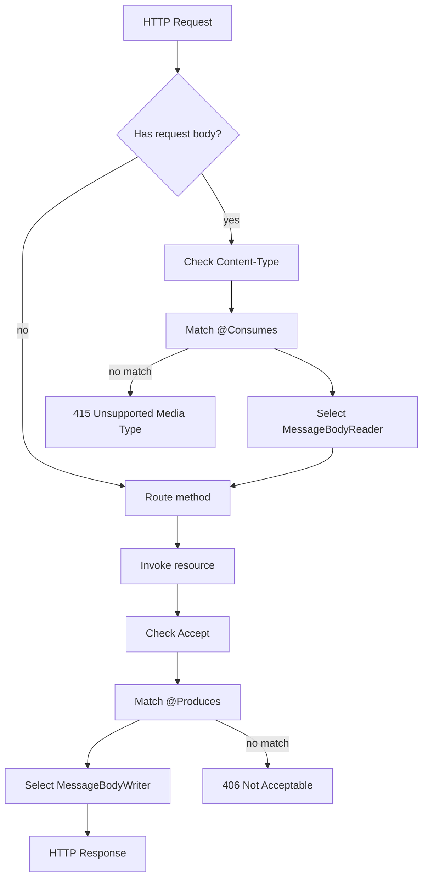
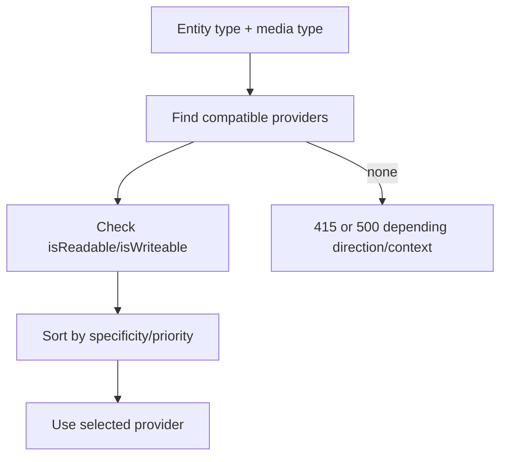
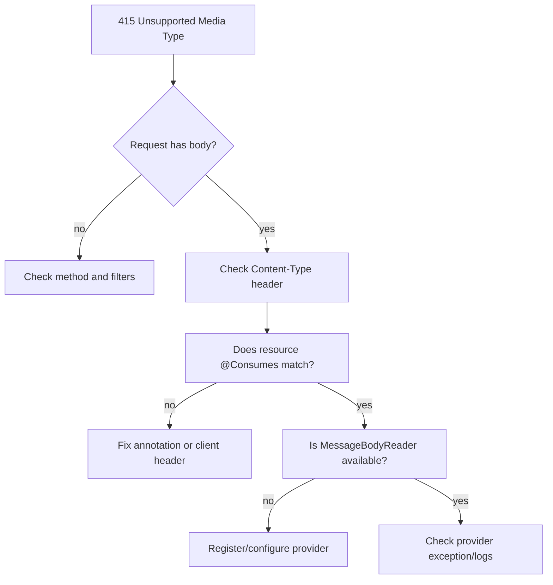
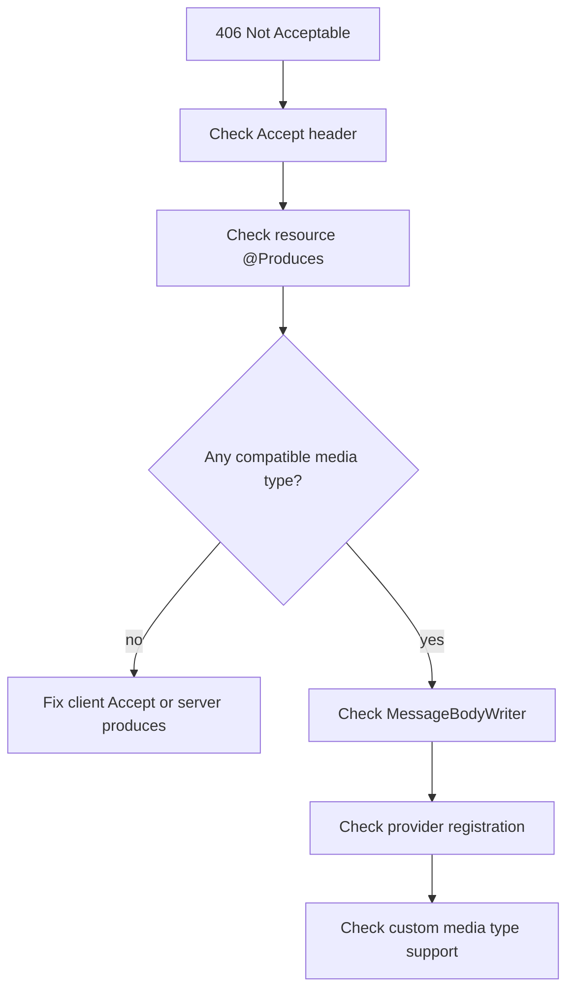

# Part 014 — Content Negotiation and Media Type Versioning

> Goal: memahami content negotiation sebagai runtime contract: bagaimana Jersey memilih resource method/provider berdasarkan `Accept`, `Content-Type`, `@Consumes`, `@Produces`, variant, dan bagaimana mendesain versioning media type tanpa membuat API menjadi rapuh.

Content negotiation sering dianggap fitur kecil: “client minta JSON, server kasih JSON”. Di production, topik ini jauh lebih besar:

- endpoint yang sama bisa punya beberapa representation;
- request body bisa punya beberapa media type;
- client lama dan client baru harus hidup berdampingan;
- provider selection bisa berubah karena dependency;
- cache/proxy perlu `Vary` yang benar;
- error response juga harus dinegosiasikan;
- versioning bisa terjadi di URI, header, media type, atau field-level evolution;
- wrong negotiation menghasilkan 406/415 yang sering salah didiagnosis sebagai bug routing.

Core principle:

> Resource adalah konsep domain; representation adalah bentuk wire contract. Jangan mencampur keduanya.

---

## 1. Kaufman Deconstruction

Pecah skill menjadi sub-skill berikut:

| Sub-skill | Pertanyaan yang harus bisa dijawab |
|---|---|
| HTTP negotiation | Apa peran `Accept`, `Content-Type`, `Accept-Language`, encoding? |
| Jersey method selection | Bagaimana `@Consumes` dan `@Produces` memengaruhi dispatch? |
| Provider selection | Provider mana yang membaca/menulis entity? |
| Error status | Kapan 406 vs 415 vs 400? |
| Variant API | Kapan perlu programmatic variant selection? |
| Versioning | Kapan URI versioning lebih baik daripada media type versioning? |
| Compatibility | Bagaimana menambah field tanpa breaking client? |
| Caching | Bagaimana `Vary` mencegah cache salah representation? |
| Testing | Bagaimana membuat matrix content negotiation? |

Target praktis:

1. Bisa menjelaskan mengapa endpoint mengembalikan 406/415.
2. Bisa mendesain `@Consumes`/`@Produces` yang eksplisit.
3. Bisa membuat vendor media type untuk versioning jika diperlukan.
4. Bisa menjaga backward compatibility representation.
5. Bisa menulis test matrix untuk Accept/Content-Type.

---

## 2. Mental Model: Two Negotiations

Ada dua negotiation berbeda:

1. **Request entity negotiation**: server menentukan apakah ia bisa membaca request body berdasarkan `Content-Type` dan `@Consumes`.
2. **Response representation negotiation**: server menentukan apakah ia bisa menghasilkan response berdasarkan `Accept` dan `@Produces`.



Simple rule:

- `Content-Type` describes what client sends.
- `Accept` describes what client wants back.
- `@Consumes` describes what server can read.
- `@Produces` describes what server can write.

---

## 3. `Content-Type` vs `Accept`

Example request:

```http
POST /cases HTTP/1.1
Content-Type: application/json
Accept: application/json

{
  "title": "Investigate delayed report"
}
```

Server declaration:

```java
@POST
@Consumes(MediaType.APPLICATION_JSON)
@Produces(MediaType.APPLICATION_JSON)
public Response create(CreateCaseRequest request) {
    ...
}
```

If client sends:

```http
Content-Type: text/plain
Accept: application/json
```

Server cannot read body as declared. Result should be `415 Unsupported Media Type`.

If client sends:

```http
Content-Type: application/json
Accept: application/xml
```

Server can read request, but cannot produce requested representation. Result should be `406 Not Acceptable`.

This distinction matters because remediation differs:

| Status | Client fix |
|---|---|
| 415 | Change request body media type or endpoint |
| 406 | Change `Accept` header or call endpoint supporting that representation |
| 400 | Fix body syntax/shape |

---

## 4. Avoid Implicit Media Type Contracts

Bad:

```java
@POST
public Response create(CreateCaseRequest request) {
    ...
}
```

This lets defaults and providers decide too much.

Better:

```java
@POST
@Consumes(MediaType.APPLICATION_JSON)
@Produces(MediaType.APPLICATION_JSON)
public Response create(@Valid CreateCaseRequest request) {
    ...
}
```

For read endpoint:

```java
@GET
@Path("/{id}")
@Produces(MediaType.APPLICATION_JSON)
public CaseResponse find(@PathParam("id") CaseId id) {
    return service.find(id);
}
```

Why explicit is better:

- startup/resource model is clearer;
- client contract is visible;
- 406/415 behavior is predictable;
- provider selection is constrained;
- tests can assert contract;
- future provider dependencies are less likely to alter behavior accidentally.

---

## 5. Method Selection with `@Consumes` and `@Produces`

Jersey/Jakarta REST can select between methods based on media types.

```java
@POST
@Consumes(MediaType.APPLICATION_JSON)
@Produces(MediaType.APPLICATION_JSON)
public Response createJson(CreateCaseRequest request) {
    ...
}

@POST
@Consumes(MediaType.APPLICATION_XML)
@Produces(MediaType.APPLICATION_XML)
public Response createXml(CreateCaseXmlRequest request) {
    ...
}
```

This is powerful but dangerous if overused.

Use separate methods when:

- representations truly differ;
- migration requires temporary dual format;
- XML/JSON mapping is not symmetric;
- behavior is representation-specific but resource semantics are same.

Avoid separate methods when:

- only serialization format differs but DTO is same;
- code duplication will drift;
- provider configuration can handle representation differences;
- endpoint becomes hard to reason about.

Better common pattern:

```java
@POST
@Consumes({ MediaType.APPLICATION_JSON, MediaType.APPLICATION_XML })
@Produces({ MediaType.APPLICATION_JSON, MediaType.APPLICATION_XML })
public Response create(CreateCaseRequest request) {
    ...
}
```

But only if the DTO/provider behavior is actually equivalent.

---

## 6. Provider Selection Model

After resource method is selected, Jersey needs a provider:

- `MessageBodyReader<T>` for request body;
- `MessageBodyWriter<T>` for response body.

Provider selection considers:

- Java type;
- generic type;
- annotations;
- media type;
- provider priority/registration;
- implementation-specific rules.



Production implication:

> Adding a dependency can change provider selection.

Example:

- you add Jackson provider;
- MOXy/JSON-B provider is also present;
- serialization changes subtly;
- unknown fields behavior changes;
- date format changes;
- enum representation changes.

Therefore provider choice belongs in architecture, not accidental transitive dependencies.

---

## 7. JSON Provider Strategy

Common JSON provider choices:

| Provider style | Strength | Risk |
|---|---|---|
| JSON-B | Jakarta EE aligned, standard ecosystem | less control for some advanced Jackson-heavy use cases |
| Jackson | rich ecosystem, mature features | extra dependency/config, provider conflict risk |
| MOXy | historically common in Jersey/GlassFish context | avoid accidental dependency on legacy behavior |
| Custom provider | full control | high maintenance |

Decision rule:

- use one provider intentionally;
- register/configure it explicitly;
- test serialization/deserialization edge cases;
- do not let provider behavior define your API accidentally.

Things to lock with tests:

- unknown fields;
- null handling;
- date/time format;
- enum wire values;
- decimal precision;
- polymorphic types;
- field naming strategy;
- empty arrays vs null;
- error body serialization.

---

## 8. Response Representation Is Not Domain Entity

Bad:

```java
@GET
@Path("/{id}")
public CaseEntity find(@PathParam("id") CaseId id) {
    return repository.find(id);
}
```

Problems:

- lazy fields may serialize accidentally;
- database shape becomes API shape;
- internal fields leak;
- versioning becomes hard;
- provider-specific serialization annotations pollute persistence model.

Better:

```java
public record CaseResponse(
    String id,
    String title,
    String status,
    Instant createdAt,
    List<LinkResponse> links
) {}
```

Mapper:

```java
public final class CaseRepresentationMapper {
    public CaseResponse toV1(CaseView view) {
        return new CaseResponse(
            view.id().toString(),
            view.title().value(),
            view.status().wireValue(),
            view.createdAt(),
            links(view)
        );
    }
}
```

Resource semantics stay stable while representation can evolve.

---

## 9. Content Negotiation and Error Responses

Error response is also a representation.

If endpoint produces JSON only, errors should also be JSON when possible:

```java
@Provider
@Produces(MediaType.APPLICATION_JSON)
public class ApiExceptionMapper implements ExceptionMapper<ApiException> {
    @Override
    public Response toResponse(ApiException exception) {
        return Response.status(exception.status())
            .type(MediaType.APPLICATION_JSON_TYPE)
            .entity(ApiError.from(exception))
            .build();
    }
}
```

But what if client sends `Accept: text/html`?

Options:

1. Return 406 for normal response negotiation, but JSON for framework-level errors.
2. Always return JSON API errors regardless of `Accept`.
3. Support multiple error representations.

Choose and document. In many internal APIs, a pragmatic policy is:

> API errors are always `application/json`, even when client `Accept` is wrong, except where the framework rejects negotiation before mapper selection.

But if you implement public HTTP semantics strictly, negotiate errors too.

---

## 10. Programmatic Variant Selection

Annotations are enough for most APIs. Use variants when representation depends on more than simple `Accept`.

Example:

```java
@GET
@Path("/{id}")
public Response find(@PathParam("id") CaseId id, @Context Request request) {
    List<Variant> variants = Variant.VariantListBuilder.newInstance()
        .mediaTypes(MediaType.APPLICATION_JSON_TYPE, MediaType.APPLICATION_XML_TYPE)
        .languages(Locale.ENGLISH, new Locale("id"))
        .add()
        .build();

    Variant selected = request.selectVariant(variants);
    if (selected == null) {
        return Response.notAcceptable(variants).build();
    }

    CaseView view = service.find(id);
    Object representation = mapper.toRepresentation(view, selected);

    return Response.ok(representation, selected).build();
}
```

Use variants for:

- language-aware representation;
- encoding/media combinations;
- cache-aware negotiation;
- explicit `Vary` handling;
- complex format selection.

Avoid variants if annotations solve the problem cleanly.

---

## 11. `Vary` Header and Cache Correctness

When response varies by `Accept`, cache must know.

Example:

```http
Vary: Accept
```

If response also varies by language:

```http
Vary: Accept, Accept-Language
```

Without `Vary`, a proxy/cache may store JSON for one client and return it to a client that asked for XML or another language.

Cache rule:

> Any request header used to choose representation must appear in `Vary`, unless response is explicitly non-cacheable.

For authenticated APIs, you often disable shared caching:

```java
return Response.ok(body)
    .cacheControl(noStore())
    .header("Vary", "Accept")
    .build();
```

But even with `no-store`, documenting negotiation headers improves diagnostics.

---

## 12. API Versioning: Four Main Strategies

Versioning is not one decision. It is a compatibility model.

### 12.1 URI versioning

```http
GET /v1/cases/123
GET /v2/cases/123
```

Strengths:

- visible;
- easy routing;
- easy documentation;
- easy client debugging;
- works with simple tools.

Weaknesses:

- URI represents version, not just resource identity;
- may duplicate resources;
- migration can create parallel endpoint trees;
- too coarse if only one representation changed.

### 12.2 Header versioning

```http
GET /cases/123
API-Version: 2
```

Strengths:

- keeps URI clean;
- version negotiation separate from resource identity.

Weaknesses:

- less visible;
- harder for browsers/tools/caches;
- custom header must be documented/tested everywhere.

### 12.3 Media type versioning

```http
Accept: application/vnd.acme.case.v2+json
```

Strengths:

- version is tied to representation;
- aligns with content negotiation;
- useful when resource identity is stable but representation evolves.

Weaknesses:

- more complex client tooling;
- harder debugging;
- overkill for simple APIs;
- provider/error handling must be explicit.

### 12.4 Field-level evolution

```json
{
  "id": "123",
  "title": "Case",
  "status": "open",
  "riskScore": 82
}
```

Strengths:

- no explicit version bump for additive changes;
- simplest for backward-compatible evolution.

Weaknesses:

- cannot handle breaking rename/removal easily;
- clients must tolerate unknown fields;
- semantics must remain stable.

---

## 13. Versioning Decision Matrix

| Situation | Recommended strategy |
|---|---|
| New API product with broad external clients | URI versioning first, field-level compatible evolution inside version |
| Internal service API with mature client governance | field-level evolution + contract tests; version only for breaking changes |
| Same resource with multiple wire representations | media type negotiation |
| Representation-specific breaking changes | vendor media type versioning |
| Large domain semantic redesign | new URI version or new resource model |
| Temporary migration bridge | support old and new media type for limited window |
| Regulatory/audit API with strict schemas | explicit versioning, schema registry, deprecation policy |

Pragmatic enterprise rule:

> Use boring URI versioning for coarse-grained external API versions. Use media type versioning only when representation negotiation is a real requirement, not as architecture fashion.

---

## 14. Vendor Media Type Design

Vendor media type example:

```http
Accept: application/vnd.acme.case.v1+json
Content-Type: application/vnd.acme.case-create.v1+json
```

Jersey resource:

```java
public final class CaseMediaTypes {
    public static final String CASE_V1_JSON = "application/vnd.acme.case.v1+json";
    public static final String CASE_V2_JSON = "application/vnd.acme.case.v2+json";

    private CaseMediaTypes() {}
}
```

Resource:

```java
@GET
@Path("/{id}")
@Produces(CaseMediaTypes.CASE_V1_JSON)
public CaseV1Response findV1(@PathParam("id") CaseId id) {
    return mapper.toV1(service.find(id));
}

@GET
@Path("/{id}")
@Produces(CaseMediaTypes.CASE_V2_JSON)
public CaseV2Response findV2(@PathParam("id") CaseId id) {
    return mapper.toV2(service.find(id));
}
```

Or one method with negotiation:

```java
@GET
@Path("/{id}")
@Produces({ CaseMediaTypes.CASE_V1_JSON, CaseMediaTypes.CASE_V2_JSON })
public Response find(@PathParam("id") CaseId id,
                     @HeaderParam("Accept") String accept) {
    CaseView view = service.find(id);
    if (accept != null && accept.contains("vnd.acme.case.v2")) {
        return Response.ok(mapper.toV2(view), CaseMediaTypes.CASE_V2_JSON).build();
    }
    return Response.ok(mapper.toV1(view), CaseMediaTypes.CASE_V1_JSON).build();
}
```

Prefer separate methods or a dedicated negotiator rather than parsing `Accept` manually inside many resources.

---

## 15. Dedicated Representation Negotiator

Avoid scattering media type logic.

```java
public final class CaseRepresentationNegotiator {
    public CaseRepresentation negotiate(HttpHeaders headers, CaseView view) {
        List<MediaType> acceptable = headers.getAcceptableMediaTypes();

        if (accepts(acceptable, CaseMediaTypes.CASE_V2_TYPE)) {
            return new CaseRepresentation(
                mapper.toV2(view),
                CaseMediaTypes.CASE_V2_TYPE
            );
        }

        if (accepts(acceptable, CaseMediaTypes.CASE_V1_TYPE)
                || acceptable.contains(MediaType.WILDCARD_TYPE)) {
            return new CaseRepresentation(
                mapper.toV1(view),
                CaseMediaTypes.CASE_V1_TYPE
            );
        }

        throw new NotAcceptableException();
    }
}
```

Resource:

```java
@GET
@Path("/{id}")
@Produces({ CaseMediaTypes.CASE_V1_JSON, CaseMediaTypes.CASE_V2_JSON })
public Response find(@PathParam("id") CaseId id, @Context HttpHeaders headers) {
    CaseView view = service.find(id);
    CaseRepresentation representation = negotiator.negotiate(headers, view);

    return Response.ok(representation.body(), representation.mediaType())
        .header("Vary", "Accept")
        .build();
}
```

This makes negotiation testable outside the container.

---

## 16. Do Not Version Everything

Versioning has cost:

- duplicate DTOs;
- duplicate docs;
- duplicate tests;
- duplicate support windows;
- more complex clients;
- more operational metrics;
- more deprecation governance.

Most changes should be backward-compatible:

| Change | Usually safe? | Notes |
|---|---|---|
| Add optional response field | yes | clients must ignore unknown fields |
| Add optional request field | yes | server must handle absence |
| Add enum value | risky | old clients may fail switch logic |
| Rename field | breaking | version needed |
| Remove field | breaking | version needed |
| Change type | breaking | version needed |
| Change meaning of field | breaking and dangerous | prefer new field/resource |
| Tighten validation | potentially breaking | communicate/deprecate |
| Loosen validation | usually safe | but check security/domain |

The best versioning strategy is disciplined compatibility, not more versions.

---

## 17. Representation Evolution Pattern

For changing a field:

Initial v1:

```json
{
  "id": "123",
  "status": "open"
}
```

Need more status detail. Safe additive evolution:

```json
{
  "id": "123",
  "status": "open",
  "statusDetail": {
    "code": "open",
    "label": "Open",
    "terminal": false
  }
}
```

Later, if `status` must be removed, create v2:

```json
{
  "id": "123",
  "lifecycle": {
    "status": "open",
    "terminal": false
  }
}
```

Deprecation policy:

1. Add new field.
2. Mark old field deprecated in docs/schema.
3. Emit usage metrics if possible.
4. Notify clients.
5. Support both for agreed window.
6. Remove only in next major version.

---

## 18. Request Versioning Is More Dangerous Than Response Versioning

Response evolution can often be additive. Request evolution affects server behavior.

Example v1 create:

```json
{
  "title": "Case",
  "priority": "high"
}
```

v2 create adds `typeCode` required:

```json
{
  "title": "Case",
  "priority": "high",
  "typeCode": "fraud"
}
```

Making `typeCode` required in v1 breaks old clients. Options:

- add default for v1;
- create v2 media type/URI;
- use server-side tenant default;
- reject only new operation mode requiring v2.

Rule:

> Tightening request requirements is usually a breaking change.

---

## 19. `q` Values and Client Preference

HTTP `Accept` can express preference:

```http
Accept: application/vnd.acme.case.v2+json;q=1.0, application/vnd.acme.case.v1+json;q=0.5
```

The server should prefer the highest acceptable representation it supports. If no acceptable representation exists, return 406.

Do not implement naive string matching if you rely on `q` values. Use `HttpHeaders#getAcceptableMediaTypes()`, `Request#selectVariant`, or tested negotiation helper.

Bad:

```java
if (accept.contains("json")) { ... }
```

This fails for:

- wildcard media types;
- multiple media types;
- q values;
- vendor suffix `+json`;
- case/spacing variations.

---

## 20. Wildcards

Clients may send:

```http
Accept: */*
```

or:

```http
Accept: application/*
```

Define default behavior.

Recommended:

- for normal API clients, default to newest stable representation only if it is backward compatible;
- for vendor-versioned APIs, default to v1 or require explicit version depending on governance;
- document default media type;
- include `Content-Type` in every response.

A safe internal policy:

> `Accept: */*` returns the current default representation for that endpoint, but clients that require stability must send an explicit media type.

---

## 21. Content Negotiation and OpenAPI

OpenAPI should reflect media type contract:

```yaml
paths:
  /cases/{id}:
    get:
      responses:
        '200':
          content:
            application/vnd.acme.case.v1+json:
              schema:
                $ref: '#/components/schemas/CaseV1'
            application/vnd.acme.case.v2+json:
              schema:
                $ref: '#/components/schemas/CaseV2'
```

If documentation lists only `application/json` but runtime expects vendor media type, clients will fail. Treat docs as part of negotiation contract.

---

## 22. Media Type Versioning with `+json`

A structured syntax suffix like `+json` indicates the representation uses JSON syntax.

Example:

```http
application/vnd.acme.case.v1+json
```

This helps humans and tooling understand the underlying format, but do not assume every JSON provider will automatically handle custom vendor media types without configuration. Test it.

If provider only writes `application/json`, you may need provider registration or media type support.

Test:

```java
Response response = target("/cases/123")
    .request("application/vnd.acme.case.v1+json")
    .get();

assertEquals(200, response.getStatus());
assertEquals("application/vnd.acme.case.v1+json", response.getMediaType().toString());
```

---

## 23. Handling `Content-Type` for Vendor Request Bodies

If client sends:

```http
Content-Type: application/vnd.acme.case-create.v1+json
```

Resource must consume it:

```java
@POST
@Consumes("application/vnd.acme.case-create.v1+json")
@Produces("application/vnd.acme.case.v1+json")
public Response create(CreateCaseV1Request request) {
    ...
}
```

If you only declare:

```java
@Consumes(MediaType.APPLICATION_JSON)
```

vendor media type may not match depending on runtime rules/provider configuration. Be explicit and test.

---

## 24. Versioning DTOs

Do not reuse DTOs across incompatible versions.

```java
public record CaseV1Response(
    String id,
    String title,
    String status
) {}

public record CaseV2Response(
    String id,
    String title,
    LifecycleResponse lifecycle
) {}
```

Mapping from stable internal view:

```java
public final class CaseVersionedMapper {
    public CaseV1Response toV1(CaseView view) {
        return new CaseV1Response(
            view.id().toString(),
            view.title().value(),
            view.status().wireValue()
        );
    }

    public CaseV2Response toV2(CaseView view) {
        return new CaseV2Response(
            view.id().toString(),
            view.title().value(),
            new LifecycleResponse(view.status().wireValue(), view.status().isTerminal())
        );
    }
}
```

The domain should not contain `toV1Json()` or `toV2Json()` methods. Representation is an adapter concern.

---

## 25. Deprecation Headers

For old representation:

```java
return Response.ok(mapper.toV1(view), CaseMediaTypes.CASE_V1_JSON)
    .header("Deprecation", "true")
    .header("Sunset", "Tue, 30 Jun 2027 23:59:59 GMT")
    .header("Link", "</docs/api/cases/v2>; rel=\"successor-version\"")
    .header("Vary", "Accept")
    .build();
```

This is only useful if clients and monitoring observe it. Also track usage:

```json
{
  "event": "api.deprecated_representation_used",
  "mediaType": "application/vnd.acme.case.v1+json",
  "endpoint": "GET /cases/{id}",
  "clientId": "case-portal",
  "correlationId": "01J..."
}
```

Deprecation without measurement is a guess.

---

## 26. Versioning and Regulatory Defensibility

In enforcement/case-management systems, representation changes can affect auditability.

Questions to answer:

- Which representation did the client see?
- Which fields existed at that time?
- Was a field deprecated or active?
- Did decision logic depend on old or new semantics?
- Can old API responses be reconstructed for dispute/audit?
- Are schema versions tied to records/events?

For regulated systems, consider storing:

- API version/media type used for mutating command;
- request schema version;
- normalized command form;
- response representation version for external communication;
- deprecation warnings emitted.

This does not mean store every response body forever. It means preserve enough evidence to explain behavior.

---

## 27. Testing Matrix

Create tests like this:

| Method | Content-Type | Accept | Expected |
|---|---|---|---|
| POST | `application/json` | `application/json` | 201 |
| POST | `text/plain` | `application/json` | 415 |
| POST | missing with body | `application/json` | 415 or 400 by policy/runtime |
| POST | `application/json` | `application/xml` | 406 |
| GET | none | `application/json` | 200 |
| GET | none | `application/vnd.acme.case.v1+json` | 200 v1 |
| GET | none | `application/vnd.acme.case.v2+json` | 200 v2 |
| GET | none | `application/pdf` | 406 |
| GET | none | `*/*` | documented default |
| GET | none | v2 with higher q than v1 | v2 |
| GET | none | v1 with higher q than v2 | v1 |

Example test:

```java
@Test
void unsupportedAcceptReturns406() {
    Response response = target("/cases/123")
        .request("application/pdf")
        .get();

    assertEquals(406, response.getStatus());
}
```

Example vendor media type test:

```java
@Test
void v2MediaTypeReturnsV2Representation() {
    Response response = target("/cases/123")
        .request("application/vnd.acme.case.v2+json")
        .get();

    assertEquals(200, response.getStatus());
    assertEquals("application/vnd.acme.case.v2+json", response.getMediaType().toString());

    String body = response.readEntity(String.class);
    assertTrue(body.contains("lifecycle"));
}
```

---

## 28. Diagnostics for 406 and 415

When you see 415:



When you see 406:



When you see 500 during serialization:

- method matched;
- writer was selected;
- entity serialization failed;
- check DTO fields, lazy entities, cyclic references, date format, enum, provider config.

---

## 29. GlassFish/Jersey Deployment Notes

On GlassFish, watch for:

- application packages multiple JSON providers accidentally;
- Jakarta API jars packaged in WAR conflict with server-provided APIs;
- custom vendor media type not supported by selected provider;
- deployment descriptor or `Application` class registers provider differently per environment;
- classloader picks older provider from server library;
- `@Produces` exists at class and method level with unexpected override;
- reverse proxy strips or rewrites headers;
- load tests use default `Accept: */*`, hiding negotiation bugs.

Deployment check:

```bash
asadmin list-applications
asadmin server.log-service
```

In practice, rely on integration tests deployed against the same runtime family, not only in-memory tests.

---

## 30. Anti-Patterns

### Anti-pattern 1: Version in every endpoint from day one

Do not create `/v1`, `/v2`, media types, and custom headers all at once unless you have a real governance need.

### Anti-pattern 2: `application/json` forever despite breaking changes

If semantics break, version the contract. Do not pretend a breaking shape is the same representation.

### Anti-pattern 3: Entity serialization as API design

Database object is not representation.

### Anti-pattern 4: Manual `Accept` parsing everywhere

Use Jersey/Jakarta REST abstractions or a tested negotiator.

### Anti-pattern 5: Ignoring error negotiation

Clients experience errors too. Error media type must be predictable.

### Anti-pattern 6: Adding provider dependencies casually

Serialization behavior is part of contract. Dependency changes can be API changes.

### Anti-pattern 7: No `Vary`

If caches are involved, missing `Vary` causes representation bugs that look random.

### Anti-pattern 8: Add enum values without compatibility review

Many clients treat enum as closed set. New enum value can break them.

---

## 31. Production Checklist

Before shipping a versioned/negotiated endpoint:

- Are `@Consumes` and `@Produces` explicit?
- Are all supported media types documented?
- Are provider choices intentional?
- Are request and response DTOs separate from persistence?
- Are error responses media-type consistent?
- Are 406 and 415 tested?
- Is `Vary` set when response varies by headers?
- Is wildcard `Accept` behavior documented?
- Are old and new representations mapped from stable internal view?
- Are deprecation headers/metrics implemented for old versions?
- Are unknown fields/null semantics defined?
- Are contract tests run against GlassFish deployment?
- Are clients told which media type to send?

---

## 32. Deliberate Practice

### Exercise 1 — 406/415 lab

Create one endpoint:

```java
@POST
@Consumes("application/vnd.acme.case-create.v1+json")
@Produces("application/vnd.acme.case.v1+json")
```

Write tests for:

- correct content type and accept;
- wrong content type;
- wrong accept;
- wildcard accept;
- missing content type;
- malformed JSON.

### Exercise 2 — Versioned representation

Create:

- `CaseV1Response` with `status` string;
- `CaseV2Response` with `lifecycle` object;
- same domain `CaseView`;
- two media types;
- tests proving both representations.

### Exercise 3 — Negotiator unit test

Implement `CaseRepresentationNegotiator` and test q values, wildcard, unsupported media type, and default behavior.

### Exercise 4 — Provider conflict detection

Add two JSON providers intentionally in a branch. Observe serialization behavior. Then remove one and lock provider behavior in tests.

### Exercise 5 — Deprecation telemetry

Emit metric/log whenever v1 representation is used. Build a report of remaining v1 clients.

---

## 33. Summary

Content negotiation is not only an HTTP detail. It is the mechanism that connects resource semantics, representation format, provider behavior, client compatibility, caching, and version governance.

Key takeaways:

- `Content-Type` is about what client sends; `Accept` is about what client wants back.
- `@Consumes` and `@Produces` should be explicit for production APIs.
- 415 and 406 diagnose different negotiation failures.
- Provider selection is part of API behavior.
- Version only when compatibility requires it.
- Prefer backward-compatible field evolution before adding new versions.
- Media type versioning is powerful but operationally heavier.
- Cache correctness requires `Vary` when representation depends on request headers.
- Test negotiation matrix as a first-class contract.

A strong Jersey/GlassFish engineer can look at any 406/415/serialization issue and trace it through: headers → resource method selection → provider selection → representation contract → runtime deployment.

---

## References

- Jakarta RESTful Web Services 4.0 Specification: https://jakarta.ee/specifications/restful-ws/4.0/jakarta-restful-ws-spec-4.0
- Jakarta RESTful Web Services 4.0 API: https://jakarta.ee/specifications/restful-ws/4.0/apidocs/
- Jersey User Guide: https://eclipse-ee4j.github.io/jersey.github.io/documentation/latest/user-guide.html
- RFC 9110 HTTP Semantics: https://www.rfc-editor.org/rfc/rfc9110.html
