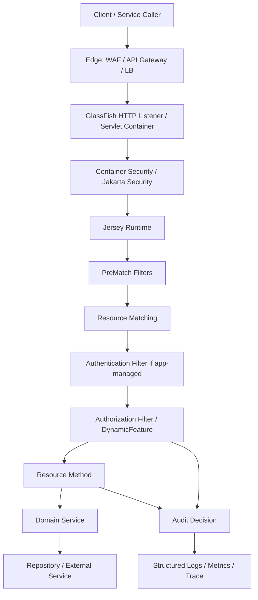

# Part 015 — Security Hooks in Jersey: AuthN, AuthZ, Principal, Roles

> Goal: memahami security bukan sebagai “pasang filter JWT”, tetapi sebagai boundary runtime yang menentukan siapa caller, apa haknya, bagaimana identity dipropagasikan, dan di titik mana Jersey/GlassFish harus menolak request secara defensible.

Di seri Jakarta REST sebelumnya kita sudah membahas resource, method, status code, dan kontrak REST. Bagian ini tidak mengulang basic REST security. Fokusnya adalah **runtime security model** saat aplikasi berjalan di **Jersey on GlassFish**.

Security di Jersey/GlassFish biasanya gagal bukan karena engineer tidak tahu `Authorization: Bearer ...`, tetapi karena boundary-nya kabur:

- gateway sudah authenticate, tapi service masih percaya header mentah;
- resource method membaca `userId` dari path dan menganggap itu identity;
- filter melakukan authentication, authorization, audit, tenancy, dan business rule sekaligus;
- role dianggap sama dengan permission;
- 401 dan 403 dipakai sembarangan;
- principal tidak dipropagasikan ke async thread;
- token diverifikasi, tetapi tenant isolation tidak dicek;
- dependency security API bercampur antara `javax.*` dan `jakarta.*`;
- GlassFish container security dan Jersey filter security saling tumpang tindih.

Mental model utama:

> Authentication establishes caller identity. Authorization decides whether that identity may perform an action on a specific resource instance. Tenant isolation constrains the resource universe. Audit records the decision. These are related, but they are not the same responsibility.

---

## 1. Kaufman Deconstruction

Agar skill ini cepat berguna, pecah menjadi sub-skill berikut:

| Sub-skill | Pertanyaan yang harus bisa dijawab |
|---|---|
| Boundary placement | Di mana authentication seharusnya terjadi: proxy, container, Jersey filter, atau resource? |
| Identity model | Apa yang dianggap identity canonical? token subject, principal name, user ID, service account, atau session? |
| `SecurityContext` | Bagaimana Jersey/Jakarta REST mengekspos caller dan role ke resource? |
| Filter ordering | Kapan filter authentication jalan relatif terhadap authorization, validation, tracing, dan audit? |
| Container security | Kapan memakai GlassFish/Jakarta Security dibanding custom Jersey filter? |
| Authorization model | Role, scope, permission, policy, tenant, ownership: mana yang dicek di mana? |
| Error semantics | Kapan 401, 403, 404 masking, 400, dan 500? |
| Async propagation | Bagaimana identity hidup saat request berpindah thread? |
| Testing | Bagaimana membuktikan tidak ada bypass path, spoof header, tenant leak, dan confused deputy? |

Target praktis setelah part ini:

1. Bisa menggambar request security pipeline Jersey.
2. Bisa memilih antara container-managed dan application-managed security.
3. Bisa membuat `ContainerRequestFilter` authentication yang tidak mencampur business authorization.
4. Bisa membuat permission annotation yang jelas dan testable.
5. Bisa menjelaskan perbedaan `Principal`, role, scope, permission, dan tenant.
6. Bisa membuat threat checklist untuk endpoint Jersey production.

---

## 2. Runtime Security Pipeline

Security dalam Jersey/GlassFish terjadi pada beberapa lapisan. Jangan menganggap “Jersey filter” adalah seluruh security system.



Setiap lapisan punya tanggung jawab yang berbeda:

| Layer | Tanggung jawab valid | Tanggung jawab yang berbahaya |
|---|---|---|
| Gateway/WAF | TLS termination, coarse routing, rate limit, some JWT validation | Menjadi satu-satunya authorization untuk resource-level access |
| GlassFish/Servlet/Jakarta Security | Container-managed auth, role mapping, security constraint | Business ownership policy yang butuh domain data kompleks |
| Jersey request filter | Parse/verify token, set `SecurityContext`, reject unauthenticated request | Query database business-heavy untuk semua endpoint tanpa batas |
| Jersey authorization filter | Endpoint-level permission check, annotation-based policy dispatch | Menyimpan state global per request di singleton field |
| Resource method | Call domain service with authenticated identity | Membaca identity dari path/query/header mentah |
| Domain service | Resource-level authorization, tenant ownership, invariant enforcement | Percaya bahwa endpoint sudah selalu benar |

Production invariant:

> Security decision harus bisa dijelaskan dari log dan audit: caller siapa, action apa, target apa, policy mana, hasil apa, correlation ID apa.

---

## 3. Authentication vs Authorization vs Tenancy

Banyak bug security berasal dari mencampur tiga pertanyaan ini:

| Pertanyaan | Nama | Contoh |
|---|---|---|
| Siapa caller? | Authentication | Token valid untuk `alice@example.com` |
| Caller boleh melakukan action ini? | Authorization | Alice punya permission `case.approve` |
| Caller boleh melihat resource instance ini? | Tenancy/ownership | Case `CASE-123` berada di tenant Alice |

Contoh buruk:

```java
@GET
@Path("/tenants/{tenantId}/cases/{caseId}")
public CaseDto getCase(@PathParam("tenantId") String tenantId,
                       @PathParam("caseId") String caseId) {
    return caseService.getCase(tenantId, caseId);
}
```

Masalahnya bukan syntax. Masalahnya adalah `tenantId` dari URL dipakai seolah-olah caller memang berhak atas tenant itu.

Pattern yang lebih aman:

```java
@GET
@Path("/tenants/{tenantId}/cases/{caseId}")
public CaseDto getCase(@Context SecurityContext securityContext,
                       @PathParam("tenantId") TenantId tenantId,
                       @PathParam("caseId") CaseId caseId) {
    AuthenticatedCaller caller = AuthenticatedCaller.from(securityContext);
    return caseService.getCase(caller, tenantId, caseId);
}
```

Lalu domain service tetap menegakkan policy:

```java
public CaseDto getCase(AuthenticatedCaller caller, TenantId tenantId, CaseId caseId) {
    tenantPolicy.requireMember(caller, tenantId);
    casePolicy.requireReadable(caller, tenantId, caseId);

    CaseRecord record = caseRepository.findRequired(tenantId, caseId);
    return CaseDto.from(record);
}
```

Invariant:

> Path parameter identifies requested resource. It does not authenticate caller ownership.

---

## 4. Jakarta REST `SecurityContext` Mental Model

Jakarta REST exposes request security via `jakarta.ws.rs.core.SecurityContext`.

Core methods:

```java
Principal getUserPrincipal();
boolean isUserInRole(String role);
boolean isSecure();
String getAuthenticationScheme();
```

Do not treat `SecurityContext` as a full identity system. Treat it as a **runtime adapter** between HTTP/Jersey/container and your application identity model.

Recommended domain wrapper:

```java
public record AuthenticatedCaller(
        String subject,
        Set<String> roles,
        Set<String> scopes,
        Set<String> tenantIds,
        boolean serviceAccount
) {
    public static AuthenticatedCaller from(SecurityContext securityContext) {
        Principal principal = securityContext.getUserPrincipal();
        if (principal == null) {
            throw new UnauthenticatedException("Missing authenticated principal");
        }

        // Role extraction is intentionally explicit.
        Set<String> roles = KnownRoles.ALL.stream()
                .filter(securityContext::isUserInRole)
                .collect(java.util.stream.Collectors.toUnmodifiableSet());

        return new AuthenticatedCaller(
                principal.getName(),
                roles,
                Set.of(),
                Set.of(),
                false
        );
    }
}
```

Why wrap it?

- Domain code should not depend on Jersey API.
- Test code can create `AuthenticatedCaller` without HTTP runtime.
- You can add tenant/scopes/service-account metadata.
- You avoid passing `SecurityContext` deep into repositories.

Bad practice:

```java
repository.findCases(securityContext);
```

Better:

```java
repository.findCases(QueryScope.forCaller(caller));
```

---

## 5. Application-Managed Bearer Token Filter

Jika authentication dilakukan di aplikasi, implementasi biasanya memakai `ContainerRequestFilter`.

Minimal structure:

```java
@Provider
@Priority(Priorities.AUTHENTICATION)
public final class BearerAuthenticationFilter implements ContainerRequestFilter {

    private final TokenVerifier tokenVerifier;

    public BearerAuthenticationFilter(TokenVerifier tokenVerifier) {
        this.tokenVerifier = tokenVerifier;
    }

    @Override
    public void filter(ContainerRequestContext requestContext) {
        String authorization = requestContext.getHeaderString(HttpHeaders.AUTHORIZATION);
        if (authorization == null || !authorization.startsWith("Bearer ")) {
            abortUnauthenticated(requestContext, "missing_bearer_token");
            return;
        }

        String token = authorization.substring("Bearer ".length()).trim();
        VerifiedToken verifiedToken;
        try {
            verifiedToken = tokenVerifier.verify(token);
        } catch (TokenExpiredException ex) {
            abortUnauthenticated(requestContext, "token_expired");
            return;
        } catch (TokenVerificationException ex) {
            abortUnauthenticated(requestContext, "invalid_token");
            return;
        }

        requestContext.setSecurityContext(new BearerSecurityContext(
                requestContext.getSecurityContext(),
                verifiedToken
        ));
    }

    private static void abortUnauthenticated(ContainerRequestContext ctx, String reason) {
        ctx.abortWith(Response.status(Response.Status.UNAUTHORIZED)
                .header(HttpHeaders.WWW_AUTHENTICATE, "Bearer error=\"" + reason + "\"")
                .type(MediaType.APPLICATION_JSON_TYPE)
                .entity(new ErrorBody("UNAUTHENTICATED", "Authentication is required"))
                .build());
    }
}
```

Security context adapter:

```java
public final class BearerSecurityContext implements SecurityContext {

    private final SecurityContext delegate;
    private final VerifiedToken token;

    public BearerSecurityContext(SecurityContext delegate, VerifiedToken token) {
        this.delegate = delegate;
        this.token = token;
    }

    @Override
    public Principal getUserPrincipal() {
        return () -> token.subject();
    }

    @Override
    public boolean isUserInRole(String role) {
        return token.roles().contains(role);
    }

    @Override
    public boolean isSecure() {
        return delegate != null && delegate.isSecure();
    }

    @Override
    public String getAuthenticationScheme() {
        return "Bearer";
    }
}
```

Important boundaries:

- Filter verifies token signature, issuer, audience, expiry, not-before, and token type.
- Filter sets principal and coarse roles/scopes.
- Filter should not load heavy domain aggregates for every request.
- Resource/domain service still enforces resource-level policy.
- Do not log token content.

---

## 6. 401 vs 403 vs 404 Masking

Use status codes consistently:

| Situation | Status | Meaning |
|---|---:|---|
| No credential | 401 | Caller is not authenticated |
| Invalid/expired credential | 401 | Caller must authenticate again |
| Valid credential, missing permission | 403 | Caller is authenticated but not allowed |
| Resource not found inside allowed scope | 404 | Resource does not exist for this caller |
| Resource exists but revealing existence is sensitive | 404 masking | Hide existence to prevent enumeration |
| Token accepted but malformed request | 400 | Authentication succeeded, input invalid |
| Policy engine unavailable | 503 or fail closed 403 | Depends on architecture and safety requirement |

Example: do not return 403 for every unknown case ID if attackers can enumerate case IDs. For sensitive regulatory systems, a common rule is:

> If caller is not allowed to know a resource exists, return the same shape and timing class as not found.

But masking must be explicit. Do not mask everything blindly because operations teams still need diagnostics.

Recommended internal decision:

```java
public enum AccessDecision {
    ALLOW,
    DENY_UNAUTHENTICATED,
    DENY_FORBIDDEN,
    DENY_NOT_FOUND_MASKED
}
```

Then map decisions in one place.

---

## 7. Authorization Annotation with Name Binding

Jersey filters can be bound to selected resources using name binding. This lets you create explicit authorization markers.

Annotation:

```java
@NameBinding
@Retention(RetentionPolicy.RUNTIME)
@Target({ElementType.TYPE, ElementType.METHOD})
public @interface RequiresPermission {
    String value();
}
```

Filter:

```java
@Provider
@RequiresPermission("")
@Priority(Priorities.AUTHORIZATION)
public final class PermissionAuthorizationFilter implements ContainerRequestFilter {

    @Context
    ResourceInfo resourceInfo;

    private final PermissionEvaluator evaluator;

    public PermissionAuthorizationFilter(PermissionEvaluator evaluator) {
        this.evaluator = evaluator;
    }

    @Override
    public void filter(ContainerRequestContext requestContext) {
        RequiresPermission requirement = findRequirement(resourceInfo);
        if (requirement == null) {
            return;
        }

        AuthenticatedCaller caller = AuthenticatedCaller.from(requestContext.getSecurityContext());
        boolean allowed = evaluator.hasPermission(caller, requirement.value());

        if (!allowed) {
            requestContext.abortWith(Response.status(Response.Status.FORBIDDEN)
                    .type(MediaType.APPLICATION_JSON_TYPE)
                    .entity(new ErrorBody("FORBIDDEN", "Access denied"))
                    .build());
        }
    }

    private RequiresPermission findRequirement(ResourceInfo info) {
        RequiresPermission method = info.getResourceMethod().getAnnotation(RequiresPermission.class);
        if (method != null) {
            return method;
        }
        return info.getResourceClass().getAnnotation(RequiresPermission.class);
    }
}
```

Resource:

```java
@Path("/cases")
public class CaseResource {

    @GET
    @Path("/{caseId}")
    @RequiresPermission("case.read")
    public CaseDto findCase(@Context SecurityContext securityContext,
                            @PathParam("caseId") CaseId caseId) {
        AuthenticatedCaller caller = AuthenticatedCaller.from(securityContext);
        return caseService.findCase(caller, caseId);
    }

    @POST
    @Path("/{caseId}/approve")
    @RequiresPermission("case.approve")
    public ApprovalResult approve(@Context SecurityContext securityContext,
                                  @PathParam("caseId") CaseId caseId,
                                  ApprovalCommand command) {
        AuthenticatedCaller caller = AuthenticatedCaller.from(securityContext);
        return caseService.approve(caller, caseId, command);
    }
}
```

This solves endpoint-level authorization only. Resource-level authorization still belongs in domain service.

---

## 8. DynamicFeature for Centralized Policy Binding

Name binding is clean, but there are cases where you want more control. `DynamicFeature` can register filters based on resource method metadata.

```java
@Provider
public final class AuthorizationFeature implements DynamicFeature {

    private final PermissionEvaluator evaluator;

    public AuthorizationFeature(PermissionEvaluator evaluator) {
        this.evaluator = evaluator;
    }

    @Override
    public void configure(ResourceInfo resourceInfo, FeatureContext context) {
        RequiresPermission permission = resourceInfo.getResourceMethod()
                .getAnnotation(RequiresPermission.class);

        if (permission == null) {
            permission = resourceInfo.getResourceClass()
                    .getAnnotation(RequiresPermission.class);
        }

        if (permission != null) {
            context.register(new PermissionFilter(permission.value(), evaluator));
        }
    }
}
```

Filter instance:

```java
public final class PermissionFilter implements ContainerRequestFilter {

    private final String permission;
    private final PermissionEvaluator evaluator;

    public PermissionFilter(String permission, PermissionEvaluator evaluator) {
        this.permission = permission;
        this.evaluator = evaluator;
    }

    @Override
    public void filter(ContainerRequestContext requestContext) {
        AuthenticatedCaller caller = AuthenticatedCaller.from(requestContext.getSecurityContext());
        if (!evaluator.hasPermission(caller, permission)) {
            requestContext.abortWith(Response.status(Response.Status.FORBIDDEN).build());
        }
    }
}
```

Use this when:

- filter needs constructor parameter derived from annotation;
- authorization must be registered deterministically at startup;
- you want to fail fast if endpoint has invalid security metadata.

---

## 9. Role, Scope, Permission, Policy

Do not collapse these concepts.

| Concept | Stable? | Example | Good for |
|---|---:|---|---|
| Role | Medium | `SUPERVISOR`, `CASE_WORKER` | Human organizational grouping |
| Scope | Medium | `cases:read`, `cases:write` | OAuth/client capability |
| Permission | More explicit | `case.approve`, `case.assign` | Application action |
| Policy | Contextual | “approver cannot approve own case” | Domain rule |
| Tenant membership | Contextual | caller belongs to tenant `T1` | Data partition boundary |

A role should usually map to permissions, not directly to domain decisions.

Bad:

```java
if (securityContext.isUserInRole("ADMIN")) {
    approve(caseId);
}
```

Better:

```java
permissionService.require(caller, "case.approve");
casePolicy.requireApproverCanApprove(caller, caseId);
```

Better still for regulated workflows:

```java
public ApprovalResult approve(AuthenticatedCaller caller, CaseId caseId, ApprovalCommand command) {
    CaseRecord record = caseRepository.findRequired(caseId);

    decisionPolicy.require(caller, Action.APPROVE_CASE, record);
    lifecyclePolicy.requireTransition(record.state(), CaseEvent.APPROVE);
    segregationOfDutiesPolicy.requireNotOriginalSubmitter(caller, record);

    return approvalEngine.approve(caller, record, command);
}
```

This makes policy explainable and auditable.

---

## 10. Container-Managed Security in GlassFish

GlassFish can enforce security before Jersey sees the request via Servlet/Jakarta Security mechanisms.

Common use cases:

- form/basic/client-cert auth in traditional enterprise apps;
- role constraints on URL patterns;
- integration with realms/identity stores;
- admin-controlled deployment descriptors;
- applications that benefit from standard container security.

Example `web.xml` security constraint:

```xml
<web-app xmlns="https://jakarta.ee/xml/ns/jakartaee"
         xmlns:xsi="http://www.w3.org/2001/XMLSchema-instance"
         xsi:schemaLocation="https://jakarta.ee/xml/ns/jakartaee https://jakarta.ee/xml/ns/jakartaee/web-app_6_1.xsd"
         version="6.1">

    <security-constraint>
        <web-resource-collection>
            <web-resource-name>API</web-resource-name>
            <url-pattern>/api/*</url-pattern>
            <http-method>GET</http-method>
            <http-method>POST</http-method>
            <http-method>PUT</http-method>
            <http-method>DELETE</http-method>
        </web-resource-collection>
        <auth-constraint>
            <role-name>api-user</role-name>
        </auth-constraint>
    </security-constraint>

    <login-config>
        <auth-method>BASIC</auth-method>
        <realm-name>api-realm</realm-name>
    </login-config>

    <security-role>
        <role-name>api-user</role-name>
    </security-role>
</web-app>
```

For modern service APIs, BASIC is rarely the final answer, but the model matters: the container can establish caller identity before Jersey dispatches resources.

Decision rule:

| Requirement | Prefer |
|---|---|
| Standard enterprise auth, URL constraints, container role mapping | GlassFish/Jakarta Security |
| JWT/OAuth token validation tightly coupled to API gateway | Jersey filter or Jakarta Security custom mechanism |
| Complex domain authorization | Domain policy service |
| Per-resource ownership/tenant check | Domain policy service |
| Endpoint-level permission annotation | Jersey filter/DynamicFeature |

---

## 11. Jakarta Security Integration Mental Model

Jakarta Security gives a platform-level model for authentication and identity stores. In a full Jakarta EE runtime, it can integrate with CDI and Servlet security.

A simplified form:

```java
@ApplicationScoped
public class ApiIdentityStore implements IdentityStore {

    @Override
    public CredentialValidationResult validate(Credential credential) {
        if (!(credential instanceof CallerOnlyCredential callerOnlyCredential)) {
            return CredentialValidationResult.NOT_VALIDATED_RESULT;
        }

        String caller = callerOnlyCredential.getCaller();
        Set<String> groups = loadGroups(caller);
        return new CredentialValidationResult(caller, groups);
    }
}
```

You may also implement an HTTP authentication mechanism when you want container-managed authentication with custom token extraction.

The architectural question is not “filter or Jakarta Security?” The question is:

> Which component owns authentication as a platform concern, and how will Jersey/resource/domain code consume the resulting identity consistently?

If using Jakarta Security, keep Jersey resource code boring:

```java
@GET
@Path("/me")
public CallerProfile me(@Context SecurityContext restSecurityContext) {
    return profileService.profileFor(AuthenticatedCaller.from(restSecurityContext));
}
```

The resource should not care whether identity came from JWT, mTLS, OIDC, SAML bridge, BASIC, or a test realm.

---

## 12. Service-to-Service Calls and Confused Deputy Risk

In distributed systems, many requests are service-to-service. A service can accidentally become a confused deputy: it has broad permission and performs an action on behalf of a caller that was not allowed.

Distinguish:

| Caller type | Meaning | Required checks |
|---|---|---|
| End user | Human identity | user permission + tenant + resource policy |
| Service account | Machine identity | service permission + allowed delegation |
| Delegated call | Service acting for user | service permission + original user permission |

A robust identity model can preserve both:

```java
public record AuthenticatedCaller(
        String subject,
        CallerType type,
        Optional<String> actorSubject,
        Set<String> permissions,
        Set<String> tenantIds
) {}
```

Example:

```text
subject      = case-export-service
actorSubject = alice@example.com
permission   = case.export
```

Policy can then ask:

- Is the service allowed to export?
- Is Alice allowed to export this case?
- Is this tenant allowed to use export feature?
- Is the case state exportable?

Never infer end-user authority from service account authority.

---

## 13. SecurityContext and Async Boundaries

From Part 012, async Jersey work may move execution to another thread. Request-scoped context is not automatically safe to use everywhere.

Bad:

```java
@GET
@Path("/slow")
public void slow(@Suspended AsyncResponse response,
                 @Context SecurityContext securityContext) {
    executor.submit(() -> {
        // Risky: depending on runtime/context, this may not be valid later.
        String user = securityContext.getUserPrincipal().getName();
        response.resume(service.load(user));
    });
}
```

Better:

```java
@GET
@Path("/slow")
public void slow(@Suspended AsyncResponse response,
                 @Context SecurityContext securityContext) {
    AuthenticatedCaller caller = AuthenticatedCaller.from(securityContext);

    executor.submit(() -> {
        try {
            response.resume(service.load(caller));
        } catch (Throwable error) {
            response.resume(error);
        }
    });
}
```

Invariant:

> Extract immutable security facts at the request boundary before crossing async thread boundaries.

The same applies to correlation ID, tenant ID, locale, and audit context.

---

## 14. Audit Trail Pattern

A security decision without audit is difficult to defend.

Audit record should include:

| Field | Example |
|---|---|
| correlation ID | `req-8f31...` |
| caller subject | `alice@example.com` |
| actor/service | `case-api` |
| tenant | `tenant-123` |
| action | `case.approve` |
| resource type | `case` |
| resource ID | `CASE-2026-0001` |
| decision | `ALLOW` / `DENY` |
| reason code | `ROLE_MISSING`, `TENANT_MISMATCH`, `SOD_VIOLATION` |
| policy version | `case-approval-policy:v7` |
| timestamp | server-side time |

Do not store raw bearer token, password, session cookie, or full PII payload.

Example:

```java
public final class AuditedPermissionEvaluator implements PermissionEvaluator {

    private final PermissionEvaluator delegate;
    private final AuditSink auditSink;

    @Override
    public boolean hasPermission(AuthenticatedCaller caller, String permission) {
        boolean allowed = delegate.hasPermission(caller, permission);
        auditSink.record(AuditEvent.builder()
                .caller(caller.subject())
                .action(permission)
                .decision(allowed ? "ALLOW" : "DENY")
                .build());
        return allowed;
    }
}
```

For regulated case-management systems, audit should be append-only or tamper-evident at the storage layer, not merely application logs.

---

## 15. Multi-Tenant Enforcement Pattern

Tenant isolation must not depend only on UI or gateway routing.

Pattern:

```java
public final class TenantGuard {

    public void requireTenantAccess(AuthenticatedCaller caller, TenantId tenantId) {
        if (!caller.tenantIds().contains(tenantId.value())) {
            throw new MaskedNotFoundException("Resource not found");
        }
    }
}
```

Use it before loading sensitive resource details:

```java
public CaseDto findCase(AuthenticatedCaller caller, TenantId tenantId, CaseId caseId) {
    tenantGuard.requireTenantAccess(caller, tenantId);

    CaseRecord record = caseRepository.findRequiredInTenant(tenantId, caseId);
    casePolicy.requireReadable(caller, record);

    return mapper.toDto(record);
}
```

Database-level isolation can further reduce blast radius:

- tenant ID mandatory in every table query;
- composite unique keys include tenant ID;
- row-level security if supported and operationally mature;
- separate schemas/databases for high-isolation tenants;
- no repository method that queries only by global `caseId` unless globally unique and policy-safe.

Do not rely on resource method path alone.

---

## 16. CORS Is Not Authentication

CORS controls whether browsers allow frontend JavaScript to read cross-origin responses. It does not stop non-browser clients.

Bad statement:

> “The endpoint is safe because CORS only allows our frontend domain.”

Correct model:

- CORS is browser policy.
- Authentication verifies caller.
- Authorization checks allowed action.
- CSRF defense is separate for cookie-based browser sessions.

If using bearer tokens from SPA/mobile:

- do not put tokens in query string;
- avoid logging `Authorization`;
- set short expiry + refresh strategy;
- validate audience/issuer;
- protect against token substitution between environments;
- distinguish user tokens and service tokens.

If using cookies:

- use `HttpOnly`, `Secure`, `SameSite` appropriately;
- add CSRF protection for state-changing requests;
- avoid treating CORS as CSRF protection.

---

## 17. Security Headers in Response Filters

Security headers are often applied at gateway, but application-level fallback is useful.

```java
@Provider
@Priority(Priorities.HEADER_DECORATOR)
public final class SecurityHeadersFilter implements ContainerResponseFilter {

    @Override
    public void filter(ContainerRequestContext requestContext,
                       ContainerResponseContext responseContext) {
        MultivaluedMap<String, Object> headers = responseContext.getHeaders();
        headers.putSingle("X-Content-Type-Options", "nosniff");
        headers.putSingle("X-Frame-Options", "DENY");
        headers.putSingle("Referrer-Policy", "no-referrer");
        headers.putSingle("Cache-Control", "no-store");
    }
}
```

Be careful with `Cache-Control: no-store`. It may be appropriate for sensitive APIs, but not for every static or public resource. For API JSON carrying confidential data, prefer safe defaults.

Do not use response filters to hide authorization mistakes. They are decorators, not policy engines.

---

## 18. Secrets and Configuration Boundaries

Security hooks need secrets: JWT public keys, client secrets, mTLS truststores, OIDC metadata, password hashes, encryption keys.

Rules:

- Do not hard-code secrets in resource/filter classes.
- Do not package environment-specific secrets in WAR.
- Do not log loaded secret values.
- Rotate keys without redeploy if possible.
- Cache public key/JWKS with expiry and failure strategy.
- Pin issuer/audience/environment.
- Use GlassFish/config provider/secret manager integration according to your platform.

Example verifier contract:

```java
public interface TokenVerifier {
    VerifiedToken verify(String token) throws TokenVerificationException;
}
```

Do not let every filter/resource parse JWT independently. Centralize verification.

---

## 19. Testing Security Hooks

Security testing must cover bypass paths, not only happy path.

### 19.1 Filter Unit Test

```java
@Test
void missingBearerTokenReturns401() {
    ContainerRequestContext ctx = fakeRequestWithoutAuthorization();

    filter.filter(ctx);

    assertThat(ctx.getAbortedResponse().getStatus()).isEqualTo(401);
    assertThat(ctx.getAbortedResponse().getHeaderString(HttpHeaders.WWW_AUTHENTICATE))
            .contains("Bearer");
}
```

### 19.2 Resource-Level Test Matrix

| Test | Expected |
|---|---|
| no token | 401 |
| malformed token | 401 |
| expired token | 401 |
| valid token wrong audience | 401 |
| valid token missing permission | 403 |
| valid permission wrong tenant | 404 masked or 403 by policy |
| valid tenant missing resource | 404 |
| valid everything | 200/201/204 |
| spoofed `X-User-Id` header | ignored |
| token subject differs from path user ID | policy failure |
| service account without delegation | 403 |

### 19.3 Regression Test for Public Endpoints

Have an explicit allowlist for unauthenticated endpoints:

```text
GET /health/live
GET /health/ready
GET /openapi.json
POST /auth/callback
```

Everything else should require authentication by default.

The dangerous default is opt-in security. Prefer opt-out public endpoints.

---

## 20. Common Anti-Patterns

| Anti-pattern | Why it fails | Better pattern |
|---|---|---|
| Trusting `X-User-Id` from client | Header spoofing | Trust only gateway-signed or container-established identity |
| Doing all security in resource methods | Inconsistent coverage | Boundary filter + domain policy |
| Role equals permission | Coarse and brittle | Map role/scope to explicit permission |
| No tenant check in domain service | Bypass via internal call | Tenant guard in domain boundary |
| Catch-all 403 | Poor diagnostics and bad client behavior | 401/403/404 policy semantics |
| Logging bearer tokens | Credential leak | Redact sensitive headers |
| Security logic in response filter | Too late | Request filter/domain policy |
| Assuming gateway auth is enough | Internal bypass risk | Defense-in-depth verification |
| Singleton resource mutable caller field | Cross-request data leak | Request-local immutable caller |
| Using CORS as auth | Non-browser bypass | Real authentication and authorization |

---

## 21. Security Review Checklist

Before production, answer these questions:

1. Which endpoints are public? Is the list explicit?
2. Where is authentication performed?
3. Can a request reach GlassFish/Jersey without gateway auth?
4. Does the service verify issuer, audience, expiry, token type, and signature?
5. What is the canonical subject?
6. Are roles/scopes mapped to permissions centrally?
7. Where is resource-level authorization enforced?
8. Where is tenant isolation enforced?
9. Are service accounts distinguished from human users?
10. Is delegation explicit?
11. Are 401/403/404 decisions consistent?
12. Are authorization decisions audited?
13. Are bearer tokens redacted from logs?
14. Are async tasks passed immutable caller data?
15. Are secrets externalized and rotatable?
16. Do tests include bypass and negative cases?
17. Does monitoring show authentication failure rates separately from authorization failures?
18. Can an operator diagnose deny reason without exposing sensitive data to client?

---

## 22. Mini Design Exercise

Design security for:

```text
POST /tenants/{tenantId}/cases/{caseId}/approve
```

Required invariants:

- caller is authenticated;
- caller belongs to `tenantId`;
- caller has `case.approve` permission;
- case exists in tenant;
- case is currently approvable;
- caller is not the original submitter;
- approval is audited;
- failure returns no sensitive case existence information to unauthorized tenants.

Possible structure:

```java
@POST
@Path("/tenants/{tenantId}/cases/{caseId}/approve")
@RequiresPermission("case.approve")
public ApprovalResult approve(@Context SecurityContext securityContext,
                              @PathParam("tenantId") TenantId tenantId,
                              @PathParam("caseId") CaseId caseId,
                              ApprovalCommand command) {
    AuthenticatedCaller caller = AuthenticatedCaller.from(securityContext);
    return caseApprovalService.approve(caller, tenantId, caseId, command);
}
```

Domain service:

```java
public ApprovalResult approve(AuthenticatedCaller caller,
                              TenantId tenantId,
                              CaseId caseId,
                              ApprovalCommand command) {
    tenantGuard.requireTenantAccess(caller, tenantId);
    CaseRecord record = caseRepository.findRequiredInTenant(tenantId, caseId);

    permissionService.require(caller, Permission.CASE_APPROVE);
    lifecyclePolicy.require(record.state(), CaseEvent.APPROVE);
    segregationPolicy.requireNotSubmitter(caller, record);

    ApprovalResult result = approvalEngine.approve(record, command, caller);

    auditSink.record(AuditEvent.caseApproved(caller, tenantId, caseId, result.decisionId()));
    return result;
}
```

Notice the separation:

- Jersey annotation gives endpoint-level clarity.
- Domain service enforces real business invariants.
- Audit happens close to the decision.
- Repository queries are tenant-constrained.

---

## 23. Production Heuristics

Use these rules in real design review:

1. **Authenticate once, authorize many times.** Authentication establishes identity. Each action still needs authorization.
2. **Deny by default.** Public endpoints must be explicit.
3. **Never trust resource IDs from URL as authorization facts.** They are only requested targets.
4. **Extract immutable identity before async boundaries.** Avoid request context leakage.
5. **Keep filters thin.** Filters are excellent for boundary mechanics, bad for rich domain policy.
6. **Make policy explainable.** Future auditors and incident responders need reason codes.
7. **Do not leak existence accidentally.** Especially in case, enforcement, citizen, finance, health, and legal systems.
8. **Do not make role checks your domain model.** Roles are organizational; policies are behavioral.
9. **Test the failure matrix.** Security is mostly about negative paths.
10. **Keep runtime API boundaries clean.** Domain services should not depend on Jersey internals.

---

## 24. What to Practice for 60–90 Minutes

Build a small Jersey module with:

1. `BearerAuthenticationFilter` that sets `SecurityContext`.
2. `@RequiresPermission` annotation.
3. `DynamicFeature` that registers an authorization filter.
4. `AuthenticatedCaller` wrapper.
5. `TenantGuard` in domain service.
6. Audit event emitted on allow/deny.
7. Test matrix for 401, 403, masked 404, and success.

Do not overbuild token verification. Stub `TokenVerifier` first. The skill is boundary design.

---

## 25. Key Takeaways

- Jersey security hooks are powerful because they sit inside request runtime, but they should not become a hidden business policy engine.
- `SecurityContext` is an adapter, not your domain identity model.
- Authentication, authorization, tenant isolation, and audit are separate decisions.
- Container-managed security and application-managed filters are both valid, but their ownership must be clear.
- Domain services must still enforce resource-level authorization because internal calls, async jobs, and future endpoints can bypass resource annotations.
- Production-grade security is testable through explicit negative-path matrix, not just by reading code.

---

## References

- Jakarta RESTful Web Services 4.0 specification page: https://jakarta.ee/specifications/restful-ws/4.0/
- Jakarta RESTful Web Services 4.0 specification document: https://jakarta.ee/specifications/restful-ws/4.0/jakarta-restful-ws-spec-4.0
- Jakarta Security 4.0 specification: https://jakarta.ee/specifications/security/4.0/jakarta-security-spec-4.0
- Eclipse GlassFish Application Development Guide, Release 8: https://glassfish.org/docs/latest/application-development-guide.html
