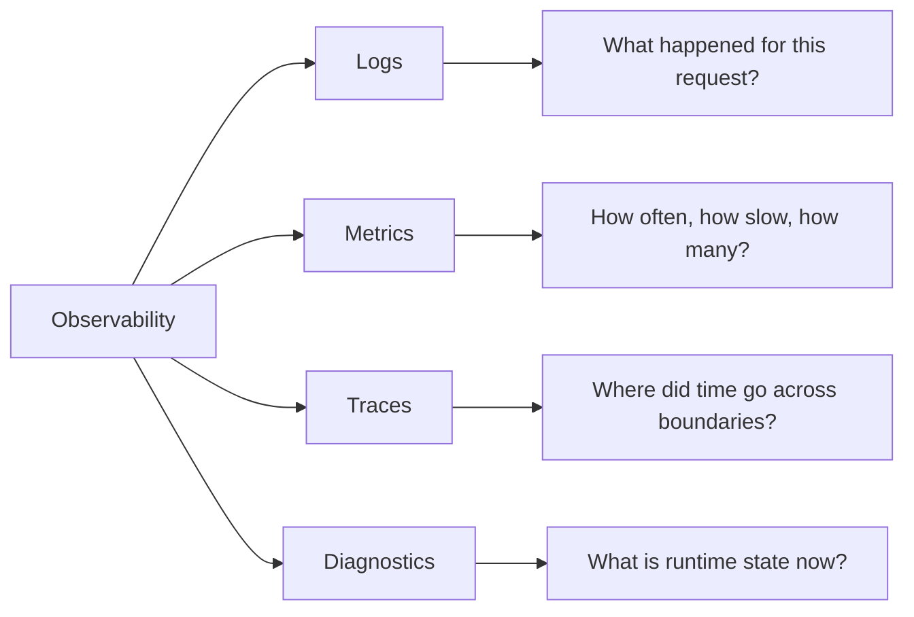
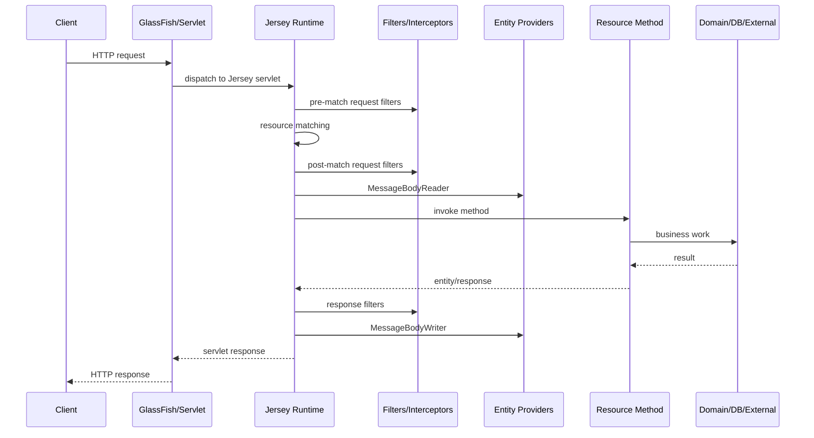

# Part 016 — Observability in Jersey: Logs, Metrics, Tracing, Diagnostics

> Goal: membangun kemampuan membaca sistem Jersey/GlassFish dari luar dan dalam: request logs, structured application logs, correlation ID, metrics, tracing, Jersey event listener, monitoring statistics, JMX, thread dump, dan diagnostic decision tree.

Observability bukan “menambahkan log”. Observability adalah kemampuan menjawab pertanyaan operasional tanpa deploy ulang dan tanpa menebak:

- Endpoint mana yang lambat?
- Lambatnya di matching, provider, resource method, database, external call, atau serialization?
- 500 naik karena exception mapper, provider, resource method, atau dependency downstream?
- 415 muncul karena client salah `Content-Type` atau provider hilang?
- 401/403 naik karena token invalid, role missing, tenant mismatch, atau outage identity provider?
- Thread pool GlassFish habis karena slow client, blocking DB, deadlock, atau outbound timeout?
- Deployment baru mengubah provider selection atau route registry?

Mental model utama:

> Logs explain individual events. Metrics explain aggregate behavior. Traces explain causal paths. Diagnostics explain runtime state. You need all four.

---

## 1. Kaufman Deconstruction

Pecah skill observability Jersey menjadi sub-skill berikut:

| Sub-skill | Pertanyaan yang harus bisa dijawab |
|---|---|
| Request identity | Bagaimana satu request dilacak dari gateway sampai resource method? |
| Logging | Log apa yang wajib ada, di mana, dengan field apa? |
| Metrics | Counter/timer/gauge apa yang membuktikan health dan degradation? |
| Tracing | Bagaimana memahami jalur request across service dan internal Jersey stage? |
| Jersey monitoring | Bagaimana memakai event listener, monitoring statistics, dan JMX? |
| GlassFish diagnostics | Kapan membaca server log, access log, thread dump, heap dump, JMX? |
| Failure classification | Bagaimana membedakan client error, auth error, provider error, pool exhaustion, timeout? |
| Production safety | Bagaimana observability tidak membocorkan token/PII dan tidak terlalu mahal? |

Target praktis:

1. Bisa membuat correlation ID filter.
2. Bisa mendesain structured log contract untuk Jersey request.
3. Bisa menambahkan request timer dengan outcome classification.
4. Bisa memakai Jersey event listener untuk lifecycle diagnostics.
5. Bisa menjelaskan kapan mengaktifkan Jersey tracing/monitoring statistics.
6. Bisa membaca symptom HTTP menjadi runtime hypothesis.

---

## 2. Four Pillars for Jersey Runtime



Each pillar answers a different kind of question:

| Pillar | Good at | Bad at |
|---|---|---|
| Logs | Explaining individual events and decisions | Aggregate trend without processing |
| Metrics | Alerting, SLO, rate, latency, saturation | Per-request causality |
| Traces | End-to-end causal path | High-cardinality global aggregation |
| Diagnostics | Thread/heap/classloader/runtime state | Continuous business health |

For Jersey/GlassFish production, a minimum baseline is:

- access log at edge or server;
- application structured log with correlation ID;
- request count by method/path/status/outcome;
- latency histogram/timer by route;
- outbound client metrics;
- auth failure counters;
- exception mapper counters;
- thread pool/JDBC pool gauges;
- ability to capture thread dump;
- targeted tracing for diagnostic windows.

---

## 3. Request Lifecycle Observability Map

Jersey request processing has multiple observable stages.



You want to know:

- Did request reach GlassFish?
- Did it reach Jersey?
- Which resource method matched?
- Which auth decision happened?
- Did body reading fail?
- Did resource method throw?
- Did exception mapper handle it?
- Did body writing fail?
- What was final status and latency?

This is why one “request completed” log is not enough.

---

## 4. Correlation ID Filter

Every request should have a stable correlation ID.

Rules:

- Accept a trusted inbound correlation header if present and valid.
- Generate one if missing.
- Return it in response header.
- Put it into logging context.
- Propagate it to outbound Jersey Client calls.
- Never use correlation ID as authentication.

Example:

```java
@Provider
@Priority(Priorities.AUTHENTICATION - 100)
public final class CorrelationIdFilter implements ContainerRequestFilter, ContainerResponseFilter {

    public static final String HEADER = "X-Correlation-Id";
    public static final String PROPERTY = "correlationId";

    @Override
    public void filter(ContainerRequestContext requestContext) {
        String inbound = requestContext.getHeaderString(HEADER);
        String correlationId = isValid(inbound) ? inbound : generate();

        requestContext.setProperty(PROPERTY, correlationId);
        org.slf4j.MDC.put(PROPERTY, correlationId);
    }

    @Override
    public void filter(ContainerRequestContext requestContext,
                       ContainerResponseContext responseContext) {
        Object correlationId = requestContext.getProperty(PROPERTY);
        if (correlationId != null) {
            responseContext.getHeaders().putSingle(HEADER, correlationId.toString());
        }
        org.slf4j.MDC.remove(PROPERTY);
    }

    private static boolean isValid(String value) {
        return value != null && value.length() <= 128 && value.matches("[A-Za-z0-9._:-]+");
    }

    private static String generate() {
        return java.util.UUID.randomUUID().toString();
    }
}
```

Important nuance:

`ContainerResponseFilter` should clean MDC, but async flows and exception paths can complicate cleanup. For heavy production systems, prefer a try/finally wrapper or a request lifecycle listener that guarantees cleanup at request finish.

---

## 5. Structured Request Log Contract

A useful request-completed log should be machine-readable.

Recommended fields:

| Field | Example |
|---|---|
| `event` | `http_request_completed` |
| `correlation_id` | `7c7b...` |
| `trace_id` | OpenTelemetry trace ID if available |
| `method` | `POST` |
| `route_template` | `/tenants/{tenantId}/cases/{caseId}/approve` |
| `path` | optional, avoid high-cardinality full path if sensitive |
| `status` | `403` |
| `outcome` | `authz_denied` |
| `duration_ms` | `42` |
| `principal_hash` | hash/pseudonymized subject if needed |
| `tenant_id` | if safe and policy allows |
| `error_code` | `TENANT_MISMATCH` |
| `exception_type` | `ForbiddenException` |
| `request_size_bytes` | optional |
| `response_size_bytes` | optional |

Do not log:

- bearer tokens;
- cookies;
- passwords;
- raw PII payload;
- full request body by default;
- authorization headers;
- large response bodies.

Example log emission:

```java
@Provider
@Priority(Priorities.USER)
public final class RequestCompletionLoggingFilter implements ContainerRequestFilter, ContainerResponseFilter {

    private static final String START_NANOS = "startNanos";

    @Context
    ResourceInfo resourceInfo;

    @Override
    public void filter(ContainerRequestContext requestContext) {
        requestContext.setProperty(START_NANOS, System.nanoTime());
    }

    @Override
    public void filter(ContainerRequestContext requestContext,
                       ContainerResponseContext responseContext) {
        long start = (long) requestContext.getProperty(START_NANOS);
        long durationMs = java.util.concurrent.TimeUnit.NANOSECONDS.toMillis(System.nanoTime() - start);

        String route = routeTemplate(resourceInfo);
        int status = responseContext.getStatus();

        log.info("event=http_request_completed method={} route={} status={} duration_ms={} outcome={}",
                requestContext.getMethod(),
                route,
                status,
                durationMs,
                classify(status));
    }

    private static String routeTemplate(ResourceInfo info) {
        if (info == null || info.getResourceMethod() == null) {
            return "unknown";
        }
        Path classPath = info.getResourceClass().getAnnotation(Path.class);
        Path methodPath = info.getResourceMethod().getAnnotation(Path.class);
        String a = classPath == null ? "" : classPath.value();
        String b = methodPath == null ? "" : methodPath.value();
        return ("/" + a + "/" + b).replaceAll("//+", "/");
    }

    private static String classify(int status) {
        if (status >= 500) return "server_error";
        if (status == 401) return "authn_failed";
        if (status == 403) return "authz_denied";
        if (status >= 400) return "client_error";
        return "success";
    }
}
```

In real code, use structured logging encoder instead of string concatenation so fields become indexed JSON.

---

## 6. Metrics: What to Measure

Metrics should represent rate, latency, errors, and saturation.

### 6.1 HTTP Server Metrics

| Metric | Type | Labels |
|---|---|---|
| `http.server.requests.total` | counter | method, route, status, outcome |
| `http.server.request.duration` | histogram/timer | method, route, status class |
| `http.server.request.bytes` | histogram | route, method |
| `http.server.response.bytes` | histogram | route, status class |

Avoid high-cardinality labels:

- user ID;
- full path with IDs;
- raw exception message;
- token subject;
- search query text.

Use route template, not concrete path.

Bad:

```text
route=/cases/CASE-2026-000123
```

Good:

```text
route=/cases/{caseId}
```

### 6.2 Security Metrics

| Metric | Why it matters |
|---|---|
| `authn.failures.total{reason}` | Detect expired/invalid token spikes |
| `authz.denials.total{permission}` | Detect policy/config regressions |
| `tenant.denials.total` | Detect probing or bad client routing |
| `public.endpoint.requests.total` | Detect abuse on unauthenticated endpoints |

### 6.3 Jersey Runtime Metrics

| Metric | Why it matters |
|---|---|
| provider read/write duration | Serialization/deserialization bottleneck |
| exception mapper counts | Error taxonomy health |
| request filter duration | Expensive auth/audit/filter chain |
| resource method duration | Business endpoint latency |
| async timeout count | Saturation or downstream slowness |
| SSE open connections | Long-lived connection load |

### 6.4 GlassFish / Infrastructure Metrics

| Metric | Why it matters |
|---|---|
| HTTP thread pool active/queued | Thread starvation |
| JDBC pool active/available/wait time | DB bottleneck |
| JVM heap/non-heap | Memory pressure |
| GC pause | Latency spikes |
| CPU | Saturation |
| file descriptors | Connection/resource leak |

---

## 7. Jersey Event Listener for Request Diagnostics

Jersey provides server-side monitoring extension points such as `ApplicationEventListener` and `RequestEventListener`. They let you observe lifecycle events without polluting every resource method.

Example:

```java
@Provider
public final class RequestDiagnosticsListener implements ApplicationEventListener {

    @Override
    public void onEvent(ApplicationEvent event) {
        if (event.getType() == ApplicationEvent.Type.INITIALIZATION_FINISHED) {
            log.info("event=jersey_initialized resources={} providers={}",
                    event.getResourceConfig().getClasses().size(),
                    event.getProviders().size());
        }
    }

    @Override
    public RequestEventListener onRequest(RequestEvent requestEvent) {
        long start = System.nanoTime();
        return event -> {
            switch (event.getType()) {
                case RESOURCE_METHOD_START -> log.debug("event=resource_method_start method={}",
                        event.getUriInfo().getMatchedResourceMethod());
                case EXCEPTION_MAPPING_FINISHED -> log.debug("event=exception_mapping_finished");
                case FINISHED -> log.debug("event=request_finished duration_ms={}",
                        java.util.concurrent.TimeUnit.NANOSECONDS.toMillis(System.nanoTime() - start));
                default -> {
                    // Keep noise controlled.
                }
            }
        };
    }
}
```

Use event listeners for:

- startup route/provider visibility;
- request stage diagnostics;
- measuring runtime phases;
- exceptional event tracking;
- diagnostic builds or feature-flagged observation.

Do not use event listeners for business logic.

---

## 8. Jersey Monitoring Statistics and JMX

Jersey has optional monitoring statistics. It can expose data such as request execution statistics, resource method statistics, response counts, and exception mapper execution counts. It can also expose statistics through JMX MBeans.

Enable statistics:

```java
public class ApiApplication extends ResourceConfig {
    public ApiApplication() {
        property("jersey.config.server.monitoring.statistics.enabled", true);
    }
}
```

Enable MBeans:

```java
public class ApiApplication extends ResourceConfig {
    public ApiApplication() {
        property("jersey.config.server.monitoring.statistics.mbeans.enabled", true);
    }
}
```

Use carefully:

- statistics collection has overhead;
- JMX exposure may reveal internal application structure;
- enable only when operationally justified;
- protect JMX access;
- do not expose it publicly;
- prefer controlled environment profiles.

A safe profile strategy:

| Environment | Statistics | MBeans | Tracing |
|---|---:|---:|---:|
| local/dev | on | optional | on demand/all |
| staging | on demand | protected | on demand |
| production default | off or minimal | protected/off | off/on demand only |
| incident window | temporarily on | protected | on demand |

---

## 9. Jersey Tracing Support

Jersey tracing can show internal request processing stages, including matching, filters, interceptors, message body readers/writers, invocation, response filters, and exception handling.

Conceptual use:

```java
public class ApiApplication extends ResourceConfig {
    public ApiApplication() {
        property("jersey.config.server.tracing.type", "ON_DEMAND");
        property("jersey.config.server.tracing.threshold", "SUMMARY");
    }
}
```

Then a diagnostic request can opt in:

```bash
curl -i \
  -H 'X-Jersey-Tracing-Accept: true' \
  -H 'X-Jersey-Tracing-Threshold: SUMMARY' \
  http://localhost:8080/api/cases/123
```

Do not set tracing to `ALL` in production by default. Verbose tracing can echo headers and expose sensitive detail depending on mode/configuration.

Use tracing when investigating:

- 404 route mismatch;
- 406/415 negotiation failures;
- provider selection problems;
- filter priority/order issues;
- exception mapper behavior;
- unexpectedly slow Jersey pipeline stage.

---

## 10. OpenTelemetry Boundary Model

Jersey tracing is Jersey-specific diagnostics. Distributed tracing usually means OpenTelemetry or vendor-compatible tracing.

Trace spans should represent causal work:

```mermaid
flowchart TD
    A[server span: POST /cases/{id}/approve] --> B[auth filter]
    A --> C[resource method]
    C --> D[domain policy]
    C --> E[db query]
    C --> F[outbound Jersey Client call]
    F --> G[remote service span]
```

Practical rules:

- name server span using route template, not full path;
- attach status/error attributes safely;
- do not attach raw tokens or PII;
- propagate trace context to outbound Jersey Client;
- sample intelligently;
- keep high-cardinality values out of span names.

Outbound Jersey Client filter for correlation/trace propagation:

```java
@Provider
public final class OutboundCorrelationFilter implements ClientRequestFilter {

    @Override
    public void filter(ClientRequestContext requestContext) {
        String correlationId = org.slf4j.MDC.get("correlationId");
        if (correlationId != null) {
            requestContext.getHeaders().putSingle("X-Correlation-Id", correlationId);
        }
    }
}
```

Register with client:

```java
Client client = ClientBuilder.newBuilder()
        .register(OutboundCorrelationFilter.class)
        .build();
```

In production, prefer OpenTelemetry instrumentation when available, and use Jersey filters/listeners to fill framework-specific gaps.

---

## 11. Exception Observability

From Part 009, exception mapping is part of the contract. Observability must distinguish:

- expected domain denial;
- validation failure;
- not found;
- downstream timeout;
- database outage;
- serialization failure;
- unknown bug.

Exception mapper should emit metrics and logs without leaking sensitive content.

```java
@Provider
public final class UnhandledExceptionMapper implements ExceptionMapper<Throwable> {

    @Override
    public Response toResponse(Throwable exception) {
        String errorId = UUID.randomUUID().toString();

        log.error("event=unhandled_exception error_id={} exception_type={}",
                errorId,
                exception.getClass().getName(),
                exception);

        metrics.counter("http.server.exceptions", "type", exception.getClass().getSimpleName())
                .increment();

        return Response.status(Response.Status.INTERNAL_SERVER_ERROR)
                .type(MediaType.APPLICATION_JSON_TYPE)
                .entity(new ErrorBody("INTERNAL_ERROR", "Unexpected error", errorId))
                .build();
    }
}
```

Classify exception families:

| Family | Client status | Log level | Alert? |
|---|---:|---|---|
| Validation | 400 | INFO/DEBUG | Usually no |
| Unauthenticated | 401 | INFO | Spike alert |
| Forbidden | 403 | INFO/WARN | Spike alert |
| Not found | 404 | DEBUG/INFO | Abuse detection only |
| Conflict | 409 | INFO | Business trend |
| Downstream timeout | 504/503 | WARN/ERROR | Yes |
| DB unavailable | 503/500 | ERROR | Yes |
| Serialization bug | 500 | ERROR | Yes |
| Unknown exception | 500 | ERROR | Yes |

---

## 12. Access Log vs Application Log

Access logs and application logs are not substitutes.

| Log | Produced by | Contains | Good for |
|---|---|---|---|
| Access log | GlassFish/proxy/LB | method, path, status, bytes, duration | traffic, status trends, basic latency |
| Application log | Jersey/app code | route, caller, decision, error code, domain state | debugging and causality |
| Audit log | business/security subsystem | who did what to what, decision, policy | compliance and investigation |

Example event split:

```text
access log:
POST /api/tenants/T1/cases/C1/approve 403 21ms

application log:
event=http_request_completed route=/tenants/{tenantId}/cases/{caseId}/approve status=403 outcome=authz_denied permission=case.approve correlation_id=...

audit log:
event=authorization_decision caller=alice action=case.approve tenant=T1 resource=C1 decision=DENY reason=SOD_VIOLATION policy=approval:v7
```

Do not turn application log into audit log by accident. Audit has stronger retention, integrity, and access-control requirements.

---

## 13. GlassFish Diagnostics

When symptom points below Jersey, use GlassFish/JVM diagnostics.

### 13.1 Server Log

Look for:

- deployment errors;
- classloading conflict;
- CDI/HK2 injection failure;
- resource pool errors;
- thread pool warnings;
- SSL/TLS listener problems;
- application initialization failures.

### 13.2 Thread Dump

Use when:

- latency spikes;
- requests hang;
- CPU high;
- no response but process alive;
- suspected deadlock;
- pool exhaustion.

Thread dump questions:

- Are HTTP threads blocked on DB pool?
- Are threads waiting on external HTTP client without timeout?
- Are many threads writing to slow clients?
- Is there lock contention in singleton resource/filter/provider?
- Are async executor threads exhausted?

### 13.3 Heap Dump

Use when:

- memory leak suspected;
- `OutOfMemoryError`;
- increasing old-gen after full GC;
- unbounded buffering;
- leaked `Response`/streams;
- SSE clients retained after disconnect.

### 13.4 JMX

Use for:

- pool metrics;
- thread state;
- Jersey monitoring MBeans if enabled;
- JVM memory/GC;
- operational introspection.

Protect JMX. Treat it as privileged runtime control plane.

---

## 14. Diagnostic Decision Tree

```mermaid
flowchart TD
    A[Symptom] --> B{HTTP status?}
    B -->|404| C[Route/model/path matching]
    B -->|405| D[Method allowed/matching]
    B -->|406| E[Accept/@Produces/provider writer]
    B -->|415| F[Content-Type/@Consumes/provider reader]
    B -->|400| G[Validation/param conversion/body parsing]
    B -->|401| H[Authentication/token/container security]
    B -->|403| I[Authorization/role/permission/tenant]
    B -->|409| J[Domain conflict/state transition]
    B -->|500| K[Exception/resource/provider/mapper]
    B -->|503/504| L[Pool/downstream/timeout/saturation]
    B -->|Slow 2xx| M[Latency decomposition]

    C --> N[Jersey tracing + route registry]
    E --> O[Jersey tracing + providers]
    F --> O
    H --> P[Auth metrics/logs]
    I --> Q[Audit decision logs]
    K --> R[Exception mapper logs]
    L --> S[Thread dump + pool metrics]
    M --> T[Trace + timers + thread dump]
```

Do not start with random code inspection. Start with symptom classification.

---

## 15. Latency Decomposition

For slow endpoint, break time into layers:

```text
total latency
  = network ingress
  + servlet/container queue
  + Jersey filters
  + resource matching
  + request body read/deserialization
  + resource method
      + domain policy
      + database
      + outbound calls
  + response filters
  + serialization
  + network egress
```

Timer points:

| Segment | Instrument with |
|---|---|
| whole request | server filter/timer |
| auth filter | filter-specific timer |
| body read/write | interceptor/provider metrics if needed |
| resource method | Jersey event listener or AOP/interceptor |
| DB | datasource/persistence metrics |
| outbound HTTP | Jersey Client filter + connector metrics |
| async wait | async response timeout/wait metrics |

If you only measure resource method time, you miss serialization and filters. If you only measure access log time, you cannot localize cause.

---

## 16. Provider and Serialization Diagnostics

Serialization can dominate latency and memory.

Symptoms:

- 2xx slow but DB fast;
- high CPU on response-heavy endpoints;
- large heap allocation;
- `MessageBodyWriter not found`;
- 500 after resource method returns successfully;
- response filter sees OK, but client gets 500 due to write failure.

Diagnostics:

- enable Jersey tracing on demand;
- log selected media type and route;
- check registered providers at startup;
- validate JSON provider dependency;
- measure payload size;
- inspect object graph for lazy-loaded entities;
- avoid returning JPA entities directly;
- avoid buffering large response into memory.

Startup provider registry log:

```java
@Provider
public final class StartupInventoryListener implements ApplicationEventListener {

    @Override
    public void onEvent(ApplicationEvent event) {
        if (event.getType() == ApplicationEvent.Type.INITIALIZATION_FINISHED) {
            event.getProviders().forEach(provider ->
                    log.info("event=jersey_provider_registered provider={}", provider.getClass().getName())
            );
        }
    }

    @Override
    public RequestEventListener onRequest(RequestEvent requestEvent) {
        return null;
    }
}
```

Use this carefully; provider inventory can be noisy.

---

## 17. Filter and Interceptor Diagnostics

Filter order bugs are subtle.

Instrumentation fields:

- filter class;
- priority;
- phase: pre-match, request, response, reader, writer;
- duration;
- abort decision;
- reason code;
- route if available.

Example targeted timing wrapper:

```java
public final class TimedAuthFilter implements ContainerRequestFilter {

    private final ContainerRequestFilter delegate;

    @Override
    public void filter(ContainerRequestContext requestContext) throws IOException {
        long start = System.nanoTime();
        try {
            delegate.filter(requestContext);
        } finally {
            long durationMicros = TimeUnit.NANOSECONDS.toMicros(System.nanoTime() - start);
            metrics.timer("jersey.filter.duration", "filter", delegate.getClass().getSimpleName())
                    .record(durationMicros, TimeUnit.MICROSECONDS);
        }
    }
}
```

Use on high-risk filters:

- authentication;
- authorization;
- audit;
- request body logging/sanitization;
- compression;
- encryption/decryption;
- tenancy resolution;
- external policy lookup.

---

## 18. Outbound Jersey Client Observability

Server endpoints often look slow because outbound calls are slow.

Client filter:

```java
public final class ClientTimingFilter implements ClientRequestFilter, ClientResponseFilter {

    private static final String START = "startNanos";

    @Override
    public void filter(ClientRequestContext requestContext) {
        requestContext.setProperty(START, System.nanoTime());
    }

    @Override
    public void filter(ClientRequestContext requestContext,
                       ClientResponseContext responseContext) {
        long start = (long) requestContext.getProperty(START);
        long durationMs = TimeUnit.NANOSECONDS.toMillis(System.nanoTime() - start);

        log.info("event=outbound_http_completed method={} host={} status={} duration_ms={}",
                requestContext.getMethod(),
                requestContext.getUri().getHost(),
                responseContext.getStatus(),
                durationMs);
    }
}
```

Failure metrics:

| Metric | Meaning |
|---|---|
| `outbound.requests.total{target,status}` | Dependency behavior |
| `outbound.duration{target}` | Dependency latency |
| `outbound.timeouts.total{target,type}` | Timeout pressure |
| `outbound.connection.errors.total{target}` | Network/TLS/DNS/connect issues |
| `outbound.retries.total{target}` | Retry amplification risk |

Never label metrics by full URL with IDs/query strings.

---

## 19. Health, Readiness, and Liveness

Do not build one `/health` endpoint that checks everything.

| Endpoint | Should check | Should not check |
|---|---|---|
| liveness | process/event loop not dead | database, external services |
| readiness | can serve traffic | expensive deep dependency scan every request |
| startup | migration/config/bootstrap complete | transient downstream health if not required |

Example:

```java
@Path("/health")
public class HealthResource {

    @GET
    @Path("/live")
    public Response live() {
        return Response.ok(Map.of("status", "UP")).build();
    }

    @GET
    @Path("/ready")
    public Response ready() {
        Readiness readiness = readinessService.check();
        return Response.status(readiness.up() ? 200 : 503)
                .entity(readiness)
                .build();
    }
}
```

Readiness should be quick, bounded by timeout, and cacheable briefly if checks are expensive.

Do not include secrets, internal URLs, or detailed exception stack traces in public health responses.

---

## 20. Alerting Strategy

Metrics without alerts are dashboards. Alerts should map to user impact or imminent failure.

Good alerts:

| Alert | Signal |
|---|---|
| API availability below SLO | 5xx/total ratio over window |
| Latency SLO burn | p95/p99 duration over threshold |
| Auth failure spike | 401 reason spike after deploy or attack |
| Authorization denial spike | 403 permission-specific anomaly |
| JDBC pool exhaustion | active near max + wait time |
| HTTP thread starvation | queue growing + active maxed |
| Downstream timeout spike | outbound timeout counter |
| Async timeout spike | suspended responses timing out |
| OOM risk | heap high after full GC |

Bad alerts:

- every single 500 as page;
- CPU > 80% without user impact;
- log string matching without structure;
- alerts on expected 404s;
- dashboards nobody owns.

---

## 21. Observability and Privacy

Observability can become data leakage.

Rules:

- Redact `Authorization`, `Cookie`, `Set-Cookie`.
- Do not log raw request/response bodies by default.
- Hash or pseudonymize principal where possible.
- Avoid storing sensitive path/query values in labels.
- Separate audit logs from operational logs.
- Apply retention and access control.
- Make debug/tracing modes time-limited.
- Review Jersey tracing headers before enabling outside dev.

Sensitive fields checklist:

```text
Authorization
Cookie
Set-Cookie
X-Api-Key
password
access_token
refresh_token
id_token
ssn
nik
email
phone
address
bank_account
case narrative
medical/legal notes
```

For regulatory workflows, assume case narrative and attachments are confidential.

---

## 22. Startup Observability

A production service should explain its runtime shape at startup.

Recommended startup logs:

- application name/version/git commit;
- Java version;
- Jakarta/Jersey/GlassFish baseline if available;
- active environment/profile;
- context root/application path;
- registered resources count;
- provider count;
- important feature flags;
- configured outbound dependencies names, not secrets;
- config validation result.

Example:

```java
public final class StartupLogFeature implements Feature {

    @Override
    public boolean configure(FeatureContext context) {
        log.info("event=api_starting app={} version={} java={}",
                "case-api",
                BuildInfo.version(),
                Runtime.version());
        return true;
    }
}
```

Startup observability helps diagnose:

- wrong artifact deployed;
- wrong profile;
- missing provider;
- classpath conflict;
- disabled security filter;
- accidental mock dependency in production.

---

## 23. Failure Playbooks

### 23.1 415 Unsupported Media Type

Check:

1. Request has correct `Content-Type`.
2. Resource method has matching `@Consumes`.
3. `MessageBodyReader` exists for entity type + media type.
4. Provider dependency is packaged correctly.
5. No version conflict in classpath.
6. Jersey tracing shows MBR selection/skip reason.

### 23.2 406 Not Acceptable

Check:

1. Client `Accept` header.
2. Resource method `@Produces`.
3. `MessageBodyWriter` for response type + media type.
4. Error response media type if exception path.
5. Provider registration/order.

### 23.3 Random 500 After Successful Domain Operation

Hypothesis:

- response serialization failed;
- lazy entity loaded outside transaction;
- response filter threw;
- `MessageBodyWriter` failed;
- client disconnected mid-write.

Check:

- exception mapper logs;
- Jersey tracing around MBW;
- application log before/after resource return;
- stack trace root cause;
- payload size.

### 23.4 Slow API with Low CPU

Hypothesis:

- waiting on DB pool;
- waiting on outbound HTTP without timeout;
- thread pool queue;
- slow client streaming;
- lock contention.

Check:

- thread dump;
- JDBC pool metrics;
- outbound timeout metrics;
- HTTP thread pool active/queued;
- p95 by route;
- trace spans.

### 23.5 High 401 After Deployment

Hypothesis:

- issuer/audience config changed;
- clock skew;
- JWKS fetch failure;
- gateway forwarding changed;
- token type mismatch;
- environment pointing to wrong identity provider.

Check:

- auth failure reason metric;
- deployment diff;
- config startup log;
- JWKS cache logs;
- sample sanitized token claims in non-production only.

---

## 24. Minimal Observability Implementation Plan

For a new Jersey/GlassFish API, implement in this order:

1. Correlation ID filter.
2. Structured request-completed log.
3. Error ID in exception mapper.
4. Metrics for request count/latency/status.
5. Auth failure and authz denial metrics.
6. Outbound Jersey Client timing filter.
7. Health readiness/liveness endpoints.
8. Startup inventory log.
9. On-demand Jersey tracing for non-production and incident windows.
10. Thread dump and heap dump runbook.

Do not start with fancy dashboards before the signal contract is stable.

---

## 25. Common Anti-Patterns

| Anti-pattern | Why it fails | Better pattern |
|---|---|---|
| Logging raw request body globally | PII/secrets leak, huge overhead | Targeted sanitized debug logging |
| Metrics labeled by user ID | Cardinality explosion | Route/status/outcome labels |
| Full path as metric label | Cardinality explosion | Route template |
| One `/health` checks everything | Causes false restarts/outages | Separate live/ready/startup |
| No correlation ID | Hard to connect logs | Generate/propagate request ID |
| Only access logs | No application causality | Access + app + audit logs |
| Tracing `ALL` in production | Overhead and data exposure | On-demand/time-boxed tracing |
| Catch-all 500 without error ID | Impossible support workflow | Error ID + internal log |
| No outbound metrics | Blame wrong layer | Client timing + timeout metrics |
| No thread dump runbook | Blind during incident | Predefined diagnostic commands/process |

---

## 26. Practice Lab

Build a small observability package:

```text
com.example.api.observability
  CorrelationIdFilter
  RequestCompletionLoggingFilter
  JerseyDiagnosticsListener
  OutboundCorrelationFilter
  OutboundTimingFilter
  HealthResource
  ErrorIdExceptionMapper
```

Exercise:

1. Call a successful endpoint and verify correlation ID in response/log.
2. Trigger validation failure and verify `outcome=client_error`.
3. Trigger unauthorized and verify `outcome=authn_failed`.
4. Trigger forbidden and verify audit decision.
5. Trigger `MessageBodyWriter` error and verify error ID.
6. Enable Jersey tracing on demand and inspect provider/matching stages.
7. Simulate slow downstream and verify outbound timing metric.
8. Take a thread dump during slow request and identify blocking point.

The goal is not to build a monitoring platform. The goal is to make runtime behavior legible.

---

## 27. Key Takeaways

- Observability is a design constraint, not an afterthought.
- Jersey gives useful runtime hooks: filters, interceptors, event listeners, monitoring statistics, MBeans, and tracing.
- Logs, metrics, traces, and diagnostics answer different questions; none replaces the others.
- Use route templates and outcome classification to avoid cardinality explosion.
- Treat security, tenant, and audit signals as first-class observability dimensions.
- Turn on expensive diagnostics intentionally and protect access to internal runtime data.
- The best production engineers can move from HTTP symptom to runtime hypothesis quickly and prove or disprove it with signals.

---

## References

- Jakarta RESTful Web Services 4.0 specification page: https://jakarta.ee/specifications/restful-ws/4.0/
- Jersey Monitoring and Diagnostics documentation: https://eclipse-ee4j.github.io/jersey.github.io/documentation/latest/monitoring_tracing.html
- Eclipse GlassFish Application Development Guide, Release 8: https://glassfish.org/docs/latest/application-development-guide.html
- Jakarta Security 4.0 specification: https://jakarta.ee/specifications/security/4.0/jakarta-security-spec-4.0
