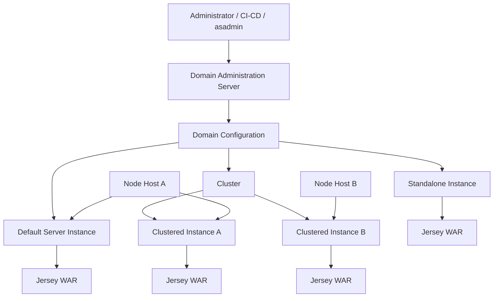
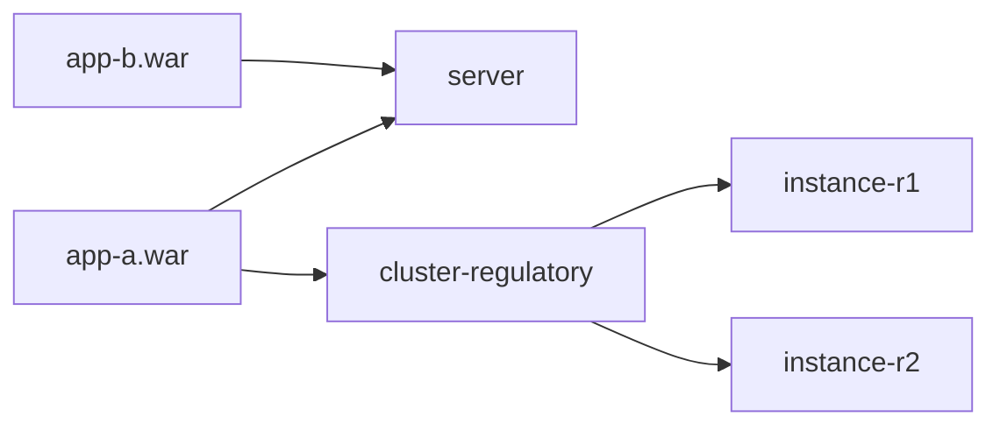
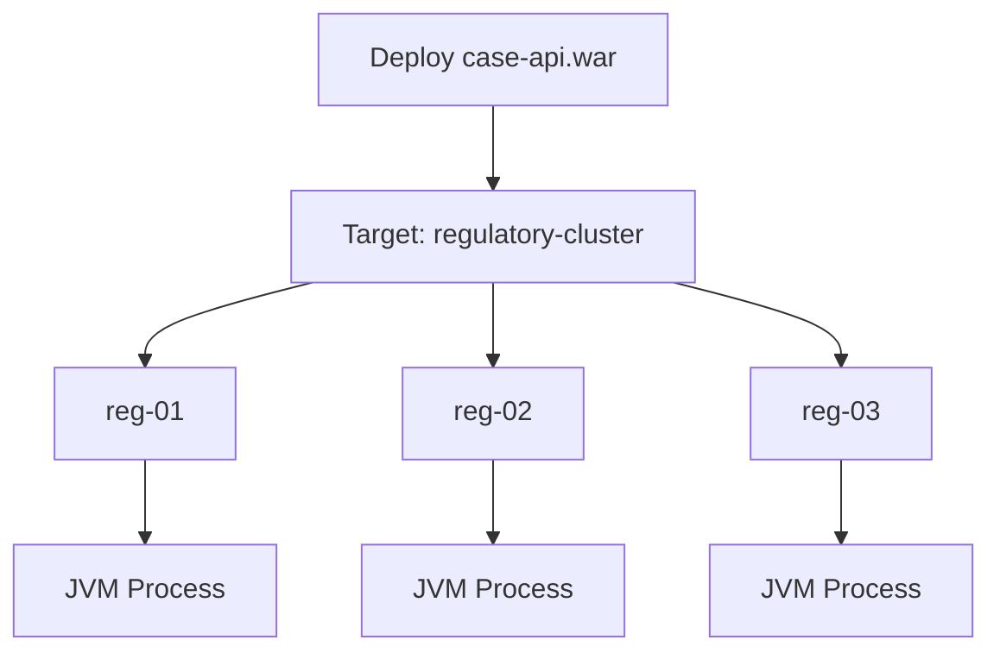
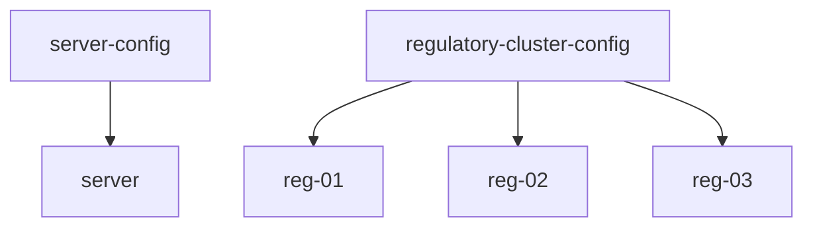
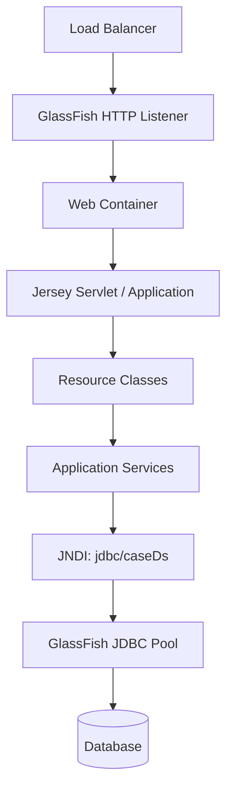
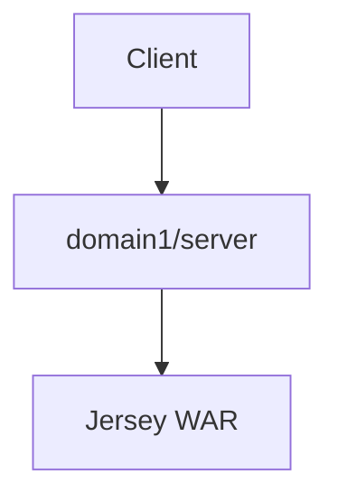
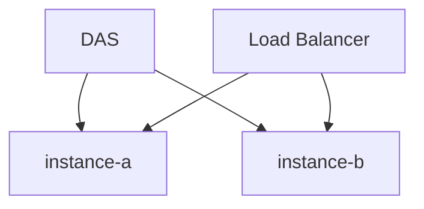
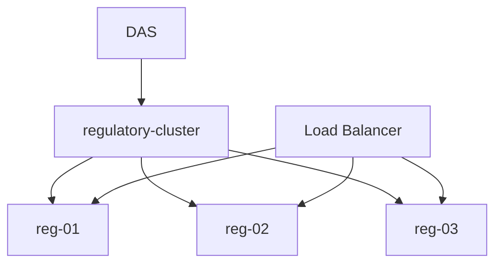
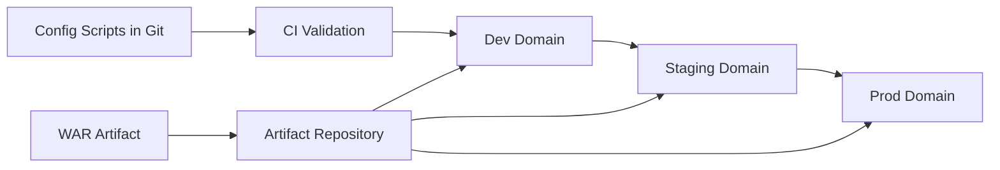

# Part 017 — GlassFish Domain Model: Domain, Instance, Node, Cluster

Bagian ini membahas **model administrasi dan topology GlassFish**. Ini bukan materi REST, bukan juga sekadar cara menjalankan `asadmin start-domain`. Targetnya adalah membangun mental model agar kita bisa menjawab pertanyaan production seperti:

- artifact Jersey kita sebenarnya berjalan di proses JVM yang mana?
- konfigurasi berasal dari mana?
- apa bedanya domain, server, instance, node, cluster, dan config?
- deploy target ke `server`, instance, cluster, atau domain?
- kenapa perubahan config berlaku di satu instance tapi tidak di instance lain?
- bagaimana menghindari konfigurasi drift antar-environment?
- kapan cluster GlassFish membantu, dan kapan justru menyembunyikan desain REST yang buruk?

> Prinsip Kaufman untuk bagian ini: **deconstruct the skill**. Jangan melihat GlassFish sebagai “server tempat deploy WAR”. Pecah menjadi: process model, admin model, target model, config model, resource model, lifecycle model, dan failure model.

---

## 1. Mental Model Utama

GlassFish memiliki dua wajah:

1. **Runtime application server**  
   Tempat aplikasi Jakarta EE/Jersey berjalan sebagai proses JVM.

2. **Administration system**  
   Sistem untuk membuat, mengubah, menargetkan, menjalankan, menghentikan, dan mengamati runtime tersebut.

Kesalahan umum engineer adalah menganggap keduanya sama. Padahal di production, yang sering bermasalah justru hubungan antar keduanya.



Model paling ringkas:

| Konsep | Pertanyaan yang Dijawab |
|---|---|
| Domain | Satu boundary administrasi GlassFish |
| DAS | Siapa yang mengontrol domain? |
| Instance | Proses server tempat aplikasi berjalan |
| Node | Host/logical host tempat instance dibuat |
| Cluster | Grup instance yang dikelola sebagai unit |
| Config | Kumpulan setting yang diwariskan oleh target |
| Target | Ke mana command/deploy/resource diarahkan |
| Resource | Infrastruktur container: JDBC pool, JMS, connector, security realm, dsb |

---

## 2. Domain: Boundary Administrasi, Bukan Boundary Bisnis

**Domain** adalah unit administrasi. Satu domain berisi konfigurasi, target deployment, resource, server instance, cluster, security configuration, logs, dan state administratif.

Domain bukan:

- bounded context bisnis,
- tenant,
- environment otomatis,
- aplikasi,
- cluster fisik,
- namespace Kubernetes.

Domain adalah boundary operasional GlassFish.

Contoh struktur konseptual:

```text
GLASSFISH_HOME/
  glassfish/
    domains/
      domain1/
        config/
          domain.xml
        applications/
        generated/
        logs/
        lib/
```

Dalam deployment production yang defensible, domain harus diperlakukan sebagai **runtime state + configuration state** yang perlu direkonstruksi secara deterministic dari script, bukan sebagai folder misterius yang diubah manual lewat admin console.

---

## 3. Domain Administration Server atau DAS

Setiap domain memiliki **Domain Administration Server**. DAS adalah instance khusus yang memiliki kapabilitas administrasi.

Tugas DAS:

- menerima command administrasi dari `asadmin` remote mode,
- menyediakan Admin Console,
- menyimpan dan mengubah `domain.xml`,
- membuat/menghapus instance,
- membuat/menghapus cluster,
- deploy/undeploy aplikasi ke target,
- mengelola resource target,
- mengirim perubahan config ke instance terkait,
- mengoordinasikan lifecycle instance tertentu.

DAS juga adalah server instance. Pada domain default, instance bernama `server` biasanya berperan sebagai DAS sekaligus tempat aplikasi bisa dideploy.

Di development, deploy ke `server` sering cukup. Di production, mencampur DAS dan workload aplikasi perlu dipikirkan ulang.

### 3.1. DAS sebagai Control Plane

Gunakan analogi cloud native:

| GlassFish | Analogi Cloud/Kubernetes |
|---|---|
| DAS | Control plane ringan |
| Instance | Workload/runtime node process |
| Cluster | Workload group |
| Config | Desired configuration |
| `asadmin` | Admin CLI/API |
| Target | Scope perubahan |

Namun analogi ini tidak sempurna. GlassFish bukan Kubernetes. Jangan memaksakan asumsi self-healing, scheduler, service discovery, rolling update, dan autoscaling kecuali fitur itu memang tersedia atau dibangun di luar GlassFish.

---

## 4. Server Instance

**Instance** adalah runtime server yang menjalankan aplikasi. Ia adalah proses JVM dengan konfigurasi tertentu.

Ada beberapa jenis instance secara praktis:

| Jenis | Karakter |
|---|---|
| DAS/default server | Instance administrasi utama, sering bernama `server` |
| Standalone instance | Instance runtime tidak berada dalam cluster |
| Clustered instance | Instance runtime yang menjadi anggota cluster |

Instance memiliki:

- JVM process,
- HTTP listener,
- thread pool,
- deployed applications,
- resources yang ditargetkan,
- logs,
- generated artifacts,
- runtime monitoring state.

### 4.1. Instance Bukan Aplikasi

Satu instance bisa menjalankan banyak aplikasi. Satu aplikasi bisa dideploy ke banyak instance atau cluster. Ini menghasilkan matrix:



Pertanyaan production yang benar bukan “aplikasi berjalan di GlassFish?”, tetapi:

> Artifact version X dideploy ke target mana, target itu resolve ke instance mana, instance itu memakai config apa, dan resource apa yang aktif untuk instance tersebut?

---

## 5. Node

**Node** merepresentasikan lokasi host tempat instance dapat dibuat dan dijalankan.

Node bisa dipahami sebagai record administratif tentang host. Ia menjawab:

- instance ini secara fisik/logis berada di host mana?
- bagaimana DAS menjangkau host itu?
- apakah instance dibuat lokal atau remote?
- apakah lifecycle remote dikelola via SSH?

Dalam banyak setup modern, terutama containerized deployment, node GlassFish sering kurang dominan dibanding orchestrator eksternal. Namun dalam deployment tradisional multi-host, node tetap penting.

### 5.1. Local Node vs SSH Node

Secara mental:

| Node Type | Cocok Untuk |
|---|---|
| Local node | Instance di host yang sama dengan DAS |
| SSH node | Instance di host berbeda yang dikelola via SSH |
| Config-only/logical node | Topology yang lifecycle-nya dikelola eksternal |

Production lesson: node bukan inventory system lengkap. Tetap butuh source of truth eksternal seperti Terraform, Ansible, Kubernetes manifests, CMDB, atau deployment catalog.

---

## 6. Cluster

**Cluster** adalah grup instance yang dikelola sebagai satu target operasional.

Cluster membantu ketika kita ingin:

- deploy aplikasi ke beberapa instance sekaligus,
- membuat resource/config berlaku konsisten untuk anggota cluster,
- mengelola start/stop sebagai unit,
- mendukung load balancing,
- mendukung high availability untuk fitur tertentu,
- mengurangi konfigurasi per-instance manual.

Cluster bukan otomatis berarti:

- aplikasi menjadi stateless,
- semua bug concurrency hilang,
- session aman tanpa desain,
- database bottleneck selesai,
- deployment zero-downtime otomatis,
- distributed transaction menjadi murah.

### 6.1. Cluster Sebagai Target

Cluster terutama kuat sebagai **target**.

```text
asadmin deploy --target regulatory-cluster case-api.war
```

Secara konseptual:



Keuntungan utamanya adalah mengurangi risiko “deploy sukses di satu node, lupa di node lain”.

---

## 7. Configuration Model

GlassFish menyimpan banyak konfigurasi dalam `domain.xml`. Namun kita tidak boleh memperlakukan `domain.xml` sebagai file yang diedit manual sembarangan.

Konfigurasi GlassFish memiliki beberapa level:

| Level | Contoh |
|---|---|
| Domain-level | global settings, security realm, applications registry |
| Config-level | `server-config`, `cluster-name-config` |
| Instance-level | JVM options, listener override, system properties |
| Resource-level | JDBC pool, JDBC resource, JMS resource |
| Application-level | deployment descriptor, app properties |

### 7.1. Config Inheritance

Instance biasanya mengacu ke config tertentu.



Ini berarti perubahan ke config bersama dapat memengaruhi semua instance yang menggunakannya.

Itu bagus untuk konsistensi. Tapi berbahaya bila engineer tidak sadar target config-nya.

### 7.2. Config as Code

Rule production:

> Semua konfigurasi yang menentukan behavior runtime harus bisa dibuat ulang dari script/versioned source, bukan dari klik admin console yang tidak terlacak.

Contoh pendekatan:

```bash
asadmin create-domain --nopassword=true domain-regulatory
asadmin start-domain domain-regulatory

asadmin create-jdbc-connection-pool \
  --datasourceclassname=org.postgresql.ds.PGSimpleDataSource \
  --restype=javax.sql.DataSource \
  --property user=${DB_USER}:password=${DB_PASS}:serverName=${DB_HOST}:databaseName=${DB_NAME} \
  casePool

asadmin create-jdbc-resource \
  --connectionpoolid casePool \
  jdbc/caseDs
```

Pada seri ini, script detail akan dibahas lebih dalam di Part 020.

---

## 8. Target Model

Banyak command GlassFish menerima `--target`. Ini konsep penting.

Target bisa berupa:

- domain,
- server,
- standalone instance,
- cluster,
- config tertentu,
- resource target.

Contoh:

```bash
asadmin deploy --target server app.war
asadmin deploy --target regulatory-cluster app.war
asadmin create-jvm-options --target regulatory-cluster-config '-Xmx2g'
asadmin create-resource-ref --target regulatory-cluster jdbc/caseDs
```

### 8.1. Kesalahan Target yang Sering Terjadi

| Kesalahan | Dampak |
|---|---|
| Deploy ke `server`, padahal traffic masuk ke cluster | Aplikasi terlihat sukses deploy, tapi tidak melayani user |
| Resource dibuat tapi tidak ditargetkan | JNDI lookup gagal saat runtime |
| JVM option dibuat di config salah | Memory/thread behavior beda antar instance |
| JDBC pool ada di domain tapi resource ref tidak aktif di target | Startup sukses, request gagal saat akses DB |
| Admin console mengubah target default tanpa sadar | Drift antar-environment |

Invariant:

> Semua command operasional harus menjawab: target-nya apa, target itu resolve ke siapa, dan efeknya immediate atau butuh restart?

---

## 9. Resource Targeting

Dalam aplikasi Jersey production, resource GlassFish yang paling sering digunakan:

- JDBC connection pool,
- JDBC resource/JNDI name,
- JMS resource,
- mail resource,
- connector resource,
- security realm,
- custom JVM option,
- system property,
- thread pool,
- executor service.

Resource punya dua sisi:

1. **Definition**: resource didefinisikan di domain.
2. **Reference/targeting**: resource tersedia untuk target tertentu.

Contoh masalah klasik:

```text
Resource jdbc/caseDs exists, but application fails with NameNotFoundException.
```

Kemungkinan:

- resource dibuat tetapi tidak ditargetkan ke instance/cluster,
- resource ditargetkan ke `server`, aplikasi berjalan di cluster,
- JNDI name di aplikasi salah,
- app deploy sebelum resource tersedia,
- classloader driver JDBC tidak tersedia di server,
- pool gagal initialize karena credential/host salah.

---

## 10. Jersey Application dalam Model GlassFish

Jersey WAR di GlassFish adalah aplikasi web/Jakarta EE yang hidup di dalam instance.



Sisi Jersey:

- resource class,
- providers,
- filters,
- exception mappers,
- client integrations.

Sisi GlassFish:

- lifecycle deployment,
- servlet/web container,
- thread pool,
- HTTP listener,
- classloading,
- JNDI,
- JDBC pool,
- security,
- monitoring,
- logs.

Boundary-nya jelas:

> Jersey memproses HTTP resource model. GlassFish menyediakan container runtime tempat Jersey hidup.

---

## 11. Topology Patterns

### 11.1. Single Domain, Single Server

Cocok untuk:

- local development,
- demo,
- integration test,
- small internal tool,
- learning environment.



Kelebihan:

- sederhana,
- mudah debug,
- cepat setup.

Kekurangan:

- tidak ada redundancy,
- tidak menguji target/cluster behavior,
- sering membuat engineer lupa target semantics.

### 11.2. Single Domain, Multiple Standalone Instances



Cocok untuk:

- beberapa runtime yang ingin dikelola dari satu DAS,
- aplikasi berbeda di instance berbeda,
- isolation lebih baik daripada satu server.

Kekurangan:

- deployment ke banyak instance perlu disiplin,
- resource targeting lebih kompleks,
- belum mendapatkan manfaat cluster sebagai target unit.

### 11.3. Single Domain, Clustered Instances



Cocok untuk:

- deployment target konsisten,
- horizontal scaling manual,
- HA tradisional,
- application server managed topology.

Kekurangan:

- tetap butuh load balancer,
- tetap butuh stateless API design,
- deployment orchestration perlu diuji,
- session replication jika digunakan memiliki cost.

### 11.4. Multiple Domains per Environment

```text
domain-admin
domain-public-api
domain-batch
domain-internal-api
```

Cocok jika boundary operasional memang berbeda:

- beda lifecycle,
- beda security posture,
- beda admin team,
- beda JVM tuning,
- beda failure blast radius.

Jangan membuat banyak domain hanya karena “aplikasi banyak”. Banyak domain berarti banyak surface konfigurasi.

---

## 12. Cluster dan Stateless REST

Untuk Jersey REST API, default terbaik adalah **stateless service**.

Artinya:

- request tidak bergantung pada HTTP session lokal,
- authentication token self-contained atau divalidasi via shared identity system,
- state bisnis disimpan di database/event store/cache terkelola,
- idempotency key digunakan untuk operasi mutasi yang bisa retry,
- in-memory cache tidak menjadi source of truth,
- scheduled job tidak berjalan ganda tanpa lock/leader election.

Cluster tidak boleh dipakai untuk menutupi stateful design yang tidak jelas.

### 12.1. Stateful Trap

Anti-pattern:

```java
@Path("/cases")
@ApplicationScoped
public class CaseResource {
    private final Map<String, DraftCase> drafts = new ConcurrentHashMap<>();
}
```

Masalah:

- draft hanya ada di satu JVM,
- request berikutnya bisa masuk ke instance lain,
- restart menghapus state,
- scale out membuat behavior nondeterministic,
- failover kehilangan data.

Better:

```text
DraftCase state -> database/cache durable enough for business requirement
Resource class -> stateless request handler
Cluster -> horizontal runtime, not state storage
```

---

## 13. Lifecycle Model

GlassFish topology memiliki lifecycle di beberapa level.

| Level | Lifecycle |
|---|---|
| Domain | create, start, stop, delete, backup, restore |
| DAS | start, stop, restart, secure admin |
| Instance | create, start, stop, restart, delete |
| Cluster | create, start, stop, delete |
| Application | deploy, redeploy, disable, enable, undeploy |
| Resource | create, update, target, enable, disable, delete |
| Config | create/update, apply, restart-needed |

### 13.1. Lifecycle Invariant

Sebelum perubahan production, jawab:

1. Objek apa yang diubah?
2. Target apa yang terkena?
3. Perubahan runtime langsung berlaku atau butuh restart?
4. Apa rollback command-nya?
5. Bagaimana memverifikasi perubahan?
6. Apa dampak ke request in-flight?
7. Apa dampak ke deployment berikutnya?

---

## 14. Operational Command Map

Berikut bukan command tutorial lengkap, melainkan map mental.

### 14.1. Domain

```bash
asadmin list-domains
asadmin create-domain domain-regulatory
asadmin start-domain domain-regulatory
asadmin stop-domain domain-regulatory
asadmin backup-domain domain-regulatory
```

### 14.2. Instance

```bash
asadmin list-instances
asadmin create-instance --node localhost-domain1 reg-01
asadmin start-instance reg-01
asadmin stop-instance reg-01
asadmin delete-instance reg-01
```

### 14.3. Cluster

```bash
asadmin list-clusters
asadmin create-cluster regulatory-cluster
asadmin create-local-instance --cluster regulatory-cluster reg-01
asadmin create-local-instance --cluster regulatory-cluster reg-02
asadmin start-cluster regulatory-cluster
asadmin stop-cluster regulatory-cluster
```

### 14.4. Deployment Target

```bash
asadmin deploy --target regulatory-cluster build/libs/case-api.war
asadmin list-applications --target regulatory-cluster
asadmin undeploy --target regulatory-cluster case-api
```

### 14.5. Resource Target

```bash
asadmin list-jdbc-resources
asadmin create-resource-ref --target regulatory-cluster jdbc/caseDs
asadmin list-resource-refs --target regulatory-cluster
```

---

## 15. Environment Promotion Model

Untuk engineering org yang serius, environment tidak boleh beda karena “klik manual”. Gunakan model promosi:



Yang dipromosikan:

- artifact immutable,
- config script versioned,
- environment variables/secrets lewat secret manager,
- database migration terkontrol,
- deployment target eksplisit,
- smoke test otomatis.

Yang tidak boleh:

- copy WAR manual,
- edit `domain.xml` manual,
- klik admin console tanpa change record,
- dependency server berbeda antar environment,
- JDBC driver version berbeda tanpa catatan,
- deploy target default.

---

## 16. Failure Model: Domain/Instance/Cluster

### 16.1. DAS Mati

Jika DAS mati:

- workload instance yang sudah berjalan bisa tetap melayani traffic, bergantung topology,
- admin command remote tidak tersedia,
- deploy/config change terganggu,
- monitoring admin mungkin terganggu,
- recovery perlu start DAS.

Lesson:

> DAS adalah control plane. Jangan samakan availability DAS dengan availability seluruh traffic plane, tetapi jangan abaikan karena operasi deploy dan config bergantung padanya.

### 16.2. Instance Mati

Jika instance mati:

- request ke instance itu gagal,
- load balancer harus berhenti mengirim traffic,
- session lokal hilang,
- in-memory cache lokal hilang,
- cluster mungkin masih melayani via instance lain.

Needed:

- health check,
- load balancer removal,
- alert,
- restart policy,
- log capture,
- heap/thread dump jika crash berulang.

### 16.3. Config Drift

Gejala:

- app sama, behavior beda antar instance,
- satu instance bisa connect DB, yang lain tidak,
- timeout beda,
- TLS beda,
- header/security beda.

Diagnosis:

```bash
asadmin get 'configs.config.*.thread-pools.*'
asadmin get 'configs.config.*.network-config.*'
asadmin list-resource-refs --target regulatory-cluster
asadmin list-applications --target regulatory-cluster
```

### 16.4. Cluster Deploy Partial

Gejala:

- sebagian instance melayani versi baru,
- sebagian masih versi lama,
- log menunjukkan deployment error di node tertentu,
- load balancer melihat inconsistent response.

Needed:

- verify deployment per instance,
- smoke test per instance,
- artifact version endpoint,
- rollback command,
- deployment lock.

---

## 17. Runtime Identity: Jangan Hilang Jejak

Setiap response production idealnya bisa menjawab:

- app name,
- app version,
- build commit,
- GlassFish domain,
- instance name,
- cluster name,
- node/host,
- request ID,
- environment,
- deployment time.

Contoh endpoint internal:

```java
@Path("/internal/runtime")
@Produces(MediaType.APPLICATION_JSON)
public class RuntimeInfoResource {

    @GET
    public RuntimeInfo get() {
        return new RuntimeInfo(
            System.getProperty("app.name"),
            System.getProperty("app.version"),
            System.getProperty("glassfish.instance.name"),
            System.getenv("HOSTNAME")
        );
    }
}
```

Jangan expose endpoint ini publik tanpa kontrol akses. Tetapi untuk debugging internal, ini sangat berguna.

---

## 18. Decision Framework: Standalone atau Cluster?

Gunakan pertanyaan ini:

| Pertanyaan | Jika Ya |
|---|---|
| Butuh lebih dari satu instance untuk traffic? | Pertimbangkan cluster atau orchestrator eksternal |
| Butuh deploy ke beberapa instance sebagai unit? | Cluster berguna |
| Aplikasi benar-benar stateless? | Aman untuk load-balanced cluster |
| Perlu session failover? | Evaluasi HA/session persistence cost |
| Sudah punya Kubernetes? | GlassFish cluster mungkin bukan primitive utama |
| Tim ops familiar dengan asadmin/domain model? | GlassFish topology bisa dipakai efektif |
| Butuh isolation keras antar aplikasi? | Pertimbangkan domain/instance terpisah |

Kesimpulan praktis:

- Development: single domain/server cukup.
- Small internal production: standalone instance bisa cukup jika availability requirement rendah.
- Traditional HA: cluster GlassFish masuk akal.
- Cloud-native platform: sering lebih baik instance stateless di container, dikelola orchestrator, dengan GlassFish sebagai runtime per-pod.

---

## 19. Anti-Patterns

### 19.1. “Deploy Saja ke Default Server”

Masalah:

- tidak jelas target production,
- sulit scale,
- mencampur control plane dan workload,
- tidak melatih target semantics.

Better:

- gunakan target eksplisit,
- dokumentasikan topology,
- script deployment.

### 19.2. Admin Console as Source of Truth

Masalah:

- perubahan tidak reviewable,
- sulit rollback,
- environment drift,
- audit lemah.

Better:

- `asadmin` script,
- Git,
- change review,
- smoke test.

### 19.3. Cluster untuk Menyelamatkan Aplikasi Stateful

Masalah:

- local memory state tetap rapuh,
- failover tidak deterministic,
- sticky session menyembunyikan coupling,
- scale-out sulit.

Better:

- desain stateless REST,
- simpan state di storage yang benar,
- pakai idempotency.

### 19.4. Resource Tanpa Target Discipline

Masalah:

- resource ada tapi tidak available di runtime,
- beda environment beda target,
- startup atau request gagal.

Better:

- buat checklist resource definition + resource ref,
- smoke test JNDI/resource di target sebenarnya.

### 19.5. Satu Domain untuk Semua Hal

Masalah:

- blast radius besar,
- config rumit,
- security boundary kabur,
- lifecycle aplikasi saling mengganggu.

Better:

- pisahkan domain/instance jika boundary operasional memang berbeda.

---

## 20. Production Checklist

Sebelum aplikasi Jersey dianggap siap berjalan di GlassFish topology:

- [ ] Target deployment eksplisit.
- [ ] Domain topology terdokumentasi.
- [ ] Instance/cluster mapping jelas.
- [ ] Config dibuat via script.
- [ ] Resource dibuat dan ditargetkan via script.
- [ ] JDBC driver tersedia di server library path yang tepat.
- [ ] App version endpoint internal tersedia.
- [ ] Health check bisa membedakan instance sehat/tidak.
- [ ] Load balancer dikonfigurasi dengan timeout dan health check.
- [ ] Logs mencantumkan instance/host/request ID.
- [ ] Deployment smoke test berjalan per target.
- [ ] Rollback command tersedia.
- [ ] DAS access diamankan.
- [ ] Admin console tidak terbuka publik.
- [ ] Backup domain/config tersedia.

---

## 21. Latihan Kaufman 90 Menit

Tujuan latihan: membuat topology kecil dan memahami target semantics.

### Latihan 1 — Map Topology

Gambar topology:

```text
Domain: domain1
DAS/server: server
Cluster: regulatory-cluster
Instances: reg-01, reg-02
Application: case-api.war
JDBC Resource: jdbc/caseDs
```

Jawab:

1. Di mana DAS?
2. Di mana aplikasi berjalan?
3. Target deploy yang benar apa?
4. Target JDBC resource yang benar apa?
5. Apa yang terjadi jika deploy ke `server`?

### Latihan 2 — Failure Drill

Simulasikan problem:

```text
GET /cases works through reg-01 but fails through reg-02.
```

Hipotesis minimal:

- reg-02 tidak punya resource ref,
- reg-02 menjalankan artifact lama,
- reg-02 punya JVM option berbeda,
- reg-02 tidak bisa connect DB,
- load balancer route salah,
- app config property berbeda.

Buat checklist command untuk membuktikan/menghapus hipotesis.

### Latihan 3 — Target Discipline

Ambil 5 command `asadmin` dan tambahkan `--target` eksplisit jika tersedia. Jelaskan efeknya.

---

## 22. What Good Looks Like

Engineer yang kuat di GlassFish topology tidak hanya tahu command. Ia bisa menjelaskan:

- perbedaan control plane dan runtime plane,
- aplikasi berjalan di instance mana,
- config berasal dari object mana,
- command diarahkan ke target mana,
- perubahan butuh restart atau tidak,
- failure berdampak ke domain/instance/cluster/app/resource yang mana,
- cara membuktikan kondisi runtime tanpa asumsi.

Kalimat kunci:

> “Saya tidak deploy ke GlassFish; saya deploy artifact versi tertentu ke target tertentu dalam domain tertentu, yang resolve ke instance tertentu, menggunakan config dan resource tertentu.”

Itu level mental model yang dibutuhkan sebelum masuk ke deployment artifact dan classloader di Part 018.

---

## 23. Primary References

- Eclipse GlassFish Documentation — Administration Guide: `https://glassfish.org/docs/latest/administration-guide.html`
- Eclipse GlassFish Documentation — High Availability Administration Guide: `https://glassfish.org/docs/latest/ha-administration-guide.html`
- Eclipse GlassFish Documentation — Application Development Guide: `https://glassfish.org/docs/latest/application-development-guide.html`
- Eclipse GlassFish Project Site: `https://glassfish.org/`
