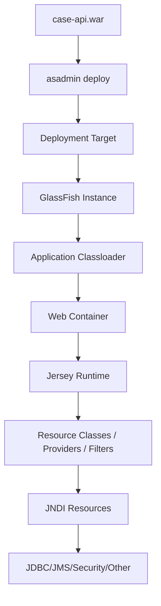
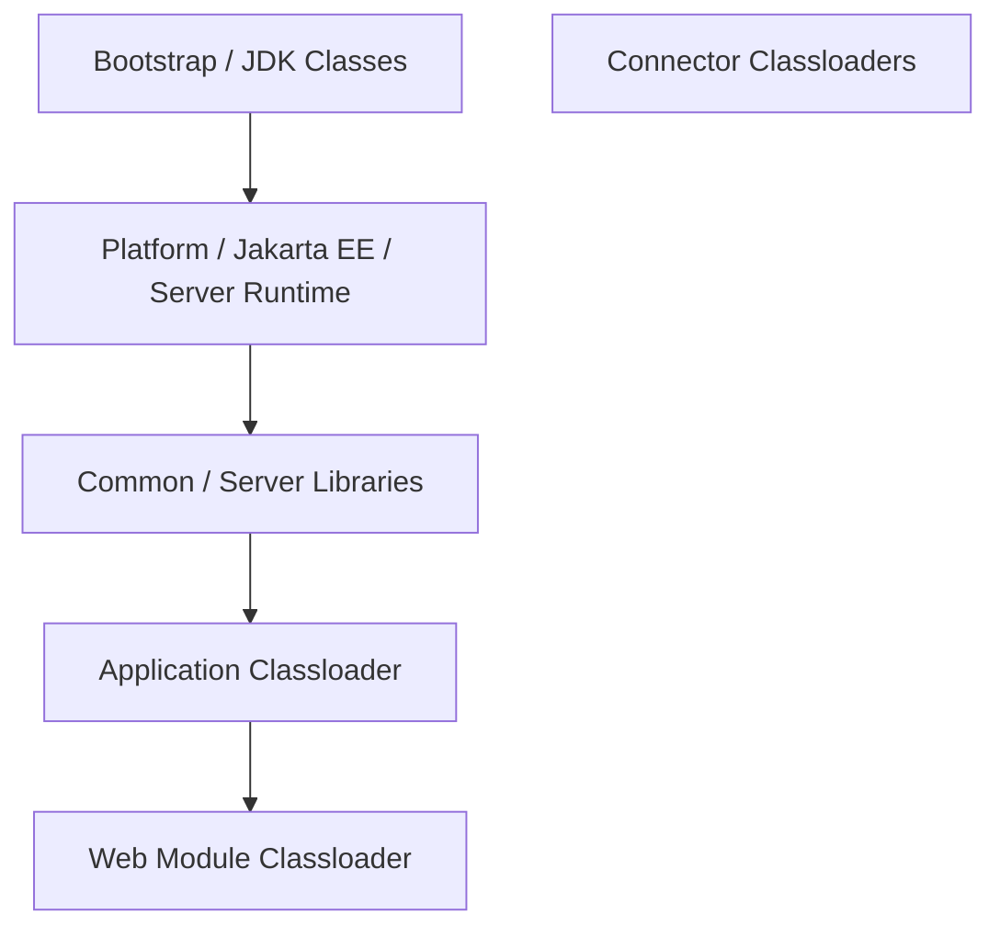
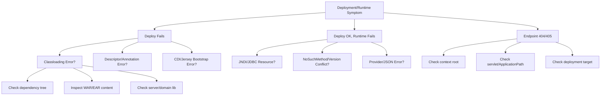

# Part 018 — GlassFish Deployment Model: WAR, EAR, Libraries, Classloaders

Bagian ini membahas **deployment artifact dan classloading** untuk aplikasi Jersey di GlassFish.

Ini penting karena banyak masalah Jersey/GlassFish production bukan disebabkan oleh annotation `@Path`, melainkan oleh:

- dependency salah scope,
- Jakarta API ikut ter-package di WAR,
- Jersey implementation bentrok dengan Jersey bawaan server,
- JDBC driver tidak terlihat oleh pool,
- `ClassNotFoundException` muncul hanya di production,
- `NoSuchMethodError` akibat versi library berbeda,
- EAR/WAR classloader isolation salah dipahami,
- server library dipakai sebagai “tempat buang semua JAR”.

> Prinsip Kaufman untuk bagian ini: **learn enough to self-correct**. Kita tidak perlu menghafal semua detail internal classloader, tetapi harus punya model yang cukup untuk memprediksi dan mendiagnosis error packaging/deployment.

---

## 1. Mental Model Deployment

Deployment ke GlassFish adalah proses memasukkan artifact ke runtime container, lalu container:

1. membaca metadata aplikasi,
2. membangun classloader aplikasi,
3. menemukan deployment descriptors dan annotations,
4. menginisialisasi web container,
5. menginisialisasi Jersey/Jakarta REST runtime,
6. menghubungkan resource container seperti JNDI/JDBC/security,
7. membuka endpoint HTTP.



Deployment bukan sekadar copy file. Ia adalah proses integrasi artifact dengan container.

---

## 2. Artifact Types: WAR, EAR, JAR

### 2.1. WAR

**WAR** adalah deployment unit paling umum untuk Jersey REST API.

Struktur umum:

```text
case-api.war
  WEB-INF/
    classes/
      com/acme/caseapi/...
    lib/
      application-dependency.jar
    web.xml
    glassfish-web.xml
  META-INF/
    MANIFEST.MF
```

Cocok untuk:

- REST API,
- web application,
- Jersey servlet/application,
- CDI-backed web app,
- service internal modern.

Untuk mayoritas aplikasi Jersey, WAR adalah default yang benar.

### 2.2. EAR

**EAR** adalah enterprise archive yang dapat berisi beberapa module:

```text
case-platform.ear
  META-INF/
    application.xml
    glassfish-application.xml
  case-api.war
  case-worker.jar
  lib/
    shared-domain.jar
```

Cocok untuk:

- aplikasi Jakarta EE multi-module,
- web module + EJB module,
- shared library antar-module dalam satu application boundary,
- legacy enterprise deployment,
- sistem yang memang memanfaatkan container-managed module integration.

EAR tidak otomatis lebih enterprise. Ia menambah classloader dan deployment complexity. Gunakan jika boundary module dan kebutuhan container memang jelas.

### 2.3. Plain JAR

Plain JAR bisa menjadi:

- library dalam WAR/EAR,
- EJB module dalam EAR,
- utility library server-side,
- application client module dalam konteks tertentu.

Untuk Jersey REST endpoint, plain JAR saja biasanya bukan deployment artifact utama.

---

## 3. WAR vs EAR Decision Framework

| Kriteria | WAR | EAR |
|---|---|---|
| REST API tunggal | Sangat cocok | Berlebihan |
| Microservice-style deployment | Cocok | Biasanya tidak perlu |
| Multi-module Jakarta EE app | Bisa, tapi terbatas | Cocok |
| Shared library antar-module | Duplikasi atau parent build | EAR/lib bisa cocok |
| EJB module terpisah | Tidak ideal | Cocok |
| Operational simplicity | Lebih sederhana | Lebih kompleks |
| Classloader complexity | Lebih rendah | Lebih tinggi |
| Modern container deployment | Umumnya lebih cocok | Perlu alasan kuat |

Rule praktis:

> Mulai dari WAR. Naik ke EAR hanya jika ada kebutuhan module boundary yang nyata dan benefit-nya lebih besar daripada classloader complexity.

---

## 4. GlassFish Classloader Mental Model

GlassFish menggunakan **delegation hierarchy**. Artinya classloader anak biasanya bertanya ke parent lebih dahulu sebelum mencoba memuat class sendiri.

Secara konseptual:



Diagram ini konseptual. Detail exact bisa berbeda antar versi dan konfigurasi, tetapi prinsip pentingnya:

> Classloader bukan inheritance hierarchy; ia delegation hierarchy. Library yang terlihat oleh parent dapat memengaruhi child.

---

## 5. Kenapa Classloader Penting untuk Jersey?

Karena Jersey berada di persimpangan:

- Jakarta REST API,
- Jersey implementation,
- servlet container,
- JSON provider,
- CDI/HK2 integration,
- application resource classes,
- deployment artifact,
- GlassFish bundled libraries.

Benturan kecil bisa menghasilkan error besar.

Contoh:

```text
java.lang.NoSuchMethodError: jakarta.ws.rs.core.Response.status(...)
```

Kemungkinan:

- API Jakarta REST versi salah ikut di WAR,
- runtime server menyediakan versi berbeda,
- transitive dependency membawa API lama,
- Jersey module versi tidak sejajar,
- `javax.*` dan `jakarta.*` tercampur.

---

## 6. Server-Provided APIs

GlassFish sebagai Jakarta EE server menyediakan banyak API dan implementation runtime. Untuk aplikasi yang dideploy ke full application server, dependency Jakarta EE API biasanya memakai scope `provided`.

Contoh Maven:

```xml
<dependency>
    <groupId>jakarta.platform</groupId>
    <artifactId>jakarta.jakartaee-api</artifactId>
    <version>11.0.0</version>
    <scope>provided</scope>
</dependency>
```

Atau lebih sempit:

```xml
<dependency>
    <groupId>jakarta.ws.rs</groupId>
    <artifactId>jakarta.ws.rs-api</artifactId>
    <version>4.0.0</version>
    <scope>provided</scope>
</dependency>
```

Kenapa `provided`?

Karena runtime server sudah menyediakan API tersebut. Memasukkan API yang sama ke `WEB-INF/lib` bisa membuat versi bentrok.

---

## 7. Dependency Scope Discipline

### 7.1. Maven Scope Model untuk GlassFish

| Dependency | Scope Umum | Alasan |
|---|---|---|
| `jakarta.jakartaee-api` | `provided` | Disediakan server |
| `jakarta.ws.rs-api` | `provided` | Disediakan server/Jersey runtime |
| Jersey server modules | biasanya `provided` jika pakai Jersey bawaan GlassFish | Hindari bentrok runtime |
| Application library | `compile` | Harus ikut dalam WAR |
| JDBC driver | tergantung strategi | Sering server library untuk GlassFish pool |
| Test libs | `test` | Tidak ikut deploy |
| Servlet API | `provided` | Disediakan web container |

### 7.2. Gradle Model

```kotlin
dependencies {
    providedCompile("jakarta.platform:jakarta.jakartaee-api:11.0.0")
    implementation("com.acme:case-domain:1.2.0")
    testImplementation("org.junit.jupiter:junit-jupiter:5.10.0")
}
```

Dalam Gradle modern, plugin WAR menyediakan konfigurasi `providedCompile`/`providedRuntime` tergantung setup.

---

## 8. Thin WAR vs Fat WAR

### 8.1. Thin WAR

Thin WAR hanya membawa code aplikasi dan library yang tidak disediakan server.

```text
WEB-INF/lib/
  case-domain.jar
  case-validation.jar
  small-utility.jar
```

Tidak membawa:

- Jakarta EE API,
- Servlet API,
- server implementation,
- Jersey runtime bawaan server,
- GlassFish modules.

Kelebihan:

- kecil,
- lebih cocok dengan application server,
- mengurangi konflik,
- memanfaatkan server runtime.

Kekurangan:

- bergantung pada versi server,
- portability perlu diuji,
- local test perlu runtime serupa.

### 8.2. Fat WAR

Fat WAR membawa banyak dependency sendiri.

```text
WEB-INF/lib/
  jersey-server.jar
  jersey-container-servlet.jar
  jakarta.ws.rs-api.jar
  jakarta.servlet-api.jar
  json-provider.jar
  ...
```

Di full Jakarta EE server, ini berisiko jika membawa dependency yang juga disediakan server.

Fat WAR lebih masuk akal pada servlet container ringan yang tidak menyediakan full Jakarta EE stack, bukan pada GlassFish full profile kecuali benar-benar terkendali.

### 8.3. Decision

| Situation | Strategy |
|---|---|
| Deploy ke GlassFish full Jakarta EE | Thin WAR |
| Deploy ke plain servlet container | Bawa Jersey modules yang diperlukan |
| Butuh override JSON provider | Explicit provider, hati-hati scope |
| Butuh versi Jersey berbeda dari server | Pertimbangkan runtime lain atau isolation mendalam |
| Production regulated environment | Prefer deterministic thin WAR + server version controlled |

---

## 9. Jersey Packaging Strategy di GlassFish

Untuk GlassFish modern yang sudah membawa Jersey compatible dengan Jakarta EE baseline, strategi paling aman:

1. aplikasi compile terhadap Jakarta EE API `provided`,
2. resource/provider/filter/mapper ada di aplikasi,
3. jangan package Jersey server runtime kecuali ada alasan kuat,
4. jangan package `jakarta.ws.rs-api` di `WEB-INF/lib`,
5. jangan campur Jersey major version,
6. semua extension Jersey harus compatible dengan server Jersey version,
7. dependency tree diperiksa di CI.

### 9.1. Contoh Maven WAR

```xml
<project>
    <packaging>war</packaging>

    <dependencies>
        <dependency>
            <groupId>jakarta.platform</groupId>
            <artifactId>jakarta.jakartaee-api</artifactId>
            <version>11.0.0</version>
            <scope>provided</scope>
        </dependency>

        <dependency>
            <groupId>com.acme.case</groupId>
            <artifactId>case-domain</artifactId>
            <version>${project.version}</version>
        </dependency>

        <dependency>
            <groupId>com.acme.case</groupId>
            <artifactId>case-application</artifactId>
            <version>${project.version}</version>
        </dependency>
    </dependencies>
</project>
```

CI check:

```bash
mvn dependency:tree | grep -E 'jakarta.ws.rs-api|jersey-|javax.ws.rs|javax.servlet'
```

Tujuannya bukan selalu nol, tetapi memastikan dependency yang muncul sesuai scope dan tidak ikut package secara salah.

---

## 10. Jakarta Namespace Discipline

Dalam baseline seri ini:

- Jakarta EE 11,
- Jakarta REST 4.0,
- Jersey 4.x,
- GlassFish 8.x,
- namespace `jakarta.*`.

Jangan campur:

```java
import javax.ws.rs.GET;        // lama
import jakarta.ws.rs.Path;     // baru
```

Satu aplikasi harus konsisten.

### 10.1. Red Flags di Dependency Tree

Cari ini:

```text
javax.ws.rs:javax.ws.rs-api
javax.servlet:javax.servlet-api
javax.annotation:javax.annotation-api
javax.enterprise:cdi-api
```

Untuk baseline Jakarta modern, dependency tersebut biasanya red flag kecuali library legacy tertentu memang masih membawa transitive dependency dan sudah diisolasi/dikecualikan.

### 10.2. Exclusion Pattern

```xml
<dependency>
    <groupId>legacy.vendor</groupId>
    <artifactId>legacy-client</artifactId>
    <version>2.4.0</version>
    <exclusions>
        <exclusion>
            <groupId>javax.ws.rs</groupId>
            <artifactId>javax.ws.rs-api</artifactId>
        </exclusion>
    </exclusions>
</dependency>
```

Namun exclusion bukan magic. Pastikan library legacy memang runtime-compatible dengan Jakarta namespace. Banyak library `javax.*` tidak bisa langsung berjalan di Jakarta EE 9+ tanpa transformasi atau versi baru.

---

## 11. Application Libraries vs Server Libraries

### 11.1. Application Library

Library yang dipackage dalam WAR/EAR:

```text
WEB-INF/lib/*.jar
EAR/lib/*.jar
```

Cocok untuk:

- domain model,
- business services,
- utility internal,
- mapper internal,
- client SDK non-container,
- library yang hanya dipakai aplikasi itu.

### 11.2. Server Library

Library yang diletakkan di server/domain library path agar terlihat oleh server/container/resource.

Cocok untuk:

- JDBC driver yang dipakai GlassFish JDBC pool,
- connector module tertentu,
- library yang memang harus terlihat oleh container sebelum aplikasi berjalan.

Tidak cocok untuk:

- semua application dependency,
- business logic,
- library versi aplikasi tertentu,
- library yang sering berubah,
- library yang hanya dipakai satu WAR.

### 11.3. JDBC Driver Case

Jika GlassFish JDBC pool membuat connection, maka driver JDBC perlu terlihat oleh server/container, bukan hanya oleh aplikasi.

Artinya, memasukkan driver ke `WEB-INF/lib` belum tentu cukup untuk GlassFish-managed connection pool.

Strategi umum:

```text
GLASSFISH_HOME/glassfish/domains/domain1/lib/postgresql-xx.jar
```

atau mekanisme library server yang sesuai deployment process.

Checklist:

- driver version dikunci,
- driver tersedia di semua instance/node,
- restart dilakukan jika diperlukan,
- pool ping sukses,
- CI/CD mendistribusikan driver secara deterministic.

---

## 12. Deployment Descriptors

Jakarta EE modern banyak memakai annotation. Namun deployment descriptor tetap penting untuk beberapa kasus.

### 12.1. `web.xml`

Bisa digunakan untuk:

- servlet mapping explicit,
- filter servlet-level,
- context parameter,
- security constraint,
- listener,
- error page,
- session config.

Untuk Jersey:

```xml
<web-app xmlns="https://jakarta.ee/xml/ns/jakartaee"
         version="6.1">
    <servlet>
        <servlet-name>JerseyServlet</servlet-name>
        <servlet-class>org.glassfish.jersey.servlet.ServletContainer</servlet-class>
        <init-param>
            <param-name>jakarta.ws.rs.Application</param-name>
            <param-value>com.acme.caseapi.ApiApplication</param-value>
        </init-param>
        <load-on-startup>1</load-on-startup>
    </servlet>

    <servlet-mapping>
        <servlet-name>JerseyServlet</servlet-name>
        <url-pattern>/api/*</url-pattern>
    </servlet-mapping>
</web-app>
```

Annotation-only bootstrapping bisa lebih ringkas, tetapi explicit descriptor kadang lebih cocok untuk regulated systems karena startup path lebih terlihat.

### 12.2. `glassfish-web.xml`

GlassFish-specific descriptor dapat mengatur hal seperti context root dan properti tertentu.

Contoh konseptual:

```xml
<glassfish-web-app>
    <context-root>/case-api</context-root>
</glassfish-web-app>
```

Gunakan vendor descriptor jika memang butuh fitur GlassFish-specific. Jangan masukkan konfigurasi bisnis yang seharusnya externalized.

### 12.3. `application.xml` untuk EAR

Jika memakai EAR, descriptor dapat mendeklarasikan modules:

```xml
<application xmlns="https://jakarta.ee/xml/ns/jakartaee"
             version="11">
    <module>
        <web>
            <web-uri>case-api.war</web-uri>
            <context-root>/case-api</context-root>
        </web>
    </module>
    <module>
        <ejb>case-worker.jar</ejb>
    </module>
</application>
```

---

## 13. Classloader Isolation Patterns

### 13.1. WAR Isolation

Dalam WAR, classes di `WEB-INF/classes` dan JAR di `WEB-INF/lib` menjadi bagian dari web application classloader.

Baik untuk:

- isolasi aplikasi,
- deployment independen,
- menghindari shared mutable library.

Risiko:

- dependency yang seharusnya server-provided ikut masuk,
- duplicate library antar-WAR,
- static singleton hanya per-WAR, bukan global.

### 13.2. EAR Shared Library

Dalam EAR, `EAR/lib` dapat menjadi shared library untuk modules dalam EAR.

Baik untuk:

- shared domain jar,
- shared DTO jar,
- shared utility jar,
- menghindari duplikasi antar-module dalam EAR.

Risiko:

- module coupling meningkat,
- class visibility jadi lebih kompleks,
- versioning antar-module terkunci.

### 13.3. Server Shared Library

Server/domain lib terlihat lebih luas.

Gunakan sangat selektif.

Anti-pattern:

```text
domain/lib/
  case-domain.jar
  case-service.jar
  jackson-custom.jar
  random-utils.jar
  old-jersey.jar
```

Ini membuat semua aplikasi berbagi library yang seharusnya application-specific. Akibatnya:

- redeploy app tidak mengganti library,
- aplikasi saling memengaruhi,
- upgrade satu app bisa merusak app lain,
- root cause dependency sulit ditemukan.

---

## 14. Failure Taxonomy

### 14.1. `ClassNotFoundException`

Makna:

> Runtime mencoba memuat class, tetapi class tidak ditemukan oleh classloader yang relevan.

Kemungkinan:

- dependency tidak ikut package,
- scope salah `provided`,
- server library belum dipasang,
- JDBC driver tidak terlihat container,
- module EAR tidak expose library,
- artifact build tidak sesuai.

Diagnosis:

```bash
jar tf target/case-api.war | grep 'MissingClass'
mvn dependency:tree
asadmin list-libraries
```

### 14.2. `NoClassDefFoundError`

Makna:

> Class pernah ada saat compile/linking, tapi gagal ditemukan atau gagal initialize saat runtime.

Kemungkinan:

- dependency transitive hilang,
- static initializer gagal,
- class dependency lain hilang,
- versi library tidak lengkap.

Diagnosis:

- lihat `Caused by`,
- cek class yang benar-benar missing,
- cek static initialization,
- cek dependency tree runtime.

### 14.3. `NoSuchMethodError`

Makna:

> Class ditemukan, tetapi method yang diharapkan tidak ada.

Ini hampir selalu versi bentrok.

Kemungkinan:

- compile memakai versi baru, runtime memakai versi lama,
- server parent classloader memuat library beda,
- dependency duplicate di server lib dan WAR,
- Jersey/Jakarta API mismatch.

Diagnosis:

```bash
mvn dependency:tree -Dverbose
jar tf target/case-api.war | grep 'jakarta/ws/rs'
```

Cari duplicate versions.

### 14.4. `ClassCastException` dengan Class yang Sama

Contoh:

```text
com.acme.Dto cannot be cast to com.acme.Dto
```

Makna:

> Nama class sama, tetapi dimuat oleh classloader berbeda.

Kemungkinan:

- library sama ada di EAR/lib dan WAR/WEB-INF/lib,
- shared server lib dan app lib duplikat,
- plugin/module boundary salah.

Solusi:

- pastikan satu class hanya dimuat dari satu classloader boundary yang benar,
- pindahkan shared jar ke lokasi yang tepat,
- hapus duplicate jar.

---

## 15. Deployment Failure Playbook

### 15.1. Aplikasi Gagal Deploy

Langkah:

1. baca server log dari awal deploy, bukan hanya error terakhir,
2. cari `Caused by` terdalam,
3. bedakan error classloading, CDI, Jersey bootstrap, descriptor, resource,
4. cek artifact content,
5. cek dependency tree,
6. cek target server/cluster,
7. cek server version.

Command:

```bash
asadmin deploy --target regulatory-cluster target/case-api.war
asadmin list-applications --target regulatory-cluster
asadmin get-log-file
```

### 15.2. Deploy Sukses, Endpoint 404

Kemungkinan:

- context root salah,
- servlet mapping salah,
- `ApplicationPath` salah,
- application class tidak terdeteksi,
- deploy ke target yang tidak menerima traffic,
- load balancer mengarah ke instance lain,
- app disabled.

Cek:

```bash
asadmin list-applications --target regulatory-cluster
asadmin show-component-status case-api --target regulatory-cluster
```

### 15.3. Deploy Sukses, Request 500 Saat Akses DB

Kemungkinan:

- JDBC resource tidak ditargetkan,
- driver tidak terlihat server,
- pool belum ping sukses,
- JNDI name salah,
- credential/env var salah,
- transaction boundary salah.

Cek:

```bash
asadmin list-jdbc-resources
asadmin list-jdbc-connection-pools
asadmin ping-connection-pool casePool
asadmin list-resource-refs --target regulatory-cluster
```

---

## 16. Build-Time Guardrails

Tambahkan guardrail agar packaging error tertangkap sebelum deploy.

### 16.1. Ban Duplicate Jakarta APIs

Maven Enforcer contoh konseptual:

```xml
<plugin>
    <groupId>org.apache.maven.plugins</groupId>
    <artifactId>maven-enforcer-plugin</artifactId>
    <executions>
        <execution>
            <goals>
                <goal>enforce</goal>
            </goals>
            <configuration>
                <rules>
                    <bannedDependencies>
                        <excludes>
                            <exclude>javax.ws.rs:javax.ws.rs-api</exclude>
                            <exclude>javax.servlet:javax.servlet-api</exclude>
                        </excludes>
                    </bannedDependencies>
                </rules>
            </configuration>
        </execution>
    </executions>
</plugin>
```

### 16.2. Inspect WAR Contents

```bash
jar tf target/case-api.war | sort > target/war-contents.txt

grep -E 'jakarta.ws.rs-api|javax.ws.rs|jersey-server|servlet-api' target/war-contents.txt
```

### 16.3. Dependency Tree Diff

Simpan dependency tree artifact release:

```bash
mvn -DskipTests dependency:tree > target/dependency-tree.txt
```

Bandingkan antar release untuk mendeteksi dependency drift.

---

## 17. Deployment Descriptors vs Annotation

Annotation membuat code ringkas. Descriptor membuat runtime wiring lebih eksplisit.

Gunakan annotation untuk:

- resource path,
- provider registration jika via `Application`/`ResourceConfig`,
- CDI bean discovery,
- validation constraints.

Gunakan descriptor untuk:

- servlet mapping eksplisit,
- context root environment-independent,
- security constraint container-managed,
- compatibility dengan deployment standard organisasi,
- regulated audit yang butuh konfigurasi terlihat.

Jangan duplikasi konfigurasi di banyak tempat.

Anti-pattern:

```text
@Path + @ApplicationPath + web.xml servlet mapping + glassfish-web.xml context root
```

tanpa dokumentasi komposisi URL final.

Better:

```text
context-root: /case-api
servlet mapping/application path: /api
resource path: /cases
final URL: /case-api/api/cases
```

---

## 18. Context Root Discipline

Final URL endpoint adalah komposisi beberapa layer:

```mermaid
flowchart LR
    Host[https://api.acme.internal] --> ContextRoot[/case-api]
    ContextRoot --> AppPath[/api]
    AppPath --> ResourcePath[/cases/{id}]
```

Contoh:

```text
https://api.acme.internal/case-api/api/cases/123
```

Masalah umum:

- context root default dari nama WAR,
- nama WAR berubah antar build,
- reverse proxy rewrite path,
- `@ApplicationPath` berubah,
- servlet mapping overlap.

Rule:

> Context root production harus eksplisit, stabil, dan diuji lewat smoke test.

---

## 19. Redeploy Semantics

Redeploy bukan sekadar mengganti file.

Hal yang bisa terjadi:

- web context dihentikan,
- classloader lama dilepas,
- classloader baru dibuat,
- CDI/Jersey bootstrap ulang,
- static state hilang,
- in-flight request terganggu tergantung konfigurasi,
- connection/resource container tetap server-managed,
- memory leak muncul jika thread/background task tidak berhenti.

Anti-pattern:

```java
@PostConstruct
void start() {
    Executors.newSingleThreadScheduledExecutor()
        .scheduleAtFixedRate(this::sync, 0, 1, TimeUnit.MINUTES);
}
```

tanpa shutdown di `@PreDestroy`.

Masalah:

- thread lama bisa menahan classloader lama,
- redeploy menyebabkan memory leak,
- task berjalan ganda,
- old version masih punya reference.

Better:

- gunakan managed executor jika tersedia,
- stop resource di lifecycle destroy,
- hindari unmanaged thread,
- observasi thread setelah redeploy.

---

## 20. Library Version Ownership

Setiap library harus punya owner:

| Library Type | Owner |
|---|---|
| Jakarta EE API | Server/runtime baseline |
| Jersey runtime | GlassFish baseline kecuali override eksplisit |
| App domain libs | Application team |
| JDBC driver | Platform/runtime team dengan app compatibility review |
| Security provider | Platform/security team |
| JSON provider override | App/platform joint decision |

Tanpa ownership, dependency berubah diam-diam.

---

## 21. Production Deployment Checklist

Sebelum release WAR/EAR ke GlassFish:

- [ ] Artifact type jelas: WAR atau EAR.
- [ ] Context root eksplisit.
- [ ] Deployment target eksplisit.
- [ ] Jakarta EE API memakai `provided`.
- [ ] Tidak ada `javax.*` API legacy di dependency runtime.
- [ ] Tidak ada duplicate Jersey major version.
- [ ] WAR contents sudah diinspeksi.
- [ ] Dependency tree disimpan sebagai build artifact.
- [ ] JDBC driver tersedia untuk GlassFish pool.
- [ ] Resource JNDI ditargetkan ke runtime target.
- [ ] Descriptor dan annotation tidak konflik.
- [ ] Smoke test mengecek final URL.
- [ ] Runtime info endpoint menampilkan version/instance.
- [ ] Redeploy test memastikan tidak ada thread leak.
- [ ] Rollback artifact tersedia.

---

## 22. Anti-Patterns

### 22.1. Package Semua Dependency Karena “Biar Aman”

Masalah:

- duplicate Jakarta API,
- duplicate Jersey runtime,
- `NoSuchMethodError`,
- classloader conflict,
- artifact besar,
- runtime tidak deterministic.

Better:

- gunakan scope discipline,
- thin WAR untuk GlassFish,
- dependency check di CI.

### 22.2. Letakkan Semua JAR di Domain Lib

Masalah:

- app saling memengaruhi,
- redeploy tidak mengganti library,
- sulit audit,
- konflik versi lintas aplikasi.

Better:

- server lib hanya untuk container-visible library seperti JDBC driver,
- app library tetap di WAR/EAR.

### 22.3. EAR Tanpa Alasan

Masalah:

- classloader lebih kompleks,
- deployment lebih berat,
- troubleshooting lebih sulit,
- coupling antar-module meningkat.

Better:

- WAR default,
- EAR hanya jika module model memang dibutuhkan.

### 22.4. Context Root dari Nama File WAR

Masalah:

```text
case-api-1.0.0.war -> /case-api-1.0.0
case-api-1.0.1.war -> /case-api-1.0.1
```

Endpoint berubah karena nama file.

Better:

- set context root eksplisit,
- deploy dengan name/context root stabil.

### 22.5. Mengabaikan Classloader pada Redeploy

Masalah:

- old classloader tertahan,
- memory leak,
- duplicate scheduled tasks,
- behavior beda setelah beberapa redeploy.

Better:

- lifecycle cleanup,
- managed executor,
- redeploy soak test,
- thread dump after redeploy.

---

## 23. Debugging Decision Tree



---

## 24. Kaufman Practice: Build, Inspect, Deploy, Break, Fix

Latihan 2 jam:

### Step 1 — Build WAR

Buat WAR sederhana dengan:

- one resource endpoint,
- one provider,
- one exception mapper,
- explicit context root,
- Jakarta EE API `provided`.

### Step 2 — Inspect WAR

```bash
jar tf target/case-api.war | sort
mvn dependency:tree
```

Pastikan tidak ada dependency server API yang ikut salah.

### Step 3 — Deploy ke Target Eksplisit

```bash
asadmin deploy --target server target/case-api.war
```

### Step 4 — Break It Intentionally

Tambahkan dependency legacy:

```xml
<dependency>
    <groupId>javax.ws.rs</groupId>
    <artifactId>javax.ws.rs-api</artifactId>
    <version>2.1.1</version>
</dependency>
```

Lihat efeknya di dependency tree dan deployment/runtime.

### Step 5 — Fix dengan Scope/Exclusion

Hapus atau exclude dependency. Ulangi deploy.

Goal latihan bukan membuat app bagus. Goal-nya membangun refleks packaging diagnosis.

---

## 25. What Good Looks Like

Engineer yang kuat di deployment GlassFish bisa berkata:

- artifact ini WAR, bukan EAR, karena REST API tunggal,
- Jakarta API `provided` karena runtime menyediakan,
- Jersey runtime tidak ikut package karena GlassFish baseline sudah menyediakannya,
- JDBC driver ada di server lib karena pool dibuat container,
- context root eksplisit,
- deployment target eksplisit,
- dependency tree sudah diperiksa,
- WAR contents sudah diverifikasi,
- rollback artifact tersedia,
- classloader failure punya playbook diagnosis.

Kalimat kunci:

> “Deployment artifact adalah kontrak antara build system dan container. Classloader adalah mekanisme yang menentukan kontrak itu benar-benar berlaku atau tidak.”

Part berikutnya akan memperdalam kegagalan classloading secara khusus: `ClassNotFoundException`, `NoClassDefFoundError`, `NoSuchMethodError`, split packages, duplicate APIs, dan Jersey version conflicts.

---

## 26. Primary References

- Eclipse GlassFish Documentation — Application Development Guide: `https://glassfish.org/docs/latest/application-development-guide.html`
- Eclipse GlassFish Documentation — Administration Guide: `https://glassfish.org/docs/latest/administration-guide.html`
- Jakarta RESTful Web Services 4.0 Specification: `https://jakarta.ee/specifications/restful-ws/4.0/`
- Jakarta EE Platform Specification: `https://jakarta.ee/specifications/platform/`
