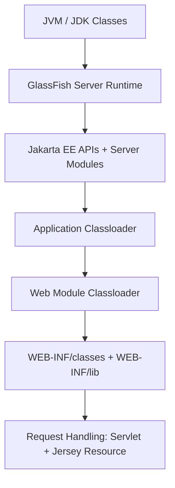
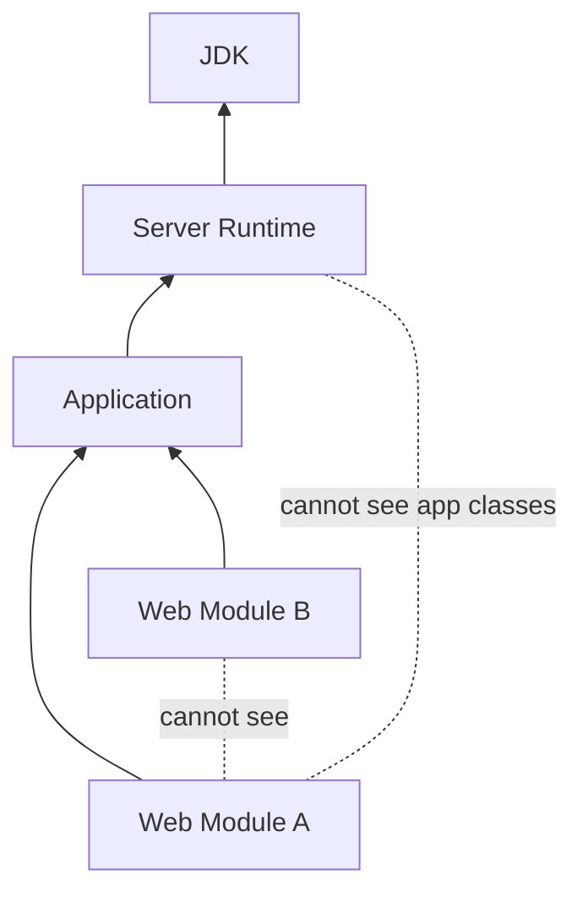
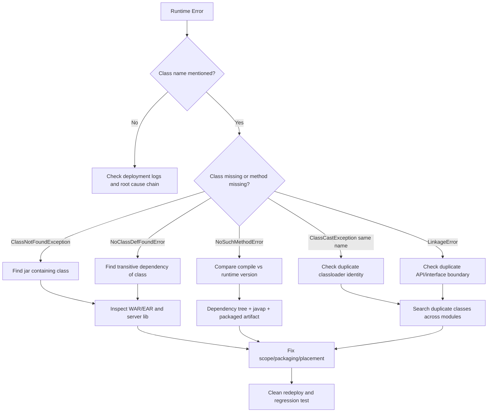

# Part 019 — GlassFish Classloading Failure Model

> Target utama bagian ini: kita tidak hanya tahu bahwa error classloading terjadi karena "dependency bentrok". Kita ingin bisa membaca gejalanya, membangun hypothesis tree, membuktikan root cause, dan memperbaikinya tanpa trial-and-error.

Pada aplikasi Jersey di GlassFish, classloading adalah salah satu failure domain paling mahal. Error-nya sering muncul sebagai:

- deployment gagal;
- endpoint 404/500 padahal kode terlihat benar;
- provider JSON tidak terpilih;
- `ExceptionMapper` tidak dipanggil;
- CDI/HK2 injection gagal;
- aplikasi jalan di local embedded runtime tapi gagal di GlassFish;
- aplikasi jalan setelah clean install tapi gagal setelah redeploy;
- error muncul hanya ketika request pertama datang, bukan saat startup.

Masalah classloading bukan sekadar masalah Maven. Ini adalah masalah **runtime boundary**.

Dalam GlassFish, dependency tidak hidup di satu classpath datar. Ada beberapa classloader dengan visibility berbeda. Aplikasi Jakarta EE berjalan dalam container yang sudah menyediakan banyak API dan implementation. Ketika aplikasi membawa salinan library yang seharusnya disediakan container, atau membawa versi Jersey/Jakarta API yang berbeda dari server, hasilnya bisa berupa error yang sangat tidak intuitif.

---

## 1. Kaufman Deconstruction

Berdasarkan pendekatan Josh Kaufman, skill ini kita pecah menjadi sub-skill yang bisa dilatih secara terpisah.

| Sub-skill | Yang Harus Dikuasai | Output Praktis |
|---|---|---|
| Mental model classloader | Parent/child delegation, visibility, isolation | Bisa menggambar dari mana class diload |
| Error taxonomy | Bedakan `ClassNotFoundException`, `NoClassDefFoundError`, `NoSuchMethodError`, `LinkageError`, `ClassCastException` | Bisa mempersempit root cause dari log |
| Dependency boundary | `provided`, server API, app library, shared library | Bisa memilih dependency scope yang aman |
| Jakarta namespace | `javax.*` vs `jakarta.*` | Bisa mencegah mixed namespace runtime |
| Jersey conflict analysis | Server Jersey vs bundled Jersey | Bisa menentukan kapan memakai server-provided vs bundled implementation |
| Diagnostic tooling | `mvn dependency:tree`, `jar tf`, startup logs, classloader clues | Bisa membuktikan konflik, bukan menebak |
| Fix strategy | Exclude, align, relocate, thin WAR, redeploy clean | Bisa memperbaiki tanpa menambah konflik baru |

Skill ini selesai bukan ketika kita hafal jenis exception, tetapi ketika kita bisa menjawab:

> “Class ini seharusnya diload oleh siapa, dari artifact mana, dalam versi apa, dan apakah classloader yang membutuhkannya memiliki visibility ke sana?”

---

## 2. Mental Model: Classpath Datar vs Container Runtime

Di aplikasi command-line Java biasa, kita sering membayangkan classpath sebagai daftar JAR linear:

```text
app.jar + lib/a.jar + lib/b.jar + lib/c.jar
```

Jika ada class `com.example.Foo`, JVM mencari class itu di classpath sesuai aturan classloader yang digunakan.

Di application server, modelnya berbeda. Server sudah punya runtime sendiri. Aplikasi adalah artifact yang **dideploy ke dalam runtime**, bukan runtime itu sendiri.



Konsekuensinya:

1. Tidak semua dependency aplikasi harus dibundel.
2. Tidak semua class yang ada di `WEB-INF/lib` otomatis menang dari class server.
3. Class dengan nama sama bisa diload oleh classloader berbeda.
4. Error bisa terjadi walau dependency ada secara fisik di WAR.
5. Dependency yang benar di compile-time bisa salah di runtime.

---

## 3. Invariant GlassFish Classloading

Invariant dasar yang harus diingat:

> Classloader hierarchy di GlassFish adalah delegation hierarchy. Secara umum, classloader child mendelegasikan pencarian class ke parent sebelum mencoba load class sendiri.

Ini bukan inheritance hierarchy. Child tidak “mewarisi” class secara source-code sense. Child memiliki mekanisme delegation ke parent.

Secara praktis:

- class yang disediakan parent bisa menang atas class di child;
- class di child biasanya tidak visible ke parent;
- dua child classloader berbeda bisa memuat class dengan FQN sama tetapi dianggap tipe berbeda oleh JVM;
- meletakkan JAR di server-level library membuatnya visible lebih luas, tetapi juga memperbesar blast radius.

### 3.1 Delegation First

Konseptualnya:

```text
loadClass("com.acme.X")
  1. tanya parent dulu
  2. kalau parent tidak punya, cari di classloader sendiri
  3. kalau tetap tidak ada, gagal
```

Ini menjelaskan kenapa dependency lokal bisa “diabaikan” jika parent sudah punya class dengan nama sama.

### 3.2 Visibility Is Directional



Jika server module mencoba memanggil class aplikasi, biasanya tidak bisa, kecuali lewat extension point yang memang menerima object dari app classloader.

---

## 4. Class Identity: Nama Sama Belum Tentu Tipe Sama

Di JVM, identitas class bukan hanya fully-qualified name.

Identitas class kira-kira:

```text
(classloader identity, fully qualified class name)
```

Artinya, dua class berikut dianggap berbeda:

```text
ClassLoader A loads com.acme.Customer
ClassLoader B loads com.acme.Customer
```

Walaupun bytecode-nya identik, JVM melihatnya sebagai tipe berbeda.

Gejala klasik:

```text
java.lang.ClassCastException: com.acme.Customer cannot be cast to com.acme.Customer
```

Kalimat ini terlihat absurd, tetapi sangat masuk akal jika dua `Customer` diload oleh dua classloader berbeda.

### 4.1 Dampak ke Jersey

Pada Jersey, masalah ini bisa muncul pada:

- provider type;
- entity DTO;
- annotation class;
- exception mapper generic type;
- CDI bean type;
- HK2 binding contract;
- JSON provider dependency;
- Jakarta API interface.

Contoh failure:

```text
ExceptionMapper<MyDomainException> sudah dibuat,
tetapi Jersey tidak memilih mapper tersebut.
```

Kemungkinan root cause:

- mapper didaftarkan di classloader berbeda;
- `MyDomainException` yang dilempar bukan class identity yang sama dengan generic type mapper;
- provider tidak ter-scan;
- `ExceptionMapper` interface berasal dari API JAR berbeda;
- aplikasi membawa `jakarta.ws.rs-api` versi lain di `WEB-INF/lib`.

---

## 5. Error Taxonomy

Jangan men-debug semua classloading error dengan cara yang sama. Setiap error memberi sinyal berbeda.

---

## 6. `ClassNotFoundException`

### 6.1 Makna

`ClassNotFoundException` berarti classloader diminta mencari class berdasarkan nama, tetapi tidak menemukannya.

Biasanya muncul dari reflective loading:

```java
Class.forName("com.acme.SomeProvider");
```

atau dari framework scanning.

### 6.2 Contoh Gejala

```text
java.lang.ClassNotFoundException: org.glassfish.jersey.jackson.JacksonFeature
```

Makna praktis:

- class benar-benar tidak ada di classloader yang sedang mencari;
- artifact yang berisi class itu tidak terpackaging;
- class berada di classloader sibling, bukan parent;
- dependency scope salah;
- deployment artifact tidak berisi JAR yang diasumsikan ada.

### 6.3 Diagnostic Questions

Tanyakan:

1. Siapa yang mencoba load class?
2. Class itu seharusnya datang dari JAR apa?
3. JAR itu ada di `WEB-INF/lib` atau server module?
4. Scope Maven/Gradle-nya apa?
5. Runtime GlassFish sudah menyediakan class itu atau tidak?

### 6.4 Command Diagnosis

```bash
jar tf target/my-api.war | grep 'JacksonFeature'
```

```bash
mvn -q dependency:tree | grep jersey-media-json-jackson
```

Jika class tidak ada di WAR dan tidak disediakan server, fix-nya bukan restart server. Fix-nya dependency boundary.

---

## 7. `NoClassDefFoundError`

### 7.1 Makna

`NoClassDefFoundError` biasanya berarti class pernah diketahui saat compile/linking, tetapi gagal ditemukan saat runtime initialization/linking.

Contoh:

```text
java.lang.NoClassDefFoundError: com/fasterxml/jackson/databind/ObjectMapper
```

Ini sering terjadi ketika:

- class A ada;
- class A mereferensikan class B;
- class B tidak ada di runtime.

### 7.2 Perbedaan Penting dengan `ClassNotFoundException`

| Error | Biasanya Terjadi Saat | Sinyal |
|---|---|---|
| `ClassNotFoundException` | reflective loading | class target tidak ditemukan |
| `NoClassDefFoundError` | linking/initialization | dependency transitive dari class target tidak ditemukan |

### 7.3 Jersey Example

```text
org.glassfish.jersey.jackson.JacksonFeature ada,
tetapi com.fasterxml.jackson.databind.ObjectMapper tidak ada.
```

Root cause:

- membawa Jersey Jackson module tanpa Jackson core/databind yang compatible;
- dependency exclusion terlalu agresif;
- server menyediakan sebagian dependency tapi tidak semuanya;
- mixed Jersey module version.

---

## 8. `NoSuchMethodError`

### 8.1 Makna

`NoSuchMethodError` adalah sinyal kuat bahwa class yang diload di runtime **versinya berbeda** dari class yang dipakai saat compile.

Contoh:

```text
java.lang.NoSuchMethodError:
  'jakarta.ws.rs.core.Response$ResponseBuilder
   jakarta.ws.rs.core.Response.status(int, java.lang.String)'
```

Makna:

- compile berhasil karena method ada di API/implementation compile-time;
- runtime meload versi class yang tidak punya method itu.

### 8.2 Root Cause Umum

- mixed Jakarta REST API version;
- aplikasi membawa `jakarta.ws.rs-api` di WAR;
- server punya versi API lain;
- Jersey module tidak satu versi;
- transitive dependency menarik versi lama;
- dependency management tidak mengunci versi.

### 8.3 Diagnostic Pattern

Cari class yang mengandung method hilang:

```bash
javap -classpath ~/.m2/repository/jakarta/ws/rs/jakarta.ws.rs-api/.../jakarta.ws.rs-api-....jar \
  jakarta.ws.rs.core.Response | grep status
```

Lalu cari versi runtime:

```bash
jar tf target/my-api.war | grep 'jakarta/ws/rs/core/Response.class'
```

Jika ada `jakarta/ws/rs/core/Response.class` di WAR, ini red flag besar. API Jakarta REST seharusnya disediakan container pada aplikasi Jakarta EE full server kecuali ada alasan teknis yang sangat eksplisit.

---

## 9. `AbstractMethodError`

### 9.1 Makna

`AbstractMethodError` sering muncul ketika interface dan implementation tidak cocok versi.

Contoh:

```text
java.lang.AbstractMethodError:
  Receiver class MyProvider does not define or inherit an implementation
  of the resolved method...
```

Root cause:

- class implementasi dikompilasi terhadap interface versi lama;
- runtime memakai interface versi baru;
- provider library tidak kompatibel dengan Jakarta REST version;
- mixed `javax`/`jakarta` migration setengah jalan.

### 9.2 Jersey Example

Custom provider dikompilasi terhadap JAX-RS lama, tapi dideploy di Jakarta REST runtime baru.

```java
// lama
import javax.ws.rs.ext.MessageBodyWriter;

// baru
import jakarta.ws.rs.ext.MessageBodyWriter;
```

Keduanya terlihat mirip, tetapi package berbeda berarti tipe berbeda total.

---

## 10. `LinkageError`

### 10.1 Makna

`LinkageError` adalah keluarga error yang menandakan JVM gagal menghubungkan class karena konflik binary/runtime.

Beberapa bentuk:

- `NoSuchMethodError`
- `NoSuchFieldError`
- `AbstractMethodError`
- `ClassFormatError`
- `IncompatibleClassChangeError`
- `LinkageError: loader constraint violation`

### 10.2 Loader Constraint Violation

Contoh gejala:

```text
loader constraint violation: loader previously initiated loading for a different type with name "jakarta.ws.rs.core.Response"
```

Ini biasanya terjadi saat dua classloader membawa dua versi class yang seharusnya satu identitas global di boundary tertentu.

Root cause umum:

- API Jakarta dibundel di aplikasi;
- server dan aplikasi punya dua versi interface yang sama;
- library shared ditempatkan di server-level dan juga aplikasi;
- EAR module sharing tidak konsisten.

---

## 11. `ClassCastException` dengan Nama Sama

Contoh:

```text
java.lang.ClassCastException:
  class com.acme.api.ErrorResponse cannot be cast to class com.acme.api.ErrorResponse
```

Jangan tertawa. Ini hampir selalu classloader identity problem.

### 11.1 Root Cause Pattern

- DTO shared ada di dua WAR berbeda dalam EAR;
- shared library ada di `WEB-INF/lib` masing-masing module dan juga EAR/lib;
- server-level library punya copy class yang juga dibawa aplikasi;
- plugin/provider membawa duplicate model classes.

### 11.2 Fix Pattern

Pilih satu owner class:

| Scenario | Recommended Owner |
|---|---|
| DTO dipakai beberapa module dalam EAR | `EAR/lib` |
| DTO hanya untuk satu WAR | `WEB-INF/lib` atau `WEB-INF/classes` WAR |
| Server extension dipakai banyak aplikasi | server-level library, dengan kontrol versi ketat |
| Jakarta EE API | container-provided, `provided` scope |

---

## 12. Duplicate Jakarta API: Red Flag Terbesar

Pada aplikasi yang dideploy ke GlassFish sebagai Jakarta EE server, API seperti berikut biasanya **tidak** perlu dibundel di WAR:

- `jakarta.ws.rs-api`
- `jakarta.servlet-api`
- `jakarta.enterprise.cdi-api`
- `jakarta.inject-api`
- `jakarta.annotation-api`
- `jakarta.validation-api`
- `jakarta.transaction-api`
- `jakarta.json-api`
- `jakarta.json.bind-api`

Scope Maven umumnya:

```xml
<dependency>
    <groupId>jakarta.ws.rs</groupId>
    <artifactId>jakarta.ws.rs-api</artifactId>
    <version>4.0.0</version>
    <scope>provided</scope>
</dependency>
```

Atau gunakan umbrella API:

```xml
<dependency>
    <groupId>jakarta.platform</groupId>
    <artifactId>jakarta.jakartaee-api</artifactId>
    <version>11.0.0</version>
    <scope>provided</scope>
</dependency>
```

### 12.1 Kenapa Harus `provided`?

Karena container menyediakan API dan implementation yang sudah diuji sebagai satu platform.

Jika aplikasi membawa API sendiri:

```text
GlassFish Server: jakarta.ws.rs-api 4.0
WAR:             jakarta.ws.rs-api 3.x / 4.x duplicate
```

Maka boundary Jersey, Servlet, CDI, dan provider bisa melihat tipe berbeda.

### 12.2 Rule of Thumb

> Di GlassFish full Jakarta EE runtime, Jakarta EE APIs adalah compile-time contract untuk aplikasi, bukan runtime payload aplikasi.

---

## 13. Mixed `javax.*` dan `jakarta.*`

Migration dari Java EE/Jakarta EE lama sering menghasilkan artifact setengah migrasi.

Contoh buruk:

```java
import jakarta.ws.rs.GET;
import javax.validation.Valid;
```

Atau:

```xml
<dependency>
    <groupId>javax.ws.rs</groupId>
    <artifactId>javax.ws.rs-api</artifactId>
</dependency>

<dependency>
    <groupId>jakarta.ws.rs</groupId>
    <artifactId>jakarta.ws.rs-api</artifactId>
</dependency>
```

### 13.1 Ini Bukan Minor Rename

`javax.ws.rs.GET` dan `jakarta.ws.rs.GET` adalah annotation berbeda. Jersey Jakarta line tidak wajib memperlakukan annotation lama sebagai annotation baru.

Akibat:

- resource tidak terdeteksi;
- provider tidak terdaftar;
- validation tidak jalan;
- CDI injection gagal;
- deployment error ambigu.

### 13.2 Migration Invariant

> Dalam satu application boundary modern, jangan campur `javax.*` dan `jakarta.*` untuk spec yang sama.

Ada library third-party yang masih membawa `javax.*`. Jika library itu tidak berada di boundary Jakarta EE runtime, mungkin aman. Tetapi jika library itu menyediakan JAX-RS provider/resource/filter untuk runtime Jakarta, itu hampir pasti masalah.

---

## 14. Jersey Version Conflict

GlassFish membawa Jersey sebagai implementasi Jakarta REST. Jika aplikasi juga membawa Jersey sendiri, pertanyaannya:

> Apakah kita sengaja override server-provided Jersey, atau tidak sengaja membundel Jersey karena transitive dependency?

Untuk mayoritas aplikasi GlassFish full server, pola yang lebih aman:

- gunakan API Jakarta EE sebagai `provided`;
- gunakan extension Jersey hanya jika diperlukan;
- pastikan version line compatible dengan server;
- hindari membawa seluruh stack Jersey berbeda di WAR.

### 14.1 Red Flag Dependency Tree

```text
org.glassfish.jersey.core:jersey-server:3.x
org.glassfish.jersey.core:jersey-common:4.x
org.glassfish.jersey.media:jersey-media-json-jackson:2.x
jakarta.ws.rs:jakarta.ws.rs-api:3.x
```

Ini runtime time bomb.

### 14.2 Safe Version Alignment

Gunakan BOM/dependency management.

```xml
<dependencyManagement>
    <dependencies>
        <dependency>
            <groupId>org.glassfish.jersey</groupId>
            <artifactId>jersey-bom</artifactId>
            <version>${jersey.version}</version>
            <type>pom</type>
            <scope>import</scope>
        </dependency>
    </dependencies>
</dependencyManagement>
```

Lalu jangan campur version manual di setiap module.

---

## 15. Thin WAR vs Fat WAR Classloading Risk

### 15.1 Thin WAR

Thin WAR berisi:

- kode aplikasi;
- dependency domain/business;
- library yang tidak disediakan server;
- optional provider/extension yang memang dibutuhkan aplikasi.

Thin WAR **tidak** membawa:

- Jakarta EE APIs;
- server implementation duplicate;
- Servlet API;
- Jakarta REST API duplicate;
- CDI API duplicate.

### 15.2 Fat WAR

Fat WAR membawa hampir semua dependency.

Fat WAR cocok untuk embedded server atau standalone framework, tetapi di full Jakarta EE server bisa menjadi masalah karena:

- duplicate APIs;
- duplicate implementation;
- konflik service discovery;
- provider auto-discovery ganda;
- classloader ambiguity.

### 15.3 Rule

> Untuk GlassFish full server, default awal adalah thin WAR. Beralih ke fat WAR hanya jika alasan runtime-nya jelas dan sudah diuji di deployment target.

---

## 16. EAR Classloading Model

EAR memberi boundary tambahan:

```text
my-app.ear
  lib/shared-domain.jar
  api.war
  worker-ejb.jar
  admin.war
```

Class di `EAR/lib` dapat dipakai bersama oleh module dalam EAR. Ini berguna untuk DTO, domain model, shared error contract, dan common utility.

Namun jangan asal memindahkan semua dependency ke `EAR/lib`.

### 16.1 Good Use of EAR/lib

- domain contract shared antar module;
- DTO internal antar WAR/EJB;
- shared error type;
- internal client interface.

### 16.2 Bad Use of EAR/lib

- Jersey server implementation;
- Jakarta API duplicate;
- library besar yang hanya dipakai satu module;
- dependency dengan versi berbeda antar module;
- vendor driver yang harus dikelola sebagai server resource.

### 16.3 Common Failure

```text
api.war throws com.acme.DomainException
worker-ejb.jar has ExceptionMapper<com.acme.DomainException>
```

Mapper tidak berlaku lintas module seperti itu. Jersey runtime untuk `api.war` hanya melihat provider yang registered dalam application boundary-nya.

---

## 17. ServiceLoader and Auto-Discovery Failure

Banyak Java library memakai `META-INF/services`.

Jersey provider auto-discovery, JSON provider, connector, dan extension bisa bergantung pada service metadata.

### 17.1 Failure Pattern

Class ada, tetapi provider tidak aktif.

Root cause:

- service file hilang saat shading;
- multiple service files tertimpa saat packaging;
- provider JAR tidak visible di classloader aplikasi;
- module system/JPMS boundary;
- version mismatch.

### 17.2 Diagnosis

```bash
jar tf target/my-api.war | grep 'META-INF/services'
```

```bash
jar xf target/my-api.war WEB-INF/lib/some-provider.jar
jar tf WEB-INF/lib/some-provider.jar | grep META-INF/services
```

### 17.3 Fix

- explicit registration lebih deterministic;
- jangan bergantung total pada auto-discovery untuk critical provider;
- jika shading, merge service files dengan transformer yang benar;
- validate provider aktif saat startup.

---

## 18. Provider Not Found vs Provider Not Selected

Ini dua masalah berbeda.

| Symptom | Meaning |
|---|---|
| Provider class tidak bisa diload | classloading/packaging problem |
| Provider class terload tapi tidak dipakai | selection/order/media type problem |
| Provider terdaftar tapi injection gagal | DI/classloader/scope problem |
| Provider jalan di local tapi tidak di GlassFish | container-provided conflict atau dependency boundary |

### 18.1 Debug Checklist

Untuk `MessageBodyWriter` tidak dipakai:

1. Apakah class provider ada di runtime?
2. Apakah provider registered/scanned?
3. Apakah generic type cocok?
4. Apakah media type cocok?
5. Apakah ada provider lain yang lebih spesifik?
6. Apakah annotation `@Provider` berasal dari package `jakarta.ws.rs.ext.Provider`, bukan `javax.ws.rs.ext.Provider`?
7. Apakah aplikasi membundel API duplicate?

---

## 19. CDI/HK2 Boundary Failure

Jersey dan GlassFish bisa melibatkan CDI dan HK2. Classloading error sering muncul sebagai injection error.

Contoh:

```text
UnsatisfiedDependencyException
MultiException
Unsatisfied service dependency
```

Jangan langsung menyimpulkan bean tidak ada. Bisa jadi class identity-nya berbeda.

### 19.1 Failure Pattern

```java
public class AuditFilter implements ContainerRequestFilter {
    @Inject
    AuditService auditService;
}
```

Jika `AuditService` interface ada di dua JAR berbeda, CDI melihat tipe A, filter butuh tipe B.

### 19.2 Diagnostic Questions

- Apakah interface service berada di satu artifact tunggal?
- Apakah artifact itu muncul dua kali di WAR/EAR?
- Apakah CDI bean archive terdeteksi?
- Apakah provider dikelola CDI atau HK2?
- Apakah package memakai `jakarta.inject.Inject` bukan `javax.inject.Inject`?

---

## 20. JSON Provider Conflict

Dalam Jersey + GlassFish, JSON bisa melibatkan JSON-B, JSON-P, Jackson, MOXy, atau provider lain.

Problem umum:

- tidak ada writer untuk DTO;
- JSON-B provider terpilih padahal tim mengira Jackson;
- Jackson module ada tapi tidak registered;
- Jackson version mismatch;
- duplicate `jakarta.json.bind-api`;
- classloader conflict pada annotation JSON.

### 20.1 Safe Pattern

Buat keputusan eksplisit:

```java
@ApplicationPath("/api")
public class ApiApplication extends ResourceConfig {
    public ApiApplication() {
        packages("com.acme.api");
        register(org.glassfish.jersey.jackson.JacksonFeature.class);
        register(ApiExceptionMapper.class);
    }
}
```

Lalu test:

- serialization;
- deserialization;
- unknown property behavior;
- date/time format;
- error DTO;
- streaming DTO;
- validation error DTO.

---

## 21. Database Driver Placement

JDBC driver bukan Jersey dependency biasa. Di GlassFish, driver sering lebih baik dikelola sebagai server-level library karena connection pool dibuat oleh server.

Jika connection pool dibuat oleh GlassFish tetapi driver hanya ada di aplikasi WAR, server mungkin tidak bisa melihat driver.

### 21.1 Symptom

```text
ClassNotFoundException: org.postgresql.Driver
```

padahal `postgresql.jar` ada di `WEB-INF/lib`.

Kenapa? Karena yang butuh driver adalah server resource/pool classloader, bukan web app classloader.

### 21.2 Fix Pattern

- install JDBC driver ke GlassFish lib location yang sesuai;
- restart domain/instance jika dibutuhkan;
- create JDBC connection pool/resource via `asadmin`;
- jangan biarkan tiap aplikasi membawa driver versi berbeda jika pool dikelola server.

---

## 22. Debugging Decision Tree



---

## 23. Practical Workflow: From Log to Fix

### Step 1 — Extract the First Meaningful Cause

GlassFish logs often have long stack traces. Jangan berhenti di wrapper exception.

Cari:

```text
Caused by:
```

paling bawah yang masih meaningful.

### Step 2 — Identify Class and Artifact

Cari artifact pemilik class:

```bash
mvn -q dependency:tree | grep -i jersey
mvn -q dependency:tree | grep -i jakarta.ws.rs
mvn -q dependency:tree | grep -i jackson
```

Atau:

```bash
find ~/.m2/repository -name '*.jar' -print0 \
  | xargs -0 -I{} sh -c "jar tf '{}' | grep -q 'jakarta/ws/rs/core/Response.class' && echo '{}'"
```

### Step 3 — Inspect Packaged Artifact

```bash
jar tf target/my-api.war | sort > /tmp/war-contents.txt
```

Cari duplicate API:

```bash
grep 'WEB-INF/lib/.*jakarta.*api' /tmp/war-contents.txt
```

Cari Jersey duplicate:

```bash
grep 'WEB-INF/lib/.*jersey' /tmp/war-contents.txt
```

### Step 4 — Compare Expected vs Actual

Buat table:

| Class | Expected Owner | Actual Owner | Safe? |
|---|---|---|---|
| `jakarta.ws.rs.core.Response` | GlassFish Jakarta REST API | WAR `jakarta.ws.rs-api.jar` | No |
| `org.glassfish.jersey.server.ResourceConfig` | GlassFish/Jersey compatible line | WAR Jersey 3.x | Risk |
| `com.acme.ErrorDto` | WAR app classes | WAR app classes | Yes |
| `org.postgresql.Driver` | GlassFish server lib | missing | No |

### Step 5 — Fix Smallest Boundary

Jangan langsung exclude banyak dependency. Pilih fix minimal:

- ubah scope ke `provided`;
- remove duplicate Jakarta API;
- align Jersey versions;
- move JDBC driver ke server library;
- move shared DTO ke EAR/lib;
- explicit register provider;
- clean redeploy.

---

## 24. Maven Guardrails

### 24.1 Enforce Dependency Convergence

```xml
<plugin>
    <groupId>org.apache.maven.plugins</groupId>
    <artifactId>maven-enforcer-plugin</artifactId>
    <version>3.5.0</version>
    <executions>
        <execution>
            <id>enforce-dependency-rules</id>
            <goals>
                <goal>enforce</goal>
            </goals>
            <configuration>
                <rules>
                    <dependencyConvergence />
                    <requireUpperBoundDeps />
                </rules>
            </configuration>
        </execution>
    </executions>
</plugin>
```

### 24.2 Ban Jakarta APIs from Runtime WAR

Buat rule manual di CI:

```bash
#!/usr/bin/env bash
set -euo pipefail

WAR="$1"

if jar tf "$WAR" | grep -E 'WEB-INF/lib/(jakarta\.|javax\.).*api.*\.jar'; then
  echo "ERROR: Jakarta/Javax API jar found inside WAR runtime payload"
  exit 1
fi
```

### 24.3 Detect Mixed Namespace

```bash
mvn -q dependency:tree | grep -E 'javax\.ws\.rs|jakarta\.ws\.rs'
```

At source level:

```bash
grep -R "import javax\.ws\.rs" src/main/java && exit 1 || true
grep -R "import javax\.inject" src/main/java && exit 1 || true
grep -R "import javax\.validation" src/main/java && exit 1 || true
```

---

## 25. Gradle Guardrails

```kotlin
configurations.runtimeClasspath {
    exclude(group = "jakarta.ws.rs", module = "jakarta.ws.rs-api")
    exclude(group = "jakarta.servlet", module = "jakarta.servlet-api")
}
```

Untuk diagnosis:

```bash
./gradlew dependencies --configuration runtimeClasspath
./gradlew dependencyInsight --dependency jakarta.ws.rs-api
./gradlew dependencyInsight --dependency jersey-server
```

---

## 26. Clean Redeploy Discipline

Classloading bugs sering tertutup cache atau artifact lama.

### 26.1 Clean Redeploy Checklist

1. Stop application.
2. Undeploy artifact.
3. Pastikan old exploded directory hilang jika server membuat cache deployment.
4. Restart domain/instance jika dependency server-level berubah.
5. Deploy artifact baru.
6. Verify startup logs.
7. Hit `/health` atau endpoint smoke test.

### 26.2 Jangan Percaya Hot Redeploy untuk Classloader Fix Besar

Hot redeploy bisa cukup untuk perubahan resource method. Tetapi untuk:

- API JAR removal;
- Jersey version alignment;
- server library change;
- JDBC driver placement;
- EAR/lib restructuring;

lebih aman lakukan clean redeploy/restart sesuai change boundary.

---

## 27. Case Study 1 — 404 Setelah Migrasi `javax` ke `jakarta`

### Symptom

Endpoint:

```java
@Path("/orders")
public class OrderResource {
    @GET
    public List<OrderDto> findAll() { ... }
}
```

Deploy sukses, tetapi `/api/orders` return 404.

### Investigation

Source masih memiliki:

```java
import javax.ws.rs.GET;
import jakarta.ws.rs.Path;
```

### Root Cause

Class memiliki `jakarta.ws.rs.Path`, tetapi method memakai `javax.ws.rs.GET`. Runtime Jakarta REST tidak melihat method itu sebagai resource method valid.

### Fix

Ubah semua import spec REST ke `jakarta.ws.rs.*`.

Tambahkan CI guard:

```bash
grep -R "import javax\.ws\.rs" src/main/java && exit 1 || true
```

---

## 28. Case Study 2 — `NoSuchMethodError` pada Jersey Provider

### Symptom

```text
java.lang.NoSuchMethodError: org.glassfish.jersey.internal.util.collection.Value.get()
```

### Investigation

Dependency tree:

```text
jersey-server:4.0.x
jersey-common:3.1.x
jersey-media-json-jackson:4.0.x
```

### Root Cause

Mixed Jersey version. Method expectation dari `jersey-server` tidak cocok dengan `jersey-common` runtime.

### Fix

Gunakan Jersey BOM dan hapus versi manual.

---

## 29. Case Study 3 — JSON Provider Hilang di GlassFish

### Symptom

```text
MessageBodyWriter not found for media type=application/json
```

### Investigation

- DTO valid.
- Resource `@Produces(MediaType.APPLICATION_JSON)` valid.
- Jackson dependency ada di compile scope tetapi tidak masuk WAR.
- Server default provider tidak sesuai expectation tim.

### Root Cause

Tim mengira Jackson tersedia default, tetapi artifact/provider yang dibutuhkan tidak visible ke aplikasi.

### Fix Options

Option A: Gunakan JSON-B default dan sesuaikan mapping.

Option B: Bundle Jersey Jackson module compatible line dan explicit register:

```java
register(JacksonFeature.class);
```

Lalu lock version.

---

## 30. Case Study 4 — JDBC Driver Ada di WAR tapi Pool Gagal

### Symptom

```text
ClassNotFoundException: org.postgresql.Driver
```

ketika membuat connection pool GlassFish.

### Root Cause

Driver berada di `WEB-INF/lib`, tetapi connection pool dibuat oleh GlassFish server resource, bukan oleh web application classloader.

### Fix

Letakkan driver pada server library location yang sesuai, restart jika perlu, lalu create pool/resource via `asadmin`.

---

## 31. Production Checklist

Sebelum deploy Jersey app ke GlassFish:

- [ ] Tidak ada `javax.ws.rs.*` import di source modern.
- [ ] Tidak ada Jakarta EE API duplicate di `WEB-INF/lib`.
- [ ] Jersey module satu version line.
- [ ] JSON provider dipilih eksplisit.
- [ ] JDBC driver placement sesuai ownership pool.
- [ ] Shared classes hanya punya satu owner.
- [ ] `mvn dependency:tree` bersih dari duplicate API.
- [ ] WAR/EAR content diperiksa di CI.
- [ ] Clean redeploy dilakukan setelah dependency boundary change.
- [ ] Startup smoke test memverifikasi resource, provider, mapper, validation.

---

## 32. Mental Model Summary

Classloading GlassFish bisa diringkas menjadi lima pertanyaan:

1. **Class apa yang gagal?**
2. **Siapa yang membutuhkan class itu?**
3. **Class itu seharusnya dimiliki oleh artifact mana?**
4. **Apakah classloader yang membutuhkannya punya visibility ke owner itu?**
5. **Apakah runtime memuat versi yang sama dengan compile-time?**

Jika kita bisa menjawab lima pertanyaan itu, classloading tidak lagi menjadi misteri.

---

## 33. Practice Lab

### Lab 1 — Duplicate API Detection

Buat WAR sederhana, lalu sengaja tambahkan:

```xml
<dependency>
    <groupId>jakarta.ws.rs</groupId>
    <artifactId>jakarta.ws.rs-api</artifactId>
    <version>4.0.0</version>
</dependency>
```

Tanpa `provided`.

Build dan inspect:

```bash
jar tf target/*.war | grep jakarta.ws.rs-api
```

Perbaiki dengan `provided`.

### Lab 2 — Mixed Jersey Version

Sengaja campur Jersey 3.x dan 4.x di Maven. Jalankan test deployment. Catat error.

Perbaiki dengan BOM.

### Lab 3 — `javax` Import Trap

Buat resource dengan `jakarta.ws.rs.Path` tetapi `javax.ws.rs.GET`. Lihat behavior routing.

Perbaiki import dan tambahkan source guard.

### Lab 4 — JDBC Driver Placement

Buat connection pool dengan driver hanya ada di WAR. Amati failure. Pindahkan driver ke server library sesuai installation policy.

---

## 34. References

- Eclipse GlassFish Application Development Guide — Class Loaders: https://glassfish.org/docs/latest/application-development-guide.html
- Eclipse GlassFish Release Notes: https://glassfish.org/docs/latest/release-notes.html
- Eclipse GlassFish Downloads: https://glassfish.org/download
- Jakarta RESTful Web Services 4.0 Specification: https://jakarta.ee/specifications/restful-ws/4.0/
- Jersey Documentation: https://eclipse-ee4j.github.io/jersey.github.io/documentation/latest/

---

## 35. What Comes Next

Di bagian berikutnya, kita akan masuk ke **GlassFish Configuration as Code with `asadmin`**.

Kita akan memperlakukan GlassFish bukan sebagai server yang diklik manual dari Admin Console, tetapi sebagai runtime yang bisa dibuat ulang secara deterministik melalui script: domain, JVM options, resources, pools, network listeners, logging, monitoring, deployment target, dan drift detection.
