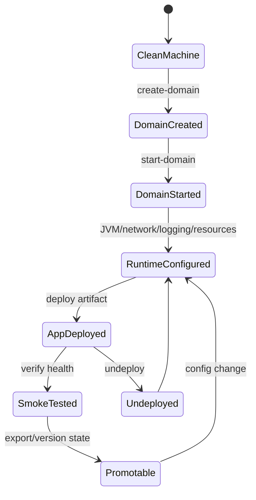
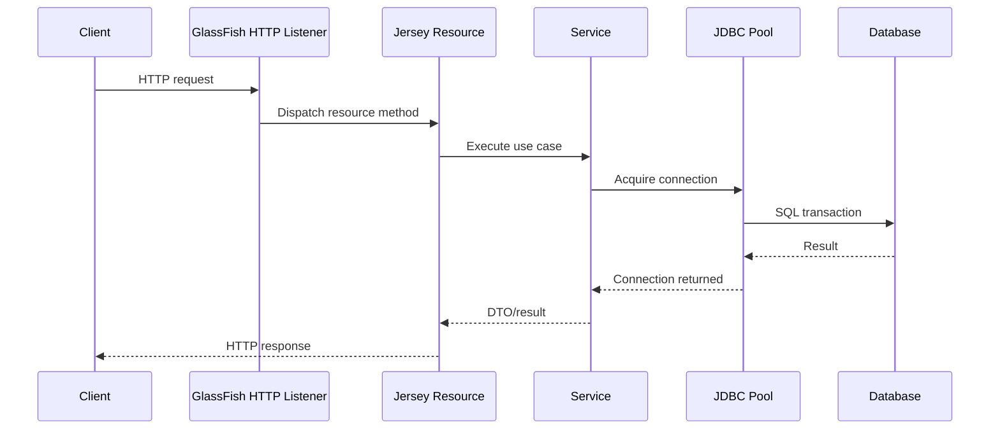
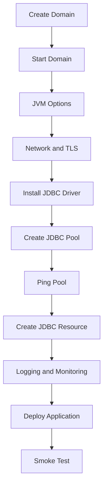
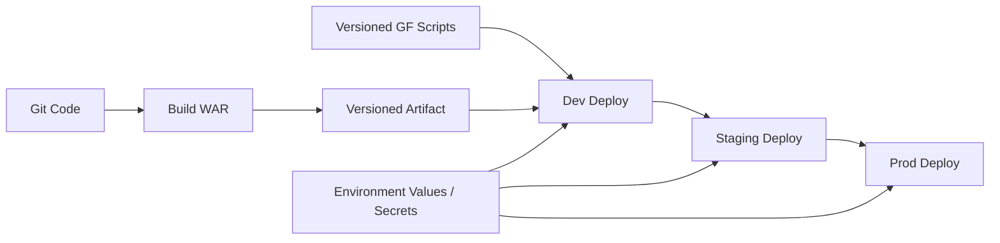
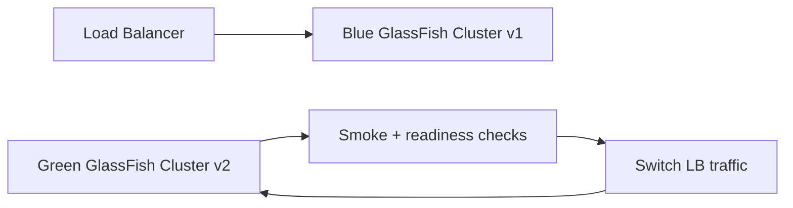

# Part 020 — GlassFish Configuration as Code with `asadmin`

> Target utama bagian ini: kita ingin GlassFish environment bisa dibuat ulang secara deterministik. Bukan “server A sudah diklik-klick sampai jalan”, tetapi “environment ini bisa direbuild dari script, diaudit, dibandingkan, dan dipromosikan antar stage”.

GlassFish bisa dikonfigurasi melalui Admin Console, REST administration, dan `asadmin`. Untuk engineering team yang mengejar reliability, `asadmin` adalah alat utama untuk membuat konfigurasi repeatable.

Admin Console bagus untuk eksplorasi. Tetapi untuk production, staging, dan regulated environment, konfigurasi manual adalah risiko:

- tidak reproducible;
- tidak mudah direview;
- tidak jelas siapa mengubah apa;
- tidak bisa diuji di pipeline;
- rawan drift antar environment;
- sulit dipulihkan setelah server rusak;
- sulit dijelaskan saat audit.

Prinsip bagian ini:

> Treat GlassFish configuration as versioned operational code.

---

## 1. Kaufman Deconstruction

Skill configuration-as-code dengan `asadmin` dapat dipecah menjadi beberapa sub-skill.

| Sub-skill | Yang Harus Dikuasai | Output Praktis |
|---|---|---|
| Domain lifecycle | create/start/stop/delete domain | Bisa membuat environment bersih |
| Command model | local vs remote commands, target, options | Bisa membaca efek command |
| Idempotency | command aman dijalankan ulang | Script tidak rapuh |
| Resource provisioning | JDBC pool/resource, JMS, JNDI | Runtime dependency tersedia sebelum deploy |
| JVM/runtime config | heap, GC, system properties, options | Runtime sesuai workload |
| Network config | listener, ports, TLS, proxy assumption | Traffic path eksplisit |
| Logging/monitoring | log level, monitoring level, diagnostics | Environment observable |
| Deployment automation | deploy/undeploy/redeploy with target | Artifact promotion konsisten |
| Drift detection | compare desired vs actual state | Bisa audit dan repair |

Tujuan akhirnya bukan hafal command. Tujuannya adalah bisa mendesain **server state machine**.



---

## 2. Why `asadmin` Matters

`asadmin` is GlassFish's command-line administration tool. It is not just a convenience wrapper over UI actions. It is the operational interface that lets us encode server behavior in script.

### 2.1 Admin Console vs `asadmin`

| Aspect | Admin Console | `asadmin` |
|---|---|---|
| Exploration | Excellent | Good |
| Repeatability | Weak | Strong |
| Code review | Weak | Strong |
| CI/CD | Weak | Strong |
| Audit trail | External/manual | Git/script/log driven |
| Drift detection | Manual | Scriptable |
| Disaster recovery | Harder | Easier |
| Production discipline | Risky alone | Preferred baseline |

### 2.2 Operational Rule

> Anything required for runtime correctness must be represented in a script, not just remembered by an operator.

Examples:

- JDBC pool settings;
- JNDI resource names;
- JVM options;
- TLS listener settings;
- logging level;
- monitoring level;
- deployment target;
- application context root;
- environment properties;
- security realm configuration.

---

## 3. Command Model

An `asadmin` command roughly has this shape:

```bash
asadmin [global-options] command [command-options] operands
```

Examples:

```bash
asadmin start-domain domain1
asadmin list-domains
asadmin create-jdbc-connection-pool ...
asadmin deploy --contextroot /orders target/orders-api.war
```

### 3.1 Local vs Remote Commands

Some commands operate locally against files/processes. Others require running DAS/server.

| Command Type | Needs Running Server? | Example |
|---|---:|---|
| Local domain lifecycle | Sometimes no | `create-domain`, `delete-domain` |
| Runtime config | Usually yes | `set`, `create-jdbc-resource` |
| Deployment | Yes | `deploy`, `undeploy` |
| Inspection | Usually yes | `list-applications`, `list-jdbc-resources` |

### 3.2 Target Awareness

Many GlassFish commands apply to a target:

- domain;
- server instance;
- cluster;
- configuration;
- application;
- resource.

When command has no explicit target, it may use default target. In production script, be explicit.

```bash
asadmin create-jdbc-resource \
  --connectionpoolid ordersPool \
  --target server \
  jdbc/orders
```

### 3.3 Avoid Hidden Defaults

Defaults are convenient for local development but dangerous in multi-environment operations.

Bad:

```bash
asadmin deploy orders.war
```

Better:

```bash
asadmin deploy \
  --target server \
  --contextroot /orders \
  --name orders-api \
  --force true \
  target/orders-api.war
```

---

## 4. Directory Layout for Configuration-as-Code

A maintainable project should separate application code from runtime environment code.

```text
orders-service/
  pom.xml
  src/
  deploy/
    glassfish/
      README.md
      env/
        local.env
        dev.env
        staging.env
        prod.env.example
      scripts/
        00-common.sh
        01-create-domain.sh
        02-start-domain.sh
        03-jvm-options.sh
        04-network.sh
        05-jdbc.sh
        06-logging-monitoring.sh
        07-deploy.sh
        08-smoke-test.sh
        09-export-state.sh
        99-destroy-domain.sh
      sql/
        init-local-db.sql
```

### 4.1 Why Numbered Scripts?

Numbered scripts encode dependency ordering:

1. domain must exist before runtime config;
2. server must be running before remote config;
3. JDBC pool must exist before JDBC resource;
4. resources must exist before app deployment;
5. health check must happen after deployment.

---

## 5. Script Foundation

Create a shared script.

```bash
#!/usr/bin/env bash
set -euo pipefail

: "${GF_HOME:?GF_HOME is required}"
: "${DOMAIN_NAME:=domain1}"
: "${ADMIN_PORT:=4848}"
: "${HTTP_PORT:=8080}"
: "${HTTPS_PORT:=8181}"
: "${ADMIN_USER:=admin}"

ASADMIN="$GF_HOME/bin/asadmin"

log() {
  printf '\n[%s] %s\n' "$(date -Is)" "$*"
}

run() {
  log "asadmin $*"
  "$ASADMIN" "$@"
}
```

### 5.1 Why `set -euo pipefail`?

- `-e`: fail on command error;
- `-u`: fail on unset variable;
- `-o pipefail`: fail if any command in pipeline fails.

Configuration script must fail loudly. Silent partial config is worse than no config.

---

## 6. Environment File Pattern

`dev.env`:

```bash
export GF_HOME="/opt/glassfish8/glassfish"
export DOMAIN_NAME="orders-dev"
export ADMIN_PORT="4848"
export HTTP_PORT="8080"
export HTTPS_PORT="8181"
export DB_HOST="localhost"
export DB_PORT="5432"
export DB_NAME="orders"
export DB_USER="orders_app"
export DB_PASSWORD_FILE="/run/secrets/orders_db_password"
export APP_WAR="target/orders-api.war"
```

Load it:

```bash
source deploy/glassfish/env/dev.env
source deploy/glassfish/scripts/00-common.sh
```

### 6.1 Do Not Commit Secrets

Commit secret references, not secret values.

Good:

```bash
export DB_PASSWORD_FILE="/run/secrets/orders_db_password"
```

Bad:

```bash
export DB_PASSWORD="SuperSecret123"
```

---

## 7. Creating a Domain

```bash
#!/usr/bin/env bash
set -euo pipefail
source "$(dirname "$0")/00-common.sh"

if "$ASADMIN" list-domains | grep -q "^${DOMAIN_NAME} "; then
  log "Domain ${DOMAIN_NAME} already exists"
else
  log "Creating domain ${DOMAIN_NAME}"
  run create-domain \
    --adminport "$ADMIN_PORT" \
    --instanceport "$HTTP_PORT" \
    "$DOMAIN_NAME"
fi
```

### 7.1 Idempotency Pattern

The script checks current state before create.

Naive script:

```bash
asadmin create-domain orders-dev
```

fails on second run.

Idempotent script:

```bash
if exists; then skip; else create; fi
```

### 7.2 When Not to Auto-Create

For production, domain creation might be separated from application deployment. That is fine. But the desired domain configuration should still be represented as code.

---

## 8. Starting and Stopping Domain

```bash
run start-domain "$DOMAIN_NAME"
```

```bash
run stop-domain "$DOMAIN_NAME"
```

For local/dev, these are part of setup. For containerized deployment, process lifecycle is usually handled by container entrypoint or orchestration platform.

---

## 9. JVM Options

JVM options define runtime behavior. They must not be scattered across tribal knowledge.

Examples:

```bash
run create-jvm-options \
  "-Dorders.env=${APP_ENV}" \
  "-Duser.timezone=UTC" \
  "-Dfile.encoding=UTF-8"
```

Heap/GC options:

```bash
run create-jvm-options \
  "-Xms512m" \
  "-Xmx1024m"
```

### 9.1 Idempotent JVM Option Add

`create-jvm-options` may fail if option exists. Build helper:

```bash
jvm_option_exists() {
  local opt="$1"
  "$ASADMIN" list-jvm-options | grep -Fxq "$opt"
}

ensure_jvm_option() {
  local opt="$1"
  if jvm_option_exists "$opt"; then
    log "JVM option exists: $opt"
  else
    run create-jvm-options "$opt"
  fi
}

ensure_jvm_option "-Duser.timezone=UTC"
ensure_jvm_option "-Dfile.encoding=UTF-8"
ensure_jvm_option "-Dorders.env=${APP_ENV}"
```

### 9.2 Do Not Hide Application Config in JVM Options Only

JVM system properties are acceptable for runtime-wide settings, but application configuration should have a clear ownership model:

- environment variable;
- MicroProfile Config if used;
- JNDI env entry;
- external config volume;
- secret store;
- JVM option only when appropriate.

---

## 10. System Properties

GlassFish supports system properties that can be used in configuration expressions.

Example:

```bash
run create-system-properties \
  "orders.db.host=${DB_HOST}:orders.db.port=${DB_PORT}:orders.db.name=${DB_NAME}"
```

Use this carefully. System properties are useful for server config templating, but they are not a substitute for secret management.

---

## 11. JDBC Connection Pool

For Jersey applications, JDBC pool is often the most important server-managed resource.

A REST request path may look like:



If pool is wrong, endpoint error looks like application failure, but root cause is server resource state.

### 11.1 Create JDBC Pool

Example PostgreSQL-style command:

```bash
DB_PASSWORD="$(cat "$DB_PASSWORD_FILE")"

run create-jdbc-connection-pool \
  --datasourceclassname org.postgresql.ds.PGSimpleDataSource \
  --restype javax.sql.DataSource \
  --property \
    "serverName=${DB_HOST}:portNumber=${DB_PORT}:databaseName=${DB_NAME}:user=${DB_USER}:password=${DB_PASSWORD}" \
  ordersPool
```

Note: exact datasource class and properties depend on JDBC driver.

### 11.2 Create JDBC Resource

```bash
run create-jdbc-resource \
  --connectionpoolid ordersPool \
  jdbc/orders
```

Application code uses JNDI:

```java
@Resource(lookup = "jdbc/orders")
private DataSource dataSource;
```

### 11.3 Idempotent Pool Creation

```bash
jdbc_pool_exists() {
  "$ASADMIN" list-jdbc-connection-pools | grep -Fxq "$1"
}

ensure_jdbc_pool() {
  local pool="$1"
  if jdbc_pool_exists "$pool"; then
    log "JDBC pool exists: $pool"
  else
    run create-jdbc-connection-pool \
      --datasourceclassname org.postgresql.ds.PGSimpleDataSource \
      --restype javax.sql.DataSource \
      --property "serverName=${DB_HOST}:portNumber=${DB_PORT}:databaseName=${DB_NAME}:user=${DB_USER}:password=$(cat "$DB_PASSWORD_FILE")" \
      "$pool"
  fi
}
```

### 11.4 Ping Pool

```bash
run ping-connection-pool ordersPool
```

Make this part of setup and smoke test. If the pool cannot ping, do not deploy the application and pretend it is healthy.

---

## 12. Pool Tuning as Code

Do not tune pool by memory.

Example:

```bash
run set resources.jdbc-connection-pool.ordersPool.steady-pool-size=8
run set resources.jdbc-connection-pool.ordersPool.max-pool-size=32
run set resources.jdbc-connection-pool.ordersPool.pool-resize-quantity=4
run set resources.jdbc-connection-pool.ordersPool.idle-timeout-in-seconds=300
```

### 12.1 Tuning Invariant

Pool size must be consistent with:

- database max connections;
- GlassFish thread pools;
- endpoint concurrency;
- transaction duration;
- timeout budget;
- number of app instances;
- background jobs;
- admin/reporting queries.

If each instance has `max-pool-size=50` and there are 10 instances, potential database connection demand is 500 before considering other clients.

---

## 13. Network Listener Configuration

Network config defines how requests reach Jersey.

Typical local setup:

```text
HTTP  : 8080
HTTPS : 8181
Admin : 4848
```

Production behind reverse proxy may expose only proxy ports externally.

### 13.1 Inspect Listeners

```bash
run list-network-listeners
run list-http-listeners
```

### 13.2 Set Listener Port

```bash
run set configs.config.server-config.network-config.network-listeners.network-listener.http-listener-1.port="$HTTP_PORT"
```

### 13.3 Timeout Alignment

Timeout must be aligned across layers:

```text
Client timeout
  < API Gateway timeout
    < Load Balancer timeout
      < GlassFish request timeout
        < Jersey outbound timeout
          < Database statement timeout
```

If GlassFish waits longer than load balancer, users see gateway timeout while server keeps doing wasted work.

---

## 14. TLS and Secure Admin

For production, admin interface should not be exposed casually. At minimum:

- secure admin explicitly configured;
- admin port restricted by network policy;
- credentials not default;
- TLS material managed outside ad-hoc manual steps;
- admin operations audited.

Example command pattern:

```bash
run enable-secure-admin
```

Some security changes require restart.

### 14.1 Operational Rule

> The Admin Console is an operational control plane. Treat it like one.

Do not expose it to public networks. Do not share admin credentials across teams. Do not rely on default passwords.

---

## 15. Logging Configuration

Logs are part of runtime contract.

### 15.1 Set Log Levels

```bash
run set-log-levels "jakarta.enterprise.resource.webcontainer.jsf=WARNING"
run set-log-levels "org.glassfish.jersey=INFO"
run set-log-levels "com.acme.orders=INFO"
```

For debugging Jersey routing/provider behavior temporarily:

```bash
run set-log-levels "org.glassfish.jersey=FINE"
```

But do not leave verbose runtime logs on permanently without cost analysis.

### 15.2 Log Rotation

Configure rotation, retention, and shipping policy. Local logs are not an observability strategy by themselves.

Questions:

- where do logs go after node death?
- are request IDs present?
- are secrets masked?
- are error IDs tied to response contract?
- can on-call search by tenant/case/user safely?

---

## 16. Monitoring Configuration

GlassFish monitoring can expose runtime statistics. Enable levels intentionally.

Example style:

```bash
run set configs.config.server-config.monitoring-service.module-monitoring-levels.thread-pool=HIGH
run set configs.config.server-config.monitoring-service.module-monitoring-levels.jdbc-connection-pool=HIGH
run set configs.config.server-config.monitoring-service.module-monitoring-levels.http-service=HIGH
```

### 16.1 Monitoring Cost

Higher monitoring levels can add overhead. Use them based on environment:

| Environment | Monitoring Strategy |
|---|---|
| Local | enable enough for learning/debug |
| Dev | moderate |
| Staging | close to production |
| Production | high-value modules only, benchmarked |
| Incident mode | temporarily increase targeted diagnostics |

---

## 17. Application Deployment

Deployment should be deterministic.

```bash
run deploy \
  --target server \
  --name orders-api \
  --contextroot /orders \
  --force true \
  "$APP_WAR"
```

### 17.1 Avoid Ambiguous Context Root

Do not let artifact filename accidentally define public URL.

Bad:

```bash
asadmin deploy target/orders-api-1.4.7-SNAPSHOT.war
```

URL may become environment/artifact dependent.

Better:

```bash
--contextroot /orders
--name orders-api
```

### 17.2 Deployment State Checks

```bash
run list-applications
```

Smoke test:

```bash
curl -fsS "http://localhost:${HTTP_PORT}/orders/health"
```

---

## 18. Undeploy and Redeploy

```bash
run undeploy orders-api
```

For safe redeploy:

```bash
if "$ASADMIN" list-applications | grep -Fxq "orders-api"; then
  run undeploy orders-api
fi

run deploy \
  --target server \
  --name orders-api \
  --contextroot /orders \
  "$APP_WAR"
```

### 18.1 When `--force true` Is Not Enough

Use clean undeploy/deploy when changing:

- dependency layout;
- Jersey/provider modules;
- Jakarta API scope;
- EAR/WAR packaging;
- server-level libraries;
- classloading-sensitive dependencies.

---

## 19. Resource Ordering

Deployment must happen after server resources exist.



If the application starts before resources exist, you may get false failures:

- CDI injection failure;
- JNDI lookup failure;
- first request failure;
- health check red;
- deployment rollback.

---

## 20. Idempotency Patterns

Configuration script should be safe to run repeatedly.

### 20.1 Exists Then Create

```bash
if exists; then
  skip
else
  create
fi
```

### 20.2 Desired Value Then Set

```bash
current="$($ASADMIN get configs.config.server-config.java-config.debug-enabled | cut -d= -f2)"
if [[ "$current" != "false" ]]; then
  run set configs.config.server-config.java-config.debug-enabled=false
fi
```

### 20.3 Delete Then Recreate

Useful when command lacks update semantics, but risky if resource is in use.

```bash
if resource_exists jdbc/orders; then
  run delete-jdbc-resource jdbc/orders
fi
run create-jdbc-resource --connectionpoolid ordersPool jdbc/orders
```

Use only in controlled setup windows.

### 20.4 Immutable Rebuild

For containerized or ephemeral environments, simplest pattern may be:

1. build image;
2. start clean domain;
3. apply config scripts;
4. deploy app;
5. run smoke test.

This reduces drift but requires reliable startup automation.

---

## 21. Drift Detection

A script that only applies config is not enough. We also need to detect whether actual state differs from desired state.

### 21.1 Export Actual State

```bash
run get "*" > build/glassfish-state.txt
run list-jdbc-connection-pools > build/jdbc-pools.txt
run list-jdbc-resources > build/jdbc-resources.txt
run list-applications > build/applications.txt
run list-jvm-options > build/jvm-options.txt
```

### 21.2 Compare in CI/Ops

Store sanitized desired snapshot:

```text
deploy/glassfish/desired/dev-state.txt
deploy/glassfish/desired/staging-state.txt
```

Compare actual:

```bash
diff -u deploy/glassfish/desired/staging-jvm-options.txt build/jvm-options.txt
```

### 21.3 Do Not Diff Secrets

Never export secret values into CI logs. Mask or exclude them.

---

## 22. Promotion Model

Good promotion means the same artifact and config logic move across environments, with environment-specific values injected separately.



### 22.1 Anti-Pattern

- dev uses Admin Console;
- staging uses partial script;
- production uses manual runbook;
- environment values copied by chat message.

This guarantees drift.

### 22.2 Better Pattern

- same script structure;
- different `.env` or secret provider;
- same artifact name/version;
- same deployment checks;
- environment-specific capacity values reviewed separately.

---

## 23. Secrets Handling

`asadmin` commands often require credentials for DB, admin, keystore, etc.

### 23.1 Avoid Command-Line Secret Leaks

Command-line args can appear in process list or shell history.

Safer patterns:

- password files;
- environment injected by secret manager;
- container secret volume;
- CI masked variables;
- GlassFish password aliases where appropriate.

### 23.2 Example Password File Pattern

```bash
DB_PASSWORD="$(cat "$DB_PASSWORD_FILE")"
```

But do not echo command with password included. Our earlier `run()` helper logs command arguments, so be careful.

For sensitive commands, use a `run_sensitive` helper:

```bash
run_sensitive() {
  log "asadmin [sensitive command omitted]"
  "$ASADMIN" "$@"
}
```

---

## 24. Password Alias Pattern

GlassFish supports password aliasing in many operational patterns. Use it to avoid embedding raw password values directly in server config where possible.

Conceptual flow:

```text
create-password-alias db.orders.password
use ${ALIAS=db.orders.password} in resource property
```

Exact syntax depends on GlassFish version and command context, so validate against your target version.

Production invariant:

> Secrets must be injected through a controlled secret channel, not committed, logged, or manually pasted into random runbooks.

---

## 25. Admin Authentication File

For automation, avoid interactive password prompts.

A password file may look like:

```text
AS_ADMIN_PASSWORD=...
AS_ADMIN_NEWPASSWORD=...
```

Use restrictive permissions:

```bash
chmod 600 /run/secrets/glassfish_admin_password_file
```

Then:

```bash
asadmin --user admin --passwordfile /run/secrets/glassfish_admin_password_file list-applications
```

Do not commit this file.

---

## 26. Local Development Profile

For local dev, speed matters, but do not build habits that break production.

Local profile may:

- create local domain;
- use local DB;
- use relaxed logging;
- deploy SNAPSHOT artifact;
- run smoke test.

Example:

```bash
#!/usr/bin/env bash
set -euo pipefail

source deploy/glassfish/env/local.env

bash deploy/glassfish/scripts/01-create-domain.sh
bash deploy/glassfish/scripts/02-start-domain.sh
bash deploy/glassfish/scripts/03-jvm-options.sh
bash deploy/glassfish/scripts/05-jdbc.sh
bash deploy/glassfish/scripts/06-logging-monitoring.sh
bash deploy/glassfish/scripts/07-deploy.sh
bash deploy/glassfish/scripts/08-smoke-test.sh
```

---

## 27. Containerized GlassFish Entrypoint

In containers, configuration-as-code often runs at image build time or container startup.

### 27.1 Build-Time Configuration

Pros:

- faster startup;
- immutable image;
- fewer startup dependencies.

Cons:

- secrets must not be baked;
- environment-specific values require runtime injection;
- changing config requires image rebuild.

### 27.2 Runtime Configuration

Pros:

- flexible environment values;
- secrets injected at runtime;
- same image across environments.

Cons:

- startup slower;
- failure can happen during pod/container start;
- scripts must be very reliable.

### 27.3 Recommended Split

Build-time:

- install GlassFish;
- install JDBC driver if common;
- copy scripts;
- copy app artifact if release-specific image.

Runtime:

- inject environment values;
- configure secrets;
- create/update resources;
- deploy or start predeployed app;
- run readiness check.

---

## 28. Kubernetes Considerations

If GlassFish runs in Kubernetes:

- readiness probe should check app health, not just process alive;
- liveness probe should be conservative;
- config and secrets should be mounted or injected;
- admin port should not be exposed publicly;
- persistent domain directory decision must be explicit;
- rolling deployment must account for startup time and DB pool pressure;
- graceful shutdown must let in-flight requests complete.

### 28.1 Readiness Example

```yaml
readinessProbe:
  httpGet:
    path: /orders/health/ready
    port: 8080
  initialDelaySeconds: 20
  periodSeconds: 10
  timeoutSeconds: 3
  failureThreshold: 6
```

### 28.2 Liveness Example

```yaml
livenessProbe:
  httpGet:
    path: /orders/health/live
    port: 8080
  initialDelaySeconds: 60
  periodSeconds: 20
  timeoutSeconds: 3
  failureThreshold: 3
```

Do not make liveness depend on database if transient DB outage would cause Kubernetes to kill every app instance.

---

## 29. Config Validation Endpoint

A production-grade Jersey app should expose safe health/config validation.

```java
@Path("/health/ready")
public class ReadinessResource {
    @Resource(lookup = "jdbc/orders")
    DataSource dataSource;

    @GET
    @Produces(MediaType.APPLICATION_JSON)
    public Response ready() throws SQLException {
        try (Connection c = dataSource.getConnection()) {
            return Response.ok(Map.of("status", "ready")).build();
        }
    }
}
```

But be careful:

- do not expose secrets;
- do not run expensive queries;
- distinguish liveness vs readiness;
- avoid making health endpoint itself a source of overload.

---

## 30. Blue-Green and Rolling Deployment

`asadmin deploy --force true` is not a deployment strategy by itself.

For production, define:

- how traffic is drained;
- how old version remains available;
- how database migration is coordinated;
- how rollback works;
- how health determines promotion;
- how sticky sessions/session state are handled.

### 30.1 Simple Blue-Green Concept



GlassFish script participates by making each environment reproducible. Traffic switching may happen outside GlassFish.

---

## 31. Full Example: `configure-dev.sh`

```bash
#!/usr/bin/env bash
set -euo pipefail

ROOT_DIR="$(cd "$(dirname "$0")/../../.." && pwd)"
source "$ROOT_DIR/deploy/glassfish/env/dev.env"
source "$ROOT_DIR/deploy/glassfish/scripts/00-common.sh"

log "Configuring GlassFish domain: $DOMAIN_NAME"

bash "$ROOT_DIR/deploy/glassfish/scripts/01-create-domain.sh"
bash "$ROOT_DIR/deploy/glassfish/scripts/02-start-domain.sh"
bash "$ROOT_DIR/deploy/glassfish/scripts/03-jvm-options.sh"
bash "$ROOT_DIR/deploy/glassfish/scripts/04-network.sh"
bash "$ROOT_DIR/deploy/glassfish/scripts/05-jdbc.sh"
bash "$ROOT_DIR/deploy/glassfish/scripts/06-logging-monitoring.sh"
bash "$ROOT_DIR/deploy/glassfish/scripts/07-deploy.sh"
bash "$ROOT_DIR/deploy/glassfish/scripts/08-smoke-test.sh"

log "GlassFish dev environment configured successfully"
```

---

## 32. Failure Model

### 32.1 Script Fails During Domain Creation

Possible causes:

- port already used;
- domain exists with different config;
- missing JDK;
- wrong `GF_HOME`;
- permission issue.

Fix:

- validate prerequisites;
- make domain name environment-specific;
- check port before create;
- fail early with useful message.

### 32.2 Script Fails During JDBC Pool Creation

Possible causes:

- driver not visible to server;
- wrong datasource class;
- wrong property names;
- secret file missing;
- database unavailable;
- network policy blocks DB.

Fix:

- install driver at correct boundary;
- validate driver class;
- ping pool;
- separate secret validation;
- check DB connectivity before deploy.

### 32.3 Deploy Succeeds, App Fails First Request

Possible causes:

- lazy JNDI lookup;
- provider classloading issue;
- missing config only used at runtime;
- pool exists but cannot connect;
- wrong context root.

Fix:

- health check should touch critical dependencies;
- startup validation for config;
- explicit deployment name/contextroot;
- fail deployment pipeline if smoke test fails.

### 32.4 Config Works in Dev, Fails in Prod

Possible causes:

- manual drift;
- environment variable missing;
- different GlassFish/JDK version;
- different driver version;
- stricter security/network policy;
- resource target mismatch.

Fix:

- version pinning;
- drift detection;
- environment contract document;
- preflight checks;
- config snapshot comparison.

---

## 33. Preflight Checks

Before touching GlassFish, validate environment.

```bash
require_command() {
  command -v "$1" >/dev/null 2>&1 || {
    echo "Missing required command: $1" >&2
    exit 1
  }
}

require_file() {
  [[ -f "$1" ]] || {
    echo "Missing required file: $1" >&2
    exit 1
  }
}

require_command java
require_command curl
require_file "$APP_WAR"
require_file "$DB_PASSWORD_FILE"
"$ASADMIN" version
```

### 33.1 Version Check

```bash
java -version
"$ASADMIN" version
```

For GlassFish 8, JDK 21+ is required. Do not let production startup discover this accidentally.

---

## 34. Testing Configuration Scripts

Treat scripts like code.

### 34.1 Test Levels

| Level | What It Validates |
|---|---|
| Shell lint | syntax and unsafe shell patterns |
| Dry-run style check | required env vars and files |
| Local integration | domain can be created and app deployed |
| Container integration | image starts and health passes |
| Staging rehearsal | production-like infra and secrets |

### 34.2 CI Example

```bash
shellcheck deploy/glassfish/scripts/*.sh
mvn -q -DskipTests package
bash deploy/glassfish/configure-local-ci.sh
curl -fsS http://localhost:8080/orders/health/ready
```

---

## 35. Operational Runbook Template

Every production GlassFish app should have a short runbook.

```md
# Orders API GlassFish Runbook

## Runtime
- GlassFish version: 8.x
- JDK: 21+
- Context root: /orders
- App name: orders-api

## Critical Resources
- JDBC pool: ordersPool
- JDBC resource: jdbc/orders
- DB driver: PostgreSQL driver installed at server library boundary

## Deploy
```bash
source deploy/glassfish/env/prod.env
bash deploy/glassfish/scripts/07-deploy.sh
bash deploy/glassfish/scripts/08-smoke-test.sh
```

## Rollback
```bash
export APP_WAR=/artifacts/orders-api-previous.war
bash deploy/glassfish/scripts/07-deploy.sh
bash deploy/glassfish/scripts/08-smoke-test.sh
```

## Diagnostics
```bash
asadmin list-applications
asadmin list-jdbc-connection-pools
asadmin ping-connection-pool ordersPool
asadmin list-jvm-options
asadmin get "*monitoring*"
```
```

---

## 36. Anti-Patterns

### 36.1 ClickOps Production

Manual Admin Console changes with no script record.

Impact:

- drift;
- unreproducible fixes;
- audit weakness;
- disaster recovery pain.

### 36.2 One Giant Script with No Boundaries

A single `setup.sh` that does everything with no structure.

Impact:

- hard to review;
- hard to rerun partially;
- hard to debug;
- hard to promote.

### 36.3 Secrets in Git

Impact:

- incident-level security failure;
- rotation cost;
- audit exposure.

### 36.4 App Deploy Before Resource Readiness

Impact:

- false startup failure;
- first-request failure;
- partial outage.

### 36.5 Environment-Specific Artifact

Building different WARs per environment with baked config.

Impact:

- artifact is no longer promoted;
- bugs differ across environments;
- rollback becomes ambiguous.

---

## 37. Production Checklist

Before accepting a GlassFish environment as production-ready:

- [ ] Domain creation/configuration is scripted.
- [ ] JVM options are versioned.
- [ ] Network ports/listeners are explicit.
- [ ] Admin access is secured and restricted.
- [ ] JDBC driver placement is documented.
- [ ] JDBC pools/resources are scripted.
- [ ] Pool ping is part of setup/smoke test.
- [ ] Logging levels are explicit.
- [ ] Monitoring levels are explicit.
- [ ] Deployment uses explicit app name and context root.
- [ ] Secrets are not committed or logged.
- [ ] Drift detection exists.
- [ ] Runbook exists.
- [ ] Rollback path tested.
- [ ] Health/readiness checks validate critical dependencies safely.

---

## 38. Mental Model Summary

GlassFish configuration should be treated as a state machine:

```text
desired config + environment values + artifact => reproducible runtime
```

`asadmin` is the mechanism for transforming a domain from one known state to another.

A strong engineer does not ask:

> “Which buttons did we click on staging?”

They ask:

> “What desired state do we declare, how do we apply it idempotently, and how do we prove actual state matches?”

---

## 39. Practice Lab

### Lab 1 — Build a Reproducible Local Domain

Create scripts to:

1. create domain;
2. start domain;
3. set JVM timezone;
4. deploy a test WAR;
5. smoke test endpoint.

Destroy and recreate domain from scratch.

### Lab 2 — JDBC Pool Automation

Add PostgreSQL or H2 pool creation. Ensure:

- driver placement is correct;
- pool can ping;
- app can JNDI lookup `jdbc/orders`;
- readiness endpoint validates connection.

### Lab 3 — Drift Detection

Manually change one log level in Admin Console. Run export script and detect diff.

### Lab 4 — Safe Redeploy

Deploy v1 and v2 of a sample Jersey app with same `--name` and `--contextroot`. Validate URL remains stable.

---

## 40. References

- Eclipse GlassFish Administration Guide: https://glassfish.org/docs/7.0.25/administration-guide.html
- Eclipse GlassFish Application Deployment Guide, Release 8: https://glassfish.org/docs/SNAPSHOT/application-deployment-guide.html
- Eclipse GlassFish Release Notes: https://glassfish.org/docs/latest/release-notes.html
- Eclipse GlassFish Downloads: https://glassfish.org/download
- Jakarta EE Specifications: https://jakarta.ee/specifications/

---

## 41. What Comes Next

Di bagian berikutnya, kita akan masuk ke **HTTP, Network, TLS, Connectors, and Thread Pools**.

Kita akan membahas bagaimana request masuk ke GlassFish dari network layer, bagaimana listener/protocol/thread pool bekerja, bagaimana TLS dan reverse proxy memengaruhi Jersey app, serta bagaimana timeout dan thread pool salah konfigurasi bisa berubah menjadi latency spike atau outage.
