# Part 021 — HTTP, Network, TLS, Connectors, Thread Pools

> Target utama bagian ini: kita ingin bisa menjelaskan dan mengendalikan perjalanan request dari network edge sampai resource method Jersey, lalu balik lagi ke client, termasuk TLS, listener, reverse proxy, timeout, queue, thread pool, dan failure mode-nya.

Di bagian sebelumnya, kita sudah membuat konfigurasi GlassFish menjadi scriptable dengan `asadmin`. Sekarang kita masuk ke layer runtime yang sering menentukan apakah service terasa “cepat dan stabil” atau “kadang-kadang freeze tanpa alasan jelas”.

Jersey resource method biasanya terlihat sederhana:

```java
@GET
@Path("/{id}")
public OrderDto get(@PathParam("id") UUID id) {
    return service.find(id);
}
```

Tetapi request yang sampai ke method itu melewati banyak boundary:

- network listener;
- protocol configuration;
- TLS handshake atau TLS termination;
- Grizzly transport;
- HTTP parser;
- virtual server;
- web container;
- Servlet mapping;
- Jersey runtime;
- resource method;
- provider serialization;
- socket write back ke client.

Engineer yang hanya melihat resource method akan sulit mendiagnosis timeout, slow request, thread exhaustion, TLS mismatch, reverse proxy header bug, atau queue saturation.

---

## 1. Kaufman Deconstruction

Untuk menguasai HTTP/network/thread model GlassFish, pecah skill-nya menjadi sub-skill berikut.

| Sub-skill | Yang Harus Dikuasai | Output Praktis |
|---|---|---|
| Request path model | Dari socket sampai Jersey resource | Bisa tracing latency per boundary |
| Listener/protocol/transport | Network listener, protocol, transport, virtual server | Bisa membaca konfigurasi HTTP GlassFish |
| TLS model | Terminated at proxy vs GlassFish | Bisa menentukan trust boundary |
| Reverse proxy model | Host, scheme, forwarded header, context root | URL, redirect, cookie, dan security benar |
| Thread pool model | Acceptor/worker/application executor | Bisa mencegah starvation |
| Timeout budget | Client, proxy, server, Jersey client, DB | Timeout tidak saling bertabrakan |
| Queue/backpressure | Thread queue, connection queue, pool wait | Bisa membedakan overload vs bug logic |
| Observability | Access log, server log, metrics, thread dump | Bisa debugging tanpa menebak |
| Tuning discipline | Hypothesis → measurement → change | Tuning tidak menjadi ritual acak |

Mental model-nya:

```mermaid
flowchart LR
    Client[Client] --> LB[Load Balancer / Reverse Proxy]
    LB --> Listener[GlassFish Network Listener]
    Listener --> Protocol[HTTP Protocol Config]
    Protocol --> Transport[Grizzly Transport]
    Transport --> Web[Web Container]
    Web --> Servlet[Jersey Servlet / Application]
    Servlet --> Jersey[Jersey Runtime]
    Jersey --> Resource[Resource Method]
    Resource --> Provider[MessageBodyWriter]
    Provider --> Socket[Response Socket]
```

Prinsipnya:

> Endpoint performance is not only business logic performance. It is end-to-end runtime path performance.

---

## 2. The Runtime Boundary We Care About

Dalam seri ini, kita tidak sedang membahas teori HTTP umum. Kita fokus pada pertanyaan production:

1. Listener mana yang menerima request?
2. Port dan protocol apa yang aktif?
3. TLS berhenti di mana?
4. Header proxy apa yang dipercaya?
5. Thread pool mana yang dipakai?
6. Timeout mana yang lebih dulu menembak?
7. Apakah request overload harus menunggu, ditolak, atau didegradasi?
8. Bagaimana membedakan endpoint lambat karena DB, serialization, queue, network, atau TLS?

Ketika Jersey berjalan di GlassFish, resource method hanyalah satu tahap. GlassFish bertanggung jawab mengatur server-side HTTP entrypoint dan menyediakan runtime container.

---

## 3. GlassFish HTTP Object Model

Secara konseptual, konfigurasi HTTP GlassFish dapat dibaca seperti graph.

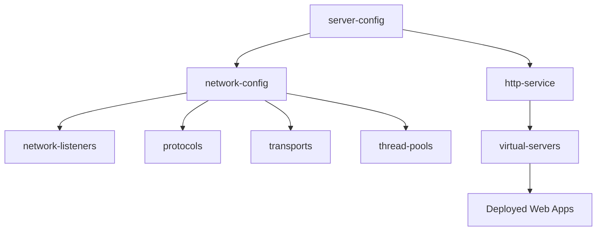

Komponen penting:

| Component | Peran | Pertanyaan Diagnosis |
|---|---|---|
| Network listener | Bind ke address/port dan menerima koneksi | Port mana yang menerima request? |
| Protocol | HTTP behavior, security, timeout, redirect, compression | HTTP/TLS policy apa yang berlaku? |
| Transport | Low-level network I/O | Bagaimana koneksi dikelola? |
| Thread pool | Worker execution capacity | Apakah request menunggu thread? |
| Virtual server | Host/context routing | App mana yang menangani host/path ini? |
| Web container | Servlet runtime | Mapping Servlet/Jersey benar? |
| Jersey runtime | Resource dispatch/provider/filter | Endpoint logic benar? |

Kalau ada request gagal, jangan langsung lompat ke code. Tanyakan dulu: request berhasil sampai layer mana?

---

## 4. Request Path: From Wire to Resource Method

Request HTTP melewati beberapa stage.

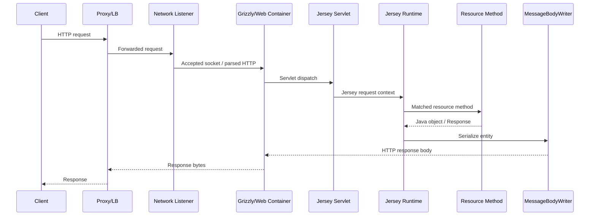

Untuk debugging, pecah latency menjadi:

| Segment | Gejala Kalau Bermasalah |
|---|---|
| Client → proxy | Client timeout, network error, TLS handshake failure |
| Proxy → GlassFish | 502/503/504, upstream reset, connection refused |
| Listener accept | Connection queue penuh, sporadic timeout |
| Web container dispatch | Thread pool busy, request queue panjang |
| Jersey matching/filter | 404/405/406/415, auth reject, filter latency |
| Resource method | DB/API/cache latency, lock contention |
| Serialization | CPU tinggi, payload besar, memory spike |
| Response write | Slow client, broken pipe, proxy timeout |

Production debugging yang baik selalu menyertakan stage isolation.

---

## 5. Network Listener

Network listener adalah entrypoint network. Ia mengikat address/port ke protocol dan transport.

Contoh mental model:

```text
http-listener-1
  address: 0.0.0.0
  port: 8080
  protocol: http-listener-1
  transport: tcp
  enabled: true
```

Contoh command eksplorasi:

```bash
asadmin list-network-listeners
asadmin get 'configs.config.server-config.network-config.network-listeners.network-listener.*'
```

Hal yang perlu diperiksa:

- listener enabled atau tidak;
- port sesuai environment;
- address bind ke `0.0.0.0`, `127.0.0.1`, atau IP tertentu;
- protocol yang dipakai;
- target instance/cluster yang benar;
- port conflict;
- firewall/security group;
- container port mapping;
- reverse proxy upstream target.

### 5.1 Common Listener Failure

| Symptom | Kemungkinan Penyebab | Diagnosis |
|---|---|---|
| Connection refused | Listener off, port salah, process down | `list-network-listeners`, `netstat`/`ss`, server log |
| Works locally but not outside | bind `127.0.0.1`, firewall, container port | check bind address and routing |
| 404 from GlassFish | listener hidup, app/context salah | inspect virtual server/context root |
| 502 from proxy | proxy cannot reach listener | proxy log + GlassFish access log |
| Random timeout | queue/thread/pool saturation | thread dump + monitoring |

### 5.2 Rule

> A live port only proves the listener is reachable. It does not prove Jersey routing, security, resource dependency, or downstream health.

---

## 6. Protocol Configuration

Protocol configuration mengatur behavior HTTP yang lebih tinggi daripada bind port.

Hal yang biasanya berada di area protocol:

- HTTP vs HTTPS behavior;
- security enabled/disabled;
- redirect behavior;
- request timeout;
- header/body limits;
- compression;
- access logging relation;
- keep-alive behavior;
- SSL association.

Eksplorasi:

```bash
asadmin get 'configs.config.server-config.network-config.protocols.protocol.*'
```

Saat troubleshooting, jangan hanya melihat port. Port menunjuk ke listener; listener menunjuk ke protocol; protocol menentukan banyak behavior runtime.

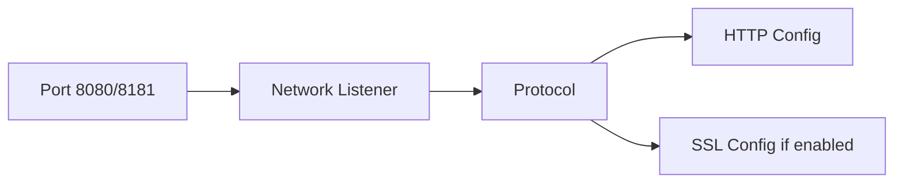

---

## 7. Virtual Server

Virtual server menentukan mapping host/context ke web application.

Dalam topology sederhana, semua request masuk ke default virtual server. Dalam topology yang lebih kompleks, virtual server dapat memisahkan aplikasi berdasarkan host name.

Hal yang perlu diperiksa:

- deployed application target;
- context root;
- virtual server association;
- host alias;
- default web module;
- reverse proxy host header preservation.

Symptoms:

| Symptom | Kemungkinan Penyebab |
|---|---|
| App deployed tapi URL 404 | context root salah atau target salah |
| Host A bekerja, host B 404 | virtual server/host alias mismatch |
| Redirect ke host internal | proxy header/host reconstruction salah |
| Cookie domain/path salah | context root/host/scheme tidak sesuai |

---

## 8. Reverse Proxy Boundary

Di production, GlassFish jarang langsung diekspos ke internet. Biasanya ada:

- load balancer;
- reverse proxy;
- ingress controller;
- API gateway;
- service mesh sidecar.

Ini membuat boundary penting:

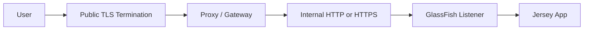

Pertanyaan arsitektural:

1. Apakah TLS terminate di proxy atau GlassFish?
2. Apakah koneksi proxy → GlassFish tetap HTTPS?
3. Siapa sumber kebenaran untuk scheme original: `http` atau `https`?
4. Apakah `Host` header dipreserve?
5. Apakah app boleh percaya `X-Forwarded-*` dari client langsung?
6. Apakah admin listener tertutup dari public network?

### 8.1 Header Proxy yang Sering Relevan

| Header | Makna | Risiko |
|---|---|---|
| `Host` | Host yang diminta client | Salah host menyebabkan redirect/link salah |
| `X-Forwarded-For` | Original client IP chain | Mudah dipalsukan jika tidak disanitasi proxy |
| `X-Forwarded-Proto` | Original scheme | Salah scheme menyebabkan secure redirect/cookie salah |
| `X-Forwarded-Host` | Original host | Harus dipercaya hanya dari proxy trusted |
| `Forwarded` | Standardized forwarded info | Perlu parsing dan trust policy jelas |

Rule:

> Do not trust forwarded headers unless the request comes from a trusted proxy boundary.

### 8.2 Common Proxy Bugs

| Bug | Gejala |
|---|---|
| Proxy tidak preserve Host | generated link memakai host internal |
| `X-Forwarded-Proto` hilang | app mengira request HTTP, bukan HTTPS |
| Context path rewrite tidak konsisten | endpoint relatif rusak |
| Proxy timeout lebih pendek dari server | 504 walau server masih bekerja |
| Body size limit berbeda | 413 dari proxy, bukan dari GlassFish/Jersey |
| Buffering proxy aktif untuk streaming | SSE/streaming terlihat macet |

---

## 9. TLS Deployment Models

Ada tiga pola umum.

### 9.1 TLS Terminated at GlassFish

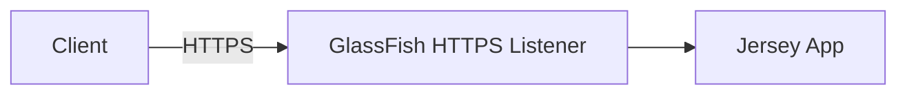

Cocok untuk:

- environment sederhana;
- internal service;
- lab/dev;
- deployment tanpa dedicated proxy.

Trade-off:

- certificate management berada di GlassFish;
- setiap instance perlu key/cert configuration;
- rotation harus diotomasi;
- public exposure GlassFish harus sangat dikontrol.

### 9.2 TLS Terminated at Proxy

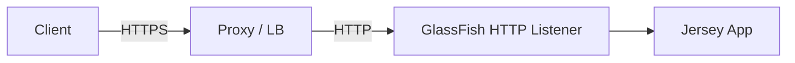

Cocok untuk:

- centralized TLS;
- Kubernetes ingress;
- enterprise load balancer;
- certificate rotation oleh platform team.

Trade-off:

- GlassFish melihat koneksi internal sebagai HTTP;
- app perlu benar memahami original scheme melalui trusted header;
- internal network harus dianggap sesuai threat model.

### 9.3 TLS Re-Encrypted to GlassFish

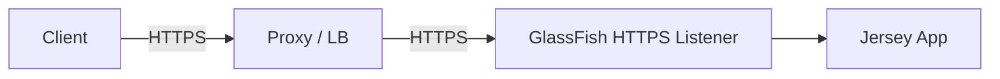

Cocok untuk:

- regulated environment;
- zero-trust internal network;
- compliance requirement;
- multi-tenant internal platform.

Trade-off:

- lebih kompleks;
- certificate trust chain internal perlu dikelola;
- observability TLS lebih sulit;
- handshake overhead bertambah.

---

## 10. TLS Engineering Checklist

Untuk production, TLS bukan hanya “HTTPS aktif”. Checklist-nya:

- gunakan certificate valid, bukan self-signed untuk public endpoint;
- otomatisasi renewal dan reload/restart procedure;
- simpan private key dengan permission ketat;
- disable protocol/cipher yang tidak sesuai policy organisasi;
- pastikan redirect HTTP → HTTPS terjadi di layer yang benar;
- pastikan secure cookie hanya keluar untuk original HTTPS request;
- jangan expose admin listener public;
- log handshake failure secara cukup, tapi jangan log secret;
- test dengan client aktual, proxy aktual, dan chain aktual.

Potential failure:

| Failure | Gejala |
|---|---|
| Expired certificate | Client TLS error |
| Wrong SAN | Browser/client rejects hostname |
| Proxy trusts wrong backend cert | 502/SSL upstream failure |
| Incomplete chain | Some clients fail, others pass |
| TLS termination but wrong scheme header | Redirect loop / insecure cookie bug |

---

## 11. Thread Pool Mental Model

Thread pool adalah kapasitas eksekusi. Kalau semua thread sibuk, request baru harus menunggu, ditolak, atau timeout di tempat lain.

Untuk aplikasi Jersey di GlassFish, pikirkan beberapa pool sekaligus:

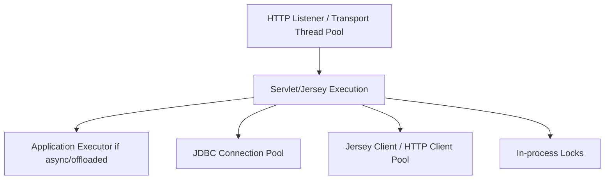

Jangan melihat HTTP thread pool secara terisolasi. Sering kali thread HTTP habis karena menunggu pool lain.

Contoh:

```text
HTTP threads: 200
JDBC connections: 20
Average DB query latency: 2s during incident
Incoming rate: 150 req/s
```

Kapasitas efektif dibatasi oleh JDBC pool, bukan HTTP thread pool. Menambah HTTP thread menjadi 500 bisa memperparah queue, memory, dan database pressure.

---

## 12. Thread Starvation vs Slow Business Logic

Dua gejala ini sering terlihat mirip: request lambat. Tetapi akar masalahnya beda.

| Aspect | Thread Starvation | Slow Business Logic |
|---|---|---|
| Banyak thread state | `WAITING`, `BLOCKED`, pool wait, socket wait | runnable/IO wait di method tertentu |
| Endpoint affected | Banyak endpoint sekaligus | Endpoint tertentu dominan |
| CPU | Bisa rendah atau tinggi | Tergantung logic |
| Queue | Naik | Mungkin normal |
| Fix utama | Remove blocking, tune pool, backpressure | Optimize dependency/algorithm |

Thread dump adalah alat utama:

```bash
jcmd <pid> Thread.print > thread-dump.txt
# atau tool JVM lain sesuai environment
```

Baca pola:

- banyak thread menunggu JDBC connection;
- banyak thread menunggu remote API;
- banyak thread menunggu lock;
- banyak thread melakukan serialization payload besar;
- banyak thread idle tapi request timeout berarti masalah di depan server.

---

## 13. Queueing Model

Runtime yang sehat bukan berarti semua request harus diterima. Runtime yang sehat berarti sistem punya perilaku jelas saat overload.

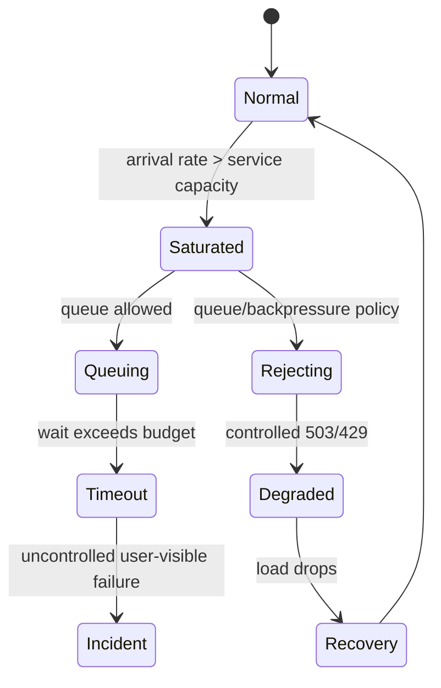

Jika queue terlalu besar:

- latency tail memburuk;
- client sudah timeout sebelum server memproses;
- work menjadi obsolete;
- memory pressure naik;
- incident recovery melambat.

Jika queue terlalu kecil:

- server cepat reject;
- throughput mungkin lebih rendah;
- tapi failure lebih cepat dan eksplisit.

Production architecture harus memilih trade-off, bukan membiarkannya default tanpa pemahaman.

---

## 14. Timeout Budget

Timeout harus berlapis dan konsisten. Misalnya:

```text
Client timeout:        10s
API gateway timeout:    9s
GlassFish request:      8s logical SLA
Jersey outbound call:   2s connect + 4s read
Database query target:  3s
```

Yang buruk:

```text
Client timeout:       5s
Proxy timeout:       60s
Server work:        120s
DB query: no limit
```

Akibat:

- client sudah pergi;
- proxy mungkin menunggu terlalu lama;
- server tetap bekerja untuk request yang tidak berguna;
- thread/pool terpakai;
- overload makin buruk.

### 14.1 Timeout Types

| Timeout | Layer | Makna |
|---|---|---|
| Connect timeout | Client/proxy/outbound | Waktu membangun koneksi |
| Read/socket timeout | Client/proxy/outbound | Waktu menunggu bytes response |
| Request timeout | Server/app | Batas logis processing request |
| Idle timeout | Server/proxy | Koneksi idle terlalu lama |
| Keep-alive timeout | HTTP | Berapa lama koneksi persistent disimpan |
| Pool wait timeout | JDBC/client pool | Waktu menunggu resource pool |
| Transaction timeout | JTA | Batas transaction active |

Rule:

> The shortest meaningful timeout should be closest to the work that can still be safely abandoned.

---

## 15. Keep-Alive and Connection Management

HTTP keep-alive mengurangi overhead koneksi, tetapi koneksi idle tetap memakai resource.

Pertanyaan tuning:

- Berapa banyak client/proxy membuka koneksi simultan?
- Apakah traffic datang dari sedikit proxy atau banyak direct client?
- Apakah proxy menggunakan connection pooling ke backend?
- Apakah idle timeout proxy dan GlassFish selaras?
- Apakah ada slowloris-like behavior yang perlu dibatasi?

Failure umum:

| Misconfig | Gejala |
|---|---|
| keep-alive terlalu pendek | connection churn, CPU/network overhead |
| keep-alive terlalu panjang | banyak idle connection, resource pressure |
| proxy idle > backend idle | upstream reset sporadic |
| backend idle > proxy idle | server menyimpan koneksi tak berguna lebih lama |

---

## 16. Payload Size and Header Limits

GlassFish/Jersey app harus punya policy ukuran request/response.

Boundary yang perlu disejajarkan:

- client upload limit;
- proxy body size limit;
- GlassFish request size/header behavior;
- Jersey provider buffering;
- application DTO validation;
- persistence layer constraints.

Jangan membiarkan ukuran payload menjadi implicit.

Contoh failure:

| Symptom | Root Cause |
|---|---|
| 413 dari gateway | proxy body limit lebih kecil dari app expectation |
| OOM saat upload | app/provider membaca seluruh body ke memory |
| 400 untuk request tertentu | header terlalu besar, cookie terlalu banyak |
| response lambat | payload besar + serialization + slow client |

Rule:

> Payload policy is part of API contract, not an accidental server default.

---

## 17. Compression

HTTP compression bisa mengurangi bandwidth, tetapi menambah CPU dan memiliki security consideration untuk data sensitif.

Gunakan compression untuk:

- JSON besar;
- repetitive text payload;
- public API response besar;
- bandwidth-constrained client.

Hati-hati untuk:

- payload sangat kecil;
- streaming/SSE;
- data rahasia yang bercampur dengan attacker-controlled input;
- CPU-bound service;
- double compression oleh proxy dan backend.

Rule:

> Compression is a latency/bandwidth trade-off, not a free optimization.

---

## 18. Access Logging

Access log adalah observability paling dekat ke HTTP boundary.

Minimal log fields:

- timestamp;
- request method;
- path;
- status;
- response time;
- response size;
- remote address / trusted client IP;
- user agent;
- correlation ID;
- virtual server/listener if possible.

Jangan log:

- token authorization;
- full PII payload;
- password/secret;
- unbounded query string tanpa sanitization.

Access log membantu menjawab:

- apakah request sampai GlassFish?
- status apa yang dikembalikan?
- latency di boundary server berapa?
- apakah failure datang dari endpoint tertentu?
- apakah proxy retry menyebabkan duplicate request?

---

## 19. Network and Jersey Interaction

Network config memengaruhi Jersey behavior.

| Network/Proxy Issue | Jersey-Level Symptom |
|---|---|
| Wrong context root rewrite | `@Path` terlihat tidak match |
| Wrong `Content-Type` stripped/changed | 415 |
| Wrong `Accept` header | 406 |
| Body buffering/proxy limit | upload error before resource method |
| Proxy timeout | client sees 504 while Jersey continues |
| Missing scheme header | generated URI uses `http` |
| Slow client | `StreamingOutput` blocks on write |
| Keep-alive mismatch | intermittent connection reset |

Jangan debug Jersey routing tanpa memeriksa request actual yang diterima server.

Gunakan filter ringan untuk forensic header di non-production atau dengan sanitization ketat:

```java
@Provider
@Priority(Priorities.AUTHENTICATION - 100)
public class RequestForensicsFilter implements ContainerRequestFilter {
    private static final Logger log = LoggerFactory.getLogger(RequestForensicsFilter.class);

    @Override
    public void filter(ContainerRequestContext ctx) {
        log.debug("method={} path={} contentType={} accept={} host={} xfp={}",
            ctx.getMethod(),
            ctx.getUriInfo().getRequestUri().getPath(),
            ctx.getHeaderString("Content-Type"),
            ctx.getHeaderString("Accept"),
            ctx.getHeaderString("Host"),
            ctx.getHeaderString("X-Forwarded-Proto"));
    }
}
```

Production rule:

> Header forensic logging must be allowlisted and redacted.

---

## 20. Thread Pool Sizing: Start With Workload Shape

Jangan mulai dari angka default. Mulai dari workload.

Pertanyaan:

1. Berapa request per second target?
2. Berapa p95/p99 latency target?
3. Apakah workload CPU-bound atau IO-bound?
4. Apakah request menunggu DB/remote API?
5. Berapa connection pool downstream?
6. Apakah endpoint streaming/long polling?
7. Apakah request idempotent dan bisa ditolak/retry?

Gunakan Little's Law sebagai intuisi:

```text
concurrency ≈ throughput × latency
```

Jika target 100 req/s dengan latency rata-rata 200ms:

```text
concurrency ≈ 100 × 0.2 = 20 active requests
```

Jika incident membuat latency DB naik ke 3s:

```text
concurrency ≈ 100 × 3 = 300 active requests
```

Maka thread pool 50 yang aman saat normal bisa habis saat dependency melambat. Solusinya bukan selalu menambah thread; solusinya bisa timeout lebih pendek, bulkhead, circuit breaker, cache fallback, atau backpressure.

---

## 21. CPU-bound vs IO-bound Endpoints

| Workload | Thread Strategy | Risk |
|---|---|---|
| CPU-bound JSON transform | Thread count dekat CPU core | Oversubscription, context switching |
| IO-bound DB/API | Thread count lebih tinggi, tapi dibatasi pool | Pool wait/starvation |
| Streaming long response | Pisahkan dari endpoint cepat | Thread retention |
| Long polling | Async or dedicated design | Worker exhaustion |
| File upload | Limit size + streaming | Memory/disk pressure |

Rule:

> One global pool for all request types is simple, but not always safe.

Jika endpoint berbeda drastis, pertimbangkan:

- async boundary;
- dedicated executor;
- bulkhead per dependency;
- rate limit per route;
- separate service deployment;
- proxy route policy.

---

## 22. Tuning Workflow

Tuning yang benar:

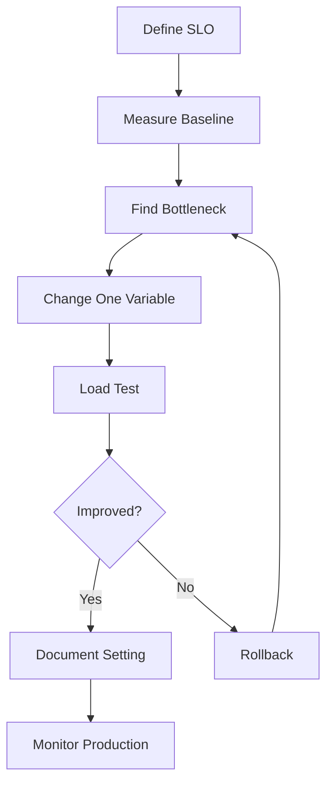

Yang salah:

- menaikkan semua pool sekaligus;
- meniru angka dari blog;
- tuning tanpa load test;
- tuning tanpa thread dump;
- tuning hanya berdasarkan average latency;
- tidak melihat p95/p99;
- tidak menyesuaikan proxy timeout;
- tidak mendokumentasikan rationale.

---

## 23. Load Testing Scenario Matrix

Test bukan hanya happy path.

| Scenario | Tujuan |
|---|---|
| steady load | baseline throughput/latency |
| spike load | queue/backpressure behavior |
| slow DB | JDBC pool/thread behavior |
| slow outbound API | Jersey client timeout/bulkhead |
| large payload | memory/serialization behavior |
| slow client | response write behavior |
| TLS handshake burst | CPU/network behavior |
| proxy timeout | abandoned work behavior |
| rolling restart | connection draining behavior |

Untuk tiap scenario, kumpulkan:

- server access log;
- Jersey request metrics;
- JVM CPU/memory/GC;
- thread dump during peak;
- JDBC/client pool metrics;
- proxy metrics;
- error distribution;
- p50/p95/p99 latency.

---

## 24. Secure Admin Listener Boundary

GlassFish memiliki admin interface. Jangan perlakukan admin listener seperti public app listener.

Checklist:

- bind admin ke management network;
- jangan expose ke internet;
- gunakan password kuat/secret management;
- gunakan TLS jika remote admin;
- restrict firewall/security group;
- audit access;
- disable/limit unused remote admin capability;
- jangan gunakan credential admin di pipeline tanpa secret hygiene.

Failure yang sering terjadi:

> App listener sudah hardened, tapi admin listener tertinggal terbuka.

Ini bukan bug Jersey. Ini bug boundary operasional.

---

## 25. Container and Kubernetes Considerations

Jika GlassFish berjalan di container/Kubernetes, network model bertambah:

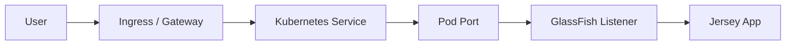

Pertanyaan tambahan:

- container port exposed benar?
- listener bind ke `0.0.0.0`, bukan localhost?
- readiness probe memeriksa dependency yang tepat?
- liveness probe tidak terlalu agresif?
- graceful shutdown memberi waktu request selesai?
- proxy buffering memengaruhi streaming?
- resource limit CPU/memory selaras dengan thread count?
- clock/timezone konsisten?

### 25.1 Probe Design

| Probe | Harus Memeriksa | Jangan Memeriksa |
|---|---|---|
| Liveness | process stuck/dead | DB transient error |
| Readiness | app siap menerima traffic | expensive deep dependency semua waktu |
| Startup | bootstrapping selesai | steady-state business health |

Readiness untuk Jersey/GlassFish idealnya menjawab:

- app deployed;
- Jersey route registry siap;
- essential config terbaca;
- critical pool bisa dipakai atau minimal initialized;
- service tidak sedang draining.

---

## 26. Graceful Shutdown

Saat redeploy atau rolling restart, runtime harus punya shutdown behavior.

Pertanyaan:

- apakah load balancer berhenti mengirim request sebelum instance dimatikan?
- berapa drain timeout?
- apa yang terjadi pada request aktif?
- apakah long-running/streaming request boleh diputus?
- apakah Jersey client outbound call dibatalkan?
- apakah transaction rollback aman?

Shutdown yang buruk:

```text
SIGTERM -> immediate kill -> request half-written -> transaction uncertain -> client retry duplicate
```

Shutdown yang lebih baik:

```text
mark not ready -> stop new traffic -> wait active requests -> close resources -> stop domain
```

---

## 27. Failure Diagnosis Matrix

| Symptom | Likely Layer | First Checks |
|---|---|---|
| `connection refused` | listener/process/network | domain running, port bind, firewall |
| proxy 502 | proxy → backend | upstream config, GlassFish access log |
| proxy 504 | timeout budget | proxy timeout, server latency, thread dump |
| GlassFish 404 | virtual server/context/Jersey mapping | deployment target, context root, resource path |
| 415 | Jersey provider/content type | actual `Content-Type`, provider registration |
| 406 | negotiation | actual `Accept`, `@Produces`, writer provider |
| intermittent reset | keep-alive/TLS/proxy | idle timeout alignment, cert/backend health |
| all endpoints slow | thread/pool/global dependency | thread dump, pool metrics, CPU/GC |
| specific endpoint slow | resource/downstream/provider | endpoint metrics, DB/API trace |
| streaming freezes | proxy buffering/slow client | proxy config, access log, write thread |

---

## 28. Operational Commands Cheat Sheet

Eksplorasi konfigurasi:

```bash
asadmin list-network-listeners
asadmin list-protocols
asadmin list-transports
asadmin list-threadpools
asadmin get 'configs.config.server-config.network-config.*'
asadmin get 'configs.config.server-config.thread-pools.*'
asadmin get 'configs.config.server-config.http-service.*'
```

Contoh set property dengan hati-hati:

```bash
# Example only: verify exact path in your GlassFish version before applying.
asadmin get 'configs.config.server-config.network-config.network-listeners.network-listener.http-listener-1.*'

# Use asadmin get first, then set one property at a time.
asadmin set 'configs.config.server-config.network-config.network-listeners.network-listener.http-listener-1.enabled=true'
```

Thread dump:

```bash
jcmd <pid> Thread.print > thread-dump-$(date +%Y%m%d%H%M%S).txt
```

Port check:

```bash
ss -ltnp | grep 8080
curl -v http://localhost:8080/your-context/health
```

TLS check:

```bash
openssl s_client -connect your-host:443 -servername your-host </dev/null
```

---

## 29. Jersey-Specific Hardening at the Boundary

Network layer tidak menggantikan application boundary.

Jersey app tetap harus:

- validate `Content-Type`;
- validate input DTO;
- reject oversized semantic payload;
- enforce auth/authz;
- avoid trusting raw forwarded headers;
- set response security headers where appropriate;
- produce stable error contract;
- expose safe health endpoints;
- log correlation ID;
- close outbound responses;
- use explicit client timeout.

GlassFish listener bisa melindungi sebagian network behavior. Jersey tetap bertanggung jawab atas API contract dan domain security.

---

## 30. Anti-Patterns

### 30.1 “Just Increase Threads”

Menambah thread tanpa tahu bottleneck dapat:

- menaikkan memory;
- menaikkan context switching;
- menekan DB lebih keras;
- memperbesar queue;
- memperlama incident recovery;
- membuat timeout makin tidak prediktif.

### 30.2 Proxy Timeout Longer Than Everything

Proxy menunggu terlalu lama, client sudah pergi, server terus bekerja.

### 30.3 No Backpressure

Semua request diterima sampai JVM, DB, atau downstream runtuh.

### 30.4 Trusting Forwarded Headers from Everyone

Client bisa memalsukan IP/scheme/host jika proxy tidak membersihkan header.

### 30.5 Streaming Through Buffered Proxy

SSE/file streaming tidak benar-benar streaming karena proxy buffer response.

### 30.6 Admin Listener Exposed

Application endpoint hardened, management endpoint terbuka.

### 30.7 One Size Fits All Timeout

Endpoint cepat, endpoint streaming, upload besar, dan outbound call lambat diperlakukan sama.

---

## 31. Production Checklist

Sebelum go-live:

- [ ] listener port/address/target benar;
- [ ] admin listener tidak public;
- [ ] TLS termination model terdokumentasi;
- [ ] certificate rotation procedure ada;
- [ ] proxy headers disanitasi dan trust boundary jelas;
- [ ] context root dan virtual server sesuai;
- [ ] access log aktif dengan field cukup;
- [ ] correlation ID end-to-end tersedia;
- [ ] timeout client/proxy/server/downstream selaras;
- [ ] thread pool baseline didasarkan load test;
- [ ] JDBC/outbound pool tidak kalah dari HTTP pool secara tidak sadar;
- [ ] large payload policy eksplisit;
- [ ] streaming behavior dites melalui proxy aktual;
- [ ] thread dump runbook tersedia;
- [ ] load test mencakup overload dan dependency slowness;
- [ ] graceful shutdown/draining diuji.

---

## 32. Mental Model Summary

Runtime HTTP GlassFish bukan sekadar “port 8080 jalan”. Ia adalah sistem kontrol traffic.

```text
network reachability
  -> listener/protocol/transport
  -> virtual server/context
  -> web container
  -> Jersey runtime
  -> resource/provider/filter
  -> dependency pools
  -> response write path
```

Top-tier engineer tidak hanya bertanya:

> “Endpoint ini return apa?”

Mereka bertanya:

> “Berapa kapasitas request path ini, apa timeout budget-nya, bagaimana ia gagal saat dependency lambat, dan bagaimana kita membuktikan root cause-nya?”

---

## 33. Practice Lab

### Lab 1 — Listener and Context Forensics

Deploy sample Jersey WAR. Catat:

- listener;
- port;
- context root;
- virtual server;
- access log output;
- actual headers diterima Jersey.

Ubah context root dan amati perbedaan 404 GlassFish vs 404 Jersey.

### Lab 2 — Proxy Header Simulation

Gunakan reverse proxy lokal. Test:

- `Host` preserved;
- `X-Forwarded-Proto`;
- context path rewrite;
- generated absolute URI;
- secure cookie behavior.

### Lab 3 — Thread Starvation Simulation

Buat endpoint yang sleep 5 detik. Load test dengan concurrency tinggi. Ambil thread dump. Bedakan:

- request queue;
- worker thread busy;
- CPU rendah tapi latency tinggi.

### Lab 4 — Timeout Budget

Atur client timeout lebih pendek dari server processing. Observasi:

- apakah server tetap bekerja setelah client timeout;
- log apa yang muncul;
- bagaimana endpoint idempotent menangani retry.

### Lab 5 — Streaming Through Proxy

Buat endpoint SSE atau chunked stream. Test langsung ke GlassFish dan melalui proxy. Lihat apakah event benar-benar terkirim bertahap.

---

## 34. References

- Eclipse GlassFish Administration Guide, Release 8: https://glassfish.org/docs/latest/administration-guide.html
- Eclipse GlassFish Reference Manual, Release 8: https://glassfish.org/docs/latest/reference-manual.html
- Eclipse GlassFish Application Development Guide, Release 8: https://glassfish.org/docs/latest/application-development-guide.html
- Eclipse GlassFish Performance Tuning Guide: https://glassfish.org/docs/5.1.0/performance-tuning-guide.html
- Jakarta RESTful Web Services 4.0 Specification: https://jakarta.ee/specifications/restful-ws/4.0/

---

## 35. What Comes Next

Di bagian berikutnya, kita akan masuk ke **JDBC, JTA, Resources, and REST Runtime Coupling**.

Kita akan melihat bagaimana request REST meminjam connection, membuka transaction boundary, memanggil database, lalu mengembalikan response. Fokusnya bukan JDBC basic, tetapi coupling antara HTTP threads, JDBC pool, JTA transaction, timeout, error contract, dan deployment resource di GlassFish.
