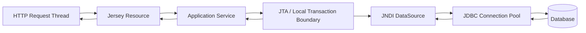
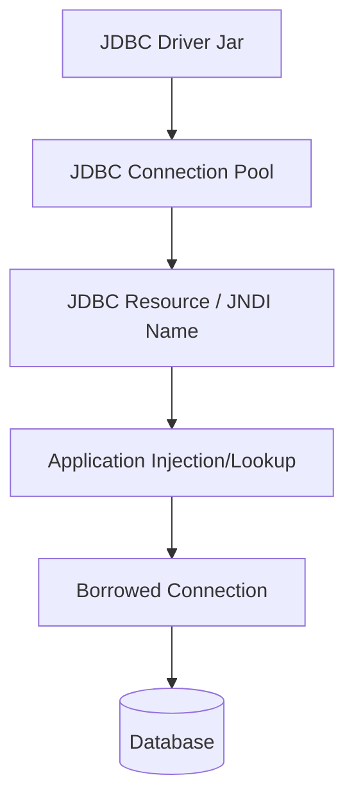
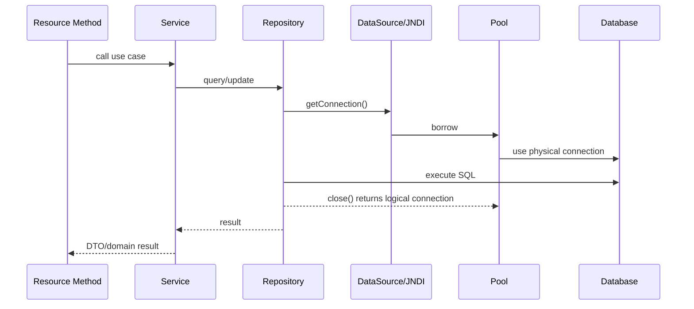
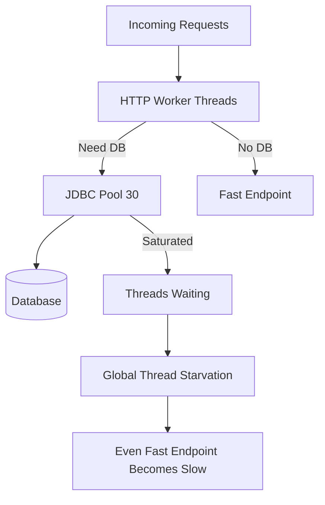
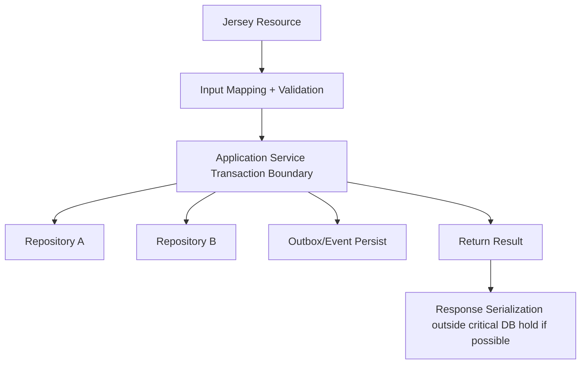
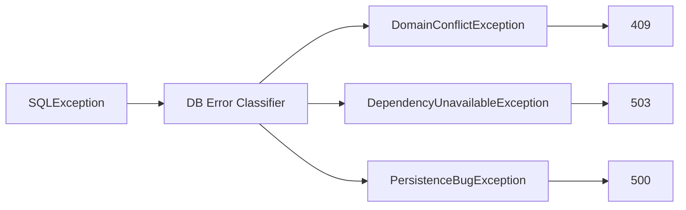
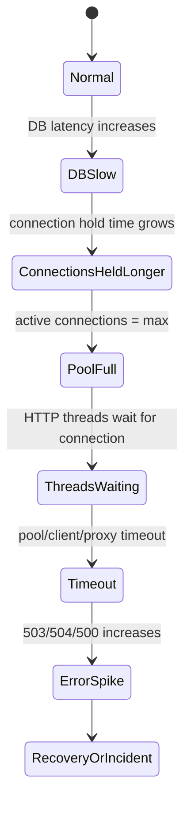
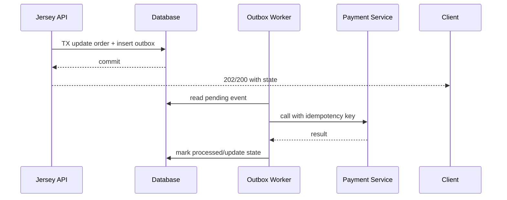
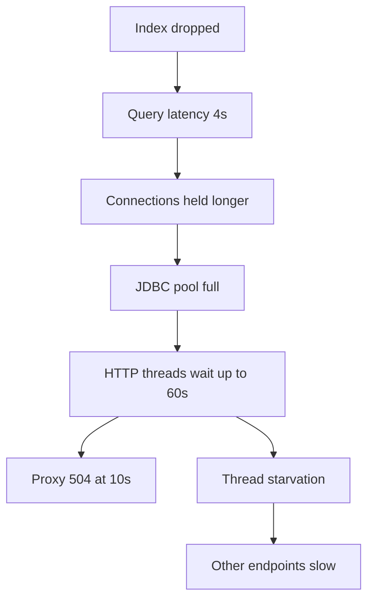

# Part 022 — JDBC, JTA, Resources, and REST Runtime Coupling

> Target utama bagian ini: memahami bagaimana request REST di Jersey berinteraksi dengan JDBC resource, connection pool, dan JTA transaction di GlassFish, sehingga kita bisa mencegah pool exhaustion, transaction leak, timeout chaos, dan error contract yang tidak defensible.

Kita sudah punya seri khusus `learn-java-sql-jdbc` dan `learn-java-persistence`. Jadi bagian ini tidak mengulang SQL, JDBC API dasar, atau ORM mapping. Fokus kita lebih sempit dan lebih production-oriented:

> What happens when an HTTP request consumes a database resource inside a Jakarta EE application server?

Di production, bug REST + database jarang hanya tentang query salah. Sering kali masalahnya adalah coupling runtime:

- HTTP thread menunggu JDBC connection;
- JDBC pool lebih kecil dari traffic concurrency;
- transaction aktif terlalu lama karena serialization/remote call;
- connection tidak ditutup;
- JTA timeout tidak selaras dengan proxy timeout;
- retry membuat duplicate write;
- database lambat membuat semua endpoint ikut lambat;
- health check terlalu agresif memukul database;
- app jalan lokal karena embedded datasource, tetapi gagal di GlassFish karena JNDI resource tidak ada.

---

## 1. Kaufman Deconstruction

Skill ini kita pecah menjadi beberapa sub-skill.

| Sub-skill | Yang Harus Dikuasai | Output Praktis |
|---|---|---|
| Resource model | JDBC driver, pool, resource, JNDI | Bisa membaca dependency runtime app |
| Connection lifecycle | borrow/use/return/validation | Bisa mencegah leak dan pool exhaustion |
| Transaction boundary | local tx, JTA, CDI `@Transactional`, `UserTransaction` | Bisa menentukan atomicity dengan jelas |
| Request coupling | HTTP thread ↔ DB connection ↔ transaction | Bisa memprediksi bottleneck |
| Timeout alignment | HTTP, proxy, pool wait, query, transaction | Failure lebih cepat dan jelas |
| Pool sizing | concurrency, latency, DB capacity | Tidak tuning secara mistik |
| Failure mapping | SQL/JTA/pool error → REST error contract | Client mendapat response stabil |
| Observability | pool metrics, slow query, thread dump, logs | Root cause tidak ditebak |
| Deployment discipline | resource creation before deploy | Artifact portable antar environment |

Mental model:



Prinsip inti:

> Database access in a REST request is a shared runtime resource consumption problem, not just a DAO coding problem.

---

## 2. GlassFish JDBC Resource Model

Di GlassFish, aplikasi idealnya tidak membuat `DriverManager.getConnection(...)` sendiri. Aplikasi memakai `DataSource` yang disediakan container.

Modelnya:



Komponen:

| Component | Peran | Contoh |
|---|---|---|
| JDBC driver | Implementasi vendor DB | PostgreSQL/MySQL/Oracle driver jar |
| Connection pool | Mengelola physical/logical connection | `ordersPool` |
| JDBC resource | JNDI alias yang dipakai aplikasi | `jdbc/orders` |
| Application lookup | Injection/lookup ke resource | `@Resource(lookup="jdbc/orders")` |
| Connection | Handle yang dipinjam dari pool | `dataSource.getConnection()` |

Rule:

> Application code should depend on a stable JNDI resource name, not environment-specific database URL/credential.

---

## 3. Why Container-Managed DataSource Matters

Container-managed datasource memberi:

- pooling;
- validation;
- lifecycle management;
- central configuration;
- credential separation;
- transaction integration;
- monitoring;
- deployment portability;
- admin control.

Anti-pattern:

```java
Connection c = DriverManager.getConnection(
    System.getenv("DB_URL"),
    System.getenv("DB_USER"),
    System.getenv("DB_PASSWORD")
);
```

Ini melewati:

- GlassFish pool;
- JTA enlistment;
- monitoring pool;
- resource targeting;
- admin-managed rotation;
- environment abstraction.

Untuk small standalone service, direct datasource mungkin masuk akal. Untuk GlassFish/Jakarta EE runtime, container-managed datasource adalah default yang lebih sesuai.

---

## 4. Injection Pattern

Contoh resource injection:

```java
@RequestScoped
public class OrderRepository {

    @Resource(lookup = "jdbc/orders")
    private DataSource dataSource;

    public Optional<OrderRecord> find(UUID id) throws SQLException {
        String sql = "select id, status, amount from orders where id = ?";

        try (Connection con = dataSource.getConnection();
             PreparedStatement ps = con.prepareStatement(sql)) {
            ps.setObject(1, id);
            try (ResultSet rs = ps.executeQuery()) {
                if (!rs.next()) {
                    return Optional.empty();
                }
                return Optional.of(map(rs));
            }
        }
    }
}
```

Catatan penting:

- `DataSource` boleh disimpan sebagai dependency;
- `Connection` tidak boleh disimpan lintas request;
- `PreparedStatement` dan `ResultSet` harus ditutup;
- gunakan try-with-resources;
- jangan return `ResultSet` keluar repository;
- jangan membuka connection di filter lalu dipakai diam-diam oleh service;
- jangan membuat transaction boundary implicit tanpa dokumentasi.

---

## 5. Connection Lifecycle

Lifecycle ideal:



`Connection.close()` pada pooled datasource biasanya berarti mengembalikan connection ke pool, bukan menutup physical socket ke DB setiap kali.

Invariants:

- borrow as late as possible;
- return as early as possible;
- do not hold connection during CPU-heavy serialization;
- do not hold connection during remote HTTP call unless truly required;
- never store connection in static field;
- never share connection across concurrent threads;
- transaction boundary determines whether connection can be returned immediately or after transaction completion.

---

## 6. HTTP Thread ↔ JDBC Pool Coupling

Misalkan:

```text
HTTP worker capacity: 200 concurrent requests
JDBC pool max:        30 connections
Average DB time:      100ms normal, 3s incident
```

Saat normal, 30 connections mungkin cukup. Saat DB melambat, 30 connections penuh, 170 HTTP threads bisa menunggu pool atau dependency lain. Akibatnya endpoint yang tidak memakai DB pun bisa ikut lambat jika pool/thread global habis.



Rule:

> A slow database can become an HTTP thread starvation incident if pool waits are not bounded.

---

## 7. Pool Sizing Mental Model

Pool sizing bukan “semakin besar semakin baik”. Pool size harus mempertimbangkan:

- database capacity;
- query latency;
- number of app instances;
- transaction duration;
- connection wait timeout;
- endpoint mix;
- burst behavior;
- DB lock contention;
- failover/reconnect behavior.

Jika ada 6 application instances dan setiap pool `max=50`, database bisa menerima 300 connection dari satu service. Ini bisa terlalu besar.

```text
Total possible DB connections = app instances × pool max size
```

Kalau database hanya aman menerima 120 connection untuk workload tersebut, maka pool per instance harus dihitung, bukan ditebak.

### 7.1 Starting Formula

Gunakan Little's Law sebagai intuisi:

```text
required concurrent DB connections ≈ DB-bound throughput × DB time
```

Contoh:

```text
Target DB-bound throughput: 100 req/s
Average DB hold time:      80ms = 0.08s
Connections needed:        100 × 0.08 = 8
```

Tambahkan headroom, bukan 10x tanpa alasan.

Saat DB hold time naik ke 1s:

```text
Connections needed: 100 × 1 = 100
```

Kalau pool hanya 20, sistem harus memilih:

- tunggu;
- reject cepat;
- degrade;
- shed load;
- circuit break;
- reduce traffic.

Jangan berharap pool kecil memproses unlimited burst tanpa queue impact.

---

## 8. Pool Settings That Matter

Nama option bisa berbeda antar versi/driver, tetapi konsepnya stabil.

| Setting | Makna | Failure Jika Salah |
|---|---|---|
| steady/min pool size | connection minimum yang dijaga | startup spike atau resource idle terlalu besar |
| max pool size | batas connection aktif | pool exhaustion atau DB overload |
| max wait time | waktu menunggu connection | HTTP thread menggantung terlalu lama |
| idle timeout | kapan idle connection dilepas | connection churn atau idle resource tinggi |
| validation method | cara memastikan connection sehat | stale connection lolos atau overhead tinggi |
| leak timeout | mendeteksi connection tidak dikembalikan | leak tidak terlihat |
| statement timeout | batas query | query runaway |
| transaction timeout | batas unit of work | tx terlalu lama menahan lock |

Rule:

> Pool wait timeout must be shorter than the user-facing request timeout.

Kalau client timeout 5 detik tetapi pool wait 60 detik, server akan terus menahan thread untuk request yang client-nya sudah pergi.

---

## 9. Resource Creation with `asadmin`

Contoh konseptual untuk PostgreSQL-like datasource. Sesuaikan driver class, property, credential, dan target dengan environment.

```bash
# Driver jar placement must be handled before pool creation.
# Example: copy driver jar to a controlled server lib location and restart if required by your setup.

asadmin create-jdbc-connection-pool \
  --restype javax.sql.DataSource \
  --datasourceclassname org.postgresql.ds.PGSimpleDataSource \
  --property serverName=db.internal:portNumber=5432:databaseName=orders:user=${DB_USER}:password=${DB_PASSWORD} \
  ordersPool

asadmin create-jdbc-resource \
  --connectionpoolid ordersPool \
  jdbc/orders

asadmin ping-connection-pool ordersPool
```

Catatan:

- `javax.sql.DataSource` tetap package Java SE, bukan namespace Jakarta EE;
- jangan commit password literal ke repository;
- target resource harus sesuai target deployment;
- ping pool bukan bukti query bisnis benar;
- resource harus ada sebelum deploy atau sebelum endpoint dipanggil;
- driver visibility harus sesuai classloader/server lib strategy.

---

## 10. JNDI Name Discipline

JNDI name adalah contract antara application artifact dan runtime environment.

Good:

```text
jdbc/orders
jdbc/audit
jdbc/reporting
```

Bad:

```text
jdbc/prod-postgres-10-0-1-15-main-password-v2
```

JNDI name harus stabil dan domain-oriented. Detail environment ada di GlassFish config, bukan di code.

### 10.1 Naming Rule

| Name Type | Example | Quality |
|---|---|---|
| Domain resource | `jdbc/orders` | Good |
| Capability | `jdbc/reporting-readonly` | Good |
| Environment-specific | `jdbc/prod-db01` | Weak |
| Credential-specific | `jdbc/orders-user-admin` | Dangerous |
| Vendor-specific | `jdbc/postgresOrders` | Sometimes acceptable, but leaks implementation |

---

## 11. Transaction Boundary Options

Ada beberapa pola transaction boundary.

### 11.1 Local Transaction Manual JDBC

```java
try (Connection con = dataSource.getConnection()) {
    con.setAutoCommit(false);
    try {
        // multiple SQL statements
        con.commit();
    } catch (Exception e) {
        con.rollback();
        throw e;
    }
}
```

Kelebihan:

- eksplisit;
- mudah dipahami untuk single datasource;
- tidak butuh JTA untuk use case sederhana.

Risiko:

- mudah lupa rollback;
- sulit compose lintas repository;
- tidak otomatis enlist resource lain;
- mixed dengan container transaction bisa kacau;
- exception mapping harus hati-hati.

### 11.2 CDI/Jakarta Transactional Boundary

```java
@RequestScoped
public class OrderService {

    @Transactional
    public OrderDto approve(UUID orderId, ApproveCommand command) {
        // load order
        // mutate state
        // persist events/outbox
        // return DTO
    }
}
```

Kelebihan:

- boundary di use case/service layer;
- rollback policy lebih deklaratif;
- lebih cocok untuk domain operation;
- dapat dikelola container.

Risiko:

- self-invocation/proxy issue;
- transaction terlalu lebar jika service melakukan remote call;
- rollback rule harus dipahami;
- exception swallowing bisa membuat commit tidak sengaja;
- streaming response tidak cocok dengan transaction panjang.

### 11.3 `UserTransaction`

```java
@Resource
private UserTransaction tx;

public void run() throws Exception {
    tx.begin();
    try {
        // work
        tx.commit();
    } catch (Exception e) {
        tx.rollback();
        throw e;
    }
}
```

Gunakan saat perlu explicit programmatic boundary, bukan sebagai default semua use case.

---

## 12. Where Should Transaction Start?

Idealnya transaction dimulai di application service/use-case boundary, bukan di Jersey resource method dan bukan di DAO paling bawah.



Resource method bertugas:

- menerima HTTP contract;
- mapping input;
- memanggil use case;
- mapping result/error ke response.

Service method bertugas:

- enforce domain invariant;
- menentukan transaction atomicity;
- mengoordinasikan repository;
- memutuskan side effect.

Repository bertugas:

- operasi persistence spesifik;
- tidak menentukan transaction use case secara global.

---

## 13. Transaction Scope Anti-Patterns

### 13.1 Transaction Around Remote Call

```java
@Transactional
public void approve(UUID id) {
    orderRepository.markApproved(id);
    paymentClient.capture(...); // remote call inside transaction
    auditRepository.insert(...);
}
```

Risiko:

- DB lock ditahan sambil menunggu network;
- timeout remote menyebabkan transaction lama;
- retry payment bisa duplicate;
- transaction rollback tidak membatalkan remote side effect.

Alternatif:

- outbox pattern;
- state machine with pending external action;
- saga/compensation;
- idempotency key;
- transaction hanya untuk local state transition.

### 13.2 Transaction Around Serialization

Jangan tahan transaction sampai JSON serialization selesai. Resource method harus mengembalikan DTO yang sudah detached dari cursor/connection.

Bad:

```java
@Transactional
public StreamingOutput export() {
    ResultSet rs = repository.openCursor();
    return out -> writeCsv(rs, out); // transaction/connection hidden into response streaming
}
```

Ini berbahaya karena response writing bergantung pada client speed/proxy buffering.

### 13.3 Open Connection in Filter

Filter bukan tempat membuka connection per request secara implicit.

Risiko:

- endpoint yang tidak butuh DB tetap meminjam connection;
- pool cepat habis;
- dependency tidak terlihat di code;
- ordering filter membuat behavior sulit didiagnosis.

---

## 14. REST Error Contract for DB Failures

Database failure harus diterjemahkan ke HTTP contract secara defensible.

| Failure | HTTP Candidate | Notes |
|---|---|---|
| unique constraint violation | 409 Conflict | Business conflict if user actionable |
| FK violation | 409 or 422 | Depends on API contract |
| not found | 404 | If resource identity absent |
| deadlock/serialization conflict | 409 or 503 | Retry semantics must be explicit |
| pool exhausted | 503 | Service temporarily unavailable |
| DB connection refused | 503 | Dependency unavailable |
| query timeout | 503 or 504 | Depends on gateway/server role |
| invalid SQL/schema mismatch | 500 | Deployment/programming error |
| transaction rollback unexpected | 500 or domain-specific | Log with incident ID |

Rule:

> Do not expose raw SQL exception messages to clients.

Expose stable problem response:

```json
{
  "type": "https://errors.example.com/resource-conflict",
  "title": "Resource conflict",
  "status": 409,
  "code": "ORDER_ALREADY_APPROVED",
  "correlationId": "01HY...",
  "details": []
}
```

Log internal detail separately.

---

## 15. Exception Mapping Pattern

Jersey `ExceptionMapper` should map infrastructure exceptions carefully.

```java
@Provider
public class SqlExceptionMapper implements ExceptionMapper<SQLException> {

    @Override
    public Response toResponse(SQLException ex) {
        String correlationId = Correlation.currentId();

        // In real systems, classify by SQLState/vendor code behind an abstraction.
        ErrorBody body = ErrorBody.of(
            "DATABASE_ERROR",
            "A database error occurred.",
            correlationId
        );

        return Response.status(Response.Status.SERVICE_UNAVAILABLE)
            .type(MediaType.APPLICATION_JSON_TYPE)
            .entity(body)
            .build();
    }
}
```

Namun jangan membuat mapper terlalu broad sehingga domain conflict berubah jadi 503 semua. Lebih baik repository/service menerjemahkan vendor-specific exception menjadi domain/infrastructure exception yang eksplisit.



---

## 16. Pool Exhaustion Failure Mode

Pool exhaustion biasanya tidak muncul sebagai “pool exhausted” di client. Client melihat latency/timeout/503/504.

Flow:



Observability signals:

- active connections near max;
- wait count/time increasing;
- HTTP latency rising;
- thread dump shows waits near datasource/pool;
- DB CPU/lock/io wait increases;
- p99 jumps before average;
- proxy 504 increases.

Immediate mitigations:

- fail fast with bounded pool wait;
- reduce traffic;
- degrade non-critical DB features;
- disable expensive endpoint;
- shorten query timeout;
- add index/fix slow query if root cause known;
- do not blindly increase pool across all instances.

---

## 17. Connection Leak Model

Leak berarti connection tidak dikembalikan ke pool.

Bad:

```java
Connection con = dataSource.getConnection();
PreparedStatement ps = con.prepareStatement(sql);
ResultSet rs = ps.executeQuery();
return map(rs); // connection never closed if no finally/try-with-resources
```

Good:

```java
try (Connection con = dataSource.getConnection();
     PreparedStatement ps = con.prepareStatement(sql);
     ResultSet rs = ps.executeQuery()) {
    return map(rs);
}
```

Leak symptoms:

- active connection count monotonically rises;
- throughput drops over time;
- restart temporarily fixes issue;
- thread dump shows many requests waiting for connection;
- database sees idle connections held by app;
- leak appears only on exception path.

Common leak causes:

- no try-with-resources;
- return `Stream<T>` backed by ResultSet;
- exception path before close;
- manual transaction path misses rollback/close;
- async task captures connection;
- framework integration misconfigured;
- long streaming response holds cursor.

---

## 18. Statement and Query Timeout

Application-level timeout is not enough. A query can continue running in DB after client/proxy gives up unless driver/database cancels it.

Set timeouts at appropriate layers:

- HTTP client timeout;
- reverse proxy timeout;
- GlassFish/server timeout;
- JDBC pool wait timeout;
- statement/query timeout;
- transaction timeout;
- database-side statement timeout if supported.

Example:

```java
try (PreparedStatement ps = con.prepareStatement(sql)) {
    ps.setQueryTimeout(3); // seconds; behavior depends on driver/database
    // execute
}
```

Rule:

> A request timeout without query timeout can still leave expensive database work running.

---

## 19. Transaction Timeout

Transaction timeout protects against transaction holding locks/resources too long.

If transaction timeout is longer than user-facing timeout, server may keep DB locks after client has gone away.

Bad:

```text
Client timeout:       5s
Proxy timeout:       10s
Transaction timeout: 120s
```

Better:

```text
Client timeout:       10s
Proxy timeout:        9s
App business budget:  8s
Transaction timeout:  6s for this use case
DB query timeout:     3s per query
Pool wait timeout:    200-500ms for latency-sensitive endpoint
```

Exact numbers depend on workload, but ordering must be intentional.

---

## 20. Read vs Write Pool Separation

Some systems benefit from separate datasource resources:

```text
jdbc/orders-write
jdbc/orders-read
jdbc/reporting-readonly
jdbc/audit
```

Use when:

- read replica exists;
- reporting queries must not starve writes;
- audit must be isolated;
- endpoint classes have different latency profile;
- database credentials differ by privilege.

Risks:

- read-after-write consistency;
- replica lag;
- transaction cannot span read/write trivially;
- operational complexity;
- more pools to monitor.

Rule:

> Pool separation is a bulkhead. Use it when failure isolation matters more than simplicity.

---

## 21. XA vs Non-XA Decision

JTA can coordinate multiple transactional resources, but distributed transactions are not free.

| Scenario | Recommendation |
|---|---|
| Single database resource | Usually non-XA/local or simple JTA boundary is enough |
| Two databases must commit atomically | XA may be considered, but evaluate design alternatives |
| DB + message broker atomicity | Outbox often preferable to XA in modern systems |
| REST call + DB atomicity | XA cannot make external HTTP call transactional |
| Audit write best-effort | Separate strategy, not necessarily same transaction |

Trade-offs of XA:

- more complex recovery;
- driver/support requirements;
- performance overhead;
- operational debugging complexity;
- in-doubt transaction handling.

Top-tier design question:

> Do we truly need atomic commit across resources, or do we need a state machine with idempotency, outbox, and compensation?

---

## 22. Outbox Pattern Boundary

For REST command that must trigger external side effect:

Bad:

```text
transaction begin
  update order
  call payment service
  insert audit
transaction commit
```

Better:

```text
transaction begin
  update order state
  insert outbox event PAYMENT_CAPTURE_REQUESTED
transaction commit
async worker reads outbox
  call payment service with idempotency key
  update external action state
```

This avoids holding DB transaction during remote network call.



---

## 23. Health Check and Readiness Design

Naive health endpoint:

```java
@GET
@Path("/health")
public String health() {
    try (Connection c = ds.getConnection()) {
        return "OK";
    }
}
```

Problems:

- every probe borrows DB connection;
- frequent probes can add load;
- transient DB issue may restart healthy app unnecessarily;
- liveness should not depend on DB availability;
- readiness and liveness are different.

Better split:

| Endpoint | Purpose | DB Check? |
|---|---|---|
| `/live` | process is alive | No, or minimal JVM check |
| `/ready` | app can serve traffic | Maybe lightweight dependency check with cache/rate limit |
| `/health/deep` | operator diagnostic | Yes, guarded and not high-frequency |

Readiness DB check should be:

- cheap;
- timeout bounded;
- not run too frequently;
- not start transaction;
- not acquire long lock;
- observable separately.

---

## 24. Reporting and Large Queries

REST endpoint for export/reporting is dangerous if it shares same pool as transactional commands.

Risk:

- reporting query holds connection for minutes;
- transactional endpoint waits;
- pool full;
- app appears down;
- DB suffers heavy IO.

Better patterns:

- async report generation;
- reporting replica;
- separate pool;
- pagination/cursor with strict limit;
- precomputed materialized view;
- file/object storage for exports;
- streaming with explicit operational budget.

Rule:

> Long-running read paths should not silently share the same pool and timeout budget as command paths.

---

## 25. Database Credentials and Least Privilege

JDBC resource should reflect capability.

Examples:

```text
jdbc/orders-write       -> can insert/update order tables
jdbc/orders-readonly    -> select only
jdbc/audit-append       -> insert audit only
jdbc/reporting-readonly -> select reporting schema
```

Benefits:

- blast radius smaller;
- accidental write blocked;
- compromised endpoint less powerful;
- audit clearer.

Costs:

- more resources;
- more credential management;
- more tests;
- more config as code.

In regulated systems, this trade-off often favors explicit resource separation.

---

## 26. Observability Signals

Minimum metrics/logs:

| Signal | Why It Matters |
|---|---|
| active connections | pool saturation |
| idle connections | over/under provisioning |
| wait count/time | hidden latency before query |
| leak detection events | connection lifecycle bugs |
| query latency | DB work cost |
| transaction duration | lock/resource hold time |
| rollback count | domain/infrastructure failure |
| SQL error classification | conflict vs dependency failure |
| thread state | whether HTTP workers wait on pool |
| endpoint p95/p99 | user impact |

Correlate by:

- endpoint;
- correlation ID;
- datasource/pool name;
- SQL operation class, not raw SQL with PII;
- transaction outcome;
- DB host/cluster if applicable.

---

## 27. Logging Discipline

Log enough to debug:

```text
correlationId=01HY...
endpoint=POST /orders/{id}/approve
pool=ordersPool
operation=approveOrder
sqlCategory=update-order-status
elapsedMs=43
outcome=success
```

Do not log:

- raw credential;
- full SQL with user PII;
- card/secret/token values;
- massive bind parameter dumps;
- stack trace for expected domain conflict at error level.

Use structured logs. Avoid parsing prose.

---

## 28. Deployment Failure Model

| Symptom | Likely Cause | Diagnosis |
|---|---|---|
| Deployment fails: resource not found | JNDI resource missing | `list-jdbc-resources`, app deployment log |
| `ClassNotFoundException` driver | driver jar not visible | classloader/server lib strategy |
| Ping pool fails | DB/network/credential/wrong class | `ping-connection-pool`, DB logs |
| Works dev, fails GlassFish | local datasource differs from JNDI | profile/resource mismatch |
| Runtime 500 on first DB call | pool resource exists but bad config | server log + pool ping + endpoint trace |
| Random stale connection | validation/idle timeout mismatch | pool validation + DB network timeout |
| DB overloaded after scale out | per-instance pool multiplied | compute total max connections |

---

## 29. Resource Config as Code

Resource config should live beside deployment scripts.

Example structure:

```text
ops/
  glassfish/
    00-domain.sh
    10-jvm.sh
    20-network.sh
    30-jdbc-orders.sh
    40-security.sh
    50-deploy.sh
  env/
    dev.env
    staging.env
    prod.env
```

`30-jdbc-orders.sh` should be:

- idempotent or safely rerunnable;
- no hardcoded secret;
- target-aware;
- version controlled;
- reviewable;
- tested on clean domain;
- verified by smoke test.

Example pattern:

```bash
#!/usr/bin/env bash
set -euo pipefail

POOL_NAME="ordersPool"
JNDI_NAME="jdbc/orders"

if ! asadmin list-jdbc-connection-pools | grep -qx "$POOL_NAME"; then
  asadmin create-jdbc-connection-pool \
    --restype javax.sql.DataSource \
    --datasourceclassname "$DB_DATASOURCE_CLASS" \
    --property "serverName=$DB_HOST:portNumber=$DB_PORT:databaseName=$DB_NAME:user=$DB_USER:password=$DB_PASSWORD" \
    "$POOL_NAME"
fi

if ! asadmin list-jdbc-resources | grep -qx "$JNDI_NAME"; then
  asadmin create-jdbc-resource \
    --connectionpoolid "$POOL_NAME" \
    "$JNDI_NAME"
fi

asadmin ping-connection-pool "$POOL_NAME"
```

---

## 30. Testing Strategy

### 30.1 Unit Test

Test SQL mapping and classifier with fake/stub where possible.

### 30.2 Integration Test

Use real database container if possible:

- schema migration applied;
- datasource configured similarly;
- transaction rollback behavior tested;
- constraint violation mapping tested;
- timeout behavior tested if feasible.

### 30.3 Runtime Smoke Test

After deploy to GlassFish:

- app health endpoint passes;
- JNDI lookup works;
- pool ping passes;
- simple read/write route works;
- error mapper returns stable shape;
- correlation ID appears in logs.

### 30.4 Load/Failure Test

Simulate:

- DB slow query;
- DB down;
- pool exhaustion;
- connection leak;
- deadlock/serialization conflict;
- transaction timeout;
- rolling restart with active transactions.

---

## 31. Case Study: Slow Database Cascades to REST Outage

### Situation

- endpoint `GET /orders/{id}` normally p95 80ms;
- DB index dropped during migration;
- query now takes 4s;
- HTTP thread pool 200;
- JDBC pool 50;
- proxy timeout 10s;
- pool wait timeout 60s.

### Failure Chain



### Fix Strategy

Immediate:

- reduce traffic or disable endpoint if needed;
- lower pool wait timeout;
- add query timeout;
- restore index;
- inspect DB locks/plans;
- communicate degraded state.

Long-term:

- migration guardrail for index removal;
- query performance test;
- p95/p99 alert;
- pool wait alert;
- endpoint bulkhead;
- timeout budget alignment;
- readonly/reporting pool separation if relevant.

---

## 32. Case Study: Transaction Holds Lock During Remote API Call

### Bad Flow

```text
POST /orders/{id}/approve
  begin transaction
  update order status
  call fraud API: 8s timeout
  insert audit
  commit
```

During fraud API slowness:

- DB row lock held;
- concurrent operations block;
- transaction timeout fires;
- client retries;
- duplicate approval risk;
- audit inconsistent.

### Better Flow

```text
POST /orders/{id}/approve
  begin transaction
  validate transition
  set order status = APPROVAL_PENDING_FRAUD_CHECK
  insert outbox event
  commit

worker:
  call fraud API with idempotency key
  update order final state
```

This turns uncertain synchronous transaction into explicit state machine.

---

## 33. Anti-Patterns

### 33.1 `DriverManager` Inside Resource Method

Bypasses container lifecycle and pooling.

### 33.2 Holding Connection Across Remote Calls

Turns network latency into DB lock/resource retention.

### 33.3 Pool Wait Longer Than User Timeout

Server continues waiting for a request the user abandoned.

### 33.4 One Pool for Everything

Reporting/export can starve command endpoints.

### 33.5 Health Check Hammering DB

Probe traffic itself becomes DB load.

### 33.6 Catch-All SQL Mapper to 500

Domain conflict and dependency failure become indistinguishable.

### 33.7 Transaction Boundary in Resource Method Everywhere

HTTP transport layer becomes transaction policy layer.

### 33.8 Returning Lazy/Cursor-backed Data to Serializer

Serialization phase accidentally holds DB resource.

---

## 34. Production Checklist

- [ ] all datasource dependencies declared as JNDI names;
- [ ] JDBC driver visibility documented;
- [ ] pool/resource creation scripted;
- [ ] no hardcoded DB credential in source;
- [ ] pool max × instance count checked against DB capacity;
- [ ] pool wait timeout bounded and below request timeout;
- [ ] query timeout strategy exists;
- [ ] transaction timeout strategy exists;
- [ ] transaction boundary placed at service/use-case layer;
- [ ] no remote call inside DB transaction unless explicitly justified;
- [ ] connection lifecycle uses try-with-resources;
- [ ] leak detection/monitoring enabled where appropriate;
- [ ] pool metrics dashboard exists;
- [ ] DB error classifier maps to stable REST errors;
- [ ] health/readiness does not overload DB;
- [ ] load test includes DB slowness and pool exhaustion;
- [ ] operational runbook explains pool exhaustion response.

---

## 35. Mental Model Summary

A Jersey endpoint with database access is not this:

```text
HTTP -> method -> SQL -> JSON
```

It is this:

```text
HTTP request thread
  -> application service
  -> transaction boundary
  -> JNDI DataSource
  -> JDBC pool wait
  -> physical DB connection
  -> SQL execution/locks
  -> transaction outcome
  -> connection return
  -> DTO serialization
  -> response/error contract
```

Top-tier engineer does not only ask:

> “Is the query correct?”

They ask:

> “How long does the request hold a scarce resource, what happens when that resource is unavailable, and how does the failure propagate to users and operators?”

---

## 36. Practice Lab

### Lab 1 — Configure JNDI DataSource

Create:

- `ordersPool`;
- `jdbc/orders`;
- simple Jersey endpoint that does a lightweight query;
- startup smoke test.

Verify app code has no DB URL.

### Lab 2 — Pool Exhaustion Simulation

Set max pool small, e.g. 2. Create endpoint that holds connection for 3 seconds. Load test concurrency 20.

Observe:

- pool wait;
- HTTP latency;
- thread dump;
- error mapping;
- proxy behavior.

### Lab 3 — Connection Leak

Create intentionally broken endpoint that does not close connection. Enable leak detection/monitoring if available. Watch active connection count rise.

Then fix with try-with-resources.

### Lab 4 — Transaction Boundary

Implement command endpoint:

- validate input outside transaction;
- mutate domain inside transaction;
- map constraint violation to 409;
- never expose SQL error message to client.

### Lab 5 — Timeout Alignment

Set:

- client timeout;
- proxy timeout;
- pool wait timeout;
- query timeout;
- transaction timeout.

Run DB slowness simulation and verify failure is fast and classified.

---

## 37. References

- Eclipse GlassFish Administration Guide, Release 8: https://glassfish.org/docs/latest/administration-guide.html
- Eclipse GlassFish Reference Manual, Release 8: https://glassfish.org/docs/latest/reference-manual.html
- Eclipse GlassFish Application Development Guide, Release 8: https://glassfish.org/docs/latest/application-development-guide.html
- Eclipse GlassFish Performance Tuning Guide: https://glassfish.org/docs/5.1.0/performance-tuning-guide.html
- Jakarta Transactions Specification: https://jakarta.ee/specifications/transactions/
- Jakarta RESTful Web Services 4.0 Specification: https://jakarta.ee/specifications/restful-ws/4.0/

---

## 38. What Comes Next

Di bagian berikutnya, kita akan masuk ke **GlassFish Security Realm, JAAS, Identity Store, App Security**.

Kita akan membahas identity boundary di GlassFish: realm, JAAS legacy model, Jakarta Security, `SecurityContext`, role mapping, container-managed auth, application-managed auth, dan bagaimana security configuration berinteraksi dengan Jersey resource authorization.
