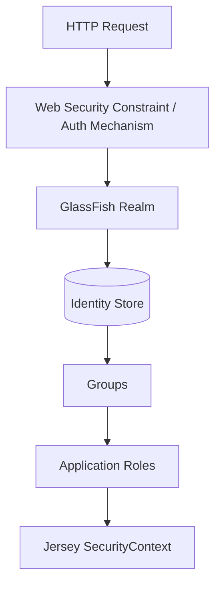
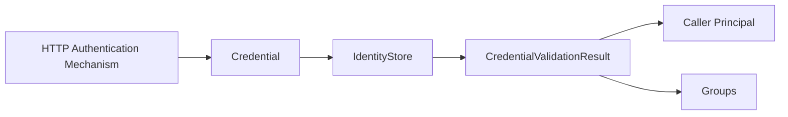
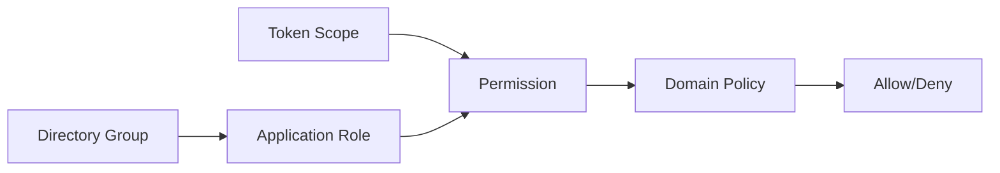
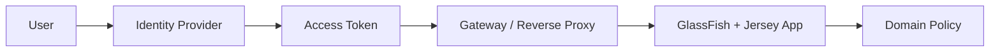
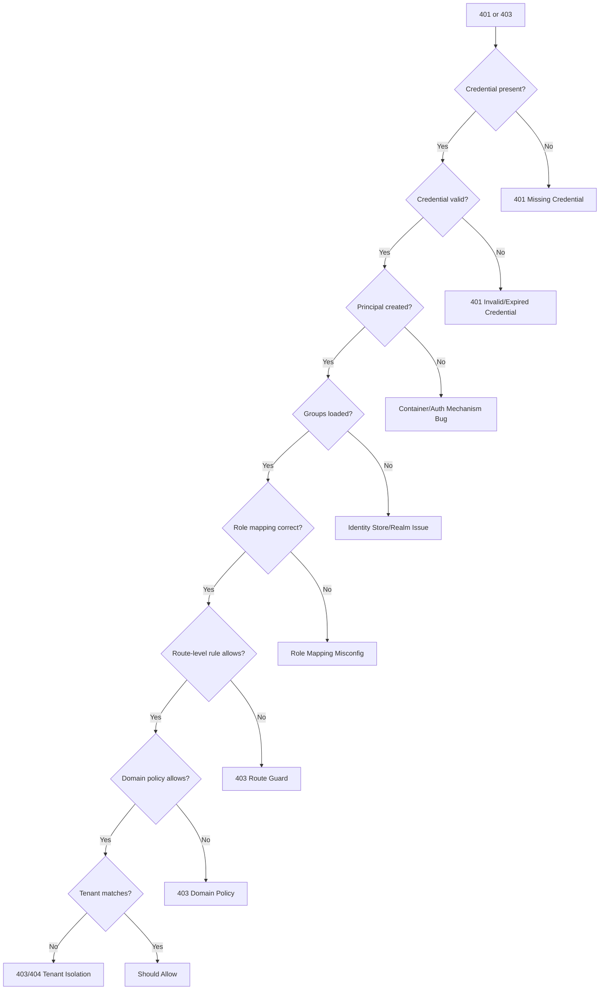
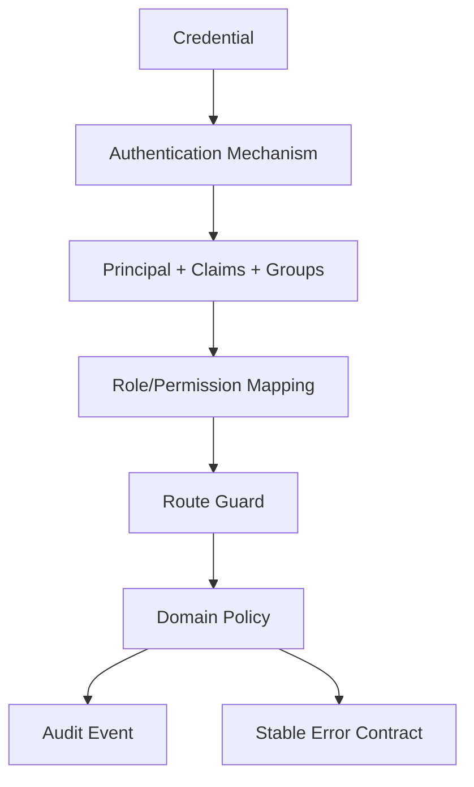

# Part 023 — GlassFish Security Realm, JAAS, Identity Store, App Security

> Target utama bagian ini: memahami bagaimana GlassFish, Jakarta Security, JAAS, realm, identity store, Jersey `SecurityContext`, dan application-level authorization saling berhubungan, sehingga security tidak tersebar acak di filter, resource, database, dan deployment descriptor.

Kita sudah membahas security hooks di Jersey pada Part 015. Bagian ini lebih fokus ke **GlassFish sebagai security runtime**:

- dari mana identity berasal;
- siapa yang melakukan authentication;
- bagaimana role/group/principal dipetakan;
- bagaimana Jersey resource membaca hasil authentication;
- kapan memakai container-managed security;
- kapan memakai Jakarta Security;
- kapan token/JWT validation lebih baik di application filter;
- bagaimana men-debug 401/403 yang tidak jelas;
- bagaimana menghindari konfigurasi yang aman di lokal tapi bocor di production.

Security di application server tidak boleh dipahami sebagai satu annotation. Ia adalah pipeline.

```mermaid
flowchart LR
    Client[Client]
    Edge[Reverse Proxy / API Gateway]
    GlassFish[GlassFish HTTP Runtime]
    AuthMech[Authentication Mechanism]
    Realm[Realm / Identity Store / JAAS Login Module]
    Principal[Principal + Groups/Roles]
    Jersey[Jersey Resource]
    Policy[Application Authorization]
    Response[Response]

    Client --> Edge
    Edge --> GlassFish
    GlassFish --> AuthMech
    AuthMech --> Realm
    Realm --> Principal
    Principal --> Jersey
    Jersey --> Policy
    Policy --> Response
```



Core invariant:

> Authentication establishes identity. Authorization decides whether that identity may do a specific action. Audit proves what happened. Error contract controls what is revealed.

Kalau empat hal itu bercampur, security system akan sulit diuji, sulit diaudit, dan sulit dipertanggungjawabkan.

---

## 1. Kaufman Deconstruction

Skill ini kita pecah menjadi beberapa sub-skill.

| Sub-skill | Yang Harus Dikuasai | Output Praktis |
|---|---|---|
| Runtime boundary | Web container, Jersey, Jakarta Security, JAAS, realm | Bisa menentukan layer yang bertanggung jawab |
| Identity source | file realm, JDBC realm, LDAP, custom store, OIDC/JWT | Bisa memilih identity source sesuai risiko |
| Authentication mechanism | Basic, form, certificate, token, OIDC, custom mechanism | Bisa menentukan cara credential diverifikasi |
| Principal model | Principal, group, role, claim, scope, permission | Bisa mencegah role confusion |
| Authorization | declarative, programmatic, policy service | Bisa menjaga business authorization eksplisit |
| Deployment config | realm, role mapping, descriptor, `asadmin` | Bisa membuat security repeatable |
| Jersey bridge | `SecurityContext`, `@Context`, filters | Bisa membaca identity tanpa coupling ke container internals |
| Failure diagnosis | 401 vs 403, realm missing, wrong group mapping | Bisa debug tanpa trial-and-error |
| Hardening | secure admin, password alias, TLS, secrets, least privilege | Bisa deploy dengan posture production |

Kaufman-style target 20 jam bukan “hafal semua realm”, tapi mampu menjawab cepat:

1. request ini authenticated di mana;
2. role/permission berasal dari mana;
3. resource ini seharusnya menolak di layer mana;
4. log mana yang membuktikan keputusan itu;
5. konfigurasi apa yang harus ada sebelum deploy;
6. failure 401/403 ini akibat credential, identity store, mapping, atau policy.

---

## 2. Security Boundary Mental Model

Dalam Jersey di atas GlassFish, ada beberapa boundary yang sering tertukar.

| Boundary | Contoh | Tanggung Jawab |
|---|---|---|
| Network boundary | TLS, reverse proxy, mutual TLS, forwarded header | Melindungi channel dan edge trust |
| Container boundary | GlassFish HTTP/web container | Menjalankan auth mechanism dan security constraint |
| Identity boundary | realm, identity store, JAAS login module | Memvalidasi credential dan mengambil groups/roles |
| Jersey boundary | `ContainerRequestFilter`, `SecurityContext`, resource method | Membaca identity dan melakukan app-specific guard |
| Business boundary | service/policy layer | Memutuskan permission berbasis domain object |
| Audit boundary | logs, audit table, trace | Merekam keputusan security |

Anti-pattern besar:

> Security hanya diletakkan di Jersey filter dan menganggap semua authorization selesai di sana.

Filter bagus untuk authentication/token parsing dan coarse-grained enforcement. Tapi domain authorization seperti “user boleh approve case ini jika berada di stage X dan bukan pembuat case” harus hidup di policy/service layer, bukan di annotation role sederhana.

---

## 3. Authentication vs Authorization vs Identity Propagation

Gunakan pemisahan tegas.

### Authentication

Menjawab:

> Who is this caller?

Output minimal:

- subject/principal;
- authentication method;
- authentication strength;
- credential expiry;
- tenant/source jika multi-tenant;
- raw claims jika token-based.

### Authorization

Menjawab:

> Is this caller allowed to perform this action on this target?

Input minimal:

- principal;
- groups/roles/scopes;
- target resource;
- action;
- state domain;
- tenant;
- risk/context.

### Identity Propagation

Menjawab:

> How does downstream code know who the caller is?

Pilihan:

- container `Principal`;
- Jersey `SecurityContext`;
- CDI request-scoped `CurrentUser`;
- explicit method parameter;
- token forwarding;
- audit context/MDC.

Production rule:

> Jangan biarkan downstream service membaca HTTP header langsung. Header adalah transport concern. Service layer harus menerima identity object yang sudah tervalidasi.

---

## 4. GlassFish Realm Model

GlassFish realm adalah konfigurasi server untuk authentication source. Realm biasanya menjembatani container security dengan storage identity.

Common realm concepts:

| Realm Type | Fungsi | Cocok Untuk | Risiko |
|---|---|---|---|
| File realm | User/group disimpan di file server | Dev, admin users, small internal app | Tidak cocok untuk dynamic enterprise identity |
| JDBC realm | User/group dari database | Internal app sederhana | Password hashing, schema, lifecycle harus benar |
| LDAP realm | Identity dari LDAP/directory | Enterprise SSO/directory | Network dependency, group mapping complexity |
| Certificate realm | Client certificate | mTLS, machine-to-machine | PKI lifecycle rumit |
| Custom realm/login module | Integrasi khusus | Legacy IAM | Maintenance dan audit burden tinggi |
| Jakarta Security IdentityStore | CDI-based identity verification | App-owned identity model | Perlu disiplin boundary dan password handling |

Mental model:



Catatan penting:

- realm bukan business authorization engine;
- realm tidak tahu lifecycle domain object;
- group tidak selalu sama dengan role;
- role tidak selalu sama dengan permission;
- permission sering butuh state domain.

---

## 5. JAAS Positioning

JAAS adalah model Java lama untuk authentication/authorization berbasis `Subject`, `Principal`, dan login module. Dalam ekosistem application server, JAAS sering muncul sebagai:

- backing mechanism untuk realm;
- custom login module;
- bridge ke legacy identity source;
- konfigurasi server-level security.

Jangan mulai dari JAAS jika kebutuhan modern bisa dipenuhi oleh Jakarta Security, MicroProfile JWT, OIDC gateway, atau container-managed mechanism yang standar.

JAAS cocok ketika:

- enterprise masih memakai login module lama;
- GlassFish realm butuh custom integration;
- identity source tidak dapat diakses lewat Jakarta Security yang lebih sederhana;
- ada compliance constraint yang mengharuskan mekanisme tertentu.

JAAS tidak cocok ketika:

- Anda hanya butuh JWT validation;
- Anda bisa memakai external IdP/OIDC;
- Anda ingin authorization berbasis domain object;
- tim tidak punya ownership atas server config;
- deployment harus sangat portable antar runtime.

---

## 6. Jakarta Security IdentityStore

Jakarta Security menyediakan abstraction yang lebih application-friendly untuk authentication. Salah satu konsep pusatnya adalah `IdentityStore`: komponen yang mengakses data security seperti user, group, role, dan permission.

Mental model IdentityStore:



Contoh sederhana identity store berbasis database:

```java
import jakarta.enterprise.context.ApplicationScoped;
import jakarta.inject.Inject;
import jakarta.security.enterprise.identitystore.CredentialValidationResult;
import jakarta.security.enterprise.identitystore.IdentityStore;
import jakarta.security.enterprise.credential.UsernamePasswordCredential;
import jakarta.security.enterprise.credential.Credential;
import javax.sql.DataSource;
import java.util.Set;

@ApplicationScoped
public class DatabaseIdentityStore implements IdentityStore {

    @Inject
    DataSource dataSource;

    @Inject
    PasswordVerifier passwordVerifier;

    @Override
    public CredentialValidationResult validate(Credential credential) {
        if (!(credential instanceof UsernamePasswordCredential usernamePassword)) {
            return CredentialValidationResult.NOT_VALIDATED_RESULT;
        }

        String username = usernamePassword.getCaller();
        String password = usernamePassword.getPasswordAsString();

        UserRecord user = findActiveUser(username);
        if (user == null) {
            return CredentialValidationResult.INVALID_RESULT;
        }

        if (!passwordVerifier.matches(password, user.passwordHash())) {
            return CredentialValidationResult.INVALID_RESULT;
        }

        Set<String> groups = loadGroups(username);
        return new CredentialValidationResult(username, groups);
    }

    private UserRecord findActiveUser(String username) {
        // Query user table with active/locked/expired checks.
        throw new UnsupportedOperationException("example");
    }

    private Set<String> loadGroups(String username) {
        // Query group membership.
        throw new UnsupportedOperationException("example");
    }
}
```

Design rules:

- never store plaintext password;
- use adaptive password hashing for human passwords;
- compare password using vetted library;
- return generic invalid result;
- avoid revealing whether username exists;
- load only groups needed for authorization;
- keep identity store small and deterministic;
- do not call remote business services from identity store if it can block login globally.

---

## 7. HTTP Authentication Mechanism

Jakarta Security separates authentication mechanism from identity store.

Common patterns:

| Mechanism | Credential | Typical Source | Notes |
|---|---|---|---|
| Basic auth | username/password | IdentityStore/realm | Simple, but must require TLS |
| Form auth | session credential | IdentityStore/realm | Browser apps, less common for REST |
| Bearer token | JWT/Opaque token | IdP/introspection | Common for REST APIs |
| mTLS | client certificate | PKI/cert realm | Strong machine identity |
| OIDC | authorization code/token | external IdP | Preferred for user SSO |
| Custom mechanism | custom header/signature | custom verifier | Only if protocol is well specified |

For Jersey REST services, typical production choices:

1. external gateway validates token and forwards identity headers;
2. application validates JWT with MicroProfile JWT/Jakarta Security;
3. container realm handles simple internal auth;
4. mTLS handles service-to-service machine trust;
5. application policy layer handles domain authorization.

Bad pattern:

> Every resource method manually parses `Authorization` header.

This duplicates parsing, error semantics, logging, and security risk.

---

## 8. Bridging to Jersey `SecurityContext`

Jersey resource should consume identity through Jakarta REST `SecurityContext` or a request-scoped domain object.

```java
import jakarta.ws.rs.GET;
import jakarta.ws.rs.Path;
import jakarta.ws.rs.core.Context;
import jakarta.ws.rs.core.SecurityContext;
import jakarta.ws.rs.core.Response;

@Path("/cases")
public class CaseResource {

    @Context
    SecurityContext securityContext;

    @GET
    @Path("/mine")
    public Response mine() {
        String caller = securityContext.getUserPrincipal().getName();
        boolean supervisor = securityContext.isUserInRole("SUPERVISOR");

        // Resource layer coordinates. Service layer performs domain-level authorization.
        return Response.ok().build();
    }
}
```

Better for complex systems:

```java
import jakarta.enterprise.context.RequestScoped;
import jakarta.ws.rs.core.SecurityContext;
import java.security.Principal;
import java.util.Set;

@RequestScoped
public class CurrentUser {
    private String userId;
    private String tenantId;
    private Set<String> roles;
    private String authMethod;

    public static CurrentUser from(SecurityContext ctx) {
        Principal principal = ctx.getUserPrincipal();
        if (principal == null) {
            throw new UnauthenticatedAccessException();
        }
        CurrentUser user = new CurrentUser();
        user.userId = principal.getName();
        user.authMethod = ctx.getAuthenticationScheme();
        user.roles = Set.of(); // Populate from trusted source.
        return user;
    }

    public String userId() {
        return userId;
    }
}
```

Resource layer:

```java
@Path("/cases/{caseId}/approval")
public class ApprovalResource {

    @Inject
    CurrentUser currentUser;

    @Inject
    CaseApprovalService approvalService;

    @POST
    public Response approve(@PathParam("caseId") String caseId) {
        approvalService.approve(caseId, currentUser.userId());
        return Response.noContent().build();
    }
}
```

Service layer:

```java
public class CaseApprovalService {

    @Inject
    CasePolicy policy;

    public void approve(String caseId, String actorId) {
        CaseRecord record = loadCase(caseId);
        policy.requireCanApprove(actorId, record);
        record.approve(actorId);
        save(record);
    }
}
```

Key point:

> `isUserInRole("SUPERVISOR")` may be enough for coarse route access, but it is not enough for domain authorization.

---

## 9. Declarative Security Options

Declarative security is useful for coarse-grained rules.

Examples:

- all `/admin/*` endpoints require authenticated admin;
- all `/internal/*` endpoints require service identity;
- all mutation endpoints require authenticated caller;
- public health endpoint remains anonymous.

Possible tools:

- `web.xml` security constraints;
- annotations like `@RolesAllowed`, `@PermitAll`, `@DenyAll` depending on integration;
- Jakarta Security authentication mechanism definitions;
- container realm configuration;
- reverse proxy/API gateway policy.

Example conceptual rule:

```java
import jakarta.annotation.security.RolesAllowed;
import jakarta.ws.rs.GET;
import jakarta.ws.rs.Path;

@Path("/admin/runtime")
@RolesAllowed("ADMIN")
public class RuntimeAdminResource {

    @GET
    public RuntimeView get() {
        return RuntimeView.snapshot();
    }
}
```

Use declarative security for:

- route-level access;
- administrative endpoints;
- internal endpoints;
- authenticated/anonymous split;
- coarse role requirements.

Do not use it as the only guard for:

- ownership checks;
- state-machine transitions;
- tenant isolation;
- amount/risk thresholds;
- segregation of duties;
- approval workflow logic;
- regulatory enforcement logic.

---

## 10. Programmatic Authorization Pattern

For complex case management, enforcement lifecycle, and stateful regulatory workflows, authorization should be modeled explicitly.

```java
public enum CaseAction {
    VIEW,
    ASSIGN,
    ESCALATE,
    APPROVE,
    CLOSE,
    REOPEN
}
```

```java
public record AuthorizationDecision(
    boolean allowed,
    String reasonCode,
    String auditMessage
) {
    public static AuthorizationDecision allow(String reason) {
        return new AuthorizationDecision(true, reason, reason);
    }

    public static AuthorizationDecision deny(String reason) {
        return new AuthorizationDecision(false, reason, reason);
    }
}
```

```java
public class CasePolicy {

    public AuthorizationDecision can(CurrentUser actor, CaseRecord record, CaseAction action) {
        if (!actor.tenantId().equals(record.tenantId())) {
            return AuthorizationDecision.deny("TENANT_MISMATCH");
        }

        if (action == CaseAction.APPROVE && record.createdBy().equals(actor.userId())) {
            return AuthorizationDecision.deny("MAKER_CHECKER_VIOLATION");
        }

        if (action == CaseAction.APPROVE && actor.hasRole("CASE_SUPERVISOR")) {
            return AuthorizationDecision.allow("SUPERVISOR_APPROVAL_ALLOWED");
        }

        return AuthorizationDecision.deny("NO_MATCHING_POLICY_RULE");
    }

    public void require(CurrentUser actor, CaseRecord record, CaseAction action) {
        AuthorizationDecision decision = can(actor, record, action);
        if (!decision.allowed()) {
            throw new ForbiddenOperationException(decision.reasonCode());
        }
    }
}
```

This gives you:

- testable policy;
- reason codes;
- audit trace;
- state-aware authorization;
- less magic in annotations;
- better regulatory defensibility.

---

## 11. Role, Group, Scope, Permission: Do Not Collapse Them

A common enterprise failure is using one word — “role” — for every security concept.

| Concept | Meaning | Example | Stable? |
|---|---|---|---|
| Principal | Authenticated identity | `alice@example.com` | Medium |
| Group | Directory membership | `case-team-west` | Medium |
| Role | Application capability bucket | `CASE_SUPERVISOR` | Medium/high |
| Scope | OAuth/API permission claim | `case:approve` | Medium |
| Permission | Fine-grained action right | `APPROVE_CASE_IN_REGION` | High in policy model |
| Ownership | Relation to object | assigned investigator | Dynamic |
| Delegation | Temporary authority | acting supervisor | Dynamic |
| Separation of duties | Constraint | maker cannot approve own case | Dynamic/stateful |

Mapping pattern:



Do not put every directory group directly into code:

```java
// Bad: infrastructure naming leaks into application policy.
if (securityContext.isUserInRole("CN=APAC-L2-CASE-OPS,OU=Groups,DC=corp,DC=example")) {
    // ...
}
```

Use mapping:

```java
public class RoleMapper {
    public Set<String> toApplicationRoles(Set<String> externalGroups, Set<String> tokenScopes) {
        // External identity model mapped into stable app roles.
        return Set.of("CASE_SUPERVISOR");
    }
}
```

---

## 12. GlassFish Realm Configuration with `asadmin`

Exact commands vary by GlassFish version, realm class, and environment. Treat this as an operational pattern, not copy-paste without verification.

### File Realm Example

Useful for development/admin-only scenarios:

```bash
asadmin create-file-user \
  --groups app-admins:case-supervisors \
  alice
```

Then app-level roles can map groups to roles.

### JDBC Realm Conceptual Example

A JDBC realm normally needs:

- JDBC connection pool;
- JDBC resource;
- user table;
- group table;
- password column;
- digest/hash configuration;
- realm configuration;
- role mapping.

Conceptual setup:

```bash
asadmin create-jdbc-connection-pool \
  --datasourceclassname org.postgresql.ds.PGSimpleDataSource \
  --restype javax.sql.DataSource \
  --property user='${ENV=DB_USER}':password='${ALIAS=db.password}':serverName='${ENV=DB_HOST}':databaseName='${ENV=DB_NAME}' \
  securityPool

asadmin create-jdbc-resource \
  --connectionpoolid securityPool \
  jdbc/securityDS

asadmin create-auth-realm \
  --classname com.sun.enterprise.security.auth.realm.jdbc.JDBCRealm \
  --property jaas-context=jdbcRealm:datasource-jndi=jdbc/securityDS:user-table=APP_USER:user-name-column=USERNAME:password-column=PASSWORD_HASH:group-table=APP_GROUP:group-name-column=GROUP_NAME \
  appJdbcRealm
```

Production caution:

- verify digest/hash support;
- do not invent password storage;
- prefer external IdP for enterprise user auth;
- treat DB auth availability as login availability;
- monitor auth DB latency separately from business DB latency.

---

## 13. Role Mapping in Deployment

A role name in Java code is not automatically the same as an external group.

You need a mapping layer. Depending on style, that mapping can live in:

- deployment descriptor;
- GlassFish-specific descriptor;
- Jakarta Security logic;
- token claim mapper;
- application policy service.

Example conceptual mapping:

```xml
<security-role-mapping>
    <role-name>CASE_SUPERVISOR</role-name>
    <group-name>case-supervisors</group-name>
</security-role-mapping>
```

Rule:

> Keep application role names stable. Let infrastructure group names change behind a mapping layer.

Bad:

- code checks LDAP group names directly;
- every environment has different group names inside source code;
- a group rename requires redeploying app code;
- user has group but `isUserInRole` fails because role mapping is missing.

---

## 14. JWT and External Identity Provider Pattern

Modern REST systems commonly use external IdP + JWT/OIDC.

Recommended boundary:



Two variants:

### Gateway Validates Token

Gateway verifies token and forwards trusted headers.

Pros:

- centralized auth;
- fewer app-level crypto concerns;
- consistent ingress policy.

Cons:

- app must trust gateway boundary;
- forwarded headers become sensitive;
- direct app access must be blocked;
- identity propagation semantics must be explicit.

### App Validates Token

App verifies signature/issuer/audience/expiry directly.

Pros:

- app can defend itself;
- easier local ownership;
- less hidden gateway dependency.

Cons:

- repeated config across apps;
- key rotation handling;
- more application-level security responsibility.

Invariant:

> Never trust `X-User` or `X-Roles` headers unless the network path makes it impossible for external callers to set them.

---

## 15. Service-to-Service Authentication

Machine callers are different from human callers.

Common choices:

| Pattern | Good For | Watch Out |
|---|---|---|
| mTLS | strong workload identity | certificate lifecycle |
| OAuth2 client credentials | API-to-API authorization | token scope design |
| signed request | internal protocols | replay protection |
| static API key | simple internal tooling | rotation/leak risk |
| network allowlist only | low-risk internal dependency | insufficient alone for sensitive actions |

For Jersey service:

- authenticate machine identity;
- map machine identity to application actor;
- restrict endpoint set;
- audit with service name, not just IP;
- avoid granting service accounts human roles;
- rotate credentials;
- test expired/revoked credential behavior.

---

## 16. Admin Security in GlassFish

GlassFish administration plane is separate from application plane.

Hardening rules:

- do not expose admin console to public internet;
- change default admin password;
- enable secure admin when remote admin is needed;
- restrict admin network access;
- use password aliases for secrets;
- audit admin operations;
- separate admin credentials from app credentials;
- disable unused listeners/connectors;
- patch runtime regularly;
- keep domain config in versioned automation, not hand-edited server state.

Conceptual admin hardening script:

```bash
asadmin change-admin-password
asadmin enable-secure-admin
asadmin restart-domain domain1
```

Password alias pattern:

```bash
asadmin create-password-alias db.password
```

Then reference alias in configuration instead of storing plaintext in scripts.

---

## 17. Multi-Tenant Security Boundary

For multi-tenant systems, authentication is not enough. Every request needs tenant context.

Tenant source options:

- token claim;
- hostname/subdomain;
- path segment;
- header from trusted gateway;
- database mapping from user identity;
- explicit organization selection.

Risk:

```java
// Bad: identity known, tenant not enforced.
caseRepository.findById(caseId);
```

Better:

```java
caseRepository.findByIdAndTenant(caseId, currentUser.tenantId());
```

Policy invariant:

> Tenant isolation must be enforced in query boundary and policy boundary, not only in UI.

Testing must include:

- user from tenant A accessing tenant B object ID;
- supervisor role in tenant A accessing tenant B case;
- service account without tenant claim;
- missing tenant claim;
- invalid tenant claim;
- tenant switched mid-session;
- cache key missing tenant dimension.

---

## 18. Audit Trail Design

Security without audit is incomplete.

Audit event should include:

| Field | Example |
|---|---|
| event type | `CASE_APPROVAL_DENIED` |
| actor | `alice@example.com` |
| actor type | `HUMAN`, `SERVICE` |
| tenant | `regulator-id-001` |
| action | `APPROVE_CASE` |
| target | `case-123` |
| decision | `ALLOW` / `DENY` |
| reason code | `MAKER_CHECKER_VIOLATION` |
| auth method | `OIDC`, `MTLS`, `BASIC` |
| request id | correlation ID |
| source | IP, service name, gateway id |
| timestamp | server-generated UTC |

Do not log:

- password;
- bearer token;
- session cookie;
- private key;
- full PII unless required and protected;
- raw credential headers.

Audit should be append-only or tamper-evident for regulated environments.

---

## 19. Error Contract: 401 vs 403

Use semantics consistently.

| Condition | Status | Meaning |
|---|---:|---|
| Missing credential | 401 | caller is not authenticated |
| Invalid credential | 401 | credential cannot establish identity |
| Expired token | 401 | caller must re-authenticate/refresh |
| Authenticated but insufficient role | 403 | identity known but forbidden |
| Authenticated but tenant mismatch | 403 or 404 | depends on disclosure policy |
| Object exists but caller cannot know | 404 | hide existence |
| Policy denies due to domain state | 403 or 409 | depends whether denial is authorization or state conflict |

Example response shape:

```json
{
  "type": "https://api.example.com/problems/forbidden",
  "title": "Forbidden",
  "status": 403,
  "code": "CASE_APPROVAL_DENIED",
  "correlationId": "01J...",
  "message": "You are not allowed to approve this case."
}
```

Do not reveal:

```json
{
  "message": "User alice is not in LDAP group CN=APAC-L2-CASE-OPS and case belongs to tenant regulator-id-999"
}
```

That belongs in secure audit logs, not client response.

---

## 20. Failure Diagnosis: 401/403 Decision Tree



Checklist:

1. Is request reaching GlassFish or rejected at proxy?
2. Is TLS/client certificate valid if mTLS is used?
3. Is `Authorization` header forwarded?
4. Is token issuer/audience/expiry valid?
5. Is realm configured on the correct target?
6. Is JDBC/LDAP identity source reachable?
7. Are groups returned?
8. Are groups mapped to application roles?
9. Does `SecurityContext.getUserPrincipal()` return expected identity?
10. Does `isUserInRole()` return expected role?
11. Does application policy deny based on state/tenant?
12. Is client response intentionally hiding object existence?

---

## 21. Testing Security

Security tests should cover both mechanism and policy.

### Unit Test Policy

```java
class CasePolicyTest {

    @Test
    void makerCannotApproveOwnCase() {
        CurrentUser actor = user("alice", "tenant-a", "CASE_SUPERVISOR");
        CaseRecord record = caseCreatedBy("alice", "tenant-a");

        AuthorizationDecision decision = new CasePolicy().can(actor, record, CaseAction.APPROVE);

        assertFalse(decision.allowed());
        assertEquals("MAKER_CHECKER_VIOLATION", decision.reasonCode());
    }
}
```

### Integration Test Route Security

- unauthenticated request gets 401;
- authenticated without role gets 403;
- authenticated with role passes route guard;
- policy denial returns stable error contract;
- audit event emitted;
- logs contain correlation ID;
- token with wrong audience rejected;
- expired token rejected;
- tenant mismatch rejected;
- user/group mapping works in deployed GlassFish.

### Negative Tests

- duplicate role mapping;
- missing realm;
- disabled identity source;
- invalid password hash format;
- unavailable LDAP/database;
- direct app access bypassing gateway;
- spoofed forwarded identity header;
- oversized token/header;
- malicious path/tenant claim combination.

---

## 22. Common Anti-Patterns

| Anti-pattern | Why It Fails | Better Pattern |
|---|---|---|
| Parse auth header in every resource | duplicated and inconsistent | central auth mechanism/filter |
| Treat role as permission | too coarse | role → permission → policy |
| Store business authorization in `@RolesAllowed` only | cannot express state/tenant rules | policy service |
| Trust forwarded user header blindly | spoofing risk | trust only from authenticated gateway path |
| Log tokens/passwords | credential leakage | redact secrets |
| Use file realm for enterprise users | poor lifecycle/audit | IdP/LDAP/JDBC/IdentityStore |
| Hide all denials as 404 | debugging/audit confusion | explicit disclosure policy |
| Store admin and app credentials together | blast radius | separate principals/secrets |
| Long remote call in identity store | login bottleneck | cache carefully or use IdP |
| Use group names directly in code | infra coupling | role mapper |
| No security tests for 401/403 | regressions invisible | route + policy test matrix |
| Multi-tenant check only in UI | data leak | enforce in repository and policy |

---

## 23. Production Checklist

Before production:

- [ ] Admin console is not publicly exposed.
- [ ] Admin password changed.
- [ ] Secure admin enabled where remote admin is necessary.
- [ ] Secrets use password aliases or external secret management.
- [ ] TLS termination and forwarded header trust are documented.
- [ ] Direct app access cannot bypass gateway identity guarantees.
- [ ] Realm/IdentityStore is created by automation.
- [ ] Role/group mapping is environment-specific but versioned.
- [ ] SecurityContext behavior tested in deployed GlassFish.
- [ ] 401/403/404 disclosure policy documented.
- [ ] Audit events exist for allow and deny on sensitive actions.
- [ ] Tokens/passwords/cookies are redacted in logs.
- [ ] Tenant isolation tested with negative cases.
- [ ] Service accounts have least privilege.
- [ ] Machine and human identities are distinct.
- [ ] Authorization policy is unit-tested.
- [ ] Emergency break-glass access is controlled and audited.

---

## 24. Final Mental Model

GlassFish security is not just “turn on a realm”. Jersey security is not just “write a filter”.

The useful model is:



For top-tier engineering, the question is not:

> Which annotation secures this endpoint?

The better question is:

> Which layer proves identity, which layer maps authority, which layer decides domain permission, and which log/audit record proves the decision?

That is the difference between security that works in a demo and security that survives production, audit, incident response, and regulatory scrutiny.

---

## 25. Deliberate Practice

Spend 90 minutes building this small lab:

1. Create a GlassFish-deployed Jersey app.
2. Add a protected `/admin/runtime` endpoint.
3. Add a public `/health/live` endpoint.
4. Configure one realm or Jakarta Security IdentityStore.
5. Map external group to `ADMIN` role.
6. Inject `SecurityContext` in the resource.
7. Implement a `CurrentUser` request-scoped object.
8. Implement a `CasePolicy` with maker-checker rule.
9. Return 401/403 with stable error DTO.
10. Emit audit event with correlation ID.
11. Write tests for unauthenticated, wrong role, right role, and domain denial.
12. Break role mapping intentionally and diagnose the failure.

Done properly, this lab gives you the practical muscle memory to reason about GlassFish/Jersey security without relying on superstition.
