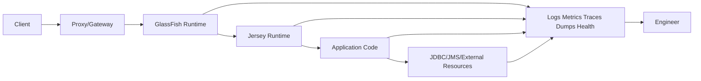
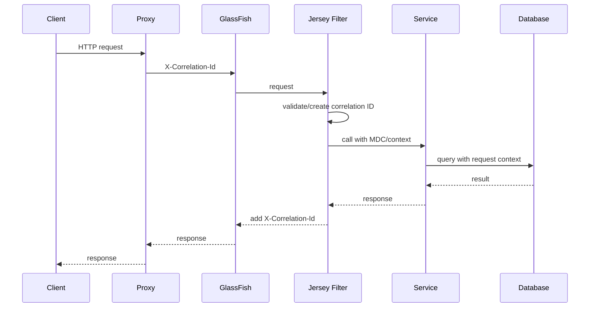
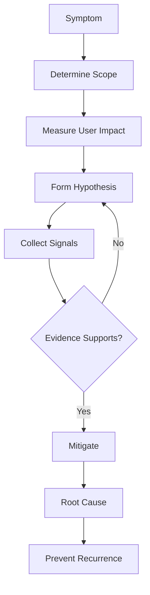
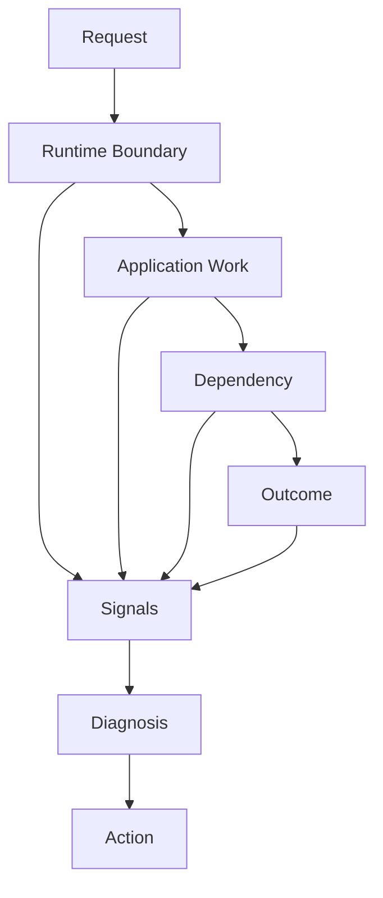

# Part 024 — GlassFish Observability, Monitoring, Logging, Health

> Target utama bagian ini: membangun mental model observability untuk Jersey di GlassFish, supaya ketika production melambat, error, memory naik, thread habis, connection pool penuh, atau deployment gagal, kita tidak menebak; kita membaca sinyal runtime secara sistematis.

Observability bukan sekadar “punya log”. Observability adalah kemampuan menjawab pertanyaan operasional dari luar sistem tanpa harus mengubah kode di saat incident.

Untuk Jersey di GlassFish, pertanyaan production biasanya seperti:

- endpoint mana yang lambat;
- apakah lambatnya di HTTP queue, Jersey filter, provider serialization, service layer, database, atau downstream call;
- apakah thread pool penuh;
- apakah JDBC pool exhausted;
- apakah request stuck;
- apakah response 500 berasal dari mapper, provider, CDI, classloading, atau database;
- apakah memory naik karena leak, buffering, session, atau cache;
- apakah deployment gagal karena dependency atau resource missing;
- apakah liveness/readiness benar atau hanya kosmetik.

Mental model:



Core invariant:

> Every critical runtime boundary should emit enough signal to answer: who called, what happened, where time was spent, what failed, why it failed, and whether the system can still serve traffic.

---

## 1. Kaufman Deconstruction

Skill ini kita pecah menjadi beberapa sub-skill.

| Sub-skill | Yang Harus Dikuasai | Output Praktis |
|---|---|---|
| Signal taxonomy | logs, metrics, traces, events, dumps, health | Tidak mencampur semua sinyal jadi log |
| GlassFish monitoring | monitoring service, modules, levels, `asadmin` | Bisa mengaktifkan signal runtime |
| Logging model | categories, levels, structured fields, correlation ID | Bisa mencari request dan error cepat |
| Jersey observability | filters, interceptors, event listeners, exception mapper | Bisa melihat pipeline REST |
| Resource monitoring | JDBC pool, thread pool, HTTP listener, JVM | Bisa menemukan bottleneck |
| Health model | liveness, readiness, dependency health | Orchestrator tidak membunuh app salah waktu |
| Diagnostic artifacts | thread dump, heap dump, GC logs, server log | Bisa root cause incident |
| Incident workflow | symptom → hypothesis → signal → action | Tidak troubleshooting secara random |
| SLO thinking | latency/error/availability budgets | Monitoring terhubung ke user impact |

---

## 2. Observability Signal Taxonomy

Jangan memakai satu alat untuk semua hal.

| Signal | Menjawab | Contoh |
|---|---|---|
| Log | Apa yang terjadi pada event tertentu? | request failed, auth denied, deployment failed |
| Metric | Seberapa sering/besar/lama sesuatu terjadi? | p95 latency, active threads, pool used |
| Trace | Request ini melewati boundary mana saja? | HTTP → filter → service → DB → downstream |
| Health | Apakah instance boleh menerima traffic? | readiness failed due to DB unavailable |
| Dump | Apa state JVM saat ini? | thread dump, heap dump |
| Audit | Siapa melakukan aksi sensitif apa? | case approval denied/allowed |
| Event | Perubahan lifecycle penting | app deployed, pool reconfigured, instance restarted |

Bad observability design:

- only log stack traces;
- no correlation ID;
- no latency metric;
- no pool metric;
- health always returns 200;
- logs contain secret/token;
- no separation between business audit and debug log;
- JVM dumps impossible due to container permission;
- monitoring disabled until incident.

---

## 3. Request Correlation Model

Every inbound request should receive a correlation ID.



A correlation ID should appear in:

- access log;
- application log;
- exception mapper response;
- audit event;
- downstream request headers;
- async task context;
- metrics exemplar/trace where possible.

Example request filter:

```java
import jakarta.annotation.Priority;
import jakarta.ws.rs.Priorities;
import jakarta.ws.rs.container.ContainerRequestContext;
import jakarta.ws.rs.container.ContainerRequestFilter;
import jakarta.ws.rs.container.ContainerResponseContext;
import jakarta.ws.rs.container.ContainerResponseFilter;
import jakarta.ws.rs.ext.Provider;
import org.slf4j.MDC;

import java.io.IOException;
import java.util.UUID;

@Provider
@Priority(Priorities.AUTHENTICATION - 100)
public class CorrelationIdFilter implements ContainerRequestFilter, ContainerResponseFilter {

    public static final String HEADER = "X-Correlation-Id";
    public static final String MDC_KEY = "correlationId";
    public static final String PROPERTY = "correlationId";

    @Override
    public void filter(ContainerRequestContext requestContext) throws IOException {
        String incoming = requestContext.getHeaderString(HEADER);
        String correlationId = isValid(incoming) ? incoming : UUID.randomUUID().toString();

        requestContext.setProperty(PROPERTY, correlationId);
        MDC.put(MDC_KEY, correlationId);
    }

    @Override
    public void filter(ContainerRequestContext requestContext, ContainerResponseContext responseContext) throws IOException {
        Object correlationId = requestContext.getProperty(PROPERTY);
        if (correlationId != null) {
            responseContext.getHeaders().putSingle(HEADER, correlationId.toString());
        }
        MDC.remove(MDC_KEY);
    }

    private boolean isValid(String value) {
        return value != null && value.length() <= 128 && value.matches("[A-Za-z0-9_.:-]+ ".trim() + "*");
    }
}
```

In production, prefer stricter ID validation to avoid log injection and high-cardinality abuse.

---

## 4. Structured Logging Discipline

A production log line should be queryable.

Recommended fields:

| Field | Example |
|---|---|
| timestamp | `2026-06-28T10:30:05.120Z` |
| level | `INFO`, `WARN`, `ERROR` |
| logger | `com.example.case.CaseResource` |
| correlationId | `01J...` |
| traceId/spanId | if tracing enabled |
| method | `POST` |
| pathTemplate | `/cases/{caseId}/approval` |
| status | `403` |
| durationMs | `42` |
| actor | `alice@example.com` or service id |
| tenant | `tenant-a` |
| errorCode | `CASE_APPROVAL_DENIED` |
| exceptionClass | `ForbiddenOperationException` |
| deploymentVersion | build SHA/version |

Avoid logging:

- raw request body by default;
- password/token/session cookie;
- PII without masking;
- full Authorization header;
- unbounded payload;
- stack trace for expected business denial;
- high-cardinality labels as metric dimensions.

Pattern:

```java
logger.info("request.completed method={} pathTemplate={} status={} durationMs={} actor={} tenant={}",
    method,
    pathTemplate,
    status,
    durationMs,
    actorId,
    tenantId);
```

Do not do:

```java
logger.info("Request was successful");
```

That is nearly useless during incident.

---

## 5. GlassFish Logging Model

GlassFish has server logs and configurable log levels/categories. Application logs usually land in server log unless routed elsewhere.

Operational goals:

- separate application signal from container noise;
- preserve deployment/startup errors;
- preserve security/admin actions;
- avoid DEBUG in production except targeted short windows;
- ensure logs rotate;
- ensure logs are shipped centrally;
- include instance/domain identity in every log stream;
- include deployment version.

Useful log categories to understand conceptually:

| Category Area | Why It Matters |
|---|---|
| server lifecycle | startup/shutdown/restart reason |
| deployment | app deploy/undeploy failure |
| web/container | HTTP/listener/servlet issues |
| Jersey/app | resource/provider/filter failures |
| security | auth/realm/admin/security failures |
| JDBC/resource | pool/resource/JNDI issues |
| transaction | JTA begin/commit/rollback/timeout |
| classloading | dependency/linkage problems |
| JVM/GC | memory and pause behavior |

`asadmin` style examples:

```bash
asadmin list-log-levels
asadmin set-log-levels org.glassfish.jersey.server.ServerRuntime=FINE
asadmin set-log-levels jakarta.enterprise.system.container.web=INFO
```

Production rule:

> Change log levels temporarily, document the reason, and revert after collecting evidence.

---

## 6. Access Logging

Application logs tell what your code did. Access logs tell what HTTP traffic did.

Access log fields should include:

- remote address or trusted client IP;
- method;
- path;
- status;
- bytes sent;
- duration;
- user agent if useful;
- correlation ID;
- virtual server/listener;
- backend instance id.

Access logs answer:

- did traffic reach this instance;
- which endpoint is hottest;
- which status codes increased;
- whether latency increased before app logs show errors;
- whether one client/source is abusive;
- whether load balancer retries are duplicating requests.

Do not rely only on application logs for HTTP volume.

---

## 7. GlassFish Monitoring Service

GlassFish has a monitoring service that can expose runtime stats for components/modules. Monitoring can have levels such as OFF/LOW/HIGH depending on module and version.

Typical module areas:

- HTTP service;
- web container;
- thread pools;
- JDBC connection pools;
- transaction service;
- JVM;
- EJB/CDI-related runtime areas depending on app;
- request processing;
- connector resources.

Conceptual commands:

```bash
asadmin get server.monitoring-service.module-monitoring-levels.*

asadmin set server.monitoring-service.module-monitoring-levels.thread-pool=HIGH
asadmin set server.monitoring-service.module-monitoring-levels.http-service=HIGH
asadmin set server.monitoring-service.module-monitoring-levels.jdbc-connection-pool=HIGH

asadmin get --monitor=true 'server.*'
```

Production caution:

- higher monitoring levels can add overhead;
- enable what you need intentionally;
- standardize monitoring config via `asadmin` scripts;
- do not manually toggle production and forget;
- validate metrics are actually scraped/visible before incident.

---

## 8. Key Runtime Metrics

### HTTP Metrics

Track:

- request rate;
- status code rate;
- p50/p95/p99 latency;
- active requests;
- queued requests;
- request/response size;
- timeout count;
- rejected connection/request count.

Symptoms:

| Symptom | Possible Meaning |
|---|---|
| high p99, normal p50 | tail dependency, pool contention, GC pause |
| 5xx spike | app/runtime/downstream failure |
| 4xx spike | client, auth, validation, route problem |
| active requests rising | slow backend or thread starvation |
| throughput flat, latency rising | saturation |

### Thread Pool Metrics

Track:

- busy threads;
- max threads;
- queue length;
- rejected tasks;
- stuck/long-running request count;
- executor-specific saturation.

Interpretation:

- all threads busy + DB pool waiting = resource coupling;
- all threads busy + CPU high = CPU saturation;
- all threads busy + CPU low = blocking I/O or deadlock;
- queue growing = arrival rate exceeds service rate.

### JDBC Pool Metrics

Track:

- used connections;
- free connections;
- wait queue;
- average wait time;
- timeout count;
- failed validation;
- leak count if available;
- slow query count from DB side.

Interpretation:

- pool used at max + wait time high = pool exhaustion;
- free connections high + slow API = bottleneck elsewhere;
- failed validation high = DB/network health issue;
- timeout count high = app/DB mismatch or leak.

### JVM Metrics

Track:

- heap used/committed/max;
- non-heap/metaspace;
- GC pause;
- allocation rate;
- CPU;
- loaded classes;
- thread count;
- file descriptors;
- direct buffer memory if relevant.

---

## 9. JMX and MBeans

JMX/MBeans are a key Java runtime observability path. GlassFish exposes management and monitoring information through MBeans, depending on configuration and version.

Use cases:

- inspect thread/JVM state;
- collect GlassFish runtime stats;
- inspect application/server MBeans;
- integrate with monitoring tools;
- diagnose embedded GlassFish in modern deployments.

Operational cautions:

- secure JMX access;
- do not expose JMX publicly;
- use TLS/auth where required;
- restrict network path;
- avoid ad hoc production changes through JMX unless controlled;
- monitor MBean query overhead.

JConsole/JMX can be useful during debugging, but production should rely on automated scraping/alerts, not manual GUI inspection.

---

## 10. Health Checks: Liveness vs Readiness

Health endpoints are often implemented incorrectly.

| Health Type | Question | Should Fail When |
|---|---|---|
| Liveness | Should this process be restarted? | JVM/event loop stuck, fatal internal state |
| Readiness | Should this instance receive traffic? | DB unavailable, migration missing, dependency unavailable, warmup incomplete |
| Startup | Has app finished booting? | deployment/warmup not complete |
| Deep health | Are important dependencies healthy? | scheduled/manual diagnostic, not always load balancer path |

Bad health endpoint:

```java
@GET
@Path("/health")
public Response health() {
    return Response.ok("OK").build();
}
```

Better shape:

```json
{
  "status": "DOWN",
  "checks": [
    { "name": "database", "status": "DOWN", "reason": "connection-timeout" },
    { "name": "migration", "status": "UP" },
    { "name": "downstream-case-registry", "status": "DEGRADED" }
  ]
}
```

Design rules:

- liveness should be cheap and rarely fail;
- readiness can check critical dependencies;
- health checks must have tight timeout;
- health checks must not create heavy load;
- do not run expensive SQL on every probe;
- include version/build info in info endpoint, not necessarily health;
- protect internal health detail from public exposure.

---

## 11. MicroProfile Health Positioning

In Jakarta EE/GlassFish ecosystems, MicroProfile Health may be available depending on runtime/version/profile. When available, prefer standard health checks instead of inventing arbitrary JSON per app.

Conceptual health check:

```java
import org.eclipse.microprofile.health.HealthCheck;
import org.eclipse.microprofile.health.HealthCheckResponse;
import org.eclipse.microprofile.health.Readiness;

import jakarta.enterprise.context.ApplicationScoped;
import jakarta.inject.Inject;
import javax.sql.DataSource;

@Readiness
@ApplicationScoped
public class DatabaseReadinessCheck implements HealthCheck {

    @Inject
    DataSource dataSource;

    @Override
    public HealthCheckResponse call() {
        try (var connection = dataSource.getConnection()) {
            if (connection.isValid(1)) {
                return HealthCheckResponse.up("database");
            }
            return HealthCheckResponse.down("database");
        } catch (Exception e) {
            return HealthCheckResponse.named("database")
                .down()
                .withData("reason", e.getClass().getSimpleName())
                .build();
        }
    }
}
```

Caution:

- use `jakarta.*` compatible dependencies for modern Jakarta EE;
- ensure MicroProfile APIs are actually supported by your GlassFish version/profile;
- avoid using health checks as business monitoring;
- do not leak credentials or internal topology in health output.

---

## 12. Jersey-Level Observability

Jersey can emit useful application-level signals through filters, interceptors, event listeners, and exception mappers.

### Request Timing Filter

```java
@Provider
public class RequestTimingFilter implements ContainerRequestFilter, ContainerResponseFilter {

    private static final String START_NANOS = "startNanos";

    @Override
    public void filter(ContainerRequestContext requestContext) {
        requestContext.setProperty(START_NANOS, System.nanoTime());
    }

    @Override
    public void filter(ContainerRequestContext requestContext, ContainerResponseContext responseContext) {
        Long start = (Long) requestContext.getProperty(START_NANOS);
        if (start == null) {
            return;
        }

        long durationMs = (System.nanoTime() - start) / 1_000_000;
        String method = requestContext.getMethod();
        String path = requestContext.getUriInfo().getPath();
        int status = responseContext.getStatus();

        logger.info("http.request.completed method={} path={} status={} durationMs={}",
            method, path, status, durationMs);
    }
}
```

Production improvement:

- use route template, not raw path with IDs, for metric labels;
- record exception class/code;
- separate expected 4xx from unexpected 5xx;
- avoid logging raw query containing secrets;
- ensure MDC is cleared for thread reuse.

### Exception Mapper Signal

```java
@Provider
public class ThrowableMapper implements ExceptionMapper<Throwable> {

    @Override
    public Response toResponse(Throwable throwable) {
        String errorId = ErrorIds.newId();

        logger.error("unhandled.exception errorId={} exceptionClass={}",
            errorId,
            throwable.getClass().getName(),
            throwable);

        return Response.serverError()
            .entity(ApiError.internal(errorId))
            .build();
    }
}
```

Rules:

- expected domain denials should not be logged as ERROR stack traces;
- unexpected exceptions should have error ID;
- client receives stable error contract;
- logs preserve full diagnostic detail securely.

---

## 13. Tracing Model

Tracing helps answer:

> Where did this request spend time across process boundaries?

A trace should show:

- inbound HTTP span;
- Jersey resource span;
- service operation span;
- DB query span if instrumented;
- outbound HTTP client span;
- message/event publication span;
- error tags/status.

Trace propagation should include:

- inbound trace context;
- correlation/request ID;
- outbound Jersey Client filters;
- async tasks;
- scheduled jobs if they trigger external work.

Anti-patterns:

- traces sampled too low during incident;
- trace IDs not present in logs;
- no propagation to downstream calls;
- high-cardinality tags like raw user ID on every span without controls;
- treating trace as audit trail.

Trace is diagnostic. Audit is evidentiary. Keep them distinct.

---

## 14. Thread Dump Discipline

Thread dump is one of the fastest ways to diagnose Java server incidents.

Use it when:

- latency spikes;
- CPU high;
- CPU low but requests stuck;
- thread pool appears exhausted;
- deadlock suspected;
- deployment/startup hangs;
- shutdown hangs.

Take multiple dumps:

```bash
jcmd <pid> Thread.print > thread-1.txt
sleep 10
jcmd <pid> Thread.print > thread-2.txt
sleep 10
jcmd <pid> Thread.print > thread-3.txt
```

Look for:

- many HTTP threads waiting on JDBC pool;
- many threads blocked on same lock;
- threads stuck in external HTTP client;
- deadlock section;
- long GC pauses if correlated with logs;
- CPU-bound stack repeated in RUNNABLE;
- classloading lock contention;
- logging appender blocking request threads.

Interpretation examples:

| Thread Dump Pattern | Likely Root Cause |
|---|---|
| many threads waiting for pool semaphore | JDBC pool exhausted |
| many threads blocked on synchronized cache | lock contention |
| many threads in socket read | downstream timeout missing/too high |
| many threads in JSON serialization | large payload/provider bottleneck |
| deployment thread stuck in classloading | dependency/classloader issue |
| logging thread/appender blocked | logging backend slow/backpressure |

---

## 15. Heap Dump Discipline

Heap dump is for memory diagnosis, not first-line every time.

Use when:

- heap usage grows continuously;
- OutOfMemoryError occurs;
- suspected memory leak;
- classloader leak after redeploy;
- large payload buffering suspected;
- cache/session growth suspected.

Commands:

```bash
jcmd <pid> GC.heap_dump /tmp/heap-$(date +%Y%m%d%H%M%S).hprof
```

Cautions:

- heap dumps can pause the JVM;
- heap dumps may contain secrets/PII;
- store securely;
- do not ship casually;
- collect with incident authorization;
- analyze with tools like Eclipse MAT or equivalent.

Look for:

- retained heap dominators;
- large byte arrays/String bodies;
- unbounded maps/caches;
- session objects;
- classloader references from old deployments;
- thread locals retaining request state;
- JSON tree models for huge payloads;
- pending async responses not cleaned up.

---

## 16. GC Logs and JVM Diagnostics

Enable GC logging in production baseline. Without it, memory/latency diagnosis becomes weaker.

For modern JDK:

```bash
-Xlog:gc*,safepoint:file=${LOG_DIR}/gc.log:time,uptime,level,tags:filecount=10,filesize=50M
```

Track:

- pause duration;
- frequency;
- allocation rate;
- promotion/old generation pressure;
- humongous allocation if using G1;
- full GC count;
- safepoint reasons.

Symptoms:

| Symptom | Possible Meaning |
|---|---|
| frequent young GC, low pause | high allocation but manageable |
| long pauses | heap pressure/tuning/object retention |
| full GC repeatedly | leak or undersized heap |
| allocation spike with endpoint | large payload/serialization |
| metaspace growth after redeploy | classloader leak |

---

## 17. Deployment Observability

Deployment failure is a runtime event, not just CI failure.

Capture:

- artifact name/version/checksum;
- deployment target;
- domain/instance/cluster;
- start time/end time;
- deploy command output;
- server log around deployment;
- resolved context root;
- enabled resources/JNDI names;
- classloading errors;
- CDI/HK2 injection errors;
- provider registration errors;
- health/readiness after deployment.

Deployment checklist:

```bash
asadmin list-applications
asadmin list-components
asadmin list-jdbc-resources
asadmin list-jdbc-connection-pools
asadmin get-log-levels
asadmin get --monitor=true 'server.*'
```

Common deployment signals:

| Signal | Meaning |
|---|---|
| `ClassNotFoundException` | missing dependency or wrong scope |
| `NoSuchMethodError` | version conflict |
| CDI unsatisfied dependency | bean discovery/injection issue |
| JNDI lookup failure | resource not configured/targeted |
| provider conflict | duplicate JSON/provider library |
| 404 after deploy | wrong context root/application path |
| readiness fails | app deployed but dependency unavailable |

---

## 18. Incident Workflow

Use a disciplined loop.



Do not start by changing random knobs.

Questions:

1. Is impact all endpoints or one endpoint?
2. Is impact all instances or one instance?
3. Did it start after deployment/config/traffic change?
4. Are 5xx increasing or only latency?
5. Are HTTP threads saturated?
6. Is JDBC pool saturated?
7. Is CPU high or low?
8. Are GC pauses correlated?
9. Are downstream calls slow?
10. Are logs showing common error code?
11. Did readiness remove instances from load balancer?
12. Is the health check lying?

---

## 19. Symptom-to-Signal Matrix

| Symptom | First Signals | Next Signals |
|---|---|---|
| 500 spike | error logs, exception mapper metrics | deployment diff, classloading logs, DB errors |
| 401/403 spike | security logs, auth metrics | token issuer/audience, realm/identity store, role mapping |
| latency spike | p95/p99, active request, access log | thread dump, JDBC pool, downstream latency, GC |
| startup failure | server log deployment section | dependency tree, resource list, CDI logs |
| random 404 | access log, context root, application path | deployment target, route registry |
| 415/406 | access log headers, Jersey logs | provider registration, `@Consumes/@Produces` |
| pool timeout | JDBC pool metrics | thread dump, slow SQL, leak detection |
| OOM | heap usage, GC logs | heap dump, redeploy history, payload size |
| CPU high | CPU metrics, thread dump | profiler, hot stack, serialization/compression |
| CPU low + slow | thread dump | blocked I/O, lock contention, pool wait |

---

## 20. Alerting Strategy

Alert on user-impacting symptoms and saturation, not every noisy internal event.

Recommended alerts:

- 5xx rate above threshold;
- p95/p99 latency above SLO;
- readiness failure count;
- all instances unhealthy;
- HTTP thread pool saturation sustained;
- JDBC pool wait/timeouts sustained;
- transaction timeout count;
- GC pause above threshold;
- heap near max sustained;
- disk full/log volume issue;
- admin login failure spike;
- deployment failure;
- certificate expiry;
- downstream dependency error budget burn.

Bad alerts:

- every single 500 page at low traffic;
- every WARN log;
- heap usage > 70% with no GC context;
- CPU > 80% for 10 seconds;
- health transient once;
- high request count without saturation.

Alert should include:

- service/app;
- environment;
- instance/cluster;
- current value;
- threshold;
- duration;
- dashboard link;
- log query link;
- runbook link;
- recent deployment/version.

---

## 21. Dashboard Design

A good dashboard is an operational map, not a decorative chart collection.

Top-level dashboard:

1. Traffic rate.
2. Error rate by status family.
3. Latency p50/p95/p99.
4. Instance health/readiness.
5. Saturation: CPU, heap, HTTP threads, JDBC pool.
6. Top endpoints by latency/error.
7. Recent deployments.
8. Downstream dependency health.

Endpoint dashboard:

- route template;
- request rate;
- error code distribution;
- latency percentiles;
- payload size;
- auth denial rate;
- DB time/downstream time if available;
- top exception classes;
- sample traces/logs.

Resource dashboard:

- JDBC pool used/free/wait;
- validation failures;
- timeout count;
- transaction timeouts;
- DB response time;
- pool configuration vs observed concurrency.

---

## 22. Observability for Async and Streaming

Async and streaming break simple request/response assumptions.

Track for async:

- suspended response count;
- timeout count;
- cancellation count;
- executor queue length;
- executor active threads;
- resume success/failure;
- context propagation success;
- age of oldest suspended request.

Track for streaming:

- active streams;
- stream duration;
- bytes sent;
- client disconnects;
- write failures;
- heartbeat failures;
- backpressure symptoms;
- slow client count.

Anti-pattern:

> Treating an SSE connection like a normal short HTTP request in metrics.

Separate streaming endpoints from regular latency SLOs, or long-lived streams will distort dashboards.

---

## 23. Logging Security and Privacy

Observability can become a data leak.

Redact:

- `Authorization`;
- cookies;
- password fields;
- refresh tokens;
- API keys;
- private keys;
- personal identifiers unless needed and protected;
- full request body for sensitive endpoints;
- database connection URLs with credentials.

Use:

- allowlist logging, not blocklist only;
- structured redaction;
- central logging retention policy;
- role-based access to logs;
- audit log protection;
- secure heap dump handling;
- incident export approval.

Invariant:

> If an attacker gets read access to logs, they should not get credentials.

---

## 24. Common Anti-Patterns

| Anti-pattern | Why It Fails | Better Pattern |
|---|---|---|
| Health always returns 200 | hides dependency/runtime failure | liveness/readiness split |
| No correlation ID | cannot join logs across layers | generate/propagate ID |
| Logging raw bodies | PII/secret leak | structured selective logging |
| Metrics with raw IDs as labels | cardinality explosion | route templates/bounded labels |
| DEBUG always on | overhead/noise/security risk | temporary targeted levels |
| No thread dump runbook | slow incident response | standard dump procedure |
| No GC logs | memory diagnosis weak | baseline GC logging |
| Only CPU alert | misses pool/thread saturation | saturation + latency + error alerts |
| Manual monitoring toggles | drift | config-as-code |
| Health check does heavy DB query | creates outage amplification | cheap bounded checks |
| All 4xx logged as ERROR | noise | classify expected vs unexpected |
| Trace used as audit | compliance gap | separate audit event model |

---

## 25. Production Checklist

Before production:

- [ ] Correlation ID generated and propagated.
- [ ] Access logs enabled and shipped.
- [ ] Application logs are structured.
- [ ] Secrets/tokens are redacted.
- [ ] Error responses contain correlation/error ID.
- [ ] Metrics include latency, error rate, throughput, saturation.
- [ ] GlassFish monitoring levels configured intentionally.
- [ ] JDBC pool metrics visible.
- [ ] HTTP/thread pool metrics visible.
- [ ] JVM/GC metrics visible.
- [ ] GC logs enabled and rotated.
- [ ] Thread dump procedure tested.
- [ ] Heap dump procedure secured.
- [ ] Liveness/readiness semantics documented.
- [ ] Health checks have strict timeout.
- [ ] Dashboards map to SLOs and runbooks.
- [ ] Alerts include deployment version and runbook.
- [ ] Deployment events are recorded.
- [ ] Monitoring config is versioned.
- [ ] Logging level changes are auditable and reversible.

---

## 26. Final Mental Model

When a Jersey app on GlassFish fails, the runtime has already produced clues. Top-tier engineering is the discipline of making those clues explicit and reading them correctly.

Use this model:



The goal is not “more logs”. The goal is **diagnosability**:

- a request can be followed;
- a bottleneck can be located;
- an error can be classified;
- a failure can be mitigated;
- a root cause can be proven;
- a recurrence can be prevented.

---

## 27. Deliberate Practice

Spend 90 minutes building this observability lab:

1. Add correlation ID filter to Jersey.
2. Add request timing log.
3. Add exception mapper with stable error ID.
4. Add liveness and readiness endpoints.
5. Add DB readiness check with 1-second timeout.
6. Enable relevant GlassFish monitoring modules.
7. Expose/collect JDBC pool metrics.
8. Trigger pool exhaustion intentionally in a test environment.
9. Capture three thread dumps during exhaustion.
10. Compare logs, metrics, and dumps.
11. Trigger a provider serialization error.
12. Verify error ID appears in response and logs.
13. Simulate dependency down and confirm readiness fails but liveness remains up.
14. Document the runbook.

If you can do this without guessing, you have crossed from “can deploy a Jersey app” into “can operate a Jersey app”.
