------
title: Learn Java Eclipse Jersey & GlassFish - Part 025
description: Production deployment topologies for Jersey applications on GlassFish: traditional server, containerized runtime, embedded GlassFish, Kubernetes, configuration injection, lifecycle, and rollout models.
series: learn-java-jersey-glassfish
seriesTitle: Learn Java Eclipse Jersey & GlassFish
order: 25
partTitle: Deployment Topologies: Traditional, Containerized, Embedded
tags:
- java
- jersey
- glassfish
- jakarta-ee
- deployment
- docker
- kubernetes
- architecture
- production
- series
date: 2026-06-28
---

# Part 025 — Deployment Topologies: Traditional, Containerized, Embedded

> **Goal:** setelah bagian ini, kita tidak hanya bisa menjalankan WAR di GlassFish. Kita bisa memilih, menjelaskan, mengoperasikan, dan mempertahankan deployment topology Jersey + GlassFish berdasarkan constraint production: release safety, runtime mutability, config drift, network boundary, operational ownership, rollback, scalability, dan diagnosability.

Pada seri sebelumnya kita sudah membahas Jersey runtime, provider/filter/interceptor, security, observability, GlassFish domain/instance/cluster, classloading, `asadmin`, HTTP/TLS/thread pool, JDBC/JTA, dan monitoring. Bagian ini menggabungkan semua itu menjadi **deployment topology model**.

Kita akan membahas tiga model utama:

1. **Traditional managed GlassFish** — server dipasang sebagai platform runtime, aplikasi dideploy ke domain/instance/cluster.
2. **Containerized GlassFish** — GlassFish + application artifact dibungkus menjadi immutable image.
3. **Embedded GlassFish** — server dijalankan dari proses aplikasi/test harness/tooling, biasanya untuk testing, dev, atau special runtime.

Kita juga akan membahas hybrid model seperti Kubernetes, blue-green, rolling update, canary, dan promotion pipeline.

---

## 1. Kaufman Deconstruction: Skill yang Sebenarnya Dipelajari

Menguasai deployment topology bukan menghafal command `asadmin deploy` atau membuat `Dockerfile`. Itu hanya surface area.

Skill yang sebenarnya:

| Sub-skill | Yang Harus Dikuasai | Failure Jika Lemah |
|---|---|---|
| Runtime boundary | Apa yang immutable, mutable, externalized | Config drift, environment-specific bug |
| Artifact boundary | WAR/EAR/image/domain config | Dependency conflict, non-reproducible release |
| Lifecycle | startup, readiness, liveness, shutdown, drain | request hilang saat deploy, corrupt transaction |
| Network boundary | proxy, listener, TLS, context root, port | wrong URL, redirect bug, TLS mismatch |
| Resource boundary | JDBC/JMS/security/secret/config | app works locally, fails in prod |
| Rollout safety | rollback, blue-green, canary, rolling | outage karena deployment tidak reversible |
| Observability | logs, metrics, health, dumps, trace | incident berbasis tebakan |
| Ownership | app team vs platform team | unclear responsibility, slow recovery |

Mental modelnya:

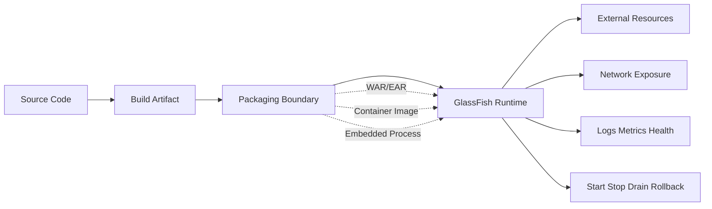

Deployment topology adalah keputusan tentang **di mana boundary dibuat**.

---

## 2. Baseline Modern untuk Seri Ini

Baseline seri ini:

- **Java:** JDK 21+.
- **Jakarta EE:** Jakarta EE 11.
- **GlassFish:** 8.x line.
- **Jersey:** 4.x line.
- **Namespace:** `jakarta.*`, bukan `javax.*`.
- **Packaging default:** thin WAR untuk full application server, kecuali ada alasan kuat.

Kenapa ini penting?

Karena deployment topology sangat bergantung pada siapa yang menyediakan API dan implementation:

| API / Runtime Capability | Traditional GlassFish | Containerized GlassFish | Embedded GlassFish |
|---|---:|---:|---:|
| Jakarta REST API | Server-provided | Image-provided server | Embedded runtime dependency |
| Jersey implementation | Server-provided / app-bundled dengan hati-hati | Image-provided atau app-bundled | App dependency |
| CDI/JTA/JDBC resource | Server-managed | Image/server-managed + env config | Programmatic/test-managed |
| Domain config | Mutable platform config | Ideally baked/scripted | Programmatic/minimal |
| Upgrade model | Upgrade platform/runtime separately | Rebuild image | Upgrade app dependency/runtime |

Prinsip dasar:

> Di full application server, jangan perlakukan GlassFish seperti servlet container kosong. Ia sudah menyediakan banyak API dan implementation. Deployment artifact harus menghormati runtime contract itu.

---

## 3. Deployment Topology Decision Matrix

Gunakan matrix ini sebagai titik awal.

| Constraint | Traditional Managed Server | Containerized GlassFish | Embedded GlassFish |
|---|---|---|---|
| Existing enterprise ops | Sangat cocok | Cocok jika platform sudah container-ready | Jarang cocok |
| Immutable deployment | Lemah jika manual | Sangat cocok | Cocok untuk tool/test |
| Multi-app shared server | Cocok | Kurang ideal | Tidak cocok |
| Kubernetes-native | Bisa, tapi awkward | Sangat cocok | Tidak umum |
| Heavy Jakarta EE features | Sangat cocok | Cocok | Terbatas/lebih kompleks |
| Fast local testing | Sedang | Sedang | Sangat cocok |
| Runtime drift control | Perlu disiplin `asadmin` | Lebih mudah | App-controlled |
| Rollback artifact | Deploy previous WAR | Rollback image/tag | Restart process with previous build |
| Platform team ownership | Kuat | Shared app/platform | App team |
| Classloading simplicity | Sedang | Sedang | Bisa kompleks karena dependencies |

Tidak ada topology yang selalu benar. Yang benar adalah topology yang membuat invariant production paling mudah dijaga.

---

## 4. Topology A: Traditional Managed GlassFish

Ini model klasik application server:

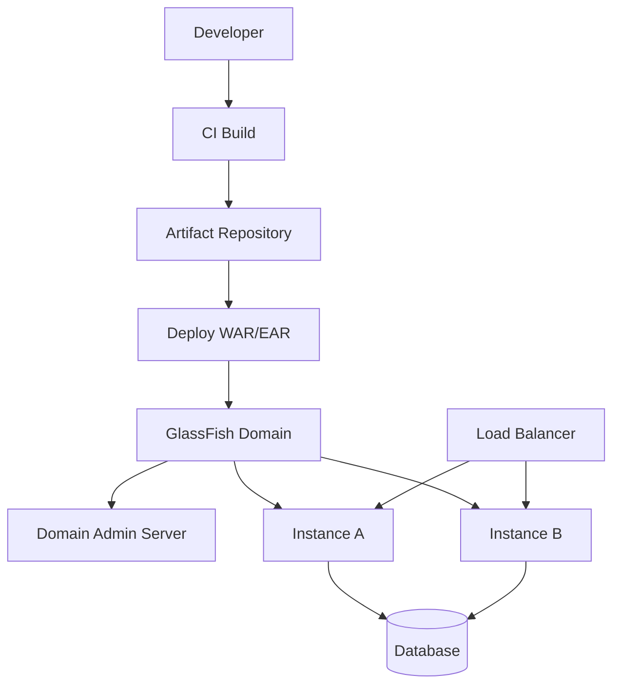

Artifact utama biasanya:

- WAR untuk Jersey web application.
- EAR jika ada banyak module Jakarta EE yang perlu di-bundle sebagai satu application boundary.
- External configuration di domain/instance: JDBC pool, JMS, realm, JVM options, listener, logging.

### 4.1 Kapan Traditional Managed Server Masuk Akal

Model ini masuk akal jika:

- Organisasi sudah punya platform GlassFish/Payara/Jakarta EE server yang dikelola tim infra.
- Ada banyak aplikasi yang berbagi standard runtime.
- Ada kebutuhan admin model, cluster, domain config, resource targeting.
- Deployment bukan hanya app artifact, tetapi juga resource binding seperti JDBC/JTA/security realm.
- Regulated environment butuh audit trail atas perubahan konfigurasi server.

### 4.2 Core Invariant

Traditional topology punya invariant:

> Server adalah platform runtime yang hidup lebih lama daripada satu release aplikasi.

Konsekuensinya:

- Aplikasi tidak boleh membawa semua dependency sembarangan.
- Config server harus dikelola seperti source code.
- Upgrade server bisa memengaruhi banyak aplikasi.
- Classloader conflict harus dianggap sebagai risiko arsitektural.
- Rollback aplikasi tidak otomatis rollback config server.

### 4.3 Deployment Flow yang Defensible

Flow yang sehat:

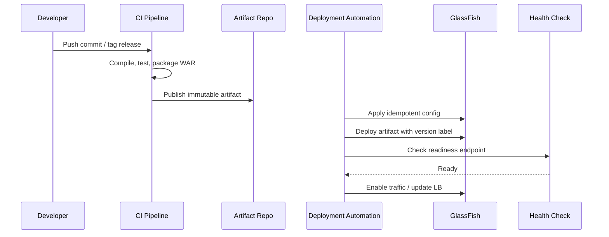

Yang harus dihindari:

```bash
# Anti-pattern: manual ad-hoc deployment tanpa traceability
asadmin deploy target/my-app.war
```

Yang lebih baik:

```bash
#!/usr/bin/env bash
set -euo pipefail

APP_NAME="regulatory-case-api"
ARTIFACT="/opt/releases/${APP_NAME}/${BUILD_VERSION}/${APP_NAME}.war"
TARGET="prod-cluster"
CONTEXT_ROOT="/case-api"

asadmin --terse=false list-applications --target "$TARGET"

asadmin deploy \
  --name "$APP_NAME" \
  --contextroot "$CONTEXT_ROOT" \
  --target "$TARGET" \
  --force=true \
  "$ARTIFACT"

curl --fail --silent "https://api.example.com${CONTEXT_ROOT}/health/ready"
```

### 4.4 Configuration Boundary

Pisahkan:

| Jenis Config | Lokasi Ideal | Contoh |
|---|---|---|
| Build config | Git/build tool | Java version, dependency versions |
| Deployment config | deployment repo/script | target cluster, context root |
| Runtime resource config | GlassFish domain config as code | JDBC pool, thread pool, JVM options |
| Secrets | secret manager / protected env | DB password, token signing key |
| Feature behavior | app config service/env | feature flag, threshold |

Jangan memasukkan credential ke WAR.

### 4.5 Operational Failure Model

| Symptom | Likely Root Cause | Diagnosis |
|---|---|---|
| Deploy succeeds, endpoint 404 | context root/path mismatch | `list-applications`, server log, resource model log |
| Works dev, fails prod | missing JNDI resource | `list-jdbc-resources`, deployment log |
| `NoSuchMethodError` | runtime/app dependency mismatch | dependency tree + classloader inspection |
| Startup slow | classpath scan, CDI discovery, DB init | startup log, thread dump |
| First request slow | lazy init, pool warmup | warmup endpoint, metrics |
| Requests fail during deploy | no drain or bad rolling sequence | LB logs, server lifecycle events |

### 4.6 Traditional Deployment Pattern

Pattern yang defensible:

1. Artifact immutable.
2. Config scripted.
3. Environment promotion explicit.
4. Pre-flight validation sebelum deploy.
5. Health check setelah deploy.
6. Traffic switch/drain controlled.
7. Rollback command tested.
8. Server logs, access logs, metrics, dumps available.

---

## 5. Topology B: Containerized GlassFish

Containerized topology membungkus GlassFish runtime dan application artifact ke image.

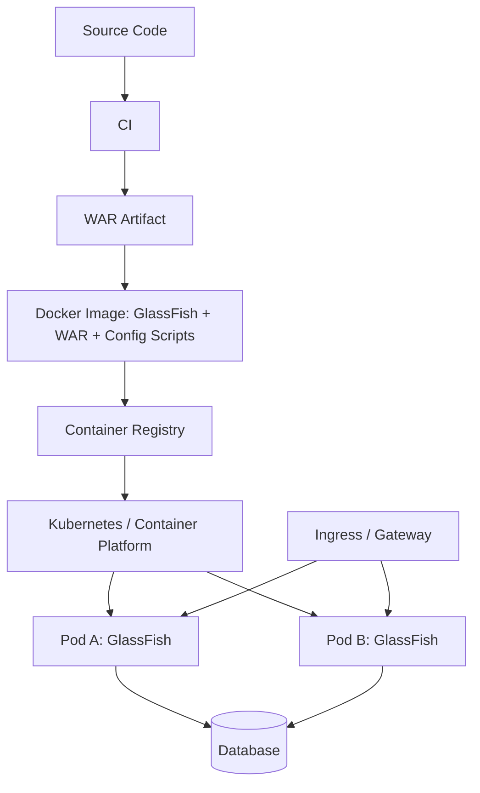

Core invariant:

> Image adalah deployment unit. Runtime, app artifact, and most baseline config harus reproducible dari image build.

### 5.1 Kapan Containerized GlassFish Masuk Akal

Cocok jika:

- Platform production adalah Kubernetes/OpenShift/Nomad/ECS.
- Tim ingin immutable infrastructure.
- Rollback berbasis image tag lebih mudah daripada server mutation.
- Setiap service punya runtime sendiri.
- Scaling horizontal lebih penting daripada multi-app shared server.
- App adalah REST service stateless.

Kurang cocok jika:

- Anda sangat bergantung pada shared domain/cluster admin model lama.
- Banyak aplikasi kecil berbagi satu server karena lisensi/ops constraint.
- Runtime config sangat manual dan belum bisa di-script.
- App bergantung pada local server state.

### 5.2 Image Design: Mutable vs Immutable

Bad image:

```Dockerfile
# Anti-pattern
FROM eclipse-temurin:21
COPY glassfish.zip /tmp/
RUN unzip /tmp/glassfish.zip -d /opt
COPY app.war /tmp/app.war
CMD ["/opt/glassfish/bin/asadmin", "start-domain", "--verbose"]
```

Masalah:

- App belum tentu dideploy saat image dibuat.
- Config bisa berubah saat runtime tanpa trace.
- Startup script mungkin melakukan terlalu banyak hal non-idempotent.
- Readiness tidak mencerminkan app ready.

Lebih defensible:

```Dockerfile
FROM eclipse-temurin:21-jre

ARG GLASSFISH_HOME=/opt/glassfish
ARG APP_NAME=regulatory-case-api

ENV GLASSFISH_HOME=${GLASSFISH_HOME}
ENV PATH="${GLASSFISH_HOME}/bin:${PATH}"

COPY glassfish8/ ${GLASSFISH_HOME}/
COPY target/${APP_NAME}.war /opt/app/${APP_NAME}.war
COPY docker/configure-glassfish.sh /opt/app/configure-glassfish.sh
COPY docker/entrypoint.sh /opt/app/entrypoint.sh

RUN chmod +x /opt/app/*.sh \
    && /opt/app/configure-glassfish.sh

EXPOSE 8080 8181

ENTRYPOINT ["/opt/app/entrypoint.sh"]
```

Entry point:

```bash
#!/usr/bin/env bash
set -euo pipefail

asadmin start-domain

# Apply runtime values that legitimately vary per environment.
asadmin set configs.config.server-config.system-property.DB_HOST.value="${DB_HOST}"
asadmin set configs.config.server-config.system-property.DB_PORT.value="${DB_PORT:-5432}"

asadmin deploy \
  --name regulatory-case-api \
  --contextroot /case-api \
  --force=true \
  /opt/app/regulatory-case-api.war

asadmin stop-domain

exec asadmin start-domain --verbose
```

Namun perlu hati-hati: deploy saat container startup membuat startup lambat dan bisa gagal karena environment. Alternatifnya adalah pre-deploy saat image build, jika semua config tidak environment-specific.

### 5.3 Pre-deploy vs Startup Deploy

| Model | Kelebihan | Kekurangan |
|---|---|---|
| Deploy saat image build | Startup lebih predictable, artifact immutable | Sulit jika deployment butuh env-specific resource |
| Deploy saat container startup | Fleksibel per env | Startup lebih lambat, failure lebih runtime-ish |
| External deploy ke running container | Mirip traditional | Melawan immutable container model |

Rule of thumb:

- Untuk Kubernetes stateless service: **pre-configure sebanyak mungkin**, inject hanya secrets/env-specific values saat runtime.
- Hindari manual deployment ke container yang sudah berjalan.

### 5.4 Runtime Filesystem Boundary

Container yang sehat:

| Path | Sifat | Contoh |
|---|---|---|
| Image layer | immutable | server binaries, app artifact, baseline config |
| Ephemeral writable | temporary | temp files, exploded app, generated cache |
| Mounted secret | runtime protected | DB password, cert key |
| Persistent volume | avoid unless needed | uploaded files, local queue, generated reports |

Untuk REST service, local persistent volume sering sinyal buruk. Biasanya lebih baik pakai object storage, database, atau external durable queue.

### 5.5 Kubernetes Mapping

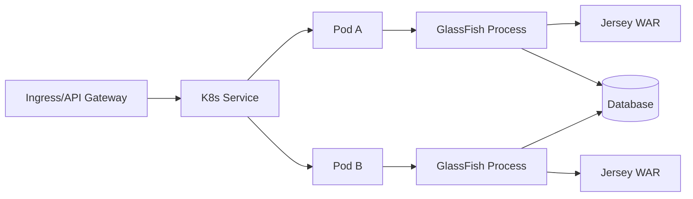

GlassFish-specific concerns in Kubernetes:

| Concern | Production Decision |
|---|---|
| Startup time | readiness probe must wait until app deployed and warm |
| Shutdown | use `preStop` + termination grace period |
| Health endpoint | separate liveness/readiness/startup semantics |
| Logs | write to stdout/stderr or ship server logs |
| Thread dump | expose debug workflow, not public endpoint |
| Admin port | do not expose externally |
| Clustering | prefer platform service discovery unless GlassFish cluster features are required |
| Session state | avoid HTTP session for REST APIs |

Example probe design:

```yaml
readinessProbe:
  httpGet:
    path: /case-api/health/ready
    port: 8080
  initialDelaySeconds: 20
  periodSeconds: 10
  timeoutSeconds: 2
  failureThreshold: 6

livenessProbe:
  httpGet:
    path: /case-api/health/live
    port: 8080
  initialDelaySeconds: 60
  periodSeconds: 20
  timeoutSeconds: 2
  failureThreshold: 3
```

Do not use liveness for dependency readiness. If database is down and liveness kills all pods, you create a restart storm.

### 5.6 Graceful Shutdown

GlassFish/Jersey app harus punya shutdown behavior:

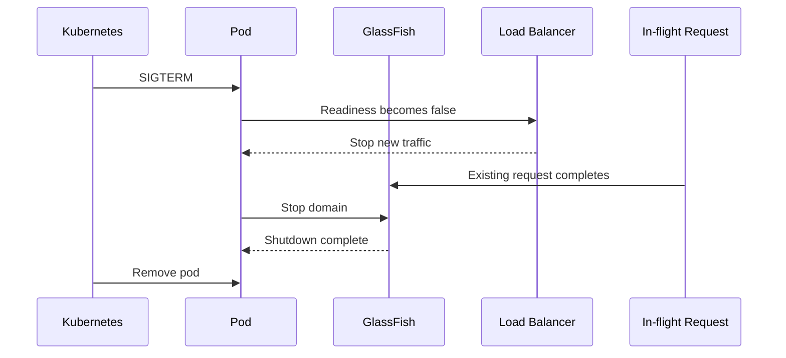

Checklist:

- Readiness returns false before shutdown.
- Stop accepting new traffic.
- Let in-flight request complete within grace period.
- Close client pools.
- Close executor services.
- Do not start long irreversible transactions during drain.
- Make retry behavior idempotency-aware.

### 5.7 Admin Console in Containers

Production rule:

> Admin console/port should not be internet exposed. In many container deployments, prefer disabling or restricting admin surface.

Use admin only via controlled internal network, short-lived debug access, or CI/CD automation with least privilege.

---

## 6. Topology C: Embedded GlassFish

Embedded GlassFish means GlassFish runtime is started inside a Java process.

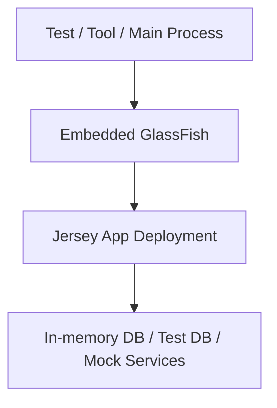

Core invariant:

> Application process owns the server lifecycle.

### 6.1 Kapan Embedded Masuk Akal

Embedded cocok untuk:

- Integration testing.
- Local developer harness.
- Contract testing.
- Demo/runtime sandbox.
- Migration validation.
- Build-time smoke tests.

Kurang cocok untuk:

- Most production REST services.
- Complex multi-instance clustered deployments.
- Environments where platform team owns runtime.
- Workloads needing full operational isolation.

### 6.2 Embedded Testing Pattern

```java
class JerseyGlassFishIT {
    private static GlassFish glassFish;

    @BeforeAll
    static void start() throws Exception {
        GlassFishProperties properties = new GlassFishProperties();
        properties.setPort("http-listener", 18080);

        glassFish = GlassFishRuntime.bootstrap().newGlassFish(properties);
        glassFish.start();

        Deployer deployer = glassFish.getDeployer();
        deployer.deploy(new File("target/regulatory-case-api.war"));
    }

    @AfterAll
    static void stop() throws Exception {
        if (glassFish != null) {
            glassFish.stop();
            glassFish.dispose();
        }
    }
}
```

The point is not this exact API shape; the point is lifecycle ownership.

### 6.3 Embedded Failure Model

| Symptom | Cause | Fix |
|---|---|---|
| Test hangs | server not stopped | `try/finally`, `@AfterAll` cleanup |
| Port conflict | fixed port reused | random port allocation |
| Classloading differs from prod | embedded classpath too rich | test packaged WAR, not loose classes only |
| Test passes, prod fails | missing server config parity | script embedded resources similarly |
| Slow test suite | starts server per test | start once per test class/suite |

### 6.4 Embedded vs Testcontainers

Often a better modern strategy:

- Package WAR.
- Start GlassFish container in Testcontainers.
- Deploy artifact or use prebuilt image.
- Test through real HTTP.

This gives stronger parity with containerized production than pure embedded runtime.

---

## 7. Deployment Rollout Models

### 7.1 Big Bang Deployment

All instances updated at once.

Use only if:

- Maintenance window acceptable.
- Fast rollback tested.
- State/data migration safe.
- Consumer impact understood.

Usually not preferred for critical APIs.

### 7.2 Rolling Deployment

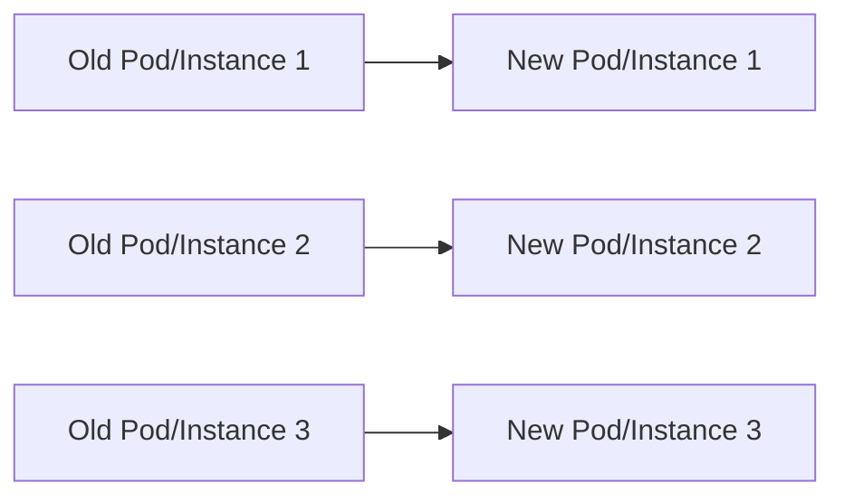

Good for stateless services. Requires:

- Backward-compatible API.
- Backward-compatible DB schema.
- No shared mutable in-memory state.
- Readiness probe accurate.
- Graceful drain.

### 7.3 Blue-Green Deployment

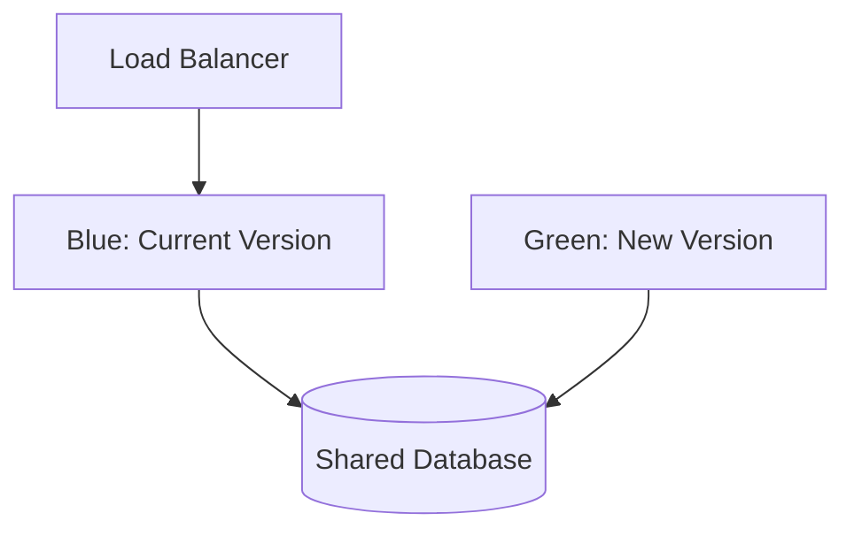

Steps:

1. Deploy green without traffic.
2. Run smoke checks.
3. Shift traffic to green.
4. Monitor error/latency/business metrics.
5. Keep blue for rollback window.

Good for:

- High-risk deployment.
- Regulated release evidence.
- Fast traffic rollback.

Risk:

- Database migration compatibility must support both blue and green.

### 7.4 Canary Deployment

Small traffic percentage to new version.

Good when:

- You have enough traffic volume for signal.
- You can compare metrics by version.
- App behavior is deterministic enough.
- You can stop the canary quickly.

Requires:

- Version-tagged logs/metrics.
- Route traffic by weight/header/tenant.
- Error budget thresholds.
- Automatic or manual promotion rules.

### 7.5 Shadow Deployment

Duplicate traffic to new version but do not serve response.

Good for:

- Performance comparison.
- Serialization compatibility.
- Read-only validation.

Danger:

- Never shadow non-idempotent write operations unless safely neutralized.

---

## 8. Database Migration Coupling

Deployment topology fails when database migration is not compatible.

Safe deployment uses expand/contract:

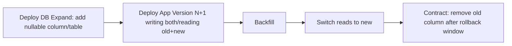

For Jersey/GlassFish services:

- Do not deploy app that requires a destructive DB migration at the same instant.
- Do not assume rolling deployment means all nodes update atomically.
- Keep old and new app versions compatible during rollout window.
- Map database migration failure to deployment rollback plan.

---

## 9. Config Injection Patterns

### 9.1 Environment Variables

Good for:

- Containerized deployment.
- Simple scalar config.
- Non-secret toggles.

Pitfalls:

- Env var change requires restart.
- Secrets in env can leak via diagnostics.
- Complex config becomes unreadable.

### 9.2 JNDI / GlassFish Resources

Good for:

- JDBC pools.
- JMS resources.
- Container-managed resources.
- Traditional server deployments.

Pitfalls:

- Missing resource fails at deploy/runtime.
- Resource names drift across environment.
- Manual admin console changes are hard to audit.

### 9.3 Config File

Good for:

- Structured config.
- Environment bundle.
- Static runtime config.

Pitfalls:

- File location differs across topology.
- Secret handling hard.
- Drift if edited on server.

### 9.4 Config Service / Feature Flag Service

Good for:

- Dynamic behavior.
- Gradual rollout.
- Kill switches.

Pitfalls:

- Startup dependency risk.
- Runtime inconsistency.
- Needs cache/fallback model.

### 9.5 Recommended Layering

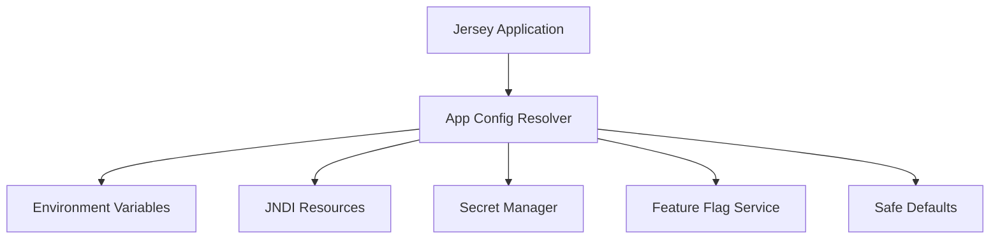

Rules:

- Centralize config resolution.
- Validate config at startup.
- Log non-secret effective config.
- Fail fast for mandatory config.
- Use safe defaults only for non-critical optional config.

---

## 10. Health Endpoint Design

Health endpoint is deployment control surface.

Recommended split:

| Endpoint | Meaning | Includes Dependencies? | Used By |
|---|---|---:|---|
| `/health/live` | process is alive | No heavy dependencies | liveness probe |
| `/health/ready` | can receive traffic | Yes, but bounded | readiness probe / LB |
| `/health/startup` | startup completed | App-specific | startup probe |
| `/health/deep` | diagnostic | Yes, detailed | internal ops only |

Example:

```java
@Path("/health")
@Produces(MediaType.APPLICATION_JSON)
public class HealthResource {

    @GET
    @Path("live")
    public Response live() {
        return Response.ok(Map.of("status", "UP")).build();
    }

    @GET
    @Path("ready")
    public Response ready() {
        boolean dbReady = checkDatabaseWithin(Duration.ofMillis(200));
        boolean dependencyReady = checkCriticalDependencyWithin(Duration.ofMillis(200));

        if (dbReady && dependencyReady) {
            return Response.ok(Map.of("status", "UP")).build();
        }

        return Response.status(Response.Status.SERVICE_UNAVAILABLE)
                .entity(Map.of("status", "DOWN"))
                .build();
    }
}
```

Do not make readiness check slow. Health endpoints can become accidental DDoS against your database.

---

## 11. Startup and Warmup

Startup phases:

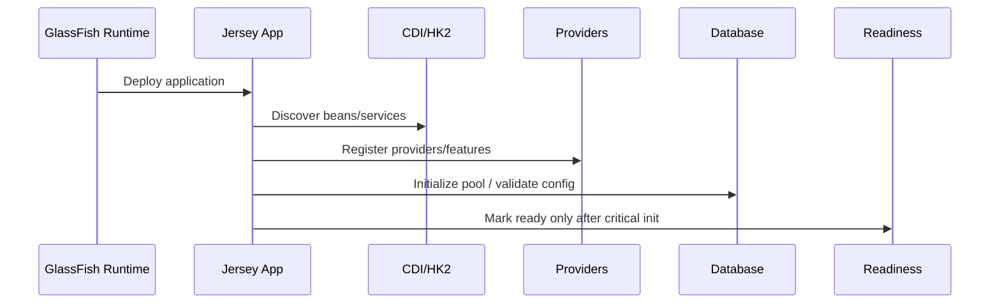

Warmup can include:

- Build Jersey resource model.
- Initialize JSON provider.
- Open initial DB connections.
- Validate mandatory JNDI resources.
- Load static metadata.
- Prime caches carefully.

Do not do:

- Long backfills at startup.
- Remote calls without timeout.
- Unbounded cache load.
- Schema migration inside app startup unless intentionally designed.

---

## 12. Shutdown and Drain Semantics

Shutdown must answer:

1. When do we stop accepting new requests?
2. How long do in-flight requests get?
3. What happens to async requests?
4. What happens to streaming/SSE clients?
5. What happens to transactions?
6. What happens to outbound Jersey Client calls?
7. What cleanup is safe?

Pattern:

```java
@ApplicationScoped
public class RuntimeLifecycle {
    private final AtomicBoolean draining = new AtomicBoolean(false);

    public boolean isReady() {
        return !draining.get() && criticalDependenciesReady();
    }

    public void beginDrain() {
        draining.set(true);
    }

    @PreDestroy
    public void shutdown() {
        beginDrain();
        closeClients();
        stopExecutors();
    }
}
```

Readiness should flip to false before shutdown completes.

---

## 13. Observability by Topology

| Capability | Traditional | Containerized | Embedded |
|---|---|---|---|
| Server log | file/log collector | stdout/log collector | test log |
| Access log | server config | sidecar/agent/server config | usually test only |
| Metrics | JMX/MP/agent | Prometheus/agent/MP | test assertions |
| Thread dump | server host tooling | `kubectl exec` / JVM tooling | test JVM |
| Heap dump | server path | ephemeral/persistent volume | test path |
| Deployment audit | asadmin log/CI | image digest + rollout events | test report |

A production topology that cannot answer “what version is serving this request?” is not production-ready.

Include version in:

- log MDC;
- response header for internal calls;
- `/info` endpoint;
- metrics labels;
- deployment annotation;
- image tag/digest.

---

## 14. Anti-Patterns

### 14.1 Snowflake Server

Server is manually edited until nobody can reproduce it.

Fix:

- Use `asadmin` scripts.
- Store config in Git.
- Run drift detection.
- Recreate environment from scratch regularly.

### 14.2 Mutable Container

Deploying new WAR manually into a running container.

Fix:

- Rebuild image.
- Redeploy immutable tag/digest.
- Treat container as disposable.

### 14.3 Health Check That Lies

`/health` returns 200 while app cannot serve traffic.

Fix:

- Split live/ready/startup.
- Make readiness dependency-aware but bounded.

### 14.4 Liveness Depends on Database

Database outage causes orchestrator to restart every pod.

Fix:

- Liveness checks process health only.
- Readiness checks critical dependencies.

### 14.5 Release Requires Perfect Timing

App and DB migration must happen atomically.

Fix:

- Expand/contract DB migration.
- Backward-compatible API contract.
- Rolling-safe deployment design.

### 14.6 App Writes Local Disk in Container

File disappears on restart/reschedule.

Fix:

- Use object storage/database/queue.
- Use local disk only for temp/cache.

### 14.7 Admin Surface Exposed

Admin console/API available from public network.

Fix:

- Restrict network.
- Disable if unnecessary.
- Require strong auth.
- Audit access.

---

## 15. Production-Grade Deployment Checklist

### Artifact

- [ ] Artifact has immutable version.
- [ ] Build is reproducible.
- [ ] Dependency scope checked.
- [ ] SBOM generated if required.
- [ ] Artifact promoted, not rebuilt per environment.

### Runtime

- [ ] GlassFish/JDK/Jakarta/Jersey version matrix documented.
- [ ] JVM options scripted.
- [ ] Resources scripted.
- [ ] Listener/TLS/proxy config scripted.
- [ ] Admin surface restricted.

### Config

- [ ] Mandatory config validated at startup.
- [ ] Secrets not stored in artifact.
- [ ] Non-secret effective config logged.
- [ ] Environment differences documented.
- [ ] Config rollback plan exists.

### Deployment

- [ ] Readiness/liveness/startup endpoints separated.
- [ ] Graceful shutdown tested.
- [ ] Rollback tested.
- [ ] Deployment strategy selected: rolling/blue-green/canary.
- [ ] Database migration is backward compatible.

### Observability

- [ ] Version visible in logs/metrics/info endpoint.
- [ ] Access log enabled where needed.
- [ ] Error rate and latency alerts exist.
- [ ] Thread dump workflow documented.
- [ ] Deployment events correlated with metrics.

---

## 16. Decision Tree

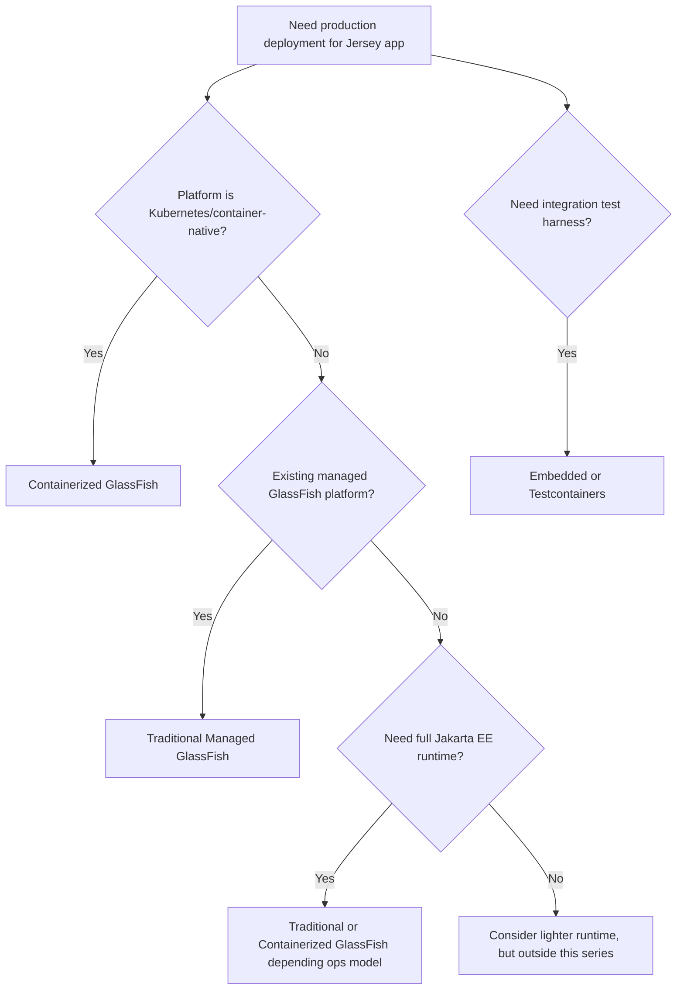

Use this decision tree as conversation starter, not as automatic rule.

---

## 17. Mini Case Study: Regulatory Case API

Assume service:

- Jersey REST API.
- GlassFish 8.
- PostgreSQL via JDBC resource.
- OAuth/JWT authentication.
- Stateless requests.
- Needs audit log.
- Needs zero/minimal downtime.

Recommended topology:

- Containerized GlassFish if platform is Kubernetes.
- Thin WAR deployed into image/runtime.
- DB pool configured via startup script/env/secret.
- `/health/live`, `/health/ready`, `/info`.
- Rolling deployment with max unavailable 0 or blue-green for high-risk release.
- Expand/contract DB migration.
- Structured logs with `correlationId`, `caseId`, `subjectId`, `version`.
- Readiness false during drain.
- Admin port not exposed.

Why not embedded?

- Production ownership/lifecycle/observability are weaker.
- Full server process should be operationally visible.

Why not old-style manual server?

- Regulated environment needs repeatability and auditability.
- Manual changes create defensibility risk.

---

## 18. Practice: 90-Minute Deployment Topology Exercise

Use this deliberate practice session:

1. Pick one Jersey WAR from previous exercises.
2. Define three deployment targets:
   - traditional GlassFish domain;
   - containerized GlassFish image;
   - embedded/test runtime.
3. For each target, write:
   - artifact boundary;
   - config boundary;
   - secret boundary;
   - health endpoint behavior;
   - rollback method;
   - top 5 failure modes.
4. Draw one Mermaid topology diagram.
5. Write a one-page operational runbook.

The goal is not to deploy everything. The goal is to make topology decisions explicit.

---

## 19. Key Takeaways

- Deployment topology is not an ops afterthought; it is part of application architecture.
- Traditional GlassFish treats server as long-lived platform runtime.
- Containerized GlassFish treats image as deployment unit.
- Embedded GlassFish is excellent for testing/tooling, rarely the default production topology.
- Readiness, liveness, graceful shutdown, config injection, and rollback are architectural invariants.
- Rolling/blue-green/canary only work if API and database changes are backward compatible.
- Production-grade deployment is the ability to reproduce, observe, drain, rollback, and explain the runtime.

---

## 20. References

- Eclipse GlassFish Application Deployment Guide, Release 8: `https://glassfish.org/docs/latest/application-deployment-guide.html`
- Eclipse GlassFish Application Development Guide: `https://glassfish.org/docs/latest/application-development-guide.html`
- Eclipse GlassFish Release Notes, Release 8: `https://glassfish.org/docs/latest/release-notes.html`
- Jakarta EE Platform 11 Specification: `https://jakarta.ee/specifications/platform/11/`
- Eclipse GlassFish Downloads: `https://glassfish.org/download`
