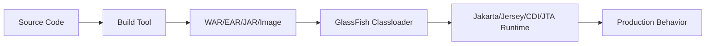
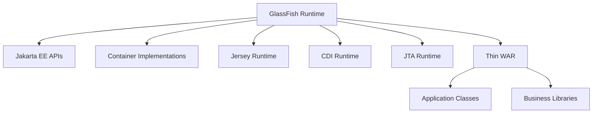
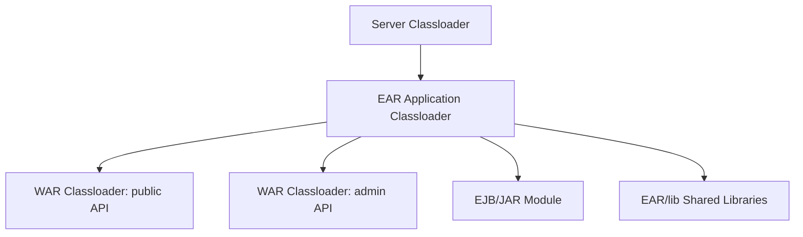
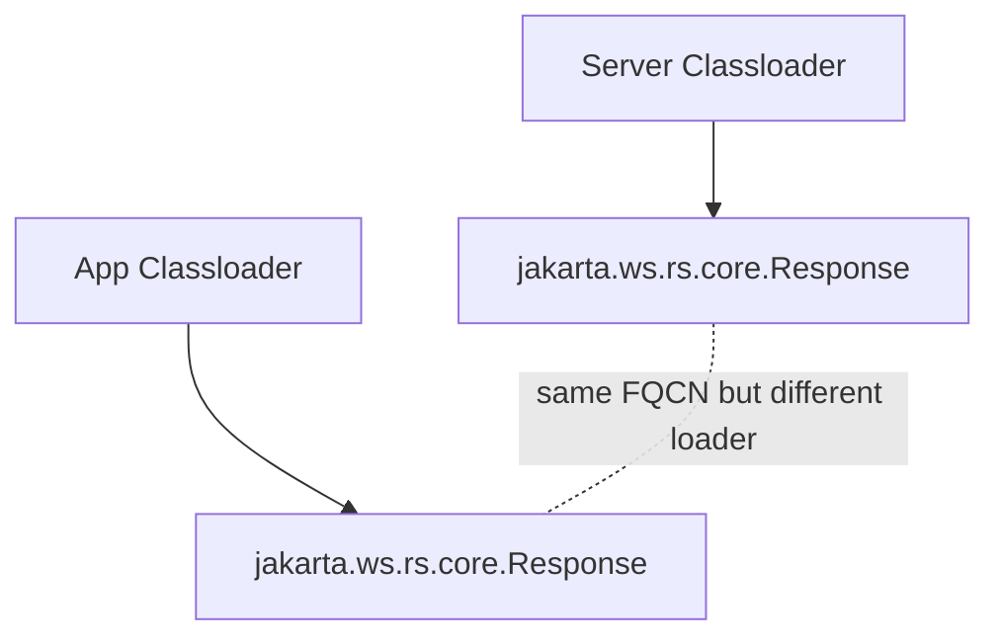
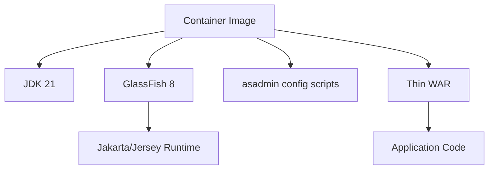
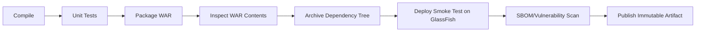

------
title: Learn Java Eclipse Jersey & GlassFish - Part 026
description: Packaging strategy for Jersey applications on GlassFish: thin WAR, fat WAR, EAR, server-provided APIs, dependency scopes, classloader safety, reproducible builds, and release governance.
series: learn-java-jersey-glassfish
seriesTitle: Learn Java Eclipse Jersey & GlassFish
order: 26
partTitle: Packaging Strategy: Thin WAR, Fat WAR, Server-Provided APIs
tags:
- java
- jersey
- glassfish
- jakarta-ee
- war
- ear
- maven
- gradle
- classloader
- deployment
- series
date: 2026-06-28
---

# Part 026 — Packaging Strategy: Thin WAR, Fat WAR, Server-Provided APIs

> **Goal:** setelah bagian ini, kita bisa menentukan packaging strategy untuk Jersey + GlassFish secara defensible: dependency mana yang harus `provided`, mana yang boleh dibundel, kapan WAR harus thin, kapan fat WAR masuk akal, kapan EAR dibutuhkan, bagaimana menghindari classloader conflict, dan bagaimana membuat build artifact reproducible.

Packaging adalah titik temu antara code, dependency graph, application server, classloader, deployment pipeline, dan incident response.

Banyak masalah Jersey/GlassFish di production terlihat seperti bug aplikasi:

- endpoint 500;
- provider JSON tidak terpilih;
- `NoSuchMethodError`;
- CDI tidak inject;
- `ClassCastException` untuk class yang “sama”;
- startup gagal hanya di production;
- app bekerja di embedded test tetapi gagal di GlassFish.

Sering akar masalahnya bukan logic, tetapi **packaging boundary yang salah**.

---

## 1. Mental Model: Packaging Is Runtime Contract

Build artifact bukan sekadar ZIP berisi class. Ia adalah kontrak:



Jika artifact membawa class yang seharusnya disediakan server, ia dapat mengubah behavior runtime.

Core principle:

> Dalam full Jakarta EE application server, dependency graph aplikasi harus disusun dengan asumsi bahwa server sudah menyediakan platform API dan sebagian implementation runtime.

---

## 2. Packaging Vocabulary

| Term | Meaning | Dalam Seri Ini |
|---|---|---|
| Thin WAR | WAR berisi app code + dependency non-server | Default untuk GlassFish |
| Fat WAR | WAR membundel banyak library/runtime sendiri | Dipakai sangat selektif |
| EAR | Enterprise archive berisi beberapa module | Untuk multi-module Jakarta EE boundary |
| Provided dependency | Compile/test ada, runtime disediakan container | Jakarta EE API, kadang Jersey runtime |
| Server library | Library dipasang ke GlassFish domain/server lib | Shared driver/library dengan hati-hati |
| Application library | Library dibundel di WAR/EAR | Domain-specific dependency |
| Uber JAR | Single executable JAR | Bukan default GlassFish deployment model |
| Container image | Runtime + artifact + config/script | Unit deployment containerized |

---

## 3. Thin WAR as Default

Thin WAR biasanya berisi:

```text
my-api.war
├── WEB-INF/
│   ├── classes/
│   │   └── com/example/api/...
│   ├── lib/
│   │   ├── domain-lib.jar
│   │   ├── resilience-lib.jar
│   │   └── business-client.jar
│   └── web.xml        optional
└── META-INF/
```

Thin WAR tidak membawa:

- `jakarta.ws.rs-api` untuk runtime;
- `jakarta.servlet-api`;
- `jakarta.enterprise.cdi-api`;
- `jakarta.transaction-api`;
- full Jakarta EE platform API jar;
- duplicate Jersey implementation jika server sudah menyediakan versi yang digunakan;
- old `javax.*` API jars;
- database driver jika driver dikelola sebagai server library/resource strategy.

### 3.1 Kenapa Thin WAR Default di GlassFish

Karena GlassFish adalah Jakarta EE application server, bukan empty JVM.



Thin WAR menjaga satu sumber kebenaran untuk server API/runtime.

### 3.2 Thin WAR Benefits

| Benefit | Explanation |
|---|---|
| Lower conflict risk | API/runtime tidak digandakan di app |
| Smaller artifact | Faster transfer/deploy |
| Clear container contract | Server owns Jakarta runtime |
| Easier patching | Server/runtime patch can be centralized |
| Better compatibility | Fewer split version issues |

### 3.3 Thin WAR Risks

| Risk | Mitigation |
|---|---|
| Depends on server version | Maintain version matrix |
| Local test mismatch | Test against real GlassFish/container |
| Runtime upgrade affects app | Compatibility test pipeline |
| Hidden server-provided impl | Document baseline runtime |

---

## 4. Fat WAR: What It Is and Why It Is Risky

Fat WAR includes not only application code but also APIs/implementations normally provided by server.

```text
my-api.war
└── WEB-INF/lib/
    ├── jakarta.ws.rs-api.jar
    ├── jakarta.servlet-api.jar
    ├── jersey-server.jar
    ├── jersey-container-servlet.jar
    ├── hk2-locator.jar
    ├── jsonb-api.jar
    ├── yasson.jar
    └── ... many more
```

This can work in a simple servlet container. In GlassFish it can become dangerous.

### 4.1 Fat WAR Failure Modes

| Failure | Why It Happens |
|---|---|
| `NoSuchMethodError` | app library compiled against different API/impl version |
| `ClassCastException` | same class loaded by different classloaders |
| Provider not selected | duplicate provider registration or incompatible service files |
| CDI injection broken | container and app have different CDI/HK2 expectations |
| Servlet behavior odd | duplicate Servlet API or container classes |
| Deployment fails | incompatible Jakarta EE API version |
| Works in local Tomcat, fails in GlassFish | different runtime ownership model |

### 4.2 When Fat WAR Might Be Acceptable

Fat WAR can be acceptable if:

- You deploy to a plain servlet container, not full GlassFish.
- You intentionally isolate Jersey version from server runtime and have tested classloader behavior.
- You use a custom runtime image where server is treated as minimal host.
- You have no dependency on container-provided Jakarta EE services beyond Servlet.

But for this series baseline — Jersey on GlassFish — fat WAR is usually **not** the default.

---

## 5. EAR Packaging

EAR is useful when application boundary spans multiple Jakarta EE modules:

```text
case-management.ear
├── META-INF/application.xml
├── case-api.war
├── case-admin.war
├── case-ejb.jar
└── lib/
    └── shared-domain-model.jar
```

### 5.1 When EAR Makes Sense

Use EAR if:

- Multiple WAR modules must be deployed/versioned together.
- Shared EJB/Jakarta EE module is part of same application boundary.
- You need application-level library sharing across modules.
- Legacy enterprise system already uses EAR and migration risk is high.
- Deployment unit must represent a regulated release bundle.

Avoid EAR if:

- One REST service can be a standalone WAR.
- Shared domain library can be versioned independently.
- You are moving toward independently deployable services.
- EAR is used only because “enterprise apps use EAR”.

### 5.2 EAR Classloader Boundary

EAR classloading can solve or create problems.



Key discipline:

- Shared classes used across modules go to `EAR/lib`.
- WAR-private dependencies stay in `WEB-INF/lib`.
- Do not duplicate same library in both `EAR/lib` and WAR `WEB-INF/lib` unless you fully understand class identity impact.

---

## 6. Server-Provided APIs

In Jakarta EE application server, many APIs are provided by runtime.

Default `provided` candidates:

| Dependency | Maven Scope | Reason |
|---|---|---|
| `jakarta.platform:jakarta.jakartaee-api` | `provided` | Platform API supplied by server |
| `jakarta.ws.rs:jakarta.ws.rs-api` | `provided` | REST API supplied by server/platform |
| `jakarta.servlet:jakarta.servlet-api` | `provided` | Servlet container supplies it |
| `jakarta.enterprise:jakarta.enterprise.cdi-api` | `provided` | CDI container supplies it |
| `jakarta.transaction:jakarta.transaction-api` | `provided` | JTA supplied by server |
| `jakarta.validation:jakarta.validation-api` | `provided` if server-managed | Bean Validation integrated in Jakarta EE |
| `jakarta.json.bind:jakarta.json.bind-api` | `provided` if using server JSON-B | JSON-B API supplied in platform |

Example Maven baseline:

```xml
<dependencyManagement>
    <dependencies>
        <dependency>
            <groupId>jakarta.platform</groupId>
            <artifactId>jakarta.jakartaee-bom</artifactId>
            <version>11.0.0</version>
            <type>pom</type>
            <scope>import</scope>
        </dependency>
    </dependencies>
</dependencyManagement>

<dependencies>
    <dependency>
        <groupId>jakarta.platform</groupId>
        <artifactId>jakarta.jakartaee-api</artifactId>
        <version>11.0.0</version>
        <scope>provided</scope>
    </dependency>
</dependencies>
```

Do not package the Jakarta EE API jar inside WAR for GlassFish runtime.

---

## 7. Jersey Dependency Strategy

There are three common cases.

### 7.1 Case A: Use Jersey Provided by GlassFish

This is the cleanest GlassFish-native model.

```xml
<dependency>
    <groupId>jakarta.platform</groupId>
    <artifactId>jakarta.jakartaee-api</artifactId>
    <version>11.0.0</version>
    <scope>provided</scope>
</dependency>
```

Application uses Jakarta REST API, not Jersey-specific APIs, where possible.

Use when:

- App is standard Jakarta REST.
- You do not require Jersey-specific extensions at compile time.
- You want maximum portability.

### 7.2 Case B: Compile Against Jersey Extension, Runtime Provided by Server

If app uses Jersey-specific APIs like `ResourceConfig`, Jersey filters/extensions, multipart, SSE helpers, etc., you may need Jersey dependencies at compile time.

```xml
<dependency>
    <groupId>org.glassfish.jersey.core</groupId>
    <artifactId>jersey-server</artifactId>
    <version>${jersey.version}</version>
    <scope>provided</scope>
</dependency>
```

Requirement:

- `${jersey.version}` must match or be compatible with GlassFish-provided Jersey.
- Runtime must be tested against actual server.

### 7.3 Case C: Bundle Jersey with the App

Only do this intentionally.

Use when:

- Server does not provide required Jersey version.
- You deploy to servlet container or custom server.
- You control classloader and provider registration carefully.

In GlassFish, this is high-risk because server may already have Jersey integration.

---

## 8. JSON Provider Strategy

JSON provider conflict is common.

Options:

| Provider | Good For | Risk |
|---|---|---|
| JSON-B/Yasson | Jakarta EE standard alignment | Less Jackson ecosystem-specific flexibility |
| Jackson | Rich ecosystem, annotations, modules | Must manage provider registration/version carefully |
| MOXy | Historical Jersey/EclipseLink XML/JSON binding | May surprise teams expecting Jackson/JSON-B |
| Custom provider | Special media type/control | Maintenance burden |

Decision rule:

> Pick one JSON provider per application boundary and make it explicit.

Example explicit registration:

```java
@ApplicationPath("/api")
public class ApiApplication extends ResourceConfig {
    public ApiApplication() {
        packages("com.example.caseapi.boundary");
        register(JsonBindingFeature.class);
    }
}
```

or for Jackson if intentionally used:

```java
@ApplicationPath("/api")
public class ApiApplication extends ResourceConfig {
    public ApiApplication() {
        packages("com.example.caseapi.boundary");
        register(JacksonFeature.class);
    }
}
```

Do not let provider choice be accidental classpath consequence.

---

## 9. JDBC Driver Packaging

Two valid strategies:

### 9.1 Server-Managed JDBC Driver

Driver placed in GlassFish server/domain library path and pool configured in GlassFish.

Good for:

- Traditional server model.
- Shared database driver across apps.
- Platform team owns DB connectivity.

Risks:

- Driver upgrade affects multiple apps.
- Server restart may be needed.
- Version drift across environments.

### 9.2 App-Bundled JDBC Driver

Driver inside WAR `WEB-INF/lib`.

Good for:

- App-specific driver version.
- Containerized runtime where image owns everything.
- Avoiding global server mutation.

Risks:

- GlassFish JDBC resource/pool may not see app-bundled driver depending classloader/resource setup.
- Duplicate drivers across apps.
- Leaks during redeploy if driver deregistration is poor.

Rule:

- If GlassFish manages the connection pool as server resource, server-visible driver is usually cleaner.
- If app manages its own `DataSource`/driver, app-bundled may be acceptable, but this gives up some container management benefits.

---

## 10. Dependency Scope Rules

### 10.1 Maven Scope Cheat Sheet

| Scope | Packaged in WAR? | Use For |
|---|---:|---|
| `compile` | Yes | App-owned library |
| `provided` | No | Server-provided API/runtime |
| `runtime` | Yes | Runtime-only app dependency |
| `test` | No | Test-only dependency |
| `import` | No | BOM dependency management |

### 10.2 Examples

Application-owned domain library:

```xml
<dependency>
    <groupId>com.example</groupId>
    <artifactId>case-domain</artifactId>
    <version>${project.version}</version>
</dependency>
```

Jakarta API:

```xml
<dependency>
    <groupId>jakarta.ws.rs</groupId>
    <artifactId>jakarta.ws.rs-api</artifactId>
    <version>4.0.0</version>
    <scope>provided</scope>
</dependency>
```

Jersey compile-time extension:

```xml
<dependency>
    <groupId>org.glassfish.jersey.core</groupId>
    <artifactId>jersey-server</artifactId>
    <version>${jersey.version}</version>
    <scope>provided</scope>
</dependency>
```

Testcontainers/test dependency:

```xml
<dependency>
    <groupId>org.junit.jupiter</groupId>
    <artifactId>junit-jupiter</artifactId>
    <version>${junit.version}</version>
    <scope>test</scope>
</dependency>
```

### 10.3 Bad Scope Examples

Bad:

```xml
<dependency>
    <groupId>jakarta.platform</groupId>
    <artifactId>jakarta.jakartaee-api</artifactId>
    <version>11.0.0</version>
</dependency>
```

Why bad: no `provided`, so the API jar may be bundled into WAR.

Bad:

```xml
<dependency>
    <groupId>javax.ws.rs</groupId>
    <artifactId>javax.ws.rs-api</artifactId>
    <version>2.1.1</version>
</dependency>
```

Why bad: old `javax` API in `jakarta` runtime creates namespace mismatch.

---

## 11. Gradle Equivalent

```kotlin
plugins {
    java
    war
}

java {
    toolchain {
        languageVersion.set(JavaLanguageVersion.of(21))
    }
}

dependencies {
    providedCompile("jakarta.platform:jakarta.jakartaee-api:11.0.0")

    implementation("com.example:case-domain:${project.version}")

    testImplementation("org.junit.jupiter:junit-jupiter:${junitVersion}")
}
```

For Jersey-specific compile-only APIs:

```kotlin
dependencies {
    providedCompile("org.glassfish.jersey.core:jersey-server:${jerseyVersion}")
}
```

Ensure WAR task does not package provided dependencies.

---

## 12. Packaging Checks in CI

A production pipeline should fail if WAR contains forbidden dependencies.

Example check:

```bash
#!/usr/bin/env bash
set -euo pipefail

WAR="target/regulatory-case-api.war"
TMP="target/war-inspect"

rm -rf "$TMP"
mkdir -p "$TMP"
unzip -q "$WAR" -d "$TMP"

for forbidden in \
  "jakarta.ws.rs-api" \
  "jakarta.servlet-api" \
  "jakarta.jakartaee-api" \
  "javax.ws.rs-api" \
  "javax.servlet-api"; do
  if find "$TMP/WEB-INF/lib" -name "*${forbidden}*.jar" | grep -q .; then
    echo "Forbidden dependency packaged in WAR: ${forbidden}" >&2
    exit 1
  fi
done

echo "WAR dependency check passed"
```

Maven dependency tree check:

```bash
mvn -DskipTests dependency:tree > target/dependency-tree.txt

grep -E "javax\.ws\.rs|javax\.servlet|jakarta\.jakartaee-api:.*:compile" target/dependency-tree.txt && exit 1 || true
```

Better: use Maven Enforcer.

```xml
<plugin>
    <groupId>org.apache.maven.plugins</groupId>
    <artifactId>maven-enforcer-plugin</artifactId>
    <version>${maven.enforcer.version}</version>
    <executions>
        <execution>
            <id>enforce-dependency-rules</id>
            <goals>
                <goal>enforce</goal>
            </goals>
            <configuration>
                <rules>
                    <bannedDependencies>
                        <excludes>
                            <exclude>javax.ws.rs:javax.ws.rs-api</exclude>
                            <exclude>javax.servlet:javax.servlet-api</exclude>
                        </excludes>
                    </bannedDependencies>
                    <dependencyConvergence />
                </rules>
            </configuration>
        </execution>
    </executions>
</plugin>
```

---

## 13. Reproducible Build Strategy

A deployable artifact must be reproducible enough to support incident forensics.

Checklist:

- Pin dependency versions.
- Use BOMs intentionally.
- Generate dependency lock or effective POM report.
- Record Git commit SHA.
- Record build timestamp.
- Record Java version.
- Record Jersey/GlassFish/Jakarta baseline.
- Produce checksum for WAR/image.
- Store artifact in immutable repository.

Example build info resource:

```java
@Path("/info")
@Produces(MediaType.APPLICATION_JSON)
public class InfoResource {
    @GET
    public Map<String, Object> info() {
        return Map.of(
            "service", "regulatory-case-api",
            "version", BuildInfo.version(),
            "commit", BuildInfo.commitSha(),
            "builtAt", BuildInfo.builtAt(),
            "jakartaEe", "11",
            "runtime", "GlassFish 8"
        );
    }
}
```

Do not expose sensitive config.

---

## 14. SBOM and Supply Chain

For serious production systems, packaging strategy includes supply-chain evidence.

Minimum:

- SBOM generated at build time.
- Vulnerability scan of dependencies.
- Container image scan if containerized.
- License scan if required.
- Artifact checksum.
- Signed artifact/image if platform supports it.

Why this matters for GlassFish/Jersey:

- Application may rely on server-provided libraries not visible in WAR SBOM.
- Image SBOM must include GlassFish distribution and JDK.
- Thin WAR SBOM alone is incomplete for runtime risk.

Therefore keep two views:

| View | Includes |
|---|---|
| App SBOM | WAR dependencies |
| Runtime SBOM | JDK + GlassFish + server libs + WAR |

---

## 15. Classloader-Aware Packaging

A class is identified by:

```text
fully-qualified class name + classloader identity
```

Same class name loaded by different classloaders is not the same type.



This can cause:

```text
java.lang.ClassCastException: jakarta.ws.rs.core.Response cannot be cast to jakarta.ws.rs.core.Response
```

It looks absurd, but it happens when classloader boundaries are violated.

### 15.1 Packaging Invariants

- One runtime owner for Jakarta EE APIs.
- One intended JSON provider.
- No mixed `javax` and `jakarta` APIs.
- No duplicate copies of shared domain classes across EAR/WAR boundary.
- No unbounded transitive dependency surprises.

### 15.2 Inspection Commands

```bash
jar tf target/regulatory-case-api.war | sort > target/war-contents.txt

jar tf target/regulatory-case-api.war | grep 'WEB-INF/lib/'

mvn -DskipTests dependency:tree -Dverbose

mvn -DskipTests help:effective-pom > target/effective-pom.xml
```

---

## 16. Container Image Packaging

When deploying GlassFish in container, the package boundary may be:

```text
container image = JDK + GlassFish + config scripts + app artifact
```

This changes the meaning of “provided”.

In a traditional server, server-provided means external platform.

In a container image, server-provided means inside the same image, but still not inside the WAR.



Still prefer thin WAR inside the image.

Benefits:

- WAR remains clean.
- GlassFish runtime remains identifiable.
- Upgrading server/runtime is image rebuild, not app dependency trick.
- Classloader contract remains GlassFish-native.

---

## 17. Source Layout Recommendation

```text
regulatory-case-api/
├── pom.xml
├── src/main/java/
│   └── com/example/caseapi/
│       ├── boundary/        # Jersey resources
│       ├── application/     # use cases/services
│       ├── infrastructure/  # DB/client adapters
│       ├── config/          # config resolver
│       └── runtime/         # health/info/lifecycle
├── src/main/resources/
│   └── META-INF/
├── src/test/java/
├── src/integration-test/java/
├── docker/
│   ├── Dockerfile
│   ├── configure-glassfish.sh
│   └── entrypoint.sh
├── ops/
│   ├── asadmin/
│   │   ├── 00-domain.sh
│   │   ├── 10-jdbc.sh
│   │   ├── 20-http.sh
│   │   └── 30-deploy.sh
│   └── kubernetes/
└── docs/
    ├── runtime-matrix.md
    └── packaging-decision.md
```

Keep packaging decisions documented in repo.

---

## 18. Packaging Decision Record Template

Create `docs/packaging-decision.md`:

```md
# Packaging Decision: regulatory-case-api

## Runtime Baseline

- Java: 21
- Jakarta EE: 11
- GlassFish: 8.x
- Jersey: server-provided 4.x

## Artifact

- Type: WAR
- Strategy: Thin WAR
- Context root: /case-api

## Provided Dependencies

- jakarta.jakartaee-api
- jersey-server compile-time only if needed

## Bundled Dependencies

- case-domain
- business-client
- resilience library

## Excluded Dependencies

- javax.* APIs
- jakarta servlet/ws.rs/platform APIs at runtime
- duplicate JSON providers

## JSON Provider

- JSON-B / Jackson / other: <chosen provider>
- Registration: explicit in ResourceConfig

## JDBC Driver

- Strategy: server-managed / app-bundled
- Reason:

## Validation

- CI inspects WAR contents.
- Dependency tree archived.
- Smoke test deploys to GlassFish 8.
```

---

## 19. Anti-Patterns Catalog

### 19.1 “It Works Locally” WAR

Build tested only with embedded/standalone server, not real GlassFish.

Fix:

- Add deployment smoke test against GlassFish 8 runtime.

### 19.2 Bundling Jakarta EE API

WAR contains platform APIs.

Fix:

- Use `provided` scope.
- Inspect WAR in CI.

### 19.3 Mixed `javax` and `jakarta`

App accidentally includes old `javax.*` dependencies.

Fix:

- Ban `javax.*` dependencies for Jakarta EE 11 baseline unless isolated migration tool.
- Use dependency tree gates.

### 19.4 Accidental JSON Provider

Classpath order decides JSON behavior.

Fix:

- Pick provider explicitly.
- Register feature explicitly.
- Add serialization contract tests.

### 19.5 Copying Database Driver Everywhere

Driver appears in server lib, WAR, EAR/lib, and container image path.

Fix:

- Pick one driver ownership model.

### 19.6 EAR as Dependency Dumpster

`EAR/lib` becomes dumping ground for unrelated dependencies.

Fix:

- Only shared module-level dependencies go there.
- Keep WAR-private dependencies private.

### 19.7 Rebuilding Per Environment

Same source code rebuilt separately for dev/test/prod.

Fix:

- Build once, promote artifact.
- Inject environment config at deploy/runtime.

---

## 20. Debugging Packaging Failures

### 20.1 `NoSuchMethodError`

Likely:

- Runtime version mismatch.
- Transitive dependency conflict.
- Server provides older/newer class than app expects.

Steps:

```bash
mvn dependency:tree -Dverbose | grep -E "jersey|jakarta|hk2|json|yasson|jackson"
jar tf target/app.war | grep WEB-INF/lib | grep -E "jersey|jakarta|hk2|json|yasson|jackson"
```

Then compare with GlassFish runtime version matrix.

### 20.2 `ClassCastException` Same Class Name

Likely duplicate class across loaders.

Steps:

- Inspect WAR libs.
- Inspect EAR libs.
- Inspect server libs.
- Remove duplicate API/library from app or server.

### 20.3 JSON Serialization Changed After Deploy

Likely provider difference.

Steps:

- Check registered providers at startup.
- Search WAR for Jackson/JSON-B/MOXy jars.
- Verify `ResourceConfig` explicit registration.
- Add contract test for JSON shape.

### 20.4 Deployment Fails Only in Production

Likely:

- Different GlassFish/JDK version.
- Missing server library/resource.
- Different domain config.
- Different classloader visibility.

Steps:

- Compare `/info` baseline.
- Compare `asadmin version`.
- Compare domain config export.
- Compare WAR checksum.

---

## 21. CI/CD Gates

A mature pipeline should include:



Minimum gates:

- Compilation on JDK 21.
- Unit tests.
- WAR content check.
- Dependency convergence check.
- Banned dependency check.
- Deploy smoke test to GlassFish 8.
- Health endpoint check.
- Artifact checksum.

---

## 22. Example Maven Build Profile

```xml
<build>
    <plugins>
        <plugin>
            <groupId>org.apache.maven.plugins</groupId>
            <artifactId>maven-war-plugin</artifactId>
            <version>${maven.war.version}</version>
            <configuration>
                <failOnMissingWebXml>false</failOnMissingWebXml>
                <archive>
                    <manifestEntries>
                        <Implementation-Title>${project.artifactId}</Implementation-Title>
                        <Implementation-Version>${project.version}</Implementation-Version>
                        <Build-Commit>${git.commit.id.abbrev}</Build-Commit>
                    </manifestEntries>
                </archive>
            </configuration>
        </plugin>

        <plugin>
            <groupId>org.apache.maven.plugins</groupId>
            <artifactId>maven-enforcer-plugin</artifactId>
            <version>${maven.enforcer.version}</version>
            <executions>
                <execution>
                    <goals>
                        <goal>enforce</goal>
                    </goals>
                    <configuration>
                        <rules>
                            <dependencyConvergence />
                            <requireJavaVersion>
                                <version>[21,)</version>
                            </requireJavaVersion>
                        </rules>
                    </configuration>
                </execution>
            </executions>
        </plugin>
    </plugins>
</build>
```

---

## 23. Packaging Review Checklist

Before approving a Jersey + GlassFish release, ask:

1. Is this WAR thin or fat by design?
2. Which runtime owns Jakarta EE APIs?
3. Which runtime owns Jersey implementation?
4. Is there any `javax.*` dependency?
5. Is JSON provider explicit?
6. Where is JDBC driver located?
7. Does the WAR contain forbidden server APIs?
8. Is dependency tree archived?
9. Is GlassFish version tested?
10. Is the artifact promoted unchanged across environments?
11. Is rollback artifact available?
12. Does `/info` expose non-sensitive version/runtime metadata?
13. Does container image SBOM include server runtime?
14. Are server libs/config version-controlled?
15. Is classloader behavior documented for EAR/WAR if applicable?

---

## 24. Mini Case Study: From Fat WAR to Thin WAR

A team deploys Jersey app to GlassFish 8 and bundles:

- `jakarta.ws.rs-api`;
- `jakarta.servlet-api`;
- `jersey-server`;
- `jersey-container-servlet`;
- `hk2-locator`;
- Jackson provider;
- old internal library using `javax.ws.rs`.

Symptoms:

- Startup warning about duplicate providers.
- Endpoint returns 500 only in production.
- Some validation exceptions bypass expected mapper.
- JSON date format differs between local and prod.

Remediation:

1. Remove platform APIs from WAR.
2. Convert old library from `javax` to `jakarta` or isolate behind adapter.
3. Mark Jersey server dependencies `provided` if needed at compile time.
4. Choose JSON provider explicitly.
5. Add WAR inspection CI gate.
6. Add deploy smoke test against GlassFish 8.
7. Add `/info` endpoint with runtime metadata.
8. Document packaging decision.

Result:

- WAR smaller.
- Provider behavior deterministic.
- Runtime compatibility visible.
- Future upgrade less risky.

---

## 25. Practice: Packaging Inspection Drill

Take any Jersey WAR and run:

```bash
mkdir -p target/inspect
rm -rf target/inspect/*
unzip -q target/*.war -d target/inspect
find target/inspect/WEB-INF/lib -maxdepth 1 -type f | sort
mvn -DskipTests dependency:tree -Dverbose > target/dependency-tree.txt
```

Answer:

1. Which dependencies are app-owned?
2. Which should be `provided`?
3. Are there duplicate JSON providers?
4. Are there old `javax.*` artifacts?
5. Does WAR contain `jakarta.jakartaee-api`?
6. Where is JDBC driver?
7. Does package match deployment topology?
8. What would fail if server Jersey version changed?

Then write a packaging decision record.

---

## 26. Key Takeaways

- Packaging is a runtime contract, not merely build output.
- For Jersey on GlassFish, thin WAR is the default production-safe strategy.
- Fat WAR is risky in full Jakarta EE application servers unless intentionally isolated and tested.
- Jakarta EE APIs should usually be `provided` in GlassFish deployments.
- Jersey-specific dependencies should match server runtime if used as `provided`.
- JSON provider choice must be explicit, not classpath accidental.
- JDBC driver ownership must be decided: server-managed or app-bundled.
- CI should inspect WAR contents, enforce dependency rules, and smoke-test deployment against real GlassFish.
- Reproducible artifacts, SBOMs, version metadata, and dependency reports are part of production engineering.

---

## 27. References

- Eclipse GlassFish Application Deployment Guide, Release 8: `https://glassfish.org/docs/latest/application-deployment-guide.html`
- Eclipse GlassFish Application Development Guide: `https://glassfish.org/docs/latest/application-development-guide.html`
- Eclipse GlassFish Release Notes, Release 8: `https://glassfish.org/docs/latest/release-notes.html`
- Jakarta EE Platform 11 Specification: `https://jakarta.ee/specifications/platform/11/`
- Jakarta RESTful Web Services 4.0 Specification: `https://jakarta.ee/specifications/restful-ws/4.0/`
- Eclipse Jersey Documentation: `https://eclipse-ee4j.github.io/jersey.github.io/documentation/latest/`
