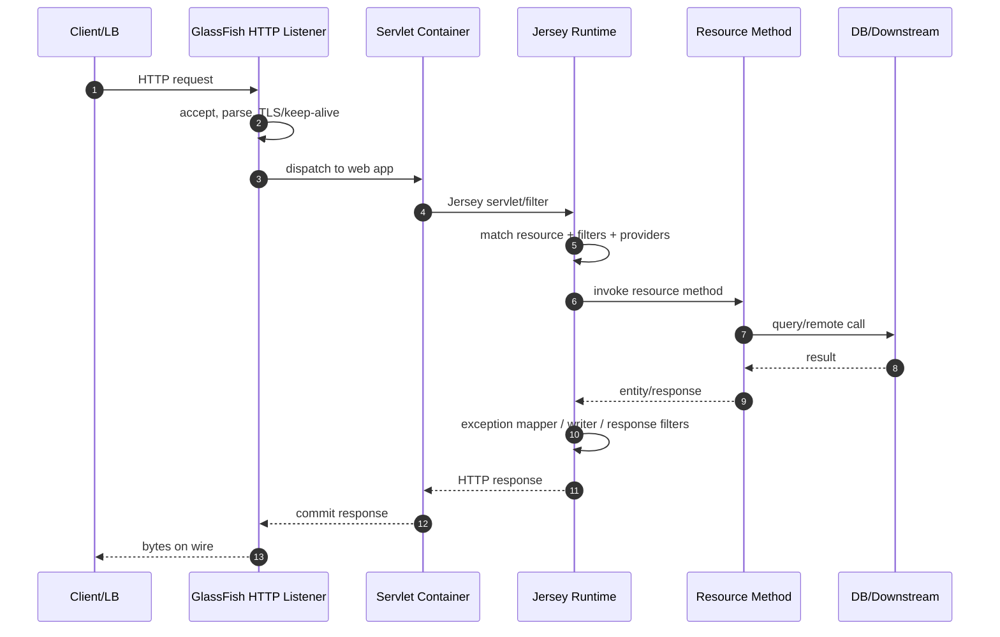
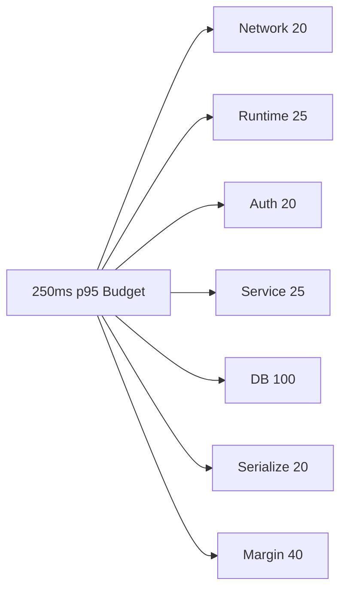
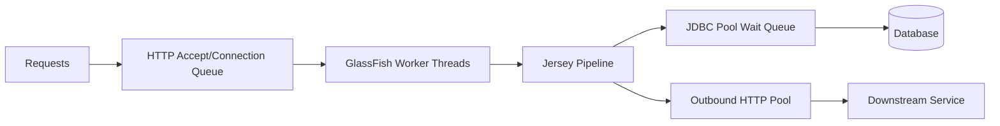
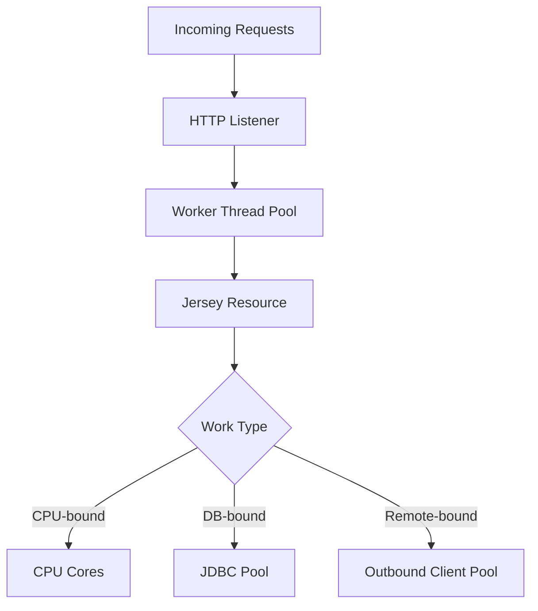
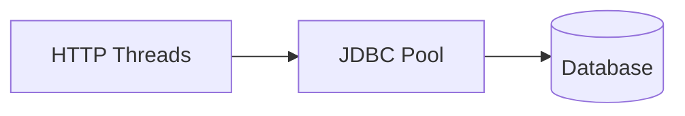
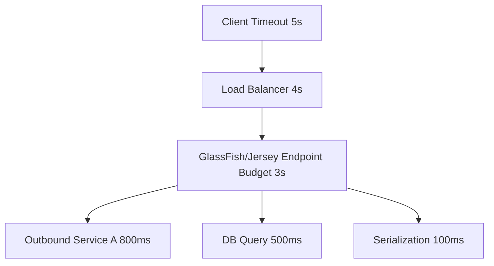

------
title: Learn Java Eclipse Jersey & GlassFish - Part 027
description: Performance engineering for Jersey applications on GlassFish: latency decomposition, request pipeline cost, serialization, thread pools, JDBC pools, GC, load testing, profiling, and production tuning discipline.
series: learn-java-jersey-glassfish
seriesTitle: Learn Java Eclipse Jersey & GlassFish
order: 27
partTitle: Performance Engineering Jersey on GlassFish
tags:
- java
- jersey
- glassfish
- jakarta-ee
- performance
- latency
- throughput
- profiling
- tuning
- production
- series
date: 2026-06-28
---

# Part 027 — Performance Engineering Jersey on GlassFish

> **Goal:** setelah bagian ini, kita bisa melakukan performance engineering Jersey di GlassFish dengan cara yang repeatable: memecah latency, menemukan bottleneck, mengatur thread/pool/timeout secara konsisten, memilih optimasi yang benar, dan membuktikan perubahan dengan evidence.

Performance engineering bukan aktivitas “membuat code cepat”. Dalam sistem Jersey + GlassFish, performa adalah hasil dari banyak boundary:

- client dan load balancer;
- network listener dan HTTP stack GlassFish;
- Servlet/Jersey dispatch;
- filter/interceptor/provider;
- serialization/deserialization;
- validation;
- business service;
- database/remote call;
- transaction manager;
- connection pools;
- thread pools;
- GC dan memory allocation;
- deployment topology.

Engineer top-tier tidak memulai tuning dari “ubah max thread pool jadi besar”. Ia mulai dari model antrian, evidence, bottleneck, dan constraint.

---

## 1. Kaufman Deconstruction

Menurut pendekatan Josh Kaufman, skill besar harus dipecah menjadi sub-skill kecil yang bisa dilatih. Untuk performance engineering Jersey + GlassFish, skill-nya bukan satu hal.

| Sub-skill | Pertanyaan yang Harus Bisa Dijawab |
|---|---|
| Latency decomposition | Di mana waktu request habis? |
| Capacity reasoning | Berapa request concurrent yang bisa dilayani sebelum saturasi? |
| Queueing model | Queue mana yang sedang membesar: HTTP thread, DB pool, outbound client, CPU, GC? |
| Runtime observability | Metrik/log/trace mana yang membuktikan bottleneck? |
| Tuning discipline | Parameter mana yang aman diubah dan apa rollback-nya? |
| Profiling | Method/object/lock mana yang benar-benar mahal? |
| Load testing | Apakah benchmark merepresentasikan production? |
| Failure modelling | Apa yang terjadi saat downstream lambat? |

Deliberate practice untuk bagian ini:

1. Ambil satu endpoint Jersey.
2. Tambahkan instrumentation minimal.
3. Jalankan load test kecil.
4. Pecah latency menjadi segment.
5. Ubah satu variabel.
6. Ukur ulang.
7. Dokumentasikan invariant dan limit.

---

## 2. Performance Mental Model

Request Jersey di GlassFish bukan fungsi tunggal. Ia melewati pipeline.



Performance issue bisa berada di mana saja. Karena itu, tuning harus berdasarkan decomposition, bukan tebakan.

---

## 3. Three Numbers That Matter

Untuk setiap endpoint production, minimal kita harus tahu:

| Number | Meaning | Kenapa Penting |
|---|---|---|
| p50 latency | Typical user experience | Menunjukkan baseline normal |
| p95/p99 latency | Tail behavior | Menunjukkan queue, GC, downstream, lock, pool exhaustion |
| Throughput under SLO | RPS yang masih memenuhi target latency | Menentukan capacity planning |

Average latency sering menipu. Dalam sistem web, user dan load balancer lebih sering merasakan tail latency.

Contoh:

| Metric | Value |
|---|---:|
| Average | 120 ms |
| p50 | 60 ms |
| p95 | 900 ms |
| p99 | 3000 ms |

Jika hanya melihat average, sistem tampak sehat. Jika melihat p99, sistem sudah punya queueing atau downstream stall.

---

## 4. Latency Budget

Kita perlu membagi budget latency secara eksplisit.

Misal target endpoint `GET /cases/{id}` adalah p95 <= 250 ms.

| Segment | Budget |
|---|---:|
| Edge/LB/network | 20 ms |
| GlassFish HTTP + Servlet dispatch | 10 ms |
| Jersey matching/filter/provider | 15 ms |
| Authorization | 20 ms |
| Business service | 25 ms |
| DB query | 100 ms |
| Serialization | 20 ms |
| Safety margin | 40 ms |
| **Total** | **250 ms** |

Jika DB p95 sudah 220 ms, tidak ada gunanya micro-optimize `MessageBodyWriter` lebih dulu.

Mermaid view:



---

## 5. Throughput Is Not Latency

Throughput dan latency berkaitan, tapi bukan hal yang sama.

- Throughput: berapa banyak request selesai per detik.
- Latency: berapa lama satu request butuh waktu.
- Concurrency: berapa request sedang aktif pada saat yang sama.

Approximation yang sangat berguna:

```text
concurrency ≈ throughput × latency
```

Jika endpoint menerima 200 RPS dan p95 latency 500 ms:

```text
concurrency ≈ 200 × 0.5 = 100 in-flight requests
```

Ini berarti minimal ada sekitar 100 request aktif di runtime pada kondisi tersebut. Jika request blocking dan semua butuh HTTP worker thread, thread pool harus dipahami dalam konteks ini.

---

## 6. Queueing Model

Sebagian besar performance incident adalah queueing incident.



Queue yang mungkin muncul:

| Queue | Gejala |
|---|---|
| HTTP accept/backlog | connection reset, timeout sebelum app log |
| HTTP worker thread | request lambat, thread dump banyak blocked/runnable |
| Jersey async executor | async response tertunda |
| JDBC pool wait | latency naik, DB tidak selalu penuh |
| DB internal queue | query lambat, lock wait |
| Outbound client pool | thread menunggu koneksi outbound |
| GC pause | semua request freeze sesaat |

Rule:

> Jangan memperbesar queue tanpa memahami service rate di belakangnya.

Menaikkan HTTP max threads saat DB pool kecil sering hanya memindahkan bottleneck ke DB pool wait.

---

## 7. Measurement Before Tuning

Sebelum tuning, kumpulkan baseline.

Minimal baseline:

| Area | Metric |
|---|---|
| Endpoint | RPS, p50, p95, p99, error rate |
| GlassFish | thread pool active/queued, request count, response status |
| Jersey | resource method stats, exception mapper count, provider cost jika tersedia |
| JDBC | active connections, wait count, wait time, leak detection |
| JVM | CPU, heap, GC pause, allocation rate, thread count |
| OS/container | CPU throttling, memory limit, file descriptor, network errors |
| Downstream | latency/error/timeouts |

Tanpa baseline, perubahan tuning tidak punya makna.

---

## 8. Jersey-Specific Cost Centers

Jersey runtime cost biasanya bukan bottleneck utama, tetapi bisa menjadi signifikan jika endpoint sangat ringan atau traffic tinggi.

| Cost Center | Penyebab Umum | Optimasi |
|---|---|---|
| Resource matching | banyak route ambiguous, regex berat | route eksplisit, hindari regex kompleks |
| Filters | auth/audit/logging berat | minimal work, cache metadata, jangan parse body tanpa perlu |
| Interceptors | compression/encryption/custom transformation | streaming-aware, ukur allocation |
| Providers | JSON serialize/deserialize, reflection | DTO ramping, provider config, avoid huge object graph |
| Validation | nested object besar | boundary validation, group selective |
| Exception mapping | error path logging/blocking | structured lightweight error |
| Entity buffering | membaca full body ke memory | streaming, limit size |

---

## 9. Serialization Performance

JSON serialization sering menjadi hidden bottleneck.

Contoh anti-pattern:

```java
@GET
@Path("/{id}")
@Produces(MediaType.APPLICATION_JSON)
public CaseEntity getCase(@PathParam("id") UUID id) {
    return caseRepository.findEntityGraph(id); // leaks persistence graph
}
```

Masalah:

- object graph terlalu besar;
- lazy relation dapat trigger query tambahan;
- field internal ikut keluar;
- serializer melakukan reflection pada graph dalam;
- circular reference risk;
- response contract tidak stabil.

Pattern yang lebih baik:

```java
public record CaseResponse(
        UUID id,
        String caseNumber,
        String status,
        Instant updatedAt,
        List<ActionSummary> actions
) {}

public record ActionSummary(
        UUID id,
        String type,
        Instant createdAt
) {}
```

Entity persistence bukan response DTO.

---

## 10. DTO Shape and Payload Size

Performance bukan hanya CPU server; payload size mempengaruhi:

- serialization time;
- memory allocation;
- network transfer;
- client parsing;
- cache behavior;
- mobile/low bandwidth user experience;
- log volume jika response dicatat.

Prinsip:

| Principle | Explanation |
|---|---|
| Explicit projection | Endpoint mengembalikan field yang memang dibutuhkan |
| Bounded collection | Jangan return collection tanpa limit |
| Summary/detail split | List endpoint jangan mengembalikan detail besar |
| Pagination mandatory | Semua unbounded list harus punya limit |
| Server-side filtering | Jangan kirim semua lalu filter di client |
| Avoid debug fields | Field debug jangan masuk response normal |

Contoh:

```java
@GET
public Page<CaseSummary> searchCases(@BeanParam CaseSearchQuery query) {
    return caseSearch.search(query.normalized());
}

@GET
@Path("/{id}")
public CaseDetail getCase(@PathParam("id") UUID id) {
    return caseQuery.detail(id);
}
```

---

## 11. Provider Selection Overhead

Jika banyak provider dan media type terlalu luas, selection cost dan ambiguity risk meningkat.

Bad:

```java
@Provider
@Produces("*/*")
public final class UniversalWriter implements MessageBodyWriter<Object> {
    // handles everything
}
```

Masalah:

- bisa menyaingi JSON provider;
- selection sulit diprediksi;
- error 500/406/415 sulit didiagnosis;
- bisa memperlambat matching provider.

Better:

```java
@Provider
@Produces("application/vnd.company.report+csv")
public final class CsvReportWriter implements MessageBodyWriter<ReportExport> {
    // narrow contract
}
```

Rule:

> Provider production harus sempit, deterministik, dan punya test seleksi media type.

---

## 12. Filter Performance

Filter berjalan pada banyak request. Operasi kecil di filter dapat menjadi mahal secara agregat.

Contoh anti-pattern:

```java
@Provider
@Priority(Priorities.AUTHENTICATION)
public final class AuthFilter implements ContainerRequestFilter {
    @Override
    public void filter(ContainerRequestContext ctx) throws IOException {
        String token = ctx.getHeaderString("Authorization");
        UserProfile profile = userService.loadFullProfile(token); // expensive
        ctx.setProperty("userProfile", profile);
    }
}
```

Lebih baik:

```java
public final class AuthIdentity {
    private final String subject;
    private final Set<String> scopes;
    private final String tenantId;
    // minimal immutable identity
}
```

Filter harus memproduksi identity minimal, bukan melakukan full business loading.

---

## 13. Logging Cost

Logging bisa menjadi performance bottleneck.

Kesalahan umum:

- log request/response body besar;
- stringify object mahal walaupun log level mati;
- synchronous appender blocking;
- log per item dalam loop;
- logging exception stack trace berulang untuk error expected;
- audit log bercampur dengan debug log.

Bad:

```java
log.info("response={}", hugeResponseObject);
```

Better:

```java
log.info("request completed method={} path={} status={} durationMs={} correlationId={}",
        method, pathTemplate, status, durationMs, correlationId);
```

Prinsip:

> Log harus membantu diagnosis tanpa mengubah latency profile secara signifikan.

---

## 14. GlassFish Thread Pool Model

GlassFish memiliki thread pools untuk memproses request dan task internal. Tuning thread pool tidak boleh dilakukan secara terpisah dari CPU, blocking ratio, DB pool, dan downstream capacity.

Conceptual model:



Jika work CPU-bound, terlalu banyak thread meningkatkan context switching.

Jika work blocking I/O-bound, jumlah thread perlu cukup untuk menutupi wait time, tetapi tidak boleh melampaui downstream capacity.

---

## 15. Thread Pool Tuning Heuristic

Heuristic awal:

| Workload | Thread Strategy |
|---|---|
| CPU-heavy JSON transform | dekat dengan jumlah core, ukur CPU saturation |
| DB-heavy blocking | align dengan JDBC pool dan DB capacity |
| Downstream-heavy blocking | align dengan outbound pool dan timeout |
| Mixed | mulai konservatif, ukur active/queued/wait |
| Async/SSE/long-poll | pisahkan executor/boundary, jangan tahan worker utama terlalu lama |

Anti-pattern:

```text
max-thread-pool-size = 1000
jdbc max-pool-size = 32
outbound timeout = 60s
```

Ini menciptakan banyak thread yang hanya menunggu DB/downstream. Tail latency naik, memory stack naik, GC pressure naik, incident lebih sulit.

---

## 16. JDBC Pool as Throughput Gate

Untuk endpoint yang menyentuh database, JDBC pool sering menjadi throughput gate.



Jika 200 HTTP thread bisa masuk tetapi JDBC pool hanya 32 connection, maka 168 request dapat menunggu pool.

Bukan berarti JDBC pool harus dinaikkan ke 200. Database mungkin tidak mampu menerima 200 query concurrent secara efisien.

Prinsip:

> JDBC pool adalah control valve. Ukur wait time, active count, DB CPU, DB lock wait, dan query latency sebelum menaikkan pool.

---

## 17. Pool Sizing by Endpoint Mix

Misal traffic:

| Endpoint | RPS | DB Time p95 | Connection Hold Time |
|---|---:|---:|---:|
| `GET /cases/{id}` | 100 | 40 ms | short |
| `GET /cases/search` | 30 | 180 ms | medium |
| `POST /cases` | 10 | 300 ms | medium |
| `GET /reports/export` | 2 | 5000 ms | dangerous |

Jika export memakai pool yang sama, dua request export panjang bisa mengurangi capacity endpoint penting.

Pattern:

- pisahkan pool untuk workload berat;
- batasi export concurrency;
- jadikan export async job;
- gunakan cursor/streaming dengan timeout ketat;
- hindari transaction panjang untuk response streaming.

---

## 18. Outbound Jersey Client Performance

Outbound call dapat menghancurkan latency jika tidak dibatasi.

Checklist:

| Concern | Practice |
|---|---|
| Client lifecycle | reuse `Client`, jangan create per request |
| Target | `WebTarget` immutable-ish, boleh reuse/configure carefully |
| Timeout | connect/read timeout eksplisit |
| Pooling | gunakan connector yang mendukung pooling jika perlu |
| Response | close/read response body |
| Retry | hanya untuk idempotent/known-safe operation |
| Bulkhead | pisahkan executor/pool per downstream kritis |
| Observability | log duration/status/error category |

Bad:

```java
public CaseScore score(CaseRequest request) {
    Client client = ClientBuilder.newClient(); // per request
    return client.target(scoreUrl)
            .request()
            .post(Entity.json(request), CaseScore.class);
}
```

Better:

```java
@ApplicationScoped
public class ScoreClient {
    private final Client client;
    private final WebTarget target;

    public ScoreClient() {
        this.client = ClientBuilder.newBuilder()
                .connectTimeout(300, TimeUnit.MILLISECONDS)
                .readTimeout(800, TimeUnit.MILLISECONDS)
                .build();
        this.target = client.target("https://score.internal/api/v1/scores");
    }

    public CaseScore score(CaseRequest request) {
        return target.request(MediaType.APPLICATION_JSON_TYPE)
                .post(Entity.json(request), CaseScore.class);
    }

    @PreDestroy
    void close() {
        client.close();
    }
}
```

---

## 19. Timeout as Performance Control

Timeout bukan hanya resilience. Timeout adalah performance control.

Tanpa timeout:

- thread bisa tertahan lama;
- pool connection tertahan;
- tail latency membesar;
- queue membesar;
- circuit breaker terlambat bereaksi;
- user menunggu sampai edge timeout.

Time budget harus menurun dari luar ke dalam.



Rule:

> Inner timeout harus lebih kecil dari outer timeout, agar aplikasi bisa mengembalikan error terkontrol sebelum edge memutus koneksi.

---

## 20. JVM and GC Performance

Jersey/GlassFish performance tidak lepas dari JVM.

Yang perlu diamati:

| Metric | Meaning |
|---|---|
| Heap used after GC | long-lived object growth |
| Allocation rate | pressure dari DTO/JSON/logging |
| GC pause p95/p99 | tail latency impact |
| Thread count | stack memory + scheduling overhead |
| CPU user/system | compute vs kernel/network cost |
| Safepoint pauses | freeze yang bukan selalu GC |

Anti-pattern:

- menaikkan heap tanpa melihat allocation source;
- menganggap semua pause adalah GC;
- benchmark tanpa warmup;
- load test di laptop lalu generalisasi ke production;
- tidak mengatur container memory dan JVM ergonomics dengan benar.

---

## 21. Allocation Hotspots

Endpoint cepat tapi high-RPS bisa bermasalah karena allocation.

Sumber allocation:

- JSON parse/write;
- mapping entity → DTO;
- validation object graph;
- logging string;
- regex path/header parsing;
- creating `Client`/formatter/parser per request;
- buffering request/response body;
- large collections before pagination.

Example improvement:

```java
private static final DateTimeFormatter FORMATTER = DateTimeFormatter.ISO_OFFSET_DATE_TIME;
```

Jangan create formatter/parser mahal per request jika bisa immutable dan reusable.

Tetapi jangan prematur optimasi object kecil sebelum evidence profiler.

---

## 22. Profiling Discipline

Profiling harus menjawab pertanyaan spesifik.

Pertanyaan buruk:

> Kenapa aplikasi lambat?

Pertanyaan baik:

> Pada load 300 RPS, kenapa p99 `GET /cases/search` naik dari 250 ms ke 2 s setelah 10 menit?

Profiling workflow:

1. Reproduksi dengan load yang mirip production.
2. Capture CPU profile.
3. Capture allocation profile.
4. Capture thread dump saat p99 naik.
5. Correlate dengan metrics pool/GC/downstream.
6. Ubah satu hal.
7. Validate ulang.

---

## 23. Thread Dump Reading for Performance

Thread dump membantu membedakan:

| Thread State Pattern | Interpretasi |
|---|---|
| banyak `RUNNABLE` di JSON serializer | CPU serialization bottleneck |
| banyak `WAITING` pada JDBC pool | pool exhaustion / DB slow |
| banyak `BLOCKED` pada lock yang sama | synchronization contention |
| banyak thread di outbound HTTP read | downstream slow / timeout too high |
| request thread idle tapi latency tinggi | bottleneck di edge/network/downstream async |

Contoh suspicious stack:

```text
http-thread-pool::http-listener-1(42)
  WAITING on com.sun.gjc.spi.ManagedConnectionFactory
  at java.lang.Object.wait
  at ... PoolManager.getResource
  at ... DataSource.getConnection
```

Ini bukan masalah Jersey dispatch. Ini pool wait.

---

## 24. Load Testing Model

Load test harus menjawab capacity question.

Jenis test:

| Test | Goal |
|---|---|
| Smoke performance | endpoint hidup dan metrik keluar |
| Baseline | normal capacity awal |
| Step load | cari titik saturasi |
| Soak test | memory leak, pool leak, GC drift |
| Spike test | burst behavior |
| Stress test | failure behavior beyond capacity |
| Resilience test | downstream slow/fail |

Jangan hanya menjalankan `ab -n 1000 -c 100` dan menyebutnya benchmark.

---

## 25. Representative Workload

Load test harus mencerminkan:

- endpoint mix;
- payload size;
- auth behavior;
- data distribution;
- cache hit/miss;
- DB volume;
- downstream latency;
- tenant distribution;
- error rate;
- think time;
- connection reuse.

Contoh workload buruk:

```text
100% GET /health
```

Contoh workload lebih baik:

```text
45% GET /cases/{id}
25% GET /cases/search
10% POST /cases
10% PATCH /cases/{id}/status
5% GET /cases/{id}/events
5% export/report trigger
```

---

## 26. Performance Test Environment

Environment harus cukup mirip untuk menghasilkan insight.

| Concern | Why It Matters |
|---|---|
| CPU limit | container throttling mengubah latency |
| Memory limit | GC behavior berubah |
| DB size | query plan berubah |
| Network distance | downstream latency berubah |
| TLS/proxy | edge overhead berubah |
| Logging config | prod logging bisa lebih mahal |
| Monitoring agents | overhead realistis |
| JVM version | GC/JIT behavior berubah |

Benchmark di local tetap berguna untuk micro exploration, tapi tidak cukup untuk production capacity.

---

## 27. Tuning Order

Urutan tuning yang sehat:

1. Definisikan SLO dan workload.
2. Instrument endpoint.
3. Ukur baseline.
4. Temukan bottleneck utama.
5. Hilangkan obvious waste.
6. Tune pool/timeout secara konsisten.
7. Profile CPU/allocation jika runtime CPU-bound.
8. Optimize query/serialization/provider/filter.
9. Validate dengan load test.
10. Dokumentasikan limit dan rollback.

Urutan yang salah:

1. Naikkan thread pool.
2. Naikkan JDBC pool.
3. Naikkan heap.
4. Disable logging.
5. Semoga selesai.

---

## 28. Endpoint Performance Taxonomy

Klasifikasikan endpoint.

| Type | Dominant Cost | Strategy |
|---|---|---|
| Lookup | DB/index/cache | projection, index, cache, small DTO |
| Search | DB query + pagination | bounded query, cursor/page, timeout |
| Mutation | transaction + validation | short transaction, idempotency, async side effects |
| Export | large payload + long running | async job or streaming with limits |
| Aggregation | multiple downstream calls | timeout budget, parallelism, bulkhead |
| Realtime stream | connection lifetime | SSE heartbeat, connection cap |
| Admin | heavy but rare | isolate, protect, audit |

Tidak semua endpoint harus dituning dengan cara sama.

---

## 29. Caching Decision Model

Caching bisa meningkatkan performa atau merusak correctness.

Pertanyaan sebelum caching:

| Question | Why |
|---|---|
| Apa key-nya? | key salah menghasilkan data salah |
| Apa invalidation rule? | stale data risk |
| Apa tenant/security boundary? | data leak risk |
| Apa TTL? | consistency vs performance |
| Apa fallback jika cache down? | resilience |
| Apa memory budget? | heap pressure |
| Apa observability? | hit ratio dan eviction |

Pattern aman:

- cache reference data yang jarang berubah;
- cache permission metadata dengan TTL pendek;
- cache external lookup idempotent;
- hindari cache entity mutable kompleks tanpa invalidation jelas.

---

## 30. Compression Trade-Off

Compression mengurangi network bytes tetapi menambah CPU.

Gunakan saat:

- payload besar;
- network bandwidth menjadi bottleneck;
- client mendukung compression;
- CPU masih punya headroom.

Hindari/waspadai saat:

- payload kecil;
- CPU sudah tinggi;
- response streaming latency-sensitive;
- data sudah compressed;
- security concern terkait compression side-channel untuk secret-bearing response.

---

## 31. HTTP Keep-Alive and Connection Reuse

Keep-alive mengurangi handshake overhead, terutama dengan TLS.

Namun connection reuse harus disetel bersama:

- load balancer idle timeout;
- GlassFish listener keep-alive;
- client pool idle eviction;
- deployment rolling restart behavior;
- backend readiness/drain.

Mismatch timeout bisa menyebabkan intermittent reset.

---

## 32. GlassFish Monitoring for Performance

Gunakan monitoring untuk melihat apakah bottleneck di server.

Metrics yang dicari:

- request count;
- error count;
- response time distribution jika tersedia;
- thread pool active/current/queued;
- JDBC pool numconnused/numconnfree/wait count;
- JVM heap/GC;
- classloader/resource stats;
- HTTP listener stats.

Contoh command pattern:

```bash
asadmin set server-config.monitoring-service.module-monitoring-levels.thread-pool=HIGH
asadmin set server-config.monitoring-service.module-monitoring-levels.jdbc-connection-pool=HIGH
asadmin get --monitor=true 'server.*'
```

Sesuaikan target config/instance sesuai domain topology.

---

## 33. Jersey Monitoring and Tracing

Jersey menyediakan extension untuk event listener, monitoring statistics, dan tracing. Ini berguna untuk melihat resource matching, filter/provider behavior, dan lifecycle event.

Gunakan untuk:

- mencari hotspot resource;
- debug provider selection;
- mengukur request lifecycle;
- menemukan filter/interceptor mahal;
- memahami request matching.

Hati-hati:

- tracing detail dapat menambah overhead;
- jangan expose tracing ke user publik;
- aktifkan secara selektif di environment aman;
- gunakan correlation ID.

---

## 34. Performance Anti-Patterns

| Anti-pattern | Dampak |
|---|---|
| Create Jersey `Client` per request | connection leak/CPU/TLS overhead |
| Return JPA entity directly | large graph, lazy load, unstable contract |
| Unbounded list endpoint | memory blowup, latency spike |
| Global catch-all logging stack trace | log storm |
| Large synchronous audit write | every request blocked |
| Thread pool huge, DB pool small | queue shift, p99 explosion |
| No timeout on outbound call | stuck threads |
| Buffer full upload/download in memory | OOM risk |
| Benchmark without realistic data | false confidence |
| Tune by folklore | changes without evidence |

---

## 35. Example: Diagnosing p99 Spike

Symptom:

```text
GET /cases/search
p50 = 90 ms
p95 = 400 ms
p99 = 4500 ms
error = low
CPU = 45%
```

Observation:

- HTTP threads active high;
- JDBC pool wait count rising;
- DB CPU 35%;
- query p95 120 ms;
- some requests hold connection for 3s;
- thread dump shows export endpoint holding connection while streaming.

Root cause:

> Long-running export endpoint uses same JDBC pool and holds connection during response streaming.

Fix:

- move export to async job; or
- separate export pool with small max; or
- materialize export snapshot then release DB connection before streaming; and
- add endpoint concurrency limit.

Do not fix by simply increasing HTTP thread pool.

---

## 36. Example: Serialization Hotspot

Symptom:

```text
GET /cases/{id}
p95 = 700 ms
DB p95 = 35 ms
CPU = 90%
GC allocation high
```

Profile:

- JSON serializer dominant;
- response includes full nested history;
- entity graph includes comments, attachments metadata, workflow transitions.

Fix:

- introduce explicit `CaseDetailResponse`;
- split history endpoint;
- limit nested collections;
- avoid serializing null/default debug fields;
- add representation test with payload size threshold.

---

## 37. Example: Filter Hotspot

Symptom:

```text
All endpoints increased by 30ms after new security feature.
```

Analysis:

- auth filter calls user profile service on every request;
- profile service p95 40 ms;
- many endpoints need only subject + scopes.

Fix:

- token contains subject/scopes/tenant;
- filter validates token and builds minimal identity;
- resource/service loads profile only when needed;
- cache JWKS/metadata safely.

---

## 38. Performance Checklist Before Release

| Check | Done? |
|---|---|
| SLO defined for critical endpoints |  |
| Endpoint mix known |  |
| p50/p95/p99 measured |  |
| Error rate measured under load |  |
| Timeout budget documented |  |
| HTTP/JDBC/outbound pool aligned |  |
| No unbounded list endpoint |  |
| Response payload size measured |  |
| No per-request Jersey Client creation |  |
| DB queries explain-analyzed |  |
| Thread dump captured under load |  |
| GC logs/metrics available |  |
| Log volume measured |  |
| Load test reproducible |  |
| Rollback plan documented |  |

---

## 39. Practical Lab

Build a mini benchmark app with three endpoints:

```java
@Path("/perf")
public class PerformanceResource {

    @GET
    @Path("/cpu")
    public CpuResponse cpu(@QueryParam("n") @DefaultValue("1000") int n) {
        return cpuService.calculate(n);
    }

    @GET
    @Path("/db")
    public DbResponse db(@QueryParam("delayMs") @DefaultValue("50") int delayMs) {
        return dbService.queryWithDelay(delayMs);
    }

    @GET
    @Path("/json")
    public BigResponse json(@QueryParam("items") @DefaultValue("100") int items) {
        return responseFactory.big(items);
    }
}
```

Run experiments:

1. Increase `items`; observe serialization and payload size.
2. Increase DB delay; observe JDBC pool wait.
3. Increase concurrency; observe HTTP thread pool.
4. Add expensive filter; observe all endpoints shift.
5. Add timeout; observe error becomes controlled.

Output expected:

- latency table;
- pool metrics;
- thread dump notes;
- tuning decision.

---

## 40. Engineering Invariants

Keep these invariants:

1. Performance without SLO is vague.
2. Average latency is not enough.
3. Every queue needs a capacity and timeout story.
4. More threads are not automatically more throughput.
5. JDBC pool size is a capacity control, not a magic speed knob.
6. Payload shape is a performance decision.
7. Serialization and logging are production costs.
8. Reuse Jersey Client; close responses.
9. Tune from evidence, not folklore.
10. Every performance change needs rollback.

---

## 41. References

- Eclipse GlassFish Performance Tuning Guide, Release 8.
- Eclipse GlassFish Administration Guide.
- Eclipse Jersey User Guide: Monitoring and Tracing.
- Jersey Client API documentation.
- Jakarta RESTful Web Services 4.0 Specification.
- Jakarta EE Platform 11 Specification.

---

## 42. What Comes Next

Part 028 moves from performance to resilience. Performance asks:

> How fast can the system respond under expected conditions?

Resilience asks:

> What happens when expected conditions are violated?

The next part will connect timeout, bulkhead, circuit breaker, fallback, retry, rate limiting, and backpressure into one consistent runtime model for Jersey on GlassFish.
