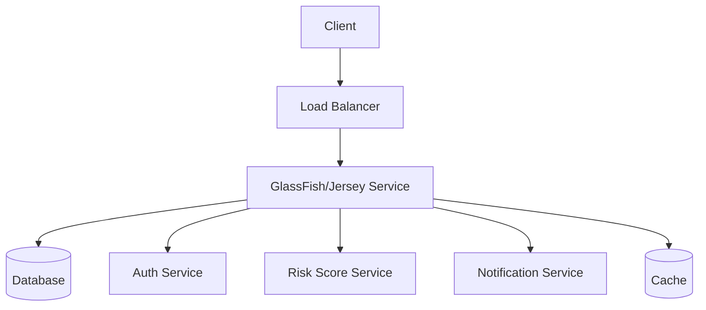
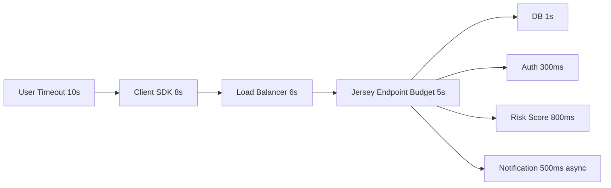
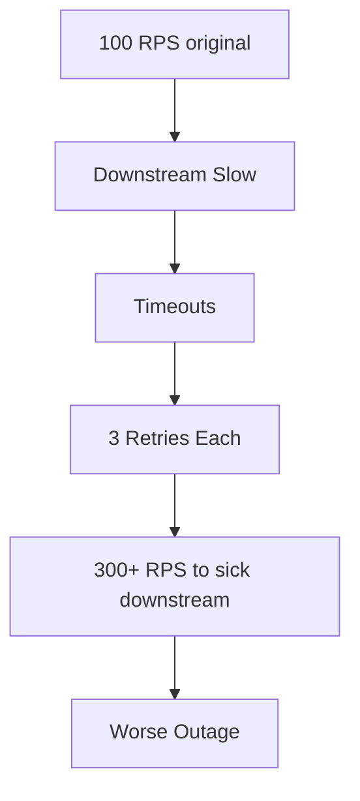
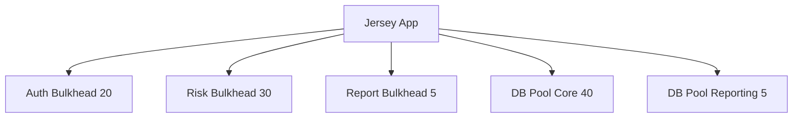
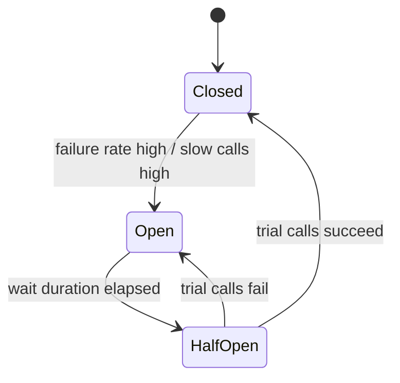
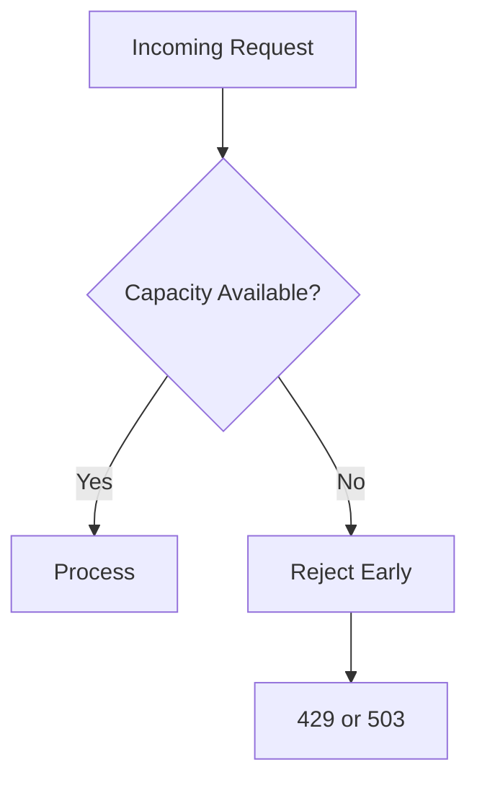
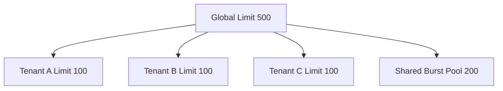

------
title: Learn Java Eclipse Jersey & GlassFish - Part 028
description: Resilience patterns for Jersey applications on GlassFish: timeout budget, retry discipline, bulkhead, circuit breaker, backpressure, graceful degradation, load shedding, and failure-mode engineering.
series: learn-java-jersey-glassfish
seriesTitle: Learn Java Eclipse Jersey & GlassFish
order: 28
partTitle: Resilience Patterns: Timeout, Bulkhead, Circuit Breaker, Backpressure
tags:
- java
- jersey
- glassfish
- jakarta-ee
- resilience
- timeout
- bulkhead
- circuit-breaker
- backpressure
- production
- series
date: 2026-06-28
---

# Part 028 — Resilience Patterns: Timeout, Bulkhead, Circuit Breaker, Backpressure

> **Goal:** setelah bagian ini, kita bisa mendesain Jersey + GlassFish service yang tetap defensible saat database lambat, downstream rusak, traffic melonjak, client lambat, deployment rolling, atau dependency partial outage. Fokusnya bukan “menambahkan library resilience”, tetapi memahami failure containment sebagai arsitektur runtime.

Performance engineering bertanya:

> Seberapa cepat sistem bekerja ketika semua komponen relatif sehat?

Resilience engineering bertanya:

> Apa yang terjadi ketika sebagian komponen tidak sehat?

Sistem Jersey + GlassFish production harus mampu:

- membatasi waktu tunggu;
- membatasi concurrency;
- membatasi blast radius;
- menolak request secara terkontrol saat overload;
- menghindari retry storm;
- memberi error contract yang konsisten;
- mempertahankan observability saat incident;
- pulih tanpa restart besar.

---

## 1. Kaufman Deconstruction

Skill resilience dipecah menjadi beberapa sub-skill.

| Sub-skill | Output yang Diharapkan |
|---|---|
| Timeout design | timeout budget per boundary |
| Retry design | retry hanya ketika aman dan bounded |
| Bulkhead design | dependency failure tidak menjatuhkan semua endpoint |
| Circuit breaker | downstream failure cepat dikenali dan dibatasi |
| Backpressure | overload tidak menjadi memory/thread explosion |
| Load shedding | request ditolak lebih awal dengan error contract jelas |
| Fallback | response degradasi tetap benar secara domain |
| Failure-mode testing | chaos/fault test dengan expected behavior |

Kita tidak ingin hanya hafal pattern. Kita ingin bisa menjawab:

> Jika service X lambat selama 10 menit, request mana yang gagal, mana yang tetap hidup, berapa thread tertahan, error apa yang keluar, alert mana yang menyala, dan bagaimana sistem pulih?

---

## 2. Resilience Mental Model

Runtime production adalah graph dependency.



Setiap edge harus punya:

- timeout;
- concurrency limit;
- error classification;
- retry policy;
- fallback decision;
- observability;
- owner/runbook.

Jika satu edge tidak punya batas, ia bisa menarik seluruh service ke bawah.

---

## 3. Failure Taxonomy

Tidak semua failure sama.

| Failure | Example | Strategy |
|---|---|---|
| Fast failure | 400/401/403/404 | jangan retry |
| Transient network | connect reset, timeout pendek | retry terbatas jika idempotent |
| Slow dependency | DB/downstream p95 naik | timeout, bulkhead, circuit breaker |
| Overload | queue penuh, pool exhausted | load shedding/backpressure |
| Partial outage | satu dependency mati | fallback/degraded response |
| Data conflict | optimistic lock, duplicate key | domain error, maybe client retry |
| Bad request | validation failure | 400, no retry |
| Auth failure | invalid token | 401/403, no retry |
| Rate limit | 429 | client retry after policy |
| Deployment transient | 503 during rollout | retry with jitter at caller side |

Resilience buruk terjadi saat semua error diperlakukan sebagai “500, coba lagi”.

---

## 4. Timeout Budget

Timeout adalah resilience primitive paling penting.



Rule:

> Timeout luar harus lebih besar dari timeout dalam agar layer dalam punya kesempatan mengembalikan response terkontrol.

Jika load balancer timeout 5 detik tetapi aplikasi menunggu downstream 10 detik, client melihat edge timeout, sementara aplikasi tetap membakar thread sampai 10 detik.

---

## 5. Timeout Types

| Timeout | Boundary | Meaning |
|---|---|---|
| Connect timeout | client → server | waktu membangun koneksi |
| Read timeout | client menunggu response | waktu menunggu data setelah request terkirim |
| Request budget | keseluruhan operation | deadline total business operation |
| Pool wait timeout | thread menunggu connection/resource | waktu menunggu resource pool |
| Transaction timeout | DB/JTA transaction | batas durasi transaction |
| Idle timeout | connection idle | koneksi ditutup setelah idle |
| Async response timeout | suspended response | batas response async |
| Load balancer timeout | edge/proxy | batas request di edge |

Timeout harus konsisten. Satu timeout panjang bisa mengalahkan semua proteksi lain.

---

## 6. Jersey Client Timeout Pattern

Jersey client harus selalu punya timeout eksplisit.

```java
@ApplicationScoped
public class RiskScoreClient {
    private final Client client;
    private final WebTarget target;

    public RiskScoreClient() {
        this.client = ClientBuilder.newBuilder()
                .connectTimeout(200, TimeUnit.MILLISECONDS)
                .readTimeout(800, TimeUnit.MILLISECONDS)
                .build();
        this.target = client.target("https://risk.internal/api/v1/score");
    }

    public RiskScore score(ScoreRequest request) {
        return target.request(MediaType.APPLICATION_JSON_TYPE)
                .post(Entity.json(request), RiskScore.class);
    }

    @PreDestroy
    void close() {
        client.close();
    }
}
```

Do not:

```java
ClientBuilder.newClient(); // no timeout, no lifecycle owner
```

---

## 7. Deadline Propagation

Timeout per client call tidak cukup jika operation memiliki banyak step.

```java
public final class Deadline {
    private final long deadlineNanos;

    private Deadline(long deadlineNanos) {
        this.deadlineNanos = deadlineNanos;
    }

    public static Deadline after(Duration duration) {
        return new Deadline(System.nanoTime() + duration.toNanos());
    }

    public Duration remaining() {
        long remaining = deadlineNanos - System.nanoTime();
        return Duration.ofNanos(Math.max(0, remaining));
    }

    public boolean expired() {
        return remaining().isZero();
    }
}
```

Usage:

```java
public CaseDecision decide(CaseRequest request) {
    Deadline deadline = Deadline.after(Duration.ofSeconds(3));

    AuthDecision auth = authClient.check(request, deadline.remaining());
    if (deadline.expired()) {
        throw new ServiceUnavailableException("deadline_exceeded");
    }

    RiskScore score = riskClient.score(request, min(deadline.remaining(), Duration.ofMillis(800)));
    return decisionEngine.decide(auth, score);
}
```

Pattern ini mencegah total time melebihi budget walaupun tiap call punya timeout masing-masing.

---

## 8. Retry Discipline

Retry bisa menyelamatkan transient failure, atau menghancurkan sistem.

Retry hanya aman jika:

- operation idempotent atau punya idempotency key;
- failure kemungkinan transient;
- retry count kecil;
- ada backoff + jitter;
- timeout total tetap dibatasi;
- downstream tidak sedang overload parah;
- error classification jelas.

Do not retry:

- validation error;
- auth error;
- permission denied;
- domain conflict tanpa policy;
- non-idempotent POST tanpa idempotency key;
- request yang sudah melewati deadline.

---

## 9. Retry Storm

Retry storm terjadi saat client menambah beban ke dependency yang sedang sakit.



Mitigasi:

- retry count kecil;
- exponential backoff;
- jitter;
- circuit breaker;
- retry budget;
- idempotency key;
- respect `Retry-After`;
- fail fast saat overload.

---

## 10. Idempotency Key for Mutations

Mutation endpoint harus hati-hati.

Example:

```java
@POST
@Path("/cases")
public Response createCase(
        @HeaderParam("Idempotency-Key") String idempotencyKey,
        CreateCaseRequest request) {
    CaseCreated result = commandService.create(idempotencyKey, request);
    return Response.status(Response.Status.CREATED).entity(result).build();
}
```

Server stores:

| Key | Request Hash | Result | Status |
|---|---|---|---|
| `abc-123` | hash1 | case id | completed |

Rules:

- same key + same request returns same result;
- same key + different request returns conflict;
- key expires after policy;
- operation must be transactionally recorded.

Dengan ini, client bisa retry POST tertentu tanpa double-create.

---

## 11. Bulkhead Pattern

Bulkhead membatasi kerusakan agar satu dependency tidak menghabiskan semua resource.



Bulkhead bisa berupa:

- separate thread pool;
- separate JDBC pool;
- semaphore/concurrency limit;
- separate Jersey Client connector/pool;
- separate deployment/service;
- endpoint-level rate limit.

Rule:

> Workload berat dan tidak kritis tidak boleh memakai resource pool yang sama tanpa limit dengan workload kritis.

---

## 12. Bulkhead with Semaphore

Contoh simple concurrency limit untuk dependency.

```java
@ApplicationScoped
public class RiskScoreGateway {
    private final Semaphore permits = new Semaphore(30);
    private final RiskScoreClient client;

    public RiskScoreGateway(RiskScoreClient client) {
        this.client = client;
    }

    public RiskScore score(ScoreRequest request) {
        boolean acquired = permits.tryAcquire();
        if (!acquired) {
            throw new ServiceUnavailableException("risk_score_bulkhead_full");
        }
        try {
            return client.score(request);
        } finally {
            permits.release();
        }
    }
}
```

Ini lebih baik daripada membiarkan 500 request menunggu downstream yang sama.

Enhancement:

- acquire timeout kecil;
- metrics active/rejected;
- fallback untuk optional dependency;
- per-tenant fairness jika multi-tenant.

---

## 13. Circuit Breaker Model

Circuit breaker mencegah terus memanggil dependency yang sedang gagal.

States:



Meaning:

| State | Behavior |
|---|---|
| Closed | call dependency normally |
| Open | fail fast / fallback |
| Half-open | allow limited trial calls |

Circuit breaker harus berbasis rolling window, bukan satu error langsung open kecuali dependency sangat kritis dan error catastrophic.

---

## 14. Circuit Breaker Placement

Tempatkan circuit breaker di boundary gateway/client, bukan di resource method secara sporadis.

Bad:

```java
@Path("/cases")
public class CaseResource {
    @GET
    public CaseResponse get() {
        // circuit breaker logic inline here
    }
}
```

Better:

```java
@ApplicationScoped
public class RiskScoreGateway {
    public RiskScore score(ScoreRequest request) {
        return breaker.executeSupplier(() -> riskScoreClient.score(request));
    }
}
```

Resource method tetap bersih sebagai API adapter. Resilience policy hidup di dependency boundary.

---

## 15. Circuit Breaker Is Not Timeout

Circuit breaker tidak menggantikan timeout.

Tanpa timeout, call bisa menggantung lama sebelum dihitung gagal. Circuit breaker bereaksi terlambat.

Stack yang benar:

```text
Timeout -> Bulkhead -> Circuit Breaker -> Retry? -> Client Call
```

Atau dalam beberapa library, komposisinya eksplisit:

```text
Bulkhead protects concurrency
Timeout bounds duration
Circuit breaker observes outcomes
Retry repeats only safe failures within budget
```

---

## 16. Fallback Decision Model

Fallback tidak selalu benar.

| Dependency | Fallback Aman? | Example |
|---|---|---|
| Recommendation | Ya | return empty recommendations |
| Notification | Ya, async retry | queue later |
| Risk score | Tergantung domain | manual review instead of auto-approve |
| Authorization | Biasanya tidak | fail closed |
| Payment | Biasanya tidak | do not assume success |
| Identity | Biasanya tidak | fail closed |
| Reporting | Ya | show stale/partial data with label |

Rule:

> Fallback harus benar secara domain, bukan hanya membuat error hilang.

---

## 17. Fail Open vs Fail Closed

Security dan compliance sering membutuhkan fail closed.

| Area | Default Failure Mode |
|---|---|
| Authentication | fail closed |
| Authorization | fail closed |
| Tenant resolution | fail closed |
| Audit write | fail according to regulation; often block critical mutations or queue durably |
| Notification | fail open with durable retry if not part of transaction |
| Analytics | fail open |
| Recommendation | fail open |
| Risk scoring | domain-specific; often degrade to manual review |

For regulatory systems, “service unavailable” can be safer than silent inconsistent decision.

---

## 18. Backpressure

Backpressure berarti sistem memberi sinyal bahwa ia tidak mampu menerima lebih banyak work pada rate saat ini.

Tanpa backpressure:

- request menumpuk;
- memory naik;
- thread habis;
- queue latency naik;
- health check mungkin tetap hijau sampai terlambat;
- recovery lebih lambat.

Backpressure techniques:

| Technique | Boundary |
|---|---|
| bounded queue | executor/job queue |
| semaphore limit | dependency call |
| pool wait timeout | JDBC/outbound pool |
| rate limit | per client/tenant/endpoint |
| 429 response | caller should slow down |
| 503 response | temporary service overload |
| load balancer outlier ejection | bad instance removed |
| Kubernetes readiness false | stop new traffic |

---

## 19. Load Shedding

Load shedding menolak request lebih awal untuk menjaga sistem tetap hidup.



Kapan pakai 429:

- client/tenant terlalu banyak request;
- quota/rate limit tercapai;
- caller bisa retry setelah delay.

Kapan pakai 503:

- service overload global;
- dependency critical unavailable;
- maintenance/deployment transient.

Tambahkan `Retry-After` jika retry diharapkan.

---

## 20. Jersey Filter for Overload Protection

Contoh sederhana global concurrency guard.

```java
@Provider
@Priority(Priorities.AUTHENTICATION - 100)
public class OverloadProtectionFilter implements ContainerRequestFilter, ContainerResponseFilter {
    private final Semaphore permits = new Semaphore(200);

    @Override
    public void filter(ContainerRequestContext requestContext) throws IOException {
        if (!permits.tryAcquire()) {
            requestContext.abortWith(Response.status(503)
                    .header("Retry-After", "1")
                    .entity(new ErrorResponse("service_overloaded", "Service is overloaded"))
                    .build());
            return;
        }
        requestContext.setProperty("overloadPermitAcquired", Boolean.TRUE);
    }

    @Override
    public void filter(ContainerRequestContext requestContext,
                       ContainerResponseContext responseContext) throws IOException {
        if (Boolean.TRUE.equals(requestContext.getProperty("overloadPermitAcquired"))) {
            permits.release();
        }
    }
}
```

Production note:

- handle exception path carefully;
- avoid releasing permit twice;
- expose metrics;
- use per-endpoint/per-tenant limits if needed;
- async responses require lifecycle-aware release strategy.

---

## 21. Rate Limiting

Rate limit protects fairness and capacity.

Dimensions:

| Dimension | Example |
|---|---|
| Consumer | API key/client id |
| Tenant | tenant id |
| User | subject id |
| Endpoint | `/reports/export` |
| Method | POST more restricted than GET |
| Cost unit | one export = 100 normal requests |

Responses:

```text
HTTP/1.1 429 Too Many Requests
Retry-After: 30
Content-Type: application/problem+json
```

Rate limiting in Jersey can be implemented in a filter, but distributed rate limiting often needs shared state or gateway support.

---

## 22. Slow Client Protection

Slow clients can hold server resources.

Risks:

- streaming response thread held;
- output buffer pressure;
- connection slot consumption;
- long-running export tied to DB connection;
- SSE connection explosion.

Mitigation:

- connection idle timeout;
- max response size;
- async job for export;
- separate endpoint limits;
- SSE heartbeat and max connection count;
- release DB connection before streaming if possible;
- reverse proxy buffering strategy understood.

---

## 23. Database Resilience

Database failure modes:

| Failure | Symptom | Strategy |
|---|---|---|
| Pool exhausted | wait timeout | tune pool, reduce hold time, bulkhead |
| Query slow | p95/p99 high | index/query plan, timeout |
| Lock contention | transactions wait | shorter transaction, isolation review |
| DB down | connection failure | fail fast, circuit breaker-ish DB health |
| Deadlock | exception | retry only safe transaction |
| Replica lag | stale reads | consistency policy |

Do not use one giant transaction around remote calls.

Bad:

```java
@Transactional
public Decision decide(Request request) {
    CaseEntity entity = repository.load(request.caseId());
    RiskScore score = riskClient.score(request); // remote call inside transaction
    entity.apply(score);
    return mapper.toResponse(entity);
}
```

Better:

- load minimal data;
- release transaction;
- call remote dependency;
- start short transaction to commit decision;
- handle conflict with optimistic locking.

---

## 24. Transaction Timeout

Transaction timeout should be shorter than user-visible timeout and aligned with DB behavior.

If transaction timeout is 60s but request budget is 3s:

- request may fail at edge;
- transaction may continue;
- locks may remain longer;
- user sees unknown result;
- retry can cause conflict.

Design:

| Operation | Transaction Budget |
|---|---:|
| simple lookup | no transaction or read-only short |
| mutation | 500 ms - 2 s typical target |
| batch import | async job transaction chunks |
| export | avoid long transaction while streaming |

---

## 25. Async and Queue Resilience

Async job queues need bounds.

Bad:

```java
executor.submit(() -> heavyWork(request)); // unbounded queue hidden in executor
```

Better:

```java
ThreadPoolExecutor executor = new ThreadPoolExecutor(
        10,
        20,
        30, TimeUnit.SECONDS,
        new ArrayBlockingQueue<>(100),
        new ThreadPoolExecutor.AbortPolicy()
);
```

Then map rejection:

```java
try {
    executor.execute(task);
} catch (RejectedExecutionException e) {
    throw new ServiceUnavailableException("work_queue_full");
}
```

Every queue must have:

- max size;
- rejection policy;
- metrics;
- drain behavior;
- retry/dead-letter strategy if durable.

---

## 26. SSE Resilience

SSE endpoints are long-lived.

Failure concerns:

- client disconnect;
- connection count explosion;
- heartbeat missing;
- idle timeout mismatch;
- event producer overload;
- slow consumer;
- deployment drain.

Design:

| Concern | Practice |
|---|---|
| Max connection | limit per node/tenant/user |
| Heartbeat | send periodic comment/event |
| Replay | use event id if domain requires replay |
| Buffer | bounded per client |
| Slow consumer | disconnect or drop non-critical events |
| Shutdown | stop accepting, close/drain connections |

---

## 27. Health Checks and Readiness

Health is not one boolean.

| Check | Meaning | Use |
|---|---|---|
| Liveness | process should be restarted if false | detect dead process |
| Readiness | instance can accept traffic | rollout/load balancing |
| Startup | app is still starting | avoid premature kill |
| Dependency health | DB/downstream status | diagnostics, sometimes readiness |
| Degraded health | service works with reduced capability | alerting/routing |

A service should not mark itself unready for every optional dependency failure. Otherwise optional outage can remove all instances and create larger outage.

---

## 28. Graceful Shutdown

During deployment or node termination:

1. Stop accepting new traffic.
2. Mark readiness false.
3. Let load balancer drain.
4. Finish in-flight requests within grace period.
5. Stop SSE/async jobs safely.
6. Close Jersey clients.
7. Release resources.
8. Shutdown GlassFish instance.

If shutdown is not graceful, clients see resets and may retry, creating traffic spikes during deployment.

---

## 29. Error Contract for Resilience

Resilience failure must map to stable response.

Example:

```json
{
  "type": "https://errors.example.com/service-unavailable",
  "title": "Service temporarily unavailable",
  "status": 503,
  "code": "risk_score_unavailable",
  "correlationId": "01HX...",
  "retryable": true
}
```

Guidelines:

| Failure | Status | Retryable |
|---|---:|---|
| bulkhead full | 503 | yes, with backoff |
| rate limited | 429 | yes, after delay |
| validation | 400 | no |
| auth invalid | 401 | no unless token refresh |
| forbidden | 403 | no |
| dependency unavailable | 503 | maybe |
| deadline exceeded | 503/504 | maybe |
| conflict | 409 | domain-specific |

---

## 30. Observability for Resilience

Metrics:

| Metric | Why |
|---|---|
| timeout count by dependency | dependency health |
| retry count | retry storm detection |
| circuit state | open/half-open visibility |
| bulkhead active/rejected | capacity pressure |
| queue size | backlog detection |
| rate limit rejected | client/tenant abuse |
| fallback count | degraded behavior |
| deadline exceeded | budget issue |
| pool wait time | resource contention |
| error status distribution | user-visible impact |

Logs should include:

- dependency name;
- operation name;
- duration;
- timeout/retry/circuit decision;
- correlation ID;
- tenant/client if safe;
- error code.

---

## 31. Resilience Policy Configuration

Do not hardcode all policy values in code.

Better config model:

```yaml
resilience:
  riskScore:
    connectTimeoutMs: 200
    readTimeoutMs: 800
    maxConcurrent: 30
    retry:
      maxAttempts: 2
      backoffMs: 50
      jitter: true
    circuitBreaker:
      failureRateThreshold: 50
      slowCallThresholdMs: 900
      openDurationMs: 10000
  reportExport:
    maxConcurrent: 5
    queueSize: 20
```

Config must still be validated at startup. Bad config can create outage.

---

## 32. Multi-Tenant Fairness

In regulatory/case-management systems, one tenant or integration partner must not consume all capacity.

Pattern:



Fairness dimensions:

- tenant;
- API client;
- user;
- endpoint cost;
- priority class;
- regulatory deadline sensitivity.

A VIP/internal/admin endpoint may need separate capacity, but this must be explicit and audited.

---

## 33. Priority and Load-Shedding Policy

Not all requests have equal importance.

| Request Type | Priority | Overload Behavior |
|---|---|---|
| Health/readiness | high but cheap | always cheap, no heavy dependency |
| Case decision mutation | high | protect capacity |
| Case lookup | medium | degrade/cache maybe |
| Search | medium/low | limit and timeout |
| Export | low/heavy | queue or reject |
| Analytics event | low | drop/queue |
| Notification | async | durable queue/retry |

During overload, reject low-priority heavy work first.

---

## 34. Case Study: Downstream Risk Service Slow

Scenario:

```text
Risk service p95 rises from 100ms to 5s.
Incoming traffic: 200 RPS.
Endpoint /cases/{id}/decision calls risk service.
```

Without resilience:

- Jersey request threads block;
- outbound connections pile up;
- user p99 rises;
- LB timeout starts;
- retry storm from callers;
- unrelated endpoints starve.

With resilience:

- risk client read timeout 800ms;
- risk bulkhead max 30;
- circuit breaker opens after threshold;
- decision endpoint returns manual-review fallback or 503 depending domain;
- unrelated endpoints continue;
- alert fires on risk timeout/circuit open;
- circuit half-open probes recovery.

---

## 35. Case Study: Reporting Export Overload

Scenario:

```text
20 users start large CSV exports.
Each export holds DB connection for minutes.
```

Bad result:

- core JDBC pool exhausted;
- normal case lookup waits;
- all app latency rises;
- admin thinks DB is down.

Better design:

- export is async job;
- job queue bounded;
- export pool separate max 5;
- snapshot query releases transaction quickly;
- file stored externally;
- user polls job status or receives notification;
- overload returns 429/503 with retry guidance.

---

## 36. Case Study: Authentication Dependency Outage

Auth is special.

If token validation needs remote introspection and auth service is down:

Options:

| Option | Risk |
|---|---|
| fail open | security breach risk |
| fail closed | availability impact |
| cached positive auth | stale permission risk |
| JWT local verification | requires key rotation/JWKS cache |

For most regulated systems:

- verify JWT locally where possible;
- cache JWKS with safe TTL;
- fail closed for unknown/invalid token;
- do not call remote auth on every request if avoidable;
- treat auth outage as security-sensitive incident.

---

## 37. Testing Resilience

Resilience must be tested intentionally.

Test cases:

| Test | Expected Behavior |
|---|---|
| downstream returns 500 | classified, maybe retry/fallback |
| downstream connect timeout | bounded failure |
| downstream read timeout | no thread leak |
| downstream slow 5s | timeout before LB |
| downstream partial outage | circuit opens |
| DB pool exhausted | controlled 503, metrics increment |
| queue full | reject early |
| client sends burst | rate limit / backpressure |
| deployment shutdown | in-flight drained |
| SSE client disconnect | resources released |

Use test doubles that can simulate latency and error, not only success.

---

## 38. Local Fault Injection Example

Simple fake dependency resource:

```java
@Path("/fake-risk")
public class FakeRiskResource {

    @POST
    public RiskScore score(@QueryParam("delayMs") @DefaultValue("0") long delayMs,
                           @QueryParam("status") @DefaultValue("200") int status) {
        sleep(delayMs);
        if (status >= 400) {
            throw new WebApplicationException(status);
        }
        return new RiskScore("LOW", 42);
    }

    private static void sleep(long delayMs) {
        try {
            Thread.sleep(delayMs);
        } catch (InterruptedException e) {
            Thread.currentThread().interrupt();
            throw new ServiceUnavailableException("interrupted");
        }
    }
}
```

Then test:

- `delayMs=100` success;
- `delayMs=2000` timeout;
- `status=500` retry/circuit;
- many concurrent calls bulkhead.

---

## 39. Resilience Anti-Patterns

| Anti-pattern | Impact |
|---|---|
| No timeout | stuck threads, p99 explosion |
| Retry all failures | retry storm |
| Retry non-idempotent POST | duplicate mutation |
| One shared pool for all workloads | blast radius large |
| Circuit breaker without timeout | slow reaction |
| Fallback for auth failure | security risk |
| Unbounded executor queue | memory growth |
| Health check depends on heavy DB query | false unhealthy/slow health |
| Readiness false for optional dependency | entire service removed unnecessarily |
| Catch all exceptions as 500 retryable | clients behave badly |
| Long transaction around remote call | lock contention, unclear outcome |
| Rate limit without tenant dimension | unfair capacity sharing |

---

## 40. Production Resilience Checklist

| Check | Done? |
|---|---|
| Request-level timeout budget exists |  |
| LB timeout > app timeout > dependency timeout |  |
| Jersey Client connect/read timeouts set |  |
| No per-request client creation |  |
| Retries limited to safe/idempotent operations |  |
| Mutation idempotency key where required |  |
| Bulkhead for critical downstreams |  |
| Separate pool for heavy reporting/export |  |
| Circuit breaker for unstable dependencies |  |
| Queue sizes bounded |  |
| Rate limiting defined per tenant/client |  |
| 429/503 error contracts stable |  |
| Fallbacks reviewed by domain/security owner |  |
| Auth failure mode documented |  |
| Readiness/liveness split clear |  |
| Graceful shutdown tested |  |
| Resilience metrics/alerts configured |  |
| Fault injection tests automated |  |

---

## 41. Practical Lab

Build a mini service:

- `/cases/{id}/decision` calls fake risk service;
- fake risk can delay/fail;
- add timeout;
- add semaphore bulkhead;
- add retry only for safe GET-like fake operation;
- add circuit breaker using your chosen library or simple state machine;
- add filter-based overload protection;
- expose metrics/logs.

Measure behavior:

| Scenario | Expected |
|---|---|
| risk delay 100ms | success |
| risk delay 2s | timeout within endpoint budget |
| risk 500 for 1 minute | circuit opens |
| 200 concurrent risk calls | bulkhead rejects quickly |
| export overload | core lookup still works |
| shutdown during load | graceful drain |

Deliverable:

- timeout budget diagram;
- failure-mode matrix;
- load/fault test results;
- operational runbook.

---

## 42. Engineering Invariants

1. Every dependency boundary needs timeout.
2. Every queue needs max size and rejection policy.
3. Every retry needs idempotency and budget.
4. Every fallback needs domain approval.
5. Every bulkhead needs metrics.
6. Every circuit breaker needs timeout underneath.
7. Every overload path must fail early and explicitly.
8. Every health check must distinguish liveness from readiness.
9. Every production incident should improve the failure-mode matrix.
10. Resilience is not a library; it is a resource-governance model.

---

## 43. References

- Jakarta RESTful Web Services 4.0 Specification.
- Eclipse Jersey Client documentation.
- Eclipse GlassFish Performance Tuning Guide.
- Eclipse GlassFish Administration Guide.
- Jakarta EE Platform 11 Specification.
- Resilience4j documentation for circuit breaker/bulkhead concepts when used externally.

---

## 44. What Comes Next

Part 029 moves to high availability and clustering:

- stateless REST preference;
- sticky vs non-sticky sessions;
- GlassFish cluster model;
- load balancer behavior;
- failover semantics;
- rolling deployment;
- HA anti-patterns.

Resilience protects a service instance and its dependency edges. HA designs how multiple instances/nodes survive instance and infrastructure failure.
