------
title: Learn Java Eclipse Jersey & GlassFish - Part 029
description: High availability model for Jersey applications on GlassFish: stateless REST, session state, cluster topology, load balancer integration, sticky routing, failover semantics, rollout safety, and HA failure analysis.
series: learn-java-jersey-glassfish
seriesTitle: Learn Java Eclipse Jersey & GlassFish
order: 29
partTitle: High Availability, Session State, Clustering, Load Balancing
tags:
- java
- jersey
- glassfish
- jakarta-ee
- high-availability
- clustering
- load-balancing
- session-state
- deployment
- production
- series
date: 2026-06-28
---

# Part 029 — High Availability, Session State, Clustering, Load Balancing

> **Goal:** setelah bagian ini, kita bisa mendesain deployment Jersey + GlassFish yang tetap melayani request ketika satu instance mati, satu node restart, deploy sedang berjalan, database melambat, atau load balancer melakukan rebalancing. Fokusnya bukan sekadar “menyalakan cluster”, tetapi memahami state, routing, failover, dan operasi runtime sebagai satu sistem.

High availability bukan fitur tunggal.

High availability adalah kombinasi dari:

- aplikasi yang bisa dijalankan lebih dari satu instance;
- state yang tidak terkunci di memori satu proses;
- load balancer yang paham health;
- timeout yang selaras;
- deployment yang tidak memutus semua traffic;
- observability untuk membedakan node failure, app failure, dependency failure, dan routing failure;
- runbook untuk recovery yang bisa dilakukan tanpa heroics.

Dalam konteks Jersey + GlassFish, HA harus dilihat sebagai graph:

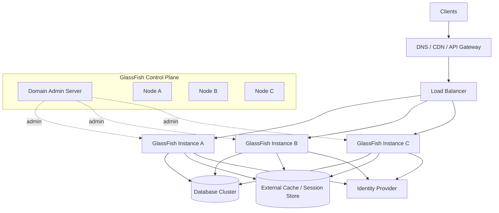

Request path dan admin path berbeda.

- Request path: client → load balancer → GlassFish instance → Jersey application.
- Admin path: operator/pipeline → DAS/`asadmin` → instances.

Sistem HA yang baik tidak mencampur keduanya sebagai satu failure domain.

---

## 1. Kaufman Deconstruction

Kaufman menyarankan skill besar dipecah menjadi sub-skill kecil yang bisa dilatih secara sengaja. Untuk HA Jersey + GlassFish, sub-skill-nya seperti ini.

| Sub-skill | Output yang Harus Bisa Dibuat |
|---|---|
| Stateless REST design | resource bisa melayani request dari instance mana pun |
| State classification | tahu state mana yang boleh lokal, external, replicated, atau disposable |
| Load balancing | tahu kapan pakai sticky, round-robin, least-connection, atau weighted routing |
| Health modeling | liveness/readiness/startup probe yang benar |
| Failover semantics | tahu apa yang terjadi saat instance mati di tengah request |
| Cluster administration | bisa membuat, menjalankan, menghentikan, dan deploy ke target cluster |
| Session strategy | memilih no-session, sticky session, external session, atau replicated session |
| Rollout safety | zero/low downtime deployment dengan rollback path |
| Failure diagnosis | bisa membedakan node failure, app failure, LB failure, dan dependency failure |

Latihan utama bagian ini:

> Ambil satu endpoint production. Jawab: “Apakah endpoint ini aman dijalankan di 3 instance? Apa state-nya? Bagaimana health check-nya? Apa yang terjadi kalau instance mati saat request berjalan? Bagaimana deployment tanpa downtime?”

---

## 2. Mental Model: Availability Is About Failure Boundaries

Sistem single instance punya satu failure boundary.

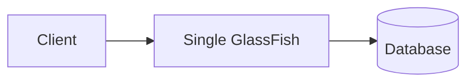

Jika GlassFish mati, semua request mati.

Sistem multi-instance memindahkan failure boundary dari “server” menjadi “request + dependency + routing”.

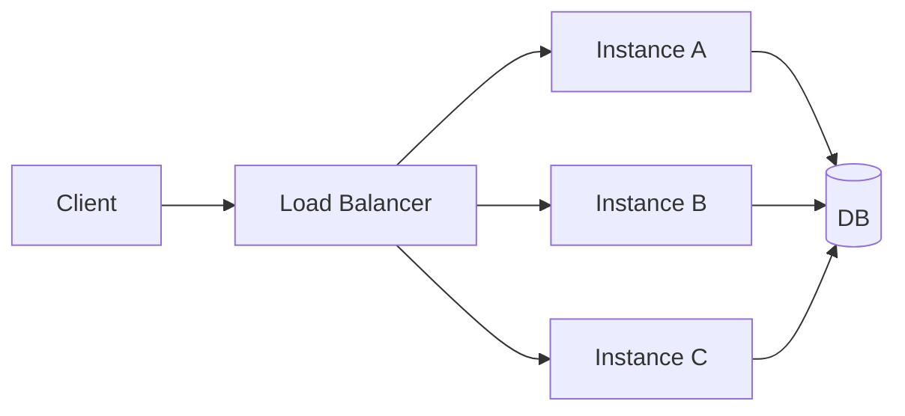

Jika Instance A mati, traffic bisa dialihkan ke B/C. Tetapi ini hanya benar jika:

- request tidak bergantung pada memory state A;
- B/C punya config yang sama;
- B/C punya database/resource access yang sama;
- load balancer tahu A tidak sehat;
- timeout client tidak terlalu pendek atau terlalu panjang;
- deployment artifact sama atau kompatibel;
- schema database kompatibel dengan versi app yang sedang berjalan.

HA bukan “jumlah instance”. HA adalah **kemampuan seluruh graph untuk tetap memenuhi kontrak ketika sebagian node gagal**.

---

## 3. Availability Vocabulary

### 3.1 Uptime

Uptime adalah persentase waktu layanan tersedia.

| Availability | Downtime per Year, Approx |
|---|---:|
| 99% | 3.65 hari |
| 99.9% | 8.76 jam |
| 99.99% | 52.6 menit |
| 99.999% | 5.26 menit |

Tetapi angka uptime tidak cukup. Service bisa “up” tetapi:

- latency 30 detik;
- error 5xx 20%;
- hanya sebagian tenant gagal;
- write berhasil tapi event downstream hilang;
- health endpoint hijau tapi business endpoint gagal.

### 3.2 RTO dan RPO

| Term | Pertanyaan |
|---|---|
| RTO | Berapa lama service boleh tidak tersedia sebelum dianggap unacceptable? |
| RPO | Berapa banyak data boleh hilang/diduplikasi saat recovery? |

REST stateless biasanya punya RTO rendah jika instance redundant. Tetapi RPO tetap bergantung pada database, message broker, idempotency, dan transaction boundary.

### 3.3 Failover vs Recovery

Failover berarti traffic berpindah dari node gagal ke node sehat.

Recovery berarti node gagal dipulihkan, diverifikasi, lalu dimasukkan kembali ke pool.

Anti-pattern umum:

> Instance restart otomatis, tetapi masuk kembali ke load balancer sebelum warm-up selesai.

Akibatnya, request pertama setelah restart menjadi korban cold start, lazy initialization, atau pool belum siap.

---

## 4. Stateless REST as the Default HA Strategy

Untuk Jersey service, default terbaik adalah stateless request.

Stateless bukan berarti tidak punya state. Stateless berarti state yang dibutuhkan request tidak disimpan sebagai mutable session di memory instance tertentu.

State boleh ada di:

- database;
- distributed cache;
- token yang ditandatangani;
- durable queue;
- object storage;
- external workflow engine;
- downstream system dengan idempotency.

State jangan disimpan sebagai:

- static mutable map;
- singleton service field;
- `HttpSession` untuk API murni;
- local file tanpa shared storage;
- in-memory scheduler tanpa leader election;
- local cache yang dianggap source of truth.

### 4.1 Stateless Endpoint Shape

```java
@Path("/cases")
@Consumes(MediaType.APPLICATION_JSON)
@Produces(MediaType.APPLICATION_JSON)
public class CaseResource {

    @Inject
    CaseService service;

    @POST
    public Response create(CreateCaseRequest request,
                           @HeaderParam("Idempotency-Key") String idempotencyKey,
                           @Context SecurityContext securityContext) {
        CaseId caseId = service.create(request, idempotencyKey, securityContext.getUserPrincipal());
        return Response.created(URI.create("/cases/" + caseId.value())).build();
    }
}
```

Endpoint di atas lebih HA-friendly karena:

- tidak bergantung pada session lokal;
- identity diambil dari security context/token;
- write request punya idempotency key;
- state persisten ada di service/database layer;
- response tidak bergantung pada instance tertentu.

### 4.2 Stateful Endpoint Smell

```java
@Singleton
@Path("/imports")
public class ImportResource {
    private final Map<String, ImportJob> jobs = new ConcurrentHashMap<>();

    @POST
    public Response start(ImportRequest request) {
        String id = UUID.randomUUID().toString();
        jobs.put(id, new ImportJob(request));
        return Response.accepted(Map.of("jobId", id)).build();
    }

    @GET
    @Path("/{id}")
    public ImportJob status(@PathParam("id") String id) {
        return jobs.get(id);
    }
}
```

Masalahnya:

- job status hanya ada di instance yang menerima request awal;
- load balancer bisa mengirim `GET /imports/{id}` ke instance lain;
- restart menghapus state;
- memory bisa bocor;
- scale out tidak menambah kapasitas job secara benar.

Solusi lebih baik:

- simpan job metadata di database;
- eksekusi async via queue/managed executor dengan persistence;
- status endpoint membaca state durable;
- gunakan idempotency untuk start request;
- hindari local state sebagai source of truth.

---

## 5. State Classification Matrix

Sebelum bicara cluster, klasifikasikan state.

| State Type | Contoh | HA Strategy |
|---|---|---|
| Identity state | JWT, session id, principal | token signed atau external session |
| Domain state | case, order, task, workflow | database/source of truth |
| Request state | correlation ID, validation context | per-request only |
| Cache state | reference data, lookup | rebuildable, bounded TTL |
| File state | upload temp file, report file | object storage/shared storage |
| Job state | import progress, export progress | durable job table/queue |
| Lock state | distributed operation lock | database lock/advisory lock/distributed lock with lease |
| Config state | feature flag, endpoint config | external config or consistent deployment config |
| Metrics/log state | request count, traces | external telemetry backend |

Rule sederhana:

> Jika kehilangan state lokal membuat client tidak bisa melanjutkan workflow, state itu tidak boleh hanya berada di memory instance.

---

## 6. Load Balancing Model

Load balancer bertugas memilih instance untuk setiap connection/request.

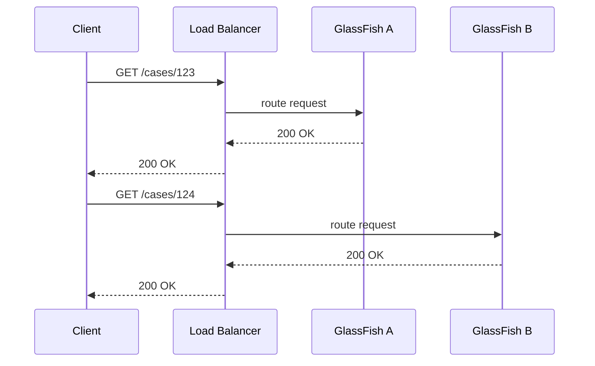

Untuk REST stateless, request boleh pergi ke instance mana pun.

Untuk session-based app, request berikutnya mungkin perlu kembali ke instance yang sama, atau session harus disimpan/replikasi di luar instance.

### 6.1 Common Routing Algorithms

| Algorithm | Cocok Untuk | Risiko |
|---|---|---|
| Round-robin | instance relatif sama | tidak melihat load aktual |
| Least connections | request long-lived | bisa salah jika connection bukan proxy untuk cost |
| Weighted round-robin | instance beda kapasitas | weight drift jika kapasitas berubah |
| Random | simple stateless traffic | variance pada traffic kecil |
| Consistent hashing | cache locality | hot key bisa overload |
| Sticky/session affinity | session state lokal | mengurangi failover freedom |

Untuk Jersey API stateless, mulai dari round-robin/least-connection dengan readiness check yang benar.

### 6.2 Sticky Routing

Sticky routing mengikat client/session ke instance tertentu.

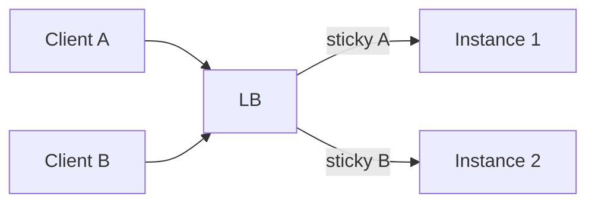

Sticky routing berguna untuk:

- legacy `HttpSession`;
- websocket-like long-lived context;
- app yang belum stateless;
- cache locality tertentu.

Namun sticky routing mengurangi kualitas HA:

- instance overload karena client besar menempel di node tertentu;
- failover session sulit jika session tidak direplikasi;
- rolling deployment lebih kompleks;
- debugging lebih sulit karena bug terlihat hanya di node tertentu.

GlassFish documentation untuk load balancing via Apache `mod_jk` menyebutkan stickiness menggunakan `jvmRoute` dalam `JSESSIONID`; tiap instance di belakang load balancer harus punya `jvmRoute` unik.

### 6.3 Non-Sticky Routing

Non-sticky routing adalah target untuk API modern.

Syarat:

- no `HttpSession` sebagai state business;
- token/session external;
- idempotent write semantics;
- shared database/resource config;
- schema compatible across versions;
- cache bukan source of truth.

---

## 7. Session State Strategy

Jersey sendiri sering dipakai untuk REST API, tetapi berjalan di atas Servlet container sehingga `HttpSession` tetap bisa muncul lewat framework, filter, security mechanism, atau library.

### 7.1 No Session

Pilihan terbaik untuk API.

```java
@Provider
@Priority(Priorities.AUTHENTICATION)
public class TokenAuthFilter implements ContainerRequestFilter {
    @Override
    public void filter(ContainerRequestContext ctx) {
        String auth = ctx.getHeaderString(HttpHeaders.AUTHORIZATION);
        // validate bearer token; do not create HttpSession
    }
}
```

Checklist:

- tidak memanggil `request.getSession(true)`;
- security tidak membuat session secara diam-diam;
- CSRF tidak bergantung session untuk API token-based;
- logout semantics bukan “hapus session lokal”, tetapi token revocation/expiry jika diperlukan.

### 7.2 Sticky Session

Sticky session cocok jika:

- aplikasi legacy butuh `HttpSession`;
- rewrite belum memungkinkan;
- downtime risk lebih kecil daripada refactor risk;
- failover loss dapat diterima.

Invariants:

- sticky session bukan HA penuh;
- sticky session adalah compatibility bridge;
- failure instance tetap bisa memutus session jika session tidak replicated/external;
- harus punya drain strategy saat deployment.

### 7.3 External Session

Session state disimpan di external store.

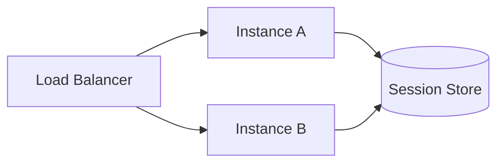

Benefit:

- request bisa pindah instance;
- restart tidak selalu menghapus session;
- deployment lebih fleksibel.

Risk:

- external store menjadi dependency kritis;
- latency setiap request bisa naik;
- serialization compatibility harus dijaga;
- session object besar menjadi bottleneck;
- locking/session concurrency bisa rumit.

### 7.4 Replicated Session

Container/server melakukan replikasi session antar instance.

Gunakan hati-hati:

- bagus untuk web UI state ringan;
- buruk untuk object besar/mutable/high-write;
- bisa menambah network overhead;
- serializable compatibility harus dijaga;
- cluster partition dapat membuat behavior sulit diprediksi.

Untuk API case management/regulatory systems, biasanya lebih defensible memakai durable domain state, bukan session replication.

---

## 8. GlassFish Cluster Model

GlassFish punya konsep domain, DAS, node, instance, cluster, config, dan target. Kita sudah bahas domain model di Part 017. Di sini fokus pada konsekuensi HA.

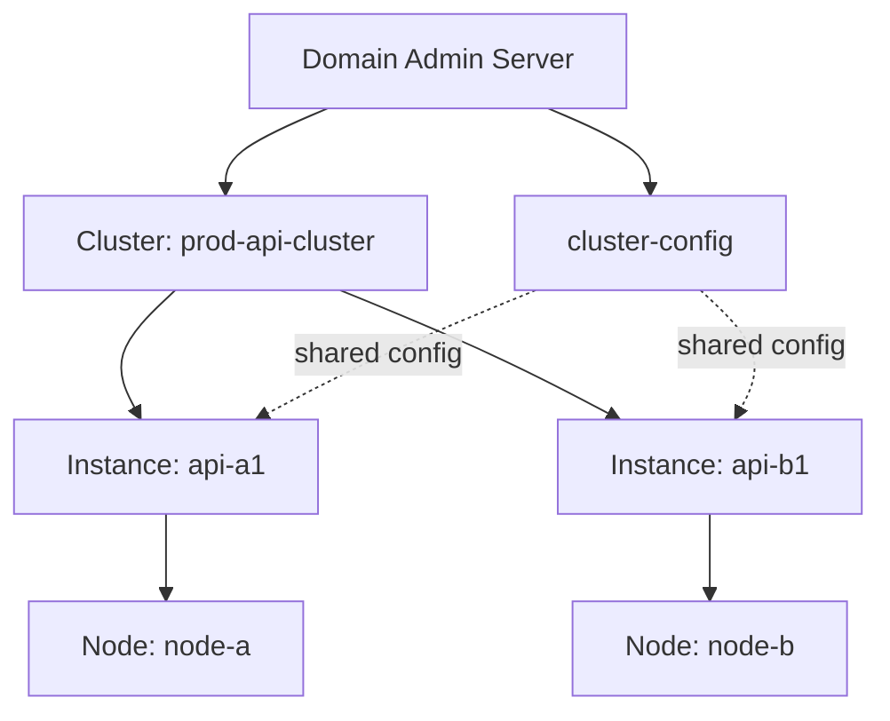

Cluster membantu:

- mengelola banyak instance sebagai target deployment;
- menyamakan konfigurasi;
- start/stop group instance;
- melakukan admin operation terkoordinasi;
- memisahkan app target dan config target.

Cluster tidak otomatis menyelesaikan:

- statelessness;
- database HA;
- session design;
- load balancer health checks;
- schema migration compatibility;
- request idempotency;
- deployment rollback.

### 8.1 Basic `asadmin` Cluster Flow

Contoh konseptual:

```bash
asadmin create-cluster prod-api-cluster

asadmin create-local-instance \
  --cluster prod-api-cluster \
  --node localhost-domain1 \
  api-instance-1

asadmin create-local-instance \
  --cluster prod-api-cluster \
  --node localhost-domain1 \
  api-instance-2

asadmin start-cluster prod-api-cluster

asadmin deploy \
  --target prod-api-cluster \
  target/case-api.war
```

Untuk remote node, detailnya bergantung setup node/SSH/Docker/Kubernetes. Prinsipnya tetap:

- instance harus punya artifact sama;
- config harus konsisten;
- resource harus ditargetkan benar;
- health check harus mengeluarkan node dari LB saat tidak siap.

### 8.2 Cluster Targeting

Target bisa berupa:

- server;
- standalone instance;
- cluster;
- config;
- resource target.

Deployment ke target cluster berarti semua instance dalam cluster harus bisa load artifact.

Failure yang sering terjadi:

- deploy sukses di satu instance, gagal di instance lain karena local file/library berbeda;
- JDBC resource dibuat di server default, bukan cluster target;
- system property ada di satu instance, tidak di config cluster;
- port conflict pada node yang sama;
- TLS/key store tidak tersedia di semua node.

---

## 9. Health Checks: Liveness, Readiness, Startup

Health check adalah kontrak antara application runtime dan load balancer/orchestrator.

### 9.1 Liveness

Liveness menjawab:

> Apakah proses ini harus dibunuh/restart?

Liveness harus ringan.

Contoh:

```java
@Path("/internal/health/live")
@Produces(MediaType.APPLICATION_JSON)
public class LivenessResource {
    @GET
    public Response live() {
        return Response.ok(Map.of("status", "UP")).build();
    }
}
```

Jangan cek database di liveness. Jika database down lalu semua app dibunuh, recovery bisa makin buruk.

### 9.2 Readiness

Readiness menjawab:

> Apakah instance ini siap menerima traffic?

Readiness boleh cek dependency kritis secara bounded.

```java
@Path("/internal/health/ready")
@Produces(MediaType.APPLICATION_JSON)
public class ReadinessResource {

    @Inject
    ReadinessService readiness;

    @GET
    public Response ready() {
        ReadinessReport report = readiness.check(Duration.ofMillis(300));
        if (report.ready()) {
            return Response.ok(report).build();
        }
        return Response.status(503).entity(report).build();
    }
}
```

Dependency check harus:

- timeout pendek;
- tidak membuat heavy query;
- tidak mengunci table;
- tidak memanggil chain downstream panjang;
- tidak menghasilkan alert noise saat deployment normal.

### 9.3 Startup Probe / Warm-up

Startup menjawab:

> Apakah proses masih start/warm-up, atau benar-benar stuck?

Gunakan untuk mencegah orchestrator membunuh app yang sedang cold start.

Warm-up checklist:

- Jersey resource model sudah dibangun;
- CDI/HK2 injection selesai;
- JSON provider siap;
- JDBC pool minimum siap jika diperlukan;
- cache critical terisi atau intentionally lazy;
- migrations sudah kompatibel;
- readiness belum hijau sebelum runtime siap.

---

## 10. Failover Semantics

Failover bukan magic. Kita harus tahu nasib request.

### 10.1 Failure Before Request Reaches Instance

Jika load balancer belum mengirim request ke instance, request bisa diarahkan ke instance lain.

Outcome:

- client mungkin tidak tahu ada failure;
- latency sedikit naik;
- request aman jika retry at LB terjadi sebelum body dikirim.

### 10.2 Failure During Request Processing

Jika instance mati setelah menerima request:

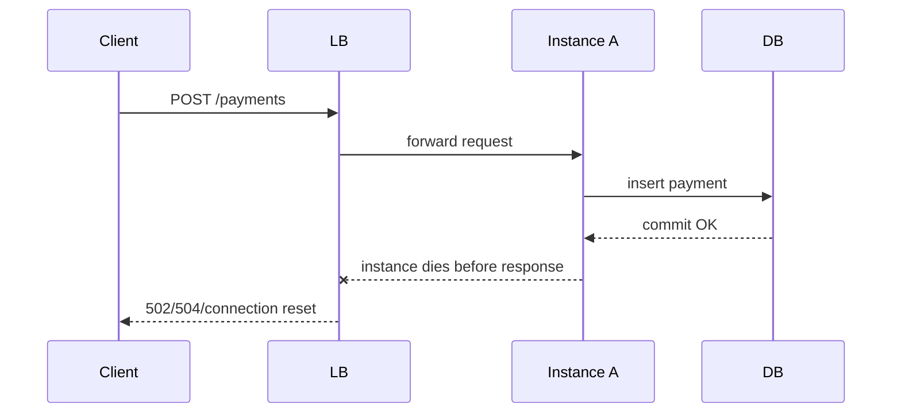

Client tidak tahu apakah commit terjadi.

Solusi:

- idempotency key untuk write;
- client retry aman;
- operation status lookup;
- durable operation log;
- exact error contract untuk unknown outcome.

### 10.3 Failure After Response Sent

Jika response sudah terkirim, client melihat sukses. Tetapi downstream async bisa gagal.

Solusi:

- transactional outbox;
- durable event publication;
- audit log;
- reconciliation job.

### 10.4 Failure During Streaming/SSE

Long-lived response akan putus.

Solusi:

- resume token/event id;
- `Last-Event-ID` for SSE pattern;
- heartbeat;
- client reconnect strategy;
- bounded server resource.

---

## 11. Idempotency as HA Primitive

HA tanpa idempotency sering berubah menjadi duplicate operation.

Untuk `POST`, gunakan idempotency key jika operation tidak aman diulang.

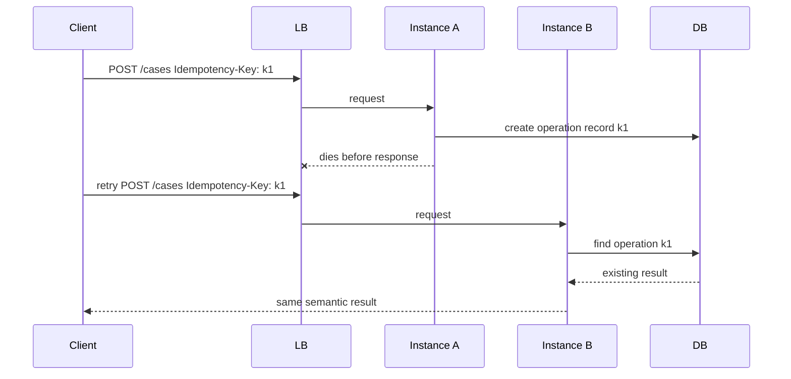

Minimal idempotency table:

```sql
CREATE TABLE api_idempotency (
    tenant_id        VARCHAR(64)  NOT NULL,
    idempotency_key VARCHAR(128) NOT NULL,
    request_hash    VARCHAR(128) NOT NULL,
    status          VARCHAR(32)  NOT NULL,
    response_code   INT,
    response_body   TEXT,
    created_at      TIMESTAMP NOT NULL,
    expires_at      TIMESTAMP NOT NULL,
    PRIMARY KEY (tenant_id, idempotency_key)
);
```

Invariant:

- same key + same request = same result;
- same key + different request = 409 conflict;
- key has TTL;
- write to idempotency table and domain table must be transactionally safe.

---

## 12. Database HA Coupling

A Jersey/GlassFish cluster tetap gagal jika database single point of failure.

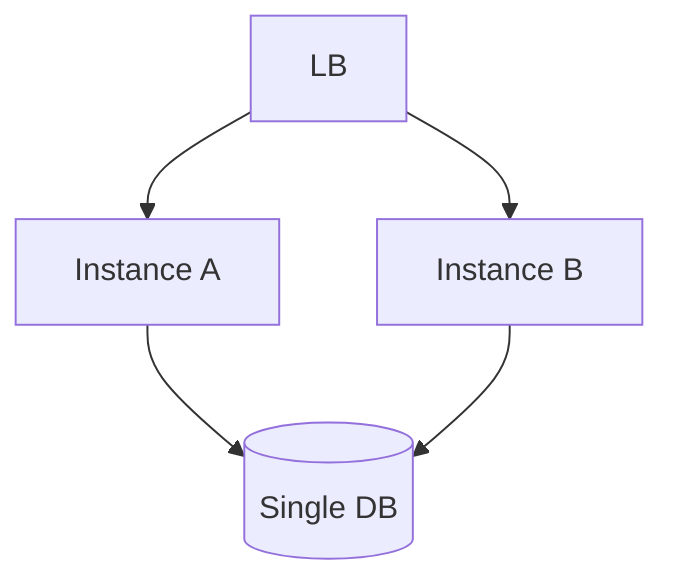

DB failure membuat semua instance gagal untuk endpoint yang butuh DB.

Strategi:

- database cluster/managed HA;
- connection validation;
- bounded pool waiting;
- circuit breaker for DB-heavy operation;
- read-only degradation jika domain memungkinkan;
- cache for read-mostly reference data;
- maintenance mode yang eksplisit.

### 12.1 Pool Sizing in HA

Jika satu instance punya max pool 50 dan ada 6 instance, database bisa menerima sampai 300 connection hanya dari satu service.

Formula awal:

```text
max_db_connections_for_service = instance_count * pool_max_size
```

Jangan tuning pool per instance tanpa melihat total cluster.

Checklist:

- DB max connections;
- reserved connections untuk migration/admin;
- per-service quota;
- connection leak detection;
- pool wait timeout;
- fail-fast vs wait strategy.

---

## 13. Load Balancer Health and Drain

### 13.1 Health Endpoint Choice

LB harus menggunakan readiness, bukan liveness.

- Liveness hijau berarti proses hidup.
- Readiness hijau berarti boleh menerima request.

### 13.2 Drain Flow

Saat deploy/restart, instance harus dikeluarkan dari LB dulu.

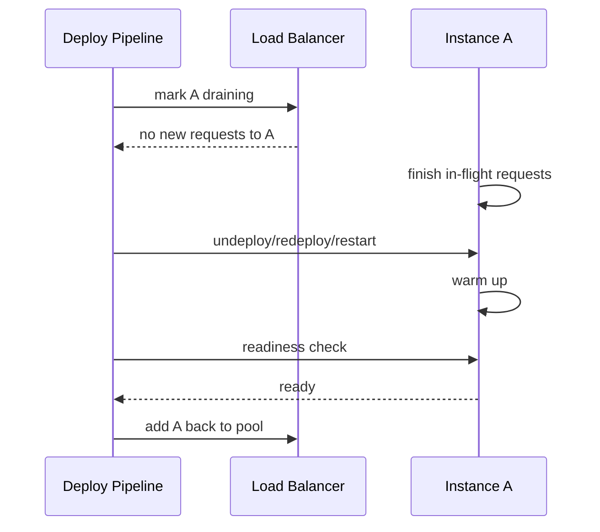

Jika tidak ada drain, in-flight request akan terputus.

### 13.3 Grace Period

Grace period harus lebih besar dari:

- p99 request latency;
- longest acceptable upload/download;
- downstream timeout budget;
- transaction completion window.

Tetapi jangan terlalu besar sehingga deploy tidak pernah selesai.

---

## 14. Rolling Deployment

Rolling deployment mengganti instance satu per satu.

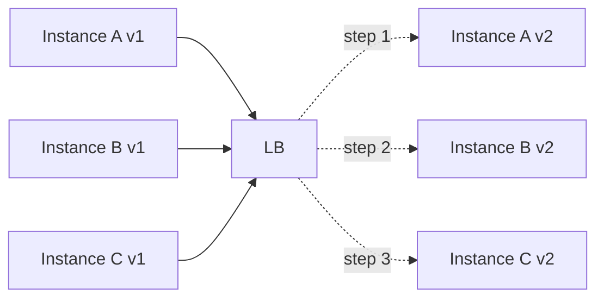

Syarat rolling deployment:

- v1 dan v2 bisa berjalan bersamaan;
- database schema compatible;
- message/event contract compatible;
- cache key compatible;
- session serialization compatible jika ada session;
- feature flag bisa mengontrol behavior baru;
- rollback tidak menghancurkan data baru.

### 14.1 Expand/Contract Schema Pattern

Untuk schema change:

1. Expand: tambah kolom/table nullable/compatible.
2. Deploy app yang bisa membaca old+new.
3. Backfill data.
4. Switch write path.
5. Verify.
6. Contract: hapus kolom lama di release berikutnya.

Jangan deploy app yang membutuhkan kolom baru sebelum semua instance lama bisa hidup berdampingan.

### 14.2 Version Skew

Saat rolling deploy, sementara waktu cluster punya v1 dan v2.

Risk:

- client mendapat response shape berbeda antar request;
- node v1 menulis state yang tidak bisa dibaca v2;
- node v2 menulis state yang tidak bisa dibaca v1;
- cache berisi value versi lama;
- exception mapper response berbeda.

Rule:

> Rolling deployment hanya aman jika semua versi yang coexist kompatibel secara request, response, persistence, cache, dan event.

---

## 15. Blue-Green Deployment

Blue-green membuat dua environment terpisah.

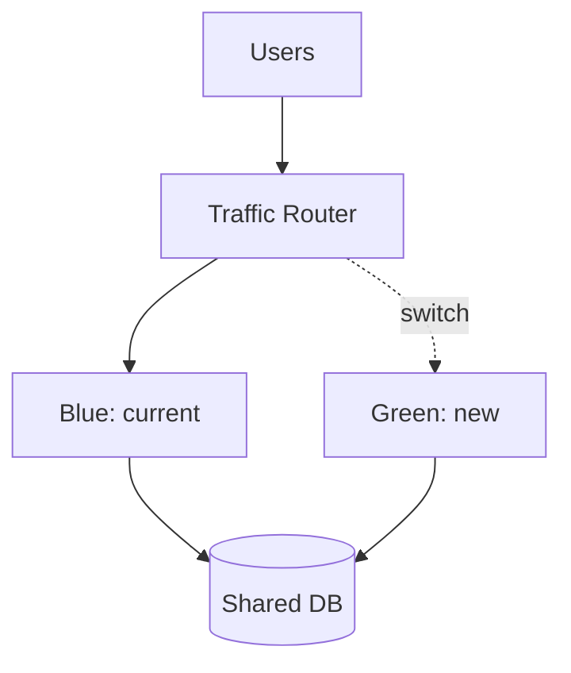

Benefit:

- rollback cepat dengan traffic switch;
- green bisa warm-up sebelum traffic;
- smoke test lebih mudah.

Risk:

- shared database tetap harus compatible;
- background jobs bisa double-run jika blue dan green aktif;
- scheduled tasks butuh leader election atau disable di standby;
- external callbacks/webhooks harus diarahkan dengan hati-hati.

### 15.1 Blue-Green Checklist

- green deployed and healthy;
- green connected to correct DB/resource;
- green not running duplicate scheduler unless intended;
- migration completed and compatible;
- smoke tests pass;
- traffic switch gradual if possible;
- monitor 4xx/5xx/p95/p99/pool/thread;
- rollback plan validated.

---

## 16. Canary Deployment

Canary mengirim sebagian kecil traffic ke versi baru.

Cocok jika:

- traffic cukup besar untuk signal;
- routing bisa dikontrol;
- metrics per version tersedia;
- client contract compatible;
- request tidak punya hidden affinity.

Canary metric:

- 5xx rate per version;
- latency p95/p99 per endpoint;
- DB pool wait;
- thread pool saturation;
- validation error rate;
- exception type distribution;
- downstream call failure;
- business KPI anomaly.

Canary tanpa metrics per version hanya gambling dengan nama keren.

---

## 17. Multi-Region Thinking

GlassFish cluster biasanya dibahas dalam satu domain/site, tetapi production HA sering masuk multi-AZ atau multi-region.

### 17.1 Multi-AZ

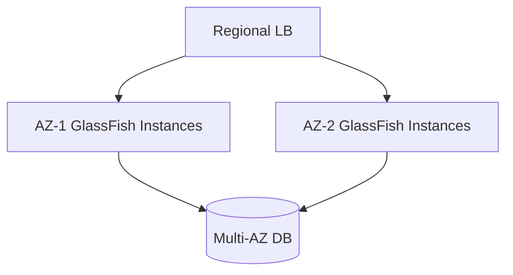

Target:

- instance tersebar di failure domain berbeda;
- DB replicated/managed HA;
- LB health-aware per AZ;
- no local disk dependency.

### 17.2 Multi-Region Active-Passive

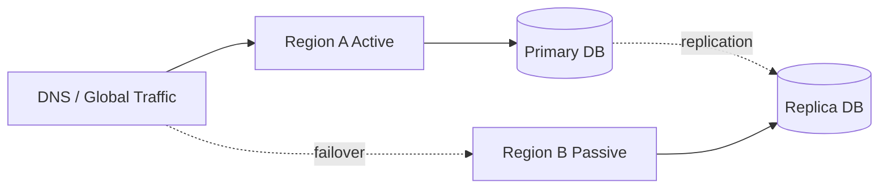

Pertanyaan penting:

- berapa RPO replication?
- bagaimana DNS/traffic failover?
- bagaimana secrets/config sync?
- apakah external callbacks berpindah?
- apakah idempotency keys replicated?
- apakah background jobs berjalan di satu region saja?

### 17.3 Multi-Region Active-Active

Active-active jauh lebih sulit.

Butuh:

- conflict resolution;
- data locality;
- idempotency global;
- monotonic business sequence strategy;
- tenant pinning atau distributed consistency;
- event ordering model.

Untuk regulatory case management, active-active sering tidak layak kecuali domain dipartisi per tenant/jurisdiction.

---

## 18. Background Jobs in HA

REST service sering punya scheduled job, poller, cleanup, export, notification dispatcher.

Bahaya:

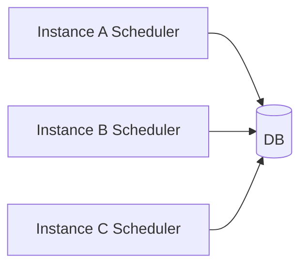

Jika semua instance menjalankan job yang sama, side effect bisa triple.

Strategi:

| Strategy | Kapan Cocok | Catatan |
|---|---|---|
| External scheduler | production-critical jobs | lebih jelas ownership-nya |
| DB lease/lock | simple cluster job | harus punya TTL dan fencing |
| Queue workers | parallelizable jobs | idempotency wajib |
| Leader election | one-active scheduler | perlu library/platform support |
| Disable scheduler on API nodes | clean separation | worker deployment terpisah |

Contoh DB lease shape:

```sql
CREATE TABLE cluster_lock (
    lock_name VARCHAR(128) PRIMARY KEY,
    owner_id  VARCHAR(128) NOT NULL,
    lease_until TIMESTAMP NOT NULL,
    version BIGINT NOT NULL
);
```

Rules:

- lock punya expiry;
- owner refresh secara periodik;
- operation idempotent walau lock bocor;
- clock skew dipertimbangkan;
- job punya audit record.

---

## 19. Cache in HA

Local cache boleh dipakai jika:

- data bisa dibangun ulang;
- TTL bounded;
- stale data masih acceptable;
- invalidation tidak critical;
- cache miss tidak menjatuhkan DB.

Danger:

```java
@ApplicationScoped
public class PermissionCache {
    private final Map<String, Permissions> cache = new ConcurrentHashMap<>();
}
```

Jika permission berubah, tiap instance bisa punya versi berbeda.

Strategi:

- TTL pendek;
- external cache;
- versioned cache key;
- invalidation event;
- read-through bounded;
- cache not authoritative.

Checklist:

- apa stale tolerance?
- apakah cache tenant-aware?
- apakah cache invalidation reliable?
- apakah cache memory bounded?
- apakah cache warming membuat startup lambat?
- apakah cache miss storm dilindungi?

---

## 20. File Upload/Download in HA

Jangan simpan upload final di local disk instance.

Bad:

```text
/glassfish/domains/domain1/app-uploads/report-123.pdf
```

Request berikutnya bisa masuk ke instance lain dan file tidak ada.

Better:

- object storage;
- shared file system dengan locking jelas;
- database blob hanya jika ukuran/volume masuk akal;
- temp file lokal hanya untuk durasi request;
- cleanup job aware multi-instance.

Upload flow HA-friendly:

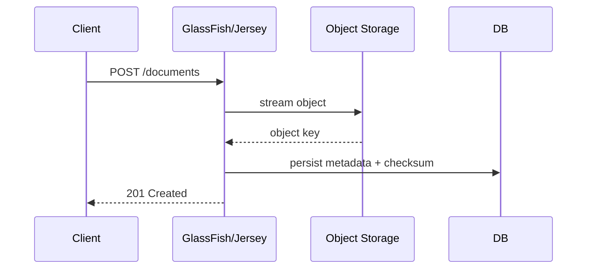

---

## 21. Admin Surface and DAS HA

DAS adalah control plane. Request traffic tidak harus lewat DAS.

Implications:

- DAS down tidak selalu berarti app instances down;
- tetapi deploy/config/admin operation terganggu;
- backup domain config penting;
- admin access harus sangat dibatasi;
- secure admin diperlukan untuk komunikasi admin yang aman.

Operational principle:

> Jangan desain runtime request availability bergantung pada admin console availability.

Backup checklist:

- `domain.xml`;
- keystore/truststore;
- password aliases;
- deployed artifacts/version metadata;
- custom libraries if any;
- asadmin scripts;
- environment-specific config;
- DB migration state.

---

## 22. Network Partition Model

Jika instance tidak bisa menjangkau DB, tetapi masih bisa menjawab health endpoint, LB bisa tetap mengirim traffic ke node rusak.

Readiness harus menangkap dependency kritis.

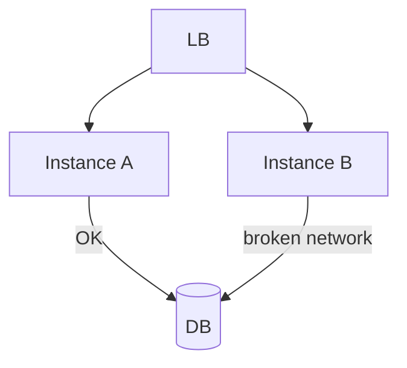

Jika B liveness hijau tapi DB unreachable:

- liveness: UP;
- readiness: DOWN;
- LB harus stop route ke B.

Jangan menyamakan process health dengan service health.

---

## 23. HA Failure Mode Catalog

| Symptom | Likely Cause | First Checks |
|---|---|---|
| 502/503 spike during deploy | no drain, readiness too early | LB logs, instance restart time, readiness timeline |
| Some users lose login | sticky session + node restart | session affinity, JSESSIONID, jvmRoute |
| Duplicate writes after failover | unsafe retry/no idempotency | idempotency table, client retry logs |
| Only one node fails after deploy | local library/config drift | classpath, server lib, system properties |
| Cluster deploy partial failure | target/resource mismatch | deployment logs per instance |
| DB exhausted after scale-out | pool max multiplied by instance count | DB connections, pool stats |
| Health green but endpoint fails | shallow readiness | dependency health, pool validation |
| Rolling deploy breaks old version | incompatible schema/contract | migration timeline, version skew |
| Jobs run multiple times | scheduler on all nodes | job audit, lock table, instance id |
| Cache inconsistent | local mutable cache | TTL, invalidation, versioned keys |

---

## 24. Reference HA Architecture for Jersey + GlassFish

```mermaid
flowchart TD
    Client[Client Apps] --> Gateway[API Gateway / WAF]
    Gateway --> LB[Load Balancer]

    LB --> GF1[GlassFish API Instance 1]
    LB --> GF2[GlassFish API Instance 2]
    LB --> GF3[GlassFish API Instance 3]

    GF1 --> DB[(HA Database)]
    GF2 --> DB
    GF3 --> DB

    GF1 --> Cache[(External Cache)]
    GF2 --> Cache
    GF3 --> Cache

    GF1 --> Obj[(Object Storage)]
    GF2 --> Obj
    GF3 --> Obj

    GF1 --> Queue[(Durable Queue)]
    GF2 --> Queue
    GF3 --> Queue

    Worker1[Worker Instance 1] --> Queue
    Worker2[Worker Instance 2] --> Queue
    Worker1 --> DB
    Worker2 --> DB

    Telemetry[Logs/Metrics/Traces] <-- GF1
    Telemetry <-- GF2
    Telemetry <-- GF3
    Telemetry <-- Worker1
    Telemetry <-- Worker2

    CICD[Deployment Pipeline] -.asadmin/API.-> DAS[GlassFish DAS]
    DAS -.control.-> GF1
    DAS -.control.-> GF2
    DAS -.control.-> GF3
```

Key decisions:

- API instances stateless;
- domain state in DB;
- large file state in object storage;
- background work in queue/worker layer;
- idempotency for unsafe writes;
- readiness for LB routing;
- liveness for process recovery;
- deployment pipeline drains before restart;
- observability tags include instance/version/cluster.

---

## 25. `asadmin` Operational Examples

### 25.1 List Targets and Instances

```bash
asadmin list-targets
asadmin list-instances
asadmin list-clusters
```

### 25.2 Start/Stop Cluster

```bash
asadmin start-cluster prod-api-cluster
asadmin stop-cluster prod-api-cluster
```

### 25.3 Deploy to Cluster

```bash
asadmin deploy \
  --target prod-api-cluster \
  --contextroot case-api \
  target/case-api.war
```

### 25.4 Rolling by Instance Target

If using external LB/drain control:

```bash
# 1. remove instance from LB outside GlassFish
# 2. stop/redeploy/start one instance or use rolling pipeline pattern
asadmin stop-instance api-instance-1
asadmin start-instance api-instance-1
# 3. wait readiness
# 4. add instance back to LB
```

Do not blindly restart all instances unless downtime is accepted.

---

## 26. Observability for HA

Every log/metric/trace must include enough dimensions.

Minimum dimensions:

| Dimension | Why |
|---|---|
| `service` | identify app |
| `version` | detect deploy regression |
| `instance` | detect node-local failure |
| `cluster` | compare target groups |
| `zone` | detect AZ/site failure |
| `tenant` | detect tenant-local impact |
| `endpoint` | detect route-specific problem |
| `dependency` | detect DB/auth/cache/downstream issue |
| `correlation_id` | reconstruct request path |

HA metric set:

- request rate per instance;
- 4xx/5xx per instance/version;
- p50/p95/p99 latency per endpoint;
- LB upstream errors;
- readiness transition count;
- instance restart count;
- JDBC pool active/wait/timeout;
- thread pool busy/queue;
- GC pause;
- heap usage;
- session count if using sessions;
- queue lag if using async workers.

---

## 27. HA Testing Plan

### 27.1 Instance Kill Test

Steps:

1. Run load test.
2. Kill one instance.
3. Observe LB failover.
4. Verify error spike is within tolerance.
5. Verify no duplicate writes.
6. Restart instance.
7. Verify readiness gates traffic.

Expected:

- no total outage;
- small transient error acceptable depending SLA;
- no data corruption;
- alerts actionable.

### 27.2 Rolling Deploy Test

Steps:

1. Deploy v1 to all instances.
2. Run traffic.
3. Deploy v2 one instance at a time.
4. Check mixed-version compatibility.
5. Rollback one instance.
6. Verify state compatibility.

Expected:

- v1/v2 coexist safely;
- schema compatible;
- metrics per version visible.

### 27.3 DB Slowdown Test

Steps:

1. Inject artificial DB latency.
2. Observe pool wait.
3. Verify readiness behavior if DB is critical.
4. Verify timeout and error contract.
5. Verify system recovers.

Expected:

- no thread exhaustion;
- no unbounded queue;
- clear 503/timeout contract;
- DB recovers without restart storm.

### 27.4 Session Node Loss Test

Only if using session.

Steps:

1. Login user.
2. Identify sticky instance.
3. Kill sticky instance.
4. Observe user experience.
5. Verify expected session failover/loss behavior.

Expected:

- behavior matches documented decision;
- no ambiguous half-login state.

---

## 28. Anti-Patterns

### 28.1 “We Have Three Instances, Therefore We Have HA”

Wrong. Three broken instances are still broken.

Check:

- shared DB?
- state externalized?
- health check correct?
- LB configured?
- deployment safe?
- idempotency implemented?

### 28.2 Sticky Session as Permanent Architecture

Sticky session is sometimes a bridge, rarely a strategic goal.

If every scaling/deploy/failover discussion starts with sticky problems, your system is not actually horizontally flexible.

### 28.3 Health Endpoint That Always Returns 200

A constant 200 endpoint is not readiness. It is process heartbeat.

### 28.4 Clustered Admin Without Application Statelessness

GlassFish cluster helps administer instances, but cannot fix unsafe local state.

### 28.5 All Nodes Run All Jobs

If all API nodes run the same cleanup/notification job without lock/idempotency, HA becomes duplicate side effect.

### 28.6 Pool Size Tuning Per Node Only

A safe pool max for one instance can become dangerous after scaling to ten instances.

### 28.7 Deploy and Migrate in One Irreversible Step

If app v2 and schema v2 must switch atomically across all nodes, rollback becomes fragile.

---

## 29. Production Checklist

### 29.1 Application

- [ ] API endpoints are stateless unless explicitly documented.
- [ ] Unsafe writes use idempotency key or equivalent deduplication.
- [ ] No source-of-truth state stored in resource singleton/static map.
- [ ] Background jobs are externalized, locked, or idempotent.
- [ ] File state uses object/shared storage, not local instance disk.
- [ ] Cache is bounded and not authoritative.

### 29.2 Runtime

- [ ] Each instance has consistent artifact version.
- [ ] Each instance has consistent GlassFish config.
- [ ] JDBC resources targeted correctly.
- [ ] Server libraries are consistent across nodes.
- [ ] System properties/secrets are consistent.
- [ ] Instance identity is visible in logs/metrics.

### 29.3 Load Balancer

- [ ] LB uses readiness endpoint.
- [ ] Drain enabled before restart/redeploy.
- [ ] Health check interval/threshold tuned.
- [ ] LB timeout aligned with app timeout.
- [ ] Sticky session disabled unless intentionally required.
- [ ] `jvmRoute` unique if sticky session via `JSESSIONID`/mod_jk is used.

### 29.4 Deployment

- [ ] Rolling/blue-green/canary strategy selected.
- [ ] v1/v2 compatibility verified.
- [ ] Schema migration uses expand/contract.
- [ ] Rollback path tested.
- [ ] Smoke tests run before traffic.
- [ ] Observability compares version/instance.

### 29.5 Failure Testing

- [ ] Kill one instance under load.
- [ ] Restart one node under load.
- [ ] Simulate DB slowness.
- [ ] Simulate downstream failure.
- [ ] Test duplicate retry scenario.
- [ ] Test LB drain.
- [ ] Test rollback.

---

## 30. Top 1% Review Questions

1. Which state in this service prevents non-sticky load balancing?
2. What happens if an instance dies after DB commit but before response?
3. Does every unsafe write have idempotency semantics?
4. Can v1 and v2 run together during rolling deployment?
5. Which health endpoint does the load balancer use?
6. Does readiness detect critical dependency failure without causing cascading failure?
7. What is the total DB connection ceiling across all instances?
8. Are background jobs single-owner, idempotent, or queue-based?
9. Can a single tenant overload one sticky instance?
10. What alert tells us that only one instance is unhealthy?
11. What alert tells us that all instances are healthy but DB is unhealthy?
12. What happens to SSE/streaming clients during restart?
13. Is admin availability separated from request availability?
14. Can we recover from losing one node without manual state repair?
15. Can we prove these answers with a test, not just architecture diagram?

---

## 31. Practice Lab

### Lab 1 — Stateless Audit

Pick an existing Jersey resource and classify all state it touches.

Output:

```text
Endpoint: POST /cases
State touched:
- identity: JWT token
- domain: case table
- idempotency: api_idempotency table
- cache: reference data cache, TTL 10 minutes
- file: none
- session: none
HA risk:
- retry after unknown commit needs idempotency
- reference cache stale acceptable for 10 minutes
```

### Lab 2 — HA Failure Matrix

Create a table:

| Failure | Expected User Impact | Expected Metric | Recovery |
|---|---|---|---|
| instance killed | small 5xx spike or none | LB upstream error | restart and readiness |
| DB slow | 503/timeout for DB endpoints | pool wait high | DB recovery/circuit open |
| deploy v2 bad | canary error spike | 5xx by version | rollback v2 |
| session node killed | session loss if sticky | login/session errors | re-login or external session |

### Lab 3 — Rolling Deployment Dry Run

Run two local/QA instances if possible. Deploy v1/v2 mixed. Verify:

- both versions answer health;
- both versions can read/write same schema;
- responses remain contract-compatible;
- logs include version;
- rollback works.

---

## 32. Summary

High availability for Jersey + GlassFish is not achieved by toggling one setting.

The practical model is:

1. Make Jersey APIs stateless by default.
2. Externalize durable state.
3. Treat session state as a liability unless explicitly needed.
4. Use GlassFish cluster/domain concepts for administration and targeting, not as a substitute for application correctness.
5. Put a health-aware load balancer in front of instances.
6. Use readiness for routing, liveness for restart.
7. Drain before restart/deploy.
8. Design write operations for unknown-outcome retries.
9. Ensure v1/v2 compatibility during rollout.
10. Test failure modes under load.

A top-tier engineer does not say, “We have cluster, so we are HA.”

A top-tier engineer says:

> “This service survives one instance failure because request state is externalized, unsafe writes are idempotent, readiness removes unhealthy nodes from the load balancer, deployment drains in-flight traffic, and we have tested kill/restart/rollback scenarios with observable metrics.”

---

## References

- Eclipse GlassFish Administration Guide, Release 8: https://glassfish.org/docs/latest/administration-guide.html
- Eclipse GlassFish High Availability / load balancing references linked from the Administration Guide.
- Eclipse GlassFish Release Notes, Release 8: https://glassfish.org/docs/latest/release-notes.html
- Jakarta EE Platform 11: https://jakarta.ee/specifications/platform/11/
