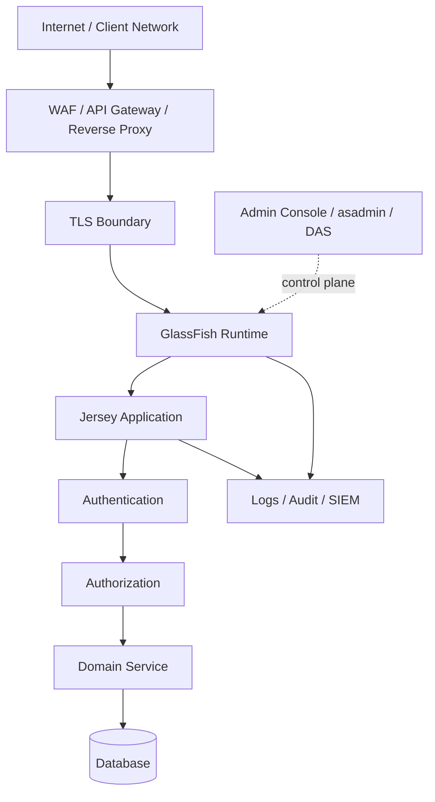
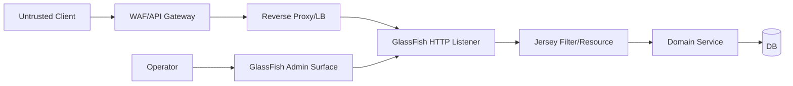
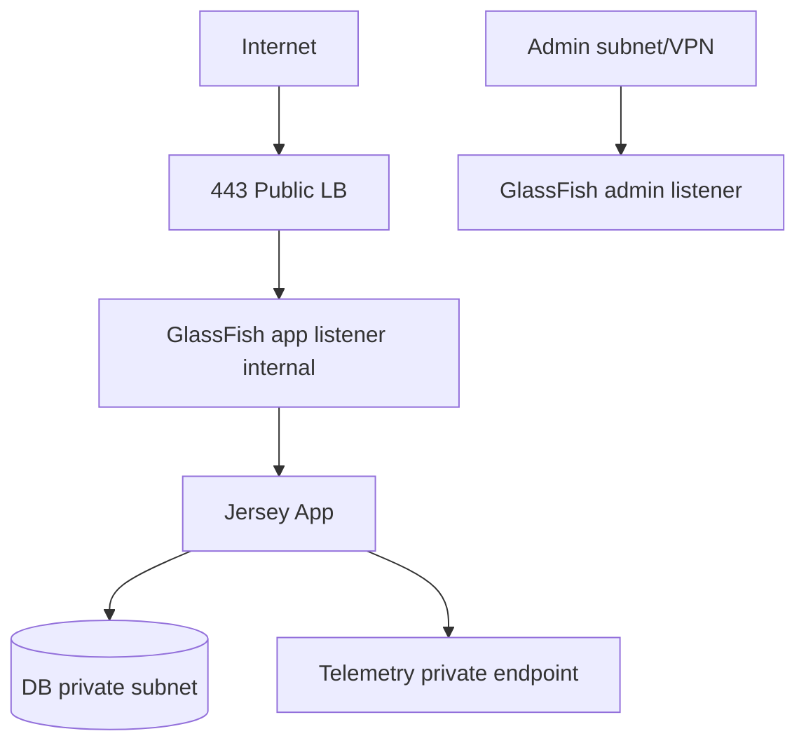
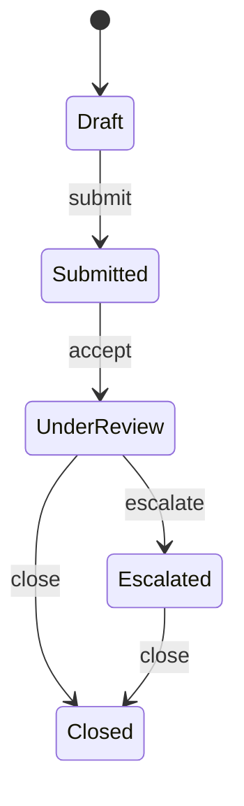
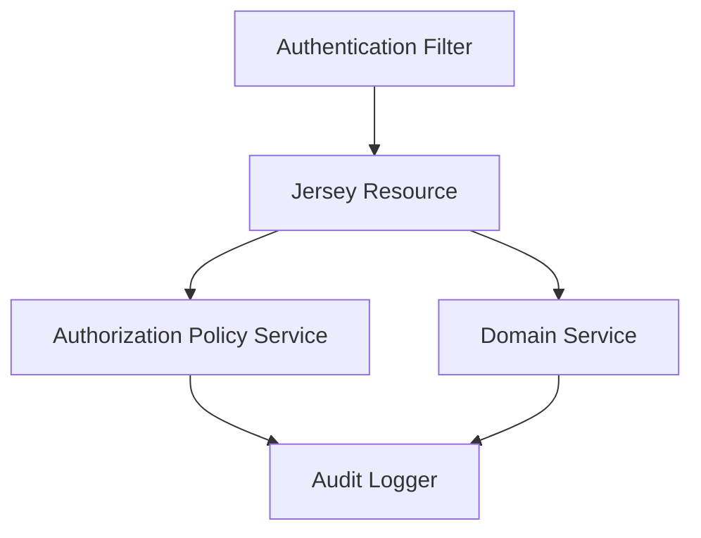

------
title: Learn Java Eclipse Jersey & GlassFish - Part 030
description: Secure production hardening checklist for Jersey applications on GlassFish: admin surface, TLS, secrets, credentials, security headers, dependency hygiene, runtime permissions, logging, audit, and deployment guardrails.
series: learn-java-jersey-glassfish
seriesTitle: Learn Java Eclipse Jersey & GlassFish
order: 30
partTitle: Secure Production Hardening Checklist
tags:
- java
- jersey
- glassfish
- jakarta-ee
- security
- hardening
- tls
- secrets
- production
- checklist
- series
date: 2026-06-28
---

# Part 030 — Secure Production Hardening Checklist

> **Goal:** setelah bagian ini, kita punya checklist hardening yang praktis untuk Jersey + GlassFish production: admin surface, TLS, secrets, dependency, headers, authorization, logging, audit, deployment, dan runtime guardrails. Fokusnya bukan teori security umum, tetapi keputusan konkret yang mengurangi attack surface dan membuat sistem defensible.

Security hardening bukan aktivitas terakhir sebelum go-live.

Hardening adalah proses membuat runtime production:

- minimal attack surface;
- explicit trust boundary;
- safe default;
- observable security event;
- recoverable configuration;
- reproducible deployment;
- auditable decision;
- fail-closed pada boundary penting.

Jersey + GlassFish punya beberapa security layer:



Hardening berarti setiap edge pada graph ini punya kontrol yang jelas.

---

## 1. Kaufman Deconstruction

Untuk menguasai hardening, pecah skill menjadi sub-skill yang bisa dilatih.

| Sub-skill | Output yang Harus Bisa Dibuat |
|---|---|
| Threat surface mapping | diagram trust boundary dan exposed port |
| Admin hardening | admin console/asadmin aman dan terbatas |
| TLS hardening | sertifikat, protocol, cipher, truststore, rotation |
| Secret handling | tidak ada password cleartext di artifact/log/domain config bila bisa dihindari |
| Application auth | authN/authZ jelas, fail-closed, audited |
| API hardening | headers, CORS, method, payload, content type, error leakage |
| Dependency hygiene | version, SBOM, CVE response, provided scope discipline |
| Runtime isolation | user OS, filesystem, container, permissions |
| Logging/audit | security event terlihat tanpa membocorkan secret/PII |
| Deployment gate | CI/CD menolak konfigurasi tidak aman |

Pertanyaan latihan utama:

> Jika auditor meminta bukti bahwa service ini aman untuk production, artifact apa yang bisa kita tunjukkan selain “kami sudah review code”?

Jawaban ideal:

- hardening checklist;
- config-as-code;
- port exposure map;
- TLS config;
- dependency report/SBOM;
- authz policy matrix;
- audit event schema;
- deployment gates;
- incident runbook;
- evidence dari test dan scan.

---

## 2. Security Boundary Model

Hardening dimulai dari boundary, bukan library.



Boundary utama:

| Boundary | Kontrol |
|---|---|
| client → edge | WAF, rate limit, TLS, bot/DDoS control |
| edge → GlassFish | private network, mTLS/internal TLS if required, timeout alignment |
| GlassFish → Jersey | auth filter, validation, content negotiation, error mapping |
| Jersey → domain service | authorization, tenant isolation, transaction boundary |
| app → DB | least privilege DB user, pool timeout, TLS to DB if required |
| operator → admin | secure admin, strong credential, restricted network, audit |

Rule:

> Jangan menaruh semua security di satu layer. Setiap boundary harus punya kontrol minimum sendiri.

---

## 3. Production Hardening Philosophy

### 3.1 Reduce

Kurangi apa yang bisa diserang.

- matikan sample apps;
- expose hanya port yang diperlukan;
- jangan expose admin console publik;
- hapus dependency tidak terpakai;
- jangan bundle API jars yang disediakan server;
- matikan debug endpoints.

### 3.2 Isolate

Pisahkan failure/attack domain.

- admin network berbeda dari traffic network;
- DB user per aplikasi;
- secret per environment;
- namespace/container user non-root;
- satu service tidak punya credential semua database.

### 3.3 Verify

Konfigurasi aman harus bisa dibuktikan.

- scan dependency;
- test unauthenticated/unauthorized access;
- assert headers;
- check port exposure;
- inspect artifact;
- check logs tidak bocor secret.

### 3.4 Recover

Security incident tidak berhenti di prevention.

- rotate secrets;
- revoke tokens;
- disable compromised admin user;
- rollback artifact;
- isolate instance;
- preserve logs;
- audit impacted tenant/data.

---

## 4. GlassFish Admin Surface Hardening

Admin surface adalah control plane. Jika admin surface compromised, attacker bisa deploy artifact, ubah resource, dump config, atau mengontrol runtime.

### 4.1 Never Expose Admin Publicly

Default production stance:

- admin console tidak expose ke internet;
- `asadmin` remote hanya dari bastion/CI/CD subnet;
- firewall/security group membatasi admin port;
- admin endpoint tidak melewati public API gateway;
- admin audit aktif.

### 4.2 Enable Secure Admin

Secure admin membuat komunikasi admin lebih aman antara DAS, instances, dan remote admin clients.

Contoh:

```bash
asadmin change-admin-password
asadmin enable-secure-admin
asadmin restart-domain domain1
```

Verification:

```bash
asadmin get secure-admin.enabled
```

GlassFish Security Guide menjelaskan bahwa `enable-secure-admin` mengamankan komunikasi admin dengan SSL/TLS, menggunakan certificate alias untuk DAS dan instances, dan domain perlu restart setelah enable.

### 4.3 Admin User Hygiene

Checklist:

- [ ] admin password default diganti;
- [ ] admin user personal/service account terpisah;
- [ ] CI/CD memakai credential terbatas jika memungkinkan;
- [ ] password tidak ada di shell history;
- [ ] password file permission ketat;
- [ ] admin user lama dinonaktifkan;
- [ ] brute force protection/lockout digunakan jika tersedia;
- [ ] admin access diaudit.

GlassFish Security Guide mendukung password file dan password aliases agar password tidak diketik langsung atau muncul sebagai cleartext di konfigurasi sejauh memungkinkan.

### 4.4 Disable Admin Console if Not Needed

Jika operasi production sepenuhnya via pipeline/`asadmin`, pertimbangkan untuk membatasi atau menonaktifkan admin console UI.

Jika console tetap aktif:

- hanya internal network/VPN;
- TLS valid;
- strong authentication;
- audit log;
- no shared admin account;
- restricted IP allowlist.

---

## 5. Port Exposure Map

Buat daftar port yang benar-benar dibutuhkan.

| Port / Surface | Production Exposure | Catatan |
|---|---|---|
| HTTP app listener | via LB/reverse proxy | sering tidak public langsung |
| HTTPS app listener | public/internal sesuai desain | TLS policy wajib |
| Admin listener | private only | jangan public |
| JMX | private/disabled unless needed | auth + TLS + firewall |
| AJP/mod_jk | private only | hanya jika digunakan |
| DB port | app subnet only | DB tidak public |
| Debug port | disabled | tidak boleh production |
| Metrics endpoint | private/protected | jangan expose sensitive metrics |
| Health endpoint | scoped | liveness/readiness boleh internal |

Mermaid port map:



Rule:

> Public internet should not know your GlassFish admin port exists.

---

## 6. TLS Hardening

TLS boundary bisa berada di:

- external load balancer/API gateway;
- reverse proxy;
- GlassFish listener;
- both edge and backend.

### 6.1 Edge TLS vs End-to-End TLS

| Model | Benefit | Risk |
|---|---|---|
| TLS terminate at LB | simpler cert ops, centralized policy | backend traffic plaintext unless private/trusted |
| TLS LB → GlassFish | stronger internal protection | more cert/keystore management |
| mTLS internal | strong service identity | operational complexity |

Untuk regulated system, pertimbangkan TLS sampai backend atau private network dengan kompensasi kuat.

### 6.2 Certificate Rules

- jangan pakai default self-signed cert untuk public production;
- CN/SAN harus cocok dengan hostname;
- gunakan CA-trusted certificate untuk public endpoint;
- keystore/truststore permission ketat;
- rotasi sertifikat terjadwal;
- test expiry alert;
- dokumentasikan ownership certificate.

GlassFish Security Guide menjelaskan penggunaan PKCS12 sebagai format keystore yang direkomendasikan untuk deployment baru karena PKCS12 menjadi default sejak Java 9.

### 6.3 Protocol and Cipher Hygiene

Principle:

- disable obsolete protocols;
- prefer TLS 1.2/1.3 depending compliance/runtime support;
- remove weak cipher suites;
- verify with scanner;
- align LB and backend policy.

Hardening bukan hanya config; harus diverifikasi:

```bash
# Example only; use approved scanner in your environment
openssl s_client -connect api.example.com:443 -servername api.example.com
```

---

## 7. Secrets and Passwords

### 7.1 Secret Locations to Audit

Audit semua tempat berikut:

- `domain.xml`;
- `server.log`;
- deployment descriptors;
- Maven/Gradle config;
- Docker image layers;
- Kubernetes manifests;
- environment variables;
- CI/CD logs;
- shell history;
- monitoring labels;
- exception messages;
- heap dumps;
- thread dumps if they include headers.

### 7.2 Use Password Aliases Where Applicable

GlassFish supports password aliases so sensitive passwords do not have to appear as raw values in configuration.

Conceptual flow:

```bash
asadmin create-password-alias db_password_alias

asadmin create-jdbc-connection-pool \
  --datasourceclassname org.postgresql.ds.PGSimpleDataSource \
  --restype javax.sql.DataSource \
  --property user=case_app:password='${ALIAS=db_password_alias}':serverName=db.internal:portNumber=5432:databaseName=casedb \
  CasePool
```

Exact syntax can vary by shell and driver property requirements. Treat aliases as part of config-as-code and secret rotation process.

### 7.3 Secret Rotation Model

Every secret needs:

- owner;
- storage location;
- consumers;
- rotation interval;
- emergency rotation procedure;
- rollback implications;
- audit trail.

For DB password rotation:

1. Create new DB credential.
2. Store new secret/alias.
3. Update GlassFish resource config.
4. Restart or refresh pool safely.
5. Verify app health.
6. Revoke old credential.
7. Record evidence.

---

## 8. OS, Container, and File System Hardening

### 8.1 OS User

Run GlassFish as a dedicated non-root user.

Bad:

```text
root runs app server
```

Better:

```text
glassfish user owns domain runtime files only
```

Checklist:

- [ ] non-root user;
- [ ] least filesystem permission;
- [ ] domain config not world-readable;
- [ ] logs protected;
- [ ] keystore/truststore protected;
- [ ] upload/temp directories bounded;
- [ ] no write access to application artifact after deployment unless needed.

### 8.2 Container Runtime

For containerized GlassFish:

- non-root container user;
- read-only root filesystem if feasible;
- writable mount only for logs/tmp/domain state;
- no Docker socket mount;
- drop Linux capabilities;
- resource limits set;
- image scanned;
- base image maintained;
- no secret baked into image layer.

### 8.3 Debug Interface

Never leave remote debug port open in production.

If emergency debugging is approved:

- temporary;
- restricted network;
- audited;
- explicit change ticket;
- removed after session;
- prefer dumps/profiling over live debugger.

---

## 9. Jersey API Surface Hardening

### 9.1 Method Surface

Expose only required methods.

Use explicit annotations and avoid catch-all resources that accidentally expose behavior.

```java
@Path("/cases")
public class CaseResource {
    @GET
    public List<CaseSummary> list() { ... }

    @POST
    public Response create(CreateCaseRequest request) { ... }
}
```

Do not add generic proxy endpoints unless heavily controlled.

Bad smell:

```java
@Path("/{any:.*}")
public Response proxy(@PathParam("any") String path, String body) { ... }
```

### 9.2 Content Type Discipline

Reject unexpected content types.

```java
@POST
@Consumes(MediaType.APPLICATION_JSON)
@Produces(MediaType.APPLICATION_JSON)
public Response create(CreateCaseRequest request) { ... }
```

Do not accept everything with `*/*` unless the endpoint is truly generic and validated.

### 9.3 Payload Size Limit

Large payloads can become memory DoS.

Controls:

- reverse proxy body size limit;
- GlassFish/request limit where applicable;
- streaming reader for large files;
- validation before buffering;
- reject unknown/unbounded JSON;
- compression bomb protection.

### 9.4 Parameter Validation

Every input boundary should be validated:

- path params;
- query params;
- headers;
- JSON body;
- multipart metadata;
- tenant IDs;
- sort fields;
- pagination;
- date ranges.

Validation errors should return stable 400/422-style response, not stack traces.

---

## 10. Authentication Hardening

### 10.1 AuthN Placement

Authentication can be handled by:

- API gateway;
- GlassFish/Jakarta Security;
- Jersey request filter;
- combination of gateway validation + app-level verification.

Do not trust headers from the public client unless they are set by trusted edge and stripped/replaced before reaching app.

Example anti-pattern:

```java
String user = request.getHeaderString("X-User-Id");
```

If `X-User-Id` is accepted from the internet, any user can become anyone.

Better:

- validate signed JWT;
- verify issuer/audience/expiry;
- map subject to principal;
- derive tenant/roles/scopes from trusted claims;
- strip inbound identity headers at edge.

### 10.2 Token Validation Checklist

- [ ] signature verified;
- [ ] issuer checked;
- [ ] audience checked;
- [ ] expiry checked;
- [ ] not-before checked if used;
- [ ] algorithm pinned/validated;
- [ ] key rotation supported;
- [ ] tenant claim validated;
- [ ] scopes/roles mapped explicitly;
- [ ] token not logged.

### 10.3 Fail-Closed Filter

```java
@Provider
@Priority(Priorities.AUTHENTICATION)
public class AuthenticationFilter implements ContainerRequestFilter {
    @Override
    public void filter(ContainerRequestContext ctx) {
        try {
            AuthenticatedUser user = authenticate(ctx);
            ctx.setSecurityContext(new ApiSecurityContext(user, ctx.getSecurityContext().isSecure()));
        } catch (AuthenticationException ex) {
            ctx.abortWith(Response.status(Response.Status.UNAUTHORIZED)
                .entity(Map.of("error", "unauthorized"))
                .build());
        }
    }
}
```

No exception should accidentally let request continue.

---

## 11. Authorization Hardening

Authentication proves identity. Authorization decides allowed action.

### 11.1 Authorization Matrix

Create matrix per endpoint/action.

| Endpoint | Action | Required Permission | Tenant Rule | Notes |
|---|---|---|---|---|
| `GET /cases/{id}` | read case | `case:read` | same tenant/jurisdiction | check record-level access |
| `POST /cases` | create case | `case:create` | tenant from token | validate allowed case type |
| `PATCH /cases/{id}/status` | transition | `case:transition` | same tenant + role | state machine guard |
| `GET /admin/audit` | read audit | `audit:read` | admin tenant only | stronger audit logging |

### 11.2 Resource-Level Authorization

Do not authorize only at URL level if data has tenant/jurisdiction ownership.

Bad:

```java
if (user.hasRole("CASE_READER")) {
    return repository.findById(id);
}
```

Better:

```java
Case c = repository.findById(id)
    .orElseThrow(NotFoundException::new);

authorization.checkCanRead(user, c);
return c;
```

Avoid leaking existence across tenants. Sometimes unauthorized cross-tenant access should return 404 rather than 403, depending policy.

### 11.3 State Transition Authorization

For enforcement/case lifecycle systems, authorization is often state-dependent.



Authorization must check:

- user permission;
- tenant/jurisdiction;
- current state;
- target transition;
- case assignment;
- conflict of interest rules;
- override/escalation policy;
- audit requirement.

Do not put this logic only in Jersey filter. Filters lack domain context unless they load the resource, which can become hidden business logic.

---

## 12. Error Response Hardening

Error response must help client, not attacker.

### 12.1 Do Not Leak

Never leak:

- stack trace;
- SQL query;
- table/column names;
- classpath paths;
- internal hostnames;
- secret names/values;
- token content;
- library versions if avoidable;
- full validation regex if sensitive.

### 12.2 Stable Error Contract

```json
{
  "type": "https://errors.example.com/validation-error",
  "title": "Validation failed",
  "status": 400,
  "code": "VALIDATION_FAILED",
  "correlationId": "7c4a6d2e0f",
  "details": [
    {
      "field": "caseType",
      "code": "INVALID_VALUE"
    }
  ]
}
```

### 12.3 Server Logging

Client gets safe message. Server logs get diagnostic detail with correlation ID.

```java
log.warn("validation_failed correlationId={} fieldCount={}", cid, details.size());
```

Do not log full payload by default.

---

## 13. Security Headers

If Jersey serves browser-accessed APIs or UI-adjacent endpoints, headers matter.

Common headers:

| Header | Purpose |
|---|---|
| `Strict-Transport-Security` | enforce HTTPS in browser |
| `X-Content-Type-Options: nosniff` | reduce MIME sniffing |
| `Content-Security-Policy` | reduce XSS impact for UI content |
| `Referrer-Policy` | control referrer leakage |
| `Cache-Control` | prevent sensitive cache persistence |
| `X-Frame-Options` or CSP frame-ancestors | clickjacking protection |

Example response filter:

```java
@Provider
public class SecurityHeadersFilter implements ContainerResponseFilter {
    @Override
    public void filter(ContainerRequestContext request, ContainerResponseContext response) {
        MultivaluedMap<String, Object> h = response.getHeaders();
        h.putSingle("X-Content-Type-Options", "nosniff");
        h.putSingle("Referrer-Policy", "no-referrer");
        h.putSingle("Cache-Control", "no-store");
        if (request.getSecurityContext().isSecure()) {
            h.putSingle("Strict-Transport-Security", "max-age=31536000; includeSubDomains");
        }
    }
}
```

Caution:

- CSP is application-specific;
- HSTS should be enabled only when HTTPS is correct for all subdomains if using `includeSubDomains`;
- cache headers differ for public static assets vs sensitive API responses.

---

## 14. CORS Hardening

CORS is not authentication. CORS controls browser access.

Bad:

```text
Access-Control-Allow-Origin: *
Access-Control-Allow-Credentials: true
```

This combination is unsafe and often invalid in browsers.

Better:

- allowlist origins;
- restrict methods;
- restrict headers;
- avoid credentials unless needed;
- short max-age if policy changes often;
- log rejected origins at low rate.

Example model:

```java
Set<String> allowedOrigins = Set.of(
    "https://portal.example.com",
    "https://admin.example.com"
);
```

CORS policy should be environment-specific and tested.

---

## 15. CSRF Considerations

For pure bearer-token API used by non-browser clients, CSRF risk differs from cookie-auth browser app.

If using cookies/session:

- CSRF token required for unsafe methods;
- SameSite cookie policy;
- origin/referer checks;
- no state-changing GET;
- logout protected.

If using bearer token in Authorization header:

- protect token storage in browser;
- CORS restricts browser calls;
- XSS becomes token theft risk;
- short token lifetime/refresh strategy.

---

## 16. Rate Limiting and Abuse Controls

GlassFish/Jersey app may not be the ideal place for global rate limiting. Edge/API gateway is usually better.

Still, app should have local safeguards:

- max payload size;
- timeout;
- bounded pools;
- bounded queues;
- authentication before expensive work;
- per-tenant quota check for expensive operations;
- idempotency to prevent retry abuse.

Rate limit dimensions:

- IP;
- user;
- tenant;
- endpoint;
- API key/client id;
- operation cost.

Avoid rate limiting only by IP for enterprise clients behind NAT.

---

## 17. Dependency Hygiene

### 17.1 Jakarta API Scope

On GlassFish, Jakarta EE APIs are server-provided. Packaging duplicate API jars can cause classloading/version conflict.

Maven pattern:

```xml
<dependency>
  <groupId>jakarta.platform</groupId>
  <artifactId>jakarta.jakartaee-api</artifactId>
  <version>11.0.0</version>
  <scope>provided</scope>
</dependency>
```

Do not bundle random Jakarta API versions in `WEB-INF/lib` unless intentionally deploying outside full server.

### 17.2 Jersey Version Discipline

If deploying to GlassFish with built-in Jersey runtime, do not accidentally override server Jersey components unless you understand classloader behavior.

Checklist:

- dependency tree clean;
- no mixed Jersey 2/3/4 jars;
- no mixed `javax.ws.rs` and `jakarta.ws.rs`;
- no duplicate JSON providers unless selected intentionally;
- no obsolete transitive dependencies;
- no unused high-risk libraries.

### 17.3 SBOM and CVE Response

Production artifact should produce:

- dependency list;
- SBOM if organization requires;
- vulnerability scan;
- license scan;
- signed/provenance metadata if available;
- build reproducibility evidence.

CVE process:

1. Identify affected artifact/version.
2. Determine reachability/exploitability.
3. Patch dependency/server/base image.
4. Run regression/security tests.
5. Deploy safely.
6. Record exception if not exploitable.

---

## 18. JSON and Serialization Hardening

JSON provider can become attack surface.

Rules:

- avoid polymorphic deserialization from untrusted input unless heavily constrained;
- reject unknown fields if domain requires strict contracts;
- bound collection sizes;
- bound string lengths;
- validate nested object depth;
- avoid serializing entities directly;
- avoid leaking internal fields;
- prefer DTOs/records for API boundary.

Bad:

```java
public Response create(Map<String, Object> arbitrary) { ... }
```

Better:

```java
public record CreateCaseRequest(
    @NotBlank String caseType,
    @Size(max = 2000) String description
) {}
```

---

## 19. Logging and Audit Hardening

### 19.1 Do Not Log Secrets

Never log:

- Authorization header;
- cookies;
- passwords;
- API keys;
- full JWT;
- private keys;
- DB URL with password;
- full request body for sensitive endpoints;
- PII unless policy explicitly allows.

Use redaction.

```java
String safeAuth = auth == null ? "missing" : "present";
log.info("auth_header={} correlationId={}", safeAuth, cid);
```

### 19.2 Audit Events

Audit is not same as application log.

Audit event should answer:

- who acted?
- on what resource?
- what action?
- when?
- from where?
- result?
- why denied if denied?
- correlation ID?
- previous/next state for state transitions?

Example:

```json
{
  "eventType": "CASE_STATUS_CHANGED",
  "actorId": "user-123",
  "tenantId": "agency-a",
  "resourceType": "case",
  "resourceId": "case-987",
  "action": "transition",
  "fromState": "UNDER_REVIEW",
  "toState": "ESCALATED",
  "result": "SUCCESS",
  "correlationId": "abc-123",
  "occurredAt": "2026-06-28T10:15:30Z"
}
```

Audit storage should be append-oriented and protected from tampering.

---

## 20. Tenant Isolation Hardening

For multi-tenant systems, tenant isolation is security control, not just query filter.

Checklist:

- [ ] tenant claim comes from trusted identity source;
- [ ] every domain query filters tenant/jurisdiction;
- [ ] IDs are not enough for access;
- [ ] cross-tenant 404/403 policy documented;
- [ ] caches include tenant in key;
- [ ] metrics/logs avoid leaking tenant-sensitive info;
- [ ] admin override is audited;
- [ ] background jobs are tenant-aware.

Bad cache key:

```java
permissionCache.get(userId)
```

Better:

```java
permissionCache.get(tenantId + ":" + userId)
```

---

## 21. Database Hardening

Database access from GlassFish app should follow least privilege.

### 21.1 DB User Privilege

App user should not be schema owner if not required.

Typical split:

| User | Privilege |
|---|---|
| migration user | DDL, schema changes |
| application user | DML required by app |
| read-only reporting user | SELECT only |
| admin user | break-glass only |

Do not run application with migration superuser.

### 21.2 SQL Boundary

Even with JPA/JDBC abstraction:

- parameterize SQL;
- avoid string concatenation;
- validate dynamic sort fields against allowlist;
- enforce pagination;
- avoid exposing DB errors to client;
- log query category, not full sensitive query payload.

### 21.3 DB Transport and Credential

- DB only reachable from app subnet;
- TLS to DB if required;
- credential stored via secret/alias;
- pool user least privilege;
- connection validation configured;
- old credential revoked after rotation.

---

## 22. File Upload Hardening

File upload is risky.

Controls:

- max file size;
- allowed content types;
- file extension allowlist;
- magic number validation if needed;
- malware scanning if domain requires;
- store outside web root;
- random object key;
- no direct path from user input;
- metadata validation;
- checksum;
- quarantine flow for untrusted files.

Bad:

```java
Path p = Paths.get("/uploads/" + fileNameFromUser);
```

Better:

- generate server-side object key;
- store original filename as metadata only;
- sanitize display name;
- never trust path segments.

---

## 23. Observability and Security Monitoring

Security events to monitor:

- failed login/authentication;
- invalid token signature;
- expired token spike;
- audience/issuer mismatch;
- authorization denied;
- cross-tenant access attempt;
- admin login;
- admin config change;
- deployment event;
- secret rotation;
- unexpected 401/403 spike;
- payload too large;
- rate limit exceeded;
- suspicious CORS origin;
- repeated validation attack patterns.

Metrics:

```text
security_auth_failures_total{reason="expired"}
security_auth_failures_total{reason="bad_signature"}
security_authz_denied_total{permission="case:read"}
admin_login_total{result="failure"}
api_rejected_payload_total{reason="too_large"}
```

Do not put raw token/user secrets in metric labels.

---

## 24. Deployment Pipeline Security Gates

Security must be enforced before production.

### 24.1 Build Gates

- dependency vulnerability scan;
- license policy scan;
- unit/security tests;
- no forbidden dependency scope;
- no `javax`/`jakarta` mix;
- no server API bundled if forbidden;
- no secret in repository;
- no debug config enabled;
- artifact checksum/signature.

### 24.2 Config Gates

- admin port private;
- secure admin enabled;
- TLS config valid;
- no default password;
- no sample app deployed;
- logging redaction enabled;
- health endpoints protected/scoped;
- environment variables validated;
- CORS allowlist not wildcard in production.

### 24.3 Deployment Gates

- smoke test unauthenticated endpoint access;
- smoke test unauthorized role access;
- smoke test allowed role access;
- security headers assert;
- readiness check;
- dependency check;
- rollback checkpoint.

Example pseudo-gate:

```bash
curl -fsS https://api.example.com/internal/health/ready

curl -i https://api.example.com/cases/123 \
  | grep -q '401'

curl -i -H "Origin: https://evil.example" \
  https://api.example.com/cases \
  | grep -vq 'Access-Control-Allow-Origin: https://evil.example'
```

---

## 25. Secure Defaults in Code

### 25.1 Central Security Module

Do not scatter authorization checks randomly.



Pattern:

- authentication in filter/container;
- authorization in policy service close to domain context;
- audit in explicit service;
- resource remains orchestration boundary.

### 25.2 Deny by Default

```java
public final class AuthorizationPolicy {
    public void require(User user, Permission permission, CaseRecord c) {
        if (!isAllowed(user, permission, c)) {
            throw new ForbiddenOperationException(permission.code());
        }
    }
}
```

Never default to allow when role/permission unknown.

### 25.3 Explicit Public Endpoints

Define allowlist for public endpoints:

- health live maybe internal only;
- public metadata if any;
- auth callback if any;
- OpenAPI docs only in controlled environment unless intentionally public.

---

## 26. OpenAPI and Documentation Exposure

API docs can leak endpoints, schemas, and internal naming.

Production choices:

| Choice | When |
|---|---|
| disable docs | high-security internal APIs |
| protect docs | enterprise/internal portals |
| public docs | public API product |

If docs are public:

- no internal endpoints;
- no admin paths;
- no example secrets;
- no sensitive enum values if restricted;
- no stack trace examples;
- versioned and reviewed.

---

## 27. GlassFish 8 Specific Considerations

GlassFish 8 targets Jakarta EE 11 and requires JDK 21+. JDK 21 changes the security/runtime context compared to old Java EE-era deployments.

Important practical notes:

- SecurityManager-based authorization is removed in GlassFish 8 release line.
- Do not rely on legacy SecurityManager sandbox assumptions.
- Use OS/container isolation, least privilege, and app-level authorization.
- Review migration from `javax.*` to `jakarta.*` to avoid accidental old dependencies.
- Use modern JDK TLS/cert defaults but verify them explicitly.
- Treat virtual thread support as concurrency feature, not security boundary.

---

## 28. Hardening Checklist — Executive Version

### 28.1 Admin

- [ ] Admin console not internet-exposed.
- [ ] Admin password changed.
- [ ] Secure admin enabled where remote/admin communication requires it.
- [ ] Admin access limited by network policy.
- [ ] Admin users are individual/service-specific, not shared.
- [ ] Admin actions logged.
- [ ] Brute force protection/lockout considered for admin interface.

### 28.2 Network/TLS

- [ ] Only required ports exposed.
- [ ] TLS certificate CA-trusted for public endpoints.
- [ ] No default self-signed certificate in public production.
- [ ] Weak protocols/ciphers disabled.
- [ ] Backend traffic protection decision documented.
- [ ] Health/metrics endpoints not public unless intentionally designed.

### 28.3 Secrets

- [ ] No secret in Git.
- [ ] No secret baked into image.
- [ ] No secret printed in logs.
- [ ] Password aliases/secret manager used where possible.
- [ ] Secret rotation process tested.
- [ ] Old credentials revoked after rotation.

### 28.4 Application Security

- [ ] Authentication fail-closed.
- [ ] Authorization matrix documented.
- [ ] Record-level/tenant authorization enforced.
- [ ] Unsafe methods protected against CSRF where cookie/session-based.
- [ ] CORS allowlist used; no wildcard credentials.
- [ ] Content types restricted.
- [ ] Payload sizes bounded.
- [ ] Error responses do not leak internals.

### 28.5 Dependency/Build

- [ ] Jakarta EE API dependencies are `provided` for GlassFish deployment.
- [ ] No mixed Jersey major versions.
- [ ] No mixed `javax`/`jakarta` runtime dependencies.
- [ ] Dependency scan clean or exceptions documented.
- [ ] SBOM generated if required.
- [ ] Base image/server version patched.

### 28.6 Runtime

- [ ] Non-root OS/container user.
- [ ] File permissions restricted.
- [ ] Debug ports disabled.
- [ ] JMX private/protected or disabled.
- [ ] Logs protected.
- [ ] Heap/thread dump access controlled.
- [ ] Resource limits configured.

### 28.7 Audit/Monitoring

- [ ] Auth failures monitored.
- [ ] Authorization denials monitored.
- [ ] Admin actions monitored.
- [ ] Deployment events logged.
- [ ] Security logs include correlation ID.
- [ ] PII/secret redaction tested.
- [ ] Alerts routed to responsible team.

---

## 29. Detailed Production Hardening Runbook

### Step 1 — Inventory Surface

Create table:

| Surface | Host/Port | Public? | Auth? | TLS? | Owner |
|---|---|---|---|---|---|
| API HTTPS | `api.example.com:443` | yes | bearer token | yes | platform |
| GF admin | `admin.internal:4848` | no | admin realm | yes | ops |
| DB | `db.internal:5432` | no | DB user | yes/no | DBA |
| metrics | `metrics.internal` | no | mTLS/token | yes | SRE |

### Step 2 — Lock Admin

- change admin password;
- enable secure admin if remote admin used;
- restrict network;
- remove shared users;
- test access from unauthorized network fails.

### Step 3 — Lock Network

- close debug ports;
- close admin from public;
- restrict DB to app subnet;
- restrict metrics;
- verify with network scan.

### Step 4 — Lock TLS

- install proper cert;
- verify hostname;
- scan protocols/ciphers;
- set expiry alert;
- document rotation.

### Step 5 — Lock App Boundary

- enforce auth;
- enforce authorization;
- set CORS;
- set headers;
- set payload limits;
- set content type restrictions;
- test error leakage.

### Step 6 — Lock Build

- dependency tree;
- CVE scan;
- SBOM;
- secret scan;
- packaging scope validation;
- image scan.

### Step 7 — Lock Observability

- audit events;
- security metrics;
- log redaction;
- alert routing;
- incident dashboard.

### Step 8 — Validate With Negative Tests

Negative tests are proof.

- no token → 401;
- invalid token → 401;
- valid token wrong role → 403/404 by policy;
- wrong tenant → deny;
- unsupported content type → 415;
- unacceptable accept header → 406;
- too large payload → 413/400 depending edge;
- forbidden origin → no CORS allow;
- stack trace never returned;
- admin port inaccessible from public network.

---

## 30. Failure and Attack Scenario Table

| Scenario | Control | Expected Behavior |
|---|---|---|
| Public scans admin port | firewall/private network | no response/blocked |
| Stolen old DB password | rotation/revocation | old credential fails |
| Invalid JWT signature | token validation | 401 + security metric |
| User accesses other tenant case | record-level auth | 403/404 + audit event |
| Huge JSON body | size limits | reject before memory pressure |
| Unsupported media type | `@Consumes` | 415 |
| SQL error | exception mapper | safe 500, no SQL leak |
| Dependency CVE found | CVE process | patched or risk accepted |
| Debug port accidentally enabled | config gate | deployment blocked |
| CORS from unknown origin | allowlist | browser denied |
| Admin brute force | strong auth/lockout/monitoring | failures alerted |
| Secret printed in log | redaction tests | build/test fails or alert |

---

## 31. Anti-Patterns

### 31.1 “Security Is Handled by the Gateway”

Gateway is important, but app must still enforce authorization and tenant isolation. Gateway rarely knows domain state.

### 31.2 Public Admin Console

Never expose GlassFish admin UI as if it were a normal web app.

### 31.3 Wildcard CORS Everywhere

`Access-Control-Allow-Origin: *` is often a sign nobody has modeled browser trust.

### 31.4 Logging Full Request Bodies

This leaks PII/secrets and creates compliance risk.

### 31.5 Bundling Random Jakarta/Jersey Jars

Security patching becomes harder and classloading becomes fragile.

### 31.6 One DB Superuser for Everything

Migration and runtime privileges should be separated.

### 31.7 Hardening by Wiki Only

If security checklist is not enforced by config-as-code, tests, scans, and deployment gates, it will drift.

---

## 32. Top 1% Review Questions

1. Which ports are public, private, or disabled?
2. Can the public internet reach GlassFish admin?
3. Is secure admin enabled where remote admin is used?
4. Are default certificates/passwords removed?
5. Where are DB credentials stored and how are they rotated?
6. Can a user access another tenant’s resource by guessing ID?
7. Does every endpoint have authorization beyond authentication?
8. Are error responses free from stack traces and SQL details?
9. Are security headers tested?
10. Is CORS an allowlist or wildcard?
11. Are payload sizes bounded before buffering?
12. Are Jakarta/Jersey dependencies aligned with GlassFish runtime?
13. Is there an SBOM and CVE response process?
14. Are secrets absent from logs, dumps, and artifacts?
15. Can we prove hardening with automated negative tests?

---

## 33. Practice Lab

### Lab 1 — Port Exposure Audit

Create a table for your environment.

```text
Surface: GlassFish Admin
Host/Port: admin.internal:4848
Exposure: private subnet only
Auth: admin realm, non-shared users
TLS: secure admin enabled
Evidence: firewall rule ID, asadmin get secure-admin.enabled, network scan
```

### Lab 2 — Negative Security Test Suite

Write tests/scripts for:

- no token;
- bad token;
- wrong role;
- wrong tenant;
- huge payload;
- wrong content type;
- forbidden CORS origin;
- stack trace leakage.

### Lab 3 — Dependency and Packaging Gate

Make CI fail if:

- `jakarta.ws.rs-api` packaged in WAR when policy forbids it;
- Jersey 2 and Jersey 4 both appear;
- `javax.ws.rs` appears in runtime dependency tree;
- high CVE has no exception;
- secret pattern appears in repo/artifact.

### Lab 4 — Error Leakage Test

Force internal exception in controlled env and verify response:

```json
{
  "code": "INTERNAL_ERROR",
  "correlationId": "..."
}
```

Verify absent:

- stack trace;
- class name;
- SQL;
- hostname;
- secret.

---

## 34. Summary

Secure hardening for Jersey + GlassFish production requires layered controls.

The minimum mental model:

1. Protect admin surface as control plane.
2. Restrict network ports.
3. Use real TLS/cert hygiene.
4. Treat secrets as lifecycle-managed assets.
5. Enforce authentication and authorization in the app, not just edge.
6. Make tenant/resource authorization explicit.
7. Do not leak internals in error responses/logs.
8. Use secure headers and CORS intentionally.
9. Keep dependencies and server runtime aligned.
10. Validate with automated negative tests and operational evidence.

A top-tier engineer does not say:

> “The app is secure because it uses HTTPS and JWT.”

A top-tier engineer says:

> “The admin surface is private and secure-admin enabled, TLS certs are managed and rotated, secrets are not in artifacts/logs, app authorization is record-level and tenant-aware, dependencies are scanned, error responses are safe, and every control has an automated or operational evidence path.”

---

## References

- Eclipse GlassFish Security Guide, Release 8: https://glassfish.org/docs/latest/security-guide.pdf
- Eclipse GlassFish Administration Guide, Release 8: https://glassfish.org/docs/latest/administration-guide.html
- Eclipse GlassFish Release Notes, Release 8: https://glassfish.org/docs/latest/release-notes.html
- Jakarta Security 4.0 Specification: https://jakarta.ee/specifications/security/4.0/
- Jakarta RESTful Web Services 4.0 Specification: https://jakarta.ee/specifications/restful-ws/4.0/
