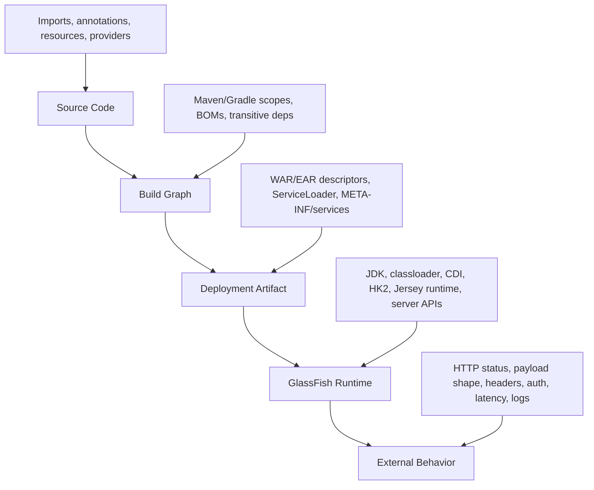
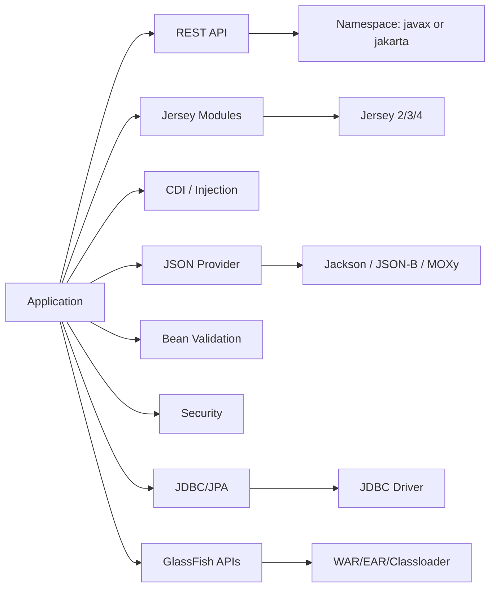
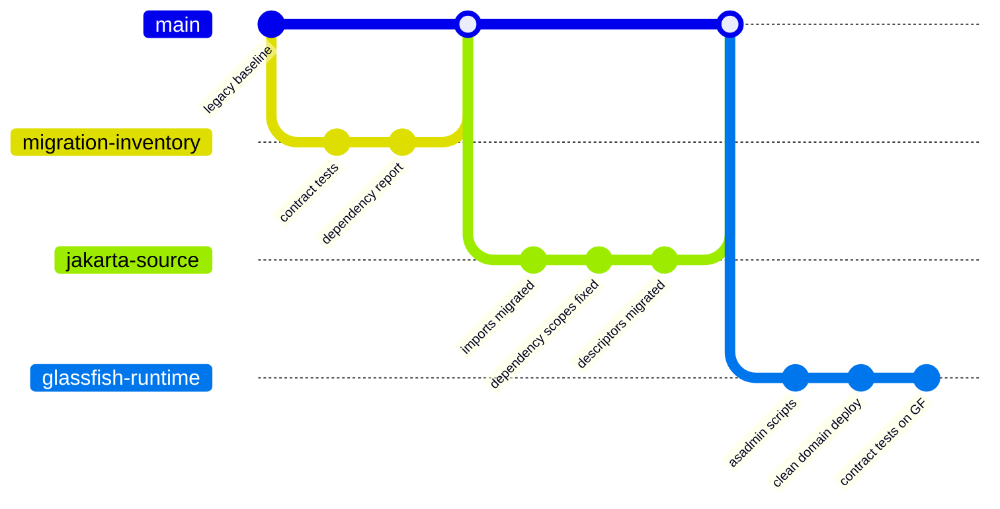
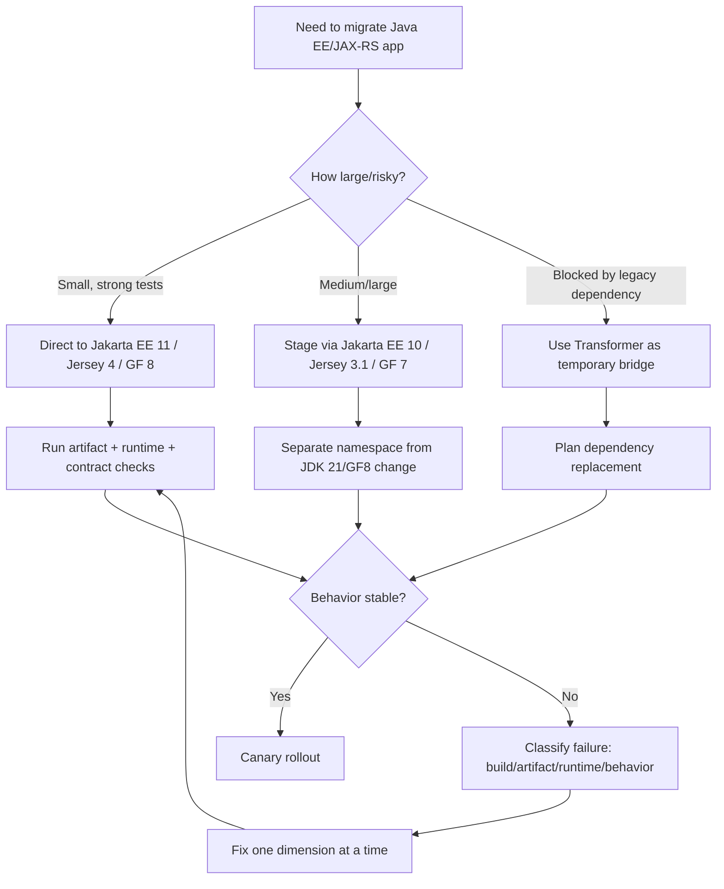

# Part 031 — Migration Playbook: Java EE/JAX-RS to Jakarta/Jersey/GlassFish

> Migration is not a search-and-replace project. It is a **behavior-preserving runtime migration** across namespace, dependency graph, container APIs, classloaders, deployment descriptors, provider selection, security model, and operational scripts.

This part is a practical migration playbook for moving an existing Java EE / JAX-RS / Jersey / GlassFish application toward a modern Jakarta stack:

- **Target baseline:** Jakarta EE 11, Jakarta RESTful Web Services 4.0, Jersey 4.x, GlassFish 8.x.
- **Primary migration pressure:** `javax.*` to `jakarta.*` for Jakarta EE APIs.
- **Primary runtime pressure:** application server behavior changes, classloader changes, provider changes, server-provided API changes, and JDK changes.
- **Primary engineering goal:** preserve externally visible behavior while reducing legacy coupling.

We already covered Jakarta REST fundamentals in a previous series. Here, we focus only on **migration mechanics and failure control** for Jersey on GlassFish.

---

## 1. Kaufman Lens: Deconstruct the Migration Skill

Josh Kaufman's model starts by deconstructing a skill into smaller subskills. For migration, the subskills are not “learn Jakarta” or “upgrade dependency.” They are:

1. **Inventory skill** — know exactly what you have.
2. **Compatibility skill** — know which versions can legally work together.
3. **Namespace skill** — separate Java SE `javax.*` from Java/Jakarta EE `javax.*`.
4. **Dependency skill** — control transitive libraries and server-provided APIs.
5. **Runtime skill** — understand how GlassFish boots and deploys your application.
6. **Behavior preservation skill** — prove that API contracts did not drift.
7. **Failure diagnosis skill** — quickly map symptoms to migration root causes.
8. **Rollout skill** — deploy safely without changing too many dimensions at once.

A top-tier engineer does not ask: “How do I migrate imports?”

They ask:

> Which observable behaviors must remain stable, which compatibility boundaries are being crossed, and which runtime assumptions will change when the same application is deployed on a different Jakarta/Jersey/GlassFish baseline?

---

## 2. The Migration Mental Model

A Jersey/GlassFish migration touches four layers at once:



The common failure is to treat migration as only layer A. Real failures usually occur in B, C, or D.

Examples:

- Code compiles but deployment fails because the WAR includes old `javax.ws.rs-api`.
- Deployment succeeds but JSON output changes because the active provider changed.
- Endpoint exists but returns 404 because package scanning did not discover resources after package restructuring.
- Authentication works in tests but fails in GlassFish because principal/role mapping changed.
- Client calls hang because timeout defaults changed or connector behavior changed.
- CI passes but production fails because the app server has different server-provided libraries.

---

## 3. Baseline Version Matrix

Use this table as the first sanity check.

| Era | API Namespace | REST API | Jersey Line | GlassFish Line | Typical JDK Baseline | Migration Note |
|---|---|---:|---:|---:|---:|---|
| Java EE 7/8 | `javax.*` | JAX-RS 2.x | Jersey 2.x | GlassFish 4/5 | 8 | Legacy namespace. Do not mix directly with Jakarta EE 9+ APIs. |
| Jakarta EE 8 | `javax.*` | Jakarta REST 2.1 | Jersey 2.x | GlassFish 5.x | 8 | Name changed to Jakarta EE, but package namespace still `javax.*`. |
| Jakarta EE 9/9.1 | `jakarta.*` | Jakarta REST 3.0 | Jersey 3.0.x | GlassFish 6.x | 8/11 depending distro | Big namespace switch. |
| Jakarta EE 10 | `jakarta.*` | Jakarta REST 3.1 | Jersey 3.1.x | GlassFish 7.x | 11+ | Modern Jakarta baseline before EE 11. |
| Jakarta EE 11 | `jakarta.*` | Jakarta REST 4.0 | Jersey 4.x | GlassFish 8.x | 21+ | Current target for this series. |

The most important invariant:

> Do not mix Java EE/Jakarta EE 8 `javax.*` APIs with Jakarta EE 9+ `jakarta.*` APIs in the same application boundary unless you are deliberately using a bridge/transform strategy and you fully understand classloader isolation.

---

## 4. Migration Strategy: Big Bang vs Staged

There are three realistic migration strategies.

### 4.1 Strategy A — Direct Migration

Move from old runtime directly to Jakarta EE 11 / GlassFish 8 / Jersey 4.

Use when:

- Application is small or well-tested.
- Dependency graph is clean.
- No large amount of legacy `web.xml`, `sun-web.xml`, custom provider, old Jersey module, or server-specific APIs.
- You can afford a focused migration window.

Risk:

- Too many dimensions change at once: namespace, JDK, server, Jersey, CDI, JSON provider, security, and deployment.

### 4.2 Strategy B — Two-Step Runtime Migration

Move first to Jakarta EE 10 / GlassFish 7 / Jersey 3.1, then to Jakarta EE 11 / GlassFish 8 / Jersey 4.

Use when:

- Application is medium/large.
- You need to separate namespace migration from JDK 21/runtime changes.
- You want easier failure isolation.

Benefit:

- Step 1 handles `javax` → `jakarta` and Jersey 2 → 3.x.
- Step 2 handles Jakarta EE 11, Jersey 4.x, GlassFish 8.x, and JDK 21+.

### 4.3 Strategy C — Binary Transform as Temporary Bridge

Use Eclipse Transformer or equivalent tooling to transform artifacts or third-party dependencies from `javax` to `jakarta`.

Use when:

- You depend on a library that has no Jakarta-compatible release yet.
- You need a fast compatibility experiment.
- You need to prove runtime feasibility before committing source migration.

Risk:

- Transformed binaries can hide long-term dependency risk.
- It does not fix semantic changes, removed APIs, behavior differences, or unsupported libraries.
- It can complicate debugging because source, bytecode, and runtime package names may differ.

Recommended posture:

> Use binary transformation to reduce uncertainty, not as your permanent architecture.

---

## 5. The Migration Dependency Graph

Before changing code, map your dependency graph.



Inventory must answer:

1. Which dependencies expose `javax.*` types in public signatures?
2. Which dependencies use Jakarta EE APIs transitively?
3. Which dependencies are server-provided and should not be packaged?
4. Which dependencies must be deployed as server libraries?
5. Which providers are discovered via `META-INF/services`?
6. Which resources/providers are discovered via package scanning?
7. Which deployment descriptors reference old class names or old namespaces?
8. Which tests assert HTTP behavior instead of implementation details?

A migration without dependency inventory is not engineering. It is gambling.

---

## 6. Namespace Migration: `javax` Is Not One Thing

The dangerous misconception:

> “All `javax.*` becomes `jakarta.*`.”

False.

There are at least two families:

| Category | Example | Migration |
|---|---|---|
| Java SE APIs | `javax.net.ssl`, `javax.crypto`, `javax.sql`, `javax.naming`, `javax.management`, `javax.imageio` | Usually stays `javax.*` because it belongs to the JDK. |
| Java/Jakarta EE APIs | `javax.ws.rs`, `javax.servlet`, `javax.enterprise`, `javax.inject`, `javax.validation`, `javax.annotation`, `javax.persistence` | Migrates to `jakarta.*` for Jakarta EE 9+. |

Bad migration:

```java
// Wrong: this is Java SE and should not be changed to jakarta.sql
import javax.sql.DataSource;
```

Correct:

```java
import javax.sql.DataSource;
```

But this changes:

```java
// Old Java EE / Jakarta EE 8
import javax.ws.rs.GET;
import javax.ws.rs.Path;
```

To:

```java
// Jakarta EE 9+
import jakarta.ws.rs.GET;
import jakarta.ws.rs.Path;
```

This distinction is one of the most important safeguards in the entire migration.

---

## 7. Source Migration Workflow

### 7.1 Step 1 — Freeze Behavior

Before modifying imports, freeze externally visible behavior.

Create tests for:

- route registration;
- HTTP status codes;
- error response payload;
- validation failure format;
- JSON field names;
- content negotiation;
- authentication and authorization;
- CORS behavior;
- correlation ID behavior;
- streaming behavior;
- timeout behavior;
- database transaction rollback behavior.

A minimal API contract test:

```java
class AccountResourceContractTest {

    @Test
    void get_missing_account_returns_stable_404_contract() {
        Response response = client.target(baseUri)
            .path("/accounts/unknown")
            .request("application/json")
            .get();

        assertEquals(404, response.getStatus());

        ErrorResponse body = response.readEntity(ErrorResponse.class);
        assertEquals("ACCOUNT_NOT_FOUND", body.code());
        assertNotNull(body.correlationId());
    }
}
```

The test protects behavior while the internals move.

### 7.2 Step 2 — Pin the Target BOM

Use a single BOM for Jakarta/Jersey dependencies where possible.

Maven sketch:

```xml
<dependencyManagement>
  <dependencies>
    <dependency>
      <groupId>org.glassfish.jersey</groupId>
      <artifactId>jersey-bom</artifactId>
      <version>${jersey.version}</version>
      <type>pom</type>
      <scope>import</scope>
    </dependency>
  </dependencies>
</dependencyManagement>
```

Then do not let transitive dependencies select random Jersey modules.

### 7.3 Step 3 — Fix API Scopes

For applications deployed to GlassFish, Jakarta APIs are generally server-provided.

Typical WAR dependency posture:

```xml
<dependency>
  <groupId>jakarta.ws.rs</groupId>
  <artifactId>jakarta.ws.rs-api</artifactId>
  <version>4.0.0</version>
  <scope>provided</scope>
</dependency>
```

Do not blindly package server APIs into `WEB-INF/lib`.

Bad artifact smell:

```text
WEB-INF/lib/jakarta.ws.rs-api-*.jar
WEB-INF/lib/jakarta.servlet-api-*.jar
WEB-INF/lib/jakarta.enterprise.cdi-api-*.jar
```

This can cause class identity conflicts, provider mismatch, deployment errors, or runtime behavior differences.

### 7.4 Step 4 — Convert Imports Carefully

Use automated tools for mechanical conversion, then review manually.

Review categories:

- `javax.ws.rs.*` → `jakarta.ws.rs.*`
- `javax.ws.rs.ext.*` → `jakarta.ws.rs.ext.*`
- `javax.servlet.*` → `jakarta.servlet.*`
- `javax.validation.*` → `jakarta.validation.*`
- `javax.inject.*` → `jakarta.inject.*`
- `javax.enterprise.*` → `jakarta.enterprise.*`
- `javax.annotation.*` → `jakarta.annotation.*`
- `javax.persistence.*` → `jakarta.persistence.*` if persistence is in scope

Do not convert:

- `javax.sql.*`
- `javax.naming.*`
- `javax.net.*`
- `javax.crypto.*`
- `javax.management.*`
- `javax.xml.*` depending exact API ownership
- `javax.imageio.*`

### 7.5 Step 5 — Update Deployment Descriptors

Search in:

```text
src/main/webapp/WEB-INF/web.xml
src/main/webapp/WEB-INF/glassfish-web.xml
src/main/webapp/WEB-INF/sun-web.xml
src/main/resources/META-INF/services/*
src/main/resources/META-INF/beans.xml
src/main/resources/META-INF/persistence.xml
src/main/resources/*.properties
Dockerfile
asadmin scripts
CI/CD templates
```

Typical issue:

```xml
<servlet-class>org.glassfish.jersey.servlet.ServletContainer</servlet-class>
```

This class name may remain the same across some versions, but its dependencies and runtime API namespace change. The descriptor may look harmless while the underlying graph is wrong.

### 7.6 Step 6 — Rebuild and Inspect Artifact

Do not trust Maven output alone. Inspect the actual WAR/EAR.

```bash
jar tf target/app.war | sort > war-content.txt
```

Look for:

```bash
grep -E "javax\.ws\.rs|jakarta\.ws\.rs|jersey|servlet|validation|cdi|jaxb" war-content.txt
```

Also run dependency tree:

```bash
mvn dependency:tree -Dincludes=javax.*,jakarta.*,org.glassfish.jersey
```

The actual artifact is the truth.

### 7.7 Step 7 — Deploy to Clean GlassFish Domain

Never validate a migration on a dirty server.

Use a fresh domain:

```bash
asadmin create-domain --adminport 4848 migrated-domain
asadmin start-domain migrated-domain
asadmin deploy --contextroot app target/app.war
```

A dirty domain can hide missing resources, old libraries, old JDBC drivers, old JVM options, and old security realms.

### 7.8 Step 8 — Run Contract Tests Against the Real Runtime

Unit tests are not enough.

Run contract tests against deployed GlassFish:

```bash
BASE_URL=http://localhost:8080/app mvn verify -Pcontract-tests
```

Assert:

- all expected routes exist;
- unsupported methods return stable status;
- invalid input returns stable error contract;
- auth failure returns 401, not 500;
- forbidden access returns 403, not 404 unless deliberately masked;
- JSON fields remain stable;
- streaming endpoints do not buffer entire payloads;
- transaction rollback works.

---

## 8. Jersey 2 → 3 → 4 Migration Model

### 8.1 Jersey 2.x to 3.x

Primary change:

- JAX-RS / Java EE `javax.*` becomes Jakarta REST / Jakarta EE `jakarta.*`.

Expect changes in:

- dependencies;
- servlet API;
- validation API;
- CDI API;
- JSON provider modules;
- test containers;
- third-party libraries;
- examples/tutorial code.

### 8.2 Jersey 3.0.x to 3.1.x

Typical pressure:

- Jakarta EE 10 alignment;
- Jakarta REST 3.1 alignment;
- provider/module compatibility;
- JDK baseline changes depending stack.

### 8.3 Jersey 3.1.x to 4.x

Typical pressure:

- Jakarta EE 11 / Jakarta REST 4.0 alignment;
- JDK 21+ in GlassFish 8 runtime;
- removed legacy dependencies from Jakarta REST 4.0;
- updated transitive dependencies;
- stricter compatibility with modern Jakarta APIs.

Engineering rule:

> Do not upgrade Jersey in isolation when deploying to GlassFish. Upgrade Jersey, Jakarta APIs, and GlassFish compatibility together.

---

## 9. GlassFish Migration Model

### 9.1 GlassFish 5.x Era

Likely characteristics:

- Java EE / Jakarta EE 8 style packages: `javax.*`.
- Legacy deployment assumptions.
- JDK 8-era application assumptions.

### 9.2 GlassFish 6.x Era

Likely characteristics:

- Jakarta EE 9 namespace: `jakarta.*`.
- Major package namespace transition.

### 9.3 GlassFish 7.x Era

Likely characteristics:

- Jakarta EE 10.
- Modern Jakarta namespace.
- Useful stepping stone before GlassFish 8 if your system is large.

### 9.4 GlassFish 8.x Era

Likely characteristics:

- Jakarta EE 11.
- JDK 21+ runtime.
- New platform behavior and dependency versions.
- Strong need to revisit JVM options, GC, TLS defaults, monitoring, and operational scripts.

Migration implication:

> GlassFish migration is not just server replacement. It is deployment descriptor migration, resource migration, admin script migration, classloader migration, and operational baseline migration.

---

## 10. JDK Migration Pressure

Moving to GlassFish 8 implies JDK 21+ baseline.

That affects:

- old JVM flags;
- GC defaults;
- TLS/certificate behavior;
- illegal reflective access assumptions;
- removed Java EE modules from JDK-era assumptions;
- bytecode target;
- old libraries that do reflection on JDK internals;
- container memory sizing;
- performance profiles.

Review:

```bash
java -version
mvn -version
mvn -q -DskipTests=false test
mvn -q -DskipTests package
jdeps --multi-release 21 --ignore-missing-deps target/app.war
```

A migration that compiles on JDK 21 can still fail at runtime because older libraries assume internal JDK APIs.

---

## 11. Provider Migration: JSON Is a High-Risk Zone

A Jakarta/Jersey migration often changes JSON behavior unintentionally.

High-risk behavior:

- date/time format;
- enum casing;
- null inclusion;
- unknown property handling;
- record support;
- field vs getter discovery;
- polymorphic serialization;
- exception payload shape;
- `BigDecimal` formatting;
- binary field encoding.

Checklist:

1. Identify current provider: Jackson, JSON-B, MOXy, custom provider.
2. Confirm provider module compatible with Jersey target line.
3. Register provider explicitly if behavior matters.
4. Use contract snapshots for critical payloads.
5. Assert error responses, not only success responses.

Example explicit registration:

```java
@ApplicationPath("/api")
public class ApiApplication extends ResourceConfig {
    public ApiApplication() {
        register(AccountResource.class);
        register(GlobalExceptionMapper.class);
        register(ObjectMapperProvider.class);
    }
}
```

Avoid relying on accidental provider discovery for critical systems.

---

## 12. CDI/HK2 Migration Risks

Jersey uses its own internal injection model and integrates with Jakarta EE/CDI depending environment.

Common migration failures:

- `UnsatisfiedDependencyException` after namespace change.
- HK2 binder still registers old class names.
- Custom `Factory<T>` imports old `javax.inject` or old Jersey APIs.
- CDI bean archive discovery changes due to `beans.xml` mode.
- Request-scoped dependency injected into singleton resource incorrectly.
- Manual resource construction bypasses injection.

Review:

```java
public class ServicesFeature implements Feature {
    @Override
    public boolean configure(FeatureContext context) {
        context.register(new AbstractBinder() {
            @Override
            protected void configure() {
                bind(DefaultClock.class).to(Clock.class).in(Singleton.class);
            }
        });
        return true;
    }
}
```

After migration, verify all imported `Singleton`, `Inject`, `Provider`, and CDI annotations come from the correct package family.

---

## 13. Security Migration Risks

Security migration touches both application and server.

Review:

- token filter imports;
- `SecurityContext` package;
- principal type;
- role mapping;
- `web.xml` security constraints;
- GlassFish realms;
- JAAS login modules;
- Jakarta Security identity stores;
- admin security settings;
- TLS settings;
- CORS and preflight behavior;
- error response behavior for 401/403.

Preserve this invariant:

> Authentication failure, authorization failure, and internal security exception must not collapse into the same HTTP response.

Example policy:

| Case | Expected Status | Response Body |
|---|---:|---|
| Missing token | 401 | safe auth error, no stack trace |
| Invalid token | 401 | safe auth error, no token details |
| Valid token but insufficient permission | 403 | safe forbidden error |
| Auth service unavailable | 503 or 500 depending policy | correlation ID + generic message |

---

## 14. Deployment Descriptor Migration

Search all XML and properties for old names.

```bash
grep -R "javax\.\|com\.sun\.\|org\.glassfish\.jersey" src/main src/test Dockerfile scripts || true
```

Examples to inspect:

```xml
<web-app xmlns="https://jakarta.ee/xml/ns/jakartaee"
         xmlns:xsi="http://www.w3.org/2001/XMLSchema-instance"
         xsi:schemaLocation="https://jakarta.ee/xml/ns/jakartaee https://jakarta.ee/xml/ns/jakartaee/web-app_6_0.xsd"
         version="6.0">
</web-app>
```

Do not blindly copy old descriptors. In many modern Jersey applications, programmatic `ResourceConfig` plus minimal descriptor is safer.

---

## 15. Server Resource Migration

GlassFish resources must be migrated deliberately.

Inventory:

```bash
asadmin list-jdbc-connection-pools
asadmin list-jdbc-resources
asadmin list-jms-resources
asadmin list-auth-realms
asadmin list-network-listeners
asadmin list-threadpools
asadmin list-jvm-options
```

Export old configuration into reviewable scripts. Do not manually click through Admin Console and hope it matches production.

Migration script shape:

```bash
#!/usr/bin/env bash
set -euo pipefail

asadmin create-jdbc-connection-pool \
  --datasourceclassname org.postgresql.ds.PGSimpleDataSource \
  --restype javax.sql.DataSource \
  --property "serverName=${DB_HOST}:portNumber=${DB_PORT}:databaseName=${DB_NAME}:user=${DB_USER}:password=${DB_PASSWORD}" \
  appPool || true

asadmin create-jdbc-resource \
  --connectionpoolid appPool \
  jdbc/app || true
```

Note: `javax.sql.DataSource` remains Java SE and is still valid.

---

## 16. Migration Failure Taxonomy

| Symptom | Likely Cause | First Diagnostic |
|---|---|---|
| Compile error: package `javax.ws.rs` missing | Source not migrated or wrong API dependency | Inspect imports and dependencies |
| Compile error: package `jakarta.ws.rs` missing | Missing Jakarta REST API dependency | Check BOM/API scope |
| Deployment fails with `NoClassDefFoundError` | Missing or incompatible transitive dependency | Inspect server log and WAR contents |
| `NoSuchMethodError` at runtime | Version mismatch between API and implementation | Dependency tree + GlassFish library list |
| 404 for known endpoint | Resource not registered/scanned | Check `ResourceConfig` and application path |
| 415 | `@Consumes` or reader provider mismatch | Check media type and providers |
| 406 | `@Produces` or writer provider mismatch | Check `Accept` header and providers |
| 500 on validation error | Validation mapper missing or wrong package | Check `ConstraintViolationException` package |
| Auth roles always false | Principal/role mapping changed | Check realm, groups, `SecurityContext` |
| JSON changed | Provider changed or mapper config not registered | Explicit provider registration test |
| Works in unit test, fails on server | Test uses different runtime/provider/classloader | Deploy to clean GlassFish and run contract tests |

---

## 17. Migration Branching Model

Use a controlled branch sequence:



This structure creates rollback points and makes code review possible.

---

## 18. Production Rollout Model

A migration is not complete when it deploys. It is complete when it survives controlled production rollout.

Recommended phases:

1. **Build green** — source migration compiles.
2. **Artifact clean** — WAR/EAR contains expected libraries only.
3. **Clean domain deploy** — starts on fresh GlassFish domain.
4. **Contract tests green** — external behavior stable.
5. **Performance smoke** — latency and memory within expected range.
6. **Security smoke** — authN/authZ/error leakage checked.
7. **Observability smoke** — logs, metrics, health, correlation ID checked.
8. **Shadow/canary** — traffic subset or mirrored read-only requests.
9. **Progressive rollout** — increase traffic gradually.
10. **Rollback tested** — old version can be restored safely.

---

## 19. Migration Review Checklist

### Code

- [ ] No old `javax.ws.rs`, `javax.servlet`, `javax.validation`, `javax.enterprise`, `javax.inject` imports remain.
- [ ] Java SE `javax.*` imports were not incorrectly migrated.
- [ ] `ResourceConfig` registers critical resources/providers explicitly.
- [ ] Exception mappers use Jakarta exception types.
- [ ] Filters/interceptors use Jakarta/Jersey-compatible APIs.
- [ ] Security filters set `SecurityContext` consistently.

### Build

- [ ] Jersey version is controlled by BOM or equivalent dependency management.
- [ ] Server-provided Jakarta APIs use `provided` scope.
- [ ] No duplicate REST/Servlet/CDI/Validation APIs in WAR.
- [ ] JSON provider compatible with Jersey target.
- [ ] JDBC driver placement is deliberate.
- [ ] Dependency tree has no accidental Jersey 2/3/4 mixture.

### Artifact

- [ ] WAR/EAR inspected after build.
- [ ] `META-INF/services` entries checked.
- [ ] Descriptors updated or removed if obsolete.
- [ ] No legacy server-specific descriptor accidentally controls behavior.

### Runtime

- [ ] Deployed to clean GlassFish domain.
- [ ] asadmin scripts are idempotent.
- [ ] JDBC resources recreated explicitly.
- [ ] Security realms/identity stores configured.
- [ ] TLS/network listeners configured.
- [ ] Monitoring/logging enabled at expected level.

### Behavior

- [ ] Contract tests pass against real runtime.
- [ ] Error payloads stable.
- [ ] Auth behavior stable.
- [ ] JSON serialization stable.
- [ ] Content negotiation stable.
- [ ] Streaming behavior stable.
- [ ] Performance smoke passes.

---

## 20. Anti-Patterns in Migration Projects

### 20.1 The Search-and-Replace Migration

Replacing `javax.` with `jakarta.` globally is unsafe.

Why:

- Java SE `javax.*` packages should remain.
- Config files may require schema/version changes.
- Third-party dependencies may still expose old types.
- Runtime semantics are not captured by import replacement.

### 20.2 The “It Compiles, Ship It” Migration

Compilation proves only source compatibility. It does not prove deployment compatibility.

You still need:

- artifact inspection;
- clean domain deployment;
- contract tests;
- provider verification;
- classloader verification;
- operational smoke tests.

### 20.3 The Dirty Server Migration

Testing against a server that already contains old libraries, old resources, and old config invalidates the result.

Always test against a reproducible clean domain.

### 20.4 The Permanent Binary Transform Migration

Binary transformation can help bridge unavailable dependencies, but using it forever creates hidden operational complexity.

Prefer replacing dependencies with Jakarta-compatible versions.

### 20.5 The Unowned Provider Migration

If JSON provider behavior matters, register it explicitly and test it.

Do not let classpath order decide your API contract.

---

## 21. Decision Tree



---

## 22. 20-Hour Deliberate Practice Plan

### Hours 1–3 — Inventory

- Generate dependency tree.
- Inspect WAR/EAR.
- Search old namespaces.
- Identify provider/security/database dependencies.

Deliverable: migration inventory document.

### Hours 4–6 — Contract Tests

- Write tests for top 10 critical endpoints.
- Include error paths and auth paths.
- Include one JSON snapshot test.

Deliverable: behavior baseline.

### Hours 7–10 — Source and Dependency Migration

- Convert Jakarta EE imports.
- Fix dependencies and scopes.
- Update descriptors.
- Compile and package.

Deliverable: clean build.

### Hours 11–14 — Runtime Deployment

- Create clean GlassFish domain.
- Apply `asadmin` config.
- Deploy WAR/EAR.
- Fix classloading/resource failures.

Deliverable: clean domain deployment.

### Hours 15–17 — Behavior and Observability

- Run contract tests against GlassFish.
- Verify logs, metrics, health, correlation ID.
- Compare representative payloads.

Deliverable: runtime validation report.

### Hours 18–20 — Hardening and Rollout Plan

- Create rollback plan.
- Create canary plan.
- Create migration review checklist.
- Document known deviations.

Deliverable: production migration readiness packet.

---

## 23. Final Mental Model

A safe migration has one controlling idea:

> Change the implementation stack without accidentally changing the business contract.

That means:

- the code imports change;
- the dependency graph changes;
- the application server changes;
- the classloader behavior may change;
- the provider selection may change;
- the security integration may change;
- the JDK runtime may change;
- but the external behavior should only change where you explicitly decide it should.

Top-tier migration engineering is not speed. It is controlled change.

---

## 24. Source Anchors

Use these as primary reference anchors while executing real migrations:

- Jakarta RESTful Web Services 4.0 specification: https://jakarta.ee/specifications/restful-ws/4.0/
- Jakarta EE 11 release page: https://jakarta.ee/release/11/
- Eclipse Jersey website and version lines: https://jersey.github.io/
- Jersey migration guide: https://eclipse-ee4j.github.io/jersey.github.io/documentation/latest3x/migration.html
- Eclipse Jersey 4.0 release metadata: https://projects.eclipse.org/projects/ee4j.jersey/releases/4.0.0
- Eclipse GlassFish website: https://glassfish.org/
- GlassFish release notes: https://glassfish.org/docs/latest/release-notes.html
- Eclipse Transformer project: https://github.com/eclipse-transformer/transformer

---

## 25. What Comes Next

Next part: **Common Pitfalls and Anti-Patterns Catalog**.

The migration playbook tells us how to move. The next part tells us what usually goes wrong, how to detect it early, and how to prevent recurring runtime problems before they become production incidents.
