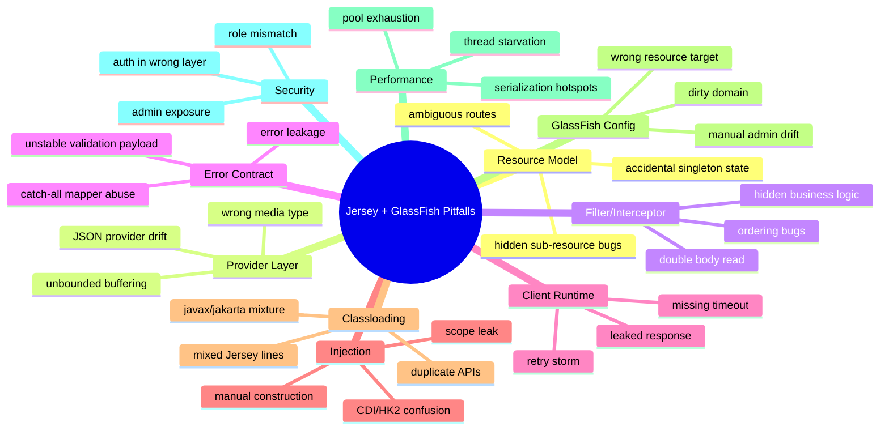

# Part 032 — Common Pitfalls and Anti-Patterns Catalog

> A pitfall is not merely a mistake. In production systems, a pitfall is a **recurring failure shape** that survives code review because it looks reasonable locally but violates runtime invariants.

This part catalogs common Jersey + GlassFish pitfalls. The goal is not to memorize bugs. The goal is to build fast recognition.

A top-tier engineer sees a symptom and immediately asks:

- Is this source code failure?
- Is this provider selection failure?
- Is this classloader failure?
- Is this container configuration failure?
- Is this security boundary failure?
- Is this concurrency/resource failure?
- Is this deployment topology failure?

---

## 1. Pitfall Taxonomy



Use this taxonomy during design review, PR review, migration review, and incident analysis.

---

## 2. Resource Model Pitfalls

### 2.1 Ambiguous Route Model

Bad smell:

```java
@Path("/cases")
public class CaseResource {

    @GET
    @Path("/{id}")
    public CaseDto byId(@PathParam("id") String id) { ... }

    @GET
    @Path("/{status}")
    public List<CaseDto> byStatus(@PathParam("status") String status) { ... }
}
```

Both paths have the same shape. The code compiles, but dispatch intent is unclear.

Better:

```java
@Path("/cases")
public class CaseResource {

    @GET
    @Path("/{id}")
    public CaseDto byId(@PathParam("id") CaseId id) { ... }

    @GET
    @Path("/status/{status}")
    public List<CaseDto> byStatus(@PathParam("status") CaseStatus status) { ... }
}
```

Invariant:

> A URI should not require business interpretation to decide which Java method handles it.

Detection:

- Generate route registry during startup.
- Contract-test ambiguous URI examples.
- Prefer explicit path segments for different lookup modes.

---

### 2.2 Resource Singleton with Mutable State

Bad:

```java
@Path("/exports")
@Singleton
public class ExportResource {
    private ExportRequest current;

    @POST
    public Response start(ExportRequest request) {
        this.current = request;
        return Response.accepted().build();
    }
}
```

This is unsafe under concurrent requests.

Better:

```java
@Path("/exports")
public class ExportResource {
    private final ExportService service;

    public ExportResource(ExportService service) {
        this.service = service;
    }

    @POST
    public Response start(ExportRequest request) {
        ExportId id = service.start(request);
        return Response.accepted(new ExportAccepted(id)).build();
    }
}
```

Invariant:

> Request-specific state belongs in method parameters, request-scoped objects, database rows, queues, or explicit workflow state — not mutable fields on singleton resources.

---

### 2.3 Sub-Resource Locator Obscurity

Sub-resource locators are powerful but can hide route ownership.

Risky:

```java
@Path("/cases")
public class CaseRootResource {

    @Path("/{caseId}")
    public Object locate(@PathParam("caseId") String caseId) {
        if (caseId.startsWith("ENF-")) {
            return new EnforcementCaseResource(caseId);
        }
        return new GenericCaseResource(caseId);
    }
}
```

Problems:

- Manual construction may bypass injection.
- Route ownership becomes dynamic.
- Debugging 404/405 becomes harder.
- Security annotations may be less obvious.

Use locators when the hierarchy is real, not merely to encode business dispatch.

---

## 3. Provider Pitfalls

### 3.1 Accidental JSON Provider Drift

Symptom:

- Dates change format after migration.
- Null fields appear/disappear.
- Records serialize differently.
- Unknown fields are accepted/rejected differently.
- Error response shape changes.

Root cause:

- Active JSON provider changed due to classpath or server upgrade.

Bad posture:

```text
"Whatever provider Jersey discovers is fine."
```

Production posture:

```java
@Provider
public class ObjectMapperProvider implements ContextResolver<ObjectMapper> {
    private final ObjectMapper mapper;

    public ObjectMapperProvider() {
        this.mapper = new ObjectMapper()
            .findAndRegisterModules()
            .disable(SerializationFeature.WRITE_DATES_AS_TIMESTAMPS)
            .disable(DeserializationFeature.FAIL_ON_UNKNOWN_PROPERTIES);
    }

    @Override
    public ObjectMapper getContext(Class<?> type) {
        return mapper;
    }
}
```

Then register explicitly:

```java
register(ObjectMapperProvider.class);
```

Invariant:

> Serialization configuration is part of the API contract.

---

### 3.2 Overbroad MessageBodyReader

Bad:

```java
@Provider
@Consumes("*/*")
public class CatchAllReader implements MessageBodyReader<Object> {
    ...
}
```

This can hijack provider selection and break unrelated endpoints.

Better:

```java
@Provider
@Consumes("application/vnd.company.case-command+json")
public class CaseCommandReader implements MessageBodyReader<CaseCommand> {
    ...
}
```

Invariant:

> Custom providers should be as narrow as possible in Java type and media type.

---

### 3.3 Entity Buffering of Large Payloads

Bad:

```java
byte[] data = inputStream.readAllBytes();
```

This makes payload size a heap risk.

Better:

```java
try (InputStream in = requestStream;
     OutputStream out = fileStore.openWrite(id)) {
    in.transferTo(out);
}
```

Add controls:

- max upload size;
- content type allowlist;
- streaming virus scan if required;
- timeout;
- disk quota;
- cancellation handling.

---

## 4. Filter and Interceptor Pitfalls

### 4.1 Business Logic in Filters

Bad:

```java
@Provider
public class CaseStatusFilter implements ContainerRequestFilter {
    @Override
    public void filter(ContainerRequestContext ctx) {
        if (ctx.getUriInfo().getPath().contains("appeal")) {
            // modifies business state
        }
    }
}
```

Why this is dangerous:

- Hidden side effects.
- Hard to test at resource level.
- Hard to reason about transaction boundary.
- Unexpected execution for unrelated endpoints.

Good filter responsibilities:

- correlation ID;
- authentication;
- authorization pre-check;
- request logging;
- metrics;
- CORS;
- request size guard;
- audit envelope, not domain mutation.

Invariant:

> Filters control request mechanics. Resources/services control business state.

---

### 4.2 Reading Request Body Twice

Bad:

```java
public void filter(ContainerRequestContext ctx) throws IOException {
    String body = new String(ctx.getEntityStream().readAllBytes(), UTF_8);
    log.info("body={}", body);
}
```

After this, the resource may receive an empty stream unless the stream is replaced.

Better:

- Do not log body by default.
- Log safe metadata.
- If absolutely required, buffer with strict limit and reset stream.
- Never log secrets, tokens, PII, documents, or enforcement-sensitive evidence.

---

### 4.3 Filter Ordering by Accident

Multiple filters without explicit priority can become order-sensitive.

Example desired order:

1. correlation ID;
2. request logging envelope;
3. authentication;
4. authorization;
5. rate limiting;
6. resource execution;
7. response security headers;
8. response logging/metrics.

Use priorities deliberately:

```java
@Provider
@Priority(Priorities.AUTHENTICATION)
public class TokenAuthenticationFilter implements ContainerRequestFilter {
    ...
}
```

Invariant:

> Filter order is architecture, not decoration.

---

## 5. Exception Mapping Pitfalls

### 5.1 Catch-All Mapper That Hides Domain Errors

Bad:

```java
@Provider
public class ThrowableMapper implements ExceptionMapper<Throwable> {
    public Response toResponse(Throwable error) {
        return Response.status(500).entity("error").build();
    }
}
```

Problems:

- Maps authorization bugs as 500.
- Maps validation errors incorrectly.
- Hides operational classification.
- Can swallow framework exceptions that already carry status.

Better:

- specific mapper for domain exceptions;
- specific mapper for validation exceptions;
- specific mapper for `NotFoundException`, `NotAllowedException`, etc. only if you need custom contract;
- final fallback for unexpected exceptions.

```java
@Provider
public class DomainExceptionMapper implements ExceptionMapper<DomainException> {
    @Override
    public Response toResponse(DomainException ex) {
        return Response.status(ex.status())
            .entity(ErrorResponse.from(ex))
            .type(MediaType.APPLICATION_JSON_TYPE)
            .build();
    }
}
```

Invariant:

> Error mapping must preserve semantic category: validation, domain rejection, auth failure, not found, conflict, dependency failure, and bug are not the same thing.

---

### 5.2 Leaking Exception Messages

Bad:

```java
return Response.serverError()
    .entity(Map.of("error", exception.getMessage()))
    .build();
```

Risk:

- SQL details;
- file paths;
- class names;
- token parsing errors;
- internal account IDs;
- stack traces;
- tenant information.

Better:

```java
return Response.serverError()
    .entity(new ErrorResponse(
        "INTERNAL_ERROR",
        "An unexpected error occurred.",
        correlationId
    ))
    .build();
```

Log the internal detail with correlation ID, not in the HTTP body.

---

## 6. Jersey Client Pitfalls

### 6.1 Client Created Per Request

Bad:

```java
public AccountDto fetch(String id) {
    Client client = ClientBuilder.newClient();
    return client.target(baseUrl).path(id).request().get(AccountDto.class);
}
```

Problems:

- connection pooling ineffective;
- resource leak risk;
- TLS setup repeated;
- poor latency;
- harder lifecycle control.

Better:

```java
@ApplicationScoped
public class AccountClient implements AutoCloseable {
    private final Client client;
    private final WebTarget target;

    public AccountClient() {
        this.client = ClientBuilder.newBuilder()
            .connectTimeout(Duration.ofMillis(300))
            .readTimeout(Duration.ofMillis(700))
            .build();
        this.target = client.target("https://accounts.internal/api/accounts");
    }

    public AccountDto fetch(String id) {
        return target.path(id).request(MediaType.APPLICATION_JSON_TYPE).get(AccountDto.class);
    }

    @Override
    public void close() {
        client.close();
    }
}
```

Invariant:

> Jersey Client is a runtime resource. Own its lifecycle explicitly.

---

### 6.2 Missing Timeout

Bad:

```java
client.target(url).request().get(String.class);
```

This may block longer than your request budget.

Design timeout budget:

```text
External request budget: 1000 ms
  edge/proxy: 50 ms
  inbound server queue: 50 ms
  application work: 200 ms
  outbound dependency A: 300 ms
  outbound dependency B: 250 ms
  response serialization: 50 ms
  safety margin: 100 ms
```

Invariant:

> Every outbound call must have a timeout smaller than the remaining inbound request budget.

---

### 6.3 Leaking Response

Bad:

```java
Response response = target.request().get();
if (response.getStatus() == 404) {
    return Optional.empty();
}
return Optional.of(response.readEntity(AccountDto.class));
```

If response is not closed in all paths, connections can leak.

Better:

```java
try (Response response = target.request().get()) {
    if (response.getStatus() == 404) {
        return Optional.empty();
    }
    if (response.getStatusInfo().getFamily() != Response.Status.Family.SUCCESSFUL) {
        throw mapError(response);
    }
    return Optional.of(response.readEntity(AccountDto.class));
}
```

---

### 6.4 Retry Storm

Bad:

```text
Client timeout: 5s
Retry count: 3
Inbound timeout: 3s
```

This guarantees work continues after caller has given up.

Better:

- retry only idempotent operations;
- use jittered backoff;
- respect deadline;
- use circuit breaker;
- avoid retrying validation/auth failures;
- do not retry if request body cannot be safely replayed.

---

## 7. Injection Pitfalls

### 7.1 Manual Construction of Managed Components

Bad:

```java
register(new AccountResource(new AccountService()));
```

This may bypass CDI/HK2 lifecycle, interceptors, proxies, metrics, and configuration.

Better:

```java
register(AccountResource.class);
register(new AbstractBinder() {
    @Override
    protected void configure() {
        bind(AccountService.class).to(AccountService.class);
    }
});
```

Or use CDI-managed beans consistently in a Jakarta EE application.

Invariant:

> If a class expects injection, do not construct it manually unless the construction is itself the composition root.

---

### 7.2 Scope Mismatch

Bad:

```java
@Singleton
public class AuditService {
    @Context
    private HttpServletRequest request;
}
```

A singleton holding request-specific context is a scope trap.

Better:

- pass request context explicitly;
- inject a provider/proxy if supported and understood;
- keep singleton services stateless;
- extract request metadata at boundary.

---

### 7.3 HK2/CDI Double Binding

Symptom:

- two instances of the same service;
- lifecycle callbacks not invoked;
- interceptor not applied;
- test passes but production differs.

Root cause:

- same service registered in HK2 binder and CDI bean archive.

Rule:

> Choose one ownership model per component family. Do not let HK2 and CDI both own the same business service unless you have a specific bridge design.

---

## 8. Classloading Pitfalls

### 8.1 Packaging Server APIs in WAR

Bad artifact:

```text
WEB-INF/lib/jakarta.ws.rs-api-4.0.0.jar
WEB-INF/lib/jakarta.servlet-api-6.1.0.jar
WEB-INF/lib/jakarta.enterprise.cdi-api-*.jar
```

Risk:

- class identity conflict;
- API/implementation mismatch;
- provider discovery failure;
- `LinkageError`;
- deployment failure.

Use `provided` scope for server-provided APIs.

---

### 8.2 Mixing Jersey Lines

Bad dependency graph:

```text
org.glassfish.jersey.core:jersey-server:4.x
org.glassfish.jersey.media:jersey-media-json-jackson:3.x
org.glassfish.jersey.inject:jersey-hk2:2.x
```

This is a runtime time bomb.

Prevention:

- use Jersey BOM;
- enforce dependency convergence;
- inspect final WAR;
- fail build on mixed Jersey major lines.

Maven Enforcer sketch:

```xml
<rules>
  <DependencyConvergence />
  <RequireUpperBoundDeps />
</rules>
```

---

### 8.3 Mixing `javax` and `jakarta`

Bad:

```java
import jakarta.ws.rs.GET;
import javax.validation.Valid;
```

In a Jakarta EE 9+ application, Jakarta EE APIs should generally be consistently `jakarta.*`, except Java SE `javax.*` APIs.

Detection:

```bash
grep -R "import javax\.ws\.rs\|import javax\.validation\|import javax\.servlet\|import javax\.enterprise\|import javax\.inject" src/main/java
```

---

## 9. GlassFish Configuration Pitfalls

### 9.1 Manual Admin Console Drift

Bad process:

- create JDBC pool manually in dev;
- create different pool manually in staging;
- patch production by clicking Admin Console;
- forget what changed.

Better:

- encode with `asadmin` scripts;
- version scripts;
- make scripts idempotent;
- export and diff config;
- treat environment-specific values as variables.

Invariant:

> If the server configuration is required to run the application, it is part of the application delivery system.

---

### 9.2 Dirty Domain Testing

Symptom:

- deployment works on one machine but not another.

Root cause:

- old libraries/resources/config in local GlassFish domain.

Prevention:

```bash
asadmin create-domain clean-test-domain
asadmin start-domain clean-test-domain
asadmin deploy target/app.war
```

---

### 9.3 Wrong Resource Target

In clustered or multi-instance setups, a resource can exist but not be targeted where the app runs.

Symptom:

```text
NameNotFoundException: jdbc/app
```

But admin console shows `jdbc/app` exists.

Likely cause:

- resource exists at domain level but not targeted to instance/cluster;
- app deployed to different target;
- config inheritance misunderstood.

Prevention:

- script resources with explicit target;
- validate JNDI lookup at startup;
- include resource target in deployment checklist.

---

## 10. Performance Pitfalls

### 10.1 Thread Pool Increased to Hide Blocking

Bad fix:

```text
Latency high → increase HTTP thread pool from 200 to 1000
```

This may hide the symptom while making memory, context switching, and downstream pressure worse.

Better diagnosis:

- where are threads blocked?
- DB pool?
- outbound HTTP?
- serialization?
- slow client?
- synchronized lock?
- external dependency?

Invariant:

> Thread pool tuning cannot fix unbounded blocking. It can only move the bottleneck.

---

### 10.2 JDBC Pool Smaller Than Request Concurrency Without Backpressure

Symptom:

- many requests wait for DB connections;
- thread pool fills;
- latency spikes;
- health checks fail.

Design:

```text
HTTP max concurrency > application work queue > DB pool
```

But if all requests require DB, DB pool becomes the real concurrency limit.

Use:

- bounded concurrency;
- timeout waiting for connection;
- fast 503/429 under overload;
- separate pools for critical workloads;
- health signal when pool exhausted.

---

### 10.3 Serialization Hotspot Ignored

Symptoms:

- CPU high;
- DB fast;
- endpoint still slow;
- large JSON payload;
- GC pressure.

Actions:

- measure serialization time separately;
- avoid massive response DTOs;
- paginate;
- use streaming for large exports;
- avoid accidental lazy graph traversal;
- avoid returning ORM entities directly.

---

## 11. Security Pitfalls

### 11.1 Admin Console Exposed

Bad:

```text
Admin console accessible from public network
```

Risk:

- brute force;
- credential leakage;
- remote admin abuse;
- compliance failure.

Prevention:

- bind admin to private network;
- enable secure admin deliberately;
- strong admin credentials;
- firewall rules;
- audit admin access;
- disable console where not needed.

---

### 11.2 Authorization Only in UI

Bad assumption:

> “The frontend hides that button, so the endpoint is safe.”

Server-side resource/service must enforce authorization.

Good pattern:

```java
public CaseDto getCase(UserPrincipal user, CaseId caseId) {
    CaseRecord record = repository.get(caseId);
    authorization.assertCanView(user, record);
    return mapper.toDto(record);
}
```

Invariant:

> UI authorization is usability. Server authorization is security.

---

### 11.3 Role Name Drift

Symptom:

- authenticated user always receives 403.

Cause:

- token contains `case_manager`;
- GlassFish realm maps `case-manager`;
- resource checks `CASE_MANAGER`;
- `SecurityContext.isUserInRole` returns false.

Prevention:

- centralize role constants;
- test role mapping against real runtime;
- log safe role mapping diagnostics;
- document realm/group/scope mapping.

---

## 12. Migration Pitfalls

### 12.1 Global `javax` Replacement

Bad:

```bash
sed -i 's/javax\./jakarta\./g' $(find . -name '*.java')
```

This can corrupt Java SE packages such as `javax.sql`, `javax.net.ssl`, `javax.crypto`, `javax.naming`, and others.

Correct:

- use Jakarta-aware transformer/tools;
- review package categories;
- run compile and tests;
- inspect remaining `javax` imports intentionally.

---

### 12.2 Migrating Source But Not Descriptors

Source compiles, but descriptors still refer to old schema/classes.

Search:

```bash
grep -R "javax\.\|java.sun.com\|xmlns.jcp.org\|web-app_3" src/main/webapp src/main/resources
```

Update or remove obsolete descriptors.

---

### 12.3 Migrating App But Not Operational Scripts

Application deploys locally but fails in CI/prod because scripts still reference old:

- domain path;
- JDK path;
- JDBC driver location;
- resource name;
- JVM option;
- security realm;
- deployment target;
- health endpoint;
- Docker base image.

Migration checklist must include scripts, not only Java code.

---

## 13. Observability Pitfalls

### 13.1 No Correlation ID

Without correlation ID, incident analysis becomes log archaeology.

Minimum behavior:

- accept `X-Correlation-ID` if valid;
- generate if missing;
- add to MDC/log context;
- return in response header;
- include in error payload;
- propagate to outbound clients.

---

### 13.2 Logging Too Much

Bad:

- full request body;
- tokens;
- PII;
- database credentials;
- evidence documents;
- internal security claims.

Good:

- method;
- path template;
- status;
- duration;
- correlation ID;
- user/tenant ID if allowed;
- error code;
- safe dependency outcome.

---

### 13.3 Metrics Without Cardinality Control

Bad metric label:

```text
http_path=/cases/ENF-2026-000000123456
```

This creates high cardinality.

Better:

```text
http_route=/cases/{caseId}
```

Invariant:

> Metrics labels should describe categories, not individual business objects.

---

## 14. Deployment Pitfalls

### 14.1 Build Artifact Not Reproducible

Symptom:

- same commit produces different WAR contents.

Causes:

- dependency ranges;
- SNAPSHOT dependencies;
- build timestamp in generated code;
- uncontrolled plugin version;
- local repository contamination.

Prevention:

- pin plugin versions;
- use lock files or dependency verification where possible;
- no dynamic versions;
- CI builds from clean environment;
- generate SBOM;
- inspect artifact.

---

### 14.2 Deploying Without Startup Validation

Bad:

```text
Application starts even if critical provider/resource/config is missing.
```

Better:

- validate required config at boot;
- validate JNDI resources;
- validate JSON provider registration;
- validate route registry;
- fail fast if deployment is invalid.

Failing fast during deployment is cheaper than failing under production traffic.

---

### 14.3 Health Check Lies

Bad health endpoint:

```java
@GET
@Path("/health")
public String health() {
    return "OK";
}
```

This only proves the JVM can return a string.

Better health levels:

| Endpoint | Purpose | Checks |
|---|---|---|
| startup | Can app initialize? | config, providers, resources |
| liveness | Should process be restarted? | deadlock/fatal state only |
| readiness | Can app receive traffic? | DB pool, required dependencies, migration state |
| deep diagnostic | Operator-only | detailed dependencies |

---

## 15. Review Checklist by Pull Request Type

### Resource PR

- [ ] Routes are unambiguous.
- [ ] Resource has no unsafe mutable request state.
- [ ] Auth is enforced server-side.
- [ ] Validation belongs at boundary.
- [ ] Error behavior is tested.
- [ ] Media types are explicit.

### Provider PR

- [ ] Provider type/media type is narrow.
- [ ] Ordering/priority understood.
- [ ] Large payload behavior safe.
- [ ] Error handling deterministic.
- [ ] Contract tests updated.

### Filter/Interceptor PR

- [ ] No hidden business mutation.
- [ ] Priority explicit.
- [ ] Body is not consumed accidentally.
- [ ] Security/logging privacy reviewed.
- [ ] Metrics labels bounded.

### Client PR

- [ ] Client lifecycle owned.
- [ ] Timeouts configured.
- [ ] Response closed.
- [ ] Retry policy idempotency-safe.
- [ ] Circuit/bulkhead considered.
- [ ] Dependency errors mapped safely.

### Deployment PR

- [ ] WAR/EAR inspected.
- [ ] Server APIs not packaged accidentally.
- [ ] asadmin scripts updated.
- [ ] Config is environment-variable driven.
- [ ] Clean domain deployment tested.
- [ ] Rollback path documented.

### Migration PR

- [ ] Java SE `javax.*` preserved where correct.
- [ ] Jakarta EE APIs migrated consistently.
- [ ] Descriptors migrated.
- [ ] Dependency graph converged.
- [ ] Jersey line consistent.
- [ ] Contract tests pass against real GlassFish.

---

## 16. Symptom-to-Cause Lookup

| Symptom | Likely Pitfall | First Action |
|---|---|---|
| Endpoint returns 404 after deployment | resource scanning/registration issue | print route registry, inspect `ResourceConfig` |
| Endpoint returns 405 | method exists on different path or media mismatch | inspect route + HTTP method |
| Endpoint returns 415 | wrong `Content-Type` or missing reader | inspect `@Consumes` and providers |
| Endpoint returns 406 | `Accept` not compatible with `@Produces` | inspect `Accept`, variants, writer provider |
| Validation returns 500 | mapper/import mismatch | check `jakarta.validation` mapper |
| Random JSON format change | provider drift | register provider explicitly |
| Works locally but not in GlassFish | runtime/classloader mismatch | inspect WAR + server libs |
| `NoSuchMethodError` | mixed dependency versions | dependency tree + BOM |
| DB pool exhausted | missing backpressure or leak | pool metrics + thread dump |
| Threads blocked on outbound call | missing/too-long timeout | thread dump + client config |
| All auth roles false | role mapping drift | inspect realm/token/security context |
| Memory spike on upload | buffering large body | heap dump + upload path review |
| Canary latency high | thread/pool/serialization bottleneck | decompose latency and profile |

---

## 17. The Anti-Pattern Severity Model

Use this severity model in code review.

| Severity | Meaning | Example |
|---|---|---|
| S1 | Immediate production safety risk | admin console public, no auth on protected resource |
| S2 | High likelihood production incident | no timeouts, leaking client response, DB pool exhaustion |
| S3 | Migration/deployment instability | duplicate Jakarta APIs, mixed Jersey versions |
| S4 | Maintainability/diagnostic cost | hidden business logic in filters, ambiguous routes |
| S5 | Local quality issue | minor descriptor cleanup, unused dependency |

Review principle:

> A pattern that is “working now” can still be S1/S2 if it fails under concurrency, migration, or adversarial input.

---

## 18. Preventive Architecture Rules

These rules prevent most recurring Jersey/GlassFish defects:

1. **Own runtime boundaries.** Know what belongs to code, artifact, server, and environment.
2. **Register critical runtime components explicitly.** Providers, mappers, filters, features, and resources should not depend on luck.
3. **Keep resource classes thin.** Boundary parsing, authorization, service call, response mapping.
4. **Do not store request state in singleton fields.** Ever.
5. **Use explicit timeout budgets.** Inbound and outbound.
6. **Close responses.** Treat Jersey Client response as a resource.
7. **Do not package server APIs accidentally.** Use `provided` where appropriate.
8. **Never mix Jersey major lines.** BOM or enforced dependency convergence.
9. **Make GlassFish config reproducible.** `asadmin` scripts over manual drift.
10. **Test on real runtime.** Unit tests do not prove deployment behavior.
11. **Protect error contracts.** No stack traces or raw exception messages.
12. **Preserve observability.** Correlation ID, structured logs, safe metrics.
13. **Make health checks honest.** Readiness must reflect traffic safety.
14. **Avoid global migration replacement.** Know which `javax.*` packages are Java SE.
15. **Review operational scripts in every migration.** Java code is only part of the system.

---

## 19. 20-Hour Deliberate Practice Plan

### Hours 1–4 — Pitfall Recognition Drills

Take an existing Jersey/GlassFish application and classify:

- resource pitfalls;
- provider pitfalls;
- filter pitfalls;
- client pitfalls;
- classloading pitfalls;
- config pitfalls.

Deliverable: pitfall inventory.

### Hours 5–8 — Failure Injection

Inject controlled failures:

- remove provider;
- change media type;
- remove JDBC resource;
- add duplicate API jar;
- remove timeout;
- simulate slow dependency.

Deliverable: symptom-to-cause notes.

### Hours 9–12 — Build Review Gates

Add CI checks:

- dependency convergence;
- banned duplicate APIs;
- route contract tests;
- WAR content inspection;
- namespace check.

Deliverable: automated safety gates.

### Hours 13–16 — Runtime Diagnostics

Practice:

- thread dump reading;
- pool metric review;
- log correlation;
- GlassFish server log analysis;
- contract test against clean domain.

Deliverable: diagnostic runbook.

### Hours 17–20 — Refactor One Anti-Pattern

Pick one high-severity anti-pattern and fix it:

- replace body-logging filter;
- introduce timeout budget;
- remove duplicate API packaging;
- make provider registration explicit;
- convert manual config to `asadmin` script.

Deliverable: before/after review with behavior tests.

---

## 20. Final Mental Model

The most dangerous Jersey/GlassFish bugs are not syntax errors. They are boundary errors:

- boundary between API and implementation;
- boundary between app and server;
- boundary between request and singleton state;
- boundary between HTTP contract and Java exception;
- boundary between provider discovery and deterministic serialization;
- boundary between timeout budget and real dependency latency;
- boundary between manual admin config and reproducible deployment.

The job of a top-tier engineer is to keep these boundaries explicit.

---

## 21. What Comes Next

Next part: **Debugging Playbook: From HTTP Symptom to Runtime Root Cause**.

This pitfall catalog gives us the pattern vocabulary. The next part turns it into a step-by-step diagnostic method for real incidents: 404, 406, 415, 500, deployment failure, memory leak, thread starvation, pool exhaustion, and classloading failure.
