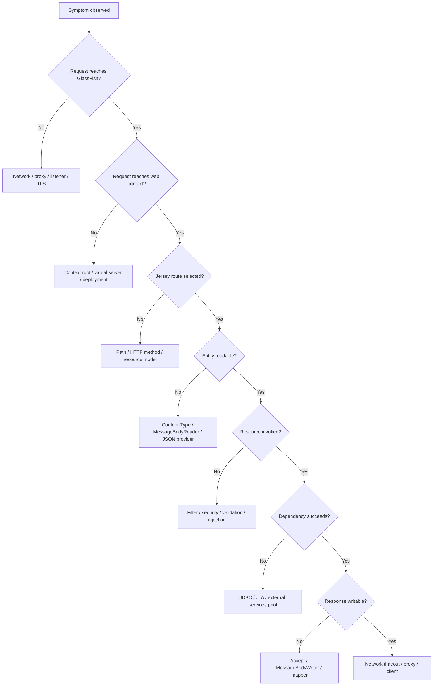
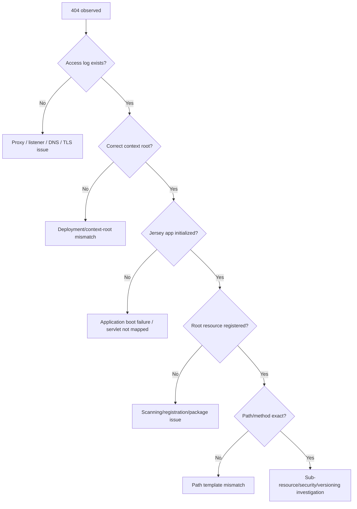
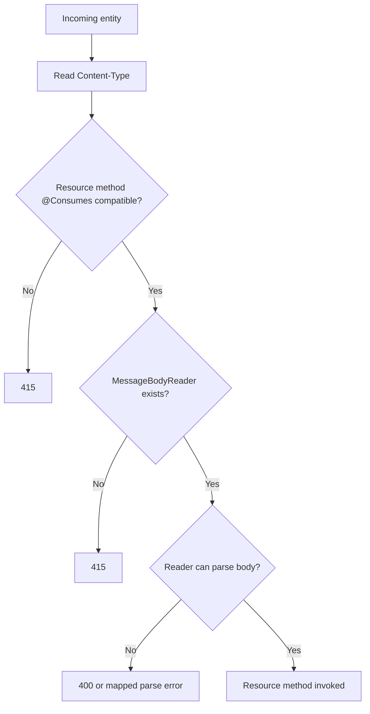
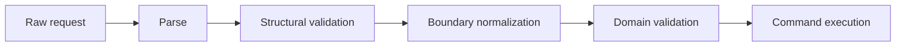
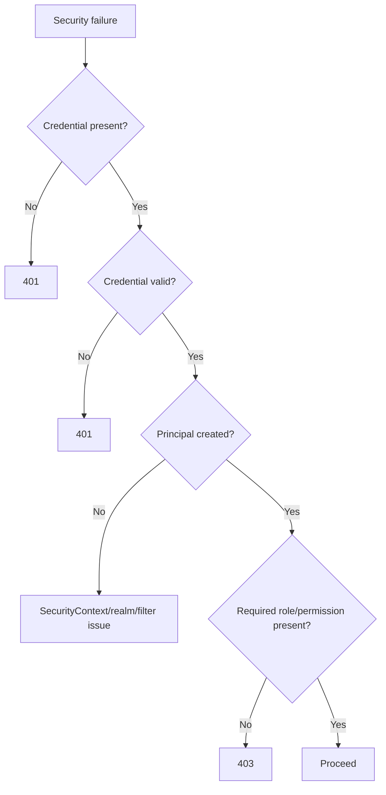
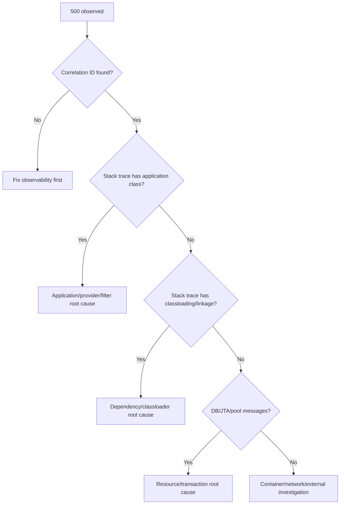
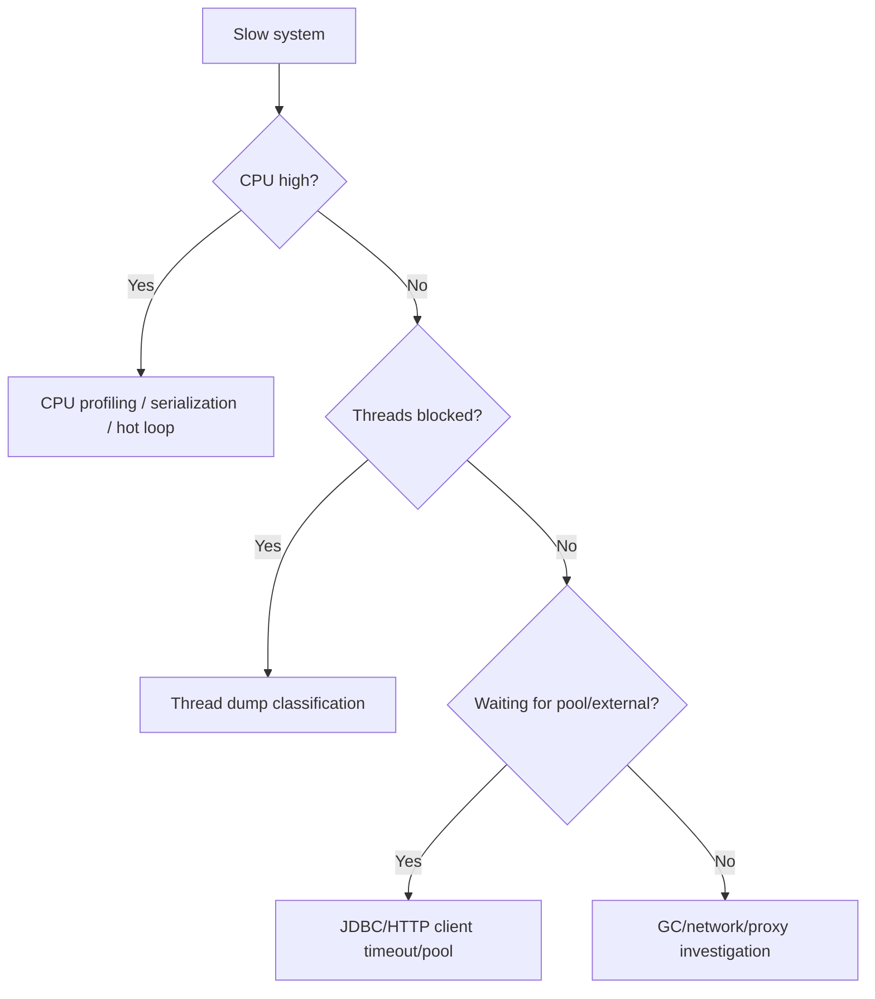
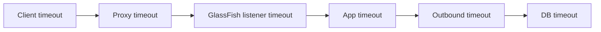
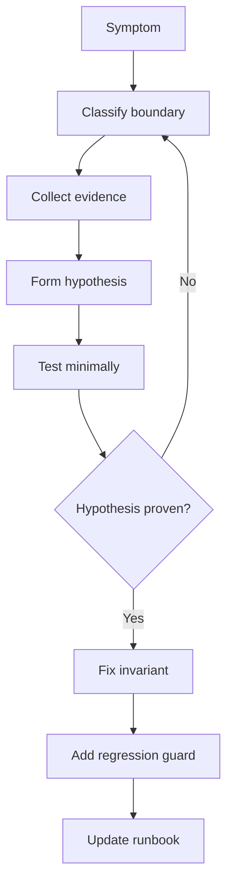

# Part 033 — Debugging Playbook: From HTTP Symptom to Runtime Root Cause

> Target bagian ini: membentuk **debugging reflex** untuk Jersey di GlassFish. Bukan sekadar tahu arti status code, tetapi mampu menelusuri masalah dari gejala eksternal sampai akar masalah runtime: routing, provider, filter, interceptor, injection, classloading, thread pool, JDBC pool, security, deployment, dan network.

---

## 1. Kaufman Deconstruction: Debugging Skill Itu Bukan Satu Skill

Menguasai debugging Jersey + GlassFish berarti mampu memecah masalah menjadi beberapa lapisan yang dapat diverifikasi.

Kesalahan umum engineer menengah adalah langsung menebak:

- "Mungkin route-nya salah."
- "Mungkin dependency-nya conflict."
- "Mungkin GlassFish-nya bug."
- "Mungkin timeout dari database."
- "Mungkin load balancer."

Engineer kuat tidak mulai dari tebakan. Mereka mulai dari **classification**.

Debugging production-grade harus menjawab:

1. **Apa symptom eksternal?**
2. **Di boundary mana symptom muncul?**
3. **Layer mana yang terakhir terbukti sehat?**
4. **Layer mana yang pertama terbukti rusak?**
5. **Apa invariant yang dilanggar?**
6. **Apa bukti minimal untuk root cause?**
7. **Apa fix yang mengurangi risiko regresi?**

Kaufman-style deconstruction untuk debugging:

| Skill sub-domain | Pertanyaan utama |
|---|---|
| HTTP diagnosis | Apakah request mencapai aplikasi, endpoint, dan method yang benar? |
| Jersey resource model | Apakah route, method, media type, dan provider dapat dipilih? |
| Provider pipeline | Apakah entity bisa dibaca/ditulis dengan provider yang tepat? |
| Filter/interceptor | Apakah request/response diubah atau dihentikan di pipeline? |
| Injection/runtime | Apakah dependency lifecycle cocok dengan scope request? |
| GlassFish deployment | Apakah artifact, descriptor, classloader, dan context root benar? |
| Server resources | Apakah pool, thread, listener, JNDI, dan transaction tersedia? |
| Security | Apakah identity, role, policy, dan status 401/403 konsisten? |
| Network edge | Apakah proxy/TLS/load balancer mengubah behavior request? |
| Observability | Apakah log/metric/trace cukup untuk membuktikan diagnosis? |

---

## 2. Mental Model Utama: Debugging sebagai Boundary Narrowing

Jangan melihat aplikasi sebagai "satu sistem besar". Lihat sebagai rantai boundary.

```mermaid
flowchart LR
    C[Client] --> LB[Reverse Proxy / Load Balancer]
    LB --> GF[GlassFish Network Listener]
    GF --> VS[Virtual Server / Context Root]
    VS --> SV[Servlet Container]
    SV --> J[Jersey Servlet / Application]
    J --> RM[Resource Model]
    RM --> F[Filters]
    F --> P[Providers / Interceptors]
    P --> R[Resource Method]
    R --> S[Service Layer]
    S --> DB[JDBC/JTA/External Systems]
```



Debugging yang baik adalah mempersempit lokasi kerusakan:



Ingat: **status code adalah output**, bukan root cause.

---

## 3. Golden Rule: Selalu Kunci 5 Fakta Pertama

Sebelum masuk ke code, kumpulkan 5 fakta ini:

1. **Exact URL**
   - scheme: `http` atau `https`
   - host
   - port
   - context root
   - path
   - query string

2. **HTTP method**
   - `GET`, `POST`, `PUT`, `PATCH`, `DELETE`, etc.

3. **Headers penting**
   - `Content-Type`
   - `Accept`
   - `Authorization`
   - `Host`
   - correlation/request ID
   - proxy headers seperti `X-Forwarded-*`

4. **Payload**
   - ukuran
   - format
   - encoding
   - contoh minimal yang gagal

5. **Server-side evidence**
   - GlassFish server log
   - access log
   - application log
   - correlation ID
   - timestamp absolut
   - instance/node/cluster target

Tanpa lima fakta ini, debugging sering berubah menjadi spekulasi.

---

## 4. Request Trace Template

Gunakan template ini ketika membaca incident.

```text
Request ID      : req-...
Timestamp       : 2026-06-28T10:15:30+07:00
Client          : browser / service / batch / proxy / synthetic check
Method          : POST
URL             : https://api.example.com/regulatory/cases
Context Root    : /regulatory
Resource Path   : /cases
Content-Type    : application/json
Accept          : application/json
Status          : 500
Latency         : 8.2s
GlassFish Target: cluster-prod-a / instance-2
Jersey App      : RegulatoryRestApplication
Matched Resource: unknown / CaseResource#create
Error Mapper    : unknown / GlobalExceptionMapper
DB Pool         : jdbc/regulatoryPool
External Call   : compliance-service
```

Target debugging adalah mengisi field yang awalnya `unknown`.

---

## 5. Symptom: 404 Not Found

### 5.1 Kemungkinan Root Cause

`404` di Jersey + GlassFish tidak selalu berarti resource class tidak ada.

Kemungkinan:

| Boundary | Root cause |
|---|---|
| Network/proxy | Request tidak diteruskan ke GlassFish |
| Virtual server | Host/context mapping salah |
| Deployment | WAR belum deployed, disabled, atau context root berbeda |
| Servlet mapping | Jersey servlet tidak match path |
| Application path | `@ApplicationPath` berbeda dari asumsi |
| Resource path | `@Path` tidak cocok |
| Sub-resource locator | Locator mengembalikan resource salah/null |
| Media dispatch | Kadang terlihat seperti route issue, padahal method tidak dipilih |
| Security | Beberapa sistem menyembunyikan resource unauthorized sebagai 404 |
| Versioning | Client memakai URL versi lama |

### 5.2 Decision Tree



### 5.3 Checks

#### Check deployed applications

```bash
asadmin list-applications
asadmin list-components
```

#### Check context root

```bash
asadmin get "applications.application.*.context-root"
```

#### Check server log around deployment

```bash
grep -i "deploy\|context-root\|jersey\|resourceconfig" $DOMAIN_DIR/logs/server.log
```

#### Check with direct GlassFish port

If proxy is involved, bypass it:

```bash
curl -i http://glassfish-host:8080/myapp/api/health
```

If direct works but proxy fails, root cause is not Jersey.

### 5.4 Code Smell

```java
@ApplicationPath("/api")
public class ApiApplication extends ResourceConfig {
    public ApiApplication() {
        packages("com.company.api");
    }
}
```

If the WAR context root is `/regulatory`, the full endpoint prefix becomes:

```text
/regulatory/api
```

A common production mistake is calling:

```text
/api/cases
```

instead of:

```text
/regulatory/api/cases
```

### 5.5 Better Pattern: Startup Route Registry

At startup, log all registered resource roots and key providers.

```java
@ApplicationPath("/api")
public class ApiApplication extends ResourceConfig {

    public ApiApplication() {
        register(CaseResource.class);
        register(HealthResource.class);
        register(ApiExceptionMapper.class);

        property("app.route.registry.enabled", true);
    }
}
```

Then create a small startup listener that logs explicit registrations you own. Do not depend entirely on reflection scanning when production determinism matters.

---

## 6. Symptom: 405 Method Not Allowed

A `405` means the path may match, but HTTP method selection failed.

### 6.1 Typical Causes

- Endpoint has `@GET` but client sends `POST`.
- Browser preflight sends `OPTIONS`, but CORS handling is missing.
- Sub-resource locator matches path, but final method does not support verb.
- Method overridden by proxy or client library.
- Deployment exposes old version of code.

### 6.2 Debug Checklist

```bash
curl -i -X OPTIONS http://host:8080/app/api/cases
curl -i -X GET     http://host:8080/app/api/cases
curl -i -X POST    http://host:8080/app/api/cases
```

Inspect `Allow` header:

```text
HTTP/1.1 405 Method Not Allowed
Allow: GET, OPTIONS
```

If `Allow` does not contain the expected method, the resource model does not contain the method you think it does.

### 6.3 Anti-Pattern

```java
@Path("/cases")
public class CaseResource {

    @Path("/{id}")
    public CaseSubResource locate(@PathParam("id") String id) {
        return new CaseSubResource(id);
    }
}
```

Then inside sub-resource:

```java
public class CaseSubResource {
    @GET
    public CaseDto get() { ... }
}
```

If a `POST /cases/{id}` fails with 405, this is not a provider problem. The matched sub-resource simply has no `@POST`.

---

## 7. Symptom: 415 Unsupported Media Type

`415` means request entity media type cannot be consumed.

### 7.1 Common Causes

- Missing `Content-Type`.
- Wrong `Content-Type`, e.g. `text/plain` while resource expects JSON.
- Resource has restrictive `@Consumes`.
- JSON provider not registered.
- Entity type cannot be deserialized.
- Client sends charset/variant that provider does not accept.
- Custom media type not mapped.

### 7.2 Selection Model



### 7.3 Example Failure

```java
@POST
@Consumes(MediaType.APPLICATION_JSON)
@Produces(MediaType.APPLICATION_JSON)
public Response create(CreateCaseRequest request) {
    ...
}
```

Client sends:

```bash
curl -X POST \
  -H 'Content-Type: text/plain' \
  -d '{"title":"A"}' \
  http://host/app/api/cases
```

This should fail with `415`.

### 7.4 Diagnostic Curl

```bash
curl -i \
  -H 'Content-Type: application/json' \
  -H 'Accept: application/json' \
  --data '{"title":"A"}' \
  http://host/app/api/cases
```

### 7.5 Provider Conflict Trap

If you package multiple JSON providers accidentally, provider selection may become surprising.

Risky dependency graph:

```text
WEB-INF/lib/
  jersey-media-json-jackson-*.jar
  jersey-media-moxy-*.jar
  jakarta.json.bind-api-*.jar
  yasson-*.jar
```

This is not automatically wrong, but production systems should have a deliberate JSON provider strategy.

---

## 8. Symptom: 406 Not Acceptable

`406` means server cannot produce a representation compatible with `Accept`.

### 8.1 Common Causes

- Client sends `Accept: application/xml`, server only produces JSON.
- Resource method has `@Produces("application/vnd.company.case.v2+json")`, client asks for `application/json`.
- Browser sends broad accept header and unexpected method is selected.
- No `MessageBodyWriter` for response type/media type.
- Error mapper produces a type not supported by client accept header.

### 8.2 Debug Checklist

```bash
curl -i \
  -H 'Accept: application/json' \
  http://host/app/api/cases/123

curl -i \
  -H 'Accept: */*' \
  http://host/app/api/cases/123
```

If `*/*` works but strict media type fails, the issue is negotiation.

### 8.3 Error Mapper Trap

```java
@Provider
public class GlobalExceptionMapper implements ExceptionMapper<Throwable> {

    @Override
    public Response toResponse(Throwable exception) {
        return Response.status(500)
            .entity(new ErrorDto("INTERNAL_ERROR"))
            .type(MediaType.APPLICATION_JSON)
            .build();
    }
}
```

If the client sends:

```text
Accept: application/vnd.company.error.v2+json
```

but mapper emits only `application/json`, you can still get negotiation problems depending on setup.

---

## 9. Symptom: 400 Bad Request

`400` usually means the request reached your application boundary, but failed input interpretation.

### 9.1 Causes

- Malformed JSON.
- Bean Validation failure.
- Param conversion failure.
- Invalid enum/query/path parameter.
- Missing required header.
- Invalid date/time format.
- Business validation incorrectly mapped to 400.

### 9.2 Separate Parse, Structural, and Domain Validation



Do not collapse all invalid input into one vague `"Bad Request"`.

Better error categories:

| Category | Example | Typical status |
|---|---|---|
| Parse error | malformed JSON | 400 |
| Structural validation | missing required field | 400 |
| Semantic validation | date range invalid | 422 or 400, depending contract |
| Conflict | duplicate unique key | 409 |
| Authorization | valid input but forbidden action | 403 |

### 9.3 Param Conversion Failure

```java
@GET
@Path("/{caseId}")
public CaseDto get(@PathParam("caseId") CaseId caseId) {
    return service.get(caseId);
}
```

If `CaseId` uses a custom `ParamConverter`, a parse error should result in a consistent error contract.

---

## 10. Symptom: 401 Unauthorized vs 403 Forbidden

### 10.1 Correct Meaning

| Status | Meaning |
|---|---|
| 401 | No valid authentication |
| 403 | Authenticated but not allowed |
| 404 | Sometimes used deliberately to hide resource existence |

### 10.2 Debug Flow



### 10.3 Checks

- Is `Authorization` header actually reaching GlassFish?
- Does proxy strip or rewrite it?
- Does `SecurityContext#getUserPrincipal()` return expected principal?
- Does `isUserInRole()` match expected role names?
- Are GlassFish realm groups mapped to application roles?
- Does the endpoint rely on annotation security, filter security, or service-layer policy?

### 10.4 Dangerous Pattern

```java
if (!securityContext.isUserInRole("admin")) {
    return Response.status(401).build();
}
```

This is wrong if user is already authenticated. Use `403`.

---

## 11. Symptom: 500 Internal Server Error

`500` is not a diagnosis. It is a failure envelope.

### 11.1 Classify 500 by Origin

| Origin | Example |
|---|---|
| Application logic | null pointer, illegal state |
| Provider serialization | cannot serialize DTO |
| Provider deserialization | invalid object graph |
| Injection | unsatisfied dependency |
| Classloading | missing method/class |
| DB/JTA | transaction rollback |
| External service | timeout, 502 mapped badly |
| Exception mapper | mapper itself throws |
| Response filter | response mutation fails |
| GlassFish runtime | deployment/runtime container issue |

### 11.2 Debug Flow



### 11.3 Exception Mapper Anti-Pattern

```java
@Provider
public class BadGlobalMapper implements ExceptionMapper<Throwable> {
    @Override
    public Response toResponse(Throwable exception) {
        return Response.serverError()
            .entity(exception.getMessage())
            .build();
    }
}
```

Problems:

- Leaks internal messages.
- Converts all failure types into same contract.
- Makes operational classification harder.
- Can accidentally expose SQL/class names.
- May hide security exceptions.

Better:

```java
@Provider
public class GlobalExceptionMapper implements ExceptionMapper<Throwable> {

    @Context
    HttpHeaders headers;

    @Override
    public Response toResponse(Throwable exception) {
        String errorId = ErrorIds.currentOrNew();

        log.error("Unhandled server error. errorId={}", errorId, exception);

        ErrorResponse body = new ErrorResponse(
            errorId,
            "INTERNAL_ERROR",
            "An unexpected error occurred."
        );

        return Response.status(Response.Status.INTERNAL_SERVER_ERROR)
            .type(MediaType.APPLICATION_JSON_TYPE)
            .entity(body)
            .build();
    }
}
```

---

## 12. Symptom: Deployment Fails at Startup

Startup failures are often easier to debug than runtime failures because they happen deterministically.

### 12.1 Common Causes

| Symptom | Likely cause |
|---|---|
| `ClassNotFoundException` | dependency missing or wrong scope |
| `NoSuchMethodError` | version conflict |
| CDI unsatisfied dependency | bean not discoverable or wrong qualifier |
| HK2 unsatisfied dependency | binder missing |
| Duplicate provider warning | duplicate JSON/provider jars |
| Jersey resource model exception | ambiguous resource methods |
| Descriptor parse error | bad `web.xml`/`glassfish-web.xml` |
| JNDI lookup failure | resource not created/targeted |
| DB pool ping failure | driver/config/connectivity issue |

### 12.2 Deployment Debug Commands

```bash
asadmin list-applications
asadmin deploy --force=true target/app.war
asadmin undeploy app
asadmin list-components
asadmin list-jdbc-resources
asadmin list-jdbc-connection-pools
asadmin ping-connection-pool jdbc/regulatoryPool
```

### 12.3 Deployment Log Anchors

Search logs for:

```text
Exception
SEVERE
deploy
jersey
ResourceConfig
HK2
CDI
Weld
ClassNotFoundException
NoSuchMethodError
JNDI
```

### 12.4 Production Rule

Never treat "deployed successfully" as "ready".

Minimum deployment readiness:

- Application deployed.
- Jersey application initialized.
- Health endpoint returns success.
- DB pool ping succeeds.
- Required external dependencies reachable or safely degraded.
- Version endpoint reports expected build SHA.
- Observability pipeline emits logs/metrics/traces.

---

## 13. Classloading Failure Playbook

### 13.1 `ClassNotFoundException`

Meaning: class could not be found by the relevant classloader.

Typical causes:

- Dependency not packaged.
- Dependency marked `provided` incorrectly.
- Library placed in wrong server directory.
- Class only available to parent/child classloader mismatch.
- Optional dependency absent.

Check:

```bash
jar tf target/app.war | grep SomeClass
mvn dependency:tree
```

### 13.2 `NoClassDefFoundError`

Meaning: class existed at compile time or initial load, but is missing during runtime resolution, or class initialization failed.

Common trap:

```text
Caused by: java.lang.NoClassDefFoundError: com/fasterxml/jackson/databind/ObjectMapper
```

You compiled against Jackson but did not package it or runtime provider expects a different version.

### 13.3 `NoSuchMethodError`

Meaning: class was found, but method signature expected by compiled code does not exist in runtime class.

This is almost always version conflict.

Example:

```text
java.lang.NoSuchMethodError:
  'void com.fasterxml.jackson.databind.ObjectMapper.findAndRegisterModules()'
```

Action:

```bash
mvn dependency:tree -Dincludes=com.fasterxml.jackson.core,com.fasterxml.jackson.datatype
```

Then inspect WAR:

```bash
jar tf target/app.war | grep jackson
```

### 13.4 Mixed `javax` and `jakarta`

This is one of the highest-risk migration failures.

Wrong:

```java
import javax.ws.rs.GET;
import jakarta.ws.rs.Path;
```

Do not mix namespaces in a modern Jakarta EE 11/Jersey 4/GlassFish 8 baseline.

Search:

```bash
grep -R "import javax\." src/main/java
grep -R "javax\." src/main/resources
```

---

## 14. Provider Failure Playbook

### 14.1 Deserialization Failure

Symptom:

- 400
- 415
- 500 depending mapper/provider behavior
- Stack trace around JSON provider

Check:

- `Content-Type`
- DTO constructors/records
- field names
- visibility
- JSON-B/Jackson config
- unknown property policy
- date/time format
- enum format
- custom serializer/deserializer

### 14.2 Serialization Failure

Symptom:

- Resource method succeeds internally.
- Failure happens after method returns.
- Stack trace points to `MessageBodyWriter`.
- Response may be committed partially for streaming.

Common causes:

- DTO has lazy JPA proxy.
- DTO references cyclic graph.
- DTO contains unsupported type.
- Getter throws exception.
- JSON provider missing module.
- Response type generic erased unexpectedly.

Bad pattern:

```java
return Response.ok(entityManager.find(CaseEntity.class, id)).build();
```

Better:

```java
CaseEntity entity = repository.get(id);
CaseDto dto = mapper.toDto(entity);
return Response.ok(dto).build();
```

Provider boundary should serialize stable representation DTOs, not persistence internals.

---

## 15. Filter and Interceptor Failure Playbook

Filters are powerful because they execute before/after resources. They are dangerous because they can hide behavior.

### 15.1 Request Filter Aborts

```java
@Provider
@Priority(Priorities.AUTHENTICATION)
public class AuthFilter implements ContainerRequestFilter {
    @Override
    public void filter(ContainerRequestContext context) {
        if (missingToken(context)) {
            context.abortWith(Response.status(401).build());
        }
    }
}
```

If resource is never invoked, check request filters first.

### 15.2 Response Filter Throws

A response filter can turn successful resource output into 500.

Example:

```java
@Provider
public class SecurityHeaderFilter implements ContainerResponseFilter {
    @Override
    public void filter(ContainerRequestContext req, ContainerResponseContext res) {
        res.getHeaders().add("X-Frame-Options", computeValueThatCanThrow());
    }
}
```

### 15.3 Reader/Writer Interceptor

Symptoms:

- Request body empty by the time provider reads it.
- Response body modified unexpectedly.
- Compression/encryption breaks.
- Signature verification fails.

Rule: interceptors must be treated as part of the serialization pipeline, not generic utility hooks.

---

## 16. Injection Failure Playbook

### 16.1 CDI vs HK2

In Jersey on GlassFish, you may encounter both Jakarta CDI and Jersey/HK2 injection concepts.

Classify the injection target:

| Target | Likely mechanism |
|---|---|
| Jakarta EE service bean | CDI |
| Jersey resource class | Jersey-managed, CDI integration possible |
| Jersey provider | Jersey/HK2 plus CDI integration |
| Custom binder service | HK2 |
| `@Context` object | Jersey runtime context injection |
| JNDI resource | Container resource injection |

### 16.2 Common Failures

- `UnsatisfiedDependencyException`
- HK2 `MultiException`
- null injected field
- request-scoped object injected into singleton incorrectly
- manual `new Resource()` bypasses injection
- provider not registered
- qualifier mismatch
- bean discovery mode excludes class

### 16.3 Bad Pattern

```java
@Path("/cases")
public class CaseResource {
    private final CaseService service = new CaseService();
}
```

This bypasses dependency injection, configuration, metrics, transaction decoration, test seams, and lifecycle controls.

Better:

```java
@Path("/cases")
@RequestScoped
public class CaseResource {

    @Inject
    CaseService service;

    @GET
    public List<CaseDto> list() {
        return service.list();
    }
}
```

---

## 17. JDBC/JTA/Pool Failure Playbook

### 17.1 Pool Exhaustion

Symptoms:

- Increasing latency.
- Thread count rises.
- Requests stuck waiting for connections.
- Errors around "No available connection".
- DB CPU may be low because app cannot obtain connections.
- GlassFish health check may degrade.

Debug:

```bash
asadmin list-jdbc-connection-pools
asadmin ping-connection-pool jdbc/regulatoryPool
asadmin get "resources.jdbc-connection-pool.regulatoryPool.*"
```

Use monitoring if enabled:

```bash
asadmin get "server.monitoring-service.*"
```

### 17.2 Connection Leak

Common causes:

- Manual JDBC code not closing connection.
- Streaming response keeps DB cursor open.
- Transaction boundary spans remote call.
- Exception path bypasses close.
- Async code uses connection after request scope.

Bad:

```java
Connection c = dataSource.getConnection();
PreparedStatement ps = c.prepareStatement(sql);
ResultSet rs = ps.executeQuery();
// no close
```

Better:

```java
try (
    Connection c = dataSource.getConnection();
    PreparedStatement ps = c.prepareStatement(sql);
    ResultSet rs = ps.executeQuery()
) {
    ...
}
```

### 17.3 Transaction Timeout

If transaction timeout is shorter than endpoint execution, the request may fail near commit.

Classify:

- timeout before DB call
- timeout waiting for pool
- timeout inside query
- timeout during transaction commit
- timeout in downstream service while holding DB connection

Holding DB connections across remote calls is one of the most expensive latency bugs.

---

## 18. Thread Starvation Playbook

### 18.1 Symptoms

- All endpoints become slow, including cheap ones.
- CPU may be low.
- Thread dumps show many threads waiting.
- JDBC pool exhausted.
- External dependency timeout.
- Admin console may remain responsive while app is stuck, or not depending pool/listener.

### 18.2 Debug Commands

```bash
jcmd <pid> Thread.print > threaddump-1.txt
sleep 10
jcmd <pid> Thread.print > threaddump-2.txt
sleep 10
jcmd <pid> Thread.print > threaddump-3.txt
```

Compare stacks. You need repeated thread dumps, not one snapshot.

### 18.3 Thread Dump Classification

Look for:

- many threads blocked on `DataSource.getConnection`
- many threads blocked on HTTP client read
- many threads blocked on lock
- many threads doing JSON serialization
- many threads waiting on queue
- deadlock
- long GC pause side effects

### 18.4 Mermaid Model



---

## 19. Memory Leak Playbook

### 19.1 Common Jersey/GlassFish Leak Sources

- Static cache of request objects.
- ThreadLocal not cleared.
- Client/Response not closed.
- Large payload buffered.
- EntityManager/session retained.
- Classloader leak after redeploy.
- Logging full payloads.
- SSE connection registry not cleaned on disconnect.
- Unbounded in-memory queues.

### 19.2 Symptoms

- Heap grows after every traffic burst.
- Full GC does not reclaim enough memory.
- Redeploy increases memory.
- Old classloader retained.
- OOM mentions Metaspace or heap.
- Long GC pauses.

### 19.3 Diagnostic Commands

```bash
jcmd <pid> GC.heap_info
jcmd <pid> GC.class_histogram > histo.txt
jcmd <pid> GC.heap_dump /tmp/heap.hprof
```

Compare histograms before and after load.

### 19.4 Rule

A leak is not "memory high". A leak is **memory that remains reachable after it should be dead**.

---

## 20. Network/Proxy/TLS Playbook

### 20.1 When to Suspect Network Edge

- Direct GlassFish port works, public endpoint fails.
- Only large uploads fail.
- Only long requests fail.
- Only HTTPS fails.
- Only one host header fails.
- Client IP missing/wrong.
- Auth header missing.
- SSE disconnects after fixed duration.
- CORS preflight fails before hitting app.

### 20.2 Check Header Preservation

```bash
curl -i https://api.example.com/app/api/debug/headers
curl -i http://glassfish-internal:8080/app/api/debug/headers
```

Compare:

- `Host`
- `X-Forwarded-For`
- `X-Forwarded-Proto`
- `Authorization`
- `Content-Type`
- `Accept`

Do not expose debug header endpoint in production without protection.

### 20.3 Timeout Alignment



Timeouts should form a coherent budget. Random defaults produce misleading failures.

---

## 21. Observability-First Debugging

### 21.1 Minimum Fields in Every Request Log

- timestamp
- request ID
- method
- path
- status
- latency
- response size
- authenticated subject or anonymized principal ID
- tenant ID if relevant
- instance/node
- error ID
- upstream/downstream call count
- DB time if available

### 21.2 Bad Log

```text
Error happened
```

### 21.3 Useful Log

```text
level=ERROR requestId=req-123 tenant=gov-a method=POST path=/cases
status=500 latencyMs=8421 errorId=err-789 exception=PoolTimeoutException
dbPool=jdbc/regulatoryPool active=40 max=40 waiting=120
```

### 21.4 Metric-to-Diagnosis Mapping

| Metric | Diagnosis hint |
|---|---|
| p95 latency high, CPU low | waiting on IO/pool/lock |
| p95 high, CPU high | CPU hot path/serialization/GC |
| 415 spike | client/media type/provider issue |
| 406 spike | Accept/version negotiation issue |
| 401 spike | auth token/proxy/clock issue |
| 403 spike | role/policy drift |
| 500 spike after deployment | code/dependency/config regression |
| DB pool wait high | pool exhaustion or leak |
| thread pool queue high | app saturation |
| GC pause high | memory pressure/leak/allocation burst |

---

## 22. Debugging Status Codes: Fast Map

| Status | First layer to inspect | Do not assume |
|---|---|---|
| 400 | parser/validation/param converter | "client is stupid" |
| 401 | auth credential path | "role issue" |
| 403 | role/policy/resource authorization | "token invalid" |
| 404 | context root/resource model/proxy | "resource class absent" |
| 405 | method dispatch/CORS preflight | "route absent" |
| 406 | `Accept`/writer/provider/version | "server broken" |
| 409 | domain conflict/idempotency | "DB error" |
| 415 | `Content-Type`/reader/provider | "JSON invalid" |
| 422 | semantic validation | "parse failure" |
| 429 | rate limiting/backpressure | "server down" |
| 500 | unhandled server-side failure | "application logic only" |
| 502 | proxy/upstream gateway | "GlassFish failed" |
| 503 | overload/maintenance/readiness | "deployment bug" |
| 504 | timeout at gateway | "DB timeout only" |

---

## 23. Root Cause Evidence Standard

For serious incidents, do not close with vague claims like:

> "The endpoint timed out because the database was slow."

Better:

> "Requests to `POST /cases` timed out because application threads waited for `jdbc/regulatoryPool`. During the incident, active connections were 40/40 and waiting threads rose to 118. Thread dumps showed request threads blocked on pool acquisition. The underlying cause was a new streaming export path that held DB cursors open during response streaming. Fix: materialize export chunks outside transaction boundary and cap concurrent exports with bulkhead."

This is the standard:

1. Symptom.
2. Boundary.
3. Evidence.
4. Mechanism.
5. Root cause.
6. Fix.
7. Regression guard.

---

## 24. Incident Debugging Worksheet

Use this in production incident notes.

```md
# Incident Debugging Worksheet

## Symptom
- Status:
- Endpoint:
- Started:
- Ended:
- Affected users/tenants:
- Severity:

## Request Evidence
- Request ID:
- Method/path:
- Headers:
- Payload class/size:
- Response status/body:
- Latency:

## Runtime Evidence
- GlassFish instance:
- App version:
- Server log link:
- Access log link:
- Metrics:
- Thread dump:
- Heap dump:
- DB/pool stats:
- Proxy logs:

## Boundary Narrowing
- Reaches proxy:
- Reaches GlassFish:
- Correct context root:
- Jersey route matched:
- Provider selected:
- Resource invoked:
- Service invoked:
- DB/external invoked:
- Response written:

## Root Cause
- Broken invariant:
- Direct cause:
- Contributing factors:
- Non-causes ruled out:

## Fix
- Immediate mitigation:
- Permanent fix:
- Test added:
- Monitoring added:
- Runbook updated:
```

---

## 25. Anti-Patterns in Debugging

### 25.1 Guess-Driven Debugging

Symptom:

- Changing multiple configs at once.
- Restarting repeatedly without evidence.
- Blaming GlassFish/Jersey before isolating layer.
- Fix disappears under load.

Correction:

- Change one variable at a time.
- Capture before/after evidence.
- Write down falsifiable hypothesis.

### 25.2 Log Spam as Observability

More logs are not better. Structured, correlated, privacy-safe logs are better.

### 25.3 Debugging Only Happy-Path Instance

In cluster deployment, always identify the exact instance that served the request.

### 25.4 Ignoring Proxy Behavior

Many "Jersey bugs" are actually:

- path rewriting
- missing `Authorization`
- body size limit
- idle timeout
- TLS mismatch
- host header mismatch
- sticky session misconfiguration

### 25.5 Relying on Local Runtime

A local embedded or plain servlet test cannot prove GlassFish classloader, JNDI, realm, domain, cluster, or resource targeting behavior.

---

## 26. Practice Drills

### Drill 1 — Route Mystery

Given:

```text
GET /api/cases/123 returns 404
WAR context root is /regulatory
@ApplicationPath("/api")
@Path("/cases")
```

Find root cause.

Answer:

```text
Expected full path is /regulatory/api/cases/123.
```

### Drill 2 — Media Type Trap

Given:

```java
@POST
@Consumes("application/vnd.company.case.v2+json")
public Response create(CreateCaseRequest request) { ... }
```

Client sends:

```text
Content-Type: application/json
```

Expected status?

Likely `415`, unless another method/provider path accepts it.

### Drill 3 — Provider Conflict

Given startup log shows two JSON providers and serialization changed after deployment.

Likely root cause:

- dependency packaging changed
- provider priority changed
- fat WAR included provider previously supplied by container
- classloader visibility changed

### Drill 4 — Pool Starvation

Given:

- CPU low
- p95 latency high
- DB active connections maxed
- thread dump blocked on connection acquisition

Root cause category:

```text
JDBC pool exhaustion or leak.
```

Not enough evidence yet to say DB is slow.

---

## 27. Final Mental Model

Debugging Jersey + GlassFish is not memorizing errors.

It is a disciplined narrowing process:



Top-tier engineers are not top-tier because they never see incidents.

They are top-tier because they can convert incidents into:

- sharper boundaries
- better contracts
- better observability
- safer deployment
- stronger tests
- fewer repeated failures

---

## 28. Part 033 Checklist

Before moving to the capstone, you should be able to:

- diagnose 404/405/406/415 without guessing;
- distinguish provider failure from resource failure;
- detect filter/interceptor side effects;
- read classloading errors by failure type;
- map pool exhaustion to latency symptoms;
- use thread dumps for blocked-thread diagnosis;
- separate proxy/network failures from application failures;
- write incident notes with evidence, not narrative;
- define regression guards after root cause;
- reason from HTTP symptom to runtime mechanism.

Next: **Part 034 — Capstone: Production-Grade Jersey on GlassFish Reference Architecture**.
