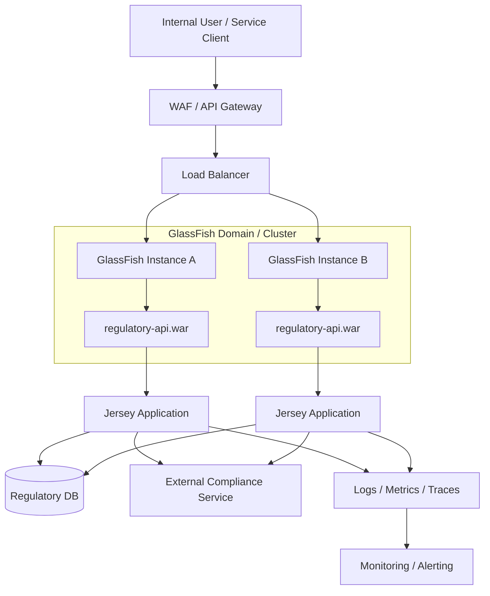
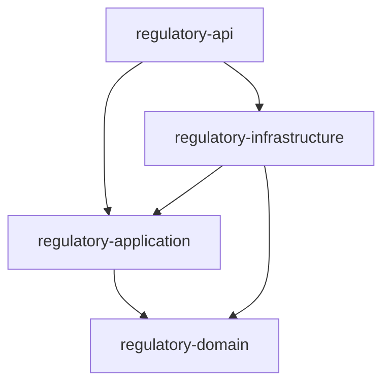
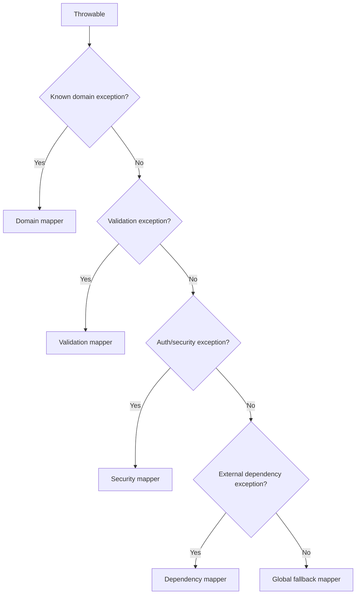
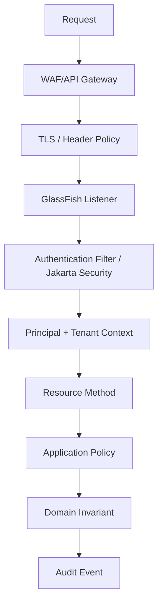
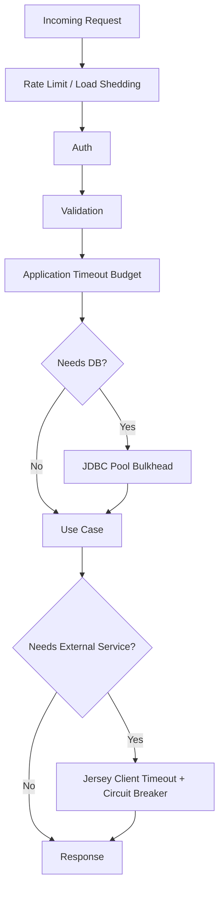
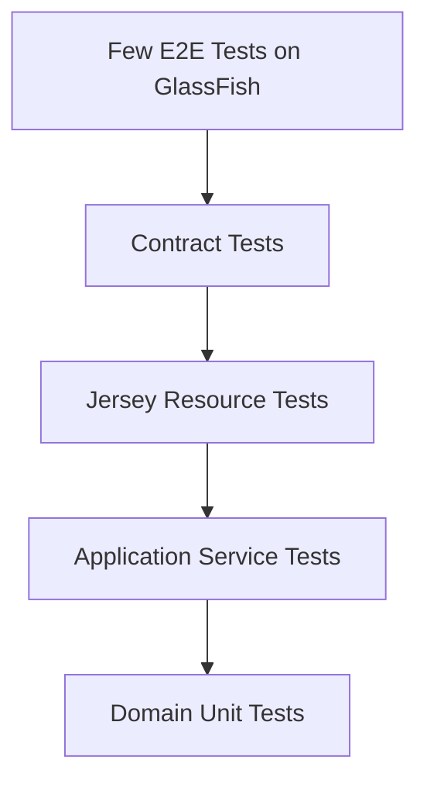

# Part 034 — Capstone: Production-Grade Jersey on GlassFish Reference Architecture

> Target bagian ini: menggabungkan seluruh seri menjadi satu reference architecture yang bisa dipakai sebagai blueprint engineering. Fokusnya bukan membuat "sample app", tetapi membangun **arsitektur runtime yang defensible**: jelas boundary-nya, repeatable deployment-nya, observable behavior-nya, aman failure mode-nya, dan mudah diaudit.

---

## 1. Problem Statement

Kita akan memakai contoh domain:

> **Regulatory Case Management API**  
> Sistem REST untuk mengelola case enforcement lifecycle: intake, validation, triage, assignment, escalation, evidence linking, decision recommendation, audit log, dan status transition.

Karakteristik sistem:

- digunakan oleh internal regulator dan service lain;
- data sensitif;
- workflow/state transition harus defensible;
- API harus stabil dan versioned;
- deployment harus repeatable;
- runtime harus observable;
- failure harus bisa diklasifikasi;
- security dan audit adalah first-class requirement;
- GlassFish menjadi Jakarta EE runtime;
- Jersey menjadi Jakarta REST implementation;
- baseline modern memakai namespace `jakarta.*`.

Ini sengaja lebih kompleks dari CRUD karena Jersey + GlassFish biasanya dipakai dalam environment enterprise yang membutuhkan audit, transaction, security, dan operational discipline.

---

## 2. Architecture Principles

Reference architecture ini mengikuti prinsip berikut.

### 2.1 Runtime Explicitness

Jangan membiarkan runtime behavior bergantung pada accidental scanning, accidental provider order, atau dependency transitive yang tidak dikontrol.

Keputusan:

- explicit resource registration untuk module penting;
- explicit provider registration;
- explicit JSON provider choice;
- explicit error contract;
- explicit deployment target;
- explicit pool/resource configuration;
- explicit timeout budget.

### 2.2 Boundary-Oriented Design

Setiap layer punya tanggung jawab yang tajam.

| Boundary | Tanggung jawab |
|---|---|
| HTTP/Jersey resource | interpretasi request/response |
| DTO/request model | API representation |
| Validation boundary | structural input validation |
| Application service | use case orchestration |
| Domain model | invariant bisnis |
| Repository/gateway | persistence/external boundary |
| Transaction boundary | consistency scope |
| Error mapper | contract translation |
| Filter/interceptor | cross-cutting runtime control |
| GlassFish config | deployment/runtime resources |

### 2.3 Operational Defensibility

Sistem harus bisa menjawab:

- request mana gagal?
- di instance mana?
- karena invariant apa?
- dengan dependency apa?
- apakah failure retryable?
- apakah data berubah sebagian?
- apakah audit trail lengkap?
- apakah config runtime sesuai baseline?
- apakah deployment artifact benar?

### 2.4 Fail Predictably

Sistem bagus bukan sistem yang tidak pernah gagal. Sistem bagus gagal dengan cara yang:

- terklasifikasi;
- tidak membocorkan data sensitif;
- tidak menyebabkan resource leak;
- tidak membuat retry storm;
- tidak mengubah data setengah jalan;
- mudah dimitigasi;
- mudah diaudit.

---

## 3. Runtime Topology



Key decisions:

- REST API is stateless where possible.
- Session state is avoided for API flows.
- Load balancer can route non-sticky for most endpoints.
- Idempotency is required for retryable command endpoints.
- GlassFish config is provisioned via scripts.
- DB/resource pools are targeted to cluster/instances deliberately.
- Observability is mandatory, not optional.

---

## 4. Maven Module Structure

Recommended structure:

```text
regulatory-case-platform/
  pom.xml
  regulatory-api/
    pom.xml
    src/main/java/
      com/company/regulatory/api/
        RegulatoryRestApplication.java
        resource/
        filter/
        provider/
        dto/
        validation/
    src/main/webapp/
      WEB-INF/
        web.xml                  optional
        glassfish-web.xml         optional but useful for context-root/classloader
  regulatory-application/
    pom.xml
    src/main/java/
      com/company/regulatory/application/
        command/
        query/
        service/
        port/
  regulatory-domain/
    pom.xml
    src/main/java/
      com/company/regulatory/domain/
        model/
        state/
        policy/
        event/
        error/
  regulatory-infrastructure/
    pom.xml
    src/main/java/
      com/company/regulatory/infrastructure/
        persistence/
        gateway/
        config/
  regulatory-contract-tests/
    pom.xml
  regulatory-deployment/
    asadmin/
      00-env.sh
      10-domain.sh
      20-jdbc.sh
      30-security.sh
      40-monitoring.sh
      50-deploy.sh
    docker/
    k8s/
```

### 4.1 Dependency Direction



More precise rule:

- `domain` depends on nothing framework-specific.
- `application` depends on domain and defines ports.
- `infrastructure` implements ports.
- `api` adapts HTTP/Jersey to application use cases.
- deployment config is outside code modules.

Avoid:

```text
domain -> jersey
domain -> glassfish
domain -> jpa entity manager
application -> jersey request context
```

---

## 5. API Bootstrapping

Use explicit registration for deterministic startup.

```java
package com.company.regulatory.api;

import jakarta.ws.rs.ApplicationPath;
import org.glassfish.jersey.server.ResourceConfig;

import com.company.regulatory.api.resource.CaseResource;
import com.company.regulatory.api.resource.HealthResource;
import com.company.regulatory.api.resource.VersionResource;
import com.company.regulatory.api.provider.ApiExceptionMapper;
import com.company.regulatory.api.provider.ValidationExceptionMapper;
import com.company.regulatory.api.provider.JsonParseExceptionMapper;
import com.company.regulatory.api.filter.CorrelationIdFilter;
import com.company.regulatory.api.filter.SecurityContextFilter;
import com.company.regulatory.api.filter.AuditResponseFilter;

@ApplicationPath("/api")
public class RegulatoryRestApplication extends ResourceConfig {

    public RegulatoryRestApplication() {
        register(HealthResource.class);
        register(VersionResource.class);
        register(CaseResource.class);

        register(CorrelationIdFilter.class);
        register(SecurityContextFilter.class);
        register(AuditResponseFilter.class);

        register(ApiExceptionMapper.class);
        register(ValidationExceptionMapper.class);
        register(JsonParseExceptionMapper.class);

        register(ApiRuntimeFeature.class);
    }
}
```

Why explicit?

- Easier startup reasoning.
- Better deployment diff.
- Safer classloader behavior.
- Easier testing.
- Less accidental provider registration.

Scanning is acceptable for small applications, but enterprise systems benefit from explicit composition.

---

## 6. Resource Design

### 6.1 Resource Class

```java
package com.company.regulatory.api.resource;

import jakarta.inject.Inject;
import jakarta.validation.Valid;
import jakarta.ws.rs.Consumes;
import jakarta.ws.rs.GET;
import jakarta.ws.rs.POST;
import jakarta.ws.rs.Path;
import jakarta.ws.rs.PathParam;
import jakarta.ws.rs.Produces;
import jakarta.ws.rs.core.MediaType;
import jakarta.ws.rs.core.Response;

import com.company.regulatory.api.dto.CreateCaseRequest;
import com.company.regulatory.api.dto.CaseResponse;
import com.company.regulatory.application.command.CreateCaseCommand;
import com.company.regulatory.application.service.CaseApplicationService;

@Path("/cases")
@Consumes(MediaType.APPLICATION_JSON)
@Produces(MediaType.APPLICATION_JSON)
public class CaseResource {

    @Inject
    CaseApplicationService service;

    @POST
    public Response create(@Valid CreateCaseRequest request) {
        CreateCaseCommand command = request.toCommand();
        CaseResponse response = CaseResponse.from(service.create(command));

        return Response.status(Response.Status.CREATED)
            .entity(response)
            .build();
    }

    @GET
    @Path("/{caseId}")
    public CaseResponse get(@PathParam("caseId") String caseId) {
        return CaseResponse.from(service.get(caseId));
    }
}
```

### 6.2 Resource Rules

Resources must:

- be thin adapters;
- validate structural input;
- translate DTO to command/query;
- delegate to application service;
- return representation DTO;
- not contain domain workflow logic;
- not perform direct JDBC;
- not build SQL;
- not know GlassFish admin details;
- not log sensitive full payloads.

### 6.3 Bad Resource

```java
@Path("/cases")
public class BadCaseResource {

    @POST
    public Response create(String json) {
        // parse manually
        // open JDBC connection
        // check role manually
        // mutate DB
        // call external service
        // catch Throwable
        // return string
    }
}
```

This collapses all boundaries into one class.

---

## 7. DTO and Error Contract

### 7.1 Request DTO

```java
public record CreateCaseRequest(
    @NotBlank String title,
    @NotBlank String allegationType,
    @NotNull Priority priority,
    List<String> evidenceIds
) {
    public CreateCaseCommand toCommand() {
        return new CreateCaseCommand(
            title,
            allegationType,
            priority,
            evidenceIds == null ? List.of() : List.copyOf(evidenceIds)
        );
    }
}
```

### 7.2 Response DTO

```java
public record CaseResponse(
    String id,
    String title,
    String status,
    String priority,
    Instant createdAt,
    List<LinkDto> links
) {
    public static CaseResponse from(CaseView view) {
        return new CaseResponse(
            view.id(),
            view.title(),
            view.status().name(),
            view.priority().name(),
            view.createdAt(),
            List.of(new LinkDto("self", "/api/cases/" + view.id()))
        );
    }
}
```

### 7.3 Error DTO

```java
public record ErrorResponse(
    String errorId,
    String code,
    String message,
    List<FieldError> fields
) {}
```

Rules:

- `errorId` is for correlation.
- `code` is stable for clients.
- `message` is safe.
- `fields` is only for validation-style errors.
- stack traces never go to client.
- SQL/class/internal hostnames never go to client.
- security failures do not reveal resource existence unless intended.

---

## 8. Exception Mapping Architecture



### 8.1 Domain Exception

```java
public class CaseTransitionNotAllowedException extends RuntimeException {
    private final String caseId;
    private final String currentState;
    private final String attemptedTransition;

    // constructor/getters
}
```

### 8.2 Mapper

```java
@Provider
public class CaseTransitionExceptionMapper
        implements ExceptionMapper<CaseTransitionNotAllowedException> {

    @Override
    public Response toResponse(CaseTransitionNotAllowedException ex) {
        ErrorResponse body = new ErrorResponse(
            ErrorIds.currentOrNew(),
            "CASE_TRANSITION_NOT_ALLOWED",
            "The requested case transition is not allowed.",
            List.of()
        );

        return Response.status(Response.Status.CONFLICT)
            .type(MediaType.APPLICATION_JSON_TYPE)
            .entity(body)
            .build();
    }
}
```

### 8.3 Fallback Mapper

```java
@Provider
public class ApiExceptionMapper implements ExceptionMapper<Throwable> {

    private static final Logger log = LoggerFactory.getLogger(ApiExceptionMapper.class);

    @Override
    public Response toResponse(Throwable exception) {
        String errorId = ErrorIds.currentOrNew();

        log.error("Unhandled API error. errorId={}", errorId, exception);

        ErrorResponse body = new ErrorResponse(
            errorId,
            "INTERNAL_ERROR",
            "An unexpected error occurred.",
            List.of()
        );

        return Response.status(Response.Status.INTERNAL_SERVER_ERROR)
            .type(MediaType.APPLICATION_JSON_TYPE)
            .entity(body)
            .build();
    }
}
```

Fallback mapper is a safety net, not the primary error design.

---

## 9. Filters and Cross-Cutting Runtime

### 9.1 Correlation ID Filter

```java
@Provider
@Priority(Priorities.AUTHENTICATION - 100)
public class CorrelationIdFilter
        implements ContainerRequestFilter, ContainerResponseFilter {

    private static final String HEADER = "X-Request-Id";

    @Override
    public void filter(ContainerRequestContext requestContext) {
        String requestId = Optional.ofNullable(requestContext.getHeaderString(HEADER))
            .filter(id -> id.length() <= 128)
            .orElseGet(() -> UUID.randomUUID().toString());

        RequestContext.setRequestId(requestId);
        requestContext.setProperty(HEADER, requestId);
    }

    @Override
    public void filter(ContainerRequestContext requestContext,
                       ContainerResponseContext responseContext) {
        Object requestId = requestContext.getProperty(HEADER);
        if (requestId != null) {
            responseContext.getHeaders().putSingle(HEADER, requestId.toString());
        }
        RequestContext.clear();
    }
}
```

### 9.2 Security Filter

Security filter responsibilities:

- parse credential;
- validate token/session;
- build principal;
- populate security context if app-managed;
- reject invalid authentication with 401;
- not perform business authorization;
- not call slow external systems without timeout/bulkhead;
- not log raw tokens.

### 9.3 Audit Response Filter

Audit response filter responsibilities:

- log stable metadata;
- record request ID, principal ID, tenant ID, action, status;
- avoid full payload logging by default;
- never mutate business result;
- handle its own failures safely.

---

## 10. Application Service Layer

```java
@ApplicationScoped
public class CaseApplicationService {

    @Inject
    CaseRepository repository;

    @Inject
    CasePolicy policy;

    @Inject
    AuditPort audit;

    @Transactional
    public CaseView create(CreateCaseCommand command) {
        policy.checkCreate(command);

        CaseRecord record = CaseRecord.newCase(
            command.title(),
            command.allegationType(),
            command.priority()
        );

        repository.save(record);

        audit.recordCaseCreated(record.id());

        return CaseView.from(record);
    }

    public CaseView get(String caseId) {
        return repository.findById(caseId)
            .map(CaseView::from)
            .orElseThrow(() -> new CaseNotFoundException(caseId));
    }
}
```

Rules:

- one use case per method when possible;
- transaction boundary belongs here, not in resource;
- do not hold transaction open across slow outbound calls unless required;
- enforce domain invariants before persistence;
- emit domain/audit events deliberately.

---

## 11. Domain Model

```java
public final class CaseRecord {

    private final CaseId id;
    private CaseStatus status;
    private final String title;
    private final Priority priority;

    public void escalate(EscalationReason reason) {
        if (!status.canEscalate()) {
            throw new CaseTransitionNotAllowedException(
                id.value(),
                status.name(),
                "ESCALATE"
            );
        }

        this.status = CaseStatus.ESCALATED;
    }
}
```

Domain rules:

- no Jersey imports;
- no GlassFish imports;
- no HTTP status codes;
- no database connection;
- no JSON annotations unless deliberately accepted;
- domain exception names reflect business invariants.

---

## 12. Persistence Boundary

### 12.1 Repository Port

```java
public interface CaseRepository {
    void save(CaseRecord record);
    Optional<CaseRecord> findById(String id);
}
```

### 12.2 JDBC/JPA Implementation

The implementation can live in `regulatory-infrastructure`.

```java
@ApplicationScoped
public class JdbcCaseRepository implements CaseRepository {

    @Resource(lookup = "jdbc/regulatoryPool")
    DataSource dataSource;

    @Override
    public void save(CaseRecord record) {
        try (
            Connection c = dataSource.getConnection();
            PreparedStatement ps = c.prepareStatement("""
                insert into regulatory_case(id, title, status, priority)
                values (?, ?, ?, ?)
            """)
        ) {
            ps.setString(1, record.id().value());
            ps.setString(2, record.title());
            ps.setString(3, record.status().name());
            ps.setString(4, record.priority().name());
            ps.executeUpdate();
        } catch (SQLException e) {
            throw new PersistenceFailureException("Failed to save case", e);
        }
    }
}
```

In Jakarta EE, you may use JTA/container transaction patterns; the key architecture decision is that resource code does not own database mechanics.

---

## 13. Jersey Client Boundary

Outbound calls should use a dedicated gateway.

```java
@ApplicationScoped
public class ComplianceGateway {

    private Client client;

    @PostConstruct
    void init() {
        this.client = ClientBuilder.newBuilder()
            .connectTimeout(1, TimeUnit.SECONDS)
            .readTimeout(2, TimeUnit.SECONDS)
            .build();
    }

    public ComplianceDecision check(CaseRecord record) {
        try (Response response = client
                .target("https://compliance.internal/api/checks")
                .request(MediaType.APPLICATION_JSON_TYPE)
                .header("X-Request-Id", RequestContext.requestId())
                .post(Entity.json(toRequest(record)))) {

            if (response.getStatus() == 200) {
                return response.readEntity(ComplianceDecision.class);
            }

            if (response.getStatus() == 429 || response.getStatus() >= 500) {
                throw new ComplianceServiceUnavailableException();
            }

            throw new ComplianceRejectedRequestException(response.getStatus());
        }
    }

    @PreDestroy
    void close() {
        if (client != null) {
            client.close();
        }
    }
}
```

Rules:

- client is reused;
- response is closed;
- timeout is explicit;
- retries are bounded and idempotent;
- gateway translates remote failures into application-level exceptions;
- raw remote response does not leak to API clients.

---

## 14. Timeout Budget

```mermaid
gantt
    title Request Timeout Budget Example
    dateFormat X
    axisFormat %s

    section Total
    API Gateway Timeout        :0, 5
    section Server
    GlassFish/Jersey Handling  :0, 4
    section Application
    Validation + Auth          :0, 1
    DB Transaction             :1, 2
    External Compliance Call   :2, 4
```



Example budget:

| Layer | Timeout |
|---|---:|
| Client | 6s |
| API Gateway | 5s |
| GlassFish listener/request expectation | aligned under gateway |
| Application use case | 4s |
| DB query | 1.5s |
| Compliance service | 2s |
| Jersey client connect | 1s |
| Jersey client read | 2s |

Principle:

- inner timeouts should fail before outer gateway timeouts;
- do not let gateway be the first component to discover slowness;
- do not hold DB connection while waiting on slow remote service unless the transaction requires it.

---

## 15. GlassFish Deployment Configuration

### 15.1 Context Root

`src/main/webapp/WEB-INF/glassfish-web.xml`

```xml
<?xml version="1.0" encoding="UTF-8"?>
<glassfish-web-app>
    <context-root>/regulatory</context-root>
</glassfish-web-app>
```

Full URL:

```text
/regulatory/api/cases
```

Because:

```text
context-root = /regulatory
@ApplicationPath = /api
@Path = /cases
```

### 15.2 JDBC Pool Script

`regulatory-deployment/asadmin/20-jdbc.sh`

```bash
#!/usr/bin/env bash
set -euo pipefail

: "${DB_HOST:?required}"
: "${DB_PORT:?required}"
: "${DB_NAME:?required}"
: "${DB_USER:?required}"
: "${DB_PASSWORD_ALIAS:?required}"

asadmin create-jdbc-connection-pool \
  --restype javax.sql.DataSource \
  --datasourceclassname org.postgresql.ds.PGSimpleDataSource \
  --property "serverName=${DB_HOST}:portNumber=${DB_PORT}:databaseName=${DB_NAME}:user=${DB_USER}:password=\${ALIAS=${DB_PASSWORD_ALIAS}}" \
  regulatoryPool || true

asadmin set resources.jdbc-connection-pool.regulatoryPool.steady-pool-size=10
asadmin set resources.jdbc-connection-pool.regulatoryPool.max-pool-size=40
asadmin set resources.jdbc-connection-pool.regulatoryPool.connection-leak-timeout-in-seconds=60
asadmin set resources.jdbc-connection-pool.regulatoryPool.connection-leak-reclaim=true

asadmin create-jdbc-resource \
  --connectionpoolid regulatoryPool \
  jdbc/regulatoryPool || true

asadmin ping-connection-pool regulatoryPool
```

Note: command syntax and datasource class must be validated against chosen GlassFish/database driver version. Treat scripts as versioned infrastructure artifacts.

### 15.3 Deployment Script

```bash
#!/usr/bin/env bash
set -euo pipefail

APP_NAME="regulatory-api"
WAR_PATH="${1:?war path required}"
TARGET="${TARGET:-server}"

asadmin deploy \
  --force=true \
  --name "${APP_NAME}" \
  --target "${TARGET}" \
  "${WAR_PATH}"

curl -fsS "http://localhost:8080/regulatory/api/health/ready"
```

Deployment is not complete until readiness passes.

---

## 16. Packaging Strategy

For GlassFish full platform runtime:

- mark Jakarta EE APIs as `provided`;
- avoid bundling server-provided platform APIs;
- choose one JSON provider strategy deliberately;
- bundle application libraries needed by app code;
- avoid duplicate Jersey major versions;
- never mix `javax.*` and `jakarta.*`;
- keep JDBC driver placement deliberate: server-level if pool uses it, app-level only if explicitly intended.

Example Maven scope:

```xml
<dependency>
    <groupId>jakarta.platform</groupId>
    <artifactId>jakarta.jakartaee-api</artifactId>
    <version>11.0.0</version>
    <scope>provided</scope>
</dependency>
```

CI should fail if WAR includes banned APIs:

```bash
jar tf target/regulatory-api.war | grep -E "WEB-INF/lib/(jakarta\.ws\.rs|jakarta\.servlet|jakarta\.enterprise).*\.jar" && exit 1
```

---

## 17. Security Architecture



Security decisions:

- authentication is separated from business authorization;
- authorization is not only role-based; policy/domain permission can be required;
- tenant boundary is explicit;
- audit trail is not best-effort for critical transitions;
- security failures use correct 401/403/404 semantics;
- admin console is not exposed publicly;
- secrets are not committed;
- TLS is terminated deliberately;
- headers are sanitized at proxy boundary;
- full request body is not logged by default.

---

## 18. Observability Baseline

### 18.1 Logs

Every request completion log:

```text
ts=2026-06-28T10:15:30+07:00
level=INFO
requestId=req-123
method=POST
path=/regulatory/api/cases
status=201
latencyMs=82
principal=staff-456
tenant=agency-a
instance=gf-prod-a-1
appVersion=2026.06.28.4
```

Every error log:

```text
level=ERROR
requestId=req-123
errorId=err-789
code=INTERNAL_ERROR
exception=PersistenceFailureException
dbPool=jdbc/regulatoryPool
```

### 18.2 Metrics

Minimum metrics:

- request count by endpoint/status;
- latency histogram by endpoint;
- error count by code;
- 401/403/404/406/415/500 counts;
- DB pool active/waiting/max;
- Jersey client outbound latency;
- timeout/retry/circuit breaker count;
- thread pool utilization;
- heap and GC;
- deployment version gauge;
- readiness status.

### 18.3 Tracing

Trace should connect:

```text
client request -> Jersey resource -> application service -> DB -> external service
```

Trace is most useful when it preserves request ID and dependency timing.

---

## 19. Health Endpoints

### 19.1 Liveness

Liveness answers:

> Should the process be restarted?

```java
@Path("/health/live")
public class LivenessResource {

    @GET
    @Produces(MediaType.APPLICATION_JSON)
    public Map<String, Object> live() {
        return Map.of("status", "UP");
    }
}
```

Do not make liveness depend on DB. If DB outage kills all app instances via liveness restart loop, you created a cascading failure.

### 19.2 Readiness

Readiness answers:

> Should this instance receive traffic?

```java
@Path("/health/ready")
public class ReadinessResource {

    @Inject
    ReadinessService readiness;

    @GET
    @Produces(MediaType.APPLICATION_JSON)
    public Response ready() {
        ReadinessReport report = readiness.check();

        if (report.ready()) {
            return Response.ok(report).build();
        }

        return Response.status(Response.Status.SERVICE_UNAVAILABLE)
            .entity(report)
            .build();
    }
}
```

Readiness may check:

- DB pool;
- required config;
- migration state;
- critical downstream dependency if no safe degradation exists;
- app version initialized.

---

## 20. Resilience Architecture



Rules:

- timeout every outbound call;
- bound retries;
- retry only safe/idempotent operations;
- use idempotency key for command endpoints where retry is allowed;
- bulkhead expensive operations;
- do not let export/report endpoints starve core workflow endpoints;
- fail closed for security decisions;
- fail open only when explicitly approved and audited;
- readiness should reflect inability to serve safely.

---

## 21. API Versioning Strategy

For this capstone, use media-type versioning for representations where strict clients need compatibility.

Example:

```java
@GET
@Path("/{caseId}")
@Produces({
    "application/vnd.company.regulatory.case.v1+json",
    "application/vnd.company.regulatory.case.v2+json"
})
public Response get(@PathParam("caseId") String caseId,
                    @HeaderParam("Accept") String accept) {
    CaseView view = service.get(caseId);

    if (accept != null && accept.contains("v2")) {
        return Response.ok(CaseV2Response.from(view))
            .type("application/vnd.company.regulatory.case.v2+json")
            .build();
    }

    return Response.ok(CaseV1Response.from(view))
        .type("application/vnd.company.regulatory.case.v1+json")
        .build();
}
```

In practice, avoid hand-parsing `Accept` for complex cases; use Jersey/Jakarta REST negotiation mechanisms where appropriate. The design point is explicit representation evolution.

Deprecation policy:

- document sunset dates;
- emit deprecation headers if adopted;
- track version usage metrics;
- do not remove version until clients are migrated;
- test all supported versions.

---

## 22. Deployment Pipeline

```mermaid
flowchart LR
    A[Commit] --> B[Compile]
    B --> C[Unit Tests]
    C --> D[Contract Tests]
    D --> E[Dependency Gate]
    E --> F[Build WAR]
    F --> G[Package Inspection]
    G --> H[Deploy to Test GlassFish]
    H --> I[Smoke Test]
    I --> J[Load/Resilience Test]
    J --> K[Promote Artifact]
    K --> L[Production Deploy]
    L --> M[Readiness + Metrics Verification]
```



### 22.1 Pipeline Gates

| Gate | Purpose |
|---|---|
| compile | catch source/namespace errors |
| unit tests | domain/application correctness |
| resource tests | Jersey boundary behavior |
| contract tests | client-visible API stability |
| dependency tree check | prevent duplicate/mixed versions |
| WAR inspection | prevent server API bundling |
| deploy smoke test | catch GlassFish deployment issue |
| readiness check | verify runtime wiring |
| synthetic request | validate external behavior |
| rollback test | verify deployment reversibility |

### 22.2 Dependency Gate

Fail build if:

- mixed `javax`/`jakarta` imports;
- multiple Jersey major versions;
- Jakarta EE APIs packaged into WAR;
- banned snapshot dependencies;
- duplicate JSON providers without approval;
- known vulnerable dependencies;
- unmanaged transitive dependencies for runtime-critical libs.

---

## 23. Testing Strategy

### 23.1 Test Pyramid



### 23.2 Domain Tests

- state transition invariants;
- policy rules;
- error classification;
- edge cases;
- no framework boot.

### 23.3 Application Tests

- transaction behavior;
- repository interaction;
- audit event emission;
- external gateway failure mapping.

### 23.4 Jersey Resource Tests

- route selection;
- validation;
- content negotiation;
- exception mapping;
- filter behavior;
- security context behavior.

### 23.5 GlassFish Deployment Tests

Use real GlassFish environment for:

- WAR deployability;
- JNDI resources;
- classloader behavior;
- CDI/HK2 integration;
- server-provided APIs;
- security realm/config;
- `asadmin` scripts;
- readiness endpoint.

Do not rely only on local unit tests for application server behavior.

---

## 24. Operational Runbook

### 24.1 Deploy

```bash
./asadmin/00-env.sh
./asadmin/10-domain.sh
./asadmin/20-jdbc.sh
./asadmin/30-security.sh
./asadmin/40-monitoring.sh
./asadmin/50-deploy.sh target/regulatory-api.war
```

Verify:

```bash
curl -fsS http://host:8080/regulatory/api/health/live
curl -fsS http://host:8080/regulatory/api/health/ready
curl -fsS http://host:8080/regulatory/api/version
```

### 24.2 Rollback

Rollback plan must be tested before production.

Requirements:

- previous WAR artifact available;
- DB migration backward compatibility or rollback script;
- config version known;
- load balancer drain supported;
- health checks pass after rollback;
- audit log continuity preserved.

### 24.3 Incident Triage

First 5 commands:

```bash
asadmin list-applications
asadmin list-instances
asadmin list-jdbc-connection-pools
asadmin ping-connection-pool regulatoryPool
tail -n 500 $DOMAIN_DIR/logs/server.log
```

JVM evidence:

```bash
jcmd <pid> Thread.print > threaddump.txt
jcmd <pid> GC.heap_info
jcmd <pid> GC.class_histogram > class-histo.txt
```

HTTP evidence:

```bash
curl -i http://host:8080/regulatory/api/health/ready
curl -i http://host:8080/regulatory/api/version
```

### 24.4 Common Incident Response

| Symptom | First action |
|---|---|
| 404 spike | check deployment/context/proxy/path |
| 415 spike | inspect client `Content-Type` and provider changes |
| 406 spike | inspect `Accept` and version rollout |
| 401 spike | inspect token issuer/proxy/header/clock |
| 403 spike | inspect role/policy mapping |
| 500 spike after deploy | inspect server log, dependency diff, startup warnings |
| latency high CPU low | thread dump, pool metrics |
| latency high CPU high | profiler/serialization/GC |
| pool exhausted | active/waiting/leak/slow query |
| memory growth | heap dump/histogram/redeploy leak |

---

## 25. Production Checklist

### 25.1 Build

- [ ] Uses `jakarta.*`, not mixed with `javax.*`.
- [ ] Jakarta EE API dependencies are `provided`.
- [ ] One Jersey major version.
- [ ] JSON provider selected deliberately.
- [ ] WAR inspected for banned libraries.
- [ ] SBOM produced.
- [ ] Dependency vulnerabilities checked.
- [ ] Build is reproducible.

### 25.2 Application

- [ ] Resources are thin.
- [ ] Application services own use case orchestration.
- [ ] Domain owns invariants.
- [ ] DTOs are stable API representations.
- [ ] Exception mappers produce safe contract.
- [ ] Validation errors are structured.
- [ ] Correlation ID exists.
- [ ] Audit events are emitted for critical actions.
- [ ] Outbound clients have timeout.
- [ ] Responses are closed.

### 25.3 GlassFish

- [ ] Domain config is scripted.
- [ ] JDBC pools configured and pinged.
- [ ] Resources targeted correctly.
- [ ] Admin console protected.
- [ ] Secure admin configured as required.
- [ ] TLS/certificates managed.
- [ ] Logging configured.
- [ ] Monitoring enabled appropriately.
- [ ] JVM options versioned.
- [ ] Deployment target explicit.

### 25.4 Security

- [ ] Authentication boundary clear.
- [ ] Authorization boundary clear.
- [ ] Tenant isolation enforced.
- [ ] Secrets not stored in source.
- [ ] Tokens not logged.
- [ ] Security headers set.
- [ ] CORS restricted.
- [ ] Error messages sanitized.
- [ ] Admin ports not public.
- [ ] Audit logs protected.

### 25.5 Resilience

- [ ] Timeout budget documented.
- [ ] DB pool sized and monitored.
- [ ] Expensive endpoints bulkheaded.
- [ ] Retry policy bounded.
- [ ] Idempotency strategy defined.
- [ ] Readiness meaningful.
- [ ] Graceful shutdown tested.
- [ ] Load shedding strategy defined.
- [ ] Failure injection performed.

### 25.6 Observability

- [ ] Request logs structured.
- [ ] Metrics by endpoint/status.
- [ ] DB pool metrics visible.
- [ ] Outbound call metrics visible.
- [ ] Error IDs correlate with logs.
- [ ] Thread dump procedure known.
- [ ] Heap dump procedure known.
- [ ] Dashboards exist.
- [ ] Alerts map to action.

---

## 26. Architecture Decision Records

Create ADRs for high-impact choices.

Suggested ADR list:

```text
ADR-001 Runtime baseline: Jakarta EE 11, Jersey 4, GlassFish 8
ADR-002 API packaging: thin WAR with server-provided APIs
ADR-003 JSON provider strategy
ADR-004 Error contract and exception mapping
ADR-005 Authentication and authorization boundary
ADR-006 JDBC pool and transaction boundary
ADR-007 Timeout and retry policy
ADR-008 Observability baseline
ADR-009 Deployment topology
ADR-010 API versioning strategy
```

ADR template:

```md
# ADR-XXX Title

## Status
Accepted

## Context
What problem are we solving?

## Decision
What did we choose?

## Consequences
What becomes easier?
What becomes harder?
What must be monitored?

## Alternatives Considered
- Option A
- Option B

## Review Date
YYYY-MM-DD
```

---

## 27. Failure Mode Matrix

| Failure | Detection | Mitigation | Prevention |
|---|---|---|---|
| Wrong context root | 404/access log | redeploy/config fix | deployment smoke test |
| Provider missing | 415/500 startup log | add/register provider | provider test + WAR check |
| Class conflict | `NoSuchMethodError` | dependency correction | dependency gate |
| DB pool exhaustion | pool waiting/latency | scale/pool/leak fix | pool metrics/leak detection |
| Thread starvation | thread dumps | bulkhead/timeouts | load test/fault injection |
| Token failure | 401 spike | auth config rollback | token synthetic check |
| Role drift | 403 spike | mapping fix | authorization contract tests |
| Proxy timeout | 504 | align timeout | timeout budget review |
| Memory leak | heap trend/OOM | heap analysis/fix | load soak/redeploy test |
| Retry storm | outbound spike | disable retry/circuit | bounded retry/idempotency |

---

## 28. Capstone Exercise

Build a small but production-shaped slice:

### Use Case

```text
POST /regulatory/api/cases
GET  /regulatory/api/cases/{id}
POST /regulatory/api/cases/{id}/transitions/escalate
GET  /regulatory/api/health/live
GET  /regulatory/api/health/ready
GET  /regulatory/api/version
```

### Required Features

- explicit Jersey application registration;
- validation with structured error response;
- domain state transition invariant;
- exception mapper for domain conflict;
- fallback mapper;
- correlation ID filter;
- audit response filter;
- JDBC pool via JNDI;
- outbound Jersey client gateway with timeout;
- readiness endpoint;
- deployment script with `asadmin`;
- dependency gate;
- contract tests for 400/401/403/404/409/415/500;
- load test that proves no pool leak;
- rollback plan.

### Scoring Rubric

| Level | Capability |
|---|---|
| 1 | Endpoint works locally |
| 2 | Endpoint deploys to GlassFish |
| 3 | Errors are mapped correctly |
| 4 | Config is scripted |
| 5 | Runtime is observable |
| 6 | Failure modes are tested |
| 7 | Deployment is repeatable |
| 8 | Security boundary is clear |
| 9 | Resilience is intentional |
| 10 | System is reviewable, auditable, and operable |

---

## 29. Final Kaufman Review

Kaufman's approach asks us to deconstruct, learn enough to self-correct, remove barriers, and practice deliberately.

For this series, the target was not "learn Jersey annotation syntax".

The target was to build a mental model of:

```text
Jakarta REST contract
→ Jersey runtime implementation
→ GlassFish deployment/runtime boundary
→ production configuration
→ operational behavior
→ failure diagnosis
→ defensible architecture
```

You should now be able to:

- reason about Jersey as a runtime, not only an annotation framework;
- choose compatible versions intentionally;
- design deterministic application bootstrapping;
- understand resource model dispatch;
- control provider/filter/interceptor behavior;
- design safe error contracts;
- use Jersey Client without connection leaks;
- handle streaming and async endpoints safely;
- configure GlassFish domains/resources repeatably;
- debug classloading and deployment failure;
- tune network/thread/JDBC boundaries;
- harden production runtime;
- migrate from Java EE/JAX-RS to Jakarta/Jersey/GlassFish;
- analyze pitfalls before they become incidents;
- design a production-grade reference architecture.

---

## 30. What "Top 1%" Looks Like Here

A strong engineer can make Jersey endpoints work.

A top-tier engineer can answer:

- what happens before the resource method is invoked;
- why a provider was selected;
- why a deployment works locally but fails on GlassFish;
- why a 500 is actually classloading;
- why a timeout is actually pool starvation;
- why bundling Jakarta APIs in WAR is dangerous;
- why a filter should not own business policy;
- why readiness must differ from liveness;
- why retry without idempotency is unsafe;
- why debugging must start from boundary narrowing;
- how to prove a root cause with logs, metrics, traces, and runtime dumps.

The difference is not memorization. It is structural understanding.

---

## 31. Series Completion

This is the final part of the series:

**Learn Java Eclipse Jersey & GlassFish**

Completed parts:

1. Kaufman Skill Map: Jersey + GlassFish Runtime Thinking
2. Version Matrix: JDK, Jakarta EE, Jersey, GlassFish, Namespace
3. Architecture Map: Spec, RI, Container, Servlet, Grizzly, HK2
4. Jersey Application Bootstrapping Deep Dive
5. Resource Model Internals Beyond Basic JAX-RS
6. Jersey Injection Model: HK2, CDI, Context, Binder
7. Providers Deep Dive: MessageBodyReader, Writer, ContextResolver
8. Filters and Interceptors as Runtime Control Points
9. Exception Mapping and Error Contract Engineering
10. Jersey Client Deep Dive: Connectors, Pooling, Timeout, Retry
11. Streaming, Large Payloads, Chunked Output, SSE
12. Async Jersey: Suspended Responses, Executors, Thread Boundaries
13. Validation, Param Conversion, and Input Boundary Design
14. Content Negotiation and Media Type Versioning
15. Security Hooks in Jersey: AuthN, AuthZ, Principal, Roles
16. Observability in Jersey: Logs, Metrics, Tracing, Diagnostics
17. GlassFish Domain Model: Domain, Instance, Node, Cluster
18. GlassFish Deployment Model: WAR, EAR, Libraries, Classloaders
19. GlassFish Classloading Failure Model
20. GlassFish Configuration as Code with asadmin
21. HTTP, Network, TLS, Connectors, Thread Pools
22. JDBC, JTA, Resources, and REST Runtime Coupling
23. GlassFish Security Realm, JAAS, Identity Store, App Security
24. GlassFish Observability, Monitoring, Logging, Health
25. Deployment Topologies: Traditional, Containerized, Embedded
26. Packaging Strategy: Thin WAR, Fat WAR, Server-Provided APIs
27. Performance Engineering Jersey on GlassFish
28. Resilience Patterns: Timeout, Bulkhead, Circuit Breaker, Backpressure
29. High Availability, Session State, Clustering, Load Balancing
30. Secure Production Hardening Checklist
31. Migration Playbook: Java EE/JAX-RS to Jakarta/Jersey/GlassFish
32. Common Pitfalls and Anti-Patterns Catalog
33. Debugging Playbook: From HTTP Symptom to Runtime Root Cause
34. Capstone: Production-Grade Jersey on GlassFish Reference Architecture

**Series selesai di Part 034.**
