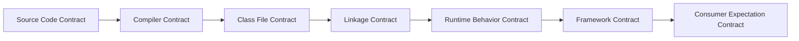

# Part 001 — Kaufman Skill Map

## Tujuan Part Ini

Part ini bukan pengantar Java basic. Kita memakai pendekatan *rapid skill acquisition* dari Josh Kaufman untuk memecah skill besar menjadi unit latihan yang bisa dipraktikkan, diukur, dan dikoreksi cepat.

Target seri ini adalah membangun keluwesan engineering pada level bahasa Java itu sendiri:

- mampu membaca desain API Java/JDK sebagai kontrak, bukan sekadar daftar method;
- mampu membedakan source compatibility, binary compatibility, behavioral compatibility, dan semantic compatibility;
- mampu mendesain package, class, interface, generic API, annotation, dan generated code yang tahan terhadap perubahan;
- mampu memahami object model Java dari `Object`, `Class`, `ClassLoader`, `Module`, `Package`, sampai reflection dan method handles;
- mampu menggunakan generics dan type erasure dengan sadar, termasuk saat desain API publik;
- mampu memilih antara OOP, composition, functional interface, fluent API, reflection, annotation processing, dan bytecode generation berdasarkan konsekuensi teknisnya.

Hasil akhirnya bukan “tahu fitur Java”, tetapi mampu menjawab:

> “Kontrak apa yang sedang saya buat, siapa konsumennya, kapan kontrak ini bisa berubah, dan bagaimana Java runtime/compiler akan memperlakukan kontrak tersebut?”

---

## Prinsip Kaufman yang Dipakai

Kaufman menekankan bahwa belajar cepat bukan berarti belajar dangkal. Polanya kira-kira:

1. **Deconstruct the skill** — pecah skill besar menjadi sub-skill kecil.
2. **Learn enough to self-correct** — pelajari cukup teori agar bisa mendeteksi error sendiri.
3. **Remove practice barriers** — hilangkan friction setup, tooling, dan ambiguity.
4. **Practice deliberately** — latihan terarah, bukan membaca pasif.
5. **Use feedback loops** — setiap latihan harus punya sinyal benar/salah.

Untuk topik ini, unit praktiknya bukan “membuat class” atau “membuat interface”, melainkan membuat dan mengevaluasi **contract boundary**.

Contoh feedback loop yang akan sering dipakai:

- apakah API masih compile setelah consumer lama dipakai ulang?
- apakah binary lama masih bisa link terhadap versi library baru?
- apakah generic signature membantu caller atau justru memaksa cast?
- apakah `equals`/`hashCode` preserving invariant?
- apakah reflection access masih valid di modular runtime?
- apakah generated code deterministic dan bisa di-debug?

---

## Batas Seri: Apa yang Tidak Kita Ulang

Karena Anda sudah menyelesaikan banyak seri Java, materi ini sengaja tidak mengulang area berikut kecuali sebagai konteks minimal:

| Area | Status | Di seri ini hanya dipakai untuk |
|---|---:|---|
| Java syntax basic | sudah selesai | contoh kecil saat menjelaskan contract |
| collections dan core types | sudah selesai | generic API dan variance example |
| concurrency | sudah selesai | tidak dibahas kecuali `java.lang.Thread` sebagai bagian package map |
| persistence/JDBC/ORM | sudah selesai | tidak dibahas |
| REST/API event contract | sudah selesai | hanya analogi API compatibility |
| security/observability/error | sudah selesai | hanya jika terkait reflection/module/accessibility |
| design patterns | sudah selesai | tidak menghafal pattern; fokus konsekuensi bahasa |
| data mapper/Jackson/XML/Validation | sudah selesai | nanti hanya sebagai contoh framework pengguna reflection/annotation |

Seri ini menutup celah yang sering tertinggal: **bagaimana bahasa Java sendiri membentuk batas desain software.**

---

## Skill Tree Seri

```mermaid
graph TD
    A[Java Language Object Model] --> B[java.lang substrate]
    A --> C[Package and module boundaries]
    A --> D[OOP and composition]
    A --> E[Functional composition]
    A --> F[Generics and type erasure]
    A --> G[API design contracts]
    A --> H[Runtime introspection]
    A --> I[Compile-time and runtime code generation]

    B --> B1[Object]
    B --> B2[Class]
    B --> B3[String and wrappers]
    B --> B4[Enum Record Throwable System Runtime Module Package]

    C --> C1[Name resolution]
    C --> C2[Accessibility]
    C --> C3[Exports vs opens]
    C --> C4[API surface minimization]

    D --> D1[Substitutability]
    D --> D2[Inheritance risk]
    D --> D3[Interface role modeling]
    D --> D4[Sealed hierarchy]

    E --> E1[SAM types]
    E --> E2[Lambda capture]
    E --> E3[Higher-order API]
    E --> E4[Pure core impure shell]

    F --> F1[Bounds]
    F --> F2[Wildcards]
    F --> F3[Erasure]
    F --> F4[Bridge methods]
    F --> F5[Type tokens]

    G --> G1[Invariants]
    G --> G2[Compatibility]
    G --> G3[Misuse resistance]
    G --> G4[Error semantics]

    H --> H1[Reflection]
    H --> H2[MethodHandles]
    H --> H3[VarHandles]
    H --> H4[Dynamic invocation]

    I --> I1[Annotation processing]
    I --> I2[Source generation]
    I --> I3[Dynamic proxies]
    I --> I4[Bytecode generation]
```



---

## Target Performance: Engineer yang Ingin Kita Bentuk

Setelah seri ini, Anda seharusnya bisa melakukan hal-hal berikut.

### 1. Membaca Java API seperti membaca kontrak hukum teknis

Bukan hanya:

```java
String value = object.toString();
```

Tetapi bertanya:

- apakah `toString()` contract dipakai untuk debugging, serialization, logging, atau user-facing text?
- apakah override method ini harus stabil antar release?
- apakah hasilnya boleh berubah ketika internal state berubah?
- apakah mengandung informasi sensitif?
- apakah method ini dipanggil secara implisit oleh framework/logging?

Skill ini penting karena banyak bug enterprise lahir dari API yang tampak kecil tetapi secara sosial dan teknis menjadi kontrak.

---

### 2. Mendesain API yang evolvable

API yang bagus bukan API yang paling lengkap. API yang bagus adalah API yang:

- punya surface kecil;
- punya semantic contract jelas;
- tidak bocor internal representation;
- sulit disalahgunakan;
- bisa berubah tanpa memaksa semua consumer berubah;
- punya error semantics yang jelas;
- punya type signature yang membantu caller berpikir benar.

Contoh buruk:

```java
public Map<String, Object> process(Map<String, Object> input);
```

Masalahnya bukan hanya “kurang type-safe”. Masalah sebenarnya:

- key space tidak eksplisit;
- value domain tidak eksplisit;
- precondition tidak jelas;
- postcondition tidak jelas;
- consumer tidak tahu field mana wajib;
- runtime error baru muncul jauh dari boundary;
- versi API sulit dievolusi;
- refactoring hampir tidak punya compiler feedback.

Contoh lebih baik:

```java
public Decision evaluate(EvaluationRequest request);
```

Dengan `EvaluationRequest` dan `Decision` sebagai value contract yang eksplisit.

---

### 3. Menggunakan OOP sebagai invariant boundary

OOP yang matang bukan “semua dibuat class”. OOP yang matang adalah menempatkan behavior di tempat yang menjaga invariant.

Contoh naive:

```java
if (caseFile.status().equals("ESCALATED")) {
    // ...
}
```

Contoh yang lebih contract-aware:

```java
if (caseFile.isEscalated()) {
    // ...
}
```

Contoh yang lebih domain-safe:

```java
caseFile.requireEscalatedFor(EnforcementAction.FREEZE_ACCOUNT);
```

Perbedaannya:

- caller tidak perlu tahu representasi status;
- rule bisa berubah di dalam aggregate/domain object;
- failure bisa punya pesan yang benar;
- contract pindah dari string comparison ke behavior.

---

### 4. Menggunakan generics untuk mempersempit kemungkinan salah

Generics bukan kosmetik. Generics adalah alat untuk membuat compiler menolak state yang tidak valid.

Contoh terlalu lemah:

```java
interface Repository {
    Object findById(Object id);
}
```

Contoh lebih baik:

```java
interface Repository<ID, T> {
    T findById(ID id);
}
```

Contoh lebih contract-rich:

```java
interface Repository<ID, T extends AggregateRoot<ID>> {
    Optional<T> findById(ID id);
    void save(T aggregate);
}
```

Namun generics juga punya batas: type erasure berarti banyak informasi generic tidak tersedia secara langsung di runtime. Itu akan memengaruhi reflection, serialization, dependency injection, mapper, proxy, dan framework code generation.

---

### 5. Memilih metaprogramming secara sadar

Reflection, annotation processing, dynamic proxy, dan bytecode generation bukan “magic”. Semuanya punya trade-off.

| Teknik | Waktu kerja | Kelebihan | Risiko |
|---|---|---|---|
| Reflection | runtime | fleksibel, cocok untuk framework scanning | lambat jika naive, access/module issue, error runtime |
| Method handles | runtime/linkage | lebih dekat ke VM invocation model | API lebih kompleks |
| Annotation processing | compile-time | error lebih awal, generated source terlihat | incremental build, processor complexity |
| Dynamic proxy | runtime | mudah untuk interface-based interception | hanya interface, invocation overhead |
| Bytecode generation | build/runtime | sangat powerful, bisa optimal | kompleks, sulit debug, classloader issue |

Engineer yang matang tidak bertanya “pakai reflection atau code generation?”. Pertanyaan yang benar:

> “Kapan error harus ditemukan: compile-time, startup-time, atau runtime?”

---

## Seri Ini sebagai Learning System

Setiap part akan mengikuti struktur tetap:

1. **Problem framing** — masalah nyata yang diselesaikan fitur/konsep.
2. **Mental model** — cara berpikir internal, bukan definisi hafalan.
3. **Core mechanics** — aturan bahasa/runtime yang relevan.
4. **Design consequences** — dampak terhadap API, evolusi, dan maintainability.
5. **Failure modes** — bug yang umum terjadi di sistem production.
6. **Practice drills** — latihan kecil dengan feedback jelas.
7. **Engineering checklist** — aturan praktis untuk review desain/kode.

---

## Peta 35 Part

### Phase 1 — Language Substrate

- Part 001 — Kaufman Skill Map
- Part 002 — Java Language as Contract System
- Part 003 — `java.lang` Deep Structure
- Part 004 — `Object`, Identity, and Universal Methods
- Part 005 — `Class`, ClassLoader, Module, Package Runtime Model

### Phase 2 — Package and API Boundaries

- Part 006 — Package System and Name Resolution
- Part 007 — Accessibility, Encapsulation, and API Boundaries
- Part 008 — API Surface Minimization
- Part 009 — Package Architecture and Architectural Fitness
- Part 010 — Public API Evolution and Compatibility

### Phase 3 — OOP Beyond Pattern Memorization

- Part 011 — OOP as Type and Behavior Modeling
- Part 012 — Inheritance, Composition, and Substitutability
- Part 013 — Interfaces, Abstract Classes, and Role Modeling
- Part 014 — Sealed, Record, Enum, and Domain Shape Control
- Part 015 — Behavioral Composition Without Framework Magic

### Phase 4 — Functional Java as Controlled Composition

- Part 016 — Functional Interfaces and Lambda Object Model
- Part 017 — Composition Pipelines and Higher-Order API Design
- Part 018 — Side Effects, Purity, and Boundary Design
- Part 019 — Fluent API, Builder, DSL, and Composability

### Phase 5 — Generics and Type Erasure

- Part 020 — Generics Mental Model
- Part 021 — Wildcards, Variance, and API Flexibility
- Part 022 — Type Erasure, Bridge Methods, and Reifiable Types
- Part 023 — Advanced Generic API Patterns
- Part 024 — Generic Failure Modes and Defensive API Design

### Phase 6 — API Design

- Part 025 — API Design Principles for Java Libraries
- Part 026 — API Invariants, Preconditions, and Postconditions
- Part 027 — API Usability, Error Design, and Misuse Resistance
- Part 028 — Binary, Source, and Behavioral Compatibility

### Phase 7 — Runtime Introspection

- Part 029 — Reflection Model and Runtime Introspection
- Part 030 — Reflection Performance, Security, and Framework Design
- Part 031 — Method Handles, VarHandles, and Dynamic Invocation

### Phase 8 — Code Generation

- Part 032 — Annotation Processing Mental Model
- Part 033 — Compile-Time Code Generation Design
- Part 034 — Bytecode Generation: ASM, Byte Buddy, and Proxies
- Part 035 — Capstone: Language-Level Framework Design

---

## The Core Mental Model: Java Has Layers of Contract



Satu perubahan kecil bisa aman di satu layer tetapi merusak layer lain.

Contoh:

```java
public class UserService {
    public User findUser(String id) {
        // ...
    }
}
```

Mengubah return type menjadi subtype mungkin tampak aman secara source untuk sebagian caller, tetapi compatibility harus dinilai dari beberapa sisi:

- apakah source consumer masih compile?
- apakah binary consumer lama masih link?
- apakah framework reflection masih menemukan method yang sama?
- apakah serialization/deserialization contract berubah?
- apakah behavior method berubah?
- apakah error type berubah?

Seri ini akan membiasakan Anda melihat perubahan API dari semua layer itu.

---

## Apa yang Membuat Topik Ini Sulit

Topik ini sulit karena Java menyembunyikan banyak kompleksitas di balik syntax yang terlihat sederhana.

### Contoh 1 — `List<String>` tampak runtime type, padahal bukan sepenuhnya

```java
List<String> names = List.of("A", "B");
System.out.println(names.getClass());
```

Runtime class object tidak menjadi `List<String>`. Karena type erasure, banyak informasi generic hilang dari runtime object biasa. Namun sebagian metadata generic tetap bisa tersedia di signature tertentu melalui reflection.

Implikasinya besar untuk:

- mapper;
- dependency injection;
- validation;
- serialization;
- generated code;
- type token pattern.

---

### Contoh 2 — `protected` sering disalahpahami

Banyak developer menganggap `protected` berarti “bisa diakses oleh subclass di mana pun”. Itu tidak lengkap. Dalam Java, `protected` berinteraksi dengan package access dan subclass access secara spesifik. Kesalahan ini sering memicu desain inheritance yang bocor.

---

### Contoh 3 — `equals` bukan hanya utility method

```java
@Override
public boolean equals(Object other) {
    return other instanceof Customer c && id.equals(c.id);
}
```

Pertanyaan desain:

- apakah `id` immutable?
- apakah object boleh masuk `HashSet` sebelum `id` diberikan?
- apakah proxy subclass dari ORM akan memengaruhi equality?
- apakah `Customer` value object atau entity?
- apakah equality berdasarkan technical identity atau business identity?

Satu method `equals` bisa menentukan correctness seluruh collection behavior.

---

## Learning Contract untuk Seri Ini

Agar belajar efektif, setiap part harus menghasilkan artefak kecil. Jangan hanya membaca.

| Phase | Artefak latihan |
|---|---|
| `java.lang` | object contract checklist, equality test matrix |
| package/module | package dependency graph, boundary review |
| OOP/composition | refactor inheritance ke composition |
| functional | higher-order validator/policy API |
| generics | generic repository/type token exercise |
| API design | public API review worksheet |
| reflection | mini scanner dengan cache dan error model |
| code generation | annotation processor sederhana |

---

## Practice Repository yang Disarankan

Buat repository kecil bernama:

```text
java-language-object-model-lab
```

Struktur awal:

```text
java-language-object-model-lab/
  build.gradle.kts
  settings.gradle.kts
  src/
    main/
      java/
        com/example/langlab/
          contracts/
          objectmodel/
          packages/
          generics/
          api/
          reflection/
          codegen/
    test/
      java/
        com/example/langlab/
```

Gunakan JDK modern yang sama selama seri, idealnya JDK 25 agar sesuai dengan referensi Java SE 25. Namun konsep utamanya tetap relevan untuk Java modern sejak Java 17+ dengan penyesuaian fitur.

---

## Baseline Gradle Setup

```kotlin
plugins {
    java
}

group = "com.example"
version = "1.0.0"

java {
    toolchain {
        languageVersion = JavaLanguageVersion.of(25)
    }
}

repositories {
    mavenCentral()
}

dependencies {
    testImplementation(platform("org.junit:junit-bom:5.11.4"))
    testImplementation("org.junit.jupiter:junit-jupiter")
    testImplementation("org.assertj:assertj-core:3.27.3")
}

tasks.test {
    useJUnitPlatform()
}
```

Jika environment Anda belum memakai JDK 25, gunakan JDK 21 LTS untuk praktik dan tandai fitur JDK 25 sebagai referensi. Jangan campur target bytecode tanpa sadar karena compatibility adalah salah satu tema utama seri ini.

---

## Latihan Awal: Contract Smell Detection

Evaluasi API berikut.

```java
public class CaseProcessor {
    public Map<String, Object> process(String type, Map<String, Object> data) {
        // ...
    }
}
```

Cari minimal 10 masalah desain.

Contoh jawaban yang diharapkan:

1. `type` adalah stringly-typed discriminator.
2. `data` tidak punya schema eksplisit.
3. Return value tidak punya postcondition eksplisit.
4. Caller tidak tahu required keys.
5. Tidak ada error contract.
6. Tidak ada nullability contract.
7. Tidak ada versioning strategy.
8. Sulit dites berdasarkan type system.
9. Sulit dievolusi tanpa breaking implicit consumers.
10. Framework/logging/serialization bisa membuat implicit contract liar.

Refactor pertama:

```java
public interface CaseProcessor<R extends CaseRequest, D extends CaseDecision> {
    D process(R request);
}
```

Refactor ini belum tentu final, tetapi sudah menggeser kontrak dari map bebas ke type-level boundary.

---

## Latihan Awal: API Compatibility Thinking

Versi 1:

```java
public interface Rule<T> {
    boolean matches(T value);
}
```

Versi 2 kandidat:

```java
public interface Rule<T> {
    boolean matches(T value);
    String reason();
}
```

Pertanyaan:

- Apakah source consumer lama masih compile?
- Apakah implementation lama masih compile?
- Apakah binary implementation lama masih link?
- Apakah lebih aman memakai default method?

Alternatif:

```java
public interface Rule<T> {
    boolean matches(T value);

    default Optional<String> reason() {
        return Optional.empty();
    }
}
```

Tetapi default method juga kontrak. Ia menciptakan behavior default yang mungkin dianggap benar oleh caller, padahal semantik domain bisa membutuhkan reason eksplisit.

Kesimpulan: compatibility bukan hanya “tidak error compile”. Compatibility mencakup expectation.

---

## Rubrik Review untuk Setiap API Java

Gunakan rubrik ini setiap kali mendesain public type.

### 1. Type Contract

- Apakah nama type mewakili konsep stabil?
- Apakah type ini entity, value, service, policy, command, result, atau capability?
- Apakah invariant terlihat dari constructor/factory?
- Apakah ada illegal state yang masih bisa dibuat?

### 2. Method Contract

- Apakah precondition jelas?
- Apakah postcondition jelas?
- Apakah nullability jelas?
- Apakah method idempotent?
- Apakah method punya side effect?
- Apakah exception contract stabil?

### 3. Generic Contract

- Apakah type parameter benar-benar menambah safety?
- Apakah wildcard dipakai di boundary yang tepat?
- Apakah caller perlu menulis cast?
- Apakah erasure akan mengganggu runtime behavior?

### 4. Evolution Contract

- Bagian mana yang bisa berubah?
- Bagian mana yang harus stabil?
- Apakah ada migration path?
- Apakah overload baru bisa mengubah overload resolution?
- Apakah method tambahan merusak implementer lama?

### 5. Runtime Contract

- Apakah reflection/framework akan membaca type ini?
- Apakah annotation retention tepat?
- Apakah module exports/opens diperlukan?
- Apakah generated code bergantung pada naming convention?

---

## Anti-Goals

Seri ini tidak mengejar:

- membuat wrapper abstraksi untuk semua hal;
- menggunakan generics di setiap tempat;
- membuat framework untuk masalah sederhana;
- mengganti clarity dengan cleverness;
- menggunakan reflection saat direct call cukup;
- menggunakan bytecode generation karena terlihat advanced;
- membuat API “future-proof” secara absolut.

Targetnya adalah **precision**, bukan complexity.

---

## Prinsip Utama yang Akan Diulang Sepanjang Seri

### Principle 1 — Public API is debt

Semakin banyak public API, semakin besar beban compatibility. API publik adalah janji. Janji sulit ditarik kembali.

### Principle 2 — Type system is design pressure

Type system tidak hanya mencegah bug. Ia mengarahkan cara caller berpikir.

### Principle 3 — Runtime magic should have compile-time explanation

Jika framework memakai reflection atau generated code, harus tetap ada mental model yang bisa dijelaskan tanpa “magic”.

### Principle 4 — Compatibility has layers

Source compatible belum tentu binary compatible. Binary compatible belum tentu behaviorally compatible.

### Principle 5 — Composition wins when behavior varies independently

Inheritance masuk akal ketika subtype benar-benar substitutable. Jika hanya ingin reuse implementasi, composition biasanya lebih aman.

---

## Checklist Akhir Part 001

Sebelum lanjut ke Part 002, pastikan Anda bisa menjawab:

- Apa perbedaan belajar Java feature vs belajar Java contract?
- Mengapa public API adalah beban jangka panjang?
- Mengapa generics bisa memperbaiki desain tetapi juga menciptakan ilusi runtime type?
- Mengapa reflection/code generation harus dinilai dari waktu ditemukannya error?
- Mengapa seri ini dimulai dari `java.lang` dan contract model sebelum masuk reflection/codegen?

---

## Referensi

- Oracle Java SE 25 API Documentation — `java.base`, `java.lang`, `Object`, `Class`, `Module`, `Package`.
- Java Language Specification, Java SE 25 Edition — Types, Packages, Modules, Binary Compatibility.
- Oracle Java Tutorials — Generics, Type Erasure, Bridge Methods.
- JSR 269 — Pluggable Annotation Processing API.
- Josh Kaufman — *The First 20 Hours: How to Learn Anything... Fast*.

---

## Next

Part 002 akan membangun mental model utama seri ini:

> Java adalah sistem kontrak berlapis: source contract, compiler contract, bytecode contract, linkage contract, runtime contract, dan consumer expectation contract.
