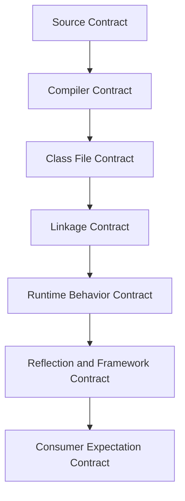
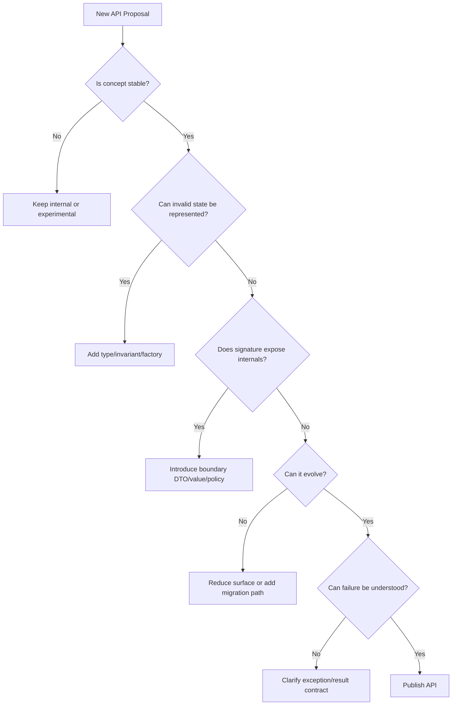

# Part 002 — Java Language as Contract System

## Tujuan Part Ini

Kita sering memakai Java seolah-olah hanya bahasa OOP dengan class, interface, method, package, dan generics. Untuk engineer senior, model itu terlalu dangkal.

Java lebih tepat dipahami sebagai **sistem kontrak berlapis**:



Setiap kali kita menulis Java API, kita tidak hanya menulis kode. Kita membuat janji kepada:

- compiler;
- JVM linker;
- runtime;
- framework;
- test suite;
- downstream module;
- developer lain;
- future version dari sistem kita sendiri.

Part ini membangun mental model agar setiap desain class, interface, package, generics, annotation, dan generated code bisa dinilai dari konsekuensi kontraknya.

---

## 1. Java Contract Stack

Mari mulai dari contoh sederhana.

```java
package com.example.rules;

public interface Rule<T> {
    boolean matches(T value);
}
```

Interface kecil ini menghasilkan banyak kontrak sekaligus.

| Layer | Kontrak yang muncul |
|---|---|
| Source | package name, type name, generic parameter, method name, return type, parameter type |
| Compiler | type checking, erasure, generated signature, override rules |
| Class file | binary name `com/example/rules/Rule`, method descriptor, generic signature metadata |
| Linkage | consumer binary mencari interface dan method dengan descriptor tertentu |
| Runtime | implementation object harus dispatch `matches` secara benar |
| Reflection | framework bisa membaca interface, method, generic signature, annotation |
| Consumer expectation | caller menganggap `matches` pure, cheap, deterministic, atau mungkin side-effect-free meski belum ditulis |

Perhatikan layer terakhir. Banyak kontrak paling berbahaya tidak ada di compiler. Ia hidup sebagai **expectation**.

---

## 2. Source Contract

Source contract adalah kontrak yang terlihat dari source code dan diperiksa saat compile.

Contoh:

```java
public final class Money {
    private final String currency;
    private final long minorUnits;

    public Money(String currency, long minorUnits) {
        this.currency = Objects.requireNonNull(currency);
        this.minorUnits = minorUnits;
    }

    public String currency() {
        return currency;
    }

    public long minorUnits() {
        return minorUnits;
    }
}
```

Source contract-nya meliputi:

- class bernama `Money`;
- class `final`, sehingga tidak bisa di-subclass;
- constructor menerima `String` dan `long`;
- `currency()` mengembalikan `String`;
- `minorUnits()` mengembalikan `long`;
- field tidak bisa diakses langsung;
- null currency ditolak.

Namun source contract tidak otomatis menyatakan semua hal penting.

Masih belum jelas:

- apakah `currency` harus ISO 4217?
- apakah `minorUnits` boleh negatif?
- apakah `Money` adalah value object?
- apakah `equals` harus berdasarkan currency dan amount?
- apakah rounding dilakukan di tempat lain?
- apakah currency case-sensitive?

Compiler hanya melihat sebagian kontrak. Sisanya harus dibuat eksplisit oleh API design.

---

## 3. Compiler Contract

Compiler contract adalah aturan yang dipakai compiler untuk mengubah source menjadi class file.

Contoh generic API:

```java
public interface Box<T> {
    T get();
    void put(T value);
}
```

Compiler memeriksa bahwa caller tidak memasukkan type yang salah:

```java
Box<String> box = ...;
box.put("valid");
// box.put(123); // compile error
```

Tetapi setelah type erasure, banyak informasi `T` tidak menjadi runtime class terpisah.

Secara mental, compiler melakukan beberapa hal:

- mengganti type parameter dengan bound atau `Object`;
- menyisipkan cast jika perlu;
- menghasilkan bridge method untuk menjaga polymorphism pada kasus tertentu;
- menyimpan sebagian generic metadata sebagai signature attribute;
- menjaga compatibility dengan bytecode Java lama sebelum generics.

Konsekuensinya:

```java
List<String> names = List.of("A");
List<Integer> numbers = List.of(1);

System.out.println(names.getClass() == numbers.getClass());
```

Secara runtime, parameterized type tidak menghasilkan class berbeda untuk setiap `T`. Ini alasan mengapa framework yang butuh informasi generic sering memakai type token, reflection pada field/method signature, atau generated metadata.

---

## 4. Class File Contract

Java source bukan unit deployment utama. Unit yang dieksekusi JVM adalah class file.

Class file menyimpan informasi seperti:

- binary name;
- superclass;
- interfaces;
- fields;
- methods;
- descriptors;
- access flags;
- annotations;
- generic signatures;
- bytecode instructions;
- constant pool.

Misalnya method:

```java
public String findName(long id) {
    return "A";
}
```

Pada level class file, method ini tidak hanya “method Java”. Ia punya descriptor kira-kira:

```text
(J)Ljava/lang/String;
```

Artinya:

- menerima `long` (`J`);
- mengembalikan `java.lang.String`.

Jika descriptor berubah, binary consumer lama bisa gagal link meskipun perubahan tampak kecil di source.

---

## 5. Linkage Contract

Linkage contract adalah kontrak saat JVM menghubungkan symbolic reference dari satu class file ke class/method/field aktual.

Contoh versi 1 library:

```java
public class CustomerDirectory {
    public Customer findById(String id) {
        return null;
    }
}
```

Consumer dikompilasi terhadap versi 1:

```java
Customer customer = directory.findById("C-001");
```

Lalu library berubah menjadi versi 2:

```java
public class CustomerDirectory {
    public Optional<Customer> findById(String id) {
        return Optional.empty();
    }
}
```

Secara source, API baru mungkin lebih baik. Tetapi binary consumer lama mencari method dengan nama dan descriptor lama:

```text
findById(Ljava/lang/String;)LCustomer;
```

Versi baru menyediakan descriptor berbeda:

```text
findById(Ljava/lang/String;)Ljava/util/Optional;
```

Akibatnya, consumer lama bisa gagal saat runtime karena method yang dicari tidak ada.

Solusi evolusi yang lebih aman:

```java
public class CustomerDirectory {
    /**
     * @deprecated use findOptionalById instead.
     */
    @Deprecated(since = "2.0", forRemoval = false)
    public Customer findById(String id) {
        return findOptionalById(id).orElse(null);
    }

    public Optional<Customer> findOptionalById(String id) {
        return Optional.empty();
    }
}
```

Ini bukan sekadar backward compatibility. Ini adalah **migration contract**.

---

## 6. Runtime Behavior Contract

Binary compatible tidak berarti behavior compatible.

Versi 1:

```java
public final class RetryPolicy {
    public int maxAttempts() {
        return 3;
    }
}
```

Versi 2:

```java
public final class RetryPolicy {
    public int maxAttempts() {
        return 5;
    }
}
```

Secara source dan binary, method sama. Tetapi behavior berubah. Ini bisa aman atau berbahaya tergantung konteks.

Jika retry memanggil external payment provider, perubahan dari 3 ke 5 bisa memicu:

- duplicate charge risk;
- rate limit;
- SLA breach;
- audit finding;
- unexpected load;
- failure amplification.

Jadi compatibility harus dipikirkan sebagai tiga level minimal:

| Compatibility | Pertanyaan |
|---|---|
| Source compatibility | Apakah source consumer masih compile? |
| Binary compatibility | Apakah binary lama masih link tanpa recompile? |
| Behavioral compatibility | Apakah runtime semantics tetap memenuhi expectation? |

Untuk sistem enterprise, sering ada level keempat:

| Compatibility | Pertanyaan |
|---|---|
| Operational compatibility | Apakah perubahan aman terhadap traffic, observability, rollback, audit, deployment topology? |

---

## 7. Framework and Reflection Contract

Banyak framework Java tidak hanya memakai method call biasa. Mereka membaca struktur program melalui reflection, annotation, classpath scanning, module metadata, atau generated code.

Contoh:

```java
@Retention(RetentionPolicy.RUNTIME)
@Target(ElementType.TYPE)
public @interface Handler {
    String value();
}

@Handler("case-opened")
public final class CaseOpenedHandler {
    public void handle(CaseOpened event) {
        // ...
    }
}
```

Kontrak yang muncul:

- annotation harus punya runtime retention agar reflection bisa membacanya;
- class harus terlihat oleh scanner;
- module/package mungkin perlu `opens` jika deep reflection dipakai;
- method naming/signature mungkin menjadi convention;
- constructor mungkin harus public/no-arg tergantung framework;
- generated proxy mungkin butuh interface atau non-final class.

Jika kita mengubah:

```java
@Handler("case-opened")
```

menjadi:

```java
@Handler("case.created")
```

Compiler tidak tahu apakah ini breaking change. Tetapi event router mungkin gagal menemukan handler lama.

Reflection contract sering lebih rapuh karena banyak aturan hidup di luar type system.

---

## 8. Consumer Expectation Contract

Kontrak paling sulit adalah kontrak yang tidak tertulis.

Contoh:

```java
public interface FraudScoreProvider {
    int score(Customer customer);
}
```

Apa expectation caller?

- Apakah `score` deterministic?
- Apakah boleh call network?
- Apakah boleh lambat?
- Apakah boleh throw checked exception?
- Apakah hasil 0 berarti aman atau unknown?
- Apakah range selalu 0..100?
- Apakah method idempotent?
- Apakah method boleh melakukan audit logging?

Nama `score` terlihat sederhana, tetapi ambiguity-nya tinggi.

Versi contract-aware:

```java
public interface FraudScoreProvider {
    FraudScore evaluate(FraudScoreRequest request);
}

public record FraudScore(int value, FraudScoreConfidence confidence) {
    public FraudScore {
        if (value < 0 || value > 100) {
            throw new IllegalArgumentException("value must be between 0 and 100");
        }
        Objects.requireNonNull(confidence, "confidence must not be null");
    }
}

enum FraudScoreConfidence {
    LOW,
    MEDIUM,
    HIGH,
    UNKNOWN
}
```

Di sini kita memperkecil ambiguity:

- output bukan integer bebas;
- range dijaga;
- confidence eksplisit;
- `UNKNOWN` bukan disamarkan sebagai 0;
- request bisa berkembang tanpa menambah terlalu banyak parameter.

---

## 9. Contract Density

API yang baik punya **contract density** tinggi: sedikit surface, banyak makna yang benar.

Bandingkan dua API.

### Low-density API

```java
public void update(String id, String status, String reason, boolean notify, boolean audit) {
    // ...
}
```

Masalah:

- parameter order risk;
- boolean blindness;
- status string bebas;
- reason mungkin wajib untuk status tertentu;
- notify/audit policy bercampur;
- sulit dievolusi.

### Higher-density API

```java
public void transition(CaseTransition transition) {
    // ...
}

public record CaseTransition(
        CaseId caseId,
        CaseStatus targetStatus,
        TransitionReason reason,
        NotificationPolicy notificationPolicy,
        AuditPolicy auditPolicy
) {
    public CaseTransition {
        Objects.requireNonNull(caseId);
        Objects.requireNonNull(targetStatus);
        Objects.requireNonNull(notificationPolicy);
        Objects.requireNonNull(auditPolicy);

        if (targetStatus.requiresReason() && reason == null) {
            throw new IllegalArgumentException("reason is required for " + targetStatus);
        }
    }
}
```

Contract density meningkat karena:

- concepts diberi nama;
- invariant dipindah ke constructor;
- boolean diganti policy;
- status menjadi finite domain;
- signature menjadi lebih stabil terhadap penambahan field.

---

## 10. Java Contract Types

Ada beberapa jenis kontrak yang perlu Anda deteksi saat membaca/menulis Java.

### 10.1 Type Contract

Type contract menjawab: “nilai/objek ini mewakili apa?”

```java
public record EmailAddress(String value) {
    public EmailAddress {
        Objects.requireNonNull(value, "value must not be null");
        if (!value.contains("@")) {
            throw new IllegalArgumentException("invalid email address");
        }
    }
}
```

`EmailAddress` lebih kuat daripada `String` karena ia membawa invariant.

---

### 10.2 Method Contract

Method contract menjawab: “apa yang dijanjikan method ini?”

```java
public Optional<Customer> findById(CustomerId id)
```

Kontrak implisit:

- `id` tidak boleh null;
- hasil kosong berarti tidak ditemukan;
- method tidak membuat customer baru;
- method mungkin membaca storage;
- method mungkin gagal karena infrastructure error.

Jika infrastructure failure mungkin terjadi, pertimbangkan apakah exception sudah cukup atau perlu result type.

---

### 10.3 Constructor/Factory Contract

Constructor contract menentukan state awal yang valid.

```java
public final class TimeWindow {
    private final Instant start;
    private final Instant end;

    public TimeWindow(Instant start, Instant end) {
        this.start = Objects.requireNonNull(start);
        this.end = Objects.requireNonNull(end);

        if (!start.isBefore(end)) {
            throw new IllegalArgumentException("start must be before end");
        }
    }
}
```

Invariant `start < end` harus dijaga sejak awal. Jangan biarkan object valid “nanti setelah setter dipanggil”.

---

### 10.4 Generic Contract

Generic contract menjawab: “hubungan type apa yang dijaga compiler?”

```java
public interface Validator<T> {
    ValidationResult validate(T value);
}
```

Ini menyatakan validator hanya menerima type tertentu.

Untuk API yang menerima validator:

```java
public final class ValidationPipeline<T> {
    private final List<Validator<? super T>> validators;

    public ValidationPipeline(List<Validator<? super T>> validators) {
        this.validators = List.copyOf(validators);
    }
}
```

`? super T` memberi fleksibilitas: validator untuk supertype juga bisa dipakai untuk subtype.

---

### 10.5 Inheritance Contract

Inheritance contract menjawab: “apakah subtype benar-benar bisa menggantikan supertype?”

```java
public class Account {
    public void withdraw(Money amount) {
        // ...
    }
}

public class FrozenAccount extends Account {
    @Override
    public void withdraw(Money amount) {
        throw new IllegalStateException("account is frozen");
    }
}
```

Ini mungkin melanggar expectation caller jika `Account.withdraw` diasumsikan bisa berhasil selama balance cukup.

Alternatif sering lebih baik:

```java
public final class Account {
    private AccountStatus status;

    public void withdraw(Money amount) {
        status.requireWithdrawAllowed();
        // ...
    }
}
```

Status menjadi state/policy, bukan subtype yang mengejutkan caller.

---

### 10.6 Module Contract

Sejak Java 9, module system menambah kontrak baru:

```java
module com.example.rules {
    exports com.example.rules.api;
    requires com.example.common;
}
```

Kontraknya:

- package `com.example.rules.api` tersedia untuk module lain;
- package internal tidak diekspor;
- dependency terhadap `com.example.common` eksplisit;
- reflective access tidak otomatis sama dengan exports.

Perbedaan penting:

```java
exports com.example.rules.api;
opens com.example.rules.internal;
```

`exports` untuk compile-time/public access. `opens` untuk deep reflection. Ini akan sangat penting saat membahas reflection dan framework.

---

### 10.7 Annotation Contract

Annotation bisa menjadi kontrak compile-time, runtime, atau dokumentasi tergantung retention.

```java
@Retention(RetentionPolicy.SOURCE)
public @interface GeneratedMapper {
}
```

SOURCE retention hilang setelah compile.

```java
@Retention(RetentionPolicy.RUNTIME)
public @interface RuntimeHandler {
}
```

RUNTIME retention bisa dibaca reflection.

Salah retention adalah bug contract. Annotation terlihat benar di source, tetapi framework mungkin tidak bisa melihatnya di runtime.

---

## 11. Compatibility Decision Table

Gunakan tabel ini saat mengubah API.

| Perubahan | Source risk | Binary risk | Behavioral risk | Catatan |
|---|---:|---:|---:|---|
| Menambah private method | rendah | rendah | rendah | aman jika tidak mengubah behavior |
| Menambah public method ke class | rendah | rendah | sedang | bisa mengubah reflection/introspection expectation |
| Menambah abstract method ke interface | tinggi | tinggi | tinggi | implementer lama rusak |
| Menambah default method ke interface | rendah-sedang | rendah-sedang | sedang | bisa conflict dengan existing method |
| Mengubah return type | tinggi | tinggi | tinggi | descriptor berubah kecuali covariant return tertentu tetap perlu analisis |
| Mengubah parameter type | tinggi | tinggi | tinggi | descriptor berubah |
| Menambah overload | sedang | rendah | sedang | overload resolution source bisa berubah |
| Menghapus public method | tinggi | tinggi | tinggi | breaking |
| Mengubah checked exception | sedang | rendah | sedang | source callers terpengaruh |
| Mengubah unchecked exception | rendah | rendah | sedang-tinggi | runtime expectation berubah |
| Mengubah annotation retention | rendah | rendah | tinggi | framework behavior berubah |
| Mengubah package name | tinggi | tinggi | tinggi | binary name berubah |
| Mengubah module exports | sedang | sedang | tinggi | compile/runtime access berubah |

---

## 12. Example: Overload as Hidden Contract Trap

Versi 1:

```java
public final class Notifier {
    public void send(Object message) {
        System.out.println("object");
    }
}
```

Consumer:

```java
notifier.send(null);
```

Versi 2:

```java
public final class Notifier {
    public void send(Object message) {
        System.out.println("object");
    }

    public void send(String message) {
        System.out.println("string");
    }
}
```

Source yang di-recompile bisa memilih overload berbeda. Binary lama mungkin tetap mengacu ke method lama. Jadi source behavior setelah recompile bisa berbeda dari binary behavior sebelum recompile.

Inilah alasan internal library besar sering sangat hati-hati menambah overload.

---

## 13. Example: Interface Evolution

Versi 1:

```java
public interface CaseRule {
    boolean evaluate(CaseFile caseFile);
}
```

Banyak consumer mengimplementasikan:

```java
public final class HighRiskCountryRule implements CaseRule {
    @Override
    public boolean evaluate(CaseFile caseFile) {
        return caseFile.country().isHighRisk();
    }
}
```

Versi 2 yang berisiko:

```java
public interface CaseRule {
    boolean evaluate(CaseFile caseFile);
    RuleSeverity severity();
}
```

Semua implementer lama rusak saat compile. Binary lama juga berisiko saat method baru dipanggil.

Versi 2 yang lebih kompatibel:

```java
public interface CaseRule {
    boolean evaluate(CaseFile caseFile);

    default RuleSeverity severity() {
        return RuleSeverity.NORMAL;
    }
}
```

Namun ini tetap punya behavioral contract: semua rule lama sekarang dianggap `NORMAL`. Apakah itu benar? Jika tidak, default method menyembunyikan migration yang seharusnya eksplisit.

Alternatif:

```java
public interface CaseRuleV2 extends CaseRule {
    RuleSeverity severity();
}
```

Trade-off:

- compatibility lebih aman;
- caller harus handle dua capability;
- API surface bertambah;
- migration lebih eksplisit.

---

## 14. Example: Record as Contract Compression

Sebelum record:

```java
public final class CaseId {
    private final String value;

    public CaseId(String value) {
        if (value == null || value.isBlank()) {
            throw new IllegalArgumentException("value must not be blank");
        }
        this.value = value;
    }

    public String value() {
        return value;
    }

    @Override
    public boolean equals(Object o) {
        return o instanceof CaseId other && value.equals(other.value);
    }

    @Override
    public int hashCode() {
        return value.hashCode();
    }

    @Override
    public String toString() {
        return value;
    }
}
```

Dengan record:

```java
public record CaseId(String value) {
    public CaseId {
        if (value == null || value.isBlank()) {
            throw new IllegalArgumentException("value must not be blank");
        }
    }
}
```

Record memberi contract compression:

- final carrier type;
- canonical constructor;
- component accessor;
- value-based `equals`/`hashCode`;
- readable `toString`;
- transparent state declaration.

Tetapi record juga kontrak publik. Mengubah component record bisa breaking karena accessor, constructor, deconstruction/pattern usage, serialization expectation, dan reflection metadata ikut berubah.

---

## 15. Contract-Oriented API Design Heuristics

### Heuristic 1 — Jangan menerima primitive/string jika domain concept penting

Buruk:

```java
void suspend(String accountId, String reason)
```

Lebih baik:

```java
void suspend(AccountId accountId, SuspensionReason reason)
```

---

### Heuristic 2 — Jangan mengembalikan `null` untuk absence yang expected

Buruk:

```java
Customer findById(CustomerId id)
```

Lebih eksplisit:

```java
Optional<Customer> findById(CustomerId id)
```

Catatan: `Optional` untuk return value, bukan default untuk semua field/parameter.

---

### Heuristic 3 — Jangan membuat caller menebak side effect

Buruk:

```java
Decision check(CaseFile file)
```

Lebih jelas:

```java
Decision evaluate(CaseFile file)
```

Jika method menyimpan audit:

```java
Decision evaluateAndAudit(CaseFile file)
```

Atau pisahkan:

```java
Decision decision = evaluator.evaluate(file);
auditLog.record(decision);
```

---

### Heuristic 4 — Jangan biarkan boolean mengaburkan policy

Buruk:

```java
send(notification, true, false);
```

Lebih jelas:

```java
send(notification, DeliveryPolicy.immediate(), AuditPolicy.disabled());
```

---

### Heuristic 5 — Buat illegal state tidak representable

Buruk:

```java
public record DateRange(LocalDate start, LocalDate end) {}
```

Lebih baik:

```java
public record DateRange(LocalDate start, LocalDate end) {
    public DateRange {
        Objects.requireNonNull(start);
        Objects.requireNonNull(end);
        if (end.isBefore(start)) {
            throw new IllegalArgumentException("end must not be before start");
        }
    }
}
```

---

## 16. Contract Review Workflow

Gunakan workflow ini saat mereview API baru.



---

## 17. Mini Case Study: Rule Engine Boundary

Misalnya kita ingin membuat rule engine kecil.

Versi naive:

```java
public final class RuleEngine {
    public boolean run(String ruleName, Map<String, Object> facts) {
        // ...
    }
}
```

Kontrak buruk:

- rule name bebas;
- facts bebas;
- output terlalu miskin;
- tidak ada reason;
- tidak ada severity;
- error tidak jelas;
- runtime cast risk;
- sulit di-generate;
- sulit di-reflect dengan aman.

Versi contract-oriented:

```java
public interface Rule<C extends RuleContext> {
    RuleDecision evaluate(C context);
}

public interface RuleContext {
    CaseId caseId();
}

public record RuleDecision(
        RuleId ruleId,
        DecisionOutcome outcome,
        Optional<DecisionReason> reason
) {
    public RuleDecision {
        Objects.requireNonNull(ruleId);
        Objects.requireNonNull(outcome);
        reason = reason == null ? Optional.empty() : reason;
    }
}

enum DecisionOutcome {
    MATCHED,
    NOT_MATCHED,
    NOT_APPLICABLE
}
```

Kontrak membaik:

- context typed;
- decision explicit;
- reason modeled;
- outcome finite;
- rule id typed;
- generic boundary menjaga hubungan rule-context.

Namun desain ini masih perlu dievaluasi:

- apakah `Optional` dalam record component tepat?
- apakah reason wajib saat `MATCHED`?
- apakah rule evaluation harus pure?
- apakah context boleh lazy-load data?
- apakah rule id seharusnya method di `Rule`?

API design adalah proses memperjelas kontrak, bukan sekadar membuat type lebih banyak.

---

## 18. Practice Drill: Classify Contract Changes

Untuk setiap perubahan berikut, klasifikasikan source, binary, dan behavioral risk.

### Change A

```java
public class A {
    public void process(String value) {}
}
```

menjadi:

```java
public class A {
    public void process(CharSequence value) {}
}
```

Pertanyaan:

- Apakah caller source dengan `String` masih compile?
- Apakah binary lama masih mencari descriptor yang sama?
- Apakah overload/override behavior berubah?

### Change B

```java
public interface Handler {
    void handle(Event event);
}
```

menjadi:

```java
public interface Handler {
    void handle(Event event);

    default boolean supports(Event event) {
        return true;
    }
}
```

Pertanyaan:

- Apakah implementer lama masih valid?
- Apakah default `true` semantically safe?
- Apakah framework akan memanggil `supports` sebelum `handle`?

### Change C

```java
@Retention(RetentionPolicy.RUNTIME)
public @interface Managed {}
```

menjadi:

```java
@Retention(RetentionPolicy.CLASS)
public @interface Managed {}
```

Pertanyaan:

- Apakah source compile?
- Apakah binary link?
- Apakah reflection framework masih melihat annotation?

---

## 19. Practice Drill: Improve a Weak Contract

Refactor API ini:

```java
public class ReportService {
    public byte[] generate(String type, Map<String, Object> params, boolean includeDetails) {
        // ...
        return new byte[0];
    }
}
```

Satu kemungkinan:

```java
public interface ReportService {
    ReportDocument generate(ReportRequest request);
}

public record ReportRequest(
        ReportType type,
        ReportParameters parameters,
        DetailLevel detailLevel
) {
    public ReportRequest {
        Objects.requireNonNull(type);
        Objects.requireNonNull(parameters);
        Objects.requireNonNull(detailLevel);
    }
}

public enum DetailLevel {
    SUMMARY,
    DETAILED
}

public record ReportDocument(
        MediaType mediaType,
        byte[] content
) {
    public ReportDocument {
        Objects.requireNonNull(mediaType);
        Objects.requireNonNull(content);
        content = content.clone();
    }

    @Override
    public byte[] content() {
        return content.clone();
    }
}
```

Perbaikan:

- `type` menjadi finite domain;
- boolean diganti enum;
- return `byte[]` dibungkus dengan metadata;
- array mutable dilindungi dengan defensive copy;
- request menjadi extension point.

Catatan: `byte[]` dalam record berbahaya karena record tidak otomatis membuat defensive copy untuk mutable component. Ini contoh penting bahwa fitur bahasa tidak menggantikan design discipline.

---

## 20. Engineering Checklist

Sebelum sebuah API dipublikasikan, tanyakan:

### Source Contract

- Apakah nama package/type/method stabil?
- Apakah parameter memiliki domain concept yang benar?
- Apakah return type mengungkap absence/error dengan jelas?
- Apakah nullability policy eksplisit?

### Binary Contract

- Apakah perubahan signature akan memutus consumer lama?
- Apakah overload baru bisa mengubah source resolution?
- Apakah interface evolution aman untuk implementer lama?
- Apakah record component akan menjadi kontrak jangka panjang?

### Behavioral Contract

- Apakah method pure atau punya side effect?
- Apakah method deterministic?
- Apakah latency expectation jelas?
- Apakah exception behavior stabil?
- Apakah default value/default method semantically valid?

### Reflection/Framework Contract

- Apakah annotation retention tepat?
- Apakah constructor/method visibility sesuai kebutuhan framework?
- Apakah module `exports`/`opens` benar?
- Apakah generated code bergantung pada nama yang bisa berubah?

### Evolution Contract

- Apakah ada migration path?
- Apakah deprecation memberi alternatif jelas?
- Apakah API surface minimal?
- Apakah caller bisa berpindah tanpa big bang migration?

---

## 21. Key Takeaways

1. Java API adalah kontrak berlapis, bukan hanya kumpulan method.
2. Compiler hanya menjaga sebagian kontrak; banyak semantic contract harus didesain eksplisit.
3. Binary compatibility berbeda dari source compatibility.
4. Behavioral compatibility sering lebih penting daripada keduanya di sistem enterprise.
5. Reflection dan framework menambah contract layer yang tidak selalu terlihat di type system.
6. Record, generics, default method, annotation, dan module semua memperkuat desain jika dipakai sadar, tetapi bisa menjadi breaking contract jika dianggap hanya syntax.
7. API yang baik punya contract density tinggi: surface kecil, makna jelas, illegal state sulit dibuat.

---

## Referensi

- Java Language Specification, Java SE 25 Edition — Chapter 4: Types, Values, and Variables.
- Java Language Specification, Java SE 25 Edition — Chapter 13: Binary Compatibility.
- Oracle Java SE 25 API Documentation — `java.base`, `java.lang`, `Object`, `Class`, `Module`, `Package`.
- Oracle Java Tutorials — Type Erasure and Bridge Methods.
- JSR 269 — Pluggable Annotation Processing API.

---

## Next

Part 003 akan masuk ke `java.lang` sebagai substrate utama Java:

- `Object`;
- `Class`;
- `String`;
- primitive wrappers;
- `Enum`;
- `Record`;
- `Throwable`;
- `System`;
- `Runtime`;
- `Thread`;
- `Module`;
- `Package`.

Kita akan membedakan mana yang harus dipahami sebagai utility, mana yang sebenarnya menjadi fondasi runtime contract.
