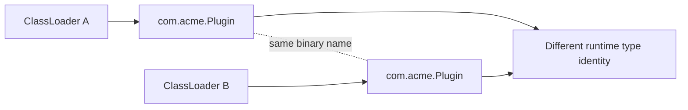
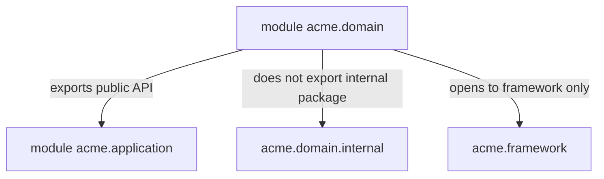
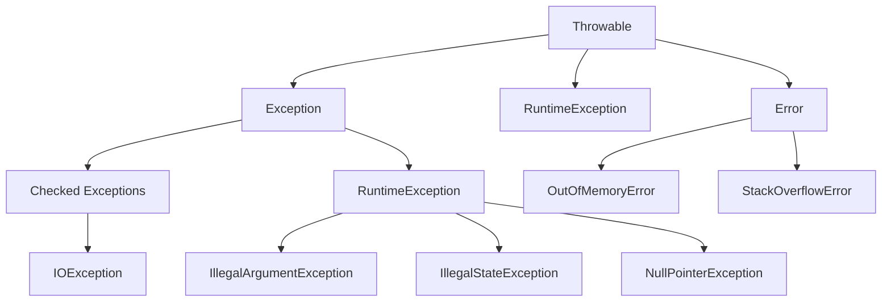

# Part 003 — `java.lang` Deep Structure

## Tujuan Part Ini

`java.lang` sering dianggap “package yang otomatis ada”. Itu benar, tetapi terlalu dangkal. Untuk engineer senior, `java.lang` adalah **lapisan kontrak paling bawah** yang membentuk cara Java memahami object, class, string, enum, record, throwable, thread, runtime, module, package, process, dan platform boundary.

Part ini membangun mental model berikut:

> `java.lang` bukan utility package. Ia adalah bahasa Java dalam bentuk library API.

Setelah part ini, Anda harus bisa:

- membaca isi `java.lang` sebagai peta runtime Java;
- membedakan class yang merepresentasikan **language construct** vs **runtime service** vs **platform bridge**;
- memahami kenapa `Object`, `Class`, `String`, `Throwable`, `Enum`, `Record`, `System`, `Runtime`, `Module`, dan `Package` adalah API dengan konsekuensi desain besar;
- mendesain API tanpa salah memperlakukan `java.lang` sebagai detail sepele;
- mengidentifikasi hidden coupling saat code memakai `System`, `Runtime`, `Class`, reflection metadata, atau `Throwable`.

---

## Kaufman Skill Frame

Dalam kerangka Josh Kaufman, skill besar “menguasai `java.lang`” kita pecah menjadi unit kecil yang bisa dilatih:

| Sub-skill | Pertanyaan koreksi diri | Latihan kecil |
|---|---|---|
| Object substrate | Apa contract universal semua object? | Override `equals`, `hashCode`, `toString` dengan invariant eksplisit. |
| Runtime type metadata | Apa bedanya static type, runtime class, binary name, canonical name? | Cetak metadata dari nested class, array, primitive, record, enum. |
| Text/value foundation | Apakah API menerima `String` sebagai identifier, label, code, atau payload? | Refactor `String` primitive obsession menjadi domain type. |
| Error model | Apakah error merepresentasikan programmer bug, recoverable failure, atau platform failure? | Buat exception hierarchy kecil dengan contract jelas. |
| Platform bridge | Apakah code diam-diam bergantung ke process environment? | Bungkus `System.getenv`, `System.getProperty`, clock, dan exit policy. |
| Runtime boundary | Apakah code boleh introspect class/package/module? | Buat validator yang membaca annotation tanpa menembus encapsulation secara liar. |

Tujuan praktiknya bukan menghafal daftar class. Tujuannya adalah mengenali **jenis kontrak** yang sedang disentuh.

---

## Peta Besar `java.lang`

Secara konseptual, `java.lang` dapat dibaca dalam beberapa cluster.

```mermaid
graph TD
    JL[java.lang] --> A[Universal Object Model]
    JL --> B[Runtime Type Metadata]
    JL --> C[Text and Primitive Wrappers]
    JL --> D[Language Shape Types]
    JL --> E[Error and Control Transfer]
    JL --> F[Platform and Process Bridge]
    JL --> G[Execution and Thread Surface]
    JL --> H[Math and Low-level Helpers]

    A --> A1[Object]
    A --> A2[Cloneable]
    A --> A3[Comparable]
    A --> A4[Iterable]
    A --> A5[AutoCloseable]

    B --> B1[Class]
    B --> B2[ClassLoader]
    B --> B3[Package]
    B --> B4[Module]
    B --> B5[StackTraceElement]
    B --> B6[StackWalker]

    C --> C1[String]
    C --> C2[StringBuilder]
    C --> C3[StringBuffer]
    C --> C4[Boolean Character Number]
    C --> C5[Integer Long Double etc]

    D --> D1[Enum]
    D --> D2[Record]
    D --> D3[Void]
    D --> D4[FunctionalInterface annotation in java.lang]

    E --> E1[Throwable]
    E --> E2[Exception]
    E --> E3[RuntimeException]
    E --> E4[Error]
    E --> E5[AssertionError]

    F --> F1[System]
    F --> F2[Runtime]
    F --> F3[Process]
    F --> F4[ProcessBuilder]
    F --> F5[ProcessHandle]

    G --> G1[Thread]
    G --> G2[ThreadLocal]
    G --> G3[InheritableThreadLocal]

    H --> H1[Math]
    H --> H2[StrictMath]
```



Tidak semua class di atas akan dibahas mendalam di part ini. Beberapa sudah punya seri lain atau akan muncul lagi di part reflection/metaprogramming. Di sini kita fokus pada **struktur mental** dan **konsekuensi desain**.

---

## Kenapa `java.lang` Otomatis Diimpor?

Java memperlakukan `java.lang` sebagai package fundamental. Setiap compilation unit secara implisit mendapatkan akses ke tipe-tipe `java.lang`, sehingga Anda bisa menulis:

```java
String name = "case-001";
Object value = name;
Class<?> type = value.getClass();
System.out.println(type.getName());
```

Tanpa:

```java
import java.lang.String;
import java.lang.Object;
import java.lang.Class;
import java.lang.System;
```

Implikasinya:

1. **Nama dari `java.lang` terasa seperti keyword**, padahal tetap class/interface biasa.
2. **Kontraknya menjadi sangat sosial**, karena semua engineer Java mengasumsikan behavior tertentu.
3. **API Anda sering bergantung padanya tanpa terlihat**, terutama `String`, `Object`, `Class`, `Throwable`, dan `System`.
4. **Kesalahan desain di sekitar tipe ini menyebar luas**, karena tipe ini muncul di hampir semua boundary.

Contoh API yang tampak sederhana:

```java
public Object execute(String command, Class<?> expectedType);
```

Signature ini membawa banyak pertanyaan:

- `String command` itu identifier, DSL, SQL-like syntax, command name, atau user input?
- `Object` hasilnya berarti dynamic typing, polymorphic return, atau desain yang belum matang?
- `Class<?> expectedType` dipakai untuk cast runtime, deserialization, service lookup, atau validation?
- error-nya direpresentasikan dengan exception apa?
- apakah API ini source-compatible dan binary-compatible saat berkembang?

`java.lang` membuat code mudah ditulis, tetapi juga mudah membuat boundary terlalu longgar.

---

## Cluster 1 — Universal Object Model

### `Object`: Root Contract Semua Reference Type

Semua class Java secara langsung atau tidak langsung mewarisi `Object`. Ini berarti semua object punya contract dasar:

```java
public class Object {
    public final Class<?> getClass();
    public int hashCode();
    public boolean equals(Object obj);
    protected Object clone() throws CloneNotSupportedException;
    public String toString();
    public final void notify();
    public final void notifyAll();
    public final void wait() throws InterruptedException;
    protected void finalize() throws Throwable; // deprecated for removal path
}
```

Part 004 akan khusus membahas detail ini. Untuk sekarang, pahami bahwa `Object` adalah **minimum universal protocol**.

Desain API buruk sering muncul saat kita memakai `Object` sebagai escape hatch:

```java
public interface Context {
    Object get(String key);
    void put(String key, Object value);
}
```

Masalahnya bukan hanya casting. Masalahnya adalah contract hilang:

- tipe value tidak diketahui;
- lifecycle value tidak diketahui;
- nullability tidak diketahui;
- ownership tidak diketahui;
- mutability tidak diketahui;
- key namespace tidak diketahui;
- error saat salah tipe biasanya muncul terlambat.

Alternatif lebih defensible:

```java
public final class ContextKey<T> {
    private final String name;
    private final Class<T> type;

    private ContextKey(String name, Class<T> type) {
        this.name = name;
        this.type = type;
    }

    public static <T> ContextKey<T> of(String name, Class<T> type) {
        return new ContextKey<>(name, type);
    }

    public String name() {
        return name;
    }

    public Class<T> type() {
        return type;
    }
}

public interface TypedContext {
    <T> T get(ContextKey<T> key);
    <T> void put(ContextKey<T> key, T value);
}
```

Ini masih memakai `Object` di implementasi internal, tetapi API publik memberi compiler lebih banyak informasi.

---

### `Comparable<T>`: Natural Ordering sebagai Contract Global

`Comparable<T>` terlihat kecil:

```java
public interface Comparable<T> {
    int compareTo(T other);
}
```

Tetapi ia menciptakan **natural ordering**. Begitu sebuah type mengimplementasikan `Comparable`, consumer akan mengasumsikan bahwa ordering tersebut:

- stabil;
- total atau setidaknya konsisten untuk domain tersebut;
- tidak berubah sembarangan antar release;
- cocok untuk sorting, range, min/max, sorted collection;
- idealnya konsisten dengan `equals`, terutama saat digunakan dalam collection tertentu.

Contoh desain problematik:

```java
public final class EnforcementCase implements Comparable<EnforcementCase> {
    private final String caseId;
    private final int priority;
    private final long createdAtEpochMillis;

    @Override
    public int compareTo(EnforcementCase other) {
        return Integer.compare(other.priority, this.priority);
    }
}
```

Apakah natural ordering sebuah case memang berdasarkan priority? Bagaimana kalau produk berubah dan sorting default ingin berdasarkan creation time? Natural ordering terlalu kuat untuk hal yang kontekstual.

Lebih baik:

```java
public final class EnforcementCaseOrder {
    public static Comparator<EnforcementCase> byPriorityDesc() {
        return Comparator.comparingInt(EnforcementCase::priority).reversed();
    }

    public static Comparator<EnforcementCase> byCreatedAtAsc() {
        return Comparator.comparingLong(EnforcementCase::createdAtEpochMillis);
    }
}
```

Gunakan `Comparable` hanya jika domain benar-benar punya satu ordering alami yang stabil.

---

### `Iterable<T>`: API yang Mengizinkan Traversal, Bukan Sekadar Collection

`Iterable<T>` adalah contract minimal untuk `for-each`:

```java
for (Decision decision : decisions) {
    // ...
}
```

Tetapi `Iterable` tidak menjanjikan:

- ukuran;
- repeatability;
- ordering;
- mutability;
- thread-safety;
- laziness;
- idempotence;
- resource ownership.

API seperti ini tampak harmless:

```java
public Iterable<Event> events();
```

Namun consumer tidak tahu apakah:

- iterasi kedua menghasilkan data sama;
- iterator membaca database streaming;
- iterator harus ditutup;
- exception bisa muncul di tengah traversal;
- hasilnya snapshot atau live view.

Untuk API internal enterprise, kontrak perlu lebih eksplisit:

```java
public interface EventRepository {
    List<Event> findPage(EventQuery query, PageRequest pageRequest);
}
```

atau:

```java
public interface EventStream extends AutoCloseable {
    boolean tryAdvance(Consumer<Event> consumer);

    @Override
    void close();
}
```

`Iterable` bagus untuk struktur ringan. Jangan memakainya untuk menyembunyikan IO/lifecycle berat.

---

### `AutoCloseable`: Boundary Resource Lifetime

`AutoCloseable` dipakai oleh try-with-resources:

```java
try (ResourceSession session = resourceManager.openSession()) {
    session.write(payload);
}
```

Mental model:

> `AutoCloseable` bukan sekadar method `close()`. Ia adalah kontrak ownership atas resource yang harus dilepas.

Desain API resource harus menjawab:

- siapa pemilik resource?
- apakah `close()` idempotent?
- apakah `close()` boleh throw exception?
- apa yang terjadi jika operation dipanggil setelah close?
- apakah close melepas native handle, network connection, transaction scope, lock, file descriptor, atau temporary directory?

Contoh defensible:

```java
public final class ExportSession implements AutoCloseable {
    private boolean closed;

    public void write(byte[] chunk) {
        ensureOpen();
        // write chunk
    }

    @Override
    public void close() {
        if (closed) {
            return;
        }
        closed = true;
        // release resources
    }

    private void ensureOpen() {
        if (closed) {
            throw new IllegalStateException("ExportSession is already closed");
        }
    }
}
```

Kontrak lifecycle yang jelas lebih penting daripada sekadar mengikuti pattern.

---

## Cluster 2 — Runtime Type Metadata

### `Class<T>`: Runtime Handle untuk Type

`Class<T>` merepresentasikan class/interface di running Java application. Ini tidak sama dengan source-level type secara penuh.

Contoh:

```java
List<String> names = List.of("a", "b");
Class<?> runtimeType = names.getClass();

System.out.println(runtimeType.getName());
```

Runtime class mungkin `java.util.ImmutableCollections$List12` atau implementation detail lain, bukan `List<String>`.

Hal penting:

- `Class<?>` tahu runtime class;
- tidak membawa generic parameter penuh seperti `List<String>`;
- primitive punya `Class` object juga: `int.class`;
- array punya `Class` object juga: `String[].class`;
- `void` punya `Void.TYPE`;
- nested class punya binary name berbeda dari canonical name;
- class identity dipengaruhi class loader.

Contoh eksplorasi:

```java
public final class ClassMetadataDemo {
    static class Nested {}

    public static void main(String[] args) {
        inspect(String.class);
        inspect(int.class);
        inspect(String[].class);
        inspect(Nested.class);
    }

    static void inspect(Class<?> type) {
        System.out.println("name=" + type.getName());
        System.out.println("canonical=" + type.getCanonicalName());
        System.out.println("simple=" + type.getSimpleName());
        System.out.println("primitive=" + type.isPrimitive());
        System.out.println("array=" + type.isArray());
        System.out.println("---");
    }
}
```

`Class<T>` sering dipakai sebagai **runtime token**:

```java
public interface JsonReader {
    <T> T read(String json, Class<T> targetType);
}
```

Tetapi token ini gagal untuk tipe generic nested:

```java
// Tidak cukup untuk membedakan List<String> vs List<Integer>
Class<List> rawListType = List.class;
```

Karena itu framework sering memakai `Type`, `ParameterizedType`, atau custom `TypeReference<T>`. Ini akan dibahas mendalam di generics dan reflection parts.

---

### `ClassLoader`: Type Identity Bukan Hanya Nama

Di Java, dua class dengan binary name sama bisa berbeda jika dimuat oleh class loader berbeda.

Mental model:

```text
runtime type identity = binary name + defining class loader
```

Ini penting untuk:

- plugin system;
- application server;
- test isolation;
- hot reload;
- module/runtime image;
- framework scanning;
- service loading;
- class cast errors yang tampak “mustahil”.

Bug klasik:

```text
java.lang.ClassCastException: com.acme.Plugin cannot be cast to com.acme.Plugin
```

Secara manusia terlihat sama. Secara runtime bisa berbeda karena class loader berbeda.



Aturan desain:

- jangan menjadikan class loader sebagai detail tidak penting dalam framework/plugin architecture;
- pastikan shared API dimuat oleh parent/common loader;
- jangan cache `Class<?>` global tanpa memahami lifecycle loader;
- hati-hati memory leak via static maps yang menyimpan `Class<?>`, `Method`, atau class-loader-owned object.

---

### `Module`: Runtime Boundary Setelah Java 9

`Module` merepresentasikan module tempat class/package berada.

```java
Module module = String.class.getModule();
System.out.println(module.getName()); // java.base
```

Module memengaruhi:

- readability;
- exports;
- opens;
- reflection access;
- service use/provide;
- encapsulation runtime.

Di classpath lama, banyak hal terasa bisa di-reflect bebas. Di modular runtime, “public” tidak otomatis berarti semua caller bisa reflective access ke semua member. Ini penting untuk framework.

Contoh mental model:



Guideline:

- `exports` untuk compile-time dan runtime public API;
- `opens` untuk deep reflection;
- jangan `open module` kecuali Anda sengaja mengorbankan encapsulation;
- framework yang butuh reflection harus mendokumentasikan module requirements.

---

### `Package`: Metadata Runtime, Bukan Namespace Source Saja

`Package` merepresentasikan metadata runtime dari package yang terkait class loader, termasuk annotation, versioning, dan sealing metadata.

```java
Package p = String.class.getPackage();
System.out.println(p.getName()); // java.lang
```

Package di source code adalah grouping nama. `java.lang.Package` adalah object runtime metadata. Jangan mencampur keduanya secara mental.

Use case nyata:

- membaca package annotation dari `package-info.java`;
- framework metadata scanning;
- version/sealing metadata legacy;
- diagnostics.

Contoh package annotation:

```java
// package-info.java
@DomainBoundary("case-management")
package com.acme.casework.domain;
```

```java
@Retention(RetentionPolicy.RUNTIME)
@Target(ElementType.PACKAGE)
public @interface DomainBoundary {
    String value();
}
```

```java
Package pkg = SomeDomainClass.class.getPackage();
DomainBoundary boundary = pkg.getAnnotation(DomainBoundary.class);
```

Ini bisa berguna untuk architectural fitness checks. Tetapi jangan menjadikannya core business flow; metadata runtime harus tetap support mechanism, bukan business truth utama.

---

## Cluster 3 — Text and Primitive Wrapper Foundation

### `String`: Text, Identifier, Code, Payload — Jangan Dicampur

`String` adalah salah satu class paling fundamental. Semua string literal adalah instance `String`. Karena `String` final dan immutable, ia aman untuk banyak boundary.

Namun `String` sering menjadi sumber **primitive obsession**.

Contoh terlalu longgar:

```java
public void escalate(String caseId, String reason, String actor, String targetState) {
    // ...
}
```

Semua parameter sama-sama `String`, tetapi domain meaning berbeda:

- `caseId` adalah identity;
- `reason` adalah human-readable explanation atau reason code?
- `actor` adalah username, user id, service account, atau role?
- `targetState` adalah enum state atau arbitrary text?

API lebih kuat:

```java
public void escalate(
        CaseId caseId,
        EscalationReason reason,
        ActorId actorId,
        CaseState targetState
) {
    // ...
}
```

`String` cocok untuk:

- text yang memang bebas;
- interoperable protocol boundary;
- serialization boundary;
- UI display;
- logging;
- configuration key dengan namespace jelas.

`String` kurang cocok untuk:

- domain identity penting;
- money/currency;
- state machine state;
- permission code;
- validated identifier;
- value dengan grammar khusus.

---

### `StringBuilder` dan `StringBuffer`: Mutability and Threading Signal

`StringBuilder` adalah mutable sequence builder yang umum dipakai untuk membangun string secara efisien dalam single-threaded context.

`StringBuffer` adalah legacy synchronized variant.

Guideline modern:

- gunakan `StringBuilder` untuk local construction;
- hindari mengekspos `StringBuilder` sebagai field publik atau return value;
- jangan gunakan `StringBuffer` hanya karena “thread-safe”; thread-safety pada mutable text builder jarang contract yang benar;
- untuk API, terima `CharSequence` hanya jika Anda sungguh bisa menangani berbagai implementasi.

Contoh API dengan `CharSequence`:

```java
public boolean isBlank(CharSequence value) {
    if (value == null) {
        return true;
    }
    for (int i = 0; i < value.length(); i++) {
        if (!Character.isWhitespace(value.charAt(i))) {
            return false;
        }
    }
    return true;
}
```

Tetapi jangan menerima `CharSequence` jika Anda langsung menyimpan reference mutable dari caller:

```java
public final class BadLabel {
    private final CharSequence value;

    public BadLabel(CharSequence value) {
        this.value = value; // risky if caller passes mutable StringBuilder
    }
}
```

Defensive version:

```java
public final class Label {
    private final String value;

    public Label(CharSequence value) {
        this.value = value.toString();
    }
}
```

---

### Primitive Wrappers: Boxed Value Tidak Sama dengan Primitive

Wrapper seperti `Integer`, `Long`, `Boolean`, `Double`, `Character` memberi object representation untuk primitive value.

Mereka penting untuk:

- generics, karena Java generics tidak menerima primitive type biasa;
- nullability signal;
- reflection;
- collection;
- constants;
- parsing;
- conversion.

Namun wrapper membawa risiko:

```java
Integer a = 1000;
Integer b = 1000;

System.out.println(a == b);      // false in common implementations
System.out.println(a.equals(b)); // true
```

Jangan memakai `==` untuk wrapper equality kecuali Anda sengaja membandingkan reference identity. Untuk numeric value, gunakan primitive atau `equals` setelah null handling.

Autoboxing juga bisa menyembunyikan allocation atau null unboxing:

```java
Integer count = null;
int value = count; // NullPointerException
```

API guideline:

| Use case | Prefer |
|---|---|
| Required numeric value | primitive `int`, `long`, `double` |
| Optional numeric value | explicit optional/domain object, sometimes boxed type internally |
| Collection of numbers | wrapper via generics, or primitive specialized structure where needed |
| Public domain API | domain value object if meaning matters |
| Performance hot path | benchmark; avoid accidental boxing |

---

### `Number`: Abstract Supertype yang Jarang Cocok untuk Domain API

`Number` tampak generic:

```java
public void setThreshold(Number threshold) {
    // ...
}
```

Tetapi `Number` tidak memberi contract cukup:

- precision?
- scale?
- integer vs decimal?
- overflow handling?
- unit?
- currency?
- conversion loss?

Contoh problematik:

```java
public boolean exceeds(Number actual, Number threshold) {
    return actual.doubleValue() > threshold.doubleValue();
}
```

Ini bisa merusak precision untuk `BigDecimal` atau integer besar.

Lebih baik eksplisit:

```java
public boolean exceeds(BigDecimal actual, BigDecimal threshold) {
    return actual.compareTo(threshold) > 0;
}
```

atau domain-specific:

```java
public boolean exceeds(RiskScore actual, RiskScore threshold) {
    return actual.isGreaterThan(threshold);
}
```

---

## Cluster 4 — Language Shape Types

### `Enum<E extends Enum<E>>`: Closed Set dengan Identity Stabil

Semua enum Java mewarisi `Enum`. Enum cocok untuk closed set sederhana:

```java
public enum CaseState {
    DRAFT,
    SUBMITTED,
    UNDER_REVIEW,
    ESCALATED,
    CLOSED
}
```

Kekuatan enum:

- instance tunggal per constant;
- identity comparison aman dengan `==`;
- bisa dipakai di `switch`;
- punya `name()` stabil jika Anda memperlakukannya sebagai wire value;
- bisa punya field dan method;
- closed set di compile time.

Risiko enum:

- `ordinal()` tidak boleh dipakai sebagai persistent/wire contract;
- rename constant bisa breaking untuk serialized/config value;
- enum terlalu kaku untuk taxonomy yang berubah dinamis;
- behavior berlebihan di enum bisa mencampur policy dan data.

Contoh defensible:

```java
public enum CaseState {
    DRAFT(false),
    SUBMITTED(false),
    UNDER_REVIEW(false),
    ESCALATED(false),
    CLOSED(true);

    private final boolean terminal;

    CaseState(boolean terminal) {
        this.terminal = terminal;
    }

    public boolean isTerminal() {
        return terminal;
    }
}
```

Tetapi transition rules yang kompleks lebih baik dipisah:

```java
public final class CaseStateMachine {
    public boolean canMove(CaseState from, CaseState to) {
        // explicit transition table or policy
    }
}
```

---

### `Record`: Shallowly Immutable Data Carrier dengan Contract Otomatis

Record adalah language feature, tetapi semua record class mewarisi `java.lang.Record`.

```java
public record CaseId(String value) {
    public CaseId {
        if (value == null || value.isBlank()) {
            throw new IllegalArgumentException("CaseId must not be blank");
        }
    }
}
```

Record cocok untuk:

- value object;
- DTO internal;
- immutable command/query object;
- composite key;
- small domain value dengan invariant constructor;
- API result yang punya shape stabil.

Record memberi otomatis:

- canonical constructor;
- accessor;
- `equals`;
- `hashCode`;
- `toString`.

Tetapi ingat: record tidak otomatis membuat isi mutable menjadi deeply immutable.

```java
public record Report(List<String> lines) {}
```

Jika caller memberikan mutable list, record menyimpan reference yang sama. Defensive version:

```java
public record Report(List<String> lines) {
    public Report {
        lines = List.copyOf(lines);
    }
}
```

Aturan desain:

- record bagus jika identity = component values;
- jangan gunakan record untuk entity dengan lifecycle identity kompleks;
- validasi invariant di compact constructor;
- lakukan defensive copy untuk mutable component;
- hati-hati menjadikan record sebagai public API jika component names menjadi bagian contract.

---

### `Void`: Absence as Type Token

`Void` sering muncul di generic API ketika tidak ada meaningful return value:

```java
CompletableFuture<Void> future = runAsyncTask();
```

`Void` juga dipakai bersama `Void.TYPE` untuk merepresentasikan `void.class`.

Jangan membuat instance `Void`; constructor-nya tidak untuk pemakaian normal. Dalam API generic, `Void` berarti “type slot ada, tetapi tidak membawa value”.

Contoh:

```java
public interface CommandHandler<C> {
    Void handle(C command);
}
```

Lebih baik:

```java
public interface CommandHandler<C> {
    void handle(C command);
}
```

Gunakan `Void` hanya saat framework/generic abstraction memerlukan type parameter.

---

## Cluster 5 — Error and Control Transfer

### `Throwable`: Root Semua Failure Signal yang Bisa Dilempar

`Throwable` adalah root untuk `Exception` dan `Error`.



Model sederhana:

| Type | Biasanya berarti | Caller expected action |
|---|---|---|
| Checked exception | recoverable/declared boundary failure | handle, translate, retry, compensate, propagate explicitly |
| Runtime exception | programmer error, invalid state, invalid argument, unchecked domain violation | fix caller or fail fast |
| Error | VM/platform serious failure | generally not recoverable |

Ini bukan aturan absolut, tetapi cukup baik sebagai baseline.

Contoh API defensible:

```java
public final class CaseNotFoundException extends RuntimeException {
    public CaseNotFoundException(CaseId caseId) {
        super("Case not found: " + caseId.value());
    }
}
```

Untuk boundary IO:

```java
public interface DocumentStore {
    DocumentContent read(DocumentId id) throws DocumentStoreException;
}
```

```java
public final class DocumentStoreException extends Exception {
    public DocumentStoreException(String message, Throwable cause) {
        super(message, cause);
    }
}
```

Pertanyaan desain:

- apakah caller bisa melakukan sesuatu selain log dan fail?
- apakah exception bagian dari API contract publik?
- apakah exception mengandung data sensitif?
- apakah stack trace diperlukan atau terlalu mahal untuk hot path?
- apakah cause chain dipertahankan?
- apakah error message cukup actionable?

---

### `StackTraceElement` dan `StackWalker`: Diagnostics Boundary

Stack trace bukan hanya text panjang. Ia adalah struktur data runtime tentang call stack.

`StackTraceElement` dipakai dalam `Throwable` stack trace. `StackWalker` memberi cara lebih terkontrol untuk berjalan di stack.

Gunakan stack introspection dengan hati-hati. Ia bisa berguna untuk:

- diagnostics;
- logging enrichment;
- framework caller inference;
- testing utilities;
- enforcement of usage convention.

Tetapi jangan menjadikannya business logic utama:

```java
// Bad smell: business decision based on caller method name
String caller = StackWalker.getInstance()
        .walk(frames -> frames.skip(1).findFirst())
        .map(frame -> frame.getMethodName())
        .orElse("unknown");
```

Stack shape bisa berubah karena refactoring, inlining, generated code, proxies, lambdas, atau framework.

---

## Cluster 6 — Platform and Process Bridge

### `System`: Global Access ke Process Environment

`System` menyediakan static access ke:

- standard input/output/error;
- system properties;
- environment variables;
- current time;
- nano time;
- array copy;
- identity hash code;
- line separator;
- library loading;
- garbage collection hint;
- process exit.

Masalah utama `System` adalah sifatnya global.

Contoh coupling buruk:

```java
public final class AuditIdGenerator {
    public String nextId() {
        String region = System.getenv("REGION");
        return region + "-" + System.currentTimeMillis();
    }
}
```

Sulit dites, sulit dikontrol, dan menyembunyikan dependency.

Versi lebih baik:

```java
public interface Environment {
    String required(String name);
}

public interface ClockSource {
    long currentTimeMillis();
}

public final class AuditIdGenerator {
    private final Environment environment;
    private final ClockSource clock;

    public AuditIdGenerator(Environment environment, ClockSource clock) {
        this.environment = environment;
        this.clock = clock;
    }

    public String nextId() {
        String region = environment.required("REGION");
        return region + "-" + clock.currentTimeMillis();
    }
}
```

Rule of thumb:

> `System` boleh dipakai di composition root, bootstrap, adapter, atau low-level utility. Jangan biarkan ia diam-diam muncul di core domain logic.

---

### `Runtime`: VM/Process-Level Control, Bukan Application Service

`Runtime.getRuntime()` memberi akses ke runtime environment aplikasi Java saat ini. Ia punya method untuk memory info, processors, shutdown hook, exec process, GC hint, dan lain-lain.

Hati-hati:

- `availableProcessors()` bukan selalu kapasitas efektif container jika runtime/config tertentu membatasi CPU;
- memory metrics perlu dipahami dalam konteks heap/non-heap/container;
- `gc()` adalah hint, bukan guarantee;
- shutdown hooks punya ordering dan timing constraints;
- `exec()` raw process sangat raw; biasanya `ProcessBuilder` lebih eksplisit.

Contoh boundary process:

```java
public interface ExternalTool {
    ToolResult run(List<String> args) throws ToolExecutionException;
}
```

Implementasi boleh memakai `ProcessBuilder`, tetapi API bisnis tidak perlu tahu.

---

### `ProcessBuilder`, `Process`, `ProcessHandle`: Native Process Boundary

Jika aplikasi Java menjalankan external process, Anda memasuki boundary yang rawan:

- command injection;
- environment leakage;
- working directory ambiguity;
- stdout/stderr deadlock jika stream tidak dikonsumsi;
- timeout;
- signal/termination semantics;
- platform differences;
- resource cleanup.

Minimal pattern:

```java
public final class ToolRunner {
    public ToolResult run(List<String> command) throws IOException, InterruptedException {
        Process process = new ProcessBuilder(command)
                .redirectErrorStream(false)
                .start();

        byte[] stdout = process.getInputStream().readAllBytes();
        byte[] stderr = process.getErrorStream().readAllBytes();
        int exitCode = process.waitFor();

        return new ToolResult(exitCode, stdout, stderr);
    }
}
```

Untuk production, tambahkan:

- timeout;
- bounded output;
- concurrent stream consumption;
- command allow-list;
- sanitized logging;
- explicit working directory;
- environment policy;
- cancellation/kill strategy.

---

## Cluster 7 — Execution and Thread Surface

`Thread`, `ThreadLocal`, dan `InheritableThreadLocal` berada di `java.lang`, tetapi detail concurrency sudah punya seri tersendiri. Di sini kita hanya lihat implikasi language substrate.

### `Thread`: Execution Carrier

`Thread` bukan sekadar “cara menjalankan sesuatu paralel”. Dalam banyak framework, thread juga membawa:

- name;
- context class loader;
- uncaught exception handler;
- interrupt state;
- stack;
- thread-local state.

Hati-hati saat API diam-diam bergantung pada current thread:

```java
public final class CurrentTenant {
    private static final ThreadLocal<String> TENANT = new ThreadLocal<>();

    public static String get() {
        return TENANT.get();
    }
}
```

Ini tampak nyaman, tetapi menciptakan hidden input. Dalam async/reactive/virtual-thread-heavy architecture, hidden thread-local assumptions bisa menjadi sumber bug.

Guideline:

- gunakan explicit context object untuk domain-critical data;
- gunakan `ThreadLocal` untuk technical context yang lifecycle-nya sangat jelas;
- selalu cleanup dengan `try/finally`;
- jangan biarkan framework context bocor ke domain model.

---

## Cluster 8 — Math and Low-Level Helpers

### `Math` dan `StrictMath`

`Math` menyediakan operasi numeric umum. `StrictMath` memberi hasil floating-point yang lebih predictable lintas platform untuk operasi tertentu.

Untuk domain enterprise:

- jangan memakai `double` untuk money;
- hati-hati rounding;
- explicit scale dan rounding mode untuk `BigDecimal`;
- bedakan numeric computation vs domain measurement;
- jangan menyembunyikan overflow.

Contoh bug:

```java
int cents = 2_000_000_000;
int doubled = cents * 2; // overflow
```

Safer:

```java
long cents = 2_000_000_000L;
long doubled = Math.multiplyExact(cents, 2L);
```

`multiplyExact`, `addExact`, dan sejenisnya membantu fail fast saat overflow.

---

## `java.lang` sebagai API Design Smell Detector

Jika sebuah API terlalu banyak memakai tipe `java.lang` generik, sering ada desain yang belum matang.

| Signature smell | Kemungkinan masalah | Pertanyaan desain |
|---|---|---|
| `Object` | contract hilang | Apakah generic, sealed type, interface, atau domain type lebih tepat? |
| `String` | primitive obsession | Apakah ini identifier, code, text, DSL, atau payload? |
| `Class<?>` | runtime type coupling | Apakah type erasure membuat informasi hilang? |
| `Throwable` | error terlalu luas | Apakah caller bisa recovery? |
| `System.*` | hidden global dependency | Apakah perlu adapter/injection? |
| `ThreadLocal` | hidden context | Apakah context perlu eksplisit? |
| `Number` | numeric semantics kabur | Precision/unit/scale/overflow bagaimana? |
| `Enum.ordinal()` | unstable wire/storage contract | Apakah perlu explicit code? |
| `Record` dengan mutable component | shallow immutability leak | Apakah perlu defensive copy? |

---

## Mini Case Study — Refactor API Berbasis `java.lang` yang Terlalu Longgar

### Before

```java
public interface RuleEngine {
    Object evaluate(String ruleName, Object input, Class<?> expectedResultType);
}
```

Masalah:

- `ruleName` tidak tervalidasi;
- `input` tidak punya shape;
- `expectedResultType` hanya runtime token dangkal;
- error contract tidak jelas;
- result cast mungkin gagal;
- tidak ada domain vocabulary.

### After

```java
public record RuleName(String value) {
    public RuleName {
        if (value == null || value.isBlank()) {
            throw new IllegalArgumentException("RuleName must not be blank");
        }
    }
}

public interface RuleInput {}
public interface RuleResult {}

public final class RuleExecutionException extends Exception {
    public RuleExecutionException(String message, Throwable cause) {
        super(message, cause);
    }
}

public interface Rule<I extends RuleInput, O extends RuleResult> {
    RuleName name();
    Class<I> inputType();
    Class<O> outputType();
    O evaluate(I input) throws RuleExecutionException;
}

public interface RuleEngine {
    <I extends RuleInput, O extends RuleResult> O evaluate(
            Rule<I, O> rule,
            I input
    ) throws RuleExecutionException;
}
```

Trade-off:

- API lebih verbose;
- tetapi contract lebih kuat;
- compiler membantu caller;
- runtime token masih ada, tetapi dibatasi;
- exception explicit;
- domain vocabulary muncul.

Untuk internal framework, verbosity yang memperjelas invariant sering lebih murah daripada debugging runtime ambiguity.

---

## Latihan Praktis

### Latihan 1 — Audit `java.lang` Smell

Ambil satu module internal. Cari signature public/internal yang memakai:

- `Object`;
- `String` lebih dari dua parameter;
- `Class<?>`;
- `Throwable`;
- `Map<String, Object>`;
- `ThreadLocal`;
- `System.getenv` atau `System.getProperty` di core logic.

Untuk setiap temuan, tulis:

```text
API:
Hidden assumption:
Failure mode:
Refactor candidate:
Cost of changing:
```

### Latihan 2 — Runtime Metadata Exploration

Buat program kecil yang mencetak metadata untuk:

- primitive;
- array;
- nested class;
- local class;
- anonymous class;
- record;
- enum;
- lambda object;
- dynamic proxy jika sudah familiar.

Pertanyaan:

- mana yang punya canonical name?
- mana yang synthetic?
- mana yang anonymous?
- apa module/package-nya?
- apakah generic parameter tersedia di runtime?

### Latihan 3 — Replace String with Domain Type

Ambil API seperti:

```java
void approve(String caseId, String actor, String reason);
```

Refactor menjadi:

```java
void approve(CaseId caseId, ActorId actorId, ApprovalReason reason);
```

Tentukan invariant masing-masing value object.

---

## Checklist Engineering

Sebelum membuat API yang memakai tipe `java.lang` fundamental, tanyakan:

- Apakah `String` ini benar-benar text, atau domain value tersembunyi?
- Apakah `Object` ini benar-benar perlu, atau karena desain belum diputuskan?
- Apakah `Class<?>` cukup untuk generic type yang dibutuhkan?
- Apakah exception type memberi recovery contract yang jelas?
- Apakah `System`/`Runtime` dipakai di boundary yang tepat?
- Apakah `ThreadLocal` menyembunyikan input penting?
- Apakah `Enum` akan dipersist sebagai `name`, explicit code, atau object lain?
- Apakah record component immutable atau perlu defensive copy?
- Apakah package/module metadata dipakai untuk diagnostics atau business decision?

---

## Ringkasan

`java.lang` adalah fondasi bahasa Java dalam bentuk API. Engineer biasa melihatnya sebagai package default. Engineer senior melihatnya sebagai kumpulan kontrak paling dasar:

- `Object` mendefinisikan protocol universal semua reference type;
- `Class`, `ClassLoader`, `Module`, dan `Package` membentuk runtime identity dan metadata;
- `String` dan wrapper types sering menjadi boundary paling rawan primitive obsession;
- `Enum` dan `Record` membentuk shape domain yang lebih eksplisit;
- `Throwable` adalah control transfer untuk failure;
- `System`, `Runtime`, dan process classes adalah bridge ke dunia luar;
- `Thread` dan `ThreadLocal` membawa execution context yang sering tersembunyi;
- `Math` membantu low-level numeric correctness, tetapi bukan pengganti domain numeric model.

Jika Anda menguasai `java.lang`, Anda tidak hanya tahu class-class dasar Java. Anda memahami bagaimana Java memaksa, mengizinkan, atau menggoda Anda membuat kontrak software tertentu.

---

## Referensi

- Oracle Java SE 25 API — `java.lang` Package Summary: `https://docs.oracle.com/en/java/javase/25/docs/api/java.base/java/lang/package-summary.html`
- Oracle Java SE 25 API — `java.base` Module Summary: `https://docs.oracle.com/en/java/javase/25/docs/api/java.base/module-summary.html`
- Oracle Java SE 25 API — `Class`: `https://docs.oracle.com/en/java/javase/25/docs/api/java.base/java/lang/Class.html`
- Oracle Java SE 25 API — `Package`: `https://docs.oracle.com/en/java/javase/25/docs/api/java.base/java/lang/Package.html`
- Oracle Java Language Specification SE 25: `https://docs.oracle.com/javase/specs/jls/se25/html/index.html`
