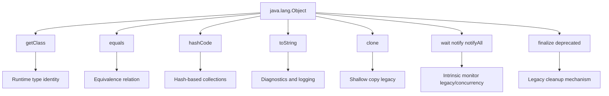
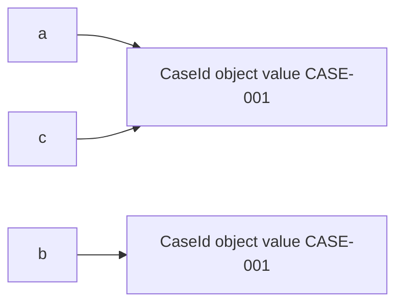
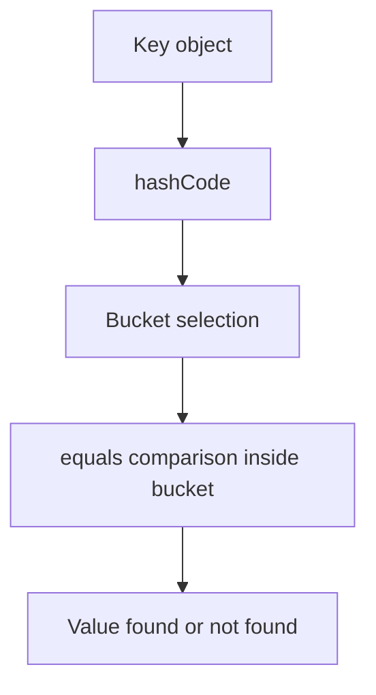

# Part 004 — `Object`, Identity, and Universal Methods

## Tujuan Part Ini

`java.lang.Object` adalah root dari hampir semua object Java. Tetapi nilai praktisnya bukan hanya “semua class extends Object”. Nilai sebenarnya: `Object` mendefinisikan **universal methods** yang diam-diam dipakai oleh collection, logging, debugger, framework, serialization, caching, hashing, testing, dan runtime diagnostics.

Part ini membahas:

- perbedaan identity, equality, equivalence, dan value semantics;
- kontrak `equals` dan `hashCode` yang benar;
- kapan memakai `getClass()` vs `instanceof` dalam equality;
- risiko mutable object sebagai key;
- `toString()` sebagai diagnostic contract, bukan serialization format;
- `clone()` dan kenapa ia jarang menjadi desain modern yang baik;
- `finalize()` sebagai mekanisme legacy yang harus dihindari;
- cara mendesain object contract agar API defensible.

---

## Kaufman Skill Frame

Skill “menguasai `Object`” dipecah menjadi unit praktik:

| Sub-skill | Feedback loop |
|---|---|
| Identity vs equality | Bisa menjelaskan kapan `a == b` benar dan kapan `a.equals(b)` benar. |
| `equals` contract | Bisa membuktikan reflexive, symmetric, transitive, consistent, dan null-safe. |
| `hashCode` contract | Object yang equal selalu punya hash code sama. |
| Mutable key safety | Bisa menunjukkan bug ketika field equality berubah setelah masuk `HashMap`. |
| `toString` contract | Bisa membedakan diagnostic string dari wire format. |
| Clone avoidance | Bisa mengganti clone dengan copy constructor/factory/record/immutable design. |
| Finalization avoidance | Bisa mengganti finalizer dengan explicit lifecycle. |

Targetnya adalah muscle memory: setiap kali membuat class, Anda langsung bertanya:

> “Object ini punya identity apa, equality apa, hash behavior apa, dan representation contract apa?”

---

## Peta Universal Methods



Part ini fokus pada `getClass`, `equals`, `hashCode`, `toString`, `clone`, dan `finalize`. `wait/notify/notifyAll` berkaitan dengan intrinsic monitor dan sudah lebih tepat dibahas di seri concurrency. Di sini cukup pahami bahwa mereka juga bagian dari `Object` karena setiap object bisa menjadi monitor.

---

## 1. Identity: Object sebagai Entity Runtime

Reference identity berarti dua reference menunjuk object yang sama.

```java
CaseId a = new CaseId("CASE-001");
CaseId b = new CaseId("CASE-001");
CaseId c = a;

System.out.println(a == b); // false
System.out.println(a == c); // true
```

`==` pada reference type membandingkan identity reference, bukan isi domain.

Mental model:



Jika domain meaning Anda adalah “dua `CaseId` dengan value sama dianggap sama”, maka perlu value equality.

```java
public record CaseId(String value) {
    public CaseId {
        if (value == null || value.isBlank()) {
            throw new IllegalArgumentException("CaseId must not be blank");
        }
    }
}
```

Record otomatis memberi equality berdasarkan component. Untuk class biasa, Anda harus mendefinisikannya sendiri.

---

## 2. `getClass()`: Runtime Class yang Final

`getClass()` adalah final native method pada `Object` yang mengembalikan runtime class object.

```java
Object value = "hello";
Class<?> type = value.getClass();

System.out.println(type.getName()); // java.lang.String
```

Hal penting:

- method ini final, tidak bisa dioverride;
- mengembalikan runtime class, bukan static type variable;
- dipakai dalam default `toString()`;
- penting untuk reflection, diagnostics, serialization, framework dispatch;
- type identity dipengaruhi class loader.

Contoh static type vs runtime type:

```java
CharSequence text = "abc";
System.out.println(text.getClass()); // class java.lang.String
```

Static type adalah `CharSequence`, runtime class adalah `String`.

### `getClass()` dalam equality

Ada dua gaya umum saat implementasi `equals`:

1. Strict exact class equality dengan `getClass()`.
2. Polymorphic equality dengan `instanceof`.

Contoh exact class equality:

```java
public final class CaseId {
    private final String value;

    public CaseId(String value) {
        if (value == null || value.isBlank()) {
            throw new IllegalArgumentException("CaseId must not be blank");
        }
        this.value = value;
    }

    @Override
    public boolean equals(Object other) {
        if (this == other) {
            return true;
        }
        if (other == null || getClass() != other.getClass()) {
            return false;
        }
        CaseId caseId = (CaseId) other;
        return value.equals(caseId.value);
    }

    @Override
    public int hashCode() {
        return value.hashCode();
    }
}
```

Karena class ini `final`, `getClass()` vs `instanceof` tidak terlalu bermasalah. Untuk non-final class, pilihan ini lebih serius.

---

## 3. `equals`: Equality sebagai Equivalence Relation

Default `Object.equals` pada dasarnya sama dengan identity comparison:

```java
public boolean equals(Object obj) {
    return this == obj;
}
```

Jika class override `equals`, contract-nya harus membentuk equivalence relation:

| Property | Meaning | Example |
|---|---|---|
| Reflexive | `x.equals(x)` true | Object equal terhadap dirinya sendiri. |
| Symmetric | jika `x.equals(y)`, maka `y.equals(x)` | Tidak boleh satu arah. |
| Transitive | jika `x.equals(y)` dan `y.equals(z)`, maka `x.equals(z)` | Chain equality harus stabil. |
| Consistent | hasil sama selama state pembanding tidak berubah | Tidak random/time-dependent. |
| Null-safe | `x.equals(null)` false | Tidak throw NPE. |

### Contoh value object yang benar

```java
public final class Money {
    private final String currency;
    private final long minorUnits;

    public Money(String currency, long minorUnits) {
        if (currency == null || currency.length() != 3) {
            throw new IllegalArgumentException("Currency must be ISO-like 3-letter code");
        }
        this.currency = currency;
        this.minorUnits = minorUnits;
    }

    public String currency() {
        return currency;
    }

    public long minorUnits() {
        return minorUnits;
    }

    @Override
    public boolean equals(Object other) {
        if (this == other) {
            return true;
        }
        if (!(other instanceof Money money)) {
            return false;
        }
        return minorUnits == money.minorUnits
                && currency.equals(money.currency);
    }

    @Override
    public int hashCode() {
        int result = currency.hashCode();
        result = 31 * result + Long.hashCode(minorUnits);
        return result;
    }

    @Override
    public String toString() {
        return currency + " " + minorUnits;
    }
}
```

Karena `Money` final, `instanceof` tidak mengundang subclass symmetry problem.

---

## 4. `getClass()` vs `instanceof` dalam `equals`

### Exact class equality

```java
if (other == null || getClass() != other.getClass()) {
    return false;
}
```

Cocok jika:

- class tidak ingin equality lintas subclass;
- hierarchy tidak dirancang untuk polymorphic equality;
- class adalah entity/value konkret;
- ingin menghindari symmetry trap.

### Polymorphic equality

```java
if (!(other instanceof Money money)) {
    return false;
}
```

Cocok jika:

- class final;
- atau interface/sealed hierarchy memang mendefinisikan equality lintas implementasi;
- atau supertype punya contract equality yang sengaja berlaku untuk semua subtype.

### Symmetry trap

```java
class Point {
    final int x;
    final int y;

    Point(int x, int y) {
        this.x = x;
        this.y = y;
    }

    @Override
    public boolean equals(Object other) {
        if (!(other instanceof Point p)) {
            return false;
        }
        return x == p.x && y == p.y;
    }
}

class ColoredPoint extends Point {
    final String color;

    ColoredPoint(int x, int y, String color) {
        super(x, y);
        this.color = color;
    }

    @Override
    public boolean equals(Object other) {
        if (!(other instanceof ColoredPoint cp)) {
            return false;
        }
        return x == cp.x && y == cp.y && color.equals(cp.color);
    }
}
```

Problem:

```java
Point p = new Point(1, 2);
ColoredPoint cp = new ColoredPoint(1, 2, "red");

p.equals(cp);  // true
cp.equals(p);  // false
```

Symmetry rusak.

Solusi desain:

- buat value class final;
- gunakan record;
- gunakan `getClass()` equality;
- hindari inheritance untuk value object;
- gunakan sealed hierarchy dengan equality policy eksplisit;
- pisahkan shared data dari equality inheritance.

---

## 5. `hashCode`: Contract dengan Hash-Based Collections

`hashCode` dipakai oleh struktur seperti `HashMap`, `HashSet`, dan banyak cache.

Kontrak utama:

1. Selama field yang dipakai equality tidak berubah, `hashCode()` harus konsisten.
2. Jika `a.equals(b)` true, maka `a.hashCode() == b.hashCode()` harus true.
3. Jika `a.equals(b)` false, hash code boleh sama, tetapi collision lebih banyak menurunkan performa.

Bug klasik:

```java
public final class BadCaseId {
    private final String value;

    public BadCaseId(String value) {
        this.value = value;
    }

    @Override
    public boolean equals(Object other) {
        return other instanceof BadCaseId id && value.equals(id.value);
    }

    // hashCode tidak dioverride
}
```

Dua object equal secara `equals`, tetapi hash code default berbasis identity. Ini merusak `HashSet`.

```java
Set<BadCaseId> ids = new HashSet<>();
ids.add(new BadCaseId("CASE-001"));

System.out.println(ids.contains(new BadCaseId("CASE-001"))); // likely false
```

### HashMap mental model



Jika hash code salah, object bisa dicari di bucket yang salah. Jika equals salah, object bisa gagal dikenali di bucket yang benar.

---

## 6. Mutable Object sebagai Key: Bug yang Mahal

Contoh buruk:

```java
public final class MutableCaseKey {
    private String value;

    public MutableCaseKey(String value) {
        this.value = value;
    }

    public void rename(String value) {
        this.value = value;
    }

    @Override
    public boolean equals(Object other) {
        return other instanceof MutableCaseKey key
                && value.equals(key.value);
    }

    @Override
    public int hashCode() {
        return value.hashCode();
    }
}
```

Bug:

```java
MutableCaseKey key = new MutableCaseKey("CASE-001");
Map<MutableCaseKey, String> map = new HashMap<>();
map.put(key, "open");

key.rename("CASE-002");

System.out.println(map.get(key)); // can be null
```

Object sudah berada di bucket berdasarkan hash lama. Setelah field berubah, lookup memakai hash baru.

Aturan:

- key hash-based collection harus immutable secara efektif;
- field yang dipakai equality/hash jangan berubah selama object berada di map/set;
- untuk entity mutable, gunakan stable id sebagai key;
- value object sebaiknya immutable.

---

## 7. Equality untuk Entity vs Value Object

### Value object

Identity = value.

```java
public record CaseId(String value) {}
public record Money(String currency, long minorUnits) {}
public record DateRange(LocalDate startInclusive, LocalDate endExclusive) {}
```

Dua value object equal jika komponennya equal.

### Entity

Identity = lifecycle identity, bukan semua field.

```java
public final class CaseFile {
    private final CaseId id;
    private CaseState state;
    private String summary;

    public CaseFile(CaseId id, CaseState state, String summary) {
        this.id = id;
        this.state = state;
        this.summary = summary;
    }

    public CaseId id() {
        return id;
    }

    @Override
    public boolean equals(Object other) {
        if (this == other) {
            return true;
        }
        if (!(other instanceof CaseFile caseFile)) {
            return false;
        }
        return id.equals(caseFile.id);
    }

    @Override
    public int hashCode() {
        return id.hashCode();
    }
}
```

Tetapi entity equality berbasis id juga punya risiko jika id belum assigned.

Bad smell:

```java
public final class UserEntity {
    private Long databaseId; // null before persisted

    @Override
    public boolean equals(Object other) {
        return other instanceof UserEntity u
                && Objects.equals(databaseId, u.databaseId);
    }
}
```

Dua transient entity dengan `databaseId == null` bisa dianggap equal jika tidak hati-hati.

Solusi:

- gunakan application-assigned id sejak awal;
- jangan override equality untuk mutable persistence entity kecuali contract jelas;
- bedakan domain identity dari database surrogate id;
- jangan memasukkan transient entity ke hash-based set jika id bisa berubah.

---

## 8. `Objects.equals` dan `Objects.hash`

Walau `java.util.Objects` bukan `java.lang`, ia sering dipakai saat implementasi `Object` methods.

```java
@Override
public boolean equals(Object other) {
    if (this == other) {
        return true;
    }
    if (!(other instanceof Person person)) {
        return false;
    }
    return Objects.equals(name, person.name)
            && Objects.equals(email, person.email);
}

@Override
public int hashCode() {
    return Objects.hash(name, email);
}
```

Catatan engineering:

- `Objects.equals(a, b)` null-safe;
- `Objects.hash(...)` nyaman tetapi membuat varargs array, tidak ideal untuk hot path;
- untuk object kecil non-hot path, readability sering cukup;
- untuk performance-sensitive key, implement hash manual atau benchmark.

Manual:

```java
@Override
public int hashCode() {
    int result = name != null ? name.hashCode() : 0;
    result = 31 * result + (email != null ? email.hashCode() : 0);
    return result;
}
```

---

## 9. `toString`: Diagnostic Contract, Bukan Wire Format

Default `Object.toString()` kira-kira:

```java
getClass().getName() + "@" + Integer.toHexString(hashCode())
```

Jika class override `toString`, tentukan niatnya.

### Good diagnostic `toString`

```java
public record CaseId(String value) {
    @Override
    public String toString() {
        return value;
    }
}
```

Untuk value object kecil seperti `CaseId`, ini bisa masuk akal.

Untuk entity yang mungkin punya data sensitif:

```java
public final class UserAccount {
    private final String id;
    private final String email;
    private final String passwordHash;

    @Override
    public String toString() {
        return "UserAccount{id='%s', email='%s'}".formatted(id, email);
    }
}
```

Jangan masukkan:

- password;
- token;
- credential;
- PII sensitif;
- full document payload;
- secret config;
- data besar.

### Jangan jadikan `toString()` sebagai serialization format

Buruk:

```java
String payload = order.toString();
sendToPartner(payload);
```

Masalah:

- tidak ada schema;
- tidak ada compatibility guarantee;
- format bisa berubah untuk debugging;
- escaping tidak jelas;
- consumer rapuh.

Gunakan serializer/formatter eksplisit:

```java
public interface OrderFormatter {
    String format(Order order);
}
```

atau DTO/schema resmi.

---

## 10. `clone`: Legacy Copy Mechanism yang Bermasalah

`Object.clone()` adalah protected native method yang melakukan field-by-field shallow copy jika object mengimplementasikan `Cloneable`; jika tidak, ia melempar `CloneNotSupportedException`.

Masalah desain `clone`:

- `Cloneable` adalah marker interface tanpa method `clone` publik;
- `Object.clone` protected, bukan public;
- default copy adalah shallow;
- constructor tidak dieksekusi seperti object creation normal;
- final field dan invariants bisa membingungkan;
- deep copy policy tidak jelas;
- subclassing membuat contract makin rumit.

Contoh shallow copy problem:

```java
public final class Report implements Cloneable {
    private final List<String> lines;

    public Report(List<String> lines) {
        this.lines = new ArrayList<>(lines);
    }

    @Override
    public Report clone() {
        try {
            return (Report) super.clone(); // shallow copy: same list reference
        } catch (CloneNotSupportedException e) {
            throw new AssertionError(e);
        }
    }
}
```

`Report` hasil clone berbagi list yang sama jika field mutable.

Modern alternatives:

### Copy constructor

```java
public final class Report {
    private final List<String> lines;

    public Report(List<String> lines) {
        this.lines = List.copyOf(lines);
    }

    public Report(Report source) {
        this.lines = List.copyOf(source.lines);
    }
}
```

### Static copy factory

```java
public static Report copyOf(Report source) {
    return new Report(source.lines);
}
```

### Wither-style immutable update

```java
public record CaseAssignment(CaseId caseId, ActorId assignee) {
    public CaseAssignment withAssignee(ActorId newAssignee) {
        return new CaseAssignment(caseId, newAssignee);
    }
}
```

Rule:

> Jangan expose `clone()` sebagai API modern kecuali Anda berinteroperasi dengan legacy API yang memang memerlukannya.

---

## 11. `finalize`: Legacy Cleanup yang Harus Dihindari

`Object.finalize()` adalah mekanisme lama yang dipanggil GC sebelum object direklamasi. Mekanisme ini deprecated dan secara desain tidak bisa diandalkan untuk resource management.

Masalah finalization:

- tidak ada guarantee kapan dipanggil;
- mungkin tidak dipanggil sebelum process exit;
- bisa menyebabkan performance overhead;
- bisa membuka risiko resurrection object;
- sulit diprediksi;
- buruk untuk file descriptor, socket, lock, native memory, transaction, dan resource penting lain.

Jangan desain class seperti ini:

```java
public final class NativeHandle {
    private long pointer;

    @Override
    protected void finalize() throws Throwable {
        release(pointer);
    }
}
```

Gunakan explicit lifecycle:

```java
public final class NativeHandle implements AutoCloseable {
    private long pointer;
    private boolean closed;

    public NativeHandle(long pointer) {
        this.pointer = pointer;
    }

    @Override
    public void close() {
        if (closed) {
            return;
        }
        closed = true;
        release(pointer);
        pointer = 0;
    }

    private static void release(long pointer) {
        // release native resource
    }
}
```

Pemakaian:

```java
try (NativeHandle handle = openHandle()) {
    // use handle
}
```

Untuk safety net tertentu, Java menyediakan mekanisme seperti `Cleaner`, tetapi itu tetap bukan pengganti lifecycle eksplisit. Cleaner/finalizer-like mechanism sebaiknya cadangan, bukan primary correctness mechanism.

---

## 12. Wait/Notify: Kenapa Ada di `Object`?

Setiap Java object bisa memiliki intrinsic monitor. Karena itu `wait`, `notify`, dan `notifyAll` berada di `Object`.

```java
synchronized (lock) {
    while (!condition) {
        lock.wait();
    }
}
```

Di seri ini, jangan masuk detail concurrency. Mental model yang perlu disimpan:

- semua object bisa menjadi monitor;
- monitor methods final;
- calling `wait/notify` butuh ownership monitor via `synchronized`;
- modern Java sering lebih baik memakai higher-level concurrency tools;
- jangan mencampur domain object sebagai lock publik.

Bad smell:

```java
synchronized (caseFile) {
    // locking on domain object visible elsewhere
}
```

Lebih baik:

```java
private final Object lock = new Object();
```

atau concurrency abstraction yang lebih tepat.

---

## 13. Pattern Equality yang Baik untuk Berbagai Jenis Type

### Final value class

```java
public final class EmailAddress {
    private final String value;

    public EmailAddress(String value) {
        if (value == null || !value.contains("@")) {
            throw new IllegalArgumentException("Invalid email address");
        }
        this.value = value.toLowerCase(Locale.ROOT);
    }

    @Override
    public boolean equals(Object other) {
        return other instanceof EmailAddress email
                && value.equals(email.value);
    }

    @Override
    public int hashCode() {
        return value.hashCode();
    }

    @Override
    public String toString() {
        return value;
    }
}
```

### Record value object

```java
public record ActorId(String value) {
    public ActorId {
        if (value == null || value.isBlank()) {
            throw new IllegalArgumentException("ActorId must not be blank");
        }
    }
}
```

### Entity with stable application id

```java
public final class CaseFile {
    private final CaseId id;
    private CaseState state;

    public CaseFile(CaseId id, CaseState state) {
        this.id = id;
        this.state = state;
    }

    @Override
    public boolean equals(Object other) {
        return other instanceof CaseFile caseFile
                && id.equals(caseFile.id);
    }

    @Override
    public int hashCode() {
        return id.hashCode();
    }
}
```

### Sealed hierarchy

Untuk sealed hierarchy, putuskan equality policy di root.

```java
public sealed interface Decision permits Approve, Reject {}

public record Approve(String reason) implements Decision {}
public record Reject(String reason) implements Decision {}
```

Record equality akan exact terhadap record class. `new Approve("x")` tidak equal dengan `new Reject("x")`, meski component sama. Itu biasanya benar karena variant berbeda.

---

## 14. Anti-Patterns

### Anti-pattern 1 — Override `equals` tanpa `hashCode`

```java
@Override
public boolean equals(Object other) {
    return other instanceof CaseId id && value.equals(id.value);
}
```

Tanpa hashCode, hash collection rusak.

### Anti-pattern 2 — Equality bergantung waktu/random/external service

```java
@Override
public boolean equals(Object other) {
    return remoteService.sameCustomer(this, other);
}
```

Equality harus local, deterministic, dan murah.

### Anti-pattern 3 — `toString` bocor secret

```java
@Override
public String toString() {
    return "Token{" + rawToken + "}";
}
```

### Anti-pattern 4 — Hash code dari mutable field

```java
@Override
public int hashCode() {
    return status.hashCode(); // status mutable
}
```

### Anti-pattern 5 — Catch-all equality di base class mutable

Base class yang mencoba mendefinisikan equality untuk semua subclass sering merusak symmetry/transitivity. Prefer final value classes, records, atau hierarchy tertutup dengan policy eksplisit.

---

## 15. API Design Implications

### Jangan memaksa consumer menebak equality

Jika API menerima object sebagai key:

```java
public interface Registry<K, V> {
    void register(K key, V value);
    Optional<V> find(K key);
}
```

Dokumentasikan:

- apakah key dibandingkan dengan `equals`?
- apakah key disimpan dalam hash map?
- apakah key harus immutable?
- apakah identity comparison dipakai?

Kadang identity registry lebih tepat:

```java
public final class IdentityRegistry<V> {
    private final IdentityHashMap<Object, V> values = new IdentityHashMap<>();
}
```

Tetapi nama harus eksplisit karena ini melawan ekspektasi umum `equals`.

---

### Jangan jadikan `toString` sebagai contract machine-readable

Jika API butuh stable string:

```java
public record CaseId(String value) {
    public String externalForm() {
        return value;
    }
}
```

Lalu `toString()` boleh delegate jika aman:

```java
@Override
public String toString() {
    return externalForm();
}
```

Tetapi contract machine-readable tetap berada di method bernama jelas.

---

### Jangan expose object internal mutable

```java
public final class Report {
    private final List<String> lines;

    public List<String> lines() {
        return lines; // maybe mutable leak
    }
}
```

Better:

```java
public List<String> lines() {
    return List.copyOf(lines);
}
```

atau simpan immutable sejak awal:

```java
this.lines = List.copyOf(lines);
```

Equality dan hashCode aman hanya jika component yang dipakai juga punya contract stabil.

---

## 16. Testing Object Contracts

Minimal tests untuk value object:

```java
class CaseIdTest {
    @Test
    void equalityUsesValue() {
        CaseId a = new CaseId("CASE-001");
        CaseId b = new CaseId("CASE-001");
        CaseId c = new CaseId("CASE-002");

        assertEquals(a, b);
        assertEquals(a.hashCode(), b.hashCode());
        assertNotEquals(a, c);
    }

    @Test
    void notEqualToNullOrDifferentType() {
        CaseId id = new CaseId("CASE-001");

        assertNotEquals(null, id);
        assertNotEquals("CASE-001", id);
    }
}
```

Test transitivity:

```java
@Test
void equalityIsTransitive() {
    CaseId a = new CaseId("CASE-001");
    CaseId b = new CaseId("CASE-001");
    CaseId c = new CaseId("CASE-001");

    assertEquals(a, b);
    assertEquals(b, c);
    assertEquals(a, c);
}
```

Test hash map behavior:

```java
@Test
void worksAsHashMapKey() {
    Map<CaseId, String> values = new HashMap<>();
    values.put(new CaseId("CASE-001"), "open");

    assertEquals("open", values.get(new CaseId("CASE-001")));
}
```

---

## 17. Decision Matrix

| Object kind | `equals/hashCode` strategy | `toString` strategy | Copy strategy |
|---|---|---|---|
| Small value object | value-based | safe external or diagnostic | immutable, record/copy factory |
| Entity with stable id | id-based, carefully | avoid dumping mutable/sensitive fields | domain-specific mutation/copy |
| Mutable aggregate | often avoid override or use stable id | diagnostic only | explicit snapshot/copy method |
| DTO/command/query | record/component-based | generated record `toString` if safe | immutable copy/record |
| Framework metadata key | value-based and immutable | diagnostic with class/name | immutable |
| Resource handle | identity-based usually | include handle id, not secret | no clone; lifecycle via close |
| Security token/secret | often no value exposure | redacted | explicit secure lifecycle |

---

## 18. Practice: Design Object Contract from Requirements

Requirement:

> Kita butuh object `PolicyCode` untuk enforcement policy. Code berasal dari konfigurasi, case-insensitive, disimpan uppercase, boleh dipakai sebagai key map, dan aman dicetak di log.

Implementation:

```java
public record PolicyCode(String value) {
    public PolicyCode {
        if (value == null || value.isBlank()) {
            throw new IllegalArgumentException("PolicyCode must not be blank");
        }
        value = value.trim().toUpperCase(Locale.ROOT);
    }

    @Override
    public String toString() {
        return value;
    }
}
```

Record sudah memberi equality/hashCode berdasarkan normalized `value`.

Requirement kedua:

> Kita butuh object `ApiToken`. Token harus bisa dibandingkan untuk internal lookup, tetapi tidak boleh bocor di log.

Implementation:

```java
public final class ApiToken {
    private final String value;

    public ApiToken(String value) {
        if (value == null || value.length() < 20) {
            throw new IllegalArgumentException("Invalid API token");
        }
        this.value = value;
    }

    public boolean sameToken(ApiToken other) {
        return other != null && value.equals(other.value);
    }

    @Override
    public String toString() {
        return "ApiToken{redacted}";
    }
}
```

Perhatikan: kita sengaja tidak expose raw value. Jika perlu equality untuk map key, override `equals/hashCode`, tetapi pastikan tidak ada code yang memakai `toString` untuk mendapatkan token.

---

## Checklist Implementasi `Object` Methods

Sebelum commit class baru, jawab:

- Apakah class ini value object, entity, DTO, resource handle, atau service?
- Apakah default identity equality sudah cukup?
- Jika override `equals`, apakah `hashCode` juga dioverride?
- Apakah equality memakai field immutable/stable?
- Apakah equality reflexive, symmetric, transitive, consistent, dan null-safe?
- Apakah subclassing bisa merusak equality?
- Apakah class sebaiknya `final`?
- Apakah record lebih tepat?
- Apakah `toString` aman untuk log?
- Apakah `toString` tidak dijadikan serialization format?
- Apakah copy semantics perlu explicit method, bukan `clone`?
- Apakah resource cleanup memakai `AutoCloseable`, bukan finalizer?

---

## Ringkasan

`Object` adalah akar kontrak semua reference type Java. Method-methodnya tampak kecil, tetapi dampaknya besar:

- `getClass()` memberi runtime type identity;
- `equals()` mendefinisikan apakah dua object dianggap sama;
- `hashCode()` menghubungkan equality dengan hash-based data structure;
- `toString()` menjadi diagnostic representation yang sering muncul di log;
- `clone()` adalah legacy shallow copy mechanism yang sebaiknya dihindari untuk desain modern;
- `finalize()` adalah legacy cleanup mechanism yang tidak reliable dan harus diganti explicit lifecycle;
- `wait/notify` menunjukkan setiap object bisa menjadi monitor, tetapi bukan alasan untuk lock sembarang object domain.

Top 1% engineer tidak menulis `equals/hashCode/toString` secara mekanis. Mereka menentukan identity model, lifecycle model, mutability model, API compatibility, diagnostics safety, dan failure behavior sebelum memilih implementasi.

---

## Referensi

- Oracle Java SE 25 API — `Object`: `https://docs.oracle.com/en/java/javase/25/docs/api/java.base/java/lang/Object.html`
- Oracle Java SE 25 API — `Record`: `https://docs.oracle.com/en/java/javase/25/docs/api/java.base/java/lang/Record.html`
- Oracle Java SE 25 API — `System`: `https://docs.oracle.com/en/java/javase/25/docs/api/java.base/java/lang/System.html`
- Oracle Java SE 25 API — `java.lang` Package Summary: `https://docs.oracle.com/en/java/javase/25/docs/api/java.base/java/lang/package-summary.html`
- Oracle Java Language Specification SE 25: `https://docs.oracle.com/javase/specs/jls/se25/html/index.html`
