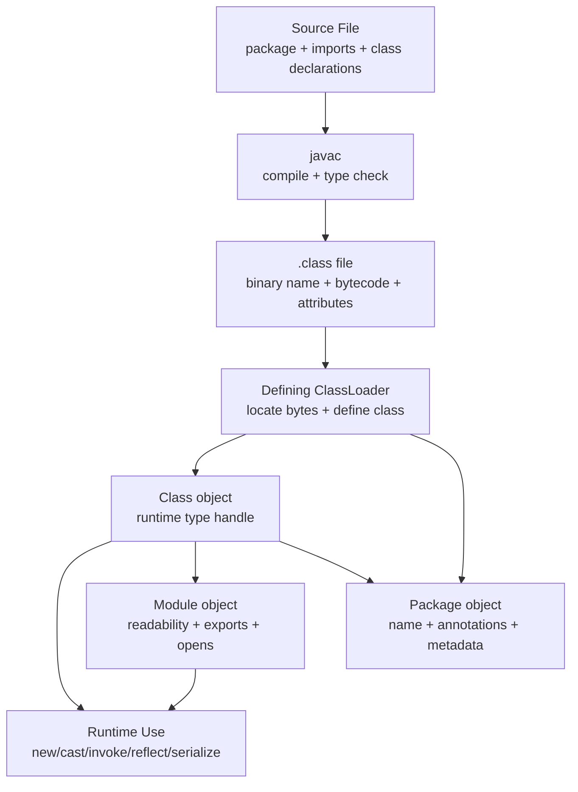
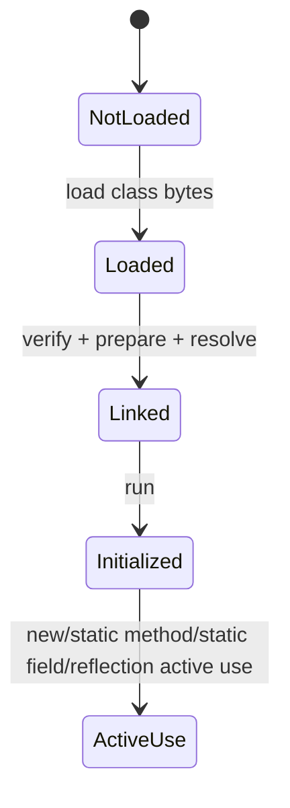
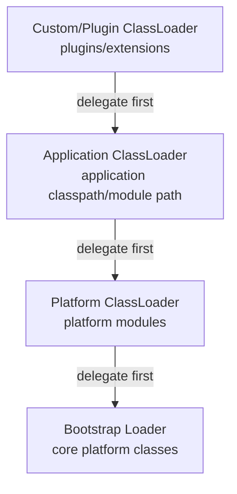
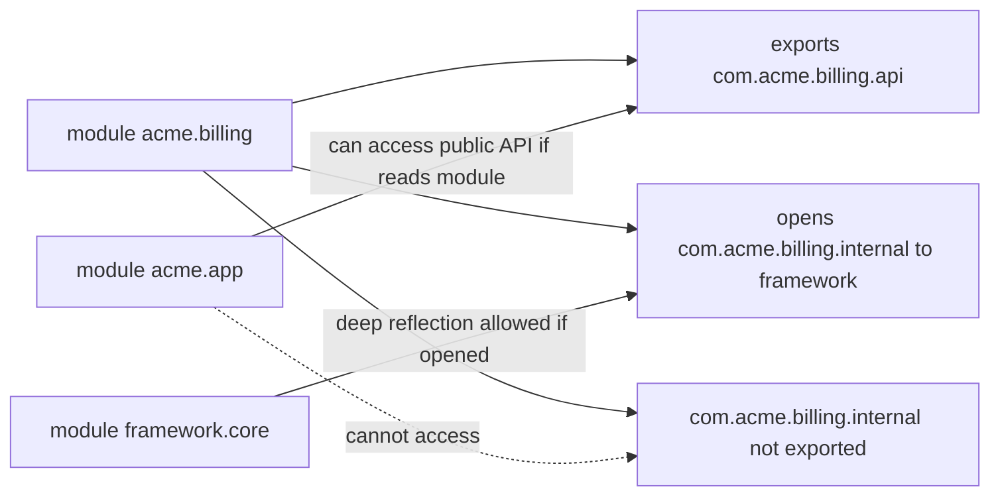
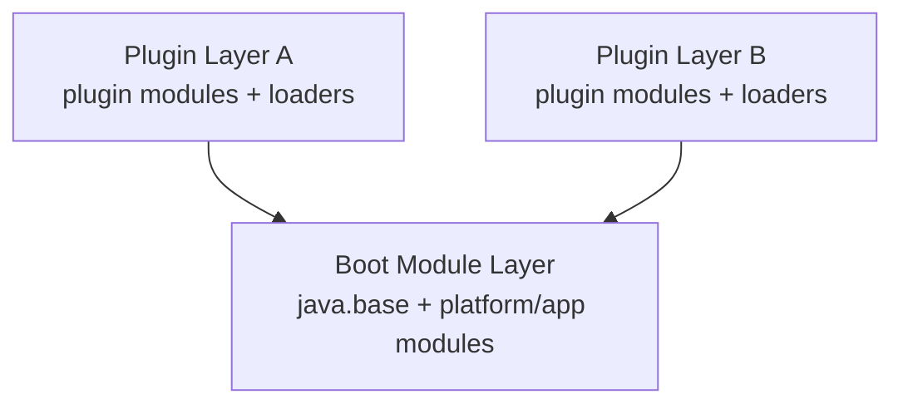
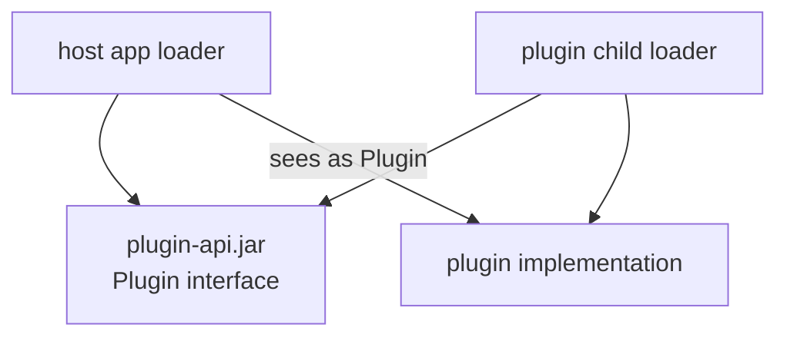

# Part 005 — `Class`, `ClassLoader`, `Module`, `Package` Runtime Model

## Tujuan Part Ini

Pada part sebelumnya kita sudah membedah `Object` sebagai root contract semua reference type. Sekarang kita naik satu tingkat: bagaimana Java runtime memahami **type**, **loading boundary**, **module boundary**, dan **package metadata**.

Target part ini adalah membuat Anda mampu menjawab pertanyaan berikut dengan presisi:

- Apa sebenarnya `Class<?>` di runtime?
- Kenapa dua class dengan nama sama bisa dianggap berbeda?
- Apa peran `ClassLoader` dalam type identity, resource lookup, plugin loading, dan framework scanning?
- Apa bedanya package sebagai deklarasi source code dan `Package` sebagai metadata runtime?
- Apa hubungan `Class`, `ClassLoader`, `Module`, `ModuleLayer`, dan `Package`?
- Kapan `Class.forName(...)` berbahaya?
- Kenapa framework modern sering bentrok dengan JPMS/module encapsulation?
- Bagaimana mendesain library agar tidak rapuh terhadap class loader, module, dan packaging environment?

Ini bukan materi “cara memakai class loader custom” secara mekanis. Ini adalah materi tentang **runtime boundary**. Banyak bug enterprise yang terlihat seperti bug dependency, bug framework, atau bug deployment sebenarnya adalah bug akibat salah memahami runtime type identity.

---

## Kaufman Skill Frame

Menurut pendekatan Kaufman, skill besar harus dipecah menjadi sub-skill kecil yang bisa dilatih dan dikoreksi cepat. Untuk topik ini, skill utamanya adalah:

> Mampu memprediksi bagaimana Java runtime menemukan, mendefinisikan, mengidentifikasi, menginisialisasi, dan membatasi akses terhadap type.

Sub-skill praktisnya:

| Sub-skill | Pertanyaan koreksi |
|---|---|
| Membaca runtime type | Apakah saya memakai `Class<?>` sebagai metadata, type token, atau factory key? |
| Membedakan load/link/init | Apakah operasi ini hanya memuat class, atau juga mengeksekusi static initializer? |
| Memahami loader identity | Apakah class ini didefinisikan oleh loader yang sama dengan consumer-nya? |
| Menilai module access | Apakah package ini `exports`, `opens`, keduanya, atau tidak keduanya? |
| Mendesain resource lookup | Apakah resource dicari dari class loader yang benar? |
| Menghindari boundary leak | Apakah public API saya mengekspos implementation class dari loader/module lain? |
| Debugging deployment issue | Apakah `ClassNotFoundException`, `NoClassDefFoundError`, dan `ClassCastException` berasal dari root cause yang berbeda? |

Latihan utamanya bukan membuat custom class loader besar. Latihan utamanya adalah membaca boundary dan memprediksi failure.

---

## Mental Model Besar

Di Java source code, kita sering berpikir type hanya sebagai nama:

```java
com.acme.billing.Invoice
```

Di runtime, type identity tidak sesederhana nama. Untuk class biasa, identity minimalnya lebih dekat ke:

```text
runtime type identity = binary name + defining ClassLoader
```

Setelah JPMS, module ikut membentuk access boundary dan observability, walaupun class identity tetap sangat terkait dengan defining loader.



A class is not “just there”. Runtime must answer:

1. Apa binary name class tersebut?
2. Loader mana yang bertanggung jawab mendefinisikannya?
3. Module mana yang menjadi boundary-nya?
4. Package apa yang ditempatinya?
5. Apakah package tersebut visible atau reflective-accessible dari caller?
6. Apakah class sudah diinisialisasi?
7. Apakah consumer melihat class yang sama dengan producer?

Top 1% engineer tidak berhenti di “import-nya sudah benar”. Mereka mengecek **runtime identity graph**.

---

## `Class<T>`: Runtime Handle, Bukan Source Type

`java.lang.Class<T>` adalah object runtime yang merepresentasikan class, interface, enum, record, annotation type, array class, primitive type, atau `void`.

Contoh:

```java
Class<String> stringType = String.class;
Class<int[]> intArrayType = int[].class;
Class<Void> voidType = void.class;
Class<Integer> primitiveIntType = int.class;
```

Hal penting:

- `String.class` bukan `String` object;
- `Class<String>` bukan generic reification penuh;
- `Class<?>` adalah runtime metadata handle;
- generic parameter `T` pada `Class<T>` membantu compile-time API, tetapi runtime metadata tetap terpengaruh erasure;
- `Class` object dibuat oleh JVM saat class didefinisikan;
- setiap loaded type punya `Class` object yang mewakilinya.

### `Class<?>` sebagai Runtime Capability

Ketika API menerima `Class<T>`, biasanya API tersebut meminta caller memberikan **runtime handle**.

Contoh:

```java
public interface CodecRegistry {
    <T> Codec<T> codecFor(Class<T> type);
}
```

Di sini `Class<T>` dipakai sebagai key untuk lookup. Itu berarti API hanya bisa membedakan type yang reifiable:

```java
codecFor(List.class);      // bisa
codecFor(List<String>);    // tidak ada Class<List<String>>
```

Ini akan menjadi penting pada part generics/type erasure. Untuk sekarang, cukup pahami:

> `Class<T>` adalah runtime token untuk raw/reifiable type, bukan full generic type expression.

### `getClass()` vs `.class` vs `Class.forName(...)`

Tiga cara umum mendapatkan `Class` object punya konsekuensi berbeda.

```java
Class<?> a = object.getClass();
Class<?> b = Customer.class;
Class<?> c = Class.forName("com.acme.Customer");
```

| Cara | Membutuhkan instance? | Compile-time checked? | Bisa memicu loading? | Bisa memicu initialization? | Catatan |
|---|---:|---:|---:|---:|---|
| `object.getClass()` | ya | sebagian | tidak untuk class object-nya | tidak | Mengembalikan runtime class actual object. |
| `Customer.class` | tidak | ya | class harus resolvable | tidak selalu sama dengan init aktif | Paling aman untuk known type. |
| `Class.forName(name)` | tidak | tidak | ya | overload default menginisialisasi class | Cocok untuk dynamic loading, tetapi harus hati-hati. |

`Class.forName(String)` secara historis sering dipakai oleh framework, plugin loader, JDBC driver loading lama, dan reflection-based factories. Masalahnya: ia mengikat desain ke string name dan class loader context tertentu.

Preferensi desain:

```java
// Lebih baik jika caller memang tahu type saat compile time
registry.register(Customer.class, customerCodec);

// Hanya gunakan string ketika konfigurasi eksternal memang membutuhkan dynamic lookup
registry.register("com.acme.Customer", "com.acme.CustomerCodec");
```

---

## Loading, Linking, Initialization

Satu jebakan besar: “class sudah ada” bisa berarti beberapa hal berbeda.

Secara konseptual, lifecycle class melibatkan:

1. **Loading** — menemukan bytecode dan membuat representasi class.
2. **Linking** — verification, preparation, dan resolution.
3. **Initialization** — menjalankan static initializer dan static field initialization.



Kenapa ini penting?

Karena `static` initializer bisa memiliki side effect:

```java
final class ExpensiveRegistry {
    static final Map<String, Object> GLOBAL = loadFromNetwork();

    static {
        System.out.println("Initialized");
    }
}
```

Jika Anda hanya ingin mengecek keberadaan class, jangan tanpa sadar memicu initialization.

Contoh lebih aman:

```java
ClassLoader loader = Thread.currentThread().getContextClassLoader();
Class<?> type = Class.forName("com.acme.Plugin", false, loader);
```

Parameter `false` berarti jangan initialize class saat lookup. Tetap saja, class dapat dimuat/link tergantung runtime behavior, tetapi static initialization tidak dipicu oleh overload tersebut.

### Design Rule

Gunakan initialization sebagai boundary eksplisit, bukan efek samping dari lookup.

Buruk:

```java
Class.forName(configuredClassName); // implicitly initializes
```

Lebih baik:

```java
Class<?> type = Class.forName(configuredClassName, false, pluginLoader);
Plugin plugin = instantiatePlugin(type);
plugin.start(); // explicit lifecycle boundary
```

---

## `ClassLoader`: Bukan Hanya “Cari Class”

`ClassLoader` adalah object yang bertanggung jawab memuat class. Dalam praktik, class loader adalah boundary besar untuk:

- type identity;
- resource lookup;
- plugin isolation;
- application server isolation;
- test isolation;
- hot reload/dev tools;
- agents/instrumentation;
- modular layer creation;
- framework scanning.

Oracle API mendefinisikan `ClassLoader` sebagai object yang bertanggung jawab loading classes berdasarkan binary name. Setiap `Class` object memiliki referensi ke `ClassLoader` yang mendefinisikannya.

### Parent Delegation Model

Class loader biasanya memakai model delegation:



Ketika custom loader diminta memuat `com.acme.Foo`, biasanya ia bertanya dulu ke parent. Jika parent tidak menemukan, baru loader tersebut mencoba mendefinisikan sendiri.

Konsekuensi:

- common API classes sebaiknya berada di parent/shared loader;
- plugin implementation classes boleh berada di child loader;
- jika interface yang sama didefinisikan di dua loader berbeda, cast bisa gagal meskipun binary name sama;
- classpath ordering bisa mengubah class yang ditemukan;
- shadowing dependency bisa menghasilkan runtime mismatch.

### Type Identity Failure

Bayangkan dua loader berbeda sama-sama mendefinisikan class dengan binary name sama:

```text
loaderA defines com.acme.Plugin
loaderB defines com.acme.Plugin
```

Dari sudut pandang Java runtime:

```text
com.acme.Plugin loaded by loaderA != com.acme.Plugin loaded by loaderB
```

Maka ini bisa terjadi:

```java
Object pluginFromA = loadFrom(loaderA);
Class<?> pluginTypeFromB = loaderB.loadClass("com.acme.Plugin");

boolean sameName = pluginFromA.getClass().getName().equals(pluginTypeFromB.getName()); // true
boolean sameType = pluginTypeFromB.isInstance(pluginFromA); // false
```

Pesan error-nya sering membingungkan:

```text
ClassCastException: class com.acme.Plugin cannot be cast to class com.acme.Plugin
```

Bagi engineer biasa, ini terlihat absurd. Bagi engineer yang memahami class loader, ini masuk akal: nama sama, defining loader berbeda.

---

## Formula Praktis Type Identity

Gunakan formula ini saat debugging:

```text
RuntimeType = (binaryName, definingClassLoader)
AccessBoundary = Module + package exports/opens + caller module
```

Untuk debugging, jangan hanya log nama class:

```java
log.info("type={}", value.getClass().getName());
```

Log juga loader dan module:

```java
Class<?> type = value.getClass();

log.info(
    "type={}, loader={}, module={}",
    type.getName(),
    type.getClassLoader(),
    type.getModule().getName()
);
```

Untuk bootstrap-loaded classes, `getClassLoader()` bisa `null`. Jangan perlakukan `null` sebagai bug; itu signal bahwa class dimuat oleh bootstrap loader.

---

## Binary Name, Canonical Name, Simple Name

`Class` expose beberapa bentuk nama:

```java
Class<?> type = java.util.Map.Entry.class;

System.out.println(type.getName());          // java.util.Map$Entry
System.out.println(type.getCanonicalName()); // java.util.Map.Entry
System.out.println(type.getSimpleName());    // Entry
```

| Method | Cocok untuk | Risiko |
|---|---|---|
| `getName()` | reflection lookup, binary-ish name, arrays punya format khusus | Tidak selalu human-friendly. |
| `getCanonicalName()` | documentation, source-like display | Bisa `null` untuk anonymous/local classes. |
| `getSimpleName()` | UI/debug compact | Collision tinggi. Jangan dipakai sebagai key unik. |
| `getTypeName()` | readable type display | Tetap bukan stable serialization contract. |

Design rule:

> Jangan memakai simple name sebagai identifier sistem. Gunakan explicit stable identifier atau fully qualified/binary name dengan versi dan boundary yang jelas.

Buruk:

```java
String eventType = event.getClass().getSimpleName();
```

Lebih baik:

```java
@Retention(RetentionPolicy.RUNTIME)
@interface EventName {
    String value();
}

@EventName("billing.invoice-issued.v1")
record InvoiceIssued(String invoiceId) {}
```

Nama class adalah implementation detail; nama event/API adalah contract.

---

## `ClassLoader` dan Resource Lookup

Class loader juga mencari resource:

```java
URL resource = loader.getResource("META-INF/services/com.acme.Plugin");
```

Resource lookup sering menjadi sumber bug di:

- `ServiceLoader`;
- plugin systems;
- test fixtures;
- shading/relocation;
- native image/resource config;
- fat jar packaging;
- application server deployments;
- framework auto-discovery.

Ada beberapa cara umum:

```java
// Relative to package of SomeClass if no leading slash for Class#getResource
URL a = SomeClass.class.getResource("schema.json");

// Absolute from classpath/module resource root
URL b = SomeClass.class.getResource("/com/acme/schema.json");

// Direct class loader lookup: no leading slash convention
URL c = SomeClass.class.getClassLoader().getResource("com/acme/schema.json");
```

Kesalahan umum:

```java
SomeClass.class.getClassLoader().getResource("/com/acme/schema.json"); // often wrong
```

`ClassLoader#getResource` memakai nama resource tanpa leading slash. `Class#getResource` punya aturan relatif/absolut yang berbeda.

### Context Class Loader

Thread context class loader sering dipakai framework untuk menemukan resource atau provider dari perspektif application, bukan framework library itu sendiri.

```java
ClassLoader contextLoader = Thread.currentThread().getContextClassLoader();
```

Mengapa perlu?

Bayangkan library framework dimuat oleh parent loader, sementara application/plugin class berada di child loader. Jika framework memakai `Framework.class.getClassLoader()`, ia mungkin tidak melihat class/resource application. Karena itu banyak SPI memakai context class loader.

Namun context class loader juga riskan:

- bisa `null`;
- bisa tidak diset dengan benar;
- bisa bocor antar thread pool task;
- bisa menyebabkan memory leak jika thread hidup lebih lama dari deployment/plugin;
- bisa membuat behavior tergantung execution environment.

Design rule:

> Untuk library, terima `ClassLoader` eksplisit jika boundary penting. Gunakan context loader sebagai default yang documented, bukan magic tanpa escape hatch.

Contoh API lebih baik:

```java
public final class PluginDiscovery {
    private final ClassLoader loader;

    public PluginDiscovery(ClassLoader loader) {
        this.loader = Objects.requireNonNull(loader);
    }

    public static PluginDiscovery usingContextClassLoader() {
        ClassLoader loader = Thread.currentThread().getContextClassLoader();
        if (loader == null) {
            loader = PluginDiscovery.class.getClassLoader();
        }
        return new PluginDiscovery(loader);
    }
}
```

---

## `Module`: Runtime Encapsulation Boundary

Setiap `Class<?>` dapat memberi tahu module-nya:

```java
Module module = Customer.class.getModule();
System.out.println(module.getName());
System.out.println(module.isNamed());
```

Module adalah boundary yang lebih kaya daripada package. Module dapat:

- membaca module lain;
- export package untuk compile/runtime access biasa;
- open package untuk deep reflection;
- membatasi export/open ke module tertentu;
- memiliki descriptor `module-info.class`;
- berada dalam module layer.



### `exports` vs `opens`

| Directive | Untuk apa | Mengizinkan compile-time access? | Mengizinkan deep reflection? |
|---|---|---:|---:|
| `exports p;` | Public API package | ya | tidak otomatis untuk private members |
| `exports p to m;` | Qualified public API | hanya module tertentu | tidak otomatis |
| `opens p;` | Runtime reflective access | tidak untuk compile-time API | ya |
| `opens p to m;` | Qualified reflection | tidak untuk compile-time API | hanya module tertentu |

Ini krusial untuk framework design.

Pre-Java 9, banyak framework terbiasa melakukan deep reflection ke private fields/constructors. Dengan JPMS, strong encapsulation membuat reflective access harus bernegosiasi dengan module boundary.

### Library Design Rule

Jika package adalah public API, export dengan sadar.

Jika package hanya untuk reflection framework tertentu, open secara terbatas.

Buruk:

```java
open module acme.billing {
    requires framework.core;
    exports com.acme.billing.api;
}
```

`open module` membuka semua package untuk deep reflection. Ini mudah tetapi terlalu besar sebagai boundary.

Lebih baik:

```java
module acme.billing {
    requires framework.core;

    exports com.acme.billing.api;
    opens com.acme.billing.config to framework.core;
}
```

---

## `ModuleLayer`: Runtime Graph of Modules

`ModuleLayer` adalah kumpulan module yang didefinisikan bersama di runtime berdasarkan configuration dan mapping module ke class loader.

Dalam kebanyakan aplikasi biasa, Anda jarang membuat module layer sendiri. Namun mental model-nya penting untuk:

- plugin systems;
- runtime extension;
- application containers;
- testing isolation;
- tool runtimes;
- custom launchers.



Module layer memungkinkan satu runtime memiliki beberapa graph module yang berbeda. Ini bukan sekadar classpath flat.

Failure mode-nya mirip class loader:

- module tidak terbaca dari layer tertentu;
- package tidak exported ke module caller;
- service provider tidak ditemukan karena layer salah;
- class yang secara nama sama berada dalam loader/layer berbeda;
- resource scanning yang diasumsikan flat classpath gagal.

---

## `Package`: Runtime Metadata, Bukan Sekadar Source Namespace

Di source code, package terlihat seperti ini:

```java
package com.acme.billing;
```

Di runtime, `java.lang.Package` merepresentasikan package metadata yang terkait dengan loader/module tertentu.

```java
Package p = Customer.class.getPackage();
System.out.println(p.getName());
System.out.println(p.getImplementationVersion());
System.out.println(p.getSpecificationVersion());
```

`Package` bisa membawa:

- package name;
- package annotations;
- specification title/version/vendor;
- implementation title/version/vendor;
- sealing metadata untuk JAR tertentu;
- relationship dengan module/class loader environment.

Namun jangan salah:

> Package runtime bukan namespace registry global.

Package dengan nama sama di loader berbeda bisa memiliki `Package` object berbeda. Selain itu, subpackage bukan child access boundary.

```java
package com.acme;

class RootPackageType {}
```

```java
package com.acme.internal;

class InternalType {}
```

`com.acme.internal` bukan “anak” yang otomatis punya access ke package-private member `com.acme`. Package-private hanya berlaku untuk **package yang sama persis**.

---

## Class Loader, Module, Package: Boundary Matrix

Gunakan matrix ini untuk membaca environment.

| Boundary | Dibentuk oleh | Mengontrol | Bukan untuk |
|---|---|---|---|
| Package source | `package` declaration | naming, package-private access | runtime isolation penuh |
| Class loader | defining loader | type identity, class/resource visibility | semantic API versioning |
| Module | module descriptor/runtime module | readability, exports, opens | mengganti package design |
| Module layer | graph module + loader mapping | runtime module topology | simplifikasi classpath lama |
| `Package` object | loader/module-defined metadata | annotations/version/sealing metadata | global namespace lookup |

Jika ada bug runtime, tanya berurutan:

1. Class-nya benar-benar ada di artifact?
2. Artifact ada di classpath/module path runtime?
3. Loader yang mencari class bisa melihat artifact?
4. Class didefinisikan oleh loader mana?
5. Consumer memakai class/interface dari loader yang sama?
6. Module caller membaca module target?
7. Package target exported/opened sesuai jenis access?
8. Resource ada di lokasi yang diharapkan dan tidak hilang saat packaging?

---

## Error Taxonomy: Jangan Campur Semua Jadi “Class Loading Error”

### `ClassNotFoundException`

Checked exception. Biasanya muncul saat dynamic loading:

```java
Class.forName("com.acme.Missing");
loader.loadClass("com.acme.Missing");
```

Artinya lookup eksplisit gagal menemukan class dengan nama tersebut dari loader yang dipakai.

Root cause umum:

- dependency tidak ada;
- classpath/module path salah;
- nama class salah;
- shading/relocation mengubah nama;
- loader yang dipakai salah;
- module layer tidak mencakup module target.

### `NoClassDefFoundError`

Error. Sering berarti class pernah diketahui saat compile/link, tetapi runtime gagal mendefinisikan atau menemukan dependency-nya saat digunakan.

Contoh:

```text
NoClassDefFoundError: com/acme/Dependency
```

Root cause umum:

- transitive dependency hilang runtime;
- static initializer gagal sebelumnya;
- artifact version mismatch;
- optional dependency ternyata dipakai di path aktif.

### `ClassCastException`

Tidak selalu berarti objek salah tipe secara source-level. Bisa berarti loader identity berbeda.

Debug:

```java
static void debugType(Object value) {
    Class<?> type = value.getClass();
    System.out.printf(
        "class=%s loader=%s module=%s%n",
        type.getName(),
        type.getClassLoader(),
        type.getModule()
    );
}
```

### `IllegalAccessError`

Biasanya binary-level access mismatch. Contoh: code dikompilasi terhadap versi API yang membuat member visible, tetapi runtime memakai versi yang berbeda.

### `InaccessibleObjectException`

Sering terkait reflection + module encapsulation. Berbeda dari `IllegalAccessException` biasa karena JPMS strong encapsulation menolak deep reflective access.

---

## API Design: Jangan Mengekspos Implementation Type dari Loader Internal

Misalnya Anda membuat plugin system.

Buruk:

```java
public final class PluginManager {
    public List<Object> loadPlugins() { ... }
}
```

Atau:

```java
public final class PluginManager {
    public List<com.acme.plugin.impl.DefaultPlugin> loadPlugins() { ... }
}
```

Masalah:

- consumer tidak punya contract stabil;
- implementation class mungkin berada di child loader;
- type identity bisa bentrok;
- lifecycle unload sulit;
- API leak membuat class loader tidak bisa di-GC.

Lebih baik:

```java
public interface Plugin {
    String id();
    void start(PluginContext context);
    void stop();
}

public final class PluginManager {
    public List<Plugin> loadPlugins() { ... }
}
```

Syaratnya: `Plugin` interface harus didefinisikan di loader/module yang bisa dibaca bersama oleh host dan plugin.



Jika plugin membawa copy sendiri dari `plugin-api.jar`, Anda bisa mendapat dua `Plugin` interface berbeda secara runtime.

---

## API Design: Terima `ClassLoader` Jika Environment Tidak Flat

Library kecil sering cukup memakai:

```java
MyType.class.getClassLoader()
```

Namun library yang akan hidup di container/plugin/test/runtime complex sebaiknya memberi pilihan eksplisit.

```java
public final class ScannerOptions {
    private final ClassLoader classLoader;
    private final ModuleLayer moduleLayer;

    private ScannerOptions(Builder builder) {
        this.classLoader = Objects.requireNonNull(builder.classLoader);
        this.moduleLayer = builder.moduleLayer;
    }

    public static Builder builder() {
        return new Builder();
    }

    public static final class Builder {
        private ClassLoader classLoader = Thread.currentThread().getContextClassLoader();
        private ModuleLayer moduleLayer;

        public Builder classLoader(ClassLoader classLoader) {
            this.classLoader = Objects.requireNonNull(classLoader);
            return this;
        }

        public Builder moduleLayer(ModuleLayer moduleLayer) {
            this.moduleLayer = Objects.requireNonNull(moduleLayer);
            return this;
        }

        public ScannerOptions build() {
            if (classLoader == null) {
                classLoader = ScannerOptions.class.getClassLoader();
            }
            return new ScannerOptions(this);
        }
    }
}
```

Pesan desainnya:

- default boleh convenience;
- boundary harus bisa dikontrol;
- jangan sembunyikan class loader/module assumption;
- dokumentasikan lookup order.

---

## Framework Scanning: Classpath Tidak Lagi Selalu Flat

Framework lama sering mengasumsikan:

```text
Semua class ada di satu classpath besar.
Scan semua JAR.
Temukan semua annotation.
Reflect semua constructor/field.
Instantiate.
```

Runtime modern membuat asumsi ini lemah:

- JPMS membatasi exported/opened package;
- module path tidak identik dengan classpath;
- application server punya loader hierarchy;
- tests/devtools bisa memakai throwaway loader;
- native image perlu closed-world metadata;
- shaded JAR bisa mengubah resource layout;
- multi-release JAR bisa memberi class berbeda per runtime version.

Design rule untuk framework:

> Scanning harus memiliki explicit scope, explicit access policy, deterministic error, dan escape hatch.

Buruk:

```java
Framework.start(); // scans everything magically
```

Lebih baik:

```java
Framework.start(FrameworkOptions.builder()
    .basePackages(List.of("com.acme.billing"))
    .classLoader(Thread.currentThread().getContextClassLoader())
    .allowDeepReflection(false)
    .failOnInaccessibleType(true)
    .build());
```

---

## `ClassValue<T>`: Runtime Metadata Cache yang Sering Dilupakan

Jika Anda membuat framework yang menghitung metadata per class, jangan selalu pakai `ConcurrentHashMap<Class<?>, Metadata>` tanpa berpikir.

Java menyediakan `ClassValue<T>` untuk menyimpan value yang diasosiasikan dengan `Class`.

```java
final class BeanMetadataCache {
    private static final ClassValue<BeanMetadata> CACHE = new ClassValue<>() {
        @Override
        protected BeanMetadata computeValue(Class<?> type) {
            return BeanMetadata.inspect(type);
        }
    };

    static BeanMetadata metadataFor(Class<?> type) {
        return CACHE.get(type);
    }
}
```

Mengapa ini menarik?

- key-nya memang `Class<?>`;
- lifecycle-nya lebih cocok dengan class unloading;
- mengurangi risiko memory leak dibanding static map naif;
- berguna untuk reflection metadata, serializer metadata, validator metadata, mapper metadata.

Tetap ada trade-off: `ClassValue` cocok untuk metadata yang secara natural melekat ke class. Jangan pakai untuk context-specific data yang tergantung tenant/request/environment.

---

## Memory Leak: ClassLoader Retention

Class loader bisa menjadi GC root secara tidak langsung jika ada static reference dari parent/global structure ke class/object dari child loader.

Contoh leak:

```java
public final class GlobalRegistry {
    private static final Map<String, Object> PLUGINS = new ConcurrentHashMap<>();

    public static void register(String id, Object plugin) {
        PLUGINS.put(id, plugin);
    }
}
```

Jika `plugin` berasal dari child class loader, registry di parent loader menahan object plugin, object menahan class, class menahan class loader, dan seluruh plugin loader tidak bisa di-unload.


Design rule:

- unregister eksplisit saat unload;
- jangan simpan implementation object di global static registry;
- simpan weak reference hanya jika semantic cocok;
- gunakan lifecycle boundary;
- pastikan thread, executor, timer, JDBC driver, logging appender, dan context class loader dibersihkan;
- jangan biarkan child object masuk cache parent tanpa eviction.

---

## Case Study: Plugin Host yang Salah dan yang Benar

### Versi Salah

```java
public final class BadPluginHost {
    public Object load(Path jar, String className) throws Exception {
        URLClassLoader loader = new URLClassLoader(new URL[] { jar.toUri().toURL() });
        Class<?> type = Class.forName(className);
        return type.getDeclaredConstructor().newInstance();
    }
}
```

Masalah:

- `URLClassLoader` tidak diberi parent yang jelas;
- `Class.forName(className)` memakai loader caller/default, bukan plugin loader;
- return type `Object` membuat contract lemah;
- loader tidak ditutup;
- lifecycle tidak jelas;
- no API boundary;
- no module/access policy;
- no error taxonomy.

### Versi Lebih Baik

```java
public interface Plugin extends AutoCloseable {
    String id();
    void start(PluginContext context);

    @Override
    void close();
}
```

```java
public final class PluginHost implements AutoCloseable {
    private final URLClassLoader loader;
    private final List<Plugin> plugins = new ArrayList<>();

    public PluginHost(Path jar, ClassLoader parent) throws MalformedURLException {
        this.loader = new URLClassLoader(
            new URL[] { jar.toUri().toURL() },
            Objects.requireNonNull(parent)
        );
    }

    public Plugin load(String className) throws ReflectiveOperationException {
        Class<?> raw = Class.forName(className, false, loader);

        if (!Plugin.class.isAssignableFrom(raw)) {
            throw new IllegalArgumentException(className + " does not implement " + Plugin.class.getName());
        }

        Class<? extends Plugin> type = raw.asSubclass(Plugin.class);
        Plugin plugin = type.getDeclaredConstructor().newInstance();
        plugins.add(plugin);
        return plugin;
    }

    @Override
    public void close() throws Exception {
        Exception failure = null;
        for (Plugin plugin : plugins) {
            try {
                plugin.close();
            } catch (Exception e) {
                if (failure == null) {
                    failure = e;
                } else {
                    failure.addSuppressed(e);
                }
            }
        }
        loader.close();
        if (failure != null) {
            throw failure;
        }
    }
}
```

Ini belum production-grade, tetapi mental model-nya lebih benar:

- ada shared `Plugin` contract;
- loader eksplisit;
- initialization tidak dipicu saat lookup;
- type checked dengan `isAssignableFrom`/`asSubclass`;
- lifecycle eksplisit;
- loader ditutup;
- failure lebih deterministik.

---

## `ServiceLoader`: Standard SPI Boundary

Sebelum membuat discovery mechanism sendiri, pahami `ServiceLoader`.

Provider dideklarasikan di:

```text
META-INF/services/com.acme.Plugin
```

Isi file:

```text
com.acme.plugins.FraudPlugin
com.acme.plugins.AuditPlugin
```

Loading:

```java
ServiceLoader<Plugin> loader = ServiceLoader.load(Plugin.class);
for (Plugin plugin : loader) {
    plugin.start(context);
}
```

Dalam JPMS, provider bisa dideklarasikan di module descriptor:

```java
module acme.plugin.fraud {
    requires acme.plugin.api;
    provides com.acme.Plugin with com.acme.plugins.FraudPlugin;
}
```

Consumer:

```java
module acme.host {
    requires acme.plugin.api;
    uses com.acme.Plugin;
}
```

`ServiceLoader` bukan selalu jawaban terbaik, tetapi ia mengajarkan boundary yang baik:

- service type sebagai contract;
- provider sebagai implementation;
- discovery metadata eksplisit;
- class loader/module layer terlibat secara sadar;
- consumer tidak hardcode implementation class.

---

## Reflection Access: `setAccessible(true)` Bukan Kartu Bebas

Sebelum JPMS, banyak code menganggap:

```java
field.setAccessible(true);
```

selalu bisa menembus `private`. Di runtime modular, ini tidak selalu benar. Package target mungkin tidak opened ke module caller.

Contoh failure:

```text
java.lang.reflect.InaccessibleObjectException:
Unable to make field private ... accessible:
module acme.billing does not "opens com.acme.billing.internal" to module framework.core
```

Ini bukan sekadar “Java makin cerewet”. Ini boundary yang sengaja dibuat agar private/internal package tidak otomatis menjadi public runtime API.

Framework modern harus bisa:

- memakai public accessor jika tersedia;
- memberi pesan error module directive yang dibutuhkan;
- mendukung generated code/annotation processing untuk mengurangi reflection;
- membatasi deep reflection ke package eksplisit;
- tidak diam-diam membuka seluruh module.

---

## Diagnostic Playbook

Saat menghadapi issue class/module/package runtime, gunakan playbook berikut.

### 1. Log Type Identity

```java
static String describe(Class<?> type) {
    return "Class{" +
        "name=" + type.getName() +
        ", loader=" + type.getClassLoader() +
        ", module=" + type.getModule().getName() +
        ", package=" + type.getPackageName() +
        '}';
}
```

### 2. Bandingkan Class Object, Bukan Nama Saja

```java
if (left.getClass() != right.getClass()) {
    System.out.println(describe(left.getClass()));
    System.out.println(describe(right.getClass()));
}
```

### 3. Cek Assignability dari Arah yang Benar

```java
if (!Plugin.class.isAssignableFrom(candidate)) {
    throw new IllegalArgumentException(candidate + " is not a Plugin");
}
```

Ingat:

```java
A.class.isAssignableFrom(B.class)
```

berarti instance `B` bisa dipakai sebagai `A`.

### 4. Cek Module Relationship

```java
Module caller = MyFramework.class.getModule();
Module target = candidate.getModule();

System.out.println("caller reads target: " + caller.canRead(target));
System.out.println("target package: " + candidate.getPackageName());
```

### 5. Cek Resource dari Loader yang Sama

```java
ClassLoader loader = candidate.getClassLoader();
URL resource = loader.getResource("META-INF/services/" + Plugin.class.getName());
```

### 6. Pisahkan Error Type

- `ClassNotFoundException` → lookup gagal;
- `NoClassDefFoundError` → dependency/link/init problem runtime;
- `ClassCastException` → type mismatch, sering loader identity;
- `InaccessibleObjectException` → reflective/module access;
- `IllegalAccessError` → binary/runtime access mismatch;
- `LinkageError` → class definition/linking conflict.

---

## Latihan 1 — Same Name, Different Loader

Buat dua JAR berisi class dengan binary name sama:

```java
package com.acme;

public class Marker {
    public String source() {
        return "jar-a";
    }
}
```

dan versi lain:

```java
package com.acme;

public class Marker {
    public String source() {
        return "jar-b";
    }
}
```

Load dengan dua `URLClassLoader` berbeda.

Ekspektasi:

```java
Class<?> a = loaderA.loadClass("com.acme.Marker");
Class<?> b = loaderB.loadClass("com.acme.Marker");

System.out.println(a == b);                    // false
System.out.println(a.getName().equals(b.getName())); // true
```

Tujuan latihan:

- internalisasi bahwa name bukan identity penuh;
- melihat `ClassCastException` yang tampak absurd;
- memahami kenapa shared API harus berada di loader bersama.

---

## Latihan 2 — `Class.forName` Initialization Trap

Buat class:

```java
package com.acme;

public final class Explosive {
    static {
        System.out.println("Explosive initialized");
        if (true) {
            throw new RuntimeException("boom");
        }
    }
}
```

Bandingkan:

```java
Class.forName("com.acme.Explosive", false, loader);
Class.forName("com.acme.Explosive", true, loader);
```

Tujuan latihan:

- membedakan lookup dan initialization;
- memahami mengapa scanning framework sebaiknya tidak mengeksekusi static init sembarangan;
- melihat bagaimana initialization failure bisa berubah menjadi subsequent `NoClassDefFoundError`.

---

## Latihan 3 — Module `exports` vs `opens`

Buat module:

```java
module acme.domain {
    exports com.acme.domain.api;
}
```

Class internal:

```java
package com.acme.domain.internal;

public final class InternalConfig {
    private String secret = "x";
}
```

Coba akses via reflection dari module lain.

Kemudian ubah descriptor:

```java
module acme.domain {
    exports com.acme.domain.api;
    opens com.acme.domain.internal to acme.framework;
}
```

Tujuan latihan:

- memahami bahwa public class di package non-exported tidak otomatis accessible;
- memahami bahwa private member reflection butuh opened package;
- membedakan API surface dan reflection surface.

---

## Latihan 4 — Resource Lookup Semantics

Letakkan file:

```text
src/main/resources/com/acme/schema.json
```

Coba variasi:

```java
SomeClass.class.getResource("schema.json");
SomeClass.class.getResource("/com/acme/schema.json");
SomeClass.class.getClassLoader().getResource("com/acme/schema.json");
SomeClass.class.getClassLoader().getResource("/com/acme/schema.json");
```

Tujuan latihan:

- memahami perbedaan `Class#getResource` dan `ClassLoader#getResource`;
- menghindari bug resource lookup saat packaging;
- melatih debugging resource missing.

---

## Checklist Desain Library Runtime-Safe

Sebelum publish library/framework yang memakai runtime metadata, cek:

- Apakah public API menerima `Class<T>` hanya untuk reifiable type?
- Apakah API butuh `Type` jika generic metadata penting?
- Apakah dynamic class loading memakai loader eksplisit?
- Apakah `Class.forName` tidak memicu initialization tanpa alasan?
- Apakah scanning scope eksplisit?
- Apakah resource lookup memakai loader yang benar?
- Apakah context class loader hanya default, bukan satu-satunya cara?
- Apakah module access error memberi pesan actionable?
- Apakah package yang perlu reflection di-open secara spesifik?
- Apakah shared contract tidak ikut tercopy ke plugin child loader?
- Apakah cache metadata tidak menahan class loader selamanya?
- Apakah lifecycle unload membersihkan thread, registry, executor, dan static hooks?
- Apakah log diagnostic mencantumkan class name, loader, module, dan package?

---

## Anti-Patterns

### 1. Stringly Typed Class Lookup Everywhere

```java
Object create(String className) { ... }
```

Gunakan hanya di boundary konfigurasi. Di core API, prefer `Class<T>`, factory, service interface, atau registry typed.

### 2. `Class.forName` Tanpa Loader

```java
Class.forName(name);
```

Di environment kompleks, ini terlalu ambigu. Pakai overload dengan loader dan initialization flag.

### 3. Global Static Registry untuk Plugin Objects

Mudah membuat class loader leak. Registry harus punya lifecycle dan unregister.

### 4. Scanning Semua Classpath

Tidak deterministic, mahal, dan sering gagal di module/native/container environment.

### 5. Simple Name sebagai Stable Contract

```java
event.getClass().getSimpleName()
```

Nama simple collision-prone dan refactor-sensitive. Gunakan explicit contract name.

### 6. `open module` Tanpa Alasan

Membuka semua package untuk reflection membuat internal implementation menjadi runtime-accessible surface.

### 7. Menganggap Subpackage Punya Hubungan Access

`com.acme.internal` tidak punya package-private access ke `com.acme`.

---

## Ringkasan

`Class`, `ClassLoader`, `Module`, dan `Package` membentuk fondasi runtime Java yang sering tidak terlihat saat menulis source code biasa.

Mental model utamanya:

```text
Class<?> = runtime type handle
ClassLoader = defining/lookup boundary
Module = readability + exports + opens boundary
Package = exact package metadata/access grouping, bukan hierarchy global
ModuleLayer = runtime module graph
```

Prinsip yang harus dibawa:

- type identity bukan hanya nama class;
- loader yang berbeda bisa membuat class bernama sama menjadi type berbeda;
- module membatasi access dan reflection;
- package-private berlaku untuk package yang sama persis;
- resource lookup mengikuti class/classloader semantics;
- framework scanning harus eksplisit, deterministic, dan module-aware;
- public API tidak boleh membocorkan implementation class dari boundary loader/module internal;
- cache runtime metadata harus mempertimbangkan class unloading dan lifecycle.

Jika Anda memahami part ini, Anda akan lebih tajam saat menghadapi error seperti:

- `ClassNotFoundException`;
- `NoClassDefFoundError`;
- `ClassCastException: X cannot be cast to X`;
- `InaccessibleObjectException`;
- `IllegalAccessError`;
- `LinkageError`.

Dan yang lebih penting: Anda akan mendesain API dan framework yang tidak rapuh ketika berpindah dari local development ke test runtime, app server, plugin architecture, JPMS, atau production deployment yang kompleks.

---

## Referensi

- Oracle Java SE 25 API — `Class`: `https://docs.oracle.com/en/java/javase/25/docs/api/java.base/java/lang/Class.html`
- Oracle Java SE 25 API — `ClassLoader`: `https://docs.oracle.com/en/java/javase/25/docs/api/java.base/java/lang/ClassLoader.html`
- Oracle Java SE 25 API — `Module`: `https://docs.oracle.com/en/java/javase/25/docs/api/java.base/java/lang/Module.html`
- Oracle Java SE 25 API — `ModuleLayer`: `https://docs.oracle.com/en/java/javase/25/docs/api/java.base/java/lang/ModuleLayer.html`
- Oracle Java SE 25 API — `Package`: `https://docs.oracle.com/en/java/javase/25/docs/api/java.base/java/lang/Package.html`
- Oracle Java SE 25 API — `ServiceLoader`: `https://docs.oracle.com/en/java/javase/25/docs/api/java.base/java/util/ServiceLoader.html`
- Oracle Java Language Specification SE 25: `https://docs.oracle.com/javase/specs/jls/se25/html/index.html`
- The Java Virtual Machine Specification SE 25: `https://docs.oracle.com/javase/specs/jvms/se25/html/index.html`
