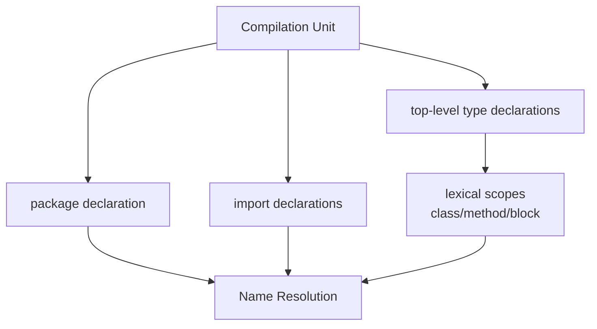
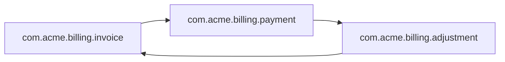

# Part 006 — Package System and Name Resolution

## Tujuan Part Ini

Part ini membahas package system Java sebagai **source-level naming boundary** dan **access boundary**, bukan sekadar folder convention.

Pertanyaan yang akan kita jawab:

- Apakah Java punya “global package”?
- Apa itu unnamed package dan kenapa tidak boleh dipakai untuk production code?
- Kenapa `java.lang.*` terasa otomatis tersedia?
- Bagaimana import bekerja: single-type, on-demand, static, dan module import Java 25?
- Apa bedanya package name, canonical name, binary name, internal name, dan fully qualified name?
- Kenapa subpackage tidak otomatis menjadi child access scope?
- Bagaimana compiler menyelesaikan nama ketika ada konflik?
- Bagaimana package design mempengaruhi API surface, encapsulation, module boundary, dan maintainability?

Kita akan memakai pendekatan yang praktis: bukan hanya “syntax import”, tetapi **bagaimana nama berubah menjadi kontrak arsitektur**.

---

## Kaufman Skill Frame

Skill utama:

> Mampu merancang dan membaca package/name structure sebagai boundary yang menjaga compile-time clarity, runtime compatibility, dan evolusi API.

Sub-skill:

| Sub-skill | Pertanyaan koreksi |
|---|---|
| Membaca compilation unit | Package apa yang menjadi konteks source file ini? |
| Membaca implicit imports | Type apa yang tersedia tanpa import eksplisit? |
| Membedakan import dan dependency | Apakah import hanya nama source, atau benar-benar membawa dependency runtime? |
| Menyelesaikan name conflict | Jika ada dua `List`, compiler memilih yang mana? |
| Memahami unnamed package | Apakah file ini cocok untuk script/prototype saja? |
| Mendesain package architecture | Apakah package ini public API, internal implementation, atau adapter boundary? |
| Menghindari package leak | Apakah class public di package internal tetap bocor ke consumer? |

Latihan mentalnya:

> Setiap kali melihat `import`, jangan tanya “class ini dari mana?” saja. Tanya “dependency semantic apa yang sedang diperkenalkan ke compilation unit ini?”

---

## Java Tidak Punya “Global Package” Seperti Namespace Bebas

Di Java, setiap ordinary compilation unit berada di salah satu dari dua kondisi:

1. punya deklarasi package;
2. tidak punya deklarasi package, sehingga masuk **unnamed package**.

Contoh named package:

```java
package com.acme.billing.invoice;

public final class InvoiceService {}
```

Contoh unnamed package:

```java
public final class Main {
    public static void main(String[] args) {}
}
```

Unnamed package sering dianggap “global package”, tetapi istilah itu menyesatkan. Ia bukan global namespace enterprise yang pantas dipakai. Ia lebih tepat dilihat sebagai convenience untuk program kecil, eksperimen, atau tahap awal belajar.

Design rule:

> Production Java code harus berada di named package.

Kenapa?

- class di unnamed package sulit diakses dari named package;
- tidak cocok untuk library/API;
- berisiko collision;
- buruk untuk tooling, testing, modularization, dan packaging;
- tidak punya package architecture yang jelas;
- tidak scalable untuk codebase multi-module.

---

## Compilation Unit: Unit Resolusi Nama

Source file Java adalah compilation unit. Secara kasar:

```text
[package declaration]
[import declarations]
[top-level type declarations]
```

Contoh:

```java
package com.acme.billing;

import java.math.BigDecimal;
import java.time.Instant;
import java.util.List;

public final class Invoice {}
```

Compiler membaca file dengan konteks:

- package saat ini: `com.acme.billing`;
- implicit `java.lang` types;
- imports eksplisit;
- top-level types dalam file/package;
- member names dalam scope lokal;
- static imports jika ada;
- module imports jika digunakan di Java 25;
- module readability jika source berada dalam module.



Name resolution bukan runtime lookup. Ini terjadi di compiler.

---

## Implicit Import: Kenapa `String` Tidak Perlu Diimpor?

Setiap ordinary compilation unit secara implicit mengimpor package `java.lang` on-demand. Karena itu kita bisa menulis:

```java
String name = "Alice";
Integer count = 10;
System.out.println(name);
Runtime runtime = Runtime.getRuntime();
```

Tanpa:

```java
import java.lang.String;
import java.lang.Integer;
import java.lang.System;
import java.lang.Runtime;
```

Namun implicit import bukan berarti `java.lang` adalah global namespace. Ia hanya aturan compiler untuk compilation unit.

### Pitfall: Collision dengan `java.lang`

Misalnya Anda membuat class:

```java
package com.acme.domain;

public final class System {}
```

Lalu di package yang sama:

```java
package com.acme.domain;

public final class Demo {
    public void run() {
        System.out.println("hello");
    }
}
```

Compiler akan mencoba resolve `System` dari current package terlebih dahulu, sehingga `System` bisa merujuk ke `com.acme.domain.System`, bukan `java.lang.System`.

Untuk menghindari kebingungan:

- jangan membuat top-level type dengan nama yang sangat umum dari `java.lang`;
- hindari `Object`, `String`, `System`, `Thread`, `Module`, `Package`, `Runtime`, `Record`, `Enum`, `Class` sebagai nama domain class;
- gunakan nama domain-specific.

Buruk:

```java
public final class Record {}
public final class Object {}
public final class Module {}
```

Lebih baik:

```java
public final class AuditRecord {}
public final class DomainObjectDescriptor {}
public final class WorkflowModuleDefinition {}
```

---

## Import Bukan Include

Import di Java bukan seperti `#include` di C/C++ dan bukan dependency declaration seperti Maven/Gradle.

Import hanya memungkinkan type/member dirujuk dengan simple name di source code.

```java
import java.util.List;

List<String> names = List.of("a", "b");
```

Tanpa import:

```java
java.util.List<String> names = java.util.List.of("a", "b");
```

Keduanya mengacu ke type yang sama. Import hanya mengubah cara menulis nama.

Design consequence:

> Jangan membaca import list sebagai dependency graph lengkap. Ia hanya dependency source-level dari compilation unit tersebut.

Dependency build/module tetap dikelola oleh:

- Maven/Gradle dependency;
- classpath/module path;
- `module-info.java requires`;
- runtime loader/layer configuration.

---

## Empat Import Klasik

Sebelum Java 25 module imports, Java punya empat bentuk import utama.

### 1. Single-Type Import

```java
import java.util.List;
```

Memungkinkan:

```java
List<String> names;
```

Ini paling eksplisit dan paling disukai untuk production code.

### 2. Type-Import-on-Demand

```java
import java.util.*;
```

Memungkinkan semua public top-level types dalam `java.util` dipakai dengan simple name.

Kelebihan:

- ringkas;
- nyaman untuk eksperimen;
- mengurangi import list panjang.

Kekurangan:

- name conflict lebih mudah;
- code review lebih sulit membaca dependency precise;
- format/linter biasanya menghindari wildcard import.

Important nuance:

```java
import java.util.*;
```

Tidak mengimpor subpackage seperti `java.util.concurrent`.

Jika butuh `ConcurrentHashMap`:

```java
import java.util.concurrent.ConcurrentHashMap;
```

atau:

```java
import java.util.concurrent.*;
```

### 3. Single-Static Import

```java
import static java.util.Objects.requireNonNull;
```

Memungkinkan:

```java
this.name = requireNonNull(name);
```

Cocok untuk:

- assertion/test DSL;
- utility yang sangat jelas;
- enum constants tertentu;
- builder DSL yang terkontrol.

Jangan berlebihan di production core karena asal method bisa kabur.

### 4. Static-Import-on-Demand

```java
import static java.util.stream.Collectors.*;
```

Memungkinkan:

```java
items.stream().collect(toMap(Item::id, Function.identity()));
```

Cocok dalam konteks tertentu, tetapi hati-hati pada ambiguity.

---

## Java 25 Module Import Declarations

Java 25 menambahkan module import declaration:

```java
import module java.base;
```

Artinya, source file bisa mengimpor on-demand public top-level classes/interfaces dari package yang diekspor oleh module tersebut dan module transitif yang relevan.

Contoh sederhana:

```java
import module java.base;

public class Demo {
    Map<String, String> map = new HashMap<>();
    Stream<String> stream = Stream.of("a", "b");
}
```

Tanpa module import, kita biasanya menulis beberapa imports:

```java
import java.util.HashMap;
import java.util.Map;
import java.util.stream.Stream;
```

### Kapan Module Import Cocok?

Cocok untuk:

- prototyping;
- educational snippets;
- exploratory code;
- file kecil yang memakai banyak package dari module sama;
- source launcher/simple programs;
- dokumentasi ringkas.

Untuk large production code, tetap evaluasi:

- apakah dependency jadi terlalu luas secara visual?
- apakah konflik nama meningkat?
- apakah code review kehilangan sinyal precise type usage?
- apakah style guide tim mengizinkan?

Module import tidak mengubah prinsip utama:

> Import tetap mekanisme name availability pada source, bukan pengganti architecture dependency management.

---

## Name Resolution: Bagaimana Compiler Memilih `List`?

Misalnya:

```java
import java.awt.*;
import java.util.*;

public class Demo {
    List value;
}
```

Ada `java.awt.List` dan `java.util.List`. Compiler tidak bisa memilih secara aman dan akan error ambiguous.

Solusi:

```java
import java.awt.*;
import java.util.List;

public class Demo {
    List value; // java.util.List lebih spesifik
}
```

Atau fully qualified:

```java
public class Demo {
    java.util.List<String> value;
    java.awt.List uiList;
}
```

### Rule of Thumb

- Single-type import lebih jelas dari wildcard import.
- Hindari import dua package wildcard yang punya type umum seperti `List`, `Date`, `Timer`.
- Gunakan fully qualified name jika satu file memang harus membandingkan dua type bernama sama.
- Jangan membuat domain type dengan nama yang rawan conflict.

---

## Package Tidak Hierarchical untuk Access

Nama package tampak hierarchical:

```text
com.acme
com.acme.billing
com.acme.billing.internal
com.acme.billing.api
```

Namun dari sisi Java language access, package adalah nama exact. Subpackage bukan child access scope.

Contoh:

```java
package com.acme.billing;

class PackagePrivateBillingPolicy {}
```

Tidak bisa diakses dari:

```java
package com.acme.billing.internal;

public final class Demo {
    PackagePrivateBillingPolicy policy; // compile error
}
```

Walaupun secara naming `internal` terlihat anak dari `billing`, Java melihatnya sebagai package berbeda.

Design consequence:

> Jangan mengandalkan package-private access melintasi subpackage. Jika butuh shared internal API, letakkan di package yang sama atau buat explicit internal public API dalam package internal yang tidak diekspor module.

---

## Package-Private sebagai Architecture Tool

Package-private sering diremehkan. Padahal ini salah satu alat terbaik untuk menjaga API surface kecil.

Contoh package:

```text
com.acme.billing.invoice
  InvoiceService.java        public
  InvoiceRepository.java     package-private
  InvoicePolicy.java         package-private
  InvoiceNumbering.java      package-private
  InvoiceModule.java         public factory/facade
```

Package public surface:

```java
package com.acme.billing.invoice;

public final class InvoiceModule {
    public InvoiceService invoiceService() { ... }
}
```

Implementation detail:

```java
package com.acme.billing.invoice;

final class InvoiceNumbering {
    InvoiceNumber nextFor(CustomerId customerId) { ... }
}
```

Manfaat:

- mengurangi public API;
- memudahkan refactor internal;
- menjaga invariant antar class dalam package;
- membuat test lebih fokus ke public behavior;
- membantu module export lebih bersih.

Risiko:

- package terlalu besar bisa jadi “friend soup”;
- package-private bisa menyembunyikan coupling kuat;
- perlu package design yang coherent.

Rule:

> Package-private bagus jika package tersebut punya satu cohesive responsibility. Buruk jika package menjadi tempat sampah semua internal class.

---

## Package Naming sebagai Semantic Boundary

Package name sebaiknya menjawab:

- bounded context apa?
- layer apa?
- API atau implementation?
- adapter ke sistem mana?
- domain capability apa?

Contoh kurang baik:

```text
com.acme.services
com.acme.utils
com.acme.models
com.acme.helpers
com.acme.managers
```

Kenapa lemah?

- terlalu teknis/generic;
- tidak menunjukkan boundary domain;
- mudah menjadi dumping ground;
- tidak membantu ownership;
- tidak membantu module export.

Contoh lebih baik:

```text
com.acme.billing.invoice.api
com.acme.billing.invoice.internal
com.acme.billing.invoice.spi
com.acme.billing.payment.api
com.acme.billing.payment.adapter.midtrans
com.acme.billing.payment.adapter.stripe
com.acme.billing.risk.policy
```

Namun jangan over-structure. Package bukan tempat menggambar semua konsep. Terlalu banyak package kecil juga bisa membuat package-private tidak berguna.

### Architecture Heuristic

Gunakan package ketika ada salah satu alasan:

- access boundary diperlukan;
- API/implementation separation diperlukan;
- ownership berbeda;
- release compatibility berbeda;
- module export/open decision berbeda;
- test strategy berbeda;
- dependency direction perlu dikontrol;
- domain capability berbeda.

Jangan buat package hanya karena “semua DTO masuk folder dto”.

---

## Package by Layer vs Package by Feature

### Package by Layer

```text
com.acme.controller
com.acme.service
com.acme.repository
com.acme.dto
```

Kelebihan:

- familiar;
- mudah untuk aplikasi kecil;
- mengikuti teknologi/layer.

Kekurangan:

- feature tersebar;
- package-private hampir tidak berguna;
- dependency antar feature sulit dikontrol;
- refactor domain capability sulit;
- ownership kabur.

### Package by Feature/Capability

```text
com.acme.billing.invoice
com.acme.billing.payment
com.acme.billing.adjustment
com.acme.billing.collection
```

Kelebihan:

- cohesion lebih tinggi;
- package-private berguna;
- domain ownership jelas;
- dependency direction lebih mudah dijaga;
- lebih cocok untuk modularization.

Kekurangan:

- perlu disiplin desain;
- shared infrastructure harus hati-hati;
- bisa ada variasi struktur antar feature.

Untuk sistem enterprise, default yang lebih kuat biasanya **package by capability**, dengan internal substructure secukupnya.

---

## Public Class di Package Internal Tetap Public

Ini jebakan penting.

```java
package com.acme.billing.internal;

public final class InternalInvoiceMapper {}
```

Jika artifact berada di classpath biasa, class ini tetap bisa dipakai consumer:

```java
import com.acme.billing.internal.InternalInvoiceMapper;
```

Nama `internal` hanya convention, bukan enforcement language-level di classpath.

Enforcement lebih kuat bisa dilakukan dengan:

- package-private classes;
- JPMS `exports` hanya package API;
- build tooling seperti ArchUnit/jdeps checks;
- separate artifacts;
- shading/relocation untuk implementation detail tertentu;
- documented compatibility policy.

Dengan JPMS:

```java
module acme.billing {
    exports com.acme.billing.api;
    // com.acme.billing.internal tidak diekspor
}
```

Package internal tidak accessible sebagai public API dari module lain meskipun class-nya `public`.

Design rule:

> `internal` dalam nama package adalah sinyal. Enforcement membutuhkan package-private, module boundary, atau tooling.

---

## Canonical Name, Binary Name, Internal Name

Nama Java punya beberapa bentuk. Salah pilih nama sebagai key bisa membuat bug serius.

Contoh nested class:

```java
package com.acme;

public final class Outer {
    public static final class Inner {}
}
```

Bentuk nama:

| Bentuk | Contoh | Dipakai oleh |
|---|---|---|
| Package name | `com.acme` | source package declaration |
| Canonical name | `com.acme.Outer.Inner` | source-like reference/documentation |
| Binary name | `com.acme.Outer$Inner` | reflection/class loading binary name |
| Internal JVM name | `com/acme/Outer$Inner` | bytecode descriptors/class files |
| Simple name | `Inner` | local display |

Contoh:

```java
Class<?> type = com.acme.Outer.Inner.class;

System.out.println(type.getCanonicalName()); // com.acme.Outer.Inner
System.out.println(type.getName());          // com.acme.Outer$Inner
System.out.println(type.getSimpleName());    // Inner
```

### Arrays dan Primitives

Arrays punya name representation yang lebih aneh:

```java
System.out.println(String[].class.getName()); // [Ljava.lang.String;
System.out.println(int[].class.getName());    // [I
```

Jangan desain human-facing protocol berdasarkan `Class#getName()` tanpa sadar. Ia stabil untuk reflection, tetapi tidak selalu cocok untuk user-facing contract.

---

## Fully Qualified Name: Istilah Praktis, Bukan Selalu Istilah Formal yang Cukup

Developer sering berkata “fully qualified class name/FQCN” untuk:

```text
java.util.Map
com.acme.Outer.Inner
```

Dalam praktik, maksudnya biasanya canonical/source-like name. Namun reflection loading nested class sering membutuhkan binary name:

```java
Class.forName("com.acme.Outer$Inner"); // binary name
```

Bukan:

```java
Class.forName("com.acme.Outer.Inner"); // often fails for nested class
```

Rule:

- Untuk source/documentation, canonical name sering lebih readable.
- Untuk `Class.forName`, pakai binary name.
- Untuk bytecode libraries, pakai internal name/descriptors.
- Untuk stable external contract, buat explicit identifier sendiri.

---

## Static Import: Ergonomics vs Ambiguity

Static import bisa membuat API lebih fluent:

```java
import static java.util.Objects.requireNonNull;

public User(String id) {
    this.id = requireNonNull(id, "id");
}
```

Dalam test:

```java
import static org.assertj.core.api.Assertions.assertThat;

assertThat(result).isEqualTo(expected);
```

Namun static import bisa membuat source sulit dibaca:

```java
import static com.acme.BillingRules.*;
import static com.acme.PaymentRules.*;

if (isEligible(order) && isApproved(order)) { ... }
```

Pertanyaan reviewer:

- `isEligible` dari mana?
- apakah method itu pure?
- apakah ada collision?
- apakah rules berasal dari bounded context yang tepat?

Guideline:

| Context | Static import cocok? | Catatan |
|---|---:|---|
| Unit tests assertion DSL | ya | sangat umum dan readable |
| `Objects.requireNonNull` | ya, jika style guide setuju | cukup jelas |
| Enum constants | kadang | cocok untuk DSL kecil |
| Domain rules besar | hati-hati | bisa mengaburkan boundary |
| Multiple utility classes wildcard | hindari | collision/ambiguity tinggi |

---

## Import Order dan Style: Bukan Hanya Estetika

Import order terlihat cosmetic, tetapi membantu review dan merge.

Umumnya style guide mengelompokkan:

1. standard library;
2. third-party;
3. internal/company;
4. static imports.

Contoh:

```java
import java.time.Instant;
import java.util.List;

import org.slf4j.Logger;
import org.slf4j.LoggerFactory;

import com.acme.billing.InvoiceId;
import com.acme.billing.InvoiceRepository;

import static java.util.Objects.requireNonNull;
```

Manfaat:

- dependency source-level cepat terlihat;
- merge conflict lebih kecil jika formatter konsisten;
- wildcard import bisa dilarang otomatis;
- unused import dibersihkan;
- code review lebih fokus ke semantic change.

Untuk engineering org besar, import style harus otomatis via formatter/linter. Jangan jadikan style manual sebagai beban reviewer.

---

## Package Architecture dan JPMS

Package design yang baik memudahkan `module-info.java`.

Jika package berantakan:

```text
com.acme.billing
  InvoiceApi.java
  InternalMapper.java
  PaymentClient.java
  HibernateEntity.java
  JsonDto.java
  SchedulerJob.java
```

Anda sulit menentukan apa yang harus diekspor.

Jika package lebih jelas:

```text
com.acme.billing.api
com.acme.billing.internal
com.acme.billing.persistence
com.acme.billing.adapter.payment
com.acme.billing.scheduler
```

Module descriptor lebih natural:

```java
module acme.billing {
    requires java.sql;
    requires acme.payment.api;

    exports com.acme.billing.api;
    opens com.acme.billing.persistence to jakarta.persistence;
}
```

Prinsip:

> Package adalah unit terkecil yang bisa diekspor/dibuka oleh JPMS. Maka package design menentukan module encapsulation quality.

---

## Package Cycles

Package cycle terjadi ketika package A bergantung ke B dan B bergantung ke A.



Cycle membuat:

- boundary kabur;
- refactor sulit;
- testing sulit;
- module extraction sulit;
- ownership konflik;
- hidden initialization dependency;
- API evolution risk meningkat.

Cara memutus cycle:

1. ekstrak shared abstraction ke package API/SPI;
2. pindahkan orchestration ke package yang lebih tinggi;
3. gunakan domain event/port interface;
4. gabungkan package jika sebenarnya satu cohesive unit;
5. balik dependency dengan interface.

Contoh:

```text
Before:
invoice -> payment
payment -> invoice
```

Refactor:

```text
invoice.api <- payment
payment.api <- invoice
billing.workflow orchestrates invoice + payment
```

Atau jika terlalu dipaksa:

```text
billing.settlement
```

mungkin sebenarnya capability yang menyatukan keduanya.

---

## Package Naming untuk API, SPI, Internal

Pola umum:

```text
com.acme.feature.api
com.acme.feature.spi
com.acme.feature.internal
```

Namun jangan pakai template tanpa alasan.

### `api`

Package yang memang dikonsumsi outside boundary.

```text
com.acme.billing.invoice.api
```

Berisi:

- public interfaces;
- public value types;
- request/response contract;
- stable exceptions;
- factories/facades yang didukung kompatibilitasnya.

### `spi`

Service Provider Interface: API untuk extension implementer, bukan end-user biasa.

```text
com.acme.billing.tax.spi
```

Berisi:

- extension interface;
- provider context;
- lifecycle hooks;
- capability descriptors.

SPI harus lebih hati-hati daripada internal karena third-party implementer bisa bergantung padanya.

### `internal`

Implementation detail.

```text
com.acme.billing.invoice.internal
```

Berisi:

- package-private implementation;
- public class hanya jika diperlukan untuk framework/proxy/JPMS internal access;
- tidak dijanjikan compatibility.

Jika memakai JPMS, jangan export package internal.

---

## Name Collision sebagai Design Smell

Jika Anda sering perlu fully qualified name karena collision, ada beberapa kemungkinan:

1. Anda memakai dua abstraction yang kebetulan bernama sama tetapi boundary-nya jelas. Ini normal.
2. Naming domain terlalu generic.
3. Package terlalu luas.
4. Utility/static import terlalu banyak.
5. Type alias tidak tersedia di Java, sehingga harus memilih nama yang lebih spesifik.

Contoh collision umum:

```java
java.util.Date
java.sql.Date
```

Solusi: jangan menyamarkan domain semantic.

Buruk:

```java
Date date;
```

Lebih baik:

```java
LocalDate businessDate;
Instant occurredAt;
java.sql.Date sqlDate;
```

Contoh domain:

```java
class Status {}
class Type {}
class Manager {}
class Data {}
```

Nama seperti ini hampir selalu terlalu miskin semantic.

Lebih baik:

```java
InvoiceStatus
EnforcementCaseType
EscalationPolicyManager // mungkin masih perlu dievaluasi
RegulatorySubmissionPayload
```

---

## Package Design untuk Regulatory/Workflow Systems

Untuk sistem enforcement lifecycle atau case management, package harus membantu menjaga state machine, escalation, dan audit boundary.

Contoh lemah:

```text
com.acme.caseapp.model
com.acme.caseapp.service
com.acme.caseapp.controller
com.acme.caseapp.repository
```

Masalah:

- lifecycle concept tersebar;
- escalation logic mungkin bercampur dengan persistence/service;
- audit trail contract kabur;
- state transition invariant sulit ditemukan.

Contoh lebih kuat:

```text
com.acme.enforcement.casefile.api
com.acme.enforcement.casefile.internal
com.acme.enforcement.lifecycle
com.acme.enforcement.lifecycle.transition
com.acme.enforcement.escalation.policy
com.acme.enforcement.escalation.execution
com.acme.enforcement.audit.api
com.acme.enforcement.audit.internal
com.acme.enforcement.assignment
com.acme.enforcement.notification.adapter
```

Design intent:

- lifecycle transition menjadi package/domain eksplisit;
- escalation policy dipisah dari execution;
- audit API stabil dan tidak bocor implementation;
- adapters jelas sebagai boundary eksternal;
- package-private bisa menjaga invariant per capability.

Namun jangan terlalu granular sebelum boundary nyata muncul. Package harus mengikuti invariant dan change cadence, bukan diagram organisasi semata.

---

## Practical Resolution Examples

### Current Package Wins Over Import-on-Demand

```java
package com.acme;

import java.util.*;

public class List {}

class Demo {
    List value; // com.acme.List, not java.util.List
}
```

Jika ingin Java util list:

```java
java.util.List<String> names;
```

### Single-Type Import Conflict

```java
import java.util.List;
import java.awt.List; // compile error: duplicate single-type-import simple name
```

Solusi:

```java
import java.util.List;

class Demo {
    List<String> names;
    java.awt.List uiList;
}
```

### Static Method Conflict

```java
import static com.acme.RulesA.validate;
import static com.acme.RulesB.validate;

class Demo {
    void run(Order order) {
        validate(order); // ambiguous if both applicable
    }
}
```

Solusi:

```java
RulesA.validate(order);
RulesB.validate(order);
```

Atau rename API agar semantic jelas:

```java
validateCreditLimit(order);
validateFraudRisk(order);
```

---

## API Surface dan Import Ergonomics

API design yang baik membuat import alami.

Buruk:

```java
import com.acme.billing.invoice.internal.DefaultInvoiceEngine;
import com.acme.billing.invoice.internal.InvoiceEngineConfigImpl;
import com.acme.billing.invoice.internal.SqlInvoiceNumbering;
```

Consumer harus mengimpor implementation detail. Ini tanda public API kurang matang.

Lebih baik:

```java
import com.acme.billing.invoice.api.InvoiceClient;
import com.acme.billing.invoice.api.InvoiceModule;
```

Factory/facade menjaga implementation tetap di internal package:

```java
InvoiceClient client = InvoiceModule.configure()
    .repository(repository)
    .clock(clock)
    .build();
```

Guideline:

> Coba lihat import list consumer. Jika consumer harus mengimpor banyak internal/concrete type, API surface Anda bocor.

---

## Package and Generated Code

Annotation processor dan code generator harus menentukan package generated classes dengan hati-hati.

Pilihan umum:

### Same Package Generation

```text
com.acme.billing.Invoice
com.acme.billing.Invoice_GeneratedMetadata
```

Kelebihan:

- bisa mengakses package-private member;
- ergonomis untuk framework compile-time;
- cocok untuk generated companion.

Kekurangan:

- mencemari package domain;
- naming collision risk;
- perlu deterministic naming;
- module/package ownership harus jelas.

### Generated Subpackage

```text
com.acme.billing.generated.InvoiceMetadata
```

Kelebihan:

- lebih rapi secara organisasi;
- mudah exclude dari manual code;
- boundary generated jelas.

Kekurangan:

- tidak bisa access package-private member parent package;
- subpackage bukan same package;
- perlu public accessor atau generated bridge.

Design rule:

> Jika generated code butuh package-private access, generate ke package yang sama. Jika tidak, generated subpackage bisa lebih bersih.

---

## Package and Reflection

Reflection sering memakai package untuk scanning:

```java
scan("com.acme.billing")
```

Namun package string bukan jaminan lengkap:

- classpath tidak selalu bisa enumerate semua class;
- JPMS membatasi observability;
- resource layout bisa berbeda;
- package bisa tersebar di banyak JAR jika classpath;
- split package bermasalah di module path;
- package name tidak membawa ownership metadata.

Framework API yang lebih baik:

```java
Scanner scanner = Scanner.builder()
    .basePackage("com.acme.billing")
    .classLoader(loader)
    .includeAnnotation(Component.class)
    .failOnInaccessiblePackage(true)
    .build();
```

Jangan membuat scanning diam-diam seluruh dunia.

---

## Split Packages

Split package terjadi ketika package yang sama muncul di lebih dari satu artifact/module.

Classpath lama mengizinkan ini dalam banyak situasi:

```text
billing-api.jar      com.acme.billing.Invoice
billing-impl.jar     com.acme.billing.InvoiceServiceImpl
```

Masalah:

- classpath ordering matters;
- package sealing bisa gagal;
- JPMS module path tidak menyukai split package antar module;
- ownership package kabur;
- package-private access bisa tersebar antar artifact secara membingungkan.

Lebih baik:

```text
billing-api.jar      com.acme.billing.api.Invoice
billing-impl.jar     com.acme.billing.internal.InvoiceServiceImpl
```

Atau satu module jika memang cohesive.

Design rule:

> Satu package sebaiknya punya satu owner dan satu release unit yang jelas.

---

## Package Versioning: Jangan Masukkan Versi Sembarangan

Kadang library membuat package versi:

```text
com.acme.api.v1
com.acme.api.v2
```

Ini bisa valid untuk external contract yang harus hidup berdampingan. Tetapi jangan pakai versioned package untuk setiap perubahan internal.

Gunakan package versioning jika:

- dua versi API harus coexist dalam satu runtime;
- breaking change tidak bisa dihindari;
- consumer migration bertahap;
- external protocol contract memang versioned.

Hindari jika:

- hanya ingin refactor internal;
- bisa memakai backward-compatible overload/default method;
- versioning lebih cocok di artifact/module;
- membuat duplikasi domain model berlebihan.

Package versioning adalah alat mahal. Pakai untuk contract boundary, bukan untuk housekeeping.

---

## Mini Case: Mendesain Package untuk Library Validation Kecil

Misalnya kita membuat library rule validation generic, tidak mengulang seri Bean Validation.

Struktur awal buruk:

```text
com.acme.validation
  Validator.java
  ValidatorImpl.java
  Rule.java
  RuleEngine.java
  Utils.java
  Context.java
  Error.java
```

Masalah:

- semua bercampur;
- API dan implementation tidak jelas;
- `Error` conflict dengan `java.lang.Error`;
- `Utils` miskin semantic;
- module export sulit.

Struktur lebih baik:

```text
com.acme.validation.api
  Validator.java
  ValidationResult.java
  ValidationIssue.java
  Rule.java

com.acme.validation.spi
  RuleProvider.java
  RuleProviderContext.java

com.acme.validation.internal
  DefaultValidator.java
  RuleGraph.java
  RuleExecutionPlan.java

com.acme.validation.internal.message
  MessageFormatter.java
  MessageTemplateParser.java
```

Module:

```java
module com.acme.validation {
    exports com.acme.validation.api;
    exports com.acme.validation.spi;

    uses com.acme.validation.spi.RuleProvider;
}
```

Public factory:

```java
package com.acme.validation.api;

public final class Validators {
    public static Validator createDefault() {
        return new com.acme.validation.internal.DefaultValidator();
    }

    private Validators() {}
}
```

Catatan:

- referencing internal class dari API package seperti ini membuat dependency compile tetap ada, tetapi consumer tidak perlu import internal;
- dalam module yang sama, API package bisa access public internal class jika internal class public, tetapi package-private beda package tidak bisa;
- jika ingin internal class package-private, factory harus berada di package internal atau memakai bridge/factory public minimal.

Pilihan lain:

```text
com.acme.validation
  Validators.java       public facade
  Validator.java        public API
  ValidationResult.java public API
  DefaultValidator.java package-private
```

Ini lebih sederhana dan sering lebih baik untuk library kecil. Jangan over-engineer package.

---

## Checklist Package Design

Gunakan checklist ini sebelum membuat package baru:

- Apakah package baru punya responsibility yang jelas?
- Apakah class di dalamnya berubah bersama?
- Apakah package-private access akan berguna?
- Apakah package ini public API, SPI, adapter, atau internal?
- Apakah package perlu diekspor oleh module?
- Apakah package perlu di-open untuk reflection?
- Apakah ada cycle dengan package lain?
- Apakah nama package berdasarkan domain/capability, bukan layer generic?
- Apakah nama type di package terlalu umum?
- Apakah consumer import list akan bersih?
- Apakah generated code perlu same package atau subpackage?
- Apakah package ini bisa menjadi owner/release boundary?
- Apakah split package risk ada?
- Apakah package versioning benar-benar perlu?

---

## Import Checklist untuk Code Review

Saat review file Java, lihat import sebagai sinyal desain:

- Apakah import dari `internal` package milik module lain?
- Apakah wildcard import menyembunyikan dependency penting?
- Apakah static import membuat asal behavior kabur?
- Apakah ada dua abstraction bernama sama yang seharusnya dibedakan semantic?
- Apakah import list menunjukkan class ini terlalu banyak tanggung jawab?
- Apakah adapter layer mengimpor domain internal secara langsung?
- Apakah domain layer mengimpor infrastructure/framework yang seharusnya di boundary luar?
- Apakah import dari generated package membuat coupling yang tidak stabil?
- Apakah test mengakses package-private/internal terlalu banyak?

Import list sering menjadi smell detector yang cepat.

---

## Anti-Patterns

### 1. Default/Unnamed Package untuk Production

```java
public class Customer {}
```

Tanpa `package`. Hindari di luar snippet/prototype.

### 2. Package Berdasarkan Layer Generic

```text
controller
service
repository
model
util
```

Boleh untuk aplikasi kecil, tetapi sering melemahkan boundary domain.

### 3. `internal` sebagai Ilusi Enforcement

```java
package com.acme.internal;
public class InternalThing {}
```

Jika masih classpath, consumer tetap bisa pakai. Tambahkan enforcement.

### 4. Wildcard Imports di Codebase Besar

```java
import java.util.*;
import java.awt.*;
```

Membuka ambiguity dan mengurangi sinyal review.

### 5. Static Wildcard dari Banyak Utility

```java
import static com.acme.FooUtils.*;
import static com.acme.BarUtils.*;
```

Membuat asal behavior kabur.

### 6. Simple Name sebagai Protocol Identifier

```java
String type = event.getClass().getSimpleName();
```

Refactor class bisa merusak protocol. Buat explicit identifier.

### 7. Split Package Tanpa Ownership Jelas

Package yang sama tersebar di banyak artifact membuat module migration dan debugging sulit.

### 8. Generated Code di Subpackage Padahal Butuh Package-Private Access

Subpackage bukan same package. Generated code tidak bisa access package-private member parent package.

---

## Latihan 1 — Name Conflict Lab

Buat class:

```java
package lab;

import java.awt.*;
import java.util.*;

public class ConflictDemo {
    List value;
}
```

Amati compiler error.

Perbaiki dengan:

```java
import java.awt.*;
import java.util.List;
```

Lalu coba fully qualified name.

Tujuan:

- memahami ambiguity;
- melihat efek single-type import;
- melatih naming review.

---

## Latihan 2 — Package-Private and Subpackage

Buat:

```java
package lab.parent;

class Hidden {}
```

Lalu:

```java
package lab.parent.child;

public class ChildAccess {
    Hidden hidden;
}
```

Ekspektasi: compile error.

Tujuan:

- internalisasi bahwa subpackage bukan child access scope;
- memahami exact package boundary.

---

## Latihan 3 — Binary Name Nested Class

Buat:

```java
package lab;

public class Outer {
    public static class Inner {}
}
```

Coba:

```java
Class.forName("lab.Outer.Inner");
Class.forName("lab.Outer$Inner");
```

Tujuan:

- membedakan canonical name dan binary name;
- menghindari bug dynamic loading nested class.

---

## Latihan 4 — Module Import Java 25

Dengan JDK 25, coba:

```java
import module java.base;

public class ModuleImportDemo {
    public static void main(String[] args) {
        Map<String, Integer> map = new HashMap<>();
        Stream.of("a", "bb")
            .map(String::length)
            .forEach(System.out::println);
    }
}
```

Lalu buat conflict dengan module/package lain yang memiliki simple name sama.

Tujuan:

- memahami module import sebagai on-demand import dari exported packages;
- melihat ambiguity;
- menilai apakah cocok untuk style production tim.

---

## Latihan 5 — Consumer Import Smell

Ambil satu class service di codebase Anda. Lihat import list-nya.

Klasifikasikan:

| Import | Kategori | Apakah smell? |
|---|---|---|
| `java.*` | standard library | biasanya normal |
| `org.*` | third-party | cek framework leak |
| `com.company.domain.*` | domain | cek boundary arah dependency |
| `com.company.internal.*` | internal | smell jika lintas module |
| static imports | ergonomics | cek ambiguity |

Pertanyaan:

- Apakah class ini mengimpor terlalu banyak layer?
- Apakah domain mengimpor infrastructure?
- Apakah API mengimpor implementation?
- Apakah adapter mengimpor domain internal?
- Apakah package naming membantu review?

---

## Ringkasan

Package dan import Java tampak sederhana, tetapi dampaknya besar untuk architecture.

Mental model utama:

```text
package = exact source/access grouping
unnamed package = convenience for small/prototype code, not production architecture
import = source name availability, not include, not dependency declaration
java.lang = implicit on-demand import
subpackage = different package, no inherited access
module import = Java 25 on-demand import from exported module packages
binary name != canonical name != internal JVM name
```

Untuk desain engineering yang kuat:

- gunakan named package selalu untuk production;
- desain package berdasarkan capability/invariant, bukan folder teknis generik semata;
- gunakan package-private untuk mengecilkan API surface;
- jangan percaya `internal` package sebagai enforcement tanpa module/tooling;
- hindari split package;
- pahami name resolution agar conflict tidak menjadi magic;
- gunakan import list sebagai smell detector;
- desain package dengan mempertimbangkan JPMS export/open karena package adalah unit module encapsulation;
- jangan jadikan nama class/package sebagai external protocol kecuali memang diperlakukan sebagai contract versioned.

Part berikutnya akan masuk ke accessibility dan encapsulation secara lebih tajam: `public`, `protected`, package-private, `private`, nested access, module exports/opens, dan bagaimana semua itu membentuk API boundaries.

---

## Referensi

- Oracle Java Language Specification SE 25 — Chapter 6, Names: `https://docs.oracle.com/javase/specs/jls/se25/html/jls-6.html`
- Oracle Java Language Specification SE 25 — Chapter 7, Packages and Modules: `https://docs.oracle.com/javase/specs/jls/se25/html/jls-7.html`
- Oracle Java SE 25 Language Guide — Module Import Declarations: `https://docs.oracle.com/en/java/javase/25/language/module-import-declarations.html`
- OpenJDK JEP 511 — Module Import Declarations: `https://openjdk.org/jeps/511`
- Oracle Java SE 25 API — `Package`: `https://docs.oracle.com/en/java/javase/25/docs/api/java.base/java/lang/Package.html`
- Oracle Java SE 25 API — `Class`: `https://docs.oracle.com/en/java/javase/25/docs/api/java.base/java/lang/Class.html`
