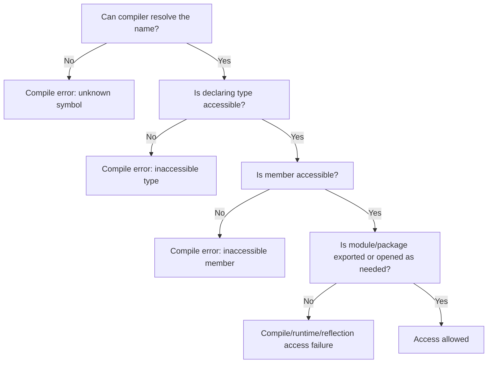
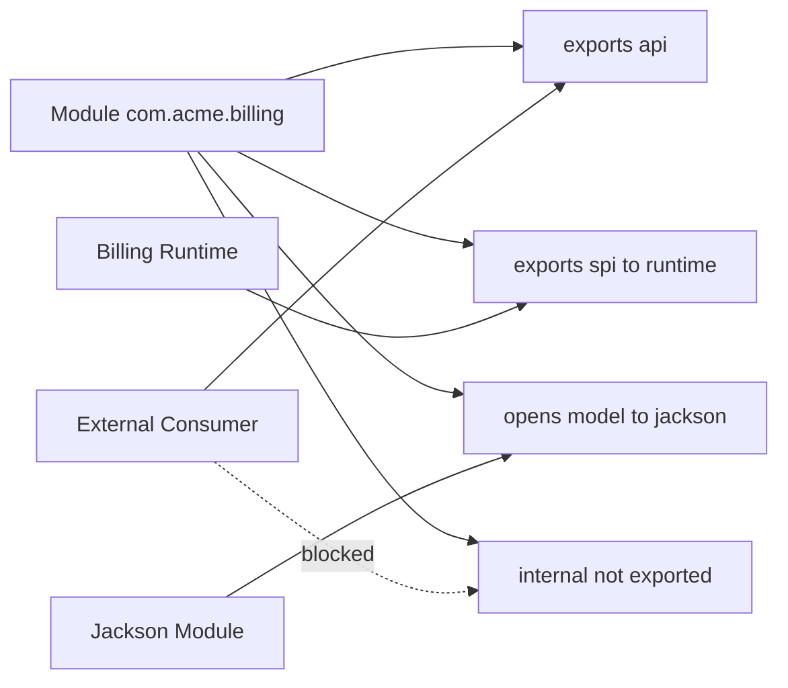
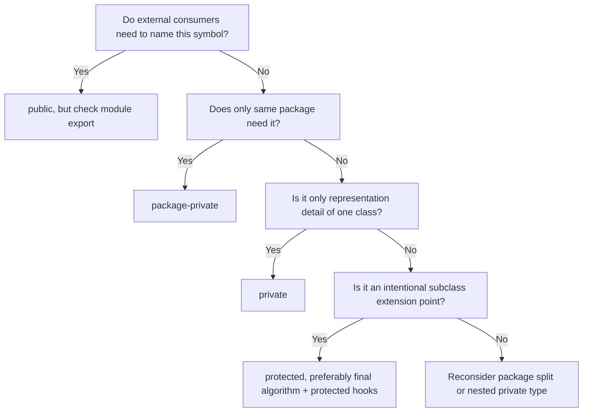

# Part 007 — Accessibility, Encapsulation, and API Boundaries

## Tujuan Part Ini

Part ini membahas **accessibility** dan **encapsulation** sebagai mekanisme desain API, bukan hanya hafalan `public`, `protected`, `private`, dan package-private.

Kita akan menjawab pertanyaan-pertanyaan berikut:

- Apa beda **scope**, **accessibility**, **visibility**, dan **encapsulation**?
- Kenapa `protected` di Java sering disalahpahami?
- Kenapa package-private adalah salah satu alat arsitektur paling penting di Java?
- Bagaimana nested class dan private member access bekerja secara konseptual?
- Apa peran JPMS: `exports`, `exports ... to`, `opens`, `opens ... to`, dan `open module`?
- Bagaimana reflection mengubah model akses?
- Bagaimana merancang boundary agar API publik kecil, internal kuat, dan framework tetap bisa bekerja?

Mental model utama:

> Access modifier bukan hanya syntax. Ia adalah **policy boundary**: siapa yang boleh mengetahui, siapa yang boleh memanggil, siapa yang boleh menurunkan, siapa yang boleh merefleksikan, dan siapa yang harus tetap tidak bergantung.

---

## Kaufman Skill Frame

Dalam kerangka Josh Kaufman, skill ini kita pecah menjadi unit kecil yang bisa dilatih:

| Sub-skill | Yang harus bisa dilakukan |
|---|---|
| Membaca access rule | Menentukan apakah suatu reference legal secara compile-time. |
| Mendesain package boundary | Memilih mana class yang public, package-private, atau nested. |
| Mengontrol inheritance | Menentukan kapan `protected`, `final`, `sealed`, atau package-private constructor dipakai. |
| Mendesain module boundary | Membedakan package yang diekspor, dibuka untuk reflection, atau benar-benar internal. |
| Mengurangi coupling | Menemukan public/internal leak dari signature API. |
| Melindungi invariant | Menutup mutator, constructor, collection exposure, dan subclass hooks yang berbahaya. |
| Menangani framework | Mengizinkan serialization/DI/reflection tanpa membuka seluruh internal model. |

Latihan inti:

> Ambil satu package production. Tandai semua `public`. Untuk setiap item, tanyakan: “Apakah consumer eksternal benar-benar harus tahu simbol ini?” Jika tidak, turunkan aksesnya.

---

## 1. Empat Konsep yang Sering Dicampuradukkan

### 1.1 Scope

**Scope** menjawab:

> Di bagian source code mana sebuah nama bisa direferensikan?

Contoh:

```java
void calculate() {
    int retryCount = 3;
    System.out.println(retryCount);
}
```

`retryCount` punya scope lokal di method body. Scope adalah konsep lexical/source-level.

### 1.2 Accessibility

**Accessibility** menjawab:

> Walaupun nama bisa ditemukan, apakah kode ini boleh mengakses deklarasi tersebut?

Contoh:

```java
package com.acme.billing;

public final class Invoice {
    private long id;
}
```

Class lain mungkin tahu ada type `Invoice`, tetapi tidak boleh mengakses field `id` secara langsung karena `private`.

### 1.3 Visibility

Dalam diskusi sehari-hari, orang sering memakai “visibility” untuk access modifier. Namun di Java, lebih presisi bila kita berkata:

- name resolution menemukan simbol;
- accessibility menentukan apakah simbol itu boleh dipakai;
- runtime visibility/class loading menentukan apakah class bisa dimuat dari classpath/module path tertentu.

### 1.4 Encapsulation

**Encapsulation** bukan sekadar membuat field `private`. Encapsulation berarti:

> Internal representation, invariant, dan perubahan implementasi tidak boleh menjadi beban pengetahuan consumer.

Contoh field private yang masih bocor:

```java
public final class Order {
    private final List<String> itemIds;

    public Order(List<String> itemIds) {
        this.itemIds = itemIds; // representation leak
    }

    public List<String> itemIds() {
        return itemIds; // representation leak
    }
}
```

Akses field memang private, tetapi invariant object masih bocor karena caller dapat mengubah list dari luar.

Versi lebih defensible:

```java
public final class Order {
    private final List<String> itemIds;

    public Order(List<String> itemIds) {
        this.itemIds = List.copyOf(itemIds);
    }

    public List<String> itemIds() {
        return itemIds;
    }
}
```

`List.copyOf` membuat snapshot tidak dapat dimodifikasi melalui API list tersebut. Ini tidak selalu berarti deep immutability, tetapi cukup kuat untuk mencegah mutation terhadap struktur list.

---

## 2. Access Control Java dalam Satu Peta

Java memiliki empat level akses utama untuk top-level/nested/member declaration:

| Modifier | Akses dari class yang sama | Package sama | Subclass package berbeda | Dunia luar |
|---|---:|---:|---:|---:|
| `private` | Ya | Tidak | Tidak | Tidak |
| package-private | Ya | Ya | Tidak | Tidak |
| `protected` | Ya | Ya | Dengan aturan khusus | Tidak umum |
| `public` | Ya | Ya | Ya | Ya, jika enclosing type/package/module juga accessible |

Catatan penting:

1. Top-level class/interface hanya bisa `public` atau package-private.
2. Member nested type bisa memakai semua modifier.
3. `public` member tidak otomatis accessible jika class/package/module-nya tidak accessible.
4. JPMS menambahkan boundary module: package harus `exports` agar public type-nya dapat diakses dari module lain.

Diagram mental:



---

## 3. `private`: Representation Boundary

`private` adalah alat untuk menyembunyikan **representation choice**.

Contoh:

```java
public final class Money {
    private final long minorUnits;
    private final Currency currency;

    public Money(long minorUnits, Currency currency) {
        if (currency == null) {
            throw new IllegalArgumentException("currency must not be null");
        }
        this.minorUnits = minorUnits;
        this.currency = currency;
    }

    public long minorUnits() {
        return minorUnits;
    }

    public Currency currency() {
        return currency;
    }
}
```

Kenapa field tidak public?

Karena kita ingin bebas mengubah representasi:

- dari `long minorUnits` ke `BigDecimal amount`;
- dari `Currency` JDK ke custom `CurrencyCode`;
- dari constructor langsung ke factory yang mengontrol scale;
- dari class biasa ke record bila kontraknya cocok.

Jika field public, representation menjadi API. Jika representation menjadi API, evolusi menjadi mahal.

### 3.1 `private` tidak sama dengan security boundary absolut

`private` adalah language access control. Dalam konteks tertentu, reflection, instrumentation, unsafe/internal API, atau command-line flags dapat melewati batas ini. Namun untuk desain API, `private` tetap boundary yang sangat penting karena:

- compiler mencegah accidental coupling;
- reviewer bisa membaca invariant;
- refactoring lebih aman;
- binary compatibility lebih mudah dijaga;
- test tidak tergoda mengikat diri ke detail internal.

---

## 4. Package-Private: Boundary Arsitektur yang Sering Diremehkan

Package-private adalah default ketika tidak ada modifier:

```java
package com.acme.billing.invoice;

final class InvoiceNumberGenerator {
    String nextNumber() {
        return "INV-" + System.nanoTime();
    }
}
```

Class ini hanya bisa dipakai oleh kode dalam package yang sama.

### 4.1 Kapan package-private ideal?

Gunakan package-private untuk:

- helper internal package;
- strategy internal yang tidak perlu consumer tahu;
- implementation dari public interface;
- constructor/factory internal;
- test seam dalam package yang sama;
- aggregate internals;
- generated implementation yang tidak boleh menjadi API publik.

Contoh:

```java
package com.acme.billing.invoice;

public interface InvoiceNumbering {
    String nextInvoiceNumber();
}

final class TimestampInvoiceNumbering implements InvoiceNumbering {
    @Override
    public String nextInvoiceNumber() {
        return "INV-" + System.currentTimeMillis();
    }
}

public final class InvoiceNumberingFactory {
    public static InvoiceNumbering timestampBased() {
        return new TimestampInvoiceNumbering();
    }
}
```

Consumer hanya tahu interface dan factory. Implementation tetap bisa diganti.

### 4.2 Package-private sebagai anti-corruption layer

Misalnya package `com.acme.payment.stripe`:

```text
com.acme.payment
  PaymentGateway.java              public API
  PaymentRequest.java              public API
  PaymentResult.java               public API

com.acme.payment.stripe
  StripePaymentGateway.java        package-private or public only if needed by wiring
  StripeRequestMapper.java         package-private
  StripeErrorTranslator.java       package-private
  StripeSignatureVerifier.java     package-private
```

Jika `StripeRequestMapper` menjadi public, consumer bisa mulai bergantung pada detail provider Stripe. Ketika provider berubah, API ikut terseret.

### 4.3 Package-private gagal jika package terlalu besar

Package-private hanya efektif jika package punya kohesi. Jika package diisi terlalu banyak hal, package-private menjadi “semi-global dalam folder besar”.

Tanda package terlalu besar:

- 40+ class dengan alasan berbeda untuk berubah;
- nama package generik: `service`, `util`, `common`, `core`;
- banyak class package-private saling mengakses tanpa aturan;
- test harus tahu terlalu banyak detail;
- sulit memindahkan satu fitur tanpa memindahkan separuh package.

Package-private paling kuat bila package mewakili **small bounded mechanism**.

---

## 5. `public`: Contract You Must Defend

`public` berarti:

> Simbol ini boleh diketahui consumer dan perubahan terhadapnya harus diperlakukan sebagai perubahan kontrak.

Contoh public API yang terlalu banyak:

```java
public final class InvoiceService {
    public final InvoiceRepository repository;
    public final TaxClient taxClient;
    public final Clock clock;

    public Invoice calculate(InvoiceDraft draft) {
        // ...
    }
}
```

Masalah:

- dependency internal menjadi bagian API;
- caller bisa bypass invariant;
- constructor dan state wiring menjadi sulit diubah;
- test consumer bisa mulai mock field internal;
- public field tidak bisa diberi lazy validation atau synchronization tanpa breaking change.

Versi lebih baik:

```java
public final class InvoiceService {
    private final InvoiceRepository repository;
    private final TaxClient taxClient;
    private final Clock clock;

    InvoiceService(InvoiceRepository repository, TaxClient taxClient, Clock clock) {
        this.repository = repository;
        this.taxClient = taxClient;
        this.clock = clock;
    }

    public Invoice calculate(InvoiceDraft draft) {
        Objects.requireNonNull(draft, "draft");
        // ...
    }
}
```

Constructor dibuat package-private jika object seharusnya dibuat oleh factory/module internal.

```java
public final class BillingModule {
    public static InvoiceService invoiceService(BillingConfig config) {
        return new InvoiceService(
            new JdbcInvoiceRepository(config.dataSource()),
            new HttpTaxClient(config.taxEndpoint()),
            config.clock()
        );
    }
}
```

### 5.1 Public type dalam package internal tetap bocor

Banyak codebase punya package seperti:

```text
com.acme.billing.internal
```

Lalu membuat class:

```java
package com.acme.billing.internal;

public final class InternalInvoiceMapper {}
```

Di classpath tradisional, `internal` hanya convention. Jika class public, consumer bisa memakainya.

JPMS bisa memperkuat convention ini dengan tidak mengekspor package tersebut:

```java
module com.acme.billing {
    exports com.acme.billing.api;
    // com.acme.billing.internal tidak diekspor
}
```

Dengan module boundary, public type dalam package yang tidak diekspor tidak accessible dari module lain secara normal.

---

## 6. `protected`: Bukan “Public untuk Subclass” Sederhana

`protected` di Java punya dua sisi:

1. accessible dari package yang sama;
2. accessible dari subclass di package berbeda, tetapi dengan aturan receiver tertentu.

Contoh:

```java
package com.acme.base;

public class BasePolicy {
    protected void validate() {}
}
```

Subclass di package berbeda:

```java
package com.acme.custom;

import com.acme.base.BasePolicy;

public class CustomPolicy extends BasePolicy {
    public void run(CustomPolicy custom) {
        custom.validate(); // allowed
        this.validate();   // allowed
    }
}
```

Namun akses terhadap instance base yang bukan subtype context bisa bermasalah:

```java
package com.acme.custom;

import com.acme.base.BasePolicy;

public class CustomPolicy extends BasePolicy {
    public void run(BasePolicy base) {
        // base.validate(); // not allowed from different package
    }
}
```

Intuisinya:

> Di luar package, `protected` memberi subclass kemampuan mengakses bagian inherited dari dirinya sendiri atau subtype yang sesuai, bukan izin umum untuk mengakses semua object base.

### 6.1 Kapan `protected` tepat?

Gunakan `protected` bila Anda sengaja merancang **extension point**.

Contoh template method yang defensible:

```java
public abstract class CsvImporter<T> {

    public final ImportReport importRows(List<String> lines) {
        Objects.requireNonNull(lines, "lines");

        ImportReport report = new ImportReport();
        for (String line : lines) {
            T row = parse(line);
            validate(row);
            persist(row);
            report.incrementSuccess();
        }
        return report;
    }

    protected abstract T parse(String line);

    protected void validate(T row) {
        // default no-op hook
    }

    protected abstract void persist(T row);
}
```

`importRows` dibuat `final` agar algorithm invariant tidak dirusak subclass. Extension point dibatasi pada `parse`, `validate`, `persist`.

### 6.2 Kapan `protected` berbahaya?

`protected` berbahaya saat membuka state internal:

```java
public abstract class AbstractCache<K, V> {
    protected final Map<K, V> entries = new HashMap<>();
}
```

Subclass dapat:

- menghapus invariant;
- mengganti lifecycle;
- mengakses state tanpa synchronization;
- membuat bug yang sulit dilacak;
- mengikat API ke representation `Map`.

Lebih baik:

```java
public abstract class AbstractCache<K, V> {
    private final Map<K, V> entries = new HashMap<>();

    protected final V getCached(K key) {
        return entries.get(key);
    }

    protected final void putCached(K key, V value) {
        entries.put(key, value);
    }
}
```

Expose operation, bukan representation.

---

## 7. Nested Types dan Encapsulation

Nested type bisa menjadi alat untuk mengecilkan namespace dan menyembunyikan implementation.

```java
public final class RetryPolicy {
    private final int maxAttempts;
    private final Backoff backoff;

    private RetryPolicy(int maxAttempts, Backoff backoff) {
        this.maxAttempts = maxAttempts;
        this.backoff = backoff;
    }

    public static Builder builder() {
        return new Builder();
    }

    public static final class Builder {
        private int maxAttempts = 3;
        private Backoff backoff = new FixedBackoff(100);

        public Builder maxAttempts(int maxAttempts) {
            if (maxAttempts < 1) {
                throw new IllegalArgumentException("maxAttempts must be >= 1");
            }
            this.maxAttempts = maxAttempts;
            return this;
        }

        public RetryPolicy build() {
            return new RetryPolicy(maxAttempts, backoff);
        }
    }

    private interface Backoff {
        long delayMillis(int attempt);
    }

    private record FixedBackoff(long millis) implements Backoff {
        @Override
        public long delayMillis(int attempt) {
            return millis;
        }
    }
}
```

Hal penting:

- `Builder` public karena consumer perlu memakainya.
- `Backoff` private karena hanya implementation detail.
- `FixedBackoff` private record karena representation detail.
- Constructor utama private agar object hanya terbentuk lewat builder/factory.

### 7.1 Static nested class vs inner class

Prefer `static` nested class kecuali inner class benar-benar membutuhkan reference ke enclosing instance.

Inner class non-static membawa implicit reference ke outer object. Ini bisa menyebabkan:

- memory leak;
- serialization surprise;
- lifecycle coupling;
- object graph lebih berat.

Contoh umum yang buruk:

```java
public final class ReportGenerator {
    private final LargeContext context;

    public class RowFormatter {
        public String format(Row row) {
            return context.prefix() + row.value();
        }
    }
}
```

Jika `RowFormatter` hidup lebih lama dari `ReportGenerator`, outer context ikut tertahan.

---

## 8. Constructor Accessibility sebagai Boundary

Constructor access sering lebih penting daripada class access.

### 8.1 Public class, private constructor

```java
public final class OrderId {
    private final String value;

    private OrderId(String value) {
        this.value = value;
    }

    public static OrderId parse(String raw) {
        if (!raw.matches("ORD-[0-9]{{8}}")) {
            throw new IllegalArgumentException("invalid order id: " + raw);
        }
        return new OrderId(raw);
    }
}
```

Alasan:

- semua instance melewati validasi;
- factory bisa diberi nama semantic;
- return type bisa berubah ke subtype/cache di masa depan;
- overload constructor ambiguity bisa dihindari.

### 8.2 Public interface, package-private implementation

```java
public interface IdGenerator {
    String nextId();
}

final class UuidIdGenerator implements IdGenerator {
    @Override
    public String nextId() {
        return UUID.randomUUID().toString();
    }
}
```

Consumer bergantung pada capability, bukan implementation.

### 8.3 Public abstract type, protected constructor

```java
public abstract class DomainEvent {
    private final Instant occurredAt;

    protected DomainEvent(Instant occurredAt) {
        this.occurredAt = Objects.requireNonNull(occurredAt, "occurredAt");
    }

    public final Instant occurredAt() {
        return occurredAt;
    }
}
```

`protected` constructor menandakan type ini hanya untuk subclassing, bukan instantiation langsung.

---

## 9. JPMS Boundary: `exports` vs `opens`

JPMS menambahkan boundary yang tidak dimiliki classpath biasa.

Contoh module descriptor:

```java
module com.acme.billing {
    exports com.acme.billing.api;
    exports com.acme.billing.spi to com.acme.billing.runtime;

    opens com.acme.billing.model to com.fasterxml.jackson.databind;

    requires java.sql;
}
```

### 9.1 `exports`

`exports` berarti package dapat dipakai oleh module lain pada compile-time dan runtime normal.

```java
exports com.acme.billing.api;
```

Artinya public type dalam package `com.acme.billing.api` menjadi accessible untuk module lain yang membaca module ini.

### 9.2 Qualified exports

```java
exports com.acme.billing.spi to com.acme.billing.runtime;
```

Artinya package SPI hanya diekspor ke module tertentu.

Gunakan untuk:

- plugin internal antar module;
- test fixture module;
- generated runtime module;
- migration bridge sementara.

### 9.3 `opens`

`opens` berarti package dibuka untuk **deep reflection**, bukan untuk compile-time API biasa.

```java
opens com.acme.billing.model to com.fasterxml.jackson.databind;
```

Artinya framework tertentu boleh melakukan reflective access terhadap package model, misalnya untuk serialization/deserialization.

### 9.4 `open module`

```java
open module com.acme.billing {
    requires com.fasterxml.jackson.databind;
}
```

Ini membuka semua package untuk reflection. Biasanya terlalu luas untuk library serius.

Prefer:

```java
module com.acme.billing {
    opens com.acme.billing.model to com.fasterxml.jackson.databind;
}
```

### 9.5 Matrix desain

| Kebutuhan | Gunakan |
|---|---|
| Consumer perlu compile terhadap API | `exports` |
| Hanya module tertentu boleh compile terhadap package | `exports ... to` |
| Framework perlu reflection pada package tertentu | `opens ... to` |
| Semua package harus deep reflection | `open module`, jarang ideal |
| Package benar-benar internal | Jangan `exports`, jangan `opens` |

Diagram:



---

## 10. Reflection dan Access Boundary

Reflection memperkenalkan model akses berbeda:

- normal Java access checks;
- reflective access checks;
- module readability/opens checks;
- optional access suppression dalam kondisi tertentu.

Contoh:

```java
Field field = Order.class.getDeclaredField("status");
field.setAccessible(true);
```

Di era JPMS, `setAccessible(true)` tidak otomatis berhasil jika package tidak terbuka untuk caller/module yang melakukan reflection. Karena itu framework modern perlu:

- documented module setup;
- `opens` spesifik;
- public constructor/accessor fallback;
- annotation processor/code generation bila reflection terlalu mahal atau dibatasi.

### 10.1 Jangan desain domain object hanya untuk framework

Buruk:

```java
public class Customer {
    public String id;
    public String name;

    public Customer() {}
}
```

Ini mungkin memudahkan reflection framework, tetapi menghancurkan invariant.

Lebih baik:

```java
public final class Customer {
    private final CustomerId id;
    private final String name;

    public Customer(CustomerId id, String name) {
        this.id = Objects.requireNonNull(id, "id");
        this.name = requireNonBlank(name, "name");
    }

    public CustomerId id() {
        return id;
    }

    public String name() {
        return name;
    }
}
```

Jika framework perlu akses, gunakan salah satu strategi:

- DTO terpisah;
- record untuk data carrier;
- explicit mapper;
- `opens` package tertentu;
- constructor/factory support;
- annotation processing/code generation.

---

## 11. Boundary Design Patterns

### 11.1 Public facade, package-private mechanism

```java
package com.acme.billing.invoice;

public final class InvoiceEngine {
    private final TaxCalculator taxCalculator;
    private final DiscountPolicy discountPolicy;

    public InvoiceEngine() {
        this(new TaxCalculator(), new DefaultDiscountPolicy());
    }

    InvoiceEngine(TaxCalculator taxCalculator, DiscountPolicy discountPolicy) {
        this.taxCalculator = taxCalculator;
        this.discountPolicy = discountPolicy;
    }

    public Invoice calculate(InvoiceDraft draft) {
        // orchestrates internal package mechanisms
        return null;
    }
}

final class TaxCalculator {}

interface DiscountPolicy {}

final class DefaultDiscountPolicy implements DiscountPolicy {}
```

Public API kecil. Internal mechanism bebas berubah.

### 11.2 Public interface, hidden implementations

```java
public interface RateLimiter {
    boolean tryAcquire();

    static RateLimiter fixedWindow(int permits) {
        return new FixedWindowRateLimiter(permits);
    }
}

final class FixedWindowRateLimiter implements RateLimiter {
    FixedWindowRateLimiter(int permits) {}

    @Override
    public boolean tryAcquire() {
        return true;
    }
}
```

Factory static di interface bisa membuat API compact. Tetapi hati-hati: interface yang terlalu gemuk akan menjadi susah dievolusi.

### 11.3 Sealed public hierarchy, package-private implementations

```java
public sealed interface ParseResult<T>
        permits Success, Failure {
}

public record Success<T>(T value) implements ParseResult<T> {}

public record Failure<T>(String message) implements ParseResult<T> {}
```

Jika semua variants memang public, ini bagus. Jika sebagian implementation harus internal, sealed hierarchy dapat ditempatkan dalam package yang sama dengan permits terbatas.

```java
public sealed interface Token permits IdentifierToken, NumberToken {}

final class IdentifierToken implements Token {}

final class NumberToken implements Token {}
```

Consumer tahu abstraction `Token`, bukan semua concrete token.

### 11.4 Public SPI terpisah dari public API

API untuk application developer tidak selalu sama dengan SPI untuk plugin implementor.

```text
com.acme.search.api       exported to everyone
com.acme.search.spi       exported to plugin modules
com.acme.search.internal  not exported
```

SPI biasanya lebih sulit dievolusi karena implementor bergantung pada method yang harus mereka override.

---

## 12. Access Modifier Decision Tree



Rule of thumb:

> Start from `private`. Widen only when there is a clear caller model.

---

## 13. Invariant Protection Checklist

Sebelum membuat sesuatu `public` atau `protected`, cek:

| Pertanyaan | Risiko jika diabaikan |
|---|---|
| Apakah ini representation detail? | Representation menjadi API. |
| Apakah caller bisa membuat object invalid? | Invariant bocor. |
| Apakah subclass bisa override algorithm utama? | Fragile base class. |
| Apakah public method menerima/return mutable collection? | Aliasing dan mutation leak. |
| Apakah exception type internal bocor ke signature? | Internal implementation menjadi contract. |
| Apakah generic type internal muncul di public signature? | API coupling dan binary compatibility risk. |
| Apakah module mengekspor terlalu banyak package? | Strong encapsulation hilang. |
| Apakah package dibuka untuk semua reflection? | Framework convenience mengalahkan boundary. |

---

## 14. Testing dan Access Boundary

Pertanyaan klasik:

> “Kalau method private penting, bagaimana mengetesnya?”

Jawaban engineering:

- test behavior melalui public/package API;
- jika logic terlalu kompleks untuk private method, ekstrak ke package-private collaborator;
- test package-private collaborator dari test source dengan package yang sama;
- hindari reflection untuk mengetes private method kecuali legacy rescue;
- jangan membuat method public hanya demi test.

Contoh:

```java
public final class InvoiceEngine {
    private final InvoiceRules rules;

    public InvoiceEngine() {
        this(new InvoiceRules());
    }

    InvoiceEngine(InvoiceRules rules) {
        this.rules = rules;
    }

    public Invoice calculate(InvoiceDraft draft) {
        rules.validate(draft);
        // ...
        return null;
    }
}

final class InvoiceRules {
    void validate(InvoiceDraft draft) {
        // complex package-level logic
    }
}
```

`InvoiceRules` bisa dites tanpa dipublikkan ke consumer eksternal.

---

## 15. API Boundary Smells

### 15.1 `public` di package `internal`

Tidak selalu salah, tetapi harus ada alasan. Dalam classpath, itu bukan boundary kuat.

### 15.2 Banyak `protected` field

Biasanya tanda inheritance dipakai sebagai sharing mechanism, bukan abstraction.

### 15.3 Public constructor dengan banyak dependency teknis

```java
public InvoiceService(DataSource ds, MeterRegistry registry, ObjectMapper mapper, Executor executor) {}
```

Consumer dipaksa tahu wiring internal. Pertimbangkan factory/module/builder.

### 15.4 Public exception internal

```java
public Invoice load(String id) throws JdbcInvoiceMappingException
```

API billing sekarang bocor detail JDBC/mapping.

### 15.5 Public generic type yang terlalu spesifik

```java
public HashMap<String, ArrayList<InternalInvoiceLine>> linesByCustomer()
```

Gunakan interface/abstraction:

```java
public Map<CustomerId, List<InvoiceLine>> linesByCustomer()
```

### 15.6 Open module untuk convenience

`open module` boleh berguna saat migrasi, tetapi untuk library serius lebih baik `opens ... to` spesifik.

---

## 16. Latihan Deliberate Practice

### Latihan 1 — Turunkan akses

Ambil satu package dengan minimal 10 class.

Untuk setiap public class:

1. identifikasi caller eksternal sebenarnya;
2. cek apakah class muncul di public signature;
3. ubah menjadi package-private jika tidak perlu;
4. jalankan test;
5. catat breaking point.

Output latihan:

```text
Before:
- 18 public classes
- 7 package-private classes

After:
- 6 public classes
- 19 package-private classes

Public API yang tersisa:
- InvoiceEngine
- Invoice
- InvoiceDraft
- InvoiceResult
- InvoiceException
- BillingModule
```

### Latihan 2 — Ubah public constructor menjadi factory

Sebelum:

```java
public final class FraudClient {
    public FraudClient(String baseUrl, HttpClient client, ObjectMapper mapper) {}
}
```

Sesudah:

```java
public final class FraudClients {
    public static FraudClient http(FraudClientConfig config) {
        return new DefaultFraudClient(config);
    }
}

public interface FraudClient {}

final class DefaultFraudClient implements FraudClient {
    DefaultFraudClient(FraudClientConfig config) {}
}
```

Analisis:

- Apa yang hilang dari public surface?
- Apa yang menjadi lebih mudah dievolusi?
- Apa yang menjadi lebih sulit dites?

### Latihan 3 — Modul minimal

Buat module descriptor:

```java
module com.acme.example {
    exports com.acme.example.api;
    opens com.acme.example.dto to com.fasterxml.jackson.databind;
}
```

Lalu pastikan:

- package `internal` tidak bisa diakses module consumer;
- DTO masih bisa direfleksikan framework;
- API package tetap compile-time accessible.

---

## 17. Mental Model Ringkas

| Konsep | Mental model |
|---|---|
| `private` | Representation boundary. |
| package-private | Mechanism boundary dalam package kohesif. |
| `protected` | Intentional subclass extension point, bukan sharing shortcut. |
| `public` | Contract yang harus dipertahankan. |
| `exports` | Public API package untuk module lain. |
| `opens` | Reflection permission, bukan compile-time API. |
| Constructor access | Kontrol pembentukan object dan invariant. |
| Nested type | Namespace compression dan implementation hiding. |
| Reflection | Escape hatch yang harus dibatasi. |

---

## 18. Engineering Heuristics

Gunakan aturan berikut saat review desain API:

1. **Private by default.** Buka akses hanya setelah caller model jelas.
2. **Public means promise.** Jangan public-kan sesuatu yang belum siap dievolusi.
3. **Expose behavior, hide representation.** Jangan bocorkan collection mutable, concrete class, atau field internal.
4. **Package-private is architecture.** Gunakan package sebagai unit mekanisme kecil.
5. **Protected is expensive.** Setiap protected member adalah kontrak untuk subclass.
6. **Module exports are public architecture.** Jangan ekspor package hanya agar compiler diam.
7. **Opens is reflection policy.** Buka hanya package yang perlu dan hanya ke module yang perlu.
8. **Testing must not destroy boundary.** Jangan menaikkan akses hanya demi test.
9. **Factories protect construction.** Constructor public bukan default; ia pilihan desain.
10. **API surface compounds.** Satu public method bisa mengunci banyak type lain lewat signature.

---

## 19. Common Failure Case: “Everything Public Because Framework”

Banyak codebase enterprise berakhir seperti ini:

```java
public class CaseEntity {
    public String id;
    public String status;
    public List<String> notes;

    public CaseEntity() {}
}
```

Alasannya sering:

- ORM butuh constructor;
- mapper butuh setter;
- serializer butuh field;
- test butuh akses;
- UI butuh JSON cepat.

Masalahnya, domain object berubah menjadi shared mutable bag. Semua layer bisa mengubah state tanpa invariant.

Pendekatan lebih bersih:

```text
API DTO / Persistence Entity / Domain Model dipisahkan bila constraint berbeda.
```

Contoh:

```java
public record CaseDto(String id, String status, List<String> notes) {}

final class CaseEntity {
    String id;
    String status;
    String notesJson;
}

public final class RegulatoryCase {
    private final CaseId id;
    private CaseStatus status;
    private final List<CaseNote> notes;

    public void escalate(EscalationReason reason) {
        if (!status.canEscalate()) {
            throw new IllegalStateException("case cannot be escalated from " + status);
        }
        status = CaseStatus.ESCALATED;
        notes.add(CaseNote.system("Escalated: " + reason));
    }
}
```

Boundary berbeda, akses berbeda, invariant berbeda.

---

## 20. Apa yang Harus Dikuasai Setelah Part Ini

Setelah part ini, Anda seharusnya bisa:

- membaca access error Java dengan akurat;
- menjelaskan kenapa `protected` berbeda dari public-subclass access sederhana;
- memakai package-private sebagai alat desain package;
- mengecilkan public API tanpa mengorbankan testability;
- membedakan `exports` dan `opens` dalam JPMS;
- mendesain class yang mudah dipakai tetapi sulit disalahgunakan;
- mendeteksi public/internal leak dari signature;
- membuat boundary yang compatible dengan framework tanpa menyerahkan invariant.

---

## Referensi Teknis

- Java Language Specification SE 25 — Chapter 6: Names, Scope, and Access Control.
- Java Language Specification SE 25 — Chapter 7: Packages and Modules.
- Java Language Specification SE 25 — Chapter 8: Classes.
- Java SE 25 API Documentation — `java.lang`, `java.lang.reflect`, `java.lang.module`.
- OpenJDK JEP 261 — Module System.
- Oracle/dev.java module tutorials — modules, exports, opens, reflective access.

---

## Berikutnya

Part berikutnya:

**Part 008 — API Surface Minimization**

Kita akan membahas cara mengecilkan public API secara sistematis: signature budget, semantic weight, binary compatibility, source compatibility, overload risk, dependency leak, dan strategi evolusi API agar library/platform tetap stabil bertahun-tahun.
