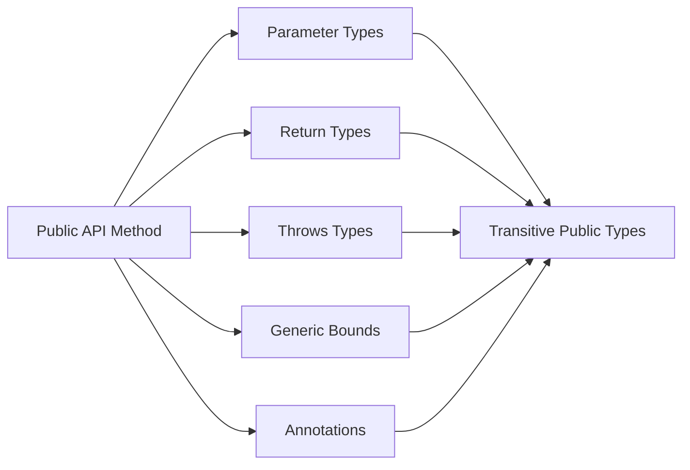
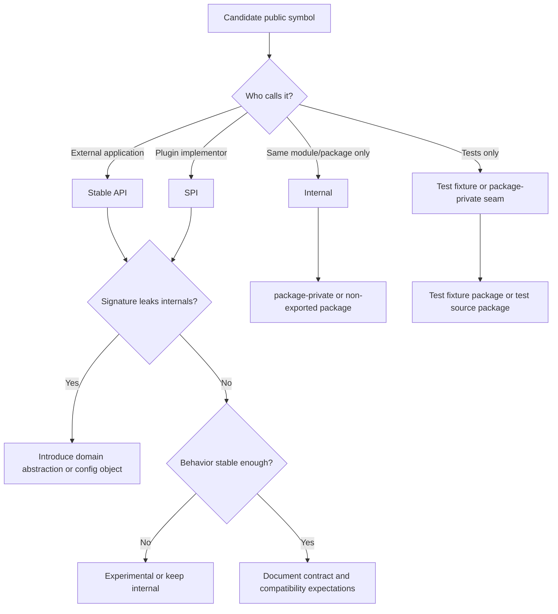

# Part 008 — API Surface Minimization

## Tujuan Part Ini

Part ini membahas salah satu skill paling mahal dalam Java library/platform engineering:

> Mampu mendesain API yang cukup ekspresif untuk dipakai, tetapi cukup kecil untuk dipertahankan.

Banyak engineer bisa menambah method. Lebih sedikit yang bisa menjaga API tetap kecil selama bertahun-tahun.

Kita akan membahas:

- kenapa public API adalah liability, bukan hanya feature;
- apa itu **signature budget**;
- bagaimana public method menyeret type lain menjadi kontrak;
- bagaimana overload, generic, exception, annotation, dan return type memperbesar surface;
- bagaimana membedakan API, SPI, internal, dan test fixture;
- bagaimana mengevolusi API tanpa breaking change;
- bagaimana membuat API mudah dipakai tetapi sulit disalahgunakan;
- bagaimana melakukan API review seperti maintainer library besar.

Mental model utama:

> Setiap public symbol adalah hutang kompatibilitas. API surface minimization bukan membuat API pelit, tetapi menjaga agar setiap janji publik punya nilai yang sepadan dengan biaya evolusinya.

---

## Kaufman Skill Frame

Skill ini kita pecah menjadi latihan terukur:

| Sub-skill | Pertanyaan koreksi |
|---|---|
| Menghitung public surface | Berapa banyak type, method, constructor, field, enum constant, annotation member, dan package yang menjadi kontrak? |
| Membaca signature leak | Type apa saja yang ikut menjadi public karena muncul di parameter/return/throws/generic bound? |
| Menilai semantic weight | Apakah method ini punya janji behavior yang jelas dan stabil? |
| Mengendalikan overload | Apakah overload membuat resolusi method ambigu atau sulit dievolusi? |
| Memisahkan API dan SPI | Siapa caller-nya: application consumer, framework, plugin implementor, atau internal module? |
| Mendesain evolution path | Jika kontrak berubah, bagaimana migrasinya tanpa mematahkan binary/source compatibility? |
| Mengurangi dependency leak | Apakah public API memaksa consumer bergantung pada library teknis internal? |

Latihan inti:

> Untuk setiap public method, tulis “alasan method ini harus public” dalam satu kalimat. Jika tidak bisa, method itu kandidat untuk diturunkan, digabung, atau dipindahkan.

---

## 1. API Surface: Apa Saja yang Termasuk?

Public API bukan hanya class `public`.

Termasuk public surface:

- exported packages dalam module;
- public/protected top-level dan nested types;
- public/protected constructors;
- public/protected methods;
- public/protected fields;
- enum constants;
- record components;
- annotation elements;
- checked exceptions di `throws`;
- parameter types;
- return types;
- generic type parameters, bounds, dan wildcards;
- annotations yang menjadi bagian contract/tooling;
- documented behavior;
- default values;
- serialization form bila dijanjikan;
- subclassing hooks;
- reflection-accessible members bila didokumentasikan sebagai extension surface.

Contoh:

```java
public interface InvoiceClient {
    CompletionStage<InvoiceResponse> submit(
            InvoiceRequest request,
            RetryPolicy retryPolicy,
            MeterRegistry registry) throws InvoiceTransportException;
}
```

Surface yang terlihat:

- `InvoiceClient`;
- `CompletionStage` sebagai async abstraction;
- `InvoiceResponse`;
- `InvoiceRequest`;
- `RetryPolicy`;
- `MeterRegistry`;
- `InvoiceTransportException`;
- semantic contract submit;
- threading/completion behavior;
- retry behavior;
- metrics dependency leak.

Jika `MeterRegistry` hanya internal observability, ia tidak seharusnya muncul di public API. API ini memaksa consumer tahu implementation concern.

Versi lebih kecil:

```java
public interface InvoiceClient {
    CompletionStage<InvoiceResponse> submit(InvoiceRequest request);
}
```

Konfigurasi retry/metrics bisa masuk builder/module config:

```java
public final class InvoiceClientBuilder {
    public InvoiceClientBuilder retryPolicy(RetryPolicy retryPolicy) { ... }
    public InvoiceClient build() { ... }
}
```

Namun builder pun public surface. Jangan menambah option tanpa komitmen support.

---

## 2. Signature Budget

**Signature budget** adalah batas mental untuk berapa banyak konsep yang boleh muncul dalam public signature.

Signature yang baik biasanya:

- memakai domain abstraction yang stabil;
- tidak membocorkan transport/storage/framework internal;
- tidak terlalu generic tanpa manfaat;
- tidak menerima parameter yang bisa dikonfigurasi di tempat lain;
- tidak mengembalikan concrete mutable implementation;
- tidak melempar exception teknis internal.

### 2.1 Contoh signature over-budget

```java
public HashMap<String, ArrayList<JdbcInvoiceLine>> loadLines(
        DataSource dataSource,
        ObjectMapper objectMapper,
        String tenantId,
        boolean includeDraft,
        boolean includeCancelled,
        int timeoutMillis
) throws SQLException, JsonProcessingException;
```

Masalah:

| Elemen | Masalah |
|---|---|
| `HashMap` | Concrete mutable implementation leak. |
| `ArrayList` | Concrete collection leak. |
| `JdbcInvoiceLine` | Persistence detail leak. |
| `DataSource` | Caller dipaksa tahu storage mechanism. |
| `ObjectMapper` | Serialization detail leak. |
| `String tenantId` | Domain primitive obsession. |
| boolean flags | Ambiguous behavior. |
| `timeoutMillis` | Transport/config concern dicampur query concern. |
| `SQLException` | Storage exception leak. |
| `JsonProcessingException` | Mapping exception leak. |

Versi lebih kecil:

```java
public interface InvoiceLineRepository {
    List<InvoiceLine> findLines(InvoiceLineQuery query);
}

public record InvoiceLineQuery(
        TenantId tenantId,
        InvoiceLineStatusFilter statusFilter
) {}
```

Exception bisa diterjemahkan:

```java
public final class InvoiceStorageException extends RuntimeException {
    public InvoiceStorageException(String message, Throwable cause) {
        super(message, cause);
    }
}
```

Catatan: bukan berarti semua checked exception buruk. Maksudnya, exception teknis internal jangan otomatis bocor.

---

## 3. Public API adalah Dependency Graph

Setiap public signature menarik dependency graph.



Jika public API memakai type dari dependency eksternal, consumer ikut terkena:

- version conflict;
- classpath/module path requirements;
- binary compatibility dependency;
- semantic coupling ke library tersebut;
- migration cost jika dependency diganti.

Contoh leak:

```java
public interface PaymentClient {
    Mono<PaymentResult> pay(PaymentCommand command);
}
```

`Mono` membuat Reactor menjadi bagian API. Ini benar jika library memang reactive-first. Tetapi salah jika Reactor hanya implementation detail.

Alternative:

```java
public interface PaymentClient {
    CompletionStage<PaymentResult> pay(PaymentCommand command);
}
```

Atau synchronous API:

```java
public interface PaymentClient {
    PaymentResult pay(PaymentCommand command);
}
```

Pilih berdasarkan contract, bukan implementation convenience.

---

## 4. API, SPI, Internal, Test Fixture

Sebelum menambah public type, tentukan kategorinya.

| Kategori | Caller | Stabilitas | Contoh |
|---|---|---|---|
| API | Application/user code | Sangat stabil | `InvoiceClient`, `InvoiceRequest` |
| SPI | Plugin/extension implementor | Stabil tapi lebih teknis | `InvoicePlugin`, `MessageCodecProvider` |
| Internal | Implementation | Bebas berubah | `DefaultInvoiceClient`, `JdbcInvoiceMapper` |
| Test fixture | Test consumer | Stabil terbatas | `InvoiceTestFixtures` |
| Experimental | Early adopter | Boleh berubah, harus jelas | `@ExperimentalApi` annotated type |

### 4.1 Jangan campur API dan SPI

Buruk:

```java
public interface SearchEngine {
    SearchResult search(Query query);

    void registerTokenizer(Tokenizer tokenizer);

    void flushIndexSegments();
}
```

Masalah:

- user biasa hanya ingin search;
- plugin implementor ingin register tokenizer;
- internal indexing operation bocor.

Lebih baik:

```java
package com.acme.search.api;

public interface SearchEngine {
    SearchResult search(Query query);
}
```

```java
package com.acme.search.spi;

public interface TokenizerProvider {
    Tokenizer createTokenizer(TokenizerConfig config);
}
```

```java
package com.acme.search.internal;

final class IndexSegmentFlusher {}
```

Dengan JPMS:

```java
module com.acme.search {
    exports com.acme.search.api;
    exports com.acme.search.spi to com.acme.search.runtime;
}
```

---

## 5. Public Type Count vs Semantic Surface

API kecil bukan hanya sedikit class. API kecil berarti sedikit **konsep publik**.

Contoh A:

```java
public interface Cache<K, V> {
    V get(K key);
    void put(K key, V value);
    void invalidate(K key);
}
```

Tiga method, tetapi konsepnya jelas.

Contoh B:

```java
public interface Cache<K, V> {
    V get(K key);
    V get(K key, CacheReadMode mode);
    V getOrLoad(K key, Callable<V> loader);
    V getOrLoad(K key, Callable<V> loader, Duration timeout);
    void put(K key, V value);
    void put(K key, V value, Duration ttl);
    void putIfAbsent(K key, V value);
    void invalidate(K key);
    void invalidateAll();
    CacheStats stats();
    void warmup(Collection<K> keys);
    void compact();
    void close();
}
```

Mungkin valid untuk advanced cache library. Tetapi setiap method memperkenalkan janji:

- concurrency semantics;
- atomicity;
- timeout behavior;
- loader error behavior;
- TTL precision;
- stats consistency;
- lifecycle state;
- resource ownership.

Jika tidak siap mendefinisikan semua itu, API terlalu besar.

---

## 6. Public Fields: Hampir Selalu Surface Leak

```java
public final class FeatureFlags {
    public boolean newCheckout;
    public boolean fraudV2;
}
```

Masalah:

- mutable dari mana saja;
- tidak ada validation;
- tidak bisa lazy load;
- tidak bisa audit mutation;
- tidak bisa menjaga thread-safety;
- field name menjadi binary API.

Lebih baik:

```java
public final class FeatureFlags {
    private final Set<String> enabled;

    public FeatureFlags(Set<String> enabled) {
        this.enabled = Set.copyOf(enabled);
    }

    public boolean isEnabled(String flag) {
        return enabled.contains(flag);
    }
}
```

Untuk constants:

```java
public final class HttpHeaders {
    private HttpHeaders() {}

    public static final String REQUEST_ID = "X-Request-Id";
}
```

Public constants boleh, tetapi tetap kontrak. Jika string berubah, consumer terdampak.

---

## 7. Constructor Surface

Constructor sering lebih sulit dievolusi daripada factory.

### 7.1 Constructor telescoping

```java
public RetryPolicy(int maxAttempts) {}
public RetryPolicy(int maxAttempts, Duration delay) {}
public RetryPolicy(int maxAttempts, Duration delay, double jitter) {}
public RetryPolicy(int maxAttempts, Duration delay, double jitter, Predicate<Throwable> retryOn) {}
```

Masalah:

- overload bertambah;
- parameter primitive ambigu;
- sulit menambah option tanpa constructor baru;
- binary compatibility harus dijaga;
- caller tidak jelas membaca intent.

Builder lebih fleksibel:

```java
public final class RetryPolicy {
    private RetryPolicy(Builder builder) {}

    public static Builder builder() {
        return new Builder();
    }

    public static final class Builder {
        private int maxAttempts = 3;
        private Duration delay = Duration.ofMillis(100);
        private double jitter = 0.0;
        private Predicate<Throwable> retryOn = t -> true;

        public Builder maxAttempts(int maxAttempts) {
            if (maxAttempts < 1) {
                throw new IllegalArgumentException("maxAttempts must be >= 1");
            }
            this.maxAttempts = maxAttempts;
            return this;
        }

        public RetryPolicy build() {
            return new RetryPolicy(this);
        }
    }
}
```

Namun builder juga menambah public surface. Gunakan bila option memang akan tumbuh atau parameter sulit dibaca.

### 7.2 Static factory naming

```java
public static Money ofMinor(long minorUnits, Currency currency)
public static Money ofMajor(BigDecimal amount, Currency currency)
public static Money zero(Currency currency)
```

Factory memberi semantic name yang constructor tidak bisa berikan.

---

## 8. Method Overload Risk

Overload terlihat ergonomis, tetapi punya risiko evolusi.

```java
public void send(String destination, String body) {}
public void send(URI destination, String body) {}
```

Menambah overload baru bisa mengubah resolusi source code tertentu.

Contoh tricky:

```java
public void process(String value) {}
public void process(Object value) {}
```

Pemanggilan:

```java
process(null);
```

Memilih overload paling spesifik. Jika nanti ditambah:

```java
public void process(Integer value) {}
```

`process(null)` bisa menjadi ambigu tergantung overload set.

### 8.1 Heuristic overload

Gunakan overload bila:

- makna operation sama;
- parameter jelas berbeda secara domain;
- tidak banyak kombinasi optional;
- null handling jelas;
- generic inference tidak membingungkan;
- penambahan overload masa depan masih aman.

Hindari overload bila:

- beda behavior besar;
- boolean flags;
- parameter sama-sama functional interface;
- generic method inference sulit;
- `null` menjadi ambiguous.

Lebih jelas:

```java
public void sendText(Destination destination, String body) {}
public void sendJson(Destination destination, JsonPayload payload) {}
```

Daripada overload yang menyembunyikan perbedaan behavior.

---

## 9. Boolean Parameter Smell

```java
public List<Invoice> findInvoices(boolean includeCancelled, boolean includeDrafts) {}
```

Call site buruk:

```java
findInvoices(true, false);
```

Apa arti `true, false`?

Lebih baik:

```java
public List<Invoice> findInvoices(InvoiceSearchOptions options) {}

public record InvoiceSearchOptions(
        boolean includeCancelled,
        boolean includeDrafts
) {
    public static InvoiceSearchOptions activeOnly() {
        return new InvoiceSearchOptions(false, false);
    }

    public static InvoiceSearchOptions all() {
        return new InvoiceSearchOptions(true, true);
    }
}
```

Atau enum:

```java
public enum InvoiceVisibility {
    ACTIVE_ONLY,
    INCLUDE_CANCELLED,
    INCLUDE_DRAFTS,
    ALL
}
```

Boolean boleh jika domain benar-benar binary dan jelas:

```java
featureFlags.isEnabled("fraud-v2")
```

Tetapi di parameter API, boolean sering tanda bahwa concept belum dimodelkan.

---

## 10. Return Type Choice

Return type mempengaruhi future flexibility.

### 10.1 Interface vs implementation

Buruk:

```java
public ArrayList<Order> findOrders() {}
```

Lebih baik:

```java
public List<Order> findOrders() {}
```

Lebih baik lagi jika semantics bukan list:

```java
public Collection<Order> findOrders() {}
```

Atau stream? Hati-hati:

```java
public Stream<Order> streamOrders() {}
```

`Stream` membawa lifecycle concern jika backed by resource. Harus jelas apakah caller wajib close:

```java
try (Stream<Order> orders = repository.streamOrders()) {
    orders.forEach(...);
}
```

Jika caller tidak boleh memikirkan resource, return `List` atau paging abstraction lebih aman.

### 10.2 Optional return

```java
public Optional<Customer> findCustomer(CustomerId id) {}
```

Baik untuk “may not exist”. Tidak ideal untuk:

- field record/entity;
- collection optional;
- parameter method;
- serialization boundary.

### 10.3 Null policy

Public API harus punya null policy:

- reject null dengan `Objects.requireNonNull`;
- return empty collection daripada null;
- gunakan `Optional` untuk absence yang meaningful;
- dokumentasikan jika null valid.

Jangan membuat caller menebak.

---

## 11. Exception Surface

Exception adalah bagian API.

```java
public User loadUser(UserId id) throws SQLException {}
```

Masalah: storage technology bocor.

Alternatif:

```java
public User loadUser(UserId id) throws UserLookupException {}
```

Atau runtime exception bila failure tidak recoverable di caller tersebut:

```java
public User loadUser(UserId id) {
    try {
        // JDBC
    } catch (SQLException e) {
        throw new UserRepositoryException("failed to load user " + id, e);
    }
}
```

### 11.1 Checked vs unchecked bukan agama

Gunakan checked exception bila:

- caller diharapkan menangani recovery;
- recovery path jelas;
- exception adalah bagian domain workflow;
- memaksa handling memang membantu.

Gunakan unchecked bila:

- failure adalah programming/config/infrastructure error;
- caller tidak bisa recover secara lokal;
- memaksa catch hanya menghasilkan wrapping boilerplate.

Yang penting: jangan bocorkan exception internal tanpa sengaja.

---

## 12. Generic Surface

Generics dapat membuat API fleksibel, tetapi juga memperbesar cognitive surface.

### 12.1 Generic yang baik

```java
public interface Repository<ID, E> {
    Optional<E> findById(ID id);
    E save(E entity);
}
```

Generic parameter punya makna jelas.

### 12.2 Generic yang terlalu pintar

```java
public interface Mapper<S, T, C extends MappingContext<S, T, C>> {
    <R extends T, X extends Throwable> R map(S source, C context) throws X;
}
```

Mungkin valid untuk framework internal, tetapi untuk public API luas, ini berat.

### 12.3 Wildcard pada API

```java
public void addAll(List<? extends InvoiceLine> lines) {}
public void writeTo(List<? super InvoiceLine> target) {}
```

Wildcard bagus bila mengikuti producer/consumer rule. Namun jika semua signature penuh wildcard, consumer sulit membaca API.

Part generics nanti akan membahas ini jauh lebih dalam. Untuk surface minimization, heuristic-nya:

> Gunakan generics untuk mengekspresikan constraint yang membantu caller. Jangan gunakan generics untuk menunjukkan kepintaran type system jika caller tidak mendapat value nyata.

---

## 13. Annotation Surface

Annotation public juga kontrak.

```java
@Retention(RetentionPolicy.RUNTIME)
@Target(ElementType.TYPE)
public @interface AggregateRoot {
    String value() default "";
}
```

Yang menjadi surface:

- retention policy;
- target;
- element name;
- default value;
- runtime behavior framework;
- apakah inherited/repeatable/documented;
- binary compatibility annotation element.

Menambah annotation element tanpa default dapat mematahkan source/binary usage tertentu. Jadi desain annotation harus konservatif.

Lebih aman:

```java
public @interface AggregateRoot {
    String name() default "";
    String version() default "";
}
```

Jika Anda belum yakin element akan dibutuhkan, jangan tambahkan dulu. Tetapi bila menambah nanti, beri default.

---

## 14. Record Surface

Record compact, tetapi record component adalah API.

```java
public record CustomerDto(String id, String fullName, String email) {}
```

Public surface:

- canonical constructor;
- accessor `id()`, `fullName()`, `email()`;
- component names;
- equals/hashCode/toString semantics;
- deconstruction/pattern expectations;
- serialization/mapping conventions.

Record cocok untuk transparent data carrier. Kurang cocok jika Anda perlu menyembunyikan representation.

Contoh value object yang mungkin tidak cocok sebagai public record:

```java
public record Money(BigDecimal amount, Currency currency) {}
```

Ini membuat `BigDecimal` representation menjadi API. Jika domain ingin menyimpan minor units sebagai `long`, record component lama tidak bisa diubah tanpa breaking change.

Alternatif:

```java
public final class Money {
    private final long minorUnits;
    private final Currency currency;

    public static Money ofMinor(long minorUnits, Currency currency) { ... }
    public BigDecimal amount() { ... }
    public Currency currency() { ... }
}
```

Record bukan salah. Ia hanya harus dipakai saat transparency memang kontrak.

---

## 15. Enum Surface

Enum constants adalah public API.

```java
public enum CaseStatus {
    OPEN,
    INVESTIGATING,
    ESCALATED,
    CLOSED
}
```

Menambah enum constant biasanya source-compatible, tetapi bisa mematahkan semantic exhaustiveness consumer:

```java
switch (status) {
    case OPEN -> ...;
    case INVESTIGATING -> ...;
    case ESCALATED -> ...;
    case CLOSED -> ...;
}
```

Jika domain status sering berubah oleh konfigurasi/regulasi, enum public mungkin terlalu rigid.

Alternatif:

```java
public final class CaseStatus {
    public static final CaseStatus OPEN = new CaseStatus("OPEN");
    public static final CaseStatus CLOSED = new CaseStatus("CLOSED");

    private final String code;

    private CaseStatus(String code) {
        this.code = code;
    }

    public static CaseStatus of(String code) {
        return new CaseStatus(code);
    }
}
```

Trade-off:

- enum memberi exhaustiveness dan type safety kuat;
- extensible code memberi evolusi runtime lebih fleksibel;
- pilih berdasarkan stability of state space.

---

## 16. Builder Surface dan Staged Builder

Builder sering dipakai untuk menghindari constructor besar, tetapi builder juga bisa terlalu luas.

### 16.1 Basic builder

```java
public final class HttpClientConfig {
    private final URI baseUri;
    private final Duration timeout;

    private HttpClientConfig(Builder builder) {
        this.baseUri = Objects.requireNonNull(builder.baseUri, "baseUri");
        this.timeout = builder.timeout;
    }

    public static Builder builder(URI baseUri) {
        return new Builder(baseUri);
    }

    public static final class Builder {
        private final URI baseUri;
        private Duration timeout = Duration.ofSeconds(5);

        private Builder(URI baseUri) {
            this.baseUri = baseUri;
        }

        public Builder timeout(Duration timeout) {
            this.timeout = Objects.requireNonNull(timeout, "timeout");
            return this;
        }

        public HttpClientConfig build() {
            return new HttpClientConfig(this);
        }
    }
}
```

Required field `baseUri` masuk factory builder, bukan optional setter.

### 16.2 Staged builder

Staged builder bisa mencegah urutan invalid, tetapi surface-nya lebih besar.

```java
public final class ConnectionConfig {
    public interface HostStage {
        PortStage host(String host);
    }

    public interface PortStage {
        BuildStage port(int port);
    }

    public interface BuildStage {
        BuildStage ssl(boolean enabled);
        ConnectionConfig build();
    }
}
```

Gunakan staged builder bila invalid construction mahal dan API cukup stabil. Jangan pakai untuk semua object karena cognitive overhead tinggi.

---

## 17. Compatibility: Binary, Source, Behavioral

API minimization penting karena compatibility punya beberapa layer.

| Jenis compatibility | Pertanyaan |
|---|---|
| Binary compatibility | Apakah binary lama tetap link/run tanpa recompile? |
| Source compatibility | Apakah source consumer lama tetap compile? |
| Behavioral compatibility | Apakah behavior lama tetap sesuai expectation? |

Contoh perubahan:

```java
public class Client {
    public String name() { return "a"; }
}
```

Mengubah return type ke `CharSequence`:

```java
public CharSequence name() { return "a"; }
```

Terlihat lebih general, tetapi bisa breaking untuk source/binary tertentu.

Menambah overload:

```java
public void send(String value) {}
public void send(Object value) {}
```

Bisa source-compatible untuk banyak caller, tetapi beberapa call site bisa berubah resolusi atau ambigu.

Mengubah behavior tanpa signature change:

```java
public List<Order> findOrders() // dulu sorted by createdAt, sekarang unsorted
```

Binary dan source mungkin aman, behavioral breaking tetap terjadi.

### 17.1 Public API kecil mengurangi kombinasi compatibility

Semakin banyak public symbol, semakin banyak kombinasi yang harus dijaga:

```text
public types × methods × overloads × generic shapes × documented behavior × dependency versions
```

Karena itu maintainer library matang sering lambat menambah API: bukan karena tidak bisa, tetapi karena setiap addition adalah janji jangka panjang.

---

## 18. Deprecation Bukan Tempat Sampah

Deprecation adalah proses migrasi, bukan sekadar anotasi.

```java
@Deprecated(since = "2.4", forRemoval = true)
public void submitLegacy(Invoice invoice) {}
```

Deprecation yang baik menyediakan:

- alasan;
- replacement;
- migration example;
- versi sejak deprecated;
- apakah akan dihapus;
- timeline realistis.

Javadoc:

```java
/**
 * @deprecated since 2.4. Use {@link #submit(InvoiceCommand)} instead.
 * This method accepts partially initialized Invoice objects and cannot
 * enforce validation consistently.
 */
@Deprecated(since = "2.4", forRemoval = false)
public void submitLegacy(Invoice invoice) {}
```

Jangan deprecate tanpa replacement kecuali feature benar-benar tidak boleh dipakai lagi.

---

## 19. Experimental API

Kadang API harus dirilis untuk validasi.

Strategi:

```java
@Documented
@Retention(RetentionPolicy.CLASS)
@Target({ElementType.TYPE, ElementType.METHOD, ElementType.CONSTRUCTOR})
public @interface ExperimentalApi {
    String since();
    String reason() default "";
}
```

Gunakan hanya bila policy jelas:

- apakah boleh berubah minor version?
- apakah consumer harus opt-in?
- apakah ada lint/build rule?
- kapan dipromosikan menjadi stable?

Tanpa policy, `@ExperimentalApi` hanya hiasan.

---

## 20. API Surface Review Checklist

Gunakan checklist ini untuk review PR yang menambah public API.

### 20.1 Caller model

- Siapa caller utama?
- Apakah caller eksternal atau internal?
- Apakah ini API, SPI, fixture, atau experimental?
- Apakah caller bisa mencapai tujuan dengan API yang sudah ada?

### 20.2 Signature

- Apakah return type abstraction cukup general tetapi tetap bermakna?
- Apakah parameter type domain-specific dan stabil?
- Apakah ada concrete implementation leak?
- Apakah ada dependency teknis leak?
- Apakah exception leak?
- Apakah generic terlalu kompleks?
- Apakah null policy jelas?

### 20.3 Behavior

- Apa precondition?
- Apa postcondition?
- Apa failure mode?
- Apakah method idempotent?
- Apakah thread-safe?
- Apakah ordering dijanjikan?
- Apakah result mutable?
- Siapa pemilik resource?

### 20.4 Evolution

- Jika option baru ditambah, API masih bisa berkembang?
- Jika implementation diganti, signature tetap valid?
- Apakah overload masa depan akan ambigu?
- Apakah enum state space stabil?
- Apakah record transparency benar-benar diinginkan?
- Apakah module export terlalu luas?

---

## 21. Taktik Mengecilkan API Surface

### 21.1 Move implementation behind interface

Sebelum:

```java
public final class JdbcAuditLogWriter {
    public JdbcAuditLogWriter(DataSource dataSource) {}
    public void write(AuditEvent event) {}
}
```

Sesudah:

```java
public interface AuditLogWriter {
    void write(AuditEvent event);
}

final class JdbcAuditLogWriter implements AuditLogWriter {
    JdbcAuditLogWriter(DataSource dataSource) {}
}
```

Factory:

```java
public final class AuditLogWriters {
    public static AuditLogWriter jdbc(AuditLogConfig config) {
        return new JdbcAuditLogWriter(config.dataSource());
    }
}
```

### 21.2 Collapse parameter list into value object

```java
public SearchResult search(String query, int page, int size, String sort, boolean includeArchived) {}
```

Menjadi:

```java
public SearchResult search(SearchRequest request) {}
```

Value object bisa divalidasi, diberi default, dan dievolusi.

### 21.3 Hide technical dependencies

```java
public ObjectMapper objectMapper() {}
```

Jika mapper hanya internal, jangan expose. Sediakan behavior:

```java
public String toJson(Object value) {}
```

Atau jangan expose sama sekali.

### 21.4 Prefer package-private collaborators

```java
public final class InvoiceValidator {}
public final class InvoiceNormalizer {}
public final class InvoiceCalculator {}
```

Jika hanya dipakai oleh public `InvoiceEngine`, turunkan akses.

### 21.5 Separate advanced options

Jangan membebani simple path.

```java
public Client connect(ConnectionConfig config) {}
```

Advanced:

```java
public Client connect(ConnectionConfig config, ClientOptions options) {}
```

Atau builder:

```java
Client client = Client.builder(endpoint)
    .timeout(Duration.ofSeconds(3))
    .retryPolicy(policy)
    .build();
```

---

## 22. Good API Shape Examples

### 22.1 Small synchronous service API

```java
public interface CaseWorkflow {
    CaseSnapshot openCase(OpenCaseCommand command);
    CaseSnapshot escalateCase(EscalateCaseCommand command);
    CaseSnapshot closeCase(CloseCaseCommand command);
}
```

Kelebihan:

- operation berbasis use-case;
- command object bisa tumbuh;
- return snapshot stabil;
- tidak bocor repository/entity/framework;
- behavior bisa didokumentasikan per operation.

### 22.2 Result type daripada exception untuk expected failure

```java
public sealed interface SubmissionResult
        permits SubmissionAccepted, SubmissionRejected {
}

public record SubmissionAccepted(String referenceId) implements SubmissionResult {}

public record SubmissionRejected(String code, String message) implements SubmissionResult {}
```

Cocok jika rejection adalah outcome bisnis normal, bukan exceptional failure.

### 22.3 API dengan explicit resource ownership

```java
public interface Exporter {
    void export(ExportRequest request, OutputStream target) throws IOException;
}
```

Kontrak harus menjelaskan:

- apakah method menutup `target`? Biasanya tidak.
- apakah method flush? Mungkin iya.
- apakah partial write mungkin terjadi?
- apakah thread-safe?

API kecil tetap butuh contract jelas.

---

## 23. Bad API Shape Examples

### 23.1 God service

```java
public interface BillingService {
    Invoice createInvoice(...);
    void approveInvoice(...);
    void rejectInvoice(...);
    TaxReport generateTaxReport(...);
    PaymentResult charge(...);
    void refund(...);
    void syncWithSap(...);
    void rebuildProjection(...);
    void clearCache();
}
```

Masalah:

- multiple reasons to change;
- consumer sulit menemukan capability;
- permission/security boundary kabur;
- testing berat;
- internal operations bocor.

Pisah berdasarkan capability/use-case.

### 23.2 Leaky framework API

```java
public interface UserService {
    ResponseEntity<UserEntity> getUser(HttpServletRequest request);
}
```

Ini mengikat domain service ke web framework dan persistence entity.

Lebih bersih:

```java
public interface UserQueryService {
    Optional<UserProfile> findUser(UserId id);
}
```

Adapter web menerjemahkan request/response.

### 23.3 Maply-typed API

```java
public Map<String, Object> submit(Map<String, Object> payload) {}
```

Fleksibel tetapi contract tersembunyi. Cocok untuk boundary dinamis tertentu, buruk untuk internal domain API.

Lebih baik:

```java
public SubmissionResponse submit(SubmissionRequest request) {}
```

---

## 24. API Surface Metrics

Tidak semua hal bisa diukur sempurna, tetapi metrik membantu review.

| Metric | Interpretasi |
|---|---|
| Public type count | Berapa banyak type yang harus didukung. |
| Public method count | Berapa banyak behavior contract. |
| Public constructor count | Berapa banyak construction path. |
| Exported package count | Berapa banyak module-level API boundary. |
| External type exposure count | Berapa banyak dependency eksternal bocor. |
| Overload family size | Risiko ambiguity dan maintenance. |
| Checked exception count | Recovery model complexity. |
| Generic parameter depth | Cognitive load type system. |
| Deprecated API count | Migration burden. |

Contoh audit ringan:

```text
Module: com.acme.billing
Exported packages: 3
Public types: 42
Public methods: 318
Public constructors: 57
External dependencies exposed: 9
Deprecated methods: 31
```

Pertanyaan review:

- Apakah 42 public types memang perlu?
- Apakah constructor public bisa dikurangi lewat factories?
- Apakah external dependencies exposed memang contract?
- Apakah deprecated API punya migration plan?

---

## 25. Mermaid: API Surface Reduction Flow



---

## 26. Deliberate Practice

### Latihan 1 — API surface inventory

Pilih satu module/package. Buat daftar:

```text
Exported packages:
Public types:
Public constructors:
Public methods:
Public fields:
External types in signatures:
Checked exceptions:
```

Kemudian kategorikan setiap public type:

```text
API / SPI / Internal leak / Test fixture / Experimental
```

Target: temukan minimal 5 simbol public yang bisa diturunkan.

### Latihan 2 — Signature leak refactoring

Ambil method yang mengekspos dependency teknis:

```java
public ResponseEntity<UserEntity> find(HttpServletRequest request)
```

Refactor menjadi:

```java
public Optional<UserProfile> find(UserId id)
```

Lalu buat adapter di layer luar.

Analisis:

- dependency apa yang hilang dari API?
- behavior apa yang menjadi lebih jelas?
- adapter apa yang perlu ditambahkan?

### Latihan 3 — Deprecation plan

Ambil satu method legacy. Tulis:

- alasan deprecated;
- replacement;
- migration code before/after;
- kapan akan dihapus;
- apakah binary compatibility dijaga.

### Latihan 4 — Overload stress test

Buat overload set, lalu test call site:

```java
send(null);
send("abc");
send(new StringBuilder("abc"));
```

Tambahkan overload baru dan lihat apakah resolusi berubah.

---

## 27. API Review Rubric

Skor setiap public addition 1–5.

| Dimensi | 1 | 5 |
|---|---|---|
| Necessity | Nice-to-have | Caller eksternal jelas membutuhkan |
| Stability | Spekulatif | Konsep domain stabil |
| Signature clarity | Bocor/ambigu | Domain-specific dan jelas |
| Evolution safety | Sulit berubah | Ada path evolusi |
| Misuse resistance | Mudah salah pakai | Invalid usage sulit |
| Dependency hygiene | Bocor dependency teknis | Dependency minimal/stabil |
| Documentation readiness | Behavior kabur | Contract bisa dijelaskan pendek |

Rule:

> Jangan merge public API baru dengan skor rendah pada necessity, stability, atau signature clarity.

---

## 28. Internal Engineering Handbook Rules

Untuk codebase besar, aturan eksplisit membantu menjaga API.

Contoh policy:

1. Package `*.internal.*` tidak boleh diekspor module.
2. Public API tidak boleh mengekspos framework web/persistence kecuali module itu memang adapter framework.
3. Public collection return harus immutable atau documented mutable ownership.
4. Public method tidak boleh menerima lebih dari 3 primitive/string parameter tanpa value object.
5. Boolean parameter baru harus direview sebagai enum/options object candidate.
6. Public constructors pada service/client harus disetujui; prefer factory/builder.
7. SPI harus berada di package `spi`, bukan bercampur dengan API user.
8. Experimental API harus diberi annotation dan policy.
9. Deprecation harus menyertakan replacement.
10. Setiap public API addition harus punya test sebagai consumer eksternal.

---

## 29. Top 1% Mental Model

Engineer biasa bertanya:

> “Bagaimana cara membuat method ini tersedia?”

Engineer senior bertanya:

> “Apakah method ini pantas menjadi janji publik selama beberapa tahun?”

Engineer platform/library bertanya:

> “Kontrak apa yang sedang saya ciptakan, siapa yang akan terkunci olehnya, dan bagaimana saya akan mengevolusinya saat requirement berubah?”

API surface minimization adalah disiplin menahan diri. Bukan karena API kecil selalu lebih baik, tetapi karena API yang terlalu cepat membesar akan menciptakan biaya:

- compatibility matrix;
- documentation burden;
- support burden;
- migration burden;
- test burden;
- dependency lock-in;
- architectural erosion.

---

## 30. Apa yang Harus Dikuasai Setelah Part Ini

Setelah part ini, Anda seharusnya bisa:

- menghitung dan mengaudit public surface sebuah package/module;
- melihat dependency leak dari public signature;
- membedakan API, SPI, internal, fixture, experimental;
- memilih return type, parameter type, exception, constructor, dan builder secara defensible;
- memahami mengapa overload, record, enum, annotation, dan generics adalah surface contract;
- membuat deprecation plan yang sehat;
- melakukan API review sebelum public symbol ditambahkan;
- mengecilkan API tanpa mengurangi kemampuan sistem.

---

## Referensi Teknis

- Java Language Specification SE 25 — Chapter 8: Classes.
- Java Language Specification SE 25 — Chapter 9: Interfaces.
- Java Language Specification SE 25 — Chapter 13: Binary Compatibility.
- Java SE 25 API Documentation — `java.base`.
- OpenJDK JEP 261 — Module System.
- Oracle/dev.java module documentation — exports, opens, reflective access.
- Effective Java style API design principles: minimal public API, immutability, static factories, builders, careful generics.

---

## Berikutnya

Part berikutnya:

**Part 009 — Package Architecture and Architectural Fitness**

Kita akan naik satu level: dari symbol-level API minimization ke package architecture. Fokusnya: package sebagai architectural boundary, dependency direction, cycle prevention, internal package rules, package-by-feature vs package-by-layer, dan fitness functions untuk menjaga desain tetap sehat.
