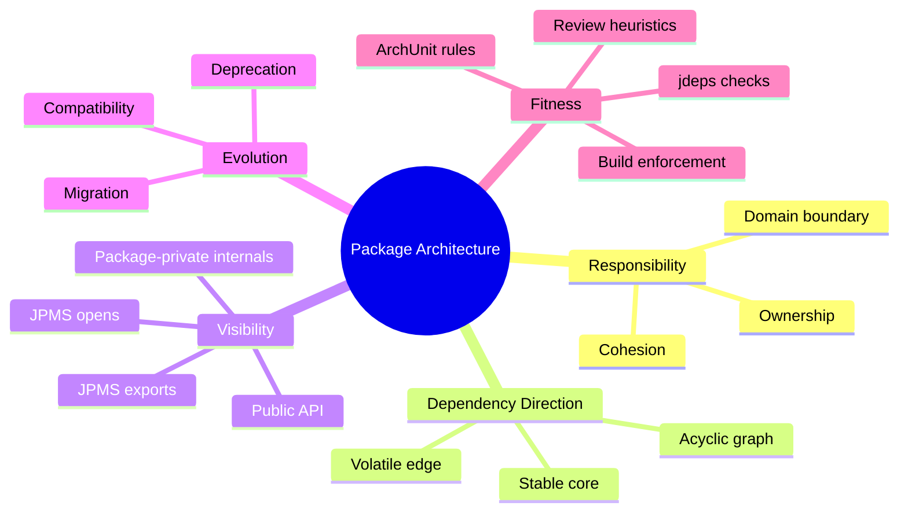
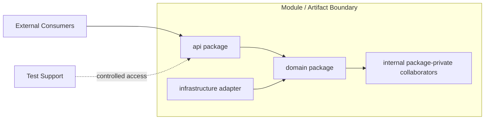
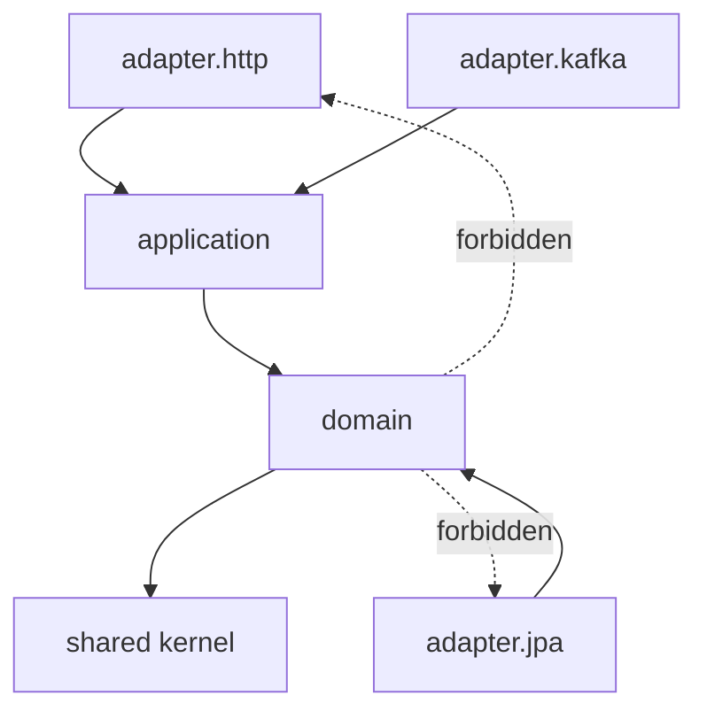
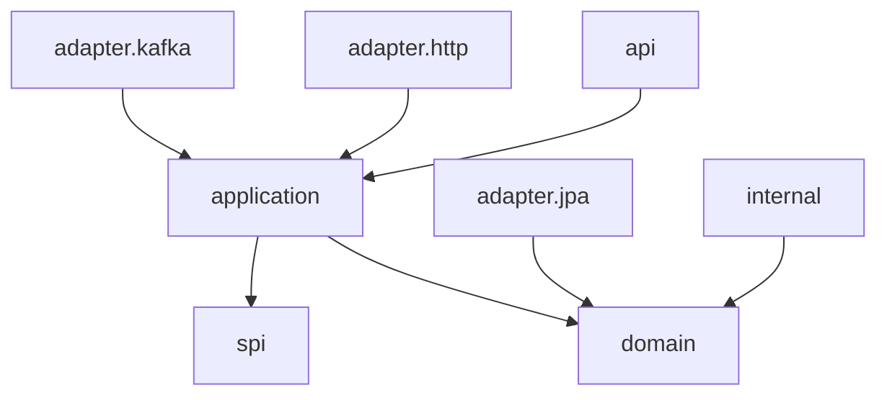
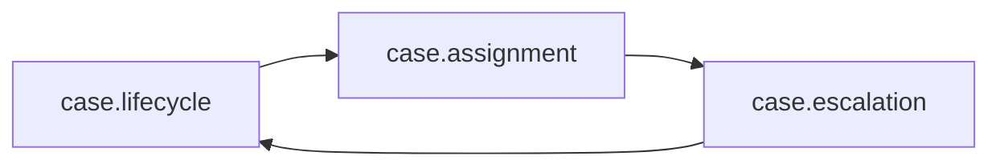
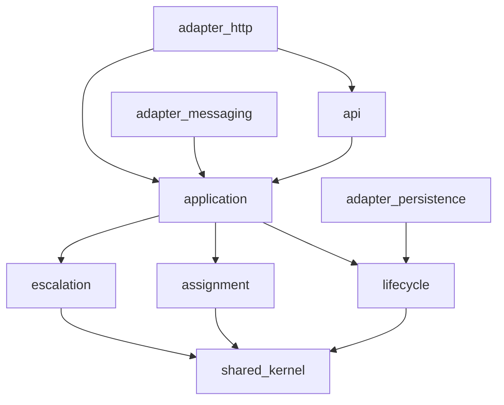

# Part 009 — Package Architecture and Architectural Fitness

> Target: mampu memperlakukan package bukan sebagai folder kosmetik, tetapi sebagai **boundary arsitektural yang bisa diuji, dibatasi, dan dievolusi**.

Pada level junior, package sering dianggap sekadar lokasi file. Pada level senior, package menjadi alat organisasi. Pada level staff/principal, package adalah **constraint system**: ia mengontrol coupling, visibility, evolusi API, surface area, modularity, testability, dan risiko dependency.

Materi ini tidak mengulang dasar `package`, `import`, atau access modifier dari part sebelumnya. Kita akan fokus pada pertanyaan arsitektural:

- Kapan sebuah package pantas ada?
- Apa invariant yang harus dijaga oleh package?
- Bagaimana package mencegah accidental API leak?
- Bagaimana mendeteksi package cycle sebelum menjadi design debt?
- Bagaimana package design berubah ketika memakai JPMS?
- Bagaimana membuat package architecture menjadi **fitness function**, bukan sekadar diagram?

---

## 1. Kaufman Framing: Skill yang Sedang Dilatih

Dalam pendekatan Josh Kaufman, kita tidak belajar “semua teori package”. Kita memecah skill besar menjadi sub-skill yang langsung meningkatkan performa engineering.

### 1.1 Target Performance

Setelah part ini, Anda harus bisa:

1. Mendesain package layout untuk library/framework/service Java tanpa menciptakan dependency spaghetti.
2. Memutuskan mana package yang menjadi public API, SPI, internal implementation, adapter, dan test support.
3. Menemukan package cycle dan menentukan refactoring yang tepat.
4. Menggunakan package-private sebagai mekanisme encapsulation, bukan sekadar default visibility.
5. Merancang package rules yang bisa diuji dengan ArchUnit, `jdeps`, build plugin, atau JPMS.
6. Membaca package structure sebagai peta tanggung jawab sistem.

### 1.2 Skill Decomposition



### 1.3 The 20-Hour Shortcut

Jangan mulai dari “struktur package ideal”. Mulai dari **failure modes**:

- `common`, `util`, `shared`, `base` menjadi tempat sampah dependency.
- API dan implementation bercampur sehingga semua class menjadi sulit diubah.
- Package cycle membuat layer tidak bermakna.
- Package terlalu teknis: `controller`, `service`, `repository`, `model`, tetapi domain boundary tidak terlihat.
- Package terlalu domain-ish tetapi tidak punya dependency rule.
- Test package membuka semua internals karena production boundary buruk.
- JPMS module mengekspor terlalu banyak package karena package design tidak disiplin.

Top 1% engineer biasanya tidak lebih hafal syntax. Mereka lebih cepat melihat **shape of dependency risk**.

---

## 2. Mental Model: Package sebagai Architectural Membrane

Package adalah membrane: ia menyatukan beberapa type yang memiliki alasan berubah yang sama, lalu membatasi apa yang boleh keluar dan masuk.



Package yang baik menjawab:

| Pertanyaan | Jawaban yang Harus Jelas |
|---|---|
| Apa tanggung jawab package ini? | Satu reason-to-change utama. |
| Siapa konsumennya? | External API, internal package lain, framework, tests, generated code. |
| Apa yang boleh dilihat keluar? | Type public, exported package, documented contract. |
| Apa yang harus tersembunyi? | Implementation detail, helper, state transition internals, generated machinery. |
| Apa arah dependency-nya? | Ke core/stable abstraction, bukan ke volatile implementation. |
| Bagaimana diuji? | Unit, contract test, architecture test, compatibility test. |

**Package bukan folder.** Folder adalah lokasi. Package adalah bagian dari nama type, visibility model, binary name, module export, dan runtime/classpath behavior.

---

## 3. Taxonomy Package untuk Engineering Besar

Dalam sistem besar, tidak semua package punya fungsi yang sama. Salah satu kesalahan umum adalah memakai struktur seragam untuk semua konteks.

### 3.1 API Package

Package yang dikonsumsi langsung oleh caller eksternal.

Contoh:

```text
com.acme.caseengine.api
com.acme.caseengine.api.command
com.acme.caseengine.api.query
com.acme.caseengine.api.error
```

Karakteristik:

- Public type minim.
- Nama sangat stabil.
- Tidak expose implementation class.
- Exception, enum, DTO, interface, dan builder-nya dirancang sebagai contract.
- Perubahan harus melewati compatibility review.

Contoh baik:

```java
package com.acme.caseengine.api;

public interface CaseLifecycleClient {
    TransitionResult transition(TransitionCommand command);
}
```

Contoh buruk:

```java
package com.acme.caseengine.api;

public interface CaseLifecycleClient {
    InternalWorkflowGraph graph();
    HibernateCaseEntity loadEntity(UUID id);
}
```

Masalahnya bukan syntax, tetapi API leak. Caller sekarang tergantung pada internal graph dan persistence representation.

### 3.2 SPI Package

SPI adalah package untuk extension provider, bukan end-user API.

```text
com.acme.caseengine.spi
com.acme.caseengine.spi.validation
com.acme.caseengine.spi.audit
```

Ciri SPI:

- Lebih sulit dievolusi karena provider mengimplementasikan interface.
- Harus punya compatibility discipline lebih ketat daripada API konsumsi biasa.
- Perubahan method abstract bisa merusak implementer source compatibility.
- Default method bisa membantu migration, tetapi tetap punya behavioral risk.

Contoh:

```java
package com.acme.caseengine.spi;

public interface TransitionPolicyProvider {
    boolean supports(PolicyContext context);
    TransitionPolicy create(PolicyContext context);
}
```

### 3.3 Internal Package

Internal package bukan berarti semua class harus package-private, tetapi public-nya tidak dimaksudkan sebagai API publik artifact.

```text
com.acme.caseengine.internal
com.acme.caseengine.internal.graph
com.acme.caseengine.internal.parser
```

Dengan JPMS, package internal idealnya **tidak diekspor**.

```java
module com.acme.caseengine {
    exports com.acme.caseengine.api;
    exports com.acme.caseengine.spi;
    // com.acme.caseengine.internal tidak diexport
}
```

Tanpa JPMS, convention `internal` hanya social contract. Dengan JPMS, ia bisa menjadi enforcement boundary.

### 3.4 Adapter Package

Adapter menghubungkan core dengan dunia luar.

```text
com.acme.caseengine.adapter.jpa
com.acme.caseengine.adapter.kafka
com.acme.caseengine.adapter.http
com.acme.caseengine.adapter.camunda
```

Rule penting: adapter boleh bergantung ke core API/domain, tetapi core tidak boleh bergantung ke adapter.



### 3.5 Test Support Package

Test support sering menjadi backdoor yang merusak design.

```text
com.acme.caseengine.testsupport
```

Guideline:

- Test support boleh public dalam artifact test-fixtures, bukan production artifact.
- Jangan membuka production internals hanya karena test sulit.
- Kalau test butuh terlalu banyak private access, mungkin package responsibility terlalu besar.

---

## 4. Package Cohesion: Satu Alasan untuk Berubah

Package cohesive jika type di dalamnya berubah karena alasan yang mirip.

### 4.1 Cohesion yang Baik

```text
com.acme.caseengine.lifecycle
  CaseState.java
  CaseTransition.java
  TransitionGuard.java
  TransitionPlan.java
  TransitionViolation.java
```

Semua class terkait lifecycle transition. Perubahan aturan lifecycle cenderung menyentuh area ini.

### 4.2 Cohesion yang Buruk

```text
com.acme.caseengine.common
  DateUtil.java
  JsonUtil.java
  CaseState.java
  JwtParser.java
  RetryPolicy.java
  CsvExporter.java
```

`common` biasanya bukan package, melainkan sinyal bahwa kita belum menemukan boundary konseptual.

### 4.3 Heuristic Cohesion

Tanyakan:

1. Jika satu type berubah, type mana lagi yang kemungkinan ikut berubah?
2. Apakah package ini bisa dijelaskan tanpa kata “misc”, “common”, “helper”, “manager”, atau “util”?
3. Apakah package ini punya vocabulary yang konsisten?
4. Apakah package ini mengandung lebih dari satu integration concern?
5. Apakah class di dalamnya saling kenal karena domain concept atau karena convenience?

---

## 5. Dependency Direction: Stable Core, Volatile Edge

Architecture package yang sehat biasanya berbentuk DAG, bukan mesh.



Prinsipnya:

- Core domain stabil dan tidak tahu delivery mechanism.
- API mengandung kontrak yang stabil.
- Adapter volatile berada di edge.
- Internal implementation boleh kompleks, tetapi tidak bocor ke public surface.
- Dependency dari stable ke volatile adalah smell.

### 5.1 Acyclic Dependency

Cycle membuat perubahan menyebar tanpa batas jelas.



Cycle berarti tidak ada urutan build/test/evolution yang bersih. Anda tidak punya tiga package; Anda punya satu package besar yang kebetulan dipecah folder.

### 5.2 Cara Memutus Cycle

Misal:

```text
lifecycle -> assignment -> escalation -> lifecycle
```

Strategi pemutusan:

| Strategi | Kapan Cocok | Contoh |
|---|---|---|
| Extract abstraction | Satu package butuh kontrak dari package lain, bukan implementation | `EscalationPolicy` dipindah ke `spi` atau `domain.policy`. |
| Merge package | Package sebenarnya satu konsep cohesive | Gabungkan `lifecycle` dan `escalation` jika selalu berubah bersama. |
| Introduce application service | Cycle terjadi karena orchestration salah tempat | Pindahkan koordinasi ke `application`. |
| Introduce event/notification | Package hanya perlu memberi sinyal, bukan memanggil langsung | `CaseTransitioned` event. |
| Move value object | Cycle terjadi karena shared value kecil | Pindahkan ke package core yang lebih stabil. |

Contoh refactoring:

```java
// Before: escalation depends on lifecycle implementation
package com.acme.caseengine.escalation;

import com.acme.caseengine.lifecycle.DefaultLifecycleEngine;

final class EscalationRunner {
    void run(DefaultLifecycleEngine engine) {
        engine.transition(...);
    }
}
```

```java
// After: escalation depends on stable contract
package com.acme.caseengine.lifecycle.api;

public interface CaseTransitionPort {
    TransitionResult transition(TransitionCommand command);
}
```

```java
package com.acme.caseengine.escalation;

import com.acme.caseengine.lifecycle.api.CaseTransitionPort;

final class EscalationRunner {
    void run(CaseTransitionPort transitions) {
        transitions.transition(...);
    }
}
```

---

## 6. Package-Private as Design Tool

Package-private bukan “lupa menulis public”. Ia adalah alat untuk membuat **micro-boundary**.

```java
package com.acme.caseengine.lifecycle;

public final class CaseLifecycle {
    private final TransitionGraph graph;

    public TransitionResult transition(TransitionCommand command) {
        TransitionPlan plan = graph.plan(command); // package-private collaborator
        return plan.execute();
    }
}
```

```java
package com.acme.caseengine.lifecycle;

final class TransitionGraph {
    TransitionPlan plan(TransitionCommand command) {
        // internal algorithm
    }
}
```

Di sini `TransitionGraph` bukan API. Caller hanya melihat `CaseLifecycle`.

### 6.1 Package-Private Testing

Test dalam package yang sama bisa menguji internals tanpa membuatnya public:

```java
package com.acme.caseengine.lifecycle;

class TransitionGraphTest {
    @Test
    void rejectsUnknownTransition() {
        TransitionGraph graph = new TransitionGraph(...);
        // direct test of package-private collaborator
    }
}
```

Namun ini harus digunakan dengan disiplin. Jika terlalu banyak test langsung ke internal class, public API mungkin tidak cukup ekspresif atau package terlalu besar.

---

## 7. JPMS: Package Architecture Menjadi Enforceable

JPMS membuat package decision berdampak langsung pada module descriptor.

```java
module com.acme.caseengine {
    exports com.acme.caseengine.api;
    exports com.acme.caseengine.spi;

    requires java.sql;

    uses com.acme.caseengine.spi.TransitionPolicyProvider;
}
```

### 7.1 `exports` vs `opens`

| Directive | Makna | Risiko |
|---|---|---|
| `exports` | Package bisa dipakai secara compile-time oleh module lain | Public type menjadi API module. |
| `exports ... to` | Export terbatas ke module tertentu | Coupling eksplisit ke consumer tertentu. |
| `opens` | Package dibuka untuk deep reflection | Framework bisa mengakses member non-public. |
| `opens ... to` | Reflection access terbatas | Lebih aman untuk framework tertentu. |
| `open module` | Semua package terbuka untuk reflection | Biasanya terlalu longgar untuk library serius. |

Rule praktis:

- Export hanya package API/SPI.
- Jangan export `internal`.
- Gunakan qualified `opens` untuk framework reflection.
- Hindari `open module` kecuali ada alasan kuat.
- Jika framework butuh reflection ke semua hal, pertimbangkan boundary module/package yang lebih eksplisit.

### 7.2 Split Package

Split package terjadi ketika package yang sama muncul di lebih dari satu artifact/module. Ini menyulitkan class loading, JPMS resolution, dan ownership.

Buruk:

```text
case-api.jar
  com.acme.caseengine.lifecycle.CaseLifecycle

case-impl.jar
  com.acme.caseengine.lifecycle.DefaultLifecycleEngine
```

Lebih baik:

```text
case-api.jar
  com.acme.caseengine.api.CaseLifecycleClient

case-impl.jar
  com.acme.caseengine.internal.lifecycle.DefaultLifecycleEngine
```

---

## 8. Architectural Fitness Functions

Package architecture yang hanya hidup di wiki akan membusuk. Ia perlu enforcement.

### 8.1 Fitness Function dengan ArchUnit

Contoh rule: adapter tidak boleh diakses oleh domain.

```java
import com.tngtech.archunit.core.importer.ClassFileImporter;
import com.tngtech.archunit.lang.syntax.ArchRuleDefinition;
import org.junit.jupiter.api.Test;

class PackageArchitectureTest {

    @Test
    void domainMustNotDependOnAdapters() {
        var classes = new ClassFileImporter()
                .importPackages("com.acme.caseengine");

        ArchRuleDefinition.noClasses()
                .that().resideInAPackage("..domain..")
                .should().dependOnClassesThat().resideInAnyPackage(
                        "..adapter..",
                        "..infrastructure.."
                )
                .check(classes);
    }
}
```

Rule: internal package tidak boleh dipakai dari luar module root tertentu.

```java
@Test
void internalPackageMustStayInternal() {
    var classes = new ClassFileImporter()
            .importPackages("com.acme.caseengine");

    ArchRuleDefinition.noClasses()
            .that().resideOutsideOfPackage("..caseengine.internal..")
            .should().dependOnClassesThat().resideInAnyPackage("..caseengine.internal..")
            .check(classes);
}
```

### 8.2 Fitness Function dengan `jdeps`

`jdeps` membantu melihat package/module dependencies dari class files atau JAR.

Contoh command:

```bash
jdeps --recursive --summary build/libs/caseengine.jar
jdeps --recursive --package com.acme.caseengine build/libs/caseengine.jar
```

Gunakan untuk:

- Menemukan dependency yang tidak disengaja.
- Melihat apakah artifact API bocor ke framework tertentu.
- Menganalisis migration ke JPMS.
- Memeriksa package dependency pada artifact besar.

### 8.3 Fitness Function di Build Review

Minimum checks untuk library/platform Java:

```text
[ ] Tidak ada package cycle.
[ ] Public API package tidak expose implementation class.
[ ] Package internal tidak dipakai consumer eksternal.
[ ] Package adapter tidak masuk ke domain/application core.
[ ] Tidak ada package bernama common/shared/util yang menjadi dumping ground.
[ ] JPMS exports hanya untuk API/SPI.
[ ] Reflection opens explicit dan qualified jika memungkinkan.
[ ] Dependency baru tidak membuat stable package bergantung ke volatile package.
```

---

## 9. Package Naming: Semantic Density

Nama package harus cukup stabil untuk bertahan lama. Nama package yang buruk membuat API terasa murah dan sulit dipahami.

### 9.1 Hindari Nama Berbasis Implementation Terlalu Dini

Buruk:

```text
com.acme.caseengine.mysql
com.acme.caseengine.kafka
com.acme.caseengine.redis
```

Jika ini memang adapter, lebih eksplisit:

```text
com.acme.caseengine.adapter.persistence.mysql
com.acme.caseengine.adapter.messaging.kafka
com.acme.caseengine.adapter.cache.redis
```

### 9.2 Hindari Technical Layer Murni pada Domain Kompleks

Buruk untuk domain besar:

```text
com.acme.caseengine.controller
com.acme.caseengine.service
com.acme.caseengine.repository
com.acme.caseengine.model
```

Masalah: package tidak menceritakan domain. Semua fitur bercampur di layer horizontal.

Lebih baik:

```text
com.acme.caseengine.lifecycle
com.acme.caseengine.assignment
com.acme.caseengine.escalation
com.acme.caseengine.audit
com.acme.caseengine.adapter.persistence
com.acme.caseengine.adapter.http
```

Namun jangan ekstrem. Untuk library teknis, package berbasis technical concern bisa tepat:

```text
com.acme.validation.parser
com.acme.validation.generator
com.acme.validation.runtime
```

### 9.3 Naming Rule

Gunakan nama package yang menunjukkan **reason to change**, bukan hanya jenis class.

---

## 10. Package Granularity

### 10.1 Too Coarse

```text
com.acme.caseengine
  280 classes
```

Masalah:

- Package-private tidak lagi efektif karena terlalu banyak type saling melihat.
- Tidak ada boundary internal.
- Dependency graph tidak terbaca.

### 10.2 Too Fine

```text
com.acme.caseengine.lifecycle.transition.guard.rule.expression.operator
```

Masalah:

- Banyak package dengan 1–2 class.
- Package-private tidak berguna.
- Navigasi dan refactoring mahal.
- Boundary palsu.

### 10.3 Good Enough Granularity

Package yang baik biasanya:

- Punya 5–30 type untuk area non-trivial.
- Bisa dijelaskan dalam satu kalimat.
- Punya internal collaborators yang tidak harus public.
- Memiliki dependency direction jelas.
- Bisa diberi architecture rule.

Angka bukan hukum. Tetapi jika package berisi 1 class atau 200 class, butuh justifikasi.

---

## 11. Dependency Smells dalam Package

### 11.1 The `common` Gravity Well

```text
com.acme.common
```

Smell:

- Semua package bergantung ke `common`.
- `common` mulai bergantung balik ke feature package.
- Utility berubah karena terlalu banyak alasan.
- API terlihat reusable tetapi sebenarnya domain-coupled.

Refactor:

```text
com.acme.caseengine.time
com.acme.caseengine.money
com.acme.caseengine.validation
com.acme.caseengine.text
```

Atau pisahkan artifact jika benar-benar reusable.

### 11.2 The `impl` Trap

```text
com.acme.caseengine.api
com.acme.caseengine.impl
```

Tidak selalu salah, tetapi sering terlalu kasar. `impl` tunggal menjadi black hole.

Lebih baik:

```text
com.acme.caseengine.internal.lifecycle
com.acme.caseengine.internal.parser
com.acme.caseengine.internal.generator
```

### 11.3 Framework-Centric Package

```text
com.acme.caseengine.spring
com.acme.caseengine.hibernate
```

Ini baik jika package tersebut adapter. Buruk jika domain core mulai tinggal di package framework.

### 11.4 Bidirectional Feature Dependency

```text
assignment -> lifecycle
lifecycle -> assignment
```

Biasanya orchestration salah tempat atau domain concept belum diekstrak.

---

## 12. Package Design untuk API, Internal, dan Generated Code

Metaprogramming dan code generation memperbesar pentingnya package design.

Contoh layout annotation processor/library:

```text
com.acme.rules.api
  Rule.java
  RuleEngine.java
  RuleContext.java

com.acme.rules.spi
  RulePlugin.java
  RuleMetadataProvider.java

com.acme.rules.runtime
  DefaultRuleEngine.java
  RuleInvoker.java

com.acme.rules.internal.model
  ParsedRule.java
  RuleGraph.java

com.acme.rules.internal.codegen
  RuleSourceGenerator.java
  GeneratedNameAllocator.java

com.acme.rules.processor
  RuleProcessor.java
```

Generated code sebaiknya punya package strategy jelas:

```text
com.acme.caseengine.generated
```

atau dekat dengan consumer:

```text
com.acme.caseengine.lifecycle.generated
```

Rule:

- Generated public API harus diperlakukan seperti public API biasa.
- Generated implementation sebaiknya internal/non-exported.
- Jangan membuat generated class menjadi dependency compile-time kecuali memang kontraknya stabil.
- Pastikan name collision policy deterministic.

---

## 13. Package Review Checklist

Gunakan checklist ini saat code review atau design review.

### 13.1 Responsibility

```text
[ ] Package bisa dijelaskan dalam satu kalimat.
[ ] Semua type punya alasan berubah yang mirip.
[ ] Tidak ada class yang hanya numpang karena convenience.
[ ] Nama package mencerminkan konsep, bukan sekadar tipe teknis class.
```

### 13.2 Dependency

```text
[ ] Dependency graph acyclic.
[ ] Core tidak bergantung pada adapter.
[ ] API tidak expose internal implementation.
[ ] Package stable tidak bergantung pada package volatile.
[ ] Tidak ada package yang menjadi dependency semua package tanpa reason kuat.
```

### 13.3 Visibility

```text
[ ] Class public benar-benar perlu public.
[ ] Helper/collaborator internal package-private.
[ ] Constructor public hanya jika instantiation memang bagian dari API.
[ ] JPMS exports minimal.
[ ] JPMS opens tidak lebih luas dari kebutuhan framework.
```

### 13.4 Evolution

```text
[ ] Package name cukup stabil untuk bertahan.
[ ] API/SPI/internal dipisah.
[ ] Deprecated migration path tersedia untuk public API lama.
[ ] Generated package punya compatibility policy.
```

---

## 14. Worked Example: Refactoring Package Architecture

### 14.1 Before

```text
com.acme.caseengine
  CaseController.java
  CaseService.java
  CaseRepository.java
  CaseEntity.java
  CaseMapper.java
  CaseUtil.java
  EscalationService.java
  AssignmentService.java
  KafkaPublisher.java
  StateMachine.java
  ValidationUtil.java
```

Masalah:

- Semua class dalam satu package.
- Package-private tidak berarti.
- API, domain, persistence, messaging, dan orchestration bercampur.
- Tidak ada rule dependency.

### 14.2 After

```text
com.acme.caseengine.api
  CaseLifecycleClient.java
  TransitionCommand.java
  TransitionResult.java
  CaseEngineException.java

com.acme.caseengine.application
  CaseLifecycleApplicationService.java
  AssignmentApplicationService.java

com.acme.caseengine.lifecycle
  CaseState.java
  TransitionGraph.java
  TransitionGuard.java
  TransitionViolation.java

com.acme.caseengine.assignment
  AssignmentPolicy.java
  AssigneeResolver.java

com.acme.caseengine.escalation
  EscalationPlan.java
  EscalationPolicy.java

com.acme.caseengine.adapter.http
  CaseLifecycleResource.java

com.acme.caseengine.adapter.persistence
  CaseEntity.java
  CaseRepository.java
  CaseMapper.java

com.acme.caseengine.adapter.messaging
  CaseEventPublisher.java
```

### 14.3 Dependency Rule



### 14.4 What Improved

| Before | After |
|---|---|
| Semua saling melihat | Boundary terlihat |
| Package-private tidak efektif | Internal collaborator bisa tersembunyi |
| API mudah bocor | API package eksplisit |
| Framework masuk ke core | Adapter di edge |
| Sulit enforce | Bisa dibuat ArchUnit rule |

---

## 15. Practice Loop

Latihan ini dirancang seperti Kaufman: deliberate, small feedback loop, langsung memperbaiki performa.

### Exercise 1 — Package Boundary Audit

Ambil satu module/service/library Anda. Buat tabel:

| Package | Responsibility | Public Types | Incoming Dependencies | Outgoing Dependencies | Smell |
|---|---|---:|---:|---:|---|
| `...` | `...` | `...` | `...` | `...` | `...` |

Cari:

- Package dengan terlalu banyak public type.
- Package dengan terlalu banyak outgoing dependency.
- Package yang dipakai semua orang.
- Package bernama `common`, `util`, `shared`, `base`.
- Package cycle.

### Exercise 2 — Define Package Rules

Tulis 5 rule:

```text
1. ..domain.. tidak boleh bergantung pada ..adapter..
2. ..api.. tidak boleh bergantung pada ..internal..
3. ..internal.. tidak boleh diakses dari luar root module.
4. ..adapter.persistence.. tidak boleh dipakai oleh ..adapter.http..
5. ..spi.. tidak boleh bergantung pada ..runtime..
```

Implementasikan minimal 2 dengan ArchUnit.

### Exercise 3 — Public Surface Reduction

Pilih satu package dan ubah:

- 3 class public menjadi package-private.
- 2 constructor public menjadi static factory di API facade.
- 1 helper public menjadi internal collaborator.

Lihat apakah test masih bisa lewat. Jika tidak, evaluasi apakah test terlalu coupled ke internals.

---

## 16. Common Interview/Design Review Questions

### Q1: “Apa bedanya package architecture dan module architecture?”

Package adalah namespace dan visibility grouping di level Java language. Module adalah unit dependensi, readability, exports, opens, services, dan runtime layer sejak JPMS. Module mengontrol package mana yang visible ke module lain, tetapi kualitas module sangat bergantung pada kualitas package di dalamnya.

### Q2: “Apakah package-by-feature selalu lebih baik daripada package-by-layer?”

Tidak. Untuk domain application besar, package-by-feature sering lebih baik karena boundary domain terlihat. Untuk library teknis, package-by-layer/concern bisa valid. Kuncinya bukan template, tetapi dependency direction dan reason-to-change.

### Q3: “Kapan class harus package-private?”

Ketika class hanya collaborator internal dari package dan tidak dimaksudkan sebagai contract untuk caller luar. Ini terutama berlaku untuk parser internals, validators, planners, graph nodes, adapters helper, generated machinery, dan algorithm steps.

### Q4: “Apakah `internal` package benar-benar melindungi class?”

Tanpa JPMS, tidak secara teknis. Itu convention. Dengan JPMS, package internal yang tidak diekspor tidak visible secara normal ke module lain. Reflection masih punya aturan sendiri melalui `opens`.

### Q5: “Apa tanda package cycle harus dipecah, bukan digabung?”

Jika dua package punya reason-to-change berbeda, tetapi cycle muncul karena orchestration, policy, atau shared value object, pecah dengan abstraction/application service/event/value extraction. Jika keduanya selalu berubah bersama dan vocabulary-nya sama, gabungkan.

---

## 17. Part Summary

Package architecture adalah mekanisme untuk mengubah struktur code menjadi design constraint.

Takeaways:

1. Package adalah architectural membrane, bukan folder.
2. Public package adalah API liability.
3. Package-private adalah alat desain, bukan default kebetulan.
4. Dependency graph harus acyclic dan punya arah stabil.
5. `common/shared/util` sering menunjukkan boundary yang belum ditemukan.
6. JPMS membuat package exports/opens menjadi kontrak nyata.
7. Architecture harus diuji dengan fitness function, bukan hanya dijelaskan di diagram.
8. Package design yang baik mengurangi biaya API evolution.

Next: kita akan membahas **Public API Evolution and Compatibility** — bagaimana mengubah API Java tanpa mematahkan binary, source, dan behavioral contract.

---

## References

- Java Language Specification, Java SE 25 Edition — Packages, Names, Access Control, and Binary Compatibility.
- Java SE 25 API Documentation — `java.lang`, `Module`, `Package`, `ClassLoader`.
- Java Platform Module System concepts: `exports`, `opens`, module readability, services.
- ArchUnit documentation and common architecture testing practices.
- JDK `jdeps` tool documentation for dependency analysis.
